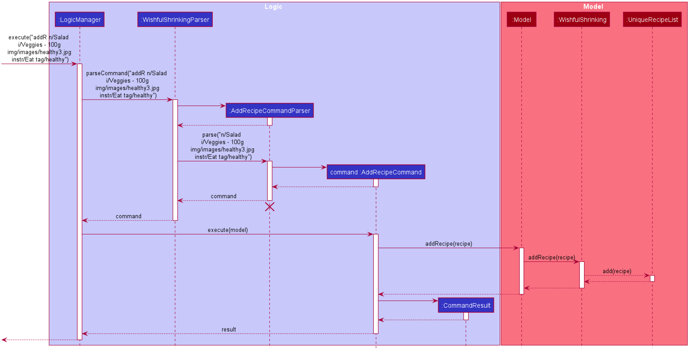

* Table of Contents
{:toc}

--------------------------------------------------------------------------------------------------------------------

## **Setting up, getting started**

Refer to the guide [_Setting up and getting started_](SettingUp.md).

--------------------------------------------------------------------------------------------------------------------

## **Design**

### Architecture

The ***Architecture Diagram*** given above explains the high-level design of the App. Given below is a quick overview of each component.

:bulb: **Tip:** The `.puml` files used to create diagrams in this document can be found in the [diagrams](https://github.com/se-edu/addressbook-level3/tree/master/docs/diagrams/) folder. Refer to the [_PlantUML Tutorial_ at se-edu/guides](https://se-education.org/guides/tutorials/plantUml.html) to learn how to create and edit diagrams.

**`Main`** has two classes called [`Main`](https://github.com/se-edu/addressbook-level3/tree/master/src/main/java/seedu/address/Main.java) and [`MainApp`](https://github.com/se-edu/addressbook-level3/tree/master/src/main/java/seedu/address/MainApp.java). It is responsible for,
* At app launch: Initializes the components in the correct sequence, and connects them up with each other.
* At shut down: Shuts down the components and invokes cleanup methods where necessary.

[**`Commons`**](#common-classes) represents a collection of classes used by multiple other components.

The rest of the App consists of four components.

* [**`UI`**](#ui-component): The UI of the App.
* [**`Logic`**](#logic-component): The command executor.
* [**`Model`**](#model-component): Holds the data of the App in memory.
* [**`Storage`**](#storage-component): Reads data from, and writes data to, the hard disk.

Each of the four components,

* defines its *API* in an `interface` with the same name as the Component.
* exposes its functionality using a concrete `{Component Name}Manager` class (which implements the corresponding API `interface` mentioned in the previous point.

For example, the `Logic` component (see the class diagram given below) defines its API in the `Logic.java` interface and exposes its functionality using the `LogicManager.java` class which implements the `Logic` interface.

**How the architecture components interact with each other**

The *Sequence Diagram* below shows how the components interact with each other for the scenario where the user issues the command `delete 1`.

The sections below give more details of each component.

### UI component

**API** :
[`Ui.java`](https://github.com/se-edu/addressbook-level3/tree/master/src/main/java/seedu/address/ui/Ui.java)

The UI consists of a `MainWindow` that is made up of parts e.g.`CommandBox`, `ResultDisplay`, `RecipeListPanel`,`IngredientListPanel`,`ConsumptionListPanel`, `StatusBarFooter` etc. All these, including the `MainWindow`, inherit from the abstract `UiPart` class.

The `UI` component uses JavaFx UI framework and JFoenix components. The layout of these UI parts are defined in matching `.fxml` files that are in the `src/main/resources/view` folder. For example, the layout of the [`MainWindow`](https://github.com/se-edu/addressbook-level3/tree/master/src/main/java/seedu/address/ui/MainWindow.java) is specified in [`MainWindow.fxml`](https://github.com/se-edu/addressbook-level3/tree/master/src/main/resources/view/MainWindow.fxml)

The `UI` component,

* Executes user commands using the `Logic` component.
* Listens for changes to `Model` data so that the UI can be updated with the modified data.

### Logic component

**API** :
[`Logic.java`](https://github.com/se-edu/addressbook-level3/tree/master/src/main/java/seedu/address/logic/Logic.java)

1. `Logic` uses the `WishfulShrinkingParser` class to parse the user command.
1. This results in a `Command` object which is executed by the `LogicManager`.
1. The command execution can affect the `Model` (e.g. adding a recipe).
1. The result of the command execution is encapsulated as a `CommandResult` object which is passed back to the `Ui`.
1. In addition, the `CommandResult` object can also instruct the `Ui` to perform certain actions, such as displaying help to the user.

Given below is the Sequence Diagram for interactions within the `Logic` component for the `execute("delete 1")` API call.

:information_source: **Note:** The lifeline for `DeleteCommandParser` should end at the destroy marker (X) but due to a limitation of PlantUML, the lifeline reaches the end of diagram.

### Model component

**API** : [`Model.java`](https://github.com/se-edu/addressbook-level3/tree/master/src/main/java/seedu/address/model/Model.java)

The `Model`,

* stores a `UserPref` object that represents the user’s preferences.
* stores the address book data.
* exposes an unmodifiable `ObservableList<Recipe>` that can be 'observed' e.g. the UI can be bound to this list so that the UI automatically updates when the data in the list change.
* does not depend on any of the other three components.

:information_source: **Note:** An alternative (arguably, a more OOP) model is given below. It has a `Tag` list in the `WishfulShrinking`, which `Recipe` references. This allows `WishfulShrinking` to only require one `Tag` object per unique `Tag`, instead of each `Recipe` needing their own `Tag` object. 

### Storage component

**API** : [`Storage.java`](https://github.com/se-edu/addressbook-level3/tree/master/src/main/java/seedu/address/storage/Storage.java)

The `Storage` component,
* can save `UserPref` objects in json format and read it back.
* can save the address book data in json format and read it back.

### Common classes

Classes used by multiple components are in the `seedu.addressbook.commons` package.

--------------------------------------------------------------------------------------------------------------------

## **Implementation**

This section describes some noteworthy details on how certain features are implemented.

### Add recipe feature

#### Proposed Implementation

The proposed undo/redo mechanism is facilitated by `AddRecipeCommand`. It extends `Command`.

* `AddRecipeCommand#execute()`: Do validity check then add recipe into model if passed.

These operations are exposed in the `Command` interface as `Command#execute()`.
The following sequence diagram shows how the undo operation works:

#### Design consideration:
* Workflow must be consistent with other adding commands e.g add ingredients, consumption.

### \[Proposed\] Data archiving

_{Explain here how the data archiving feature will be implemented}_

--------------------------------------------------------------------------------------------------------------------

## **Documentation, logging, testing, configuration, dev-ops**

* [Documentation guide](Documentation.md)
* [Testing guide](Testing.md)
* [Logging guide](Logging.md)
* [Configuration guide](Configuration.md)
* [DevOps guide](DevOps.md)

--------------------------------------------------------------------------------------------------------------------

## **Appendix: Requirements**

### Product scope

**Target user profile**:

* has a need to better manage diet
* has personal recipes
* prefer desktop apps over other types
* can type fast
* prefers typing to mouse interactions
* is reasonably comfortable using CLI apps

**Value proposition**: manage diet faster than a typical mouse/GUI driven app

### User stories

Priorities: High (must have) - `* * *`, Medium (nice to have) - `* *`, Low (unlikely to have) - `*`

| Priority | As a...           | Who...                                                        | I want to...                                                           | So that I can...                                                                      |
|----------|-------------------|---------------------------------------------------------------|------------------------------------------------------------------------|---------------------------------------------------------------------------------------|
|          | Potential user    | wants to work towards being healthier                         | be able to find out and read about the product before using it         | gauge if it is suitable before spending time to install it                            |
|          | Potential user    | busy and wants convenience                                    | be able to read clearly how to install and run the app                 | save time and effort on the initial set up                                            |
|          | Potential user    | busy and wants efficiency                                     | be able to read how to best use the product                            | I do not waste time and effort trying to figure out how to optimally use it           |
|          | Potential user    | is more visual                                                | be able to see the app populated with sample data                      | easily see and learn how the app will look like when in use                           |
| ***      | Potential user    | wants gather my recipes                                       | add my recipes onto the computer                                       | save my recipes in one location                                                       |
| ***      | Potential user    | has many recipes                                              | view my created recipes easily                                         | better manage all my recipes                                                          |
|          | Potential user    | is flexible                                                   | edit my added recipes according to my preference                       | save my ideal, personal recipes                                                       |
| ***      | Potential user    | wants to have a tidy recipe collection                        | delete existing recipes                                                | better select my recipes that are ideal for my personal diet                          |
| **       | Potential user    | lack healthy recipe resources                                 | have access to resources of healthy recipes                            | follow through balanced recipes to improve my diet                                    |
|          | Potential user    | is too busy to look for my ideal recipe                       | have recipe reommendations                                             | explore recipes that are personalised to me and my diet                               |
| ***      | Potential user    | is forgetful                                                  | keep track of items in my fridge                                       | make the most out of the fresh ingredients in my fridge                               |
| ***      | Potential user    | wants to minimise time taken to choose a recipe               | easily view all my available ingredients at a glance                   | quickly choose a suitable recipe                                                      |
|          | Potential user    | wants to be precise                                           | edit my ingredients in the fridge                                      | have an accurate list of ingredients in the fridge database that mimcs my real fridge |
| ***      | Potential user    | wants to be organised                                         | remove ingredients from fridge                                         | have an updated list of ingredients in my fridge                                      |
| *        | Potential user    | find it hard to keep track of my diet                         | track my food intake and calories                                      | better manage my daily diet                                                           |
|          | Intermediate user | proficient in typing and using computers                      | to utilises my typing and computers skills such as on a CLI            | efficiently use the app to manage my diet                                             |
|          | Intermediate user | likes aesthetics and cooking                                  | use a diet app that has impressive UI, smooth animations and effects   | have a good user experience navigating the app                                        |
|          | Intermediate user | wants convenience in choosing suitable recipes                | know what ingredients I am missing from a recipe                       | know which ingredients to buy to follow a recipe                                      |
|          | Intermediate user | wants to cook a meal but is limited by my ingredients variety | browse recipes that only use the ingredients I have                    | more easily select and follow a recipe                                                |
|          | Intermediate user | is seeking customizable recipes                               | customise and save the supplied recipes in the database                | personalise every recipe for my specific diet                                         |
|          | Intermediate user | want to make more efficient use of my time                    | filter for recipes that can be pre-cooked ahead of time                | plan and cook meals ahead of time to save time spent on cooking                       |
|          | Intermediate user | wants a meal that can be quickly prepared                     | easily search for a recipe that has short preparation and cooking time | quickly cook and enjoy my meal                                                        |
| **       | Intermediate user | wants to manage my ingredients                                | easily find the ingredients i want                                     | quickly find ingredients and save time on home cooking                                |
|          | Intermediate user | wants to be healthier                                         | create my diet plan                                                    | better stick to a healthy diet.                                                       |
|          | Intermediate user | keen on following a certain diet                              | keep track of my recipes for that specific diet                        | better stick to my diet plan                                                          |
|          | Intermediate user | organise my diet plan                                         | remove recipes that do not belong in a certain diet plan               | have a neat and accurate diet plan                                                    |
|          | Intermediate user | want to track my diet progress                                | want to view my calorie and food intake statistics                     | review my diet and work on being even healthier                                       |
| *        | Expert user       | is forgetful                                                  | have a table of commands and shortcuts                                 | use the app more effieciently.                                                        |
|          | Expert user       | is organized                                                  | group recipes into labelled sections by adding tags                    | easily find recipes of the same section                                               |
|          | Expert user       | is neat                                                       | remove recipes from labelled sections                                  | avoid each section being cluttered with recipes that don't belong in the section      |
|          | Expert user       | like to browse recipe                                         | filter the recipe base by my tags                                      | browse the recipe easily                                                              |
|          | Expert user       | likes convenience                                             | be able to export the recipes in the app to another device             | refer to the data from another device and share it with others                        |
|          | Expert user       | is a developer                                                | customize the app to my own preferences                                | contribute and extend the app further                                                 |

*{More to be added}*

### Use cases

(For all use cases below, the **System** is the `WishfulShrinking` and the **Actor** is the `user`, unless specified otherwise)

**Use case: Delete a recipe**

**MSS**

1.  User requests to list recipes
2.  WishfulShrinking shows a list of recipes
3.  User requests to delete a specific recipe in the list
4.  WishfulShrinking deletes the recipe
(For all use cases below, the **System** is `Wishful Shrinking` and the **Actor** is the `user`, unless specified otherwise)

**Use case: Add ingredients**

**MSS**

  1. User chooses to add ingredients into the fridge.
  2. Wishful Shrinking adds the specified ingredients into the fridge.

     Use case ends.
	
**Use case: Add a recipe**

**MSS**

  1. User chooses to add a recipe to the list of recipes.
  2. Wishful Shrinking adds the recipe to the list of recipes.

     Use case ends.
	  
**Use case: View ingredients**

**MSS**

  1. User requests to view all ingredients that are in the fridge.
  2. Wishful Shrinking lists all the ingredients that are in the fridge.

     Use case ends.

**Extensions**

* 2a. The fridge is empty.

  Use case ends.  
  
 **Use case: View recipes**

**MSS**

  1. User requests to view all recipes that are in the recipe collection.
  2. Wishful Shrinking lists all the recipes that are in the recipe collection, with their respective ingredients.

     Use case ends.

**Extensions**

* 2a. The list of recipes is empty.

  Use case ends.  
	  
**Use case: Delete an ingredient**

**MSS**

  1. User requests to view the ingredients in the fridge.
  2. Wishful Shrinker shows a list of ingredients that are in the fridge.
  3. User requests to delete a specific ingredient in the list.
  4. Wishful Shrinking deletes the ingredient.

     Use case ends.

**Extensions**

* 2a. The fridge is empty.

  Use case ends.

* 3a. The given index is invalid.

    * 3a1. Wishful Shrinking shows an error message.

      Use case resumes at step 2.
	  
**Use case: Delete a recipe**

**MSS**

  1. User requests to view the recipes in the recipe collection.
  2. Wishful Shrinker shows a list of recipes that are in the recipe collection.
  3. User requests to delete a specific recipe in the list.
  4. Wishful Shrinking deletes the recipe.

     Use case ends.

**Extensions**

* 2a. The list of recipes is empty.

  Use case ends.

* 3a. The given index is invalid.

    * 3a1. WishfulShrinking shows an error message.

      Use case resumes at step 2.
	  
**Use case: Search for ingredient**

**MSS**

  1. User wants to search for ingredients by their name in the fridge.
  2. Wishful Shrinking lists the ingredients in the fridge that has the specified name, if present.

     Use case ends.
	
**Use case: Search for recipe**

**MSS**

  1. User wants to search for recipes by their title in the recipe collection.
  2. Wishful Shrinking lists the recipes that has the specified title, if present.

  Use case ends.
	
**Use case: Track calories**

**MSS**

  1. User wants to keep track of the food that they have eaten.
  2. Wishful Shrinking adds the recipes that the user has input to the calorie tracker.

     Use case ends.

**Use case: View help**

**MSS**

  1. User wants to view all valid commands they can use.
  2. Wishful Shrinking shows all valid commands.

     Use case ends.

*{More to be added}*

### Non-Functional Requirements

1.  Should work on any _mainstream OS_ as long as it has Java `11` or above installed.
2.  Should be able to hold up to 1000 recipes and ingredients without a noticeable sluggishness in performance for typical usage.
3.  Reserve an amount of 5MB memory for the baseline recipe data.
4.  A user with above average typing speed for regular English text (i.e. not code, not system admin commands) should be able to accomplish most of the tasks faster using commands than using the mouse.  
5.  Searching-related features might be slow if there are more than 2000 recipes or ingredients in the database.
6.  The application does not need internet connection.
7.  The application uses local database.
8.  The local database will be immediately updated after each updating command.

### Glossary

* **Mainstream OS**: Windows, Linux, Unix, OS-X
* **Fridge**: A personalised storage that contains all the ingredients that a user has
* **Recipe**: A set of cooking instructions that describes how to prepare a meal and ingredients required
* **Ingredient**: Foods that can be used to prepare a particular dish according to a recipe
* **Consumption**: A counter which calculates and displays the calorie intake of a user based on the recipes consumed

--------------------------------------------------------------------------------------------------------------------

## **Appendix: Instructions for manual testing**

Given below are instructions to test the app manually.

:information_source: **Note:** These instructions only provide a starting point for testers to work on;
testers are expected to do more *exploratory* testing.

### Launch and shutdown

1. Initial launch

   1. Download the jar file and copy into an empty folder

   1. Double-click the jar file Expected: Shows the GUI with a set of sample contacts. The window size may not be optimum.

1. Saving window preferences

   1. Resize the window to an optimum size. Move the window to a different location. Close the window.

   1. Re-launch the app by double-clicking the jar file. 
       Expected: The most recent window size and location is retained.

1. _{ more test cases …​ }_

### Deleting a recipe

1. Deleting a recipe while all recipes are being shown

   1. Prerequisites: List all recipes using the `list` command. Multiple recipes in the list.

   1. Test case: `delete 1` 
      Expected: First contact is deleted from the list. Details of the deleted contact shown in the status message. Timestamp in the status bar is updated.

   1. Test case: `delete 0` 
      Expected: No recipe is deleted. Error details shown in the status message. Status bar remains the same.

   1. Other incorrect delete commands to try: `delete`, `delete x`, `...` (where x is larger than the list size) 
      Expected: Similar to previous.

1. _{ more test cases …​ }_

### Saving data

1. Dealing with missing/corrupted data files

   1. _{explain how to simulate a missing/corrupted file, and the expected behavior}_

1. _{ more test cases …​ }_
