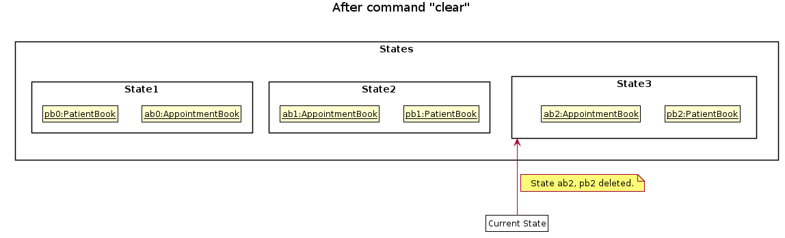

* Table of Contents
{:toc}

--------------------------------------------------------------------------------------------------------------------

## **Setting up, getting started**

Refer to the guide [_Setting up and getting started_](SettingUp.md).

--------------------------------------------------------------------------------------------------------------------

## **Design**

### Architecture

The ***Architecture Diagram*** given above explains the high-level design of the App. Given below is a quick overview of each component.

:bulb: **Tip:** The `.puml` files used to create diagrams in this document can be found in the [diagrams](https://github.com/se-edu/addressbook-level3/tree/master/docs/diagrams/) folder. Refer to the [_PlantUML Tutorial_ at se-edu/guides](https://se-education.org/guides/tutorials/plantUml.html) to learn how to create and edit diagrams.

**`Main`** has two classes called [`Main`](https://github.com/se-edu/addressbook-level3/tree/master/src/main/java/seedu/address/Main.java) and [`MainApp`](https://github.com/se-edu/addressbook-level3/tree/master/src/main/java/seedu/address/MainApp.java). It is responsible for,
* At app launch: Initializes the components in the correct sequence, and connects them up with each other.
* At shut down: Shuts down the components and invokes cleanup methods where necessary.

[**`Commons`**](#common-classes) represents a collection of classes used by multiple other components.

The rest of the App consists of four components.

* [**`UI`**](#ui-component): The UI of the App.
* [**`Logic`**](#logic-component): The command executor.
* [**`Model`**](#model-component): Holds the data of the App in memory.
* [**`Storage`**](#storage-component): Reads data from, and writes data to, the hard disk.

Each of the four components,

* defines its *API* in an `interface` with the same name as the Component.
* exposes its functionality using a concrete `{Component Name}Manager` class (which implements the corresponding API `interface` mentioned in the previous point.

For example, the `Logic` component (see the class diagram given below) defines its API in the `Logic.java` interface and exposes its functionality using the `LogicManager.java` class which implements the `Logic` interface.

**How the architecture components interact with each other**

The *Sequence Diagram* below shows how the components interact with each other for the scenario where the user issues the command `delete 1`.

The sections below give more details of each component.

### UI component

**API** :
[`Ui.java`](https://github.com/se-edu/addressbook-level3/tree/master/src/main/java/seedu/address/ui/Ui.java)

The UI consists of a `MainWindow` that is made up of parts e.g.`CommandBox`, `ResultDisplay`, `ProjectListPanel`, `StatusBarFooter` etc. All these, including the `MainWindow`, inherit from the abstract `UiPart` class.

The `UI` component uses JavaFx UI framework. The layout of these UI parts are defined in matching `.fxml` files that are in the `src/main/resources/view` folder. For example, the layout of the [`MainWindow`](https://github.com/se-edu/addressbook-level3/tree/master/src/main/java/seedu/address/ui/MainWindow.java) is specified in [`MainWindow.fxml`](https://github.com/se-edu/addressbook-level3/tree/master/src/main/resources/view/MainWindow.fxml)

The `UI` component,

* Executes user commands using the `Logic` component.
* Listens for changes to `Model` data so that the UI can be updated with the modified data.

### Logic component

**API** :
[`Logic.java`](https://github.com/se-edu/addressbook-level3/tree/master/src/main/java/seedu/address/logic/Logic.java)

1. `Logic` uses the `MainCatalogueParser` class to parse the user command.
1. This results in a `Command` object which is executed by the `LogicManager`.
1. The command execution can affect the `Model` (e.g. adding a project).
1. The result of the command execution is encapsulated as a `CommandResult` object which is passed back to the `Ui`.
1. In addition, the `CommandResult` object can also instruct the `Ui` to perform certain actions, such as displaying help to the user.

Given below is the Sequence Diagram for interactions within the `Logic` component for the `execute("delete 1")` API call.

:information_source: **Note:** The lifeline for `DeleteCommandParser` should end at the destroy marker (X) but due to a limitation of PlantUML, the lifeline reaches the end of diagram.

### Model component

**API** : [`Model.java`](https://github.com/se-edu/addressbook-level3/tree/master/src/main/java/seedu/address/model/Model.java)

The `Model`,

* stores a `UserPref` object that represents the user’s preferences.
* stores the main catalogue data.
* exposes an unmodifiable `ObservableList<Project>` that can be 'observed' e.g. the UI can be bound to this list so that the UI automatically updates when the data in the list change.
* does not depend on any of the other three components.

:information_source: **Note:** An alternative (arguably, a more OOP) model is given below. It has a `Tag` list in the `MainCatalogue`, which `Project` references. This allows `MainCatalogue` to only require one `Tag` object per unique `Tag`, instead of each `Project` needing their own `Tag` object. 

### Storage component

**API** : [`Storage.java`](https://github.com/se-edu/addressbook-level3/tree/master/src/main/java/seedu/address/storage/Storage.java)

The `Storage` component,
* can save `UserPref` objects in json format and read it back.
* can save the main catalogue data in json format and read it back.

### Common classes

Classes used by multiple components are in the `seedu.addressbook.commons` package.

--------------------------------------------------------------------------------------------------------------------

## **Implementation**

This section describes some noteworthy details on how certain features are implemented.

### \[Proposed\] Undo/redo feature

#### Proposed Implementation

The proposed undo/redo mechanism is facilitated by `VersionedMainCatalogue`. It extends `MainCatalogue` with an undo/redo history, stored internally as an `mainCatalogueStateList` and `currentStatePointer`. Additionally, it implements the following operations:

* `VersionedMainCatalogue#commit()` — Saves the current main catalogue state in its history.
* `VersionedMainCatalogue#undo()` — Restores the previous main catalogue state from its history.
* `VersionedMainCatalogue#redo()` — Restores a previously undone main catalogue state from its history.

These operations are exposed in the `Model` interface as `Model#commitMainCatalogue()`, `Model#undoMainCatalogue()` and `Model#redoMainCatalogue()` respectively.

Given below is an example usage scenario and how the undo/redo mechanism behaves at each step.

Step 1. The user launches the application for the first time. The `VersionedMainCatalogue` will be initialized with the initial main catalogue state, and the `currentStatePointer` pointing to that single main catalogue state.

Step 2. The user executes `delete 5` command to delete the 5th project in the main catalogue. The `delete` command calls `Model#commitMainCatalogue()`, causing the modified state of the main catalogue after the `delete 5` command executes to be saved in the `mainCatalogueStateList`, and the `currentStatePointer` is shifted to the newly inserted main catalogue state.

Step 3. The user executes `add n/David …​` to add a new project. The `add` command also calls `Model#commitMainCatalogue()`, causing another modified main catalogue state to be saved into the `mainCatalogueStateList`.

:information_source: **Note:** If a command fails its execution, it will not call `Model#commitMainCatalogue()`, so the main catalogue state will not be saved into the `mainCatalogueStateList`.

Step 4. The user now decides that adding the project was a mistake, and decides to undo that action by executing the `undo` command. The `undo` command will call `Model#undoMainCatalogue()`, which will shift the `currentStatePointer` once to the left, pointing it to the previous main catalogue state, and restores the main catalogue to that state.

:information_source: **Note:** If the `currentStatePointer` is at index 0, pointing to the initial MainCatalogue state, then there are no previous MainCatalogue states to restore. The `undo` command uses `Model#canUndoMainCatalogue()` to check if this is the case. If so, it will return an error to the user rather
than attempting to perform the undo.

The following sequence diagram shows how the undo operation works:

:information_source: **Note:** The lifeline for `UndoCommand` should end at the destroy marker (X) but due to a limitation of PlantUML, the lifeline reaches the end of diagram.

The `redo` command does the opposite — it calls `Model#redoMainCatalogue()`, which shifts the `currentStatePointer` once to the right, pointing to the previously undone state, and restores the main catalogue to that state.

:information_source: **Note:** If the `currentStatePointer` is at index `mainCatalogueStateList.size() - 1`, pointing to the latest main catalogue state, then there are no undone MainCatalogue states to restore. The `redo` command uses `Model#canRedoMainCatalogue()` to check if this is the case. If so, it will return an error to the user rather than attempting to perform the redo.

Step 5. The user then decides to execute the command `list`. Commands that do not modify the main catalogue, such as `list`, will usually not call `Model#commitMainCatalogue()`, `Model#undoMainCatalogue()` or `Model#redoMainCatalogue()`. Thus, the `mainCatalogueStateList` remains unchanged.

Step 6. The user executes `clear`, which calls `Model#commitMainCatalogue()`. Since the `currentStatePointer` is not pointing at the end of the `mainCatalogueStateList`, all main catalogue states after the `currentStatePointer` will be purged. Reason: It no longer makes sense to redo the `add n/David …​` command. This is the behavior that most modern desktop applications follow.

The following activity diagram summarizes what happens when a user executes a new command:

#### Design consideration:

##### Aspect: How undo & redo executes

* **Alternative 1 (current choice):** Saves the entire main catalogue.
  * Pros: Easy to implement.
  * Cons: May have performance issues in terms of memory usage.

* **Alternative 2:** Individual command knows how to undo/redo by
  itself.
  * Pros: Will use less memory (e.g. for `delete`, just save the project being deleted).
  * Cons: We must ensure that the implementation of each individual command are correct.

_{more aspects and alternatives to be added}_

### \[Proposed\] Data archiving

_{Explain here how the data archiving feature will be implemented}_

--------------------------------------------------------------------------------------------------------------------

## **Documentation, logging, testing, configuration, dev-ops**

* [Documentation guide](Documentation.md)
* [Testing guide](Testing.md)
* [Logging guide](Logging.md)
* [Configuration guide](Configuration.md)
* [DevOps guide](DevOps.md)

--------------------------------------------------------------------------------------------------------------------

## **Appendix: Requirements**

### Product scope

**Target user profile**:

* team leader managing software projects
* has a growing number of projects and team members to manage
* prefer desktop apps over mobile apps 
* can type fast
* prefers typing to mouse interactions
* is tech-savvy and reasonably comfortable using CLI apps

**Value proposition**: manage projects, team members, and tasks on a unified platform as opposed to scattered on
 different messaging platforms

### User stories

Priorities: High (must have) - `* * *`, Medium (nice to have) - `* *`, Low (unlikely to have) - `*`

| Priority | As a …​                                 | I want to …​                | So that I can…​                                                     |
| -------- | ------------------------------------------ | ------------------------------ | ---------------------------------------------------------------------- |
| `* * *`  | new user                                   | see usage instructions         | refer to instructions when I forget how to use the App                 |
| `* * *`  | project team leader                        | see tasks assigned to members  | better know the progress of my team                                    |
| `* * *`  | project team leader                        | add a project                  |                      |
| `* *`  | project team leader                        | view projects of a member      | assess a specific member's workload |
| `* *`    | project team leader                | view a dashboard of my project   | see at a glance what needs to be done for a project               |
| `* * *`      | forgetful user | add in members' information           | keep track of my members' contact information                                                 |
| `* * *`    | fast typing user               | use a Command line type Interface   | have higher efficiency when managing my team's workload               |

*(More to be added)*

### Use cases

 (A member refers to a member of a team in one of the projects managed by the team leader( `user` ))

#### System: Project Profile Tracking System (PTS)

**Use Case: UC1 - Create New Project**

**Actor:** Project Team Leader

**MSS:**

1. Team leader creates a new project profile.
2. PTS asks for the details of project such as project name, project due date and project team members.
3. Team leader keys in the details.
4. PTS stores the project profile into the data file.

Use case ends.

**Extensions**
      
 * 3a. The given details are not valid.
   * 3a1. PTS shows an error message.
    
Use case ends.

**Use Case: UC2 - Edit Existing Project Profile**

**Actor:** Project Team Leader

**Precondition:** The project profile to be changed is existing.

**MSS:**
1. Team leader chooses to edit a project profile.
2. PTS asks for the name of the project which project profile is to be edited.
3. Team leader keys in the name of the project.
4. PTS asks for the new infomation of project such as project name, project due date and project team members.
5. Team leader keys in the details.
6. PTS stores the team member's profile into the data file. 

Use case ends.
 
**Extensions**
      
 * 3a. The given name is not found.
   * 3a1. PTS shows an error message.
    
Use case ends.
 
  * 5b. The given information is not valid.
    * 5b1. PTS shows an error message.
   
Use case ends.

#### System: Team Members Tracking System (TMTS)

**Use Case: UC3 - Add Team Members**

**Actor:** Project Team Leader

**MSS:**

1. Team leader create a new team member profile.
2. TMTS asks for the details of the team member such as name, phone number and email address.
3. Team leader keys in the details.
4. TMTS stores the team member's profile into the data file.

Use case ends.

**Extensions**
      
 * 3a. The given details are not valid.
   * 3a1. TMTS shows an error message.
    
Use case ends.
 

**Use Case: UC4 - Update Team Members**

**Actor:** Project Team Leader

**Precondition:** The team member's profile to be changed is existing.

**MSS:**

1. Team leader chooses to edit a team member's profile.
2. PTS asks for the name of the team member whose profile is to be edited.
3. Team leader keys in the name of the team member.
4. TMTS asks for the new information of team member such as name, phone number and email address.
5. Team leader keys in the details.
6. TMTS stores the team member's profile into the data file.

Use case ends.

**Extensions**
      
 * 3a. The given name is not found.
   * 3a1. PTS shows an error message.
    
Use case ends.
 
  * 5b. The given information is not valid.
    * 5b1. TMTS shows an error message.
   
Use case ends.

**Use Case: UC5 - View Team Member On The Task**

**Actor:** Project Team Leader

**Precondition:** The team member's profile and the task are existing.

**MSS:**

1. Team leader chooses to view the profile of the task assignee.
2. TMTS asks for the task number.
3. Team leader keys in the task number.
4. TMTS shows the profile of the task assignee.

Use case ends.

 * 3a. The given task number is not found.
   * 3a1. TMTS shows an error message.
    
Use case ends.

#### System: Project Management System (PMS)
**Use case: UC6 - Start the project**

**Actor:** User

**MSS:**

1.  User requests to start a project with its index.
2.  PMS shows the dashboard of the project.

Use case ends.

**Extensions**
      
 * 2a. The given index is not valid
   * 2a1. PMS shows an error message. 
   

Use case ends.

**Use case: UC7 - Add new task**

**Actor:** User

**MSS:**

1. User requests to add a task in a project with specifications such as name, deadline, etc.
2. PMS adds the task with given specifications.

Use case ends.

**Extensions**

 * 2a. The application has not started any project.
   * 2a1. PMS shows an error message. 

Use case ends

 * 2b. The input format for adding a task is invalid.
   * 2b1. PMS shows an error message. 

Use case ends.

**Use case: UC8 - Delete a task**

**Actor:** User

**MSS:**

1. User requests to delete a task in a project with its index.
2. PMS deletes the task in the project.

Use case ends.

**Extensions**

 * 2a. The application has not started any project.
   * 2a1. PMS shows an error message. 

Use case ends

 * 2b. The index for the task is invalid.
   * 2b1. PMS shows an error message. 

Use case ends.

**Use case: UC9 - Find a task**

**Actor:** User

**MSS:**

1. User requests to find a task based on its name, description, deadline, etc.
2. PMS shows the list of filtered tasks with given specifications.

Use case ends.

**Use case: UC10 - Prioritises a task**

**Actor:** User

**MSS:**

1. User requests to prioritise a task in a project with its index.
2. PMS prioritises the task.

Use case ends.

**Extensions**

 * 2a. The application has not started any project.
   * 2a1. PMS shows an error message. 

Use case ends

 * 2b. The input index of task is invalid.
   * 2b1. PMS shows an error message. 

Use case ends.

 * 2c. The task has already be prioritised.
   * 2c1. PMS outputs a message and do nothing else. 

Use case ends.

**Use case: UC11 - Task assignment**

**Actor:** User

**MSS:**

1. User requests to assign a task in the project with its index to a teammate of the project.
2. PMS associates the task with the participation of the teammate in the project.

Use case ends.

**Extensions**

 * 2a. The application has not started any project.
   * 2a1. PMS shows an error message. 

Use case ends

 * 2b. The input index of task is invalid.
   * 2b1. PMS shows an error message. 

Use case ends.

 * 2c. The name of person does not exist in the project.
   * 2c1. PMS shows an error message. 

Use case ends.

 * 2d. The task has already been assigned to the teammate.
   * 2d1. PMS shows a message and do nothing else. 

Use case ends.

**Use case: UC12 - View Tasks of a Person**

**Actor:** User

**MSS:**

1. User requests to view all tasks assigned to a teammate.
2. PMS displays the filtered list of tasks that are associated with the person in the project.

Use case ends.

**Extensions**

 * 2a. The application has not started any project.
   * 2a1. PMS shows the list of tasks that are associated with the person in all projects. 

Use case ends

 * 2b. The teammate does not exist in the project.
   * 2b1. PMS shows an error message. 

Use case ends.

### Non-Functional Requirements

1.  Should work on any _mainstream OS_ (tested on Windows, Mac, Linux) as long as it has Java `11` or above installed.
2.  Should be able to hold up to 30 projects and 150 members without a noticeable drop in performance.
3.  Can function without an internet connection.
3.  A user with above average typing speed for regular English text (i.e. not code, not system admin commands) 
should be able to accomplish most of the tasks faster using commands than using the mouse.
5.  There are checks for the inputs the user gives, and corresponding tips are presented if the input format is incorrect.
6.  There are `help` commands to tell the user what command does what.
7.  Information is presented in a pleasing way.
8.  New user can learn the software easily and quickly (so that other team members can help organize or add tasks if they want to)
9.  Tests are written for important components, and every working prototype must pass all the test first.
10.  Code is written in an easy-to-maintain manner (e.g. no extremely long function).

*{More to be added}*

### Glossary

* **Mainstream OS**: Windows, Linux, Unix, OS-X.
* **Member**: A person belonging to a member of a team leader's team.
* **Task**: Something that has to be done with relation to a project to complete it.
* **Project**: A project with a deadline, tasks, and members allocated to those tasks.

--------------------------------------------------------------------------------------------------------------------

## **Appendix: Instructions for manual testing**

Given below are instructions to test the app manually.

:information_source: **Note:** These instructions only provide a starting point for testers to work on;
testers are expected to do more *exploratory* testing.

### Launch and shutdown

1. Initial launch

   1. Download the jar file and copy into an empty folder

   1. Double-click the jar file Expected: Shows the GUI with a set of sample contacts. The window size may not be optimum.

1. Saving window preferences

   1. Resize the window to an optimum size. Move the window to a different location. Close the window.

   1. Re-launch the app by double-clicking the jar file. 
       Expected: The most recent window size and location is retained.

1. _{ more test cases …​ }_

### Deleting a project

1. Deleting a project while all projects are being shown

   1. Prerequisites: List all projects using the `list` command. Multiple projects in the list.

   1. Test case: `delete 1` 
      Expected: First contact is deleted from the list. Details of the deleted contact shown in the status message. Timestamp in the status bar is updated.

   1. Test case: `delete 0` 
      Expected: No project is deleted. Error details shown in the status message. Status bar remains the same.

   1. Other incorrect delete commands to try: `delete`, `delete x`, `...` (where x is larger than the list size) 
      Expected: Similar to previous.

1. _{ more test cases …​ }_

### Saving data

1. Dealing with missing/corrupted data files

   1. _{explain how to simulate a missing/corrupted file, and the expected behavior}_

1. _{ more test cases …​ }_
