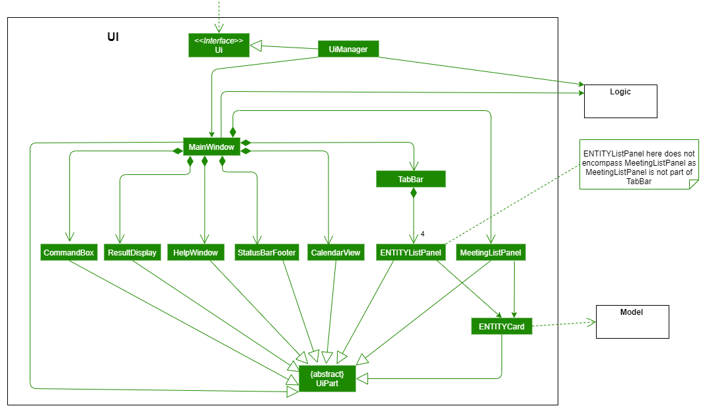
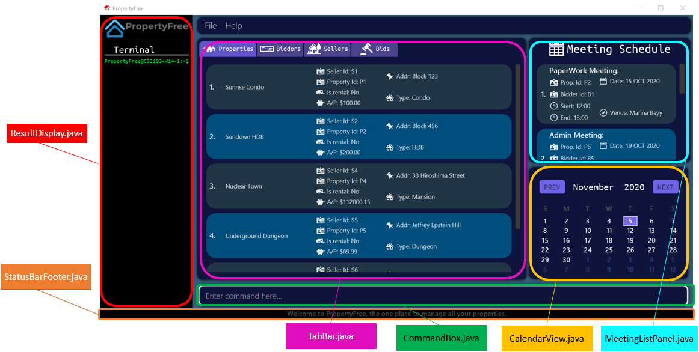
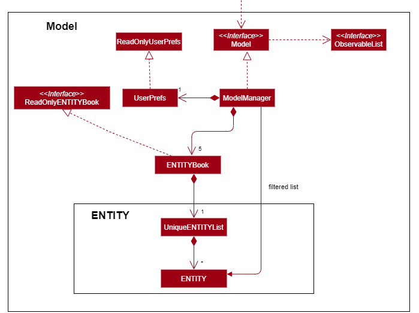
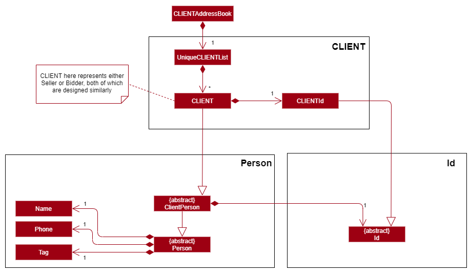
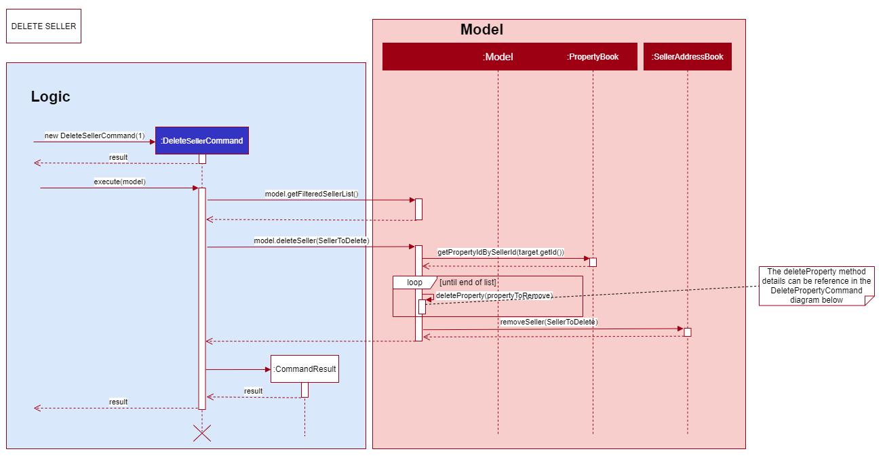

* Table of Contents
{:toc}

Refer to the guide <<SettingUp#, here>>.

Design
--------------------------------------------------------------------------------------------------------------------

## **Setting up, getting started**

Refer to the guide [_Setting up and getting started_](SettingUp.md).

--------------------------------------------------------------------------------------------------------------------

## **Design**

### Architecture


The ***Architecture Diagram*** given above explains the high-level design of the App. Given below is a quick overview of each component.

<div markdown="span" class="alert alert-primary">

:bulb: **Tip:** The `.puml` files used to create diagrams in this document can be found in the [diagrams](https://github.com/se-edu/addressbook-level3/tree/master/docs/diagrams/) folder. Refer to the [_PlantUML Tutorial_ at se-edu/guides](https://se-education.org/guides/tutorials/plantUml.html) to learn how to create and edit diagrams.

</div>

**`Main`** has **two** classes called [`Main`](https://github.com/se-edu/addressbook-level3/tree/master/src/main/java/seedu/address/Main.java) and [`MainApp`](https://github.com/se-edu/addressbook-level3/tree/master/src/main/java/seedu/address/MainApp.java). It is responsible for,
* At app launch: Initializes the components in the correct sequence, and connects them up with each other.
* At shut down: Shuts down the components and invokes cleanup methods where necessary.

[**`Commons`**](#common-classes) represents a collection of classes used by multiple other components.

The rest of the App consists of four components.

* [**`UI`**](#ui-component): The UI of the App.
* [**`Logic`**](#logic-component): The command executor.
* [**`Model`**](#model-component): Holds the data of the App in memory.
* [**`Storage`**](#storage-component): Reads data from, and writes data to, the hard disk.

Each of the four components,

* defines its *API* in an `interface` with the same name as the Component.
* exposes its functionality using a concrete `{Component Name}Manager` class (which implements the corresponding API `interface` mentioned in the previous point.

For example, the `Logic` component (see the class diagram given below) defines its API in the `Logic.java` interface and exposes its functionality using the `LogicManager.java` class which implements the `Logic` interface.


**How the architecture components interact with each other**

The *Sequence Diagram* below shows how the components interact with each other for the scenario where the user issues the command `delete 1`.


The sections below give more details of each component.

### UI component
{ start of `ui` section written by: Kor Ming Soon }



**API** :
[`Ui.java`](https://github.com/AY2021S1-CS2103-W14-1/tp/blob/master/src/main/java/seedu/address/ui/Ui.java)

The UI consists of two components:
- `MainWindow` 
- `HelpWindow`

---
#### [`MainWindow.java`](https://github.com/AY2021S1-CS2103-W14-1/tp/blob/master/src/main/java/seedu/address/ui/MainWindow.java)

`MainWindow` is made up of the following parts:
- [`ResultDisplay`](https://github.com/AY2021S1-CS2103-W14-1/tp/blob/master/src/main/java/seedu/address/ui/ResultDisplay.java)
- [`CommandBox`](https://github.com/AY2021S1-CS2103-W14-1/tp/blob/master/src/main/java/seedu/address/ui/CommandBox.java)
- [`TabBar`](https://github.com/AY2021S1-CS2103-W14-1/tp/blob/master/src/main/java/seedu/address/ui/TabBar.java)
- [`StatusBarFooter`](https://github.com/AY2021S1-CS2103-W14-1/tp/blob/master/src/main/java/seedu/address/ui/TabBar.java) 
- [`CalendarView`]((https://github.com/AY2021S1-CS2103-W14-1/tp/blob/master/src/main/java/seedu/address/ui/CalendarView.java))
- [`MeetingListPanel`](https://github.com/AY2021S1-CS2103-W14-1/tp/blob/master/src/main/java/seedu/address/ui/meeting/MeetingListPanel.java)


*Note that the font colour in the picture is only different for visibility purposes.*

After deliberation, we chose to proceed with TabBar as TabBar allowed
us to represent the details of our entities neatly. 
Each entity in Property belongs to a designated `ListPanel` (as shown below).

The `TabBar` component itself consists of the following parts:
- [`PropertyListPanel`](https://github.com/AY2021S1-CS2103-W14-1/tp/blob/master/src/main/java/seedu/address/ui/property/PropertyListPanel.java)
- [`BidderListPanel`](https://github.com/AY2021S1-CS2103-W14-1/tp/blob/master/src/main/java/seedu/address/ui/bidder/BidderListPanel.java)
- [`SellerListPanel`](https://github.com/AY2021S1-CS2103-W14-1/tp/blob/master/src/main/java/seedu/address/ui/seller/SellerListPanel.java)
- [`BidListPanel`](https://github.com/AY2021S1-CS2103-W14-1/tp/blob/master/src/main/java/seedu/address/ui/bid/BidListPanel.java)

Each panel will display the list of the entities corresponding to the name of the panel.

1. Alternative 1 (current choice): Choosing `TabBar` to represent information of our entities.
    - Pros: 
        - Neater segmentation of entities visually
        - Able to leverage on existing AB3 Ui implementation for representing `Person`
            
    - Cons:
        - Requires user to click to switch tab, not CLI-centric (tackled below)
        
 2. Alternative 2: Maintain a single list on GUI and list only relevant entities based on certain actions such
 as commands.
    - Pros: 
        - Fewer changes to existing AB3 Ui implementation
    - Cons: 
        - Increases code complexity as a combined list has to be created and filter accordingly

The thought process behind the `Ui` was ultimately a choice between usability of the application
and complexity of implementation.

---
#### [`HelpWindow.java`](https://github.com/AY2021S1-CS2103-W14-1/tp/blob/master/src/main/java/seedu/address/ui/HelpWindow.java)

The `HelpWindow` is a pop up window that is activated upon clicking of the Help button in PropertyFree, or when the `help` command
is executed.

The `Copy URL` button would automically copy the link of PropertyFree's User Guide into the user's clipboard.


---

All the above-mentioned components in `MainWindow` and `HelpWindow`, inherit from the abstract `UiPart` class.

The `UI` component uses JavaFx UI framework. The layout of these UI parts are defined in matching `.fxml` 
files that are in the `src/main/resources/view` folder. 
For example, the layout of the [`MainWindow`](https://github.com/AY2021S1-CS2103-W14-1/tp/blob/master/src/main/java/seedu/address/ui/MainWindow.java)
is specified in [`MainWindow.fxml`](https://github.com/AY2021S1-CS2103-W14-1/tp/blob/master/src/main/resources/view/MainWindow.fxml)

The `UI` component,

* Executes user commands using the `Logic` component.
* Listens for changes to `Model` data so that the UI can be updated with the modified data.
* Returns what to be printed out on the UI

{ end of `ui` section written by: Kor Ming Soon }

### Logic component


**API** :
[`Logic.java`](https://github.com/se-edu/addressbook-level3/tree/master/src/main/java/seedu/address/logic/Logic.java)

1. `Logic` uses the `AddressBookParser` class to parse the user command.
1. This results in a `Command` object which is executed by the `LogicManager`.
1. The command execution can affect the `Model` (e.g. adding a person).
1. The result of the command execution is encapsulated as a `CommandResult` object which is passed back to the `Ui`.
1. In addition, the `CommandResult` object can also instruct the `Ui` to perform certain actions, such as displaying help to the user.

Given below is the Sequence Diagram for interactions within the `Logic` component for the `execute("delete 1")` API call.


<div markdown="span" class="alert alert-info">:information_source: **Note:** The lifeline for `DeleteCommandParser` should end at the destroy marker (X) but due to a limitation of PlantUML, the lifeline reaches the end of diagram.
</div>

### Model component
{ start of Model Component section written by: Kor Ming Soon }



**API** : [`Model.java`](https://github.com/AY2021S1-CS2103-W14-1/tp/blob/master/src/main/java/seedu/address//model/Model.java)
    
> Note that the usage of the term `ENTITY` in this section represents any of the following entities in PropertyFree:
> `Property`, `Seller`, `Bidder`, `Bid` and `Meeting`.

The `Model`,

* stores a `UserPref` object that represents the user’s preferences.

* does not depend on any of the other three components.

* stores the following `ENTITY` book data which consists of the following:
    - `PropertyBook`
    - `SellerAddressBook` 
    - `BidderAddressBook`
    - `MeetingBook`
    - `BidBook`
    
* exposes an unmodifiable `ObservableList<ENTITY>` that can be 'observed' by the UI component.

  *e.g. the UI is bounded to the 5 different lists so that 
  the UI automatically updates when the data in any of the lists are changed.*

The following segment of the `Model` components further breaks down each `ENTITY` for a more elaborate 
explanation of each entities' design.
- Property
- Bidder and Seller
- Bid
- Meeting  
---
### Bidder and Seller 
The following class diagram depicts how the `Bidder` and `Seller` are created. The `Bidder` and `Seller` both extend from the
abstract `ClientPerson` which in turn extends from abstract `Person`.  



Note that the `CLIENTId` (BidderId / SellerId) design is elaborated in [Id] in the `Property` segment.

 ##### Design Considerations

 1. Alternative 1 (current choice): Extending `Bidder` and `Seller` from `ClientPerson`, and `ClientPerson` from `Person`.
    - Pros: 
        - Neater segmentation of entities
        - Easier extensibility for additional entities who require an `Id`
        in the future if necessary (e.g Person representing an organization or company)
    - Cons: 
        - Increased code complexity

 2. Alternative 2: Extending `Bidder` and `Seller` directly from `Person`
    - Pros: 
        - Sufficient and possible coverage for current requirements of PropertyFree
        - Lesser code complexity
        - Lesser changes to AB3 code base
    - Cons: 
        - Lesser extensibility and increased possibility of coupling if more entities are introduced
        
 3. Alternative 3 (current choice): Changing `Tag` from `Set<Tag>` in original AB3 implementation
    - Pros: 
        - Lesser code complexity and fewer testing required for extension.
        - Better suited for PropertyFree's purpose as a client management system where the purpose of the client is already 
        well specified without need for `Set<Tag>`
        - Improved UI by having `Tag` acting as a form of visual identifier, instead of complete removal of `Tag`
    - Cons: 
        - Refactoring from original AB3 implementation required substantial time
        
        *`Tag` was kept in `Person` instead of `ClientPerson` to reduce refactoring required from AB3.*
       
#### ID
The follow class diagram depicts the design behind `Id` and the subclasses: `SellerId`, `BidderId` and `PropertyId`.


{ end of Model Component section written by: Kor Ming Soon }

--- 

### Property 

### Bid 

### Meeting 

### Storage component


**API** : [`Storage.java`](https://github.com/se-edu/addressbook-level3/tree/master/src/main/java/seedu/address/storage/Storage.java)

The `Storage` component,
* can save `UserPref` objects in json format and read it back.
* can save the address book data in json format and read it back.

### Common classes

Classes used by multiple components are in the `seedu.addressbook.commons` package.

--------------------------------------------------------------------------------------------------------------------

## **Implementation**

This section describes noteworthy details on how certain features are implemented. The details of the features are
categorized accordingly to the features: 
1. `Add`
2. `Edit`
3. `Find`
4. `Sort`
5. `Delete`
6. `List`

Additional features apart from the above-mentioned feature includes:
- Automated change of `TabBar` and `ENTITYListPanel` with corresponding ENTITY command
- `next` and `prev` command for Calendar UI Navigation
- Key-press for UI navigation

#### 1. Add

#### 2. Edit

#### 3. Find

#### 4. Sort 

#### 5. Delete
{ start of Delete section written by: Kor Ming Soon }

The `Delete` command applies to **all entities** in PropertyFree. Apart from `DeletePropertyCommand`, `DeleteBidderCommand`
and `DeleteSellerCommand` with slight differences in implementation (elaborated below), all other entities follow the same
implementation.

1. When the `Delete` command is executed by the user, the input it passed into
the `LogicManager` and thereafter parsed and identified in `AddressBookParser`. 

2. Upon identifying the relevant `COMMAND_WORD` and by extension the `ENTITY` (through the `-` input)
, the corresponding `DeleteENTITYCommandParser` object is formed. The user input then goes
through another level of parsing in `DeleteENTITYCommandParser`.

3. The `DeleteENTITYCommandParser` identifies the `Index` corresponding to the user's input, and a new `DeleteENTITYCommand`
object is formed taking in the identified `Index`. 
The `DeleteENTITYCommand` is then encapsulated under `Command` and passed back into the `LogicManager`.

4. The `DeleteENTITYCommand` calls `execute(model)`. The execution of the command then interacts
with the `Model` component, and retrieves the unmodifiable view of `ObservableList<ENTITY>`.

5. The `DeleteEntityCommand` retrieves the corresponding `ENTITY` to the `Index` (as received in 3), and calls on the
`deleteENTITY(ENTITYToDelete)` method of the `Model`.

6. The `Model` accesses the relevant ENTITYBook and removes the `ENTITYToDelete`. The `Ui` then "listens" to the 
changes in the ENTITYBook and updates the GUI.

7. Finally, `DeleteENTITYCommand` is then encapsulated as a `CommandResult` and passed into the `LogicManager`.


##### 5.1 Delete Bidder Command

> The `Logic` portion of the sequence diagram shown subsequently is truncated to give more focus on the `Model` as the
> `Logic` implementation is similar to the above-mentioned. 

The `DeleteBidderCommand` deletes the `bidderToDelete` corresponding to to the index given in the user input.
The command varies as other entities tied to the `bidderToDelete` by the `Id` will be deleted as well, namely:
`Bid` and `Meeting`.

1. Upon retrieving the `bidderToDelete`, the `bidderToDelete`'s `bidderId` is then retrieved and passed into
`removeAllBidsWithBidderId(bidderId)`. 

2. `BidBook` in turn calls `removeAllWithBidder(bidderId)` to iterate and delete through the list of bids 
containing the attribute of`bidderId`.

3. Step 1 and Step 2 are repeated but with `removeAllMeetingsWithBidderId(bidderId)` and `MeetingBook`.


##### 5.2 Delete Seller Command

The `DeleteSellerCommand` deletes the `SellertoBeDeleted` corresponding to to the index given in the user input.
The command varies as other entities tied to the `sellerToDelete` by the `Id` will be deleted as well, namely:
`Property`. The deletion of the `Property` will in turn delete other entities (elaborated in 5.3).

1. Upon retrieving the `sellerToDelete`, the `sellerToDelete`'s `sellerId` is then retrieved and passed into
`removeAllBidsWithSellerId(sellerId)`. 

2. `PropertyBook` in turn calls `removeAllWithBidder(bidderId)` to iterate and delete through the list of properties 
containing the attribute of`sellerId`.



 ##### Design Considerations
 
  Due to time constraint we decided to forgo certain attributes and features which would have distinctly separated `Bidder`
  and `Seller` better (such as winning `bidder`). The implementation was designed with future extensions in mind. 
  This consideration applies to all `Commands` pertaining to `Bidder` and `Seller`, not just `Delete`.
  
 1. Alternative 1 (current choice): Having `DeleteBidderCommand` and `DeleteSellerCommand` extends from `Command` rather than
 a common command such as `DeleteClientCommand`. 
 
    - Pros: 
        - Less coupling if an extension is required in the future
        - Less refactoring was required from original implementation of AB3
        
    - Cons: 
        - Unable to exploit polymorphism even though both `Bidder` and `Seller` have a degree of similarity between both
        - Increases code complexity in `AddressBookParser`
        
{ end of Delete section written by: Kor Ming Soon }
##### 5.3 Delete Property Command


#### 6. List

### UI Navigation Implementation
{ start of Ui implementation section written by: Kor Ming Soon }

This section explains the `Ui` implementation in PropertyFree. 

The implementation of `Ui` was implemented keeping in mind the constraint that the 
target user is more inclined towards command line interface. 

#### 1. Automated `TabBar` Switching based on Command

Given that PropertyFree deals with a variety of different entities. The challenge was identifying the corresponding
action and representing the right entity on the GUI.

The implemented is done as such:

- Creation of an `EntityType` (Enumeration) containing the following:  `BIDDER`, `SELLER`, `BID`, `PROPERTY` and `MEETING`. 

- `CommandResult` is given another attribute of `EntityType`, and a `setEntity(EntityType)` method is created. The method is
then called during the creation of the `CommandResult` object at each command.

- The `CommandResult` then passes the `EntityType` in `MainWindow` to set the `TabBar` accordingly to the entity relevant to 
command executed by the user.

The following activity diagram depicts the user journey and how the GUI responds accordingly in different scenarios.


#### 2. Key-press UI Navigation

> The term `focus` refers to the component of which the user is able to interact with at any given moment.

Upon launch, the PropertyFree will set the focus in the `CommandBox`'s text field. 
This section highlights three simple key-press `Ui` navigation feature.

- Navigating to next month in CalendarView: `SHIFT`
- Navigating to previous month in CalendarView: `CONTROL`
- Navigating to `CommandBox`'s text field (when not in focus): `ENTER`

The key-press navigation is implemented in `MainWindow` where the method `handleFocusRequestWhenKeyPressed(CommandBox)` 
configures the `primaryStage` with an `addEventFilter()` to "listen" to the event when a key is pressed.

This in turns calls the method `handle(KeyEvent)` that runs and determine which key is pressed.
Thereafter executes one of the three possible navigation.


#### 3. Calendar Navigation Command

Calendar Navigation Command serves to provide an alternative for users to view the `CalendarView` if the user's keyboard
layout does not provide convenience for `SHIFT` or `CONTROL`.

Two commands are created to handle the user input:

- `NextCalendarNavigationCommand`
- `PrevCalendarNavigationCommand`

The implementation of the two above-mentioned commands are largely similar to the `ListENTITYCommand`. 

However, apart from passing the `MESSAGE_SUCCESS` to `ResultDisplay`, the `CommandResult` checks `isCalendarNavigation()`
and calls the `handleToNext()` or `handleToPrev()` method in `CalendarView` depending on the user command input.

 
 { end of Ui implementation section written by: Kor Ming Soon }

 
 
 
 
 

 
 
 #### 1.2 **Find**: find bidder(s) and seller(s) based on their names - `find-b` or `find-s`
 
  `find` is supported by the `FindBidderCommand` and `FindSellerCommand`.
  
  Given below is the example usage scenario:
  
  **Step 1**. The user launches the PropertyFree application. 
  
  **Step 2**. After loading data from the storage to the application memory,
  the list of `bidders` or `sellers` in the `BidderAddressBook` and `SellerAddressBook` can either contain existing bidders
  or sellers, or is empty. However, as we are finding existing bidders or sellers, we will assumed that there are
  bidders or sellers in the book.
  
  **Step 3**. The user then executes `find-b <KEYWORD>`. If the `<KEYWORD>` does not corresponding to any names
   in the list of bidders and seller. PropertyFree will display an error message indicating that the search result is
   empty.
   
  **Step 4**. If the `<KEYWORD>` matches any names (in part or whole), the list will then filter the bidders or sellers
  whose name do not match the `<KEYWORD>`, and return a list of bidders or sellers whose name contains the `<KEYWORD>`.
  
   The following sequence diagram summarises as well how the components of Model and Logic interact during the execution
   of the command:
   
   
 
   #### Design Consideration
   
   1. Alternative Implementation 1 (current choice): The bidder and sellers are stored in an 
   `ObservableList<Bidder/Seller>`.
        - Pros: Easier to implement and do not require refactoring for the existing code base
        - Cons: The class (`Observable`) is deprecated since Java 9 due lack of functionality.
        
   2. Alternative Implementation 2: using of java.beans package instead of Observable
        - Pros: to replace the deprecated `Observable` class since Java 9. Greater number of functions, such
        as being able to keep track of what has changed.
        - Cons: Will require heavy edits to the existing code base.

### 2. Bid

 ### **Implementation**

 #### 2.1 **Delete**: delete a bid - `delete-bid`

 `delete` is supported by the `DeleteBidCommand`.

 Given below is the example usage scenario:

 **Step 1**. The user launches the PropertyFree application. 

 **Step 2**. After loading data from the storage to the application memory,
 the list of `bids` `BidBook` can either contain existing bids or is empty. However, as we are deleting existing bids, we will assume that there are
 bids in the book.

 **Step 3**. The user then executes `delete-bid <INDEX>`. If the `<INDEX>` is out of bound. PropertyFree will give a 
 display error message indicating that the index is wrong.

 **Step 4**. The application will then retrieve the corresponding bid, delete it, and return a new list without the
 corresponding bid.

 The following activity diagram summarises what happens when a user executes `delete-bid` command:

 

 The following sequence diagram summarises as well how the components of Model and Logic interact during the execution
 of the command:

 

 #### Design Considerations

 1. Alternative 1 (current choice): Delete-bid command will delete a bid based on the index in the list.

    - Pros: Users can easily distinguish which bid they wish to delete. 
    - Cons: User will not be able to delete a large number at one go.

 2. Alternative 2: Delete not based on index but by property.

    - Pros: user can delete all the bids for a property once it is sold.
    - Cons: It may delete the winning bid from the list which may be undesirable.
    

 #### 2.2 **LIST**: display the list of bids - `list-bid`

 `list` is supported by the `ListBidCommand`.

 Given below is the example usage scenario:

 **Step 1**. The user launches the PropertyFree application. 

 **Step 2**. After loading data from the storage to the application memory,
 the list of `bids` `BidBook` can either contain existing bids, is empty, or not showing the entire list.

 **Step 3**. The user then executes `list-bid`.

 **Step 4**. The application will then return a full list of bids.

 The following sequence diagram summarises how the components of Model and Logic interact during the execution
 of the command:

 

 #### Design Considerations

 1. Alternative 1 (current choice): List-bid command will display all bids in the list based on when it was added.

    - Pros: Users can easily see the entire list and know which bids were added first. 
    - Cons: User will not be able easily see bids related to a certain property or bidder.

 2. Alternative 2: List will also sort the list of bids based on property.

    - Pros: user can see all the bids easily for a certain property.
    - Cons: Chronological order of being added will not be seen.
    
    
### \[Proposed\] Undo/redo feature

#### Proposed Implementation

The proposed undo/redo mechanism is facilitated by `VersionedAddressBook`. It extends `AddressBook` with an undo/redo history, stored internally as an `addressBookStateList` and `currentStatePointer`. Additionally, it implements the following operations:

* `VersionedAddressBook#commit()` — Saves the current address book state in its history.
* `VersionedAddressBook#undo()` — Restores the previous address book state from its history.
* `VersionedAddressBook#redo()` — Restores a previously undone address book state from its history.

These operations are exposed in the `Model` interface as `Model#commitAddressBook()`, `Model#undoAddressBook()` and `Model#redoAddressBook()` respectively.

Given below is an example usage scenario and how the undo/redo mechanism behaves at each step.

Step 1. The user launches the application for the first meetingDate. The `VersionedAddressBook` will be initialized with the initial address book state, and the `currentStatePointer` pointing to that single address book state.


Step 2. The user executes `delete 5` command to delete the 5th person in the address book. The `delete` command calls `Model#commitAddressBook()`, causing the modified state of the address book after the `delete 5` command executes to be saved in the `addressBookStateList`, and the `currentStatePointer` is shifted to the newly inserted address book state.


Step 3. The user executes `add n/David …​` to add a new person. The `add` command also calls `Model#commitAddressBook()`, causing another modified address book state to be saved into the `addressBookStateList`.


<div markdown="span" class="alert alert-info">:information_source: **Note:** If a command fails its execution, it will not call `Model#commitAddressBook()`, so the address book state will not be saved into the `addressBookStateList`.

</div>

Step 4. The user now decides that adding the person was a mistake, and decides to undo that action by executing the `undo` command. The `undo` command will call `Model#undoAddressBook()`, which will shift the `currentStatePointer` once to the left, pointing it to the previous address book state, and restores the address book to that state.


<div markdown="span" class="alert alert-info">:information_source: **Note:** If the `currentStatePointer` is at index 0, pointing to the initial AddressBook state, then there are no previous AddressBook states to restore. The `undo` command uses `Model#canUndoAddressBook()` to check if this is the case. If so, it will return an error to the user rather
than attempting to perform the undo.

</div>

The following sequence diagram shows how the undo operation works:


<div markdown="span" class="alert alert-info">:information_source: **Note:** The lifeline for `UndoCommand` should end at the destroy marker (X) but due to a limitation of PlantUML, the lifeline reaches the end of diagram.

</div>

The `redo` command does the opposite — it calls `Model#redoAddressBook()`, which shifts the `currentStatePointer` once to the right, pointing to the previously undone state, and restores the address book to that state.

<div markdown="span" class="alert alert-info">:information_source: **Note:** If the `currentStatePointer` is at index `addressBookStateList.size() - 1`, pointing to the latest address book state, then there are no undone AddressBook states to restore. The `redo` command uses `Model#canRedoAddressBook()` to check if this is the case. If so, it will return an error to the user rather than attempting to perform the redo.

</div>

Step 5. The user then decides to execute the command `list`. Commands that do not modify the address book, such as `list`, will usually not call `Model#commitAddressBook()`, `Model#undoAddressBook()` or `Model#redoAddressBook()`. Thus, the `addressBookStateList` remains unchanged.


Step 6. The user executes `clear`, which calls `Model#commitAddressBook()`. Since the `currentStatePointer` is not pointing at the end of the `addressBookStateList`, all address book states after the `currentStatePointer` will be purged. Reason: It no longer makes sense to redo the `add n/David …​` command. This is the behavior that most modern desktop applications follow.


The following activity diagram summarizes what happens when a user executes a new command:


#### Design consideration:

##### Aspect: How undo & redo executes

* **Alternative 1 (current choice):** Saves the entire address book.
  * Pros: Easy to implement.
  * Cons: May have performance issues in terms of memory usage.

* **Alternative 2:** Individual command knows how to undo/redo by
  itself.
  * Pros: Will use less memory (e.g. for `delete`, just save the person being deleted).
  * Cons: We must ensure that the implementation of each individual command are correct.

_{more aspects and alternatives to be added}_

### \[Proposed\] Data archiving

_{Explain here how the data archiving feature will be implemented}_

### Property Feature

#### Add Property Feature 

The Add Property feature adds a property with the user defined attributes, such as property name, address,
seller id, property type, asking price and is-rental, into the property book.

1. ```LogicManager``` executes the user input. 
2. It calls ```AddressBookParser``` to parse the user input, which creates an ```AddPropertyCommandParser```, as 
identified by the command word "add-p".
3. The ```AddPropertyCommandParser``` creates a ```Property``` object, with attributes specified by the user.
4. The ```AddPropertyCommandParser``` creates an ```AddPropertyCommand``` with the above property. The command
is returned to the ```LogicManager```.
5. The ```LogicManager``` calls ```AddPropertyCommand#execute()```, which adds the property to ```PropertyBook```
via the ```Model``` interface.
6. Finally, a ```CommandResult``` with the relevant feedback is returned to the ```LogicManager```.

The following sequence diagram shows the process of executing an ```AddPropertyCommand```.


##### Property Id Management

Each property is identified by a unique ```PropertyId``` in the form of a number prefixed by "P". As each property is
added, the property id is auto-incremented. The following activity diagram shows how the property id is managed:


This process occurs inside the ```UniquePropertyList``` class.  

<div markdown="span" class="alert alert-info">:information_source: **Note:** Note 2: User-created properties always have the DEFAULT_ID. Users are not allowed to set or edit 
```PropertyId```s to ensure the uniqueness of the property id. Only ```Property``` objects created 
for testing purposes may have manually-added ```PropertyId```s, in which case, the ```PropertyId``` 
will be retained. 


### Meeting Feature

#### Edit Meeting Feature

The Edit Meeting feature edits an attribute of an exisiting meeting in the meeting book with the user defined attribute, such as the bidder id, property id, venue or meetingDate.

1. ```LogicManager``` executes the user input. 
2. It calls ```AddressBookParser``` to parse the user input, which creates an ```EditMeetingCommandParser```, as 
identified by the command word "edit-m".
3. The ```EditMeetingCommandParser``` creates a ```Meeting``` object, with the new attribute specified by the user and the attributes of the existing ```Meeting``` object.
4. The ```EditMeetingCommandParser``` creates an ```EditMeetingCommand``` with the above meeting. The command
is returned to the ```LogicManager```.
5. The ```LogicManager``` calls ```EditMeetingCommand#execute()```, which adds the meeting to ```MeetingBook``` and removes the exisiting meeting from the ```MeetingBook```.
via the ```Model``` interface.
6. Finally, a ```CommandResult``` with the relevant feedback is returned to the ```LogicManager```.

The following sequence diagram shows the process of executing an ```EditMeetingCommand```.


##### Meeting Type

Each meeting has a specific type ```MeetingType``` of types paperwork, viewing or admin. The following activity diagram shows how the meeting object of the specific type is created:


This process occurs inside the ```AddMeetingCommand``` class where the meeting object is created and added to the MeetingBook.  


</div>

### Meeting Feature

#### Find Meeting Feature
The find meeting feature finds meetings with various different inputs. The user is able to find meetings based on 
attributes such as venue, meetingDate, bidderId or the propertyId. The user simply has to use the relevant prefixes and add
in a string that is contained in any of the meetings attributes and the fid feature will return you a list of the 
meetings that contain them.

1. ```LogicManager``` executes the user input. 
2. It calls ```AddressBookParser``` to parse the user input, which creates an ```FindMeetingCommandParser```, as 
identified by the command word "find-m".
3. The ```FindMeetingCommandParser``` creates different predicate objects based on the inputs.
 if "/v" is used, ```VenueContainsKeywordsPredicate``` object will be created. If "/t" is used, ```TimeContainsKeywordsPredicate``` 
 object will be created. If "/b" is used, ```BidderIdContainsKeywordsPredicateobject``` will be created. If "/p" is used, 
 ```PropertyIdContainsKeywordsPredicate``` object will be created.
4. The ```FindMeetingCommandParser``` creates an ```FindMeetingCommand``` with the above predicate. The command
is returned to the ```LogicManager```.
5. The ```LogicManager``` calls ```FindMeetingCommand#execute()```, which adds the list of meetings that satisfy the predicate
 into ```MeetiongBook``` via the ```Model``` interface.
6. Finally, a ```CommandResult``` with the relevant feedback is returned to the ```LogicManager```.

The following sequence diagram shows the process of executing an ```FindMeetingCommand```.

  
#### Sort Meeting Feature
The sort meeting feature sorts the meetings based on the different timings of the meetings from the earliest meeting
to the last meeting in chronological order.
1. ```LogicManager``` executes the user input. 
2. It calls ```AddressBookParser``` to parse the user input, which creates an ```SortMeetingCommandParser```, as 
identified by the command word "sort-m".
3. The ```SortMeetingCommandParser``` creates a ```SortMeetingComparator``` comparator object.
4. The ```SortMeetingCommandParser``` creates a ```SortMeetingCommand``` with the above comparator. The command
is returned to the ```LogicManager```.
5. The ```LogicManager``` calls ```SortMeetingCommand#execute()```, which adds a new duplicate list of meetings that is
 sorted in chronological order in ```MeetingBook``` via the ```Model``` interface.
6. Finally, a ```CommandResult``` with the relevant feedback is returned to the ```LogicManager```.


--------------------------------------------------------------------------------------------------------------------

## **Documentation, logging, testing, configuration, dev-ops**

* [Documentation guide](Documentation.md)
* [Testing guide](Testing.md)
* [Logging guide](Logging.md)
* [Configuration guide](Configuration.md)
* [DevOps guide](DevOps.md)

--------------------------------------------------------------------------------------------------------------------

## Appendix A: Product scope

**Target user profile**:

* Has a need to manage a significant number of property details, seller details and buyer details
* Prefer desktop apps over other types
* Can type fast
* Prefers typing to mouse interactions
* is reasonably comfortable using CLI apps

**Value proposition**: Able to manage property listings, client 
contact details as well as creating a meeting schedule easily 
while being faster and more convenient than traditional bookkeeping 
softwares such as Excel. 


## Appendix B: User stories

Priorities: High (must have) - `* * *`, Medium (nice to have) - `* *`, Low (unlikely to have) - `*`

| Priority | As a …​                                    | I want to …​                                                           | So that I can…​                                                         |
| -------- | ----------------------------------------- | --------------------------------------------------------------------- | ---------------------------------------------------------------------- |
| `* * *`  | Real estate agent           | add a new property listing                                                          | add a new property entry when a seller wants to sell a new property    |
| `* * *`  | Real estate agent           | add bidder or seller                                                                | keep track of bidders or sellers involved                              |
| `* * *`  | Real estate agent           | view the list of interested sellers                                                 | keep track of property owners                                          |
| `* *`    | Real estate agent           | edit the property listing                                                           | ensure that the property information is accurate                       |
| `* * *`  | Real estate agent           | delete a property listing                                                           | remove listings that are closed or that sellers no longer want to sell |
| `* *`    | Real estate agent           | view the listings I have by area                                                    | be better equipped to give more options to the buyers on the spot      |
| `* *`    | Real estate agent           | input details about the rental                                                      | inform the client about the renter’s property                          |
| `* *`    | Real estate agent           | edit the details of the property rental                                             | update with new information from the client                            |
| `* * *`  | Real estate agent           | search the properties by id, name or area etc                                       | filter properties according to my criteria                             |
| `* * *`  | Real estate agent           | sort the listing according to my criteria                                           | obtain a filtered list to easily observe properties of the same type   |
| `*`      | Real estate agent           | mark a property as sold                                                             | keep track on which houses are already sold                            |
| `*`      | Real estate agent           | see the historical transactions                                                     | track my performance                                                   |
| `* * *`  | Real estate agent           | add bids to my properties                                                           | keep track of my customers’ bids                                       |
| `* * *`  | Real estate agent           | delete bids                                                                         | so that I can remove bids that are withdrawn by the bidders            |
| `* * *`  | Real estate agent           | view the current bids organised by property, sellers and buyers                     | keep track of the bids                                                 |
| `* *`    | Real estate agent           | edit bids                                                                           | so that I can remove bids that are withdrawn by the bidders            |
| `* * *`  | Busy real estate agent      | create meetings                                                                     | so that I can remove bids that are withdrawn by the bidders            |
| `* * *`  | Busy real estate agent      | view the list of meetings                                                           | so that I can remove bids that are withdrawn by the bidders            |
| `* * *`  | Busy real estate agent      | delete meetings                                                                     | so that I can remove bids that are withdrawn by the bidders            |
| `* *`    | Busy real estate agent      | schedule meetings such that it can warn me if there is any clashes in meetings      | so that I can remove bids that are withdrawn by the bidders            |
| `* *`    | Busy real estate agent      | edit meeting details                                                                | ensure that meeting details are accurate in case of changes            |


## Appendix C: Use cases

(For all use cases below, the **System** is the `PropertyFree` and the **Actor** is the `Real Estate Agent`, unless specified otherwise)

**1. Use case: Delete a property form the list of properties**

**MSS**

1. User requests to list of properties
2. PropertyFree shows a list of properties
3. User requests to delete a specific property in the list
4. PropertyFree deletes the property  
    Use case ends.
    
**Extensions**

* 2a. The list is empty.
    Use case ends.
* 3a. The given index is invalid.
    * 3a1. PropertyFree shows an error message.  
        Use case resumes at step 2.
        
**2. Use case: Add a property**

**MSS**

1. User requests to add a property
2. PropertyFree adds the property to the list  
    Use case ends.
    
**Extensions**

* 2a. The given property is of the wrong format.
    * 3a1. PropertyFree shows an error message.  
        Use case ends.
        
**3. Use case: View a calendar of meetings**

**MSS**

1. User requests for a list of meetings scheduled
2. PropertyFree shows a list of meetings scheduled.  
Use case ends.

    
**Extensions**

* 2a. The list of meetings is empty.  
    Use case ends.

**4. Use case: Edit an Existing Meeting on the Calendar**

**MSS**

1. User requests to edit a meeting on the calendar.
2. PropertyFree shows the old meeting details and the new meeting details.  
   Use case ends

**Extensions**

* 2a. There is no corresponding meeting existing to be edited.  
  Use case ends.

**5. Use case: Add Bid to a Property**

**MSS**

1. User requests to view the list of existing properties inside the property list.
2. PropertyFree shows the current list of properties that are on the list.
3. User requests to add bid to a specific property
4. PropertyFree shows the property updated with the addition of the new bid.


**Extensions**

* 2a. There are no properties in the list.  
  Use case ends.
* 3a. There are no properties corresponding to what the user input is.  
  Use case ends.
  
**6. Use case: Edit Bid to a Property**

**MSS**

1. User requests to list of bids
2. PropertyFree shows a list of bids
3. User requests to edit a specific bid in the list
4. PropertyFree edits the bid  
Use case ends.


**Extensions**

* 2a. The list is empty.  
Use case ends.
* 3a. The given index is invalid.
    * 3a1. PropertyFree shows an error message.  
        Use case resumes at step 2.
* 3b. The given format of message is wrong.
    * 3b1. PropertyFree shows an error message.  
        Use case ends.
        
**7. Use case: Edit Current Meeting(to be implemented)**

**8. Use case: Edit Details of a property(to be implemented)**

**9. Use case: Edit type of meeting(to be implemented)**

### Non-Functional Requirements

1.  Should work on any _mainstream OS_ as long as it has Java `11` or above installed.
2.  Should be able to hold up to 1000 persons without a noticeable sluggishness in performance for typical usage.
3.  A user with above average typing speed for regular English text (i.e. not code, not system admin commands) should be able to accomplish most of the tasks faster using commands than using the mouse.


### Glossary

* **Mainstream OS**: Windows, Linux, Unix, OS-X
* **Private Seller and Bidder details**: Contact details that are not meant to be publicly shared with others
* **Public Property Details**: Description of the property that is meant to be shared with others
* **Bid Details**: Description of the bid which is meant to be shared with others 

--------------------------------------------------------------------------------------------------------------------

## **Appendix: Instructions for manual testing**

Given below are instructions to test the app manually.

<div markdown="span" class="alert alert-info">:information_source: **Note:** These instructions only provide a starting point for testers to work on;
testers are expected to do more *exploratory* testing.

</div>

### Launch and shutdown

1. Initial launch

   1. Download the jar file and copy into an empty folder

   1. Double-click the jar file Expected: Shows the GUI with a set of sample contacts. The window size may not be optimum.

1. Saving window preferences

   1. Resize the window to an optimum size. Move the window to a different location. Close the window.

   1. Re-launch the app by double-clicking the jar file.<br>
       Expected: The most recent window size and location is retained.

1. _{ more test cases …​ }_

### Deleting a person

1. Deleting a person while all persons are being shown

   1. Prerequisites: List all persons using the `list` command. Multiple persons in the list.

   1. Test case: `delete 1`<br>
      Expected: First contact is deleted from the list. Details of the deleted contact shown in the status message. Timestamp in the status bar is updated.

   1. Test case: `delete 0`<br>
      Expected: No person is deleted. Error details shown in the status message. Status bar remains the same.

   1. Other incorrect delete commands to try: `delete`, `delete x`, `...` (where x is larger than the list size)<br>
      Expected: Similar to previous.

1. _{ more test cases …​ }_

### Saving data

1. Dealing with missing/corrupted data files

   1. _{explain how to simulate a missing/corrupted file, and the expected behavior}_

1. _{ more test cases …​ }_
