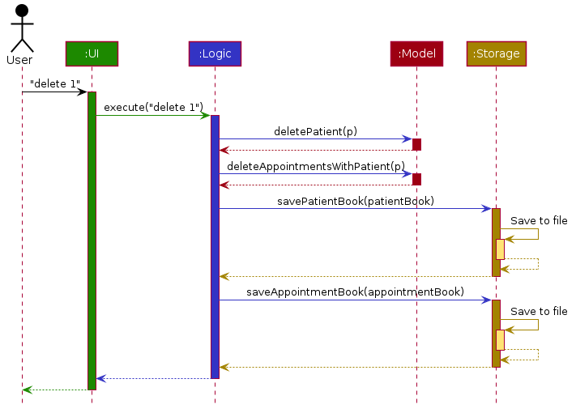

1. Table of Contents
{:toc}

-----------------

## **Introduction**

For more information on the ChopChop application itself, read the [_User Guide_](UserGuide.md) instead.

This developer guide specifies the design architecture and details some of the software design decisions in the implementation of the ChopChop application. It is intended to be read by contributors, testers, and future maintainers.

## **Setting Up**

To setup the development environment, refer to [_Setting up and getting started_](SettingUp.md).

-------------
## **Design**

This section of the developer guide details the overall design of ChopChop, including the various subcomponents and how they fit together.

### Component Architecture

  
Figure 1: <i>The architecture diagram of ChopChop</i>

The ***Architecture Diagram*** given above explains the high-level design of the App. Given below is a quick overview of each component.

:bulb: **Tip:** The `.puml` files used to create diagrams in this document can be found in the [diagrams](https://github.com/AY2021S1-CS2103T-T10-3/tp/tree/master/docs/diagrams) folder. Refer to the [_PlantUML Tutorial_ at se-edu/guides](https://se-education.org/guides/tutorials/plantUml.html) to learn how to create and edit diagrams.

**`Main`** has two classes called [`Main`](https://github.com/AY2021S1-CS2103T-T10-3/tp/blob/master/src/main/java/chopchop/Main.java) and [`MainApp`](https://github.com/AY2021S1-CS2103T-T10-3/tp/blob/master/src/main/java/chopchop/MainApp.java). It is responsible for:
* During launch: initialising the components in the correct sequence, and connecting them up with each other.
* During shutdown: shutting down the components and invoking cleanup methods where necessary.

[**`Commons`**](#common-classes) represents a collection of classes used by multiple other components.

The rest of the App broadly consists of these four components:

* [**`UI`**](#ui-component): The user interface (UI).
* [**`Logic`**](#logic-component): The command executor.
* [**`Model`**](#model-component): The in-memory data manager.
* [**`Storage`**](#storage-component): The on-disk data manager.

Each of these components:
* defines its *API* in an `interface` with the same name as the component.
* exposes its functionality using a concrete `{Component Name}Manager` class, implementing the corresponding `interface`.

For example, the `Logic` component defines its API in the `Logic.java` interface and exposes its functionality using the `LogicManager.java` class which implements said interface.

**How the architecture components interact with each other**

The *Sequence Diagram* below shows how the components interact with each other for the scenario where the user issues the command `delete recipe #1`:

  
Figure 2: <i>A sequence diagram showing the execution of <code>delete recipe #1</code></i>

The following sections break down the various components in greater detail.

----------------
### UI Component

The *UI* component is responsible for all the user-facing views in the graphical user interface. This includes displaying recipes and ingredients, receiving command input from the user, and printing command results to the user.

The class diagram of the UI component is shown below:

  
Figure 3: <i>The class diagram of the UI component</i>

**Interface**: [`Ui.java`](https://github.com/AY2021S1-CS2103T-T10-3/tp/blob/master/src/main/java/chopchop/ui/Ui.java)

The UI consists of a `MainWindow` that is made up of parts e.g.`HelpWindow`, `PinBox`, `CommandOutput`, `DisplayController`. All these, including the `MainWindow`, inherit from the abstract `UiPart` class.

The graphical user interface is built using the JavaFX UI framework. The layout of these parts are defined in matching `.fxml` files that are in the `src/main/resources/view` folder. For example, the layout of the [`MainWindow`](https://github.com/AY2021S1-CS2103T-T10-3/tp/blob/master/src/main/java/chopchop/ui/MainWindow.java) is specified in [`MainWindow.fxml`](https://github.com/AY2021S1-CS2103T-T10-3/tp/blob/master/src/main/resources/view/MainWindow.fxml).

The `UI` component:

* Executes user commands using the `Logic` component.
* Listens for changes to `Model` data so that the UI can be updated with the modified data.

-------------------
### Logic Component

The *Logic* component is responsible for parsing command input, executing commands, and updating the Model component of any changes to data caused by running a command.

The class diagram of the Logic component is shown below:

  
Figure 4: <i>The class diagram of the Logic component</i>

**Interface**: [`Logic.java`](https://github.com/AY2021S1-CS2103T-T10-3/tp/blob/master/src/main/java/chopchop/logic/Logic.java)

This is the general flow of events when a command is executed:
1. `Logic` uses its `CommandParser` to parse the user command.
1. This results in a `Command` object which is executed by the `LogicManager`.
1. The command execution can affect the `Model` (e.g. adding a person).
1. The result of the command execution is encapsulated as a `CommandResult` object which is passed back to the `Ui`.
1. In addition, the `CommandResult` object can also instruct the `Ui` to perform certain actions, such as displaying help to the user.
1. After command execution, the command is saved by the `HistoryManager` to keep track of command history, and to allow for undoing/redoing of commands.

For example, this is a sequence diagram showing the deletion of a recipe:

  
Figure 5: <i>A sequence diagram showing the execution of <code>delete recipe #1</code> in the Logic component</i>

-------------------
### Model Component

The *Model* component is responsible for holding the data of the application (eg. the recipes and ingredients) in-memory during execution, and mediating access to this data for each of the other components of the system.

The class diagram of the *Model* component is shown below:

  
Figure 6: <i>The class diagram of the Model component</i>

**Interface**: [`Model.java`](https://github.com/AY2021S1-CS2103T-T10-3/tp/blob/master/src/main/java/chopchop/model/Model.java)

The Model component:
* Stores a `UserPref` object that represents the user's preferences.
* Stores the recipe and ingredient book data.
* Exposes an `ObservableList` of both `Recipe` and `Ingredient`, for UI component to observe and update its graphical interface.

Of note in the Model component are the `Recipe` and `Ingredient` classes; below is the class diagram for both:

<h2 style="background-color: pink">TODO: class diagram for Recipe and Ingredient</h2>
Figure 7: <i>The class diagram for Recipes and Ingredients</i>

Note that an instance of `Recipe` only stores `IngredientReferences` to the ingredients it uses, and not the actual `Ingredients` themselves — since the actual instance of the ingredient that will be used by the recipe is indeterminate.

Only when a recipe is made are the references are resolved to their actual ingredient.

---------------------
### Storage Component

The storage component is responsible for the saving and loading of the usage data for recipe and ingredient, the user preferences, and more importantly the recipe and ingredient data, to and from disk. Both pieces of data are stored in Javascript Object Notation (JSON) files, which is a human-readable (and editable) plain-text format.

Currently, the Jackson library is used for (de)serialisation.

The class diagram of the *Storage* component is shown below:

  
Figure 8: <i>The class diagram of the Storage component</i>

**Interface**: [`Storage.java`](https://github.com/AY2021S1-CS2103T-T10-3/tp/blob/master/src/main/java/chopchop/storage/Storage.java)

As mentioned above, the `Storage` component:
* Saves and loads `UserPref`.
* Saves and loads the *Recipe Book* and the *Ingredient Book*.
* Saves and loads the *Recipe Usage List* and the *Ingredient Usage List*.

Each component is saved in a separate file with its file path specified in UserPref.
Each entity (eg. `Recipe`, `IngredientSet`) that needs to be saved has a corresponding `JsonAdapted{X}` class in the `chopchop.storage` package. This adapter class is responsible for converting, using Jackson, the 'normal' objects to a string representation (or to another adapter class), and to convert this string representation back to a 'normal' object.

For example, the `Ingredient` class has a corresponding `JsonAdaptedIngredient` that saves and loads the ingredient's name, quantities, and expiry dates.
It can also be multi-level.
For example, the `JsonSerializableIngredientUsageList` contains `JsonAdaptedUsageList` and `JsonAdaptedUsageList` in turn contains a list of `JsonAdaptedIngredientUsage`.

------------------
### Utility Classes

While not itself a component, various utility types are placed in the `chopchop.commons` package; these are used by all the components in ChopChop, and comprise three sub-parts in their respective packages:

1. `core` contains classes to handle GUI settings, logging, and versioning.
2. `exceptions` contains exception types common across ChopChop.
3. `util` contains utility classes for file IO and argument validation, as well as functional types.

-----------------------------
## **Implementation Details**

This section explains, in detail, the implementation of some noteworthy features.

### Command Parser

Main developer: **zhiayang**

The command parser is part of the *Logic* component, and is responsible for taking the input command as a string and either returning a valid `Command` to be executed, or a sensible error message. It was completely rewritten due to the requirement of different parsing semantics.

Shown below is the class diagram for the various Parser components:

<h2 style="background-color: pink">TODO: class diagram for Parser stuff</h2>
Figure 9: <i>The class diagram for the parser</i>

Notably, there are various wrapper classes to ensure type safety, namely `CommandArguments`, `ArgName`, and `ItemReference`, used instead of passing raw strings around in an error-prone manner.

Furthermore, instead of pointlessly instantiating objects that do not store any state, all of the parsing work (save the main `CommandParser`) is done by static methods, in the various `_CommandParser` classes (eg. `AddCommandParser`, `ListCommandParser`).

One of the more complex commands to parse is the `add recipe` command; here is the sequence diagram detailing how it is parsed:

<h2 style="background-color: pink">TODO: sequence diagram for <code>add recipe</code></h2>
Figure 10: <i>A sequence diagram for parsing an <code>add recipe</code> command</i>

<h4>Design Considerations</h4>
**1. Use of exceptions**

The parser written in an exception-free manner, using monadic result types (`Result`, `Optional`) instead.
  - Option A: use exceptions
    - Pros: easier interfacing with the rest of ChopChop and existing AB3 code
    - Cons: harder to visualise error source and propagation
  - **Option B (chosen)**: use monadic types
    - Pros: more explicit, easier to visualise error source and propagation
    - Cons: harder to write

**2. Numbered vs named item references**

ChopChop allows referring to items (recipes and ingredients) both by their full name, as well as by its index number (as in AB3).

  - Option A: allow only numbers
    - Pros: easier to implement
    - Cons: less intuitive for the user, index number can change as views are updated
  - Option B: allow only names
    - Pros: easier to implement
    - Cons: full name of the ingredient or recipe might be tedious to type out each time
  - **Option C (chosen)**: allow both
    - Pros: best of both worlds
    - Cons: slightly more code to implement

### Quantity and Unit Handling

Main developer: **zhiayang**

blah blah blah blah

### Statistics feature

This section details the design considerations of the 

TODO: class diagram for the stats class (StatsBox, UsageList, JsonAdaptedUsage, etc)

<h2 style="background-color: #1077ff">TODO: stuff below isn't done</h2>

### Undo/redo feature

#### Proposed Implementation

The undo/redo feature is implemented using a `HistoryManager`, which keeps track of and stores the command history, along with a list of parsed undoable `Command`s.
Every command that can be undone/redone implements the `Undoable` interface, which requires the implementation of the `Undoable#undo()` method.
Optionally, the command can implement the `Undoable#redo()` method to customise the default behaviour, which is to re-execute the command.
The `HistoryManager` then implements the following operations:

* `HistoryManager#addInput()` — Saves the command history of the last input entered
* `HistoryManager#addCommand()` — Saves the last parsed command (if it is undoable)
* `HistoryManager#undo()` — Undo the last `Undoable` command
* `HistoryManager#redo()` — Redo the last `Undoable` command

The `HistoryManager#undo()` and `HistoryManager#redo()` methods move the current command history pointer and carries out the requested operation.
Further details can be seen in the example usage scenario detailing the mechanism below.

Step 1. The user launches the application for the first time.
The `HistoryManager` is initialised with an empty list of `CommandHistory`s, as no commands have been entered, and the `currentIndex` pointer is intialised to 0.

Step 2. The user executes `delete recipe #5` to delete the 5th recipe from the recipe book.
The model is updated accordingly, and the `DeleteRecipeCommand` is saved by the `HistoryManager` by adding to the `CommandHistory` list, as the command implements the `Undoable` interface.
The `currentIndex` pointer is also incremented by one, as the application is currently at the state after the `DeleteRecipeCommand` is executed.

Step 3. The user executes `add recipe beef noodles` to add a new recipe.
Similarly, the model is updated accordingly, and the `AddRecipeCommand` is added to the `CommandHistory` list.
The `currentIndex` pointer is once again incremented by one.

Step 4. The user now desires to undo the last action, and executes the `undo` command.
The `undo` command will call `HistoryManager#undo()`, which will decrement the `currentIndex` pointer by one and retrieve the command from the list at the specified index.
The command's `Undoable#undo()` operation will then be executed.

The following sequence diagram shows how the undo operation works:

The `redo` command does the opposite — it calls `HistoryManager#redo()`, which executes the command `currentIndex` is pointing to, and increments the `currentIndex` by one.

Step 5. The user then decides to execute the command `list recipes`.
Commands that do not modify the model, such as `list recipes`, will not be stored by the `HistoryManager` as they cannot be undone.
Since the `currentIndex` is not pointing to the end of the `CommandHistory` list, all commands starting from the `currentIndex` will be cleared, which in this case is the `add recipe beef noodles` command.

The following activity diagram summarises what happens when a user executes a new command:

#### Design consideration:

##### Aspect: How undo & redo executes

* **Alternative 1 (current choice):** Save each undoable command as it is executed. Each command implements its own undo/redo operation.
  * Pros: Uses less memory since the entire state of the application does not have to be saved, and is also faster since only a small part of the model needs to be modified each time.
  * Cons: All model changes need to be restricted to the command, as each command needs to be able to fully reverse any changes made to the model.

* **Alternative 2:** Saves the entire recipe/ingredient book every time a change is made to the model.
  * Pros: Easy to implement, does not require custom undo/redo operations for each command.
  * Cons: Will be much slower as the entire model needs to be replaced on each undo/redo, which does not scale well with more recipes/ingredients.

--------------------------------------------------------------------------------------------------------------------

## **Documentation, logging, testing, configuration, dev-ops**

* [Documentation guide](Documentation.md)
* [Testing guide](Testing.md)
* [Logging guide](Logging.md)
* [Configuration guide](Configuration.md)
* [DevOps guide](DevOps.md)

--------------------------------------------------------------------------------------------------------------------

## **Appendix: Requirements**

### Product scope

**Target user profile**: People that cook daily, who need a way to manage recipes and their fridge contents.

**Value proposition**: Manages recipes and fridge inventory/expiry, and automatically suggests recipes to cook.

### User stories

Priorities: High (must have) - `* * *`, Medium (nice to have) - `* *`, Low (unlikely to have) - `*`

| Priority | As a ...                              | I want to ...                                                                     | So that I can ...                                      |
| -------- | ------------------------------------- | --------------------------------------------------------------------------------- | ------------------------------------------------------ |
| `* * *`  | person learning how to cook           | view my recipes                                                                   | not get the instructions wrong                         |
| `* * *`  | forgetful home cook                   | record recipes that I learnt from my friends and television shows                 | try to cook them in the future                         |                                                                        |
| `* * *`  | person that cannot decide             | select recipes to cook automatically based on the ingredients that i have         | eat a wider variety of meals                           |
| `* *`    | home cook who buys a lot of groceries | Enter the long list of products that I have bought while referring to the receipt | I can easily enter a large number of groceries at once |
| `* *`    | person on a diet                      | sort recipes based on calorie count                                               | choose to cook lower-calorie meals                     |
| `*`      | busy mother                           | enter the list of recipes I want to cook for the week                             | find out which groceries I need to buy                 |

### Use cases

(For all use cases below, the **System** is the `Food Recipe Management System (FRMS)` and the **Actor** is the `user`, unless specified otherwise)

**Use case: U1 - Add recipe**

**MSS:**

1. User chooses to add a recipe.
2. User enters the details according to the format.
3. FRMS displays a confirmation message with the new recipe.

    Use case ends.

**Extensions:**
* 2a. FRMS detects invalid input format.
    * 2a1. FRMS displays error messages.
    * 2a2. User enters new data.
	     Steps a-b are repeated until the data entered are correct.
	      User case resumes from step 3.
* 2b. FRMS detects a duplicate recipe.
    * 2a1. FRMS displays error messages.
    * 2a2. User enters new data.
	     Steps a-b are repeated until the data entered are correct.
	      User case resumes from step 3.

**Use case: U2 - Delete recipe**

**MSS:**

1. User chooses to delete a recipe.
2. User enters the recipe name.
3. FRMS displays a confirmation message.

    Use case ends.

**Extensions:**
* 2a. FRMS detects invalid input format.
    * 2a1. FRMS displays error messages.
    * 2a2. User enters new data.
	     Steps a-b are repeated until the data entered are correct.
	      User case resumes from step 3.
* 2b. FRMS detects invalid input of recipe name.
    * 2a1. FRMS displays error messages.
    * 2a2. User enters new data.
	     Steps a-b are repeated until the data entered are correct.
	      User case resumes from step 3.

**Use case: U3 - View recipe**

**MSS:**

1. User chooses to view all recipes.
2. User requests for the recipes.
3. FRMS display all the recipes.

    Use case ends.

**Extensions:**
* 2a. FRMS detects invalid input format.
    * 2a1. FRMS displays error messages.
    * 2a2. User enters data according to the correct format.
	     Steps a-b are repeated until the data entered are correct.
	      User case resumes from step 3.

**Use case: U4 - Filter recipes**

**MSS:**

1. User chooses to view a list of filtered recipes.
2. User enters the filter conditions.
3. FMRS displays a filtered list of recipes.

    Use case ends.

**Extensions:**
* 2a. FRMS detects invalid input format.
    * 2a1. FRMS displays error messages.
    * 2a2. User enters new data.
	     Steps a-b are repeated until the data entered are correct.
	      User case resumes from step 3.
* 2b. Filtered list does not contain any recipes.
    * 2a1. FRMS displays error messages.
    * 2a2. User enters new data.
	     Steps a-b are repeated until the data entered are correct.
	      User case resumes from step 3.

**Use case: U5 - List ingredients**

**MSS:**

1. User chooses to view all ingredients.
2. User inputs the command to request for the ingredients.
3. FRMS shows the confirmation message and displays the complete list of ingredients.

    Use case ends.

**Extensions:**
* 2a. FRMS detects invalid input format.
    * 2a1. FRMS displays error messages.
    * 2a2. User enters data according to the correct format.
	     Steps a-b are repeated until the data entered are correct.
	      User case resumes from step 3.

**Use case: U6 - Add Ingredient**

**MSS:**

1. User chooses to add an ingredient.
2. User enters the details according to the format.
3. FRMS displays a confirmation message with the new ingredient.

**Extensions:**

* 2a. FRMS detects invalid input format.
    * 2a1. FRMS displays error messages.
    * 2a2. User enters new data.
      Steps a-b are repeated until the data entered are correct.
	      User case resumes from step 3.
* 2b. FRMS detects a duplicate ingredient.
    * 2b1. FRMS displays error messages.
    * 2b2. User enters new data.
      Steps a-b are repeated until the data entered are correct.
	      User case resumes from step 3.

**Use case: U7 - Delete Ingredient**

**MSS:**

1. User chooses to delete an ingredient.
2. User enters the details according to the format.
3. FRMS displays a confirmation message.

**Extensions:**
* 2a. FRMS detects invalid input format.
    * 2a1. FRMS displays error messages.
    * 2a2. User enters new data.
      Steps a-b are repeated until the data entered are correct.
	      User case resumes from step 3.
* 2b. FRMS detects invalid input of ingredient name.
    * 2b. FRMS displays error messages.
    * 2b. User enters new data.
      Steps a-b are repeated until the data entered are correct.
	      User case resumes from step 3.

**Use case: U8 - View expiring ingredients**

**MSS:**
1. User chooses to view a list of expiring ingredients.
2. User enters the date range.
3. FMRS displays a filtered list of expiring ingredients.

**Extensions:**
* 2a. FRMS detects invalid input format.
    * 2a1. FRMS displays error messages.
    * 2a2. User enters new data.
      Steps a-b are repeated until the data entered are correct.
	      User case resumes from step 3.
* 2b. Filtered list does not contain any ingredients in the date range.
    * 2a1. FRMS displays error messages.
    * 2a2. User enters new data.
      Steps a-b are repeated until the data entered are correct.
	      User case resumes from step 3.

**Use case: U9 - Filter ingredients**

**MSS:**
1. User chooses to view a list of filtered ingredients.
2. User enters the filter conditions.
3. FMRS displays a filtered list of ingredients.

**Extensions:**

* 2a. FRMS detects invalid input format.
    * 2a1. FRMS displays error messages.
    * 2a2. User enters new data.
      Steps a-b are repeated until the data entered are correct.
	      User case resumes from step 3.
* 2b. Filtered list does not contain any ingredients.
    * 2a1. FRMS displays error messages.
    * 2a2. User enters new data.
      Steps a-b are repeated until the data entered are correct.
	      User case resumes from step 3.

### Non-Functional Requirements

1. Should work on any mainstream OS as long as it has Java 11 or above installed.
2. Should be able to hold up to 1000 persons without a noticeable sluggishness in performance for typical usage.
3. A user with above average typing speed for regular English text (i.e. not code, not system admin commands) should be able to accomplish most of the tasks faster using commands than using the mouse.
4. Should be able to add multiple recipes at once
5. Should have autocompletion for commands
6. Should be able to fuzzy search for recipes/food
7. Should be able to manage recipes in a interactive manner (like Google Assistant)
8. Should have input sanitisation

### Glossary

* **Mainstream OS:** Latest version of Windows, MacOS or any Linux distro
* **Recipe:** List of ingredients and steps needed to cook a dish

--------------------------------------------------------------------------------------------------------------------

## **Appendix: Instructions for manual testing**

Given below are instructions to test the app manually.

:information_source: **Note:** These instructions only provide a starting point for testers to work on;
testers are expected to do more *exploratory* testing.

### Launch and shutdown

1. Initial launch

   1. Download the jar file and copy into an empty folder

   1. Double-click the jar file Expected: Shows the GUI with a set of sample contacts. The window size may not be optimum.

1. Saving window preferences

   1. Resize the window to an optimum size. Move the window to a different location. Close the window.

   1. Re-launch the app by double-clicking the jar file. 
       Expected: The most recent window size and location is retained.

1. _{ more test cases … }_

### Deleting a person

1. Deleting a person while all persons are being shown

   1. Prerequisites: List all persons using the `list` command. Multiple persons in the list.

   1. Test case: `delete 1` 
      Expected: First contact is deleted from the list. Details of the deleted contact shown in the status message. Timestamp in the status bar is updated.

   1. Test case: `delete 0` 
      Expected: No person is deleted. Error details shown in the status message. Status bar remains the same.

   1. Other incorrect delete commands to try: `delete`, `delete x`, `...` (where x is larger than the list size) 
      Expected: Similar to previous.

1. _{ more test cases … }_

### Saving data

1. Dealing with missing/corrupted data files

   1. _{explain how to simulate a missing/corrupted file, and the expected behavior}_

1. _{ more test cases … }_
