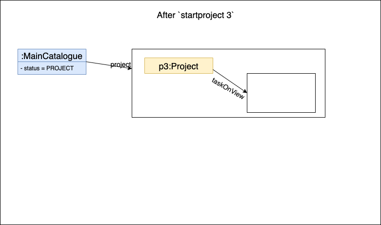
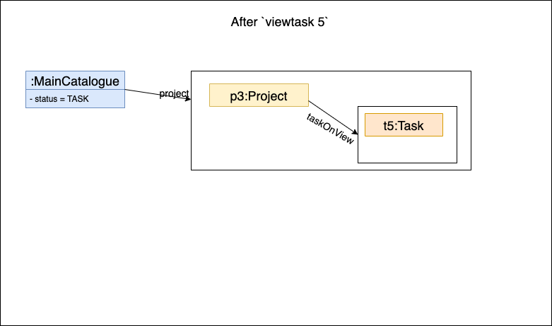
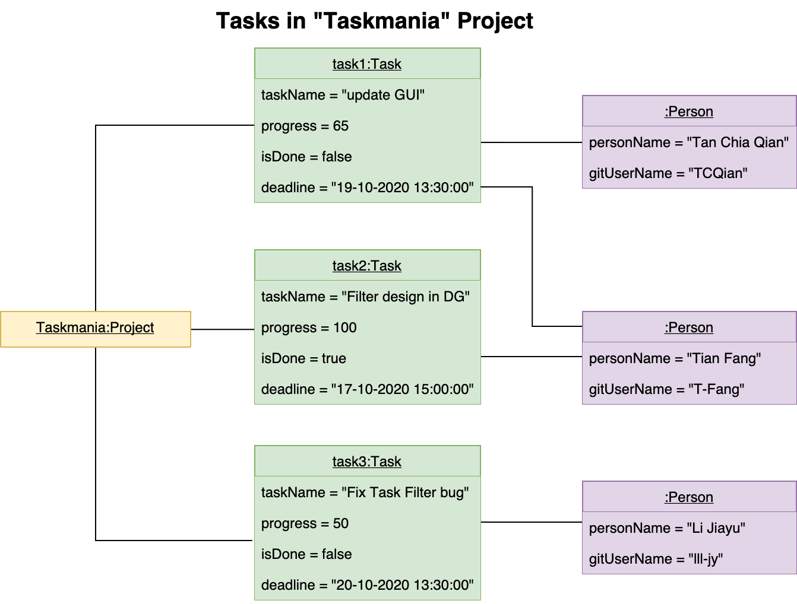
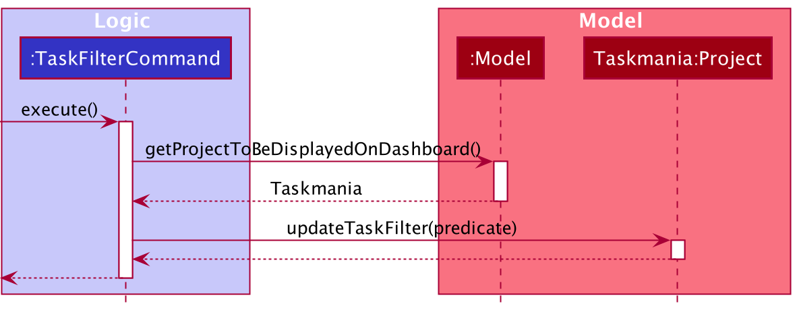
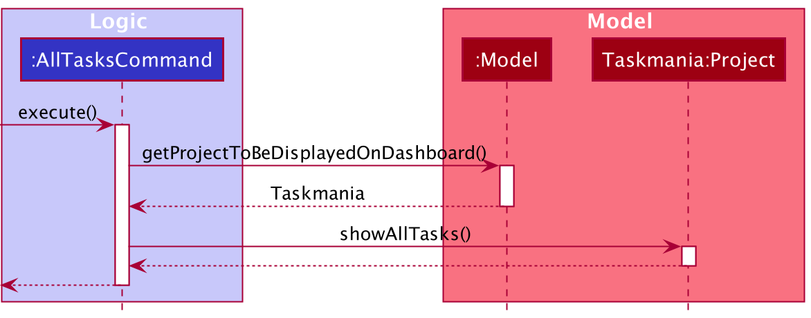
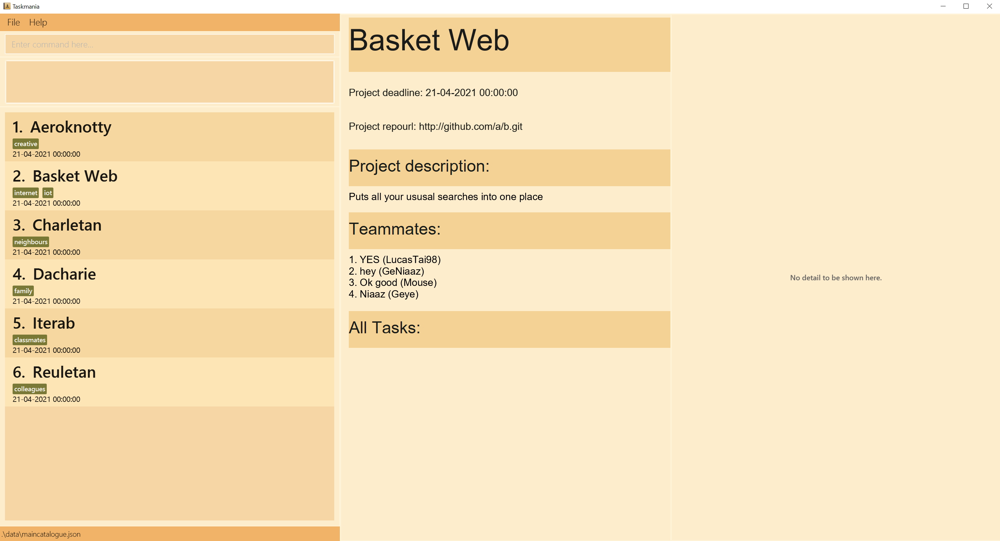

* Table of Contents
{:toc}

--------------------------------------------------------------------------------------------------------------------

## **Setting up, getting started**

Refer to the guide [_Setting up and getting started_](SettingUp.md).

--------------------------------------------------------------------------------------------------------------------

## **Design**

### Architecture

The ***Architecture Diagram*** given above explains the high-level design of the App. Given below is a quick overview of each component.

:bulb: **Tip:** The `.puml` files used to create diagrams in this document can be found in the [diagrams](https://github.com/se-edu/addressbook-level3/tree/master/docs/diagrams/) folder. Refer to the [_PlantUML Tutorial_ at se-edu/guides](https://se-education.org/guides/tutorials/plantUml.html) to learn how to create and edit diagrams.

**`Main`** has two classes called [`Main`](https://github.com/AY2021S1-CS2103T-W10-3/tp/blob/master/src/main/java/seedu/address/Main.java) and [`MainApp`](https://github.com/AY2021S1-CS2103T-W10-3/tp/blob/master/src/main/java/seedu/address/MainApp.java). It is responsible for,

* At app launch: Initializes the components in the correct sequence, and connects them up with each other.
* At shut down: Shuts down the components and invokes cleanup methods where necessary.

[**`Commons`**](#common-classes) represents a collection of classes used by multiple other components.

The rest of the App consists of four components.

* [**`UI`**](#ui-component): The User Interface of the App.
* [**`Logic`**](#logic-component): The command executor.
* [**`Model`**](#model-component): Holds the data of the App in memory.
* [**`Storage`**](#storage-component): Reads data from, and writes data to, the hard disk.

Each of the four components,

* defines its *API* in an `interface` with the same projectName as the Component.
* exposes its functionality using a concrete `{Component Name} Manager` class (which implements the corresponding API `interface` mentioned in the previous point.

For example, the `Logic` component (see the class diagram given below) defines its API in the `Logic.java` interface
 and exposes its functionality using the `LogicManager.java` class which implements the `Logic` interface.

**How the architecture components interact with each other**

The *Sequence Diagram* below shows how the components interact with each other for the scenario where the user issues
 the command `delete 1`.

The sections below give more details of each component:

<!--The lifelines should not stop at the end of the activation bars-->

### UI component

**API** :
[`Ui.java`](https://github.com/AY2021S1-CS2103T-W10-3/tp/blob/master/src/main/java/seedu/address/ui/Ui.java)

The UI consists of a `MainWindow` that is made up of parts e.g.`CommandBox`, `ResultDisplay`, `ProjectListPanel`, 
`StatusBarFooter`, `ProjectDashboard`, `EmptyDashboard`, `TaskDashboard`, `TeammateDashboard`, `MeetingDashboard`
 etc. All these, including the `MainWindow`, inherit from the abstract `UiPart` class.

The `UI` component uses JavaFx UI framework. The layout of these UI parts are defined in matching `.fxml` files that are 
in the `src/main/resources/view` folder. For example, the layout of the [`MainWindow`](https://github.com/AY2021S1-CS2103T-W10-3/tp/blob/master/src/main/java/seedu/address/ui/MainWindow.java) is specified in [`MainWindow.fxml`](https://github.com/AY2021S1-CS2103T-W10-3/tp/blob/master/src/main/resources/view/MainWindow.fxml)

The `UI` component,

* Executes user commands using the `Logic` component.
* Listens for changes to `Model` data so that the UI can be updated with the modified data.

### Logic component

**API** :
[`Logic.java`](https://github.com/AY2021S1-CS2103T-W10-3/tp/blob/master/src/main/java/seedu/address/logic/Logic.java)

1. `Logic` component uses the `MainCatalogueParser` class to parse the user command.
1. This results in a `Command` object which is executed by the `LogicManager` (only commands with correct scope will be generated: refer to "Scoping feature").
1. The command execution can affect the `Model` (e.g. adding a project).
1. The result of the command execution is encapsulated as a `CommandResult` object which is passed back to the `Ui`.
1. In addition, the `CommandResult` object can also instruct the `Ui` to perform certain actions, such as displaying help to the user.

Given below is the Sequence Diagram for interactions within the `Logic` component for the `execute("delete 1")` API call.

:information_source: **Note:** The lifeline for `DeleteCommandParser` should end at the destroy marker (X) but due to a limitation of PlantUML, the lifeline reaches the end of diagram.

### Model component

**API** : [`Model.java`](https://github.com/AY2021S1-CS2103T-W10-3/tp/blob/master/src/main/java/seedu/address/model/Model.java)

The `Model`,

* stores a `UserPref` object that represents the user’s preferences.
* stores the main catalogue data, which is essentially a list of `Project`s, each of which has a few `Participant`s who can do tasks and attend meetings.
* exposes an unmodifiable `ObservableList<Project>` that can be 'observed' e.g. the UI can be bound to this list so that the UI automatically updates when the data in the list change.
* does not depend on any of the other three components.

### Storage component

**API** : [`Storage.java`](https://github.com/se-edu/addressbook-level3/tree/master/src/main/java/seedu/address/storage/Storage.java)

<!--Use composition instead of aggregation?-->

The `Storage` component,

* can save `Project` objects, `Person` objects, `Task` objects, `Meeting` objects and their details in json format and read it back.
* can save the main catalogue data in json format and read it back.

### Common classes

Classes used by multiple components are in the `seedu.addressbook.commons` package.

--------------------------------------------------------------------------------------------------------------------

## **Implementation**

This section describes some noteworthy details on how certain features are implemented.

### Scoping feature

#### Implementation

The scoping mechanism is facilitated by an `enum` class `Status` in `MainCatalogue`. Possible values of `Status` are `CATALOGUE`, `PROJECT`, `PERSON`, and `TASK`.
The possible values of `Status` form a hierarchy structure as follows. 

* `CATALOGUE`
  * `PROJECT`
    * `TASK`
  * `PERSON`

A lower-level scope always belongs to any parent scopes. For example, if the app is currently in `PROJECT` scope, it is also in the `CATALOGUE` scope. However, it is not necessarily in `TASK` scope because `TASK` is a child level of `PROJECT` and it is definitely not in `PERSON` scope because `PERSON` is parallel to `PROJECT`.

The `status` of `MainCatalogue` is open to be accessed in other `Model` components and `Logic` components by a public getter. The `MainCatalogue` has a field `project` which is an `Optional` object of `Project`. 
This is a pointer to the project that is expected to be the focus for the application if it is in the `PROJECT` or lower status. Similarly, there is a pointer in each `Project` to keep the task of focus if the application is in `TASK` status.
The switch of `status` is implemented by the following operations:

* `MainCatalogue#enter(Project project)` — Switches to `PROJECT` status and updates the project on view to the given project.
* `MainCatalogue#enterTask(Task task)` — Switches to `TASK` status and updates the task on view to the given task.
* `MainCatalogue#quit()` — Switches to the parent status, and clear the lower-level pointer.

These operations are exposed in `Model` and `Logic` interfaces with the same name.

In the GUI design of the application, the three columns correspond to three levels of the status. The left column refers to the top level, which is `CATALOGUE`, and it thus consists of a list of projects. The middle column refers to the middle level, which can be `PROJECT` or `PERSON`, and it shows the details of the project or person of focus as stored in `MainCatalogue`. The right column refers to the bottom level, which can be `TASK`, and it shows the details of the object this status refers to that is of focus as stored in its parent object (project or person).

Users are allowed to switch the scoping status while using the app using user input commands. Relevant commands include:

* `StartCommand` — Enters a project with its index in the current filtered list of projects and switches to `PROJECT` status. This corresponds to `enter` method.
* `ViewTaskCommand` — Requests to view the detailed information of a task. This corresponds to `enterTask` method.
* `LeaveCommand` — Leaves the current object of focus, i.e. Switches to the parent status and clear the lower-level pointer. This corresponds to `quit` method.

All commands have a restriction on the scope. This is seen in `CommandParser`. If a command is invoked but the application is not in the correct scoping status, an `InvalidScopeException`
would be thrown and an error message would be shown on the GUI.

Step 1. The user launches the application. The default status of scope is `CATALOGUE`, and `project` in `MainCatalogue` is initialized to an empty `Optional` object.

:information_source: **Note:** At this stage, commands at non-`CATALOGUE` level cannot be executed.

The following sequence diagram shows how scoping works in the application.

Step 2. The user executes `start 3` command to view the details of the project of index 3 in the main catalogue. The `start` command
calls `enter`, causing a switch of scoping status and assignment of `project` of focus in `MainCatalogue`.

:information_source: **Note:** The `start` command calls `enter` method in model, causing a switching of level and updates the project of focus.

The following sequence diagram shows the execution of start command.

Step 3. The user executes `viewtask 5` command to view the details of the task of index 5 in the filtered task list of current project.
The `viewtask` command calls `enterTask`, causing a switch of scoping status and assignment of `taskOnView` in the current project.

:information_source: **Note:** The `viewtask` command calls `enterTask` method in model, causing a switching of level and updates the task of focus.

The following sequence diagram shows the execution of view task command.

Step 4. The user executes `start 2` command to view details of project of index 2 in the current list of projects instead.
The scope is switched to `PROJECT`, project of focus is updated to a new project and the task on view is updated to empty.

Step 5. The user executes `leave` command to go to the parent status.
Currently the application is at `PROJECT` status, so after execution of `leave` command, the new status would be `CATALOGUE`.
The `leave` command calls `quit` method.

:information_source: **Note:** The `leave` command calls `quit` method in model, causing a switching of level and updates the project and task of focus.

The following sequence diagram shows the execution of leave command. Note that the leave command will do nothing if the application is already in the `CATALOGUE` scope.

The following activity diagram summarizes the scoping features when a user executes a new command:

#### Design consideration:

##### Aspect: How the scope is checked

* **Alternative 1 (current choice):** Parses a command only if the scoping is valid.
  * Pros: Easy to implement.
  * Cons: May increase coupling because parser needs to know the status.

* **Alternative 2:** Checks the validity of scope of a command upon execution.
  * Pros: Will not increase coupling with parser.
  * Cons: The scoping features of each command are not explicitly seen, and may increase coupling with command.
### New Task feature

The implementation of the task feature involves adding new tasks created in the 'Project' class and storing them with a JsonAdaptedTask class which is contained by the JsonAdaptedProject class.

Tasks can also be assigned to a person. The task is then added to the assignee's associated Participation object.

The new task command has to be prefixed with 'addtask' and include **all** of the following fields:
 - `tn/` prefix followed by the name of the Task
 - `tp/` prefix followed by the percentage of the task that has been finished
 - `done/` prefix followed by the status of the task, whether it is finished
 - `td/` prefix followed by the deadline of the task
 
The task can also be edited with the command 'edittask' and include **any** of the following fields:
  - `tn/` prefix followed by the name of the Task
  - `tp/` prefix followed by the percentage of the task that has been finished
  - `done/` prefix followed by the status of the task, whether it is finished
  - `d/` prefix followed by a description of the task
  - `td/` prefix followed by the deadline of the task

 *Each of the fields above is validated upon entry by the user, and failing the validation, will display to the user that the command failed, and requesting the user to try again.*

Given below is an example usage scenario and how the add task and edit task mechanism behaves at each step.

After entering the project scope of a chosen project, the user enters the command to add a new task such as "addtask n/Create Person class tp/25 done/false td/9-11-2020 00:00:00".
The command text is passed into `LogicManager` (an implementation of Logic) which passes the raw text into the `MainCatalogueParser` to validate the first command word, which in this case is `addtask`. A new instance of `AddTaskCommandParser` class is then created which proceeds to parse the various fields of the command. Any invalid fields such as invalid field prefixes or invalid format of data would throw an exception at this stage. 

If the fields are all valid, a new `Task` object would be created passed into the `AddTaskCommand` class. 

Within the `AddTaskCommand` class, an instance of `AddTaskCommand` is created, along with an instance of the task created in the same class and this instance of `Command` is passed back to `LogicManager`.

LogicManager then calls the method `execute` of the `AddTaskCommand` which stores the task into the respective project's task list.

### Filtering feature

#### Implementation

The implementation of task filter and meeting filter is similar. We will use task filter as an example to explain how the filtering mechanism works. The task filtering mechanism is facilitated by the predicte `taskFilter` kept in the Project class. When `UI` component requested for the filtered and sorted task list, the task list filtered by the `taskFilter` will be returned. 

Tasks can be filtered by following attributes of a Task (using command `filtert PREFIX/ATTRIBUTE`):

- the Github user name `GitUserName` of one of the task's assignees (prefix: `ta/`)
- the task's name: `taskName` (prefix: `tn/`)
- the task's deadline: `deadline` (prefix: `td/`)
- the task's progress: `progress` (prefix: `tp/`)
- whether the task is done: `isDone` (prefix: `done/`)

The predicate is generated in the `TaskFilterCommandParser` and encapsulated by the `TaskFilterCommand` that the paser returns. When the `TaskFilterCommand` is executed, the `taskFilter` of the current project will be updated and  `UI` will be refreshed automatically.

When the user want to clear the filter using `allt` , the `taskFilter` of the current project will be changed to a predicate that always returns true. Then, the `UI` will correspondingly show all the tasks in the current project.

Given below is an example usage scenario and how the task filtering mechanism behaves at each step:

Step 1. The user uses `start` to open a project called "Taskmania". Suppose there are currently three tasks in this project: `task1`, `task2`, and `task3`. There are three persons involved: a person named "Tan Chia Qian" whose Github username is "TCQian", a person named "Tian Fang" whose Github username is "T-Fang" and a person named "Li Jiayu" whose Github username is "lll-jy".  `task1` is assigned to "Tan Chia Qian" and "Tian Fang", `task2` is assigned to "Tian Fang", and `task3` is assigned to "Li Jiayu".

Step 2. The user executes `filtert ta/T-Fang` command to find all tasks that have assignee whose Github username is "T-Fang". the command is eventually passed to `TaskFilterCommandParser` and the parser will identify the type of the filtering condition using the prefix entered and create the corresponding task predicate. In this case, `ta/` indicates that a predicate that filter tasks by their assignees' Github usernames should be created. Then when the `TaskFilterCommand` return by the parser is executed by the `LogicManager`, the `TaskFilterCommand` will get the current project ("Taskmania") from the `Model` and update the `taskFilter` predicate inside the "Taskmania" project. Therefore, the filtered task list of "Taskmania" will only contain `task1` and `task2`.

:information_source: **Note:** The lifeline for `TaskFilterCommandParser` should end at the destroy marker (X) but due to a limitation of PlantUML, the lifeline reaches the end of diagram.

Step 3. After seeing tasks that has been assign to "Tian Fang", the user wants to take a look at other tasks in "Taskmania". The user executes `allt` to see all the tasks in the "Taskmania". the `MainCataloguePaser` parses the command and creates a `AllTasksCommand`. When the `AllTasksCommand` is executed, it will get the current project ("Taskmania") from the `Model` and call the `showAllTasks()` method inside the "Taskmania" project. Then the `taskFilter` inside "Taskmania" will be replaced by a predicate that always returns true and all the tasks will be shown.

In the example above, the users can also filter the task list in different ways and the `taskFilter` predicate in "Taskmania" will be updated correspondingly:

- `filtert tn/Filter` : `task2` and `task3` will be displayed
- `filtert tp/50`: `task3` will be displayed
- `filtert done/false`:`task1` and `task3` will be displayed
- `filtert td/19-10-2020 13:30:00 `:`task1` will be displayed

The following activity diagram summarizes what happens when a user executes a task filter command:

#### Design consideration:

##### Aspect: Which attribute of assignees should be used to filter tasks

* **Alternative 1 (current choice):** Assignee's Github username
  * Pros: Avoid viewing tasks of another person with the same personName. (Github username is unique)
  * Cons: The user might not always remember the GitHub usernames of team members.

* **Alternative 2:** Assignee's personName
  * Pros: More intuitive when there are no team members with the same name.
  * Cons: If two team members have the same name, the task filter by their name will display tasks that have been assigned to any of them.

##### Aspect: Whether to clear filter when user re-enters the project

* **Alternative 1 (current choice):** Keep filters and display filtered tasks/meetings when the user re-enters the project
  * Pros: Task/meeting list remains unchanged (e.g. the user don't have to filter everytime (s)he re-enters the same project if (s)he only wants to see tasks assigned to him/her ) .
  * Cons: Users might forget there are other tasks if they don't use `allt` to check.
* **Alternative 2:** Clear filter when the user re-enters the project
  * Pros: The user always gets to see all the tasks every time (s)he enters the project.
  * Cons: The user have to filter everytime (s)he re-enters the same project if (s)he only wants to see tasks assigned to him/her.

##### Aspect: Which data structure is better for filtering tasks in a project

* **Alternative 1 (current choice):** Use `Set<Task>` to store the tasks
  * Pros: There will be no duplicated tasks in the `set`.
  * Cons: Need extra steps to convert the set into a `Stream`, and convert the `Stream` into a  `List`.

* **Alternative 2:** Use `List<Task>`to
  * Pros: Has built-in method to filter the task list.
  * Cons: The same task might be duplicated in the `List`.
  
### New Teammate feature

#### Implementation

The implementation of New Teammate involves both the storing of the New Teammate in memory through the use of `Participation` as well as storing the Teammate in the JSON file on the hard disk using the `Storage` class. 

The New Teammate created is added in the following places:
 - global static variable `allPeople` in the Person class 
 - within the project it was created for, in the associated Participation class

The New Teammate command has to be prefixed with `newteammate` and include **all** of the following fields:
 - `mn/` prefix followed by the name of the new teammate
 - `mg/` prefix followed by the teammate's Github User Name
 - `mp/` prefix followed by the phone number of the teammate
 - `me/` prefix followed by the email of teammate
 - `ma/` prefix followed by the address of the teammate
 - *Each of the fields above is validated upon entry by the user, and failing the validation, will display to the user that the command failed, and requesting the user to try again.*

The teammate is created in the project scope and assigned to that project. Further assignment of that user to other projects can be done in the scope of other projects.

Given below is an example usage scenario and how the `NewTeammate` mechanism behaves at each step:

Step 1: The user enters `start 1` for example to start project 1 from the mainscreen.The user is greeted with the projects list on the left, and the description of the project in the centre.

Step 2: The user enters a New Teammate command such as `newteammate mn/John Ivy mg/Ivydesign98 mp/82938281 me/imjon@gmail.com ma/13 Cupertino Loop`. The command text is passed into `LogicManager` (an implementation of Logic) which passes the raw text into the `MainCatalogueParser` to validate the first command word, which in this case is `newteammate`. A new instance of `TeammateCommandParser` class is then created which proceeds to parse the various fields of the command. Any invalid fields such as invalid field prefixes or invalid format of data would throw an exception at this stage. 

If the fields are all valid, a new `Person` object would be created in the same class and passed into the `NewTeammateCommand` class. 

Within the `NewTeammateCommand` class, an instance of `NewTeammateCommand` is created, along with an instance of the teammate created in the same class and this instance of `Command` is passed back to `LogicManager`.

LogicManager then calls the method `execute` of the NewTeammateCommand which stores the teammate into the respective project's participation list, and for the project to be stored in the teammate's participation list. While seeming to increase coupling, it however keeps both classes separate and would not break each other when something is changed.

The diagram below summarises what is happening above with the help of a sequence diagram:

The diagram below gives a short overview on what happens when a user's input is received:

<!--TODO: Task and Meeting implementation-->

--------------------------------------------------------------------------------------------------------------------

## **Documentation, logging, testing, configuration, dev-ops**

* [Documentation guide](Documentation.md)
* [Testing guide](Testing.md)
* [Logging guide](Logging.md)
* [Configuration guide](Configuration.md)
* [DevOps guide](DevOps.md)

--------------------------------------------------------------------------------------------------------------------

## **Appendix: Requirements**

### Product scope

**Target user profile**: team leaders who are managing software projects:

* has a growing number of projects and team members to manage
* prefers desktop apps over mobile apps 
* can type fast and prefers typing to mouse interactions
* is tech-savvy and reasonably comfortable using CLI apps

**Value proposition**: manage projects, team members, and tasks on a unified platform as opposed to scattered on
 different messaging platforms

### User stories

Priorities: High (must have) - `* * *`, Medium (nice to have) - `* *`, Low (unlikely to have) - `*`
<!-- need to be updated according to our final product -->

| Priority | As a …​                                 | I want to …​                | So that I can …​                                                     |
| -------- | ------------------------------------------ | ------------------------------ | ---------------------------------------------------------------------- |
| `* * *`  | new user                                   | see usage instructions         | refer to instructions when I forget how to use the App                 |
| `* * *`  | project team leader                        | see tasks assigned to members  | better know the progress of my team                                    |
| `* * *`  | project team leader                        | add a project                  |                      |
| `* *`  | project team leader                        | view projects of a member      | assess a specific member's workload |
| `* *`    | project team leader                | view a dashboard of my project   | see at a glance what needs to be done for a project               |
| `* * *`      | forgetful user | add in members' information           | keep track of my members' contact information                                                 |
| `* * *`    | fast typing user               | use a Command line type Interface   | have higher efficiency when managing my team's workload               |

### Use cases

#### System: Project Profile Tracking System (PTS)

**Use Case: UC1 - Create New Project**

**Actor:** User

**MSS:**

1. User creates a new project profile.
2. PTS asks for the details of project such as `projectName`, `deadline`, `repoUrl` and `projectDescription`.
3. User keys in the details.
4. PTS stores the project profile into the data file.

   Use case ends.

**Extensions**
      
 * 3a. The given details are not valid.
   * 3a1. PTS shows an error message.
   
   Use case resumes at 3.

**Use Case: UC2 - Edit Existing Project Profile**

**Actor:** User

**MSS:**

1. User chooses to edit a project profile.
2. Same as <u>UC1</u> 2-4.

   Use case ends.

**Extensions**

 * 1a. The project profile does not exist.
   * 1a1. PTS shows an error message.
   
   User case resumes at 1.

#### System: Team Members Tracking System (TMTS)

**Use Case: UC3 - Add A Team Member**

**Actor:** User

**MSS:**

1. User creates a new team member profile.
2. TMTS asks for the details of the team member such as `personName`, `phone`, `email`, and `gitUserName`.
3. User keys in the details.
4. TMTS stores the team member's profile into the data file.

   Use case ends.

**Extensions**
   
 * 3a. The given details are not valid.
   * 3a1. TMTS shows an error message.
   
   Use case resumes at 3.

**Use Case: UC4 - Edit An Existing Team Member**

**Actor:** User

**MSS:**

1. User chooses to edit a team member's profile.
2. PTS asks for the `gitUserName` of the team member whose profile is to be edited.
3. User keys in the `gitUserName` of the team member.
4. Same as <u>UC3</u> 2-4.

   Use case ends.

**Extensions**

 * 3a. Person with the given `gitUserName` does not exist.
   * 3a1. TMTS shows an error message.
   
   User case resumes at 3.
   
#### System: Project Management System (PMS)

**Use case: UC5 - Start A Project**

**Actor:** User

**MSS:**

1. User requests to find a project.
2. PMS shows a filtered list of projects according to the conditions of the project to find given by the User.
3. User requests to start a target project with its index.
4. PMS shows the dashboard of the project.

   Use case ends.

**Extensions**

 * 1a. The conditions result in an empty filtered list of projects.
   * 1a1. PMS shows an error message.
   
   Use case resumes at 1.
   
 * 3a. The index is not valid.
   * 3a1. PMS shows an error message.
   
   Use case resumes at 3.
 
 * 3b. The project has already been shown on the dashboard.
 
   Use case ends.

**Use case: UC6 - Find A Task**

**Precondition:** The application has already started a project.

**Actor:** User

**MSS:**

1. User requests to find a task.
2. PMS asks for specifications for filtering.
3. User provides details of the task wanted such as `taskName`, `description`, and `assignee`s. <!-- have we allowed multiple assignee-searching? -->
4. PMS shows the list of filtered tasks with given specifications.

   Use case ends.

**Extensions:**

 * 4a. Task wanted is not in the filtered list.
   
   Use case resumes at 3.
   
**Use case: UC7 - Add A New Task**

**Precondition:** The application has already started a project.

**Actor:** User

**MSS:**

1. User requests to add a task in a project.
2. PMS asks for details of the task such as `taskName`, and `deadline`.
3. User keys in details.
4. PMS stores the task's profile into the data file.
5. User <u>UC6: finds the task</u> just added.
6. PMS shows a filtered list of task including the new task added.
7. User requests to assign the task to a team member.
8. PMS associates the task with the team member and stores in the data file.
9. Repeat 7-8 until all assignees have been added.

   Use case ends.

**Extensions**
   
 * 3a. The given details are not valid.
   * 3b1. PMS shows an error message. 

   Use case resumes at 3.
 
 * 5a. The task is intended for no assignees.
 
   Use case ends.
 
 * 5b. The task can be easily found in the current list.
 
   Use case resumes at 7.

 * 7a. The input task index is invalid or the team member is not found in the project.
   * 7a1. PMS shows an error message.

   Use case resumes at 7.

 * 7b. The task has already been associated with the team member.
   * 7b1. PMS shows an error message.

   Use case resumes at 9.

**Use Case: UC8 - View Task Details**

**Actor:** User

**Precondition:** The application has already started a project.

**MSS:**

1. User <u>UC6: finds the task</u> wanted.
2. PMS shows a filtered list of task including the new task added.
3. User requests to view the task.
4. PMS asks for the task index.
5. User keys in the task index.
6. PMS shows the profile of the task.

   Use case ends.

 * 5a. The given task number is not found.
   * 5a1. PMS shows an error message.
   
   Use case resumes at 5.

**Use case: UC9 - Delete A Task**

**Precondition:** The application has already started a project.

**Actor:** User

**MSS:**

1. User <u>UC6: finds the task</u> wanted to be deleted.
2. PMS shows a filtered list of task including the new task added.
3. User requests to delete the task.
4. PMS asks for the task index.
5. User keys in the task index.
6. PMS deletes the task in the project and updates the data file.

   Use case ends.

**Extensions**
   
 * 5a. The given task number is not found.
   * 5a1. PMS shows an error message.
   
   Use case resumes at 5.

### Non-Functional Requirements

1.  The application should work on any _mainstream OS_ (tested on Windows, Mac, Linux) as long as it has Java `11` or above installed.
1.  The application should be able to hold up to 30 projects and 150 members without a noticeable drop in performance.
1.  The application can function without an internet connection.
1.  A user with above average typing speed for regular English text (i.e. not code, not system admin commands) 
should be able to accomplish most of the tasks faster using commands than using the mouse.
1.  There are checks for the inputs the user gives, and corresponding tips are presented if the input format is incorrect.
1.  There are `help` commands to tell the user what command does what.
1.  Information is presented in a pleasing way.
1.  New user can learn the software easily and quickly (so that other team members can help organize or add tasks if they want to)
1.  Tests are written for important components, and every working prototype must pass all the test first.
1.  Code is written in an easy-to-maintain manner (e.g. no extremely long function).

### Glossary

* **Mainstream OS**: Windows, Linux, Unix, OS-X.
* **Member**: A person belonging to a member of a team leader's team. <!-- need to be re-written -->
* **Task**: Something that has to be done with relation to a project to complete it. <!-- this is not a glossary but a note. Need a glossary -->
* **Project**: A project with a deadline, tasks, and members allocated to those tasks.
<!-- may add more: e.g. person, participation, start, user, index -->

--------------------------------------------------------------------------------------------------------------------

## **Appendix: Instructions for manual testing**

Given below are instructions to test the app manually.

:information_source: **Note:** These instructions only provide a starting point for testers to work on;
testers are expected to do more *exploratory* testing.

### Launch and shutdown
<!-- this part has not been written -->
1. Initial launch

   1. Download the jar file and copy into an empty folder

   1. Double-click the jar file Expected: Shows the GUI contains of three columns. The leftmost column contains 
   command box, a result display box, and a set of sample projects. The middle column shows a project dashboard while
   the rightmost column shows a task or teammate or meeting dashboard.

1. Saving window preferences

   1. Resize the window to an optimum size. Move the window to a different location. Close the window.

   1. Re-launch the app by double-clicking the jar file. 
       Expected: The most recent window size and location is retained.

### Deleting a project

1. Deleting a project while all projects are being shown

   1. Prerequisites: List all projects using the `list` command. Multiple projects in the list.

   1. Test case: `delete 1` 
      Expected: First contact is deleted from the list. Details of the deleted contact shown in the status message. Timestamp in the status bar is updated.

   1. Test case: `delete 0` 
      Expected: No project is deleted. Error details shown in the status message. Status bar remains the same.

   1. Other incorrect delete commands to try: `delete`, `delete x`, `...` (where x is larger than the list size) 
      Expected: Similar to previous.

1. _{ more test cases …​ }_

### Saving data

1. Dealing with missing/corrupted data files

   1. _{explain how to simulate a missing/corrupted file, and the expected behavior}_
1. _{ more test cases …​ }_
