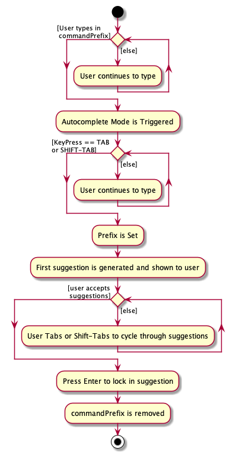
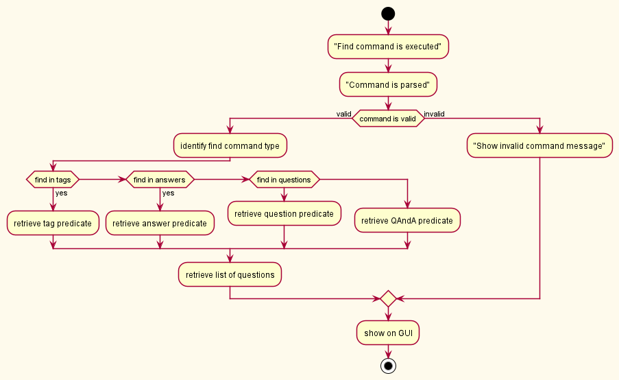
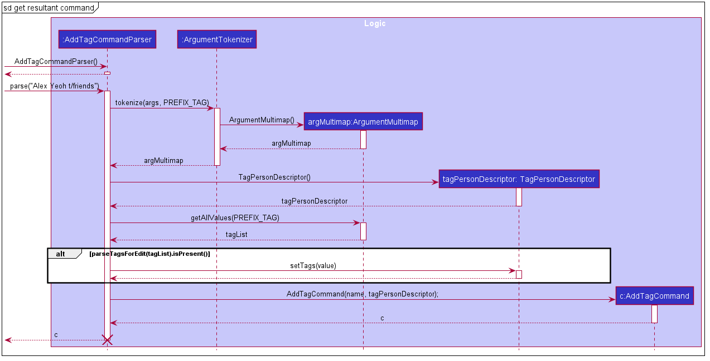
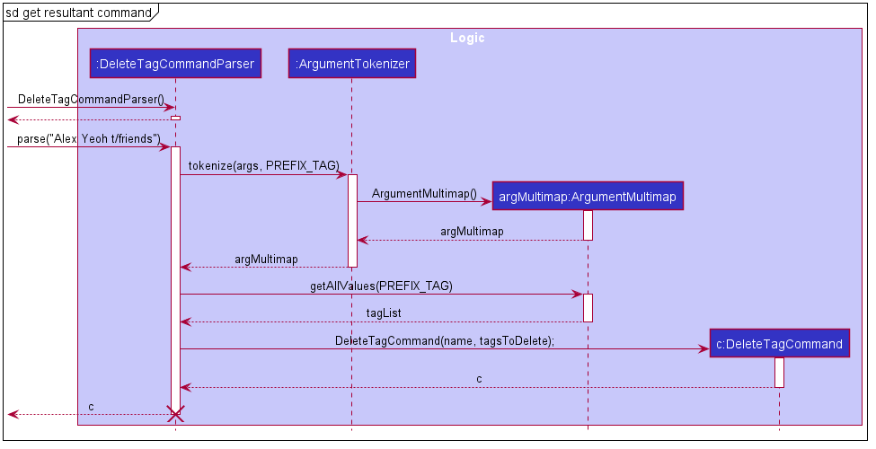
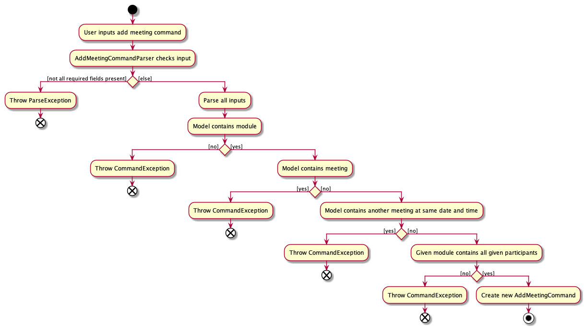
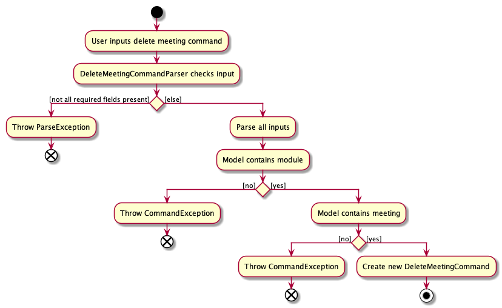
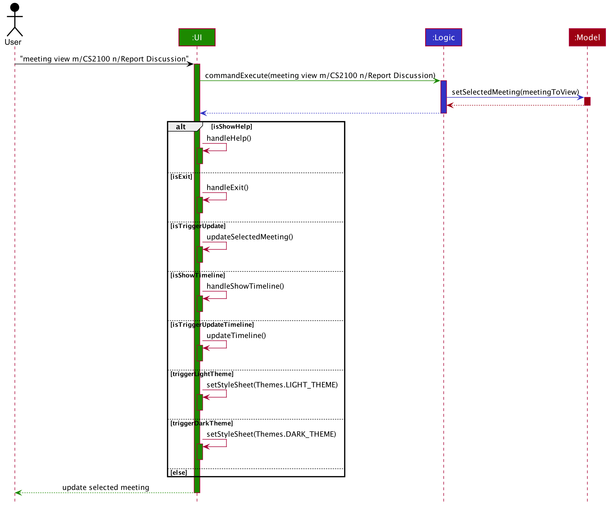
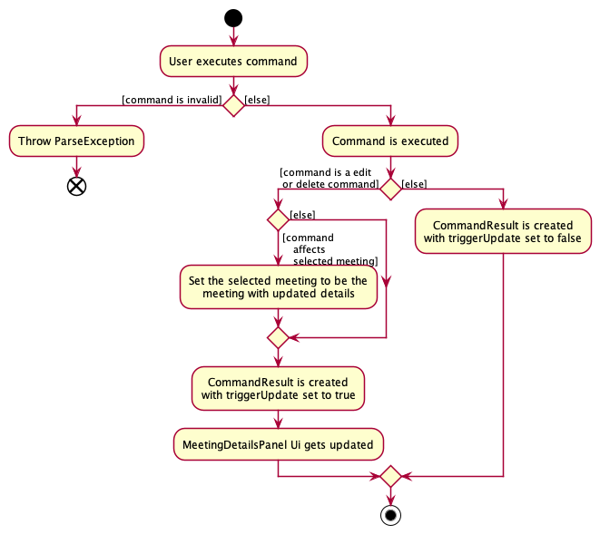
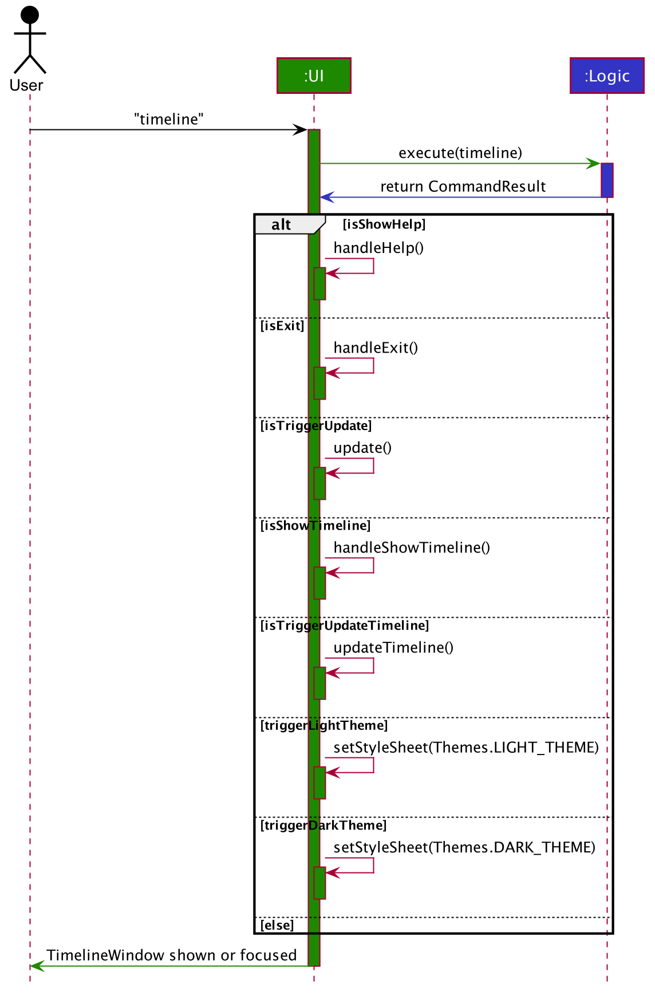

* Table of Contents
{:toc}

--------------------------------------------------------------------------------------------------------------------

## **Setting up, getting started**

Refer to the guide [_Setting up and getting started_](SettingUp.md).

--------------------------------------------------------------------------------------------------------------------

## **Design**

### Architecture


The ***Architecture Diagram*** given above explains the high-level design of the App. Given below is a quick overview of each component.

<div markdown="span" class="alert alert-primary">

:bulb: **Tip:** The `.puml` files used to create diagrams in this document can be found in the [diagrams](https://github.com/se-edu/addressbook-level3/tree/master/docs/diagrams/) folder. Refer to the [_PlantUML Tutorial_ at se-edu/guides](https://se-education.org/guides/tutorials/plantUml.html) to learn how to create and edit diagrams.

</div>

**`Main`** has two classes called [`Main`](https://github.com/se-edu/addressbook-level3/tree/master/src/main/java/seedu/address/Main.java) and [`MainApp`](https://github.com/se-edu/addressbook-level3/tree/master/src/main/java/seedu/address/MainApp.java). It is responsible for,
* At app launch: Initializes the components in the correct sequence, and connects them up with each other.
* At shut down: Shuts down the components and invokes cleanup methods where necessary.

[**`Commons`**](#common-classes) represents a collection of classes used by multiple other components.

The rest of the App consists of four components.

* [**`UI`**](#ui-component): The UI of the App.
* [**`Logic`**](#logic-component): The command executor.
* [**`Model`**](#model-component): Holds the data of the App in memory.
* [**`Storage`**](#storage-component): Reads data from, and writes data to, the hard disk.

Each of the four components,

* defines its *API* in an `interface` with the same name as the Component.
* exposes its functionality using a concrete `{Component Name}Manager` class (which implements the corresponding API `interface` mentioned in the previous point.

For example, the `Logic` component (see the class diagram given below) defines its API in the `Logic.java` interface and exposes its functionality using the `LogicManager.java` class which implements the `Logic` interface.


**How the architecture components interact with each other**

The *Sequence Diagram* below shows how the components interact with each other for the scenario where the user issues the command `contact delete Alex Yeoh`.


The sections below give more details of each component.

### UI component


**API** :
[`Ui.java`](https://github.com/se-edu/addressbook-level3/tree/master/src/main/java/seedu/address/ui/Ui.java)

The UI consists of a `MainWindow` that is made up of parts e.g.`CommandBox`, `ResultDisplay`, `PersonListPanel`, `StatusBarFooter` etc. All these, including the `MainWindow`, inherit from the abstract `UiPart` class.

The `UI` component uses JavaFx UI framework. The layout of these UI parts are defined in matching `.fxml` files that are in the `src/main/resources/view` folder. For example, the layout of the [`MainWindow`](https://github.com/se-edu/addressbook-level3/tree/master/src/main/java/seedu/address/ui/MainWindow.java) is specified in [`MainWindow.fxml`](https://github.com/se-edu/addressbook-level3/tree/master/src/main/resources/view/MainWindow.fxml)

The `UI` component,

* Executes user commands using the `Logic` component.
* Listens for changes to `Model` data so that the UI can be updated with the modified data.

### Logic component


**API** :
[`Logic.java`](https://github.com/se-edu/addressbook-level3/tree/master/src/main/java/seedu/address/logic/Logic.java)

1. `Logic` uses the `AddressBookParser` class to parse the user command.
1. This results in a `Command` object which is executed by the `LogicManager`.
1. The command execution can affect the `Model` (e.g. adding a person).
1. The result of the command execution is encapsulated as a `CommandResult` object which is passed back to the `Ui`.
1. In addition, the `CommandResult` object can also instruct the `Ui` to perform certain actions, such as displaying help to the user.

Given below is the Sequence Diagram for interactions within the `Logic` component for any user input.


Given below are the Sequence Diagrams for the `execute("contact delete Alex Yeoh")` API call.


<div markdown="span" class="alert alert-info">:information_source: **Note:** The lifeline for `DeleteCommandParser` should end at the destroy marker (X) but due to a limitation of PlantUML, the lifeline reaches the end of diagram.
</div>

### Model component


**API** : [`Model.java`](https://github.com/se-edu/addressbook-level3/tree/master/src/main/java/seedu/address/model/Model.java)

The `Model`,

* stores a `UserPref` object that represents the user’s preferences.
* stores the address book data.
* exposes an unmodifiable `ObservableList<Person>` that can be 'observed' e.g. the UI can be bound to this list so that the UI automatically updates when the data in the list change.
* does not depend on any of the other three components.


<div markdown="span" class="alert alert-info">:information_source: **Note:** An alternative (arguably, a more OOP) model is given below. It has a `Tag` list in the `AddressBook`, which `Person` references. This allows `AddressBook` to only require one `Tag` object per unique `Tag`, instead of each `Person` needing their own `Tag` object.<br>


</div>


### Storage component


**API** : [`Storage.java`](https://github.com/se-edu/addressbook-level3/tree/master/src/main/java/seedu/address/storage/Storage.java)

The `Storage` component,
* can save `UserPref` objects in json format and read it back.
* can save the address book data in json format and read it back.

### Common classes

Classes used by multiple components are in the `seedu.addressbook.commons` package.

--------------------------------------------------------------------------------------------------------------------

## **Implementation**

This section describes some noteworthy details on how certain features are implemented.

### Autocomplete Feature


#### Overview
The following activity diagram gives a high level overview of the Autocomplete logic.



From this diagram we see that there is 2 states of the mechanism:

* `isAutocompleteMode` — Which is triggered after user has typed in `commandPrefix`.
* `hasSetPrefix` — Set using `Tab` / `Shift-Tab` while in autocomplete mode.

There are also 2 other important terms which are used, first of which is the `commandPrefix`. This refers to the specific series of characters that when the user inputs into a TextField, will trigger
the autocomplete mode. And secondly, `prefix` which refers to the string that will be used to generate the suggestions. In the image below, "cn/" is the `commandPrefix` while
"alex" is the `prefix`.


#### Structure of Autocomplete

The autocomplete mechanism is facilitated by `AutocompleteModule` which can be attached to a JavaFX `TextField`. 
An instance of `AutocompleteModule` will must be binded to one `TextField` object which will be enhanced with Autocomplete capabilities. 
`AutocompleteModule` will setup the relevant listeners to its attached `TextField` object and will internally store and managed the `isAutocompleteMode` and `hasSetPrefix` states. 
This feature also makes use of the `Suggestions` class to facilitate suggestion generation based on given `prefix`. Below is a class diagram representing this structure.


This new feature exposes 2 new public function of `AutocompleteModule` :
* `attachTo(TextField textField)` — This method attaches the given `TextField` with the autocomplete module and returns the new `AutocompleteModule` object.
* `addSuggestions(String commandPrefix, Suppler<List<Strings>> data)` — Attaches a new autocomplete trigger which triggers autocomplete mode with `commandPrefix` and generates suggestions from `data` supplier.

Now we can do a deeper dive into the mechanisms of the feature by examining a sample usuage.

#### Deep Dive : Autocomplete Mechanism

Given below is an example usage scenario and how the autocomplete mechanism behaves at each step.

##### Initialization

Sample Initialisation Code Snippet :

```
// In MainWindow.java
CommandBox commandBox = new CommandBox(cmdExecutor);
TextField commandTextField = commandBox.getCommandTextField()

AutocompleteModule acMod = AutocompleteModule.attachTo(commandTextField);
acMod.addSuggestions("cname/", () -> List.of("Alice", "Bob", "Charlie")).collect(Collectors.toList()));
```

The above code first initialises a sample `CommandBox` object from which we extract out it's `TextField` object. We then proceed to attach the `AutocompleteModule` to the `TextField` object
and add a sample `Suggestions` object (with commandPrefix "cname/" and generating suggestions from an arbitary list).
Below is a sequence diagram explaining how a `AutocompleteModule` enhances the `TextField` object.


Refer to the Side Note in this section on why `disableFocusTraversal()` is required.

##### Triggering Autocomplete Mode

With the autocomplete module has been attached, Autocomplete mode will be triggered when the last few characters in the `TextField` matches the command prefix. In this case its `cname/`, and upon typing this prefix
the command box text will turn yellow signalling that the user is in autocomplete mode. In this mode, anything the user types after the command prefix till the point the user presses `TAB` will be
considered the `prefix` that will be used to generate suggestions. After `TAB` pressed, prefix is set and first suggestions is shown. Pressing `TAB` or `Shift-TAB` will allow users to cycle through the suggestions forward and backward respectively.
Below is the sequence diagram for this flow.


##### Exiting Autocomplete Mode

There are two ways to exit autocomplete mode : by pressing `Enter` or `Backspace`. Below's sequence diagram illustrates the difference between the two.


From the diagram, we see that pressing `backspace` only unsets the prefix but does not take the user out of the autocomplete mode, allowing user to adjust their prefix to generate more accurate suggestions.
On the other hand, pressing `Enter` allows the user to lock in their suggestion, taking user out of the autocomplete mode and removing the command prefix.

#### Design consideration:

##### Aspect: Autocomplete Trigger

* **Alternative 1 (current choice):** Check substring from caret position
  * Pros: Able to support names with spaces.
  * Cons:
      * Slightly more difficult to implement, as there are more edge cases.
      * User can only enter autocomplete mod at the end of strings and not in the middle.

* **Alternative 2:** Using regex to match pattern (e.g. `.*<CMD_PREFIX>\S*`)
  * Pros:
      * Less complex code. (Lesser Conditionals)
      * Able to support moving caret around to adjust suggestion
  * Cons: Unable to support names with spaces as space is the delimiter.

#### Side Note

Because we iterate through autocompletion suggestions using `Tab` and `Shift-Tab` which conflicts with the inbuilt
focus traversals commands. We have to disable it using the `AutocompleteCommandBox#DisableFocusTraversal()` operation.

### Clearing all Contacts

The mechanism to clear all contacts is facilitated by `ClearCommand`. It extends `Command` and implements the following methods:

* `ClearCommand#execute` - Clears the Selected Meeting and resets the AddressBook, ModuleBook and MeetingBook to a new empty AddressBook, ModuleBook and MeetingBook respectively.

This operation is exposed in the `LogicManager` class as `LogicManager#execute`.

#### Resetting the AddressBook

Execution Code Snippet :

```
model.setSelectedMeeting(null);
model.setAddressBook(new AddressBook());
model.setMeetingBook(new MeetingBook());
model.setModuleBook(new ModuleBook());
```

The above code snippet sets the AddressBook in the `model` to a new `AddressBook` object. Thus, resetting the AddressBook.
As modules and meetings cannot exist without contacts, the code also sets the MeetingBook and ModuleBook in the `model`
to a new `MeetingBook` and `ModuleBook` object respectively, which resets both books. As there are no existing meetings,
the SelectedMeeting is set to `null`.

Given below are the sequence diagrams of how the mechanism behaves when called using the `contact clear` command.


### Listing all Contacts

The mechanism to list all contacts is facilitated by `ListCommand`. It extends `Command` and implements the following methods:

* `ListCommand#execute` - Displays all Persons in the AddressBook.

This operation is exposed in the `LogicManager` class as `LogicManager#execute`.

#### Displaying all Persons in Modduke

Execution Code Snippet :

`model.updateFilteredPersonList(PREDICATE_SHOW_ALL_PERSONS);`

The above code snippet updates the `FilteredList` of Persons in the `model` using the `PREDICATE_SHOW_ALL_PERSONS`. This fills the `FilteredList` with all Persons in the AddressBook and displays it.

Given below are the sequence diagrams of how the mechanism behaves when called using the `contact list` command.


### Deleting Contacts

The mechanism to delete contacts is facilitated by `DeleteCommand`. It extends `Command` and implements the following methods:

* `DeleteCommand#execute` - Deletes Persons in the AddressBook according to the user input.

This operation is exposed in the `LogicManager` class as `LogicManager#execute`.

#### Parsing the User Input

The parsing of user input for `DeleteCommand` is facilitated by `DeleteCommandParser`. It extends `Parser` and implements the following methods:

* `DeleteCommandParser#parse` - Parses the user input and returns the appropriate DeleteCommand

##### Checking for Argument Prefixes

Code Snippet :

```
if (arePrefixesPresent(argMultimap, PREFIX_NAME, PREFIX_TAG, PREFIX_MODULE)) {
    // implementation
} else if (arePrefixesPresent(argMultimap, PREFIX_NAME, PREFIX_TAG)) {
    // implementation
} else if (arePrefixesPresent(argMultimap, PREFIX_NAME, PREFIX_MODULE)) {
    // implementation
} else if (arePrefixesPresent(argMultimap, PREFIX_MODULE, PREFIX_TAG)) {
    // implementation
} else if (arePrefixesPresent(argMultimap, PREFIX_NAME)) {
    // implementation
} else if (arePrefixesPresent(argMultimap, PREFIX_TAG)) {
    // implementation
} else if (arePrefixesPresent(argMultimap, PREFIX_MODULE)) {
    // implementation
} else {
    throw new ParseException(String.format(MESSAGE_INVALID_COMMAND_FORMAT, DeleteCommand.MESSAGE_USAGE));
}

```
The above code snippet will check the prefixes present in the argument. It starts by checking if all valid prefixes are present,
then a combination of 2 prefixes, then lone prefixes and throws a `ParseException` if there are no prefixes present.

##### Choosing a Predicate

In order to find the Persons in the AddressBook who match the given arguments, `DeleteCommandParser` will pass the appropriate Predicate into
`DeleteCommand`. These are Predicates available and the code snippets of their `test` methods:
* `FullNameMatchesKeywordPredicate` - Finds Persons whose full names match the given arguments following the `n/` prefix
```
return keywords.stream()
        .anyMatch(keyword -> person.getName().fullName.toLowerCase().equals(keyword.toLowerCase()));
```
* `PersonHasTagsPredicate` - Finds Persons who have the tags that match the given arguments following the `t/` prefix
```
return tags.stream()
        .anyMatch(tag -> person.getTags().contains(tag));
```
* `PersonHasTagsAndNamePredicate` - Finds Persons whose full names match the given arguments following the `n/` prefix or have the tags that match the given arguments following the `t/` prefix
```
return names.stream()
        .anyMatch(keyword -> person.getName().fullName.toLowerCase().equals(keyword.toLowerCase()))
        ||
        tags.stream()
        .anyMatch(tag -> person.getTags().contains(tag));
```

#### Checking if Person is in a Module

In order to find Persons who are in the given Modules, a List of `ModuleNames` is passed into the `DeleteCommand` by the `DeleteCommandParser`.
Then the `DeleteCommand#execute` method calls `model#GetUpdatedFilteredPersonList` with its `predicate` and the List to retrieve Persons in the give Modules.

Retrieving Modules Code Snippet :

```
List<Module> moduleList = new ArrayList<>();
for (ModuleName name : modules) {
    Module m = moduleBook.getModule(name)
            .orElseThrow(() -> new CommandException(
                    String.format("Module %s does not exist.", name.toString())));
    moduleList.add(m);
}
```
The above code snippet is from `ModelManager#GetUpdatedFilteredPersonList` and will look through the `moduleBook` for the given Module. If the Module exists, it adds it to the List module.

Combining Predicates Code Snippet :

```
Predicate<Person> combined = x -> predicate.test(x)
        || moduleList.stream()
        .anyMatch(m -> m.getClassmates().contains(x));
return new FilteredList(filteredPersons, combined);
```
The above code snippet is from `ModelManager#GetUpdatedFilteredPersonList` and it creates a new `Predicate` that checks if a Person passes
the predicate passed into the method or is in any of the Modules in the List module. Then it uses this `Predicate` to obtain a `FilteredList`
of Persons that satisfy the `Predicate`.

##### No given Modules

If there are no given Modules, then the `DeleteCommand#execute` method calls `model#GetUpdatedFilteredPersonList` with its `predicate` only.

Obtaining FilteredList Code Snippet :
```
return new FilteredList(filteredPersons, predicate);
```

The above code snippet is from `ModelManager#GetUpdatedFilteredPersonList` and it will simply use the given `predicate` to
obtain a `FilteredList` of Persons that satisfy the `Predicate`.

#### Deleting the Filtered Persons

Once the `DeleteCommand` has retrieved the `FilteredList` of Persons, it will delete all Persons in that `FilteredList` from Modduke.

Deleting Persons Code Snippet :
```
people.stream().forEach(p -> {
    model.deletePerson(p); // delete in AddressBook
    model.updatePersonInMeetingBook(p); // delete in MeetingBook
    model.updatePersonInModuleBook(p); // delete in ModuleBook
});
```
The above code snippet will iterate through all Persons in the `FilteredList` and delete them from the `AddressBook`, `MeetingBook` and `ModuleBook`.
If any Meeting or Module does not have any more members as a result of this deletion, then they will be deleted as well.
If a Module is deleted, all Meetings of that Module are also deleted.

#### Activity Diagram

Given below is the activity diagram of how the mechanism behaves when called using the `contact delete` command.


### Copying Email Address/Phone Number of Contacts

The mechanism to copy information from contacts is facilitated by `CopyCommand`. It extends `Command` and implements the following methods:

* `CopyCommand#execute` - Copy email addresses or phone numbers of Persons in the AddressBook according to the user input.

This operation is exposed in the `LogicManager` class as `LogicManager#execute`.

#### Parsing the User Input

The parsing of user input for `CopyCommand` is facilitated by `CopyCommandParser`. It extends `Parser` and implements the following methods:

* `CopyCommandParser#parse` - Parses the user input and returns the appropriate CopyCommand

The mechanism used to parse user input is very similar to that of `DeleteCommandParser`, except that `CopyCommandParser`
also identifies the preamble in the arguments.

##### Identifying the Preamble

Identifying Preamble Code Snippet :

```
boolean isEmail;
String preamble = argMultimap.getPreamble().trim().toLowerCase();
if (preamble.equals("email")) {
    isEmail = true;
} else if (preamble.equals("phone")) {
    isEmail = false;
} else {
    throw new ParseException(String.format(MESSAGE_INVALID_COMMAND_FORMAT, CopyCommand.MESSAGE_USAGE));
}
```
The above code snippet will check the preamble in the argument. It assigns the boolean `isEmail` to `true` if the user
wants to copy email addresses, `false` if the user wants to copy phone numbers and throws a `ParseException` otherwise.

#### Retrieving the Filtered Persons

The mechanism used by `CopyCommand` to obtain the `FilteredList` of Persons is identical to that of `DeleteCommand`.

#### Copying Information from the Filtered Persons

Once the `CopyCommand` has retrieved the `FilteredList` of Persons, it will copy information from all Persons in that `FilteredList` from Modduke.

Obtaining Information from Persons Code Snippet :
```
if (isEmail) {
    // gets email addresses from Persons in people
    results = people.stream()
            .map(p -> p.getEmail().toString())
            .reduce("", (x, y) -> x + " " + y);
} else {
    // gets phone numbers from Persons in people
    results = people.stream()
            .map(p -> p.getPhone().toString())
            .reduce("", (x, y) -> x + " " + y);
}
```
The above code snippet will check if the user wants to copy email adresses or phone numbers using the `isEmail` boolean.
Then it iterates through the `FilteredList` of Persons and obtains the relavant information as Strings. Then it combines
the Strings into a single String.

Copying Information to Clipboard Code Snippet :
```
StringSelection selection = new StringSelection(results);
Clipboard clipboard = Toolkit.getDefaultToolkit().getSystemClipboard();
clipboard.setContents(selection, selection);
```
The above code snippet will then create a new `StringSelection` object using the single String of information and copy
the `StringSelection` into the user's system clipboard.

#### Activity Diagram

Given below is the activity diagram of how the mechanism behaves when called using the `copy` command.


### Finding Contacts

The mechanism to find contacts is facilitated by `FindCommand`. It extends `Command` and implements the following methods:

* `FindCommand#execute` - Display Persons in the AddressBook according to the user input.

This operation is exposed in the `LogicManager` class as `LogicManager#execute`.

#### Parsing the User Input

The parsing of user input for `FindCommand` is facilitated by `FindCommandParser`. It extends `Parser` and implements the following methods:

* `FindCommandParser#parse` - Parses the user input and returns the appropriate FindCommand

The mechanism used to parse user input is very similar to that of `DeleteCommandParser`, except that `FindCommandParser`
does not look for the `m/` prefix when parsing the arguments. So it does not pass a List of Modules into the `FindCommand`.
It also uses the `NameContainsKeywordPredicate` and `PersonHasTagsAndKeywordInNamePredicate` instead.

#### Displaying the Filtered Persons

In order to display the Filtered Persons, the `FindCommand` calls `model#updateFilteredPersonList` with its `predicate`.

Update Filtered Person List Code Snippet :
```
filteredPersons.setPredicate(predicate);
```
The above code snippet is from `ModelManager#updateFilteredPersonList` and it sets predicate of the `filteredPersons` of the model
to the given predicate. Doing so will display the Persons who satisfy the conditions specified in the user input.

#### Activity Diagram

Given below is the activity diagram of how the mechanism behaves when called using the `contact find` command.



### Tagging Contacts

The mechanism to tag contacts is facilitated by `AddTagCommand`, `ClearTagCommand` and `DeleteTagCommand`. They
extends `Command` and implement the following methods:

* `AddTagCommand#execute` - Adds the specified tags to the specified Person in the AddressBook according to the user input.
* `ClearTagCommand#execute` - Clears all tags of the specified Person in the AddressBook in the user input.
* `DeleteTagCommand#execute` - Deletes the specified tags from the specified Person in the AddressBook according to the user input.
These operations are exposed in the `LogicManager` class as `LogicManager#execute`.

#### Parsing User Input

The parsing of user input for `AddTagCommand`, `ClearTagCommand` and `DeleteTagCommand` is facilitated by
`AddTagCommandParser`, `ClearTagCommandParser` and `DeleteTagCommandParser` respectively. They extend `Parser`
and implement the following methods:

* `AddTagCommandParser#parse` - Parses the user input and returns the appropriate AddTagCommand
* `ClearTagCommandParser#parse` - Parses the user input and returns the appropriate ClearTagCommand
* `DeleteTagCommandParser#parse` - Parses the user input and returns the appropriate DeleteTagCommand

All three parsers are identical except that they return their respective commands and `AddTagCommandParser` and `DeleteTagCommandParser`
parses for the `t/` prefix in the arguments.

##### Obtaining a Name Object

All three parsers call `ParserUtil#parseName` to obtain a `Name` object based on the given name in the user input.
`AddTagCommandParser` and `DeleteTagCommandParser` pass in the preamble of the argument into `ParserUtil#parseName`,
while `ClearTagCommandParser` passes in the entire argument.

Parse Name Code Snippet :
```
String trimmedName = name.trim();
if (!Name.isValidName(trimmedName)) {
    throw new ParseException(Name.MESSAGE_CONSTRAINTS);
}
return new Name(trimmedName);
```
The above code snippet if from `ParserUtil#parseName` and it will check if the given name is in a valid format. If it is
it creates and returns a new `Name` object with the given name. Otherwise, it throws a `ParseException`. This `Name` object
is passed into the respective command object that will be returned by each parser.

##### Obtaining a List of Tags

This is only applicable to `AddTagCommandParser` and `DeleteTagCommandParser`. Both parsers obtain a List of
Strings that follow the `t/` prefix from the argument. Then it obtains a Set of Tags Strings.

Obtaining Set of Tag Strings Code Snippet:
```
if (tags.size() == 1 && tags.contains("")) {
    return Optional.empty();
}
Collection<String> tagSet = tags;
return Optional.of(ParserUtil.parseTags(tagSet));
```
The above code snippet checks for an empty String in the List of Strings. If it has an empty String, then it returns
an empty `Optional` object. Otherwise, it returns an `Optional` of the Set with the Strings in the given List.

Then both parsers check if the `Optional` object is empty. If it is, a `ParseException` is thrown. Otherwise, `AddTagCommandParser`
passes the Set of Strings inside the `Optional` into a `TagPersonDescriptor` which is passed into the `AddTagCommand`
while `DeleteTagCommandParser` passes the Set of Strings into the `DeleteCommand`. These commands are the commands
that will be returned by each parser respectively.

#### Modifying the Specified Person

`AddTagCommand`, `ClearTagCommand` and `DeleteTagCommand` will first check if there is a Person with the `Name` object
given by their parsers using `model#hasPersonName`. If there does not exist a Person, then a `CommandException` is thrown.
Otherwise, the Person with the name is obtained from the AddressBook. This Person is then modified by each command accordingly.
* `AddTagCommand` - Adds tags to the Person based on the `TagPersonDescriptor` given by `AddTagCommandParser`

Adding Tags Code Snippet :
```
Set<Tag> updatedTags = new HashSet<>(personToTag.getTags());

if (tagPersonDescriptor.getTags().isPresent()) {
    updatedTags.addAll(tagPersonDescriptor.getTags().get());
}

return new Person(personToTag.getName(), personToTag.getPhone(), personToTag.getEmail(), updatedTags);
```
* `ClearTagCommand` - Clears all tags of the Person
```
return new Person(personToClear.getName(), personToClear.getPhone(), personToClear.getEmail(), new HashSet<>());
```
* `DeleteTagCommand` - Deletes all tags from the Person based on the Set of Strings given by `DeleteTagCommandParser`.
Throws a `CommandException` if the Person does not have a specifed tag.
```
if (tags.stream().allMatch(tag -> personToEdit.getTags().contains(tag))) {
    Set<Tag> updatedTags = new HashSet<>(personToEdit.getTags());
    updatedTags.removeAll(tags);
    return new Person(personToEdit.getName(), personToEdit.getPhone(), personToEdit.getEmail(), updatedTags);
} else {
    throw new CommandException(
            String.format("The person '%s' does not have all the tags provided.",
                    personToEdit.getName().toString()));
}
```

#### Updating Modduke

Once they have obtained the modified Person, they replace the original Person with the modified one in the `AddressBook`,
`MeetingBook` and `ModuleBook`.

Updating Modduke Code Snippet :

```
model.setPerson(personToTag, taggedPerson);

model.updatePersonInMeetingBook(personToTag, taggedPerson);

model.updatePersonInModuleBook(personToTag, taggedPerson);
```

The above code snippet updates the Person in each of the three books.

#### Sequence Diagram

Given below are the sequence diagrams of how the mechanism behaves when called using the `tag add` command.




Given below are the sequence diagrams of how the mechanism behaves when called using the `tag clear` command.


Given below are the sequence diagrams of how the mechanism behaves when called using the `tag delete` command.




### Adding a Meeting

#### Implementation

The add meeting mechanism is primarily facilitated by `AddMeetingCommand`. It extends `Command` and implements the `execute` operation:

* `execute(Model model)` — Executes the `AddMeetingCommand` on the model,
creating and adding a new meeting in the `Model Manager` before creating a `CommandResult`,
triggering a UI update in `MeetingListPanel`

This operation is exposed in the Command class as `Command#execute`

#### Parsing the user input
The parsing of the user input for `AddMeetingCommand` is facilitated by `AddMeetingCommandParser`.
`AddMeetingCommandParser` extends Parser and implements the following methods:
* AddMeetingCommandParser#parse — Parses the user input and returns the appropriate `AddMeetingCommand`

`AddMeetingCommandParser` checks that all compulsory fields are provided in the user input and throws a `ParseException` if the user does not conform to the expected format.
The user input is the parsed in the context of the `AddMeetingCommand`.

#### Executing the user input

##### Check if model contains given module
`AddMeetingCommand` checks if the model contains the given module. If not, a `CommandException` is thrown, indicating that the module does not exist in the model.

##### Check if model contains given meeting
`AddMeetingCommand` checks if the model contains the given meeting, identified by the unique combination of module and meeting name.
Meetings are identified by their modules and names for deletion, editing and viewing.
If the given meeting already exists in the model, a `CommandException` is thrown, indicating that the user is trying to add a duplicate meeting.

##### Check if model contains another meeting at same date and time
`AddMeetingCommand` checks if the model contains another meeting at the same time and date as the given meeting.
We assume that a user is unable to attend two meetings simultaneously at the same time and date.
If there is another meeting with conflicting time and date, a `CommandException` is thrown.

##### Check if given module contains given participants
`AddMeetingCommand` checks if the given participants are members of the given module.
We assume that all meetings occur between members of the same module.
If any one of the given participants are not members of the given module, a `CommandException` is thrown.

#### Activity Diagram
Given below is the activity diagram of how the logic component behaves when called using the `meeting add` command.


### Deleting a Meeting

#### Implementation

The delete meeting mechanism is primarily facilitated by `DeleteMeetingCommand`. It extends `Command` and implements the `execute` operation:

* `execute(Model model)` — Executes the `DeleteMeetingCommand` on the model,
creating and adding a new meeting in the `Model Manager` before creating a `CommandResult`,
triggering a UI update in `MeetingListPanel`

This operation is exposed in the Command class as `Command#execute`

#### Parsing the user input
The parsing of the user input for `DeleteMeetingCommand` is facilitated by `DeleteMeetingCommandParser`.
`DeleteMeetingCommandParser` extends Parser and implements the following methods:
* DeleteMeetingCommandParser#parse — Parses the user input and returns the appropriate `DeleteMeetingCommand`

`DeleteMeetingCommandParser` checks that all compulsory fields are provided in the user input and throws a `ParseException` if the user does not conform to the expected format.
The user input is the parsed in the context of the `DeleteMeetingCommand`.

#### Executing the user input

##### Check if model contains given module
`DeleteMeetingCommand` checks if the model contains the given module. If not, a `CommandException` is thrown, indicating that the module does not exist in the model.

##### Check if model contains given meeting
`DeleteMeetingCommand` checks if the model contains the given meeting, identified by the unique combination of module and meeting name.
If the given meeting does not exist in the model, a `CommandException` is thrown, indicating that the user is trying delete a non existent meeting.

#### Activity Diagram
Given below is the activity diagram of how the logic component behaves when called using the `meeting delete` command.


### Editing a Meeting

#### Implementation

The edit meeting mechanism is primarily facilitated by `EditMeetingCommand`. It extends `Command` and implements the `execute` operation:

* `execute(Model model)` — Executes the `EditMeetingCommand` on the model,
creating and adding a new meeting in the `Model Manager` before creating a `CommandResult`,
triggering a UI update in `MeetingListPanel`

This operation is exposed in the Command class as `Command#execute`

#### Parsing the user input
The parsing of the user input for `EditMeetingCommand` is facilitated by `EditMeetingCommandParser`.
`EditMeetingCommandParser` extends Parser and implements the following methods:
* EditMeetingCommandParser#parse — Parses the user input and returns the appropriate `EditMeetingCommand`

`EditMeetingCommandParser` checks that all compulsory fields are provided in the user input and throws a `ParseException` if the user does not conform to the expected format.
The user input is the parsed in the context of the `EditMeetingCommand`.

#### Executing the user input

##### Check if model contains given module
`EditMeetingCommand` checks if the model contains the given module. If not, a `CommandException` is thrown, indicating that the module does not exist in the model.

##### Check if model contains given meeting
`EditMeetingCommand` checks if the model contains the given meeting, identified by the unique combination of module and meeting name.
If the given meeting does not exist in the model, a `CommandException` is thrown, indicating that the user is trying to edit a non existent meeting.

##### Check if model contains edited meeting
`EditMeetingCommand` checks if the model contains the edited meeting, identified by the unique combination of module and meeting name.
If the edited meeting exists in the model, a `CommandException` is thrown, indicating that the user is trying to edit the meeting into a meeting that already exists.

##### Check if model contains another meeting at same date and time
`EditMeetingCommand` checks if the model contains another meeting at the same time and date as the edited meeting.
We assume that a user is unable to attend two meetings simultaneously at the same time and date.
If there is another meeting with conflicting time and date, a `CommandException` is thrown.

##### Check if given module contains given participants
`EditMeetingCommand` checks if the edited participants are members of the given module.
We assume that all meetings occur between members of the same module.
If any one of the edited participants are not members of the given module, a `CommandException` is thrown.

#### Activity Diagram
Given below is the activity diagram of how the logic component behaves when called using the `meeting edit` command.


#### EditMeetingDescriptor
`EditMeetingDescriptor` is a nested class within EditMeetingCommand to facilitate the creation of the edited meeting.
It stores the details to edit the meeting with and each non-empty field value will replace the corresponding field value of the given meeting.

### Viewing a Specific Meeting's Agendas and Notes

#### Implementation:

The mechanism to view a specific meeting's agendas and notes is primarily facilitated by the `ViewMeetingCommand`. It
extends `Command` and implements the `execute` operation:

• `execute(Model model)` - Executes the ViewMeetingCommand on the model, setting the selected meeting to update the
selected meeting field in the `ModelManager` before creating a `CommandResult` which triggers a UI update in
 `MainWindow`.

 <div markdown="span" class="alert alert-info">:information_source: **Note:** Although the `ViewMeetingCommand` is the
 main command to view the details of a selected meeting, other commands may also trigger UI updates for the selected
 meeting. For example, if the module name of the currently selected meeting is updated using the `EditModuleCommand`,
 a UI update will be triggered such that the changes will be reflected in the `MeetingDetailsPanel`.
 More details about this will be explained under design considerations.
 </div>

 As an illustration of the interactions between the different architectural components, given below is the sequence
 diagram for the `meeting view m/CS2100 n/Report Discussion` command execution.

 

When the Logic signals that an update is required, the following update method in `MainWindow` is invoked to update the
selected meeting user interface:

```
public void update() {
    logger.info("UI update triggered");
    if (logic.getSelectedMeeting() == null) {
        selectedMeetingPlaceholder.getChildren().remove(0);
    } else {
        MeetingDetailsPanel selectedMeeting = new MeetingDetailsPanel(logic.getSelectedMeeting(),
                logic.getFilteredMeetingList().indexOf(logic.getSelectedMeeting()) + 1);
        if (selectedMeetingPlaceholder.getChildren().size() == 1) {
            selectedMeetingPlaceholder.getChildren().set(0, selectedMeeting.getRoot());
        } else {
            selectedMeetingPlaceholder.getChildren().add(selectedMeeting.getRoot());
        }
    }
}
```

Given below is a object diagram of the initial state of the application. If the `MeetingBook` is not empty, the
`selectedMeeting` field in `ModelManager` will be set to the first meeting in the `MeetingBook`. Otherwise, it will be
set to null. Note that on the first launch, the `MeetingBook` is guaranteed to have sample data with the first meeting
being CS2100 Report Discussion. Irrelevant details have been omitted from the diagram.


Given below is the object diagram after the `meeting view m/CS2103 n/Weekly Meeting` command is executed.


#### Design Considerations:

##### Ensuring the UI gets updated whenever information about the selected meeting changes

As mentioned earlier, the `SelectedMeeting` details can be changed whenever information pertaining to the meeting gets
 deleted or edited. These are the following commands that can affect the `SelectedMeeting` details
 (namely all edit and delete commands):
* `DeleteCommand`
* `EditCommand`
* `DeleteMeetingCommand`
* `EditMeetingCommand`
* `DeleteModuleCommand`
* `EditModuleCommand`

Hence this feature is designed in such a way that whenever any of the above commands are executed, the Ui will be
updated accordingly if necessary.
Given below is the activity diagram which illustrates the workflow of this process:



##### Alternatives considered
* **Alternative 1 (current choice):** Boolean flag `triggerUpdate` in `CommandResult`
  * Pros:
      * Ease of implementation. (Simply set the flag to true for commands that need to update the Ui)
      * Ease of extension. (Can create additional boolean flags to update other parts of the Ui)
  * Cons:
      * Need to be wary of all cases (Must remember to adjust relevant commands to set `triggerUpdate` to true)
      * If there are many different Ui components that wish to get updated separately, can end up having many boolean
      attributes in `CommandResult`

* **Alternative 2:** JavaFX ObservableList
  * Pros:
      * Built in support for robust observer design pattern. (Don't have to reinvent the wheel)
  * Cons:
      * Using a list is not very suitable since `SelectedMeeting` is a single value.
      * Only certain JavaFX views can be used with ObservableList.

### Timeline Feature
The mechanism to display the timeline window is facilitated by `TimelineWindow`, which extends `UiPart`.
The components `TimelineSection` and `TimelineMeetingCard` help display various sections in the timeline window.


The `ShowTimelineCommand` triggers the timeline window to be displayed.



When the Logic signals that the `ShowTimelineCommand` has been triggered,
the following `handleShowTimeline` method in `MainWindow` is invoked to open the timeline window or focus on it if it is already opened.
```
public void handleShowTimeline() {
    logger.info("UI show timeline triggered");

    if (!timelineWindow.isShowing()) {
        timelineWindow.show();
    } else {
        timelineWindow.focus();
    }
}
```

Whenever an update has been made to the model that affects any of the components in timeline,
the following `updateTimeline` method in `MainWindow` is invoked.
```
public void updateTimeline() {
    timelineWindow.hide();
    timelineWindow = timelineWindow.updateLogic(logic);
}
```
The timeline window is hidden if it was open, and a new `TimelineWindow` object is created to match the new logic component.
The following commands affect the `TimelineWindow`:
* `EditCommand`
* `DeleteCommand`
* `ClearCommand`
* `EditModuleCommand`
* `DeleteModuleCommand`
* `AddMeetingCommand`
* `EditMeetingCommand`
* `DeleteMeetingCommand`

--------------------------------------------------------------------------------------------------------------------

## **Documentation, logging, testing, configuration, dev-ops**

* [Documentation guide](Documentation.md)
* [Testing guide](Testing.md)
* [Logging guide](Logging.md)
* [Configuration guide](Configuration.md)
* [DevOps guide](DevOps.md)

--------------------------------------------------------------------------------------------------------------------

## **Appendix: Requirements**

### Product scope

**Target user profile**

Anybody → Students → University Students → NUS Students → NUS Students handling multiple projects

* needs to keep track of contacts for various people (Professors, TA, Groupmates)
* needs to schedule school-related appointments
* needs to keep track of the date and time of school-related appointments
* needs to keep track of details of school-related appointments
* prefer desktop apps over other types
* can type fast
* prefers typing to mouse interactions
* is reasonably comfortable using CLI apps

**Value proposition**:

* seamless contact management which makes it easy to find relevant Professor, TA or Groupmates contacts
* convenient scheduling of project meetings and consultations, making planning a work week effortless
* effective visualisation of schedule and meeting details with the application's timeline dashboard and selected meeting panel
* enhanced user experience with features such as autocompletion, fuzzy find, command history, copying and theme switching

### User stories

Priorities: High (must have) - `* * *`, Medium (nice to have) - `* *`, Low (unlikely to have) - `*`

| Priority | As a …​                                    | I want to …​                                                                                                       | So that I can…​                                                                                                 |
| -------- | ------------------------------------------ | ------------------------------------------------------------------------------------------------------------------------ | ------------------------------------------------------------------------------------------------------------------ |
| `* * *`  | New user                                   | See usage instructions                                                                                                   | Have easy reference when I forget how to use the App                                                               |
| `* * *`  | NUS Student                                | Add contacts of people around me                                                                                         | Find them quickly and ensure that I don’t lose anyone's contact information                                        |
| `* * *`  | NUS Student                                | Delete a contact                                                                                                         | Remove old or unwanted contacts                                                                                    |
| `* * *`  | NUS Student                                | Edit an existing contact                                                                                                 | Change their contact details if it has changed                                                                     |
| `* * *`  | NUS Student                                | View my entire list of contacts                                                                                          | Select who I want to contact                                                                                       |
| `* * *`  | NUS Student                                | Clear all contacts                                                                                                       | Reset my contacts                                                                                                  |
| `* * *`  | NUS Student                                | Tag my contacts based on the individual's relationship with me (e.g. TA, Professor, Classmate)                           | Easily identify the contacts relevant to my query                                                                  |
| `* * *`  | NUS Student                                | Create meetings for events such as projects or consultations                                                             | I can keep track of commitments and upcoming work                                                                  |
| `* * *`  | NUS Student                                | Add relevant contacts to a meeting                                                                                       | Keep track of who is participating in the meeting and their contact information                                    |
| `* * *`  | Forgetful NUS Student                      | Assign a meeting a timeslot and date                                                                                     | Track exactly when I am supposed to meet                                                                           |
| `* * *`  | NUS Student with many meetings             | View all scheduled meetings                                                                                              | Have an overview of all my meetings                                                                                |
| `* * *`  | NUS Student with many meetings             | View agendas for meetings                                                                                                | Easily review agendas for my meetings                                                                              |
| `* * *`  | NUS Student with many meetings             | View notes for meetings                                                                                                  | Take and access notes for my meetings                                                                              |
| `* * *`  | NUS Student with a changing schedule       | Edit meetings                                                                                                            | Change the details of my meetings                                                                                  |
| `* * *`  | NUS Student with a changing schedule       | Delete meetings                                                                                                          | Remove cancelled meetings                                                                                          |
| `* * *`  | NUS Student                                | Create meetings with professors                                                                                          | Track when I have set up meetings with professors and TA’s                                                         |
| `* * *`  | NUS Student taking many modules            | Create modules                                                                                                           | Add new modules whenever needed                                                                                    |
| `* * *`  | NUS Student taking many modules            | View relevant groups of contacts by modules                                                                              | I can easily keep track of contact details of individuals in different modules                                     |
| `* * `   | User with easily strained eyes             | Switch between light and dark mode                                                                                       | Reduce eye strain when using the application during different times of the day                                     |
| `*   `   | NUS Student                                | Hide private contact details                                                                                             | Minimize chances of someone else seeing them by accident                                                           |
| `*   `   | Student who likes to personalise stuff     | Customise the layout of the App                                                                                          | I can organise relevant information in personalised way that I find easy to access                                 |

### Use cases

(For all use cases below, the **System** is the `Modduke` and the **Actor** is the `user`, unless specified otherwise)

**UC01: Add a Contact**

**MSS**

1.  User requests to add a contact to the list
2.  Modduke adds the contact

 Use case ends.

**Extensions**

* 1a. Name, phone number or email field is missing.

  * 1a1. Modduke shows an error message.

    Use case ends.

* 1b. Contact with the same name already exists.

  * 1b1. Modduke shows an error message.

    Use case ends.


**UC02: Delete a Contact**

**MSS**

1.  User requests to list contacts
2.  Modduke shows a list of contacts
3.  User requests to delete a specific contact in the list
4.  Modduke deletes the contact

 Use case ends.

**Extensions**

* 2a. The list is empty.

    Use case ends.

* 3a. The given name is invalid.

  * 3a1. Modduke shows an error message.

    Use case resumes at step 2.


**UC03: Edit a Contact**

**MSS**

1.  User requests to list contacts
2.  Modduke shows a list of contacts
3.  User requests to edit a specific contact in the list
4.  Modduke edits the contact

 Use case ends.

**Extensions**

* 2a. The list is empty.

    Use case ends.

* 3a. No optional field is provided.

  * 3a1. Modduke shows an error message.

    Use case resumes at step 2.

* 3b. The given name is invalid.

  * 3b1. Modduke shows an error message.

    Use case resumes at step 2.


**UC04: View Contacts**

**MSS**

1.  User requests to list contacts
2.  Modduke shows a list of contacts

 Use case ends.

**Extensions**

* 2a. The list is empty.

    Use case ends.

**UC05: Tag a Contact**

**MSS**

1.  User requests to list contacts
2.  Modduke shows a list of contacts
3.  User requests to tag a specific contact in the list
4.  Modduke tags the contact

 Use case ends.

**Extensions**

* 2a. The list is empty.

    Use case ends.

* 3a. The given name is invalid.

  * 3a1. Modduke shows an error message.

    Use case resumes at step 2.

* 3b. No tags are provided.

  * 3b1. Modduke shows an error message.

    Use case resumes at step 2.


**UC06: Clear all Contacts**

**MSS**

1.  User requests to clear all existing contacts.
2.  Modduke deletes all existing contacts.

 Use case ends.

**UC07: Clear Contacts**

**MSS**

1.  User makes request to clear all contacts
2.  Modduke clears all contacts

    Use case ends.

**UC08: Add Meeting**

**MSS**

1.  User makes request to add a meeting
2.  Modduke accepts request and creates meeting

    Use case ends.

**Extensions**

* 1a. Module Name, Meeting Name, Date, Time or Participants are missing.

  * 1a1. Modduke shows an error message.

    Use case ends
    
* 1b. Given module does not exist in Modduke.

  * 1b1. Modduke shows an error message.

    Use case ends    

* 1c. Meeting with the same combination of module and meeting name already exists.

  * 1c1. Modduke shows an error message.

    Use case ends.
    
* 1d. Meeting with the same date and time already exists.

  * 1d1. Modduke shows an error message.

    Use case ends.
    
* 1e. Participants indicated are not in given module.

  * 1e1. Modduke shows an error message.

    Use case ends.

**UC09: Delete Meeting**

**MSS**

1.  User makes request to delete a specific meeting
2.  Modduke accepts request and makes changes to meeting

    Use case ends.
    
**Extensions**

* 1a. Specified combination of module and meeting does not exist.

  * 1a1. Modduke shows an error message.

    Use case ends
    
**UC08: Edit Meeting**

**MSS**

1.  User makes request to edit a meeting
2.  Modduke accepts request and creates meeting

    Use case ends.

**Extensions**

* 1a. No field to edit was provided.

  * 1a1. Modduke shows an error message.

    Use case ends
    
* 1b. Given module does not exist in Modduke.

  * 1b1. Modduke shows an error message.

    Use case ends    

* 1c. Specified combination of module and meeting does not exist.

  * 1c1. Modduke shows an error message.

    Use case ends

* 1d. Edited meeting has the same combination of module and meeting name as an existing meeting.

  * 1d1. Modduke shows an error message.

    Use case ends.
    
* 1e. Edited meeting results in the same date and time as an existing meeting exists.

  * 1e1. Modduke shows an error message.

    Use case ends.
    
* 1f. New participants indicated are not in given module.

  * 1f1. Modduke shows an error message.

    Use case ends.

**UC09: View Selected Meeting Details**

**MSS**

1.  User chooses to view details of a meeting
2.  Modduke accepts request and displays both agendas and notes for the selected meeting
    
    Use case ends.
    
**Extensions**

* 1a. Modduke detects invalid command format.

  * 1a1. Modduke gives an alert for the invalid command format.

    Use case ends
    
* 1b. User enters a meeting that does not exist.

  * 1b1. Modduke shows a message informing user that the meeting provided is not in the meeting list.

    Use case ends  
    

**UC10: List Meetings**

**MSS**

1.  User makes request to list all meetings
2.  Modduke accepts request and displays all meetings

    Use case ends.
    
**UC08: View Meeting**

Use case same as UC09: Delete Meeting

**UC10: View Timeline**

**MSS**

1.  User makes request to view timeline window
2.  Modduke accepts request and displays timeline window

    Use case ends.

**Extensions**

* 1a. Consult Name is missing.

  * 1a1. Modduke shows an error message.

    Use case ends

* 1b. Consult with the same name already exists.

  * 1b1. Modduke shows an error message.

    Use case ends.

**UC12: Set Time/Date for Consult**

**MSS**

1.  User makes request to edit a specific consult
2.  Modduke accepts request and makes changes to consult

    Use case ends.
    
**UC13: Switch to light theme**

**Guarantees**

*  The theme set will be light theme regardless of current theme

**MSS**

1.  User makes request to switch to light theme
2.  Modduke switches to light theme

    Use case ends.

**UC14: Switch to dark theme**

**Guarantees**

*  The theme set will be dark theme regardless of current theme

**MSS**

1.  User makes request to switch to dark theme
2.  Modduke switches to dark theme

    Use case ends.

**Extensions**

* 1a. Consult Name is missing.

  * 1a1. Modduke shows an error message.

    Use case ends.

* 1b. Consult with the same name already exists.

  * 1b1. Modduke shows an error message.

    Use case ends.

### Non-Functional Requirements

1. The product should only be for a single user rather than multi-user.
2. A user with above average typing speed for regular English text (i.e. not code, not system admin commands) should be able to accomplish most of the tasks faster using commands than using the mouse.
3. Increments to the code should be made every week with a consistent delivery rate.
4. The data should be stored locally and should be in a human editable text file, instead of using a DBMS.
5. The software should follow the Object-oriented paradigm primarily.
6. Should work on any _mainstream OS_ as long as it has Java `11` or above installed.
7. Should work without requiring an installer.
8. Should be able to function without having to rely on being heavily connected to a network.
9. The use of third-party frameworks and libraries should be avoided.
10. JAR files should not exceed 100Mb and PDF files should not exceed 15Mb/file.
11. All features should be easy to test. (i.e., do not depend heavily on remote APIs, do not have audio-related features and do not require creating user accounts before usage)
12. The system should respond within two seconds.

### Glossary

* **Mainstream OS**: Windows, Linux, Unix, OS-X
* **Private contact detail**: A contact detail that is not meant to be shared with others
* **.vcf,.csv files**: A format of files that contains contact information from users phones
* **CLI**: CLI is the Command Line Interface where you can type in commands and get an output
* **TA**: Teaching assistant
* **Meeting**: A general purpose appointment between students, professors or TAs. Examples include project meetings or consultations with professors.

--------------------------------------------------------------------------------------------------------------------

## **Appendix: Instructions for manual testing**

Given below are instructions to test the app manually.

<div markdown="span" class="alert alert-info">:information_source: **Note:** These instructions only provide a starting point for testers to work on;
testers are expected to do more *exploratory* testing.

</div>

### Launch and shutdown

1. Initial launch

   1. Download the jar file and copy into an empty folder

   1. Double-click the jar file Expected: Shows the GUI with a set of sample contacts. The window size may not be optimum.

1. Saving window preferences

   1. Resize the window to an optimum size. Move the window to a different location. Close the window.

   1. Re-launch the app by double-clicking the jar file.<br>
       Expected: The most recent window size and location is retained.

1. _{ more test cases …​ }_

### Deleting a contact

1. Deleting a contact while all contacts are being shown

   1. Prerequisites: List all contacts using the `contact list` command. Multiple contacts in the list.

   1. Test case: `contact delete Alex Yeoh`<br>
      Expected: Contact Alex Yeoh is deleted from the list. Details of the deleted contact shown in the status message. Timestamp in the status bar is updated.

   1. Test case: `contact delete blah`<br>
      Expected: No contact is deleted. Error details shown in the status message. Status bar remains the same.

   1. Other incorrect delete commands to try: `contact delete`, `contact delete x`, `...` (where x is a name not in the list of contacts)<br>
      Expected: Similar to previous.

1. _{ more test cases …​ }_

### Saving data

1. Dealing with missing/corrupted data files

   1. _{explain how to simulate a missing/corrupted file, and the expected behavior}_

1. _{ more test cases …​ }_
