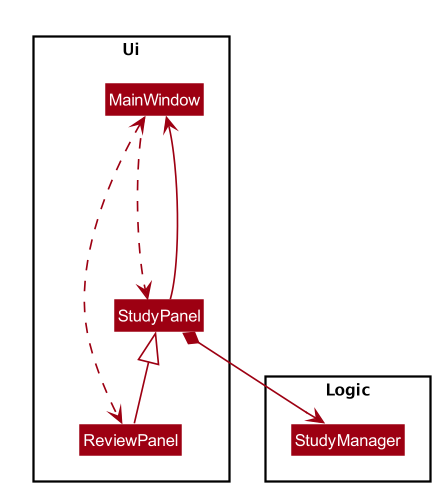
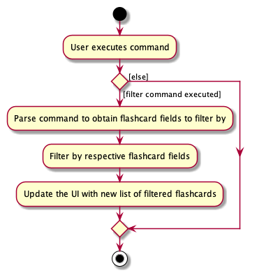

* Table of Contents
    - [Setting up, getting started](#setting-up-getting-started)
    - [Design](#design)
        - [Architecture](#architecture)
        - [UI component](#ui-component)
        - [Logic component](#logic-component)
        - [Model component](#model-component)
        - [Storage component](#storage-component)
        - [Common classes](#common-classes)
    - [Implementation](#implementation)
        - [[Implemented] Add feature](#implemented-add-feature)
        - [[Implemented] Review feature](#implemented-review-feature)
        - [[Implemented] Sort feature](#implemented-sort-feature)
        - [[Implemented] Favourite/Unfavourite feature](#implemented-favouriteunfavourite-feature)
        - [[Implemented] Filter feature](#implemented-filter-feature)
    - [Documentation, logging, testing, configuration, dev-ops](#documentation-logging-testing-configuration-dev-ops)
    - [Appendix: Requirements](#appendix-requirements)
        - [Product Scope](#product-scope)
        - [User stories](#user-stories)
        - [Use cases](#use-cases)
        - [Non-Functional Requirements](#non-functional-requirements)
        - [Glossary](#glossary)
    - [Appendix: Instructions for manual testing](#appendix-instructions-for-manual-testing)
    - [Appendix: Effort](#appendix-effort)

--------------------------------------------------------------------------------------------------------------------

## **Setting up, getting started**

Refer to the guide [_Setting up and getting started_](SettingUp.md).

--------------------------------------------------------------------------------------------------------------------

## **Design**

### Architecture

The ***Architecture Diagram*** given above explains the high-level design of the App. Given below is a quick overview of each component.

:bulb: **Tip:** The `.puml` files used to create diagrams in this document can be found in the [diagrams](https://github.com/se-edu/addressbook-level3/tree/master/docs/diagrams/) folder. Refer to the [_PlantUML Tutorial_ at se-edu/guides](https://se-education.org/guides/tutorials/plantUml.html) to learn how to create and edit diagrams.

**`Main`** has two classes called [`Main`](https://github.com/AY2021S1-CS2103T-T17-2/tp/blob/master/src/main/java/seedu/flashcard/Main.java) and [`MainApp`](https://github.com/AY2021S1-CS2103T-T17-2/tp/blob/master/src/main/java/seedu/flashcard/MainApp.java). It is responsible for,
* At app launch: Initializes the components in the correct sequence, and connects them up with each other.
* At shut down: Shuts down the components and invokes cleanup methods where necessary.

[**`Commons`**](#common-classes) represents a collection of classes used by multiple other components.

The rest of the App consists of four components.

* [**`UI`**](#ui-component): The UI of the App.
* [**`Logic`**](#logic-component): The command executor.
* [**`Model`**](#model-component): Holds the data of the App in memory.
* [**`Storage`**](#storage-component): Reads data from, and writes data to, the hard disk.

Each of the four components,

* defines its *API* in an `interface` with the same name as the Component.
* exposes its functionality using a concrete `{Component Name}Manager` class (which implements the corresponding API `interface` mentioned in the previous point.

For example, the `Logic` component (see the class diagram given below) defines its API in the `Logic.java` interface and exposes its functionality using the `LogicManager.java` class which implements the `Logic` interface.

**How the architecture components interact with each other**

The *Sequence Diagram* below shows how the components interact with each other for the scenario where the user issues the command `delete 1`.

The sections below give more details of each component.

### UI component

**API** :
[`Ui.java`](https://github.com/AY2021S1-CS2103T-T17-2/tp/blob/master/src/main/java/seedu/flashcard/ui/Ui.java)

The UI consists of a `MainWindow` that is made up of parts e.g.`CommandBox`, `ResultDisplay`, `FlashcardListPanel`, `FlashcardViewCard` etc. All these, including the `MainWindow`, inherit from the abstract `UiPart` class.

The `UI` component uses JavaFx UI framework. The layout of these UI parts are defined in matching `.fxml` files that are in the `src/main/resources/view` folder. For example, the layout of the [`MainWindow`](https://github.com/AY2021S1-CS2103T-T17-2/tp/blob/master/src/main/java/seedu/flashcard/ui/MainWindow.java) is specified in [`MainWindow.fxml`](https://github.com/AY2021S1-CS2103T-T17-2/tp/blob/master/src/main/resources/view/MainWindow.fxml)

The `UI` component,

* Executes user commands using the `Logic` component.
* Listens for changes to `Model` data so that the UI can be updated with the modified data.

### Logic component

**API** :
[`Logic.java`](https://github.com/AY2021S1-CS2103T-T17-2/tp/blob/master/src/main/java/seedu/flashcard/logic/Logic.java)

1. `Logic` uses the `FlashcardDeckParser` class to parse the user command.
1. This results in a `Command` object which is executed by the `LogicManager`.
1. The command execution can affect the `Model` (e.g. adding a flashcard).
1. The result of the command execution is encapsulated as a `CommandResult` object which is passed back to the `Ui`.
1. In addition, the `CommandResult` object can also instruct the `Ui` to perform certain actions, such as displaying help to the user.

Given below is the Sequence Diagram for interactions within the `Logic` component for the `execute("delete 1")` API call.

:information_source: **Note:** The lifeline for `DeleteCommandParser` should end at the destroy marker (X) but due to a limitation of PlantUML, the lifeline reaches the end of diagram.

### Model component

**API** : [`Model.java`](https://github.com/AY2021S1-CS2103T-T17-2/tp/blob/master/src/main/java/seedu/flashcard/model/Model.java)

The `Model`,

* stores a `UserPref` object that represents the user’s preferences.
* stores the flashcard deck data.
* exposes an unmodifiable `ObservableList<Flashcard>` that can be 'observed' e.g. the UI can be bound to this list so that the UI automatically updates when the data in the list change.
* does not depend on any of the other three components.

:information_source: **Note:** The Model class diagram shown above omits details of the Flashcard class due to space constraint. Instead, the omitted details have been extracted and are shown here: 

:information_source: **Note:** An alternative (arguably, a more OOP) model is given below. It has a `Tag` list in the `FlashcardDeck`, which `Flashcard` references. This allows `FlashcardDeck` to only require one `Tag` object per unique `Tag`, instead of each `Flashcard` needing their own `Tag` object. 

### Storage component

**API** : [`Storage.java`](https://github.com/AY2021S1-CS2103T-T17-2/tp/blob/master/src/main/java/seedu/flashcard/storage/Storage.java)

The `Storage` component,
* can save `UserPref` objects in json format and read it back.
* can save the address book data in json format and read it back.

### Common classes

Classes used by multiple components are in the `seedu.flashcard.commons` package.

--------------------------------------------------------------------------------------------------------------------

## **Implementation**

This section describes some noteworthy details on how certain features are implemented.

### \[Implemented\] Add feature 

#### Current Implementation

The add feature is facilitated by `LogicManager` and `ModelManager`. The add command supports the following inputs from the user

* `q/QUESTION`
* `a/ANSWER`
* `c/CATEGORY`
* `n/NOTE`
* `r/RATING`
* `d/DIAGRAM`
* `t/TAG`

Question and answer are mandatory inputs while the rest are optional inputs. When the user adds a flashcard, the user’s inputs will be passed on to `ParserUtil`. `ParserUtil` will conduct input validation and trim any leading and trailing whitespaces. If the user’s inputs are valid and there are no duplicate flashcard, a `Flashcard` object will be created and added to the `FlashcardDeck`. Otherwise `ParseException` will be thrown and the relevant error message will be displayed to the user. 

It implements the following operations:
* `AddCommand#execute()` - Add the flashcard to the `ModelManager` and `FlashcardDeck`
* `AddCommandParser#parse(String args)` - Conduct input validation and parse user’s input

The following sequence diagram shows how the `add` operation works:

Given below is an example usage scenario and how the add mechanism behaves at each step.

Step 1. The user launches the application.

Step 2: The user executes `add q/OOP is good. T/F ? a/T` command to add a flashcard with question “OOP is good.T/F ?” and answer “T” . `LogicManager` calls `FlashcardDeckParser#parseCommand(String args))` which calls
`AddCommandParser#parse(String args)` .

Step 3. `AddCommandParser` calls `ParserUtil#parseAnswer` and `ParserUtil#parseQuestion` to check for input validation. If input validation is successful, `AddCommandParser` calls the constructor of `Flashcard` and creates a flashcard. Consequently, a new `AddCommand` with the flashcard as the parameter is created.

Step 4: `LogicManager` then calls `AddCommand#execute(Model model)`.

Step 5: `AddCommand` then add a flashcard to the flashcard deck by calling `Model#addFlashcard`.

Step 6: A `CommandResult` is generated and Model updates the `filteredFlashcardList` by adding the flashcard which is then updated in the UI.

### \[Implemented\] Review feature

#### Current Implementation

The review feature is one of the two abstract study features. The review feature is facilitated by `StudyManager` which
keeps track of the review state. `StudyManager` maintains the list of `Flashcard` and the `currentIndex` at which the user is at.
The review feature also involves the UI via `ReviewPanel` which will handle user input and displaying of the flashcards.

`StudyManager` implements the following operations:
* `StudyManager#hasNextFlashcard` - determines if there are any more flashcards in the flashcard list after the flashcard specified by the `currentIndex`
* `StudyManager#hasPreviousFlashcard` - determines if there are any previous flashcards in the flashcard list before the flashcard specified by the `currentIndex`
* `StudyManager#getCurrentFlashcard` - returns flashcard at `currentIndex` in the flashcard list
* `StudyManager#getPreviousFlashcard` - decrements `currentIndex` by 1 and returns the associated flashcard
* `StudyManager#getNextFlashcard` - increments `currentIndex` by 1 and returns the associated flashcard

The following class diagrams show how the relationship between the different UI components involved in review, and `StudyManager`.

Given below is an example of how the review mechanism behaves at each step:

Step 1. The user launches the application.

Step 2. The user executes `review` command. `MainWindow` will receive a `CommandResult` and calls `CommandResult#isReviewMode` which returns true. A new `ReviewPanel` 
is created and `MainWindow#enterStudyMode(StudyPanel studyPanel)` is then called with this `ReviewPanel`, to enter review mode.

Step 3. In `MainWindow#enterStudyMode`, the UI elements are altered to show the review user interface. In `ReviewPanel` a listener is set 
up to listen for arrow key presses, and a new `StudyManager` is created to keep track of state.

Step 4. Depending on the key presses, different operations of `StudyManager` are called. The flashcard to render in the 
UI is determined by the various `StudyManager` operations and the state as mentioned above.

Step 5. If user presses `q`, `StudyPanel#exitStudyMode` is called which in turn calls `MainWindow#exitReviewMode`, 
which places the application back in normal command mode.

The following sequence diagram gives an overview of how the application enters review mode:

The following activity diagram summarises the control path in review mode set up by `ReviewPanel` and `StudyManager`:

#### Design consideration:

##### Aspect: How review mode executes

* **Alternative 1 (current choice):** Handle review mode directly in UI.
  * Pros: Truly interactive review where user can use key presses instead of typing commands.
  * Cons: UI will have to implement some logic.

* **Alternative 2:** Handle review mode through the command textbox.
  * Pros: Allows for better abstraction through separation of UI and logic.
  * Cons: Poorer user experience as reviewing will be slow since user has to type in command one by one.

### \[Implemented\] Sort feature

#### Current Implementation

The sort mechanism is facilitated by `ModelManager`. `Statistics` attribute is stored internally in `Flashcard`, to keep track of review frequency and correctness percentage respectively based on the review activity done by the user. When the user enters review mode, the user activity will be tracked and the data will be sent and stored inside `Statistics` of the individual `Flashcard`. This activity will then be used to facilitate the sort mechanism, through the enum `SortCriteria` which provides the comparator needed for the respective sort critera.

It implements the following operations:
* `ModelManager#sortFilteredFlashcardList(Comparator <Flashcard> comparator)` - sorts the flashcard list according to the given comparator, and updates the flashcard list shown.
* `SortCriteria#getCriteria(String criteria)` - retrieves the enum according to the criteria given.

The `ModelManager#sortFilteredFlashcardList(Comparator<Flashcard> comparator)` operation is exposed in the `Model` interface as `Model#updateSortedFlashcardList(Comparator <Flashcard> comparator)`.

Given below is an example usage scenario and how the sort mechanism behaves at each step.

Step 1. The user launches the application.

Step 2. The user executes `review` command to review the flashcard deck. The user reviews 3 out of 5 flashcards and exits review mode. The review command calls `Statistics#incrementReviewFrequency()` for each flashcard that has been reviewed and `Statistics#incrementSuccessFrequency()` depending on whether the user successfully answers the question, hence updating the state of the flashcard.

Step 3. The user executes `sort reviewed -d`. The command gets parsed to retrieve the appropriate `SortCriteria`. The `sort` command calls `Model#sortFilteredFlashcardList` with this `SortCriteria`, causing the flashcards to be sorted by review frequency, in descending order.

The following sequence diagram shows how the sort operation works:

:information_source: **Note:** The lifeline for `SortCommand` should end at the destroy marker (X) but due to a limitation of PlantUML, the lifeline reaches the end of diagram.

The following activity diagram summarizes what happens when a user executes a new command:

#### Design consideration:

##### Aspect: How sort executes

* **Alternative 1 (current choice):** Stores statistics in Flashcard and compares flashcard directly.
  * Pros: Easy to implement.
  * Cons: Flashcard will have to keep track of many data.

* **Alternative 2:** Using a data structure (e.g. HashMap) to store statistics.
  * Pros: Will use more memory, since the HashMap will have to be committed to local storage too.
  * Cons: We must ensure that the any changes/updates to a flashcard will be reflected in the HashMap.

### \[Implemented\] Favourite/Unfavourite feature 

#### Current Implementation

The favourite/unfavourite mechanism is faciliated by `LogicManager` and `ModelManager`.
A `isFavourite` boolean attribute is stored internally in `Flashcard`, to keep track of whether the flashcard is favourited. When the user favourites a flashcard, `isFavourite` is set to true, and set to false otherwise. 
 
It implements the following operations:
* `Flashcard#isFavourite()` - Checks whether the current flashcard is favourited.
* `FavCommand#createFavouriteFlashcard(Flashcard flashcardToFavourite)` - Duplicates the flashcard and set `isFavourite` attribute to `true`.
* `UnfavCommand#createUnfavouriteFlashcard(Flashcard flashcardToUnfavourite)` - Duplicates the flashcard and set `isFavourite` attribute to `false`.

Given below is an example usage scenario and how the favourite and unfavourite mechanism behaves at each step.

Step 1: The user launches the application 

Step 2: The user executes `fav 1` command to favourite the 1st flashcard in the displayed flashcard deck. `fav` command calls 
`Flashcard#isFavourite()` method to check whether the flashcard at index 1, `f1`,  has been favourited. If the flashcard is not favourited, 
`fav` command calls `FavCommand#createFavouriteFlashcard(f1)` to create a new flashcard, `fav1`,  by duplicating the existing data fields and set the `isFavourite` attribute to `true`.
`fav` command then calls `ModelManager#setFlashcard(f1, fav1)` to replace the current flashcard, `f1`,  with the favourited flashcard, `fav1`.

The following sequence diagram shows how the `fav` operation works:

Step 3: The user executes `unfav 1` command to unfavourite the 1st flashcard in the displayed flashcard deck. `unfav` command calls 
`Flashcard#isFavourite()` method to check whether the flashcard at index 1, `fav1`,  has been favourited. `fav1` is favourited in step 2, hence, 
`unfav` command calls `UnfavCommand#createUnfavouriteFlashcard(fav1)` to create a new flashcard, `f1`,  by duplicating the existing data fields and set the `isFavourite` attribute to `false`.
`unfav` command then calls `ModelManager#setFlashcard(fav1, f1)` to replace the current flashcard, `fav1`,  with the unfavourited flashcard, `f1`.

The following activity diagram summarizes what happens when a user executes a favourite/unfavourite command:

#### Design consideration:

##### Aspect: How fav & unfav executes

* **Alternative 1 (current choice):** Creates a new flashcard everytime `isFavourite` value changes
  * Pros: Flashcard remains immutable.
  * Cons: Execution time is longer compared to Alternative 2 since a new flashcard is created if flashcard's state changes.

* **Alternative 2:** Toggle `isFavourite` using a setter such as `setFavouriteStatus` in `Flashcard`.
  * Pros: Easy to implement as there is no need to create a new flashcard every time the state is changed.
  * Cons: Flashcard would not be immutable

### \[Implemented\] Filter feature

#### Current Implementation
The filtering mechanism is facilitated by `LogicManager` and `ModelManager`.
It works when the `LogicManager` listens for a filter command input from the user and
parses the command to filter out relevant flashcards based on the category, rating, favourite status and/or tags.

The filter feature supports filtering of multiple flashcard fields by parsing the command using `FilterCommandParser#parse(String args)`
and creates a new `FilterCommand` object that contains a `MultipleFieldsEqualKeywordsPredicate` predicate object.

The `MultipleFieldsEqualKeywordsPredicate` predicate object then encapsulates the following predicate objects:
* `CategoryEqualsKeywordsPredicate`
* `RatingEqualsKeywordsPredicate` 
* `FavouriteEqualsKeywordsPredicate`
* `TagsEqualKeywordsPredicate`

It implements the following operations:
* `FilterCommand#execute(Model model)` to update `Model` to show only the filtered flashcards
* `MultipleFieldsEqualKeywordsPredicate#test(Flashcard flashcard)` to check every flashcard in `Model` against the 
various encapsulated predicates for different fields in the flashcard (category, rating, favourite status and tags) and will only
return true if all encapsulated predicates return true.
* `ModelManager#updateFilteredFlashcardList(Predicate<Flashcard> predicate)` takes in a predicate to update 
`filteredFlashcards` attribute within  `ModelManager`.

Given below is an example usage scenario and how the filter mechanism behaves at each step.

Step 1. The user launches the application.

Step 2: The user executes `filter c/SDLC r/3` command to filter and display all the flashcards in the flashcard deck
belonging to SDLC category and have a rating of 3. `LogicManager` calls   `FlashcardDeckParser#parseCommand(String args))` and   
`FilterCommandParser#parse(String args)` to ultimately return a `FilterCommand` object.

Step 3: After parsing, `LogicManager` then calls `FilterCommand#execute(Model model)`.

Step 4: `FilterCommand` then updates the list of filtered flashcards by calling 
`Model#updateFilteredFlashcardList(predicate)`.

Step 5: A `CommandResult` is generated and Model updates the `filteredFlashcardList` which is then updated
in the UI.

The following sequence diagram shows how the filter operation works:

 
 
 The following activity diagram shows how the `filter` command works when a user executes it:
 
 
 
 
--------------------------------------------------------------------------------------------------------------------

## **Documentation, logging, testing, configuration, dev-ops**

* [Documentation guide](Documentation.md)
* [Testing guide](Testing.md)
* [Logging guide](Logging.md)
* [Configuration guide](Configuration.md)
* [DevOps guide](DevOps.md)

--------------------------------------------------------------------------------------------------------------------

## **Appendix: Requirements**

### Product scope

**Target user profile**: CS2103 Students 

* Has a need to organise all the quiz questions on Luminus 
* Has a need to consolidate and summarize large amount of information from CS2103 textbook
* Has a need to organise key learning points from textbook in website and quiz questions on Luminus in a single platform
* Prefer desktop apps over other types
* Can type fast
* Prefers typing to mouse interactions
* Is reasonably comfortable using CLI apps
* Has technical background

**Value proposition**:
* Provide a centralised platform to organise textbook content on CS2103 website and quiz questions on Luminus
* Store quiz's questions and their answers through a flashcard
* Customize each flashcard through flashcard's category, tags
* Allow users to rate/favourite flashcards
* Allow users to add a note to a flashcard
* Allow users to revise effectively by through quiz and review feature
* Provide statistics of the each flashcard so that users can better identify flashcards to focus on
* Search for flashcards easily by search keywords
* Filter the list of flashcards by various fields
* Sort the list of flashcards according to most/least reviewed

### User stories

Priorities: High (must have) - `* * *`, Medium (nice to have) - `* *`, Low (unlikely to have) - `*`

| Priority | As a …​                                     | I want to …​                                                              | So that I can…​                                                                              |
| -------- | ------------------------------------------ | ------------------------------------------------------------------------ | ------------------------------------------------------------------------------------------- |
| `* * *`  | new user                                   | see usage instructions                                                   | refer to instructions when I forget how to use the App                                      |
| `* * *`  | potential user exploring the app           | see sample data in the App                                               | easily see how the app will look like when it is in use                                     |
| `* * *`  | user ready to start using the app          | purge all current data                                                   | get rid of sample/experimental data I used for exploring the app                            |
| `* * *`  | busy student                               | add a flashcard easily via a single command                              |                                                                                             |
| `* * *`  | student                                    | to know whether there are potential duplicates when adding new flashcard |  optimise my list of flashcards and ensure that there are no repeats to prevent cluttering  |
| `* * *`  | student                                    | list all the flashcards                                                  |                                                                                             |
| `* * *`  | student                                    | delete flashcard                                                         | remove flashcards that are not relevant or helpful for my learning                          |
| `* * *`  | careful student                            | edit details of flashcard                                                | make sure that the content in the flashcard is accurate and relevant                        |
| `* * *`  | organized student                          | create custom category for flashcards                                    | better organize the content to my liking so that it is easier to review                     |
| `* * *`  | busy student                               | find flashcards easily                                                   | save time without having to look through the whole list of flashcards                       |
| `* * `   | hardworking student                        | review flashcards 1 by 1                                                 | revise for exams by testing myself                                                          |
| `* * `   | student                                    | skip particular flashcards while reviewing                               | save time by reviewing relevant flashcards only                                             |
| `* * `   | hardworking student                        | add a note to the flashcard                                              | note down important learning points to prevent myself from making the same mistake          |
| `* * `   |  student                                   | rate flashcards                                                          | know importance of each flashcard                                                           |
| `* * `   | organised student                          | tag flashcards                                                           | further manage and organise the flashcards                                                  |
| `* * `   | student                                    | add a diagram to flashcard                                               | create flashcards with question based on diagram                                            |
| `* * `   | student                                    | view individual flashcard                                                | look at flashcard in more details                                                           |
| `* * `   | student                                    | quiz myself                                                              | revise for exams by through mock quiz and keep track of scores                              |
| `* * `   | student                                    | view statistics of flashcard                                             | keep track of how well I did and know whether I have mastered the content properly           |
| `* * `   | busy student                               | filter flashcards by different fields                                    | refine list of flashcards and only display the relevant flashcards I am interested in       |
| `* * `   | busy student                               | sort flashcards according to review frequency                            | focus on flashcards that are least reviewed                                                 |
| `* * `   | busy student                               | sort flashcards according to success rate                                | focus on flashcards that are often incorrectly answered                                     |

### Use cases

(For all use cases below, the **System** is `SWEe!` and the **Actor** is the `user`, unless specified otherwise)

#### Use case: UC01 - Add a flashcard

**MSS**

1.  User adds a flashcard.
2.  SWEe! shows a list of flashcards, containing the newly added flashcard.

    Use case ends.

**Extensions**

* 1a. Input format is invalid.

    * 1a1. SWEe! shows an error message.

      Use case ends.

* 1b. The given flashcard already exists.

    * 1b1. SWEe! shows an error message.

      Use case ends.

#### Use case: UC02 - List flashcards

**MSS**

1.  User requests to list flashcards.
2.  SWEe! shows a list of flashcards.

    Use case ends.

**Extensions**

* 1a. Input format is invalid.

    * 1a1. SWEe! shows an error message.

      Use case ends.

#### Use case: UC03 - Delete a flashcard

**MSS**

1.  User requests to delete a specific flashcard based on the index in the list.
2.  SWEe! deletes the flashcard.

    Use case ends.

**Extensions**

* 1a. The given index is invalid.

    * 1a1. SWEe! shows an error message.

      Use case ends.

#### Use case: UC04 - Edit a flashcard

**MSS**

1.  User requests to edit the details of a specific flashcard based on the index in the list.
2.  SWEe! edits the flashcard.

    Use case ends.

**Extensions**

* 1a. The given index is invalid.

    * 1a1. SWEe! shows an error message.

      Use case ends.

* 1b. Input format is invalid.

    * 1b1. SWEe! shows an error message.

      Use case ends.

#### Use case: UC05 - Favourite a flashcard

**MSS**

1.  User requests to favourite a specific flashcard based on the index in the list.
2.  SWEe! favourites the flashcard.

    Use case ends.

**Extensions**

* 1a. The given index is invalid.

    * 1a1. SWEe! shows an error message.

      Use case ends.

#### Use case: UC06 - Unfavourite a flashcard

**MSS**

1.  User requests to unfavourite a specific flashcard based on the index in the list.
2.  SWEe! unfavourites the flashcard.

    Use case ends.

**Extensions**

* 1a. The given index is invalid.

    * 1a1. SWEe! shows an error message.

      Use case ends.

#### Use case: UC07 - Clear all flashcards

**MSS**

1.  User requests to clear all flashcards in the list.
2.  SWEe! clears the list.

    Use case ends.

#### Use case: UC08 - Find flashcards

**MSS**

1.  User requests to find flashcards with keywords.
2.  SWEe! shows a list of flashcards matching keywords.

    Use case ends.

**Extensions**

* 1a. Input format is invalid.

    * 1a1. SWEe! shows an error message.

      Use case ends.

#### Use case: UC09 - Filter flashcards

**MSS**

1.  User requests to filter flashcards according to attributes.
2.  SWEe! shows a list of flashcards matching attributes.

    Use case ends.

**Extensions**

* 1a. Input format is invalid.

    * 1a1. SWEe! shows an error message.

      Use case ends.

#### Use case: UC10 - Sort flashcards

**MSS**

1.  User requests to sort the list of flashcards based on a sort criteria.
3.  SWEe! displays the list of flashcards in the specified order.

    Use case ends.

**Extensions**

* 1a. Input format is invalid.

    * 1a1. SWEe! shows an error message.

      Use case ends.

#### Use case: UC11 - Requesting for help

**MSS**

1.  User requests for help.
2.  SWEe! displays help window.

    Use case ends.
    
    
#### Use case: UC12 - Review flashcards

**MSS**

1.  User requests to review flashcards.
2.  SWEe! enters review mode.
3.  User requests to show answer.
4.  User requests to show the next flashcard.

    Steps 3-4 are repeated until the user finishes reviewing all flashcards.

    Use case ends.

**Extensions**

* 1a. The list is empty.

    * 1a1. SWEe! shows an error message.

    Use case ends.
  
* 3a. User requests to hide the answer.

    Use case resumes from step 4.
    
* 3b. User requests to show the previous flashcard (if there is a previous flashcard).

    Use case resumes from step 3.
    
* *a. At any time, User requests to quit review mode.

    *a1. SWEe! quits review mode.
    
    Use case ends.

#### Use case: UC13 - Quiz flashcards

**MSS**

1.  User requests to quiz flashcards.
2.  SWEe! enters quiz mode.
3.  User requests to show answer.
4.  User indicates if the flashcard was answered correctly.
5.  SWEe! shows the next flashcard to quiz.

    Steps 3-5 are repeated until the user finishes quizzing all flashcards.

    Use case ends.

**Extensions**

* 1a. The list is empty.

    * 1a1. SWEe! shows an error message.

    Use case ends.

* *a. At any time, User requests to quit quiz mode.

    *a1. SWEe! quits quiz mode.
    
    Use case ends.

#### Use case: UC14 - View a flashcard

**MSS**

1.  User requests to view a specific flashcard based on the index in the list.
2.  SWEe! shows the flashcard in detail.

    Use case ends.

**Extensions**

* 1a. The given index is invalid.

    * 1a1. SWEe! shows an error message.

      Use case ends.

#### Use case: UC15 - View the statistics of a flashcard

**MSS**

1.  User requests to view the statistics of a specific flashcard based on the index in the list.
2.  SWEe! shows the flashcard's statistics.

    Use case ends.

**Extensions**

* 1a. The given index is invalid.

    * 1a1. SWEe! shows an error message.

      Use case ends.

#### Use case: UC16 - Exit SWEe!

**MSS**

1.  User requests to exit SWEe!
2.  SWEe! terminates and exits.

    Use case ends.

### Non-Functional Requirements

1.  Should work on any _mainstream OS_ as long as it has Java `11` or above installed.
2.  Should be able to hold up to 1000 flashcards without a noticeable sluggishness in performance for typical usage.
3.  A user with above average typing speed for regular English text (i.e. not code, not system admin commands) should be able to accomplish most of the tasks faster using commands than using the mouse.
4.  Should be a single user product.
5.  Should not depend on remote servers
6.  Should be able to work without being connected to a network
7.  Should be able to work without requiring an installer
8.  Should not include _hard-to-test features_.

### Glossary

* **Flashcard Deck**: An object that encapsulates and handles a unique list of flashcards
* **Mainstream OS**: Windows, Linux, Unix, OS-X
* **CLI**: Command Line Interface

--------------------------------------------------------------------------------------------------------------------

## **Appendix: Instructions for manual testing**

Given below are instructions to test the app manually.

:information_source: **Note:** These instructions only provide a starting point for testers to work on;
testers are expected to do more *exploratory* testing.

### Launch and shutdown

1. Initial launch

   i. Download the jar file and copy into an empty folder

   ii. Double-click the jar file Expected: Shows the GUI with a set of sample flashcards. The window size may not be optimum.

1. Saving window preferences

   i. Resize the window to an optimum size. Move the window to a different location. Close the window.

   ii. Re-launch the app by double-clicking the jar file.  
       Expected: The most recent window size and location is retained.

1. Exiting the application
   
   i. Prerequisites: The application must be launched.
   
   ii. Test case: `exit`  
       Expected: The application exits and the window closes itself automatically.
   
### Adding a flashcard

1. Adding a flashcard when in main window of application

   i. Prerequisites: Application must be in main window and not in review or quiz mode.
   
   ii. Test case (specifying compulsory inputs only): `add q/Does software projects often involve workflows? a/Yes`  
       Expected: A new flashcard is added to the end of the list of flashcards. Flashcard list panel will then update
       to display all the flashcards in the flashcard deck. The compulsory inputs will be set to 
       what was specified in the command, whereas category will be set to `General` by default when not stated in the
       input. Result display will output the message: 
       `New flashcard added:  Question: Does software projects often involve workflows?`

   iii. Test case (missing a compulsory input (`a/ANSWER`)): `add q/What does SWE stand for?`  
       Expected: No flashcard added to the list of flashcards and input text will turn red to signal an error.
       Result display will output the invalid command format error message.
   
   iv. Test case (missing a compulsory input (`q/QUESTION`)): `add a/Software Engineering`  
       Expected: No flashcard added to the list of flashcards and input text will turn red to signal an error.
       Result display will output the invalid command format error message.
       
### Deleting a flashcard

1. Deleting a flashcard while all flashcards are being shown

   i. Prerequisites: Flashcard deck contains at least one flashcard. Refer to [Section 1ii](#adding-a-flashcard) on 
      how to add a flashcard if flashcard deck is empty.

   ii. Test case (valid index): `delete 1`  
      Expected: First flashcard is deleted from the list of flashcards. Result display will output the status of the deleted flashcard. 

   iii. Test case (invalid index): `delete 0`  
      Expected: No flashcard will be deleted from the list of flashcards and input text will turn red to signal an error.
      Result display will output the invalid command format error message.

   iv. Test case (missing index): `delete`  
      Expected: Similar to test case iii.
      
### Listing flashcards

1. Listing all flashcards in the flashcard deck

    i. Prerequisites: Flashcard deck contains at least one flashcard. Refer to [Section 1ii](#adding-a-flashcard) on 
        how to add a flashcard if flashcard deck is empty.
    
    ii. Test case: `list`  
        Expected: Flashcard list panel updates to show all flashcard stored in the flashcard deck. Result display will output
        a success message: `Listed all flashcards`
    
### Editing a flashcard

1. Editing a flashcard while all flashcards are being shown

    i. Prerequisites: Flashcard deck contains at least one flashcard. Refer to [Section 1ii](#adding-a-flashcard) on 
        how to add a flashcard if flashcard deck is empty.
    
    ii. Test case (editing one field of flashcard): `edit 1 q/Is this edited?`  
        Expected: The `QUESTION` of flashcard at index 1 will be modified to become `Is this edited?`. The remaining fields
        of this flashcard will remain the same. Result display will output the status of the edited flashcard.
        
    iii. Test case (editing multiple fields of flashcard): `edit 1 q/Is this edited? a/Yes`   
        Expected: The `QUESTION` and `ANSWER` of flashcard at index 1 will be modified to become `Is this edited?` 
        and `Yes` respectively.The remaining fields of this flashcard will remain the same. Result display will output the status of the edited flashcard.
    
    iv. Test case (missing flashcard field input): `edit 1`   
        Expected: Flashcard list panel will not update and input text will turn red to signal an error.
        Result display will output the message: `At least one field to edit must be provided.`
        
    v. Test case (missing flashcard field input and index): `edit`  
        Expected: Flashcard list panel will not update and input text will turn red to signal an error.
        Result display will output the invalid command format error message.
     
 

 
 :information_source: **Note:** Editing of flashcard can also be tested on other fields such as `CATEGORY`, `NOTE`, `RATING`, `DIAGRAM` and `TAG`.

    
### Clearing all flashcards

1. Clearing all flashcards in the flashcard deck

     i. Prerequisites: Flashcard deck contains at least one flashcard. Refer to [Section 1ii](#adding-a-flashcard) on 
        how to add a flashcard if flashcard deck is empty.
                
     ii. Test case: `clear`  
        Expected: Flashcard list panel updates to show no flashcard stored in the flashcard deck. Result display will output
        a success message: `Flashcard Deck has been cleared!`
     
### Filtering for flashcards

1. Filtering for selected flashcards in the flashcard deck

    i. Prerequisites: Flashcard deck contains at least one flashcard. Refer to [Section 1ii](#adding-a-flashcard) on 
        how to add a flashcard if flashcard deck is empty.
                
    ii. Test case (filtering by one flashcard field): `filter c/General`  
        Expected: Flashcard list panel updates to show only flashcards belonging to `General` category. Result display will
        output a success message indicating the number of flashcards filtered.
            
    iii. Test case (filtering by multiple flashcard fields): `filter c/General r/3`   
        Expected: Flashcard list panel updates to show only flashcards belonging to `General` category and have a rating of `3`. 
        Result display will output a success message indicating the number of flashcards filtered.
        
    iv. Test case (missing flashcard field input): `filter`  
        Expected: Flashcard list panel will not update and input text will turn red to signal an error.
        Result display will output the invalid command format error message.
        

     
:information_source: **Note:** Filtering of flashcards can also be tested on other fields such as `FAVOURITE` and `TAG`. 

    
### Favouriting a flashcard

1. Favouriting a flashcard in the flashcard deck

    i. Prerequisites: Flashcard deck contains at least one flashcard. Refer to [Section 1ii](#adding-a-flashcard) on 
        how to add a flashcard if flashcard deck is empty.
                
    ii. Test case (valid index): `fav 1`   
        Expected: Flashcard list pane updates to show a favourite(heart) icon beside the flashcard of index 1. Result display
        will output the status of the favourited flashcard.

    iii. Test case (invalid index): `fav 0`  
        Expected: No flashcard is favourited from the list of flashcards and input text will turn red to signal an error.
        Result display will output the invalid command format error message.

    iv. Test case (missing index): `fav`  
        Expected: Similar to test case iii.
        
### Unfavouriting a flashcard

1. Unfavouriting a flashcard in the flashcard deck

    i. Prerequisites: Flashcard deck contains at least one flashcard. Refer to [Section 1ii](#adding-a-flashcard) on 
        how to add a flashcard if flashcard deck is empty.
                
    ii. Test case (valid index): `unfav 1`   
            Expected: Flashcard list pane updates to unfavourite and remove the favourite(heart) icon beside the flashcard of index 1 (if any). Result display
            will output the status of the unfavourited flashcard.
    
    iii. Test case (invalid index): `unfav 0`  
        Expected: No flashcard is unfavourited from the list of flashcards and input text will turn red to signal an error.
        Result display will output the invalid command format error message.

    iv. Test case (missing index): `unfav`  
        Expected: Similar to test case iii.

### Finding flashcards

1. Finding flashcards in the flashcard deck
    
   1. Prerequisites: Flashcard deck contains at least one flashcard. Refer to [Section 1ii](#adding-a-flashcard) on 
       how to add a flashcard if flashcard deck is empty.
       
   1. Test case (finding by one keyword): `find general`  
       Expected: Flashcard list panel updates to show only flashcards that have `general` contained within 
       `QUESTION`, `ANSWER`, `CATEGORY`, `NOTE` and/or `TAG`. Result display will
       output a success message indicating the number of flashcards found.
   
   1. Test case (finding by multiple keywords): `find general stuff`  
       Expected: Flashcard list panel updates to show only flashcards that have `general` and/or `stuff` contained within 
       `QUESTION`, `ANSWER`, `CATEGORY`, `NOTE` and/or `TAG`. Result display will
       output a success message indicating the number of flashcards found.
       
   1. Test case (missing keyword): `find`  
       Expected: Flashcard list panel will not update and input text will turn red to signal an error.
       Result display will output the invalid command format error message.

### Reviewing flashcards

1. Entering review mode in the application to review flashcards
    
    1. Prerequisites: Flashcard deck contains at least one flashcard. Refer to [Section 1ii](#adding-a-flashcard) on 
       how to add a flashcard if flashcard deck is empty.
    
    1. Test case: `review`  
        Expected: Main window of application switches to review mode and displays the first flashcard in the flashcard deck.
        
1. Quitting review mode in the application

    1. Prerequisites: Application must be in review mode. Refer to [Section 1ii](#reviewing-flashcards) on how to enter
        review mode.
        
    1. Test case: `q`  
        Expected: Main window of application switches to display flashcard list. Result display will output a success
        message: `Exited Review mode`
        
### Quizzing flashcards

1. Entering quiz mode in the application

    1. Prerequisites: Flashcard deck contains at least one flashcard. Refer to [Section 1ii](#adding-a-flashcard) on 
       how to add a flashcard if flashcard deck is empty.
       
    1. Test case: `quiz`  
        Expected: Main window of application switches to quiz mode and displays the first flashcard in the flashcard deck.

1. Quitting quiz mode in the application

    1. Prerequisites: Application must be in quiz mode. Refer to [Section 1ii](#quizzing-flashcards) on how to enter
        quiz mode.
        
    1. Test case: `q`  
        Expected: Main window of application switches to display flashcard list. Result display will output a success
        message: `Exited Quiz mode`
        
### Sorting of flashcards

1. Sort flashcards according to review frequency

    1. Prerequisites: Flashcard deck contains more than one flashcard. Refer to [Section 1ii](#adding-a-flashcard) on 
       how to add a flashcard if flashcard deck is empty.
       
    1. Test case (sort flashcards in an ascending order): `sort reviewed -a`  
        Expected: Flashcard list panel updates to show a list of all flashcards sorted according to review frequency in ascending order.
        Result display will output a success message indicating the number of flashcards sorted.
    
    1. Test case (sort flashcards in an descending order): `sort reviewed -d`  
        Expected: Flashcard list panel updates to show a list of all flashcards sorted according to review frequency in descending order.
        Result display will output a success message indicating the number of flashcards sorted.
        
    1. Test case (sort flashcards with missing inputs): `sort`  
        Expected: Flashcard list panel will not update and input text will turn red to signal an error.
        Result display will output the invalid command format error message.
        
1. Sort flashcards according to success rate

    1. Prerequisites: Flashcard deck contains more than one flashcard. Refer to [Section 1ii](#adding-a-flashcard) on 
       how to add a flashcard if flashcard deck is empty.
       
    1. Test case (sort flashcards in an ascending order): `sort success -a`  
        Expected: Flashcard list panel updates to show a list of all flashcards sorted according to success rate in ascending order.
        Result display will output a success message indicating the number of flashcards sorted.
        
    1. Test case (sort flashcards in an descending order): `sort success -d`  
        Expected: Flashcard list panel updates to show a list of all flashcards sorted according to success rate in descending order.
        Result display will output a success message indicating the number of flashcards sorted.

    1. Test case (sort flashcards with missing inputs): `sort`  
        Expected: Flashcard list panel will not update and input text will turn red to signal an error.
        Result display will output the invalid command format error message.
        
### Viewing a flashcard

1. Viewing a flashcard

    1. Prerequisites: Flashcard deck contains at least one flashcard. Refer to [Section 1ii](#adding-a-flashcard) on 
       how to add a flashcard if flashcard deck is empty.
       
    1. Test case (view flashcard without answer): `view 1`  
        Expected: Flashcard view panel on the right updates with the details of the flashcard at index 1 in the flashcard
        deck. Result display will output the status of the selected flashcard.
        
    1. Test case (view flashcard with answer): `view 1 -a`  
        Expected: Flashcard view and flashcard answer panel on the right updates with the details and answer of the flashcard
        respectively, at index 1 in the flashcard deck. Result display will output the status of the selected flashcard.

    1. Test case (view flashcard at invalid index): `view 0`  
        Expected: Flashcard view and flashcard answer panel will not update and input text will turn red to signal an error.
        Result display will output the invalid command format error message.
               
### Viewing the statistics of a flashcard
    
1. Viewing the statistics of a flashcard
    
    1. Prerequisites: Flashcard deck contains at least one flashcard. Refer to [Section 1ii](#adding-a-flashcard) on 
       how to add a flashcard if flashcard deck is empty.
       
    1. Test case (view statistics of flashcard at valid index): `stats 1`  
        Expected: Flashcard view panel updates to display a pie chart along with statistics of reviewed count and correct
        count. Result display will output the status of the selected flashcard.
    
    1. Test case (view statistics of flashcard at invalid index): `stats 0`  
        Expected: Flashcard view panel will not update and input text will turn red to signal an error.
        Result display will output the invalid command format error message.
        
        
--------------------------------------------------------------------------------------------------------------------

## **Appendix: Effort**

This section documents the effort in morphing AB3 to SWEe! .

* General refactor of AB3 to SWEe!
    * All instances of AddressBook and related words such as Person, Address, Email, Phone Number (and many more) had to be removed or refactored.
    * This involved not only renaming the relevant methods and variables **throughout the project** but also entire classes, packages and documentation.
    * Eg. The entire `Person` class in AB3 had to be morphed into `Flashcard` class with entirely new methods, parameters and variables.
    * Eg. The `add` and `edit` commands (and their associated parsers) had to be rewritten as it was originally used to add/edit a `Person` but now they are used to add/edit a `Flashcard`.

* `Quiz` and `Review` feature
    * These 2 features are completely new in functionality relative to AB3 features.
    * They involved much UI work as we had to design an entirely new screen. Our app now has 2 distinct screens as compared to the 1 screen of AB3.
    * It was challenging to integrate these 2 features as they were not a conventional command to type into the commandbox:
        * We had to handle keyboard input outside of the command box in these 2 features which is a functionality not present in AB3.
        * We had to design a new pattern to activate these 2 commands and execute them (read [Review implementation](#implemented-review-feature)).
        * Creation of an entirely new logic component `StudyManager` to handle the logic of these 2 features.
    
* `View` and `Stats` feature
    * The main challenge in these 2 features was to create a new UI.
    * We had to split the UI of the originally AB3 into 2 columns, one for the list and one for the output of `View` and `Stats`.

* Diagrams in flashcards
    * Our app allows adding images which AB3 did not.
    * Implementing diagrams was challenging as we had to do many checks to make sure the file path provided was present and had a valid image.
    * We also had to made sure the diagrams were sized appropriately on the UI.

* `Filter` feature
    * AB3 did not have a filter feature by fields of the entity. 
    * We implemented a filter that will filter for flashcards that match all fields specified by you.
    * We had to design and learn how to implement this feature by taking reference from the `find` feature in AB3.

* `Sort` feature
    * AB3 did not have a sort feature.
    * We had to integrate the sort feature with the filter feature which was quite challenging as we had to ensure that the 2 features could be used together (ie. using one feature did not prevent the other from being used). This involved diving into `ModelManager` and making changes.
 
* General UI enhancements
    * Significant styling was done to make our app look better compared to AB3.
    * We also ensured proper scaling of our app to different windows sizes, with the ability to scroll some panes.
