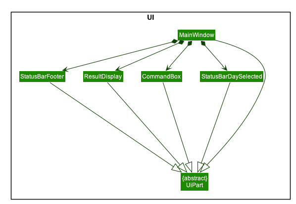
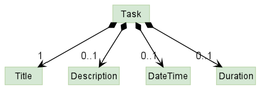

* Table of Contents
{:toc}

--------------------------------------------------------------------------------------------------------------------

## **Introduction**

### **Purpose**
This document specified architecture, software design decisions and features for the application, ProductiveNUS. It will provide you with the essential information on its development process.

### **Scope**
The intended audience of this document are developers, designers, and software testers.

### **About ProductiveNUS**
ProductiveNUS is a desktop application targeted at Computing students of National University of Singapore (NUS) to help them manage and schedule their academic tasks efficiently.

--------------------------------------------------------------------------------------------------------------------

## **Setting up, getting started**

Refer to the guide [_Setting up and getting started_](SettingUp.md).

--------------------------------------------------------------------------------------------------------------------

## **Design**

### Architecture

 *Figure 1: Architecture Diagram*

The ***Architecture Diagram*** given above explains the high-level design of the App. Given below is a quick overview of each component.

:bulb: **Tip:** The `.puml` files used to create diagrams in this document can be found in the [diagrams](https://github.com/se-edu/addressbook-level3/tree/master/docs/diagrams/) folder. Refer to the [_PlantUML Tutorial_ at se-edu/guides](https://se-education.org/guides/tutorials/plantUml.html) to learn how to create and edit diagrams.

**`Main`** has two classes called [`Main`](https://github.com/se-edu/addressbook-level3/tree/master/src/main/java/seedu/address/Main.java) and [`MainApp`](https://github.com/se-edu/addressbook-level3/tree/master/src/main/java/seedu/address/MainApp.java). It is responsible for,
* At app launch: Initializes the components in the correct sequence, and connects them up with each other.
* At shut down: Shuts down the components and invokes cleanup methods where necessary.

[**`Commons`**](#common-classes) represents a collection of classes used by multiple other components.

The rest of the App consists of four components.

* [**`UI`**](#ui-component): The UI of the App.
* [**`Logic`**](#logic-component): The command executor.
* [**`Model`**](#model-component): Holds the data of the App in memory.
* [**`Storage`**](#storage-component): Reads data from, and writes data to, the hard disk.

Each of the four components,

* defines its *API* in an `interface` with the same name as the Component.
* exposes its functionality using a concrete `{Component Name}Manager` class (which implements the corresponding API `interface` mentioned in the previous point.

For example, the `Logic` component (see the class diagram given below) defines its API in the `Logic.java` interface and exposes its functionality using the `LogicManager.java` class which implements the `Logic` interface.

 *Figure 2: Class Diagram for Logic Component*

The sections below give more details of each component.

### UI component

 *Figure 3: Class Diagram for UI Component*

 *Figure 4: More information on Class Diagram for UI Component*

**API** :
[`Ui.java`](https://github.com/se-edu/addressbook-level3/tree/master/src/main/java/seedu/address/ui/Ui.java)

The UI consists of a `MainWindow` that is made up of parts e.g.`CommandBox`, `ResultDisplay`, `AssignmentListPanel` etc. All these, including the `MainWindow`, inherit from the abstract `UiPart` class.

The `UI` component uses JavaFx UI framework. The layout of these UI parts are defined in matching `.fxml` files that are in the `src/main/resources/view` folder. For example, the layout of the [`MainWindow`](https://github.com/se-edu/addressbook-level3/tree/master/src/main/java/seedu/address/ui/MainWindow.java) is specified in [`MainWindow.fxml`](https://github.com/se-edu/addressbook-level3/tree/master/src/main/resources/view/MainWindow.fxml)

The `UI` component,

* Executes user commands using the `Logic` component.
* Listens for changes to `Model` data so that the UI can be updated with the modified data.

### Logic component

 *Figure 5: Class Diagram for Logic Component*

**API** :
[`Logic.java`](https://github.com/se-edu/addressbook-level3/tree/master/src/main/java/seedu/address/logic/Logic.java)

1. `Logic` uses the `AddressBookParser` class to parse the user command.
1. This results in a `Command` object which is executed by the `LogicManager`.
1. The command execution can affect the `Model` (e.g. adding an assignment).
1. The result of the command execution is encapsulated as a `CommandResult` object which is passed back to the `UI`.
1. In addition, the `CommandResult` object can also instruct the `UI` to perform certain actions, such as displaying help to the user.

### Model component

 *Figure 6: Class Diagram for Model Component*

**API** : [`Model.java`](https://github.com/se-edu/addressbook-level3/tree/master/src/main/java/seedu/address/model/Model.java)

The `Model`,

* stores a `UserPref` object that represents the user’s preferences.
* stores the data in ProductiveNUS.
* stores a `Model` object that represents the current `Model` before the most recent command.
* exposes an unmodifiable `ObservableList<Assignment>` and an unmodifiable `ObservableList<Task>` that can be 'observed' e.g. the UI can be bound to this list so that the UI automatically updates when the data in the list change.

#### Task, Lesson and Assignment
`Lesson` and `Assignment` are two important classes in ProductiveNus; `Lesson` stores information about the lessons imported from NUSMods while `Assignment` stores information about the assignments added by the user. 

Since `Lesson` and `Assignment` have several attributes in common, namely `Name`, `Time` and `ModuleCode`, an abstract parent class, `Task`, containing these shared attributes was created.

   !
    *Figure 7: Class Diagram for Task*

### Storage component

 *Figure 8: Class Diagram for Storage Component*

**API** : [`Storage.java`](https://github.com/se-edu/addressbook-level3/tree/master/src/main/java/seedu/address/storage/Storage.java)

The `Storage` component,
* can save `UserPref` objects in json format and read it back.
* can save assignment and lesson data in json format and read it back.

### Common classes

Classes used by multiple components are in the `seedu.addressbook.commons` package.

--------------------------------------------------------------------------------------------------------------------

## **Implementation**

This section describes some noteworthy details on how certain features are implemented.

### Schedule assignments feature

The user can get a suggested schedule to work on an assignment by providing the following fields:
- Index of the assignment in the displayed assignment list
- Expected hours to complete the assignment
- Date and time after which the user want to start working on the assignment  
- Date and time before which the user want to finish the assignment

A suggested time slot will be provided to the users. The suggested schedule will have the following conditions:
- Expected hours for an assignment ranges from 1 to 5 hours.
- Suggested time slot will be within working hours from 6am to 12pm local time.
- Suggested time slot will not clash with any of the suggested time for other assignments and lessons.

It implements the following operation:
* `schedule 1 hrs/5 af/01-01-2020 0000 by/23-12-2020 2359` - Suggests a schedule for the 1st assignment in the displayed assignment, given that the user expects to spend 5 hours to work on the assignment and wishes to complete it sometime between 01-01-2020 0000 and 23-12-2020 2359.

#### Reasons for Implementation
Users may find it difficult to manually come up with a working schedule in order to finish their assignments.
We understand this inconvenience and decided to implement the schedule feature, that will suggest a time slot
where the users can do their assignment within a preferred period and at a
specific time which they are free from all lessons and other assignment.

#### Current Implementation

##### ScheduleCommand Class
`ScheduleCommand` class extends abstract class `Command` and are responsible for scheduling assignments, based on the user's input `index`, `expectedHours`, `afterTime` and `beforeTime`.
The class contains static `String` attributes of messages to be displayed to the user,
an `Index` attribute - `targetIndex`, an `int` attribute - `expectedHours`, and `Time` attributes - `doAfter` and `doBefore`.
The constructor of `ScheduleCommand` takes in an `Index` argument that is initialized to `targetIndex`, 
an `int` argument that is initialized to `expectedHours`,
and two `Time` arguments that are initialized to `doAfter` and `doBefore` respectively.

`ScheduleCommand` class overrides the method `execute` to return a `CommandResult` object, which represents the result of the `ScheduleCommand` execution.
In the `execute` method, `targetIndex` is used to obtain its corresponding assignment.

The description below describes how an assignment obtained is validated and updated.

*Verifying that the assignment is valid*
If the assignment is overdue, a `CommandException` will be thrown. Otherwise, the assignment is valid to be scheduled.

*Generating a possible schedule*
`createValidSchedule` function takes in the assignment to schedule and the list of all tasks.
It then iterate through all possible starting time within the period given (rounded to hour), check if the time slot is valid.
A valid time slot will need to pass `isWorkingHour` and `haveNoOverlap` check to make sure it is at working hour and it doesn't clashes
with any of the tasks.
If no possible time slot is found, a `CommandException` will be thrown.
Otherwise, a time slot will be chosen from the list of all valid time slot.

*Creating an assignment*
Next, the assignment to schedule will be used to create an assignment with the updated schedule, `assignmentToSchedule`.
The assignment is created using a private method called `createRemindedAssignment`.

*Updating the model*
`setAssignment` method of `model` will be called to replace the assignment with the created assignment, 
`updateFilteredAssignmentList` method of `model` will also be called to update the list shown to the user.

##### ScheduleCommandParser Class
The `ScheduleCommandParser` class implements `Parser<ScheduleCommand>`, which is responsible for parsing the user's input arguments.
The user's arguments will be parsed using the `parse` method to create a new `ScheduleCommand` object for `ScheduleCommandParser` class.
It calls `parseIndex`, `parseExpectedHour` and `parseTime` method from `ParserUtil` class. A `ParseException` is caught if the parsing is unsuccessful.

#### Usage Scenario

The following is a usage scenario when a user wants to schedule the third assignment in his/her displayed assignment list.
The expected hours to complete is 5 and the schedule need to be between 01-01-2020 0000 and 23-12-2020 2359.

1. `execute ("schedule 3 hrs/5 af/01-01-2020 0000 by/23-12-2020 2359")` of `LogicManager` calls the `parseCommand` method of `ProductiveNusParser`.
2. `parseCommand("schedule 3 hrs/5 af/01-01-2020 0000 by/23-12-2020 2359")` parses the String `"schedule 3 hrs/5 af/01-01-2020 0000 by/23-12-2020 2359"` and returns an initialized `ScheduleCommandParser` object.
3. `parseCommand("schedule 3 hrs/5 af/01-01-2020 0000 by/23-12-2020 2359")` calls the `parse` method in `ScheduleCommandParser` which parses the user input into `targetIndex`, `expectedHours`, `doAfter` and `doBefore`.
 This is done by calling the methods `parseIndex`, `parseTime` and `parseExpectedHours` of `ParserUtil`.
4. If the inputs are valid, a `ScheduleCommand` object will be returned, which takes in 1 for `targetIndex`, 2 for `expectedHours`, 01-01-2020 0000 for `doAfter` and 12-12-2020 0000 for `doBefore`
5. There is a return call to `LogicManager` which then calls the overridden `execute` method of `ScheduleCommand`.
6. The assignment in the displayed assignment list corresponding to `targetIndex`, `assignmentToSchedule` will be retrieved by calling the `get` method.
7. The `List<Task>` containing all tasks, `taskList` will be retrieved by calling `getFilterTaskList`, then the assignment will be removed from the task list because it is not needed.
8. A new schedule will be created by calling `createValidSchedule` that takes in the `assignmentToSchedule` and `taskList`.
9. A new assignment `scheduledAssignment` will be created by calling `createScheduledAssignment` with `assignmentToSchedule` and `schedule`.
10. `setAssignment` method of `model` will be called to replace `assignmentToSchedule` with `scheduledAssignment`.
11. The `execute` method returns a `CommandResult` object with `scheduledAssignment`. 

Given below is the sequence diagram for the interactions within `LogicManager` for the `execute ("schedule 3 hrs/5 af/01-01-2020 0000 by/23-12-2020 2359")` API call.

   
    *Figure 9: Sequence Diagram for ScheduleCommand*

### Import timetable feature
The user can import information about their lessons into ProductiveNUS using their NUSMods timetable URL.
Added lessons can be found in the `Upcoming Tasks` section of ProductiveNUS.

It implements the following operations:
* `import url/https://nusmods.com/timetable/sem-1/share?CS2100=TUT:01&EC1301=TUT:S28` - Adds an NUSMods semester 1 timetable
 consisting of CS2100 tutorial 01 lessons and EC1301 tutorial S28 lessons.

#### Reasons for implementation:
Users may find it inconvenient to constantly refer to their NUSMods timetable whenever they want to check if they are
available on a specific date and time. By giving users the option to add their lesson information into ProductiveNUS,
it will help increase the user's convenience as all their academic related schedule can be found in one place.

As a student user, the following scenario is likely:
- The user wants to import their timetable so that they can better schedule their assignments with their lesson timings taken into account.

ProductiveNUS can also better schedule the user's work with their timetable information available, avoiding any clashes
in schedule.

#### Current implementation:
- The import command is a typical command used in ProductiveNUS. It extends `Command` and overrides the method `execute`
in `CommandResult`. `ImportCommandParser` implements `Parser<ImportCommand>` and it parses the user's input to return an
`ImportCommand` object. The constructor of `ImportCommand` takes in the prefix url/ and the user's NUSMods timetable
url.

- A call to `TimetableRetriever` will be made. `TimetableRetriever` takes the user's timetable data which was parsed by
`ImportCommandParser` and makes a HTTP GET request to NUSMods API. NUSMods sends `TimetableRetriever` the relevant JSON
data. The data is parsed and returns as a list of `Lessons`.

#### Usage Scenario

The following is the usage scenario of when a user imports an NUSMods timetable.

1. The `execute` method of `LogicManager` is called when a user keys in an input into the application and `execute` takes in the input.
1. The `parseCommand` method of `ProductiveNusParser` parses the user input and returns an initialized `ImportCommandParser` object and further calls the `parse` method of this object to identify the URL in the user input.
1. It calls the `TimetableUrlParser` with the URL and it returns a `TimetableData` object.
1. `ImportCommandParser` returns an `ImportCommand` object.
1. There is return call to `LogicManager` which then calls the overridden `execute` method of `ImportCommand`.
1. The `execute` method of `ImportCommand` will call the `retrieveLessons` method from `TimetableRetriever`, which returns a list of lessons to be added.
1. The `execute` method returns a `CommandResult` object.

The following sequence diagram shows the sequence when LogicManager executes `import` command.

    *Figure 10: Sequence Diagram for ImportCommand*

### Find by specific fields feature

The user can find assignments by providing keywords of the following fields:
- Name of assignment
- Module code of assignment
- Due date or time of assignment
- Priority of assignment

The user can find assignments with single or multiple keywords of the same type of field.

It implements the following operations:
* `find n/Lab` - Finds assignments with names that has "Lab".
* `find mod/CS2100 CS2103T` - Finds assignments from the modules CS2100 and CS2103T.
* `find d/1200 24-10-2020` - Finds assignments with due time 1200 (regardless of date), and with due date 24-10-2020 (regardless of time).
* `find p/HIGH` - Finds assignments of high priority.

#### Reasons for Implementation

If the user can search by only one field, it would restrict the user's process of viewing assignments.
As a student user, the following scenarios are likely:
- The user wants to search for assignments with the highest priority, so that he knows what assignments to complete first.
- The user wants to search for assignments due on a particular date or time, so that he can complete it and submit his assignment on time.
- The user wants to view the details of one particular assignment with a specific name.
- The user wants to complete all assignments under a certain module first, before moving on with his next task.

We thus concluded that finding by specific fields would be beneficial for users, and it would make it easier and more convenient for them to view assignments based on their needs.

#### Current Implementation

##### Prefixes used in identifying keywords
The use of prefixes before keywords allows for validation of keywords in the user's input.

The following prefixes are used to identify the type of keywords:
- `/n` for name keywords
- `/mod` for module code keywords
- `/d` for due date or time keywords
- `/p` for priority keywords

##### Predicate classes 

*Figure 11: Class diagram for Predicate classes*

The following Predicate classes implements `Predicate<Assignment>` and specific ones are passed into the constructor of `FindCommand` when the user inputs keywords of its assigned field:

- NameContainsKeywordsPredicate for name keywords
- ModuleCodeContainsKeywordsPredicate for module code keywords
- DeadlineContainsKeywordsPredicate for date or time keywords
- PriorityContainsKeywordsPredicate for priority keywords

The keywords are stored in a `List<String>` attribute `keywords` that is passed into the constructor of the predicate so that the `test` method can evaluate the keywords for the specific attribute of an assignment, being name, module code, deadline or priority, to return a boolean value.

##### FindCommandParser Class
The `FindCommandParser` class implements `Parser<FindCommand>` and it is responsible for parsing input arguments with the `parse` method to create a new `FindCommand` object. It contains private methods which checks for the presence of multiple prefixes and invalid keywords, which will throw a `ParseException` if detected.

Its `parse` method takes in a string of user input. If there are no multiple prefixes found and user input is not empty, it would then check for the type of prefix present as well as whether there is a preamble before the prefix and after the `find` input command. This ensures that there are no invalid command formats used by the user. An example of a preamble in the user input would be `find hi n/Lab 3`, whereby "hi" makes it an invalid command format.

If no invalid command format is detected, each keyword in the `List<String>` of keywords are parsed in a for loop. For name, module code and priority keywords, parsing is done via its parse method in `ParserUtil` to ensure that each keyword is valid. These parse methods are `parseName`, `parseModuleCode` and `parsePriority` respectively and they throw `ParseExceptions` in the event of invalid input. 

For date or time keywords, Regular Expressions are used to identify its format, with date format being identified with `^\\d{2}-\\d{2}-\\d{4}$` and time format being identified with `^\\d{4}$`. Once the format of keywords inputted by the user are identified, date keywords are parsed into `LocalDate` and time keywords are parsed into `LocalTime`. A `ParseException` will be thrown if a `DateTimeException` is caught in the event of failed parsing of date with `DateTimeFormatter` pattern `dd_MM-uuuu` or time with the `DateTimeFormatter` pattern `HHmm`.

Upon successful parsing, a `FindCommand` object is returned.

##### FindCommand Class
The `FindCommand` class extends abstract class `Command` and it is responsible for finding assignments based on the user's input keywords. It contains static `String` attributes of error messages to be displayed in the event of invalid user input, and a `Predicate<Assignment>` attribute, `predicate`. The constructor of `FindCommand` takes in a `Predicate<Assignment>` depending on the prefix or keywords in the user's input and its attribute `predicate` is initialized to this value.
 
 It overrides the method `execute` to return a `CommandResult` object, which provides the result of command execution. In the `execute` method, it calls the `updatedFilteredAssignmentList` method of a `Model` object, `model`, it takes in, so that the filter of the filtered assignment list will be updated by the given predicate and a list of filtered assignments will be displayed to the user, along with an indication message on the number of assignments listed.

#### Usage Scenario

The following is a usage scenario of when a user wants to find assignments with the name 'Lab'.

1. The `execute` method of `LogicManager` is called when a user keys in an input into the application and `execute` takes in the input.
2. The `parseCommand` method of `ProductiveNusParser` parses the user input and returns an initialized `FindCommandParser` object and further calls the `parse` method of this object to identify keywords and prefixes in the user input.
3. If user input is valid, it returns a `FindCommand` object, which takes in `NameContainsKeywordsPredicate` with the list of keywords.
4. There is return call to `LogicManager` which then calls the `execute` method of `FindCommand`.
5. The `execute` method of `FindCommand` will call the `updateFilteredAssignmentList` method of the `Model` object.
6. The `execute` method returns a `CommandResult` object.

Given below is the sequence diagram for the interactions within `LogicManager` for the `execute(find n/Lab)` API call.

  *Figure 12: Sequence Diagram for FindCommand*

### Remind assignments feature
The user can set reminders for a single assignment or multiple assignments at a time.
Reminded assignments will be displayed in the `Your reminders` section in ProductiveNUS for easy referral.

It implements the following operations:
* `remind 3` - Sets reminders for the 3rd assignment in the displayed assignment list.
* `remind 1 4` - Sets reminders for the 1st and 4th assignment in the displayed assignment list.

#### Reasons for Implementation
It is likely that the user will want to receive reminders for assignments with deadlines that are far away, so that he will not forget to complete those assignments. It is also likely that the user will want to receive reminders for assignments that require more attention, so that he will know which assignments to focus on and plan his time accordingly.

Displaying reminded assignments in a list separate from the main assignment list allows for easy referral and is hence more convenient for the user.

#### Current Implementation
- The remind command extends abstract class `Command` and overrides the method `execute` in `CommandResult`.
- `RemindCommandParser` implements `Parser<RemindCommand>` and it parses the user's input to return a `RemindCommand` object.
- The constructor of `RemindCommand` takes in `List<Index>`, and each `Index` in `List<Index>` is parsed from the zero based index of the user's input.

#### Usage Scenario
The following is a usage scenario of when the user wants to set reminders for the 2nd and 3rd assignment in their displayed assignment list.

Given below is the Sequence Diagram for interactions within the `Logic` component for the `execute("remind 2 3")` API call.

  *Figure 13: Sequence Diagram for RemindCommand*

1. `execute("remind 2 3")` of `LogicManager` calls the `parseCommand` method of `ProductiveNusParser`.
1. `parseCommand("remind 2 3")` parses the String `"remind 2 3"` and returns an initialized `RemindCommandParser` object. 
1. `parseCommand("remind 2 3")` calls the `parse` method in `RemindCommandParser` and checks if indexes inputted are valid.
1. If the indexes are valid, it returns a `RemindCommand` object, which takes in `List<Index>` containing `Index` `2` and `3`.
1. There is return call to `LogicManager` which then calls the overridden `execute` method of `RemindCommand`.
1. The `execute` method of `RemindCommand` will call the `checkForDuplicatedIndexes` method of `CommandLogic` to check for duplicated indexes 
1. The `checkForInvalidIndexes` method of the `CommandLogic` is then called to check for any indexes not found in the displayed assignment list.
1. The `setAssignment` method of `Model` is repeatedly called, once for each `Index` in `List<Index>`. In this case, the loop terminates after 2 times.
1. A `CommandResult` object is returned from `execute()`.

### Prioritize assignments feature
The user can set priorities for a single assignment.
Prioritized assignments will have a coloured tag in the assignment list section in ProductiveNUS.

It implements the following operations:
* `prioritize 1 p/LOW` - Sets a low priority (green tag) for the 1st assignment in the displayed assignment list.
* `prioritize 2 p/MEDIUM` - Sets a medium priority (orange tag) for the 2nd assignment in the displayed assignment list.
* `prioritize 3 p/HIGH` - Sets a high priority (red tag) for the 3rd assignment in the displayed assignment list.

#### Reasons for Implementation
It is likely that the user will want to categorise their assignments into different priorities, each are of different
importance. This way it is easier for the user to plan our their schedule, possibly allocating more time to assignments
that are of greater priority.

#### Current Implementation
- The prioritize command extends abstract class `Command` and overrides the method `execute` in `CommandResult`.
- `PrioritizeCommandParser` implements `Parser<PrioritizeCommand>` and it parses the user's input to return a `PrioritizeCommand` object.
- The constructor of `PrioritizeCommand` takes in `Index` and `Priority`.

#### Usage Scenario
The following is a usage scenario of when the user wants to set a high priority for the 3rd assignment in their displayed assignment list.

1. `execute("prioritize 3 p/HIGH")` of `LogicManager` calls the `parseCommand` method of `ProductiveNusParser`.
1. `parseCommand("prioritize 3 p/HIGH")` parses the String `"prioritize 3 p/HIGH"` and returns an initialized `PrioritizeCommandParser` object. 
1. `parseCommand("prioritize 3 p/HIGH")` calls the `parse` method in `PrioritizeCommandParser` and checks if index and priority input are valid.
1. If the index and priority are valid, it returns a `PrioritizeCommand` object, which takes in `Index` `3` and `Priority` `HIGH`.
1. There is return call to `LogicManager` which then calls the overridden `execute` method of `PrioritizeCommand`.
1. The `execute` method of `PrioritizeCommand` will call the `setAssignment` method of `Model` to update the assignment with the new priority.
1. The `updateFilteredAssignmentList` method of the `Model` is then called to display all assignments in the assignment list.
1. A `CommandResult` object is returned from `execute()`.

Given below is the Sequence Diagram for interactions within the `Logic` component for the `execute("prioritize 3 p/HIGH")` API call.

  *Figure 14: Sequence Diagram for PrioritizeCommand*

### List by days feature

The user can list all his assignments with `list` without a subsequent argument index, or list assignments with 
deadlines within 1 to 50 days from the current date and time, with the number of days being an argument index after `list`.

It implements the following operations:
* `list` - Lists all assignments
* `list 2` - Lists all assignments with deadline within 2 days (48 hours) from the current date (and time).
For example, if the current date and time is 22/10/2020 1200, assignments with deadlines from this date and time to
24/10/2020 1200 will be displayed.

#### Reasons for Implementation
- As a student user, he will want to view assignments that are due within days from the current date, so that he will know which assignments to complete first in order to meet the deadlines.
- It is different from the `find` command as users can list all assignments with deadlines within a time period (from the current date to a number of days later),
whereas finding assignments by date or time will only display assignments due on the particular day or time.

#### Current Implementation

##### ListCommandParser Class
The `ListCommandParser` class implements `Parser<ListCommand>` and it is responsible for parsing input arguments with the `parse` method to create a new `ListCommand` object. Regular Expressions are used to identify the presence of an input argument in `args`, which takes into account all characters and even special characters. If no argument index is found in `args`, a `ListCommand` object with an empty constructor is returned, which will identify the command as list all assignments.

If input argument is found, it is then checked with Regular Expressions whether the argument is in the range 1 to 50 inclusive. If it is within range, the string `args` is parsed into an `Index` which is then passed in as the argument to the parameterized constructor of `ListCommand` object that is returned.

##### ListCommand Class
The `ListCommand` class extends abstract class `Command` and it is responsible for listing assignments based on the user's input command. It contains static `String` attributes of error messages to be displayed in the event of invalid user input, and an `Optional<Index>` attribute, `numberOfDays`. There are overloaded constructors for `ListCommand`, one being empty and the other taking in an `Index` parameter. Within the empty constructor, the `numberOfDays` attribute will be initialized with an empty `Optional` instance and within the parameterized constructor, `numberOfDays` attribute will be initialized with the `Optional` of its parameter.

It overrides the method `execute` to return a `CommandResult` object, which provides the result of command execution. In the `execute` method, if `numberOfDays` is empty, a predicate `PREDICATE_SHOW_ALL_ASSIGNMENT` is passed into the `updatedFilteredAssignmentList` method of a `Model` object, `model`. If `numberOfDays` is not empty, `showLimitedAssignments` method with return type `Predicate<Assignment>` is passed into the `updatedFilteredAssignmentList` method. The `showLimitedAssignments` method uses lambda expressions to filter assignments with deadlines that fall within the number of days window inputted by the user.

##### Design Considerations
As the list command allows for users to enter an optional index, we decided that there should be overloaded constructors for this command, one being empty and the other populated with the parameter `Index`. We decided to use `Optional<Index>` as the type for `numberOfDays` attribute in `ListCommand` class because the user input might or might not have an input argument. 

The following are design considerations we had and its comparisons:

**Consideration 1**: Use of a single constructor which takes in `Index` parameter and pass an `Index` with zero base value 0 into the constructor when all assignments are to be listed.

* **Pros**: Straightforward way of coding and it has a simple implementation.

* **Cons**: It is not an intuitive way for developers to understand the code in a single glance.

**Consideration 2**: Use of overloaded constructors and `Optional<Index>` for `numberOfDays` attribute in `ListCommand` class

* **Pros**: Removes ambiguity and have clearer semantics.

* **Cons**: Optional requires a different thinking. For example `null` has to get replaced with `Optional.empty()`.

#### Usage scenario
The following is a usage scenario of when the user wants to list assignments that are due within the next 3 days from the current date and time.

1. `execute("list 3")` of `LogicManager` calls the `parseCommand` method of `ProductiveNusParser`.
 1. `parseCommand("list 3")` parses the String `"list 3"` and returns an initialized `ListCommandParser` object. 
 1. `parseCommand("list 3")` calls the `parse` method in `ListCommandParser` to return a `ListCommand` object.
 1. There is return call to `LogicManager` which then calls the `execute` method of `ListCommand`.
 1. The `execute` method of `ListCommand` will call the `updateFilteredAssignmentList` method of the `Model` object which takes in `showLimitedAssignments` method of return type `Predicate<Assignment>`.
 1. The `execute()` method returns a `CommandResult` object.
 
 Given below is the sequence diagram for the interactions within `LogicManager` for the `execute(list 3)` API call.

  *Figure 15: Sequence Diagram for ListCommand*

### Delete multiple assignments feature
The user can delete one or multiple assignments at a time.

It implements the following operations:
* `delete 1` - Deletes the 1st assignment in the displayed assignment list.
* `delete 1 2 3` - Deletes the 1st, 2nd and 3rd assignments in the displayed assignment list.

#### Reasons for Implementation
It will provide convenience to users who want to delete more than one assignment at a time, and it makes the process of removing completed assignments faster.

#### Current Implementation

##### DeleteCommand class 
The `DeleteCommand` class extends abstract class `Command` and it is responsible for deleting assignments based on the user's input indexes. It contains static `String` attributes of messages to be displayed to the user, and a `List<Index>` attribute, `targetIndexes`. The constructor of `DeleteCommand` takes in a `List<Index>` argument and `targetIndexes` is initialized to this value.

 It overrides the method `execute` to return a `CommandResult` object, which provides the result of command execution. In the `execute` method, `targetIndexes` is sorted in descending order with `INDEX_COMPARATOR` in `CommandLogic` class and then it calls `checkForDuplicationIndexes` and `checkForInvalidIndexes` methods in `CommandLogic`. The zero base value of each `Index` in `targetIndexes` is stored in a `List<Integer>` and the number of distinct values and size of the list is found so that duplicated indexes can be determined by comparing the number of distinct values and number of elements in the list. Invalid indexes includes numbers that are not in the range from 1 to the number of assignments in the list. If no `CommandException` is thrown when duplicated or invalid indexes are found, the assignments are deleted by calling `deleteAssignments` method on `model` repeatedly until all indexes in the `targetedIndexes` are accounted for.

##### DeleteCommandParser Class
The `DeleteCommandParser` class implements `Parser<DeleteCommand>` and it is responsible for parsing input arguments with the `parse` method to create a new `DeleteCommand` object. It calls `parseIndexes` method from `ParserUtil` class to parse the string user input into multiple `Index` which is then stored in a `List<Index>`. A `ParseException` is caught if parsing is unsuccessful.

##### Design Considerations
To delete an assignment, it calls the `deleteAssignment` method of `model`.

When deleting multiple assignments, it calls this method repeatedly with a for loop as shown in the following sequence diagram under "Usage Scenario".

Since the index of assignments in the list will update after each delete in the loop, we sorted the list from the largest index to the smallest, and implemented deleting of assignments from the largest index in the list to maintain order.

#### Usage Scenario
The following is a usage scenario of when the user wants to delete the first and second assignment in his displayed assignment list:

1. The method `execute("delete 1 2")` of `LogicManager` calls the `parseCommand` method of `ProductiveNusParser`.
 1. `parseCommand("delete 1 2")` parses the String `"delete 1 2"` and returns an initialized `DeleteCommandParser` object. 
 1. `parseCommand("delete 1 2")` calls the `parse` method in `DeleteCommandParser` which further parses the user input.
 1. If the indexes are valid, it returns a `DeleteCommand` object, which takes in `parsedIndexes`, of type `List<Index>`, containing `Index` `1` and `2`.
 1. There is return call to `LogicManager` which then calls the `execute` method of `DeleteCommand`.
 1. The `execute` method of `DeleteCommand` will call the `checkForDuplicatedIndexes` method of `CommandLogic` to check for duplicated indexes. 
 1. The `execute()` method then calls `checkForInvalidIndexes` method of the `CommandLogic` to check for any indexes not found in the displayed assignment list.
 1. The `deleteAssignment` method of `Model` is repeatedly called, once for each `Index` in `List<Index>`. In this case, the loop terminates after 2 times.
 1. The `execute()` method returns a `CommandResult` object.
 
 Given below is the sequence diagram for the interactions within `LogicManager` for the `execute(delete 1 2)` API call.
 
   *Figure 16: Sequence Diagram for DeleteCommand*
 
 
### Unremind, Unprioritize and Undone

The user can use the unremind, unprioritize and undone commands to do the following:
- unremind removes specified assignments from 'Your reminders'. Assignments are specified using the index as shown in `Your reminders`.
- unprioritize removes any priority tags for specified assignments. Assignments are specified using the index as shown in the displayed **assignment list**.
- undone marks the specified done assignment as not done. Assignments are specified using the index as shwon in the displayed **assignment list**.

The following operations are implemented:
* `unremind 1` - Removes the first assignment found in `Your reminders` from `Your reminders`.
* `unprioritze 1` - Removes priority tags for the first assignment found in the displayed assignment list.
* `undone 1` - Marks the first assignment found in the displayed assignment list as not done.

#### Reasons for Implementation
It is possible for the user to mistakenly set reminders, set priority tags or mark an assignment as done. 

It is also likely that the user's schedule is constantly changing. For example, the user may set reminders for an assignment with a faraway deadline; however, as the deadline approaches, the user may not need to be reminded as the assignment is now more urgent. Hence, it is likely that the user may want to remove the assignment from `Your reminders` as he no longer needs to be reminded to finish the assignment.

Hence, the unremind, unprioritize and undone commands help users to easily manage their continuously changing schedule.

#### Current implementations
As all three commands have a similar format (command word followed by an index) and all start with the prefix "un", all three commands extends the **abstract** `NegateCommand` class in order to enforce abstraction principles (Figure X).

The following is a Class diagram illustrating the relationship between the classes of the three commands and `NegateCommand`:

   
    *Figure 17: Class diagram for NegateCommand, Unremind, Unpriortize and Undone*

The NegateCommand class contains the **final** class-level member `COMMAND_WORD` with String **"un"**, and private attribute `targetIndex` of type `Index`.

The NegateCommand class also extends from the abstract `Command` class in order to inherit the `execute()` method found in `Command`. Hence, similarly for the other commands, unremind, unprioritize and undone will be able to inherit and override the `execute()` command.

#### Design considerations
By implementing the abstract `NegateCommand` class, any future implementation of commands with similar functionality as unremind, unprioritize and undone will simply extend from the `NegateCommand` class, thereby enforcing the **Open-Closed Principle**.

### Undo
The user can undo all previous commands one at a time.

It implements the operation `undo` - Turn ProductiveNUS back to the state before entering the most recent command that is not `undoCommand`.

#### Reasons for Implementation
It is likely that the user might type in command mistakenly will want to go the previous state.
Instead of using a combination of adding, deleting, editting, ..., a single undo command will 
help solving the problem easily.

#### Current Implementation
In order to manage different states of `Model`, the current `Model` will store a `Model` attribute, `previousModel`, which is the state of the
current `Model` before the most recent command. Every time a command try to execute, `LogicManager` will call `preUpdateModel` to update the state
of the new `Model`. 

`UndoCommand` class extends abstract class `Command` and are responsible for undoing the previous command.
The class contains static `String` attributes of messages to be displayed to the user and a `String` attribute - `userInput`.
The constructor of `UndoCommand` takes in an `String` argument that is initialized to `userInput`.

`UndoCommand` class overrides the method `execute` to return a `CommandResult` object, which represents the result of the `UndoCommand` execution.
In the `execute` method, a check will be made to make sure `userInput` doesn't contain any other argument.
If there is no previous command, a `CommandException` will be thrown.
Otherwise, `getPreviousModel` will be called to get the version of the `Model` before the most recent command and
the current `Model` will be replaced with it.

#### Usage Scenario

A usage scenario would be when a user wants to undo the most recent command that changes the data of the assignments

1. `execute ("undo")` of `LogicManager` calls the `parseCommand` method of `ProductiveNusParser`.
2. a `UndoCommand` object will be returned, which takes in the `userInput`
3. There is a return call to `LogicManager` which then calls the overridden `execute` method of `UndoCommand`.
4. The state of the previous `Model`, `previousModel` will be retrieved by calling the `getPreviousModel` method.
5. If there is no previous command, a `CommandException` will be thrown.
6. Otherwise, `goToPreviousModel` will be called to replace the current `Model` with `previousModel`.
7. The `execute` method returns a `CommandResult` object with successful message.

Given below is the sequence diagram for the interactions within `LogicManager` for the `execute ("undo")` API call.

   
    *Figure 18: Sequence Diagram for UndoCommand*

### Updating of Upcoming tasks in real time

The displayed task list under `Upcoming tasks` updates in real time when the deadline of an assignment or the end time of a lesson has passed.

#### Reasons for Implementation
It is likely that the user will refer to the `Upcoming tasks` to quickly view what is up next on their academic schedule. It is hence important that the `Upcoming tasks` accurately reflect what is next on their academic schedule.

#### Current Implementation
The updating of `Upcoming tasks` in real time is implemented with **multithreading**.

As the GUI of ProductiveNUS is implemented using JavaFX, Thread safety using synchronised thread actions cannot be achieved as JavaFx is modelled to execute on a **single JavaFX-Launcher thread.** Therefore, this feature makes use of `javafx.concurrent.Task<V>` for multithreading operations, which is designed to handle multithreading operations for JavaFX applications in a **thread-safe manner**.

A `Timer` object is used alongside `javafx.concurrent.Task` to periodically check `UniqueTaskList` in `ProductiveNus` every second. The `Timer` object has `isDaemon` set to true. If the deadline of the upcoming assignment or the end time of the upcoming lesson has passed, the `updateTasks()` method in `ProductiveNus class` is called. The `Timer` object can be found in the private method `autoUpdateTaskList()` method in `ProductiveNus`, which is called in the `ProductiveNus constructor` when the user runs ProductiveNus.

#### Usage Scenario

Below is an Activity Diagram illustrating the flow of activities when the application starts up.

 *Figure 19: Activity diagram for automated updating of UniqueTaskList*

 **:information_source: Note:**
Due to limitations of PlantUML, arrows are not able to point towards the branch indicator (represented by a diamond) to represent loops.

 
 1. When the user opens ProductiveNUS, the main JavaFX thread starts running. At approximately the same time, the `Timer` in `ProductiveNus` starts running as well.
 1. All user interactions with the GUI are handled by the JavaFX thread. 
    1. Whenever a user inputs a command, if the command does not exit ProductiveNUS, the JavaFX thread handles any modifications the command entered causes to the GUI.
    1. If the user inputs the exit command, the JavaFX thread stops running.
 1. Concurrently, the `Timer` thread periodically checks if the next task in `Upcoming tasks` has passed.
    1. If the user does not exit ProductiveNUS, the `Timer` thread checks if the next task has passed (deadline of assignment or end time of lesson is over). If the next task has passed, the task will be removed from `Upcoming tasks`. Else, nothing happens.
    1. If the user exits ProductiveNUS, the `Timer` thread stops running.
1. ProductiveNUS closes.

### Adding an assignment feature

The user can add an assignment by providing keywords of the following fields:
- Name of assignment
- Module code of assignment
- Deadline of assignment (contains both due time and due date)
- Priority level (Optional)
- Remind (Optional)

Note: The remind keyword, if provided, has to be the **last** keyword entered.

It implements the following operations:
- `add n/Lab 3 mod/CS2100 d/24-10-2020 2359` - Adds an assignment with name Lab 3, module code CS2100, due time 2359, and with due date 24-10-2020.
- `add n/Lab 3 mod/CS2100 d/24-10-2020 2359 p/HIGH` - Adds a high priority assignment with name Lab 3, module code CS2100, due time 2359 and with due date 24-10-2020.  
- `add n/Lab 3 mod/CS2100 d/24-10-2020 2359 p/MEDIUM remind` - Adds a medium priority assignment with name Lab 3, module code CS2100, due time 2359, due date 24-10-2020, and with reminders set.

#### Reasons for Implementation

Being able to add an assignment is essential for the user to manage his/her academic tasks. 
As a student user, the following scenarios are likely:
- The user wants to add an assignment with a certain priority level attach to it, so he/she knows how urgent the assignment is.
- The user wants to add an assignment and wants the assignment to appear directly in his/her Reminders list right away since it's something important.
- The user wants to add an assignment with a certain priority level and also wants the assignment to appear directly in his/her Reminders list right away.

We decided to allow the user to include the priority level and remind tag if he/she wants to do so. We understand that not all users will 
know the priority level of the assignment at the point he/she is adding the assignment and thus we made the priority level and remind keywords optional.

#### Current Implementation

##### Prefixes used in identifying keywords
The use of prefixes before keywords facilitates the extraction of keywords from the user's input and allow keywords to be validated subsequently.

The following prefixes are used to identify the type of keywords:
- `/n` for Name keyword
- `/mod` for Module code keyword
- `/d` for Deadline keyword
- `/p` for Priority keyword

##### AddCommand Class
The `AddCommand` class extends abstract class `Command` and is responsible for adding assignments based on the user's input keywords.
It contains static `String` attributes of success and error messages to be displayed in the event of a valid and invalid user input.
It also contains an `Assignment` attribute, `toAdd`. The constructor of `AddCommand` takes in an `Assignment` and `toAdd` is initialized to this value.

It overrides the method `execute` to return a `CommandResult` object, which represents the result of the AddCommand execution.
In the `execute` method, it checks whether the `toAdd` assignment already exist in `ProductiveNus` and throws a `CommandException` if it does.
If the `ToAdd` assignment is unique, it calls the `addAssignment` method of a `Model` object, `model`, it takes in, and adds the assignment `toAdd`.

##### AddCommandParser Class
The `AddCommandParser` class implements `Parser<AddCommand>` and it is responsible for parsing the user's input arguments with the `parse` method to create a new `AddCommand` object.
It contains a private method `ArePrefixesPresent` which checks for the presence of non-optional prefixes and keywords.
If there are missing or invalid keywords, a `ParseException` will be thrown.

The `parse` method takes in a String of user input, `args` and contains a `ArgumentMultimap` object, `argMultimap`.
Regular expressions are used to identify whether optional keywords like `remind` and `/p` are present.
The remind keyword, which will be the last keyword if entered, is identified using `.*\bremind\b$` while priority keyword is identified using `.*\bp/.*`.
In the event that the remind keyword is present, `remind` will be removed from `args` before the parsing of the other keywords by `argMultimap` since `remind` has no prefixes.
The `tokenize` method of `ArgumentTokenizer` will be called. The keywords are parsed and return as `argMultimap`.
The keywords are subsequently extracted from `argMultimap` to create a new `Assignment` object, `assignment`, which is used
to return a new `AddCommand` object. 
 
In the event that the keywords have an invalid format, such as the `Deadline` keyword not being in the required `dd-MM-yyyy HHmm` form for example,
a `ParseException` will be thrown. 

#### Usage Scenario
The following is a usage scenario when a user wants to add an assignment with the name 'Lab', module 'CS2103', and deadline '10-10-2020 2359'.

1. `execute ("add n/Lab mod/CS2103 d/10-10-2020 2359")` of `LogicManager` calls the `parseCommand` method of `ProductiveNusParser`.
2. `parseCommand("add n/Lab mod/CS2103 d/10-10-2020 2359")` parses the String `"add n/Lab mod/CS2103 d/10-10-2020 2359"` and returns an initialized `AddCommandParser` object.
3. `parseCommand("add n/Lab mod/CS2103 d/10-10-2020 2359")` calls the `parse` method in `AddCommandParser` which parses the user input into `Name`, `Time` and `ModuleCode`.
 This is done by calling the methods `tokenize` followed by `getValue` of `ArgumentMultimap`.
4. If user input is valid, a `Assignment` object will be created, and it will be used to return a `AddCommand` object.
5. There is a return call to `LogicManager` which then calls the overridden `execute` method of `AddCommand`.
6. The `execute` method then calls `hasAssignment` of `model` to check if the `toAdd` assignment is a duplicate.
7. If the assignment is not a duplicate, the `execute` method of `AddCommand` will call the `addAssignment` method of the `Model` object.
8. The `execute` method returns a `CommandResult` object.

Given below is the sequence diagram for the interactions within `LogicManager` for the `execute ("add n/Lab mod/CS2103 d/10-10-2020 2359")` API call.

   
    *Figure 20: Sequence Diagram for AddCommand*

### Marking assignments as done and Setting reminders for assignments features

Both features are implemented similarly, though the reasons for implementation differs.There are also differences in the implementation, which will be mentioned along the way.

##### Marking assignments as done and Setting reminders for assignments
The user can mark one or multiple assignments as done at a time. Similarly, the user can also set reminders for one or multiple assignments at a time. 
Reminded assignments will be displayed in the `Your Reminders` section in ProductiveNUS for easy referral.

It implements the following operations:
- `done 1` - Marks the 1st assignment in the displayed assignment list as done.
- `done 1 2 3` - Marks the 1st, 2nd and 3rd assignments in the displayed assignment list as done.
- `remind 2` - Set reminders for the 2nd assignment in the displayed assignment list and adds it to `Your reminders`.
- `remind 1 2 3` - Set reminders for the 1st, 2nd and 3rd assignments in the displayed assignment list amd adds them to `Your reminders`.

#### Reasons for Implementation

##### Marking assignments as done
User may find it convenient to mark assignments that he/she has completed as done. Without the done feature, it will be difficult for the user to keep track of uncompleted assignments.
As a student user, the following scenarios are likely:
- The user has completed an assignment and wants to indicate that the particular assignment in his/her assignment list has been completed.
- The user has completed several assignments and wants to indicate that those assignments have been completed.
 
We realised that users would have to delete completed assignments from their assignment list in order to keep track of their uncompleted assignments.
At the same, we understand that users might forget about the completed assignments after deleting them and thus we decided to implement the done feature
so users can easily find out what are their uncompleted assignments without deleting the completed ones.

##### Setting reminders for assignments
Users may find it convenient to display certain assignments in another section, apart from their main assignment list, so they can refer to those assignments easily.
As a student user, the following scenarios are likely:
- The user wants to display an assignment in another section of the GUI for his/her easy referral.
- The user wants to display multiple assignments in another section of the GUI for his/her easy referral.

We decided to create a `Your reminders` section in our GUI, allowing users to display only the assignments that have reminders set.

#### Current Implementation

##### DoneCommand Class and RemindCommand Class
The `DoneCommand` and `RemindCommand` class extends abstract class `Command` and are responsible for marking assignments as done or setting reminders to assignments respectively, based on the user's input indexes.
Both classes contain static `String` attributes of messages to be displayed to the user, and a `List<Index>` attribute, `targetIndexes`. Both constructors of `DoneCommand` and `RemindCommand` takes in a `List<Index>` argument and `targetIndexes` is initialized to this value.

Both `DoneCommand` and `RemindCommand` classes overrides the method `execute` to return a `CommandResult` object, which represents the result of the DoneCommand and RemindCommand execution respectively.
In the `execute` method, `targetIndexes` is first passed into the `checkForDuplicatedIndexes` method followed by the `checkForInvalidIndexes` method, where both methods are in `CommandLogic`.
If there are duplicated or invalid indexes found, a `CommandException` will be thrown.
Next, each of the `Index`, `targetIndex`, in `targetIndexes` will be used to obtain its corresponding assignment in the `FilteredAssignmentList` of the `Model` object, `model`, by calling the `get` method.

The description below describes how each assignment obtained is validated and used to create a similar assignment before being added to another `List<Assignment`, which contains all the assignments with the updated details.

*Verifying that the assignment is valid*
For `RemindCommand`, it will check whether the assignment obtained has already been reminded by calling the `isReminded` method of `Assignment`.
For `DoneCommand`, it will check whether the assignment obtained has already been marked as done by calling the `isMarkedDone` method of `Assignment`.
There will also be another check for both classes to ensure that the assignment obtained exist in the `model` by calling the `hasAssignment` method of `model`.
If the assignment obtained is invalid, a `CommandException` will be thrown after all assignments have been checked.

*Creating an assignment*
Next, the assignment obtained will be used to create an assignment with the updated details, `assignmentMarkedDone` or `remindedAssignment`, for `DoneCommand` and `RemindCommand` respectively.
The assignment is created using a private method called `createRemindedAssignment`, in `RemindCommand` or `createAssignmentMarkedDone`, in `DoneCommand`.

*Updating the model*
`setAssignment` method of `model` will be called to replace the assignment with the created assignment, `assignmentMarkedDone` or `remindedAssignment`, for `DoneCommand` and `RemindCommand` respectively
`updateFilteredAssignmentList` method of `model` will also be called to update the list shown to the user.

The created assignment will be added to the `List<Assignment`, `assignmentsToRemind` or `assignmentsToMarkDone`, for `RemindCommand` and `DoneCommand` respectively.

The above process repeats until all assignments corresponding to all indexes in `targetedIndexes` are accounted for.
A new `CommandResult` containing `assignmentsToRemind` or `assignmentsToMarkDone` list will be returned for `RemindCommand` and `DoneCommand` respectively.

##### DoneCommandParser Class and RemindCommandParser Class
The `DoneCommandParser` class and `RemindCommandParser` class implements `Parser<DoneCommand>` and `Parser<RemindCommand>` respectively, which is responsible for parsing the user's input arguments.
The user's arguments will be parsed using the `parse` method to create a new `DoneCommand` and `RemindCommand` object for `DoneCommandParser` and `RemindCommandParser` class respectively.
It calls `parseIndexes` method from `ParserUtil` class to parse the string user input into multiple `Index` which is then stored in a `List<Index>` named `parsedIndexes`.
 A `ParseException` is caught if the parsing is unsuccessful.
 
#### Usage Scenario

##### Marking assignments as done
The following is a usage scenario when a user wants to mark the first and third assignment in his/her displayed assignment list as done.

1. `execute ("done 1 3")` of `LogicManager` calls the `parseCommand` method of `ProductiveNusParser`.
2. `parseCommand("done 1 3")` parses the String `"done 1 3"` and returns an initialized `DoneCommandParser` object.
3. `parseCommand("done 1 3")` calls the `parse` method in `DoneCommandParser` which parses the user input into `List<Index>`.
 This is done by calling the methods `parseIndexes` of `ParserUtil`.
4. If the indexes are valid, a `DoneCommand` object will be returned, which takes in `parsedIndexes` of type `List<Index>` containing `Index` `1` and  `3`.
5. There is a return call to `LogicManager` which then calls the overridden `execute` method of `DoneCommand`.
6. The static method `checkForDuplicatedIndexes` of `CommandLogic` is called to check for duplicated indexes.
7. The static method `checkForInvalidIndexes` of  the `CommandLogic` is then called to check for any indexes not found in the displayed assignment list.
8. For each `Index` in `List<Index>`, the assignment in the displayed assignment list corresponding to that index, `assignmentToMarkDone` will be retrieved by calling the `get` method.
9. For each assignment, a new assignment `assignmentMarkedDone` will be created by calling `createAssignmentMarkedDone` with `assignmentToMarkDone`.
10. `setAssignment` method of `model` will be called to replace `assignmentToMarkDone` with `assignmentMarkedDone`.
11. Next, `assignmentToMarkDone` will be added to `List<Assignment>`, `assignmentsToMarkDone`.
12. Since there are only 2 indexes, the loop from step 8 - 11 terminates after 2 times.
13. The `execute` method returns a `CommandResult` object containing the `assignmentsToMarkDone` list. 

Given below is the sequence diagram for the interactions within `LogicManager` for the `execute ("done 1 3")` API call.

   
    *Figure 21: Sequence Diagram for DoneCommand*
   
##### Setting reminders to assignments
The usage scenario of a user setting reminders for the first and third assignment in his/her displayed assignment list is similar to the usage scenario above.

Here are the differences:
- In step 2, `parseCommand("remind 1 3")` will return an initialized `RemindCommandParser` object instead of `DoneCommandParser`
- In step 4, a `RemindCommand` object will be returned instead of a `DoneCommand` object
- In step 5, the `LogicManager` will call the overridden `execute` method of `RemindCommand`
- In step 8, Instead of `AssignmentToMarkDone`, the assignment corresponding to each `Index` in `List<Index>` will be named as `AssignmentToRemind`.
- In step 9, A new assignment, `remindedAssignment` will be created by calling `createRemindedAssignment` instead of `createAssignmentMarkedDone`.
- In step 11, instead of `assignmentToMarkDone`, `remindedAssignment` will be added to `List<Assignment>`, `assignmentsToRemind`.
- In step 13, the `CommandResult` object returned by `execute` contains the `assignmentsToRemind` list.

Given below is the sequence diagram for the interactions within `LogicManager` for the `execute ("remind 1 3")` API call.

   
    *Figure 22: Sequence Diagram for RemindCommand*
   
--------------------------------------------------------------------------------------------------------------------

## **Documentation, logging, testing, configuration, dev-ops**

* [Documentation guide](Documentation.md)
* [Testing guide](Testing.md)
* [Logging guide](Logging.md)
* [Configuration guide](Configuration.md)
* [DevOps guide](DevOps.md)

--------------------------------------------------------------------------------------------------------------------

## **Appendix: Requirements**

### Product scope

**Target user profile**:
* NUS Computing Students with poor time management skills who have difficulties managing their weekly academic schedule
* prefer desktop apps over other types
* can type fast and prefer typing to mouse interactions
* is reasonably comfortable using CLI apps

**Value proposition**:
* More convenient than typical apps as lessons and assignments are managed in just one app so there is no need to switch between different ones.
* Faster than typical mouse/GUI driven apps as most features are accomplished by typing simple commands.
* Easier to manage schedule than typical scheduling apps as assignments are automatically scheduled.

### User stories

Priorities: High (must have) - `* * *`, Medium (nice to have) - `* *`, Low (unlikely to have) - `*`

| Priority | As a … | I want to … | So that I can… |
|-|-|-|-|
| `* * *` | student | import my timetable | better schedule my assignments with my lesson timings taken into account |
| `* * *` | forgetful student | view reminders for my lessons and assignments | avoid forgetting to attend lessons or do my work |
| `* * *` | poor time manager | add and schedule assignments | keep track of what needs to be done |
| `* * *` | poor time manager | delete assignments | remove assignments that i have completed or added wrongly |
| `* * *` | student | view lessons and assignments together | view all assignments i have to complete amidst my lessons |
| `* * *` | particular student | use a scheduler with a user-friendly interface | use the application easily and enjoyably |
| `* * *` | new user | navigate the UI easily | use the application efficiently |
| `* * *` | slow/confused student | i can access and view my academic duties easily | quickly find out what i need to do for the week |
| `* * ` | beginner user | view a summary of the features | quickly learn about the features available |
| `* * ` | experienced user | use shortcuts in my commands | manage my academic schedule quicker |

### Use cases

(For all use cases below, the **System** is the `Academic Schedule Manager` and the **Actor** is the `user`, unless specified otherwise)

**Use case: UC01 - Add an assignment**

**MSS**

1.  User requests to add an assignment.
2.  Academic Schedule Manager adds the assignment.
3.  Academic Schedule Manager shows a success message with details of the assignment added.

    Use case ends.

**Extensions**

* 1a. The user did not supply all required parameters.

    * 1a1. Academic Schedule Manager shows an error message.

      Use case ends.

* 1b. The given DEADLINE_OF_ASSIGNMENT parameter is in the wrong format.

    * 1b1. Academic Schedule Manager shows an error message.

      Use case ends.

**Use case: UC02 - Delete an assignment**

**MSS**

1.  User <ins>requests to list assignments and lessons (UC05)</ins>.
2.  User requests to delete a specific assignment in the list.
3.  Academic Schedule Manager shows a success message with details of the assignment deleted.

    Use case ends.

**Extensions**

* 2a. The given index is invalid (index is referring to a lesson or index is out of range).

    * 2a1. Academic Schedule Manager shows an error message.

      Use case resumes at step 2.

**Use case: UC03 - Import timetable**

**MSS**

1.  User retrieves NUSMods timetable URL from the NUSMods website.
2.  User requests to import NUSMods timetable using their NUSMods timetable URL.
3.  Academic Schedule Manager adds all the lessons according to the data retrieved.
4.  Academic Schedule Manager shows a success message with details of the lessons added.

    Use case ends.

**Extensions**

* 2a. The given URL is invalid (not a valid NUSMods timetable URL).

    * 2a1. Academic Schedule Manager shows an error message.

      Use case resumes at step 2.

* 2b. User already has a timetable imported before.

    * 2b1. Academic Schedule Manager informs user that previously imported lesson will be deleted.
    
      Use case resumes at step 3.

**Use case: UC04 - Remind**

**MSS**

1.  User <ins>requests to list assignments and lessons (UC05)</ins>.
2.  User requests to set reminder for a specific assignment in the list.
3.  Academic Schedule Manager adds the assignment to the remind list.
4.  Academic Schedule Manager shows a success message with details of the assignment set as reminder.

    Use case ends.

**Extensions**

* 2a. The given index is invalid (index is referring to a lesson or index is out of range).

    * 2a1. Academic Schedule Manager shows an error message.

      Use case resumes at step 2.

**Use case: UC05 - List assignments and lessons**

**MSS**

1.  User requests to list assignments and lessons.
2.  Academic Schedule Manager shows a list of all assignments and lessons.

    Use case ends.

**Extensions**

* 1a. User requests to list XX day(s) of assignments and lessons.

    * 1a1. Academic Schedule Manager shows a filtered list of assignments and lessons.

        Use case ends.
      
* 2a. The list is empty.

        Use case ends.

**Use case: UC06 - Prioritize assignment**

**MSS**

1. User requests to prioritize an assignment HIGH.
2. ProductiveNUS sets a HIGH priority to the assignment.

    Use case ends.

**Extensions**

* 1a. User requests to prioritize an assignment with an invalid Priority such as VERY HIGH.
    * 1a1. ProductiveNUS shows an error message.

        Use case ends.
    
### Non-Functional Requirements

1.  Should work on any _mainstream OS_ as long as it has Java `11` or above installed.
2.  Should be able to hold up to `1000 lessons and assignments` without a noticeable sluggishness in performance for typical usage.
3.  A user with above average typing speed for regular English text (i.e. not code, not system admin commands) should be able to accomplish most of the tasks faster using commands than using the mouse.
4.  The system should respond within two seconds.
5.  The system should save a user's data `after every user command`.
6.  The system should be usable by a novice who has never used the app before.

*{More to be added}*

### Glossary

* **Mainstream OS**: Windows, Linux, Unix, OS-X
* **User**: NUS Computing student

--------------------------------------------------------------------------------------------------------------------

## **Appendix: Instructions for manual testing**

Given below are instructions to test the app manually.

 **:information_source: Note:**
These instructions only provide a starting point for testers to work on; testers are expected to do more *exploratory* testing.

### Launch and shutdown

1. Initial launch

   1. Download the jar file and copy into an empty folder

   1. Double-click the jar file Expected: Shows the GUI with a set of sample contacts. The window size may not be optimum.

1. Saving window preferences

   1. Resize the window to an optimum size. Move the window to a different location. Close the window.

   1. Re-launch the app by double-clicking the jar file. 
       Expected: The most recent window size and location is retained.    

### Adding assignments
1. Adding an assignment without priority and remind.
    1. Test case: `add n/Lab 1 mod/CS2100 d/10-10-2020 2359` 
    Expected: An assignment with name "Lab 1", module code "CS2100", and deadline "10-10-2020 2359" is added to the assignment list.
    Details of the added assignment is shown in the Message Box.
    
    1. Test case: `add n/Lab 1 mod/CS2100 d/1-5-2020 2359` 
    Expected: No assignment added. Error details shown in the Message Box.
    
    1. Test case: `add n/Lab 1 mod/CS20 d/10-10-2020 2359` 
    Expected: No assignment added. Error details shown in the Message Box.
    
2. Adding an assignment with priority
    1. Test case: `add n/Lab 1 mod/CS2100 d/10-10-2020 2359 p/HIGH` 
    Expected: A high priority assignment with name "Lab 1", module code "CS2100", and deadline "10-10-2020 2359" is added to the assignment list.
    Details of the added assignment is shown in the Message Box.
    
    1. Test case: `add n/Lab 1 mod/CS2100 d/10-10-2020 2359 p/HI` 
    Expected: No assignment added. Error details shown in the Message Box.
    
3. Adding an assignment with reminders set
    1. Test case: `add n/Lab 1 mod/CS2100 d/10-10-2020 2359 remind` 
    Expected: An assignment with name "Lab 1", module code "CS2100", and deadline "10-10-2020 2359" is added to the assignment list and is displayed in `Your reminders`.
    Details of the added assignment is shown in the Message Box.

    1. Test case: `add n/Lab 1 mod/CS2100 d/10-10-2020 2359 remin` 
    Expected: No assignment added. Error details shown in the Message Box.
    
4. Adding an assignment with priority and reminders set
    1. Test case: `add n/Lab 1 mod/CS2100 d/10-10-2020 2359 p/HIGH remind` 
    Expected: A high priority assignment with name "Lab 1", module code "CS2100", and deadline "10-10-2020 2359" is added to the assignment list and is displayed in `Your reminders`.
    Details of the added assignment is shown in the Message Box.

    1. Test case: `add n/Lab 1 mod/CS2100 d/10-10-2022 2359 p/MEDIUM remin` 
    Expected: No assignment added. Error details shown in the Message Box.

### Deleting assignments

1. Deleting one assignment while all assignments are being shown

   Prerequisites: List all assignments using the `list` command. Multiple assignments in the list.

   1. Test case: `delete 1` 
      Expected: First assignment is deleted from the list. Details of the deleted assignment shown in the Message Box.
      
   1. Test case: `delete 0` 
      Expected: No assignment is deleted. Error details shown in the Message Box.
   
   1. Other incorrect delete commands to try: `delete`, `delete x`, `...` (where x is larger than the list size) 
      Expected: Similar to previous.
      
1. Deleting multiple assignments while all assignments are being shown 
    
   Prerequisites: List all assignments using the `list` command. Multiple assignments in the list.
   
   1. Test case: `delete 1 2 3` 
      Expected: First, second and third assignment is deleted from the list. Details of the deleted assignments shown in the Message Box.
            
   1. Test case: `delete 2 1` 
      Expected: First and second assignment is deleted from the list. Details of the deleted assignments shown in the Message Box.
   
   1. Test case: `delete a % ^` 
      Expected: No assignment is deleted. Error details shown in the Message Box.            
  
      
1. Deleting one assignment while some assignments are being shown

    Prerequisites: List some assignments using the `list x` command to obtain a filtered list with at least 1 assignment (where x is number of days from current date and time such that only some assignments are shown).
    
    1. Test case: `delete 1` 
          Expected: First assignment is deleted from the list. Details of the deleted assignment shown in the Message Box.
          
    1. Test case: `delete -1` 
          Expected: No assignment is deleted. Error details shown in the Message Box.

1. Deleting multiple assignments while some assignments are being shown

    Prerequisites: List some assignments using the `list x` command to obtain a filtered list with at least 3 assignments (where x is number of days from current date and time such that only some assignments are shown).

    1. Test case: `delete 1 2 3` 
                Expected: First, second and third assignment is deleted from the list. Details of the deleted assignments shown in the Message Box.
                           

### Listing assignments

1. List all assignments.

   1. Test case: `list` 
      Expected: All assignments are listed. Message with number of assignments listed is displayed in Message Box.
      
   1. Test case: `list 0` 
      Expected: Error details shown in the Message Box.
      
1. List assignments with deadlines that fall within current date and time and x number of days later
   
   1. Test case: `list 7` 
      Expected: Assignments with deadlines that fall within current date and time and 7 days later is displayed. Message with number of assignments listed is displayed in Message Box.
            
   1. Test case: `list 100` 
     Expected: Error details shown in the Message Box.
   
   1. Test case: `list a` 
      Expected: Error details shown in the Message Box.           
 
### Finding assignments

1. Finding assignments by name

   Prerequisites: List all assignments using the `list` command. Multiple assignments in the list.

   1. Test case: `find n/Lab` 
      Expected: Assignments with the name "Lab" is displayed. Message with number of assignments listed is displayed in Message Box.
      
   1. Test case: `find n/Lab Tutorial` 
      Expected: Assignments with the name "Lab" or "Tutorial" is displayed. Message with number of assignments listed is displayed in Message Box.
      
1. Finding assignments by module code
    
   Prerequisites: List all assignments using the `list` command. Multiple assignments in the list.
   
   1. Test case: `find mod/CS2100` 
      Expected: Assignments with the module code "CS2100" is displayed. Message with number of assignments listed is displayed in Message Box.
            
   1. Test case: `find mod/CS2100 CS2103T` 
      Expected: Assignments with the module code "CS2100" or "CS2103T" is displayed. Message with number of assignments listed is displayed in Message Box.
   
   1. Test case: `find mod/CS43` 
         Expected: Error details shown in the Message Box.     
  
1. Finding assignments by date or time

   Prerequisites: List all assignments using the `list` command. Multiple assignments in the list.
    
    1. Test case: `find d/1200` 
       Expected: Assignments with due time "1200" is displayed. Message with number of assignments listed is displayed in Message Box.
          
    1. Test case: `find d/13-10-2020` 
       Expected: Assignments with due date "13-10-2020" is displayed. Message with number of assignments listed is displayed in Message Box.
          
    1. Test case: `find d/13-10-2020 1200` 
       Expected: Assignments with due date "13-10-2020" or due time "1200" is displayed. Message with number of assignments listed is displayed in Message Box.

1. Finding assignments by priority

    Prerequisites: List all assignments using the `list` command. Multiple assignments in the list.

    1. Test case: `find p/high` 
       Expected: Assignments of HIGH priority is displayed. Message with number of assignments listed is displayed in Message Box.
              
    1. Test case: `find p/LOW` 
       Expected: Assignments of LOW priority is displayed. Message with number of assignments listed is displayed in Message Box.
              
    1. Test case: `find p/high medium` 
      Expected: Assignments HIGH or MEDIUM priority is displayed. Message with number of assignments listed is displayed in Message Box.

### Importing timetable

1. Importing a timetable for the first time
    1. Test case: `import url/www.google.com` 
       Expected: No lessons imported. Error details shown in the status message.
    1. Test case: `import url/https://nusmods.com/timetable/sem-1/share?CS2100=TUT:01&EC1301=TUT:S28` 
       Expected: The corresponding lessons imported. Success message shown in the status message. Imported lessons are shown in the task list.

### Setting reminders for assignments

1. Setting reminders for assignments while all assignment are being shown
   1. Prerequisites: List all assignments using the `list` command. Multiple assignments in the list. `Your reminders` is empty.
   
   1. Test case: `remind 1`  
      Expected: First assignment in assignment list is now displayed in `Your reminders` as well. Details of the assignment shown in the Message box.
      
   1. Test case: `remind 0`  
      Expected: No assignment is added into `Your reminders`. Error details shown int the Message box.
      
   1. Other incorrect unremind commands to try: `remind`, `remnid 1`, `remind x`, `...` (where x is larger than the list size) 
      Expected: Similar to previous.

1. Setting reminders for one assignment while some assignments are being shown
   1. Prerequisites: List some assignments using the `list x` command (where x is number of days from current date and time such that only some assignments are shown). Multiple assignments in the list. `Your reminders` is empty.
   
   1. Test case: `remind 1`  
      Expected: Similar to `remind 1` test case when all assignments are shown.
      
   1. Test case: `remind 0`  
      Expected: Similar to `remind 0` test case when all assignments are shown.
      
   1. Other incorrect unremind commands to try: `remind`, `remnid 1`, `remind x`, `...` (where x is larger than the list size) 
      Expected: Similar to previous.
      
1. Setting reminders for multiple assignments while all assignments are being shown
   1. Prerequisites: List all assignments using the `list` command. Multiple assignments in the list. `Your reminders` is not empty.
   
   1. Test case: `remind 1 2`  
      Expected: First and second assignment in assignment list is now displayed in `Your reminders` as well. Details of the assignments are shown in the Message box.
      
   1. Test case: `remind 1 x` (where x is the assignment list index of an assignment that is found in `Your reminders`) 
      Expected: No assignment is added into `Your reminders`. Error details shown in the Message box.
      
   1. Other incorrect remind commands to try: `remind`, `remnid 0`, `remind x x`, `...` (where x is the assignment list index of an assignment that is found in `Your reminders`) 
      Expected: Similar to previous.
      
1. Setting reminders for multiple assignments while some assignments are being shown
   1. Prerequisites: List some assignments using the `list x` command (where x is number of days from current date such that only some assignments are shown).. Multiple assignments in the list. `Your reminders` is not empty.
   
   1. Test case: `remind 1 2`  
      Expected: Similar to `remind 1 2` test case when some assignments are shown.
      
   1. Test case: `remind 1 x` (where x is the assignment list index of an assignment that is found in `Your reminders`) 
      Expected: Similar to `remind 1 x` test case when some assignments are shown.
      
   1. Other incorrect remind commands to try: `remind`, `remnid 0`, `remind x x`, `...` (where x is the assignment list index of an assignment that is found in `Your reminders`) 
      Expected: Similar to previous.

### Removing reminded assignments

1. Removing reminders for assignments found in `Your reminders` when `Your reminders` is non-empty
   1. Prerequisites: `Your reminders` must contain at least 1 assignment.
   
   1. Test case: `unremind 1`  
      Expected: First assignment in `Your reminders` is removed from `Your reminders`. Details of the assignment shown in the Message box.
      
   1. Test case: `unremind x` (where x is larger than reminded list size but less then the assignment list size)  
      Expected: No assignment is removed from `Your reminders`. Error details shown in the Message box.
      
   1. Other incorrect unremind commands to try: `unremind`, `unremnid 1`, `...`
      Expected: Similar to previous.
      
1. Removing reminders for assignments found in `Your reminders` when `Your reminders` is empty.
   1. Prerequisites: `Your reminders` must not contain any assignments.
   
   1. Test case: `unremind 1`  
      Expected: No assignment is removed from `Your reminders`. Error details shown in the Message box.
      
   1. Other incorrect unremind commands to try: `unremind`, `unremnid 1`, `...`
      Expected: Similar to previous.
      
### Marking assignments as done

1. Marking one assignment as done while all assignments are being shown
   1. Prerequisites: List all assignments using the `list` command. Multiple assignments in the list. No assignments marked as done.
   
   1. Test case: `done 1`  
      Expected: First assignment in assignment list is marked as done. Details of the assignment shown in the Message Box.
      
   1. Test case: `done 0`  
      Expected: No assignment marked as done. Error details shown int the Message box.
      
   1. Other incorrect done commands to try: `done`, `don 1`, `done x`, `...` (where x is larger than the list size) 
      Expected: Similar to previous.

1. Marking one assignment as done while some assignments are being shown
   1. Prerequisites: List some assignments using the `list x` command (where x is number of days from current date and time such that only some assignments are shown). Multiple assignments in the list. No assignments marked as done.
   
   1. Test case: `done 1`  
      Expected: Similar to `done 1` test case when all assignments are shown.
      
   1. Test case: `done 0`  
      Expected: Similar to `done 0` test case when all assignments are shown.
      
   1. Other incorrect done commands to try: `done`, `don 1`, `done x`, `...` (where x is larger than the list size) 
      Expected: Similar to previous.
      
1. Marking multiple assignments as done while all assignments are being shown
   1. Prerequisites: List all assignments using the `list` command. Multiple assignments in the list. No assignments marked as done.
   
   1. Test case: `done 1 2`  
      Expected: First and second assignment in assignment list are marked as done. Details of the assignments are shown in the Message Box.
      
   1. Test case: `done 1 1`  
      Expected: No assignment is marked as done. Error details shown in the Message box.
      
   1. Other incorrect done commands to try: `done`, `done 0 1`, `done x x`, `...` (where x is the assignment list index of an assignment that has been marked as done) 
      Expected: Similar to previous.
      
1. Marking multiple assignments as done while some assignments are being shown
   1. Prerequisites: List some assignments using the `list x` command (where x is number of days from current date such that only some assignments are shown).. Multiple assignments in the list. No assignments marked as done.
   
   1. Test case: `done 1 2`  
      Expected: Similar to `done 1 2` test case when all assignments are shown.
      
   1. Test case: `done 1 1`  
      Expected: Similar to `done 1 1` test case when all assignments are shown.
      
   1. Other incorrect done commands to try: `done`, `done 0 1`, `done x x`, `...` (where x is the assignment list index of an assignment that has been marked as done) 
      Expected: Similar to previous.
      
### Marking assignments as not done

1. Marking assignments as not done while all assignment are being shown
   1. Prerequisites: List all assignments using the `list` command. Multiple assignments in the list. First 3 assignments in the assignment list marked as done.
   
   1. Test case: `undone 1`  
      Expected: First assignment in assignment list is marked as not done. Details of the assignment shown in the Message Box.
      
   1. Test case: `undone 0`  
      Expected: No assignment marked as not done. Error details shown in the Message box.
      
   1. Other incorrect done commands to try: `undone`, `undon 1`, `undone x`, `...` (where x is larger than the list size) 
      Expected: Similar to previous.

1. Marking one assignment as not done while some assignments are being shown
   1. Prerequisites: List some assignments using the `list x` command (where x is number of days from current date and time such that only some assignments are shown). Multiple assignments in the list. First 3 assignments in the assignment list marked as done.
   
   1. Test case: `undone 1`  
      Expected: Similar to `done 1` test case when all assignments are shown.
      
   1. Test case: `undone 0`  
      Expected: Similar to `done 0` test case when all assignments are shown.
      
   1. Other incorrect done commands to try: `undone`, `undon 1`, `undone x`, `...` (where x is larger than the list size) 
      Expected: Similar to previous.
      
      
### Automated updating of task list
1. Assignments in task list

   1. Prerequisites: `Upcoming tasks` must not be empty.

   1. Test case: Add or edit an assignment with a deadline 1 minute after the current time (if your current time is 1229, set the deadline with the current date and time 1230). 
      Expected: The first task in `Upcoming task` is now the assignment you just added/edited.

   1. Wait till the current time passes the deadline (if deadline has time 1230, wait till the clock on your computer is 1230). 
      Expected: The first task is removed from `Upcoming tasks`.

   1. Test case: Add or edit an assignment with a deadline equal to the current time (if your current time is 1229, set the deadline with the current date and time 1229). 
      Expected: The assignment you just added/edited is not found in `Upcoming tasks`.

1. Lessons in task list
   1. Prerequisites: `Upcoming tasks` must be empty.

   1. Go to NUSMods and make a timetable with a lesson that has an end time before the current time. Import the timetable with the import command.
      Expected: The first task in `Upcoming task` is now the lesson you just imported.

   1. Wait till the current time passes the end time of the lesson (if end time is 1230, wait till the clock on your computer is 1230). 
      Expected: The first task is removed from `Upcoming tasks`.
      
 
### Saving data

1. Dealing with missing/corrupted data files

   1. _{explain how to simulate a missing/corrupted file, and the expected behavior}_

1. _{ more test cases …​ }_

## Effort
Difficulty level: Hard

### Challengers faced
#### Brown-field project
Familiarising ourselves with the code base was definitely one of the challenges faced when implementing ProductiveNUS. As ProductiveNUS is a brown-field project and builts upon the AddressBook3 (AB3) code base, implementing our desired features was extremely time-consuming during the first stages of this project.

Furthermore, as ProductiveNUS implements similar features to AB3, editing the AB3 code to match what we wanted was extremely painful as well as we had to manually edit go through the entire code base and change the name of classes, attritbutes, methods and test cases to suit ProductiveNUS.

As such, much effort in the beginning was pooled into changing the code base of AB3 to suit our needs before we could start implementing any features.

#### Multiple entities
Another challenged faced was that while AB3 only deals with one entity (Person), ProductiveNUS deals with 3 separate but related entities (Task, Assignment and Lessons). As such, it was challenging morphing the code base of AB3 to handle three separate entities instead of one, all while ensuring that all three entities are updated, saved and stored appropriately whenever the user would make changes to the data.

#### JavaFx
As beginner users of JavaFX, reading and understanding the code base of the implementation of the AB3 GUI was especially difficult. Learning JavaFX alongside implementing the features of ProductiveNUS and changing the code base to suit our needs, implementing our desired GUI definitely posed a challenge.

Furthermore, JavaFX has its own set of classes for multithreading implementations. As we were unfamiliar with JavaFX, we first tried to implement multithreading using the Java 11 API. It was only after debugging for a few hours did we realise that using the conventional Thread class in Java 11 would not be feasible as JavaFX does not support multithreading using with the normal Java 11 API.

### Effort required

### Achievements
#### JavaFx
We have successfully implemented multithreading with JavaFX applications in order to enhance the functionality of ProductiveNUS.
