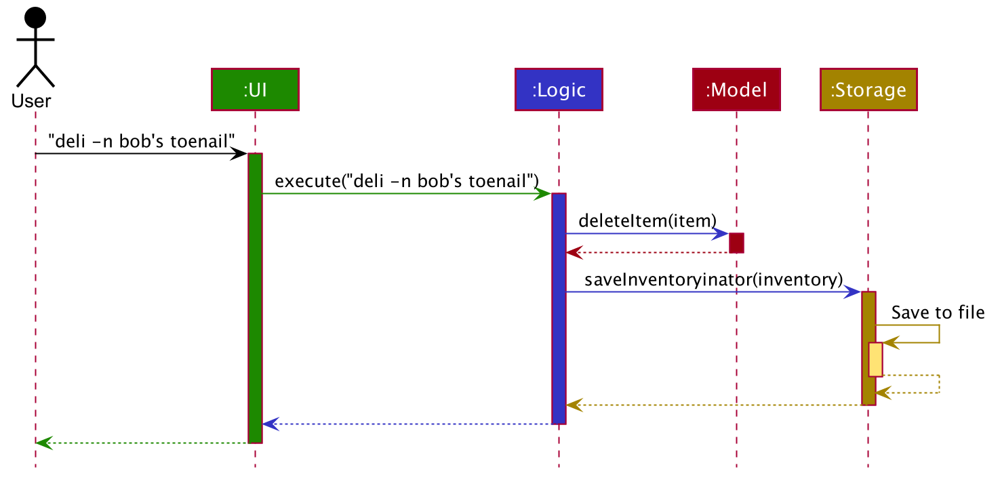
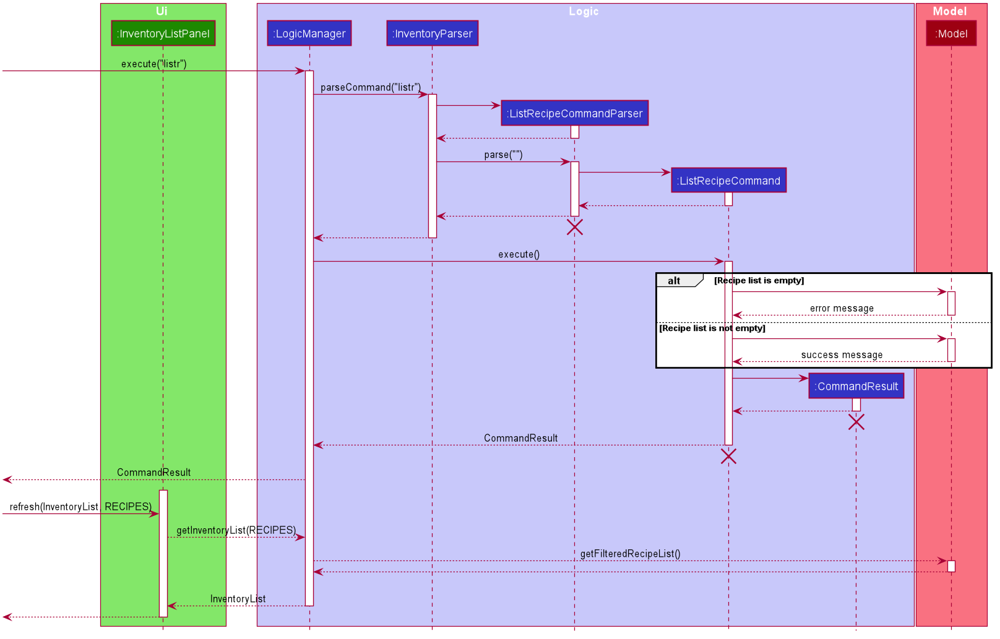

## Introduction

This is the developer guide for `Inventoryinator` a brownfield project evolved
from [AddressBook3](https://github.com/nus-cs2103-AY2021S1/tp).

**Inventoryinator** is a **desktop app for managing game inventories**. Our app is optimized for use via
the **typing** of commands, while your inventory is shown on our **Graphical User Interface (GUI)**.
If you can type fast, Inventoryinator can get your inventory management tasks done faster than traditional GUI apps.

If you would like to take part in developing Inventoryinator, this Developer Guide will help you get familiarized with the architecture
and provide an overview of the implementation of the features and components. You may use the table of
contents below to easily navigate to sections in this document.

* Table of Contents
{:toc}

## Documentation, logging, testing, configuration, dev-ops

* [Documentation guide](Documentation.md)
* [Testing guide](Testing.md)
* [Logging guide](Logging.md)
* [Configuration guide](Configuration.md)
* [DevOps guide](DevOps.md)
* [End User Persona](EndUserPersona.md)
* [Usecases](Usecases.md)
* [Implementation Details and Sequence Flow](CommandSequenceDiagram.md)

--------------------------------------------------------------------------------------------------------------------

## Setting up, getting started

Refer to the guide [UserGuide](UserGuide.md).

--------------------------------------------------------------------------------------------------------------------

## Design

This section will elaborate on the design and software patterns applied in Inventoryinator.

### Architecture

This application applies the [MVC pattern](https://www.tutorialspoint.com/design_pattern/mvc_pattern.html).

The ***Architecture Diagram*** given above explains the high-level design of the App.
Given below is a quick overview of each component.

**`Main`** has two classes called [`Main`](https://github.com/AY2021S1-CS2103T-F13-1/tp/blob/master/src/main/java/seedu/address/Main.java)
and [`MainApp`](https://github.com/AY2021S1-CS2103T-F13-1/tp/blob/master/src/main/java/seedu/address/MainApp.java).
It is responsible for:
* At app launch: Initializes the components in the correct sequence, and connects them up with each other.
* At shut down: Shuts down the components and invokes cleanup methods where necessary.

[**`Commons`**](#common-classes) represents a collection of classes used by multiple other components.

The rest of the App consists of four components.

* [**`UI`**](#ui-component): The UI of the App.
* [**`Logic`**](#logic-component): The command executor.
* [**`Model`**](#model-component): Holds the data of the App in memory.
* [**`Storage`**](#storage-component): Reads data from, and writes data to, the hard disk.

Each of the four components,

* defines its *API* in an `interface` with the same name as the Component.
* exposes its functionality using a concrete `{Component Name}Manager` class (which implements the corresponding
API `interface` mentioned in the previous point.

For example, the `Logic` component (see the class diagram given below) defines its API in the `Logic.java` interface
and exposes its functionality using the `LogicManager.java` class which implements the `Logic` interface.

**How the architecture components interact with each other**

The *Sequence Diagram* below shows how the components interact with each other
 for the scenario where the user issues the command `deli -n bob's toenail`.

The sections below give more details of each component.

### UI component

**API** :
[`Ui.java`](https://github.com/AY2021S1-CS2103T-F13-1/tp/blob/master/src/main/java/seedu/address/ui/Ui.java)

The UI consists of a `InventoryMainWindow` that is made up of parts e.g.`CommandBox`, `ResultDisplay`, `InventoryListPanel`,
`StatusBarFooter` etc. All these, including the `InventoryMainWindow`, inherit from the abstract `UiPart` class.

The `UI` component uses JavaFx UI framework. The layout of these UI parts are defined in matching `.fxml` files that
are in the `src/main/resources/view` folder. For example, the layout of the
[`InventoryMainWindow`](https://github.com/AY2021S1-CS2103T-F13-1/tp/blob/master/src/main/java/seedu/address/ui/InventoryMainWindow.java)
is specified in [`InventoryMainWindow.fxml`](https://github.com/AY2021S1-CS2103T-F13-1/tp/blob/master/src/main/resources/view/InventoryMainWindow.fxml)

The `UI` component,

* Executes user commands using the `Logic` component.
* Listens for changes to `Model` data so that the UI can be updated with the modified data.

### Logic component

The Logic component of Inventoryinator applies a [command](https://refactoring.guru/design-patterns/command) behavioural design pattern. 

**API** :
[`Logic.java`](https://github.com/AY2021S1-CS2103T-F13-1/tp/blob/master/src/main/java/seedu/address/logic/Logic.java)

1. `Logic` uses the `InventoryParser` class to parse the user command.
1. This results in a `Command` object which is executed by the `LogicManager`.
1. The command execution can affect the `Model` (e.g. adding an item).
1. The result of the command execution is encapsulated as a `CommandResult` object which is passed back to the `UI`.
1. In addition, the `CommandResult` object can also instruct the `UI` to perform certain actions, such as displaying help to the user.

Given below is the Sequence Diagram for interactions within the `Logic` component for the `execute("deli -n bob's toenail")` API call.

### Model component

**API** : [`Model.java`](https://github.com/AY2021S1-CS2103T-F13-1/tp/blob/master/src/main/java/seedu/address/model/Model.java)

The `Model`,

* stores a `UserPref` object that represents the user’s preferences.
* stores the Inventory data like items, recipes etc.
* exposes an unmodifiable `ObservableList<Item>` and `ObservableList<Recipe>` which can be 'observed' e.g. the UI can
 be bound to this list so that the UI automatically updates when the data in the list change.
* does not depend on any of the other three components.

### Storage component

**API** : [`Storage.java`](https://github.com/AY2021S1-CS2103T-F13-1/tp/blob/master/src/main/java/seedu/address/storage/Storage.java)

The `Storage` component,
* can save `UserPref` objects in json format and read it back.
* can save the `ItemList` data in json format and read it back.
* can save `RecipeList` data in json format and read it back.
* can save `LocationList` data in json format and read it back.

### Common classes

Classes used by multiple components are stored in the `seedu.address.commons` package.

--------------------------------------------------------------------------------------------------------------------

## Feature Implementation

This section describes some noteworthy details on how certain features are implemented.

### Add Quantity feature

The add quantity feature allows users to easily modify the quantity stored of a recorded item,
without having to using `edit`.

#### Implementation

`AddQuantityToItemCommand` facilitates the addition of a user-input quantity to an existing `Item`.
This command is a specific invocation of an `EditItemCommand` that only modifies the `Item`'s quantity,
and instead of replacing the quantity by a new value in `EditItemCommand`, the user-input quantity
is added to the existing `Item`'s `Quantity`.

This added `Quantity` can be negative, however the final `Quantity` of the
modified `Item` cannot be below 0.

`AddQuantityToItemCommand` is dependent on `EditItemCommand` and utilises it to execute its
intended behaviour. It builds a `EditItemDescriptor` by searching for the `Item`'s attributes.
Using the current `Quantity` and the user-input, it calculates an updated `Quantity`. It then
constructs and executes an `EditItemCommand` to replace the `Item`'s `Quantity` with the
updated value.

The sequence diagram for the execution of an `AddQuantityToItemCommand` is as follows:

The `Item` with name banana is denoted as `itemBanana`, and the original quantity assumed to be `20`.

### View detailed item feature

The view detailed item feature allows users to view the detailed information of a recorded item, as compared to the
default list display of all items which may truncate some information.

#### Implementation

During execution of view command, `LogicManager` detects that it is a view command, then has `InventoryParser` parse
the item name that the user has input using `ViewDetailsCommandParser`. After parsing, `LogicManager` has the
`Model` reset it's current filters for the lists of items and recipes. Then, `LogicManager` executes the
`ViewDetailsCommand`, which applies it's own filter to the list of items, such that only the exact item
the user has requested remains, and also parses the recipes to find recipes that creates this item.

After executing the view command, `LogicManager` sends feedback to `InventoryMainWindow` that the command has a 
`DisplayedInventoryType` of `DETAILED_ITEM`, which prompts `InventoryListPanel` to change the display card of items
into a more detailed display card on the GUI.

This is the sequence diagram of view detailed item command:

#### Reasoning behind current implementation

View detailed item was first implemented with the idea of changing GUI on demand, but we eventually realised due to
AB3's abstraction, `Model` and `Logic` can't communicate directly, which means we could not change the GUI during
execution of the command. It was only after looking at the `help` command that we discovered how AB3 used `LogicManager`
to communicate with `MainWindow` by checking for a certain `help` flag in the `CommandResult` that
`LogicManager` returns. This information allows `CommandResult` to know when to make changes to the GUI.
At last, this discovery has led to us changing the implementation of `CommandResult` by adding more flags to support
our new commands that will affect the GUI. Specifically, the check for whether to use a more detailed card to display
items is through checking the `DisplayedInventoryType` of `CommandResult`.

#### Alternative implementation

One problem with the current implementation is that it is rather inconvenient to find the correct file to make changes,
due to AB3's amount of abstraction. An alternative implementation is to create an association class between `Logic`
and `Model`, that allow for `Logic` to access `Model`'s `FilteredItemList` directly, which would greatly simplify
the sequence of command flow (as well as the sequence diagram). However, the amount of resources and effort required
to implement such an association class, as well as the additional need for testing and debugging this new association
class, might ironically lead to bigger time wastage than looking through each class involved in the execution of the
view command.

### Delete Item Feature

`DeleteItemCommand` facilitates the deletion of an existing `Item`. This deletion cascades to impact any
`Recipe` in the list of recipes that are associated with this item, as such, these matching `Recipe` are also deleted.

This command was implemented to resolve the [userstory](), regarding "As a user I want to delete
 a item so that I can remove item that I no longer need to track."

#### Implementation

During the execution of an `DeleteItemCommand`, as referenced from the [architecture sequence diagram](#Architecture),
the input is accepted by the GUI, and passed into the `LogicManager` that calls `InventoryParser` to parse the command
word and determines that command is a `DeleteItemCommand`. This also cleans the user input by removing the command word.

Then `InventoryParser` calls the specific `DeleteItemCommandParser#parse(Input)` to read and parse the given field, in this case,
 **"-n Bob's Toenail"**. This process reads the given input string, and checks for validity. Then assuming no `ParseException` occurs,
 the resulting `DeleteItemCommand` is created for the input item.
  This `DeleteItemCommand` is returned up the method call stack to the `LogicManager` where the `Command#execute(model)`
 occurs.
 
This is where change is made into the stored `Model` within the `DeleteItemCommand`. `Model` is used as an abstraction of the internal
details of cached storage.

First a query is made to the `Model` to check that the `Item` exists, and if so, deletes the item from the the `Model`.

Then, a query is made for any `Recipe` in the `Item`, or has the `Item` as a product of the `Recipe` and this reference is
 then deleted from the product.

Lastly, the deleted `Recipe` also cascade their `Recipe` deletion to any items that contain the `Recipe`.

This concludes the **deletion routine**.

After successful deletion occurs, the resulting `CommandResult` with a success message is returned
successfully to the  `LogicManager` and then displayed on the GUI.

The following sequence diagram details in depth how the `DeleteItemCommand` works:

Initial user input is shown in full, but as the system transforms the input,
 inputs and returned values abstracted out into apt representations.

#### Alternative Implementation and Reasoning against its implementation

One problem with the current implementation is that there is a deep coupling between
the internal structure of the `Model`, that is namely the `FilteredItemList` and `FilteredRecipeList`,
 with no direct methods manipulating these classes from the `ModelManager` facade design pattern itself.

This causes some direct manipulation of non-neighbouring classes, which violates
[`Law of Demeter`](https://hackernoon.com/object-oriented-tricks-2-law-of-demeter-4ecc9becad85).
However, the facade design pattern applied to `ModelManager` also prevents excessive bloat and coupling.

Hence refraining from this implementation reduces the size of the class significantly,
 improving readability of the code and preventing `ModelManager` from entailing extra responsibility.

### List item/recipe feature

The list item/recipe feature allows the user to toggle between viewing the list of all items or recipes in the 
current inventory. 

#### Implementation

There are three main view modes, which are: display of all items, display of all recipes, and viewing of detailed item.
The list item and list recipe features facilitates the switch between viewing the item list and recipe list.

In `InventoryMainWindow`, whenever a command is executed, the `InventoryListPanel` is refreshed,
to be filled with the relevant inventory list.
This list is retrieved by `getInventoryList` in `LogicManager`, based on the current view mode.

For the list item, list recipe and view details commands, the relevant display mode is stored in the `CommandResult`. 
Upon execution, the display mode is passed on from the `CommandResult` to the  `InventoryMainWindow`, which will store
the current display mode, and pass on to the `InventoryListPanel` and `LogicManager` to refresh and retrieve the relevant list.

For all other commands, they will return a `CommandResult` with `UNCHANGED` as the inventory type. 
This indicates that the view mode should not be changed. The same type of inventory list (updated accordingly)
will be retrieved and displayed. If the user was previously on detailed item view, the item list will be displayed instead.

The following sequence diagram shows how the list items operation works:

The following sequence diagram shows how the list recipes operation works:

#### Reasoning behind current implementation
In the existing AB3 structure, `Model` and `Logic` cannot communicate directly, which means we could not change the GUI
during execution of the command. Therefore, `CommandResult` was augmented to contain the relevant display mode, and pass
the information back to the `Ui` section to update the display.

#### Alternative implementation
A possible alternative implementation which might be more convenient for users would be to include two tabs, and allow 
the user to switch between the two tabs by clicking the tabs. This will allow for easier, more visual navigation and
might be implemented by constructing additional scenes in JavaFX, displaying the scene the user requests to view.

This alternative was not chosen as our target group is defined to be fast typists, and in line with the rest of our commands, 
which all require CLI input, switching to usage of the mouse would not be convenient. Furthermore, the current implementation 
is also more extensible, as we can easily mix and match items and recipes to display by filtering the item and recipe
lists in the command as required, rather than constructing a new scene from scratch. The implementation here was then
adapted to implement the view detailed item command easily, and could also be useful for future developments and extensions.

### Find items feature

The find items feature allows users to search, case-insensitively, for items using search keys. Item names that match or contain any of the
 keys will be displayed.

#### Implementation

The `FindItemCommand` object facilitates this feature. The search keys are parsed by the `FindItemCommandParser` which
 creates a `NameMatchesKeywordsPredicate` object and passes it to `FindItemCommand`. Upon execution, the predicate object
 is passed on to `Model` which updates the `filteredItemsList` using the predicate. The predicate checks whether an item's
 name matches or contains any of the search keys. case-insensitively. Finally, the `FindItemCommand` returns a `CommandResult`,
 set to display the `filteredItemsList`. If there are any items that are found, the number of items found is displayed.
 If none are found, a message is shown to the user.

The following sequence diagram illustrates how the find items command works.

### Undo/redo feature

The undo/redo feature allows users to undo and redo commands that change the state of the inventory, so that users
can undo their mistakes.

#### Implementation

`VersionedInventory` facilitates the proposed undo/redo feature. It extends `Inventory`, with
comprises: `ItemList`, `LocationList` and `RecipeList` and contains the entire `Inventory`'s undo/redo history,
stored internally as an `inventoryStateList` and `currentStatePointer`.

Additionally, it implements the following operations:

* `VersionedInventory#commit()` — Saves the current inventory state in its history.
* `VersionedInventory#undo()` — Restores the previous inventory state from its history.
* `VersionedInventory#redo()` — Restores a previously undone inventory state from its history.

These operations are exposed in the `Model` interface as `Model#commitInventory()`, `Model#undoInventory()` and
`Model#redoInventory()` respectively.

Given below is an example usage scenario and how the undo/redo mechanism behaves at each step.

Step 1. The user launches the application for the first time. The `VersionedInventory` will be initialized with
the initial inventory state, and the `currentStatePointer` pointing to that single inventory state.

Step 2. The user executes `deli -n Bob’s 28th finger` (a `DeleteItemCommand`) command to delete the matching item in
the inventory. The `deli` command calls `Model#commitInventory()`, causing the modified state of the inventory
after the `deli -n Bob’s 28th finger` command executes to be saved in the `inventoryStateList`, and the
`currentStatePointer` is shifted to the newly inserted inventory state.

Step 3. The user executes `addi -n Bob’s 6th regret -q 8` (a `AddItemCommand`) to add a new item.
The `addi` command also calls `Model#commitInventory()`, causing another modified inventory state to be
saved into the `inventoryStateList`.

**Note:** If a command fails its execution, it will not call `Model#commitInventory()`, so the inventory
state will not be saved into the `inventoryStateList`.

Step 4. The user now decides that adding the item was a mistake, and decides to undo that action by executing the
`undo` command. The `undo` command will call `Model#undoInventory()`, which will shift the `currentStatePointer`
once to the left, pointing it to the previous inventory state, and restores the inventory to that state.

**Note:** If the `currentStatePointer` is at index 0, pointing to the initial `Inventory` state, then there are 
no previous `Inventory` states to restore. The `undo` command checks if this is the case. If so, it will return 
an error to the user rather than attempting to perform the undo.

The following sequence diagram shows how the undo operation works:

**Note:** The lifeline for `UndoCommand` should end at the destroy marker (X) but due to a
limitation of PlantUML, the lifeline reaches the end of diagram.

The `redo` command does the opposite — it calls `Model#redoInventory()`, which shifts the `currentStatePointer`
once to the right, pointing to the previously undone state, and restores the inventory to that state.

**Note:** If the `currentStatePointer` is at index `inventoryStateList.size() - 1`, pointing to the
latest inventory state, then there are no undone `Inventory` states to restore. The `redo` command checks if this 
is the case. If so, it will return an error to the user
rather than attempting to perform the redo.

Step 5. The user then decides to execute the command `listi`. Commands that do not modify the inventory, such as 
`listi`, will usually not call `Model#commitInventory()`, `Model#undoInventory()` or `Model#redoInventory()`.
Thus, the `inventoryStateList` remains unchanged.

Step 6. The user executes `clear`, which calls `Model#commitInventory()`. Since the `currentStatePointer`
is not pointing at the end of the `inventoryStateList`, all inventory states after the `currentStatePointer`
will be purged. Reason: It no longer makes sense to redo the `addi -n Bob’s 6th regret -q 8` command. This is the
behavior that most modern desktop applications follow.

The following activity diagram summarizes what happens when a user executes a new command:

#### Design consideration:

##### Aspect: How undo & redo executes

* **Alternative 1 (current choice):** Saves the entire inventory.
  * Pros: Easy to implement.
  * Cons: May have performance issues in terms of memory usage.

* **Alternative 2:** Store a stack of commands that have been run.
  * Pros: We store a stack of commands which is added to whenever the user runs a new command that
          modifies the inventory state. When undo is invoked, the stack is popped and added to a
          redo stack, and the command will be negated and run. When redo is invoked, the redo stack
          is popped, and the command is run.
  * Cons: Harder to implement as each command has to be negated individually. This has considerably
          many edge cases to consider.

--------------------------------------------------------------------------------------------------------------------

## Appendix: Requirements

### Product scope

**Target user profile**:

* has a need to manage a significant number of items in a game.
* prefers desktop apps over other types
* can type fast
* prefers typing to mouse interactions
* is very comfortable using CLI apps

**Value proposition**: manage inventory faster than a typical mouse/GUI driven app

### User stories for V1.4

Priorities: High (must have) - `* * *`, Medium (nice to have) - `* *`, Low (unlikely to have) - `*`

| Priority | As a …​                                    | I want to …​                     | So that I can…​                                             |
| -------- | ------------------------------------------ | ------------------------------ | ---------------------------------------------------------------------- |
| `* * *`  | new user                                   | see usage instructions         | refer to instructions when I forget how to use the App                 |
| `* * *`  | user                                       | add a new item                 |                                                                        |
| `* * *`  | user                                       | add quantity to an item        | track the items that I have managed in my inventory                    |
| `* * *`  | user                                       | add tags to an item            | classify the items i have managed in my inventory                      |
| `* * *`  | user                                       | add a recipe                   |                                                                        |
| `* * *`  | user                                       | edit a item                    | to ensure that all parameters in the item are updated correctly        |
| `* * *`  | user                                       | delete an item                 | remove item that I no longer need to track                             |
| `* * *`  | user                                       | delete a recipe                | remove recipes that I no longer need to use                            |
| `* * *`  | user                                       | find an item by name           | locate details of items without having to go through the entire list   |
| `* * *`  | user                                       | find an item by tags           | locate details of items without having to go through the entire list   |
| `* * *`  | user                                       | list all my items              | visually see what items are currently stored in my inventory           |
| `* * *`  | user                                       | list all my recipes            | visually see what recipes are currently stored in my inventory         |
| `* * *`  | user                                       | see a detailed view of an item | see recipes associated with this item                                  |
| `* * `   | user                                       | tag an item by location        | locate items by where they are located                                 |
| `* * `   | user                                       | tag an item using custom tags  | further organise and categorise my items                               |
| `* * `   | user                                       | undo commands                  | revert changes that I no longer want                                   |
| `* * `   | user                                       | redo commands                  | revert changes that I actually want                                    |
| `* * `   | user                                       | craft items                    | easily craft what I want from the items I have in my inventory         |
| `* * `   | user                                       | simulate crafting              | easily find out if I have enough items to make what I want             |
| `*`      | user                                       | clear all items                | clear this inventory of items to use it to track another game          |
| `*`      | user                                       | clear all recipes              | clear the clutter in my inventory                                      |

### Non-Functional Requirements

1.  Should work on any _mainstream OS_ as long as it has Java `11` or above installed.
2.  Should be able to hold up to 1000 items and recipes without noticeable sluggishness in performance for typical usage.
3.  A user with above average typing speed for regular English text (i.e. not code, not system admin commands)
 should be able to accomplish most of the tasks faster using commands than using the mouse.
4.  A user should be able to view visually the output from the application.
5.  Should work without requiring internet connectivity.

### Glossary

This is a reference for technical terms that you may need to refer to when reading this developer guide.

* Mainstream OS: Windows, Linux, Unix, OS-X
* GUI: The graphical user interface is a form of user interface that allows users
 to interact with electronic devices through graphical icons and audio indicator such as primary notation.
* Parameter: a user input to be used by the application
* Item: An item represents an object you obtain in a game. Eg a <u>Rock</u>
* Recipe: A recipe is associated with multiple items, and represents the consumption of items in the input,
 to produce an item of the output. Eg: 3 <u>Sticks</u> -> <u>Staff</u>
* Location: The place where an item can be found in game. Eg: <u>Sleepywood</u>
* Inventory: The entire state of the Inventoryinator, including recipes, items, locations etc.
