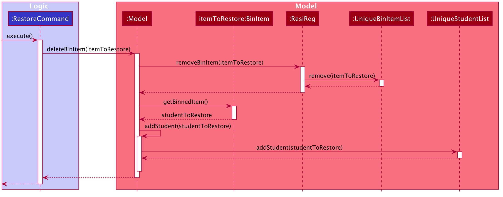
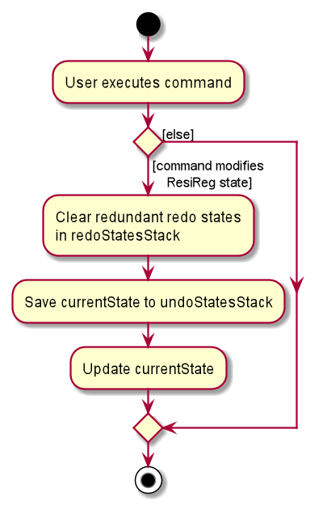

* Table of Contents
{:toc}

---

## **Setting up, getting started**

Refer to the guide [_Setting up and getting started_](SettingUp.md).

---

## Introduction

**ResiReg** is a productivity app designed to help OHS* admin at Residential Colleges (RCs)* in NUS with their daily tasks. **ResiReg** allows admin to allocate rooms to students, and manage student and room records, generate billing and OHS reports, and export CSVs for easy reference and sharing.

**ResiReg** has the following main features:

1. Manage records of students.
2. Manage records of rooms.
3. Manage allocations of students to rooms in the College.

## Purpose and Audience for this Guide

This Developer Guide specifies the architecture, design, implementation and use cases for **ResiReg**, as well as our considerations behind key design decisions.

It is intended for developers, software testers, open-source contrubitors and any like-minded persons who wish to contribute this project or gain deeper insights about **ResiReg**.

## Setting Up

Refer to the guide [here](./SettingUp.md).

## **Design**

### Architecture

The **_Architecture Diagram_** given above explains the high-level design of the App. Given below is a quick overview of each component.

:bulb: **Tip:** The `.puml` files used to create diagrams in this document can be found in the [diagrams](https://github.com/se-edu/addressbook-level3/tree/master/docs/diagrams/) folder. Refer to the [_PlantUML Tutorial_ at se-edu/guides](https://se-education.org/guides/tutorials/plantUml.html) to learn how to create and edit diagrams.

**`Main`** has two classes called [`Main`](https://github.com/se-edu/addressbook-level3/tree/master/src/main/java/seedu/address/Main.java) and [`MainApp`](https://github.com/se-edu/addressbook-level3/tree/master/src/main/java/seedu/address/MainApp.java). It is responsible for,

- At app launch: Initializes the components in the correct sequence, and connects them up with each other.
- At shut down: Shuts down the components and invokes cleanup methods where necessary.

[**`Commons`**](#common-classes) represents a collection of classes used by multiple other components.

The rest of the App consists of four components.

- [**`UI`**](#ui-component): The UI of the App.
- [**`Logic`**](#logic-component): The command executor.
- [**`Model`**](#model-component): Holds the data of the App in memory.
- [**`Storage`**](#storage-component): Reads data from, and writes data to, the hard disk.

Each of the four components,

- defines its _API_ in an `interface` with the same name as the Component.
- exposes its functionality using a concrete `{Component Name}Manager` class (which implements the corresponding API `interface` mentioned in the previous point.

For example, the `Logic` component (see the class diagram given below) defines its API in the `Logic.java` interface and exposes its functionality using the `LogicManager.java` class which implements the `Logic` interface.

**How the architecture components interact with each other**

The _Sequence Diagram_ below shows how the components interact with each other for the scenario where the user issues the command `delete 1`.

The sections below give more details of each component.

### UI component

**API** :
[`Ui.java`](https://github.com/se-edu/addressbook-level3/tree/master/src/main/java/seedu/address/ui/Ui.java)

The UI consists of a `MainWindow` that is made up of parts e.g.`CommandBox`, `ResultDisplay`, `PersonListPanel`, `StatusBarFooter` etc. All these, including the `MainWindow`, inherit from the abstract `UiPart` class.

The `UI` component uses JavaFx UI framework. The layout of these UI parts are defined in matching `.fxml` files that are in the `src/main/resources/view` folder. For example, the layout of the [`MainWindow`](https://github.com/se-edu/addressbook-level3/tree/master/src/main/java/seedu/address/ui/MainWindow.java) is specified in [`MainWindow.fxml`](https://github.com/se-edu/addressbook-level3/tree/master/src/main/resources/view/MainWindow.fxml)

The `UI` component,

- Executes user commands using the `Logic` component.
- Listens for changes to `Model` data so that the UI can be updated with the modified data.

### Logic component

**API** :
[`Logic.java`](https://github.com/se-edu/addressbook-level3/tree/master/src/main/java/seedu/address/logic/Logic.java)

1. `Logic` uses the `ResiRegParser` class to parse the user command.
1. This results in a `Command` object which is executed by the `LogicManager`.
1. The command execution can affect the `Model` (e.g. adding a person).
1. The result of the command execution is encapsulated as a `CommandResult` object which is passed back to the `Ui`.
1. In addition, the `CommandResult` object can also instruct the `Ui` to perform certain actions, such as displaying help to the user.

Given below is the Sequence Diagram for interactions within the `Logic` component for the `execute("delete 1")` API call.

:information_source: **Note:** The lifeline for `DeleteCommandParser` should end at the destroy marker (X) but due to a limitation of PlantUML, the lifeline reaches the end of diagram.

### Model component

**API** : [`Model.java`](https://github.com/se-edu/addressbook-level3/tree/master/src/main/java/seedu/address/model/Model.java)

The `Model`,

- stores a `UserPref` object that represents the user’s preferences.
- stores the residence regulation data.
- exposes an unmodifiable `ObservableList<Person>` that can be 'observed' e.g. the UI can be bound to this list so that the UI automatically updates when the data in the list change.
- does not depend on any of the other three components.

:information_source: **Note:** An alternative (arguably, a more OOP) model is given below. It has a `Tag` list in the `ResiReg`, which `Person` references. This allows `ResiReg` to only require one `Tag` object per unique `Tag`, instead of each `Person` needing their own `Tag` object. 

### Storage component

**API** : [`Storage.java`](https://github.com/se-edu/addressbook-level3/tree/master/src/main/java/seedu/address/storage/Storage.java)

The `Storage` component,

- can save `UserPref` objects in json format and read it back.
- can save the residence regulation data in json format and read it back.

### Common classes

Classes used by multiple components are in the `seedu.resireg.commons` package.

---

## **Implementation**

This section describes some noteworthy details on how certain features are implemented.

### Bin Feature

#### Implementation

ResiReg allows for a bin feature, where students and rooms are moved to a bin on deletion, and persist there for a user-specified period (with a default of 30 days) before they are removed permanently. The feature is built using the `BinItem`, `UniqueBinItemList` and `JsonAdaptedBinItem` classes and an interface `Binnable`. Items that can be stored in the bin (`Student` and `Room`) implement the empty1 interface `Binnable`. A `BinItem` object is created when a `Binnable` object is deleted, and it contains the Binnable object and the date of deletion (implemented as a `LocalDate`) as its attributes. Consequently, the `BinItem` is placed into `UniqueBinItemList`.

The class diagram below represents the class structure pictorially.

The following is a run-through of a typical user session where ResiReg is started, a student is deleted and moved to the bin, and then the user restores the student from the bin. Note that the sequence is the same for when a room is deleted and restored.

Step 1. On launching ResiReg, `ModelManager` calls `ModelManager#deleteExpiredItems()` during initialization. This method iterates through `UniqueBinItemList` and removes all bin items which have expired (i.e they have persisted in the bin for more days than the user-specified cutoff) by calling `UniqueBinItemList#remove()` for the expired object.

Step 2. The user executes the `delete 1` command to delete the first student in ResiReg. The `delete`
command calls the constructor of `BinItem` with the deleted student to create a new `BinItem` object. The `dateDeleted` attribute is initialized with the current system time. 

Step 3. The `delete` command then adds the new `BinItem` object to the `UniqueBinItemList` by first checking for uniqueness (as a defensive precaution) and calling `Model#addBinItem(studentToBin)`.

The sequence diagram given below represents this process of deleting a student (steps 2 and 3).

Step 4. The user executes a few other commands. He then cognizes that he has erroneously deleted the student, and doesn't wish to execute the `undo` command multiple times. He then navigates to the Bin tab, (by executing `bin`) and executes the `restore` command to retrieve the `Student` item from the bin. 

Step 5. The `execute` method of `RestoreCommand` removes the `itemToRestore` from `UniqueBinItemList` by caling `Model#deleteBinItem(itemToRestore)`. The student item is retrieved by calling an instance method, `itemToRestore.getBinnedItem()` and typecasted to a `Student` object. 

Step 6. The Ui is updated accordingly, since both the `UniqueBinItemList` and `UniqueStudentList` follow the Observer pattern. 

The following sequence diagram shows how a restore command operates.

1 Refer below for the design decision of maintaining an empty interface. 

#### Design Considerations

##### Aspect: Handling the storage of bin items
Problem Statement: A bin item must be polymorphic in its storage, i.e., it must be capable of serializing and deserializing multiple types of data (`Student`s as well as `Room`s). However, JSON does not support polymorphic storage natively, and a concrete serializable type must be provided during read/write operations. This leads to the problem of how to store `Binnable` instances whose concrete type is not known.

- **Alternative 1 (current choice):** Reusing storage classes for `Room` and `Student` and typecasting explicitly

  - Pros: Allows a clean separation of concerns since the `Binnable` interface does not need to contain information about storage.  This removes  the need to repeat code by creating storage classes such as `JsonAdaptedStudentBin` and `JsonAdaptedRoomBin` dedicated to storing objects in the Bin only. In other words, it makes the Ui, Logic and Model structure OOP-compliant. Further, it results in more efficient testing (since storage tests for `Student` and `Room` objects need not be re-written)
  - Cons: Doesn't scale well since if new types of `Binnable` objects are to be handled by the system (e.g. `Bills`), then multiple storage-related files will have to be modified to allow for the new object to have robust type-checking and storage. In other words, it makes the storage less OOP-compliant. 

- **Alternative 2:** Assigning storage responsibility to the `Binnable` interface
  - Pros: Makes storage more OOP-compliant, prevents need for explicit type-checking. 
  - Cons: Complicates the general MVC structure, and makes it more difficult to migrate to non-JSON storage, since instances of `Binnable` (e.g. `Student` and `Room`) must now contain their storage implementation details as well. 

### Allocation/ deallocation/ reallocation feature

The allocation/ deallocation/ reallocation feature is facilitated by `Allocation`. It is an association class of the
unique identifiers of a `Student` and a `Room` to which the `Student` is allocated to. The `Allocation` association
class includes the `Student`'s `StudentId` and the allocated `Room`'s `Floor` and `RoomNumber`.

#### Implementation

When a `Student` is allocated a `Room` using `AllocateCommand`, an `Allocation` instance is created and added to the
`UniqueAllocationList`. Likewise, when a `Student` is deallocated or reallocated a different `Room` using `DeallocateCommand` and
`ReallocateCommand` respectively, the `Allocation` relating to the `Student` is removed from `ResiReg` in the former
and edited in the latter.

#### Design consideration:

Aspect: How to associate the allocation between a student and a room

- **Alternative 1:** A student has a room.

  - Pros: Trivial implementation.
  - Cons: Storage redundancy as a student now has a copy of a room.

- **Alternative 2:** A room has a student.

  - Pros: Trivial implementation.
  - Cons: Storage redundancy as a room now has a copy of a student.

- **Alternative 3:** A student has a room and a room has a student.

  - Pros: Easy implementation.
  - Cons: Cyclic dependency between a room and a student.

- **Alternative 4 (final choice):** A student's room allocation is referred to by an association class.

  - Pros: Natural representation of the allocation.
  - Cons: Require more overhead code.

Having attempted a `Student` having a `Room` attribute and/or vice versa, it inevitably ends
up with a cyclic dependency in various parts of the code, such as the `Student` or `Room`'s `toString()` methods or
their `JsonAdapted` variants, which is undesired. Therefore, the room allocation functionality was refactored into
the `Allocation` association class (alternative 4).

### Undo/redo feature

#### Implementation

The undo/redo mechanism is facilitated by `StatefulResiReg`. It extends `ResiReg` with an undo/redo history, for commands that
modify the state of ResiReg, which comprises of: students, rooms, allocations, semesters and bin items.
The history is stored internally as `redoStatesStack`, `undoStatesStack` and `currState`. Additionally, it implements the following operations:

- `VersionedResiReg#save()` — Saves the current residence regulation state in its history.
- `VersionedResiReg#undo()` — Restores the previous residence regulation state from its history.
- `VersionedResiReg#redo()` — Restores a previously undone residence regulation state from its history.

These operations are exposed in the `Model` interface as `Model#saveStateResiReg()`, `Model#undoResiReg()` and `Model#redoResiReg()` respectively.

Given below is an example usage scenario and how the undo/redo mechanism behaves at each step.

Step 1. The user launches the application for the first time. The `VersionedResiReg` will be initialized with the initial residence regulation state.
Both `redoStatesStack` and `undoStatesStack` will be empty, while `currState` will be set to this single residence regulation state.

Step 2. The user executes `delete 3` command to delete the 3rd person in the residence regulation. The `delete` command calls `Model#saveStateResiReg()`, causing the current state of the residence regulation before the `delete 3` command executes
to be saved in the `undoStatesStack` and setting `currState` to be the state of the resident regulation after command execution.

Step 3. The user executes `add n/Jet …​` to add a new student. The `add` command also calls `Model#saveStateResiReg()`, causing the
current unmodified state to be saved in the `undoStatesStack` and `currState` to be set to the modified resident regulation state.

:information_source: **Note:** If a command fails its execution, it will not call `Model#saveStateResiReg()`, so 
both `currState` and `undoStatesStack` will not be updated.

Step 4. The user now decides that adding the student was a mistake, and decides to undo that action by executing the `undo` command. The `undo` command will call `Model#undoResiReg()`,
which will add the current state `stateAfterAdd` to `redoStatesStack` and set `currState` to the last entry in
`undoStatesStack`, the previous residence regulation state (`stateBeforeAdd`), and restores the residence regulation to that state.

:information_source: **Note:** If the `redoStatesStack` is empty, then there are no previous ResiReg states to restore. 
The `undo` command uses `Model#canUndoResiReg()` to check if this is the case. If so, it will return an error to the user rather
than attempting to perform the undo.

The following sequence diagram shows how the undo operation works:

:information_source: **Note:** The lifeline for `UndoCommand` should end at the destroy marker (X) but due to a limitation of PlantUML, the lifeline reaches the end of diagram.

The `redo` command does the opposite — it calls `Model#redoResiReg()`, which adds the current state to `undoStatesStack` and set `currState` to the last entry in
`redoStatesStack`, the next residence regulation state, and restores the residence regulation to that state.

:information_source: **Note:** If `redoStatesStack` is empty, then there are no undone ResiReg states to restore. The `redo` command uses `Model#canRedoResiReg()` to check if this is the case. If so, it will return an error to the user rather than attempting to perform the redo.

Step 5. The user then decides to execute the command `rooms`. Commands that do not modify the state of ResiReg
(e.g. `alias`, `rooms`, `togglesplit`, etc.) will not call `Model#saveStateResiReg()`, `Model#undoResiReg()` or `Model#redoResiReg()`. Thus, both `redoStatesStack` and `undoStatesStack` remain unchanged.

Step 6. The user executes `clear`, which calls `Model#saveStateResiReg()`.
As before, the current state `stateBeforeClear` clear will be pushed into `undoStatesStack`. This time `redoStatesStack` is no longer empty. It will be cleared as it no longer make sense to redo the add n/Jet command (this is the behavior that most modern desktop applications follow).

The following activity diagram summarizes what happens when a user executes a new command:

#### Design consideration:
##### How undo & redo executes

- **Alternative 1 (current choice):** Saves the entire ResiReg.

  - Pros: Easy to implement.
  - Cons: May have performance issues in terms of memory usage.

- **Alternative 2:** Individual command knows how to undo/redo by
  itself.
  - Pros: Will use less memory (e.g. for `delete`, just save the person being deleted).
  - Cons: We must ensure that the implementation of each individual command are correct.

##### Aspect: Data structure to support the undo/redo commands

- **Alternative 1 (current choice):** Use separate stacks for undo and redo, along with
  a reference to current state.

  - Pros: Closer to the command pattern than the alternative below, meaning a change from Alternative 1
    to Alternative 2 in how undo & redo executes will incur less additional work.
  - Cons: May have performance issues in terms of memory usage due to holding an additional reference and
    managing two data structures.

- **Alternative 2:** Use a list to store the history.
  - Pros: Better performance in terms of memory usage as compared to Alternative 1 and
    has a simpler implementation.
  - Cons: Further away from the command pattern than Alternative 1, so shifting to Alternative 2
    in how undo & redo executes will incur more additional work.

### \[Proposed\] Data archiving for semester

_{Explain here how the data archiving feature will be implemented}_

---

## **Documentation, logging, testing, configuration, dev-ops**

- [Documentation guide](Documentation.md)
- [Testing guide](Testing.md)
- [Logging guide](Logging.md)
- [Configuration guide](Configuration.md)
- [DevOps guide](DevOps.md)

---

## **Appendix: Requirements**

### Product scope

**Target user profile**:

- an OHS admin at a Residential College\* (in NUS)
- has a need to manage a large number of students and rooms (>800)
- dissatisfied with current MS Excel and paper-based workflow
- prefer desktop apps over other types
- can type fast
- prefers typing to mouse interactions
- is reasonably comfortable using CLI apps

**Value proposition**: manage students, room allocations and billing faster than a typical GUI app.

### User stories

Priorities: High (must have) - `☆ ☆ ☆`, Medium (nice to have) - `* *`, Low (unlikely to have) - `*`

| Priority | As a…                    | I can…                                                   | So that I can…                                                                                            |
| -------- | ------------------------ | -------------------------------------------------------- | --------------------------------------------------------------------------------------------------------- |
| \* \*    | Meticulous OHS admin     | have automatic backups of my data                        | rest knowing my data will not be accidentally erased.                                                     |
| \* \*    | OHS admin                | generate audit reports for financial data                | comply with internal audits of the Residential College.                                                   |
| \* \*    | OHS admin                | export records to csv files                              | easily create mailing lists or send relevant data to other admin.                                         |
| \* \* \* | New/Confused User        | check the syntax for a command                           | do a task even if I am unsure of the command usage.                                                       |
| \* \* \* | First Time User          | ask for help                                             | quickly and easily learn how to use the application in one place.                                         |
| \* \* \* | OHS Admin                | view a list of all students                              | check which students are in the system and access their particulars.                                      |
| \* \*    | As as skeptical GUI user | create aliases to other commands                         | perform my common actions while typing less.                                                              |
| \*       | OHS admin                | find a room by searching for the room number             | get the details of a specific room, without getting cluttered by other information.                       |
| \* \*    | OHS Admin                | view a list of rooms filtered by a particular type       | select the rooms that needs to be upgraded, for example.                                                  |
| \* \*    | OHS admin                | delete a bill                                            | remove a erroneously added bill.                                                                          |
| \* \*    | OHS admin                | mark a bill as paid                                      | easily keep track of the remaining amount a student has to pay to OHS.                                    |
| \* \*    | OHS admin                | view a list of all students with outstanding bills       | remind students of outstanding payments.                                                                  |
| \* \*    | skeptical GUI user       | have autocompletions for a command                       | quickly and efficiently complete an operation.                                                            |
| \* \*    | skeptical GUI user       | redo the previous command using a keyboard shortcut      | do the same task without typing again, e.g. if two students wish to pay the same bill.                    |
| \* \*    | Busy OHS Admin           | find a student by partial searching for their first name | type quickly without worrying about typos.                                                                |
| \* \*    | Skeptical GUI user       | undo my last command                                     | fix any change that I made erroneously.                                                                   |
| \* \*    | skeptical GUI user       | view previous commands using a keyboard shortcut         | check if I made an error in adding or deleting records.                                                   |
| \* \*    | OHS admin                | edit the bill amount                                     | ensure that changes in the billing amounts due to changes in university policies can be reflected.        |
| \* \*    | OHS admin                | view all outstanding bills for a student                 | inform the student of his/her due bills.                                                                  |
| \* \*    | OHS admin                | update a Semester name                                   | correct typos in the semester name.                                                                       |
| \* \*    | OHS admin                | add a bill for a student                                 | keep track of a student's bills and finances.                                                             |
| \* \* \* | OHS admin                | view a list of vacant rooms                              | start assigning rooms to students before the semester starts.                                             |
| \* \*    | OHS admin                | archive the current Semester's data                      | keep the data for auditing purposes, but not hvae it distract me while dealing with the current semester. |
| \* \* \* | OHS admin                | view a room allocation for a student                     | check and inform a student of their room allocation during check in.                                      |
| \* \* \* | OHS admin                | allocate a room to a student                             | allocate a student to a room before the semester starts.                                                  |
| \* \* \* | OHS admin                | delete a room allocation for a student                   | update vacancies when a student applies to leave their room.                                              |
| \* \*    | OHS admin                | add a remark to a bill                                   | record any exceptional details about the bill (e.g. cash-only payment).                                   |
| \* \*    | OHS admin                | add a new semester                                       | make sure all new bills and allocations are made in the context of the semester.                          |
| \* \* \* | OHS admin                | view a list of all allocated rooms                       | check which students stay in which rooms.                                                                 |
| \* \* \* | OHS admin                | edit a room allocation for a student                     | change a student's room allocation and update the room vacancies.                                         |
| \*       | OHS admin                | edit a room's type                                       | log upgrades like the installation of an aircon.                                                          |
| \* \*    | OHS admin                | export all of the current data to a data-file            | hand over my duties to another admin.                                                                     |
| \*       | OHS admin                | edit a room's semesterly fees                            | update room charges when costs increase (e.g. from $1000 to $1500)                                        |
| \* \*    | OHS admin                | import data from a data file                             | continue work from where my predecessor left off.                                                         |
| \* \* \* | OHS admin                | add a student to ResiReg                                 | perform admin duties related to the student.                                                              |
| \* \* \* | OHS admin                | edit the details of an existing student                  | easily correct any typos and update the student details in response to changes (e.g. faculty).            |
| \* \* \* | OHS admin                | delete a student                                         | so that I can remove an erroneously added student.                                                        |

_{More to be added}_

### Use cases

(For all use cases below, the **System** is `ResiReg` and the **Actor** an `OHS admin`, unless specified otherwise)

#### Use case: UC01 - Add a student

**MSS**

1. OHS admin requests to add a student and supplies student details.
1. ResiReg adds the student and saves the changes.

Use case ends.

**Extensions**

- 1a. Student details are missing or invalid, or there is already a student with the same matriculation number.

  - ResiReg shows an error message.

    Use case starts over.

#### Use case: UC02 - Delete a student

**MSS**

1. OHS admin requests to list students.
1. ResiReg shows a list of students.
1. OHS admin requests to delete a specified student from the list.
1. ResiReg deletes the specified student and saves the changes.

Use case ends.

**Extensions**

- 1a. The list of students is empty.

  Use case ends.

- 3a. The specified student does not exist.

  - ResiReg shows an error message.

    Use case resumes at step 2.

#### Use case: UC03 - Edit a student

**MSS**

1. OHS admin requests to list students.
1. ResiReg shows a list of students.
1. OHS admin requests to edit a specific student from the list and supplies details to edit.
1. ResiReg edits the student and saves the changes.

Use case ends.

**Extensions**

- 1a. The list of students is empty.

  Use case ends.

- 3a. The specified student does not exist or the supplied details are invalid.

  - ResiReg shows an error message.

    Use case resumes at step 2.

#### Use case: UC04 - Allocate a room to a student

**MSS**

1. OHS admin requests to list students without a room allocation and list vacant rooms.
1. ResiReg shows a list of students without a room allocation and a list of vacant rooms.
1. OHS admin requests to allocate a particular student to a particular room.
1. ResiReg adds the room allocation and saves the changes.

Use case ends.

**Extensions**

- 3a. Student belongs to an existing room allocation, room belongs to an existing room allocation, room does not exist or student does not exist.

  - ResiReg shows an error message.

  Use case resumes at step 2.

#### Use case: UC05 - Delete a room allocation for a student

**MSS**

1. OHS admin requests to list room allocations.
1. ResiReg shows a list of room allocations.
1. OHS admin requests to delete a specific room allocation.
1. ResiReg removes the room allocation and saves the changes. The room and student are not modified.

Use case ends.

**Extensions**

- 1a. The list of room allocations is empty.

  Use case ends.

- 3a. Room allocation does not exist.

  - ResiReg shows an error message.

    Use case resumes at step 2.

#### Use case: UC06 - Edit an existing room allocation

**MSS**

1. OHS admin requests to list room allocations.
1. ResiReg shows a list of room allocations.
1. OHS admin requests to edit a specific room allocation from the list and supplies details to update.
1. ResiReg updates the room allocation and saves the changes.

Use case ends.

**Extensions**

- 1a. The list of room allocations is empty.

  Use case ends.

- 3a. Room allocation does not exist or details supplied are invalid.

- ResiReg shows an error message.

    Use case resumes at step 2.

#### Use case: UC07 - Undo previous command

1. OHS admin enters a command that changes state.
1. ResiReg processes and executes the command.
1. OHS admin requests to undo previously entered command.
1. This previous command gets undone and the state of
   `ResiReg` is reverted.

Use case ends.

**Extensions**

- 3a. There are no previously entered commands entered that change state.

  - ResiReg shows an error message.

    Use case resumes at Step 1.

#### Use case: UC08 - Redo previous command

1. OHS admin requests to redo previously undone command
   that changes state.
1. ResiReg processes and executes the command.
1. This previous command gets undone and the state of
   `ResiReg` is updated.

Use case ends.

**Extensions**

- 1a. There are no previously undone commands that change state to redo.

  - ResiReg shows an error message.

    Use case ends.

#### Use case: UC09 - History command

1. OHS admin requests to list history of previously entered commands.
1. ResiReg shows a history of previously entered commands in reverse chronological order.

Use case ends.

**Extensions**

- 1a. The history of previously entered commands is empty. - ResiReg shows an error message.
  Use case ends.

#### Use case: UC09 - Add an alias

1. OHS admin requests to add an alias for a command word.
2. ResiReg adds the alias and saves the changes.

Use case ends.

**Extensions**

- 1a. The specified command word does not exist, or the alias is invalid.
  - ResiReg shows an error message.
  Use case ends.

**Extensions**

- 1a. The history of previously entered commands is empty. - ResiReg shows an error message.
  Use case ends.

### Non-Functional Requirements

1. Should work on any _mainstream OS_ as long as it has Java `11` or above installed.
2. Should be able to hold up to 1000 records (students and rooms) without a noticeable sluggishness in performance (defined as 1 second latency) for typical usage.
3. Should not require an installer.
4. A user with above average typing speed for regular English text (i.e not code, not system admin commands) should be able to accomplish most of the tasks faster using commands than using the mouse.
6. The codebase should be maintainable so that developers can easily add new features to the project

### Glossary

- **Mainstream OS**: Windows, Linux, Unix, OS-X
- **OHS**: Office of Housing Services at the National University of Singapore (NUS)
- **OHS Admin**: An employee of the OHS who works at a Residential College at NUS
- **Residential College**: A university residence for students that offers a 2-year program at NUS
- **Check-in**: Exercise conducted at the beginning of the semester (in Week 0), where a student is informed of his room allocation.
- **Outstanding bill**: A bill due to be paid by a student.

---

## **Appendix: Instructions for manual testing**

Given below are instructions to test the app manually.

:information_source: **Note:** These instructions only provide a starting point for testers to work on;
testers are expected to do more *exploratory* testing.

### Launch and shutdown

1. Initial launch

   1. Download the jar file and copy into an empty folder

   1. Double-click the jar file Expected: Shows the GUI with a set of sample contacts. The window size may not be optimum.

1. Saving window preferences

   1. Resize the window to an optimum size. Move the window to a different location. Close the window.

   1. Re-launch the app by double-clicking the jar file. 
      Expected: The most recent window size and location is retained.

1. _{ more test cases …​ }_

### Deleting a person

1. Deleting a person while all persons are being shown

   1. Prerequisites: List all persons using the `list` command. Multiple persons in the list.

   1. Test case: `delete 1` 
      Expected: First contact is deleted from the list. Details of the deleted contact shown in the status message. Timestamp in the status bar is updated.

   1. Test case: `delete 0` 
      Expected: No person is deleted. Error details shown in the status message. Status bar remains the same.

   1. Other incorrect delete commands to try: `delete`, `delete x`, `...` (where x is larger than the list size) 
      Expected: Similar to previous.

1. _{ more test cases …​ }_

### Saving data

1. Dealing with missing/corrupted data files

   1. _{explain how to simulate a missing/corrupted file, and the expected behavior}_

1. _{ more test cases …​ }_
