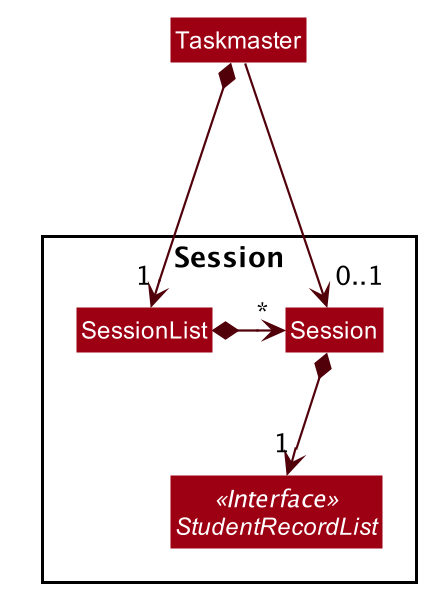
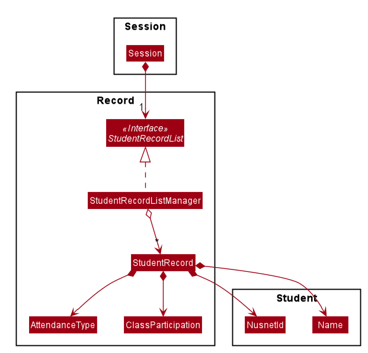
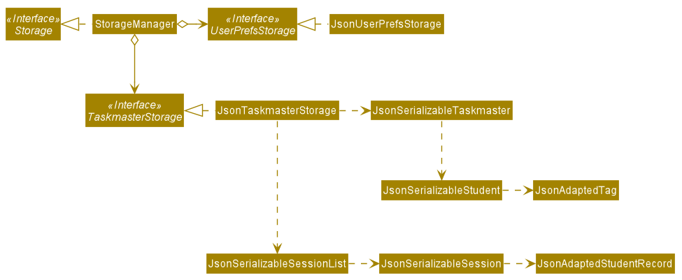

* Table of Contents
{:toc}

--------------------------------------------------------------------------------------------------------------------

## **Setting up, getting started**

Refer to the guide [_Setting up and getting started_](SettingUp.md).

--------------------------------------------------------------------------------------------------------------------

## **Design**

### Architecture

The ***Architecture Diagram*** given above explains the high-level design of the App. Given below is a quick overview of each component.

:bulb: **Tip:** The `.puml` files used to create diagrams in this document can be found in the [diagrams](https://github.com/AY2021S1-CS2103-F09-1/tp/tree/master/docs/diagrams/) folder. Refer to the [_PlantUML Tutorial_ at se-edu/guides](https://se-education.org/guides/tutorials/plantUml.html) to learn how to create and edit diagrams.

**`Main`** has two classes called [`Main`](https://github.com/AY2021S1-CS2103-F09-1/tp/tree/master/src/main/java/seedu/address/Main.java) and [`MainApp`](https://github.com/AY2021S1-CS2103-F09-1/tp/tree/master/src/main/java/seedu/address/MainApp.java). It is responsible for,
* At app launch: Initializes the components in the correct sequence, and connects them up with each other.
* At shut down: Shuts down the components and invokes cleanup methods where necessary.

[**`Commons`**](#common-classes) represents a collection of classes used by multiple other components.

The rest of the App consists of four components.

* [**`UI`**](#ui-component): The UI of the App.
* [**`Logic`**](#logic-component): The command executor.
* [**`Model`**](#model-component): Holds the data of the App in memory.
* [**`Storage`**](#storage-component): Reads data from, and writes data to, the hard disk.

Each of the four components,

* defines its *API* in an `interface` with the same name as the Component.
* exposes its functionality using a concrete `{Component Name}Manager` class (which implements the corresponding API `interface` mentioned in the previous point.

For example, the `Logic` component (see the class diagram given below) defines its API in the `Logic.java` interface and exposes its functionality using the `LogicManager.java` class which implements the `Logic` interface.

**How the architecture components interact with each other**

The *Sequence Diagram* below shows how the components interact with each other for the scenario where the user issues the command `delete 1`.

The sections below give more details of each component.

### UI component

**API** :
[`Ui.java`](https://github.com/AY2021S1-CS2103-F09-1/tp/tree/master/src/main/java/seedu/address/ui/Ui.java)

The UI consists of a `MainWindow` that is made up of parts e.g.`CommandBox`, `ResultDisplay`, `StudentListPanel`, `StatusBarFooter` etc. All these, including the `MainWindow`, inherit from the abstract `UiPart` class.

The `UI` component uses JavaFx UI framework. The layout of these UI parts are defined in matching `.fxml` files that are in the `src/main/resources/view` folder. For example, the layout of the [`MainWindow`](https://github.com/AY2021S1-CS2103-F09-1/tp/tree/master/src/main/java/seedu/address/ui/MainWindow.java) is specified in [`MainWindow.fxml`](https://github.com/AY2021S1-CS2103-F09-1/tp/tree/master/src/main/resources/view/MainWindow.fxml)

The `UI` component,

* Executes user commands using the `Logic` component.
* Listens for changes to `Model` data so that the UI can be updated with the modified data.

### Logic component

**API** :
[`Logic.java`](https://github.com/AY2021S1-CS2103-F09-1/tp/tree/master/src/main/java/seedu/address/logic/Logic.java)

1. `Logic` uses the `TaskmasterParser` class to parse the user command.
1. This results in a `Command` object which is executed by the `LogicManager`.
1. The command execution can affect the `Model` (e.g. adding a student).
1. The result of the command execution is encapsulated as a `CommandResult` object which is passed back to the `Ui`.
1. In addition, the `CommandResult` object can also instruct the `Ui` to perform certain actions, such as displaying help to the user.

Given below is the Sequence Diagram for interactions within the `Logic` component for the `execute("delete 1")` API call.

:information_source: **Note:** The lifeline for `DeleteCommandParser` should end at the destroy marker (X) but due to a limitation of PlantUML, the lifeline reaches the end of diagram.

### Model component

**API** : [`Model.java`](https://github.com/AY2021S1-CS2103-F09-1/tp/tree/master/src/main/java/seedu/address/model/Model.java)

The `Model`,

* stores a `UserPref` object that represents the user’s preferences.
* stores the student list data as a `Taskmaster` object.
* exposes an unmodifiable `ObservableList<Student>` that can be 'observed' e.g. the UI can be bound to this list so that the UI automatically updates when the data in the list change.
* also exposes an unmodifiable `ObservableList<Session>` that is similarly used by the UI.
* does not depend on any of the other three components.

:information_source: **Note:** An alternative (arguably, a more OOP) model is given below. It has a `Tag` list in the `AddressBook`, which `Student` references. This allows `AddressBook` to only require one `Tag` object per unique `Tag`, instead of each `Student` needing their own `Tag` object. 

### Storage component

**API** : [`Storage.java`](https://github.com/AY2021S1-CS2103-F09-1/tp/tree/master/src/main/java/seedu/address/storage/Storage.java)

The `Storage` component,
* can save `UserPref` objects in json format and read it back.
* can save the student list data in json format and read it back.
* can save the SessionList data in json format and read it back.

### Common classes

Classes used by multiple components are in the `seedu.taskmaster.commons` package.

--------------------------------------------------------------------------------------------------------------------

## **Additional Features Implemented**

### SessionList

Author: **Joshua Chew**
* Implement the class `SessionList` that encapsulate a list of tutorial sessions.
* Implement the class `Session` that represents a tutorial session conducted by a teaching assistant.
* Implement the commands in which a session is created and deleted.
* Implement the command to select the current session.

The `SessionList`,

* is stored by the Taskmaster.
* encapsulates a list of zero, one or more Session objects.
* can provide a list of the names of all Session objects that it contains (to pass to the UI).

The `Session`,

* stores a SessionName.
* stores a StudentRecordList.
* can mark the attendance of a particular student in the StudentRecordList.
* can mark the attendance of all students in the StudentRecordList with a single Command.

The current running Session, `currentSession`, is also stored as an attribute in the Taskmaster.

Given below is the Sequence Diagram for interactions within the `Session` component when `Taskmaster#markStudentWithNusnetId(nusnetId, attendanceType)` is called.

**Design Considerations**

The following considerations were taken into account in the process of implementing a `Session`.

* The ability to name a session is meant to contribute to the ease of use of TAskmaster for a Teaching Assistant.
This gives the Teaching Assistant the freedom to either name sessions as index numbers, or as the topic that was covered during the session.
With modules typically having up to 24 sessions per semester, this would help the Teaching Assistant navigate and search through a large number of sessions.
* Sessions are selected by name and deleted by name, to simplify the Teaching Assistant's process of managing multiple sessions. As a result,
a Teaching Assistant is not allowed to name two sessions with the same name. The class `SessionList` hence supports operations to check if a 
session with a specified name already exist inside the session list.

**Design Alternatives**

* Make `Session` store an `AttendanceList` and a `ClassParticipationList`.

    Initially, the attendance and class participation data was meant to be stored as seperate data structures. However, this
    approach was abandoned in favour of allowing the `Session` class store the interface `StudentRecordList` instead. This would
    support the Open-Closed Principle. It would allow greater ease of future extensions in the functionality of TAskmaster. For
    example, if we wished to allow a session store data on student submissions, the original approach would necessitate the modification
    of the code for `Session` to store another data structure which encapsulate the student submission data. On the other hand,
    storing a `StudentRecordList` can allow `Session` store such additional data without modifying its code at all, as all student-related
    data is encapsulated in a `StudentRecord`.

**Future Expansion**

Beyond v1.4, additional features can be implemented for **Session**:

* Allow `Session` to contain a `SessionRemark`.

    We have considered that Teaching Assistants might feel the need to write down a short memo about every Session. Such memos
    may consist of little reminders to collect assignments from students, or to note down what was not covered during the session due
    to time constraints. Hence, it would be beneficial to give Teaching Assistants the option of adding remarks for every Session.

* Allow users to edit the name, date and time of a `Session`.

    Currently, users are given the option to delete a `Session` if he has made a typo when keying in inputs for 
    the `SessionName` or `SessionDateTime`. In the future, it would be good to implement an `EditSessionCommand`
    to allow users to change the name, date and time of a session while still keeping the session's student record data on TAskmaster.
 

### StudentRecordList

Author: **Goh Siau Chiak**

* Implementing the classes that encapsulate a list of student records.

The `StudentRecordList`,
* is stored by a `Session`.
* encapsulates a list of zero or more `StudentRecord` objects.
* can provide a list of the `StudentRecord` objects that it contains (to pass to the UI).
* can mark the attendance of a student in the `Session`.

The `StudentRecord`,
* represents an immutable record of a student's attendance in a particular `Session`
* contains
  * a `NusnetId` that indicates which student the record represents
  * the `Name` of the student represented
  * the `AttendanceType` of the student for the `Session`
  * a `ClassParticipation` representing the score awarded to the student for participating in the `Session`

When the user wants to update the attendance or class participation score, a new `StudentRecord` object will be created. 

Given below is the Sequence Diagram for interactions within the `StudentRecordListManager` component when `StudentRecordListManager#markStudentAttendance(nusnetId, attendanceType)` is called.

Considerations for `markStudentAttendance`:
    
On one hand, the mark command uses an index to identify the record, for ease of usage for the user, as compared to 
having to type out the record's NUSNET ID. On the other hand, the mark attendance method within the `Model` identifies 
the record to mark using its NUSNET ID, to ensure correctness. Furthermore, the student records have to be stored in a 
JavaFX `ObservableList` to be easily displayable on the GUI. In the end, I decided to find the record to mark by 
iterating through the record list and comparing NUSNET IDs, since each student's NUSNET ID must be unique. The `O(N)`
time complexity of this method does not incur significant time cost because we expect there to be no more than 1000
students recorded in any session created by TAs using TAskmaster.

Design alternatives:
- Make `StudentRecord` mutable.

    This was the original design of `StudentRecord` which made sense at the time because a student's record
    would be frequently updated for marking of attendnace and awarding of class participation scores. However,
    the JavaFX `ObservableList` interface is **not notified when contained objects are modified**, only when 
    objects were added or deleted. This resulted in a bug where the GUI will not show the changes made when a
    student record was updated. In the end, it was decided that `StudentRecord` should be immutable to fix this bug.

- Make each `StudentRecordList` be dependent on and backed by the `StudentList` maintained by TAskmaster.

    This alternative was eventually rejected because it did not make sense from a design perspective. Each
    student record list represents the record of students **for that particular session only**. If we 
    implemented this alternative, edits to the student list will result in changes to all the student record
    lists, which does not follow the design of the student record list. For example:
    - suppose a TA is currently teaching three students, `A, B, C`
    - when the TA creates a new session `S1` , it will contain three corresponding student records
    - subsequently after the session is over, student `A` informs the TA that he is going to drop the module
    - when the TA deletes student `A` from the student list, the student record list of `S1` will update and
    no longer reflect that `A` was enrolled in the module when `S1` occurred

- Have `StudentRecord` contain the whole `Student` object, not just its `Name` and `NusnetId`

    This was considered and ultimately rejected because of the design considerations in the previous 
    alternative. Each student record, once created, is supposed to be independent of the student in the
    student list. This implies that subsequent changes to the student should not be known by the student
    record. Moreover, each student record only needs to know the name and NUSNET ID of the student at the moment 
    it was created and there is no need for it to know the rest of the student's information. 
    
    Furthermore, having
    each student record contain a student object will incur significant memory usage, especially since for most
    TAs, the same set of students will be enrolled in multiple sessions, each with a student record list. 
    Following the **Law of Demeter**, it was decided to restrict the student record to only have the name and NUSNET ID.
    Since editing of `NusnetId` is not allowed, there will be no issues with syncing of data. For example, even if the
    name of a particular student is edited after his `StudentRecord` was saved, we can find that student using their
    `NusnetId`.

 

### Storage

Author: **Jaya Rengam**
* Change/Add classes in the Storage package to store data related to Sessions.

A new method `JsonTaskmasterStorage#saveSessionList` will store the SessionList in the running Taskmaster to a separate .json file.
* The SessionList will be represented by a `JsonSerializableSessionList`, which contains a `List<JsonSerializableSession>`
* Each `JsonSerializableSession` will contain a `List<JsonAdaptedStudentRecord>`

**To-Do:**
* Update `TaskmasterStorage` interface (add `saveSessionList(ReadOnlyTaskmaster taskmaster)` method)
* Implement `saveSessionList` method in `JsonTaskmasterStorage`
* Create the new `JsonSerializable..`/`JsonAdapted..` classes
 

**_Notes from developer:_**
* This implementation of the feature uses Jackson libraries/formatting that is used in existing AB3 Storage classes
 

Alternative implementations:
* Store the SessionList as a JSON field in the existing Taskmaster file
    * Doing it this way would mean that the file would be repeatedly overwritten and any format errors will invalidate the whole file, including the StudentList.

### Class Participation Score

Author: **Theodore Leebrant**
* Implement the class in charge of representing the class participation of each student in a session.
* Implement the commands in which class participation would be scored.

The `ClassParticipation` is made such that it:
* Stores a `score`
    * of the `double` type.
    * between 0 and 10 inclusive.
    * with detail up to 2 decimal places.
* Supports equality whenever scores are the same
* Has a method to return the `String` representation of itself.
* Will be used by `StudentRecord`.

To support the `ClassParticipation` class, Taskmaster needs to be able to set a student's score in a session.  
In setting the student's score, TAskmaster needs to comply with the following specifications:
* Supports checking of session (i.e. throws an error in case of no sessions made, or no sessions selected)
* Able to identify the NUSNET ID from the index of student in the session.
* Has input validation for the score (between 0 and 10 inclusive)
* Able to truncate score to 2 decimal places (to follow with the `ClassParticipation` class)
* (Extra goal) Able to score all students who are present.

Based on the specification above, the following is the activity diagram when someone were to score a student's participation score:

**Design Considerations**

The specifications above has undergone several revisions, with the following considerations taken into account:
* Session checking needs to be done, as the scoring depends on the session the user is currently on.
* Support of scoring from the index is for ease of use for the user. 
Internally, it uses NUSNET ID to see which student needs to be scored as the NUSNET ID is unique for each student.
Therefore, there needs to be some lookup needed to bridge between these two.
* Input validation is needed to ensure that the score inputed is valid.
* The choice of 0-10 `double` score is to support the granularity of score detail 
(most TA would use at most 1 decimal place, therefore we added support for 2 decimal places for meticulous TAs), while
still maintaining good display for the sake of UX. Negative scores are not supported as negative score
does not make sense in this case.
* Marking all students will be a feature that supports the user experience of TAs using TAskmaster. Oftentimes there
is a baseline on what TAs consider basic participation marks - and many students barring the exceptional ones will get
similar, if not the same sccore. The `mark all` command comes from our observation of this fact.

**Design Alternatives**

* Make `ClassParticipation` a field in `StudentRecord`.  
This was the initial plan for `StudentRecord`. However, there are advantages to having ClassParticipation as its own class.
This would support data abstraction as we abstract away lower level data items, as well as help with decoupling. 
The implementer of `StudentRecord` does not need to know the internal details of the implementation of `ClassParticipation`, whether is it an enum (of, let's say
`GREAT, GOOD, AVERAGE, BAD`) or a `double` score as we have chosen to implement. Having a `ClassParticipation` class would
also support future expansion in the scoring of class participation without going through the internal details of `StudentRecord`.

* Make `ClassParticipation` an enum or use `int` values for the score.  
This was initially considered but ultimately scrapped to increase the flexibility, as well as attention to detail. 
Having an enum as the scoring system would work, but in effect, it would reduce the detail of score given to a student.
This may cause some TAs to not be satisfied with the scoring system. While having integer is a better solution, we
decided on using `double` due to the fact that 0-10 is easily scalable (e.g. to get percentage, the TA can just glance
at the score) and provides more detail. An alternative that may also be considered for future iteration is to use
`float` instead of `double` as we do not necessarily need double-precision decimal representation with only two decimal
places.

**Future expansion**

Beyond 1.4, there are several improvements that can be done:
* Set a maximum score for the session.  
This would include one extra command to change the maximum value of the score. In this case, we need to implement
a field in `ClassParticipation` for the maximum score, and see from this value for input validation. A problem that we
forsee in implementing this is the default choice of maximum score, validation of current score (what happens if
there is a student with score 5.5 but we set the maximum score to 5), as well as possible coupling due to the command
needing to see the maximum value of the class participation score.
* Have alternatives for scoring class participation.  
We have thought about the possiblity that the TA does not need the granularity of a `double` value to 2 decimal places.
In the future, it would be good to support a command that changes the type of the score, e.g. to discrete values given
by enum. Some considerations would be about existing scores, implementation of classes beyond `ClassParticipation`,
as well as command handling.

 

### UI

Author: **Lim Jin Feng**
* Change/Add classes in the UI package to display newly implemented functionality such as ClassRecords.

A new method `MainWindow#fillInnerParts2` will change the contents of the Ui to the student record, from the student list.
* This is implemented in such a way to accomodate future expansion.

**To-Do:**
* Support displaying of Sessions when Sessions are implemented.
* Support displaying of any new future implementation.

**_Notes from developer:_**
* Implementation still buggy: Ui does not update accordingly for student records.

Alternative implementations considered:
* Use FXML's tab feature to display class records:
    - Does not support future expansion when sessions is implemented - there may be an indefinite amount of sessions created.
--------------------------------------------------------------------------------------------------------------------

## **Documentation, logging, testing, configuration, dev-ops**

* [Documentation guide](Documentation.md)
* [Testing guide](Testing.md)
* [Logging guide](Logging.md)
* [Configuration guide](Configuration.md)
* [DevOps guide](DevOps.md)

--------------------------------------------------------------------------------------------------------------------

## **Appendix: Requirements**

### Product scope

**Target user profile**:

* is an Undergraduate CS Teaching Assistant
* has a need to manage their students:
    * attendance
    * participation
* can type fast
* prefers typing to mouse interactions
* is reasonably comfortable using CLI apps

**Value proposition**:
* manage students faster than a typical mouse/GUI driven app
* view student details at a glance
* add and remove students easily
* create student records for each individual class conducted
* mark and view attendance and class participation in these classes quickly

### User stories

Priorities: 
- High (must have) - `* * *`
- Medium (nice to have) - `* *`
- Low (unlikely to have) - `*`

| Priority | As a …​                                    | I want to …​                     | So that I can…​                                             |
| -------- | ------------------------------------------ | --------------------------------- | -------------------------------------------------------------- |
| `* * *`  | user                                       | add a new student                 |                                                                |
| `* * *`  | user                                       | view details of a student         | have quick access to them                                      |
| `* * *`  | user                                       | view details of all my students   | have quick access to them                                      |
| `* * *`  | user                                       | mark a student's attendance       |                                                                |
| `* *`    | user                                       | mark all students' attendance     | update all attendance records quickly and focus on teaching    |
| `* * *`  | user                                       | score a student's participation   |                                                                |
| `* *`    | user                                       | score all students; participation | update all participation records quickly and focus on teaching |
| `* * *`  | user                                       | delete a student                  |                                                                |
| `* * *`  | user                                       | add a new session                 |                                                                |
| `* * *`  | user                                       | view details of a session         | have quick access to it                                        |
| `* * *`  | user                                       | delete a session                  |                                                                |

*{More to be added}*

### Use cases

(For all use cases below, the **System** is `Taskmaster` and the **Actor** is the `user`, unless specified otherwise)
 

**Use case: Add a student**

**MSS**

1.  User requests to add a new student
2.  System shows the added student

Use case ends.

**Extensions**

* 1a. The given input is invalid.
    * 1a1. System shows an error message.
      Use case resumes at step 1.
 

**Use case: View a student's details**

**MSS**

1.  User requests to view a student's details
2.  System shows the student's details

Use case ends.

**Extensions**

* 1a. The given input is invalid.
    * 1a1. System shows an error message.
      Use case resumes at step 1.
 

**Use Case: View all students' details**

**MSS**
1. User requests to view all students' details
2. System shows all students' details.

Use case ends.
 

**Use Case: Delete a student**

**MSS**
1. User requests to list students
2. System shows a list of students
3. User requests to delete a specific student in the list
4. System deletes student

Use case ends.

Extensions
* 2a. The list is empty.  
    Use case ends.
    
* 3a. The given input is invalid.
    * 3a1. System shows an error message.
        Use case resumes at step 2.
 

**Use Case: Add a session**

**MSS**
1. User requests to add a session
2. System adds the session and shows the student records for that session with default fields

Extensions
* 1a. The given input is invalid.
    * 1a1. System shows an error message.
        Use case resumes at step 1.
        
* 1b. The name of the session given by the user is already in use.
    * 1b1. System shows an error message.
        Use case resumes at step 1.

 

**Use Case: Change view to a session**

**MSS**
1. User requests to view information (student records) of a session
2. System displays student records of that session

Extensions
* 1a. The given input is invalid.
    * 1a1. System shows an error message.
        Use case resumes at step 1.
        
 

**Use Case: Delete a session**

**MSS**
1. User requests to delete a session
2. System deletes the session

Extensions
* 1a. The given input is invalid.
    * 1a1. System shows an error message.
        Use case resumes at step 1.

 

**Use Case: Mark a student's attendance**

**MSS**
1. User requests to mark student attendance.
2. System marks the student's attendance within the context of that session.

Extensions
* 1a. System is not within the context of a session.
    * 1a1. System shows an error message.
    Use case ends.
    
* 1b. The given input is invalid.
    * 1b1. System shows an error message.
        Use case resumes at step 1.

 

**Use Case: Mark all students' attendances**

**MSS**
1. User requests to mark all students' attendance.
2. System marks all student attendances within the context of that session.

Extensions
* 1a. System is not within the context of a session.
    * 1a1. System shows an error message.
    Use case ends.
    
* 1b. The given input is invalid.
    * 1b1. System shows an error message.
        Use case resumes at step 1.

 

**Use Case: Score student's participation**

**MSS**
1. User requests to score participation.
2. System scores the student's participation within the context of that session.

Extensions
* 1a. System is not within the context of a session.
    * 1a1. System shows an error message.
    Use case ends.
    
* 1b. The given input is invalid.
    * 1b1. System shows an error message.
        Use case resumes at step 1.

 

**Use Case: Score all students' participation**

**MSS**
1. User requests to score all students' participation.
2. System scores all student participation within the context of that session.

Extensions
* 1a. System is not within the context of a session.
    * 1a1. System shows an error message.
    Use case ends.
    
* 1b. The given input is invalid.
    * 1b1. System shows an error message.
        Use case resumes at step 1.

*{More to be added}*

### Non-Functional Requirements

1.  Should work on any _mainstream OS_ as long as it has Java `11` or above installed.
2.  Should work without requiring an installer, the installation of any additional software, or any external connections.
3.  Should only be for a single user.
4.  Should be able to hold up to 1000 students without a noticeable sluggishness in performance for typical usage.
5.  A user with above average typing speed for regular English text (i.e. not code, not system admin commands) should be able to accomplish most of the tasks faster using commands than using the mouse.
6.  Should store data locally _only_, in a human editable text file
7.  Total file size should not exceed 100MB.

*{More to be added}*

### Glossary

* **Mainstream OS**: Windows, Linux, Unix, macOS
* **Private contact detail**: A contact detail that is not meant to be shared with others (e.g. NUSNET ID)

--------------------------------------------------------------------------------------------------------------------

## **Appendix: Instructions for manual testing**

Given below are instructions to test the app manually.

:information_source: **Note:** These instructions only provide a starting point for testers to work on;
testers are expected to do more *exploratory* testing.

### Launch and shutdown

1. Initial launch

   1. Download the jar file and copy into an empty folder

   1. Double-click the jar file Expected: Shows the GUI with a set of sample students. The window size may not be optimal.

1. Saving window preferences

   1. Resize the window to an optimum size. Move the window to a different location. Close the window.

   1. Re-launch the app by double-clicking the jar file. 
       Expected: The most recent window size and location is retained.

### Adding a student

1. Adding a student while all students are being shown

   1. Prerequisites: List all students using the `list-students` command. Multiple students in the list.

   1. Test case: `add-student n/John Tan u/johntan98 e/johntan98@gmail.com i/e0012345 t/tardy` 
      Expected: A student named John Tan is added to the list. Details of the added student shown in the status message.

   1. Test case: `add-student n/John Tan u/johntan98 e/johntan98@gmail.com i/e0012345 t/tardy` 
      Expected: No student is added because a student with the same details already exists in the list. Status message informs user that student already exists.

   1. Test case: `add-student n/Gandalf` 
      Expected: No student is added. Error details shown in the status message.

   1. Other incorrect add commands to try: `add-student`, `add-student Gandalf`, `...` 
      Expected: Similar to previous.
      
### Finding a student

1. Finding a student whose name exists in the student list

   1. Prerequisites: List all students using the `list-students` command. Multiple students in the list.

   1. Test case: `find-students john` 
      Expected: A list of students whose names match the keyword `john` will be shown.

   1. Test case: `find-students` 
      Expected: No change to the student list view. Error details shown in the status message.
      
### Editing a student

1. Editing a student while all students are being shown

   1. Prerequisites: List all students using the `list-students` command. Multiple students in the list.

   1. Test case: `edit-student 1 u/johntan68 e/johntan68@gmail.com` 
      Expected: First student's Telegram handle will be changed to `johntan68`, and his email to `johntan68@gmail.com`.

   1. Test case: `edit-student 0 u/johntan98 e/johntan98@gmail.com` 
      Expected: No student is edited. Error details shown in the status message.
   
   1. Other incorrect delete commands to try: `edit-student`, `edit-student x`, `...` (where x is larger than the list size) 
      Expected: Similar to previous.

### Deleting a student

1. Deleting a student while all students are being shown

   1. Prerequisites: List all students using the `list-students` command. Multiple students in the list.

   1. Test case: `delete-student 1` 
      Expected: First student is deleted from the list. Details of the deleted student shown in the status message.

   1. Test case: `delete-student 0` 
      Expected: No student is deleted. Error details shown in the status message.

   1. Other incorrect delete commands to try: `delete-student`, `delete-student x`, `...` (where x is larger than the list size) 
      Expected: Similar to previous.

### Adding a session

1. Adding a new session 

   1. Test case: `add-session s/First Session dt/23-10-2020 0900` 
      Expected: A session named First Session is added to the session list. Details of the added session shown in the status message.

   1. Test case: `add-session s/First Session dt/24-10-2020 0900` 
      Expected: No session is added as a session with the same name is already found in the session list. Status message informs user that session already exists.

   1. Test case: `add-session` 
      Expected: No session is added. Error details shown in the status message.

   1. Other incorrect add commands to try: `add-session First Session`, `...` 
      Expected: Similar to previous.
   

### Changing the current session view

1. Changing the current session view

   1. Prerequisites: Add a session to the session list by running the command `add-session s/First Session dt/23-10-2020 0900`.

   1. Test case: `goto s/First Session` 
      Expected: The student records of the session named First Session will be displayed.

   1. Test case: `goto s/Session that does not exist` 
      Expected: Current view does not change. Status message states that the session does not exist.
   
   1. Test case: `goto` 
      Expected: Current view does not change. Error details shown in the status message.

   1. Other incorrect add commands to try: `goto First Session`, `...` 
      Expected: Similar to previous.

### Scoring a student
The below testcases assume that you are in a session and have 7 students inside it.

* Scoring a student
    1. Test case: `score 1 cp/5.3`  
    Expected: The student with index 1 in the session will be scored 5.3.
    2. Test case: `score 8 cp/3.23`  
    Expected: No student's score will be changed. An error shows that the student index provided is invalid.
    3. Test case: `score 1 cp/-1`  
    Expected: No student's score will be changed. An error shows that the input is invalid as it is negative.
    4. Test case: `score 1 cp/11.4`  
    Expected: No student's score will be changed. An error shows that the input is invalid as it greater than 10.

* Scoring multiple students (all students who are present)
    1. Test case: `score all cp/8.2`  
    Expected:  
        * All students who are present are scored 8.2.
        * All students who are not present have their scores unchanged.
    2. Test case: `score all cp/-0.52`  
    Expected: No scores changed, an error shows that the input is invalid as it is negative.
    3. Test case: `score all cp/10.52`  
    Expected: No scores changed, an error shows that the input is invalid as it is greater than 10.

### Clearing contents of student and session list

1. Clearing contents of student and session list

   1. Test case: `clear` 
      Expected: The contents of the student and session list will be emptied.
      

### Deleting a session

1. Deleting a session

   1. Prerequisites: Add a session to the session list by running the command `add-session s/First Session dt/23-10-2020 0900`.

   1. Test case: `delete-session s/First Session` 
      Expected: First session is deleted from the list.

   1. Test case: `delete-session s/Session that does not exist` 
      Expected: No session is deleted. Status message informs user that there are no sessions in the session list with that name.

   1. Other incorrect delete commands to try: `delete-session`, `delete-session First Session` 
      Expected: Similar to previous.

### Exiting the program

1. Exiting the program

   1. Test case: `exit` 
      Expected: The window of the program will close.

### Saving data

1. Dealing with missing/corrupted data files

   1. _{explain how to simulate a missing/corrupted file, and the expected behavior}_

1. _{ more test cases …​ }_

--------------------------------------------------------------------------------------------------------------------

## **Appendix: Effort**

