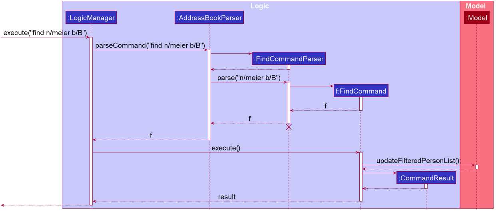

# Calo Developer Guide

## Table of Contents
1.[ About This Guide](#1-about-this-guide)  
2.[ Setting Up](#2-setting-up)  
3.[ Design](#3-design)  
* [3.1. Architecture](#31-architecture)
* [3.2. Ui Component](#32-ui-component)
* [3.3. Logic Component](#33-logic-component)
* [3.4. Model Component](#34-model-component)
* [3.4. Storage Component](#35-storage-component)
* [3.4. Common Class](#36-common-classes)

4.[ Implementation](#4-implementation)  
5.[ Documentation, Logging and Testing](#5-documentation-logging-testing-configuration-dev-ops)  
6.[ Appendix A: Requirements](#6-appendix-a-requirements)  
7.[ Appendix B: User Stories](#7-appendix-b-user-stories)  
8.[ Appendix C: Use Cases](#8-appendix-c-use-cases)  
9.[ Appendix D: Non-Functional Requirements](#9-appendix-d-non-functional-requirements)  
10.[ Appendix E: Instructions For Manual Testing](#10-appendix-e-instructions-for-manual-testing)

--------------------------------------------------------------------------------------------------------------------

## 1. About This Guide

This document serves as a developer guide for Calo App with sufficient and comprehensive overview of the software
so that new developers, like you, will have a working knowledge of the application by the end of the guide.  

Note that this guide only provide reasonable depth. By no means this guide serves as a replacement for the actual code. 

--------------------------------------------------------------------------------------------------------------------
## 2. Setting Up

Refer to the guide [_Setting up and getting started_](SettingUp.md).

--------------------------------------------------------------------------------------------------------------------

## 3. Design

### 3.1. Architecture

The ***Architecture Diagram*** given above explains the high-level design of the App. Given below is a quick overview of each component.

:bulb: **Tip:** The `.puml` files used to create diagrams in this document can be found in the [diagrams](https://github.com/AY2021S1-CS2103T-W17-2/tp/tree/master/docs/diagrams/) folder. Refer to the [_PlantUML Tutorial_ at se-edu/guides](https://se-education.org/guides/tutorials/plantUml.html) to learn how to create and edit diagrams.

**`Main`** has two classes called [`Main`](https://github.com/AY2021S1-CS2103T-W17-2/tp/blob/master/src/main/java/seedu/address/Main.java) and [`MainApp`](https://github.com/AY2021S1-CS2103T-W17-2/tp/blob/master/src/main/java/seedu/address/ExerciseMainApp.java). It is responsible for,
* At app launch: Initializes the components in the correct sequence, and connects them up with each other.
* At shut down: Shuts down the components and invokes cleanup methods where necessary.

[**`Commons`**](#36-common-classes) represents a collection of classes used by multiple other components.

The rest of the App consists of four components.

* [**`UI`**](#32-ui-component): The UI of the App.
* [**`Logic`**](#33-logic-component): The command executor.
* [**`Model`**](#34-model-component): Holds the data of the App in memory.
* [**`Storage`**](#35-storage-component): Reads data from, and writes data to, the hard disk.

Each of the four components,

* defines its *API* in an `interface` with the same name as the Component.
* exposes its functionality using a concrete `{Component Name}Manager` class (which implements the corresponding API `interface` mentioned in the previous point.

For example, the `Logic` component (see the class diagram given below) defines its API in the `Logic.java` interface and exposes its functionality using the `LogicManager.java` class which implements the `Logic` interface.

**How the architecture components interact with each other**

The *Sequence Diagram* below shows how the components interact with each other for the scenario where the user issues the command `delete 1`.

The sections below give more details of each component.

### 3.2. UI component

**API** :
[`Ui.java`](https://github.com/AY2021S1-CS2103T-W17-2/tp/blob/master/src/main/java/seedu/address/ui/Ui.java)

The UI consists of a `MainWindow` that is made up of parts e.g.`CommandBox`, `ResultDisplay`, `ExerciseListPanel`, `StatusBarFooter` etc. All these, including the `MainWindow`, inherit from the abstract `UiPart` class.

The `UI` component uses JavaFx UI framework. The layout of these UI parts are defined in matching `.fxml` files that are in the `src/main/resources/view` folder. For example, the layout of the [`MainWindow`](https://github.com/AY2021S1-CS2103T-W17-2/tp/blob/master/src/main/java/seedu/address/ui/MainWindow.java) is specified in [`MainWindow.fxml`](https://github.com/AY2021S1-CS2103T-W17-2/tp/blob/master/src/main/resources/view/MainWindow.fxml)

The `UI` component,

* Executes user commands using the `Logic` component.
* Listens for changes to `Model` data so that the UI can be updated with the modified data.

### 3.3. Logic component

**API** :
[`Logic.java`](https://github.com/AY2021S1-CS2103T-W17-2/tp/blob/master/src/main/java/seedu/address/logic/Logic.java)

1. `Logic` uses the `ExerciseBookParser` class to parse the user command.
1. This results in a `Command` object which is executed by the `LogicManager`.
1. The command execution can affect the `Model` (e.g. adding an exercise).
1. The result of the command execution is encapsulated as a `CommandResult` object which is passed back to the `Ui`.
1. In addition, the `CommandResult` object can also instruct the `Ui` to perform certain actions, such as displaying help to the user.

Given below is the Sequence Diagram for interactions within the `Logic` component for the `execute("delete 1")` API call.

:information_source: Note: The lifeline for `DeleteCommandParser` should end at the destroy marker (X) but due to a limitation of PlantUML, the lifeline reaches the end of diagram.

### 3.4. Model component

**API** : [`Model.java`](https://github.com/AY2021S1-CS2103T-W17-2/tp/blob/master/src/main/java/seedu/address/model/ExerciseModel.java)

The `Model`,

* stores a `UserPref` object that represents the user’s preferences.
* stores the Exercise book data.
* exposes an unmodifiable `ObservableList<Exercise>` that can be 'observed' e.g. the UI can be bound to this list so that the UI automatically updates when the data in the list change.
* does not depend on any of the other three components.

:information_source: Note: An alternative (arguably, a more OOP) model is given below. It has a `Tag` list in the `ExerciseBook`, which `Exercise` references. This allows `ExerciseBook` to only require one `Tag` object per unique `Tag`, instead of each `Exercise` needing their own `Tag` object. 

### 3.5. Storage component

**API** : [`Storage.java`](https://github.com/AY2021S1-CS2103T-W17-2/tp/blob/master/src/main/java/seedu/address/storage/Storage.java)

The `Storage` component,
* can save `UserPref` objects in json format and read it back.
* can save the exercise book data in json format and read it back.

### 3.6. Common classes

Classes used by multiple components are in the `seedu.addressbook.commons` package.

--------------------------------------------------------------------------------------------------------------------

## 4. Implementation

### 4.1. Archive
(Phyo Han)  

Since Calo always stores all the exercises that the user did in the past, it is always a good idea to archive past exercises
so that the user can start afresh without the past records slowing down the performance of the application. Therefore, Calo
provides the user the `archive` function to stores these records. 

#### 4.1.1. Implementation
This section describes how the `archive` command is implemented. Unlike all the other command that only needs to interact
with `Model` component, the `archive` command needs to interact with `Storage` component which is responsible for reading
and writing `.json` file to the system, with the proper formatting for future read. 

To implement this, before executing `ArchiveCommand`, the `LogicManager` will pass `Storage` to the `ArchiveCommand`.  

A high level illustration of the executation is given in the following sequence diagram.

Step 1: Users enter the command which will consists of the keyword `archive`, the parameter `f/` followed by the file location.
This input is stored as a `String`.  
Step 2: The `String` is then passed to `ExerciseBookParser` which will cascade the `String` into meaning parts.  
Step 3: `ExerciseBookParser` create the `ArchiveCommand` and set the `Storage` component for `ArchiveCommand`.  
Step 4: `ExerciseBookParser` passes the `ArchiveCommand` back to the `LogicManager` and the `LogicManager` executes the command.
Step 5: During the executation, `ArchiveCommand` interacts with `Storage` who will write to the Local File on the user's computer.  
Step 6: If the user has no permission to write on the specific file location, an error message will appear on user screen.
Else, a success message will appear on the user Response Box.  

#### 4.1.2. Design Consideration

**Aspect**: How to decide the file path?

* **Alternative 1 (current choice):** Have the user specify the file location and file name to store the archived file.
  * Pros: Easier to implement. The user have the freedom on where to store and what to call the archived file. 
  * Cons: Error prone. The user need to enter the file location  specifically whcih may be difficult for users who are used
to GUI.
  * Reasons for choosing: Though this choice is more error prone, we decide that since our app is Command-Line Interface,
our users are likely accustomed to entering file location and the freedom to decide the location and name is always nice
to have. 

* **Alternative 2:** Have a dedicated file location that the file will be stored.
  * Pros: Easier for the user to archive.
  * Cons: Difficult for the system to give a meaningful name to the archived file. If we were to name the file as `file_1`,
`file 2` etc, we need to check if there exists such file name first.

### 4.2. Displaying Graph of Calories Burnt
(Phyo Han)  

Since Calo aims to encourage the user to get active and track his progress, a graph of how much calories burnt for the past
few days can motivate the user to push further.

#### 4.2.1. Implementation
After each command, the UI will render itself through `MainWindow.fillInnerPart()` to update all the Ui Component. So
during this rendering process, `CaloriesGraph` takes in `HashMap` that contains the `Date` as the key and total `Calories` burn
for that day as the value. `CaloriesGraph` will then take values for the most recent 7 days (including today) and display
them on the Calories Graph.

Step 1: User enter a valid command.  
Step 2: The command is passed to the `LogicManager` which parse and execute the command.  
Step 3: After the update is done, `MainWindow` called `getCaloriesByDay()` which is a HashMap that contains the summarised information.  
Step 4: `MainWinodw` re-render all its `Ui` component including `CaloriesGraph`.  

The following is the Sequence Diagram that describes the process in slightly more detail, including the method call.  

`

#### 4.2.2. Design Consideration

**Aspect**: How to generate the CaloriesGraph?

* **Alternative 1 (current choice):** Let the `LogicManager` passes a `HashMap<String,Integer>` that has `Date` as a key and
sum of `Calories` as a Integer value to `MainWindow` after each command.
  * Pros: Easy to implement.

* **Alternative 2:** Convert the `HashMap<String,Integer>` that 
  * Pros: Follow the Design Pattern (Observer) and less stress on Call Stack (explained below)
  * Cons: Needs of Refactoring. Calo team has implemented the CaloriesGraph before the idea of Observer Pattern is introduced
to us. 

**Reason for Not refactoring**:   
The main reason is that it will not significant improvement in the performance of `Calo`, since the Ui needs to be re-rendered
everything after a command anyway. The only downside to current implementation is the stress put on the call stack since
in order to get the `HashMap` in `UniqueExerciseList` that contains the relevant information, it needs to be called through numerous
classes, as shown below. Current version of Calo is still 'light' enough for the system to handle the stress, but given time
`CaloriesGraph` should be refactored to fulfill the Observer Design Pattern especially when `Calo` get more complicated.

### 4.3. Template
(Roy)  
This section describes some noteworthy details on how certain features are implemented.
I added the template class which stores information about a template. The template class has attributes name, calories,
muscleTags, and tags. The class has the get methods for the different attributes and a toString method to convert the 
template to a string in a more readable format. The class also has one parseToArgument() method which converts the 
template to the command argument. The class has one static method writeToFile which takes in template lists as parameter
and write the content of the list into the file. The class also has an equals method which takes in a template object 
and check whether the template object is equal to the template itself.
I also added a templateList class which stores the information about the template list in the app. The class has the 
following static methods:
-	getTemp: returns the template that has a specific name
-	addTemplate: add the template into the template list
-	load: load the template list from the file
-	readTask: read the template list from the file
-	checkEqual: Check whether the given template is equal to any of the template in the list
-	reset: empty the content of templatelist
The methods in the templateList classes are all static because it will be easier to just call the method in the 
templateList instead of having to create a new templateList object.
Two new parsers are also created for the command of creating a new template and the command of adding exercise from the 
template respectively. The parse method in AddExerciseFromTemplateParser parses the command of adding the exercise 
using the template and returns a new AddCommand object. The parse method in AddTemplateCommand parses the command 
of creating a new template and returns a new AddTemplateCommand object.
The template list is stored in the data file folder as a txt file.

### 4.4. GoalBook
(Nauman Sajid)  

Calo has been designed to ensure that a user is accountable for this own progress. A key aspect of this accountability is
ensuring that the user sets clear goals and meets them. To achieve this we have created a goalBook which is similar
to the exerciseBook. The goalBook helps the user track and update his goals.

#### 4.4.1. Implementation
The goalBook is implemented via a `HashMap` which makes it distinct from an ExerciseBook. The goal command creates a 
goal with the `Key` being the `Date` and the `Value` being an `Calorie` goal. The goalBook is updated whenever an exercise
is added or deleted for a particular Date.

#### 4.4.2. Design Consideration

**Aspect**: Should the goalBook be separate from the Exercise Book?

* **Alternative 1 (current choice):** Separate. 
  * Pros: Ensures SRP principle.

* **Alternative 2:** Joint Book.
  * Pros: Fewer files.

**Reason for option 1**:   
Option 1 allows easier debugging. As the goal Book has been seperated from the Exercise Book.

### 4.5. Updating an exercise
(Lee Wei Min)

This section details how an `Exercise` is modified using the `update` command.

**Note:** The update command
updates an existing exercise, where all fields are optional but at least one field to update must
be specified. For more details, please refer to the [update section](https://ay2021s1-cs2103t-w17-2.github.io/tp/UserGuide.html#33-update-exercises--update) of the user guide

#### 4.5.1. Implementation

We will use the following example command: `update 1 d/30 c/260 m/chest t/home`.

The below sequence diagram details the execution flow:

Note: If you find the text above too small, you might want to check out the diagram [here](https://github.com/AY2021S1-CS2103T-W17-2/tp/blob/master/docs/images/UpdateSequenceDiagram.png).

Here are the steps:
Step 1: `LogicManager` calls its  `execute` method, supplying the argument "update 1 d/30 c/260 m/chest t/home", which was entered by the user.  
Step 2: `LogicManager` calls the `exerciseBookParser`'s `parseCommand` method, supplying the user input.  
Step 3: In `parseCommand`, the user input is parsed and its command word (`update`) is matched to the `UpdateCommandParser`. `UpdateCommandParser`'s `parse` method is called, passing in the parsed arguments.
Step 4: In `UpdateCommandParser`'s `parse` method, a `EditExerciseDescriptor` object
is created. Each field of the parsed arguments are added to the `EditExerciseDescriptor` object. `UpdateCommandParser` then creates an `UpdateCommand` object containing the index of the `exercise` to edit and the `EditExerciseDescriptor` object. In the sequence diagram, the argument `index` refers
to the `Index` object representing the index of the first exercise, while `editExerciseDescriptor`
refers to the `EditExerciseDescriptor` object that contains the data (from the parsed
arguments) to update.  
Step 5: `LogicManager` obtains the `UpdateCommand` object, which is referenced by the `command` variable. It then executes the `execute` method of  the `UpdateCommand` object.  
Step 6: In the `execute` method, the `UpdateCommand` object calls `getFilteredExerciseList` to 
to obtain `lastShownExerciseList`. The `Exercise` to edit is retrieved from the `lastShownExerciseList` using the `index`, and assigned to `exerciseToEdit`. Another `Exercise` object, named `editedExercise` is created to hold the data to be updated. The `UpdateCommand` object then calls the `setExercise` method of `Model`, with `exerciseToEdit` and `editedExercise`.  
Step 7: A new `CommandResult` is created containing the message to be displayed to the user,
which is "Edited Exercise: Name: running Description: 30 Date: 10-12-2020 Calories: 260 Muscles worked:[chest] Tags: [home]". This `CommandResult` is returned to `LogicManager`.  

:information_source: Note: The activation bar
of commandResult should be joined to the side of the box representing the commandResult instance.
Due to a limitation of PlantUML, it is not possible to do so here.

#### 4.5.2. Design Considerations

**Aspect**: Process of updating the new data in `model`

* **Alternative 1 (Current choice)**: Replace `Exercise` to be updated in `UniqueExerciseList` of `ExerciseBook` with another `Exercise` object containing the updated data.
  * Pros: Atomic updates.
  * Cons: May have performance issues in terms of memory usage.
    - Eg. If only one field of the original `Exercise` object will be updated, another `Exercise`
      object will still be created containing the original data of the unchanged fields.
 

* **Alternative 2**: Update the fields of the original exercise one at a time.
  * Pros: Will use less memory (no new `Exercise` object will be created)
  * Cons:If an error occurs in the middle of the process, the fields which were updated would not recover the original values.

#### 4.4.3 Summary

The following activity diagram summarizes what happens when a user executes an `update` command:

### 4.6. Searching for specific `exercise`

(Xinyi)

This section addresses how the `find` and `recall` commands work. 

The `find` command allows users to search through the Exercise Book based on what users enter for the `Field`s. Users should enter at least one `Field`. The search results can then be displayed in the GUI's Exercise Book.

`Field`s here indicate which `Exercise` attributes we are interested in. Exact search finds `Exercise` objects with values that exactly match the user-specified values of the fields (`Name`, `Description`, `Date` ,`Calories`).
Meanwhile, keyword search finds matches for the user-entered keywords in any part of the `Name` or any part of the `Description`.
If the user uses exact search and keyword search together, it will find `Exercise` objects that match both the exact search and keyword search.

Meanwhile, the `recall` command allows users to search for the most recent exercise with the specific name entered by the user.

The above commands rely on `FindCommand` and `RecallCommand` objects respectively. Objects of both classes use a `Predicate<Exercise>` object to filter through the `Exercise` list,
and the exercises that evaluate the predicates to be true will be listed in GUI Exercise List.

#### 4.6.1. Implementation

To search via the user-specified `Exercise` attributes, We use `FindCommandParser` to create the `PropertiesMatchPredicate` with all the user inputs. This predicate returns true only when the exercise matches all the given fields.
This predicate is then used to construct a new `FindCommand` object, which changes the GUI display when executed.

The sequence diagram below demonstrates how the `find` command works:

How the `find` command works:

Step 1: `LogicManager` executes the user input, using `ExerciseBookParser` to realise this is a `find` command, and create a new `FindCommandParser` object.  
Step 2: The `FindCommandParser` object parses the user-entered arguments, and creates a `PropertiesMatchPredicate`.  
Step 3: This `PropertiesMatchPredicate` object is  then used to construct a new `FindCommand` object, returned to `LogicManager`.  
Step 4: `LogicManager` calls the `execute` method of the created `FindCommand`, which filters for `Exercise` objects that evaluate the predicate created previously to be true.  
It then returns a new CommandResult object reflecting the status of the execution. These changes are eventually reflected in the GUI.
The `find` command therefore searches through the existing Exercise List and then displays the relevant search results in the GUI’s Exercise List.  

To search for the most recent exercise with the user-specified `Name`, we use `RecallCommandParser` to parse the user input and create a new `RecallCommand` object with the parsed input.
The `RecallCommand` then goes through the existing Exercise List to find the most recent date, creates the `TheMostRecentDatePredicate`, and updates the GUI display when executed.

The sequence diagram below demonstrates how the `recall` command works:

How the `recall` command works:

Step 1: `LogicManager` executes the user input, using `ExerciseBookParser` to realise this is a `recall` command, and create a new `RecallCommandParser` object.  
Step 2: The `RecallCommandParser` object parses the user-entered arguments, and creates a `RecallCommand` object which is returned to `LogicManager`.  
Step 3: `LogicManager` calls the `execute` method of the created `RecallCommand`, which creates the `TheMostRecentDatePredicate` and filters for `Exercise` objects that evaluate the predicate created previously to be true.
It then returns a new CommandResult object reflecting the status of the execution. These changes are eventually reflected in the GUI.  

The `recall` command therefore searches for the most recent exercise with the specified name in the existing Exercise List and then displays the relevant search results in the GUI.

#### 4.6.2. Design considerations

##### Aspect: Case-sensitivity for user inputs
* **Alternative 1 (current choice):** The inputs for `Name`, `Description`, and `Keyword` are case-insensitive.
  * Pros: More user-friendly.
  * Cons: Cannot get precise results if the user wants to search in a case-sensitive way.

* **Alternative 2:** The inputs for `Name`, `Description`, and `Keyword` are case-sensitive.
  * Pros: Users can get exact match for their inputs. e.g. Push Up will not match push UP.
  * Cons: It is likely that users cannot clearly remember the case of `Name`s and `Description`s of the exercises. The `find` command will be harder for the user to use.

##### Aspect: How to find and display the most recent exercise
* **Alternative 1 (current choice):** Goes through the Exercise Book to find the most recent date and filters for the `Exercise` with specified `Name` and `Date`
  * Pros: Easy to implement. Uses the same exercise list as other commands do.
  * Cons: Users cannot get other information except for the most recent `Exercise`.

* **Alternative 2:** Get all the `Exercise`s with the specified name and reorder them by most recent.
  * Pros: Users can take a look at other similar `Exercise`s besides the most recent one.
  * Cons: Needs to create another Exercise List. Other commands will not work on the newly created list.

--------------------------------------------------------------------------------------------------------------------

## 5. Documentation, logging, testing, configuration, dev-ops

* [Documentation guide](Documentation.md)
* [Testing guide](Testing.md)
* [Logging guide](Logging.md)
* [Configuration guide](Configuration.md)
* [DevOps guide](DevOps.md)

--------------------------------------------------------------------------------------------------------------------

## 6. Appendix A: Requirements

### Product scope

**Target user profile**:

* has a need to manage their workouts
* prefer desktop apps over other types
* can type fast
* prefers typing to mouse interactions
* is reasonably comfortable using CLI apps

**Value proposition**: manage workouts faster than a typical mouse/GUI driven desktop/mobile app

--------------------------------------------------------------------------------------------------------------------

### 7. Appendix B: User stories

Priorities: High (must have) - `* * *`, Medium (nice to have) - `* *`, Low (unlikely to have) - `*`

| Priority | As a …​                                    | I want to …​                     | So that I can…​                                                        |
| -------- | ------------------------------------------ | ------------------------------ | ---------------------------------------------------------------------- |
| `* * *`  | user                                       | add an exercise                | keep track of calories burnt through the day                           |
| `* *`  | user who leads an active lifestyle                                        | create an exercise template | store exercises that I do frequently for future reference |
| `* *`  | user who leads an active lifestyle                                       | create an exercise based on an exercise template | record exercises that I do frequently more efficiently |
| `* * *`  | user                                       | delete an exercise |  |
| `* * *`  | clumsy user                                       | have a system that tolerates invalid/incomplete command |           |
| `* *`  | data conscious user                        | list down all the exercises for the day | monitor the calories burned accurately |
| `* *`  | data conscious user                                       | list all the exercise templates I have created | |
| `* *`  | motivated user                                           | see my progress for the past week | know the progress that I have been making so far |
| `* *`    | detailed-oriented user                                       | add tags to an Exercise | I can group my exercises accordingly|
| `* *`    | detailed-oriented user                                       | create an exercise from template with different details such as calories | account for the same exercises that I did with different intensity  |
| `* *`    | user                                       | clear all information stored in the application | |
| `* *`    | forgetful user                                       | find the most recent information of a particular exercise | calibrate my exercise accordingly|
| `* *`    | user who is a fitness junkie                                     | indicate which are the muscle groups that an exercise works on | better track which muscles that I have worked on |
| `* *`    | motivated user                                       | know how much more calories I need to burn to reach the goal | |
| `* *`    | motivated user                                       | set a goal for a day | I can keep track of my goal and aim to reach it|
| `* *`    | visual user                                       | view total calories burnt on a graph             |  |
| `* *`    | user                                       | update an exercise             |  |
| `* *`    | user                                       | save my data in a file         | import the saved data into the new computer |
| `* * *`    | new user                                       | view details on command usage and formats         |  |

### 8. Appendix C: Use cases

(For all use cases below, the **System** is the `Calo` application and the **Actor** is the `user`, unless specified otherwise)

#### **Use case: Add an exercise**

*MSS*
1.  User requests to add an exercise. 
2.  Calo adds the exercise to the current list of exercises and displays it (in the left panel).
3.  Calo updates the calories burnt (for the date of the exercise) on the graph.
   Use case ends.

*Extensions*

    1a. The request contains some missing compulsory information.  
      1a1. Calo shows an error message, displaying the correct command format.   
    Use case ends. 

    1b. An exercise with the same name, description, date and exercise tags exists. 
      1b1. Calo shows an error message, informing the user about duplicate template.   
    Use case ends.

#### **Use case: Add a template**

*MSS*
1.  User requests to create a template for an exercise.
2.  Calo adds the template to the current list of templates and displays it (right panel).  
  Use case ends.

*Extensions*

    1a. The request contains some missing compulsory information.  
      1a1. Calo shows an error message, displaying the correct command format.    
    Use case ends.  

    1b. A template with the same name exists. 
      1b1. Calo shows an error message, informing the user about duplicate template.   
    Use case ends. 

#### **Use case: Add an exercise based on an existing template**

*MSS*
1.  User requests to add an exercise from an existing template.
2.  Calo adds the exercise (based off the template) to the current list of exercises and displays it (in the left panel).
3.  Calo updates the calories burnt (for the date of the exercise) on the graph.  
   Use case ends.

*Extensions*

    1a. The template does not exist. 
      1a1. Calo shows an error message, informing the user about the missing template.   
    Use case ends.

    1b. An exercise with the same name, description, date and exercise tags exists. 
      1b1. Calo shows an error message, informing the user about duplicate template.   
    Use case ends.

#### **Use case: Add a goal**

*MSS*
1.  User requests to create a goal for the day.  
2.  Calo adds the goal and displays a message informing the user about the new goal.    
  Use case ends.

*Extensions*

    1a. The request contains some missing compulsory information.  
      1a1. Calo shows an error message, displaying the correct command format.    
    Use case ends.  

    1b. The user has already set a goal for the same day.   
      1b1. Calo shows an error message, displaying that a goal is already present on the date specified.   
    Use case ends.  

#### **Use case: Archive data**

  *MSS*
1.  User requests to archive data to a different file location.
2.  Calo archives data to the specified location.  
    Use case ends.

*Extensions*

    1a. User does not have the permission to create the file at the specified location.  
      1a1. Calo shows an error message, displaying that the file cannot be created at the specified location. 
    Use case ends.

#### **Use case: Find exercises with a keyword**

*MSS*  
1.  User requests to find exercises with a keyword.
2.  Calo shows a list of exercises which contain the keyword.
    Use case ends.

*Extensions*

    1a. No exercises contain the keyword.  
      1a1. Calo shows an error message, displaying that no such exercise exists. 
    Use case ends.

#### **Use case: Recall exercises with a keyword**

*MSS*  
1.  User requests to recall the most recent time where he performed the exercise.
2.  Calo shows the details of the most recent exercise with the given time.
    Use case ends.

*Extensions*

    1a. The user has not added that exercise before. 
      1a1. Calo displays an empty list. 
    Use case ends.

#### **Use case: Update an exercise**

*MSS*

1.  User requests to update a specific exercise.
2.  Calo updates the exercise and displays the message informing the user about the updated exercise.
3.  Calo updates the calories burnt (for the date of the exercise) on the graph.
    Use case ends.

*Extensions*

    1a. The index is invalid. 
      1a1. Calo displays an error message, indicating that the index is invalid. 
    Use case ends.

#### **Use case: Delete an exercise**

*MSS*

1.  User requests to delete a specific exercise in the list.
2.  Calo deletes the exercise.  
    Use case ends.

*Extensions*

    1a. The index is invalid. 
      1a1. Calo displays an error message, indicating that the index is invalid. 
    Use case ends.

#### **Use case: List exercises**

*MSS*
1.  User requests to list all the exercises.
2.  Calo displays a list of exercises (in the left panel)
  Use case ends.

*Extensions*

    1a. The list of exercises is empty. 
      1a1. Calo displays an empty list. 
    Use case ends.

### 9. Appendix D: Non-Functional Requirements
1.  Should work on any _mainstream OS_ as long as it has Java `11` or above installed.
2.  Should be able to hold up to 1000 exercise items without a noticeable sluggishness in performance for typical usage.
3.  A user with above average typing speed for regular English text (i.e. not code, not system admin commands) should be able to accomplish most of the tasks faster using commands than using the mouse.

### Glossary

* **Calories Graph**: the graph that displays the trends of the user's calories burnt in the past 6 days (including today)
* **Exercise**: an exercise record entered by the user, consisting of exercise name, description, and date (optionally calories)
* **Exercise Tag**: Additional Tag that you want to assign to the Exercise you just did.
* **Mainstream OS**: Windows, Linux, Unix, OS-X
* **Muscle Tag**: the muscles that the exercise works out.
* **Template**: a skeleton of the template without date, muscleTag and exerciseTag. It exists to ensure that the user key in exercises, that he does frequently, more quickly.
--------------------------------------------------------------------------------------------------------------------

## 10. Appendix E: Instructions for manual testing

Given below are instructions to test the app manually.

:information_source: Note: These instructions only provide a starting point for testers to work on;
testers are expected to do more *exploratory* testing.

### Launch and shutdown
1. Initial launch
   1. Download the jar file and copy into an empty folder
   1. Double-click the jar file Expected: Shows the GUI with a set of sample contacts. The window size may not be optimum.
1. Saving window preferences
   1. Resize the window to an optimum size. Move the window to a different location. Close the window.
   1. Re-launch the app by double-clicking the jar file. 
       Expected: The most recent window size and location is retained.
1. _{ more test cases …​ }_

### Deleting an exercise
1. Deleting an exercise while all exercises are being shown
   1. Prerequisites: List all exercises using the `list` command. Multiple exercises in the list.
   1. Test case: `delete 1` 
      Expected: First contact is deleted from the list. Details of the deleted contact shown in the status message. Timestamp in the status bar is updated.
   1. Test case: `delete 0` 
      Expected: No exercise is deleted. Error details shown in the status message. Status bar remains the same.
   1. Other incorrect delete commands to try: `delete`, `delete x`, `...` (where x is larger than the list size) 
      Expected: Similar to previous.
1. _{ more test cases …​ }_

### Saving data

1. Dealing with missing/corrupted data files
   1. _{explain how to simulate a missing/corrupted file, and the expected behavior}_
1. _{ more test cases …​ }_
