1. Table of Contents
{:toc}

-----------------

## 1&ensp;Introduction

For more information on the ChopChop application itself, read the [_User Guide_](UserGuide.md) instead.

This developer guide specifies the design architecture and details some of the software design decisions in the implementation of the ChopChop application. It is intended to be read by contributors, testers, and future maintainers.

## 2&ensp;Setting Up

To setup the development environment, refer to [_Setting up and getting started_](SettingUp.md).

-------------
## 3&ensp;Design

This section of the developer guide details the overall design of ChopChop, including the various subcomponents and how they fit together.

### 3.1&ensp;Component Architecture

<div style="text-align: center; padding-bottom: 2em">
 <br />
Figure 1: <i>The architecture diagram of ChopChop</i>
</div>

The ***Architecture Diagram*** given above explains the high-level design of the App. Given below is a quick overview of each component.

<div markdown="span" class="alert alert-primary">

:bulb: **Tip:** The `.puml` files used to create diagrams in this document can be found in the [diagrams](https://github.com/AY2021S1-CS2103T-T10-3/tp/tree/master/docs/diagrams) folder. Refer to the [_PlantUML Tutorial_ at se-edu/guides](https://se-education.org/guides/tutorials/plantUml.html) to learn how to create and edit diagrams.

</div>

**`Main`** has two classes called [`Main`](https://github.com/AY2021S1-CS2103T-T10-3/tp/blob/master/src/main/java/chopchop/Main.java) and [`MainApp`](https://github.com/AY2021S1-CS2103T-T10-3/tp/blob/master/src/main/java/chopchop/MainApp.java). It is responsible for:
* During launch: initialising the components in the correct sequence, and connecting them up with each other.
* During shutdown: shutting down the components and invoking cleanup methods where necessary.

[**`Commons`**](#common-classes) represents a collection of classes used by multiple other components.

The rest of the App broadly consists of these four components:

* [**`UI`**](#ui-component): The user interface (UI).
* [**`Logic`**](#logic-component): The command executor.
* [**`Model`**](#model-component): The in-memory data manager.
* [**`Storage`**](#storage-component): The on-disk data manager.

Each of these components:
* defines its *API* in an `interface` with the same name as the component.
* exposes its functionality using a concrete `{Component Name}Manager` class, implementing the corresponding `interface`.

For example, the `Logic` component defines its API in the `Logic.java` interface and exposes its functionality using the `LogicManager.java` class which implements said interface.


**How the architecture components interact with each other**

The *Sequence Diagram* below shows how the components interact with each other for the scenario where the user issues the command `delete recipe #1`:

<div style="text-align: center; padding-bottom: 2em">
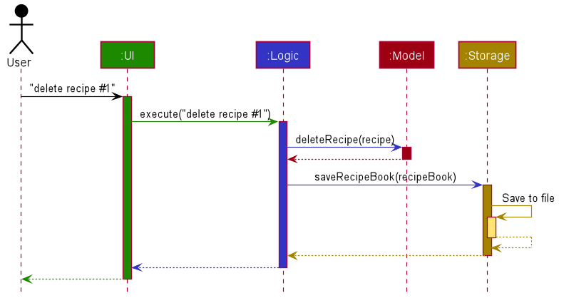 <br />
Figure 2: <i>A sequence diagram showing the execution of <code>delete recipe #1</code></i>
</div>


The following sections break down the various components in greater detail.


----------------
### 3.2&ensp;UI Component

The *UI* component is responsible for all the user-facing views in the graphical user interface. This includes displaying recipes, ingredients and statistics, receiving command input from the user, and printing command results to the user.

The class diagram of the UI component is shown below:

<div style="text-align: center; padding-bottom: 2em">
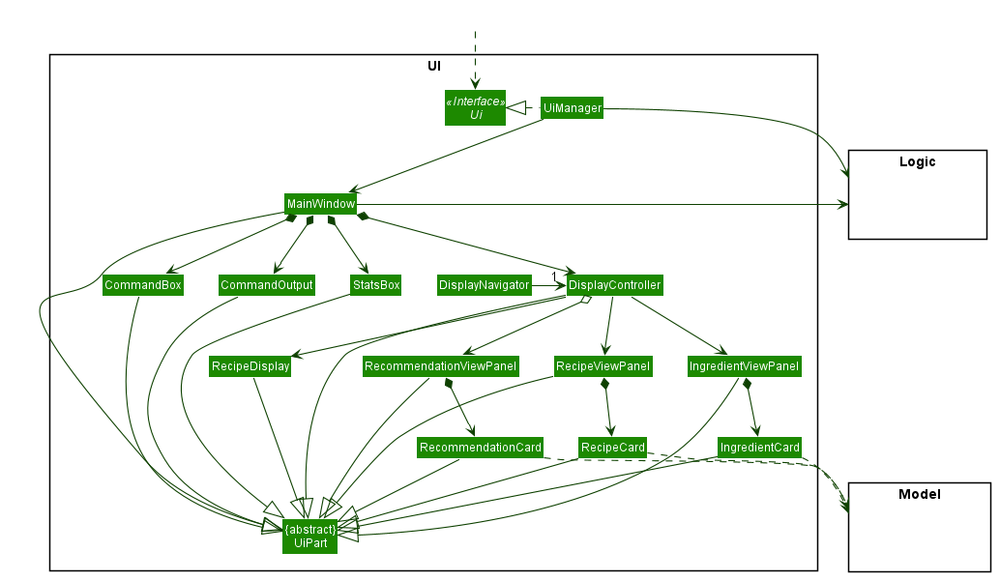 <br />
Figure 3: <i>The class diagram of the UI component</i>
</div>

**Interface**: [`Ui.java`](https://github.com/AY2021S1-CS2103T-T10-3/tp/blob/master/src/main/java/chopchop/ui/Ui.java)

The UI consists of a `MainWindow` that is made up of parts e.g.`HelpWindow`, `StatsBox`, `CommandOutput`, `DisplayController`. All these, including the `MainWindow`, inherit from the abstract `UiPart` class.

The graphical user interface is built using the JavaFX UI framework. The layout of these parts are defined in matching `.fxml` files that are in the `src/main/resources/view` folder. For example, the layout of the [`MainWindow`](https://github.com/AY2021S1-CS2103T-T10-3/tp/blob/master/src/main/java/chopchop/ui/MainWindow.java) is specified in [`MainWindow.fxml`](https://github.com/AY2021S1-CS2103T-T10-3/tp/blob/master/src/main/resources/view/MainWindow.fxml).

The `UI` component:

* Executes user commands using the `Logic` component.
* Listens for changes to `Model` data so that the UI can be updated with the modified data.


-------------------
### 3.3&ensp;Logic Component

The *Logic* component is responsible for parsing command input, executing commands, and updating the Model component of any changes to data caused by running a command.

The class diagram of the Logic component is shown below:

<div style="text-align: center; padding-bottom: 2em">
 <br />
Figure 4: <i>The class diagram of the Logic component</i>
</div>

**Interface**: [`Logic.java`](https://github.com/AY2021S1-CS2103T-T10-3/tp/blob/master/src/main/java/chopchop/logic/Logic.java)

This is the general flow of events when a command is executed:
1. `Logic` uses its `CommandParser` to parse the user command.
1. This results in a `Command` object which is executed by the `LogicManager`.
1. The command execution can affect the `Model` (e.g. deleting a recipe).
1. The result of the command execution is encapsulated as a `CommandResult` object which is passed back to the `Ui`.
1. In addition, the `CommandResult` object can also instruct the `Ui` to perform certain actions, such as displaying help to the user, or to switch the currently active pane.
1. After command execution, the command is saved by the `HistoryManager` to keep track of command history, and to allow for undoing/redoing of commands.

For example, this is a sequence diagram showing the deletion of a recipe:
<div style="text-align: center; padding-bottom: 2em">
 <br />
Figure 5: <i>A sequence diagram showing the execution of <code>delete recipe #1</code> in the Logic component</i>
</div>


-------------------
### 3.4&ensp;Model Component

The *Model* component is responsible for holding the data of the application (eg. the recipes and ingredients) in-memory during execution, and mediating access to this data for each of the other components of the system.

The class diagram of the *Model* component is shown below:

<div style="text-align: center; padding-bottom: 2em">
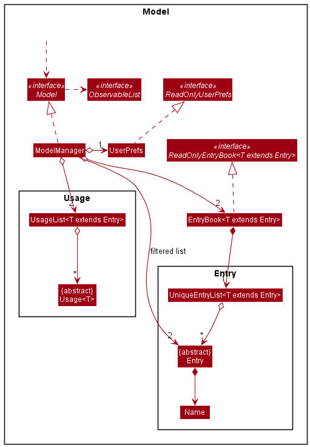 <br />
Figure 6: <i>The class diagram of the Model component</i>
</div>

**Interface**: [`Model.java`](https://github.com/AY2021S1-CS2103T-T10-3/tp/blob/master/src/main/java/chopchop/model/Model.java)

The Model component:
* Stores a `UserPref` object that represents the user's preferences.
* Stores the recipe and ingredient book data.
* Stores the recipe and ingredient usage list data.
* Exposes an `ObservableList` of both `Recipe` and `Ingredient`, for UI component to observe and update its graphical interface.


Of note in the Model component are the `Recipe` and `Ingredient` classes; below is the class diagram for both:
<div style="text-align: center; padding-bottom: 2em">
<h2 style="background-color: pink">TODO: class diagram for Recipe and Ingredient</h2>
Figure 7: <i>The class diagram for Recipes and Ingredients</i>
</div>

Note that an instance of `Recipe` only stores `IngredientReferences` to the ingredients it uses, and not the actual `Ingredients` themselves — since the actual instance of the ingredient that will be used by the recipe is indeterminate.

Only when a recipe is made are the references are resolved to their actual ingredient.


---------------------
### 3.5&ensp;Storage Component

The storage component is responsible for the saving and loading of the usage data for recipe and ingredient, the user preferences, and more importantly the recipe and ingredient data, to and from disk. Both pieces of data are stored in Javascript Object Notation (JSON) files, which is a human-readable (and editable) plain-text format.

Currently, the Jackson library is used for (de)serialisation.

The class diagram of the *Storage* component is shown below:

<div style="text-align: center; padding-bottom: 2em">
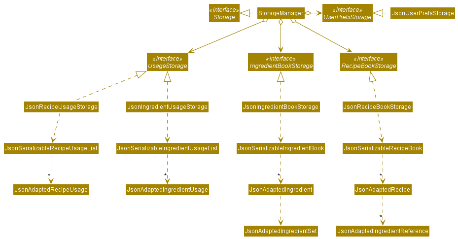 <br />
Figure 8: <i>The class diagram of the Storage component</i>
</div>

**Interface**: [`Storage.java`](https://github.com/AY2021S1-CS2103T-T10-3/tp/blob/master/src/main/java/chopchop/storage/Storage.java)

As mentioned above, the `Storage` component:
* Saves and loads `UserPref` objects in json format and read it back.
* Saves and loads the `RecipeBook` objects in json format and read it back.
* Saves and loads the `IngredientBook` objects in json format and read it back.
* Saves and loads the `RecipeUsage` objects in json format and read it back.
* Saves and loads the `IngredientUsage` objects in json format and read it back.

Each component is saved in a separate file with its file path specified in UserPref.
Each entity (eg. `Recipe`, `IngredientSet`) that needs to be saved has a corresponding `JsonAdapted{X}` class in the `chopchop.storage` package. This adapter class is responsible for converting, using Jackson, the 'normal' objects to a string representation (or to another adapter class), and to convert this string representation back to a 'normal' object.

For example, the `Ingredient` class has a corresponding `JsonAdaptedIngredient` that saves and loads the ingredient's name, quantities, and expiry dates.
It can also be multi-level.
For example, the `JsonSerializableIngredientUsageList` contains `JsonAdaptedUsageList` and `JsonAdaptedUsageList` in turn contains a list of `JsonAdaptedIngredientUsage`.


------------------
### 3.6&ensp;Utility Classes

While not itself a component, various utility types are placed in the `chopchop.commons` package; these are used by all the components in ChopChop, and comprise three sub-parts in their respective packages:

1. `core` contains classes to handle GUI settings, logging, and versioning.
2. `exceptions` contains exception types common across ChopChop.
3. `util` contains utility classes for file IO and argument validation, as well as functional types.


-----------------------------
## 4&ensp;Implementation Details

This section explains, in detail, the implementation of some noteworthy features.


<a name="ImplCommandParser"></a>
### 4.1&ensp;Command Parser

Main developer: **zhiayang**

The command parser is part of the *Logic* component, and is responsible for taking the input command as a string and either returning a valid `Command` to be executed, or a sensible error message. It was completely rewritten due to the requirement of different parsing semantics.

Shown below is the class diagram for the various Parser components:
<div style="text-align: center; padding-bottom: 2em">
 <br />
Figure 999: <i>The class diagram for the parser</i>
</div>

Notably, there are various wrapper classes to ensure type safety, namely `CommandArguments`, `ArgName`, and `ItemReference`, used instead of passing raw strings around in an error-prone manner.

Furthermore, instead of pointlessly instantiating objects that do not store any state, all of the parsing work (save the main `CommandParser`) is done by static methods, in the various `_CommandParser` classes (eg. `AddCommandParser`, `ListCommandParser`).

The `CommonParser` class holds common methods for each parser, for example quantity parsing and validation (eg. preventing negative quantities), checking for unsupported named arguments, etc.

<i>Developer's note: object-oriented programming (OOP) is meant to encapsulate an objects behaviour with its data. None of the parser classes are stateful, so they do not contain data. Thus, it is pointless to make them instanced objects when static methods will suffice. If Java had namespaces, then that is what the various command-parser-classes would have been instead.</i>


#### 4.1.1&ensp;ArgName

This was inherited from AB3's `Prefix` class, but eventually evolved to include more functionality, due to the addition of *edit-arguments* for edit commands. It serves as an abstraction over the raw string of argument names (eg. `/step`), and also holds information about the components of the argument (eg. `/step:edit:3`).


#### 4.1.2&ensp;ItemReference

Again, this is similar to AB3's `Index` class, but it gained the ability to refer to items by name as well as by index. Commands take an item reference so they do not need to know whether the user referred to an item by its index or by its name.


#### 4.1.3&ensp;Anatomy of a (parsed) Command

During and after parsing, a command is represented by an instance of `CommandArguments`, which holds these fields:
1. The command name
2. The unnamed arguments
3. The list of named arguments

Given the following command string: <br />
`add recipe The Best Pancakes /ingredient Magic /qty 999 /step Poof` <br />
these are its components (here, `<a, b>` denotes a pair of `a` and `b`):
1. Command name: `add`
2. Unnamed arguments: `recipe The Best Pancakes`
3. Named arguments: `[<ArgName(ingredient), Magic>, <ArgName(qty), 999>, <ArgName(step), Poof>]`

Unlike in AB3, the absolute order of named arguments matters, because a `/qty` argument must refer to the `/ingredient` argument immediately preceeding it; thus, the named arguments are stored in a list instead of a map.

For most commands, they take an additional <i>target</i>; this is typically the first word of the unnamed arguments (in this case, `recipe`). For historical reasons, `CommandArguments` does not have a separate field for the target. It does have a `getFirstWordFromRemaining()` method however, which abstracts away this common functionality.


#### 4.1.4&ensp;Parsing Sequence

One of the more complex commands to parse is the `add recipe` command; here is the sequence diagram detailing how it is parsed. For the sake of clarity, the command string will be omitted; you can assume that we are parsing `add recipe Pancakes /ingredient Milk /qty 400ml /ingredient Flour /qty 200g /ingredient Eggs 2 /step Add ingredients /step Mix /step Cook`:

<div style="text-align: center; padding-bottom: 2em">
 <br />
Figure 999: <i>A sequence diagram for parsing an <code>add recipe</code> command</i>
</div>


<h4>Design Considerations</h4>
**1. Use of exceptions**

The current parser is written in an exception-free manner, using monadic result types (`Result`, `Optional`) and their composition (`map`, `then`) instead.

  - Option A: use exceptions
    - Pros: easier interfacing with existing AB3 code
    - Cons: harder to visualise error source and propagation, calling site gets cluttered with syntactic `try-catch` noise
  - **Option B (chosen)**: use monadic types
    - Pros: more explicit, easier to visualise error source and propagation
    - Cons: slightly harder to write

Since the parser was going to be heavily refactored if not completely rewritten, removing exceptions was the chosen option. An excerpt of this style can be seen below:
```java
return ItemReference.parse(name)
    .then(ref -> Result.transpose(qtys
        .stream()
        .findFirst()
        .map(CommonParser::parseQuantity))
        .map(qty -> new DeleteIngredientCommand(ref, qty)));
```
Here, `Result<T>` is similar to a Java `Optional<T>`, but also encapsulating a descriptive error message in the form of a string.

<i>Developer's note: when it comes down to it, this is a stylistic choice, so I went with what I preferred.</i>

**2. Numbered vs named item references**

ChopChop allows referring to items (recipes and ingredients) both by their full name, as well as by its index number (as in AB3).

  - Option A: allow only numbers
    - Pros: easier to implement
    - Cons: less intuitive for the user, index number can change as views are updated
  - Option B: allow only names
    - Pros: easier to implement
    - Cons: full name of the ingredient or recipe might be tedious to type out each time
  - **Option C (chosen)**: allow both
    - Pros: best of both worlds
    - Cons: slightly more code to implement

After abstracting out functions that resolve an item reference, code complexity did not increase significantly, and ease-of-use was greatly improved; thus, option C was chosen.


<a name="ImplTabCompletion"></a>
### 4.2&ensp;Tab Completion

Main developer: **zhiayang**

This feature allows the user to quickly type in commands and complete long recipe and ingredient names, and greatly reduces the tedium of using a command-line application. Its implementation is not particularly clever and can be described mostly by a state machine.

The main brains of the tab completer lies in determining which <i>kind</i> of item to complete (eg. a command name or a recipe name), and it can be (roughly) represented by the activity diagram below:

<div style="text-align: center; padding-bottom: 2em">
 <br />
Figure 999: <i>A high-level activity diagram for the tab completer</i>
</div>

<i>Developer's note: the activity diagram could have been made a lot more detailed, but it would have been completely unreadable.</i>

Most of the logic and complexity of the completer lies in determining which commands require targets, which require ingredient names and so on, and whether or not they should be completed at the given point (ie. the cursor position and the preceeding text).

In the current implementation, some parts are hardcoded with knowledge about which commands accept which arguments; this can be improved, but there were a number of unanswered questions regarding the implementation details, so it will be left to a future iteration to improve upon the abstraction.

Most notably, each command (or, ideally, its parser) should 'own' the knowledge of the arguments that it accepts and the valid targets, so information can be decentralised from the autocompleter.


<a name="ImplQuantities"></a>
### 4.3&ensp;Quantity and Unit Handling

Main developer: **zhiayang**

As an application dealing with ingredients, one of the core requirements of ChopChop is being able to track quantities of ingredients, and perform arithmetic on them when cooking recipes (consuming) and refilling those ingredients.

The relationships between the various quantity-related classes are shown below:

<div style="text-align: center; padding-bottom: 2em">
 <br />
Figure 999: <i>The class diagram for the quantity components</i>
</div>

The `Quantity` interface contains a static method that handles parsing a quantity from a string; in the current implementation, it needs to have explicit knowledge about the supported units (in the sense that it lists `Mass`, `Count`, etc). It attempts to parse the input with each unit's parser and returns the first one that succeeds:
```java
return Result.flatten(
    Result.ofOptional(
        knownUnits.stream()
            .map(fn -> num.then(n -> fn.apply(n, unit.toString())))
            .filter(Result::hasValue)
            .findFirst(),
        String.format("Unknown unit '%s' (from '%s')", unit, input))
    );
```

These units are handled as a base `count` and a `ratio`; this allows them to handle arithmetic operations (add, subtract) among themselves. Naturally, only compatible dimensions can interoperate, eg. `Mass` with `Mass`, `Count` with `Count`, etc.

In the current implementation, there are a number of specific units of Volume (*mL*, *L*, *tsp*, *tbsp*, *cup*), and for Mass (*mg*, *g*, *kg*). These units and their ratios are currently hardcoded into the application, but a future extension would allow users to specify their own units (perhaps in a configuration file) that can allow them to use units like *lb*, *oz*, etc.

<h4>Design Considerations</h4>
**1. Unit representation**

  - Option A: represent units as a simple string
    - Pros: easier to implement
    - Cons: less intuitive for the user, only exactly-compatible units can be added
  - **Option B (chosen)**: represent units in a typed manner
    - Pros: intuitive unit handling for the user
    - Cons: more implementation effort, supported units must be known in advance

  The extra implementation effort was deemed to be acceptable to allow for a better user experience. Mainly, the ability to let recipes specify a quantity as *3 cups*, while keeping track of the ingredient in *litres* was a key feature, to save the user the hassle of converting these units before keying them into the application.

  Furthermore, this implementation also allows *rescaling* the quantity, so that `1700mL` can be better displayed as `1.7L`.

**2. User extensible units**
  - Option A: support custom user-defined units
    - Pros: more flexible from the user's perspective
    - Cons: more implementation effort, necessary to integrate (eg. defining units via command line)
  - **Option B (chosen)**: only allow a fixed set of units
    - Pros: less implementation work
    - Cons: less flexible from the user's perspective

  Option B was chosen here due to the limited time available to work on the application. The primary mitigation was to include more commonly-used units built into ChopChop, for instance teaspoons, tablespoons, and cups for volumes.


<a name="ImplHelpCommand"></a>
### 4.4&ensp;Help Command

Main developer: **zhiayang**

To improve the user experience for first-time users, a robust help command was implemented into ChopChop. Unlike the AB3 'solution' of simply opening a dialog with a link to the User Guide, ChopChop's help is able to provide a clickable link directly to the correct section in the User Guide for that specific command.

For example, here is the output of `help add recipe`:

<div style="text-align: center; padding-bottom: 2em">
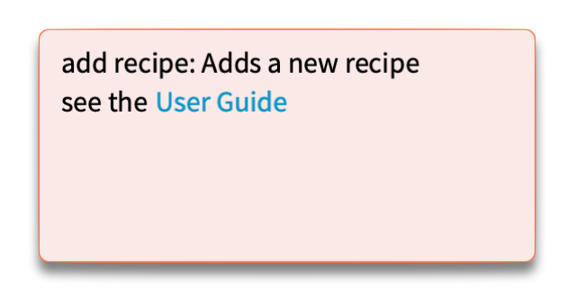 <br />
Figure 999: <i>The output of `help add recipe`</i>
</div>

This requires two pieces to cooperate:
1. The User Guide must have predictable anchor links that are independent of section numbers and/or formatting
2. Each Command class must have a predictable mapping to said anchor links

To solve the first problem, each section in the UG has an explicitly-named HTML `<a>` tag, corresponding to the name of the command's class in the Java code, like so:
```markdown
<a name="AddRecipeCommand"></a>
#### 5.4.3&ensp;Adding Recipes — **`add`**`recipe`
```

This also solves the second problem, because the mapping of the command to its anchor is exactly the class name of the command. However, since the user is asking for help, it is likely that they would not know the necessary arguments to pass to the command, so it is not feasible to require a valid command to be passed to `help`.

In this instance, we cannot make use of polymorphism on instance methods, so reflection was used instead. This relies two things:
1. All command classes must live in the package `chopchop.logic.commands`
2. All command classes must follow the format `<name><target>Command`. For example, `AddRecipeCommand`, or `DeleteIngredientCommand`.

Since the command syntax looks like `add recipe <args>`, it is trivial to transform that into `AddRecipeCommand`, search for the class in the appropriate package using reflection, and call its static methods to get its help blurb (in the figure above, that is "Adds a new recipe").

For the statistics commands taking 2 keywords (eg. `stats recipe top`), they are similarly transformed into `StatsRecipeTopCommand`.

When extending ChopChop to include new commands, it is important to follow these existing guidelines so that the help command continues to work automatically.


<div style="height: 15em">

</div>


<a name="stats-feature"></a>
### 4.5&ensp;Statistics feature

Main developer: trav1st

<a name="stats-curr-impl"></a>
#### 4.5.1&ensp;Current implementation

The statistics feature keeps track of the recipes that were made and the ingredients that were consumed in the process.
The feature spans across the 4 components of the App.
It is mainly supported by `UsageList` and `Usage` in the Model component. `UsageList` and `Usage` are similar to `EntryBook` and `Entry` respectively in terms of their purpose.


<div style="text-align: center; padding-bottom: 2em">
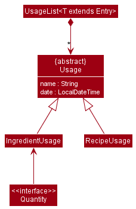 <br />
Figure 999: <i>Usage component in Model</i>
</div>

The `Model` interface exposes various operations to support the addition, removal of usages and getting statistics from `UsageList`

During the execution of `MakeRecipeCommand`, a `RecipeUsage` and `IngredientUsage`s are created and added to `recipeUsageList` and `ingredientUsageList` through operations in `Model` interface.
Since `MakeRecipeCommand` is undoable, these usages are removed from the lists upon undoing the command.
The process is demonstrated below by the code snippet of `MakeRecipeCommand#undo()`:
```java
        for (var ingredientRef : this.recipe.getIngredients()) {
            model.removeIngredientUsage(ingredientRef);
        }
        model.removeRecipeUsage(this.recipe);
```

After changes to `Model` were made, the `Storage` component saves the usage lists in json format.
Finally, the `StatsBox` is updated based on the `CommandResult` returned after the execution of each command.

#### 4.5.2&ensp;Design considerations

This section details the design considerations of the statistics feature.

<a name="stats-design-considerations"></a>

Aspect 1: How the usages are tracked and saved.

* Consideration 1:
Store the history of commands executed. The statistics of recipe and ingredient usages can be computed based on the commands executed.
For example, currently there are 10 cabbages and the `make recipe salad` command was executed 3 times yesterday. Assuming salad requires 2 cabbages to make, 6 cabbages were used yesterday.
    * Pros:
        * Requires less memory usage.
        * Allows more statistics to be computed as all changes to the Model have to be done through the execution of a command.
    * Cons:
        * Getting statistics for ingredient usage can be tricky as recipes can be deleted and edited. In the example above, exact ingredient consumptions have to be stored in addition to the `make recipe salad` text command.
        * Violates Single Responsibility Principle and Separation of Concerns as the history of command is being used for statistics purpose in addition to `undo` which uses a non-persistent history of command.

* Consideration 2:
Store the relevant information such as name, and the date and time of which the recipe was made or ingredient was used in `Usage` which is then contained in `UsageList`.
    * Pros:
        * Easier to implement. Allows quick access to certain data such as latest recipe usages.
    * Cons:
        * Modifications to `Usage` and its associated classes may be required to support more statistics.

Aspect 2: Responsibility of `UsageList`
* Consideration 1:
Make `getRecentlyUsed` and `getUsageBetween` return Pair of Strings
    * Pros:
        * Easier to implement
    * Cons:
        * Violates the Single Responsibility Principle
* Consideration 2:
Make `getRecentlyUsed` and `getUsageBetween` return intermediate values
    * Pros:
        * `UsageList` only needs to handle adding, removing and returning of `Usage`
    * Cons:
        * Additional processing is required in `ModelManager`

Aspect 3: GUI of statistics box
* Consideration 1:
Update the statistics box after every execution of command.
    * Pros:
        * User will be shown recently made recipes list after they executed non-statistics commands (other than `stats recipe recent`). This makes the app feel more responsive as both `StatsBox` and `CommandOutput` panels are updated.
    * Cons:
        * Additional computation required to refresh `StatsBox`. The user might want to have previous stats command results stay in the statistics box for future reference.
* Consideration 2: Notify and update statistics box with `CommandResult` in `MainWindow` only after the execution of statistics commands
    * Pros:
        * The statistics results remain in the statistics box even after the execution of other commands so the user does not have to execute the statistics command again to view the statistics.
    * Cons:
        * User will have to execute `stats recipe recent` to obtain the default view on statistics box again.

<a name="stats-related-commands"></a>
#### 4.5.3&ensp;Related commands

`StatsCommandParser` parses the Statistics commands and returns the corresponding Command object based on user's input.
For more information on the Parser, view
7 statistics commands are `StatsRecipeTopCommand`, `StatsRecipeMadeCommand`, `StatsIngredientUsedCommand`, `StatsRecipeRecentCommand` and `StatsIngredientRecentCommand` which update the list in `StatsBox` as well as `StatsRecipeClearCommand` and `StatsIngredientClearCommand` which remove all `Usage` in their respective `UsageList`.
All the statistics commands function in a similar way so we will go through just one of command in details below.

<a name="view-top-recipes"></a>
##### View top recipes command
The view top recipes command allows the user to see the recipes that were made the most number of times based on the `Usage`s saved in `UsageList`.
It is executed with `StatsRecipeTopCommand` by parsing `stats recipe top` as the user input.

The sequence diagram below shows the sequence of interactions between `Model` where the UsageList is contained in and the `Logic` components after the user executes StatsRecipeTopCommand with the user input `stats recipe top`.
<div style="text-align: center; padding-bottom: 2em">
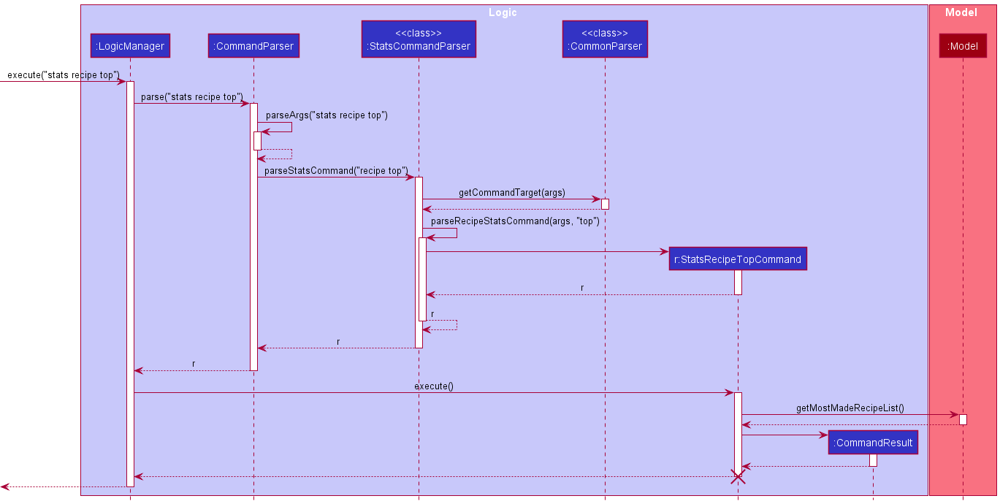 <br />
Figure ???: <i>The sequence diagram of the execution of StatsRecipeTopCommand </i>
</div>

1. `Logic` uses `CommandParser` to parse the user input.
2. `CommandParser` calls on the static method `parseStatsCommand` of `StatsCommandParser` class.
3. `StatsCommandParser` then calls on methods `getCommandTarget` and `parseRecipeStatsCommand` to determine which command object should be instantiated.
4. An instance of `StatsRecipeTopCommand` is instantiated. by `StatsCommandParser`.
5. This instance is returned to the `Logic`.
6. `Logic` calls the `execute` method of `StatsRecipeTopCommand`
7. `StatsRecipeTopCommand` calls `getMostMadeRecipeList` of `Model` and a list of String pairs is returned. This list is encapsulated in `CommandResult` which is then returned to `Logic`.


<div style="text-align: center; padding-bottom: 2em">
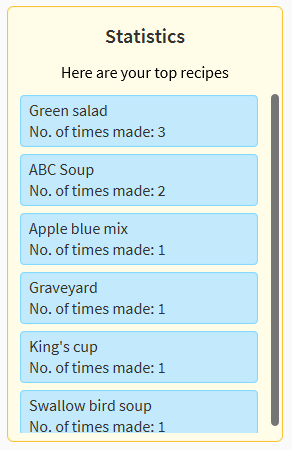 <br />
Figure 8000. GUI of statistics box after `stats recipe top` command is executed</i>
</div>


### 4.7&ensp;Undo/redo feature

#### Proposed Implementation

The undo/redo feature is implemented using a `HistoryManager`, which keeps track of and stores the command history, along with a list of parsed undoable `Command`s.
Every command that can be undone/redone implements the `Undoable` interface, which requires the implementation of the `Undoable#undo()` method.
Optionally, the command can implement the `Undoable#redo()` method to customise the default behaviour, which is to re-execute the command.
The `HistoryManager` then implements the following operations:

* `HistoryManager#addInput()` — Saves the command history of the last input entered
* `HistoryManager#addCommand()` — Saves the last parsed command (if it is undoable)
* `HistoryManager#undo()` — Undo the last `Undoable` command
* `HistoryManager#redo()` — Redo the last `Undoable` command

The `HistoryManager#undo()` and `HistoryManager#redo()` methods move the current command history pointer and carries out the requested operation.
Further details can be seen in the example usage scenario detailing the mechanism below.

Step 1. The user launches the application for the first time.
The `HistoryManager` is initialised with an empty list of `CommandHistory`s, as no commands have been entered, and the `currentIndex` pointer is intialised to 0.


Step 2. The user executes `delete recipe #5` to delete the 5th recipe from the recipe book.
The model is updated accordingly, and the `DeleteRecipeCommand` is saved by the `HistoryManager` by adding to the `CommandHistory` list, as the command implements the `Undoable` interface.
The `currentIndex` pointer is also incremented by one, as the application is currently at the state after the `DeleteRecipeCommand` is executed.

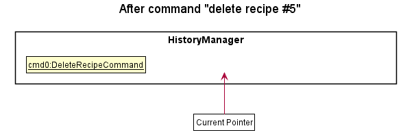

Step 3. The user executes `add recipe beef noodles` to add a new recipe.
Similarly, the model is updated accordingly, and the `AddRecipeCommand` is added to the `CommandHistory` list.
The `currentIndex` pointer is once again incremented by one.

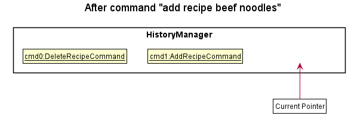

Step 4. The user now desires to undo the last action, and executes the `undo` command.
The `undo` command will call `HistoryManager#undo()`, which will decrement the `currentIndex` pointer by one and retrieve the command from the list at the specified index.
The command's `Undoable#undo()` operation will then be executed.

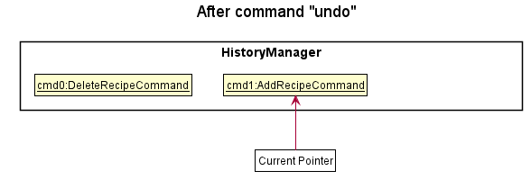

The following sequence diagram shows how the undo operation works:

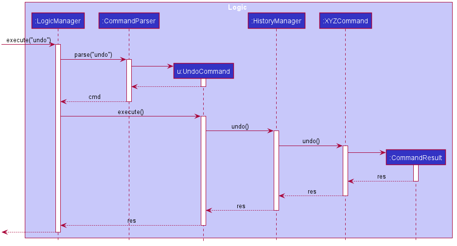

The `redo` command does the opposite — it calls `HistoryManager#redo()`, which executes the command `currentIndex` is pointing to, and increments the `currentIndex` by one.

Step 5. The user then decides to execute the command `list recipes`.
Commands that do not modify the model, such as `list recipes`, will not be stored by the `HistoryManager` as they cannot be undone.
Since the `currentIndex` is not pointing to the end of the `CommandHistory` list, all commands starting from the `currentIndex` will be cleared, which in this case is the `add recipe beef noodles` command.

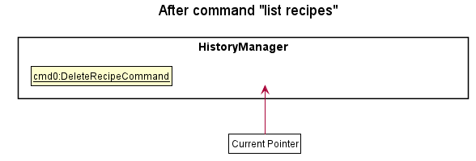

The following activity diagram summarises what happens when a user executes a new command:

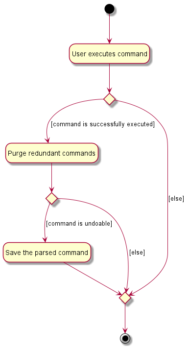

#### Design consideration:

##### Aspect: How undo & redo executes

* **Alternative 1 (current choice):** Save each undoable command as it is executed. Each command implements its own undo/redo operation.
  * Pros: Uses less memory since the entire state of the application does not have to be saved, and is also faster since only a small part of the model needs to be modified each time.
  * Cons: All model changes need to be restricted to the command, as each command needs to be able to fully reverse any changes made to the model.

* **Alternative 2:** Saves the entire recipe/ingredient book every time a change is made to the model.
  * Pros: Easy to implement, does not require custom undo/redo operations for each command.
  * Cons: Will be much slower as the entire model needs to be replaced on each undo/redo, which does not scale well with more recipes/ingredients.

--------------------------------------------------------------------------------------------------------------------

## 5&ensp;Documentation, logging, testing, configuration, dev-ops

* [Documentation guide](Documentation.md)
* [Testing guide](Testing.md)
* [Logging guide](Logging.md)
* [Configuration guide](Configuration.md)
* [DevOps guide](DevOps.md)

--------------------------------------------------------------------------------------------------------------------


## **Appendices**
{:.owo}


## A&ensp;Requirements

### A.1&ensp;Product scope

**Target user profile**: People that cook daily, especially students living on campus who need a way to manage recipes and their fridge contents.

**Value proposition**: Manages recipes and fridge inventory/expiry, and automatically suggests recipes to cook.


### A.2&ensp;User stories

Priorities: High (must have) - `* * *`, Medium (nice to have) - `* *`, Low (unlikely to have) - `*`

| Priority | As a ...                              | I want to ...                                                                     | So that I can ...                                         |
| -------- | ------------------------------------- | --------------------------------------------------------------------------------- | --------------------------------------------------------- |
| `* * *`  | Person learning how to cook           | View my recipes                                                                   | Not get the instructions wrong.                           |
| `* * *`  | Picky eater                           | Delete my recipes                                                                 | Remove recipes that I do not like.                        |
| `* * *`  | Forgetful home cook                   | Record recipes that I learnt from my friends and television shows                 | Try to cook them in the future.                           |                                                                         |
| `* * *`  | Person that cannot decide             | Select recipes to cook automatically based on the ingredients that i have         | Eat a wider variety of meals.                             |
| `* * *`  | Home cook                             | Delete the ingredients                                                            | Remove ingredients that have expired.                     |
| `* * *`  | Home cook                             | Edit the ingredients                                                              | Edit ingredients quantities when some parts are spoilt.   |
| `* * *`  | Home cook                             | View a list of all my recipes                                                     | Decide which recipe to cook.                              |
| `* * *`  | Home cook                             | Interact with the Recipe Manager interactively                                    | Easily view my recipes when cooking in the kitchen.       |
| `* *`    | Home cook who buys a lot of groceries | Enter the long list of products that I have bought while referring to the receipt | Easily enter a large number of groceries at once.         |
| `* *`    | Adventurous cook                      | Change the steps and ingredients of my recipes                                    | Keep track of my latest recipe changes.                   |
| `* *`    | Home cook                             | Record the recipes I make                                                         | Know how much ingredients do I have left.                 |
| `* *`    | Home cook                             | Know what ingredients I am lacking when I want to make a recipe                   | Know what groceries to get.                               |
| `* *`    | Home cook                             | Be able to view the recipes I made the most frequently and most recently          | Avoid cooking those recipes to try something new.         |
| `* *`    | Home cook                             | Be able to have my keyboard inputs completed automatically                        | Save time when trying to input large amounts of data.     |
| `* *`    | Student cooking in hall               | Add tags to my recipes                                                            | Know what recipes I can cook for my Muslim friends.       |
| `* *`    | Student cooking in hall               | Add tags to my ingredients                                                        | Find my ingredients more easily.                          |
| `* *`    | Home cook                             | Filter my ingredients                                                             | Quickly see what ingredients I have left.                 |
| `* *`    | Picky eater                           | Filter the recipes by a criteria of my choice                                     | Save time finding recipes.                                |
| `* *`    | Person on a diet                      | Sort recipes based on calorie count                                               | Choose to cook lower-calorie meals.                       |
| `*`      | Busy mother                           | Enter the list of recipes I want to cook for the week                             | Find out which groceries I need to buy.                   |

### A.3&ensp;Use cases

| Use Case ID  | Description                            |
| -----------  | -------------------------------------- |
| [UC01](#U01) | Add recipe                             |
| [UC02](#U02) | Delete recipe                          |
| [UC03](#U03) | Edit recipe                            |
| [UC04](#U04) | List recipes                           |
| [UC05](#U05) | View recipe                            |
| [UC06](#U06) | Filter recipes                         |
| [UC07](#U07) | Make recipe                            |
| [UC08](#U08) | List recipe recommendations            |
| [UC09](#U09) | View recipe statistics                 |
| [UC10](#U10) | Add ingredient                         |
| [UC11](#U11) | Delete ingredient                      |
| [UC12](#U12) | Edit ingredient                        |
| [UC13](#U13) | List ingredients                       |
| [UC14](#U14) | Filter ingredients                     |
| [UC15](#U15) | View ingredient statistics             |


(For all use cases below, the **System** is the `Food Recipe Management System (FRMS)` and the **Actor** is the `user`, unless specified otherwise)

<a name="U01"></a>
**Use case: U01 - Add recipe**

**MSS:**

1. User chooses to add a recipe.
2. User enters parameters to be added.
3. FRMS adds the recipe.
4. FRMS displays a confirmation message.

    Use case ends.

**Extensions:**
* 2a. FRMS detects an invalid input format or parameter.
    * 2a1. FRMS displays an error messages.
	  Use case ends.
* 2b. FRMS detects a duplicate recipe.
    * 2b1. FRMS displays an error messages.
      Use case ends.

<a name="U02"></a>
**Use case: U02 - Delete recipe**

**MSS:**

1. User chooses to delete a recipe.
2. User provides the recipe to be deleted.
3. FRMS removes the recipe.
4. FRMS displays a confirmation message.

    Use case ends.

**Extensions:**
* 2a. FRMS detects an invalid input format or parameter.
    * 2a1. FRMS displays an error message.
      Use case ends.
* 3a. There are no recipes in the FRMS.
    * 3a1. FRMS displays an error message.
      Use case ends.
* 3b. The recipe to be deleted is not the FRMS.
    * 3b1. FRMS displays an error message.
	  Use case ends.


<a name="U03"></a>
**Use case: U03 - Edit recipe**

**MSS:**

1. User chooses to edit a recipe.
2. User provides the recipe to be edited.
3. User provide the parameters to be edited.
3. FRMS edits the recipe.
4. FRMS displays a confirmation message.

    Use case ends.

**Extensions:**
* 2a. FRMS detects an invalid input format.
    * 2a1. FRMS displays an error message.
      Use case ends.
* 3a. FRMS detects an invalid input parameter.
    * 3a1. FRMS displays an error message.
      Use case ends.
* 4a. There are no recipes in the FRMS.
    * 4a1. FRMS displays an error message.
      Use case ends.
* 4b. The recipe to be edited is not the FRMS.
    * 4b1. FRMS displays an error message.
	  Use case ends.


<a name="U04"></a>
**Use case: U04 - List recipes**

**MSS:**

1. User chooses to list recipes.
2. User requests for the recipes.
3. FRMS display the recipes.
4. FRMS displays a confirmation message.

    Use case ends.

**Extensions:**
* 2a. FRMS detects an invalid input format or parameter.
    * 2a1. FRMS displays error messages.
	  Use case ends.
* 3a. There are no recipes in the FRMS.
     * 3a1. FRMS displays an error message.
       Use case ends.


<a name="U05"></a>
**Use case: U05 - View recipe**

**MSS:**

1. User chooses to view a recipe.
2. User provides the recipe to be displayed.
3. FRMS displays the recipe.
4. FRMS displays a confirmation message.

    Use case ends.

**Extensions:**
* 2a. FRMS detects an invalid input format or parameter.
    * 2a1. FRMS displays an error message.
      Use case ends.
* 3a. There are no recipes in the FRMS.
    * 3a1. FRMS displays an error message.
      Use case ends.
* 3b. The recipe to be displayed is not the FRMS.
    * 3b1. FRMS displays an error message.
	  Use case ends.

<a name="U06"></a>
**Use case: U06 - Filter recipe**

**MSS:**

1. User chooses to view a list of filtered recipes.
2. User specifies the filter conditions.
3. FMRS displays a filtered list of recipes.
4. FRMS displays a confirmation message.

    Use case ends.

**Extensions:**
* 2a. FRMS detects an invalid input format or parameter.
    * 2a1. FRMS displays an error message.
      Use case ends.
* 3a. There are no recipes in the FRMS.
    * 3a1. FRMS displays an error message.
      Use case ends.
* 3b. There are no recipes that match the filter conditions in the FRMS.
    * 3b1. FRMS displays an error message.
      Use case ends.


<a name="U07"></a>
**Use case: U07 - Make recipe**

**MSS:**

1. User chooses to make a recipes.
2. User provides the recipe to be made.
3. FRMS makes the recipe.
4. FRMS displays a confirmation message.

    Use case ends.

**Extensions:**
* 2a. FRMS detects an invalid input format or parameter.
    * 2a1. FRMS displays an error message.
      Use case ends.
* 3a. There are no recipes in the FRMS.
    * 3a1. FRMS displays an error message.
      Use case ends.
* 3b. The recipe to be displayed is not the FRMS.
    * 3b1. FRMS displays an error message.
	  Use case ends.


<a name="U08"></a>
**Use case: U08 - List recipe recommends**

**MSS:**

1. User chooses to list recipes recommendations.
2. User requests for the recipes recommendation.
3. FRMS display the recipes.
4. FRMS displays a confirmation message.

    Use case ends.

**Extensions:**
* 2a. FRMS detects an invalid input format or parameter.
    * 2a1. FRMS displays error messages.
	  Use case ends.
* 3a. There are no recipes in the FRMS.
     * 3a1. FRMS displays an error message.
       Use case ends.


<a name="U09"></a>
**Use case: U09 - View recipe statistics**

**MSS:**

1. User chooses to view recipe statistics.
2. User provides the parameter for the statistics to be viewed.
3. FRMS displays the recipe statistics.
4. FRMS displays a confirmation message.

    Use case ends.

**Extensions:**
* 2a. FRMS detects an invalid input format or parameter.
    * 2a1. FRMS displays an error message.
      Use case ends.
* 3a. There are no recipe statistics in the FRMS.
    * 3a1. FRMS displays an error message.
      Use case ends.
* 3b. There are no recipe statistics for the given parameters in the FRMS.
    * 3b1. FRMS displays an error message.
      Use case ends.


<a name="U10"></a>
**Use case: U10 - Add ingredient**

**MSS:**

1. User chooses to add an ingredient.
2. User enters the parameters to be added.
3. FRMS adds the ingredient.
3. FRMS displays a confirmation message.

**Extensions:**

* 2a. FRMS detects an invalid input format or parameter.
    * 2a1. FRMS displays an error message.
      Use case ends.
* 2b. FRMS detects a duplicate recipe but the unit of measurement for the quantity of the ingredients are the same.
    * 2b1. FRMS updates the quantity of the ingredient.
    * 2b2. FRMS displays a confirmation message.
      Use case ends.
* 2c. FRMS detects a duplicate recipe but the unit of measurement for the quantity of the ingredients are different.
    * 2a1. FRMS displays an error message.
      Use case ends.


<a name="U11"></a>
**Use case: U11 - Delete ingredient**

**MSS:**

1. User chooses to delete an ingredient.
2. User enters the details according to the format.
3. FRMS deletes the ingredient.
3. FRMS displays a confirmation message.

**Extensions:**

* 2a. FRMS detects an invalid input format or parameter.
    * 2a1. FRMS displays an error message.
      Use case ends.
* 3a. There are no ingredients in the FRMS.
    * 3a1. FRMS displays an error message.
      Use case ends.
* 3b. The ingredient to be deleted is not the FRMS.
    * 3b1. FRMS displays an error message.
	  Use case ends.


<a name="U12"></a>
**Use case: U12 - Edit ingredient**

**MSS:**

1. User chooses to edit an ingredient.
2. User provides the ingredient to be edited.
3. User provide the parameters to be edited.
3. FRMS edits the ingredient.
4. FRMS displays a confirmation message.

    Use case ends.

**Extensions:**
* 2a. FRMS detects an invalid input format.
    * 2a1. FRMS displays an error message.
      Use case ends.
* 3a. FRMS detects an invalid input parameter.
    * 3a1. FRMS displays an error message.
      Use case ends.
* 4a. There are no ingredients in the FRMS.
    * 4a1. FRMS displays an error message.
      Use case ends.
* 4b. The ingredient to be edited is not the FRMS.
    * 4b1. FRMS displays an error message.
	  Use case ends.


<a name="U13"></a>
**Use case: U13 - List ingredients**

**MSS:**

1. User chooses to list ingredients.
2. User requests for the ingredients.
3. FRMS display the ingredients.
4. FRMS displays a confirmation message.

    Use case ends.

**Extensions:**
* 2a. FRMS detects an invalid input format or parameter.
    * 2a1. FRMS displays error messages.
	  Use case ends.
* 3a. There are no ingredients in the FRMS.
     * 3a1. FRMS displays an error message.
       Use case ends.


<a name="U14"></a>
**Use case: U14 - Filter ingredients**

**MSS:**

1. User chooses to view a list of filtered ingredients.
2. User specifies the filter conditions.
3. FMRS displays a filtered list of ingredients.
4. FRMS displays a confirmation message.

    Use case ends.

**Extensions:**
* 2a. FRMS detects an invalid input format or parameter.
    * 2a1. FRMS displays an error message.
      Use case ends.
* 3a. There are no ingredients in the FRMS.
    * 3a1. FRMS displays an error message.
      Use case ends.
* 3b. There are no ingredients that match the filter conditions in the FRMS.
    * 3b1. FRMS displays an error message.
      Use case ends.


<a name="U15"></a>
**Use case: U15 - View ingredient statistics**

**MSS:**

1. User chooses to view ingredient statistics.
2. User provides the parameter for the statistics to be viewed.
3. FRMS displays the ingredient statistics.
4. FRMS displays a confirmation message.

    Use case ends.

**Extensions:**
* 2a. FRMS detects an invalid input format or parameter.
    * 2a1. FRMS displays an error message.
      Use case ends.
* 3a. There are no ingredient statistics in the FRMS.
    * 3a1. FRMS displays an error message.
      Use case ends.
* 3b. There are no ingredient statistics for the given parameters in the FRMS.
    * 3b1. FRMS displays an error message.
      Use case ends.


### A.4&ensp;Non-Functional Requirements

1. Should work on any mainstream OS as long as it has Java 11 or above installed.
2. Should be able to hold up to 1000 persons without a noticeable sluggishness in performance for typical usage.
3. A user with above average typing speed for regular English text (i.e. not code, not system admin commands) should be able to accomplish most of the tasks faster using commands than using the mouse.
4. Should be able to add multiple recipes at once
5. Should have autocompletion for commands
6. Should be able to fuzzy search for recipes/food
7. Should be able to manage recipes in a interactive manner (like Google Assistant)
8. Should have input sanitisation

### A.5&ensp;Glossary

* **Mainstream OS:** Latest version of Windows, MacOS or any Linux distro
* **Recipe:** List of ingredients and steps needed to cook a dish

--------------------------------------------------------------------------------------------------------------------

## B&ensp;Instructions for manual testing

Given below are instructions to test the app manually.

(For all test cases below, a corresponding output will be displayed in the `Command Output Box`, unless specified otherwise)

<div markdown="span" class="alert alert-info">:information_source: **Note:** These instructions only provide a starting point for testers to work on;
testers are expected to do more *exploratory* testing.

</div>

### B.1&ensp;General

#### B.1.1&ensp;Launch and shutdown

1. Initial launch

   1. Download the jar file and copy into an empty folder.

   1. Double-click the jar file. <br>
      Expected: Shows the GUI with a set of sample data. The window size may not be optimum.

1. Saving window preferences

   1. Resize the window to an optimum size. Move the window to a different location. Close the window.

   1. Re-launch the app by double-clicking the jar file<br>
      Expected: The most recent window size and location is retained.

1. Exit Application

    1. Type `quit` in the command box, and press <kbd>enter</kbd> to exit the application. <br>
       Expected: The window closes and the application exits.

#### B.1.2&ensp;Recall commands previously entered

1. Recalling commands without any prior input
   1. Prerequisites: No commands executed since launch.

   1. Test Case: `list recipe` without entering followed by pressing the <kbd>↑</kbd> key. <br>
      Expected: `list recipe` remains in the command box with the caret before the first char of the text.

   1. Test Case: `list recipe` without entering followed by pressing the <kbd>↓</kbd> key. <br>
      Expected: `list recipe` remains in the command box with the caret after the last char of the text.

1. Recalling commands previously entered
   1. Prerequisites: None.

   1. Test Case: `list recipe` followed by pressing the <kbd>↑</kbd> key.  <br>
      Expected: `list recipe` appears in the command box with the caret after the last char of the text.

   1. Test Case: `list rec` followed by pressing the <kbd>↑</kbd> key. <br>
      Expected: The command box is cleared.

   1. Test Case: `list recipe` followed by `list ingredient` followed by pressing the <kbd>↑</kbd> twice. <br>
      Expected: `list ingredient` appears in the command box, before `list recipe` appears in the command box with the caret after the last char of the text in both cases.

   1. Test Case: `list recipe` followed by `list ingredient` followed by pressing the <kbd>↑</kbd> key twice, then the <kbd>↓</kbd> key. <br>
      Expected: `list ingredient`, then `list recipe` appears in the command box before being replaced by `list ingredient` with the caret after the last char of the text in all cases.

#### B.1.3&ensp;Autocomplete input
1. Autocomplete command
   1. Prerequisites: None.
<<<<<<< HEAD
   
   1. Test Case: Pressing the <kbd>tab</kbd> key<br>
      Expected: Command box remains empty.
   
   1. Test Case: Typing `l` followed by pressing the <kbd>tab</kbd> key<br>
=======

   1. Test Case: Pressing the <kbd>tab</kbd> key.<br>
      Expected: Command box remains empty.

   1. Test Case: Typing `l` followed by pressing the <kbd>tab</kbd> key.<br>
>>>>>>> f349b0a0478bdf29fe3b1e4c748178ac016919e8
      Expected: `list` appears in the command box with the caret after the last char of the text.

1. Autocomplete command target
   1. Prerequisites: None.
<<<<<<< HEAD
   
   1. Test Case: Pressing the <kbd>tab</kbd> key<br>
      Expected: Command box remains empty.
   
   1. Test Case: Typing `l` followed by pressing the <kbd>tab</kbd> key, then `r` before pressing <kbd>tab</kbd><br>
=======

   1. Test Case: Pressing the <kbd>tab</kbd> key.<br>
      Expected: Command box remains empty.

   1. Test Case: Typing `l` followed by pressing the <kbd>tab</kbd> key, then `r` before pressing <kbd>tab</kbd>.<br>
>>>>>>> f349b0a0478bdf29fe3b1e4c748178ac016919e8
      Expected: `list recipe ` appears in the command box with the caret after the last char of the text.

1. Autocomplete user defined parameters without recipes and ingredients
   1. Prerequisites: No recipes in ChopChop. In this section, we will start off with `view recipe ` in the command box.
<<<<<<< HEAD
   
   1. Test Case: Pressing the <kbd>tab</kbd> key<br>
      Expected: Command box remains empty.
   
   1. Test Case: Typing `a` followed by pressing <kbd>tab</kbd><br>
=======

   1. Test Case: Pressing the <kbd>tab</kbd> key.<br>
      Expected: Command box remains empty.

   1. Test Case: Typing `a` followed by pressing <kbd>tab</kbd>.<br>
>>>>>>> f349b0a0478bdf29fe3b1e4c748178ac016919e8
      Expected: `view recipe ` remains in the command box with the caret 1 en space after the last char of the text.

1. Autocomplete user defined parameters
   1. Prerequisites: Only 3 recipes `apple pie`, `apple slices` and `apple juice` starting with the letter `a` in ChopCHop. In this section, we will start off with `view recipe ` in the command box.
<<<<<<< HEAD
   
   1. Test Case: Pressing the <kbd>tab</kbd> key<br>
      Expected: Command box remains empty.
   
   1. Test Case: Typing `a` followed by pressing <kbd>tab</kbd><br>
      Expected: `view recipe apple pie ` appears in the command box with the caret 1 en space after the last char of the text.
      
   1. Test Case: Typing `a` followed by pressing <kbd>tab</kbd> twice<br>
      Expected: `view recipe apple juice ` appears in the command box with the caret 1 en space after the last char of the text.
      
   1. Test Case: Typing `a` followed by pressing <kbd>tab</kbd> thrice<br>
      Expected: `view recipe apple slices ` appears in the command box with the caret 1 en space after the last char of the text.
      
   1. Test Case: Typing `a` followed by pressing <kbd>tab</kbd> four times<br>
=======

   1. Test Case: Pressing the <kbd>tab</kbd> key.<br>
      Expected: Command box remains empty.

   1. Test Case: Typing `a` followed by pressing <kbd>tab</kbd>.<br>
      Expected: `view recipe apple pie ` appears in the command box with the caret 1 en space after the last char of the text.

   1. Test Case: Typing `a` followed by pressing <kbd>tab</kbd> twice.<br>
      Expected: `view recipe apple juice ` appears in the command box with the caret 1 en space after the last char of the text.

   1. Test Case: Typing `a` followed by pressing <kbd>tab</kbd> thrice.<br>
      Expected: `view recipe apple slices ` appears in the command box with the caret 1 en space after the last char of the text.

   1. Test Case: Typing `a` followed by pressing <kbd>tab</kbd> four times.<br>
>>>>>>> f349b0a0478bdf29fe3b1e4c748178ac016919e8
      Expected: `view recipe apple pie ` appears in the command box with the caret 1 en space after the last char of the text.

#### B.1.4&ensp;Undo commands previously entered
1. Undoing an undoable command
   1. Prerequisites: None.
<<<<<<< HEAD
   
   1. Test Case: `add recipe duck rice` followed by `undo`<br>
      Expected: The added recipe is removed.     
      
   1. Test Case: `add recipe duck rice` followed by `add recipe duck soup`, then `undo` twice<br>
      Expected: The added recipes are removed.              
      
1. Undoing an command that cannot be undone
   1. Prerequisites: No commands entered since launch.
   
   1. Test Case: `list recipe` followed by `undo`<br>
      Expected: Nothing happens. An error is displayed in the command output box.     

1. Undoing an command that cannot be undone with undoable commands entered before.
   1. Prerequisites: None.
   
   1. Test Case: `add recipe duck rice` followed by `list recipe`, then `undo`<br>
      Expected: The recipe `duck rice` is removed.          
=======

   1. Test Case: `add recipe duck rice` followed by `undo`.<br>
      Expected: The added recipe is removed.

   1. Test Case: `add recipe duck rice` followed by `add recipe duck soup`, then `undo` twice.<br>
      Expected: The added recipes are removed.

1. Undoing an command that cannot be undone
   1. Prerequisites: No commands entered since launch.

   1. Test Case: `list recipe` followed by `undo`.<br>
      Expected: Nothing happens. An error is displayed in the command output box.

1. Undoing an command that cannot be undone with undoable commands entered before.
   1. Prerequisites: None.

   1. Test Case: `add recipe duck rice` followed by `list recipe`, then `undo`.<br>
      Expected: The recipe `duck rice` is removed.
>>>>>>> f349b0a0478bdf29fe3b1e4c748178ac016919e8

#### B.1.5&ensp;Redo commands previously undone
1. Redoing an undone command
   1. Prerequisites: None.
<<<<<<< HEAD
   
   1. Test Case: `add recipe duck rice` followed by `undo`, then `redo`<br>
=======

   1. Test Case: `add recipe duck rice` followed by `undo`, then `redo`.<br>
>>>>>>> f349b0a0478bdf29fe3b1e4c748178ac016919e8
      Expected: The `duck rice` recipe removed by the `undo` command is added.

   1. Test Case: `add recipe duck rice` followed by `add recipe duck soup`, then `undo` twice, then `redo` twice. <br>
      Expected: The `duck rice` and `duck soup` recipes removed by the `undo` commands are added.

1. Redoing when there is no undo command executed prior
   1. Prerequisites: No undo command executed since launch, or all undoable commands have been redone.
<<<<<<< HEAD
   
   1. Test Case: `add recipe duck rice` followed by `redo`<br>
      Expected: Nothing happens. An error is displayed in the command output box.       
      
   1. Test Case: `add recipe duck rice` followed by `undo`, then `redo`, and then `redo`<br>
      Expected: The `duck rice` recipe removed by the `undo` command is added after the first `redo`.  Nothing happens for the second redo. An error is displayed in the command output box.                
=======

   1. Test Case: `add recipe duck rice` followed by `redo`.<br>
      Expected: Nothing happens. An error is displayed in the command output box.

   1. Test Case: `add recipe duck rice` followed by `undo`, then `redo`, and then `redo`.<br>
      Expected: The `duck rice` recipe removed by the `undo` command is added after the first `redo`.  Nothing happens for the second redo. An error is displayed in the command output box.
>>>>>>> f349b0a0478bdf29fe3b1e4c748178ac016919e8

#### B.1.6&ensp;Getting Help

1. Getting Help

    1. Prerequisites: none.

    1. Test case: `help`<br>
    Expected: General help message displayed at the command output box.

    1. Test case: `help add`, `help delete ingredient`<br>
    Expected: Help message for the specified command displayed at the command output box.

    1. Incorrect help commands to try: `help 0`, `help recipe`, `...` <br>
    Expected: No help message displayed. Error details shown in the command output box.


### B.2&ensp;Managing Recipes

#### B.2.1&ensp;Adding recipes

All successful test cases in the section **Adding recipes** will result in the **Recipe Display** being shown.

1. Adding a recipe

   1. Prerequisites: none.
<<<<<<< HEAD
   
   1. Test Case: `add recipe Banana Smoothie  /ingredient Banana`<br>
      Expected: The recipe `Banana Smoothie` is added to the recipe list. No steps and tags should be shown; the ingredient with quantity in brackets `Banana (1)` is shown.
    
   1. Test Case: `add recipe Banana Smoothie  /ingredient Banana /qty 100g`<br>
=======

   1. Test Case: `add recipe Banana Smoothie  /ingredient Banana`.<br>
      Expected: The recipe `Banana Smoothie` is added to the recipe list. No steps and tags should be shown; the ingredient with quantity in brackets `Banana (1)` is shown.

   1. Test Case: `add recipe Banana Smoothie  /ingredient Banana /qty 100g`.<br>
>>>>>>> f349b0a0478bdf29fe3b1e4c748178ac016919e8
      Expected: The recipe `Banana Smoothie` is added to the recipe list. No steps and tags should be shown; the ingredient with quantity in brackets `Banana (100g)` is shown.

   1. Test Case: `add recipe Banana Smoothie  /step Chop Bananas /step Add to blender`<br>
      Expected: The recipe `Banana Smoothie` is added to the recipe list. No ingredients and tags should be shown; the steps `Chop Bananas` and `Add to blender` are shown.

   1. Test Case: `add recipe Banana Smoothie  /tag Fruit /tag Favourites`<br>
      Expected: The recipe `Banana Smoothie` is added to the recipe list. No ingredients and steps should be shown; the tags `Fruit` and `Favourites` are shown.
<<<<<<< HEAD
       
   1. Test case: 
      ``````
      add recipe Banana Smoothie 
      /ingredient Banana /qty 2 
      /ingredient milk /qty 200ml 
      /step Chop the bananas and add to a blender with milk. 
      /step Turn the blender on and blend until creamy and smooth.
      /step Ready to serve.
      /tag Summer Favourites /tag Fruit
      ``````
      Expected: The recipe `Banana Smoothie` is added to the recipe list.
=======

   1. Test case:
   ``````
   add recipe Banana Smoothie
   /ingredient Banana /qty 2
   /ingredient milk /qty 200ml
   /step Chop the bananas and add to a blender with milk.
   /step Turn the blender on and blend until creamy and smooth.
   /step Ready to serve.
   /tag Summer Favourites /tag Fruit
   ``````
   Expected: The recipe `Banana Smoothie` is added to the recipe list.
>>>>>>> f349b0a0478bdf29fe3b1e4c748178ac016919e8

1. Adding a recipe without ingredients, steps and tags
   1. Prerequisites: None.

   1. Test case: `add recipe Cookies and Cream Cake`<br>
   Expected: Output display similar to previous.

   1. Incorrect add commands to try: `add`, `add recipe`<br>
   Expected: No recipe is added. Error details shown in the Command Output box.

#### B.2.2&ensp;Deleting recipes

All successful test cases in the section **Deleting recipes** will result in the **Recipe View Panel** being shown.

1. Deleting a recipe using recipe index
   1. Prerequisites: There are recipes in the recipe list. For this section, we will be using the sample data of ChopChop.

   1. Test case: `delete recipe #1`<br>
      Expected: The recipe **#1** `Apple Tart` is deleted from the recipe list.

   1. Test case: `delete recipe #20`<br>
      Expected: No recipe deleted as the recipe with the given index does not exist. Error details shown in the Command Output box.

1. Deleting a recipe using recipe index in a filtered list
<<<<<<< HEAD
   1. Prerequisites: There are recipes in the recipe list. For this section, we will be using the sample data of ChopChop. 
   
   1. Test Case: `find recipe banana` followed by `delete recipe #1`<br>
      Expected: The recipe `Sweet Banana Salad` is deleted from the recipe list.
      
   1. Test Case: `find recipe banana` followed by `delete recipe #1`, then `undo`, then `find recipe banana` before `delete recipe #1`<br>
=======
   1. Prerequisites: There are recipes in the recipe list. For this section, we will be using the sample data of ChopChop.

   1. Test Case: `find recipe banana` followed by `delete recipe #1`.<br>
      Expected: The recipe `Sweet Banana Salad` is deleted from the recipe list.

   1. Test Case: `find recipe banana` followed by `delete recipe #1`, then `undo`, then `find recipe banana` before `delete recipe #1`.<br>
>>>>>>> f349b0a0478bdf29fe3b1e4c748178ac016919e8
      Expected: The recipe `Banana Smoothie` is deleted from the recipe list.

1. Deleting a recipe using recipe name
   1. Prerequisites: There are recipes in the recipe list. For this section, we will be using the sample data of ChopChop.

   1. Test Case: `delete recipe Apple Tart`<br>
      Expected: The recipe `Apple Tart` is deleted from the recipe list.

   1. Test case: `delete recipe Salad`<br>
      Expected: No recipe deleted as the recipe with the given name does not exist. Error details shown in the Command Output box.

   1. Other incorrect delete commands to try: `delete`, `delete recipe`<br>
      Expected: No recipe is deleted. Output display similar to previous.

#### B.2.3&ensp;Editing recipes

1. Editing a recipe using recipe index
   1. Prerequisites: There are recipes in the recipe list. For this section, we will be using the sample data of ChopChop.

   1. Test Case: `edit recipe #1 /name Apple Tarts`<br>
      Expected: The recipe `Apple Tart` is renamed to `Apple Tarts`.

1. Editing a recipe using recipe index in a filtered list
<<<<<<< HEAD
    1. Prerequisites: There are recipes in the recipe list. For this section, we will be using the sample data of ChopChop. 
   
    1. Test Case: `find recipe banana`, followed by `edit recipe #1 /ingredient:add Raisins /qty 5`<br>
       Expected: The ingredient with quantity in brackets `Raisins (5)` is added to the recipe `Sweet Banana Salad`.

    1. Test Case: `find recipe banana`, followed by `edit recipe #1 /ingredient:edit Banana /qty 3`<br>
       Expected: The ingredient with quantity in brackets `Banana (2)` is changed to `Banana (3)` in the recipe `Sweet Banana Salad`.   
=======
    1. Prerequisites: There are recipes in the recipe list. For this section, we will be using the sample data of ChopChop.

    1. Test Case: `find recipe banana`, followed by `edit recipe #1 /ingredient:add Raisins /qty 5`.<br>
       Expected: The ingredient with quantity in brackets `Raisins (5)` is added to the recipe `Sweet Banana Salad`.

    1. Test Case: `find recipe banana`, followed by `edit recipe #1 /ingredient:edit Banana /qty 3`.<br>
       Expected: The ingredient with quantity in brackets `Banana (2)` is changed to `Banana (3)` in the recipe `Sweet Banana Salad`.
>>>>>>> f349b0a0478bdf29fe3b1e4c748178ac016919e8

    1. Test Case: `find recipe banana`, followed by `edit recipe #1 /ingredient:delete Banana`<br>
       Expected: The ingredient with quantity in brackets `Banana (2)` is removed from the recipe `Sweet Banana Salad`.

1. Editing a recipe using recipe name
   1. Prerequisites: There are recipes in the recipe list. For this section, we will be using the sample data of ChopChop.

   1. Test Case: `edit recipe Apple Tart /tag:add vegetarian`<br>
      Expected: The tag `vegetarian` is added to the recipe `Apple Tart`.
<<<<<<< HEAD
       
   1. Test Case: `edit recipe Apple Tart /step:delete:1`<br>
      Expected: The step `Cut the banana and put it into a bowl` is removed from the recipe `Apple Tart`.
      
   1. Test Case: `edit recipe Apple Tart /step:add Mash the bananas`<br>
      Expected: The step `Mash the bananas` is added to the end of the existing steps of the recipe `Apple Tart`.      
 
   1. Test Case: `edit recipe Apple Tart /step:edit:1 Put the bananas in a bowl`<br> 
      Expected: The step `Cut the banana and put it into a bowl` is changed to `Put the bananas in a bowl` in the recipe `Apple Tart`.  
      
=======

   1. Test Case: `edit recipe Apple Tart /step:delete:1`.<br>
      Expected: The step `Cut the banana and put it into a bowl` is removed from the recipe `Apple Tart`.

   1. Test Case: `edit recipe Apple Tart /step:add Mash the bananas`.<br>
      Expected: The step `Mash the bananas` is added to the end of the existing steps of the recipe `Apple Tart`.

   1. Test Case: `edit recipe Apple Tart /step:edit:1 Put the bananas in a bowl`.<br>
      Expected: The step `Cut the banana and put it into a bowl` is changed to `Put the bananas in a bowl` in the recipe `Apple Tart`.

>>>>>>> f349b0a0478bdf29fe3b1e4c748178ac016919e8
   1. Incorrect edit commands to try: `edit`, `edit recipe`, `edit recipe #1`<br>
      Expected: No recipe is edited. Error details shown in the Command Output box.

#### B.2.4&ensp;Filtering recipes
1. Filtering recipes
<<<<<<< HEAD
   1. Prerequisites: There are recipes in the recipe list. For this section, we will be using the sample data of ChopChop. 
   
   1. Test Case: `filter recipe /name banana` <br>
      Expected: The recipes `Sweet Banana Salad` and `Banana Smoothie` are to be displayed. 
      
   1. Test Case: `filter recipe /tag fruit` <br>
      Expected: The recipes `Apple Tart`, `Sweet Banana Salad` and `Banana Smoothie` are to be displayed.
   
   1. Test Case: `filter recipe /ingredient banana` <br>
      Expected: The recipes `Sweet Banana Salad` and `Banana Smoothie` are to be displayed.  
      
   1. Test Case: `filter recipe /name banana /ingredient banana /tag fruit /tag healthy` <br>
         Expected: The recipes `Sweet Banana Salad` and `Banana Smoothie` are to be displayed.     
    
=======
   1. Prerequisites: There are recipes in the recipe list. For this section, we will be using the sample data of ChopChop.

   1. Test Case: `filter recipe /name banana`.<br>
      Expected: The recipes `Sweet Banana Salad` and `Banana Smoothie` are to be displayed.

   1. Test Case: `filter recipe /tag fruit`.<br>
      Expected: The recipes `Apple Tart`, `Sweet Banana Salad` and `Banana Smoothie` are to be displayed.

   1. Test Case: `filter recipe /tag fruit`.<br>
      Expected: The recipes `Apple Tart`, `Sweet Banana Salad` and `Banana Smoothie` are to be displayed.

   1. Test Case: `filter recipe /ingredient banana`.<br>
      Expected: The recipes `Sweet Banana Salad` and `Banana Smoothie` are to be displayed.

>>>>>>> f349b0a0478bdf29fe3b1e4c748178ac016919e8
   1. Incorrect filter commands to try: `filter`, `filter recipe`, `filter recipe /name`, `...`(where any search term is empty) <br>
      Expected: No recipe is filtered. Error details shown in the Command Output box.

#### B.2.5&ensp;Finding recipes
1. Finding recipes
<<<<<<< HEAD
    1. Prerequisites: There are recipes in the recipe list. For this section, we will be using the sample data of ChopChop. 
   
    1. Test Case: `find recipe banana`<br>  
       Expected: The recipes `Sweet Banana Salad` and `Banana Smoothie` are to be displayed. 
       
    1. Test Case: `find recipe banana apple`<br>  
       Expected: The recipes `Apple Tart`, `Sweet Banana Salad`, `Banana Smoothie` are to be displayed.    
    
=======
    1. Prerequisites: There are recipes in the recipe list. For this section, we will be using the sample data of ChopChop.

    1. Test Case: `find recipe banana`.<br>
       Expected: The recipes `Sweet Banana Salad` and `Banana Smoothie` are to be displayed.

>>>>>>> f349b0a0478bdf29fe3b1e4c748178ac016919e8
   1. Incorrect find commands to try: `find`, `find recipe` <br>
      Expected: No recipe is found. Error details shown in the Command Output box.

#### B.2.6&ensp;Listing recipes
1. Listing recipes
   1. Prerequisites: There are recipes in the recipe list. For this section, we will be using the sample data of ChopChop.

   1. Test case: `list recipe` <br>
     Expected: All 6 recipes displayed in the Recipe View Panel.
<<<<<<< HEAD
     
   1. Test case: `list recipes` <br>
     Expected: All 6 recipes displayed in the Recipe View Panel.
   
=======

>>>>>>> f349b0a0478bdf29fe3b1e4c748178ac016919e8
   1. Other incorrect list commands to try: `list`, `list rec` <br>
     Expected: No recipe is found. Error details shown in the Command Output box.

1. Listing recipe recommendations
   1. Prerequisites: There are recipes in the recipe list. For this section, we will be using the sample data of ChopChop.

   1. Test case: `list recommendation` or `list recommendations`<br>
     Expected: All recipes with sufficient ingredients in stock are listed.

   1. Incorrect list recommendation(s) commands to try: `list`, `list recipe recommendation`, `...` <br>
     Expected: No recommendation listed. Error details shown in the Command Output box.

<div markdown="span" class="alert alert-info">:information_source: **Note:** The recommendations displayed might differ due to the sample ingredients of ChopChop
having expiry dates in December 2020.
</div>

#### B.2.7&ensp;Viewing recipes
1. Viewing a recipe using recipe index<br>
   1. Prerequisites: There are recipes in the recipe list. For this section, we will be using the sample data of ChopChop.

   1. Test case: `view recipe #1`<br>
      Expected: The recipe **#1** `Apple Tart` is displayed.

1. Viewing a recipe using recipe index in a filtered list
    1. Prerequisites: There are recipes in the recipe list. For this section, we will be using the sample data of ChopChop.

    1. Test Case: `find recipe banana` followed by `view recipe #1`.<br>
       Expected: The recipe `Sweet Banana Salad` is displayed.

1. Viewing a recipe using recipe name
   1. Prerequisites: There are recipes in the recipe list. For this section, we will be using the sample data of ChopChop.

   1. Test Case: `view recipe Apple Tart`<br>
      Expected: The recipe `Apple Tart` is displayed.

#### B.2.8&ensp;Making recipes
1. Making a recipe using recipe index
   1. Prerequisites: There are recipes in the recipe list. For this section, we will be using the sample data of ChopChop.

   1. Test Case: `make recipe #1` <br>
      Expected: The recipe `Apple Tart` is made.

   1. Test case: `make recipe #1` twice <br>
       Expected: On the second `make recipe #1`, an error is thrown as there are 2 apples missing.

1. Making a recipe using recipe index in a filtered list
<<<<<<< HEAD
    1. Prerequisites: There are recipes in the recipe list. For this section, we will be using the sample data of ChopChop. 
   
    1. Test Case: `find recipe banana` followed by `make recipe #1` <br>
       Expected: The recipe `Sweet Banana Salad` is made. The command output box shows details of the command.  
   
=======
    1. Prerequisites: There are recipes in the recipe list. For this section, we will be using the sample data of ChopChop.

    1. Test Case: `find recipe banana` followed by `make recipe #1`.<br>
       Expected: The recipe `Sweet Banana Salad` is made. The command output box shows details of the command.

>>>>>>> f349b0a0478bdf29fe3b1e4c748178ac016919e8
1. Making a recipe using recipe name
   1. Prerequisites: There are recipes in the recipe list. For this section, we will be using the sample data of ChopChop.

   1. Test Case: `make recipe Apple Tart` <br>
      Expected: The recipe `Apple Tart` is made. The command output box shows details of the command.


### B.3&ensp;Managing Ingredients

#### B.3.1&ensp;Adding ingredients
<<<<<<< HEAD
 
1. Adding a new ingredient without quantity, expiry date and tags.
    1. Prerequisites: None.

    1. Test Case: `add ingredient duck` <br>  
       Expected: The ingredient duck with quantity 1 is added to the ingredient list. No expiry date and tags should be shown when viewing the recipe. 
       
1. Adding a new ingredient

    1. Prerequisites: None. 
   
    1. Test Case: `add ingredient duck /qty 2kg` <br>   
       Expected: The ingredient duck with quantity 2kg is added to the ingredient list. No expiry date and tags should be shown when viewing the recipe.
 
    1. Test Case: `add ingredient duck /qty 2ounce` <br>  
       Expected: An error is given in the command output box as the unit is not known.

    1. Test Case: `add ingredient duck /expiry 2021-12-12` <br>
       Expected: The ingredient duck with quantity 1 and expiry date 2021-12-12 is added to the ingredient list. No tags should be shown when viewing the recipe.        
       
    1. Test Case: `add ingredient duck /tag poultry` <br>
       Expected: The ingredient duck with quantity 1 and tag poultry is added to the ingredient list. No expiry date should be shown when viewing the recipe.      

    1. Test Case: `add ingredient duck /expiry 2021-12-12 /tag poultry` <br>
       Expected: The ingredient duck with quantity 1, expiry date 2021-12-12 and tag poultry is added to the ingredient list.  
       
    1. Test Case: `add ingredient duck /qty 2kg /expiry 2021-12-12 /tag poultry` <br>
       Expected: The ingredient duck with quantity 2kg, expiry date 2021-12-12 and tag poultry is added to the ingredient list.
       
    1. Test Case: `add ingredient duck /qty 2kg /expiry 2021-12-12 /tag poultry /expiry 2022-12-31` <br>
       Expected: The ingredient duck with quantity 2kg, expiry date 2021-12-12 and tag poultry is added to the ingredient list.
       
1. Adding to the quantity of an existing ingredient

    1. Prerequisites: the ingredient has been added to the ingredient list.
   
    1. Test case: `add ingredient Apple` <br>
       Expected: The quantity of the existing ingredient **Apple** increases by 1. The ingredient tile of Apple in the Ingredient Display Panel is updated.
   
    1. Test case: `add ingredient Apple /qty 3` <br>
       Expected: The quantity of the existing ingredient **Apple** increases by 3. The ingredient tile of Apple in the Ingredient Display Panel is updated.
   
    1. Test Case: `add ingredient Apple /qty 2ounce` <br>  
       Expected: No ingredient is updated as the unit provided is unknown. Error details shown in the Command Output box.
   
    1. Test case: `add ingredient Chocolate /qty 50mL` <br>
       Expected: No ingredient is updated due to incompatible units. Error details shown in the Command Output box.
      
    1. Test case: `add ingredient Vinegar` <br>
      Expected: Same as previous.

1. Adding tags to an existing ingredient

    1. Prerequisites: the ingredient has been added to the ingredient list, with or without any tag.
    
    1. Test case: `add ingredient Apple /qty 12 /tag Healthy /tag Sweet` <br>
          Expected: New tags **Healthy** and **Sweet** are added to ingredient **Apple**'s current tag list, while the quantity of **Apple** increases by 12.

1. Adding expiry date to an existing ingredient

    1. Prerequisites: the ingredient has been added to the ingredient list, with or without and expiry date.
    
    1. Test case: `add ingredient Apple /qty 12 /expiry 2020-12-31 /expiry 2020-12-01` <br>
      Expected: The earliest expiry date **2020-12-01** is added to ingredient **Apple**. The quantity of **Apple** increases by 12.
      
    1. Test case: `add ingredient Apple /qty 2 /expiry 2020-11-25` <br>
      Expected: The current expiry date **2020-12-01** of ingredient **Apple** is replaced by the earlier new expiry date **2020-11-25**. The quantity of **Apple** increases by 2.
      
    1. Test case: `add ingredient Apple /qty 2 /expiry 2022-10-28` <br>
      Expected: The current expiry date **2020-12-01** of ingredient **Apple** stays the same as it is earlier than the new date provided. The quantity of **Apple** still increases by 2.   
      
#### B.3.2&ensp;Deleting ingredients  

All successful test cases in the section **Deleting ingredients** will result in the **Ingredient View Panel** being shown.

1. Deleting a ingredient using ingredient index
   1. Prerequisites: There are ingredients in the ingredient list. For this section, we will be using the sample data of ChopChop.
    
   1. Test case: `delete ingredient #10`<br>
      Expected: The ingredient **#10** `Ginger Root` is deleted from the ingredient list. 
    
   1. Test case: `delete ingredient #20`<br>
      Expected: No ingredient deleted as the ingredient with the given index does not exist. Error details shown in the Command Output box. 
      
   1. Test case: `delete ingredient #1 /qty 3`<br>
      Expected: The quantity of ingredient **#1** decreases by 3 and becomes 5.
      
   1. Test case: `delete ingredient #1 /qty 8`<br>
      Expected: The quantity of ingredient **#1** decreases by 8 and becomes 0. The ingredient disappears from the ingredient list.    
      
   1. Test case: `delete ingredient #1 /qty 10`<br>
      Expected: No ingredient deleted as the quantity of ingredient **#1** in stock is not sufficient for the deletion. Error details shown in the Command Output box.    
   
   1. Test case: `delete ingredient #1 /qty 10mL`<br>   
      Expected: No ingredient is updated due to incompatible units **Count** and **mL**. Error details shown in the Command Output box.
      
   1. Test case: `delete ingredient #1 /qty 10ounce`<br>   
      Expected: No ingredient is updated as the unit provided is unknown. Error details shown in the Command Output box.

1. Deleting a ingredient using ingredient index in a filtered list
   1. Prerequisites: There are ingredients in the ingredient list. For this section, we will be using the sample data of ChopChop. 
   
   1. Test Case: `find ingredient Salt` followed by `delete ingredient #1`<br>
      Expected: The ingredient `Salt` is deleted from the ingredient list.
      
   1. Test Case: `find ingredient Salt` followed by `delete ingredient #1`, then `undo`, then `find ingredient Salt` before `delete ingredient #1`<br>
      Expected: The ingredient `Salt` is deleted from the ingredient list.
      
   1. Other test cases are similar to previous.
   
1. Deleting a ingredient using ingredient name
   1. Prerequisites: There are ingredients in the ingredient list. For this section, we will be using the sample data of ChopChop. 

   1. Test Case: `delete Pineapple Juice`<br>
      Expected: The ingredient `Pineapple Juice` is deleted from the ingredient list.
      
   1. Test case: `delete ingredient Salad`<br>
      Expected: No ingredient deleted as the ingredient with the given name does not exist. Error details shown in the Command Output box.
      
   1. Other test cases are similar to previous.
   
   1. Other incorrect delete commands to try: `delete`, `delete ingredient`<br>
      Expected: No ingredient is deleted. Output display similar to previous.      
=======
1. Adding an ingredient.
   1. Prerequisites: None.

   1. Test case:
   ``````
   add ingredient Vinegar
   /qty 550ml
   /expiry 2021-07-05
   /tag kitchen /tag sour
   ``````
   Expected: New ingredient added. Details of the added ingredient shown in the Ingredient View Panel. A confirmation message is displayed at the Command Output box.

1. Adding an ingredient without quantity, expiry date and tags.
   1. Prerequisites: None.

   1. Test case: `add ingredient Chocolate` <br>
   Expected: Similar to previous.

1. Updating quantity of an existing ingredient.
   1. Prerequisites: the ingredient has been created.

   1. Test case: `add ingredient Apple` <br>
      Expected: Quantity of Apple increased by 1. A confirmation message is displayed at the Command Output box.

   1. Test case: `add ingredient Apple /qty 3` <br>
   Expected: Quantity of Apple increased by 3. A confirmation message is displayed at the Command Output box.

   1. Test case: `add ingredient Chocolate /qty 50mL` <br>
      Expected: No ingredient is updated due to incompatible units. Error details shown in the Command Output box.

   1. Test case: `add ingredient Vinegar` <br>
      Expected: Similar to previous.

#### B.3.2&ensp;Deleting ingredients
1. Deleting an ingredient using ingredient index
   1. Prerequisites: None.

   1. Test case: `delete ingredient #2`<br>
   Expected: Ingredient **#2** deleted. All current ingredients (after the deletion) shown in the Ingredient View Panel. A confirmation message is displayed at the Command Output box.

   1. Test case: `delete ingredient #2 /qty 2`<br>
   Expected: Quantity of ngredient **#2** reduced by 2. Output display similar to previous. When its quantity decreases to 0, its Ingredient Tile disappears from the Ingredient View Panel.

1. Deleting an ingredient using ingredient index in a filtered list
   1. Prerequisites: None.

   1. Test case: Similar to previous. <br>
      Expected: Similar to previous.

1. Deleting an ingredient using ingredient name
   1. Prerequisites: None.

   1. Test case: `delete ingredient Chocolate` <br>
      Expected: Ingredient **Chocolate** deleted. Output display similar to previous.

   1. Incorrect delete commands to try: `delete ingredient`, `delete Chocolate`, `delete Chocolate 3`<br>
      Expected: No ingredient deleted. Error details shown in the Command Output box.
>>>>>>> f349b0a0478bdf29fe3b1e4c748178ac016919e8

#### B.3.3&ensp;Editing ingredients
1. Editing an ingredient using ingredient index
<<<<<<< HEAD
   1. Prerequisites: There are ingredients in the ingredient list. For this section, we will be using the sample data of ChopChop. 
   
   1. Test case: `edit ingredient #1 /tag:add Sweet`<br>
      Expected: The ingredient **#1** is edited. A new tag **Sweet** is added to its current tag list.
      
   1. Test case: `edit ingredient #1 /tag:delete low calorie`<br>
      Expected: The ingredient **#1** is edited. The existing tag **Dairy** is removed from its current tag list.
    
   1. Incorrect edit commands to try: `edit`, `edit ingredient`, `edit ingredient #1`<br>
      Expected: No ingredient is edited. Error details shown in the Command Output box. 
      
1. Editing an ingredient using ingredient index in a filtered list

   1. Prerequisites: There are ingredients in the ingredient list. For this section, we will be using the sample data of ChopChop. 
   
   1. Test Case: `find ingredient Flour`, followed by `edit ingredient #1 /tag:add kitchen /tag:delete carbohydrate`<br>
      Expected: The new tag **Sweet** is added to ingredient **Flour**, while its existing tag **carbohydrate** is removed.
   
1. Editing an ingredient using ingredient name
   1. Prerequisites: There are ingredients in the ingredient list. For this section, we will be using the sample data of ChopChop. 
    
   1. Test case: `edit ingredient Flour /tag:add kitchen /tag:delete carbohydrate`<br>
   Expected: The ingredient **Flour** is edited. A new tag **kitchen** is added while the tag **carbohydrate** is removed.

   1. Incorrect edit commands to try out: `edit ingredient Flour` <br>
   Expected: No ingredient is edited. Error details shown in the Command Output box.
      
#### B.3.4&ensp;Filtering ingredients 
1. Filtering ingredients 
   1. Prerequisites: There are ingredients in the ingredient list. For this section, we will be using the sample data of ChopChop. 
   
   1. Test case: `filter ingredient /name sugar` <br>
   Expected: The ingredients **Brown Sugar** and **Granulated Sugar** are to be displayed.
   
   1. Test case: `filter ingredient /expiry 2020-12-01` <br>
      Expected: The ingredient **Butter**, **Cream** and **Egg** are to be displayed.
      
   1. Test case: `filter ingredient /tag bakery /tag sweet` <br>
      Expected: The ingredients **Brown Sugar**, **Granulated Sugar**, **Honey** and **Vanilla Extract** are to be displayed.

   1. Test case: 
      ``````
      filter ingredient
      /name vanilla /name extract
      /expiry 2021-12-10 /expiry 2020-12-31
      /tag sweet /tag bakery
      ``````
      Expected: The ingredient **Vanilla Extract**, which matches all specified criteria, is to be displayed.
    
   1. Incorrect filter commands to try: `filter`, `filter ingredient`, `filter ingredient /name`, `...`(where any search term is empty) <br>
      Expected: No ingredient is filtered. Error details shown in the Command Output box.   
      
#### B.3.5&ensp;Finding ingredients  
1. Finding ingredients 
   1. Prerequisites: There are ingredients in the ingredient list. For this section, we will be using the sample data of ChopChop. 
   
   1. Test case: `find ingredient sugar`
      Expected: The ingredients **Brown Sugar** and **Granulated Sugar** are to be displayed.

   1. Test case: `find ingredient sugar vanilla`
      Expected: The ingredients **Brown Sugar**, **Granulated Sugar** and **Vanilla Extract** are to be displayed.
    
   1. Incorrect find commands to try: `find`, `find ingredient` <br>
      Expected: No ingredient is found. Error details shown in the Command Output box.   
         
#### B.3.6&ensp;Listing ingredients 
1. Listing ingredients 
   1. Prerequisites: There are ingredients in the ingredient list. For this section, we will be using the sample data of ChopChop. 
   
   1. Test case: `list ingredient` <br>
     Expected: All ingredients are displayed in the Ingredient View Panel.
   
   1. Test case: `list ingredients` <br>
     Expected: All ingredients are displayed in the Ingredient View Panel.
   
   1. Test case: `list ingredients /name fruit` <br>
     Expected: Output display same as previous. `/name fruit` is ignored when the command is parsed.
   
   1. Other incorrect list commands to try: `list`, `list ingred` <br>
     Expected: No ingredient is listed. Error details shown in the Command Output box.   
 
=======
   1. Prerequisites: None.

   1. Test case: `edit ingredient #2 /tag:add Sweet /tag:delete Dairy`<br>
      Expected: Ingredient **#2** edited.

1. Editing an ingredient using ingredient index in a filtered list
   1. Prerequisites: None.

1. Editing an ingredient using ingredient name
   1. Prerequisites: None.

#### B.3.4&ensp;Listing ingredients
1. Listing ingredients
   1. Prerequisites: None.

1. Listing filtered ingredients
   1. Prerequisites: None.


>>>>>>> f349b0a0478bdf29fe3b1e4c748178ac016919e8
### B.4&ensp;Viewing statistics

#### B.4.1&ensp;Viewing recipes made in a given time frame
1. xx
   1. xx

#### B.4.2&ensp;Viewing recipes made most recently
1. xx
   1. xx

#### B.4.3&ensp;Viewing recipes made most frequently
1. xx
   1. xx

#### B.4.4&ensp;Clearing recipe statistics
1. xx
   1. xx

#### B.4.5&ensp;Viewing ingredients used in a given time frame
1. xx
   1. xx

#### B.4.6&ensp;Viewing ingredients used most recently
1. xx
   1. xx

#### B.4.7&ensp;Clearing ingredient statistics
1. xx
   1. xx


## C&ensp;Effort

With 10 being the baseline of AB3, we estimate the effort required to deliver the current version of ChopChop at **20**.


### C.1&ensp;Major Implementation Efforts

These are the components which have involved significant effort on our part to (re)implement, including significant new features as well as improvements and extensions to existing AB3 features.

#### C.1.1&ensp;GUI
The GUI of ChopChop was designed to provide a seamless User Experience(UX) for our users; besides adding data to ChopChop, our users are likely to be operating ChopChop while cooking. As such, our User Interface(UI) is designed to handle both mouse and cli inputs to enable users to navigate the application with ease regardless the setting.

In addition, ChopChop's "tab" switching and resizable display ensures that our users have no issues viewing the information they need. This implementation of the GUI, as well as making the colors, fonts and shapes to mesh well together into a welcoming cooking application required significant hours of trial-and-error.

#### C.1.2&ensp;Command Parser
In order to fit the required behaviour of ChopChop (strictly ordered parameters, unnamed parameters) and to reduce pointless enterprise-style OOP, AB3's command parser was rewritten using a different paradigm. This involved a non-trivial amount of effort, and the new implementation was designed to interface with the (then-existing) AB3 code in the rest of the application.

In addition, a comprehensive set of tests were written for each command parser to achieve close to 100% code coverage for the parser.


#### C.1.3&ensp;Statistics and Recommendations
The statistics feature was developed in a depth-first approach. It spans across all major components in ChopChop.

#### C.1.4&ensp;Automated GUI Testing
To ensure that our ChopChop GUI conform to its expected behaviour, we implemented Unit tests that test the individual components components comprehensively.

Thanks to the TestFX library we use, our GUI tests can be run in the headless mode. In the headless mode, GUI tests do not show up on the screen. That means the developer can do other things on the Computer while the tests are running.


#### C.1.5&ensp;Tab Completion
To ensure ease of use and reduce typing tedium for potential users, PE testers, and ourselves during manual testing, tab completion was deemed to be an important aspect of the CLI-nature of ChopChop from the beginning, although it was only implemented in version 1.3.

Significant effort was undertaken to ensure that the completer works in all cases, including within the help command, and is able to provide contextually-appropriate completions (eg. providing ingredient names after `/ingredient`). Furthermore, this component is also comprehensively tested, with a near 100% code coverage as well.


#### C.1.6&ensp;Command History
fsdf


### C.2&ensp;Minor Implementation Efforts

These are components that are either straightforward extensions of existing AB3 features, or new features that were not extremely hard or intensive to implement.

#### C.2.1&ensp;Storage and Model Updates
The structures of both Model and Storage components remain mostly similar. Additional classes are added to support saving of Entry, Usage and new data structures in-memory and in json format. Superclasses are used wherever possible to reduce code duplication.

#### C.2.2&ensp;Utility Classes
A set of utility classes, namely `Pair`, `Result`, and `Either` were written to facilitate a functional programming style in various ChopChop components. These classes are comprehensively tested and well-documented as well.
