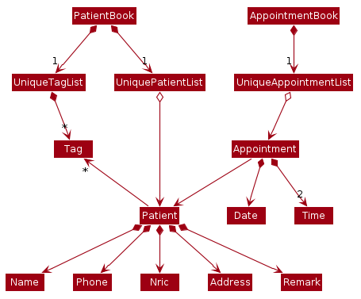
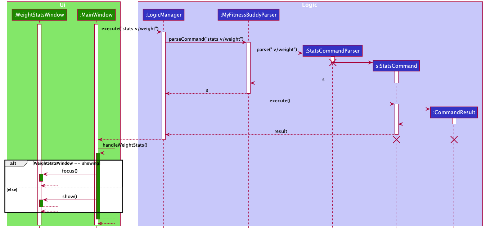
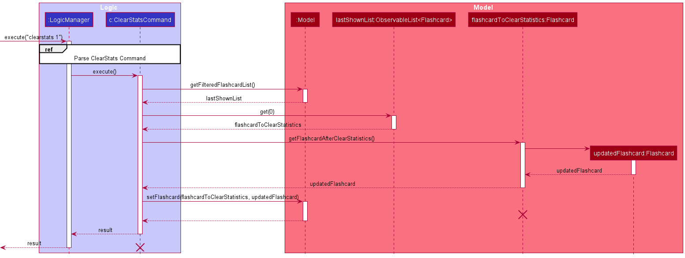
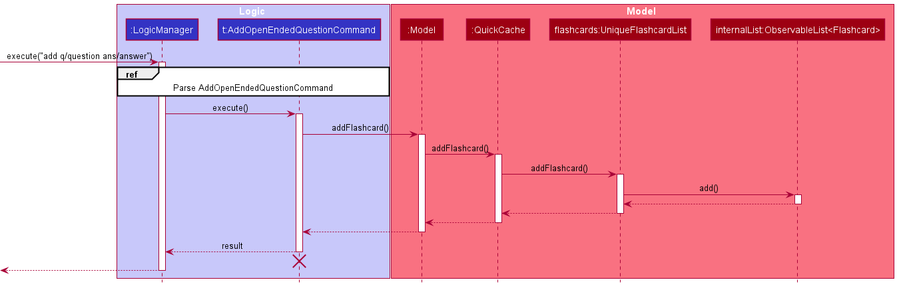
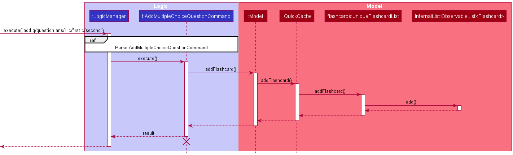
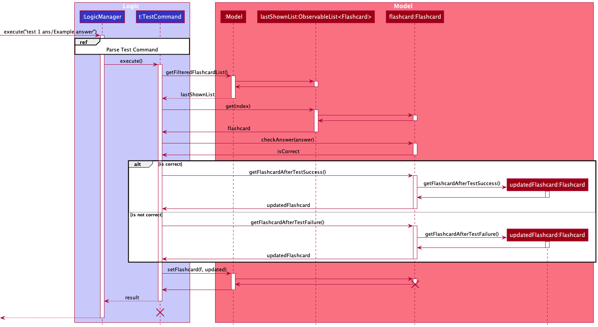
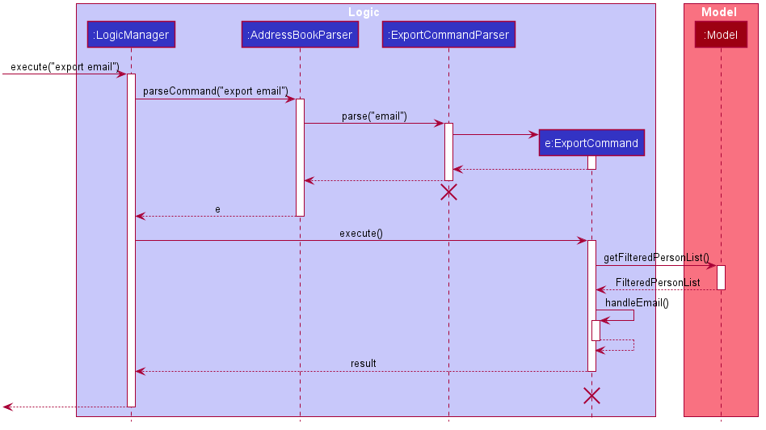

* Table of Contents
{:toc}

--------------------------------------------------------------------------------------------------------------------

## **Setting up, getting started**

Refer to the guide [_Setting up and getting started_](SettingUp.md).

--------------------------------------------------------------------------------------------------------------------

## **Design**

### Architecture

The ***Architecture Diagram*** given above explains the high-level design of the App. Given below is a quick overview of each component.

**`Main`** has two classes called [`Main`](https://github.com/se-edu/addressbook-level3/tree/master/src/main/java/seedu/address/Main.java) and [`MainApp`](https://github.com/se-edu/addressbook-level3/tree/master/src/main/java/seedu/address/MainApp.java). It is responsible for,
* At app launch: Initializes the components in the correct sequence, and connects them up with each other.
* At shut down: Shuts down the components and invokes cleanup methods where necessary.

[**`Commons`**](#common-classes) represents a collection of classes used by multiple other components.

The rest of the App consists of four components.

* [**`UI`**](#ui-component): The UI of the App.
* [**`Logic`**](#logic-component): The command executor.
* [**`Model`**](#model-component): Holds the data of the App in memory.
* [**`Storage`**](#storage-component): Reads data from, and writes data to, the hard disk.

Each of the four components,

* defines its *API* in an `interface` with the same name as the Component.
* exposes its functionality using a concrete `{Component Name}Manager` class (which implements the corresponding API `interface` mentioned in the previous point.

For example, the `Logic` component (see the class diagram given below) defines its API in the `Logic.java` interface and exposes its functionality using the `LogicManager.java` class which implements the `Logic` interface.

**How the architecture components interact with each other**

The *Sequence Diagram* below shows how the components interact with each other for the scenario where the user issues the command `delete 1`.

The sections below give more details of each component.

### UI component

**API** :
[`Ui.java`](https://github.com/se-edu/addressbook-level3/tree/master/src/main/java/seedu/address/ui/Ui.java)

The UI consists of a `MainWindow` that is made up of parts e.g.`CommandBox`, `ResultDisplay`, `PersonListPanel`, `StatusBarFooter` etc. All these, including the `MainWindow`, inherit from the abstract `UiPart` class.

The `UI` component uses JavaFx UI framework. The layout of these UI parts are defined in matching `.fxml` files that are in the `src/main/resources/view` folder. For example, the layout of the [`MainWindow`](https://github.com/se-edu/addressbook-level3/tree/master/src/main/java/seedu/address/ui/MainWindow.java) is specified in [`MainWindow.fxml`](https://github.com/se-edu/addressbook-level3/tree/master/src/main/resources/view/MainWindow.fxml)

The `UI` component,

* Executes user commands using the `Logic` component.
* Listens for changes to `Model` data so that the UI can be updated with the modified data.

### Logic component

**API** :
[`Logic.java`](https://github.com/se-edu/addressbook-level3/tree/master/src/main/java/seedu/address/logic/Logic.java)

1. `Logic` uses the `AddressBookParser` class to parse the user command.
1. This results in a `Command` object which is executed by the `LogicManager`.
1. The command execution can affect the `Model` (e.g. adding a person).
1. The result of the command execution is encapsulated as a `CommandResult` object which is passed back to the `Ui`.
1. In addition, the `CommandResult` object can also instruct the `Ui` to perform certain actions, such as displaying help to the user.

Given below is the Sequence Diagram for interactions within the `Logic` component for the `execute("delete 1")` API call.

:information_source: **Note:** The lifeline for `DeleteCommandParser` should end at the destroy marker (X) but due to a limitation of PlantUML, the lifeline reaches the end of diagram.

### Model component

**API** : [`Model.java`](https://github.com/se-edu/addressbook-level3/tree/master/src/main/java/seedu/address/model/Model.java)

The `Model`,

* stores a `UserPref` object that represents the user’s preferences.
* stores the quick cache flashcard data.
* exposes an unmodifiable `ObservableList<Flashcard>` that can be 'observed' e.g. the UI can be bound to this list so that the UI automatically updates when the data in the list change.
* does not depend on any of the other three components.

:information_source: **Note:** An alternative (arguably, a more OOP) model is given below. It has a `Tag` list in the `AddressBook`, which `Person` references. This allows `AddressBook` to only require one `Tag` object per unique `Tag`, instead of each `Person` needing their own `Tag` object. 

### Storage component

**API** : [`Storage.java`](https://github.com/se-edu/addressbook-level3/tree/master/src/main/java/seedu/address/storage/Storage.java)

The `Storage` component,
* can save `UserPref` objects in json format and read it back.
* can save the address book data in json format and read it back.

### Common classes

Classes used by multiple components are in the `seedu.addressbook.commons` package.

--------------------------------------------------------------------------------------------------------------------

## **Implementation**

This section describes some noteworthy details on how certain features are implemented.

### Open Flashcard

The open flashcard feature will allow the user to open a flashcard specified by the given index and display it in the GUI.

#### Implementation

The open flashcard implementation requires the creation of an `OpenCommandParser` and an `OpenCommand`. The `OpenCommandParser#parse` will take in a single argument for `Index`. After parsing the argument, it will then proceed to create an `OpenCommand` class instance. If no `Index` is given then a `CommandException` will be thrown.

The `OpenCommand` class will have to pass the `Question` to the GUI for it to display the`Question` of the `Flashcard` to the user. This will be done by passing the `Question` into a `Feedback` object which is an attribute of the `CommandResult` given to the GUI.

The GUI will change the content of some of its placeholders to display the question and if available, its choices to the user. The GUI will change the contents of its placeholders accordingly if other commands aside from another `OpenCommand` is called afterwards.

Given below is an example usage scenario and how the `OpenCommand` mechanism behaves at each step.

Step 1. The user launches the application for the first time. The `QuickCache` will be initialized with the initial QuickCache state.

Step 2. The user executes `open 1` command to display the first flashcard in the list on the GUI.

Step 3. This will call `OpenCommandParser#parse` which will then parse the arguments provided. Within the method, `ParserUtil#parseIndex` will be called to convert the user input into the `Index` of the first `Flashcard`.

Step 4. The `index` is then passed to the `OpenCommand`

Step 5. `OpenCommand#execute` will get the `Flashcard` at the specified `Index` and get its `Question` to be passed to the GUI as part of the `Feedback` attribute within the `CommandResult`.

Step 6. The GUI will then proceed to get the `Question` from `Feedback` and display its choices and question to the user.

The following sequence diagram shows how the open operation works:

### Display Statistics of Flashcard

The display statistics of flashcard feature will allow the user to view a Pie Chart of the statistics of the Flashcard specified by the given index and display it in the GUI.

#### Implementation

The display statistics of flashcard implementation requires the creation of a `StatsCommandParser` and a `StatsCommand`. The `StatsCommandParser#parse` will take in a single argument for `Index`. After parsing the argument, it will then proceed to create a `StatsCommand` class instance. If no `Index` is given then a `CommandException` will be thrown.

The `StatsCommand` class will have to pass the `Statistics` to the GUI for it to display the `Statistics` of the `Flashcard` to the user. This will be done by passing the `Statistics` into a `Feedback` object which is an attribute of the `CommandResult` given to the GUI.

The GUI will change the content of some of its placeholders to display the `Statistics` as a Pie Chart. The GUI will change the contents of its placeholders accordingly if other commands aside from another `StatsCommand` is called afterwards.

Given below is an example usage scenario and how the `StatsCommand` mechanism behaves at each step.

Step 1. The user launches the application after a few times of playing around with the `TestCommand` feature. The `QuickCache` will be initialized with the existing QuickCache state.

Step 2. The user executes `stats 1` command to display the `Statistics` of the first flashcard in the list on the GUI.

Step 3. This will call `StatsCommandParser#parse` which will then parse the arguments provided. Within the method, `ParserUtil#parseIndex` will be called to convert the user input into the `Index` of the first `Flashcard`.

Step 4. The `index` is then passed to the `StatsCommand`

Step 5. `StatsCommand#execute` will get the `Flashcard` at the specified `Index` and get its `Statistics` to be passed to the GUI as part of the `Feedback` attribute within the `CommandResult`.

Step 6. The GUI will then proceed to get the `Statistics` from `Feedback` and display its data in the form of a Pie Chart to the user.

The following sequence diagram shows how the stats operation works:

### Clear Statistics of Flashcard

The clear statistics of flashcard feature will allow the user to reset the statistics of the flashcard specified by the given index.

#### Implementation

The clear statistics of flashcard implementation requires the creation of a `ClearStatsCommandParser` and a `ClearStatsCommand`. The `ClearStatsCommandParser#parse` will take in a single argument for `Index`. After parsing the argument, it will then proceed to create a `ClearStatsCommand` class instance. If no `Index` is given then a `CommandException` will be thrown.

The `ClearStatsCommand` class will replace the `Flashcard` at the specified `Index` with a copy of the original `Flashcard` that has its `Statistics` reset to zero for all fields.

Given below is an example usage scenario and how the `ClearStatsCommand` mechanism behaves at each step.

Step 1. The user launches the application after a few times of playing around with the `TestCommand` feature. The `QuickCache` will be initialized with the existing QuickCache state.

Step 2. The user executes `stats 1` command to display the `Statistics` of the first flashcard in the list on the GUI. The user sees that the `Statistics` has values that are not zero.

Step 3. The user executes `clearstats 1` command to clear the `Statistics` of the first flashcard in the list on the GUI.

Step 4. This will call `ClearStatsCommandParser#parse` which will then parse the arguments provided. Within the method, `ParserUtil#parseIndex` will be called to convert the user input into the `Index` of the first `Flashcard`.

Step 5. The `index` is then passed to the `ClearStatsCommand`

Step 6. `ClearStatsCommand#execute` will get the `Flashcard` at the specified `Index` and call `ClearStatsCommand#getFlashcardAfterClearStatistics` which will give a copy of the original `Flashcard` with its `Statistics` reset to zero for all fields. The original `Flashcard` will then be replaced by the new `Flashcard` copy.

Step 7. After execution, `CommandResult` will contain a message indicating that it has cleared the `Statistics` of the `Flashcard` on the specified index.

Step 7. The user executes `stats 1` command to display the `Statistics` of the first flashcard in the list on the GUI. The user sees that the `Statistics` is reset.

The following sequence diagram shows how the stats operation works:

### Find by tag and question keywords feature

This find by tag and question keywords feature will allow the user to find flashcards specified by specifying tags and/or keywords that they possess.

#### Implementation

The find by tag and question keywords implementation requires changes to be made to the `FindCommandParser`. Currently, `FindCommandParser#parse` takes in the keyword arguments as a single `String` which is then split into individual keywords. The proposed implementation will require the `ArgumentTokenizer` and `ParseUtil` to parse for any `PREFIX_TAG` and/or `PREFIX_QUESTION`. `ParserUtil` will parse them accordingly and insert them into the necessary `Predicate<Flashcard>` which will be used for filtering the `Flashcard` list. If neither of them are provided or the `Tag` provided is non-aplhanumeric, then a `CommandException` will be thrown.

Since more than one `Predicate<Flashcard>` will be used, a class called `FlashcardPredicate` will be introduced that collects all `Predicate<Flashcard>` into one class.

`NameContainsKeywordsPredicate` will have to be refactored into `QuestionContainsKeywordsPredicate`. A new `Predicate<Flashcard>` for filtering the `Flashcard` based on `Tags` called `FlashcardContainsTagPredicate` also has to be made.

Changes to the `FindCommand` class will also have to be made as it currently works for `NameContainsKeywordsPredicate`. The new implementation will involve the `FindCommand` storing one `FlashcardPredicate`.

Given below is an example usage scenario and how the `FindCommand` mechanism behaves at each step.

Step 1. The user launches the application for the first time. The `QuickCache` will be initialized with the initial QuickCache state.

 Step 2. The user executes `find t/Assembly q/What` command to find a `Flashcard` with the tag `Assembly` and the keyword `What` in its `Question`.

 Step 3. This will call `FindCommandParser#parse` which will then parse the arguments provided. Within the method, `ParserUtil#parseTags`and `Parserutil#parseKeywords` will be called to create tags and keywords for the arguments.

 Step 4. A new `FlashcardPredicate` will then be created from the `QuestionContainsKeywordsPredicate` and `FlashcardContainsTagPredicate` generated from the given tags and keywords. It will be used to filter for all the flashcards that have the specified tags. This `FlashcardPredicate` is then passed to the `FindCommand`

 Step 5. `FindCommand#execute` will set the `QuickCache` model's filter with the provided predicate.

 Step 6. The GUI will then proceed to get the filtered list based on the newly set predicate to display to the user.

 Step 7. After execution, `CommandResult` will contain a message indicating that it has listed all `Flashcards` based on the specified restrictions.

 The following sequence diagram shows how the find operation works:

### Delete by tag feature

This delete by tag feature will allow the user to delete flashcards specified by a given set of tags.

#### Implementation

The delete by tag implementation requires changes to be made to the `DeleteCommandParser`. Currently, `DeleteCommandParser` takes in a single argument for `index`. The proposed implementation will require the `ArgumentTokenizer` and `ParseUtil` to parse for any `PREFIX_TAG`. If both `index` and `tag` are given, then a `CommandException` will be returned.

Changes to the `DeleteCommand` class will also have to be made as it must be able to perform a different execution step depending whether or not it is deleting by tag or index. This will be done by implementing a boolean value `isDeleteByTag`. If the value is false, then the original execution for deleting by `index` will be executed. Else it, will follow the description below on how the proposed delete by tag mechanism behaves at each step.

Step 1. The user launches the application for the first time. The `QuickCache` will be initialized with the initial QuickCache state.

 Step 2. The user executes `delete t/MCQ` command to delete all flashcards with the tag `MCQ`. 

 Step 3. This will call `DeleteCommandParser#parse` which will then parse the arguments provided. Within the method, `ParserUtil#parseTags` will be called to create tags for the arguments. 

 Step 4. A new `FlashcardPredicate` will then be created from the given tags. It will be used to filter for all the flashcards that have the specified tags. This `FlashcardPredicate` is then passed to the `DeleteCommand`

 Step 5. `DeleteCommand#execute` will filter the `QuickCache` model with the provided predicate and get back the filtered list

 Step 6. It will then iterate through the list and call `QuickCache#deleteFlashcard` on each `Flashcard` in the list.

 Step 7. After execution, `CommandResult` will contain a message indicating that all flashcards with the specified tags have been deleted.

### Tags

The tags mechanism is facilitated by `Flashcard` upon creation. It is stored internally as an `Set<Tag>` inside the `flashcard` object.

Given below is an example usage scenario and how the tag mechanism behaves at each step.

Step 1. The user launches the application for the first time. The `QuickCache` will be initialized with the initial QuickCache state.

Step 2. The user executes `add q/ question... t/tag` command to add a flashcard with tag. The `add` command will cause the addition of a flashcard with a tag inside the QuickCache. 

Step 3. The user executes `edit 1 t/tag` to edit the tag in the first flashcard of the list. The edit command will change the internal structure of flashcard such that the `Set<Tag>` is updated.

:information_source: **Note:** If a command fails its execution, it will not be saved in the QuickCache, so the flashcard inside the QuickCache will not be updated.

#### Design consideration:

##### Aspect: How tag executes

* **Alternative 1 (current choice):** Tag is saved upon creation.
  * Pros: Easy to implement.
  * Cons: May be complicated as there will be too many fields in the `add` command.

* **Alternative 2:** Individual command knows how to tag by
  itself.
  * Pros: Will be less complicated.
  * Cons: There may be too many commands which can be combined to one.

### Difficulty

The difficulty mechanism is facilitated by `Flashcard` upon creation. It is stored internally as a `Difficulty` inside the `flashcard` object.

The `Difficulty` class takes difficulty levels from `Difficulties` enums which contains four difficulty levels `LOW`, `MEDIUM`, `HIGH` and `UNSPECIFIED`. 

Given below is an example usage scenario and how the difficulty mechanism behaves at each step.

Step 1. The user launches the application for the first time. The `QuickCache` will be initialized with the initial QuickCache state.

Step 2. The user executes `add q/question... d/difficultyLevel` command to add a flashcard with difficulty. The `add` command will cause the addition of a flashcard with a difficulty inside the QuickCache.
 * If the user executes `add q/question...` command without `d/` prefix. The `add` command will cause the addition of a flashcard with a difficulty set to `UNSPECIFIED` inside the QuickCache.

Step 3. The user executes `edit 1 d/difficultyLevel` to edit the difficulty in the first flashcard of the list. The edit command will change the internal structure of flashcard such that the `Difficulty` is updated.

:information_source: **Note:** If a command fails its execution, it will not be saved in the QuickCache, so the flashcard inside the QuickCache will not be updated.

#### Design consideration:

##### Aspect: How Difficulty executes

* **Alternative 1 (current choice):** Difficulty is saved upon creation.
  * Pros: Easy to implement.
  * Cons: May be complicated as there will be too many fields in the `add` command.

* **Alternative 2:** Individual command knows how to add difficulty by
  itself.
  * Pros: Will be less complicated.
  * Cons: There may be too many commands which can be combined to one.

### \[Proposed\] Data archiving

_{Explain here how the data archiving feature will be implemented}_

### Add Flashcard with open-ended question feature

The Add mechanism is facilitated by `QuickCache` . It is stored internally as a `UniqueFlashcardList` inside the `QuickCache` object.

Given below is an example usage scenario and how the add mechanism behaves at each step.

Step 1. The user launches the application for the first time. The `QuickCache` will be initialized with the initial QuickCache state.

Step 2. The user executes `add q/ question... t/tag` command to add a flashcard with tag. The `add` command will cause the addition of a flashcard with open-ended question inside the QuickCache. 

:information_source: **Note:** If a command fails its execution, it will not be saved in the QuickCache, so the flashcard inside the QuickCache will not be updated.

The following sequence diagram shows how the Add operation works:

#### Design consideration:

##### Aspect: How Add executes

* **Alternative 1 (current choice):** Flashcard is saved upon creation inside the QuickCache.
  * Pros: Easy to implement and CLI-optimized.
  * Cons: May be complicated as there will be too many fields in the `add` command.

### Add Flashcard with Multiple Choice question feature

The Add Multiple Choice Question mechanism is facilitated by `QuickCache` . It is stored internally as a `UniqueFlashcardList` inside the `QuickCache` object.

Given below is an example usage scenario and how the addmcq mechanism behaves at each step.

Step 1. The user launches the application for the first time. The `QuickCache` will be initialized with the initial QuickCache state.

Step 2. The user executes `addmcd q/ question ans/1 c/first choice c/second choice c/third choice... t/tag` command to add a flashcard with tag. The `addmcq` command will cause the addition of a flashcard with multiple choice question inside the QuickCache. 

:information_source: **Note:** If a command fails its execution, it will not be saved in the QuickCache, so the flashcard inside the QuickCache will not be updated.

The following sequence diagram shows how the Addmcq operation works:

#### Design consideration:

##### Aspect: How addmcq executes

* **Alternative 1 (current choice):** Flashcard is saved upon creation inside the QuickCache.
  * Pros: Easy to implement and CLI-optimized.
  * Cons: May be complicated as there will be too many fields in the `add` command.

### Delete Flashcard feature

The  Delete mechanism is facilitated by `QuickCache` . It will delete the flashcard at the provided index stored in the `UniqueFlashcardList` inside the `QuickCache` object.

Given below is an example usage scenario and how the delete mechanism behaves at each step.

Step 1. The user launches the application for the first time. The `QuickCache` will be initialized with the initial QuickCache state.

Step 2. The user executes `delete 1` command to delete the first flashcard. The `delete` command will cause the deletion of a flashcard inside the QuickCache. 

:information_source: **Note:** If a command fails its execution, it will not be saved in the QuickCache, so the flashcard inside the QuickCache will not be updated.

The following sequence diagram shows how the delete operation works:

#### Design consideration:

##### Aspect: How delete executes

* **Alternative 1 (current choice):** Provide the index of the flashcard to be deleted.
  * Pros: Easy to implement and CLI-optimized.
  * Cons: User have to know the index of the specified flashcard.
  
### Edit Flashcard feature

The Delete mechanism is facilitated by `QuickCache` . It will edit the flashcard at the provided index stored in the `UniqueFlashcardList` inside the `QuickCache` object.

Given below is an example usage scenario and how the edit mechanism behaves at each step.

Step 1. The user launches the application for the first time. The `QuickCache` will be initialized with the initial QuickCache state.

Step 2. The user executes `edit 1 ...` command to edit some of the fields given in the command on the first flashcard. The `edit` command will cause the creation of a flashcard with updated field and set it to be the flashcard on the index in `UniqueFlashcardList`. 

:information_source: **Note:** If a command fails its execution, it will not be saved in the QuickCache, so the flashcard inside the QuickCache will not be updated.

The following sequence diagram shows how the edit operation works:

#### Design consideration:

##### Aspect: How edit executes

* **Alternative 1 (current choice):** Provide the index of the flashcard to be edited.
  * Pros: Easy to implement and CLI-optimized.
  * Cons: User have to know the index of the specified flashcard.

### Test feature

#### Implementation

The test mechanism is facilitated by `Flashcard`. Specifically, `Statistics` stored within the flashcard. `Flashcard` implements the following methods.
* `Flashcard#getFlashcardAfterTestSuccess()` — Returns a new `Flashcard` object with `Statistics:timesTested` and `Statistics:timesTestedCorrect` incremented by one. 
* `Flashcard#getFlashcardAfterTestFailure()` — Returns a new `Flashcard` object with `Statistics:timesTested` incremented by one.

Given below is an example usage scenario and how the test mechanism behaves at each step.

Step 1. The user launches the application. The `Flashcard` to be tested will be initialized with the initial flashcard state.

Step 2. The user tests the flashcard with a specified `answer` or `option`.

Step 2a. The user executes `test 1 ans/correct answer` command to test the `Flashcard`. The `test` command calls `Flashcard#getFlashcardAfterTestSuccess()`, and replaces the previously tested flashcard with the newly updated flashcard, changing its state.

Step 2b. The user executes `test 1 ans/wrong answer` command to test the `Flashcard`. The `test` command calls `Flashcard#getFlashcardAfterTestFailure()`, and replaces the previously tested flashcard with the newly updated flashcard, changing its state.

The following sequence diagram shows how the test operation works:

The following sequence diagram shows how the input get parsed:

The following activity diagram summarizes what happens when a user executes a test command on a specified flashcard:

#### Design consideration:

##### Aspect: How tests manipulate statistics

* **Alternative 1 (current choice):** Increments a counter of `timesTestedCorrect` and `timesTested` in `Statistics`.
  * Pros: Easy to implement.
  * Cons: Unable to keep track of useful information such as performance over time. 

* **Alternative 2:** `Statistics` is made up of an `Array` of `test`, including information such as `timestamp`
  * Pros: Retrieval of useful statistics will be possible.
  * Cons: Save file will expand very quickly because each `test` record needs to be logged.

_{more aspects and alternatives to be added}_

### Export Feature

#### Implementation

The export mechanism is facilitated by `Storage` and `QuickCache`. `Storage` is used to interact with the users local data, and a new `QuickCache` containing the data to be exported is passed to `Storage` to save to local data. 

Given below is an example usage scenario and how the export mechanism behaves at each step.

Step 1. The user inputs the `find t/cs2100` command to find all `Flashcard` containing the tag `cs2100`. The `Model` updates its current filtered flashcard list.

Step 2. The user inputs the `export out.json` command. The following sequence diagram shows how the input command gets parsed:

Step 3. The parsed `Export` command is executed. The current filtered flashcard list is exported to `out.json`, located in the `/export/` directory.

The following sequence diagram shows how the export operation works as a whole:

The following activity diagram summarizes what happens when a user executes an `Export` command:

#### Design consideration:

##### Aspect: How to output the export file

* **Alternative 1 (current choice):** Predefined directory of `/export/` 
  * Pros: Easy to implement.
  * Cons: The user will have to navigate to his `/export/` folder to retrieve output file.

* **Alternative 2:** User specifies which directory to save the export file to.
  * Pros: More control over where the export file will end up at.
  * Cons: Difficult to implement.
  * Cons: Command becomes more complicated as the entire path needs to be typed out.

_{more aspects and alternatives to be added}_

### Import Feature

#### Implementation

The import mechanism is similarly facilitated by `Storage` and `QuickCache`. `Storage` is used to interact with the users local data, and a new `QuickCache` containing the data to be imported is read by `Storage` from local data.

Given below is an example usage scenario and how the export mechanism behaves at each step.

Step 1. The user places the file `in.json` that he wants to import in his `/import/`folder.

Step 2. The user inputs the `import in.json` command. The following sequence diagram shows how the input command gets parsed:

Step 3. The parsed `Import` command is executed. The flashcards from the file `in.json` is imported into his local `QuickCache`. If a flashcard has been imported before, it will not be imported again. The check for repitive flashcards is carried out using `Model#hasFlashcard` and `Flashcard#equals`.

The following sequence diagram shows how the import operation works as a whole:

The following activity diagram summarizes what happens when a user executes an `Import` command:

#### Design consideration:

##### Aspect: How to import the input file

* **Alternative 1 (current choice):** Predefined directory of `/import/` 
  * Pros: Easy to implement.
  * Cons: The user will have to navigate to his `/import/` folder to a place the input file in it.

* **Alternative 2:** User specifies which directory to save the export file to.
  * Pros: More control over where the import file can be from e.g. user's download folder.
  * Cons: Difficult to implement.
  * Cons: Command becomes more complicated as the entire path needs to be typed out.

_{more aspects and alternatives to be added}_

--------------------------------------------------------------------------------------------------------------------

## **Documentation, logging, testing, configuration, dev-ops**

* [Documentation guide](Documentation.md)
* [Testing guide](Testing.md)
* [Logging guide](Logging.md)
* [Configuration guide](Configuration.md)
* [DevOps guide](DevOps.md)

--------------------------------------------------------------------------------------------------------------------

## **Appendix: Requirements**

### Product scope

**Target user profile**:

* Students with many modules who want to memorize points
* prefer desktop apps over other types
* prefers typing to mouse interactions
* is reasonably comfortable using CLI apps
* wants to monitor his/her progress

**Value proposition**: manage flashcards faster than a typical mouse/GUI driven app with 
a test feature and track the progress later.

### User stories

Priorities: High (must have) - `* * *`, Medium (nice to have) - `* *`, Low (unlikely to have) - `*`

| Priority | As a …​                                    | I want to …​                     | So that I can…​                                                |
| -------- | ------------------------------------------ | ------------------------------ | ------------------------------------------------------------------------- |
| `* * *`  | new user                                   | see usage instructions         | refer to instructions when I forget how to use the App                    |
| `* * *`  | new user                                   | have a get started             | see the features available in the app                                     |
| `* * *`  | new user                                   | have a sample data             | explore more about the app                                                |
| `* * *`  | new user                                   | purge all current data         | delete the sample data for exploring the app                              |
| `* * *`  | user                                       | add a new flashcard            |                                                                           |
| `* * *`  | user                                       | delete a flashcard             | remove flashcards that I no longer need                                   |
| `* *`    | user                                       | find a flashcard by name       | locate details of flashcards without having to go through the entire list |
| `* *`    | user                                       | edit a flashcard               |                                                                           |
| `* *`    | user                                       | quiz myself                    | memorize things better                                                    |
| `* *`    | user                                       | organize my flashcard          |                                                                           |
| `* *`    | user                                       | categorize my flashcards       | easily find the flashcard associated with the category                    |
| `* *`    | user                                       | import a set of flashcard      | easily add new category of flashcard                                      |
| `* *`    | user                                       | export a set of flashcard      | easily transfer a category of flashcard                                   |
| `*`      | user who has created a lot of flashcard    | delete a category of flashcard | easily transfer a category of flashcard                                   |
| `*`      | user with many flashcards in the list      | specify the importance         |                                                                           |
| `*`      | user                                       | randomize the question         | test myself better                                                        |
| `*`      | user                                       | get the statistic of quiz      | get a visualisation form of my performance                                |
| `*`      | user                                       | track the progress             | know what I have done when using the app                                  |

*{More to be added}*

### Use cases

(For all use cases below, the **System** is the `QuickCache` and the **Actor** is the `user`, unless specified otherwise)

**Use case: UC01 - Explore QuickCache**

**MSS**

1.  User double clicks on QuickCache.jar
2.  QuickCache opens and shows a list of flashcards
3.  User plays around with QuickCache features to familiarize with them
4.  User purges all "get started" data

    Use case ends.

**Extensions**

* 1a. Error message indicating that QuickCache.jar cannot be opened pops up.
  
  * 1a1. User opens up CLI in the directory containing QuickCache and runs `java -jar QuickCache.jar`.
    
    Use case resumes at step 2.

* 3a. User wants to know all the available commands present in QuickCache.

  * 3a1. User requests for all the instructions available in QuickCache.
    
  * 3a2. QuickCache displays all available commands.
    
    Use case resumes at step 3.
  
* 3b. User quits QuickCache while trying out quiz feature.

  * 3b1. When opening QuickCache again, quiz resumes from where the User left off.
    
    Use case resumes at step 3.

* *a. User dislikes the GUI.

  * *a1. User quits and deletes QuickCache.
    
    Use case ends.
    
    

**Use case: UC02 - View Statistics**

**Preconditions: User has QuickCache open.**

**MSS**

1.  User requests for statistics
2.  QuickCache displays statistics
3.  User completes a quiz and requests for statistics
4.  QuickCache displays updated statistics

    Use case ends.

**Extensions**

* 1a. User has not done any quiz on QuickCache.
  
  * 1a1. QuickCache shows an error message.
    
    Use case resumes at step 3.
    

**Use case: UC03 - Delete a flashcard**

**Preconditions: User has QuickCache open.**

**MSS**

1.  User requests to list flashcards
2.  QuickCache shows a list of flashcards
3.  User requests to delete a specific flashcard in the list
4.  QuickCache deletes the flashcard
5.  QuickCache updates flashcard save file (UC07)

    Use case ends.

**Extensions**

* 2a. The list is empty.

  Use case ends.

* 3a. The given index is invalid.

  * 3a1. QuickCache shows an error message.

    Use case resumes at step 2.
    

**Use case: UC04 - Create a flashcard**

**Preconditions: User has QuickCache open.**

**MSS**

1.  User requests to add a flashcard
2.  QuickCache adds it to the list
3.  QuickCache updates flashcard save file (UC07)
4.  User requests to list flashcards
5.  QuickCache shows the list of flashcards including the recently added flashcard

    Use case ends.

**Extensions**

* 1a. The question is empty.

  * 1a1. QuickCache shows an error message.
    
    Use case ends.
  
* 1b. The answer is empty.

  * 1b1. QuickCache shows an error message.
    
    Use case ends.
    

**System: QuickCache**

**Use case: UC05 - Test a single flashcard**

**Actor: User**

**MSS:**

1. User requests to list flashcards
2. QuickCache shows a list of flashcards
3. User requests to test a specific flashcard in the list with a specific answer
4. QuickCache displays whether the answer is correct

    Use case ends.

**Extensions:**

* 2a. The list is empty.

  Use case ends.

* 3a. The given index is invalid.

  * 3a1. AddressBook shows an error message.

    Use case resumes at step 2.
    

**System: QuickCache**

**Use case: UC06 - Test a set of flashcards by category**

**Actor: User**

MSS:

1. User requests to list categories
2. QuickCache shows a list of categories
3. User requests to test a specific category in the list
4. User tests each flashcard on the list (UC06)
5. QuickCache shows the number of successful questions at the end

    Use case ends.

**Extensions:**

* 2a. The list is empty.

  Use case ends.

* 3a. The given index is invalid.

  * 3a1. QuickCache shows an error message.

    Use case resumes from step 2.

* 3b. The user specifies a time limit.

  * 3b1. QuickCache starts a timer.

    Use case resumes from step 4.

* 3c. The user specifies to randomly sort the questions.

  * 3c1. QuickCache randomizes the flashcards from the category.

    Use case resumes from step 4.

* 4a. The user answers the question.

  * 4a1. QuickCache shows the next question to answer.

  * Step 4a. is repeated until all questions in the category is answered.

    Use case resumes from step 5.

* 4b. The user cancels the test midway.

  * Use case resumes from step 5.

* 4c. The user runs out of time midway.

  * Use case resumes from step 5.

* 4d. The user closes QuickCache

  Use case ends.
  
  

**Use case: UC07 - Update flashcard save file**

**Actor: QuickCache**

MSS:

1. QuickCache accepts update request
2. QuickCache updates save file
  
    Use case ends.

**Extensions:**

* 2a. No save file.

  * 3a1. QuickCache creates new save file.
  
    Use case resumes from step 2.

* 2b. Save file corrupted.

  * 2b1. QuickCache shows an error message.
  
  * 2b2. QuickCache creates new save file.

    Use case resumes from step 2.
    

**Use case: UC08 - Import flashcard data file**

**Actor: User**

MSS:

1. User requests to import data file
2. QuickCache requests for the file location
3. User specifies the file location
4. QuickCache imports the file
  
    Use case ends.

**Extensions:**

* 3a. File not found.

  * 3a1. QuickCache shows an error message.
  
    Use case ends.

* 3b. Data file corrupted

  * 3b1. QuickCache shows an error message.

    Use case ends.
    

**Use case: UC09 - Add tags during creation of a Flashcard**

**Actor: User**

MSS:

1. User creates a flashcard.
2. QuickCache shows a list of existing tags.
3. QuickCache asks the user to type in the tags one by one.
4. User types in the tags one by one.
5. User signals that he is finished.
6. QuickCache adds the tags to the flashcard.

    Use case ends.

**Extensions:**

* 3a. User wishes to remove a tag that he entered.

  * 3a1. User inputs the remove command to remove the tag.

    Use case resumes at step 3.

* 5a. Some of the tags are new tags

  * 5a1. QuickCache stores and remembers the tags.

    Use case ends.
    

**Use case: UC10 - Deleting a tag category**

**Actor: User**

MSS:

1. User wants to remove a tag category.
2. User enters the delete tag command and the name of the tag to be deleted.
3. QuickCache asks for a confirmation before deleting.
4. User gives the confirmation.
5. QuickCache deletes the tag from every Flashcard.

    Use cased ends.

**Extensions:**

* 4a. User does not give confirmation

  * 4a1. QuickCache does not delete anything.

    Use case ends.
    

**Use case: UC11 - Edit tags on an existing Flashcard**

**Actor: User**

MSS:

1. User wants to add tags on an existing Flashcard
2. QuickCache asks for the name of the new tag to be added.
3. User enters the new tag name
4. QuickCache adds the tag onto the Flashcard

    Use case ends.

**Extensions:**

* 1a. User wants to remove a tag

	* 1a1. User asks QuickCache to list out all the tags
  
	* 1a2. QuickCache lists out all the tags
  
	* 1a3. User enters the name of the tag to be removed
  
	* 1a4. QuickCache removes the tag from the Flashcard

    Use case ends.

* 1b. User wants to edit a tag

	* 1b1. User asks QuickCache to rename a tag
  
	* 1b2. QuickCache asks for the new name of the tag
  
	* 1b3. User enters the new name
  
	* 1b4. QuickCache updates the tag with it's new name.  

    Use case ends.
    

**Use case: UC12 - Search for Flashcards based on Tags**

**Actor: User**

MSS:

1. User enters the name of the tag he wants to search
2. QuickCache filters through all existing Flashcards based on the tag and returns a list of Flashcards.

    Use case ends.
    

**Use case: UC13 - Open a single flashcard**

**MSS**

1. User double clicks on QuickCache.jar
2. QuickCache opens and shows a list of flashcards
3. User forgets the options of a question
4. User requests to open a specific flashcard in the list
5. QuickCache opens the flashcard and displays the options

	Use case ends.
	

**Extensions**

* 2a. The list is empty.

  	Use case ends.

* 4a. The given index is invalid.

  * 4a1. QuickCache shows an error message.

    Use case resumes at step 3.

****
### Non-Functional Requirements

1.  Should work on any _mainstream OS_ as long as it has Java `11` or above installed.
2.  Should be able to hold up to 1000 flashcards without a noticeable sluggishness in performance for typical usage.
3.  A user with above average typing speed for regular English text (i.e. not code, not system admin commands) should be able to accomplish most of the tasks faster using commands than using the mouse.

*{More to be added}*

### Glossary

* **Mainstream OS**: Windows, Linux, Unix, OS-X
* **Private contact detail**: A contact detail that is not meant to be shared with others

--------------------------------------------------------------------------------------------------------------------

## **Appendix: Instructions for manual testing**

Given below are instructions to test the app manually.

:information_source: **Note:** These instructions only provide a starting point for testers to work on;
testers are expected to do more *exploratory* testing.

### Launch and shutdown

1. Initial launch

   1. Download the jar file and copy into an empty folder

   1. Double-click the jar file Expected: Shows the GUI with a set of sample contacts. The window size may not be optimum.

1. Saving window preferences

   1. Resize the window to an optimum size. Move the window to a different location. Close the window.

   1. Re-launch the app by double-clicking the jar file. 
       Expected: The most recent window size and location is retained.

1. _{ more test cases … }_

### Deleting a flashcard

There are 2 ways to delete flashcards – by index or by tags.

1. Deleting a flashcard by index

   1. Prerequisites: List all flashcards using the `list` command. Multiple flashcards in the list.

   1. Test case: `delete 1` 
      Expected: First flashcard is deleted from the list. Details of the deleted flashcard shown in the status message. 

   1. Test case: `delete 0` 
      Expected: No flashcard is deleted. Error details shown in the status message. Status bar remains the same.
      
   1. Test case: `delete t/MCQ` 
      Expected: All flashcards with the tag `MCQ` is deleted

   1. Other incorrect delete commands to try: `delete`, `delete x` (where x is larger than the list size), `delete 1 t/MCQ`  
      Expected: Error message will appear with instructions on how to use the delete command.

### Saving data

1. Dealing with missing/corrupted data files

   1. _{explain how to simulate a missing/corrupted file, and the expected behavior}_

1. _{ more test cases … }_
