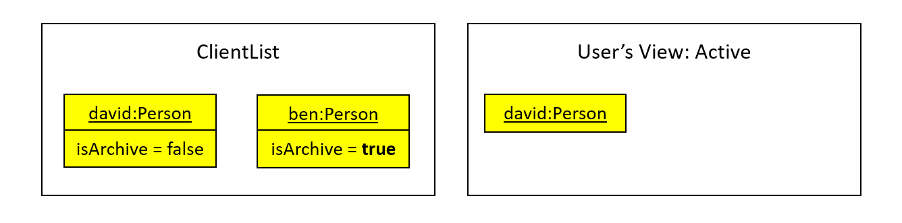
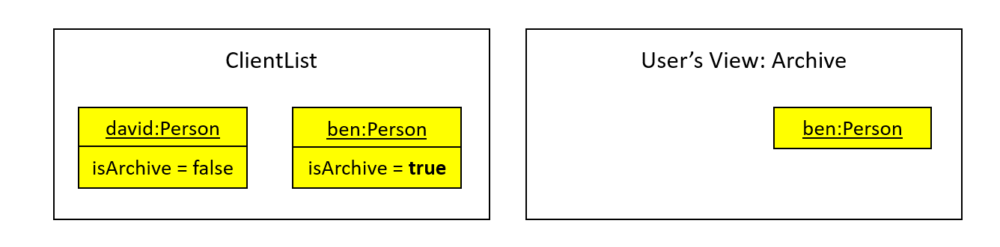

* Table of Contents
{:toc}

--------------------------------------------------------------------------------------------------------------------

## **Design**

### Architecture

Coming soon.

### UI component

Coming soon.

### Logic component

Coming soon.

### Model component

Coming soon.


### Storage component

Coming soon.

### Common classes

Coming soon.

--------------------------------------------------------------------------------------------------------------------

## **Implementation**

This section describes some noteworthy details on how certain features are implemented.

### \[Proposed\] Priority Feature

#### Proposed Implementation

The proposed priority feature would involve the UI javafx feature as well as a newly implemented field for the Clientlist.This field for the Clientlist would affect the UI of the ClientList. 

There would be 4 settings for the priority feature: High, Medium, Low, Undefined. If a user never include any of the settings, it would default to undefined. The priority feature would change the entries in the Clientlist, changing the colors of the UI for each entry based on the priority assigned for the Client. 


Firstly, the field would be added to the Person class. This would be similar to the method described in the tutorial:  https://nus-cs2103-ay2021s1.github.io/tp/tutorials/AddRemark.html, where instead of adding a command, we would be editing the add command to include an optional priority field. 

Given below is an example usage scenario and how the priority mechanism behaves when a user is added. Note that this addition of users via addcommand is the same command used when the user launches the application for the first time. 

Step 1. The user adds a command using addcommand and specifies the user. The addcommandparser will check if there was an empty string input for the priority field, if there is, we will set it as Undefined. If the user puts any other input other than the predefined inputs(H for high, M for medium, L for low), the user will get an error message. 

Step 2: The addcommand parser will pass the command to the addcommand in the logic package to check if the user is a duplicated user or not.  If the person is a valid person, the person would be passed on to the UI.

Step 3: In the UI, as it is an addCommand, the MainWindow will update the PersonListPanel, which will call the updateItem based on the Person and H. This will go to the PersonListViewCell, and would attempt to create a person class. 

Step 4: To identify between the different levels of priority, I propose to use a PriorityParser class which would parse the PersonCard to identify the type of person it is and would adjust the GUI based on it. The results would then be used to create a new PersonCard class and with a custom GUI based on the priority of the individual.

Step 5: This card would be returned back to the PersonListViewCell, updated on the PersonListPanel and finally shown in the Mainwindow. 

The following sequence diagram shows how the Priority operation works:


#### Design consideration:

##### Aspect: How Priority feature works.

* **Alternative 1 (current choice):** Create a parser to settle the image inside the UI class. 
  * Pros: Decreased coupling, easier to find bugs.

* **Alternative 2:** Do aside the parser, just put the switch cases inside the PersonListViewCell
  itself.
  * Pros: Will use less memory (No need to show the parser field).
  * Cons: Increased coupling

### \[Proposed\] Policy feature

#### Proposed Implementation

Policy (class) is a field in Person that is uniquely different from the current fields in Person
 such as phone, address, email, etc. A Person can have up to a single Policy. 
 
 Policy class contains 3 attributes: String name, String description.

Prior to adding a Policy field to a Person, User creates the Policy objects 
via `addp` (Add Policy Command). A collection stores these Policy objects to be referenced and
 a json file stores Policy objects that are created. 
 
 A user can then add one of these Policy objects as a field in a Person object by specifying with 
  `z/ [POLICY_NAME]` during Add Command.
  
Sequence diagram to create new Policy:


Additionally, a new Command, ClearPolicyCommand will clear the collection of Policy classes
in the list to facilitate the management of Policy objects.

When adding the Policy field to a Person object, the Policy name has to be correct, and
the Policy object should already be created.

### Archive feature

#### Implementation

The archive mechanism is facilitated by `ModelManager` and `Person`. `Person` contains an archive status, stored internally as `isArchive`. 
`ModelManager` tracks the current viewing mode of the list of `Person`, which is either the active mode or archive mode, stored internally as `isArchiveMode`.
Additionally, `ModelManager` implements the following operations:

* `ModelManager#getIsArchiveMode()` — Gets the current archive mode.
* `ModelManager#setIsArchiveMode(...)` — Sets the current archive mode.

These operations are exposed in the `Model` interface as `Model#getIsArchiveMode()` and `Model#setIsArchiveMode(...)` respectively.

Given below is an example usage scenario and how the archive mechanism behaves at each step.

Step 1. The user launches the application for the first time. The `ModelManager` will be initialized with the active mode with `isArchiveMode` set to `false`.

For simplicity, we only show 2 example persons, `david` and `ben`, who are both not in the archive, i.e. their `isArchive` is `false`. 
The user can view both of these persons as he is in the active mode.


Step 2. The user executes `archive 2` command to archive the 2nd person (`ben`) in the client list. 
The `archive` command creates a new `Person` with `isArchive` set to `true`, then calls `Model#setPerson(...)` to update the model.

This is followed by `Model#updateFilteredPersonList(PREDICATE_SHOW_ALL_ACTIVE)` to view all the active persons, 
where `PREDICATE_SHOW_ALL_ACTIVE` is used to filter `Person`s with `isArchive` set to `false`. 

The 2nd person (`ben`) would be hidden from the user's current view, so he can only see `david`.



The following sequence diagram shows how the archive operation works:


<div markdown="span" class="alert alert-info">:information_source: **Note:** The lifeline for `ArchiveCommandParser` and `ArchiveCommand` should end at the destroy marker (X) but due to a limitation of PlantUML, the lifeline reaches the end of diagram.
</div>


Step 3. The user executes `list r/` to view the archive. 
The `list r/` command calls `ModelManager#setIsArchiveMode(true)` to set the viewing mode to the archive mode, 
followed by `Model#updateFilteredPersonList(PREDICATE_SHOW_ALL_ARCHIVE)` to view the archive.
`PREDICATE_SHOW_ALL_ARCHIVE` is used to filter `Person`s with `isArchive` set to `true`. 

This causes the user to only view archived persons, which is `ben` in this case.



The following activity diagram summarizes what happens when a user executes the archive command and list command:


#### Design consideration:

##### Potential issues with other commands and Resolutions

Since the archive is implemented using predicate filtering, it might potentially conflict with `FindCommand`, 
if it were to be implemented in future. However, this can be easily resolved using predicate composition with conjunction 
(AND) logic, a method already available in `Java`’s `Predicate`s. 

As an example, `predicate1` could be a filter for archive, and `predicate2` could be from the find command:

```java
Predicate<Person> composedPredicate = predicate1.and(predicate2);
```

##### Aspect: How archive executes

* **Alternative 1 (current choice):** Uses a variable in `Person` to track if he is in the archive.
  * Pros: Easy to implement.
  * Cons: With an additional variable in the `Person` class, we must ensure that the reading and updating of the variable is correct. 
  A `Person` would also “know” that he is archived or not, which may not be that ideal.

* **Alternative 2:** Have a separate storage for archive.
  * Pros: A more intuitive solution, and only `Storage`-related modules "knows" about the presence of an archive.
  * Cons: We must ensure that the implementation the reading and saving of the 2 different storages, and updating of the models are correct, which is time-consuming.

--------------------------------------------------------------------------------------------------------------------

## **Documentation, logging, testing, configuration, dev-ops**

Coming soon.

--------------------------------------------------------------------------------------------------------------------

## **Appendix: Requirements**

### Product scope

**Target user profile**:

Insurance Agents - Financial Advisors

Insurance agents represent insurance companies, such as AIA and Prudential, as their sales person. They bring in 
clients and promote various insurance schemes. Their clients could be individuals or other businesses. Insurance agents’ 
mode of conducting their job generally involves talking directly to these clients in a face-to-face setting and giving 
their pitch. 

Insurance agents need to be familiar with their clients’ profile, such as their family status, financial needs and 
interests, to better promote their insurance schemes as it gives their pitch a personal touch. 

These users are likely used to typing notes and formulas to manage their clients into a tracker, for example in  Excel 
notebooks. They would add in attributes of users into the tracker, and add in additional functionalities using formulas. 
Thus, they are likely to be comfortable in using a command-line interface.

**Value proposition**: 

Remembering people like a good neighbour.

Successful Financial advisors can have more than a hundred clients. They may not be able to remember the personal 
details of all their clients at once. This product aims to provide a command-line interface for the financial agent to 
record the details of the client, from their scheme details, such as the policies they own, to their personal details, 
like their hobbies. As such, they would be better prepared for meetings and are able to provide a personal touch when 
giving their pitch.


### User stories

Priorities: High (must have) - `* * *`, Medium (nice to have) - `* *`, Low (unlikely to have) - `*`

| Priority | As a …                                     | I can …                        | So that I can…                                                         |
| -------- | ------------------------------------------ | ------------------------------ | ---------------------------------------------------------------------- |
| `* * *`  | regular user                               | add more clients               | handle more clients                                                    |
| `* * *`  | regular user                               | delete a client                | account for my clients who churned                                     |
|  `* *`   | first-time user                            | get some help on using the product | know how to use it                                                 |
| `* * *`  | first-time user                            | view all clients               | get a general overview                                                 |
| `* * *`  | first-time user                            | load existing data that I have on user personal details |                                               |
| `* * *`  | regular user                               | save my client information     | save my edits for next time use                                        |


### Use cases

(For all use cases below, the **System** is `I4I` and the **Actor** is the `user`, unless specified otherwise)

**UC01 - User adds Client**

**MSS**

1. User chooses to add new client with client details.
2. System gives success message.

    Use case ends.

**Extensions**

* 1a. User enters wrong add command format.

    * 1a1. System gives corresponding error message.

      Use case ends.

**UC02 - User deletes Client**

**MSS**

1. User requests to list persons.
2. System shows a list of persons.
3. User chooses to delete particular client.
4. System gives success message.

    Use case ends.

**Extensions**

* 2a. The list is empty.

  Use case ends.

* 3a. User enters wrong delete command format.

    * 3a1. System gives corresponding error message.

      Use case ends.
      
* 3b. User enters invalid index.

    * 3b1. System gives corresponding error message.

      Use case ends.

**UC03 - User lists all Clients**

**MSS**

1. User chooses to list all clients.
2. System shows all clients.

    Use case ends.

**Extensions**

* 1a. User enters wrong list command format.

    * 1a1. System gives corresponding error message.

      Use case ends.
      
**UC04 - User requests for help**

**MSS**

1. User requests for help on how to use the system.
2. System gives a guide to help user.

    Use case ends.

**Extensions**

* 1a. User enters wrong help command format.

    * 1a1. System gives corresponding error message.

      Use case ends.
      
### Non-Functional Requirements

1.  Should work on any _mainstream OS_ as long as it has Java `11` installed.
2.  Should be able to store up to 1000 clients.
3.  A user with above average typing speed for regular English text (i.e. not code, not system admin commands) 
should be able to accomplish most of the tasks faster using commands than using the mouse.

### Glossary

* **Mainstream OS**: Windows, Linux, Unix, OS-X
* **Insurance4Insurance**: Name of the product.
* **I4I**: Short for Insurance4Insurance, the name of the product.

--------------------------------------------------------------------------------------------------------------------

## **Appendix: Instructions for manual testing**

Coming soon.
