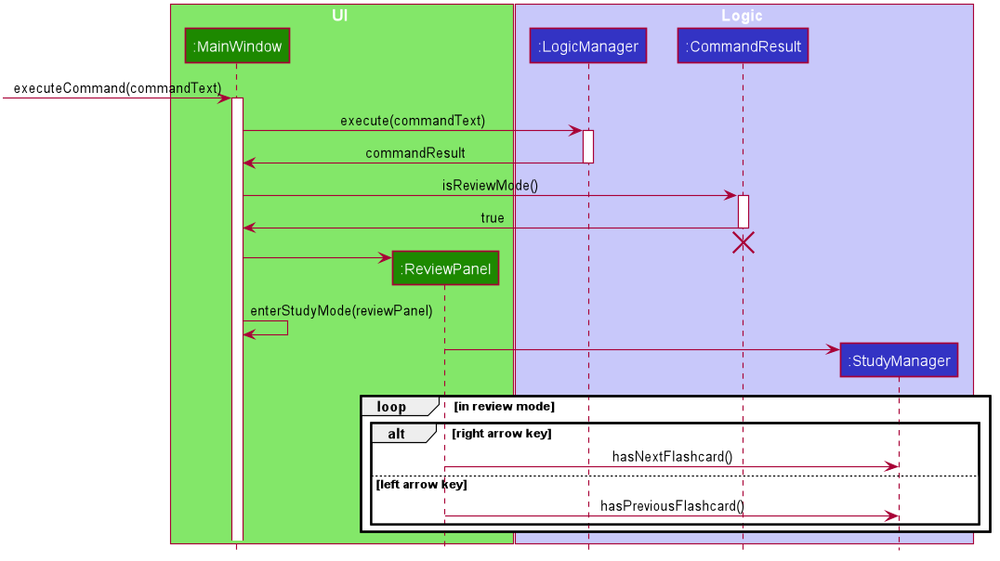
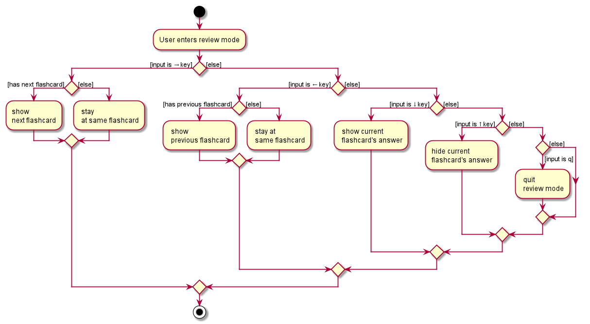
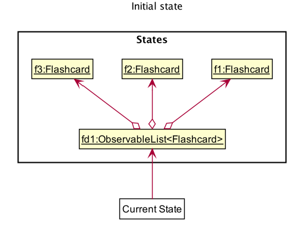
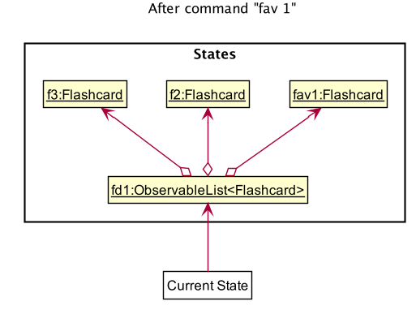
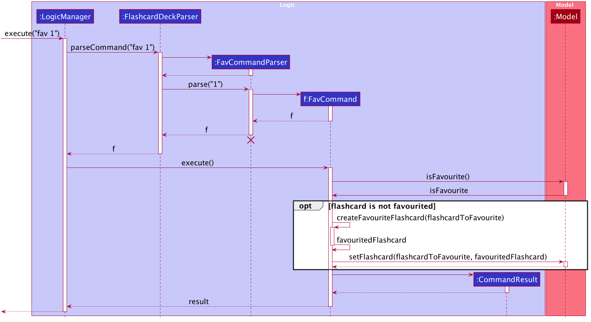
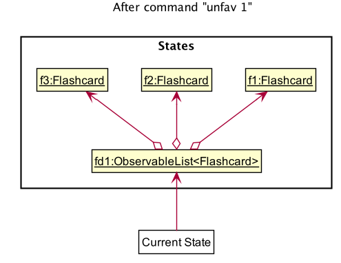

* Table of Contents
{:toc}

--------------------------------------------------------------------------------------------------------------------

## **Setting up, getting started**

Refer to the guide [_Setting up and getting started_](SettingUp.md).

--------------------------------------------------------------------------------------------------------------------

## **Design**

### Architecture

The ***Architecture Diagram*** given above explains the high-level design of the App. Given below is a quick overview of each component.

:bulb: **Tip:** The `.puml` files used to create diagrams in this document can be found in the [diagrams](https://github.com/se-edu/addressbook-level3/tree/master/docs/diagrams/) folder. Refer to the [_PlantUML Tutorial_ at se-edu/guides](https://se-education.org/guides/tutorials/plantUml.html) to learn how to create and edit diagrams.

**`Main`** has two classes called [`Main`](https://github.com/AY2021S1-CS2103T-T17-2/tp/blob/master/src/main/java/seedu/flashcard/Main.java) and [`MainApp`](https://github.com/AY2021S1-CS2103T-T17-2/tp/blob/master/src/main/java/seedu/flashcard/MainApp.java). It is responsible for,
* At app launch: Initializes the components in the correct sequence, and connects them up with each other.
* At shut down: Shuts down the components and invokes cleanup methods where necessary.

[**`Commons`**](#common-classes) represents a collection of classes used by multiple other components.

The rest of the App consists of four components.

* [**`UI`**](#ui-component): The UI of the App.
* [**`Logic`**](#logic-component): The command executor.
* [**`Model`**](#model-component): Holds the data of the App in memory.
* [**`Storage`**](#storage-component): Reads data from, and writes data to, the hard disk.

Each of the four components,

* defines its *API* in an `interface` with the same name as the Component.
* exposes its functionality using a concrete `{Component Name}Manager` class (which implements the corresponding API `interface` mentioned in the previous point.

For example, the `Logic` component (see the class diagram given below) defines its API in the `Logic.java` interface and exposes its functionality using the `LogicManager.java` class which implements the `Logic` interface.

**How the architecture components interact with each other**

The *Sequence Diagram* below shows how the components interact with each other for the scenario where the user issues the command `delete 1`.

The sections below give more details of each component.

### UI component

**API** :
[`Ui.java`](https://github.com/AY2021S1-CS2103T-T17-2/tp/blob/master/src/main/java/seedu/flashcard/ui/Ui.java)

The UI consists of a `MainWindow` that is made up of parts e.g.`CommandBox`, `ResultDisplay`, `FlashcardListPanel`, `StatusBarFooter` etc. All these, including the `MainWindow`, inherit from the abstract `UiPart` class.

The `UI` component uses JavaFx UI framework. The layout of these UI parts are defined in matching `.fxml` files that are in the `src/main/resources/view` folder. For example, the layout of the [`MainWindow`](https://github.com/AY2021S1-CS2103T-T17-2/tp/blob/master/src/main/java/seedu/flashcard/ui/MainWindow.java) is specified in [`MainWindow.fxml`](https://github.com/AY2021S1-CS2103T-T17-2/tp/blob/master/src/main/resources/view/MainWindow.fxml)

The `UI` component,

* Executes user commands using the `Logic` component.
* Listens for changes to `Model` data so that the UI can be updated with the modified data.

### Logic component

**API** :
[`Logic.java`](https://github.com/AY2021S1-CS2103T-T17-2/tp/blob/master/src/main/java/seedu/flashcard/logic/Logic.java)

1. `Logic` uses the `FlashcardDeckParser` class to parse the user command.
1. This results in a `Command` object which is executed by the `LogicManager`.
1. The command execution can affect the `Model` (e.g. adding a flashcard).
1. The result of the command execution is encapsulated as a `CommandResult` object which is passed back to the `Ui`.
1. In addition, the `CommandResult` object can also instruct the `Ui` to perform certain actions, such as displaying help to the user.

Given below is the Sequence Diagram for interactions within the `Logic` component for the `execute("delete 1")` API call.

:information_source: **Note:** The lifeline for `DeleteCommandParser` should end at the destroy marker (X) but due to a limitation of PlantUML, the lifeline reaches the end of diagram.

### Model component

**API** : [`Model.java`](https://github.com/AY2021S1-CS2103T-T17-2/tp/blob/master/src/main/java/seedu/flashcard/model/Model.java)

The `Model`,

* stores a `UserPref` object that represents the user’s preferences.
* stores the flashcard deck data.
* exposes an unmodifiable `ObservableList<Flashcard>` that can be 'observed' e.g. the UI can be bound to this list so that the UI automatically updates when the data in the list change.
* does not depend on any of the other three components.

:information_source: **Note:** An alternative (arguably, a more OOP) model is given below. It has a `Tag` list in the `FlashcardDeck`, which `Flashcard` references. This allows `FlashcardDeck` to only require one `Tag` object per unique `Tag`, instead of each `Flashcard` needing their own `Tag` object. 

### Storage component

**API** : [`Storage.java`](https://github.com/AY2021S1-CS2103T-T17-2/tp/blob/master/src/main/java/seedu/flashcard/storage/Storage.java)

The `Storage` component,
* can save `UserPref` objects in json format and read it back.
* can save the address book data in json format and read it back.

### Common classes

Classes used by multiple components are in the `seedu.flashcard.commons` package.

--------------------------------------------------------------------------------------------------------------------

## **Implementation**

This section describes some noteworthy details on how certain features are implemented.

### \[Proposed\] Undo/redo feature

#### Proposed Implementation

The proposed undo/redo mechanism is facilitated by `VersionedAddressBook`. It extends `AddressBook` with an undo/redo history, stored internally as an `addressBookStateList` and `currentStatePointer`. Additionally, it implements the following operations:

* `VersionedAddressBook#commit()` — Saves the current address book state in its history.
* `VersionedAddressBook#undo()` — Restores the previous address book state from its history.
* `VersionedAddressBook#redo()` — Restores a previously undone address book state from its history.

These operations are exposed in the `Model` interface as `Model#commitAddressBook()`, `Model#undoAddressBook()` and `Model#redoAddressBook()` respectively.

Given below is an example usage scenario and how the undo/redo mechanism behaves at each step.

Step 1. The user launches the application for the first time. The `VersionedAddressBook` will be initialized with the initial address book state, and the `currentStatePointer` pointing to that single address book state.

Step 2. The user executes `delete 5` command to delete the 5th person in the address book. The `delete` command calls `Model#commitAddressBook()`, causing the modified state of the address book after the `delete 5` command executes to be saved in the `addressBookStateList`, and the `currentStatePointer` is shifted to the newly inserted address book state.

Step 3. The user executes `add n/David …​` to add a new person. The `add` command also calls `Model#commitAddressBook()`, causing another modified address book state to be saved into the `addressBookStateList`.

:information_source: **Note:** If a command fails its execution, it will not call `Model#commitAddressBook()`, so the address book state will not be saved into the `addressBookStateList`.

Step 4. The user now decides that adding the person was a mistake, and decides to undo that action by executing the `undo` command. The `undo` command will call `Model#undoAddressBook()`, which will shift the `currentStatePointer` once to the left, pointing it to the previous address book state, and restores the address book to that state.

:information_source: **Note:** If the `currentStatePointer` is at index 0, pointing to the initial AddressBook state, then there are no previous AddressBook states to restore. The `undo` command uses `Model#canUndoAddressBook()` to check if this is the case. If so, it will return an error to the user rather
than attempting to perform the undo.

The following sequence diagram shows how the undo operation works:

:information_source: **Note:** The lifeline for `UndoCommand` should end at the destroy marker (X) but due to a limitation of PlantUML, the lifeline reaches the end of diagram.

The `redo` command does the opposite — it calls `Model#redoAddressBook()`, which shifts the `currentStatePointer` once to the right, pointing to the previously undone state, and restores the address book to that state.

:information_source: **Note:** If the `currentStatePointer` is at index `addressBookStateList.size() - 1`, pointing to the latest address book state, then there are no undone AddressBook states to restore. The `redo` command uses `Model#canRedoAddressBook()` to check if this is the case. If so, it will return an error to the user rather than attempting to perform the redo.

Step 5. The user then decides to execute the command `list`. Commands that do not modify the address book, such as `list`, will usually not call `Model#commitAddressBook()`, `Model#undoAddressBook()` or `Model#redoAddressBook()`. Thus, the `addressBookStateList` remains unchanged.

Step 6. The user executes `clear`, which calls `Model#commitAddressBook()`. Since the `currentStatePointer` is not pointing at the end of the `addressBookStateList`, all address book states after the `currentStatePointer` will be purged. Reason: It no longer makes sense to redo the `add n/David …​` command. This is the behavior that most modern desktop applications follow.

The following activity diagram summarizes what happens when a user executes a new command:

#### Design consideration:

##### Aspect: How undo & redo executes

* **Alternative 1 (current choice):** Saves the entire address book.
  * Pros: Easy to implement.
  * Cons: May have performance issues in terms of memory usage.

* **Alternative 2:** Individual command knows how to undo/redo by
  itself.
  * Pros: Will use less memory (e.g. for `delete`, just save the person being deleted).
  * Cons: We must ensure that the implementation of each individual command are correct.

_{more aspects and alternatives to be added}_

### \[Proposed\] Data archiving

_{Explain here how the data archiving feature will be implemented}_

### \[Implemented\] Add Feature 

#### Current Implementation

The Add feature 
The add feature is facilitated by `LogicManager` and `ModelManager`. The add command supports the following inputs from the user

* q/QUESTION
* a/ANSWER
* c/CATEGORY
* n/NOTE
* r/RATING
* d/DIAGRAM
* t/TAG

Question and answer are mandatory inputs while the rest are optional inputs. When the user adds a flashcard, the user’s inputs will be passed on to `ParserUtil`. `ParserUtil` will conduct input validation and trim any leading and trailing whitespaces. If the user’s inputs are valid and there are no duplicate flashcard, a `Flashcard` object will be created and added to the `FlashcardDeck`. Otherwise `ParseException` will be thrown and the relevant error message will be displayed to the user. 

It implements the following operations:
* `AddCommand#execute()` - Add the flashcard to the `ModelManager` and `FlashcardDeck`
* `AddCommandParser# parse (String args)` - Conduct input validation and parse user’s input

The following sequence diagram shows how the `add` operation works:

### \[Implemented\] Review feature

#### Current Implementation

The review mechanism is implemented mainly via `MainWindow`. The review feature is a UI feature so `MainWindow` maintains the necessary UI state 
and keeps track of whether the application is in review mode. Review mode is facilitated by `ReviewManager` which keeps track of the review state.
It maintains the list of `Flashcard` and the `currentIndex` at which the user is at.

It implements the following operations:
* `ReviewManager#hasNextFlashcard` - determines if there are any more flashcards in the flashcard list after the flashcard specified by the `currentIndex`
* `ReviewManager#hasPreviousFlashcard` - determines if there are any previous flashcards in the flashcard list before the flashcard specified by the `currentIndex`
* `ReviewManager#getCurrentFlashcard` - returns flashcard at `currentIndex` in the flashcard list
* `ReviewManager#getPreviousFlashcard` - decrements `currentIndex` by 1 and returns the associated flashcard
* `ReviewManager#getNextFlashcard` - increments `currentIndex` by 1 and returns the associated flashcard

Given below is an example of how the undo/redo mechanism behaves at each step:

Step 1. The user launches the application.

Step 2. The user executes `review` command. `MainWindow` will receive a `CommandResult` and calls `CommandResult#isReviewMode` which returns true. `MainWindow#handleReview` is then called to enter review mode.

Step 3. In `MainWindow#handleReview`, the UI elements are altered, a listener is set up to listen for arrow key presses and a new `ReviewManager` is created to keep track of state.

Step 4. Depending on the key presses, different operations of `ReviewManager` are called. The flashcard to render in the UI is determined by the various `ReviewManager` operations and the state as mentioned above.

Step 5. If user presses `q` or runs out of flashcards to review, `MainWindow#exitReviewMode` is called which places the application back in normal command mode.

The following sequence diagram gives an overview of how the application enters review mode:

The following activity diagram summarises the control path in review mode set up by `ReviewManager#handleReview`:

#### Design consideration:

##### Aspect: How review mode executes

* **Alternative 1 (current choice):** Handle review mode directly in UI.
  * Pros: Truly interactive review where user can use key presses instead of typing commands.
  * Cons: UI will have to implement some logic.

* **Alternative 2:** Handle review mode through the command textbox.
  * Pros: Allows for better abstraction through separation of UI and logic.
  * Cons: Poorer user experience as reviewing will be slow since user has to type in command one by one.

### \[Implemented\] Sort feature

#### Current Implementation

The sort mechanism is facilitated by `ModelManager`. `Statistics` attribute is stored internally in `Flashcard`, to keep track of review frequency and correctness percentage respectively based on the review activity done by the user. When the user enters review mode, the user activity will be tracked and the data will be sent and stored inside `Statistics` of the individual `Flashcard`. This activity will then be used to facilitate the sort mechanism, through the enum `SortCriteria` which provides the comparator needed for the respective sort critera.

It implements the following operations:
* `ModelManager#sortFilteredFlashcardList(Comparator <Flashcard> comparator)` - sorts the flashcard list according to the given comparator, and updates the flashcard list shown.
* `SortCriteria#getCriteria(String criteria)` - retrieves the enum according to the criteria given.

The `ModelManager#sortFilteredFlashcardList(Comparator<Flashcard> comparator)` operation is exposed in the `Model` interface as `Model#updateSortedFlashcardList(Comparator <Flashcard> comparator)`.

Given below is an example usage scenario and how the sort mechanism behaves at each step.

Step 1. The user launches the application.

Step 2. The user executes `review` command to review the flashcard deck. The user reviews 3 out of 5 flashcards and exits review mode. The review command calls `Statistics#incrementReviewFrequency()` for each flashcard that has been reviewed and `Statistics#incrementSuccessFrequency()` depending on whether the user successfully answers the question, hence updating the state of the flashcard.

Step 3. The user executes `sort reviewed -d`. The command gets parsed to retrieve the appropriate `SortCriteria`. The `sort` command calls `Model#sortFilteredFlashcardList` with this `SortCriteria`, causing the flashcards to be sorted by review frequency, in descending order.

The following sequence diagram shows how the sort operation works:

:information_source: **Note:** The lifeline for `SortCommand` should end at the destroy marker (X) but due to a limitation of PlantUML, the lifeline reaches the end of diagram.

The following activity diagram summarizes what happens when a user executes a new command:

#### Design consideration:

##### Aspect: How sort executes

* **Alternative 1 (current choice):** Stores statistics in Flashcard and compares flashcard directly.
  * Pros: Easy to implement.
  * Cons: Flashcard will have to keep track of many data.

* **Alternative 2:** Using a data structure (e.g. HashMap) to store statistics.
  * Pros: Will use more memory, since the HashMap will have to be committed to local storage too.
  * Cons: We must ensure that the any changes/updates to a flashcard will be reflected in the HashMap.

### \[Implemented\] Favourite/Unfavourite feature 

#### Current Implementation

The favourite/unfavourite mechanism is faciliated by `LogicManager` and `ModelManager`.
A `isFavourite` attribute is stored internally in `Flashcard`, to keep track of whether the flashcard is favourited. When the user favourites a flashcard, `isFavourite` is set to true, and set to false otherwise. 
 
It implements the following operations:
* `Flashcard#isFavourite()` - Checks whether the current flashcard is favourited
* `FavCommand#createFavouriteFlashcard(Flashcard flashcardToFavourite)` - Duplicates the flashcard and set `isFavourite` attribute to `true`
* `UnfavCommand#createUnfavouriteFlashcard(Flashcard flashcardToUnfavourite)` - Duplicates the flashcard and set `isFavourite` attribute to `false`.

Given below is an example usage scenario and how the favourite/unfavourite mechanism behaves at each step.

Step 1: The user launches the application 

Step 2: The user executes `fav 1` command to favourite the 1st flashcard in the displayed flashcard deck. `fav` Command calls 
`Flashcard#isFavourite()` method to check whether the flashcard at index 1, `f1`,  has been favourited. If the flashcard is not favourited, 
`fav` Command calls `FavCommand#createFavouriteFlashcard(f1)` to create a new flashcard, `fav1`,  by duplicating the existing data fields and set the `isFavourite` attribute to `true`.
`fav` Command then calls `ModelManager#setFlashcard(f1, fav1)` to replace the current flashcard, `f1`,  with the favourited flashcard, `fav1`.

The following sequence diagram shows how the `fav` operation works:

Step 3: The user executes `unfav 1` command to unfavourite the 1st flashcard in the displayed flashcard deck. `unfav` Command calls 
`Flashcard#isFavourite()` method to check whether the flashcard at index 1, `fav1`,  has been favourited. `fav1` is favourited in step 2, hence, 
`unfav` Command calls `UnfavCommand#createUnfavouriteFlashcard(fav1)` to create a new flashcard, `f1`,  by duplicating the existing data fields and set the `isFavourite` attribute to `false`.
`unfav` Command then calls `ModelManager#setFlashcard(fav1, f1)` to replace the current flashcard, `fav1`,  with the unfavourited flashcard, `f1`.

The following sequence diagram shows how the `unfav` operation works:

The following activity diagram summarizes what happens when a user executes a favourite/unfavourite command:

#### Design consideration:

##### Aspect: How fav & unfav executes

* **Alternative 1 (current choice):** Creates a new flashcard everytime `isFavourite` changes
  * Pros: Flashcard remains immutable.
  * Cons: Execution time is longer compared to Alternative 2 since a new flashcard is created if flashcard's state changes.

* **Alternative 2:** Toggle `isFavourite` using a setter such as `setFavouriteStatus` in `Flashcard`.
  * Pros: Easy to implement as there is no need to create a new flashcard every time the state is changed.
  * Cons: Flashcard would not be immutable

_{more aspects and alternatives to be added}_

### \[Implemented\] Filter feature

#### Current Implementation
The filtering mechanism is facilitated by `LogicManager` and `ModelManager`.
It works when the `LogicManager` listens for a filter command input from the user and
parses the command to filter out relevant flashcards based on the category or categories 
chosen. The filter feature supports filtering of multiple categories by parsing the command
using `ParserUtil.parseCategories(Collection<String> categories)`.

It implements the following operations:
* `FilterCommand#execute(Model model)` to update `Model` to show only the filtered flashcards
* `CategoryEqualsKeywordsPredicate#test(Flashcard flashcard)` to check every flashcard in `Model` against the list of 
categories parsed from `FilterCommandParser#parse(String args)`
* `ModelManager#updateFilteredFlashcardList(Predicate<Flashcard> predicate)` takes in a predicate to update 
`filteredFlashcards` attribute within  `ModelManager`.

Given below is an example usage scenario and how the filter mechanism behaves at each step.

Step 1. The user launches the application.

Step 2: The user executes `filter c/SDLC` command to filter and display all the flashcards in the flashcard deck
belonging to SDLC category. `LogicManager` calls   `FlashcardDeckParser#parseCommand(String args))` and   
`FilterCommandParser#parse(String args)` to ultimately return a `FilterCommand` object.

Step 3: After parsing, `LogicManager` then calls `FilterCommand#execute(Model model)`.

Step 4: `FilterCommand` then updates the list of filtered flashcards by calling 
`Model#updateFilteredFlashcardList(predicate)`.

Step 5: A `CommandResult` is generated and Model updates the `filteredFlashcardList` which is then updated
in the UI.

The following sequence diagram shows how the filter operation works:

 
 
 The following activity diagram shows how the `filter` command works when a user executes it:
 
 
 
 
--------------------------------------------------------------------------------------------------------------------

## **Documentation, logging, testing, configuration, dev-ops**

* [Documentation guide](Documentation.md)
* [Testing guide](Testing.md)
* [Logging guide](Logging.md)
* [Configuration guide](Configuration.md)
* [DevOps guide](DevOps.md)

--------------------------------------------------------------------------------------------------------------------

## **Appendix: Requirements**

### Product scope

**Target user profile**:

* has a need to manage a significant number of flashcards
* prefer desktop apps over other types
* can type fast
* prefers typing to mouse interactions
* is reasonably comfortable using CLI apps

**Value proposition**:
* Remind students on what is due soon
* Help students keep track of their CS2103T progress (assignments, results)
* Provide students with the ease of access to CS2103T content
* Aid students in learning and revision of CS2103T topics (through flashcards and “self-quiz”)

### User stories

Priorities: High (must have) - `* * *`, Medium (nice to have) - `* *`, Low (unlikely to have) - `*`

| Priority | As a …​                                 | I want to …​                | So that I can…​                                                     |
| -------- | ------------------------------------------ | ------------------------------ | ---------------------------------------------------------------------- |
| `* * *`  | new user                                   | see usage instructions         | refer to instructions when I forget how to use the App                 |
| `* * *`  | busy student                               | add a new flashcard            |                                                                        |
| `* * *`  | student                                    | delete a flashcard             | remove entries that that are not relevant or helpful to my learning.   |
| `* * *`  | student                                    | list the flashcards            |                                                                        |
| `* * *`  | student                                    | review the flashcards          |                                                                        |

*{More to be added}*

### Use cases

(For all use cases below, the **System** is the `FlashcardList` and the **Actor** is the `user`, unless specified otherwise)

**Use case: Delete a flashcard**

**MSS**

1.  User requests to list flashcards
2.  FlashcardList shows a list of flashcards
3.  User requests to delete a specific flashcard in the list
4.  FlashcardList deletes the flashcard

    Use case ends.

**Extensions**

* 2a. The list is empty.

  Use case ends.

* 3a. The given index is invalid.

    * 3a1. FlashcardList shows an error message.

      Use case resumes at step 2.

*{More to be added}*

### Non-Functional Requirements

1.  Should work on any _mainstream OS_ as long as it has Java `11` or above installed.
2.  Should be able to hold up to 1000 flashcards without a noticeable sluggishness in performance for typical usage.
3.  A user with above average typing speed for regular English text (i.e. not code, not system admin commands) should be able to accomplish most of the tasks faster using commands than using the mouse.

*{More to be added}*

### Glossary

* **Mainstream OS**: Windows, Linux, Unix, OS-X

--------------------------------------------------------------------------------------------------------------------

## **Appendix: Instructions for manual testing**

Given below are instructions to test the app manually.

:information_source: **Note:** These instructions only provide a starting point for testers to work on;
testers are expected to do more *exploratory* testing.

### Launch and shutdown

1. Initial launch

   1. Download the jar file and copy into an empty folder

   1. Double-click the jar file Expected: Shows the GUI with a set of sample flashcards. The window size may not be optimum.

1. Saving window preferences

   1. Resize the window to an optimum size. Move the window to a different location. Close the window.

   1. Re-launch the app by double-clicking the jar file. 
       Expected: The most recent window size and location is retained.

1. _{ more test cases …​ }_

### Deleting a flashcard

1. Deleting a flashcard while all flashcards are being shown

   1. Prerequisites: List all flashcards using the `list` command. Multiple flashcards in the list.

   1. Test case: `delete 1` 
      Expected: First flashcard is deleted from the list. Details of the deleted flashcard shown in the status message. Timestamp in the status bar is updated.

   1. Test case: `delete 0` 
      Expected: No flashcard is deleted. Error details shown in the status message. Status bar remains the same.

   1. Other incorrect delete commands to try: `delete`, `delete x`, `...` (where x is larger than the list size) 
      Expected: Similar to previous.

1. _{ more test cases …​ }_

### Saving data

1. Dealing with missing/corrupted data files

   1. _{explain how to simulate a missing/corrupted file, and the expected behavior}_

1. _{ more test cases …​ }_
