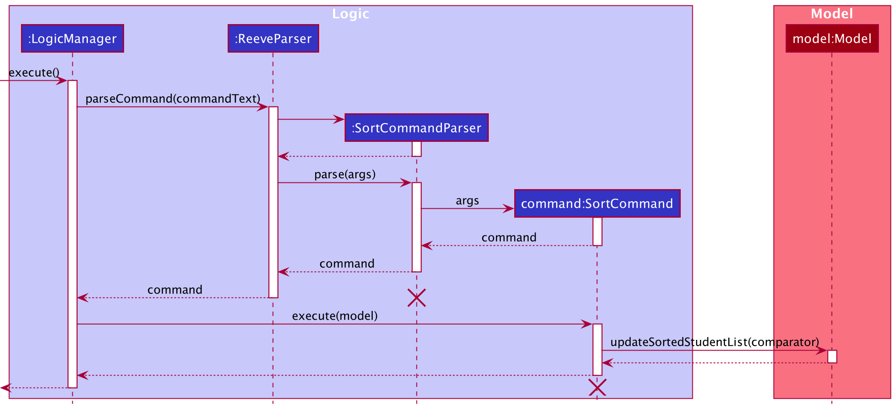
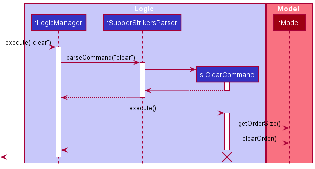

* Table of Contents
{:toc}

--------------------------------------------------------------------------------------------------------------------

## **Setting up, getting started**

Refer to the guide [_Setting up and getting started_](SettingUp.md).

--------------------------------------------------------------------------------------------------------------------

## **Design**

### Architecture

The ***Architecture Diagram*** given above explains the high-level design of the App. Given below is a quick overview of each component.

:bulb: **Tip:** The `.puml` files used to create diagrams in this document can be found in the [diagrams](https://github.com/AY2021S1-CS2103-T16-1/tp/tree/master/docs/diagrams) folder. Refer to the [_PlantUML Tutorial_ at se-edu/guides](https://se-education.org/guides/tutorials/plantUml.html) to learn how to create and edit diagrams.

**`Main`** has two classes called [`Main`](https://github.com/AY2021S1-CS2103-T16-1/tp/blob/master/src/main/java/seedu/address/Main.java) and [`MainApp`](https://github.com/AY2021S1-CS2103-T16-1/tp/blob/master/src/main/java/seedu/address/MainApp.java). It is responsible for,
* At app launch: Initializes the components in the correct sequence, and connects them up with each other.
* At shut down: Shuts down the components and invokes cleanup methods where necessary.

[**`Commons`**](#common-classes) represents a collection of classes used by multiple other components.

The rest of the App consists of four components.

* [**`UI`**](#ui-component): The UI of the App.
* [**`Logic`**](#logic-component): The command executor.
* [**`Model`**](#model-component): Holds the data of the App in memory.
* [**`Storage`**](#storage-component): Reads data from, and writes data to, the hard disk.

Each of the four components,

* defines its *API* in an `interface` with the same name as the Component.
* exposes its functionality using a concrete `{Component Name}Manager` class (which implements the corresponding API `interface` mentioned in the previous point.

For example, the `Logic` component (see the class diagram given below) defines its API in the `Logic.java` interface and exposes its functionality using the `LogicManager.java` class which implements the `Logic` interface.

**How the architecture components interact with each other**

The *Sequence Diagram* below shows how the components interact with each other for the scenario where the user issues the command `remove 1`.

The sections below give more details of each component.

### UI component

**API** :
[`Ui.java`](https://github.com/AY2021S1-CS2103-T16-1/tp/blob/master/src/main/java/seedu/address/ui/Ui.java)

The UI consists of a `MainWindow` that is made up of parts e.g.`CommandBox`, `ResultDisplay`, `FoodListPanel`,  `OrderListPanel`,  `VendorListPanel` `StatusBarFooter` etc. All these, including the `MainWindow`, inherit from the abstract `UiPart` class.

The `UI` component uses JavaFx UI framework. The layout of these UI parts are defined in matching `.fxml` files that are in the `src/main/resources/view` folder. For example, the layout of the [`MainWindow`](https://github.com/AY2021S1-CS2103-T16-1/tp/blob/master/src/main/java/seedu/address/ui/MainWindow.java) is specified in [`MainWindow.fxml`](https://github.com/AY2021S1-CS2103-T16-1/tp/blob/master/src/main/resources/view/MainWindow.fxml)

The `UI` component,

* Executes user commands using the `Logic` component.
* Listens for changes to `Model` data so that the UI can be updated with the modified data.

The `UI` component has two modes, the Vendor mode and the Menu mode. 

- If `Model#getVendorIndex()`  is -1 (default value), the `UI` will be in Vendor mode, otherwise, the `UI` will be in Menu mode.
- The mode can be updated using `MainWindow#updateMode()`.
- In Vendor mode, the `VendorListPanel` will be displayed to the user and the `FoodListPanel` will be hidden.
- In Menu mode, the `FoodListPanel` will be displayed to the user and the `VendorListPanel` will be hidden.

### Logic component

**API** :
[`Logic.java`](https://github.com/AY2021S1-CS2103-T16-1/tp/blob/master/src/main/java/seedu/address/logic/Logic.java)

1. `Logic` uses the `SupperStrikersParser` class to parse the user command.
1. This results in a `Command` object which is executed by the `LogicManager`.
1. The command execution can affect the `Model` (e.g. adding an order item).
1. The command execution can affect the `Storage` (e.g saving a preset).
1. The result of the command execution is encapsulated as a `CommandResult` object which is passed back to the `Ui`.
1. In addition, the `CommandResult` object can also instruct the `UI` to perform certain actions, such as displaying help to the user.
1. The `CommandResult` object can also instruct the `UI` to re-render the menu when some commands such as `SortCommand` and `FindCommand`.

Given below is the Sequence Diagram for interactions within the `Logic` component for the `execute("remove 1")` API call.

:information_source: **Note:** The lifeline for `RemoveCommandParser` should end at the destroy marker (X) but due to a limitation of PlantUML, the lifeline reaches the end of diagram.

### Model component

**API** : [`Model.java`](https://github.com/AY2021S1-CS2103-T16-1/tp/blob/master/src/main/java/seedu/address/model/Model.java)

The `Model`,

* stores a `UserPref` object that represents the user’s preferences.
* contains the `VendorManager` and `MenuManager`, `OrderManager` components.
    * `VendorManager` stores the data for vendors.
    * `MenuManager` stores the data for food items of the vendor's menu.
    * `OrderManager` stores the data for order items.

* Each of these components exposes an unmodifiable `ObservableList` that can be 'observed' e.g. the UI can be bound to this list so that the UI automatically updates when the data in the list change.
* does not depend on any of the other three components.

:information_source: **Note:** An alternative (arguably, a more OOP) model is given below. It has a `Tag` list in the `AddressBook`, which `Person` references. This allows `AddressBook` to only require one `Tag` object per unique `Tag`, instead of each `Person` needing their own `Tag` object. 

### Storage component

**API** : [`Storage.java`](https://github.com/AY2021S1-CS2103-T16-1/tp/blob/master/src/main/java/seedu/address/storage/Storage.java)

The `Storage` component,
* can save `UserPref` objects in json format and read it back.
* can save the vendor book data in json format and read it back.
* can save the `Preset` objects in json format and read it back.
* can save the `Profile` object in json format and read it back.

### Common classes

Classes used by multiple components are in the `seedu.addressbook.commons` package.

--------------------------------------------------------------------------------------------------------------------

## **Implementation**

This section describes some noteworthy details on how certain features are implemented.

### Menu Commands

Menu commands represent the operations with which the users can interact with the menu.

#### Find Command

- The Find Command allows the user to find items in the menu of their selected vendor `Model#updateFilteredMenuItemList()`.
- If a vendor has not been selected, a `CommandException will be thrown`.

The following diagram summarises the sequence when the MenuCommand is executed.

Given below is an example usage scenario and how the FindCommand behaves at each step.

Step 1: The user has selected a vendor with vendor i.

Step 2: The user enters the command `find Milo` which finds and displays all the items in the selected menu with Milo in their names.

Step 3: `Model#updateFilteredMenuItemList()` is executed to filter the current menu to only contain items that have the string "Milo" in their names.

#### Menu Command

- The Menu Command allows the user to view the default menu of their selected vendor `Model#showDefaultMenu`.
- If a vendor has not been selected, a `CommandException will be thrown`.

The following diagram summarises the sequence when the MenuCommand is executed.

Given below is an example usage scenario and how the FindCommand behaves at each step.

Step 1: The user has selected a vendor with vendor i.

Step 2: The user enters the command `find Milo` which finds and displays all the items in the selected menu with Milo in their names.

Step 3: The user enters the command `menu` to display the selected menu with all the items.

Step 4: `Model#showDefaultMenu()` is executed to retrieve and display the selected menu. 

#### Sort Command

- The Sort Command allows the user to sort the selected menu based on price or name in ascending or descending order.
- If a vendor has not been selected, a `CommandException will be thrown`.
- If the parameters inputted are invalid, a `ParseException will be thrown`.

The following diagram summarizes the sequence when the Sort Command is executed.

Given below is an example usage scenario and how the SortCommand behaves at each step.

Step 1: The user has selected a vendor with vendor i.

Step 2: The user enters the command `sort n a` which sorts the menu in ascending alphabetical order based on their names.

Step 3: SortCommand checks whether the parameters - ascending and name, inputted are valid. The parameters are valid.

Step 4: `Model#sortMenuItemBy()` is executed to sort the currently displayed menu in alphabetical ascending order of the menu item names.

### Order Commands

Order commands represents the operations to which users interact with.

#### Add Command

- The Add Command allows the user to add an order item from the selected menu `Model#getFilteredMenuItemList()`.
- If the index provided is greater than the size of the menu or less than equals to zero, a `CommandException will be thrown`.
- If the quantity provided is less than equals to zero, a `CommandException will be thrown`.
- If the resultant supper order's quantity added exceeds 100, a `CommandException will be thrown`.

The following diagram summarises the sequence when the AddCommand is executed.

Given below is an example usage scenario and how the AddCommand behaves at each step.

Step 1: The user launches the application for the first time, by default, no vendor is selected.

Step 2: The user selects a vendor with the VendorCommand `vendor i`, the corresponding menu will be loaded.

Step 3: The user enters the command `add 2 3` which adds item 2 from the menu with a quantity of 3.

Step 4: `Model#getFilteredMenuItemList()` is executed to retrieve the list of menu items from the current vendor.

Step 5: AddCommand checks whether the index and quantity inputted is valid. Index and Quantity is valid.

Step 6: An OrderItem object is created from the retrieved menu item and input quantity.

Step 7: `Model#addOrderItem()` is executed to add the OrderItem into the `Model`.

#### Remove Command

- The RemoveCommand allows the user to remove an order from his order list `Model#getObservableOrderItemList()`.
- If the index provided is greater than the size of his order list or less than or equal to zero, a `CommandException will be thrown`.
- If the quantity provided is less than equals to zero or greater than the current quantity, a `CommandException will be thrown`.

The following diagram summarises the sequence when the RemoveCommand is executed.

Given below is an example usage scenario and how the RemoveCommand behaves at each step.

Step 1: The user has selected a vendor with `vendor i`.

Step 2: The user has added items with `add i qty`.

Step 3: The user enters the command `remove 1 1` which removes 1 quantity of the item at the 1st index in the order.

Step 4: `Model#getObservableOrderItemList()` is executed to retrieve the list of OrderItems from the current order.

Step 5: RemoveCommand checks whether the index and quantity inputted is valid. Index and Quantity is valid.

Step 6: A new OrderItem object is created from the retrieved OrderItem and input quantity.

Step 7: `Model#removeOrderItem()` is executed to remove the related OrderItem.

#### Clear Command

- The ClearCommand allows the user to clear all orders in the current order.
- If the current Order has no items, a `CommandException will be thrown`.

The following diagram summarises the sequence when the ClearCommand is executed.

Given below is an example usage scenario and how the ClearCommand behaves at each step.

Step 1: The user has selected a vendor with `vendor i`.

Step 2: The user has added items with `add i qty`.

Step 3: The user enters the command `clear`.

Step 4: ClearCommand checks whether the order has OrderItems with `Model#getOrderSize()`. The order has OrderItems.

Step 5: `Model#clearOrder()` is executed to clear all OrderItems from the order.

#### Tag Command

 - The TagCommand allows the user to specify his preferences to an order item in the current order.
 - If the index provided is greater than the size of the user's order list or less than equals to zero, a `CommandException will be thrown`.
 - If the tag provided already exists, a `CommandException will be thrown`.

The following diagram summarizes the sequence when the TagCommand is executed. 

Given below is an example usage scenario and how the TagCommand behaves at each step.

Step 1: The user has selected a vendor with `vendor i`.

Step 2: The user has added items with `add i qty`.

Step 3: The user enters the command `tag 1 1 no ice` which adds the tag of "1 no ice" to the item at the first index in the order.

Step 4: `Model#getObservableOrderItemList()` is executed to retrieve the list of OrderItems from the current order.

Step 5: TagCommand checks whether the index and tag inputted is valid. Index and tag is valid.

Step 6: `Model#tagOrderItem()` is executed to tag the given OrderItem.

#### Untag Command

- The UntagCommand allows users to remove all tags from an order item in the current order.
- If the index provided is greater than the size of the user's order list or less than equals to zero, a `CommandException will be thrown`.

The following diagram summarizes the sequence when the TagCommand is executed. 

Given below is an example usage scenario and how the UnTagCommand behaves at each step.

Step 1: The user has selected a vendor with `vendor i`.

Step 2: The user has added items with `add i qty`.

Step 3: The user tagged the item at index 1 with `tag 1 all no ice`.

Step 4: The user enters the command `untag 1` to remove the tag of "all no ice" from the OrderItem at index 1.

Step 5: `Model#getObservableOrderItemList()` is executed to retrieve the list of OrderItems from the current order.

Step 6: UntagCommand checks whether the index inputted is valid. Index is valid.

Step 7: `Model#untagOrderItem()` is executed to remove all the tags that the given OrderItem has.

#### Preset Commands

- There are three types of preset commands, `preset save`, `preset load` `preset delete`.
- Preset save stores the current order in a file, with the given preset name under the specific vendor.
- Preset load retrieves the preset with the name provided from the user, and loads it into the current order.
- Preset delete deletes the preset with the name provided from the user.

- If the name given is invalid for preset commands, a `CommandException will be thrown`.
- If the name already exists for preset save, the previous file will be overwritten with the current one.
- Preset load retrieves the preset with the name provided from the file, and loads it into the current order.

The following sequence diagram summarises the sequence when the LoadPresetCommand is executed.

 

Given below is an example usage scenario and how the LoadPresetCommand behaves at each step.

Step 1: The user has selected a vendor with `vendor i`.

Step 2: The user enters the command `load preset sample` to load the preset named sample.

Step 3: `Storage#readPresetManager()` is executed to retrieve the list of all presets, `presets` from the json file.

Step 4: The preset with the name `sample` for vendor `i` exists and is valid.

Step 5: The preset is obtained and the ArrayList of `OrderItem` is obtained.

Step 6: `Model#setOrder()` is executed to set the current order to the obtained ArrayList of `OrderItem`.

Given below is the activity diagram for the LoadPresetCommand.

The following diagram sequence summarises the sequence when the SavePresetCommand is executed.

Given below is an example usage scenario and how the SavePresetCommand behaves at each step.

Step 1: The user has selected a vendor with `vendor i`.

Step 2: The user has added items with `add i qty`.

Step 3: The user enters the command `save preset sample` to save the preset as named sample.

Step 4: `Storage#readPresetManager()` is executed to retrieve the list of all presets, `presets` from the json file.

Step 5: The preset with the name `sample` for vendor `i` does not exist.

Step 6:  The current order item list, `orderItemList`, is retrieved by executing `Model#getObservableOrderItemList()`.

Step 7: `orderItemList` is converted to a preset named `sample`.

Step 7: `sample` is added to the vendor index `i` position of `allLists`.

Step 8: `Storage#savePresetManager()` is executed to save the modified `allLists` into the `presets` json file.

Given below is the activity diagram for SavePresetCommand.

### Undo feature

Changes made to the Order can be undone by using the `undo` command.

The OrderManager starts out with a Stack of Order `orderHistory` and a main Order `order`, which
represents the past versions of the order, and the most current order respectively. Any changes (ie. `add`, `remove`,
`clear` etc.) should be done to `order`. After the changes are done, the method `OrderManager#saveChanges()` should be
called, which saves a copy (see `Order#makeCopy()`) of `order` to the `orderHistory`. If the user requests an undo,
the head of `orderHistory` will be popped, and `order` is now a copy of the head of the popped stack.

`OrderManager#saveChanges()` works based on the assumption that the head of `orderHistory` is always equal to `order`.
If not and a change is made to the order followed by calling `OrderManager#saveChanges()`, then the `order` right before 
the change is not saved. Therefore, the method `orderHistory#clear()` should not be called unless the developer 
understands the effect of doing so. This also means if a method changes the order and it should be able to be undone, 
`saveChanges()` must be called at the end of the method.

_{more aspects and alternatives to be added}_

### Friendly Syntax

The friendly syntax allows users to type in just the prefix of a command to execute it.

The following diagram summarizes the sequence when the RemoveCommand is executed from the user input of `r 1`.

Given below is an example usage scenario and how the friendly syntax behaves at the parse stage.

Step 1: The user launches the application for the first time and enters the vendor command `vendor 1`.

Step 2: SupperStrikers loads the menu of the 1st vendor into the GUI.

Step 3: The user enters the add command `add 1 3` 

Step 4:  SupperStrikers adds 3 of the 1st item into the order.

Step 5: The user enters the command `r 1 1`.

Step 6: The `LogicManager#execute()` is executed to call the `SupperStrikersParser#parseCommand()` method.

Step 7: `SupperStrikersParser#parseCommand()` checks if the inputted command word is a prefix of one and only one of the valid commands by filtering the list of valid commands based on whether they start with the user inputted prefix. The `r` in this case maps to the `remove` keyword.

Step 8: The `RemoveCommand` is executed and one quantity of the first item in the order is removed.  

- If there is no command with the given prefix, an `ParseException` will be thrown.
- If the inputted prefix exists for more than 1 command, a `ParseException` will be thrown.
- If there is a command which is a prefix for another command, it can no longer be executed.

### Vendor Commands

- There are two VendorCommand classes in SupperStrikers.
- `SwitchVendorCommand` allows the user to select a vendor from the `VendorManager` to order from.
- `VendorCommand`, deselects the vendor to the default unintialized value.

- If the vendor does not exist, a `CommandException will be thrown`.
- If the vendor selected is different from the current vendor, the model will clear the current order.

#### Switch Vendor Command
The following activity diagram summarises the process when the SwitchVendorCommand is executed.

Given below is an example usage scenario and how the SwitchVendorCommand behaves at each step.

Step 1: The user launches the application for the first time, by default, no vendor is selected.

Step 2: The user enters the vendor command `vendor i`.

Step 3: `Model#getObservableVendorList()` is executed to retrieve the list of vendors.

Step 4: SwitchVendorCommand checks whether ith index is valid.

Step 5: If the ith index is valid, `Model#selectVendor(i)` is executed to select the vendor. 

Step 6: Supper Strikers loads the menu of the ith vendor into the UI by calling `MainWindow#handleVendor()`.

Step 7: The UI component showing the vendor list is hidden and the UI showing the menu is displayed to the user by calling
`MainWindow#displayMenu()`.

Step 8: `Model#resetOrder()` creates a new empty order for the ith vendor.

The following diagram summarises the sequence when the SwitchVendorCommmand is executed.

#### Vendor Command

Given below is an example usage scenario and how VendorCommand behaves at each step.

Step 1: The user has selected a vendor with index `i`.

Step 2: The user enters the vendor command `vendor`.

Step 3:  `Model#selectVendor(-1)` is executed to set the vendor to the default uninitialized value.

Step 4: The UI component showing the menu is hidden and the UI component showing the vendor list is displayed to the 
user by calling `MainWindow#displayMenu()`.

Step 5: `Model#resetOrder()` sets the order to a new empty order. 

--------------------------------------------------------------------------------------------------------------------

## **Documentation, logging, testing, configuration, dev-ops**

* [Documentation guide](Documentation.md)
* [Testing guide](Testing.md)
* [Logging guide](Logging.md)
* [Configuration guide](Configuration.md)
* [DevOps guide](DevOps.md)

--------------------------------------------------------------------------------------------------------------------

## **Appendix: Requirements**

### Product scope

**Target user profile**:

* has a need to order supper frequently
* stays on campus
* prefer desktop apps over other types
* can type fast
* prefers typing to mouse interactions
* is reasonably comfortable using CLI apps

**Value proposition**: manage ordering supper faster than a typical mouse/GUI driven app

### User stories

Priorities: High (must have) - `* * *`, Medium (nice to have) - `* *`, Low (unlikely to have) - `*`

| Priority | As a …​                                    | I want to …​                     | So that I can…​                                                        |
| -------- | ------------------------------------------ | ------------------------------ | ---------------------------------------------------------------------- |
| `* * *`  | new user                                   | see usage instructions         | refer to instructions when I forget how to use the App                 |
| `* * *`  | NUS resident                           | add a food item to my supper order |                                                                        |
| `* * *`  | NUS resident | remove a food item from my supper order |                                    |
| `* * *`  | NUS resident | see the menu | view all the items currently ordered by me |
| `* * *` | NUS resident | see the vendor list and select vendor | confirm which vendor to order from |
| `* * ` | NUS resident | see the total price of my current order | decide whether I want to order more |
| `*` | NUS resident | confirm order | finalize my supper selection |
| `* * *` | NUS resident | undo my commands | fix any mistakes made while ordering |
| `* * *` | NUS resident | submit my order |  |
| `* *` | NUS resident | clear the current order | start a new order |
| `* *` | NUS  resident | filter the menu | find the food item that I want to order easily |
| `* *` | NUS resident | save my current order as a preset | load up the preset for fast supper ordering |
| `* *` | NUS resident | tag an item in my supper order | mention my preferences for that item |
| `* *` | NUS resident | remove tags from an item in my supper order| fix any mistakes made while tagging that item |

*{More to be added}*

### Use cases

(For all use cases below, the **System** is the `SupperStrikers` and the **Actor** is the `user`, unless specified otherwise)

**Use case: Showing and selecting a particular vendor**

**MSS**

1. SupperStrikers displays the list of vendors.
2. User requests to choose a specified vendor.
3. SupperStrikers displays the menu of the selected vendor.
4. SupperStrikers creates a new empty order of the selected vendor.

  Use case ends.

**Extensions**

- 2a. The given index is invalid.

  - 2a1. SupperStrikers displays an error message.

    Use case resumes at step 2.
  
- 2b. The user has already selected a different vendor.
  
  - 2b1. SupperStrikers clears the order of the current vendor.
  
    Use case resumes at step 3.

**Use case: Showing list of all vendors**

Precondition: User has already selected a particular vendor 

**MSS**

1. SupperStrikers displays a specific vendor.
2. User requests to view all vendors.
3. SupperStrikers displays the details of all vendors.
4. SupperStrikers resets the current order to a new empty order.

  Use case ends.

**Use case: Display current menu**

Precondition: User has already selected a particular vendor 

**MSS**

1. User requests to see the current default menu for his selected vendor.
2. SupperStrikers displays the default menu to the user.

  Use case ends.

**Use case: Find a keyword**

Precondition: User has already selected a particular vendor 

**MSS**

1. User requests to search for specified keyword(s) in the menu.
2. SupperStrikers filter out the current menu using the specified keyword(s).
3. SupperStrikers displays the matching menu items that contains the keyword(s) to the user.

  Use case ends.

**Use case: Filter menu item by price**

Precondition: User has already selected a particular vendor 

**MSS**

1. User requests to see menu items that satisfy a specified price range.
2. SupperStrikers filter out the current menu using the specified price range.
3. SupperStrikers displays the matching menu items that satisfy the price range to the user.

  Use case ends.

**Use case: Sort menu items**

Precondition: User has already selected a particular vendor 

**MSS**

1. User requests to sort the menu items by price or name.
2. SupperStrikers sorts the current menu.

  Use case ends.

**Use case: Viewing total**

Precondition: User has already selected a particular vendor 

**MSS**

1. User requests to see the total price of the current order.
2. SupperStrikers displays the total price of the current order to the user.

  Use case ends.

**Extensions**

- 1a. The order list is empty.

  - 1a1. SupperStrikers displays an error message.
  
    Use case ends.

**Use case: Clearing current order**

Precondition: User has already selected a particular vendor 

**MSS**

1. User requests to clear the current order.
2. SupperStrikers clears the current order.
3. SupperStrikers creates a new empty order of the selected order.

  Use case ends.

**Extensions**

- 1a. The order list is empty.

  - 1a1. SupperStrikers displays an error message.
  
    Use case ends.

**Use case: Set a profile**

**MSS**

1. User requests to set his profile which includes his phone number and address.
2. SupperStrikers creates a new profile that has the user's inputted details.
3. SupperStrikers saves the created profile into storage.

  Use case ends.

**Extensions**

- 1a. The user's details are invalid.

  - 1a1. SupperStrikers displays an error message.
  
    Use case resumes at step 1.

- 3a. The user has an existing profile.

  - 3a1. SupperStrikers overwrite the existing profile with the newly created profile.
  
    Use case ends.

**Use case: Submit order**

Precondition: User has already selected a particular vendor and User has created a profile

**MSS**

1. User requests to submit the current order.
2. SupperStrikers displays a copy of the order in a submittable format to the user and at the same time copies that text
 to the user's clipboard.

  Use case ends.

**Extensions**

- 1a. The order list is empty.

  - 1a1. SupperStrikers displays an error message.
  
    Use case ends.

**Use case: Add an item**

Precondition: User has already selected a particular vendor 

**MSS**

1. User requests to add a specified quantity of an item listed in the vendor menu.
2. SupperStrikers adds the item along with the quantity specified into the current order.
3. SupperStrikers displays the updated order with the newly added item.

  Use case ends.

**Extensions**

- 1a. The given index is invalid.

  - 1a1. SupperStrikers shows an error message.

    Use case resumes at step 1.

- 1b. The given quantity is invalid.

  - 1b1. SupperStrikers shows an error message.

    Use case resumes at step 1.
  
- 1c. The quantity is not specified.

  - 1c1. SupperStrikers sets the quantity of the item to be added as 1.

    Use case resumes at step 2.

- 2a. The resultant quantity of the item exceeds 100.

  - 2a1. SupperStrikers shows an error message.
  
    Use case resumes at step 1.

**Use case: Remove an item**

Precondition: User has already selected a particular vendor 

**MSS**

1.  User requests to remove a quantity of a specific item in the current order.
2.  SupperStrikers decreases the quantity of the item by the quantity provided.

  Use case ends.

**Extensions**

- 1a. The given index is invalid.

  - 1a1. SupperStrikers shows an error message.

    Use case resumes at step 1.
    
- 1b. The given quantity is invalid.
  
  - 1b1. SupperStrikers shows an error message.

    Use case resumes at step 1.
     
- 1c. The given quantity is larger than the quantity to the order item.

  - 1c1. SupperStrikers shows an error message.

    Use case resumes at step 1.

- 1d. The quantity is not specified.

  - 1d1. SupperStrikers removes the order item at the specified index along with all of its quantity.

    Use case ends.

**Use case: Add a tag to an item**

Precondition: User has already selected a particular vendor 

**MSS**

1.  User requests to tag a specific item in the current order.
2.  SupperStrikers adds tag to the item.

  Use case ends.

**Extensions**

- 1a. The given index is invalid.

  - 1a1. SupperStrikers shows an error message.

    Use case resumes at step 1.
    
- 1b. The tag is not specified.

  - 1b1. SupperStrikers shows an error message.

    Use case resumes at step 1.

- 1c. The tag already exists at the specified order item.

  - 1c1. SupperStrikers shows an error message.

    Use case resumes at step 1.

**Use case: Remove tags from an item**

Precondition: User has already selected a particular vendor 

**MSS**

1.  User requests to remove all tags from a specific item in the current order.
2.  SupperStrikers removes all tags from the item.

  Use case ends.

**Extensions**

- 1a. The given index is invalid.

  - 1a1. SupperStrikers shows an error message.

    Use case resumes at step 1.
      

**Use case: Load a Preset**

Precondition: User has already selected a particular vendor 

**MSS**

1. User requests to load preset of a specific name.
2. SupperStrikers loads the saved presets from storage.
3. SupperStrikers finds the preset with the same name under the current vendor.
4. SupperStrikers loads the preset into the current order.

  Use case ends.

**Extensions**

- 1a. The name given is invalid.

  - 1a1. SupperStrikers shows an error message.

    Use case resumes at step 1.

- 1b. The name is not provided.

  - 1b1. SupperStrikers instead displays the name of all saved presets for the current vendor.
  
    Use case ends.

- 3a. There is no preset with the same name.

  - 3a1. SupperStrikers shows an error message.

    Use case resumes at step 1.

- 4a. The current order already contains order items.

  - 4a1. The current order is replaced by the preset.

    Use case ends.

**Use case: Save a Preset**

Precondition: User has already selected a particular vendor 

**MSS**

1. User requests to save preset with a specific name.
2. SupperStrikers loads the saved presets from storage.
3. SupperStrikers creates a new preset with the current order items.
4. SupperStrikers adds the new preset into the current list of saved presets for the current vendor.
5. SupperStrikers saves the modified presets into storage.

  Use case ends.

**Extensions**

- 1a. The name given is invalid.

  - 1a1. SupperStrikers shows an error message.

    Use case resumes at step 1.

- 1b. The name is not provided.

  - 1b1. SupperStrikers gives the preset a default name of 'MyPreset'.
  
    Use case resumes at step 2.

- 4a. The preset that is trying to be saved has an identical name to an existing saved preset.

  - 4a1. The preset that is trying to be saved replaces the old preset with the same name.

    Use case resumes at step 5.

**Use case: Delete a Preset**

Precondition: User has already selected a particular vendor 

**MSS**

1. User requests to delete a preset with a specific name.
2. SupperStrikers loads the saved presets from storage.
3. SupperStrikers removes the preset with the specified name from the list.
4. SupperStrikers saves the modified presets into storage.

  Use case ends.

**Extensions**

- 1a. The name given is invalid or is not provided.

  - 1a1. SupperStrikers shows an error message.

    Use case resumes at step 1.

- 2a. The specified name is not found in the list of saved presets.

  - 2a1. SupperStrikers shows an error message.

    Use case resumes at step 1.

**Use case: Undo changes to an order**

Precondition: User has already selected a particular vendor

**MSS**

1.  User requests to undo a change from his current order.
2.  SupperStrikers reverts his order back to an older history of his order.

  Use case ends.

**Extensions**

- 1a. The user is at the oldest history of his order.

  - 1a1. SupperStrikers shows an error message.

    Use case ends.

*{More to be added}*

### Non-Functional Requirements

1.  Should work on any _mainstream OS_ as long as it has Java `11` or above installed.
2.  Should be able to hold up to 1000 items without a noticeable sluggishness in performance for typical usage.
3.  A user with above average typing speed for regular English text (i.e. not code, not system admin commands) should be able to accomplish most of the tasks faster using commands than using the mouse.

*{More to be added}*

### Glossary

* **Mainstream OS**: Windows, Linux, Unix, OS-X

--------------------------------------------------------------------------------------------------------------------

## **Appendix: Instructions for manual testing**

Given below are instructions to test the app manually.

:information_source: **Note:** These instructions only provide a starting point for testers to work on;
testers are expected to do more *exploratory* testing.

### Launch and shutdown

1. Initial launch

   1. Download the jar file and copy into an empty folder

   2. Open a command window. Run the java -version command to ensure you are using Java 11. If not, please install Java 11 to ensure you are able to safely launch the jar file.

   3. Launch the jar file using the java -jar supperstrikers.jar command (do not use double-clicking). 
       Expected: Shows the GUI with a set of sample vendors. The window size may not be optimum.

1. Saving window preferences

   1. Resize the window to an optimum size. Move the window to a different location. Close the window.

   2. Re-launch the app by using the java -jar supperstrikers.jar command. 
       Expected: The most recent window size and location is retained.

2. _{ more test cases …​ }_

### Selecting a vendor

1. Selecting a vendor while all the vendors are being shown

   1. Prerequisites: List all vendors using the `vendor` command.

   2. Test case: `vendor 1` 
      Expected: First vendor is selected. The menu from the selected vendor is displayed.

   3. Test case: `vendor` 
      Expected: No vendor is selected. The list of vendors is displayed again.

   4. Test case: `vendor 0` 
      Expected: No vendor is selected. Error details shown in status message. Status bar remains the same.

   5. Other incorrect delete commands to try: `vendor x`, `...` (where x is larger than the list size) 
      Expected: Similar to previous.

2. _{ more test cases …​ }_

### Adding an item

1. Adding an item while an order is currently active

   1. Prerequisites: Has a vendor selected using the `vendor` command.

   2. Test case: `add 1 1` 
      Expected: 1 order of the first item from the menu is added into the order. Details of the added order item shown in the status message.

   3. Test case: `add 1 0` 
      Expected: No item is added. Error details shown in the status message.

   4. Test case: `add 0 1` 
      Expected: No item is added. Error details shown in the status message.

   5. Other incorrect add commands to try: `add`, `add -1 -1`, `add x y`, `...` (where x is larger than the menu size) 
      Expected: Similar to previous.

2. _{ more test cases …​ }_

### Removing an item

1. Removing an item while an order is currently active

   1. Prerequisites: Has a vendor selected using the `vendor` command. There is at least one item in the order.

   2. Test case: `remove 1` 
      Expected: All the quantity of the first item is removed from the order. Details of the removed order shown in the status message.

   3. Test case: `remove 1 1` 
      Expected: 1 order of the first item from the user's order is removed from the order. Details of the removed order shown in the status message.

   4. Test case: `remove 0` 
      Expected: No item is deleted. Error details shown in the status message.

   5. Test case: `remove 1 0` 
      Expected: No item is deleted. Error details shown in the status message.

   6. Other incorrect delete commands to try: `remove`, `remove -1 -1`,`remove x y`, `...` (where x is larger than the list size or y is larger than the user's order quantity amount) 
      Expected: Similar to previous.
2. _{ more test cases …​ }

### Saving data

1. Dealing with missing/corrupted data files

   1. Delete the data folder, preferences and config json file.
   
   2. Make sure you have the latest copy of the SupperStrikers.jar which can be obtained [here.](https://github.com/AY2021S1-CS2103-T16-1/tp/releases)
   
   3. Rerun the SupperStrikers.jar in an empty folder.

2. _{ more test cases …​ }_
