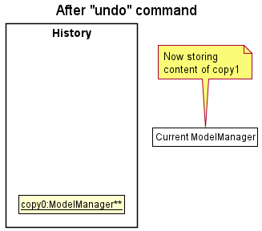

* Table of Contents
{:toc}

--------------------------------------------------------------------------------------------------------------------

## **Setting up, getting started**

Refer to the guide [_Setting up and getting started_](SettingUp.md).

--------------------------------------------------------------------------------------------------------------------

## **Design**

### Architecture

The ***Architecture Diagram*** given above explains the high-level design of the App. Given below is a quick overview of each component.

:bulb: **Tip:** The `.puml` files used to create diagrams in this document can be found in the [diagrams](https://github.com/se-edu/addressbook-level3/tree/master/docs/diagrams/) folder. Refer to the [_PlantUML Tutorial_ at se-edu/guides](https://se-education.org/guides/tutorials/plantUml.html) to learn how to create and edit diagrams.

**`Main`** has two classes called [`Main`](https://github.com/se-edu/addressbook-level3/tree/master/src/main/java/seedu/address/Main.java) and [`MainApp`](https://github.com/se-edu/addressbook-level3/tree/master/src/main/java/seedu/address/MainApp.java). It is responsible for,
* At app launch: Initializes the components in the correct sequence, and connects them up with each other.
* At shut down: Shuts down the components and invokes cleanup methods where necessary.

[**`Commons`**](#common-classes) represents a collection of classes used by multiple other components.

The rest of the App consists of four components.

* [**`UI`**](#ui-component): The UI of the App.
* [**`Logic`**](#logic-component): The command executor.
* [**`Model`**](#model-component): Holds the data of the App in memory.
* [**`Storage`**](#storage-component): Reads data from, and writes data to, the hard disk.

Each of the four components,

* defines its *API* in an `interface` with the same name as the Component.
* exposes its functionality using a concrete `{Component Name}Manager` class (which implements the corresponding API `interface` mentioned in the previous point.

For example, the `Logic` component (see the class diagram given below) defines its API in the `Logic.java` interface and exposes its functionality using the `LogicManager.java` class which implements the `Logic` interface.

**How the architecture components interact with each other**

The *Sequence Diagram* below shows how the components interact with each other for the scenario where the user issues the command `delete 1`.

The sections below give more details of each component.

### UI component

**API** :
[`Ui.java`](https://github.com/se-edu/addressbook-level3/tree/master/src/main/java/seedu/address/ui/Ui.java)

The UI consists of a `MainWindow` that is made up of parts e.g.`CommandBox`, `ResultDisplay`, `PersonListPanel`, `StatusBarFooter` etc. All these, including the `MainWindow`, inherit from the abstract `UiPart` class.

The `UI` component uses JavaFx UI framework. The layout of these UI parts are defined in matching `.fxml` files that are in the `src/main/resources/view` folder. For example, the layout of the [`MainWindow`](https://github.com/se-edu/addressbook-level3/tree/master/src/main/java/seedu/address/ui/MainWindow.java) is specified in [`MainWindow.fxml`](https://github.com/se-edu/addressbook-level3/tree/master/src/main/resources/view/MainWindow.fxml)

The `UI` component,

* Executes user commands using the `Logic` component.
* Listens for changes to `Model` data so that the UI can be updated with the modified data.

### Logic component

**API** :
[`Logic.java`](https://github.com/se-edu/addressbook-level3/tree/master/src/main/java/seedu/address/logic/Logic.java)

1. `Logic` uses the `AddressBookParser` class to parse the user command.
1. This results in a `Command` object which is executed by the `LogicManager`.
1. The command execution can affect the `Model` (e.g. adding a person).
1. The result of the command execution is encapsulated as a `CommandResult` object which is passed back to the `Ui`.
1. In addition, the `CommandResult` object can also instruct the `Ui` to perform certain actions, such as displaying help to the user.

Given below is the Sequence Diagram for interactions within the `Logic` component for the `execute("delete 1")` API call.

:information_source: **Note:** The lifeline for `DeleteCommandParser` should end at the destroy marker (X) but due to a limitation of PlantUML, the lifeline reaches the end of diagram.

### Model component

**API** : [`Model.java`](https://github.com/se-edu/addressbook-level3/tree/master/src/main/java/seedu/address/model/Model.java)

The `Model`,

* stores a `UserPref` object that represents the user’s preferences.
* stores the address book data.
* exposes an unmodifiable `ObservableList<Person>` that can be 'observed' e.g. the UI can be bound to this list so that the UI automatically updates when the data in the list change.
* does not depend on any of the other three components.

:information_source: **Note:** An alternative (arguably, a more OOP) model is given below. It has a `Tag` list in the `AddressBook`, which `Person` references. This allows `AddressBook` to only require one `Tag` object per unique `Tag`, instead of each `Person` needing their own `Tag` object. 

### Storage component

**API** : [`Storage.java`](https://github.com/se-edu/addressbook-level3/tree/master/src/main/java/seedu/address/storage/Storage.java)

The `Storage` component,
* can save `UserPref` objects in json format and read it back.
* can save the address book data in json format and read it back.

### Common classes

Classes used by multiple components are in the `seedu.addressbook.commons` package.

--------------------------------------------------------------------------------------------------------------------

## **Implementation**

This section describes some noteworthy details on how certain features are implemented.

### Undo feature (by Zhi Yuan)

#### Implementation

The undo feature is facilitated by a stack data structure.

The `HistoryStack` class wraps a stack designed to hold 'ReadOnlyZooKeepBook' objects.

The Singleton Pattern is employed here since only one history instance should exist in the running of the application.

`HistoryStack` supports the following key features:

* `HistoryStack#addToHistory(ReadOnlyZooKeepBook)` - Adds the given state of the book into history only if it differs from the most recent state.
* `HistoryStack#removeRecentHistory()` - Removes the most recent state of the book from the history.
* `HistoryStack#viewRecentHistory()` - Returns the most recent state of the book.
* `HistoryStack#clearHistory()` - Clears the history.

The undo feature also depends on the following existing methods:
* `Model#setZooKeepBook(ReadOnlyZooKeepBook)` - Replaces the current model's book data with the given.
* `Model#getZooKeepBook()` - Returns the model's current book.

The following classes reference the above methods:
* `UndoCommand`
* `LogicManager`

Given below is an example usage scenario and how the undo mechanism behaves at each step.

Step 1. The user launches the application for the first time. The `HistoryStack` will be initialized with a single state, which is the current state.

Step 2. The user executes `delete 1` command to delete the animal with ID 1. `LogicManager` calls `Model#getZooKeepBook()` to retrieve the new state of the book, and adds it to the history with `HistoryStack#addToHistory(ReadOnlyZooKeepBook)`.

Step 3. The user executes `help` to view the help screen. `LogicManager` behaves as per Step 2. However, since no changes were made to the state, the current state is not added to `HistoryStack`.

:information_source: **Note:** If a command fails its execution, it will not call `HistoryStack#addToHistory()`, so the state will not be saved into the `HistoryStack`.

Step 4. The user now decides that deleting the person was a mistake, and decides to undo that action by executing the `undo` command. The `undo` command will call `HistoryStack#removeRecentHistory()` which deletes the current state, and exposes the previous state. `HistoryStack#viewRecentHistory()` is then called to retrieve the previous state, then loaded into the model using `Model#setZooKeepBook(ReadOnlyZooKeepBook)`.

:information_source: **Note:** If the `HistoryStack` only contains a single state, then there is no previous state to restore. The `undo` command uses `HistoryStack#getSize()` to check if this is the case. If so, it will return an error to the user rather
than attempting to perform the undo.

The following sequence diagram shows how the undo operation works:

:information_source: **Note:** The lifeline for `UndoCommand` should end at the destroy marker (X) but due to a limitation of PlantUML, the lifeline reaches the end of diagram.

The following 2 activity diagrams summarize what happens when a user executes a new command and when a user executes the undo command:

New command | Undo command
:-------------------------:|:-------------------------:
 | 

#### Design consideration:

##### Aspect: How undo executes

* **Alternative 1 (current choice):** Saves the entire ZooKeep book as a state.
  * Pros: Easy to implement, works with all commands immediately.
  * Cons: May have performance issues in terms of memory usage as product scales.

* **Alternative 2:** Individual command knows how to undo by
  itself.
  * Pros: Will use less memory (e.g. for `delete`, just save the person being deleted).
  * Cons: We must ensure that the implementation of each individual command are correct.

### Snapshot feature (by Aizat)

#### Implementation

The snapshot feature is implemented by the `SnapCommand` and `SnapCommandParser` classes. `SnapCommandParser`
parses the user's input as a file name and then creates a `SnapCommand` object with the file name as a parameter.

`SnapCommand` executes by copying the current state of the zookeep book and then utilising
`StorageManager`'s save method to save the zookeep book with the specified file name.

#### Design considerations:

* We chose to prevent users from creating a snapshot if the specified file name already exists
as overwriting a file is irreversible and would be disastrous for zookeepers if done unintentionally

--------------------------------------------------------------------------------------------------------------------

## **Documentation, logging, testing, configuration, dev-ops**

* [Documentation guide](Documentation.md)
* [Testing guide](Testing.md)
* [Logging guide](Logging.md)
* [Configuration guide](Configuration.md)
* [DevOps guide](DevOps.md)

--------------------------------------------------------------------------------------------------------------------

## **Appendix: Requirements**

### Product scope

**Target user profile**:

* has a need to manage a significant number of animals
* prefer desktop apps over other types
* can type fast
* prefers typing to mouse interactions
* is reasonably comfortable using CLI apps

**Value proposition**: 
*  Zookeepers have to account for a large number of animals and their statuses (health, feeding times etc).

*   It is easy to lose track without a structured database.

*   We have thus decided to morph the app into a tracker for an individual zookeeper.

*   Easier to transfer a large amount of animal information when zookeepers change shifts.
* Manage animals faster than a typical mouse/GUI driven app.

### User stories

Priorities: High (must have) - `* * *`, Medium (nice to have) - `* *`, Low (unlikely to have) - `*`

| Priority | As a …​                                    | I want to …​                     | So that I can…​                                                        |
| -------- | ------------------------------------------ | ------------------------------ | ---------------------------------------------------------------------- |
| `* * *`  | new zookeeper                                   | see usage instructions         | refer to instructions when I forget how to use the App                 |
| `* * *`  | zookeeper                                       | add an animal entry               | keep track of a new animal under my care                                                                        |
| `* * *`  | zookeeper                                       | delete an animal entry                | remove animals from my care                                   |
| `* * *`  | zookeeper                                       | retrieve the information of all the animals          | have a look at which animals are under my duty |
| `* * *`  | zookeeper                                       | load a save file          | keep track of all the animals I have added |
| `* * *`  | zookeeper                                       | save all the information when I need to          |  |
| `* * *`  | zookeeper                                       | exit the program after I have finished using it        |  |
| `* *`    | zookeeper                                       | search for a specific animal   | filter through the large number of animals without viewing the entire list                |
| `* *`    | zookeeper                                       | quickly edit the data of certain animals   | avoid deleting and adding the animal to do so              |
| `*`      | zookeeper with many animals in the address book | sort animals by name and type           | locate a specific animal easily                                                 |
| `*`      | experienced user | use shortcut commands to carry out tasks           | save time without needing to type the full length commands                                                 |

*{More to be added}*

### Use cases

(For all use cases below, the **System** is the `AnimalBook` and the **Actor** is the `user`, unless specified otherwise)

**Use case: Add an animal**

**MSS**

1. User specifies the add command with name, species and ID of animal

2. AnimalBook adds the animal

3. AnimalBook refreshes to show the updated list

   Use case ends

**Extensions**

* 1a. The command is incorrectly formatted

  AnimalBook shows an error message

  Use case resumes at step 1

* 2a. The given ID is already taken

  AnimalBook shows an error message

  Use case resumes at step 1

**Use case: Delete an animal**

**MSS**

1. User specifies the delete command with ID of animal

2. AnimalBook deletes the animal

3. AnimalBook refreshes to show the updated list

   Use case ends

**Extensions**

* 1a. The command is incorrectly formatted

  AnimalBook shows an error message

  Use case resumes at step 1

* 2a. The given ID does not exist

  AnimalBook shows an error message

  Use case resumes at step 1

**Use case: List all animals**

**MSS**

1. User specifies the list command

2. AnimalBook displays list of all existing animals

   Use case ends

**Use case: Exit program**

**MSS**

1. User specifies the exit command

2. AnimalBook quits

   Use case ends

**Use case: View available commands**

**MSS**

1. User specifies the help command

2. AnimalBook displays list of all available commands

   Use case ends

### Non-Functional Requirements

1.  Should work on any _mainstream OS_ as long as it has Java `11` or above installed.
2.  Should be able to hold up to 1000 animals without a noticeable sluggishness in performance for typical usage.
3.  A user with above average typing speed for regular English text (i.e. not code, not system admin commands) should be able to accomplish most of the tasks faster using commands than using the mouse.
4.  The system should work on both 32-bit and 64-bit environments.
5.  The system is expected to show **data persistence**.
6.  The system should allow different users to access the same data to allow ease of transfer during shift changes.
7.  The system should have clear, complete and comprehensive documentation of all available commands and/or features by the end of the project.
8.  The system should be extensible such that new commands or features can be easily added to it if needed.
9.  The system should adopt a proper security system to prevent outsiders from accessing sensitive information.
10. The system should respond to user requests (e.g. load data, add new animals) within 2 seconds, unless an error occurs.
11. The system should be intuitive enough such that new staff are able to adapt quickly and use the app smoothly within a short time frame.
12. The system should be user-friendly and implement helpful features to assist forgetful or careless users, such as daily reminders and warnings.
13. The system should be backward compatible with data produced by its earlier versions.
14. The system should be flexible and allow its users some degree of freedom and customisation, such as personalisation of commands and animal display UI.
15. The project is expected to adhere to the schedule of the CS2103/CS2103T tP timeline which requires weekly deliverables and increments.
16. The project is not required to sort and arrange tasks among all staff or ensure efficient task allocation and completion.

### Glossary

* **Mainstream OS**: Windows, Linux, Unix, OS-X
* **Data persistence**: data provided by the user can be saved and updated to the hard drive, and can also be loaded once system is booted up again

*{More to be added, if necessary}*

--------------------------------------------------------------------------------------------------------------------

## **Appendix: Instructions for manual testing**

Given below are instructions to test the app manually.

:information_source: **Note:** These instructions only provide a starting point for testers to work on;
testers are expected to do more *exploratory* testing.

### Launch and shutdown

1. Initial launch

   1. Download the jar file and copy into an empty folder

   1. Double-click the jar file Expected: Shows the GUI with a set of sample contacts. The window size may not be optimum.

1. Saving window preferences

   1. Resize the window to an optimum size. Move the window to a different location. Close the window.

   1. Re-launch the app by double-clicking the jar file. 
       Expected: The most recent window size and location is retained.

1. _{ more test cases …​ }_

### Deleting a person

1. Deleting a person while all persons are being shown

   1. Prerequisites: List all persons using the `list` command. Multiple persons in the list.

   1. Test case: `delete 1` 
      Expected: First contact is deleted from the list. Details of the deleted contact shown in the status message. Timestamp in the status bar is updated.

   1. Test case: `delete 0` 
      Expected: No person is deleted. Error details shown in the status message. Status bar remains the same.

   1. Other incorrect delete commands to try: `delete`, `delete x`, `...` (where x is larger than the list size) 
      Expected: Similar to previous.

1. _{ more test cases …​ }_

### Saving data

1. Dealing with missing/corrupted data files

   1. _{explain how to simulate a missing/corrupted file, and the expected behavior}_

1. _{ more test cases …​ }_
