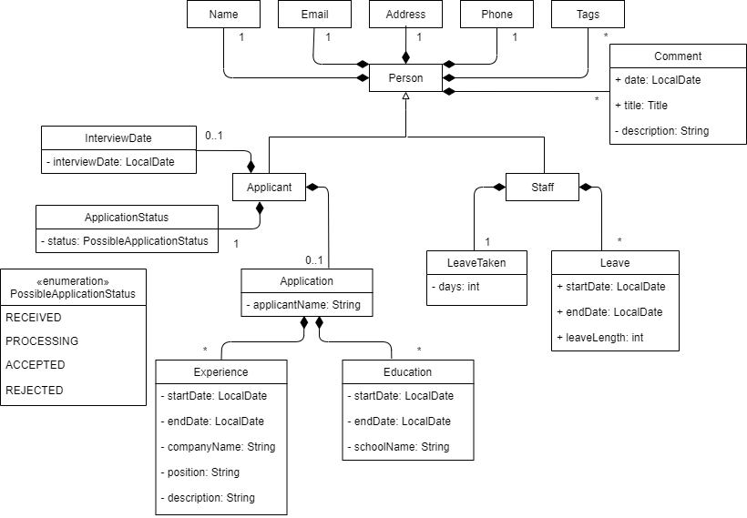

* Table of Contents
{:toc}

--------------------------------------------------------------------------------------------------------------------

## **1. Setting up, getting started**

Refer to the guide [_Setting up and getting started_](SettingUp.md).

--------------------------------------------------------------------------------------------------------------------

## **2. Design**

:bulb: **Tip:** The `.puml` files used to create diagrams in this document can be found in the [diagrams](https://github.com/AY2021S1-CS2103T-W13-1/tp/tree/master/docs/diagrams/) folder. Refer to the [_PlantUML Tutorial_ at se-edu/guides](https://se-education.org/guides/tutorials/plantUml.html) to learn how to create and edit diagrams.  
Some diagrams were made using microsoft powerpoint. The .pptx files can also be found in the [powerpoint](https://github.com/AY2021S1-CS2103T-W13-1/tp/tree/master/docs/powerpoint) folder.

### 2.1 Architecture

The ***Architecture Diagram*** given above explains the high-level design of the App. 
Given below is a quick overview of each component.

**`Main`** has two classes called [`Main`](https://github.com/AY2021S1-CS2103T-W13-1/tp/tree/master/src/main/java/com/eva/Main.java) and [`MainApp`](https://github.com/AY2021S1-CS2103T-W13-1/tp/tree/master/src/main/java/com/eva/MainApp.java). It is responsible for,
* At app launch: Initializes the components in the correct sequence, and connects them up with each other.
* At shut down: Shuts down the components and invokes cleanup methods where necessary.

[**`Commons`**](#common-classes) represents a collection of classes used by multiple other components.

The rest of the App consists of four main components.

* [**`UI`**](#ui-component): The UI of the App.
* [**`Logic`**](#logic-component): The command parser and executor.
* [**`Model`**](#model-component): Holds the data of the App in memory.
* [**`Storage`**](#storage-component): Reads data from, and writes data to, the hard disk.

Each of the four components,

* defines its *API* in an `interface` with the same name as the Component.
* exposes its functionality using a concrete `{Component Name}Manager` class (which implements the corresponding API `interface` mentioned in the previous point.

For example, the `Logic` component (see the class diagram given below) defines its API in the `Logic.java` interface and exposes its functionality using the `LogicManager.java` class which implements the `Logic` interface.

**How the architecture components interact with each other**

The *Sequence Diagram* below shows how the components interact with each other for the scenario where the user issues the command `dels 1`.

The sections below give more details of each component.

### 2.1.1 UI component

**API** :
[`Ui.java`](https://github.com/AY2021S1-CS2103T-W13-1/tp/tree/master/src/main/java/com/eva/ui/Ui.java)

The UI consists of a `MainWindow` that is made up of parts e.g.`CurrentPanelHeader`, `ResultDisplay`, `CommandBox`, `HelpWindow`, and the various `Panels`. All these, including the `MainWindow`, inherit from the abstract `UiPart` class.

There are four different possible `Panel` objects :
* `StaffListPanel` : this is where the user can view the list of staffs in the database
* `ApplicantListPanel` : this is where the user can view the list of applicants in the database
* `StaffProfilePanel` : this is where the user can view the profile of a staff in the database
* `ApplicantProfilePanel` : this is where the user can view the profile of an applicant in the database

The `UI` component uses JavaFx UI framework. The layout of these UI parts are defined in matching `.fxml` files that are in the `src/main/resources/view` folder. For example, the layout of the [`MainWindow`](https://github.com/AY2021S1-CS2103T-W13-1/tp/tree/master/src/main/java/com/eva/ui/MainWindow.java) is specified in [`MainWindow.fxml`](https://github.com/AY2021S1-CS2103T-W13-1/tp/tree/master/src/main/resources/view/MainWindow.fxml)

The `UI` component,

* Executes user commands using the `Logic` component.
* Listens for changes to `Model` data so that the UI can be updated with the modified data.
* Updates `GUISettings` so that lst viewed List Panel can be stored in `preferences.json`, an auto generated and updated file.

### 2.1.2 Logic component

**API** :
[`Logic.java`](https://github.com/AY2021S1-CS2103T-W13-1/tp/tree/master/src/main/java/com/eva/logic/Logic.java)

1. `Logic` uses the `EvaParser` class to parse the user command.
1. This results in a `Command` object which is executed by the `LogicManager`.
1. The command execution can affect the `Model` (e.g. adding a staff).
1. The result of the command execution is encapsulated as a `CommandResult` object which is passed back to the `Ui`.
1. In addition, the `CommandResult` object can also instruct the `Ui` to perform certain actions, such as displaying help to the user.

Given below is the Sequence Diagram for interactions within the `Logic` component for the `execute("dels 1")` API call.

:information_source: **Note:** The lifeline for `DeleteStaffCommandParser` should end at the destroy marker (X) but due to a limitation of PlantUML, the lifeline reaches the end of diagram.

### 2.1.3 Model component

**API** : [`Model.java`](https://github.com/AY2021S1-CS2103T-W13-1/tp/tree/master/src/main/java/com/eva/model/Model.java)

The `Model`,

* stores a `UserPref` object that represents the user’s preferences.
* stores the staff and applicant data.
* exposes an unmodifiable `ObservableList<Staff>` and an `ObservableList<Applicant>` that can be 'observed' e.g. the UI can be bound to this list so that the UI automatically updates when the data in the list change.
* exposes an unmodifiable `CurrentViewStaff` and `CurrentViewApplicant` that can be 'observed' e.g the UI can be bound to object so that the UI automatically updates when the staff/applicant or it's attributes changes.
* does not depend on any of the other five components.

:information_source: **Note:** An alternative (arguably, a more OOP) model is given below. It has a `Tag` list in the `EvaStorage`, which `Person` references. This allows `EvaStorage` to only require one `Tag` object per unique `Tag`, instead of each `Person` needing their own `Tag` object. 

### 2.1.4 Storage component

**API** : [`Storage.java`](https://github.com/AY2021S1-CS2103T-W13-1/tp/tree/master/src/main/java/com/eva/storage/Storage.java)

The `Storage` component,
* can save `UserPref` objects in json format and read it back.
* can save the Eva staff and applicant data in json format and read it back.

### 2.1.5 Common classes

Classes used by multiple components are in the `com.eva.commons` package.

--------------------------------------------------------------------------------------------------------------------

## **3. Implementation**

This section describes some noteworthy details on how certain features are implemented.

### 3.1 Overview of Staff and Applicants

The class diagram below shows how applicant and staff are related to each other and the various classes they are 
associated to. The following sections will elaborate more on the applicant and staff management systems.
 

 

### 3.2 Staff Management System

Each staff record has the details of name, phone, email, address, leaves, tags, comments. 
The details name, phone, email, address are mandatory.
A staff record also contains `Leave`. More about how this is implemented is elaborated [here](#311-leave-system).

#### 3.2.1 Leave System

The current leave recording system is facilitated by the `LogicManager` and `ModelManager`. The `LogicManager` contains a `ModelManeger` which contains a filtered list of all staffs, `filteredStaffs`.

Given below is an example usage scenario and how the leave recording system behaves at each step.

Similar to what was mentioned in the [Logic Component](#212-logic-component), the commands related to the leave system,
`addl` and `dell`, are also executed and handled in the same way.

Given below is the Sequence Diagram for interactions within the `Logic` component for the `execute("addl 1 l/d/10/10/2020")` API call.

#### 3.2.2 Design consideration:

##### Aspect: adding multiple leaves at once

* **Alternative 1 (current choice):** addl can add multiple leaves at once.
  * Pros: Makes it easier on the user to add leaves, not a drastic change from Alternative 2.
  * Cons: Makes the command syntax a little more complicated, makes the implementation more complicated.

* **Alternative 2:** addl should only allow the addition of one leave at once.
  * Pros: Easy to implement.
  * Cons: Less options for the user.
  
##### Aspect: deleting leaves

* **Alternative 1 (current choice):** The date the user inputs will delete the entire leave if it falls within the date range of a staff leave.
    * Pros: Standardises the behavior when deleting leaves.
    * Cons: Makes the user enter more commands to change leave information.

* **Alternative 2:** dell will take in a date range and delete all the leave dates between that. If a leave is partially within the range, it truncates the leave instead.
    * Pros: Easier to delete leaves.
    * Cons: May cause the unintentional deletion of leaves.

##### Aspect: leave taken

* **Alternative 1 (current choice):** Counts up from 0, records the total number of leaves taken.
    * Pros: Easy to implement.

* **Alternative 2:** Counts down from the default leave balance, records the number of leave days left.
    * Pros: Able to easily see how many days of leave each staff has left.
    * Cons: Harder to implement, needs to be paired with a command that sets the default leave.
  
### 3.3. Applicant Management System

Each applicant record has the details of name, phone, email, address, interview date, application status and application. 
The details name, phone, email, address are mandatory. 
 
The interview date is wrapped inside a Java
[`optional`](https://docs.oracle.com/en/java/javase/11/docs/api/java.base/java/util/Optional.html). 
We have designed it to be as such so that the user can input the interview date at a later time or leave that detail in all cases.
 
Application Status is a field that contains one of the `PossibleApplicationStatus` which is an enumeration of all possible application statuses namely,
receieved, processing, accepted, rejected.
 
An application also contains a `Application`. More about how this is implemented is elaborated below.

#### 3.3.1 Application Management System:

The application management system consists of the following:
   * Resume parser (found in `AddApplicationCommandParser`)
     * The parser scans a resume text file using a given filepath to detect a given name, as well as experience as education history.
     * Following which, the resume data will be stored as an application inside an applicant under Eva's database.
     * Should the user want to delete an application, the `delapp` command will replace the application with a blank one.
   * Sample resume generator (found in `ResumeTextFileGenerator`)
     * This generator creates a sample resume text file in the data/resume.txt, where the `data` folder is in the same directory as the JAR file.
     * The sample resume highlights the strict format that resume text files will have to follow.
     
### 3.2. Panels (List/Profile) display

Eva currently uses the panel state defined in [GUISettings](https://github.com/AY2021S1-CS2103T-W13-1/tp/blob/master/src/main/java/com/eva/commons/core/GuiSettings.java)
to know which panel state to display.

These are the four possible panel states and the commands that will cause eva to switch to them:
* `STAFF_LIST`: `list s-`, `adds`
* `STAFF_PROFILE`: `view` (on staff list)
* `APPLICANT_LIST`: `list a-`, `adda`
* `APPLICANT_PROFILE`: `view` (on applicant list)

As explained in the [Logic Component](#212-logic-component), these commands go through the `LogicManager` and `ModelManager`
to be parsed and executed. However, the CommandResult returned to `MainWindow.java` lets Eva know that the panel state has changed.

Given below is the Sequence Diagram for interactions within the `Logic` component for the `view 1` API call on a `staff list`.

Given below is the Sequence Diagram for interactions within the `Ui` component for the command `view 1` on a `staff list`.

#### 3.2.2 Design consideration:

##### Aspect: Having different panel states

* **Alternative 1 (current choice):** Separate all four panels
  * Pros: Gives users an individual page to view the information they want.
  * Cons: Complicated to implement.

* **Alternative 2:** Have all the information on one panel
  * Pros: Easy to implement.
  * Cons: Cluttered and unfocused view.

##### Aspect: Storing panel state in GUISettings

* **Alternative 1 (current choice):** saves the panel state in GUISettings.
  * Pros: Enables last viewed panel state to persist after app closure.
  * Cons: Complicated to implement

* **Alternative 2:** pass around an object containing the panel state.
  * Pros: Easy to implement.
  * Cons: Does not allow panel state to persist after app closure.

--------------------------------------------------------------------------------------------------------------------

## **4. Documentation, logging, testing, configuration, dev-ops**

* [Documentation guide](Documentation.md)
* [Testing guide](Testing.md)
* [Logging guide](Logging.md)
* [Configuration guide](Configuration.md)
* [DevOps guide](DevOps.md)

--------------------------------------------------------------------------------------------------------------------

## **5. Appendix: Requirements**

### 5.1 Product scope

**Target user profile**:

* works in small business/startup (5-30 headcount)
* can type fast
* prefers desktop apps over other types of apps
* prefers typing inputs compared to mouse interactions
* is reasonably comfortable using CLI apps

**Value proposition**: Simple and lightweight application that handles HR related administrative tasks, like manage staff performance and recruitment applicants, faster than a typical mouse/GUI driven app.

### 5.3 User stories

Priorities: High (must have) - `* * *`, Medium (nice to have) - `* *`, Low (unlikely to have) - `*`

| Priority | As a …​                                    | I want to …​                     | So that I can…​                                                        |
| -------- | ------------------------------------------ | ------------------------------   | ---------------------------------------------------------------------- |
| `* * *`  | first timer                                | be able to use software straight away without configuring complex settings | use the app with minimal prior training                             |
| `* * *`  | HR manager                                 | store information about all the staff in my company like their role, designation and their project team name, etc.| make more informed decisions   |
| `* * *`  | HR manager                                 | I want to have quick and easy access to all HR information| perform my tasks efficiently                                              |
| `* * *`  | HR manager                                 | I want to be able to record the leaves my staffs take | plan and keep an account of my staffs                                             |
| `* * *`  | organised HR manager                       | add and delete data of applicants           | have these data at one place in a neat manner                          |
| `* *`    | organised HR manager                       | add and delete delete data of staffs        | have these data at one place in a neat manner                          |
| `* *`    | busy HR staff with a lot of things to do   |  know my interview appointments with the applicants quickly| I will not forget any such appointments and attend necessary interviews |
| `* *`    | HR manager                                 | easily keep track of applicant’s application status |clear understanding of the recruitment process at any given point of time |
| `*`      | Programmer as a part-time HR manager       | automate Eva workflow            | simplify workflow as much as possible

### 5.3 Use cases

(For all use cases below, the **System** is the `Eva` and the **Actor** is the `user`, unless specified otherwise)
(Optional fields are given in square bracket e.g \[t/TAG\])

***Use case: UC01 - Adding a Record of staff***

**MSS**

1.  User types in `adds n/NAME p/PHONE_NUMBER e/EMAIL a/ADDRESS [t/TAG]…[c/COMMENTS]…`
2.  Eva adds in the staff record
3.  Eva displays the staff record added to User 
    Use case ends.

**Extensions**

* 1a. Eva detects missing fields

    * 1a1. Eva shows the correct format to key in data.
    * 1a2. Eva requests the user to add in data again.
    * 1a3  User enters new data.

    Steps 1a1-1a3 are repeated until the data entered are correct. 
    Use case resumes from step 2. 

* 1b. Eva detects invalid email, phone number or comment.

    * 1b1. Eva shows the valid format to key in the relevant field.
    * 1b2. Eva requests the user to add in data again.
    * 1b3. User enters new data.

    Steps 1b1-1b3 are repeated until the data entered are correct. 
    Use case resumes from step 2.

***Use case: UC02 - Deleting a Record of staff***

**MSS**

1. User types in `dels INDEX`. 
2. Eva deletes the staff record permanently.
3. Eva displays the confirmed message of deletion of that staff record.   
    Use case ends.

**Extensions**

* 1a. Eva does not find staff record with the keyed in index.

    * 1a1. Eva informs the user that there are no such records.
    * 1a2. Eva requests the user to type the command in again. 
    * 1a3  User types in `dels INDEX` with correct index of staff
    Steps 1a1-1a3 are repeated until the data entered are correct. 
    Use case resumes from step 2. 

* 1b. Eva does not detect any input for <index>.

    * 1b1. Eva requests the user to type the command in again. 
    * 1b2. User types in the new command `dels INDEX`.    
    Steps 1b1-1b3 are repeated until the data entered are correct. 
    Use case resumes from step 2.

***Use Case UC03 - Edit a Record of staff***

**MSS**

1. User navigates to staff list by command `list s-` or to staff profile while being on staff list via 'view INDEX'
2. Eva shows a list of staffs with indexes beside each staff
3. User types in `edits INDEX [n/NAME] [a/ADDRESS] [e/EMAIL] [p/PHONE] [c/COMMENT] [id/INTERVIEW_DATE]` to edit staff at `INDEX`
4. Eva updates the staff record according to input information.
5. Eva displays the confirmed message of editing of staff record.  
    Use case end.

**Extensions**

* 3a. Eva does not detect any input for index.

    * 3a1. Eva requests the user to type the command in again with an index.  
    * 3a2. User types in the new edit command.  
      
    Steps 3a1-3a2 are repeated until the data entered are correct. 
    Use case resumes from step 4.   
    
* 3b. Eva does not detect any fields in input.

    * 3b1. Eva requests the user to type the command in again with at least one field.  
    * 3b2. User types in the new edit command.    
    
    Steps 3b1-3b2 are repeated until the data entered are correct. 
    Use case resumes from step 4.  
    
* 3c. Eva detects that user is in a staff profile and input index does not match staff index.

    * 3c1. Eva requests the user to type the command in again with the index of the staff whose profile is being viewed.  
    * 3c2. User types in the new edit command.   
     
    Steps 3c1-3c2 are repeated until the data entered are correct. 
    Use case resumes from step 4.

***Use case: UC04 - Adding a Comment on staff***

**MSS**

1. User navigates to staff list by command `list s-` or to staff profile while being on staff list via `view INDEX`
2. Eva shows a list of staffs with indexes beside each staff
3. User types in `addc INDEX c/ ti/TITLE d/DATE desc/DESCRIPTION`. 
4. Eva adds the comment to staff record permanently.
5. Eva displays the confirmed message of addition of comment to that staff record.   
    Use case ends.

**Extensions**

* 3a. Eva does not find staff record with the keyed in index.

    * 3a1. Eva informs the user that there are no such records.
    * 3a2. Eva requests the user to type the command in again. 
    * 3a3  User types in `addc INDEX c/ ti/TITLE d/Date desc/DESCRIPTION` with correct index of staff
    
    Steps 3a1-3a3 are repeated until the data entered are correct. 
    Use case resumes from step 4. 

* 3b. Eva does not detect any input for index.

    * 3b1. Eva requests the user to type the command in again. 
    * 3b2. User types in the new command `addc INDEX c/ ti/TITLE d/Date desc/DESCRIPTION`.  
      
    Steps 3b1-3b3 are repeated until the data entered are correct. 
    Use case resumes from step 4. 
    
* 3c. Eva detects missing fields

    * 3c1. Eva shows the correct format to key in data.
    * 3c2. Eva requests the user to add in data again.
    * 3c3  User enters new data.

    Steps 3c1-3c3 are repeated until the data entered are correct. 
    Use case resumes from step 4. 
    
* 3d. Eva detects that user is in a staff profile and input index does not match staff index.

    * 3d1. Eva requests the user to type the command in again with the index of the staff whose profile is being viewed.  
    * 3d2. User types in the new add comment command.    
    
    Steps 3d1-3d2 are repeated until the data entered are correct. 
    Use case resumes from step 4.
        

***Use case: UC05 - Deleting a Comment on staff***

**MSS**

1. User navigates to staff list by command `list s-` or to staff profile while being on staff list via `view INDEX`
2. Eva shows a list of staffs with indexes beside each staff
3. User types in `delete INDEX c/ ti/TITLE_TO_DELETE`. 
4. Eva deletes the comment with entered `TITLE_TO_DELETE` from staff record permanently.
5. Eva displays the confirmed message of deletion of comment from staff record.   
    Use case ends.

**Extensions**

* 3a. Eva does not find staff record with the keyed in index.

    * 3a1. Eva informs the user that there are no such records.
    * 3a2. Eva requests the user to type the command in again. 
    * 3a3  User types in `delete INDEX c/ ti/TITLE_TO_DELETE` with correct index of staff
    
    Steps 3a1-3a3 are repeated until the data entered are correct. 
    Use case resumes from step 4. 

* 3b. Eva does not detect any input for index.

    * 3b1. Eva requests the user to type the command in again. 
    * 3b2. User types in the new command `delete INDEX c/ ti/TITLE_TO_DELETE`. 
       
    Steps 3b1-3b2 are repeated until the data entered are correct. 
    Use case resumes from step 4.     
    
* 3c. Eva detects missing fields

    * 3c1. Eva shows the correct format to key in data.
    * 3c2. Eva requests the user to add in data again.
    * 3c3  User enters new data.

    Steps 3c1-3c3 are repeated until the data entered are correct. 
    Use case resumes from step 4.     
    
* 3d. Eva detects that user is in a staff profile and input index does not match staff index.

    * 3d1. Eva requests the user to type the command in again with the index of the staff whose profile is being viewed.  
    * 3d2. User types in the new delete comment command.  
    
    Steps 3d1-3d2 are repeated until the data entered are correct. 
    Use case resumes from step 4.

***Use case: UC06 - Editing a Comment on staff***

**MSS**

1. User navigates to staff list by command `list s-` or to staff profile while being on staff list via `view INDEX`
2. Eva shows a list of staffs with indexes beside each staff
3. User types in `editc INDEX c/ ti/TITLE_OF_COMMENT_TO_CHANGE d/DATE_OF_COMMENT_TO_CHANGE desc/NEW_DESCRIPTION`. 
4. Eva edits the comment to staff record permanently.
5. Eva displays the confirmed message of edition of comment to that staff record.   
    Use case ends.

**Extensions**

* 3a. Eva does not find staff record with the keyed in index.

    * 3a1. Eva informs the user that there are no such records.
    * 3a2. Eva requests the user to type the command in again. 
    * 3a3  User types in `editc INDEX c/ ti/TITLE_OF_COMMENT_TO_CHANGE d/DATE_OF_COMMENT_TO_CHANGE desc/NEW_DESCRIPTION`
     with correct index of staff
     
    Steps 3a1-3a3 are repeated until the data entered are correct. 
    Use case resumes from step 4. 

* 3b. Eva does not detect any input for index.

    * 3b1. Eva requests the user to type the command in again. 
    * 3b2. User types in the new command `editc INDEX c/ ti/TITLE_OF_COMMENT_TO_CHANGE d/DATE_OF_COMMENT_TO_CHANGE desc/NEW_DESCRIPTION`.
        
    Steps 3b1-3b3 are repeated until the data entered are correct. 
    Use case resumes from step 4.     
    
* 3c. Eva detects missing fields

    * 3c1. Eva shows the correct format to key in data.
    * 3c2. Eva requests the user to add in data again.
    * 3c3  User enters new data.

    Steps 3c1-3c3 are repeated until the data entered are correct. 
    Use case resumes from step 4. 
    
* 3d. Eva detects that user is in a staff profile and input index does not match staff index.

    * 3d1. Eva requests the user to type the command in again with the index of the staff whose profile is being viewed.  
    * 3d2. User types in the new edit comment command.    
    
    Steps 3d1-3d2 are repeated until the data entered are correct. 
    Use case resumes from step 4.

***Use case: UC07 - Adding a leave record to staff***

**MSS**

1.  User types in `addl INDEX l/d/DATE [d/DATE]`
2.  Eva adds in the leave to staff record based on index
3.  Eva displays the updated staff to User
     
    Use case ends.

**Extensions**

* 1a. Eva detects missing fields or more fields than expected.

    * 1a1. Eva shows the correct format to key in data.
    * 1a2. Eva requests the user to add in data again.
    * 1a3  User enters new data.

    Steps 1a1-1a3 are repeated until the data entered are correct. 
    Use case resumes from step 2. 

* 1b. Eva detects invalid date.

    * 1b1. Eva shows the valid format to key in the relevant field.
    * 1b2. Eva requests the user to add in data again.
    * 1b3. User enters new data.

    Steps 1b1-1b3 are repeated until the data entered are correct. 
    Use case resumes from step 2. 
    
* 1c. Eva detects conflict in leave dates within the specified staff record.

    * 1a1. Eva informs the user that there are conflicting records.
    * 1a2. Eva requests the user to type the command in again. 
    * 1a3  User types in a new leave date.
    Steps 1a1-1a3 are repeated until the data entered are correct. 
    Use case resumes from step 2.

***Use case: UC08 - Deleting a leave record from staff***

**MSS**

1.  User types in `dell INDEX d/DATE`
2.  Eva deletes the leave containing specified date from index specified staff record
3.  Eva displays the updated staff to User
 
    Use case ends.

**Extensions**

* 1a. Eva detects missing fields or more fields than expected.

    * 1a1. Eva shows the correct format to key in command.
    * 1a2. Eva requests the user to add in data again.
    * 1a3  User enters new data.

    Steps 1a1-1a3 are repeated until the data entered are correct. 
    Use case resumes from step 2.  

* 1b. Eva detects invalid date.

    * 1b1. Eva shows the valid format to key in the relevant field.
    * 1b2. Eva requests the user to add in command again.
    * 1b3. User enters new command.

    Steps 1b1-1b3 are repeated until the command entered is correct.  
    Use case resumes from step 2. 
    
* 1c. Eva detects no leave in index specified staff record containing specified date.

    * 1a1. Eva informs the user that there are no exiting leave records containing specified date.
    * 1a2. Eva requests the user to type the command in again. 
    * 1a3  User types in a new leave date.
    Steps 1a1-1a3 are repeated until the data entered are correct. 
    Use case resumes from step 2. 

***Use case: UC09 - Adding a record of applicant***

**MSS**

1.  User types in `addapplicant n/<applicant_name> e/<email> p/<phoneno> a/<address> id/22/11/2020` 
2.  Eva adds in the applicant record
3.  Eva displays the applicant record added to User.
     
Use case ends.

**Extensions**

* 1a. Eva detects missing compulsory fields (name, email, address, phone)

    * 1a1. Eva shows the correct format to key in data.
    * 1a2. Eva requests the user to add in data again.
    * 1a3  User enters new data.

    Steps 1a1-1a3 are repeated until the data entered are correct.
    Use case resumes from step 2.
 

* 1b. Eva detects invalid email, phone number or interview date.

    * 1b1. Eva shows the valid format to key in the relevant field.
    * 1b2. Eva requests the user to add in data again.
    * 1b3. User enters new data.  
    Steps 1b1-1b3 are repeated until the data entered are correct.  
    Use case resumes from step 2.
    
***Use case: UC10 - Deleting a Record of Applicant***

**MSS**

1. User navigates to applicant list by command 'list -applicants'.
2. Eva shows a list of applicants with indexes beside each applicant. 
3. User types in `delapplicant INDEX`.
4. Eva deletes the applicant record and all related information permanently.
5. Eva displays the confirmed message of deletion of that applicant record.  
 
    Use case ends.

**Extensions**

* 2a. Eva does not have any applicant records.

    * 2a1. Eva shows error message if user types `delapplication 1` as there are no applciant records.  
    Use case ends.
     
* 3a. Eva does not detect any input for index.

    * 3b1. Eva requests the user to type the command in again in the correct format.  
    * 3b2. User types in the new `applicant_name` of delete 1.    
    Steps 3b1-3b2 are repeated until the data entered are correct.  
    Use case resumes from step 4.
    
***Use Case UC11 - Edit a Record of applicant***

**MSS**

1. User navigates to applicant list by command `list a-` or to applicant profile while being on applicant list via `view INDEX`
2. Eva shows a list of applicants with indexes beside each applicant
3. User types in `edita INDEX [n/NAME] [a/ADDRESS] [e/EMAIL] [p/PHONE] [c/COMMENT] [id/INTERVIEW_DATE]` to edit applicant at INDEX
4. Eva updates the applicant record according to input information.
5. Eva displays the confirmed message of editing of applicant record.  
    Use case end.

**Extensions**

* 3a. Eva does not detect any input for index.

    * 3a1. Eva requests the user to type the command in again in the correct format.  
    * 3a2. User types in the new edit command. 
       
    Steps 3a1-3a2 are repeated until the data entered are correct.  
    Use case resumes from step 4.
    
    
* 3b. Eva does not detect any fields in input.

    * 3b1. Eva requests the user to type the command in again with at least one field.  
    * 3b2. User types in the new edit command. 
       
    Steps 3b1-3b2 are repeated until the data entered are correct.  
    Use case resumes from step 4.
    
    
* 3c. Eva detects that user is in a applicant profile and input index does not match applicant index.

    * 3c1. Eva requests the user to type the command in again with the index of the applicant whose profile is being viewed.  
    * 3c2. User types in the new edit command.  
      
    Steps 3c1-3c2 are repeated until the data entered are correct.  
    Use case resumes from step 4.

***Use Case UC12 - Set the application status of an applicant***

**MSS**
1. User types in `setappstatus 1 as/<appstatus>`
2. Eva shows all matched staff records to the` <applicant_name>` with indexes beside.
3. User types in the index to delete
4. Eva deletes the applicant record and all related information permanently.
5. Eva displays the confirmed message of deletion of that applicant record.   
    Use case ends.

**Extensions**

* 1b. Eva does not detect any input for index or application status.

    * 1b1. Eva requests the user to type the command in again in the correct format. 
    * 1b2. User types in the `setappstatus INDEX <app_status>`.    
    Steps 1b1-1b3 are repeated until the data entered are correct.  
    Use case resumes from step 2.

***Use case: UC13 - Adding an application to an applicant***

**MSS**

1. User types in `addapp <index_of_applicant> <filepath_of_resume>` 
2. Eva inserts the resume data into storage, under the applicant indicated.  
   Use case ends.

**Extensions**

* 1a. Eva does not find any file (resume) specified.

    * 1a1. Eva informs the user that the file cannot be found.
    Use case ends.
     
* 1b. Eva does not find the applicant specified.

    * 1b1. Eva informs the user that the applicant's index specified cannot be found.  
    Use case ends.

***Use case: UC14 - Deleting an application from an applicant***

**MSS**

1. User types in `delapp <index_of_applicant>`

2. Eva removes the resume data from the applicant indicated.  
   Use case ends.

**Extensions**

* 1a. Eva does not find the applicant specified.

    * 1a1. Eva informs the user that the applicant's index specified cannot be found.  
    Use case ends.

***Use case: UC15 - Adding a Comment to applicant***

**MSS**

1. User navigates to applicant list by command `list a-` or to applicant profile while being on applicant list via `view INDEX`
2. Eva shows a list of applicants with indexes beside each applicant.
3. User types in `addc INDEX c/ ti/TITLE d/DATE desc/DESCRIPTION`. 
4. Eva adds the comment to applicant record permanently.
5. Eva displays the confirmed message of addition of comment to that applicant record.  
 
    Use case ends.

**Extensions**

* 3a. Eva does not find applicant record with the keyed in index.

    * 3a1. Eva informs the user that there are no such records.
    * 3a2. Eva requests the user to type the command in again. 
    * 3a3  User types in `addc INDEX c/ ti/TITLE d/Date desc/DESCRIPTION` with correct index of applicant
    
    Steps 3a1-3a3 are repeated until the data entered are correct.  
    Use case resumes from step 4.  

* 3b. Eva does not detect any input for index.

    * 3b1. Eva requests the user to type the command in again. 
    * 3b2. User types in the new command `addc INDEX c/ ti/TITLE d/Date desc/DESCRIPTION`.  
      
    Steps 3b1-3b3 are repeated until the data entered are correct.  
    Use case resumes from step 4.  
    
* 3c. Eva detects missing fields

    * 3c1. Eva shows the correct format to key in data.
    * 3c2. Eva requests the user to add in data again.
    * 3c3  User enters new data.
    
    Steps 3c1-3c3 are repeated until the data entered are correct.  
    Use case resumes from step 4.
     
    
* 3d. Eva detects that user is in a applicant profile and input index does not match applicant index.

    * 3d1. Eva requests the user to type the command in again with the index of the applicant whose profile is being viewed.  
    * 3d2. User types in the new add comment command.  
      
    Steps 3d1-3d2 are repeated until the data entered are correct. 
    Use case resumes from step 4. 
    

***Use case: UC16 - Deleting a Comment from applicant***

**MSS**

1. User navigates to applicant list by command `list a-` or to applicant profile while being on applicant list via `view INDEX`
2. Eva shows a list of applicants with indexes beside each applicant
3. User types in `delete INDEX c/ ti/TITLE_TO_DELETE`. 
4. Eva deletes the comment with entered `TITLE_TO_DELETE` from applicant record permanently.
5. Eva displays the confirmed message of deletion of comment from applicant record.  
 
    Use case ends.

**Extensions**

* 3a. Eva does not find applicant record with the keyed in index.

    * 3a1. Eva informs the user that there are no such records.
    * 3a2. Eva requests the user to type the command in again. 
    * 3a3  User types in `delete INDEX c/ ti/TITLE_TO_DELETE` with correct index of applicant
    
    Steps 3a1-3a3 are repeated until the data entered are correct. 
    Use case resumes from step 4.
     
    
* 3b. Eva does not detect any input for index.

    * 3b1. Eva requests the user to type the command in again. 
    * 3b2. User types in the new command `delete INDEX c/ ti/TITLE_TO_DELETE`.  
      
    Steps 3b1-3b2 are repeated until the data entered are correct.  
    Use case resumes from step 4.
     
    
* 3c. Eva detects missing fields

    * 3c1. Eva shows the correct format to key in data.
    * 3c2. Eva requests the user to add in data again.
    * 3c3  User enters new data.

    Steps 3c1-3c3 are repeated until the data entered are correct.  
    Use case resumes from step 4.
     
    
* 3d. Eva detects that user is in a applicant profile and input index does not match applicant index.

    * 3d1. Eva requests the user to type the command in again with the index of the applicant whose profile is being viewed.  
    * 3d2. User types in the new delete comment command.    
    
    Steps 3d1-3d2 are repeated until the data entered are correct.  
    Use case resumes from step 4. 

***Use case: UC17 - Editing a Comment on applicant***

**MSS**

1. User navigates to applicant list by command `list a-` or to applicant profile while being on applicant list via `view INDEX`
2. Eva shows a list of applicants with indexes beside each applicant
3. User types in `editc INDEX c/ ti/TITLE_OF_COMMENT_TO_CHANGE d/DATE_OF_COMMENT_TO_CHANGE desc/NEW_DESCRIPTION`. 
4. Eva edits the comment to applicant record permanently.
5. Eva displays the confirmed message of edition of comment to that applicant record.  
 
    Use case ends.

**Extensions**

* 3a. Eva does not find applicant record with the keyed in index.

    * 3a1. Eva informs the user that there are no such records.
    * 3a2. Eva requests the user to type the command in again. 
    * 3a3  User types in `editc INDEX c/ ti/TITLE_OF_COMMENT_TO_CHANGE d/DATE_OF_COMMENT_TO_CHANGE desc/NEW_DESCRIPTION` with correct index of applicant
    
    Steps 3a1-3a3 are repeated until the data entered are correct.  
    Use case resumes from step 4. 

* 3b. Eva does not detect any input for index.

    * 3b1. Eva requests the user to type the command in again. 
    * 3b2. User types in the new command `editc INDEX c/ ti/TITLE_OF_COMMENT_TO_CHANGE d/DATE_OF_COMMENT_TO_CHANGE desc/NEW_DESCRIPTION`.    
    
    Steps 3b1-3b3 are repeated until the data entered are correct.  
    Use case resumes from step 4.  
    
    
* 3c. Eva detects missing fields

    * 3c1. Eva shows the correct format to key in data.
    * 3c2. Eva requests the user to add in data again.
    * 3c3  User enters new data.

    Steps 3c1-3c3 are repeated until the data entered are correct.  
    Use case resumes from step 4.  
    
    
* 3d. Eva detects that user is in a applicant profile and input index does not match applicant index.

    * 3d1. Eva requests the user to type the command in again with the index of the applicant whose profile is being viewed.  
    * 3d2. User types in the new edit comment command.   
     
    Steps 3d1-3d2 are repeated until the data entered are correct.
     
    Use case resumes from step 4.  
    

***Use case: UC18 - list all staff records***

**MSS**

1. User types in `list s-`
2. Eva shows all staff records with indexes beside.
 
    Use case ends.

**Extensions**

* 1a. Eva does not find any staff records.

    * 1a1. Eva informs the user that no records exist.
     
    Use case ends.

***Use case: UC19 - list all applicant records***

**MSS**

1. User types in `list a-`
2. Eva shows all applicant records with indexes beside.
 
    Use case ends.

**Extensions**

* 1a. Eva does not find any applicant records.

    * 1a1. Eva informs the user that no records exist.
     
    Use case ends.

***Use case: UC20 - find staff records by name***

**MSS**

1. User types in `find s- Alex`
2. Eva shows all staff records whose name contains "Alex" with indexes beside.
 
    Use case ends.
    
**Extensions**

* 1a. Eva does not find any applicant records with the given name.

    * 1a1. Eva informs the user that no records exist.
     
    Use case ends.

***Use case: UC21 - find applicant records by name***

**MSS**

1. User types in `find a- Alex`
2. Eva shows all applicant records whose name contains "Alex" with indexes beside.
 
    Use case ends.

**Extensions**

* 1a. Eva does not find any applicant records with the given name.

    * 1a1. Eva informs the user that no records exist.
     
    Use case ends.

***Use case: UC22 - viewing staff profile***

1. User <u>opens staff list (UC22)</u>
2. User types in `view 1`
3. Eva shows Staff profile of staff at index 1 on staff list.
     
    Use case ends.

**Extensions**

* 1a. Eva detect invalid index.

    * 1a1. Eva shows the valid format to key in index.
    * 1a2. Eva requests the user to type in command again.
    * 1a3. User enters new command.

    Steps 1a1-1a3 are repeated until the command entered is correct.
     
    Use case resumes from step 3.
    
* 1b. Eva detects that user is on staff profile panel.
    
    * 1b1. Eva requests the user to change to the correct panel, in this case, staff list.
    * 1b2. User enters new command.
    
    Steps 1b1-1b3 are repeated until the command entered is from the correct panel.
     
    Use case resumes from step 3.

***Use case: UC23 - viewing applicant profile***

1. User <u>opens applicant list (UC23)</u>
2. User types in `view 1`
3. Eva shows Applicant profile of applicant at index 1 on applicant list.
    Use case ends.

**Extensions**

* 1a. Eva detect invalid index.

    * 1a1. Eva shows the valid format to key in index.
    * 1a2. Eva requests the user to type in command again.
    * 1a3. User enters new command.

    Steps 1a1-1a3 are repeated until the command entered is correct.
    Use case resumes from step 3.
    
* 1b. Eva detects that user is on applicant profile panel.
    
    * 1b1. Eva requests the user to change to the correct panel, in this case, applicant list.
    * 1b2. User enters new command.
    
    Steps 1b1-1b3 are repeated until the command entered is from the correct panel.
    Use case resumes from step 3.

***Use case: UC24 - help***

**MSS**

1. User types in `help`
2. Eva shows a message explaining how to access the help page.  
    Use case ends.
        
***Use case: UC25 - clear***

**MSS**

1. User types in `clear <list_type>`
2. Eva clears all entries.  
    Use case ends.
    
***Use case: UC26 - Exiting the program***

**MSS**

1. User types in `exit`
2. Eva closes.  
    Use case ends.

### 5.4 Non-Functional Requirements

1.  Should work on any _mainstream OS_ as long as it has Java `11` or above installed.
2.  Should be able to hold up to 1000 total records of staff, applicants, comments, leave and applications without a noticeable sluggishness in performance for typical usage.
3.  A user with above average typing speed for regular English text (i.e. not code, not system admin commands) should be able to accomplish most of the tasks faster using commands in Eva than using the mouse.

### 5.5 Glossary

* **Mainstream OS**: Windows, Linux, Unix, macOS
* **Panel State**: The panel which the application is on. Possible panel states: Staff List, Applicant List, Staff Profile, Applicant Profile.

--------------------------------------------------------------------------------------------------------------------

## **6. Appendix: Instructions for manual testing**

Given below are instructions to test the app manually.

:information_source: **Note:** These instructions only provide a starting point for testers to work on;
testers are expected to do more *exploratory* testing.

### 6.1 Launch and shutdown

1. Initial launch

   1. Download the jar file and copy into an empty folder

   1. Double-click the jar file Expected: Shows the GUI with a set of sample contacts. The window size may not be optimum.

1. Saving window preferences

   1. Resize the window to an optimum size. Move the window to a different location. Close the window.

   1. Re-launch the app by double-clicking the jar file. 
       Expected: The most recent window size and location is retained.

1. Saving panel state
    
    1. Change the panel state by using the `list` or `view` commands. Close the window.
    
    1. Re-launch the app by double clicking the jar file. 
        Expected: App launches into most recently viewed list.

### 6.2 Add staff

1. Adding a staff record
    
    1. Test case: `adds n/Kristina p/90000020 e/email@email.com a/somewhere c/ ti/Title d/10/10/2010 desc/Description` 
       Expected: New staff record is added with the given details.
       
    1. Test case: `adds n/Christina p/90000020 a/somewhere c/ ti/Title d/10/10/2010 desc/Description` 
       Expected: No staff is added because essential email field is missing.
       
    1. Test case: `adds n/Kristina p/90000020 e/email@email.com a/somewhere c/ ti/Title d/10/10/2010 desc/Description` 
       Expected: No staff is added as this record has the same name as the one entered in test case 1.

### 6.3 Adding/deleting a comment

1. Adding a comment to a staff while all staffs are being shown in a list.

    1. Prerequisites: list all staffs using the `list s-` command. Multiple staffs in list.
    
    1. Test case: `addc 1 c/ ti/Title d/10/10/2010 desc/Description` 
       Expected: Comment with input title, date and description will be added to staff with index 1. Success message for addition of comment will be shown in status message.
       
    1. Test case: `addc 1 c/Title desc/description` 
       Expected: No comment is added. Details regarding how to add comments in the correct format will be shown in the status message.
       
    1. Test case: `addc 0 c/Title d/10/10/2010 desc/Description` 
       Expected: No comment is added. Error details shown in the status message.
       
    1. Other incorrect delete commands to try: `delc x`, `delc`, `...` (where x is larger than the list size) 
       Expected: Similar to previous

1. Deleting a comment to a staff while all staffs are being shown in a list.

    1. Prerequisites: list all staffs using the `list s-` command. Multiple staffs in list with comments. Staff all have a comment with title: TitleToDelete.
    
    1. Test case: `delc 1 c/ ti/TitleToDelete` 
       Expected: Comment with title 'TitleToDelete' on first staff in list is deleted. Success message for deletion of comment shown in the status message.
       
    1. Test case: `delc 1 c/ ti/TitleThatDoesNotExist` 
       Expected: No comment is deleted. Error details shown in the status message.
       
    1. Test case: `delc 0 c/ ti/TitleToDelete` 
       Expected: No comment is deleted. Error details shown in the status message.

    1. Other incorrect delete commands to try: `delc x`, `delc`, `...` (where x is larger than the list size) 
       Expected: Similar to previous
       
1. Adding a comment to a staff while all on staff profile.

    1. Prerequisites:Used `view 1` to view staff profile with index 1
    
    1. Test case: `addc 1 c/ ti/Title d/10/10/2010 desc/Description` 
       Expected: Comment with input title, date and description will be added to staff whose profile is being viewed. Success message for addition of comment will be shown in status message.
       
    1. Test case: `addc 1 c/Title desc/description` 
       Expected: No comment is added. Details regarding how to add comments in the correct format will be shown in the status message.
      
    1. Test case: `addc 0 c/Title d/10/10/2010 desc/Description` 
       Expected: No comment is added. Error details shown in the status message.
    
    1. Test case: `addc 2 c/Title d/10/10/2010 desc/Description` 
       Expected: No comment is added. Details informing user that comments can only be added to current staff whose profile is being viewed will show in status message.
       
    1. Other incorrect add commands to try: `addc x`, `addc`, `...` (where x is not the index of current profile being viewed) 
       Expected: Similar to previous
       
1. Deleting a comment to a staff while all on staff profile.

    1. Prerequisites: Used `view 1` to view staff profile with index 1. Staff all have a comment with title: TitleToDelete.
    
    1. Test case: `delc 1 c/ ti/TitleToDelete` 
       Expected: Comment with title 'TitleToDelete' on staff profile being viewed is deleted. Success message for deletion of comment shown in the status message.
       
    1. Test case: `delc 1 c/ ti/TitleThatDoesNotExist` 
       Expected: No comment is deleted. Details regarding no comment with such title show in status message.
       
    1. Test case: `delc 0 c/ ti/TitleToDelete` 
       Expected: No comment is deleted. Error details shown in the status message.
       
    1. Test case: `delc 2 c/TitleToDelete` 
      Expected: No comment is deleted. Details informing user that comments can only be deleted from current staff whose profile is being viewed will show in status message.

    1. Other incorrect delete commands to try: `delc x`, `delc`, `...` (where x is not the index of current profile being viewed) 
       Expected: Similar to previous
       
1. Adding/deleting of comments on applicants while on applicant list.

    1. Similar to (1) and (2), just that prerequisite is instead viewing applicant list with command `list a-`.
           
1. Adding/deleting of comments on applicants while on applicant profile.

    1. Similar to (3) and (4), just that prerequisite is instead viewing applicant profile with command `view 1` on applicant list.
           
### 6.4 Adding leave

1. Adding a leave to a staff on staff list

    1. Prerequisites: list all staffs using the `list s-` command. Multiple staffs in list.
    
    1. Test case: `addl 1 l/d/10/10/2020`
       Expected: leave with date 10/10/2020 will be added to staff at index 1. Success message is shown.
       
    1. Test case: `addl 1 l/d/10/10/2020`
       Expected: command rejected. Error message shown informing that this is a duplicate leave.
       
    1. Test case: `addl 1 l/d/02/02/2020 d/03/02/2020 l/d/09/02/2020`
       Expected: leave with date range 02/02/2020 to 03/02/2020 and leave with date 09/02/2020 added to staff at index 1. Success message is shwon
       
    1. Test case: `addl 0 l/d/10/10/2020`
       Expected: command rejected. Error message shown informing that index is invalid.
       
    1. Other incorrect commands to try: `addl x`, `addl`, `...` (where x is larger than the list size) 
       Expected: Similar to previous

1. Adding a leave to a staff on staff profile
    
    1. Prerequisites: list all staffs using the `list s-` command. `view 1` to view the first staff.
    
    1. Test cases same as previous.
    

### 6.5 Saving data

Eva generates a `data` directory to store databases and user preferences.

1. Test case: Remove `data` directory and restart Eva. 
   Expected: Eva would start with a sample staff database and a sample applicant database using default user preferences.
   
1. Test case: Remove `data/applicantDatabase.json` and restart Eva. 
   Expected: Eva would add a sample applicant database.
   
1. Test case: Edit `data/applicantDatabase.json` with invalid format and restart Eva. 
   Expected: Eva would not load applicant database and leave applicant list empty.
   
1. Test case: Remove `data/staffDatabase.json` and restart Eva. 
   Expected: Eva would add a sample staff database.
   
1. Test case: Edit `data/staffDatabase.json` with invalid format and restart Eva. 
   Expected: Eva would not load staff database and leave staff list empty.

### 6.6 Finding staffs and applicants

1. Find an applicant with the given name.

    1. Test case: `find a- Joe` 
       Expected: Applicant records whose name contains "Joe" show up. A message shows the count of found records.
    
    1. Test case `find a-` 
       Expected: An error message as well as command usage shows up to inform the user of wrong command format.
       
1. Find a staff with the given name.

    1. Test case: `find s- Joe` 
       Expected: Staff records whose name contains "Joe" show up. A message shows the count of found records.
    
    1. Test case `find s-` 
       Expected: An error message as well as command usage shows up to inform the user of wrong command format.
       
1. A common mistake that misses an indicator `a-` or `s-`.
    
    1. Test case: `find Joe` 
       Expected: An error message as well as command usage shows up to inform the user of wrong command format.

These test cases are not exhaustive and you can create more as you learn more about how the product works and is implemented.
