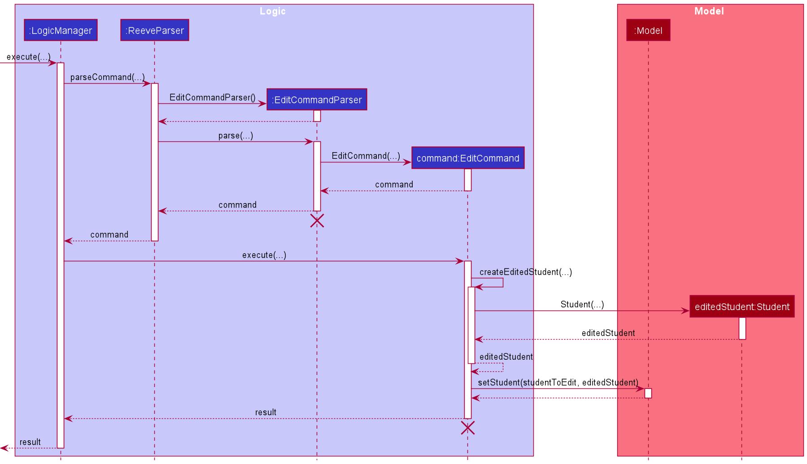
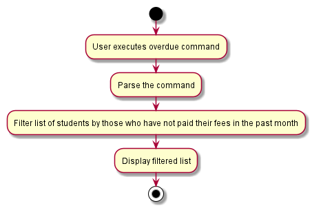
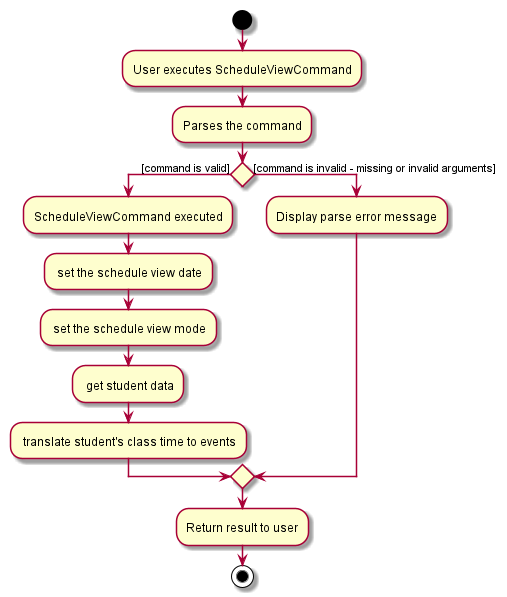
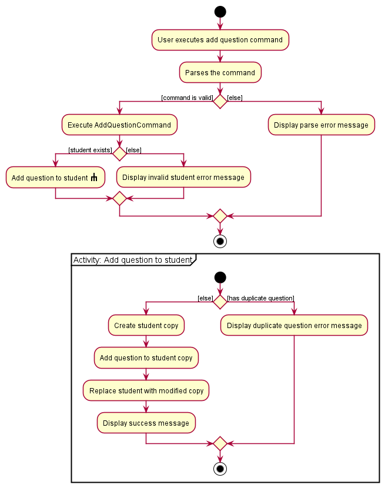
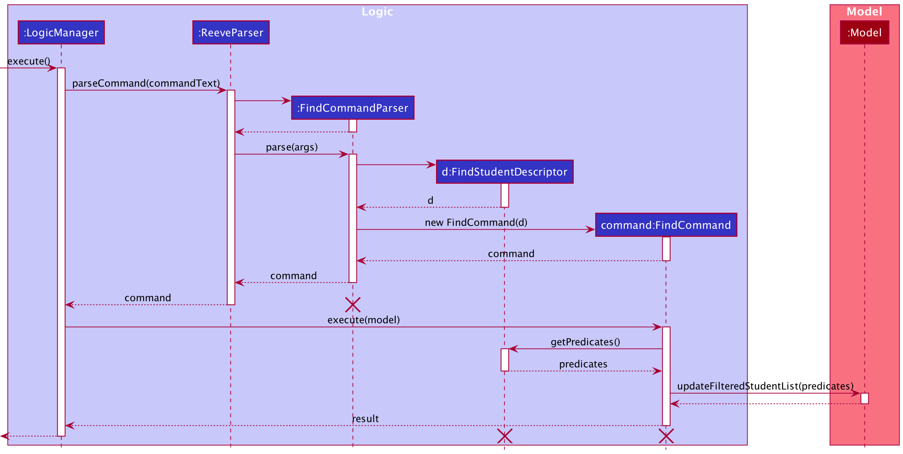

Reeve - Developer Guide
---
* Table of Contents
{:toc}

--------------------------------------------------------------------------------------------------------------------
## Introduction
Welcome to Reeve!

Reeve is an integrated platform specifically catered to Primary, Secondary and Tertiary education private tutors to better manage their students' individual needs.
It contains  students' particulars, administrative and academic details.

Reeve is optimized for users that are very comfortable with typing as it works on a Command Line Interface (CLI).

Students' details are displayed in a neat and organized manner through the use of a Graphical User Interface (GUI).

If you are looking for an application to better allow you to track your students' administrative and academic details so that you can better meet their needs? Look no further!
 
## 1. About

## 2. Understanding the Guide

## 3. **Getting started**

Refer to the guide [_Setting up and getting started_](SettingUp.md).

--------------------------------------------------------------------------------------------------------------------

## 4. **Design**

### 4.1 Architecture

The ***Architecture Diagram*** given above explains the high-level design of the App. Given below is a quick overview of each component.

:bulb: **Tip:** The `.puml` files used to create diagrams in this document can be found in the [diagrams](https://github.com/se-edu/addressbook-level3/tree/master/docs/diagrams/) folder. Refer to the [_PlantUML Tutorial_ at se-edu/guides](https://se-education.org/guides/tutorials/plantUml.html) to learn how to create and edit diagrams.

**`Main`** has two classes called [`Main`](https://github.com/se-edu/addressbook-level3/tree/master/src/main/java/seedu/address/Main.java) and [`MainApp`](https://github.com/se-edu/addressbook-level3/tree/master/src/main/java/seedu/address/MainApp.java). It is responsible for,
* At app launch: Initializes the components in the correct sequence, and connects them up with each other.
* At shut down: Shuts down the components and invokes cleanup methods where necessary.

[**`Commons`**](#common-classes) represents a collection of classes used by multiple other components.

The rest of the App consists of four components.

* [**`UI`**](#ui-component): The UI of the App.
* [**`Logic`**](#logic-component): The command executor.
* [**`Model`**](#model-component): Holds the data of the App in memory.
* [**`Storage`**](#storage-component): Reads data from, and writes data to, the hard disk.

Each of the four components,

* defines its *API* in an `interface` with the same name as the Component.
* exposes its functionality using a concrete `{Component Name}Manager` class (which implements the corresponding API `interface` mentioned in the previous point.

For example, the `Logic` component (see the class diagram given below) defines its API in the `Logic.java` interface and exposes its functionality using the `LogicManager.java` class which implements the `Logic` interface.

**How the architecture components interact with each other**

The *Sequence Diagram* below shows how the components interact with each other for the scenario where the user issues the command `delete 1`.

The sections below give more details of each component.

### 4.2 UI component

**API** :
[`Ui.java`](https://github.com/se-edu/addressbook-level3/tree/master/src/main/java/seedu/address/ui/Ui.java)

The UI consists of a `MainWindow` that is made up of parts e.g.`CommandBox`, `ResultDisplay`, `PersonListPanel`, `StatusBarFooter` etc. All these, including the `MainWindow`, inherit from the abstract `UiPart` class.

The `UI` component uses JavaFx UI framework. The layout of these UI parts are defined in matching `.fxml` files that are in the `src/main/resources/view` folder. For example, the layout of the [`MainWindow`](https://github.com/se-edu/addressbook-level3/tree/master/src/main/java/seedu/address/ui/MainWindow.java) is specified in [`MainWindow.fxml`](https://github.com/se-edu/addressbook-level3/tree/master/src/main/resources/view/MainWindow.fxml)

The `UI` component,

* Executes user commands using the `Logic` component.
* Listens for changes to `Model` data so that the UI can be updated with the modified data.

### 4.3 Logic component

**API** :
[`Logic.java`](https://github.com/se-edu/addressbook-level3/tree/master/src/main/java/seedu/address/logic/Logic.java)

1. `Logic` uses the `AddressBookParser` class to parse the user command.
1. This results in a `Command` object which is executed by the `LogicManager`.
1. The command execution can affect the `Model` (e.g. adding a student).
1. The result of the command execution is encapsulated as a `CommandResult` object which is passed back to the `Ui`.
1. In addition, the `CommandResult` object can also instruct the `Ui` to perform certain actions, such as displaying help to the user.

Given below is the Sequence Diagram for interactions within the `Logic` component for the `execute("delete 1")` API call.

:information_source: **Note:** The lifeline for `DeleteCommandParser` should end at the destroy marker (X) but due to a limitation of PlantUML, the lifeline reaches the end of diagram.

### 4.4 Model component

**API** : [`Model.java`](https://github.com/se-edu/addressbook-level3/tree/master/src/main/java/seedu/address/model/Model.java)

The `Model`,

* stores a `UserPref` object that represents the user’s preferences.
* stores the address book data.
* exposes an unmodifiable `ObservableList<Person>` that can be 'observed' e.g. the UI can be bound to this list so that the UI automatically updates when the data in the list change.
* does not depend on any of the other three components.

:information_source: **Note:** An alternative (arguably, a more OOP) model is given below. It has a `Tag` list in the `AddressBook`, which `Person` references. This allows `AddressBook` to only require one `Tag` object per unique `Tag`, instead of each `Person` needing their own `Tag` object. 

### 4.5 Storage component

**API** : [`Storage.java`](https://github.com/se-edu/addressbook-level3/tree/master/src/main/java/seedu/address/storage/Storage.java)

The `Storage` component,
* can save `UserPref` objects in json format and read it back.
* can save the address book data in json format and read it back.

### 4.6 Common classes

Classes used by multiple components are in the `seedu.addressbook.commons` package.

--------------------------------------------------------------------------------------------------------------------

## 5. **Implementation**

This section describes some noteworthy details on how certain features are implemented.

### 5.1 Student administrative details features

The student administrative details feature keeps track of essential administrative student details. The feature comprises of the following commands,
* `AddCommand` - Adds a student into the student list
* `EditCommand` - Edits the details of a particular student
* `DeleteCommand` - Deletes a particular student
* `FindCommand` - Finds students matching certain parameters
* `OverdueCommand` - Finds students who have overdue payments
* `ClearCommand` - Deletes all students in the student list

#### 5.1.1 Add Student Command

The following describes the flow of how `AddCommand` is performed.

1. Upon successfully parsing the user input, the `AddCommand#execute(Model model)` is called which checks whether
the added student already exists in the `UniqueStudentList`.
2. A unique student is defined by `Name`, `Phone`, `School` and `Year`. If a duplicate student is defined,
a `CommandException` is thrown and the student will not be added.
3. If the added student is not a duplicate, then the `Model#addStudent(Student student)` is called to add the student.
A new `CommandResult` is returned with a success message and the added student.
4. The student is be added into `UniqueStudentList` and a success message is shown in the result display.

The following activity diagram summarizes the flow of events when the `AddCommand` is being executed:

Figure ___. Activity Diagram for AddStudentCommand

#### 5.1.2 Edit Student Command

The edit student feature allows the tutor to edit a particular student within **Reeve**.
It is handled by the `EditCommand`.

The following describes the flow of how `EditCommand` is executed.

1. Upon successfully parsing the user input, `EditCommand#execute(Model model)` is called to edit the existing student to the new edited student.
2. `Model#setStudent(Student student)` is called to replace the student with edited student within the model.
3. `Model#updateFilteredStudentsList(Predicate<Student> predicate)` is then called to update the student list with the new edited student.
4. A new `CommandResult` is returned with a successful message indicating that the student has been edited.
5. The edited student is now shown on the student list.

The following sequence diagram shows how the `EditCommand` execution works.

Figure \___. Sequence diagram for `EditCommand` execution

The following activity diagram summarises the flow of events when `EditCommand` is executed.

Figure \___. Activity diagram for `EditCommand` execution

#### 5.1.5 Overdue Command

The overdue payment filter feature allows the tutor to find all students who have not paid their tuition fees in the past month. It is handled by the `OverdueCommand`.

The following describes the flow of how `OverdueCommand` is executed.

1. Upon successfully parsing the user input, `OverdueCommand#execute(Model model)` is called to filter all students in Reeve whose last date of payment was more than a month ago.
2. `Model#updateFilteredStudentsList(Predicate<Student> predicate)` is called to find only students that match the above condition. A new `CommandResult` is returned with a successful message indicating the number of matching students.
3. The filtered student list replaces the displayed list on the GUI and a success message is shown in the result display.

The following sequence diagram shows how the `OverdueCommand` execution works.

Figure \___. Sequence diagram for `OverdueCommand` execution

The following activity diagram summarises the flow of events when `OverdueCommand` is executed.

Figure \___. Activity diagram for `OverdueCommand` execution

#### 5.1.6 Schedule Command

This section describes the operations that `ScheduleCommand` performs.

1. Upon successful parsing of the user input date into `LocalDate` , the `ScheduleCommand#execute(Model model)` method is called.
2. The method `LocalDate#getDayOfWeek()` is then called on the `LocalDate` that is parsed from the user input to get the `dayOfWeek`.
3. The `dayOfWeek` is then used to create a `Predicate<Student>` to check if the student has the same day as the date.
4. Then the method `Model#updateFilteredPersonList(Predicate<Student>)` is then called to filter students based on predicate created in **Step 3**.
5. The StudentListPanel is then populated with the students that have lesson on the day.

The following activity diagram summarizes the flow of events when the `ScheduleCommand` is being executed:

Figure \___. Activity diagram for `ScheduleCommand` execution

### 5.2 Student questions features

The student questions feature keeps track of questions raised by a student to his tutor. The features comprises of the following commands:

* `AddQuestionCommand` - Adds a question to a specified student
* `SolveQuestionCommand` - Marks a specified question from a specified student as solved
* `DeleteQuestionCommand` - Deletes a specified question from a specified student

#### 5.2.1 Add question command

The following describes the flow of how `AddQuestionCommand` is performed.

1. Upon successfully parsing the user input, `AddQuestionCommand#execute(Model model)` is called to check if the student at the specified position exists.
2. If there is no student at the specified position,  a `CommandException` is thrown and the question will not be added.
3. If the student exists, `AddQuestionCommand#execute(Model model)` checks if the student already has a similar question recorded.
4. A unique question is defined solely by its `question` and does not take into account if the question has been solved. If a duplicate question is found, a `CommandException` is thrown and the question will not be added.
5. If the question is not a duplicate, `Student#addQuestion(Question question)` is called to create a modified copy of the student with a newly added question.
6. `Model#setPerson(Student target, Student editedStudent)` is called to replace the student with the modified copy. A new `CommandResult` is returned with a success message showing the affected student and the question added.
7. The modified student replaces the outdated student in the `UniqueStudentList` and a success message is shown in the result display.

The following sequence diagram shows how the question adding operation works.

Figure \___. Sequence diagram for `AddQuestionCommand` execution

The following activity diagram summarises the flow of events when `AddQuestionCommand` is executed.

Figure \___. Activity diagram for `AddQuestionCommand` execution

#### 5.2.2 Solve question command

The following describes the flow of how `SolveQuestionCommand` is performed.

1. Upon successfully parsing the user input, `SolveQuestionCommand#execute(Model model)` is called to check if the student at the specified position exists.
2. If there is no student at the specified position,  a `CommandException` is thrown and the question will not be added.
3. If the student exists, `SolveQuestionCommand#execute(Model model)` checks if there is a question at the specified position.
4. If the question does not exist, a `CommandException` is thrown and the question will not be resolved.
5. If the question exists, `Student#setQuestion(Question target, Question newQuestion)` is called to create a modified copy of the student where the specified question has been replaced with a solved version.
6. `Model#setPerson(Student target, Student editedStudent)` is called to replace the student with the modified copy. A new `CommandResult` is returned with a success message showing the affected student and the question solved.
7. The modified student replaces the outdated student in the `UniqueStudentList` and a success message is shown in the result display.

The following sequence diagram shows how the question solving operation works.

Figure \___. Sequence diagram for `SolveQuestionCommand` execution

The following activity diagram summarises the flow of events when `SolveQuestionCommand` is executed.

Figure \___. Activity diagram for `SolveQuestionCommand` execution

#### 5.2.3 Delete question command

The following describes the flow of how `DeleteQuestionCommand` is performed.

1. Upon successfully parsing the user input, `DeleteQuestionCommand#execute(Model model)` is called to check if the student at the specified position exists.
2. If there is no student at the specified position,  a `CommandException` is thrown and the question will not be added.
3. If the student exists, `DeleteQuestionCommand#execute(Model model)` checks if there is a question at the specified position.
4. If the question does not exist, a `CommandException` is thrown and the question will not be resolved.
5. If the question exists, `Student#deleteQuestion(Question target)` is called to create a modified copy of the student without the specified question.
6. `Model#setPerson(Student target, Student editedStudent)` is called to replace the student with the modified copy. A new `CommandResult` is returned with a success message showing the affected student and the question removed.
7. The modified student replaces the outdated student in the `UniqueStudentList` and a success message is shown in the result display.

The following sequence diagram shows how the question deletion operation works.

Figure \___. Sequence diagram for `DeleteQuestionCommand` execution

The following activity diagram summarises the flow of events when `DeleteQuestionCommand` is executed.

Figure \___. Activity diagram for `DeleteQuestionCommand` execution

### 5.3 Student Find Command

This is an explanation of how `FindCommand` works.

This is an activity diagram showing the high level idea of how `FindCommand` is executed.

This is a sequence diagram together with an explanation of the implementation.

 1. After the `FindCommand`  is created by parsing user input, `FindCommand::execute` is called.
 2. The method then calls `getPredicates()` of the `FindStudentDescriptor` stored within `FindCommand` to obtain a `List<Predicate>` to search with.
 3. The predicates within `List<Predicate>`are then combined into `consolidatedPredicate`.
 4. The `FilteredList<Student>` within the `Model` is then updated using `Model#updateFilteredPersonList(Predicate predicate)` for display.
 5. A new `CommandResult` will be returned with the success message.

--------------------------------------------------------------------------------------------------------------------

## **Documentation, logging, testing, configuration, dev-ops**

* [Documentation guide](Documentation.md)
* [Testing guide](Testing.md)
* [Logging guide](Logging.md)
* [Configuration guide](Configuration.md)
* [DevOps guide](DevOps.md)

--------------------------------------------------------------------------------------------------------------------

## **Appendix: Requirements**

### Product scope

**Target user profile**:

* is a Singapore primary/secondary/junior college private tutors
* has a need to manage a significant number of student contacts
* has a need to manage administrative details of students
* has a need to manage administrative details of lessons
* prefer desktop apps over other types
* can type fast
* prefers typing to mouse interactions
* is reasonably comfortable using CLI apps

**Value proposition**: Helps tutors organise administrative details of their students and lesson with ease and manage student needs better.

### User stories

Priorities: High (must have) - `* * *`, Medium (nice to have) - `* *`, Low (unlikely to have) - `*`

| Priority | As a …​                   | I want to …​                                          | So that I can…​                                                                     |
| -------- | --------------------------| ----------------------------------------------------- | ----------------------------------------------------------------------              |
| `* * *`  | user ready to use Reeve   | input my student’s details (Admin)                    | refer to instructions when I forget how to use the App                              |
| `* * *`  | novice user               | be able to save meeting links for online lessons      | keep track of meeting links when my student cannot make it for a physical lesson    |                                                                       |
| `* * *`  | expert user               | view my students' preferred tutoring location         | figure out how to get that location                                                 |
| `* * *`  | expert user               | edit my students' personal details                    | get rid of outdated data                                                            |
| `* * *`  | expert user               | view my student's details                             | refer to them when needed                                                           |
| `* * *`  | expert user               | add additional details to each student                | add other miscellaneous details which can allow me to better cater to student needs |
| `* * *`  | long-time user            | delete students' data                                 | remove irrelevant data of students who are no longer my tutees                      |
| `* * *`  | expert user               | find a student's record                               | retrieve students' data with ease                                                   |

*{More to be added}*

### Use cases

(For all use cases below, the **System** is `Reeve` and the **Actor** is the `Tutor (User)`, unless specified otherwise)

**UC01: Adding a student**

**MSS**

1.  User enters a command to add a student with student details.
2.  Reeve saves student data into the students list and displays a success message.

    Use case ends.

**Extensions**

* 1a. User provides input with missing compulsory fields.
    * 1a1. Reeve requests for appropriate input.

      Use case resumes from step 1.

* 1b. User provides input with invalid format.
    * 1b1. Reeve requests for appropriate input with valid format.

      Use case resumes from step 1.

**UC02: Searching for a student**

**MSS**

1.  User enters a command to find all students that match the given search parameter (name, school, year or subject).
2.  Reeve displays all students matching the criteria.

    Use case ends.

**Extensions**

* 1a. User provides input with invalid data into the search parameter.
    * 1a1. Reeve displays erroneous field and expected format.

      Use case resumes at step 1.
* 1b. User provides input without a search parameter.
    * 1a1. Reeve displays a message indicating a search parameter was not provided.

      Use case resumes at step 1.
* 1c. No students match the given criteria.
    * 1c1. Reeve displays a message indicating no match found.

      Use case ends.

**UC03: Editing a student's details**

**MSS**

1.  User enters a command to list students.
2.  Reeve shows the list of students.
3.  User enters command to edit a specific student in the list and provides needed parameters.
4.  Reeve updates the specified student with the input parameters and displays a success message.

    Use case ends.

**Extensions**

* 1a. The list is empty.
  Use case ends.

* 3a. User provides input with invalid index.
    * 3a1. Reeve requests for input with valid index.

      Use case resumes at step 2.
* 3b. User provides input without any parameters.
    * 3b1. Reeve requests for input with parameters.

      Use case resumes at step 2.
* 3c. User provides input with invalid format.
	* 3c1. Reeve requests for input with valid format.

	  Use case resumes at step 2.

**UC04: Deleting a student**

**MSS**

1.  User enters a command to list students.
2.  Reeve displays a list of students.
3.  User enters a command to delete a specific student in the list.
4.  Reeve deletes the student and displays a success message.

    Use case ends.

**Extensions**

* 1a. The list is empty.

  Use case ends.

* 3a. User provides input with invalid index.
    * 3a1. Reeve displays an error message.

      Use case resumes at step 2.

**UC05: Listing all students**

**MSS**

1. User enters a command to list students.
2. Reeve displays the students list with student details.

   Use case ends.

**UC06: Clearing all student records**

**MSS**

1. User enters a command to clear the students list.
2. Reeve displays a success message.

   Use case ends.

**UC07: Adding a question to a student**

**MSS**

1. User enters a command to list students.
2. Reeve displays a list of students.
3. User enters a command to add an unresolved question to a specific student in the list.
4. Reeve updates the specified student in the list with the newly added question.
5. Reeve displays a success message.

   Use case ends.

**Extensions**

* 1a. The list is empty.

  Use case ends.

* 3a. User provides input with an invalid student index.
    * 3a1. Reeve displays an error message.

      Use case resumes at step 2.

* 3b. User inputs a question in an invalid format.
    * 3b1. Reeve displays an error message.

      Use case resumes at step 2.

**UC07: Resolving a question from a student**

**MSS**

1. User enters a command to list students.
2. Reeve displays a list of students.
3. User enters a command to resolve a question from a specific student in the list with a solution.
4. Reeve updates the specified student in the list with the updated question.
5. Reeve displays a success message.

   Use case ends.

**Extensions**

* 1a. The list is empty.

  Use case ends.

* 3a. User provides input with an invalid student.
    * 3a1. Reeve displays an error message.

      Use case resumes at step 2.

* 3b. User provides input with an invalid question.
    * 3b1. Reeve displays an error message.

      Use case resumes at step 2.

* 3c. User inputs the solution in an invalid format.
    * 3c1. Reeve displays an error message.

      Use case resumes at step 2.

* 3d. User specifies a question that has already been solved.
    * 3d1. Reeve displays an error message.

      Use case resumes at step 2.

**UC07: Deleting a question from a student**

**MSS**

1. User enters a command to list students.
2. Reeve displays a list of students.
3. User enters a command to delete a question from a specific student in the list.
4. Reeve updates the specified student in the list with the removed question.
5. Reeve displays a success message.

   Use case ends.

**Extensions**

* 1a. The list is empty.

  Use case ends.

* 3a. User provides input with an invalid student.
    * 3a1. Reeve displays an error message.

      Use case resumes at step 2.

* 3b. User provides input with an invalid question.
    * 3b1. Reeve displays an error message.

      Use case resumes at step 2.

**UC07: Finding all students with overdue tuition fees**

**MSS**

1. User enter command to filter all students by those who have not paid their fees in the past month.
2. Reeve displays all students that match the above criteria.

   Use case ends.

**Extensions**

* 1a. The list is empty.

  Use case ends.

* 1b. All students have paid their fees in the past month.

  * 1b1. Reeve displays an empty list.

    Use case ends.

### Non-Functional Requirements

1.  Should work on any _mainstream OS_ as long as it has Java `11` or above installed.
2.  The response to any use action should become visible within 5 seconds.
3.  The program should be able to handle at least 100 students.
4.  The graphical user interface should be easy to use for non-IT savvy users.

*{More to be added}*

### Glossary

* **Mainstream OS**: Windows, Linux, Unix, OS-X
* **Private contact detail**: A contact detail that is not meant to be shared with others

--------------------------------------------------------------------------------------------------------------------

## **Appendix: Instructions for manual testing**

Given below are instructions to test the app manually.

:information_source: **Note:** These instructions only provide a starting point for testers to work on;
testers are expected to do more *exploratory* testing.

### Launch and shutdown

1. Initial launch

   1. Download the jar file and copy into an empty folder

   1. Double-click the jar file Expected: Shows the GUI with a set of sample contacts. The window size may not be optimum.

1. Saving window preferences

   1. Resize the window to an optimum size. Move the window to a different location. Close the window.

   1. Re-launch the app by double-clicking the jar file. 
       Expected: The most recent window size and location is retained.

1. _{ more test cases …​ }_

### Deleting a student

1. Deleting a student while all students are being shown

   1. Prerequisites: List all students using the `list` command. Multiple students in the list.

   1. Test case: `delete 1` 
      Expected: First contact is deleted from the list. Details of the deleted contact shown in the status message. Timestamp in the status bar is updated.

   1. Test case: `delete 0` 
      Expected: No student is deleted. Error details shown in the status message. Status bar remains the same.

   1. Other incorrect delete commands to try: `delete`, `delete x`, `...` (where x is larger than the list size) 
      Expected: Similar to previous.

1. _{ more test cases …​ }_

### Saving data

1. Dealing with missing/corrupted data files

   1. _{explain how to simulate a missing/corrupted file, and the expected behavior}_

1. _{ more test cases …​ }_
