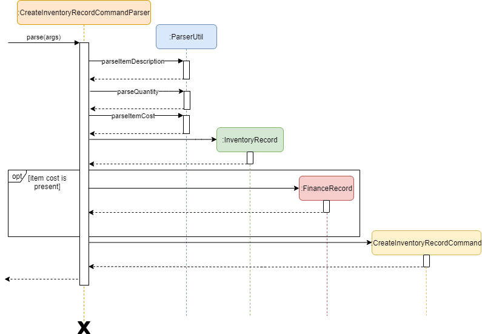
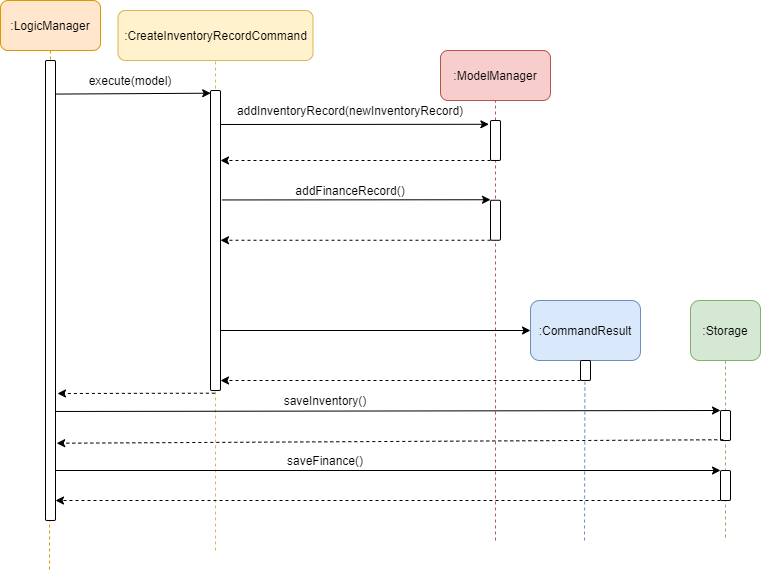
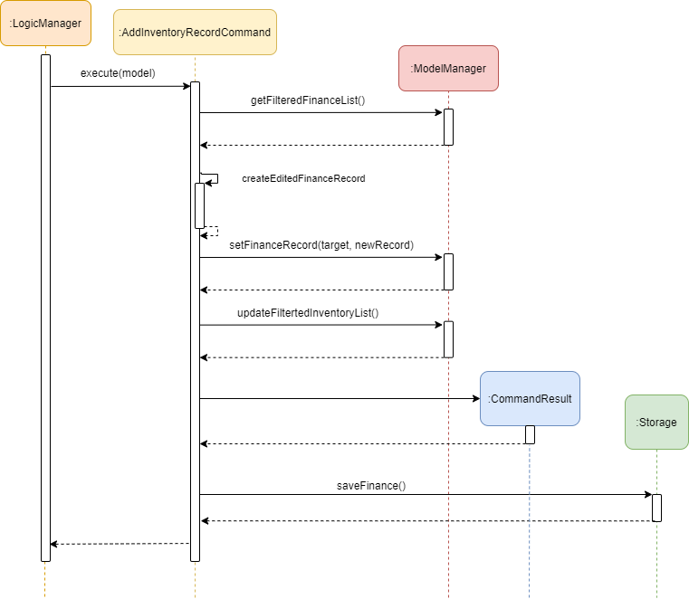
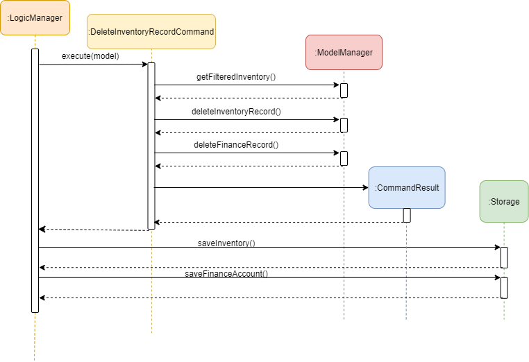
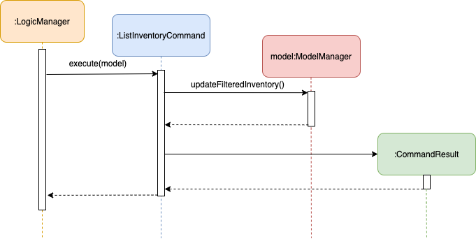
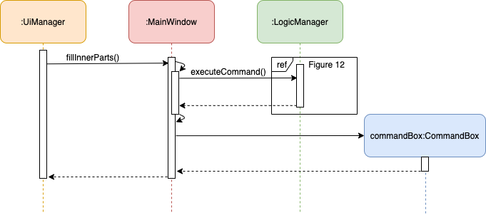

<!-- TOC adapted from
https://github.com/AY2021S1-CS2103T-W16-3/tp/pull/179/commits/aec461182c194c9ca2c67d7c407fcabb376191ff 
-->

  * Table of Contents
  {:toc}

---

## 1. Setting Up, Getting Started

To get started, please refer to the setting up guide [here](SettingUp.md).

---

## 2. Design

### 2.1. Architecture and High Level Design

The architecture diagram given below shows the high-level design of the software NUStorage.

Given below is a quick overview of each of the components.

#### 2.1.1. Main classes

**`Main`** has two classes: [`Main`](https://github.com/AY2021S1-CS2103T-T11-3/tp/blob/master/src/main/java/nustorage/Main.java) and [`MainApp`](https://github.com/AY2021S1-CS2103T-T11-3/tp/blob/master/src/main/java/nustorage/MainApp.java). This component is responsible for:

* At app launch: Initializes the components in the correct sequence, and connects them up with each other.
* At shut down: Shuts down the components and invokes cleanup methods where necessary.

#### 2.1.2. Commons classes

**`Commons`** represents a collection of classes used by multiple other components to support the software.

#### 2.1.3. Core classes

##### 2.1.3.1. UI

**`UI`** contains the user interface elements and is responsible for taking in user inputs and displaying the corresponding results and infomative feedback messages.

##### 2.1.3.2. Logic

**`Logic`** is responsible for executing the commands and ensuring the logic flow of the software.

##### 2.1.3.3. Model

**`Model`** represents a collection of model objects used by the software to hold the data of the application in memory while the app is running.

##### 2.1.3.4. Storage

**`Storage`** is responsible for:

* At app launch: Reading the data files and convert them into their corresponding `model` objects.
* When a command is executed: Converting the `model` objects into their corresponding serializable formats, then store these serializable objects into the data file.

Each of the four components in the **core classes**:

* Defines its *API* in an `interface` with the same name as the Component.
* Exposes its functionality using a concrete `{Component Name}Manager` class (which implements the corresponding API `interface` mentioned in the previous point.

For example, the `Logic` component (see the class diagram given below) defines its API in the `Logic.java` interface and exposes its functionality using the `LogicManager.java` class which implements the `Logic` interface.

 
Figure 1: Class Diagram of Logic Component.

---

### 2.2. Interactions between Architectural Components

The *Sequence Diagram* below shows how the components interact with each other for the scenario where the user issues the command `delete 1`.

Figure 2: Sequence diagram for executing the command `delete 1`.

Section 2.3 elaborates on each of the components in detail.

---

### 2.3. Details of Architectural Components

#### 2.3.1. Commons classes

Classes used by multiple components are in the `nustorage.commons` package.

Classes in this component:

* Support the overall logic flow of the application.
* Provides utility to be used by other classes.
* Helps with error handling.

#### 2.3.2. UI component

This section shows the structure and logic of the `UI` component of NUStorage. It shows a generalised view of the `UI` component within the packages.

Given below is the class diagram of the `UI` component of NUStorage.

 
Figure 3: Class Diagram of UI Component.

**API** :
[`Ui.java`](https://github.com/AY2021S1-CS2103T-T11-3/tp/blob/master/src/main/java/nustorage/ui/Ui.java)

The UI component consists of a `MainWindow` that is made up of `CommandBox`, `ResultDisplay`, `TabPane`, `StatusBarFooter` and `HelpWindow`. The `TabPane` holds multiple `Tab` objects such as `Inventory` and `Finance`.

Every component in UI, including the `MainWindow`, inherits from the abstract `UiPart` class.

The `UI` component uses the JavaFx UI framework. The layout of these UI parts are defined in the corresponding `.fxml` files with the same name, located in the `src/main/resources/view` directory. For example, the layout of the [`MainWindow`](https://github.com/AY2021S1-CS2103T-T11-3/tp/blob/master/src/main/java/nustorage/ui/MainWindow.java) is specified in [`MainWindow.fxml`](https://github.com/AY2021S1-CS2103T-T11-3/tp/blob/master/src/main/resources/view/MainWindow.fxml)

The `UI` component:

* Executes user commands using the `Logic` component.
* Updates itself with modified data whenever there are changes made by the user.

#### 2.3.3. Logic component

This section shows the structure and logic of the `Logic` component of NUStorage. It shows a generalised view of the `Logic` component within the packages.

Given below is the class diagram of the `Logic` component of NUStorage.

 
Figure 4: Class Diagram of Logic Component.

**API**:
[`Logic.java`](https://github.com/AY2021S1-CS2103T-T11-3/tp/blob/master/src/main/java/nustorage/logic/Logic.java)

An outline of how a command is processed through `Logic` is as follows:

1. `Logic` uses the `NuStorageParser` class to parse the user command.
2. This results in a `Command` object which is executed by the `LogicManager`.
3. The command execution can affect the `Model` (e.g. adding a person).
4. The result of the command execution is encapsulated as a `CommandResult` object which is passed back to the `Ui`.
5. In addition, the `CommandResult` object can also instruct the `Ui` to perform certain actions, such as displaying help to the user.

Given below is the Sequence Diagram for interactions within the `Logic` component for the `execute("delete_finance 1")` API call.

 
Figure 5: Sequence Diagram of Delete Finance Command.

#### 2.3.4. Model component

This section shows the structure and logic of the `Model` component of NUStorage. It shows a generalised view of the `Model` component within the packages.

Given below is the class diagram of the `Model` component.

 
Figure 6: Class Diagram of Model Component.

**API** : [`Model.java`](https://github.com/AY2021S1-CS2103T-T11-3/tp/blob/master/src/main/java/nustorage/model/Model.java)

The `Model`,

* Stores a `UserPref` object that represents the user’s preferences.
* Stores Inventory and financeAccount data.
* Exposes unmodifiable `ObservableList<InventoryRecord>` and `ObservableList<FinanceRecord>` that can be 'observed' e.g. the UI can be bound to the lists so that the UI automatically updates when the data in the lists change.
* Does __not__ depend on any of the other three components (UI, Logic and Storage).

#### 2.3.5. Storage component

This section shows the structure and logic of the `Storage` component of NUStorage. All storage-related classes are stored in the package `nustorage.storage`.

Given below is the class diagram of the `Storage` component.

 
Figure 7: Class Diagram of Storage Component.

The storage component comprises three different sections:

1. The `UserPrefStorage` section:
   * loads the user preferences and settings on start up.
   * stores the user preferences and settings upon exiting .

2. The `FinanceAccountStorage` section:
   * loads the previously saved finance records on start up.
   * stores new finance records as they are added / logged into the software.

3. The `InventoryStorage` section:
   * loads the previously saved inventory records on start up.
   * stores new inventory records as they are added / logged into the software.

**API** : [`Storage.java`](https://github.com/AY2021S1-CS2103T-T11-3/tp/blob/master/src/main/java/nustorage/storage/Storage.java)

* Saving inventory:

  * Given below is the **activity** diagram for saving the inventory. Saving finance account works similarly.
  The diagram given below shows the decision pathways of the storage component when saving inventory.

       
      Figure 8: Activity Diagram for Saving Inventory.

  * The following is the **sequence** diagram for saving the inventory. Saving finance account works similarly.
  The diagram given below shows the function calls between classes when saving inventory.

       
      Figure 9: Sequence Diagram for Saving Inventory.

* Loading finance account:

  * Given below is the **activity** diagram for loading the finance account on start up. Loading inventory works similarly.
  The diagram given below shows the decision pathways of the storage component when loading finance account.

       
      Figure 10: Activity Diagram for Loading Finance.

  * The following is the **sequence** diagram for loading the finance account. Loading inventory works similarly.
  The diagram given below shows the function calls between classes when loading finance account.

       
      Figure 11: Sequence Diagram for Loading Finance.

---

## 3. Implementation

This section describes some noteworthy details on how certain key features are implemented as well as their design considerations.

### 3.1. Add Records Command Feature

This section explains the implementation of the `Add record command` feature. As the implementation of adding Inventory / Finance Records are very similar, this section will focus only be on the implementation of the adding of __Inventory Records__.

The Add Inventory command results in an inventory record added to the list. All but one field in the record must be provided by the user, which are: Item Description and Quantity. There is one optional field, Cost, which when provided, creates a Finance Record that is linked to the Inventory Record reflecting said cost.

This is done through the use of the `ParserUtil#parseItemDescription` and `ParserUtil#parseQuantity` methods inside the `nustorage.parser` package, which checks and extracts the item description and quantity (as well as cost if the field is filled) from the commadn string.

If the compulsory fields are valid, `AddInventoryRecordCommandParser` creates an `AddInventoryRecordCommand` object. The Sequence Diagram below (figure 12) shows how the `AddInventoryRecordCommand` object is created.

Take a look at the Logic Class Diagram in the [Logic Component](#233-logic-component) section of the DG, where `AddInventoryRecordCommandParser` is represented as 'XYZCommandParser' in the diagram for a better understanding.

 
Figure 12. Sequence Diagram for the Add Inventory command.

The `AddInventoryRecordCommand` has been successfully created and its `execute` method would be called by `LogicManager#execute`, which then called by `MainWindow#executeCommand`. Below is another sequence diagram that depicts the interactions between `LogicManager`, `AddInventoryRecordCommand`, `ModelManager` as well as `Storage`, when `AddInventoryRecordCommand#execute` is called.

 
Figure 13. Sequence Diagram for `AddInventoryRecordCommand#execute()`

As you can see, the Inventory Record, as well as a Finance Record (if the cost field was filled), is added into NUStorage's [Model Component](#234-model-component). In addition, the updated lists of Inventory Records and Finance Records are saved into the [Storage Component](#235-storage-component) of NUStorage. At the end of the operation, a `CommandResult` object is returned in which we will use for UI purposes.

Now, all there is left is to display a message to the user informing him/her about the status of their command input, as well as the created inventory / finance records. The `CommandResult` object returned previously is now used to create a new `CommandBox` object, which is used to display items on NUStorage's UI. This happens when `UiManager#fillInnerParts()` is called. Refer to [Figure 20](#35-ui-sequence-diagram) at the end of section 3 for the sequence diagram for UI.

With this, the Add Inventory Record command fully finishes executing and NUStorage's UI displays the status messages for the user to see.

### 3.2. Edit Records Command Feature

This section explains the implementation of the `Edit Record command` feature. As the implementation of editing Inventory / Finance Records are similar, this secion will focus only on the implementation of the editing of __Finance Records__.

The Edit Finance command results in the specified finance record being modified. This command requires a compulsory field Index to specify which record is to be edited. Furthermore, at least one field in the command must be provided: Amount, Date or Time.

This is done through the use of the `ParserUtil#parseIndex`, `ParserUtil#parseAmount` and `ParserUtil#parseDateTime` methods inside the `nustorage.parser` package, which checks and extracts the Index of the record, the new Amount, Date or Time fields from the command string.

If the index is valid and at least one of the compulsory fields is present, `EditFinanceCommandParser` creates an `EditFinanceCommand` object. The sequence diagram below (figure 15) shows how the `EditFinanceCommand` object is created.

Take a look at the Logic Class diagram in the [Logic Component](#233-logic-component) of the DG, where `EditFinanceCommandParser` is represented as 'XYZCommandParser' in the diagram for a better understanding.

 
Figure 14. Sequence Diagram for the Edit Finance command.

The `EditFinanceCommand` has been successfully created and its `execute` method would be called by `LogicManager#execute`, which then called by `MainWindow#executeCommand`. Below is another sequence diagram that depicts the interactions between `LogicManager`, `EditFinanceCommand`, `ModelManager` as well as `Storage`, when `EditFinanceCommand#execute` is called.

 
Figure 15. Sequence Diagram for `EditFinanceCommand#execute()`

As you can see, the original Finance Record in NUStorage's [Model Component](#234-model-component) has now been updated with the new values. In addition, the updated list of Finance Records is saved into the [Storage Component](#235-storage-component) of NUStorage. At the end of the operation, a `CommandResult` object is returned in which we will use for UI purposes.

Now, all there is left is to display a message to the user informing him/her about the status of their command input, as well as the edited finance records. The `CommandResult` object returned previously is now used to create a new `CommandBox` object, which is used to display items on NUStorage's UI. This happens when `UiManager#fillInnerParts()` is called. Refer to [Figure 20](#35-ui-sequence-diagram) at the end of section 3 for the sequence diagram for UI.

With this, the Edit Finance Record command fully finishes executing and NUStorage's UI displays the status messages for the user to see.

### 3.3. Delete Records Command Feature

This section explains the implementation of the `Delete Record command` feature. As the implementation of editing Inventory / Finance Records are similar, this secion will focus only on the implementation of the deletion of __Inventory Records__.

The Delete Inventory command results in the specified inventory record being removed from the application. This command requires a compulsory field Index to specify which record is to be edited.

This is done through the use of the `ParserUtil#parseIndex` method inside the `nustorage.parser` package, which checks and extracts the index fields from the command string.

If the index provided is valid, then `DeleteInventoryRecordCommandParser` creates an `DeleteInventoryRecordCommand` object. The sequence diagram below (figure 18) shows how the `DeleteInventoryRecordCommand` object is created.

Take a look at the Logic Class diagram in the [Logic Component](#233-logic-component) of the DG, where `DeleteInventoryRecordCommandParser` is represented as 'XYZCommandParser' in the diagram for a better understanding.

 
Figure 16. Sequence Diagram for the Delete Inventory command.

The `DeleteInventoryRecordCommand` has been successfully created and its `execute` method would be called by `LogicManager#execute`, which then called by `MainWindow#executeCommand`. Below is another sequence diagram that depicts the interactions between `LogicManager`, `EditFinanceCommand`, `ModelManager` as well as `Storage`, when `EditFinanceCommand#execute` is called.

 
Figure 17. Sequence Diagram for `DeleteInventoryRecordCommand#execute()`

As you can see, the original Finance Record in NUStorage's [Model Component](#234-model-component) has now been updated with the new values. In addition, the updated list of Finance Records is saved into the [Storage Component](#235-storage-component) of NUStorage. At the end of the operation, a `CommandResult` object is returned in which we will use for UI purposes.

Now, all there is left is to display a message to the user informing him/her about the status of their command input, as well as the edited finance records. The `CommandResult` object returned previously is now used to create a new `CommandBox` object, which is used to display items on NUStorage's UI. This happens when `UiManager#fillInnerParts()` is called. Refer to [Figure 20](#35-ui-sequence-diagram) at the end of section 3 for the sequence diagram for UI.

With this, the Edit Finance Record command fully finishes executing and NUStorage's UI displays the status messages for the user to see.

### 3.4. List Records Command Feature

This section explains the implementation of the List Records command feature. As the implementation of listing Inventory / Finance records are very similar, in this section we will only be going through the implementation of Listing Inventory Records.

The List Inventory command results in all stored inventory records to be listed on NUStorage's GUI. There are no fields to be filled by the user, only the command `list_inventory` is required to carry out and execute the command.

Once `NuStorageParser#parseCommand()` successfully parses a `list_inventory` command, a `ListInventoryCommand` object is created. This scenario is depicted in the sequence diagram below.

 
Figure 18. Sequence Diagram for List Inventory upon parsing.

The `ListInventoryCommand` has been successfully created and its `execute` method would be called by `LogicManager#execute`, which is in turn called by `MainWindow#executeCommand`. Below is another sequence diagram that depicts the interactions between `LogicManager`, `AddInventory` as well as `ModelManager`, when `ListInventoryCommand#execute` is called.

 
Figure 19. Sequence Diagram for `ListInventoryCommand#execute()`

Now, all there is left is to display a message to the user informing him/her about the status of their command input, as well as displaying all listed Inventory Records on NUStorage's GUI. The `CommandResult` object returned previously is now used to create a new `CommandBox` object, which is used to display items on NUStorage's UI. All of this happens when `UiManager#fillInnerParts()` is called. Refer to [Figure 20](#35-ui-sequence-diagram) at the end of section 3 for the sequence diagram for UI.

### 3.5. UI Sequence Diagram

The following shows the sequence diagram for executing `UiManager#start()`.

 
Figure 20. Sequence Diagram for `UiManager#start()

---

## 4. Documentation, Testing, Logging, Configuration and DevOps Guides

* [Documentation guide](Documentation.md)
* [Testing guide](Testing.md)
* [Logging guide](Logging.md)
* [Configuration guide](Configuration.md)
* [DevOps guide](DevOps.md)

---

## 5. Appendix: Requirements

### 5.1. Product Scope

**Target user profile**:

* has a need to manage a significant number of varying inventories, as well as their finances
* prefer desktop apps over other traditional modes of managing inventories/finances, such as pen and paper
* can type fast
* is reasonably comfortable using CLI apps
* Proficient in english to allow them to check the user guide when they are having trouble with the app

**Value proposition**: manage inventories and finances faster than the typical paper and pen

### 5.2. User Stories

Priorities: High (must have) - `* * *`, Medium (nice to have) - `* *`, Low (unlikely to have) - `*`

| Priority | As a …​ | I want to …​ | So that I can… |
| ---| --- | --- | --- |
| `* * *`  | inventory keeper | view inventory records | keep track of the amount of products I have left |
| `* * *`  | small business owner | view finance records           | plan the next steps of my business |
| `* * *`  | forgetful business owner | save my records | track my financial records more easily |
| `* * *`  | small business owner | add and remove inventories     | update my inventory status |
| `* *`    | accountant | edit my financial records | update my financial status |
| `*`      | user | be able to exit the app safely | ... |

### 5.3. Use Cases

For all use cases (unless specified otherwise):

* The **System** is `NUStorage`
* The **Actor** is `User`

#### 5.3.1. Use case: Add an inventory item

**MSS**

1. User requests to list inventory
2. NUStorage shows the inventory list
3. User requests to add a specific inventory item into the list
4. NUStorage adds the item to the list

   __Use case ends.__

#### 5.3.2. Use case: Remove an inventory item

**MSS**

1. User requests to list inventory
2. NUStorage shows the inventory list
3. User requests to remove a specific inventory item into the list
4. NUStorage removes the item from the list at the specified index

**Extensions**

* 2a. The list is empty.

  __Use case ends.__

* 3a. The given index is invalid.

  * 3a1. NUStorage shows an error message.

      __Use case resumes at step 2.__

#### 5.3.3. Use case: Add a finance record

**MSS**

1. User requests to list finances
2. NUStorage shows the finance record list
3. User requests to add a specific finance record into the list
4. NUStorage adds the record to the list

   __Use case ends.__

#### 5.3.4. Use case: Remove a finance record

**MSS**

1. User requests to list finances
2. NUStorage shows the finance record list
3. User requests to remove a specific financial record into the list
4. NUStorage removes the record from the list at the specified index

**Extensions**

* 2a. The list is empty.

  __Use case ends.__

* 3a. The given index is invalid.

  * 3a1. NUStorage shows an error message.

      __Use case resumes at step 2.__

#### 5.3.5. Use case: List finance/inventory records

**MSS**

1. User requests to list finances / inventories
2. NUStorage shows the finance record / inventory list

* 2a. The list is empty.

  __Use case ends.__

#### 5.3.6. Use case: Save finance / inventory records

**MSS**

1. User requests to save the current data stored
2. NUStorage saves both finance and inventory records and shows a success message

#### 5.3.7. Use case: Exiting the application

**MSS**

1. User requests to exit NUStorage
2. NUStorage saves both finance and inventory records and shows a goodbye message
3. NUStorage terminates after 1.5 seconds

### 5.4. Non-Functional Requirements

1. Should work on any _mainstream OS_ as long as it has Java `11` or above installed.
2. Should be able to hold up to 100 financial records and 100 inventory items without a noticeable sluggishness in performance for typical usage.
3. A user with above average typing speed for regular English text (i.e. not code, not system admin commands) should be able to accomplish most of the tasks faster using commands than using the mouse.

---

## 6. Appendix: Instructions for Manual Testing

Given below are instructions to test the app manually.

:information_source: **Note:** These instructions only provide a starting point for testers to work on;
testers are expected to do more *exploratory* testing.

### 6.1. Launching and Shutting Down

1. Initial launch

   1. If your system does not already have Java JDK 11 or above, head to [OpenJDK](https://openjdk.java.net/projects/jdk) and install Java JDK 11 or higher.

   1. Download the jar file and copy into an empty folder.

   1. Double-click the jar file 
      Expected: Shows the GUI with an introductory message. The window size may not be optimum.

      **NOTE**: If double-clicking the jar file does not work, open up your terminal and navigate to the directory that contains the jar file. Then, enter the following command: 
      `java -jar nustorage.jar` .

1. Saving window preferences

   1. Resize the window to an optimum size. Move the window to a different location. Close the window.

   1. Re-launch the app by double-clicking the jar file. 
       Expected: The most recent window size and location is retained.

1. Saving and shutting Down

   1. You may shut down NUStorage by entering the `exit` command or simply clicking the close button on the top-right corner of the application.

   1. NUStorage automatically saves any changes made to records while the application is in use. Closing and re-opening the application will not result in any data loss.

### 6.2. Adding a Record

1. Adding a financial/inventory record.

   1. Prerequisites: None.

   2. Test case: `add_inventory i/MacBook q/10` 
     Expected: An inventory item 'MacBook' is added with the quantity of 10. Details of the added record shown in the status message.

   3. Test case: `add_finance amt/1000 at/2020-09-09`
     Expected: A finance record of an increase by $1000.00 is added, time-stamped at 09 SEP 2020. Details of the added record shown in status message.

   4. Test case: `add_inventory i/Iphone q/100 c/10`
     Expected: An inventory item 'Iphone' is added with the quantity of 10, along with a financial record depicting the record with the cost of '10' for each 'Iphone'. Details of the added record shown in status message.

   5. Other incorrect add commands to try: `add`, `add_record`, `add_inventory i/MacBook` `add_finance amt/1000 at/2020-13-13`  
     Expected: No record is added. Error details shown in the status message.

### 6.3. Deleting a Record

1. Deleting a record while all inventory/financial records are being shown.

   1. Prerequisites: List all inventory/financial records using the `list_inventory` or `list_finance` commands respectively. Multiple records in the list.

   2. Test case: `delete_finance 1` 
   Expected: First finance record is deleted from the list. Details of the deleted record shown in the status message.

   3. Test case: `delete_inventory 2` 
   Expected: Second inventory record is deleted from the list. Details for the deleted record shown in the status message.

   4. Test case: `delete_inventory 0` 
   Expected: No record is deleted. Error details shown in the status message.

   5. Other incorrect delete commands to try: `delete_finance `, `delete_inventory x`, `delete 1` 
   Expected: No record is added. Error details shown in the status message.

### 6.4. Editing a Record

1. Editing a record while all inventory/financial records are being shown.

   1. Prerequisites: List all inventory/financial records using the `list_inventory` or `list_finance` commands respectively. Multiple records in the list.

   2. Test case: `edit_inventory 1 i/Pasta q/100` 
   Expected: The first inventory record's item and quantity are changed to 'Pasta' and '100' respectively. Details for the edited record shown in the status message.

   3. Test case: `edit_finance 2 amt/3000 at/2021-01-02` 
   Expected: The second finance record's amount and date are changed to '3000' and '02 January 2021' respectively. Details for the edited record shown in the status message.

   4. Test case: `edit 1 i/Pasta q/100` 
   Expected: No record is edited. Error details shown in the status message.

   5. Other incorrect edit commands to try: 
   `edit_finance 0 amt/3000 at/2021-01-02`, `edit_inventory x i/Pasta q/100`(where x is larger than the number of inventory records in the list) 
   Expected: No records are edited. Error details shown in the status message.

### 6.5. Listing Records

1. Listing all inventory/finance records

   1. Prerequisites: None. In order for the application to display record cards, ensure that you already have some inventory/finance records saved.

   2. Test case: `list_inventory` 
      Expected: All saved inventory records are listed horizontally below the status bar.

   3. Test case: `list_finance` 
      Expected: All saved finance records are listed horizontally below the status bar.

   4. Test case: `list` 
      Expected: No records are listed. Error details shown in the status message.

   5. Other incorrect list commands to try: 
      `list-finance`, `list inventory`, `list `. 
      Expected: No records are listed. Error details shown in the status message.

2. Finding certain inventory/finance records based on a certain keyword.

   1. Prerequisites: Have at least 1 or more inventory/finance records saved.

   2. Test case: `find_inventory phone` 
   Expected: All saved inventory records with the word 'phone' in its description/id are listed horizontally below the status bar. If there are no such records, then there will be no records listed.

   3. Test case: `find_finance 1000` 
   Expected: All saved finance records with the number '1000' in its amount/id are listed horizontally below the status bar. If there are no such records, then there will be no records listed.

   4. Test case: `find finance 1000` 
   Expected: No records will be displayed. Error details shown in the status message.

   5. Other incorrect find commands to try:  
   `find phone`, `find_inventory `, `find-finance 1000`.
   Expected: No records will be displayed. Error details shown in the status message.

## 7. Appendix: Proposed Features for Future Implementation

1. Customizable Commands 
   1. We understand that not everybody that uses NUStorage would be comfortable with the current names of commands. Therefore, we plan to implement a feature that allows users to rename the commands to better suit their liking.

2. Graphical Depiction 
   1. Currently, NUStorage only displays inventory and finance records as a static listing. We plan to include a new feature that displays the data in a graphical manner.

   2. Expanding on this, we could include a number of graphical options, such as pie charts, bar graphs and line graphs.

3. Saving inventory as items instead of records 
   1. Currently, NUStorage saves inventory as records. For business that constantly deals with the same set of items daily, it might seem tiresome to constantly have to add inventory records of the same item.
   2. Thus, we plan to implement a feature that allows users to 'save' a certain inventory item for reuse, allowing them to only have to type the quantity when adding records.

## 8. Glossary and Terms

* **Mainstream OS**: Windows, Linux, MacOS
* **Inventory**: An item that a user wishes to record. An inventory item can refer to any existing object.
* **Finance**: A record that allows a user to monitor his earnings and spending.

