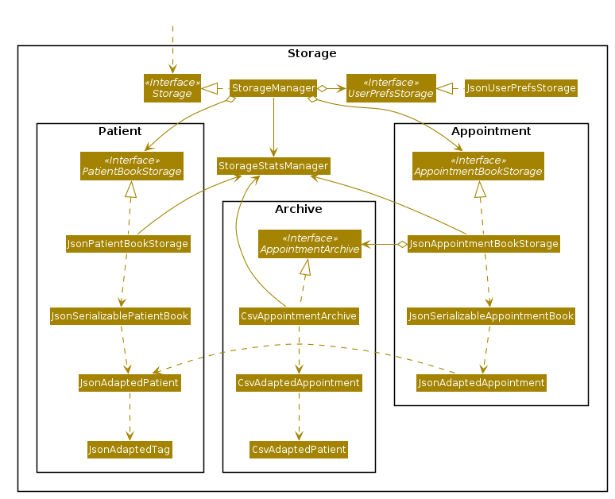
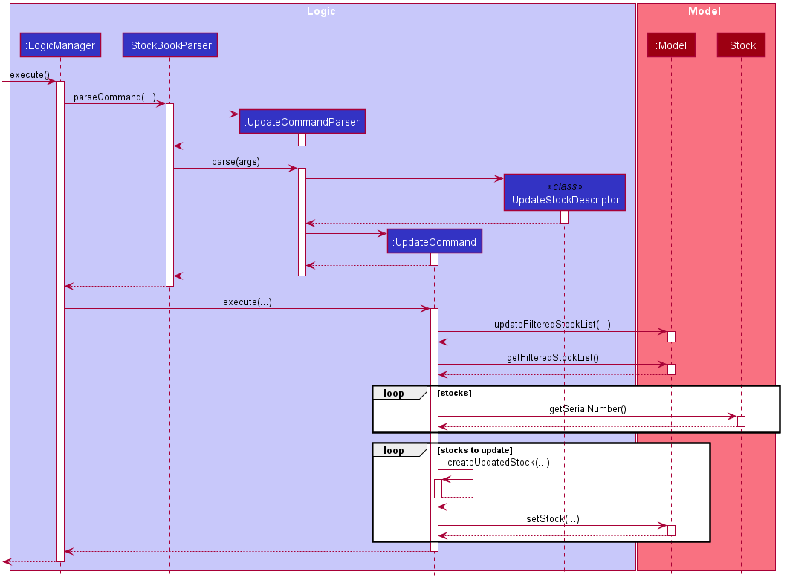
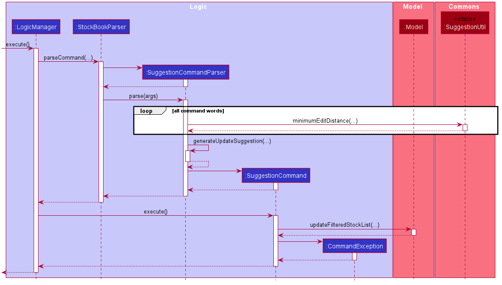
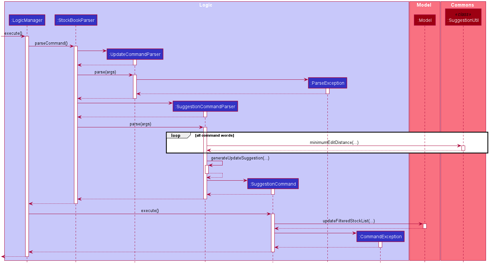
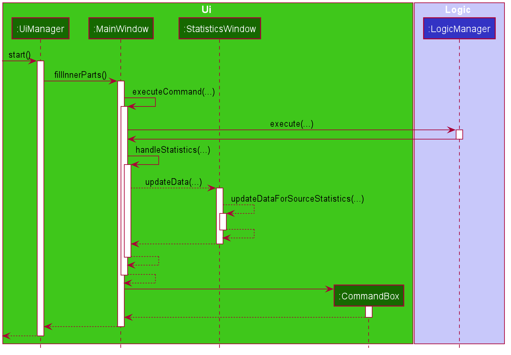
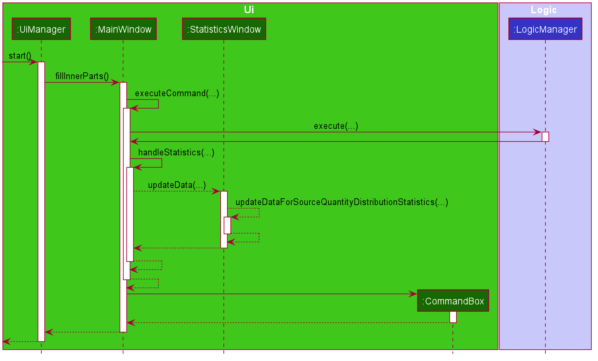
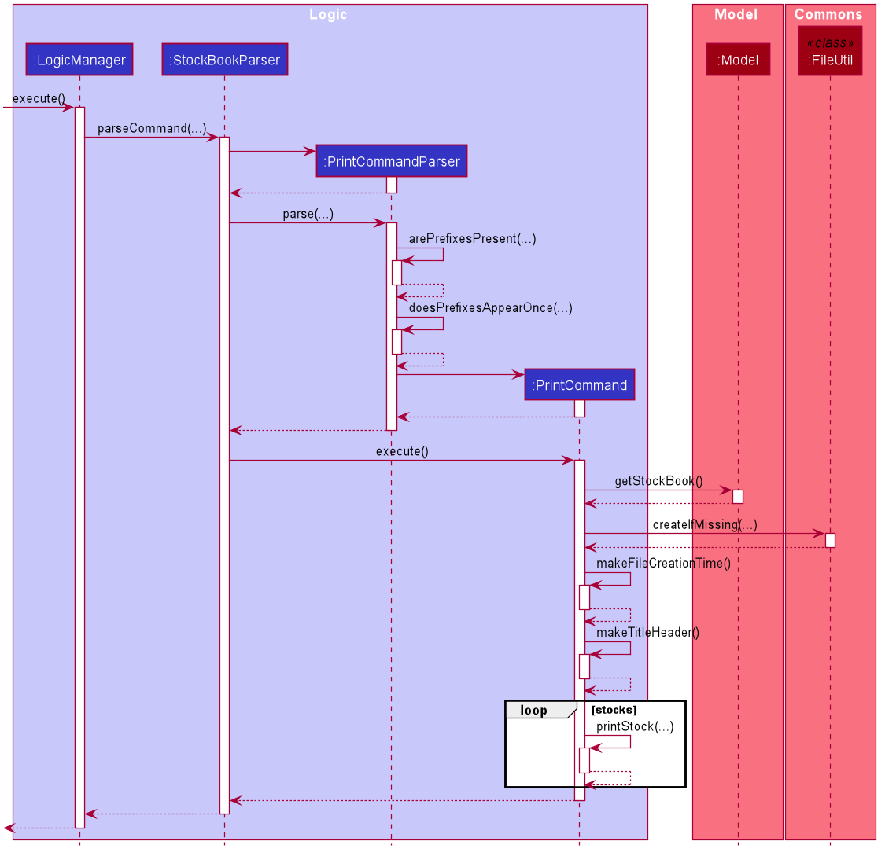

* Table of Contents
{:toc}

--------------------------------------------------------------------------------------------------------------------

## **Setting up, getting started**

Refer to the guide [_Setting up and getting started_](SettingUp.md).

--------------------------------------------------------------------------------------------------------------------

## **Design**

### Architecture

The ***Architecture Diagram*** given above explains the high-level design of the Warenager. Given below is a quick overview of each component.

:bulb: **Tip:** The `.puml` files used to create diagrams in this document can be found in
the [diagrams](https://github.com/AY2021S1-CS2103T-T15-3/tp/blob/master/docs/diagrams/) folder.
Refer to the [_PlantUML Tutorial_ at se-edu/guides](https://se-education.org/guides/tutorials/plantUml.html)
to learn how to create and edit diagrams.

**`Main`** has two classes called [`Main`](https://github.com/AY2021S1-CS2103T-T15-3/tp/blob/master/src/main/java/seedu/stock/Main.java)
and [`MainApp`](https://github.com/AY2021S1-CS2103T-T15-3/tp/blob/master/src/main/java/seedu/stock/MainApp.java). It is responsible for,
* At app launch: Initializes the components in the correct sequence, and connects them up with each other.
* At shut down: Shuts down the components and invokes cleanup methods where necessary.

[**`Commons`**](#common-classes) represents a collection of classes used by multiple other components.

The rest of the App consists of four components.

* [**`UI`**](#ui-component): The UI of the App.
* [**`Logic`**](#logic-component): The command executor.
* [**`Model`**](#model-component): Holds the data of the App in memory.
* [**`Storage`**](#storage-component): Reads data from, and writes data to, the hard disk.

Each of the four components,

* defines its *API* in an `interface` with the same name as the Component.
* exposes its functionality using a concrete `{Component Name}Manager` class (which implements the corresponding API `interface` mentioned in the previous point.

For example, the `Logic` component (see the class diagram given below) defines its API in the
`Logic.java` interface and exposes its functionality using the `LogicManager.java` class which implements the `Logic` interface.

**How the architecture components interact with each other**

The *Sequence Diagram* below shows how the components interact with each other for the scenario where the user issues the command `delete sn/ntuc1`.

The sections below give more details of each component.

### UI component

**API** :
[`Ui.java`](https://github.com/AY2021S1-CS2103T-T15-3/tp/blob/master/src/main/java/seedu/stock/ui/Ui.java)

The UI consists of a `MainWindow` that is made up of parts i.e.
`CommandBox`, `ResultDisplay`, `StockListPanel`, `StatusBarFooter`, `Tabs`
etc.
All these, including the `MainWindow`, inherit from the abstract `UiPart` class.

The `UI` component uses JavaFx UI framework. The layout of these UI parts are defined in matching `.fxml` files that are in the `src/main/resources/view` folder.
For example, the layout of the [`MainWindow`](https://github.com/AY2021S1-CS2103T-T15-3/tp/blob/master/src/main/java/seedu/stock/ui/MainWindow.java)
is specified in [`MainWindow.fxml`](https://github.com/AY2021S1-CS2103T-T15-3/tp/blob/master/src/main/resources/view/MainWindow.fxml)

1. The user enters a command into  the CommandBox.
1. The `UI` component then executes the user commands using the `Logic` component.
1. The `UI` component listens for changes to `Model` data so that the UI can be updated with the modified data.
1. The `UI` might change the tabs of the Main Window based on the user commands.

### Logic component

**API** :
[`Logic.java`](https://github.com/AY2021S1-CS2103T-T15-3/tp/blob/master/src/main/java/seedu/stock/logic/Logic.java)

1. `Logic` uses the `StockBookParser` class to parse the user command.
1. This results in a `Command` object which is executed by the `LogicManager`.
1. The command execution can affect the `Model` (e.g. adding a stock).
1. The result of the command execution is encapsulated as a `CommandResult` object which is passed back to the `Ui`.
1. In addition, the `CommandResult` object can also instruct the `Ui` to perform certain actions, such as displaying help to the user.

Given below is the Sequence Diagram for interactions within the `Logic` component for the `execute("list lt/all")` API call.

### Model component

**API** : [`Model.java`](https://github.com/AY2021S1-CS2103T-T15-3/tp/blob/master/src/main/java/seedu/stock/model/Model.java)

The `Model`,

* stores a `UserPref` object that represents the user’s preferences.
* stores the stock book data.
* stores the serial number sets book data (i.e. the data of all the serial numbers generated in Warenager)
* exposes an unmodifiable `ObservableList<Stock>` that can be 'observed'
e.g. the UI can be bound to this list so that the UI automatically updates when the data in the list change.
* does not depend on any of the other three components.

### Storage component

**API** : [`Storage.java`](https://github.com/AY2021S1-CS2103T-T15-3/tp/blob/master/src/main/java/seedu/stock/storage/Storage.java)

The `Storage` component,
* can save `UserPref` objects in json format and read it back.
* can save the stock book data in json format and read it back.
* can save the serial number sets book data in json format and read it back.

### Common classes

Classes used by multiple components are in the `seedu.stock.commons` package.

--------------------------------------------------------------------------------------------------------------------

## **Implementation**

This section describes some noteworthy details on how certain features are implemented.

### General Features
General features that are used in many of the implemented features are defined here.

#### StockBookParser
The `StockBookParser` is used to parse a full user input to determine if the user input corresponds to any of the
`COMMAND_WORD` in the various command classes. If the the user input does not conform the any of the expected format
required, Warenager will produce an error message.

### Add Feature

The mechanism for add feature is facilitated by `AddCommandParser`, `AddCommand` and `Model`.

#### AddCommand

`AddCommand` class extends `Command` interface. `AddCommand` class is tasked to add the new stock into the stock book
and creating a new `CommandResult` to be displayed to the user in the user interface.

Some important operations implemented here are:

* `AddCommand#execute()`
  Adds a stock in the stock book if it is not present and returns a new `CommandResult`
  to be displayed to the user in the user interface.

#### AddCommandParser
`AddCommandParser` class extends `Parser` interface. `AddCommandParser` class is tasked with parsing the
user inputs and generate a new `AddCommand`. The main logic of the add feature is encapsulated here.

`AddCommandParser` receives the user input, and extracts the arguments of the required prefixes.
 The `parse` method inside the `AddCommandParser` receives the user input, and extracts the
 arguments of the required prefixes. This `parse` method will then return an `Addcommand` with the given stock
 as argument if the user input is a valid `Addcommand` and throw a `ParseException` otherwise.

Some important operations implemented here are:

* `AddCommandParser#parse()`  
  Returns `Addcommand` to be executed.
* `AddCommandParser#arePrefixesPresent()`  
  Returns true if all required prefixes are present in the user input.
* `AddCommandParser#doesPrefixesAppearOnce()`  
  Returns true if all required prefixes appear only once in the user input.
* `AddCommandParser#doesLowQuantityPrefixAppearOnce()`  
  Returns true if low quantity prefix appear once.

#### Example Usage Scenario

Given below is one example usage scenario and explains how the add feature behaves at each step.

**Example 1: Adding a valid stock into the stock book**

Step 1. The user enters `add n/Apple s/Fairprice q/1000 l/Fruits section`.

Step 2. The command word add is extracted out in `StockBookParser`, and matches the `COMMAND_WORD`for AddCommand class.

Step 3. The remaining user input is the given to the AddCommandParser to determine if the user input contains the required fields.

Step 4. Inside `AddCommandParser#parse()` method, the remaining user input `n/Apple s/Fairprice q/1000 l/Fruits section`,
 will be subjected to checks by `AddCommandParser#arePrefixesPresent()` and `AddCommandParser#doesPrefixesAppearOnce()` methods. In this case,
 all prefixes are present and appears only once.

Step 5. The `AddCommandParser#parse()` method then proceeds to create a `Stock` object as the user input is valid.
 A default `SerialNumber` will be generated for this stock. All criteria of the `AddCommandParser#parse()` method are met,
 hence returning a `AddCommand` object.

Step 6. The `AddCommand#execute()` is then called by the `Logic Manager`. In this method, a unique serial number will be
 generated by `Model#generateNextSerialNumber`, and replaces the default serial number in the `Stock` object.

Step 7. The `AddCommand#execute()` then checks if the `Stock` exists in the `StockBook` by calling
 `Model#hasStock()`.

Step 8. If the stock exist in the `StockBook`, a `CommandException` will be thrown and displayed to the user.
 Otherwise, `Stock` object will be added in the `Stockbook` and a CommandResult with a successful add stock
 message will be displayed to the user.

#### Sequence Diagram

The following sequence diagram shows how the add feature works for **Example 1**:

#### Activity Diagram

The following activity diagram summarizes what happens when the add feature is triggered:

#### Design Consideration

##### Aspect: Input format for add command.

* **Alternative 1 (current implementation):** Required prefixes must only appear once.
  * Pros: No ambiguity on which prefix extract, and corresponding arguments used in the creation of stock.
  * Cons: User have to backtrack and change the argument corresponding to the field header.

* **Alternative 2:** Required prefix can appear for than once.
  * Pros: Only the argument corresponding to the last appearance of the prefix will be used. Allows users to input prefix and
  corresponding arguments to override the last occurence of this prefix.
  * Cons: Users may type 2 of the required prefixes accidentally and add a wrong stock into the stockbook.

### Update Feature

The mechanism for update feature is facilitated by `UpdateCommandParser, UpdateCommand, UpdateStockDescriptor`.

#### UpdateCommand

`UpdateCommand` class implements `Command` interface. `UpdateCommand` class is tasked with creating a new `CommandResult`
with the updated stocks message as its argument.

Some of the important operations implemented here are:

* `UpdateCommand#execute()`  
  Generates a new `CommandResult` with the updated stocks message as its argument.

* `UpdateCommand#stocksAsString()`  
  Generates the updated stocks message by transforming the updated stocks into their string descriptions.

* `UpdateCommand#createUpdatedStock()`  
  Generates the updated stock based on the information of the current stock in inventory and `UpdateStockDescriptor`.

#### UpdateCommandParser

`UpdateCommandParser` class implements `Parser` interface. `UpdateCommandParser` class is tasked with parsing the user inputs
and generate a new `UpdateCommand`.

`UpdateCommandParser` receives the prefixes and their values from the user input. The `UpdateCommandParser#parse()` will
check for compulsory prefixes and their values. `ParseException` will be thrown if the values are not valid or some
compulsory prefixes are missing.

Some of the important operations implemented here are:

* `UpdateCommandParser#parse()`  
  Parses the prefixes and their values attained from user input. This method will first check if all compulsory prefixes
  are present. This method will then create a new `UpdateStockDescriptor` based on the prefixes values.
  A `ParseException` will be thrown if any compulsory prefixes are missing or invalid values.

#### UpdateStockDescriptor

`UpdateStockDescriptor` is a inner static class inside `UpdateCommand`. This class is tasked with storing the temporary
values for the fields to be later updated into the stock in inventory.

#### Example Usage Scenario

Given below are some example usage scenarios and how the update mechanism behaves at each step. It is assumed that
the stock with serial number `fairprice1` exists in the inventory.

**Example 1: Update a stock's name and quantity**

Step 1. The user enters `update sn/fairprice1 n/Banana q/10000` to the CLI.

Step 2. The command word `update` is extracted out in `StockBookParser` and checked if it matches any valid command word.

Step 3. `update` is a valid command word. User input prefixes and their values are passed down to `UpdateCommandParser#parse()`

Step 4. `UpdateCommandParser#parse()` will check if the prefixes `sn/` exists as it is compulsory.

Step 5. The prefix `sn/` exist. `UpdateCommandParser#parse()` will extract the value of the prefix `sn/` which in this
case is `fairprice1`.

Step 6. `UpdateCommandParser#parse()` will extract the value of other prefixes present as well.

Step 7. `UpdateCommandParser#parse()` returns a new `UpdateCommand` with the `UpdateStockDescriptor` as its argument.
The `UpdateStockDescriptor` contains the values of the parsed prefixes.

Step 8. `Logic Manager` then calls `UpdateCommand#execute()`. Inside the method, it will check if the serial numbers
in `UpdateStockDescriptor` is found in the `Model`.

Step 9. All serial numbers matched. The method `UpdateCommand#createUpdatedStock()` is called to produce the new updated
stock.

Step 10. The corresponding stocks in current inventory is replaced by the new updated stocks.

Step 11. Returns a new `CommandResult` containing the updated stocks message as its argument.

Step 12. The updated stocks message is displayed to the user.

#### Sequence Diagram

The following sequence diagram shows how the update feature works for **Example 1**:

#### Activity Diagram

The following activity diagram summarizes what happens when the update feature is triggered:

#### Design Consideration

##### Aspect: What fields can be updated

* **Alternative 1 (current implementation):** disallow updating of serial number and source.
  * Pros: Serial number can be made as an identifier for every stock, making it easier to implement
    other features such as `add` and `find`. Unlocks the possibility of serial number being generated
    by source, since the source cannot be changed.
  * Cons: Take some degree of freedom from the user. The user cannot change serial number or source on his/her
    own without tampering directly with the `JSON` files.

* **Alternative 2:** allow updating of all fields in `Stock` class
  * Pros: Gives the user as much freedom as he/she wants. The user can update anything as he/she sees fit.
  * Cons: It will be harder to implement other features as the identifier for stocks which is the serial number
  can be changed by the user. Other features that use serial number as the identifier will have to adapt
  when the user changes the serial number.

##### Aspect: How does a stock gets updated

* **Alternative 1 (current implementation):** make a temporary copy and then replace original with copy
  * Pros: Eliminates the possibility of original data getting lost. If an update is unsuccessful then only
    the copy will be affected and not the original data. Moreover, all the fields are updated at the same time
    since we replace the original with a copy that has been completely updated.
  * Cons: Slower than just directly change the stock fields in the `StockBook` as we need to make a copy
    of the current stock, update the copy, and replace the original with the copy.

* **Alternative 2:** directly change the `Stock` fields in `StockBook`
  * Pros: Will be significantly faster than making a copy since we directly change the `Stock` itself.
  * Cons: At a risk of data corruption. Interrupting the update midway will cause the `Stock` currently
    undergoing the update to be corrupted as the original data that has been updated will be lost,
    but some fields may not be already updated due to the midway interruption.

### Bookmark Feature

The mechanism for bookmark feature is facilitated by BookmarkCommandParser, BookmarkCommand and Model.

#### BookmarkCommand

`BookmarkCommand` class extends the `Command` interface. `BookmarkCommand` class is tasked with changing
the isBookmarked parameter of the stocks indicated in parameters of the command to true and creating a
new `CommandResult` to be displayed to the user in the user interface.

Some important operations implemented here are:
* `BookmarkCommand#execute()` Bookmarks the stock in the stockbook if the stock is not already bookmarked.
Returns a new `CommandResult` to be displayed to the user
in the user interface.

### BookmarkCommandParser

`BookmarkCommandParser` class extends the `Parser` interface. `BookmarkCommandParser` class is tasked with
parsing the user inputs and generating a new `BookmarkCommand`. The main logic of the bookmark feature is
encapsulated here.

`BookmarkCommandParser` receives user input, and extracts the serialNumbers of the stocks to be bookmarked
from the arguments. The `parse` method of `BookmarkCommandParser` receives the user input, and extracts
the serialNumbers of the stocks to be bookmarked. The `parse` method then returns a new `BookmarkCommand`
with the given serialNumbers as argument if the user input is a valid `BookmarkCommand` and throws a
`ParseException` otherwise.

Some important operations implemented here are:
* `BookmarkCommandParser#parse()` returns BookmarkCommand to be executed.

### Example Usage Scenerio

Given Below is one example usage scenerio and explains how the add feature behaves at each step. It is assumed
that the stock with serial number `fairprice1` exists in the stock book.
**Example 1:Bookmarking a stock present in the stock book that is not already bookmarked**

Step 1. The user enters `bookmark sn/fairprice1` into the command box.

Step 2. The command word `bookmark` is extracted out in the `StockBookParser` and checked if it matches any
valid command word.

Step 3. `bookmark` is a valid command word. User input prefixes ,and their values are being passed down to
`BookmarkCommandParser#parse()`

Step 4. `BookmarkCommandParser#parse()` will check if the prefixes `sn/` exists as it is compulsory.

Step 5. The prefix `sn/` exist. `BookmarkCommandParser#parse()` will extract the value of the prefix `sn/`
which in this case is `fairprice1`.

Step 6. `BookmarkCommandParser#parse()` returns a new `BookmarkCommand` with the set of serial numbers
containing`fairprice1`.

Step 7. `Logic Manager` then calls `BookmarkCommand#execute()`. Inside the method, it will check if the
stock with the serial number `fairprice1` exists in the `Model`.

Step 8. The stock with serial number `fairprice1` exists. The `BookmarkCommand#execute()` method checks
if the stock is already bookmarked. Since the stock is not bookmarked before, the `isBookmarked` boolean
of the stock is changed to `true`. And the stock list is being sorted to push the newly bookmarked stock
to the top of the stocklist.

Step 9. The correspoding stocks in the stock book are replaced by the bookmarked stocks.

Step 10. Returns a new `CommandResult` containing the `MESSAGE_BOOKMARK_STOCK_SUCCESS` as its argument.

Step 12. The updated stock message is displayed to the user.

### Sequence Diagram

The following sequence diagram shows how the update feature works in **Example 1**:

### Activity Diagram

The following activity diagram summarizes what happens when the bookmark feature is triggered:

### Design Consideration

#### Aspect:How does a stock get bookmarked

* Alternative 1(current implementation):make a temporary copy then replace original with copy
    * Pros: Eliminates the possibility of original data getting lost. If a bookmarking is unsuccessful then only the copy
      will be affected and not the original data.
    * Cons: Slower than just directly change the stock fields in the `StockBook` as we need to make a copy of the current
      stock, update the copy, and replace the original with the copy.
* Alternative 2:directly changing `Stock` isBookmarked field in `StockBook`
    * Pros: Will be significantly faster than making a copy since we directly change the `Stock` itself.
    * Cons: At a risk of data corruption. Interrupting the update midway will cause the `Stock` currently undergoing the
      update to be corrupted as the original data that has been bookmarked will be lost, but some fields may not be already
      updated due to the midway interruption.

### Unbookmark Feature

The mechanism for bookmark feature is facilitated by UnbookmarkCommandParser, UnbookmarkCommand and Model.

#### UnbookmarkCommand

`UnbookmarkCommand` class extends the `Command` interface. `UnbookmarkCommand` class is tasked with changing
the isBookmarked parameter of the stocks indicated in parameters of the command to true and creating a
new `CommandResult` to be displayed to the user in the user interface.

Some important operations implemented here are:
* `UnbookmarkCommand#execute()` Bookmarks the stock in the stockbook if the stock is bookmarked.
Returns a new `CommandResult` to be displayed to the user in the user interface.

### BookmarkCommandParser

`UnbookmarkCommandParser` class extends the `Parser` interface. `UnbookmarkCommandParser` class is tasked with
parsing the user inputs and generating a new `UnbookmarkCommand`. The main logic of the bookmark feature is
encapsulated here.

`UnbookmarkCommandParser` receives user input, and extracts the serialNumbers of the stocks to be bookmarked
from the arguments. The `parse` method of `UnbookmarkCommandParser` receives the user input, and extracts
the serialNumbers of the stocks to be bookmarked. The `parse` method then returns a new `UnbookmarkCommand`
with the given serialNumbers as argument if the user input is a valid `UnbookmarkCommand` and throws a
`ParseException` otherwise.

Some important operations implemented here are:
* `UnbookmarkCommandParser#parse()` returns BookmarkCommand to be executed.

### Example Usage Scenerio

Given Below is one example usage scenerio and explains how the add feature behaves at each step. It is assumed
that the stock with serial number `fairprice1` exists in the stock book and is already bookmarked.
**Example 1:Bookmarking a stock present in the stock book that is not already bookmarked**

Step 1. The user enters `unbookmark sn/fairprice1` into the command box.

Step 2. The command word `unbookmark` is extracted out in the `StockBookParser` and checked if it matches any
valid command word.

Step 3. `bookmark` is a valid command word. User input prefixes ,and their values are being passed down to
`UnbookmarkCommandParser#parse()`

Step 4. `UnbookmarkCommandParser#parse()` will check if the prefixes `sn/` exists as it is compulsory.

Step 5. The prefix `sn/` exist. `UnbookmarkCommandParser#parse()` will extract the value of the prefix `sn/`
which in this case is `fairprice1`.

Step 6. `UnbookmarkCommandParser#parse()` returns a new `UnbookmarkCommand` with the set of serial numbers
containing`fairprice1`.

Step 7. `Logic Manager` then calls `UnbookmarkCommand#execute()`. Inside the method, it will check if the
stock with the serial number `fairprice1` exists in the `Model`.

Step 8. The stock with serial number `fairprice1` exists. The `UnbookmarkCommand#execute()` method checks
if the stock is already bookmarked. Since the stock is not bookmarked before, the `isBookmarked` boolean
of the stock is changed to `false`. And the stock list is being sorted to push the newly unbookmarked stock
to its original index in the stocklist.

Step 9. The correspoding stocks in the stock book are replaced by the unbookmarked stocks.

Step 10. Returns a new `CommandResult` containing the `MESSAGE_UNBOOKMARK_STOCK_SUCCESS` as its argument.

Step 12. The updated stock message is displayed to the user.

### Sequence Diagram

The following sequence diagram shows how the update feature works in **Example 1**:

### Activity Diagram

The following activity diagram summarizes what happens when the bookmark feature is triggered:

### Design Consideration

#### Aspect:How does a stock get bookmarked

* Alternative 1(current implementation):make a temporary copy then replace original with copy
    * Pros: Eliminates the possibility of original data getting lost. If a unbookmarking is unsuccessful then only the copy
      will be affected and not the original data.
    * Cons: Slower than just directly change the stock fields in the `StockBook` as we need to make a copy of the current
      stock, update the copy, and replace the original with the copy.
* Alternative 2:directly changing `Stock` isBookmarked field in `StockBook`
    * Pros: Will be significantly faster than making a copy since we directly change the `Stock` itself.
    * Cons: At a risk of data corruption. Interrupting the update midway will cause the `Stock` currently undergoing the
      update to be corrupted as the original data that has been bookmarked will be lost, but some fields may not be already
      updated due to the midway interruption.

### Suggestion Feature

The mechanism for suggestion feature is facilitated by `SuggestionCommandParser, SuggestionCommand, SuggestionUtil`.

#### SuggestionCommand

`SuggestionCommand` class implements `Command` interface. `SuggestionCommand` class is tasked with creating a new `CommandResult`
with the suggestion message to be displayed to the user as its argument. The suggestion message to be displayed
is gathered from the result of the parsing stage for suggestion.

Some of the important operations implemented here are:

* `SuggestionCommand#execute()`  
  Generates a new `CommandResult` with the suggestion message as its argument.

#### SuggestionCommandParser

`SugestionCommandParser` class implements `Parser` interface. `SuggestionCommandParser` class is tasked with parsing the
user inputs and generate a new `SuggestionCommand`. The main logic of the suggestion feature is encapsulated here.

`SuggestionCommandParser` receives the user input, along with either the faulty command word or parsing error messages
from another `Parser` object. The `parse` method inside the `SuggestionCommandParser` will then try to infer the best
possible correct command format using the minimum edit distance heuristic provided inside `SuggestionUtil`.

Some of the important operations implemented here are:

* `SuggestionCommandParser#parse()`  
  Parses the user input and parsing error messages thrown from another `Parser` and returns a new `SuggestionCommand`
  with the suggestion to be shown as its argument. The inference for the command word to be suggested is made in here.
  After the correct command word is inferred, then it will call helper functions to generate the suggestion messages.

* `SuggestionCommandParser#generateClearSuggestion()`  
  Generates the suggestion message for a clear command.

* `SuggestionCommandParser#generateTabSuggestion()`  
  Generates the suggestion message for a tab command.

* `SuggestionCommandParser#generateSortSuggestion()`  
  Generates the suggestion message for a sort command.

* `SuggestionCommandParser#generateBookmarkSuggestion()`  
  Generates the suggestion message for a bookmark command.

* `SuggestionCommandParser#generateUnbookmarkSuggestion()`  
  Generates the suggestion message for an unbookmark command.

* `SuggestionCommandParser#generateAddSuggestion()`  
  Generates the suggestion message for an add command.

* `SuggestionCommandParser#generateListSuggestion()`  
  Generates the suggestion message for a list command.

* `SuggestionCommandParser#generateHelpSuggestion()`  
  Generates the suggestion message for a help command.

* `SuggestionCommandParser#generateExitSuggestion()`  
  Generates the suggestion message for a exit command.

* `SuggestionCommandParser#generateUpdateSuggestion()`  
  Generates the suggestion message for an update command.

* `SuggestionCommandParser#generateDeleteSuggestion()`  
  Generates the suggestion message for a delete command.

* `SuggestionCommandParser#generateFindSuggestion()`  
  Generates the suggestion message for a find command.

* `SuggestionCommandParser#generateFindExactSuggestion()`  
  Generates the suggestion message for a find exact command.

* `SuggestionCommandParser#generateStatisticsSuggestion()`  
  Generates the suggestion message for a stats command.

* `SuggestionCommandParser#generateNoteSuggestion()`  
  Generates the suggestion message for a note command.

* `SuggestionCommandParser#generateDeleteNoteSuggestion()`  
  Generates the suggestion message for a note delete command.

* `SuggestionCommandParser#generateStockViewSuggestion()`  
  Generates the suggestion message for a stock view command.

* `SuggestionCommandParser#generatePrintSuggestion()`  
  Generates the suggestion message for a print command.

#### SuggestionUtil

`SuggestionUtil` class contains the utilities needed to infer the suggestion to be displayed to the user.

The utilities provided inside are:

* `SuggestionUtil#min()`  
  Computes the minimum of three integers.

* `SuggestionUtil#minimumEditDistance()`  
  Computes the minimum edit distance between 2 strings.

#### Example Usage Scenario

Given below are some example usage scenarios and how the suggestion mechanism behaves at each step.

**Example 1: Unknown command word**

Step 1. The user enters `updt n/Milk s/Fairprice` which contains an unknown command word `updt`.

Step 2. The command word `updt` is extracted out in `StockBookParser` and checked if it matches any valid command word.

Step 3. The command word `updt` does not match any valid command word. It is then passed down to `SuggestionCommandParser`
along with `n/Milk s/Fairprice` and `SuggestionCommandParser#parse()` is invoked.

Step 4. Inside `SuggestionCommandParser#parse()` method, the closest command word to `updt` will be inferred.
The inference uses the minimum edit distance heuristic. `SuggestionCommandParser#parse()` will
count the minimum edit distance from `updt` to every other valid command word.

Step 5. The new valid command word generated is the one with the smallest edit distance to `updt`. The command word
to be suggested in this case is `update`.

Step 6. `SuggestionCommandParser#parse()` method will call `SuggestionCommandParser#generateUpdateSuggestion()`
to generate the suggestion message to be displayed to the user.

Step 7. During the generation of suggestion message, `SuggestionCommandParser#generateUpdateSuggestion()` will check
first if the compulsory prefix exist. In this case the compulsory prefix which is `sn/` does not exist.
`sn/<serial number>` is then added to the suggestion message.

Step 8. All prefixes the user entered that is valid for `update` command and its arguments are nonempty will then
be appended to the suggestion message. If there exist prefix whose argument is empty, then `SuggestionCommandParser#generateUpdateSuggestion()`
will fill the argument with a default value. In this case, prefixes `n/ s/` are present and their arguments are nonempty.
`n/Milk s/Fairprice` is then added to the suggestion message.

Step 9. Lastly `SuggestionCommandParser#generateUpdateSuggestion()` will append the usage message for `update` command.

Step 10. `SuggestionCommandParser#parse()` method returns a new `SuggestionCommand` with the suggestion message
to be displayed as its argument.

Step 11. `SuggestionCommand` is executed and produces a new `CommandResult` to display the message to the user.

Step 12. The suggestion `update sn/<serial number> n/Milk s/Fairprice` is displayed to the user along with what kind of
error and the message usage information. In this case the error is `unknown command` and the message usage is from
`UpdateCommand`.

**Example 2: Invalid command format**

Step 1. The user enters `update n/Milk s/` which contains a valid command word `update`.

Step 2. The command word `update` is extracted out in `StockBookParser` and checked if it matches any valid command word.

Step 3. The command word `update` is a valid command word. Input is then passed to `UpdateCommandParser#parse()`.

Step 4. Inside `UpdateCommandParser#parse()`, the user input is then parsed to create a new `UpdateCommand`. However,
since the compulsory prefix `sn/` is not provided, a `ParseException` will be thrown.

Step 5. `ParseException` thrown will be caught in `StockBookParser`. The user input along with parsing error messages
will then be passed into `SuggestionCommandParser#parse()`.

Step 6. Constructor of `SuggestionCommandParser` will separate the parsing error messages header and body and then
`SuggestionCommandParser#parse()` is invoked.

Step 7. Inside `SuggestionCommandParser#parse()` method, the closest command word to `update` will be inferred.
The inference uses the minimum edit distance heuristic. `SuggestionCommandParser#parse()` will
count the minimum edit distance from `update` to every other valid command word.

Step 8. Since `update` is already a valid command, the inference will generate `update` again.

Step 9. `SuggestionCommandParser#parse()` method will call `SuggestionCommandParser#generateUpdateSuggestion()`
to generate the suggestion message to be displayed to the user.

Step 10. During the generation of suggestion message, `SuggestionCommandParser#generateUpdateSuggestion()` will check
first if the compulsory prefix exist. In this case the compulsory prefix which is `sn/` does not exist.
`sn/<serial number>` is then added to the suggestion message.

Step 11. All prefixes the user entered that is valid for `update` command and its arguments are nonempty will then
be appended to the suggestion message. If there exist prefix whose argument is empty, then `SuggestionCommandParser#generateUpdateSuggestion()`
will fill the argument with a default value. In this case, the prefix `n/` is present and its argument is nonempty.
`n/Milk` is then added to the suggestion message. The prefix `s/` is present, but its argument is empty.
`s/<source>` is then added to the suggestion message.

Step 12. Lastly `SuggestionCommandParser#generateUpdateSuggestion()` will append the usage message for `update` command.

Step 13. `SuggestionCommandParser#parse()` method returns a new `SuggestionCommand` with the suggestion message
to be displayed as its argument.

Step 14. `SuggestionCommand` is executed and produces a new `CommandResult` to display the message to the user.

Step 15. The suggestion `update sn/<serial number> n/Milk s/<source>` is displayed to the user along with what kind of
error and the message usage information. In this case the error is `Invalid command format` and the message usage is from
`UpdateCommand`.

#### Sequence Diagram

The following sequence diagram shows how the suggestion feature works for **Example 1**:

The following sequence diagram shows how the suggestion feature works for **Example 2**:

#### Minimum Edit Distance Heuristic

The minimum edit distance between two strings is defined as the minimum cost needed to transform one into the other.

The transformation cost comes from the types of editing operations performed and how many of those operations performed.

There are three types of editing operations:

* **Insertion**:  
  Inserts a new character in the string. Insertion has a cost of 2.  
  Example: `apple -> apples` and `sly -> slay`.

* **Deletion**:  
  Deletes a character from the string. Deletion has a cost of 2.  
  Example: `oranges -> orange` and `bandana -> banana`.

* **Substitution**:  
  Change a character in the string into another different character. Substitution has a cost of 3. It is more expensive
  to substitute than inserting or deleting a character. However, the cost is less than two times the cost of
  either insertion or deletion, so that it is cheaper to substitute rather than deleting and then inserting.
  Example: `prey -> pray` and `like -> lime`.

The smaller the minimum edit distance between two strings, the more similar they are.
The algorithm to compute the minimum edit distance between two strings is implemented on `SuggestionUtil#minimumEditDistance()`.

**Algorithm Explanation**

Suppose there are two strings:
* `X` with length `n`.
* `Y` with length `m`.

Define `D(i, j)` to be the minimum edit distance between the first `i` characters of `X` and the first `j` characters of `Y`.

Now if the character at position `i` in `X` equals the character at position `j` in `Y`, then simply  
`D(i, j) = D(i - 1, j - 1)`  

Else, if they are not the same, consider doing all possible editing operations:
* **Insertion**:  
  If `i > j`, then we can insert the character at position `j + 1` in `X` to position `j + 1` at `Y`.
  Hence, `D(i, j) + 2 = D(i, j + 1)` in this case.  
  If `i < j`, then we can insert the character at position `i + 1` in `Y` to position `i + 1` at `X`.
  Hence, `D(i, j) + 2 = D(i + 1, j)` in this case.  

* **Deletion**:  
  If `i > j`, then we can delete the character at position `i` in `X`.
  Hence, `D(i, j) = D(i - 1, j) + 2` in this case.  
  If `i < j`, then we can delete the character at position `j` in `Y`.
  Hence, `D(i, j) = D(i, j - 1) + 2` in this case.  

* **Substitution**:  
  We can change the character at position `i` in X to match the character at position `j` in `Y`, or
  we can change the character at position `j` in `Y` to match the character at position `i` in `X`.  
  Hence, `D(i, j) = D(i - 1, j - 1) + 3` in this case.  

The base cases for the recursion are:
* `D(i, 0) = 2 * i` since the best way is to delete everything from `X` or inserting every character in `X` to `Y`.
* `D(0, j) = 2 * j` since the best way is to delete everything from `Y` or inserting every character in `Y` to `X`.

In all possible editing operations, the value `D(i, j)` can only change to:
* `D(i - 1, j) + 2`
* `D(i, j - 1) + 2`
* `D(i - 1, j - 1) + 3`

Since we want to find the minimum edit distance,  
`D(i, j) = min(D(i - 1, j) + 1, D(i, j - 1) + 1, D(i - 1, j - 1) + 3)`.

Since it is a recursion, the algorithm is implemented using bottom-up dynamic programming to improve speed
by remembering already computed states. The current implementation do the following steps:

1. Creates a table to store computed states (2D `dp` array).
2. Fill up the base cases in the table.
3. Fill up the table according to the recursion formula above.
4. Returns the minimum edit distance between the two strings compared.

**Time complexity**: `O(n * n)` due to having to fill up the table with size `n * n`.

**Space complexity**: `O(n * n)` due to the table size.

#### Activity Diagram

The following activity diagram summarizes what happens when the suggestion feature is triggered:

#### Design Consideration

##### Aspect: String Comparison Heuristics

* **Alternative 1 (current implementation):** minimum edit distance heuristic
  * Pros: Provides a good estimate how far apart two strings are. A standard dynamic programming algorithm.
  * Cons: Maybe hard to be understood to people who don't understand dynamic programming.

* **Alternative 2:** substring comparison
  * Pros: Very simple to implement. A brute force algorithm that checks every substring.
  * Cons: The distance estimate between two strings is quite bad, especially if no substring overlaps. Slow in speed
    compared to minimum edit distance. Generates worse suggestion compared to minimum edit distance.

### Find and FindExact Features

#### Description
The Find and FindExact Features allow users to search for `Stock` items in the stockbook.

There are two commands users can use:
* `find` - Stock that matches ALL keywords of ANY field will be displayed.
* `findexact` - Stock that matches ALL keywords of ALL fields will be displayed.

Find and FindExact features allow search for four fields:
* Name
* Serial Number
* Source
* Location stored in warehouse

#### Mechanism
The mechanism for the Find feature is facilitated by classes `FindCommand`(or `FindExactCommand`),
`FindCommandParser` (or `FindExactCommandParser`), `FindUtil` and `FieldContainsKeywordsPredicate`
subclasses that include:
* `NameContainsKeywordsPredicate`
* `SerialNumberContainsKeywordsPredicate`
* `SourceContainsKeywordsPredicate`
* `LocationContainsKeywordsPredicate`

#### FindCommandParser
The `FindCommandParser` (as with the `FindExactCommandParser`) class
implements the `Parser` interface.
`FindCommandParser` class is tasked with parsing the user inputs
to generate a `FindCommand` with a list of `FieldContainsKeywordsPredicate`.

The list of `FieldContainsKeywordsPredicate` is obtained from parsing
the user input, to produce either of the following predicates shown
in the table below, for each `Prefix` and keywords pair.

Prefix              | FieldContainsKeywordsPredicate
----------------------------------- | --------------------------------------
n/<keywords>        | NameContainsKeywordsPredicate
s/<keywords>        | SourceContainsKeywordsPredicate
l/<keywords>        | LocationContainsKeywordsPredicate
sn/<keywords>       | SerialNumberContainsKeywordsPredicate

`FindCommandParser` implements the following important operations:

* `FindCommandParser#parse()` -
 Parses the user input to produce a `FindCommand`.
* `FindCommandParser#parsePrefixAndKeywords()` -
 Generates a list of `FieldContainsKeywordsPredicate` from a map of `Prefix` and keywords.
* `FindCommandParser#generatePredicate()` -
 Generates a `FieldContainsKeywordsPredicate` from a `Prefix` and keywords.

#### FindCommand / FindExactCommand
The `FindCommand` class (as with the `FindExactCommand` class)
extends the `Command` abstract class. The `FindCommand` class
is tasked with creating a new `CommandResult` that represents
the result of the execution of a `FindCommand`.

The construction of a `FindCommand` takes in a list of `FieldContainsKeywordsPredicate`.
These predicates will be evaluated to filter the Stock items to be displayed to user.

When a `FindCommand` is executed, a `CommandResult` is constructed with the status message,
showing the searched terms and searched results of the number of stocks found from the search.

`FindCommand` implements the following important operations:

* `FindCommand#execute()` -
Executes the search and returns the result message of the search.

#### FindUtil
The `FindUtil` class is part of the util package.
It provides utility to combine the list of `FieldContainsKeywordsPredicate`
of the `FindCommand` into a composed `Predicate<Stock>`.

`Find` feature requires the `Stock` to fulfill only one
`FieldContainsKeywordsPredicate` in the list for `Stock`
to be displayed. The mechanism used to combine the predicates
into a composed Predicate<Stock> for `Find` is Java 8 Predicate method,
Predicate.or().

`FindExact` feature requires the `Stock` to fulfill all
`FieldContainsKeywordsPredicate` in the list for `Stock` to be displayed.
The mechansim used to combine the predicates into a composed Predicate<Stock>
for `FindExact` is Java 8 Predicate method, Predicate.and().

`FindUtil` implements the following important operations:

* `FindUtil#generateCombinedPredicatesWithOr()` -
 Combines predicates using Predicate.or()
* `FindUtil#generateCombinedPredicatesWithAnd()` -
 Combines predicates using Predicate.and()

#### FieldContainsKeywordsPredicate

`FieldContainsKeywordsPredicate` is an abstract class
that implements the interface Predicate<Stock>.
Its subclasses are `NameContainsKeywordsPredicate`,
`LocationContainsKeywordsPredicate`, `SerialNumberContainsKeywordsPredicate`
and `SourceContainsKeywordsPredicate`, which inherit and implement the method
`test(Stock)`, and is constructed with a list of String keywords to test.

* `NameContainsKeywordsPredicate` implements test() to evaluate true
 when a `Stock`'s name contains all the keywords in the list.
* `SerialNumberContainsKeywordsPredicate` implements test() to evaluate true
 when a `Stock`'s serial number contains all the keywords in the list.
* `LocationContainsKeywordsPredicate` implements test() to evaluate true
 when a `Stock`'s location stored contains all the keywords in the list.
* `SourceContainsKeywordsPredicate` implements test() to evaluate true
 when a `Stock`'s source contains all the keywords in the list.
* For all `FieldContainsKeywordsPredicate`, if keyword given is an
 empty string, method test() evaluates to false.

Note: For any `FieldContainsKeywordsPredicate#test()` to return true,
 field of `Stock` must contain ALL keywords in the list.

`FieldContainsKeywordsPredicate` implements the following important operations:
* `FieldContainsKeywordsPredicate#test()` -
 Evaluates this predicate on the given Stock argument.

#### Example Usage Scenario
Given below are some example usage scenarios and how
 the find feature mechanism behaves at each step.

**Example 1: Finding all stocks with Name that contains
 "pineapple" OR serial number that contains "pine"**

Step 1. The user enters `find n/pineapple sn/pine`.

Step 2. `MainWindow#executeCommand()` is called with the user input.
Within this method, `LogicManager#execute()` is called with the
user input to obtain a `CommandResult`.

Step 3. The command word `find` is extracted out in `StockBookParser`.
The command word matches `COMMAND_WORD`: `find` in the `FindCommand` class.

Step 4. The remaining user input is passed to the `FindCommandParser`
to generate a list of `FieldContainsKeywordsPredicate` to evaluate on the stocks.

Step 5. Within the `FindCommandParser#parsePrefixAndKeywords()` method,
the respective `NameContainsKeywordsPredicate` and `SerialNumberContainsKeywordsPredicate`
will be created using the `Prefix` and keywords given, and
added to the list of `FieldContainsKeywordsPredicate`.

Step 6. The `FindCommandParser#parse()` method then returns a `FindCommand`,
constructed with the list of `FieldContainsKeywordsPredicate`.

Step 7. On construction of the `FindCommand`, the method
`FindUtil#generateCombinedPredicatesWithOr()` is called to generate
a composed `Predicate<Stock>` with the list of `FieldContainsKeywordsPredicate`
, which only requires one `FieldContainsKeywordsPredicate` to be fulfilled for stock to be displayed.

Step 8. `LogicManager#execute()` then calls `FindCommand#execute()` method,
with current `Model` as argument. Within this method call,
`Model#updateFilteredStockList` method evaluates the composed
Predicate<Stock> on all the stocks in the stock list.

Step 9. For each `FieldContainsKeywordsPredicate`, `FieldContainsKeywordsPredicate#test()`
evaluates the predicate on the stock.

Step 10. Stocks that do not match the search terms are filtered out.
The result of the search is stored in the returning `CommandResult`object
and displayed with `ResultDisplay`.

Step 11. User views the new `StockListPanel` with the filtered stock list.

**Example 2: Finding all stocks with Name that contains "pineapple"
AND serial number that contains "pine"**

Steps are the same as Example 1, with the replacement of:

Command word:
* `find` to `findexact`

Classes:
* `FindCommandParser` to `FindExactCommandParser`
* `FindCommand` to `FindExactCommand`

Method(s):
* Step 7: `FindUtil#generateCombinedPredicatesWithOr()` to
 `FindUtil#generateCombinedPredicatesWithAnd()`

Step:
* Step 7. On construction of the `FindExactCommand`, the method `FindUtil#generateCombinedPredicatesWithAnd()`
 is called to generate a composed `Predicate<Stock>` with the list of `FieldContainsKeywordsPredicate`
 , which requires all `FieldContainsKeywordsPredicate` to be fulfilled for stock to be displayed.

#### Sequence Diagram
The following sequence diagram shows how the Find feature works for Example 1:

#### Activity Diagram
The following activity diagram summarizes what happens when
 the Find feature is triggered:

#### Design Consideration

##### Aspect: Matching of stock and user input for each field
* **Alternative 1 (current implementation):** For any field prefix, a stock
matches user input if the stock's field contains all of the keywords entered.  
(eg. For `find n/ this is a banana`, stock matches user input if it contains
all keywords `this`, `is`, `a`, `banana`)
 * Pros: Results in a more accurate matching of stocks to user input.
 * Cons: User has to be careful not to input irrelevant terms along with terms
 that match with the stock's field, else the stock intended will not show up.

* **Alternative 2:** For any field prefix, a stock matches user input
if the stock's field contains at least one of the keywords entered.  
(eg. For `find n/ this is a banana`, stock matches user input if it contains
at least one of `a`, `this`, `is`, `banana`.)
 * Pros: More flexible as desired stock will be displayed with at least
 one matching keyword, even when irrelevant keywords are entered.
 * Cons: A less accurate list of matching stocks is displayed as more stocks will
 match with the keywords since the search criteria is less rigid.

##### Aspect: Input format for find command.

* **Alternative 1 (current implementation):** Duplicate prefixes cannot be present in user input.
  * Pros: Removes ambiguity in choosing the corresponding arguments used in searching for stocks.
  * Cons: Users have to retype their command in the case where
  they forget which prefixes they have typed and input duplicate prefixes.

* **Alternative 2:** Duplicate prefixes can be present in user input.
  * Pros: Only the argument corresponding to the last appearance of the prefix will be used.
  Allows users to input prefix and corresponding arguments to override the last occurrence of this prefix.
  * Cons: Users may type 2 of the required prefixes accidentally and search for unintended stocks.

### Note Feature

#### Description
The Note feature allows users to add and delete notes from a stock.

There are two commands users can use:
* `note` - Adds a note to the stock specified by the stock's serial number.
Note: Multiple notes can be added to the stock.
* `notedelete` - Deletes a note, specified by note index, from the stock specified by the stock's serial number.

Prefixes used in the Note feature:

Command       | Fields       | Prefixes
--------------| -------------| ---------------------------
`note`        | Serial Number Note | sn/ nt/
`notedelete`  | Serial Number Note Index | sn/ ni/

#### Mechanism for Adding Notes
The mechanism for adding notes is facilitated by classes `NoteCommand`, and `NoteCommandParser`.

#### NoteCommandParser
The `NoteCommandParser` class implements the `Parser` interface.
`NoteCommandParser` class is tasked with parsing the user inputs
to generate a `NoteCommand` with arguments `SerialNumber` of the stock
and `Note` to add.

The `SerialNumber` and `Note` is obtained from parsing the user input.
Upon successful parsing, `NoteCommand` object generated will then be passed on to the `LogicManager` to be executed.

If the user inputs do not conform to the valid format specified for the `NoteCommand`,
an exception is thrown and no `NoteCommand` object will be created.

If the `Serial Number` of stock is not found in Warenager's data,
an error message is shown to prompt the user that Warenager cannot find the `Serial Number` given.

`NoteCommandParser` implements the following important operations:

* `NoteCommandParser#parse()` -
 Parses the user input to produce a `NoteCommand`.

#### NoteCommand
The `NoteCommand` class extends the `Command` abstract class. The `NoteCommand` class is tasked with creating a new `CommandResult` that represents the result of the execution of a `NoteCommand`.

The construction of a `NoteCommand` takes in a `Serial Number` of stock and a `Note` to add to the stock.

When a `NoteCommand` is executed, a `CommandResult` is constructed with the status message,
showing the successful adding of the note to the stock.
The execution of `NoteCommand` adds the note to the stock and updates the stock list in `Model`
with the stock with the added note.

`NoteCommand` implements the following important operations:

* `NoteCommand#execute()` -
Executes the search and returns the result message of the search.

#### Example Usage Scenario (Adding Note)
Given below are some example usage scenarios and how
 the adding note feature mechanism behaves at each step.

**Example 1: Adding a note to a stock with Serial Number "ntuc1"**

Step 1. The user enters `note sn/ntuc1 nt/Bought from ntuc.`.

Step 2. `MainWindow#executeCommand()` is called with the user input.
Within this method, `LogicManager#execute()` is called with the
user input to obtain a `CommandResult`.

Step 3. The command word `note` is extracted out in `StockBookParser`.
The command word matches `COMMAND_WORD`: `note` in the `NoteCommand` class.

Step 4. The remaining user input is passed to the `NoteCommandParser` where within the
`NoteCommandParser#parse()` method, the respective `ParserUtil#parseSerialNumber()` and
`ParserUtil#parseNote` methods are called to generate a `Serial Number` of the stock
and `Note` to add to stock.

Step 5. The `NoteCommandParser#parse()` method then returns a `NoteCommand`,
constructed with the `Serial Number` of stock and `Note` to add to stock. 

Step 6. `LogicManager#execute()` then calls `NoteCommand#execute()` method,
with current `Model` as argument. Within this method call, `Stock#addNote()` adds the note to the stock,
and the `Model` is updated with the stock with the added note.

Step 7. The result of the note command is stored in the returning `CommandResult`object
and displayed with `ResultDisplay`.

Step 8. User views the new `StockListPanel` with the filtered stock list.

#### Mechanism for Deleting Notes
The mechanism for deleting notes is facilitated by classes `NoteDeleteCommand`, `NoteDeleteCommandParser` and `NoteIndex`.

#### NoteDeleteCommandParser
The `NoteDeleteCommandParser` class implements the `Parser` interface. 
`NoteDeleteCommandParser` class is tasked with parsing the user inputs
to generate a `NoteDeleteCommand` with arguments `SerialNumber` of the stock
and `NoteIndex` of the note to delete.

The `SerialNumber` and `NoteIndex` is obtained from parsing the user input.
Upon successful parsing, `NoteDeleteCommand` object generated will then be passed on to the `LogicManager` to be executed.

If the user inputs do not conform to the valid format specified for the `NoteDeleteCommand`,
an exception is thrown and no `NoteDeleteCommand` object will be created.

If the `Serial Number` of stock is not found in Warenager's data,
an error message is shown to prompt the user that Warenager cannot find the `Serial Number` given.

`NoteDeleteCommandParser` implements the following important operations:

* `NoteDeleteCommandParser#parse()` -
 Parses the user input to produce a `NoteDeleteCommand`.

#### NoteDeleteCommand
The `NoteDeleteCommand` class extends the `Command` abstract class. The `NoteDeleteCommand` class is tasked with creating a new `CommandResult` that represents the result of the execution of a `NoteDeleteCommand`. 

The construction of a `NoteDeleteCommand` takes in a `Serial Number` of stock and a `NoteIndex` of note to delete.

When a `NoteDeleteCommand` is executed, a `CommandResult` is constructed with the status message,
showing the successful adding of the note to the stock.
The execution of `NoteDeleteCommand` deletes the note from the stock and updates the stock list in `Model`
with the stock with the deleted note.

`NoteDeleteCommand` implements the following important operations:

* `NoteDeleteCommand#execute()` -
Executes the search and returns the result message of the search.

#### NoteIndex
The `NoteIndex` class represents the index of the note that is displayed in the Notes column
under the `Data` tab of Warenager's UI. A `NoteIndex` of the note to be deleted from stock
is generated in `NoteDeleteCommandParser` from the parsing of user input.

`NoteIndex` implements the following important operations:

* `NoteIndex#isValidNoteIndex()` -
 Checks the input and returns true if the given input is a valid note index
* `NoteIndex#fromZeroBased()` -
 Creates a new NoteIndex using a zero-based index.
* `NoteIndex#fromOneBased()` - 
 Creates a new NoteIndex using a one-based index.

#### Example Usage Scenario (Deleting Note(s))
Given below are some example usage scenarios and how
 the note delete feature mechanism behaves at each step.

**Example 1: Deleting a note at index 1 from a stock with Serial Number "ntuc1"**

Step 1. The user enters `notedelete sn/ntuc1 ni/1`.

Step 2. `MainWindow#executeCommand()` is called with the user input.
Within this method, `LogicManager#execute()` is called with the
user input to obtain a `CommandResult`.

Step 3. The command word `notedelete` is extracted out in `StockBookParser`.
The command word matches `COMMAND_WORD`: `notedelete` in the `NoteDeleteCommand` class.

Step 4. The remaining user input is passed to the `NoteDeleteCommandParser` where within the
`NoteDeleteCommandParser#parse()` method, the respective `ParserUtil#parseSerialNumber()` and
`ParserUtil#parseNoteIndex` methods are called to generate a `Serial Number` of the stock
and `NoteIndex` of the note to delete from the stock. 

Step 5. The `NoteDeleteCommandParser#parse()` method then returns a `NoteDeleteCommand`,
constructed with the `Serial Number` of stock and `NoteIndex` of the note to delete from the stock. 

Step 6. `LogicManager#execute()` then calls `NoteDeleteCommand#execute()` method,
with current `Model` as argument. Within this method call, `Stock#deleteNote()` deletes the note
at the index specified by the `NoteIndex` from the stock,
and the `Model` is updated with the stock with the deleted note.

Step 7. The result of the note delete command is stored in the returning `CommandResult`object
and displayed with `ResultDisplay`.

Step 8. User views the new `StockListPanel` with the filtered stock list.

**Example 2: Deleting ALL notes from a stock with Serial Number "ntuc1"**

Step 1. The user enters `notedelete sn/ntuc1 ni/0`.

Steps 2 to 5 are the same as `Example 1: Deleting a note at index 1 from a stock with Serial Number "ntuc1"` above.

Step 6. `LogicManager#execute()` then calls `NoteDeleteCommand#execute()` method,
with current `Model` as argument. Within this method call, `Stock#deleteNote()` deletes all the notes,
specified by `NoteIndex` constructed with input "0", from the stock,
and the `Model` is updated with the stock with the deleted note.

Steps 7 and 8 are the same as `Example 1: Deleting a note at index 1 from a stock with Serial Number "ntuc1"` above.

#### Sequence Diagram
The following sequence diagram shows how the Note feature (adding of note) works for Example 1:

Sequence diagram for deleting note(s) will not be shown as it is similar to that of the adding of note,
with the replacement of certain methods meant for the adding of note to those meant for the deleting of note.

#### Activity Diagram
The following activity diagram summarizes what happens when
 the Note feature (adding of note) is triggered:

Activity diagram for deleting note(s) will not be shown as it is similar to that of the adding of note,
with the replacement of adding to deleting.

#### Design Consideration
The below aspects are the design considerations for the Note feature in adding and deleting notes from stocks.

##### Aspect: Representation of notes for a stock
* **Alternative 1 (current implementation):** Multiple notes can be added to a stock and
each note is indexed.  
* Pros: Allows user to add multiple notes to stock while maintaining the ability to clearly
differentiate between the different notes. With indexed notes, users are able to reference
specific notes in command and delete the specific note.
* Cons: Users may not want the indexing, as it may seem like a priority ranking for the notes.

* **Alternative 2:** Multiple notes can be added to a stock and each note is denoted by bullet point.  
* Pros: Allows user to add multiple notes to stock while maintaining ability to clearly differentiate
between the different notes.
* Cons: Unable to reference a specific note in command and unable to clearly reference a certain note
to be deleted, but will still be able to delete all notes.

* **Alternative 3:** A stock can only have one note, but each time a note is added, it replaces
the previous note.  
* Pros: Allows user to quickly replace notes with just one command.
* Cons: Users are unable to add multiple notes to the same stock and differentiate between the notes.
Each time the user wants to add on to a note, the user has to retype the entire note again with the
added details.

##### Aspect: Input format for note and notedelete commands.

* **Alternative 1 (current implementation):** Duplicate prefixes cannot be present in user input.
  * Pros: Removes ambiguity in choosing the corresponding arguments used in adding notes to stocks or
  deleting notes from stocks.
  * Cons: Users have to retype their command in the case where
  they forget which prefixes they have typed and input duplicate prefixes.

* **Alternative 2:** Duplicate prefixes can be present in user input.
  * Pros: Only the argument corresponding to the last appearance of the prefix will be used.
  Allows users to input prefix and corresponding arguments to override the last occurrence of this prefix.
  * Cons: Users may type 2 of the required prefixes accidentally and add a note to an unintended stock,
  or delete an unintended note from the stock.

### Statistics Feature

The backend mechanism for statistics feature is facilitated by `StockBookParser, StatisticsCommandParser, StatisticsCommand`
and one of the child command classes of StatisticsCommand that includes (as of documentation):
* `SourceStatisticsCommand`
* `SourceQuantityDistributionStatisticsCommand`

The frontend mechanism for statistics feature mainly facilitated by the controller class `StatisticsWindow` for
`StatisticsWindow.fxml`. The choice of display is `JavaFX Piechart` from the `JavaFX Charts`.

#### StatisticsCommandParser
`StatisticsCommandParser` class extends `Parser` interface. `StatisticsCommandParser` class is tasked with parsing the
user inputs (without the command word) and generates a new `StatisticsCommand` object. The `StatisticsCommand` will be one of the
existing child commands stated above.

Upon successful parsing, the `StatisticsCommand` object will then be passed on to the respective child command classes
for logical execution.

If the user inputs do not correspond to any of the `STATISTICS_TYPE` words in the child command classes, an error message
will be shown and no `StatisticsCommand` object will be created.

Some of the more important operations implemented here are:

* `StatisticsCommandParser#parse()`  
  Parses the user input and returns a new `StatisticsCommand` object that can be belongs to either one of the
  child classes of `StatisticsCommand`. This is aided by the `StatisticsCommandParser#getStatisticsType()` method.

* `StatisticsCommandParser#getStatisticsType()`  
  This is a further abstracted method that reads the input string and determines what is the correct statistical type
  command that the user wants.

:warning: It is to note that some child classes requires parameters in their constructors for their respective purposes.

#### StatisticsCommand

`StatisticsCommand` abstract class extends `Command` interface. While the `StatisticsCommand` class contains minimal
functionality, it serves as an inheritance bridge between the various types of statistics command, to comply with
`SOLID` principles.

The respective child classes will be tasked with consolidating the required data and storing it in a `CommandResult` object.

#### SourceStatisticsCommand
`SourceStatisticsCommand` class extends `StatisticsCommand` class. The `SourceStatisticsCommand` class is tasked with
consolidating the required data and storing it in a `CommandResult` object. The statistics shown by this class
describes the **percentage of the different sources** existing in Warenager.

The format for this command is fixed and is ensured by the parser. Any errors arising from this command will be an
assertion error.

The main operation implemented in `SourceStatisticsCommand` class is:
* `SourceStatisticsCommand#execute()`
  Generates a new `CommandResult`. Some key attributes of this object consists of:
   1. `statisticsData` The statistics data to be displayed.
   2. `otherStatisticsDetails` that includes:
        * Statistics type

#### SourceQuantityDistributionStatisticsCommand
`SourceQuantityDistributionStatisticsCommand` class extends `StatisticsCommand` class. The
`SourceQuantityDistributionStatisticsCommand` requires a single parameter: `targetSource`. The statistics shown by this class
describes the **distribution among the different stocks** of the given `targetSource`.

If the `targetSource` is not found by Warenager, this will result in an error message to be shown to prompt the
user that Warenager cannot find the target source company.

The main operation implemented in `SourceQuantityDistributionStatisticsCommand` class is:
* `SourceQuantityDistributionStatisticsCommand#execute()`
  Generates a new `CommandResult`. The key attributes of this object consists of:
   1. `statisticsData` The statistics data to be displayed.
   2. `otherStatisticsDetails` that includes:
        * Statistics type
        * Target source

#### StatisticsWindow
`StatisticsWindow` is the controller class for the `StatisticsWindow.fxml`. Here, the piechart in the class is updated
with the correct data corresponding to the command the user inputs. The title will also be customised to the
type of statistics the user wants to display. The compiled data from the `CommandResult` returned by the `#execute`
methods will be read here and supplied to the pie chart.

Some of the more important operations implemented here are:

* `StatisticsWindow#updateData()`  
  This method clears all the current data in the piechart and inserts the correct data depending on the Statistics type
  from `otherStatisticsDetails` in the `CommandResult` object. It then calls the respective methods needed to extract
  the compiled data.

* `StatisticsCommandParser#updateDataForSourceQuantityDistributionStatistics()`  
  This method is called if the type of statistics is `SourceQuantityDistribution Statistics`. Some calculations are done
  here to provide users with more data.

* `StatisticsCommandParser#updateDataForSourceStatistics()`  
  This method is called if the type of statistics is `Source Statistics`. Some calculations are done here to provide users
  with more data.

#### Example Usage Scenario

Given below are some example usage scenarios and how the statistics mechanism behaves at each step.

**Example 1: Calling statistics for Source Companies**

Step 1. The user enters `stats st/source`.

Step 2. The command word `stats` is extracted out in `StockBookParser`, in this case, it matches the `COMMAND_WORD`,
        which is `stats` in the `StatisticsCommand` class.

Step 3. The remaining user input is the given to the `StatisticsCommandParser` to determine which type of statistics
        the user wants.

Step 4. Inside `StatisticsCommandParser#parse()` method, the header will be dropped, resulting in the remaining user
        input to be `source`. This matches to the criteria for `SourceStatisticsCommand`, and returning a
        `SourceStatisticsCommand` object.

Step 5. The `SourceStatisticsCommand#execute()` is then called by the `Logic Manager`. Data extraction and compilation
        will be done and stored in the returning `CommandResult` object. The `CommandResult` object will also store
        the type of statistics in `otherStatisticsDetails`, in this case will be `source`, for later usage.

Step 6. When the `UiManager` calls the `SourceQuantityDistributionStatisticsCommand#execute()` method, this will invoke
        `MainWindow#execute()`. This `CommandResult` is of the statistics class, leading to the `MainWindow#handleStatistics()`
         method call.

Step 7. `MainWindow#handleStatistics()` will then call the `StatisticsWindow#updateData()` which in turn will determine display the
        data in the desired format, based on the type of statistics from `otherStatisticsDetails` in `CommandResult` from Step 5.
        In this case, `StatisticsWindow#updateDataForSourceStatistics()` will be called.

Step 8. This will then update the pie chart with both the relevant data, format, and title to suit the type of statistics
        to be shown. The UI of the window to be shown is customised by the styling based on the `StatisticsWindow.fxml` file.
 
Step 9. Warenager jumps to the **Statistics** tab and the updated piechart is displayed accordingly.

**Example 2: Calling statistics for Source Quantity Distribution**

Step 1. The user enters `stats st/source-qt-ntuc`. `ntuc` is a valid source that exists in Warenager.

Step 2. The command word `stats` is extracted out in `StockBookParser`, in this case, it matches the `COMMAND_WORD`,
        which is `stats` in the `StatisticsCommand` class.

Step 3. The remaining user input is the given to the `StatisticsCommandParser` to determine which type of statistics
        the user wants.

Step 4. Inside `StatisticsCommandParser#parse()` method, the header will be dropped, resulting in the remaining user
        input to be `source-qt-ntuc`. This matches to the criteria for `SourceQuantityDistributionStatisticsCommand`,
        and returning a `SourceQuantityDistributionStatisticsCommand` object.

Step 5. The `SourceQuantityDistributionStatisticsCommand#execute()` is then called by the `Logic Manager`. Data
        extraction and compilation will be done and stored in the returning `CommandResult` object. The `CommandResult` object
        will also store the type of statistics in `otherStatisticsDetails`, in this case will be `source-qt-`, for later usage.
        For this command, the `targetSource` will also be stored in `otherStatisticsDetails` as it is needed to customise the
        title for the piechart.

Step 6. When the `UiManager` calls the `SourceQuantityDistributionStatisticsCommand#execute()` method, this will invoke
        `MainWindow#execute()`. This `CommandResult` is of the statistics class, leading to the `MainWindow#handleStatistics()`
        method call.

Step 7. `MainWindow#handleStatistics()` will then call the `StatisticsWindow#updateData()` which in turn will determine display the
        data in the desired format, based on the type of statistics from `otherStatisticsDetails` in `CommandResult` from Step 5.
        In this case, `StatisticsWindow#updateDataForSourceQuantityDistributionStatistics()` will be called.

Step 8. This will then update the pie chart with both the relevant data, format, and title to suit the type of statistics
        to be shown. The UI of the window to be shown is customised by the styling based on the `StatisticsWindow.fxml` file.

Step 9. Warenager jumps to the **Statistics** tab and the updated piechart is displayed accordingly.

#### Sequence Diagram

The following sequence diagram shows how the Logic aspect of the statistics feature works for **Example 1**:

The following sequence diagram shows how the Ui aspect of the statistics feature works for **Example 1**:

#### Sequence Diagram

The following sequence diagram shows how the Logic aspect of the statistics feature works for **Example 2**:

The following sequence diagram shows how the Ui aspect of the statistics feature works for **Example 2**:

#### Activity Diagram

The following activity diagram summarizes what happens when the statistics feature is triggered:

#### Design Considerations

##### Aspect: UI view for statistics

* **Alternative 1 (current implementation):** Display in alternate tab.
  * Pros: Reduces panel usage since it does not share a common space with the stockcards display.
  * Cons: May require users to change tabs when a stock is updated.

* **Alternative 2:** Side-by-side view beside the stock cards in the same tab.
  * Pros: Reduce interruption between typing.
  * Cons: Statistical views are not often used but rather, only after huge changes over time. In order to display the
          piechart properly, there needs to be a sufficiently large area. This leads to a huge portion of display space
          not being utilised efficiently when other commands are being used.

##### Aspect: Choice of charts as the primary display for statistics
Pie chart is being used as the choice of statistical display to aid the lack of relativity between stocks
in Warenager. Absolute numbers of each stock is already displayed by the stockcards in Warenager. Pie charts
are more useful when working out the compositions of the data.

#### Future statistical features
With the expansion of more data fields for each stock, there will be more varieties of statistics that can be
shown based on these new fields.

### Sort Feature
The mechanism for sort feature is facilitated by `SortCommandParser, SortCommand, SortUtil`.

#### SortCommand
`SortCommand` class extends `Command` interface. `SortCommand` class is tasked with creating a new `CommandResult`
with the sort result to be displayed to the user as its argument. The sort message generated is based on the sorted
field.

Some of the important operations implemented here are:

* `SortCommand#execute()`  
  Generates a new `CommandResult` with the sort result as its argument. Creates the comparator needed to sort
  from the `fieldToSort` and `isReversed` passed down by `SortCommandParser#parse()`.
  After the comparator is created, `Model#sortFilteredStockList()` is called with the comparator as
  its argument to sort the inventory.

#### SortCommandParser

`SortCommandParser` class implements `Parser` interface. `SortCommandParser` class is tasked with parsing the
user inputs and generate a new `SortCommand`.

`SortCommandParser` receives the user input and gets the compulsory prefixes needed for sort feature to function.
If any of the compulsory prefixes are not present or their values are invalid, then a `ParseException` will be thrown
indicating an error in parsing the user input.

Some of the important operations implemented here are:

* `SortCommandParser#parse()`  
  Generates a new `SortCommand` with the field to be sorted and its order as the arguments. This method is tasked
  with parsing the compulsory prefixes needed and passing their values to `SortCommand`. If any of the compulsory
  prefixes are not present or their values are invalid, a `ParseException` will be thrown.

#### SortUtil

`SortUtil` class contains the utilities needed to generate the comparator for the sorting to be executed.

The utilities provided inside are:

* `SortUtil#getFieldDescription()`  
  Generates a string describing the current sorted field.

* `SortUtil#generateComparator()`  
  Generates a suitable comparator for sorting based on the provided field.

* `SortUtil#generateReverseComparator()`  
  Generates a reversed comparator for sorting based on the provided field.

* `SortUtil#generateNameComparator()`  
  Generates a comparator based on name field. The behavior is that it will compare two names `n1`, `n2` and
  returns an integer with value
    * `< 0` if `n1 < n2`
    * `= 0` if `n1 == n2`
    * `> 0` if `n1 > n2`

  Based on this behavior, this method by default sort by name in ascending order.

* `SortUtil#generateSourceComparator()`  
  Generates a comparator based on source field. It will compare two sources `s1`, `s2` and have the same exact
  behaviour as `SortUtil#generateNameComparator()`. This method by default sort by source in ascending order.

* `SortUtil#generateLocationComparator()`  
  Generates a comparator based on location field. It will compare two locations `l1`, `l2` and have the same exact
  behaviour as `SortUtil#generateNameComparator()`. This method by default sort by location in ascending order.

* `SortUtil#generateSerialNumberComparator()`  
  Generates a comparator based on serial number field. It will compare two serial numbers `sn1`, `sn2`
  and have the same exact behaviour as `SortUtil#generateNameComparator()`.
  This method by default sort by serial number in ascending order.

* `SortUtil#generateQuantityComparator()`  
  Generates a comparator based on quantity field. It will compare two quantity `q1`, `q2` and have the same exact
  behaviour as `SortUtil#generateNameComparator()`. This method by default sort by quantity in ascending order.

* `SortUtl#generateGeneralComparator()`  
  Generates a comparator based on serial number field and whether the stocks are bookmarked or low on quantity.
  It will assign points to stock if they are bookmarked or low on quantity. Bookmarked stocks receive higher
  points than stocks on low quantity. Stocks with larger points will be first on the resulting list.
  For stocks with the same points, tie breaking is done by sorting them according to their serial number
  in ascending order.

#### Example Usage Scenario

Given below are some example usage scenarios and how the sort mechanism behaves at each step.

**Example 1: Sort by name and in ascending order**

Step 1. The user enters `sort o/ascending by/name` to the CLI.

Step 2. The command word `sort` is extracted out in `StockBookParser` and checked if it matches any valid command word.

Step 3. `sort` is a valid command word. User input prefixes and their values are passed down to `SortCommandParser#parse()`

Step 4. `SortCommandParser#parse()` will check if the prefixes `o/` and `by/` both exist.

Step 5. Both prefixes exist. `SortCommandParser#parse()` will extract the value of the prefix `o/` which in this case is
`ascending` and create a new enum `Order` with value `ASCENDING`.

Step 6. Since the `Order` is `ASCENDING`, `isReversed` will be set to `false`.

Step 7. `SortCommandParser#parse()` will extract the value of the prefix `by/` which in this case is `name`
and create a new enum `Field` with value `NAME`

Step 8. The method returns a new `SortCommand` with the `NAME` and `isReversed` as its arguments.

Step 9. `LogicManager` calls `SortCommand#execute()`. `SortCommand#execute()` generates the comparator based on
the field and `isReversed`.

Step 10. `SortCommand#execute()` calls `Model#sortFilteredStockList()` and sorts the inventory.

Step 11. `SortCommand#execute()` returns the `CommandResult`. The message generated is based on the field sorted.

Step 12. The sort success message is displayed to the user.

#### Sequence Diagram

The following sequence diagram shows how the sort feature works for **Example 1**:

#### Activity Diagram

The following activity diagram summarizes what happens when the sort feature is triggered:

#### Design Considerations

##### Aspect: Sorting order

* **Alternative 1 (current implementation):** ascending and descending are both supported
  * Pros: Gives more flexibility to the user. Sometimes user may want to view in ascending order, sometimes
  user may also want to view in descending order.
  * Cons: A slightly longer command format will be needed as user needs to pass in a prefix for the order.

* **Alternative 2:** only allow ascending order.
  * Pros: A shorter command format for user to type in. Only need to specify the field to be sorted.
  * Cons: Gives less flexibility to the user. Less variation in behaviors.

### Stock View Feature

#### Description
The Stock View feature allows users to view the details of a single stock under the `Stock View` tab. 

The command that users can use is:
* `stockview` - Displays the details of the stock, specified by its serial number, under the `Stock View` tab.

Command       | Field        | Prefix
--------------| -------------| ---------------------------
`stockview`   | Serial Number | sn/

Details of the stock that are displayed are:
* Name
* Serial Number
* Source
* Quantity (Quantity left, Low quantity)
* Location stored in warehouse
* Notes

#### Mechanism
The backend mechanism for viewing a stock is facilitated by classes `StockViewCommand`, `StockViewCommandParser`.

The frontend mechanism for viewing a stock is mainly facilitated by these classes:
* the controller class `StockViewCard` for StockViewCard.fxml
* the controller class `StockViewWindow` for StockViewWindow.fxml

The choice of display is JavaFX `ListView` in `StockViewWindow` of the details of stock, where graphics are displayed
using containers `StockViewCard` for each field of stock.

#### StockViewCommandParser
The `StockViewCommandParser` class implements the `Parser` interface. 
`StockViewCommandParser` class is tasked with parsing the user inputs
to generate a `StockViewCommand` with the `SerialNumber` of the stock.

The `SerialNumber` is obtained from parsing the user input.
Upon successful parsing, `StockViewCommand` object generated will then be passed on to the `LogicManager` to be executed.

If the user inputs do not conform to the valid format specified for the `StockViewCommand`,
an exception is thrown and no `StockViewCommand` object will be created.

If the `Serial Number` of stock is not found in Warenager's data,
an error message is shown to prompt the user that Warenager cannot find the `Serial Number` given.

`StockViewCommandParser` implements the following important operations:

* `StockViewCommandParser#parse()` -
 Parses the user input to produce a `StockViewCommand`.

#### StockViewCommand
The `StockViewCommand` class extends the `Command` abstract class. The `StockViewCommand` class is tasked with creating a new `CommandResult` that represents the result of the execution of a `StockViewCommand`. 

The construction of a `StockViewCommand` takes in a `Serial Number` of stock to be viewed.

When a `StockViewCommand` is executed, a `CommandResult` is constructed with the status message,
showing the successful viewing of the stock.
Upon successful execution of `StockViewCommand`, Warenager will jump to the `Stock View` tab, where the details of
the stock is displayed.
This command does not change the `Model`.

`StockViewCommand` implements the following important operations:

* `StockViewCommand#execute()` -
Executes the search and returns the result message of the search.

#### StockViewWindow

The `StockViewWindow` class is the controller class for StockViewWindow.fxml. The `StockViewWindow` is tasked with
creating a new `StockViewCard` for each detail of the stock.

If there is a stock currently being viewed, `MainWindow#updateStockView()` will generate a new `StockViewWindow`
with the updated details of the stock.

It is to note that the `StockViewWindow` also implements a `StockViewCell` class which extends `ListCell`, where the
graphics of the details of the Stock are displayed using the `StockViewCard`. Within `StockViewCell`, the method `StockViewCell#updateItem()` is implemented, which sets the graphics displayed by `StockViewCell`.

`StockViewWindow` implements the following important operations:

* `StockViewWindow#getStockToView()` -
 Returns the Stock to be viewed from the updated stock list.

* `StockViewWindow#upperCaseFirstCharacter()` -
 Upper cases the first character of the string representation of the detail of the Stock
 to the format to be displayed in Stock View tab.

#### StockViewCard
An UI component that displays information of a field of a `Stock`.
A field is either: Name, Serial Number, Source, Quantity, Location stored in warehouse,
or Notes represented as String.

The `StockViewCard` is used in the setting of graphics in `StockViewCell` in `StockViewWindow`.

#### Example Usage Scenario
Given below are some example usage scenarios and how the stock view feature mechanism behaves
at each step.

**Example 1: Viewing a stock with Serial Number "ntuc1"**

Step 1. The user enters `stockview sn/ntuc1`.

Step 2. `MainWindow#executeCommand()` is called with the user input.
Within this method, `LogicManager#execute()` is called with the
user input to obtain a `CommandResult`.

Step 3. The command word `stockview` is extracted out in `StockBookParser`.
The command word matches `COMMAND_WORD`: `stockview` in the `StockViewCommand` class.

Step 4. The remaining user input is passed to the `StockViewCommandParser` where within the
`StockViewCommandParser#parse()` method, the `ParserUtil#parseSerialNumber()`  method is called
to return a valid `Serial Number` of the stock. 

Step 5. The `StockViewCommandParser#parse()` method then returns a `StockViewCommand`,
constructed with the `Serial Number` of stock. 

Step 6. When `MainWindow#fillInnerParts()` is called by `UIManager#start()`, `MainWindow#executeCommand()` is called.
The `LogicManager#execute()` then calls `StockViewCommand#execute()` method. 
The result of the stock view command and the `Stock` to view, is stored in the
returning `CommandResult`object and displayed with `ResultDisplay`. 

Step 7. Within `MainWindow#executeCommand()`, `MainWindow#handleStockView()` is called. Within this method call, `MainWindow#updateStockView()` which creates a `StockViewWindow` and update the details of the Stock
to be displayed in the **Stock View** tab.

Step 8. Warenagerr jumps to the **Stock View** tab, where the details of the Stock are displayed.

#### Sequence Diagram
The following sequence diagram shows how the Logic of Stock View feature works for Example 1:

The following sequence diagram shows how the UI of Stock View feature works for Example 1:

#### Activity Diagram
The following activity diagram summarizes what happens when the Stock View feature is triggered:

#### Design Consideration

##### Aspect: Retention of information in the Stock View tab
* **Alternative 1 (current implementation):** When user clicks away from the Stock View tab, information
of the stock that was viewed is retained in the Stock View tab.  
 * Pros: User is able to click back to the Stock View tab to re-view the information that was viewed before.
User does not have to retype the command to view the same stock.
 * Cons: User may want to clean away the Stock View tab after viewing. 

* **Alternative 2:** When user clicks away from the Stock View tab, the information displayed in the
Stock View tab is cleared.
 * Pros: User is able to have a cleaned Stock View tab, after leaving the Stock View tab.
 * Cons: User is unable to refer back to the information that was viewed previously and would have to retype the command.
 
##### Aspect: Updating of information of stock of the stock viewed
* **Alternative 1 (current implementation):** For any updates to the stock that is being viewed,
the information displayed under 'Stock View' tab is automatically updated.  
 * Pros: When user clicks back to the 'Stock View' tab after updating, adding notes or deleting notes
from the stock that was viewed, the stock's information displayed in the Stock View tab is updated.
 * Cons: User may want to view the information that was before the update.
 
* **Alternative 2:** For any updates to the stock that is being viewed,
the information displayed under 'Stock View' tab is not updated.  
 * Pros: User is able to see the information before the update.
 * Cons: If user wants to view the information after the update, user has to retype the command to view
the same stock.

### Print Feature

The mechanism for print feature is facilitated by `PrintCommandParser`, `PrintCommand`, `FileUtil` and
`Model`.

#### PrintCommandParser
`PrintCommandParser` class extends `Parser` interface. `PrintCommandParser` class is tasked with parsing the
user inputs and generate a new `PrintCommand`. The main logic of the print feature is encapsulated here.

The `parse` method inside the `PrintCommandParser` receives the user input, and extracts the
 arguments of the required prefix. This `parse` method will then return an `Printcommand` with the given file name
 as argument if the user input is a valid file name and throw a `ParseException` otherwise.

Some important operations implemented here are:

* `PrintCommandParser#parse()`  
  Returns `Printcommand` to be executed.
* `PrintCommandParser#arePrefixesPresent()`  
  Returns true if all required prefixes are present in the user input.
* `PrintCommandParser#doesPrefixesAppearOnce()`  
  Returns true if all required prefixes appear only once in the user input.

#### PrintCommand

`PrintCommand` class extends `Command` interface. `PrintCommand` class is tasked to create a csv file and
 write all stocks in the stock book into this file. `PrintCommand` then creates a new `CommandResult`
that represents the result of the execution of a `PrintCommand`.

Some important operations implemented here are:

* `PrintCommand#execute()`
  Creates a csv file and writes all stocks in the stock book into this file and returns a new `CommandResult`
  to be displayed to the user in the user interface.
* `PrintCommand#makeFileCreationTime()`  
  Creates the file creation time of the csv file.
* `PrintCommand#makeTitleHeader()`
  Creates the header for the csv file.
* `PrintCommand#printStock()`
  Converts the stock into a string to be stored in the csv file.

#### Example Usage Scenario

Given below is an example usage scenario and how the print feature behaves at each step.

**Example 1: Creating a csv file with valid file name**

Step 1. The user enters `print fn/stocks`.

Step 2. The command word print is extracted out in `StockBookParser`, and matches the `COMMAND_WORD` for `PrintCommand` class.

Step 3. The remaining user input is the given to the PrintCommandParser to determine if the user input contains the required fields.

Step 4. Inside `PrintCommandParser#parse()` method, the remaining user input `fn/stocks`,
 will be subjected to checks by the `PrintCommandParser#arePrefixesPresent()` and `PrintCommandParser#doesPrefixesAppearOnce()` methods. In this case,
 all prefixes are present and appear only once.
 
Step 5. The `PrintCommandParser#parse()` method then proceeds to check if the user input is a valid file name.
 A file name is valid if it contains only alphanumeric characters. In this case, the file name is valid as it only contains alphabet.
 All criteria of the `PrintCommandParser#parse()` method are met, hence returning a `PrintCommand` object.

Step 6. `PrintCommand#execute()` is then called by the `Logic Manager`. In this method, an observable stock book will
 be retrieved from the `Model`. 

Step 7. `PrintCommand#execute()` then calls `FileUtil#createIfMissing()` method to create a csv file with a file name corresponding to the user input
 in `[root directory of Warenager]/data/userinput.csv`.
 
Step 8. `PrintCommand#execute()` then calls `PrintCommand#makeFileCreationTime()`, `PrintCommand#makeTitleHeader()` to create the
 file creation time and headers for the fields in stock and stores them in the csv file.

Step 9. `PrintCommand#execute()` then calls `PrintCommand#printStock()` to get string of the stock to be stored in the csv file,
 and stores this string into the csv file. This step is repeated for all stocks in the stock book.
 
Step 10. `PrintCommand#execute()` then returns a new `CommandResult` to be displayed to the user.

Step 11. The user can now access the cvs file in `[root directory of Warenager]/data/stocks.csv`.

#### Sequence Diagram

The following sequence diagram shows how the print feature works for **Example 1**:

The following activity diagram summarizes what happens when the print feature is triggered:

#### Design Considerations

##### Aspect: Acceptable file name

* **Alternative 1 (current implementation):** File name can only be alphanumeric characters.
  * Pros: Regex to be used to check for the input file name can be used across all operating systems.
  Relatively simpler to implement too.
  * Cons: Users could not use symbols for the file name.

* **Alternative 2:** Allow different regex for different operating systems.
  * Pros: Allows users to use symbols for the file name.
  * Cons: Different operating systems have different requirements for the file name. The restricted
  symbols for an operating system can be different from another, which leads to different performance
  or behavior for the same input file name.

--------------------------------------------------------------------------------------------------------------------

## **Documentation, logging, testing, configuration, dev-ops**

* [Documentation guide](Documentation.md)
* [Testing guide](Testing.md)
* [Logging guide](Logging.md)
* [Configuration guide](Configuration.md)
* [DevOps guide](DevOps.md)

--------------------------------------------------------------------------------------------------------------------

## **Appendix: Requirements**

### Product scope

**Target user profile**:

* has a need to manage a significant number of stocks
* prefer desktop apps over other types
* can type fast
* prefers typing to mouse interactions
* is reasonably comfortable using CLI apps

**Value proposition**: Allows users to manage stocks faster than a typical mouse/GUI driven app.
Includes higher level features such as ability to bookmark important stocks and highlights stocks
that are low in quantity to improve user experience.

### User stories

Priorities: High (must have) - `* * *`, Medium (nice to have) - `* *`, Low (unlikely to have) - `*`

| Priority | As a …​                                                     | I want…​                                                                             | So that…​                                                              |
| -------- | ----------------------------------------------------------- | ------------------------------------------------------------------------------------ | ---------------------------------------------------------------------- |
| `* * *`  | delivery assistant                                          | to be able to edit the stocks in the inventory in bulk                               | I can save time and do deliveries more efficiently                     |
| `* * *`  | tech savvy warehouse manager                                | to be able to add my stock to the application                                        | I can record new stocks                                                |
| `* * *`  | tech savvy warehouse manager who can type fast              | to be able to delete my stock in the application                                     | I can remove unwanted stock                                            |
| `* * *`  | warehouse manager                                           | to be able to search for stocks easily                                               | I can refer to them quickly                                            |
| `* * *`  | admin                                                       | to print out all the stocks in the inventory                                         | I can keep records of the inventory                                    |
| `* * *`  | warehouse manager                                           | to be able to view all the stocks there are in the warehouse clearly                 | I can make decisions better                                            |
| `* * *`  | forgetful warehouse manager                                 | to list the features and the way to use them                                         | I can refer to this feature when I forget how to use certain features  |
| `* * *`  | multi-device user                                           | to transport data from one device to another                                         | I will not have to key in items one by one again                       |
| `* * *`  | tech-savvy warehouse manager                                | to easily type shorter commands                                                      | I am able to execute functions quickly                                 |
| `* * *`  | collaborative user                                          | my inventory to be able to be shared with my collaborators                           | my collaborators can only read and find data                           |
| `* * *`  | tech savvy warehouse manager                                | to be able to change the information of my existing stock in the application         | I can keep my existing inventories updated                             |
| `* *`    | major shareholder                                           | to easily understand how inventory count works                                       | I can determine if the investment is worthy                            |
| `* *`    | warehouse manager                                           | to be able to gather the statistics (eg. profit) of the items in inventory           | I can report the profitability of products                             |
| `* *`    | forgetful warehouse manager                                 | to add optional notes at certain stocks                                              | I can be reminded of important information                             |
| `* *`    | busy manager                                                | to be able to see or highlight low stocks at a glance                                | I can replenish them in time                                           |
| `* *`    | busy manager                                                | to automate the calculation of how much stock to restock based on the current stocks | I do not need to spend time manually calculating                       |
| `* *`    | tech savvy warehouse manager                                | to be able to bookmark certain items in the warehouse                                | I can access and augment their information easily                      |
| `* * *`  | beginner user                                               | have an easy-to-understand interface                                                 |                                                                        |
| `* * *`  | multi-OS user                                               | to run the application on popular operating systems in the market                    |                                                                        |
| `* * *`  | tech savvy warehouse manager                                | to have a smooth flowing platform                                                    | I can track my inventories easily (Good UX)                            |
| `* * *`  | new user                                                    | to read the documentation                                                            | I will be able to know how to use the program                          |
| `* * *`  | offline user                                                | to run the application offline without the need to connect to the internet           |                                                                        |
| `* * *`  | warehouse manager                                           | to store my data in a digitalised platform                                           | I do not have to fear for data loss                                    |
| `* * *`  | impatient user                                              | to run the application and execute commands without lag                              |                                                                        |
| `* * *`  | warehouse manager                                           | to have the capacity to store all my inventory data                                  | I am able to expand my range of inventory                              |
| `* * *`  | tech savvy warehouse manager that can type fast             | to have a platform                                                                   | I can track my stocks through typing                                   |
| `* * *`  | tech savvy warehouse manager                                | to digitalize my inventory                                                           | I do not have to find a physical space to store my inventory details   |
| `* * *`  | warehouse manager                                           | to be able to easily teach my subordinates how to use the software                   | they can cover my role when I am not around                            |
| `* * *`  | user                                                        | to sort my inventory by the fields I want                                            | I can view my stocks easier                                            |

### Use cases

:information_source: 

**Note:**
For all use cases below, the **System** is the `Warenager` and the **Actor** is the `user`,
unless specified otherwise.

#### Use case 1: Adding a stock

**MSS**

1.  User requests to add a stock
2.  Warenager adds the stock into the inventory

    Use case ends.

**Extensions**

* 1a. The given format is missing any field header.

    * 1a1. Warenager shows an error message with a new suggested input.

      Use case resumes at step 1.

* 1b. The argument for any field header is empty.

    * 1b1. Warenager shows an error message with a new suggested input.

      Use case resumes at step 1.

* 1c. The argument to the field header is invalid.

    * 1c1. Warenager shows an error message with a new suggested input.

      Use case resumes at step 1.

* 1d. The given input has multiple required field headers.

    * 1d1. Warenager shows an error message with a new suggested input.

      Use case resumes at step 1.
      
* 1e. The given command word is mistyped.

    * 1e1. Warenager shows an error message with a new suggested input.

      Use case resumes at step 1.

* 1f. The stock already exist in the stock book.

    * 1f1. Warenager shows an duplicate stock error message.

      Use case resumes at step 1.

#### Use case 2: Deleting stocks

**MSS**

1.  User requests to list stocks.
2.  Warenager shows a list of stocks.
3.  User requests to delete stocks in the list.
4.  Warenager deletes the stock.

    Use case ends.

**Extensions**

* 2a. The list is empty.

  Use case ends.

* 3a. The given format is missing the field header sn/.

    * 3a1. Warenager shows an error message and tells user to use the proper format, giving a suggestion.

      Use case resumes at step 2.
      
* 3b. The given command word is mistyped.

    * 3b1. Warenager shows an error message and tells user to use the proper format, giving a suggestion.

      Use case resumes at step 2.
      
* 3c. All inputted serial numbers are not found.

    * 3c1. Warenager shows an error message and tells user which serial numbers are not found, giving a suggestion.

      Use case resumes at step 2.

* 3d. Some inputted serial numbers are not found.

     * 3d1. Warenager deletes the found stocks and tells user which serial numbers are not found, giving a suggestion.

       Use case resumes at step 2.

#### Use case 3: Find a stock by name

**MSS**

1.  User requests to find a stock with name "umbrella".
2.  Warenager shows a list of stocks with names that
    contain the keyword "umbrella".
3.  User views desired stock.

    Use case ends.

**Extensions**
* 1a. The given format is missing field header n/.

    * 1a1. Warenager shows an error message.
    
      Use case resumes at step 1.

* 1b. The given command is invalid (wrong find command).

    * 1b1. Warenager shows an error message.

      Use case resumes at step 1.

* 2a. There is no stock with name that matches keyword.

    Use case ends.

#### Use case 4: Find a stock by serial number

**MSS**

1.  User requests to find a stock with serial number 111111.
2.  Warenager shows the stock with serial number 111111.
3.  User views desired stock.

    Use case ends.

**Extensions**
* 1a. The given format is missing field header sn/.

    * 1a1. Warenager shows an error message.

     Use case resumes at step 1.

* 1b. The given command is invalid (wrong find command).

    * 1b1. Warenager shows an error message.

    Use case resumes at step 1.

* 2a. There is no stock with serial number that matches keyword.

    Use case ends.

#### Use case 5: Find a stock by location stored

**MSS**

1.  User requests to find a stock stored at location "Section 312".
2.  Warenager shows all stocks stored at location "Section 312".
3.  User views desired stock.

    Use case ends.

**Extensions**
* 1a. The given format is missing field header l/.

    * 1a1. Warenager shows an error message.

     Use case resumes at step 1.

* 1b. The given command is invalid (wrong find command).

    * 1b1. Warenager shows an error message.

    Use case resumes at step 1.

* 2a. There is no stock with storage location that matches keyword.

    Use case ends.

#### Use case 6: Find a stock by source of stock

**MSS**

1.  User requests to find a stock which source is "Company ABC".
2.  Warenager shows all stocks with source "Company ABC".
3.  User views desired stock.

    Use case ends.

**Extensions**
* 1a. The given format is missing field header s/.

    * 1a1. Warenager shows an error message.

     Use case resumes at step 1.

* 1b. The given command is invalid (wrong find command).

    * 1b1. Warenager shows an error message.

    Use case resumes at step 1.

* 2a. There is no stock with source that matches keyword.

    Use case ends.

#### Use case 7: Increment or decrement a stock's quantity

**MSS**

1.  User requests to list stocks.
2.  Warenager lists all stocks including their serial number.
3.  User requests to increment or decrement a specific stock's quantity.
4.  Warenager updates the stock's quantity.

    Use case ends.

**Extensions**

* 2a. The list of all stocks is empty.

  Use case ends.

* 3a. The given format is missing the field header sn/.

    * 3a1. Warenager shows an error message.

      Use case resumes at step 2.

* 3b. The stock with the given serial number is not found.

    * 3b1. Warenager shows an error message.

      Use case resumes at step 2.

* 3c. The given format is missing the field header q/.

    * 3c1. Warenager shows an error message.

      Use case resumes at step 2.

* 3d. The given increment or decrement value is not an integer.

    * 3d1. Warenager shows an error message.

      Use case resumes at step 2.
 
* 3e. The given increment or decrement value exceeds the integer limit.

    * 3e1. Warenager shows an error message.

      Use case resumes at step 2.

* 3f. The given increment value plus the stock's current quantity exceeds the integer limit.

    * 3f1. Warenager shows an error message.

      Use case resumes at step 2.

* 3g. The stock's current quantity minus the given decrement value results in a negative value.

    * 3g1. Warenager shows an error message.

      Use case resumes at step 2.

#### Use case 8: Rewrite a stock's quantity

**MSS**

1.  User requests to list stocks.
2.  Warenager lists all stocks including their serial number.
3.  User requests to change a specific stock's quantity.
4.  Warenager updates the stock's quantity.

    Use case ends.

**Extensions**

* 2a. The list of all stocks is empty.

  Use case ends.

* 3a. The given format is missing the field header sn/.

    * 3a1. Warenager shows an error message.

      Use case resumes at step 2.

* 3b. The stock with the given serial number is not found.

    * 3b1. Warenager shows an error message.

      Use case resumes at step 2.

* 3c. The given format is missing the field header nq/.

    * 3c1. Warenager shows an error message.

      Use case resumes at step 2.

* 3d. The given quantity value is not an integer.

    * 3d1. Warenager shows an error message.

      Use case resumes at step 2.

* 3e. The given quantity value exceeds the integer limit.

    * 3e1. Warenager shows an error message.

      Use case resumes at step 2.

* 3f. The given quantity value is negative.

    * 3f1. Warenager shows an error message.

      Use case resumes at step 2.

#### Use case 9: Updating a stock.

**MSS**

1.  User requests to list stocks.
2.  Warenager lists all stocks including their serial number.
3.  User requests to change a specific stock's fields.
4.  Warenager updates the stock's fields.

    Use case ends.

**Extensions**

* 2a. The list of all stocks is empty.

  Use case ends.

* 3a. The given format is missing the prefix sn/.

    * 3a1. Warenager shows an error message.

      Use case resumes at step 2.

* 3b. The stock with the given serial number is not found.

    * 3b1. Warenager shows an error message.

      Use case resumes at step 2.

* 3c. The prefixes to update the fields are invalid.

    * 3c1. Warenager shows an error message
    
      Use case resumes at step 2.

#### Use case 10: Updating multiple stocks

**MSS**

1.  User requests to list stocks.
2.  Warenager lists all stocks including their serial number.
3.  User requests to change some stock's fields.
4.  Warenager updates the stock's fields.

    Use case ends.

**Extensions**

* 2a. The list of all stocks is empty.

  Use case ends.

* 3a. The given format is missing the prefix sn/.

    * 3a1. Warenager shows an error message.

      Use case resumes at step 2.

* 3b. One of the stock with the given serial numbers is not found.

    * 3b1. Warenager shows an error message.

      Use case resumes at step 2.

* 3c. The prefixes to update the fields are invalid.

    * 3c1. Warenager shows an error message
    
      Use case resumes at step 2.

#### Use case 11: Using the stats command

**MSS**

1.  User requests stats from Warenager.
2.  Warenager shows the statistics of the desired field as a pop up.
3.  User views the statistics in the pie chart.

    Use case ends.

**Extensions**
* 1a. The given input has an additional header.

    * 1a1. Warenager shows an error message.

     Use case resumes at step 1.

* 1b. The given input has a wrong header.

    * 1b1. Warenager shows an error message.

     Use case resumes at step 1.

* 1c. The given input has a missing header.

    * 1c1. Warenager shows an error message.

     Use case resumes at step 1.

* 1d. The given input is empty.

    * 1d1. Warenager shows an error message.

     Use case resumes at step 1.

* 1e. The given input contains fields that cannot be found.

    * 1e1. Warenager shows an error message.

     Use case resumes at step 1.

#### Use case 12: Adding a note to a stock

**MSS**

1.  User requests to add a note to a stock.
2.  Warenager adds the note to the stock.

    Use case ends.
    
**Extensions**
* 1a. The given input has an additional header.

    * 1a1. Warenager shows an error message.

     Use case resumes at step 1.

* 1b. The given input has a wrong header.

    * 1b1. Warenager shows an error message.

     Use case resumes at step 1.

* 1c. The given input has a missing header.

    * 1c1. Warenager shows an error message.

     Use case resumes at step 1.

* 1d. The given input is empty.

    * 1d1. Warenager shows an error message.

     Use case resumes at step 1.

* 1e. The stock cannot be found based on given input.

    * 1e1. Warenager shows an error message.

     Use case resumes at step 1.

#### Use case 13: Deleting a note from a stock

**MSS**

1.  User requests to delete a note from a stock.
2.  Warenager deletes the note from the stock.

    Use case ends.
    
**Extensions**
* 1a. The given input has an additional header.

    * 1a1. Warenager shows an error message.

     Use case resumes at step 1.

* 1b. The given input has a wrong header.

    * 1b1. Warenager shows an error message.

     Use case resumes at step 1.

* 1c. The given input has a missing header.

    * 1c1. Warenager shows an error message.

     Use case resumes at step 1.

* 1d. The given input is empty.

    * 1d1. Warenager shows an error message.

     Use case resumes at step 1.

* 1e. The stock cannot be found based on given input.

    * 1e1. Warenager shows an error message.

     Use case resumes at step 1.

* 1f. The note cannot be found based on given input.

    * 1f1. Warenager shows an error message.

     Use case resumes at step 1.

#### Use case 14: Deleting all notes from a stock

**MSS**

1.  User requests to delete all notes from a stock.
2.  Warenager deletes all notes from the stock.

    Use case ends.

**Extensions**
* 1a. The given input has an additional header.

    * 1a1. Warenager shows an error message.

     Use case resumes at step 1.

* 1b. The given input has a wrong header.

    * 1b1. Warenager shows an error message.

     Use case resumes at step 1.

* 1c. The given input has a missing header.

    * 1c1. Warenager shows an error message.

     Use case resumes at step 1.

* 1d. The given input is empty.

    * 1d1. Warenager shows an error message.

     Use case resumes at step 1.

* 1e. The stock cannot be found based on given input.

    * 1e1. Warenager shows an error message.

     Use case resumes at step 1.

* 1f. The stock specified has no notes.

    * 1f1. Warenager shows an error message.

     Use case resumes at step 1.

#### Use case 15: Using the help command

**MSS**

1.  User requests helps from Warenager.
2.  Warenager shows the user guide as a pop up.
3.  User views the user guide.

    Use case ends.

**Extensions**
* 1a. The given format has an additional header.

    * 1a1. Warenager shows an error message.

     Use case resumes at step 1.

#### Use case 16: Suggestion feature

**MSS**

1. User types in command.
2. Warenager detects command format is invalid.
3. Warenager shows command suggestion to the user.

   Use case ends.

**Extensions**
* 2a. The command word user provided is not valid.

    * 2a1. Warenager calculates the most related command word to suggest.

    Use case resumes at step 3.

* 2b. The command word provided is valid, but the prefixes are not.

    * 2b1. Warenager prepares to suggest the command word along with only the valid prefixes.

    Use case resumes at step 3.

* 2c. The command word provided is valid, but the some prefixes are missing.

    * 2c1. Warenager prepares to suggest the command word along with only the missing prefixes.

    Use case resumes at step 3.

#### Use case 17: Sort stocks by field and order

**MSS**

1. User types in command
2. User provides the field to sort and the sort order.
3. Warenager sorts the inventory according to the field and order specified.

   Use case ends.

**Extensions**
* 2a. The field user provided is not valid but the order is valid.

    * 2a1. Warenager will generate command suggestion to the user (Use case 19).
    
    Use case ends.

* 2b. The order user provided is not valid but the field is valid.

    * 2b1. Warenager will generate command suggestion for the user (Use case 19).

    Use case ends.

* 2c. Both the order and field user provided is not valid.

    * 2c1. Warenager will generate command suggesstion for the user (Use case 19).

    Use case ends.

#### Use case 18: Generating a csv file that contains all stocks

**MSS**

1.  User requests to print stocks in stock book.
2.  Warenager generates a csv file containing all stocks.
 
    Use case ends.
 
**Extensions**
 
* 1a. The given input has the wrong format.

    * 1a1. Warenager shows an error message with a new suggested input.
 
      Use case resumes at step 1.
      
* 1b. The given argument to a field header is invalid.

    * 1b1. Warenager shows an error message with a new suggested input.
 
      Use case resumes at step 1.
 
* 1c. There is an error when creating the csv file.
 
    * 1c1. Warenager shows an error message.
 
      Use case resumes at step 1.

#### Use case 19: Generating a csv file that contains all stocks sorted in desired order

 **MSS**
 
 1.  User sort stocks in stock book (Use case 17) in their desired order.
 2.  User request to generate csv file based on the existing stock book (Use case 19).
 3.  Warenager generates a csv file containing all stocks.
 
     Use case ends.

#### Use case 20: Clearing Warenager's data

**MSS**

1.  User requests to clear data in Warenager.
2.  Warenager shows that all data are successfully cleared.

    Use case ends.

**Extensions**
* 1a. The given format has an additional header.

    * 1a1. Warenager shows an error message, giving a suggestion.

     Use case resumes at step 1.
     
* 1b. The given command word is mistyped.

    * 1b1. Warenager shows an error message and tells user to use the proper format, giving a suggestion.

      Use case resumes at step 1.
      
#### Use case 21: Toggling tabs in Warenager.

**MSS**

1.  User requests to toggle tabs in Warenager.
2.  Warenager toggles to next tab, or back to the first if the current tab is the last one.

    Use case ends.

**Extensions**
* 1a. The given format has an additional header.

    * 1a1. Warenager shows an error message, giving a suggestion.

     Use case resumes at step 1.
     
* 1b. The given command word is mistyped.

    * 1b1. Warenager shows an error message and tells user to use the proper format, giving a suggestion.

      Use case resumes at step 1.

#### Use case 22: Viewing details of a stock in Warenager

**MSS**

1.  User requests to view details of a stock in Warenager.
2.  Warenager toggles to the Stock View tab.
3.  Warenager displays the details of the stock.

    Use case ends.

**Extensions**
* 1a. The given input has an additional header.

    * 1a1. Warenager shows an error message.

     Use case resumes at step 1.

* 1b. The given input has a wrong header.

    * 1b1. Warenager shows an error message.

     Use case resumes at step 1.

* 1c. The given input has a missing header.

    * 1c1. Warenager shows an error message.

     Use case resumes at step 1.

* 1d. The given input is empty.

    * 1d1. Warenager shows an error message.

     Use case resumes at step 1.

* 1e. The stock cannot be found based on given input.

    * 1e1. Warenager shows an error message.

     Use case resumes at step 1.

#### Use case 23: Exit Warenager

**MSS**

1.  User requests to exit Warenager.
2.  Warenager shows exit message.
3.  User exits Warenager.

    Use case ends.

**Extensions**
* 1a. The given format has an additional header.

    * 1a1. Warenager shows an error message.

     Use case resumes at step 1.

### Non-Functional Requirements

1.  Should work on any _mainstream OS_ as long as it has Java `11` or above installed.
2.  Should be able to hold up to 1000 stocks without a noticeable sluggishness in performance for smooth typical usage.
3.  A user with above average typing speed for regular English text (i.e. not code, not system admin commands) should be able to accomplish most of the tasks faster using commands than using the mouse.
4.  A user without online connection should still be able to run the application.
5.  Should be easy to pickup so that a user of managerial role can quickly teach their employees should he/she be absent.
6.  Should have an easy-to-understand interface, for beginner users to use the application comfortably.

### Glossary

* **Mainstream OS**: Windows, Linux, Unix, OS-X
* **Stock**: Item in the inventory.
* **Field**: (name, serial number, quantity, location stored, source) of the stock in inventory

--------------------------------------------------------------------------------------------------------------------

## **Appendix: Instructions for manual testing**

Given below are instructions to test the app manually.

:information_source: **Note:** These instructions only provide a starting point for testers to work on;
testers are expected to do more *exploratory* testing.

### Launch and shutdown

1. Initial launch

   1. Download the jar file and copy into an empty folder

   1. Double-click the jar file Expected: Shows the GUI with a set of sample contacts. The window size may not be optimum.

1. Saving window preferences

   1. Resize the window to an optimum size. Move the window to a different location. Close the window.

   1. Re-launch the app by double-clicking the jar file. 
      Expected: The most recent window size and location is retained.

### Adding a stock

1. Adding a stock into the inventory.

   1. Test case: `n/Banana s/NUS q/9999 l/Fruit Section` 
      Expected: New stock added: Banana SerialNumber: NUS1 Source: NUS Quantity: 9999 Location: Fruit Section.
      Details of the added stock shown in the status message.

   1. Test case: `add n/Banana s/NUS q/9999 l/` 
      Expected: Locations can take any values, and it should not be blank.
      Error details shown in the status message. Status bar remains the same.

   1. Test case: ` add n/Banana s/NUS q/9999` 
      Expected: Invalid command format!
      add: Adds a stock to the stock book. Parameters: n/NAME s/SOURCE q/QUANTITY l/LOCATION
      Example: add n/Umbrella s/Kc company q/100 l/section B,
      Error details shown in the status message. Status bar remains the same.

   1. Other incorrect delete commands to try: `add`, `add sn/absdsa`  
      Expected: Similar to previous.

### Deleting stocks

1. Deleting stocks from a given list.

   1. Test case: `delete sn/1111111` 
      Expected: Stock with the serial number 1111111 is deleted from the inventory.
      Details of the deleted stock shown in the status message.

   1. Test case: `delete sn/1111111 sn/11111111` 
      Expected: Stock with the serial number 1111111 is deleted from the inventory.
      Duplicate serial number(s) is/are ignored. Details of the deleted stock shown in the status message.

   1. Test case: `delete sn/1111111 sn/22222222` 
      Expected: Both stocks with the serial numbers 1111111 and 22222222 are deleted from the inventory.
      Details of the deleted stock shown in the status message.

   1. Test case: `delete sn/1111111 sn/33333333` (no stock has the serial number `33333333`)  
      Expected: Only the existing stock with the serial number 1111111 is deleted.
      Details of this deleted stock shown in the status message.
      Serial number `33333333` which does not belong to any stock will be shown in status message as well.

   1. Test case: `delet sn/1111111` 
      Expected: No stock deleted due to unknown command word `delet`.
      Error details shown in the status message. Status bar remains the same. Suggestion message will be shown too.
      
   1. Test case: `delete 1111111` 
      Expected: No stock deleted due to invalid format from missing sn/.
      Error details shown in the status message. Status bar remains the same. Suggestion message will be shown too.

   1. Other incorrect delete commands to try: `delete`, `delete sn/absdsa`
      (where serial number is invalid) 
      Expected: Similar to previous.

### Finding a stock

1. Finding a stock from the inventory.

   1. Prerequisites: Multiple stocks in the list. Stock exists in inventory.

   1. Test case: `find sn/1111111` 
      Expected: Stock of the serial number 1111111 is displayed from the inventory.
      Status message shows success of command.

   1. Test case: `find n/umbrella` 
      Expected: All stocks with name containing "umbrella" are displayed from the inventory.
      Status message shows success of command.

   1. Test case: `find l/section 3` 
      Expected: All stocks with storage location containing "section" and "3" are displayed from the inventory.
      Status message shows success of command.

   1. Test case: `find s/company abc` 
      Expected: All stocks with field source containing "company" and "abc" are displayed from the inventory.
      Status message shows success of command.

   1. Test case: `find n/umbrella l/section 3` 
         Expected: All stocks with field name containing "umbrella" OR field location containing "section" and "3"
         are displayed from the inventory.
         Status message shows success of command.
   
   1. Test case: `find 1111111` 
      Expected: No stock found due to invalid format from missing field header
      either n/, sn/, l/ or s/.
      Error details shown in the status message. Suggestion message will be shown too.

   1. Test case: `find n/umbrella n/company abc` 
      Expected: No stock found due to invalid format from duplicate field header of n/.
      Error details shown in the status message. Suggestion message will be shown too.

   1. Test case: `find` 
      Expected: No stock found due to missing field headers.
      Error details shown in the status message. Suggestion message will be shown too.

   1. Test case: `find q/1111` 
      Expected: No stock found due to invalid field header q/.
      Error details shown in the status message. Suggestion message will be shown too.

   1. Test case: `find n/` 
      Expected: No stock found due to empty input for field name.
      Error details shown in the status message. Suggestion message will be shown too.

### Advanced finding a stock

1. Finding a stock from the inventory.

   1. Prerequisites: Multiple stocks in the list. Stock exists in inventory.

   1. Test case: `findexact sn/1111111` 
      Expected: Stock of the serial number 1111111 is displayed from the inventory.
      Status message shows success of command.

   1. Test case: `findexact n/umbrella` 
      Expected: All stocks with name containing "umbrella" are displayed from the inventory.
      Status message shows success of command.

   1. Test case: `findexact l/section 3` 
      Expected: All stocks with storage location containing "section" and "3" are displayed from the inventory.
      Status message shows success of command.

   1. Test case: `findexact s/company abc` 
      Expected: All stocks with field source containing "company" and "abc" are displayed from the inventory.
      Status message shows success of command.

   1. Test case: `findexact n/umbrella l/section 3` 
      Expected: All stocks with field name containing "umbrella" AND field location containing "section" and "3"
      are displayed from the inventory.
      Status message shows success of command.
   
   1. Test case: `findexact 1111111` 
      Expected: No stock found due to invalid format from missing field header
      either n/, sn/, l/ or s/.
      Error details shown in the status message. Suggestion message will be shown too.

   1. Test case: `findexact n/umbrella n/company abc` 
      Expected: No stock found due to invalid format from duplicate field header of n/.
      Error details shown in the status message. Suggestion message will be shown too.

   1. Test case: `findexact` 
      Expected: No stock found due to missing field headers.
      Error details shown in the status message. Suggestion message will be shown too.

   1. Test case: `findexact q/1111` 
      Expected: No stock found due to invalid field header q/.
      Error details shown in the status message. Suggestion message will be shown too.

   1. Test case: `findexact n/` 
      Expected: No stock found due to empty input for field name.
      Error details shown in the status message. Suggestion message will be shown too.

### Updating stocks

1. Updating a stock from the inventory.

    1. Prerequisites: Multiple stocks in the list. `Flower11` and `Flower12` stocks exists in inventory.

    1. Test case: `update sn/FLower11 iq/+50` 
       Expected: The stock with serial number Flower11 will have an increase of quantity by 50.
       Details of the updated stock is shown in the status message.

    1. Test case: `update sn/FLower11 iq/-50` 
       Expected: The stock with serial number Flower11 will have a decrease of quantity by 50.
       Details of the updated stock is shown in the status message.

    1. Test case: `update sn/Flower11 nq/2103` 
       Expected: The stock with serial number Flower11 will have a new quantity 2103.
       Details of the updated stock is shown in the status message.

    1. Test case: `update sn/Flower11 n/Rose`  
       Expected: The stock with serial number Flower11 will have a new name Rose.
       Details of the updated stock is shown in the status message.

    1. Test case: `update sn/Flower11 l/Vase 3`  
       Expected: The stock with serial number Flower11 will have a new location Vase 3.
       Details of the updated stock is shown in the status message.

    1. Test case: `update sn/FLower11 iq/+50 n/Rose l/Vase 3`  
       Expected: The stock with serial number Flower11 will have an increase of quantity by 50, a new name Rose,
       and a new location Vase3
       Details of the updated stock is shown in the status message.

    1. Test case: `update sn/FLower11 sn/Flower12 iq/+50 n/Rose l/Vase 3`  
       Expected: The stock with serial number Flower11 and Flower12 will have an increase of quantity by 50, a new name Rose,
       and a new location Vase3.
       Details of the updated stock is shown in the status message.
     
    1. Test case: `update`  
       Expected: No stock updated due to invalid command format.
       Error details shown in the status message. Suggestion message will be shown too.
    
    1. Test case: `update sn/Flower13`  
       Expected: No stock updated due to stock not found.
       Error details shown in the status message. Suggestion message will be shown too.
    
    1. Test case: `update sn/Flower11 sn/Flower13 n/Rose`  
       Expected: No stock updated due to stock `Flower13` not found.
       Error details shown in the status message. Suggestion message will be shown too.

### Sorting stocks

1. Sorting a stock from the inventory.

    1. Prerequisites: Multiple stocks in the list.

    1. Test case: `sort o/ascending by/name` 
       Expected: The stocks in inventory will be sorted lexicographically by name in ascending order.
       Success message will be shown.
       
    1. Test case: `sort o/ascending by/quantity` 
       Expected: The stocks in inventory will be sorted numerically by quantity in ascending order.
       Success message will be shown.
    
    1. Test case: `sort o/descending by/serialnumber` 
       Expected: The stocks in inventory will be sorted lexicographically by serial number in descending order.
       Success message will be shown.
    
    1. Test case: `sort o/descending by/lowquantity` 
       Expected: The stocks in inventory will not be sorted since `lowquantity` is an invalid field.
       Error details shown in the status message. Suggestion message will be shown too.
       
    1. Test case: `sort o/random by/location` 
       Expected: The stocks in inventory will not be sorted since `random` is an invalid order.
       Error details shown in the status message. Suggestion message will be shown too.

### Suggestion message

1. Generates suggestion message for invalid commands.

    1. Prerequisites: An invalid command format is entered.

    1. Test case: `sor o/ascending by/name` 
       Expected: Unknown command error will be shown, along with the suggestion `sort o/ascending by/name` and
       `sort` command message usage.
       
    1. Test case: `add n/apple s/fairprice q/1000 lq/100` 
       Expected: Invalid command format error will be shown, along with the suggestion 
       `add n/apple s/fairprice q/1000 l/<location> lq/100` and `add` command message usage.
    
    1. Test case: `fin n/apple` 
       Expected: Unknown command error will be shown, along with the suggestion `find n/apple`
       and `find` command message usage.

### Generate statistics

1. Generating statistics for a target field.

    1. Test case: `stats st/source` 
       Expected: Warenager switches to **Statistics** tab. A pie chart describing the distribution of source companies
        for the entire inventory is shown.

    1. Test case: `stats st/source-qd-ntuc` (the source company `ntuc` exists)  
       Expected: Warenager switches to **Statistics** tab. A pie chart describing the distribution of stocks in `ntuc` company
        is shown.

    1. Test case: `stats st/source-qd-fair price` (the source company `fair price` does not exist) 
       Expected: Warenager remains in the current tab. Pie chart is not updated.
       Error details shown in the status message. Suggestion message will be shown too.

   1. Other incorrect statistics commands to try: `stats`, `stats st/absdsa`, `stats st/source st/source`
      Expected: Similar to previous.
      
### Generating unique serial number

1. Generating serial number for a newly added stock.

    1. Test case: `n/Crabs s/Giant q/99 l/Seafood Section`  (source `Giant` has been used `50` times)
      Expected: New stock added: Crabs SerialNumber: Giant51 Source: Giant Quantity: 99 Location: Seafood Section.
      Details of the added stock shown in the status message.

    1. Test case: `n/Peaches s/Market q/500 l/Fruits Section`  (source `Market` has never been used)
      Expected: New stock added: Peaches SerialNumber: Market51 Source: Market Quantity: 500 Location: Fruits Section.
      Details of the added stock shown in the status message.

### Adding note to stock

1. Adding a note to a stock.

    1. Test case: `note sn/ntuc1 nt/first note`
       Expected: Note is added to the stock with serial number ntuc1 and displayed in the notes column for the stock.
       Details of the stock with successful note added is shown in status message.
   
   1. Test case: `note 1111111` 
      Expected: No note added due to invalid format from missing field headers sn/ and nt/.
      Error details shown in the status message. Suggestion message will be shown too.

   1. Test case: `note sn/umbrella1 sn/company1 nt/first note` 
      Expected: No note added due to invalid format from duplicate field header of sn/.
      Error details shown in the status message. Suggestion message will be shown too.

   1. Test case: `note` 
      Expected: No note added due to missing field headers.
      Error details shown in the status message. Suggestion message will be shown too.

   1. Test case: `note q/1111` 
      Expected: No note added due to invalid field header q/.
      Error details shown in the status message. Suggestion message will be shown too.

   1. Test case: `note sn/ntuc1 nt/` 
      Expected: No note added due to empty input for field note.
      Error details shown in the status message. Suggestion message will be shown too.

   1. Other incorrect stock view commands to try: `not`.
      Expected: No note added due to unknown command.
      Error details shown in the status message. Suggestion message will be shown too.

### Deleting a note from stock

1. Deleting a note from stock.

    1. Test case: `notedelete sn/ntuc1 ni/1`
        Expected: Note with index 1 is deleted from the stock with serial number ntuc1
        and display is removed from the notes column for the stock.
        Details of the stock with successful note deleted is shown in status message.

   1. Test case: `notedelete sn/ntuc1 ni/noninteger` 
      Expected: No note deleted as note index given is not a positive integer.
      Error details shown in the status message. Suggestion message will be shown too.

   1. Test case: `notedelete sn/ntuc1 ni/-99` 
      Expected: No note deleted as note index given is not a positive integer.
      Error details shown in the status message. Suggestion message will be shown too.

   1. Test case: `notedelete sn/ntuc1 ni/9999` 
      Expected: No note deleted (if stock does not have note with index 9999) as note index given is not found.
      Error details shown in the status message. Suggestion message will be shown too.

   1. Test case: `notedelete 1111111` 
      Expected: No note deleted due to invalid format from missing field headers sn/ and ni/.
      Error details shown in the status message. Suggestion message will be shown too.

   1. Test case: `notedelete sn/umbrella1 sn/company1 ni/2` 
      Expected: No note deleted due to invalid format from duplicate field header of sn/.
      Error details shown in the status message. Status bar remains the same.

   1. Test case: `notedelete` 
      Expected: No note deleted due to missing field headers.
      Error details shown in the status message. Suggestion message will be shown too.

   1. Test case: `notedelete q/1111` 
      Expected: No note deleted due to invalid field header q/.
      Error details shown in the status message. Suggestion message will be shown too.

   1. Test case: `notedelete sn/ntuc1 ni/` 
      Expected: No note deleted due to empty input for field note index.
      Error details shown in the status message. Suggestion message will be shown too.

   1. Other incorrect note delete commands to try: `notedel`.
      Expected: No note deleted due to unknown command.
      Error details shown in the status message. Suggestion message will be shown too.

### Toggling between tabs in Warenager

1. Toggle between tabs in Warenager using `tab` command input.

    1. Test case: `tab`  (Warenager is currently at a tab that is not the last)
        Expected: Warenager toggles to the next tab.
        
    1. Test case: `tab`  (Warenager is currently at the last tab)
       Expected: Warenager toggles back to the first tab.
       Details of the successful toggling between tabs is shown.
       
    1. Test case: `tabss` 
       Expected: Warenager jumps back to the **Data** tab, or remains in the **Data** tab if it is
       already at the tab.
       Error details shown in the status message. Suggestion message will be shown too.

   1. Other incorrect statistics commands to try: `ta`, `tab sn/ntuc1`.
      Expected: Similar to previous.

### Viewing details of a stock.

1. Viewing details of a stock.

    1. Test case: `stockview sn/ntuc1`
        Expected: Warenager toggles to the Stock View tab, the details of the stock
        with serial number ntuc1 is shown.
        
    1. Test case: `stockview sn/ntuc1 sn/ntuc2`
            Expected: No stock viewed as duplicate field serial number is entered.
            Error details shown in the status message. Suggestion message will be shown too.

    1. Test case: `stockview sn/ntuc`.
        Expected: No stock viewed as serial number given is not a valid serial number.
        Error details shown in the status message. Suggestion message will be shown too.

    1. Test case: `stockview sn/`.
        Expected: No stock viewed due to invalid command format of empty input for field note index.
        Error details shown in the status message. Suggestion message will be shown too.

    1. Test case: `stockview`.
        Expected: No stock viewed due to invalid command format of missing header in input.
        Error details shown in the status message. Suggestion message will be shown too.

    1. Test case: `stockview q/1111` 
        Expected: No stock viewed due to invalid field header q/.
        Error details shown in the status message. Suggestion message will be shown too.
          
    1. Other incorrect stock view commands to try: `stock`, `stockview 1111`.
          Expected: No stock viewed due to unknown / invalid command format.
          Error details shown in the status message. Suggestion message will be shown too.

### Clearing data in Warenager

1. Clear all the data in Warenager using `clear` command input.

    1. Test case: `clear` 
        Expected: Warenager clears its data.
        Details of the successful clearing is shown.
      
    1. Test case: `clear all` 
       Expected: Warenager does not clear any data.
       Error details shown in the status message. Suggestion message will be shown too.

   1. Other incorrect statistics commands to try: `cle`, `clear sn/ntuc1`
      Expected: Similar to previous.
      
### Saving data

1. Dealing with missing/corrupted data files

    1. While in a Warenager session, delete the json files under `/data` directory.
       Expected: Warenager functions as per normal.
        
    1. While in a Warenager session, edit the json files under `/data` directory.
       Expected: Warenager ignores any changes in the json files and overwrites them with new
       data based on the uneditted data.
       
    1. While not in a Warenager session, delete the json files under `/data` directory. Then start Warenager.
       Expected: Warenager accepts the current content of the files as empty and functions as per normal.
              
    1. While not in a Warenager session, corrupt the json files under `/data` directory. Then start Warenager.
       Expected: Warenager senses the corrupted files, replaces them with empty content and functions as per normal.

## **Appendix: Effort**

### Difficulty Level

To our team, Warenager is a very challenging project and in terms of difficulty level, it ranks higher than AB3 itself.
Warenager is a morph of AB3 and not only did we changed some existing features of AB3, we also augmented Warenager with
new features that didn't exist before in AB3. Some of the features we added that are not available in AB3 are
suggestion feature, statistics feature, note features, bookmark and highlight stocks, and sorting feature.

Our contributions to the project also justifies our claim about the difficulty level. Note that AB3 contains around 6
KLoC. Compared to AB3, based on the [project's code contribution](https://nus-cs2103-ay2021s1.github.io/tp-dashboard/#breakdown=true&search=T15-3&sort=groupTitle&sortWithin=title&since=2020-08-14&timeframe=commit&mergegroup=&groupSelect=groupByRepos&checkedFileTypes=docs~functional-code~test-code~other&tabOpen=true&tabType=authorship) in RepoSense,
the total lines of code that we added or modified is around 24 KLoc, which is four times the amount of code in AB3.

### Challenges
* Team meetings are held online because of COVID-19.
* Division of tasks sometimes not too effective since some tasks may depends on other tasks.
* New features added to Warenager are challenging to implement.
* Standardizing documentation.
* Adhering to internal deadlines set, especially for hard to implement features.
* Fixing bugs, especially those reported by other teams.
* Adhering as best as we could, to the coding style of `CS2103T`.
* Adhering to the forking workflow from the start of the project until the end.
* Internal testing of product, to ensure Warenager will work properly.
* Changing the UI of AB3 to fit Warenager.

### Effort Required

We can estimate that the effort required for creating Warenager is a lot more than what is required to build AB3 from
scratch. As stated above, we did not only changed existing features of AB3, but also augmented new features not found
on AB3 into Warenager. The new features we implemented has their own notable challenges.

In terms of work and contribution, as stated above, our whopping 24 KLoC which is around four times the amount of code
existing in AB3, justifies our claim that the effort to create Warenager is more than the effort to create AB3.

### Achievements
* One of the top 10 groups in terms of code contribution in [RepoSense](https://nus-cs2103-ay2021s1.github.io/tp-dashboard/#breakdown=true&search=&sort=totalCommits%20dsc&sortWithin=title&since=2020-08-14&timeframe=commit&mergegroup=&groupSelect=groupByRepos&checkedFileTypes=docs~functional-code~test-code~other&tabOpen=true&tabType=authorship).
* Created a new UI for Warenager that is significantly different from AB3's UI.
* Implemented all features including the new features augmented to Warenager.
* Finished every milestones on time.
