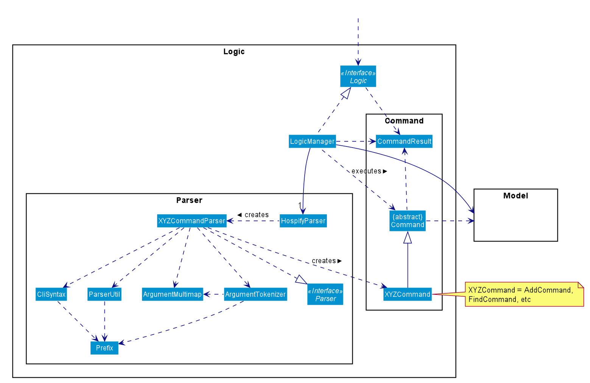
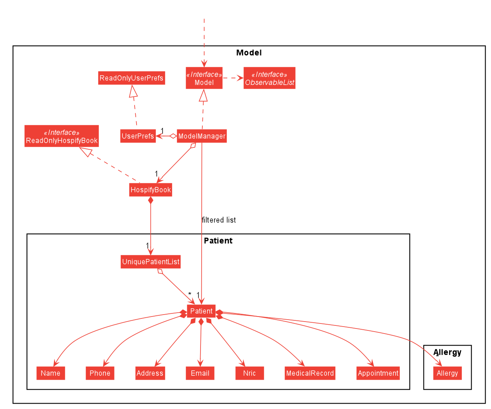
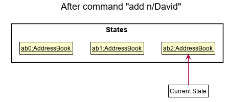
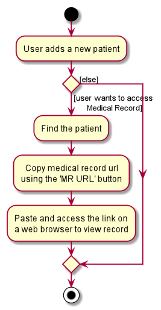
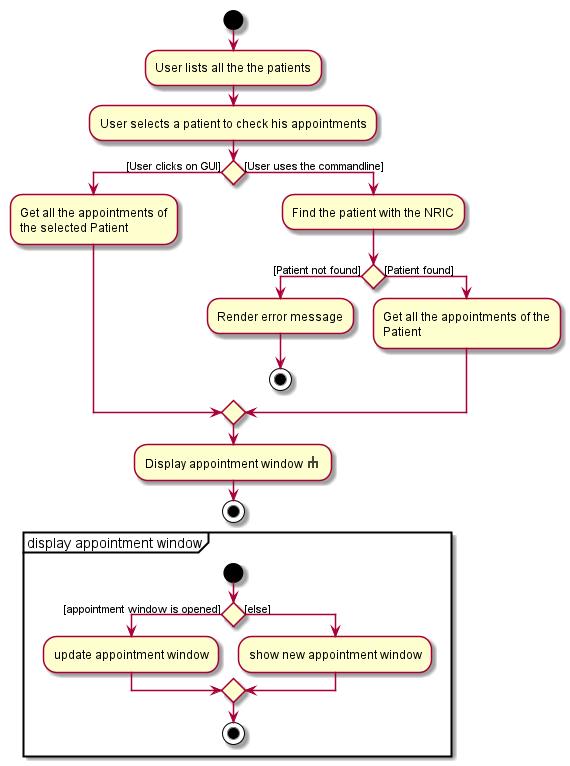

* Table of Contents
{:toc}

--------------------------------------------------------------------------------------------------------------------

## **Introduction**

Hello, fellow developers!

Welcome to **Hospify**, a desktop application for a digital medical record management solution. In this developer guide, you will learn more about how this application is implemented and the design choices behind them.

**Hospify** is primarily adapted from the [AddressBook Level-3](https://github.com/nus-cs2103-AY2021S1/tp) program, which is subsequently modified to serve as a medical record storage solution targeted at administrative staff in clinics to reduce their dependency on printed medical records. The software provides basic functionalities required on a daily basis by clinic administrative staff, including adding, editing, finding, deleting and sorting medical records, as well as medical appointments of patients.

For easy navigation around this developer guide, hyperlinks to individual implementations have been provided at the top of the page. For ease of reading, we will be discussing the high-level implementation details first before zooming in to each design component and the implementation details.

--------------------------------------------------------------------------------------------------------------------

## **Setting up, getting started**

Please refer to the guide [_Setting up and getting started_](SettingUp.md) for more information about how to set up and configure the project in your computer.

You may also wish to refer to the source code [here](https://github.com/AY2021S1-CS2103T-W15-3/tp).

--------------------------------------------------------------------------------------------------------------------

## **Design**

In this section, we will be discussing the general design of the software. We will begin with its overall architecture to understand the high-level design of **Hospify**, followed by a closer look into each of the four major components, namely [`UI`](#ui-component), [`Logic`](#logic-component), [`Model`](#model-component) and [`Storage`](#storage-component).

### Architecture

The ***Architecture Diagram*** given above explains the high-level design of the App. Given below is a quick overview of each component.

:bulb: **Tip:** The `.puml` files used to create diagrams in this document can be found in the [diagrams](https://github.com/se-edu/addressbook-level3/tree/master/docs/diagrams/) folder. Refer to the [_PlantUML Tutorial_ at se-edu/guides](https://se-education.org/guides/tutorials/plantUml.html) to learn how to create and edit diagrams.

**`Main`** has two classes called [`Main`](https://github.com/se-edu/addressbook-level3/tree/master/src/main/java/seedu/address/Main.java) and [`MainApp`](https://github.com/se-edu/addressbook-level3/tree/master/src/main/java/seedu/address/MainApp.java). It is responsible for,
* At app launch: Initializes the components in the correct sequence, and connects them up with each other.
* At shut down: Shuts down the components and invokes cleanup methods where necessary.

[**`Commons`**](#common-classes) represents a collection of classes used by multiple other components.

The rest of the App consists of four components.

* [**`UI`**](#ui-component): The UI of the App.
* [**`Logic`**](#logic-component): The command executor.
* [**`Model`**](#model-component): Holds the data of the App in memory.
* [**`Storage`**](#storage-component): Reads data from, and writes data to, the hard disk.

Each of the four components,

* defines its *API* in an `interface` with the same name as the Component.
* exposes its functionality using a concrete `{Component Name}Manager` class (which implements the corresponding API `interface` mentioned in the previous point.

For example, the `Logic` component (see the class diagram given below) defines its API in the `Logic.java` interface and exposes its functionality using the `LogicManager.java` class which implements the `Logic` interface.

**How the architecture components interact with each other**

The *Sequence Diagram* below shows how the components interact with each other for the scenario where the user issues the command `delete 1`.

The sections below give more details of each component.

### UI component

**API** :
[`Ui.java`](https://github.com/se-edu/addressbook-level3/tree/master/src/main/java/seedu/address/ui/Ui.java)

The UI consists of a `MainWindow` that is made up of parts e.g.`CommandBox`, `ResultDisplay`, `PatientListPanel`, `StatusBarFooter` etc. All these, including the `MainWindow`, inherit from the abstract `UiPart` class.

The `UI` component uses JavaFx UI framework. The layout of these UI parts are defined in matching `.fxml` files that are in the `src/main/resources/view` folder. For example, the layout of the [`MainWindow`](https://github.com/se-edu/addressbook-level3/tree/master/src/main/java/seedu/address/ui/MainWindow.java) is specified in [`MainWindow.fxml`](https://github.com/se-edu/addressbook-level3/tree/master/src/main/resources/view/MainWindow.fxml)

The `UI` component,

* Executes user commands using the `Logic` component.
* Listens for changes to `Model` data so that the UI can be updated with the modified data.

### Logic component

**API** :
[`Logic.java`](https://github.com/se-edu/addressbook-level3/tree/master/src/main/java/seedu/address/logic/Logic.java)

1. `Logic` uses the `HospifyParser` class to parse the user command.
1. This results in a `Command` object which is executed by the `LogicManager`.
1. The command execution can affect the `Model` (e.g. adding a patient).
1. The result of the command execution is encapsulated as a `CommandResult` object which is passed back to the `Ui`.
1. In addition, the `CommandResult` object can also instruct the `Ui` to perform certain actions, such as displaying help to the user.

Given below is the Sequence Diagram for interactions within the `Logic` component for the `execute("delete 1")` API call.

:information_source: **Note:** The lifeline for `DeleteCommandParser` should end at the destroy marker (X) but due to a limitation of PlantUML, the lifeline reaches the end of diagram.

### Model component

**API** : [`Model.java`](https://github.com/se-edu/addressbook-level3/tree/master/src/main/java/seedu/address/model/Model.java)

The `Model`,

* stores a `UserPref` object that represents the user’s preferences.
* stores the Hospify data.
* exposes an unmodifiable `ObservableList<Patient>` that can be 'observed' e.g. the UI can be bound to this list so that the UI automatically updates when the data in the list change.
* does not depend on any of the other three components.

:information_source: **Note:** An alternative (arguably, a more OOP) model is given below. It has a `Tag` list in the `Hospify`, which `Patient` references. This allows `Hospify` to only require one `Tag` object per unique `Tag`, instead of each `Patient` needing their own `Tag` object. 

### Storage component

**API** : [`Storage.java`](https://github.com/se-edu/addressbook-level3/tree/master/src/main/java/seedu/address/storage/Storage.java)

The `Storage` component,
* can save `UserPref` objects in json format and read it back.
* can save the Hospify data in json format and read it back.

### Common classes

Classes used by multiple components are in the `seedu.address.commons` package.

--------------------------------------------------------------------------------------------------------------------

## **Implementation**

In this section, we will be highlighting some key features and how they are being implemented. Example usage scenarios are provided to showcase how the features can be used. Lastly we will also be looking at other design choices and the rationale behind the current implementations.

### \[Proposed\] Undo/redo feature

#### Proposed Implementation

The proposed undo/redo mechanism is facilitated by `VersionedHospify`. It extends `Hospify` with an undo/redo history, stored internally as a `hospifyStateList` and `currentStatePointer`. Additionally, it implements the following operations:

* `VersionedHospify#commit()` — Saves the current Hospify state in its history.
* `VersionedHospify#undo()` — Restores the previous Hospify state from its history.
* `VersionedHospify#redo()` — Restores a previously undone Hospify state from its history.

These operations are exposed in the `Model` interface as `Model#commitHospify()`, `Model#undoHospify()` and `Model#redoHospify()` respectively.

Given below is an example usage scenario and how the undo/redo mechanism behaves at each step.

Step 1. The user launches the application for the first time. The `VersionedHospify` will be initialized with the initial Hospify state, and the `currentStatePointer` pointing to that single hospify state.

Step 2. The user executes `delete 5` command to delete the 5th patient in hospify. The `delete` command calls `Model#commitHospify()`, causing the modified state of hospify after the `delete 5` command executes to be saved in the `hospifyStateList`, and the `currentStatePointer` is shifted to the newly inserted hospify state.

Step 3. The user executes `add n/David …​` to add a new patient. The `add` command also calls `Model#commitHospify()`, causing another modified hospify state to be saved into the `hospifyStateList`.

:information_source: **Note:** If a command fails its execution, it will not call `Model#commitHospify()`, so the hospify state will not be saved into the `hospifyStateList`.

Step 4. The user now decides that adding the patient was a mistake, and decides to undo that action by executing the `undo` command. The `undo` command will call `Model#undoHospify()`, which will shift the `currentStatePointer` once to the left, pointing it to the previous hospify state, and restores the hospify to that state.

:information_source: **Note:** If the `currentStatePointer` is at index 0, pointing to the initial Hospify state, then there are no previous Hospify states to restore. The `undo` command uses `Model#canUndoHospify()` to check if this is the case. If so, it will return an error to the user rather
than attempting to perform the undo.

The following sequence diagram shows how the undo operation works:

:information_source: **Note:** The lifeline for `UndoCommand` should end at the destroy marker (X) but due to a limitation of PlantUML, the lifeline reaches the end of diagram.

The `redo` command does the opposite — it calls `Model#redoHospify()`, which shifts the `currentStatePointer` once to the right, pointing to the previously undone state, and restores the hospify to that state.

:information_source: **Note:** If the `currentStatePointer` is at index `hospifyStateList.size() - 1`, pointing to the latest hospify state, then there are no undone Hospify states to restore. The `redo` command uses `Model#canRedoHospify()` to check if this is the case. If so, it will return an error to the user rather than attempting to perform the redo.

Step 5. The user then decides to execute the command `list`. Commands that do not modify the hospify, such as `list`, will usually not call `Model#commitHospify()`, `Model#undoHospify()` or `Model#redoHospify()`. Thus, the `hospifyStateList` remains unchanged.

Step 6. The user executes `clear`, which calls `Model#commitHospify()`. Since the `currentStatePointer` is not pointing at the end of the `hospifyStateList`, all hospify states after the `currentStatePointer` will be purged. Reason: It no longer makes sense to redo the `add n/David …​` command. This is the behavior that most modern desktop applications follow.

The following activity diagram summarizes what happens when a user executes a new command:

#### Design consideration:

##### Aspect: How undo & redo executes

* **Alternative 1 (current choice):** Saves the entire hospify.
  * Pros: Easy to implement.
  * Cons: May have performance issues in terms of memory usage.

* **Alternative 2:** Individual command knows how to undo/redo by
  itself.
  * Pros: Will use less memory (e.g. for `delete`, just save the patient being deleted).
  * Cons: We must ensure that the implementation of each individual command are correct.

_{more aspects and alternatives to be added}_

### \[Proposed\] Data archiving

_{Explain here how the data archiving feature will be implemented}_

### Find by name or NRIC feature (by Cao Qin)

The find feature enables users to find patients by specifying their names(anyone from their first name, middle name or last name) or Nric numbers.

#### Implementation

The following are the changes made to achieve this feature:

* A `KeywordPredicate` class is added under the `model/patient` package. 
* `FindCommand` class is modified to keep a KeywordPredicate object as a filed.

Given below is an example usage scenario of this feature using both name and Nric as inputs.

Step 1. The user executes `add n/Alex Yeoh ic/S0000001A p/87438807 e/alexyeoh@example.com a/Blk 30 Geylang Street 29, #06-40 mr/www.sample.com/01` to add a patient named Alex Yeho and with a Nric number “S0000001A”.

Step 2. The user executes `add n/Bernice Yu ic/S0000002A p/99272758 e/berniceyu@example.com a/Blk 30 Lorong 3 Serangoon Gardens, #07-18 mr/www.sample.com/02` to add a patient named Bernice Yu and with a Nric number “S0000002A”.

Step 3. The user executes `find Yeoh` command to find a patient with name "Yeoh".

Step 4. The user executes `find S0000001A` command to find a patient with Nric number "S0000001A".

Step 5. The user executes `find Alex A0000002S` command to find 2 patients: one with name “Alex” and one with Nric number “A0000002S”.

Step 6. The user executes `list` command to view the full list of patients.

#### Design Consideration

##### Aspect: What to use as reference to find the wanted patient?

* **Alternative 1 (current choice):** Requires users to enter names or Nric numbers or both of the patients wanted.
  * Pros: Easier for users to find the patients wanted if they know either the wanted patients' names or Nric numbers.
  * Cons: Harder to implement because the input may contain a mix of names and Nric numbers.

* **Alternative 2:** Users can only enter Nric numbers of the patients wanted. 
  * Pros: Easy to implement, and the finding results are accurate(the list will display the exact patients with the given Nric numbers). 
  * Cons: Inconvenient for users if they only know the patients' names.

### Medical Record feature (by Cedric Lim Jun Wei)

#### Implementation

This feature enables users to add medical records of patients by specifying a url containing his/her online medical record document. The following are the additions required for this feature:

* A `MedicalRecord` class is added under the `patient` package.
* A new prefix `mr/` is created to be used with the `add` and `edit` command to allow users to specify the url.
* A new `MR URL` button is added to individual patient's tab to allow users to copy the medical record url onto the system clipboard.

Given below is an example usage scenario.

Step 1. The user executes `add n/John Doe …​ mr/www.medicalrecorddoc.com/patients1234567` command to add patient John Doe in Hospify. The sequence diagram below illustrates how the operation of adding a patient works.

 

**:information_source: Note on sequence diagram:** 

* The lifeline for `AddCommandParser` should end at the destroy marker (X) but due to a limitation of PlantUML, the lifeline reaches the end of diagram.

* For simplicity, the complete user input for the `add` command is omitted, showing only the `mr/www.medicalrecorddoc.com/patients1234567` portion, which is further simplified to `mr/MR_URL` in the sequence diagram.

* The `Patient` object created is shown as `toAdd` in the sequence diagram.

Step 2. The user now decides to access the medical record of patient John Doe and can then do so by clicking on the `MR URL` button located at the bottom right corner of the patient's tab.

In doing so, the `PatientCard#copyUrl()` is called on the mouse click and the link to the medical record url is copied to the system clipboard.

Step 3. The user opens his/her preferred web browser and paste the url that was copied in step 2.

The following activity diagram summarizes what happens when a user adds a new patient:

#### Design consideration:

##### Aspect: How medical records are added and accessed

* **Alternative 1 (current choice):** Requires users to enter a unique url that links to the patient's online medical record each time a new patient is first added
  * Pros: Easy to implement and to edit medical records.
  * Cons: May be cumbersome for users to keep generating a new url for new patients.

* **Alternative 2:** Automatically generates an empty medical record when a new patient is added (which can be accessed/edited within Hospify).
  * Pros: Independent from external and online platforms (fully integrated within the application).
  * Cons: Harder to implement and less freedom to edit medical records.

### Appointment feature (by Gabriel Teo Yu Xiang)

The appointment feature will enable clinics to manage patient's appointments within Hospify, thus avoiding the need for spreadsheets.
Users have the ability to show, add, delete, edit appointments within the app. 

#### Implementation

#### Overview:

* An `Appointment` class is created in the `patient` package.
* A new prefix `appt/` to be used with the new `Appointment` field.
* 4 new commands specifically for managing patients' appointments, `showAppt`, `addAppt`, `editAppt` and `deleteAppt`.

Given below is an example usage scenario using a Patient with `NRIC` **S1234567A**.

Step 1. The user executes `addAppt S1234567A /appt 28/09/2020 20:00` command to add an appointment with the
 specified time to the patient with `NRIC`of S1234567A.

Step 2. The user shows the appointment of the patient by **clicking** on the patient using the `GUI` or 
using the command `showAppt S1234567A`.

Step 3. The user now decides to edit the appointment of patient of `NRIC` S1234567A and executes `editAppt S1234567A /appt 05/10/2020 20:00` to change the appointment timing accordingly.

Step 4. The user then decides to delete the appointment of patient of `NRIC` S1234567A and executes `deleteAppt S1234567A /appt 05/10/2020 20:00` to delete the specified appointment.

The following activity diagram summarizes what happens when a user adds a new appointment:

#### Design consideration:

##### Aspect: How appointments are added and managed

* **Alternative 1 (current choice):** Appointments are stored as a `HashSet` attribute within each patient.
  * Pros: Easy to implement and each patient can have multiple appointments.
  * Cons: May be messy as the number of appointments can get very large depending on the patient, making it difficult to keep track.

* **Alternative 2:** An Appointment also keeps track of additional details. (appointment history, time started, time ended)
  * Pros: Able to store more detailed information about a patient's appointments.
  * Cons: Harder to implement and more details for the user to manage and keep track of.

* **Alternative 3:** Each patient only stores one Appointment.
  * Pros: Easy to implement and manage.
  * Cons: Very limited functionality as each patient can only have one appointment booked at a time.

_{more aspects and alternatives to be added}_

### Show Appointment (by Peh Jun Siang)

Shows the medical records of a patient either through the `CLI` or the `GUI` in a Tableview.

#### Implementation
###### OVERVIEW

The **Activity Diagram** below shows an overview for users to show the Patient's appointments through 
the `GUI` or `CLI`.

###### Detailed Implementation

* Using the `GUI`
    * **Sequence Diagram** for `GUI`\

        * Clicking on the Patient Card triggers the `onDoubleClick` controller which updates the 
        static `AppointmentWindow`.
        * The controller calls `AppointmentWindow#setAppointmentWindow(patient)` to update the information of the 
        patient in `AppointmentWindow`. 
        * `AppointmentWindow` retrieves all the appointments of the patient and map the
        appointment into a tableView before calling `AppointmentWindow#show()` to show the window. 
* Using the `CLI`\
`ShowAppt` on the `CLI` is more complicated than using the `GUI` because we have to find the 
patient and check if the NRIC entered is valid. On the `GUI`, we only have to use a controller 
to check if the patient is clicked and show the `AppointmentWindow` on the click event.
    * **Sequence Diagram** for `CLI`\

**Brief Description**
        1. The `MainWindow` takes in the command from the user in the `UI`.
        1. `LogicManager` parses the command under `Logic`.
        1. `ShowCommandparser` verifies the command is in the stipulated format.
        1. `LogicManager` exceutes the command and updates the **filteredPersonList** which contains the patient found.
        1. `MainWindow` in the `UI` then verifies if there is only **ONE** patient found. If not, 
        `MainWindow` throws an error to the User.
        1. `MainWindow` updates the patient found to the `AppointmentWindow` by calling `AppointmentWindow#setAppointmentWindow(patient)`.
        1. `AppointmentWindow` retrieves the appointments of the Patient and map the appointments
        into a TableView.
        1. Finally, `MainWindow` shows the updated `AppointmentWindow` to the User.
        
**:warning: Important:** AppointmentWindow is **STATIC** (i.e. only **ONE** instance of AppointmentWindow is allowed).
This design is to prevent Users from opening multiple windows of the same patient and freezing the App.
        
--------------------------------------------------------------------------------------------------------------------

## **Documentation, logging, testing, configuration, dev-ops**

* [Documentation guide](Documentation.md)
* [Testing guide](Testing.md)
* [Logging guide](Logging.md)
* [Configuration guide](Configuration.md)
* [DevOps guide](DevOps.md)

--------------------------------------------------------------------------------------------------------------------

## **Appendix: Requirements** (by Gabriel Teo Yu Xiang)

### Product scope

**Target user profile**:

* Administrative staff in clinics
* has a need to manage a significant number of patients and their respective medical records
* prefers desktop apps over other types
* can type fast
* prefers typing to mouse interactions
* is reasonably comfortable using CLI apps

**Value proposition**:

- What problem does it solve?
    * Many small clinics still use hard copies to store patients' medical records. The database can get really large after many years. It is very expensive and time constraining to archive medical records and find medical records of patients when they revisit. There are also a lot of documents and folders which require a lot of physical space to store.
- How does it make their lives easier?
    * We will build an easily accessible and secure system that helps clinics to store the patients’ information and medical records. It will enable the admin staff to easily reach out to the patients and doctors and help them to contact each other.

### User stories

Priorities: High (must have) - `* * *`, Medium (nice to have) - `* *`, Low (unlikely to have) - `*`

| Priority | As an …​                                | I want to …​                | So that I can…​                                                      |
| -------- | ------------------------------------------ | ------------------------------ | ----------------------------------------------------------------------- |
| `* * *`  | admin staff who is a new user              | see usage instructions         | refer to instructions when I forget how to use the App                  |
| `* * *`  | admin staff                                | add a new patient              | store a new patient's medical records                                   |
| `* * *`  | admin staff                                | delete a patient               | remove entries that I no longer need                                    |
| `* * *`  | admin staff                                | find a patient by name         | locate details of patients without having to go through the entire list |
| `* *`    | admin staff with many patients in the App  | view the number of patients    | have an overview of the size of the database                            |
| `* *`    | admin staff                                | make new appointments for patients | arrange an appointment timing easily |
| `* *`    | admin staff                                | cancel appointments for patients | cancel an appointment timing easily |
| `* * *`  | admin staff                                | access and retrieve medical records (like drug allergies) of patients | obtain them when requested by doctors |
| `* * *`  | admin staff                                | access and retrieve prescription list of patients | obtain them when requested by nurses |
| `* * *`  | admin staff                                | store NRIC of patients | uniquely identify patients and detect duplicates in the App |
| `* * *`  | admin staff                                | use keywords to scan documents | verify if certain records have already been added |
| `* *`    | admin staff who is a new user              | verify the number of entries on the App | make sure that all the hardcopy records are added |
| `* * *`  | admin staff                                | edit and update the patients’ personal information | make any changes when necessary |
| `* *`    | admin staff with many patients in the App  | sort the database according to the patients’ last visit | locate a patient easily |
| `*`      | admin staff                                | archive appointments and medical records | store away less relevant information about deceased patients or patients who have not visited the clinic for 5 years or more |

*{More to be added}*

### Use cases

(For all use cases below, the **System** is `Hospify` and the **Actor** is the `admin`, unless specified otherwise)

**Use case: UC1 - Add patient information**

**MSS**

1.  Admin types `add` followed by patient details.
2.  Hospify notifies that patient information is added.

    Use case ends.

**Extensions**

* 1a. Hospify detects that the input is in the wrong format.

    * 1a1. Hospify requests for the correct data.
    * 1a2. Admin enters new data.

      Steps 1a1-1a2 are repeated until the data entered are correct.

      Use case resumes at step 2.

**Use case: UC2 - Delete patient information**

**MSS**

1.  Admin types `delete` followed by patient NRIC.
2.  Hospify requests for confirmation.
3.  Admin confirms.
4.  Hospify notifies that patient information is deleted.

    Use case ends.

**Extensions**

* 1a. Hospify detects that the input is in the wrong format.

    * 1a1. Hospify requests for the correct data.
    * 1a2. Admin enters new data.

      Steps 1a1-1a2 are repeated until the data entered are correct.

      Use case resumes at step 2.

**Use case: UC3 - Find patient information**

**MSS**

1.  Admin wants to find a patient using their name.
2.  Admin types `find` followed by keyword (name).
3.  Hospify returns all matches (if any) to the staff.
4.  Admin selects the patient of interest.

    Use case ends.

**Extensions**

* 2a. Hospify detects invalid characters (e.g. numbers and symbols).

    * 2a1. Hospify requests for the correct data.
    * 2a2. Admin enters new data.

      Steps 2a1-2a2 are repeated until the data entered are correct.

      Use case resumes at step 3.

**Use case: UC4 - Compute number of entries**

**MSS**

1.  Admin types `count`.
2.  Hospify displays the number of patients that are currently not archived.

    Use case ends.

**Use case: UC5 - Display usage instructions**

**MSS**

1.  Admin types `help` followed by patient NRIC.
2.  Hospify displays help interface.

    Use case ends.
    
**Use case: UC6 - Display Patient's Appointment**

**MSS**

1.  Admin types `ShowAppt` followed by patient NRIC.
2.  Hospify shows a window which shows all of the patient's appointments.
3. Admin sorts the appointments by earliest to latest or latest to earliest.

    Use case ends.
    
**Extensions**
* 1a. User with NRIC not found.
    * 1a1. Hospify notifies the User that the User is not found.
    * 1a2. User enters another NRIC.

* 1b. User enters an invalid NRIC.
    * 1b1. Hospify prompts User to enter in the stipulated format.
    
    Steps 1b1 repeats until user enters a valid NRIC.

    

*{More to be added}*

### Non-Functional Requirements

1.  Should work on any _mainstream OS_ as long as it has Java `11` or above installed.
2.  Should be able to hold up to 1000 patients without a noticeable sluggishness in performance for typical usage.
3.  A user with above average typing speed for regular English text (i.e. not code, not system admin commands) should be able to accomplish most of the tasks faster using commands than using the mouse.
4.  The system should work on both 32-bit and 64-bit environments.
5.  The system should respond within two seconds to user inputs.
6.  The system should be user-friendly to new users and easy to learn.
7.  The system should be backward compatible with older versions of the product.
8.  The system is expected to be able to save and load user input data from the hard drive.
9.  The system is expected to be able to `sort` patients according to their `name`, `NRIC` or `appointment`.
10.  The system does not support printing of reports (patient details).
11.  The system does not support syncing data with other clinics’ patients’ details.

*{More to be added}*

### Glossary

* **Mainstream OS**: Windows, Linux, Unix, OS-X
* **NRIC**: National Registration Identity Card - A unique identification system with 1 alphabet followed by 7 digits, and another alphabet. E.g  X1234567X, where X is an arbitrary Alphabet

--------------------------------------------------------------------------------------------------------------------

## **Appendix: Instructions for manual testing**

Given below are instructions to test the app manually.

:information_source: **Note:** These instructions only provide a starting point for testers to work on;
testers are expected to do more *exploratory* testing.

### Launch and shutdown

1. Initial launch

   1. Download the jar file and copy into an empty folder

   1. Double-click the jar file Expected: Shows the GUI with a set of sample contacts. The window size may not be optimum.

1. Saving window preferences

   1. Resize the window to an optimum size. Move the window to a different location. Close the window.

   1. Re-launch the app by double-clicking the jar file. 
       Expected: The most recent window size and location is retained.

1. _{ more test cases …​ }_

### Deleting a patient

1. Deleting a patient while all patients are being shown

   1. Prerequisites: List all patients using the `list` command. Multiple patients in the list.

   1. Test case: `delete 1` 
      Expected: First contact is deleted from the list. Details of the deleted contact shown in the status message. Timestamp in the status bar is updated.

   1. Test case: `delete 0` 
      Expected: No patient is deleted. Error details shown in the status message. Status bar remains the same.

   1. Other incorrect delete commands to try: `delete`, `delete x`, `...` (where x is larger than the list size) 
      Expected: Similar to previous.

1. _{ more test cases …​ }_

### Saving data

1. Dealing with missing/corrupted data files

   1. _{explain how to simulate a missing/corrupted file, and the expected behavior}_

1. _{ more test cases …​ }_
