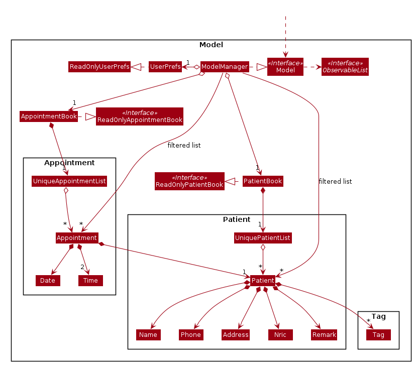
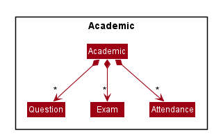
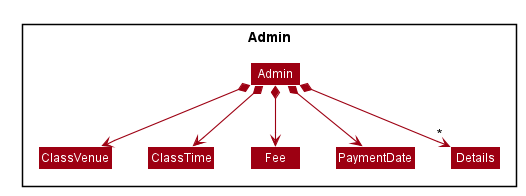
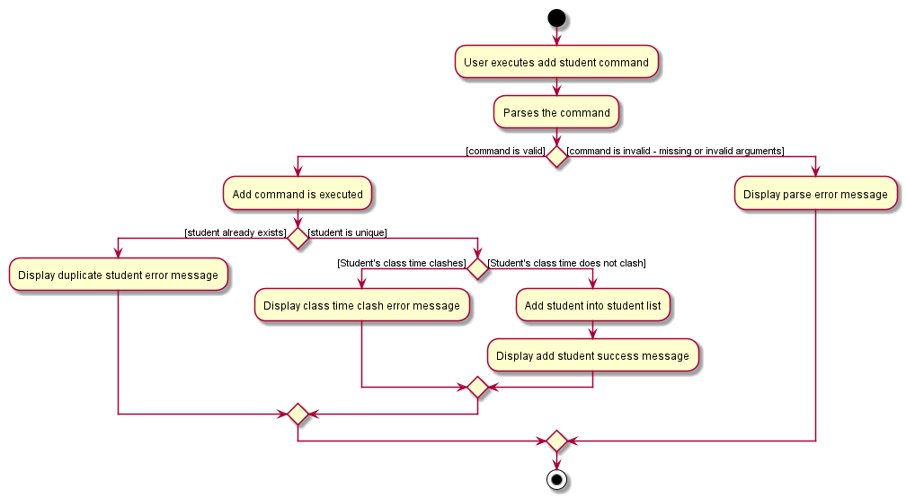
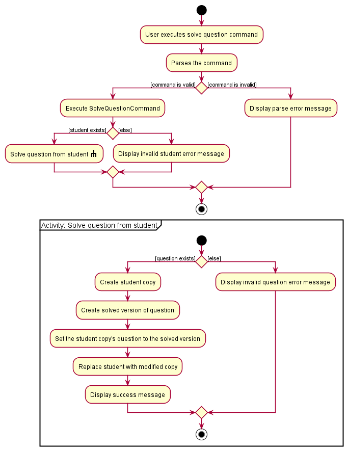
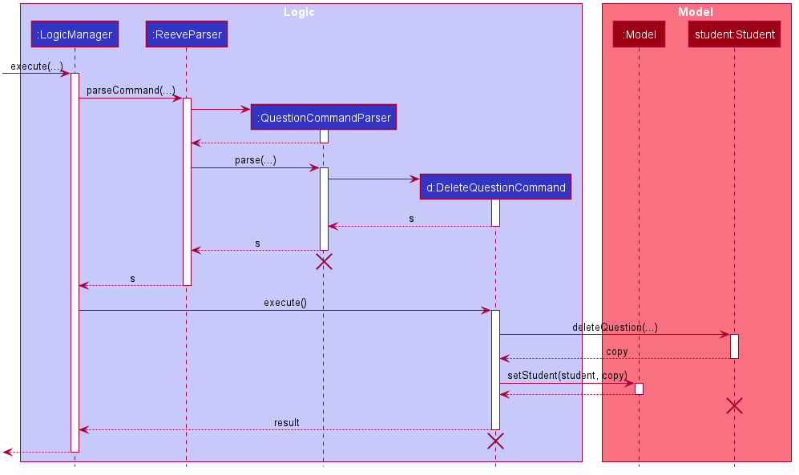
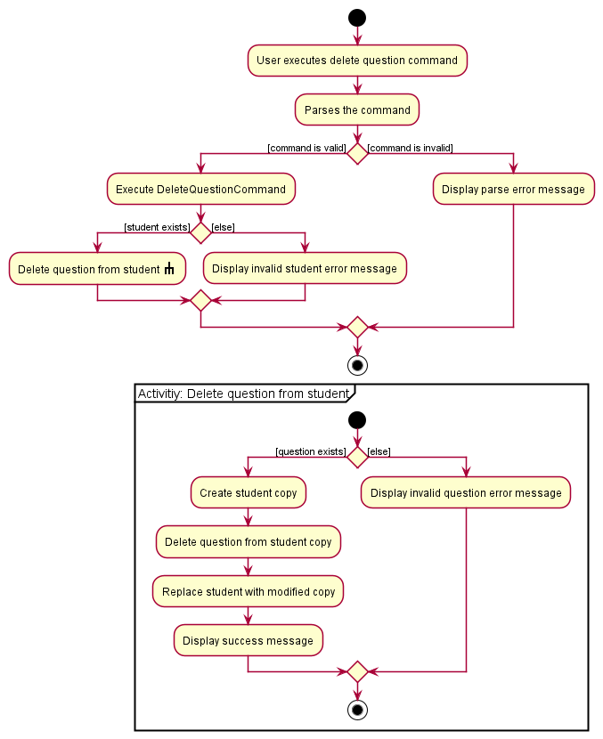

## Reeve - Developer Guide

**Table of Contents**
- [1. Introduction](#1-introduction)
- [2. About](#2-about)
- [3. Understanding the guide](#3-understanding-the-guide)
- [4. Getting started](#4-getting-started)
- [5. Design](#5-design)
    * [5.1 Architecture](#51-architecture)
    * [5.2 UI component](#52-ui-component)
    * [5.3 Logic component](#53-logic-component)
    * [5.4 Model component](#54-model-component)
    * [5.5 Storage component](#55-storage-component)
    * [5.6 Common classes](#56-common-classes)
- [6. Implementation](#6-implementation)
    * [6.1 General features](#61-general-features)
        * [6.1.1 Help Command](#611-help-command)
        * [6.1.2 Toggle Command](#612-toggle-command)
        * [6.1.3 Exit Command](#613-exit-command)
    * [6.2 Student administrative details features](#62-student-administrative-details-features)
        * [6.2.1 Add student command](#621-add-student-command)
        * [6.2.2 Edit student command](#622-edit-student-command)
        * [6.2.3 Delete student command](#623-delete-student-command)
        * [6.2.4 Find student command](#624-find-student-command)
        * [6.2.5 Overdue command](#625-overdue-command)
    * [6.3 Student academic details features](#63-student-academic-details-features)
        * [6.3.1 Student questions features](#631-student-questions-features)
            * [6.3.1.1 Add question command](#6311-add-question-command)
            * [6.3.1.2 Solve question command](#6312-solve-question-command)
            * [6.3.1.3 Delete question command](#6313-delete-question-command)
        * [6.3.2 Student exam features](#632-student-exam-features)
            * [6.3.2.1 Add exam command](#6321-add-exam-command)
            * [6.3.2.2 Delete exam command](#6322-delete-exam-command)
            * [6.3.2.3 Exam Stats command](#6323-exam-stats-command)
        * [6.3.3 Student attendance features](#633-student-attendance-features)
    * [6.4 Schedule command](#64-schedule-command)
    * [6.5 Notes command](#65-notes-command)
- [7. Documentation](#7-documentation)
- [8. Logging](#8-logging)
- [9. Testing](#9-testing)
- [10. Configuration](#10-configuration)
- [11. DevOps](#11-devops)
- [Appendix A: Product Scope](#appendix-a-product-scope)
- [Appendix B: User Stories](#appendix-b-user-stories)
- [Appendix C: Use Cases](#appendix-c-use-cases)
- [Appendix D: Non-Functional Requirements](#appendix-d-non-functional-requirements)
- [Appendix E: Glossary](#appendix-e-glossary)
- [Appendix F: Instructions for Manual Testing](#appendix-f-instructions-for-manual-testing)
    * [F.1 Launch and Shutdown](#f1-launch-and-shutdown)
    * [F.2 Deleting a Student](#f2-deleting-a-student)
    * [F.3 Saving Data](#f3-saving-data)

## 1. Introduction
Welcome to **Reeve**!

**Reeve** is a desktop application for **private tutors to better manage both administrative and academic details of their students**, optimised for use via a
**Command Line Interface (CLI)** for receiving inputs while still having the benefits of a **Graphical User Interface (GUI)** for displaying information.
In addition, **Reeve** comes with a customisable personal scheduler to assist users to keep track of their classes. **Reeve** also allows users to set timely reminders for themselves.

Reeve is optimized for users that are very comfortable with typing as it works on a Command Line Interface (CLI).

Students' details are displayed in a neat and organized manner through the use of a Graphical User Interface (GUI).

## 2. About

This developer guide will provide you the details of the software architecture and implementation of **Reeve**.
It is made for developers who wish to understand the internal and external workings of the application.

All developers are warmly welcome to contribute your ideas and improve **Reeve**!
To contribute, simply head over to [our github](https://github.com/AY2021S1-CS2103T-W15-2/tp) and raise an issue.

## 3. Understanding the Guide

This section will share with you how should you go about understanding this guide in order to best understand **Reeve**.

We have adopted the "top-down" approach into the structure of this guide where we will first look at the high-level structure of our application
before going into the implementation details of each feature.

We highly encourage you to read the guide from top to bottom in order to have the best understanding of **Reeve**.

Here is a summary (Table 1) of the symbols that are used in this Developer Guide:

Table 1: Summary of symbols

Symbol | Meaning
:-----:|:-------
`command` | A grey highlight indicates a command that can be executed by **Reeve**.
:information_source: | Indicates important information.
:bulb: | Indicates tips.

## 4. **Getting Started**

Refer to the guide [_Setting up and getting started_](SettingUp.md).

## 5. **Design**

### 5.1 Architecture

The ***Architecture Diagram*** given above explains the high-level design of the App. Given below is a quick overview of each component.

:bulb: **Tip:** The `.puml` files used to create diagrams in this document can be found in the [diagrams](https://github.com/AY2021S1-CS2103T-W15-2/tp/tree/master/docs/diagrams/) folder. Refer to the [_PlantUML Tutorial_ at se-edu/guides](https://se-education.org/guides/tutorials/plantUml.html) to learn how to create and edit diagrams.

**`Main`** has two classes called [`Main`](https://github.com/AY2021S1-CS2103T-W15-2/tp/blob/master/src/main/java/seedu/address/Main.java) and [`MainApp`](https://github.com/AY2021S1-CS2103T-W15-2/tp/blob/master/src/main/java/seedu/address/MainApp.java). It is responsible for,
* At app launch: Initializes the components in the correct sequence, and connects them up with each other.
* At shut down: Shuts down the components and invokes cleanup methods where necessary.

[**`Commons`**](#56-common-classes) represents a collection of classes used by multiple other components.

The rest of the App consists of four components.

* [**`UI`**](#52-ui-component): The UI of the App.
* [**`Logic`**](#53-logic-component): The command executor.
* [**`Model`**](#54-model-component): Holds the data of the App in memory.
* [**`Storage`**](#55-storage-component): Reads data from, and writes data to, the hard disk.

Each of the four components,

* defines its *API* in an `interface` with the same name as the Component.
* exposes its functionality using a concrete `{Component Name}Manager` class (which implements the corresponding API `interface` mentioned in the previous point.

For example, the `Logic` component (see the class diagram given below) defines its API in the `Logic.java` interface and exposes its functionality using the `LogicManager.java` class which implements the `Logic` interface.

**How the architecture components interact with each other**

The *Sequence Diagram* below shows how the components interact with each other for the scenario where the user issues the command `delete 1`.

The sections below give more details of each component.

### 5.2 UI component

**API** :
[`Ui.java`](https://github.com/AY2021S1-CS2103T-W15-2/tp/tree/master/src/main/java/seedu/address/ui)

The UI consists of a `MainWindow` that is made up of parts e.g.`CommandBox`, `ResultDisplay`, `StudentListPanel`, `Notebook` etc. All these, including the `MainWindow`, inherit from the abstract `UiPart` class.

The `UI` component uses JavaFx UI framework. The layout of these UI parts are defined in matching `.fxml` files that are in the `src/main/resources/view` folder. For example, the layout of the [`MainWindow`](https://github.com/se-edu/addressbook-level3/tree/master/src/main/java/seedu/address/ui/MainWindow.java) is specified in [`MainWindow.fxml`](https://github.com/se-edu/addressbook-level3/tree/master/src/main/resources/view/MainWindow.fxml)

The `UI` component,

* Executes user commands using the `Logic` component.
* Listens for changes to `Model` data so that the UI can be updated with the modified data.

### 5.3 Logic component

**API** :
[`Logic.java`](https://github.com/AY2021S1-CS2103T-W15-2/tp/blob/master/src/main/java/seedu/address/logic/Logic.java)

1. `Logic` uses the `ReeveParser` class to parse the user command.
1. This results in a `Command` object which is executed by the `LogicManager`.
1. The command execution can affect the `Model` (e.g. adding a student).
1. The result of the command execution is encapsulated as a `CommandResult` object which is passed back to the `Ui`.
1. In addition, the `CommandResult` object can also instruct the `Ui` to perform certain actions, such as displaying help to the user.

Given below is the Sequence Diagram for interactions within the `Logic` component for the `execute("delete 1")` API call.

:information_source: **Note:** The lifeline for `DeleteCommandParser` should end at the destroy marker (X) but due to a limitation of PlantUML, the lifeline reaches the end of diagram.

### 5.4 Model component

**API** : [`Model.java`](https://github.com/AY2021S1-CS2103T-W15-2/tp/blob/master/src/main/java/seedu/address/model/Model.java)

The `Model`,

* stores a `UserPref` object that represents the user’s preferences.
* stores the reeve data.
* exposes an unmodifiable `ObservableList<Student>` that can be 'observed' e.g. the UI can be bound to this list so that the UI automatically updates when the data in the list change.
* does not depend on any of the other three components.

### 5.5 Storage component

Figure 4.5.1. Class diagram for `Storage` component

**API** : [`Storage.java`](https://github.com/AY2021S1-CS2103T-W15-2/tp/blob/master/src/main/java/seedu/address/storage/Storage.java)

From the diagram above, the `Storage` component,
* can save `UserPref` objects in json format and read it back.
* can save `Reeve` data in json format and read it back.
* stores `Student` and `Note` data from the `Model` component in `JsonSerializableReeve` and `JsonSerializableNotebook` objects respectively.

The `JsonSerializableReeve` component stores `JsonAdaptedStudent` objects converted from the `Student` objects in the `Model` component.
Each `JsonAdaptedStudent` object also contains json-friendly versions of `Student` data as shown in the class diagram below.

Figure 4.5.2. Class diagram for `JsonSerializableReeve` component

The `JsonSerializableNotebook` component stores `JsonAdaptedNote` objects converted from `Note` objects in the `Model` component, as shown in the class diagram below.

Figure 4.5.3. Class diagram for `JsonSerializableNotebook` component

### 5.6 Common classes

Classes used by multiple components are in the `seedu.addressbook.commons` package.

## 6. **Implementation**

This section describes some noteworthy details on how certain features are implemented.

### 6.1 General features

This section describes some key details on how general features are implemented.

#### 6.1.1 Help Command

The following describes the flow of how `HelpCommand` is performed.

1. Upon successfully parsing the user input, the `HelpCommand#execute(Model model)` is called.
2. A `CommandResult` with the `showHelp` field set to true is returned and `MainWindow#handleHelp()` is called.
3. A Help display window will be opened showing a link to the User Guide.

:information_source: If there is already a Help window already opened, and `HelpCommand` is executed, `HelpWindow#focus()` will be called to focus on the already opened window.

#### 6.1.2 Toggle Command

The following describes the flow of how `ToggleStudentCardCommand` is performed.

1. Upon successfully parsing the user input, the `ToggleStudentCardCommand#execute(Model model)` is called.
2. A `CommandResult` with the `toggleStudentCard` field set to true is returned and `MainWindow#handleAcademicPanel()` is called.
3. Student cards in `StudentListPanel` will be switched.

:information_source: By default, `StudentListPanel` uses `StudentAcademicCard`.

 

The following sequence diagram shows how the `ToggleStudentCardCommand` execution works.

Figure \___. Sequence diagram for `ToggleStudentCardCommand` execution

#### 6.1.3 Exit Command

### 6.2 Student administrative details features

This section describes some key details on how administrative details features are implemented.

The student administrative details feature keeps track of essential administrative student details. The feature comprises of the following commands,
* `AddCommand` - Adds a student into the student list
* `EditCommand` - Edits the details of a particular student
* `DeleteCommand` - Deletes a particular student
* `FindCommand` - Finds students matching certain parameters
* `OverdueCommand` - Finds students who have overdue payments
* `ClearCommand` - Deletes all students in the student list

#### 6.2.1 Add Student Command

The following describes the flow of how `AddCommand` is performed.

1. Upon successfully parsing the user input, the `AddCommand#execute(Model model)` is called which checks whether
the added student already exists in the `UniqueStudentList` using the `Model#hasStudent(Student toAdd)`.
2. A unique student is defined by `Name`, `Phone`, `School` and `Year`. If a duplicate student is defined,
a `CommandException` is thrown and the student will not be added.
3. The `AddCommand#execute(Model model)` also checks if the student to be added has clashing `ClassTime` with other students already in the `UniqueStudentList`.
4. Two student's `ClassTime` is considered clashing if they overlap either partially or fully. A `CommandException` will be thrown if there are other students with clashing class time.
5. If the added student is not a duplicate and there are no clashes in class time, then the `Model#addStudent(Student toAdd)` is called to add the student.
A new `CommandResult` is returned with a success message and the added student.
6. The student is be added into `UniqueStudentList` and a success message is shown in the result display.

The following activity diagram summarizes the flow of events when the `AddCommand` is being executed:

Figure ___. Activity Diagram for `AddCommand`

The following sequence diagram summarizes the execution of the `AddCommand`

Figure /__. Sequence Diagram for `AddCommand`

#### 6.2.2 Edit Student Command

The edit student feature allows the tutor to edit a particular student within **Reeve**.
It is handled by the `EditCommand`.

The following describes the flow of how `EditCommand` is executed.

1. Upon successfully parsing the user input, `EditCommand#execute(Model model)` is called to edit the existing student to the new edited student.
2. `Model#setStudent(Student student)` is called to replace the student with edited student within the model.
3. `Model#updateFilteredStudentsList(Predicate<Student> predicate)` is then called to update the student list with the new edited student.
4. A new `CommandResult` is returned with a successful message indicating that the student has been edited.
5. The edited student is now shown on the student list.

The following sequence diagram shows how the `EditCommand` execution works.

Figure \___. Sequence diagram for `EditCommand` execution

The following activity diagram summarises the flow of events when `EditCommand` is executed.

Figure \___. Activity diagram for `EditCommand` execution

### 6.2.3 Delete Student Command

The following describes the flow of how `DeleteCommand` is performed.

1. Upon successfully parsing the user input, the `DeleteCommand#execute(Model model)` is called which checks whether
the specified `Index` is a valid index based on the `UniqueStudentList`, in the case where it is invalid, a `CommandException` is thrown and no student will be deleted.
2. Otherwise, the `Student` at the specified valid `Index` is then removed from the `UniqueStudentList` using the `Model#deleteStudent(Student target)` method.
3. The specified student is deleted from the `UniqueStudentList` and a success message is shown in the result display.

:information_source: A valid `Index` is one that is within the bounds of the `UniqueStudentList`.

### 6.2.4 Find Student Command

This is an explanation of how `FindCommand` works.

This is an activity diagram showing the high level idea of how `FindCommand` is executed.

This is a sequence diagram together with an explanation of the implementation.

 1. After the `FindCommand`  is created by parsing user input, `FindCommand::execute` is called.
 2. The method then calls `getPredicates()` of the `FindStudentDescriptor` stored within `FindCommand` to obtain a `List<Predicate>` to search with.
 3. The predicates within `List<Predicate>`are then combined into `consolidatedPredicate`.
 4. The `FilteredList<Student>` within the `Model` is then updated using `Model#updateFilteredPersonList(Predicate predicate)` for display.
 5. A new `CommandResult` will be returned with the success message.

#### 6.2.5 Overdue Command

The overdue payment filter feature allows the tutor to find all students who have not paid their tuition fees in the past month. It is handled by the `OverdueCommand`.

The following describes the flow of how `OverdueCommand` is executed.

1. Upon successfully parsing the user input, `OverdueCommand#execute(Model model)` is called to filter all students in Reeve whose last date of payment was more than a month ago.
2. `Model#updateFilteredStudentsList(Predicate<Student> predicate)` is called to find only students that match the above condition. A new `CommandResult` is returned with a successful message indicating the number of matching students.
3. The filtered student list replaces the displayed list on the GUI and a success message is shown in the result display.

The following sequence diagram shows how the `OverdueCommand` execution works.

Figure 5.1.5.1. Sequence diagram for `OverdueCommand` execution

The following activity diagram summarises the flow of events when `OverdueCommand` is executed.

Figure 5.1.5.2. Activity diagram for `OverdueCommand` execution

### 6.3 Student academic details features

This section describes some key details on how academic details features are implemented.

#### 6.3.1 Student questions features

The student questions feature keeps track of questions raised by a student to his tutor. It comprises of the following commands:

* `AddQuestionCommand` - Adds a question to a specified student.
* `SolveQuestionCommand` - Marks a specified question from a specified student as solved.
* `DeleteQuestionCommand` - Deletes a specified question from a specified student.

##### 6.3.1.1 Add Question Command

The following describes the flow of how `AddQuestionCommand` is performed.

1. Upon successfully parsing the user input, `AddQuestionCommand#execute(Model model)` is called to check if the student at the specified position exists.
2. If there is no student at the specified position,  a `CommandException` is thrown and the question will not be added.
3. If the student exists, `AddQuestionCommand#execute(Model model)` checks if the student already has a similar question recorded.
4. A unique question is defined solely by its `question` and does not take into account if the question has been solved. If a duplicate question is found, a `CommandException` is thrown and the question will not be added.
5. If the question is not a duplicate, `Student#addQuestion(Question question)` is called to create a modified copy of the student with a newly added question.
6. `Model#setPerson(Student target, Student editedStudent)` is called to replace the student with the modified copy. A new `CommandResult` is returned with a success message showing the affected student and the question added.
7. The modified student replaces the outdated student in the `UniqueStudentList` and a success message is shown in the result display.

The following sequence diagram shows how the question adding operation works.

Figure 5.2.1.1. Sequence diagram for `AddQuestionCommand` execution

The following activity diagram summarises the flow of events when `AddQuestionCommand` is executed.

Figure 5.2.1.2. Activity diagram for `AddQuestionCommand` execution

##### 6.3.1.2 Solve Question Command

The following describes the flow of how `SolveQuestionCommand` is performed.

1. Upon successfully parsing the user input, `SolveQuestionCommand#execute(Model model)` is called to check if the student at the specified position exists.
2. If there is no student at the specified position,  a `CommandException` is thrown and the question will not be added.
3. If the student exists, `SolveQuestionCommand#execute(Model model)` checks if there is a question at the specified position.
4. If the question does not exist, a `CommandException` is thrown and the question will not be resolved.
5. If the question exists, `Student#setQuestion(Question target, Question newQuestion)` is called to create a modified copy of the student where the specified question has been replaced with a solved version.
6. `Model#setPerson(Student target, Student editedStudent)` is called to replace the student with the modified copy. A new `CommandResult` is returned with a success message showing the affected student and the question solved.
7. The modified student replaces the outdated student in the `UniqueStudentList` and a success message is shown in the result display.

The following sequence diagram shows how the question solving operation works.

Figure 5.2.2.1. Sequence diagram for `SolveQuestionCommand` execution

The following activity diagram summarises the flow of events when `SolveQuestionCommand` is executed.

Figure 5.2.2.2. Activity diagram for `SolveQuestionCommand` execution

##### 6.3.1.3 Delete Question Command

The following describes the flow of how `DeleteQuestionCommand` is performed.

1. Upon successfully parsing the user input, `DeleteQuestionCommand#execute(Model model)` is called to check if the student at the specified position exists.
2. If there is no student at the specified position,  a `CommandException` is thrown and the question will not be added.
3. If the student exists, `DeleteQuestionCommand#execute(Model model)` checks if there is a question at the specified position.
4. If the question does not exist, a `CommandException` is thrown and the question will not be resolved.
5. If the question exists, `Student#deleteQuestion(Question target)` is called to create a modified copy of the student without the specified question.
6. `Model#setPerson(Student target, Student editedStudent)` is called to replace the student with the modified copy. A new `CommandResult` is returned with a success message showing the affected student and the question removed.
7. The modified student replaces the outdated student in the `UniqueStudentList` and a success message is shown in the result display.

The following sequence diagram shows how the question deletion operation works.

Figure 5.2.3.1. Sequence diagram for `DeleteQuestionCommand` execution

The following activity diagram summarises the flow of events when `DeleteQuestionCommand` is executed.

Figure 5.2.3.2. Activity diagram for `DeleteQuestionCommand` execution

#### 6.3.2 Student exam features

The student exams feature keeps track of exam records of a student. It comprises of the following commands:

* `AddExamCommand` - Adds a exam record to a specified student.
* `DeleteExamCommand` - Deletes a specified exam record from a specified student.
* `ExamStatsCommand` - Displays the exam statistics of a specified student in the form of a line graph.

The structure of exam commands is as shown below:

##### 6.3.2.1 Add exam command

The following describes the flow of how `AddExamCommand` is performed.

1. Upon successfully parsing the user input, `AddExamCommand#execute(Model model)` is called to check if the student at the specified position exists.
2. If there is no student at the specified position,  a `CommandException` is thrown and the exam will not be added.
3. If the student exists, `AddExamCommand#execute(Model model)` checks if the student already has a similar exam recorded.
4. A unique exam is defined solely by its `examName`. If a duplicate exam is found, a `CommandException` is thrown and the exam will not be added.
5. If the exam is not a duplicate, `Student#getExams()` is called get the current list of exams of the specified student.
6. The new exam is added into this current list and a new updated `Student` is created which is exactly the same characteristics of the specified student but with the updated exam list.
7. `Model#setPerson(Student selectedStudent, Student updatedStudent)` is called to replace the student with the updated copy. A new `CommandResult` is returned with a success message showing the affected student and the exam added.
8. The updated student replaces the outdated student in the `UniqueStudentList` and a success message is shown in the result display.

The sequence(insert image reference here) of how add exam operates is very similar to that of add question.

##### 6.3.2.2 Delete exam command

The following describes the flow of how `DeleteExamCommand` is performed.

1. Upon successfully parsing the user input, `DeleteExamCommand#execute(Model model)` is called to check if the student at the specified position exists.
2. If there is no student at the specified position,  a `CommandException` is thrown.
3. If the student exists, `DeleteExamCommand#execute(Model model)` checks if there is a exam at the specified position.
4. If the exam does not exist, a `CommandException` is thrown.
5. If the exam exists, `Student#getExams()` is called get the current list of exams of the specified student.
6. `Model#setPerson(Student selectedStudent, Student updatedStudent)` is called to replace the student with the modified copy. A new `CommandResult` is returned with a success message showing the affected student and the exam removed.
7. The modified student replaces the outdated student in the `UniqueStudentList` and a success message is shown in the result display.

:information_source: Exams are specified based on the indexes of the list of exams shown on the academic view of student details.

 

The sequence(insert image reference here) of how add exam operates is very similar to that of delete question.

##### 6.3.2.3 Exam Stats command

The following describes the flow of how `ExamStatsCommand` is performed.

1. Upon successfully parsing the user input, `ExamStatsCommand#execute(Model model)` is called to check if the student at the specified position exists.
2. If there is no student at the specified position,  a `CommandException` is thrown and no exam statistics window will be shown.
3. If the student exists, `ExamStatsCommand#execute(Model model)` gets the specified student from `sortedStudentList`.
4. A `CommandResult` with a non-null student input is returned and `MainWindow#handleExamStats(Student student)` is called.
5. A new ExamStats display window will be opened showing a line graph representing the exam scores of the specified student.

The following sequence diagram shows how the exam stats operation works.

Figure \___. Sequence diagram for `ExamStatsCommand` execution

The following activity diagram summarises the flow of events when `ExamStatsCommand` is executed.

Figure \___. Activity diagram for `ExamStatsCommand` execution

#### 6.3.3 Student attendance features

### 6.4 Schedule Command

This section describes the operations that `ScheduleViewCommand` performs.

1. Upon successful parsing of the user input, the `ScheduleViewCommand#execute(Model)` method is called.
2. The method `Model#setViewDate(LocalDate)` is then called to set the viewing date of the user in `SchedulePrefs`
3. Similarly, the method `ModelsetViewMode(ScheduleViewMode)` is called next to set the viewing mode (weekly/daily) of the user in `SchedulePrefs`.
4. After which, the method `updateFilteredStudentList(Predicate)` is called to get all the students.
The `Predicate` argument will be `PREDICATE_SHOW_ALL_STUDENTS` which is a reusable final predicate variable.
5. Thereafter, the method `Model#updateClassTimesToEvent()` will be called to translate all student's `ClassTime` to `LessonEvent`
6. The `Scheduler` then calls the method `resetData(List<Event>)` with the updated `LessonEvent` objects.
7. The `CommandResult` is then returned.

The following activity diagram summarizes the flow of events when the `ScheduleViewCommand` is being executed:

Figure 6.4.1 Activity diagram for `ScheduleCommand` execution

The following sequence diagram illustrates to execution of the `ScheduleViewCommand`.

Figure 6.4.2 Sequence diagram for `ScheduleCommand` execution

:information_source: Figure 6.4.1 and 6.4.2 illustrates the `ScheduleCommand` execution within the `Logic` and `Model` Component.

For the `Ui` component, a calendar using **jfxtras** library will be updated with the `LessonEvent` after the `CommandResult` is returned.
The `'LessonEvent` is provided to the `Ui` by the `LogicManager` through the `Model` component.
The `Model` in turns gets the `LessonEvent` from the `Scheduler` which keeps a list of updated events.
The calendar with `LessonEvent` is then displayed to the user through the interface. This is assuming that no exception arises.

### 6.4.1 Design Consideration

The following are the various design choices made regarding the feature and alternatives that were considered prior to implementation.

* Current Implementation:
    * The current implementation creates `LessonEvent`s from the `studentList` update the to the `Ui` whenever the `ScheduleViewCommand` is called.

* Alternatives Considered:
    * Creating a `Event` storage component that stores `LessonEvent` based on `Student`'s `ClassTime`.
    This would violate the data integrity of the `Student` we currently have and introduce additional complexity in
    maintaining both data structures.

### 6.5 Notes Command

## 7. **Documentation**
Refer to the [Documentation guide](Documentation.md).

## 8. **Logging**
Refer to the [Logging guide](Logging.md).

## 9. **Testing**
Refer to the [Testing guide](Testing.md).

## 10. **Configuration**
Refer to the [Configuration guide](Configuration.md).

## 11. **DevOps**
Refer to the [DevOps guide](DevOps.md).

## **Appendix A: Product Scope**

**Target user profile**:

* is a Singapore primary/secondary/junior college 1 to 1 private tutors
* has a need to manage a significant number of student contacts
* has a need to manage administrative details of students
* has a need to manage academic details of students
* prefer desktop apps over other types
* can type fast
* prefers typing to mouse interactions
* is reasonably comfortable using CLI apps

**Value proposition**: Helps tutors organise administrative and academic details of their students with ease and manage student needs better.

## **Appendix B: User Stories**

Priorities: High (must have) - `* * *`, Medium (nice to have) - `* *`, Low (unlikely to have) - `*`

| Priority | As a …​                               | I want to …​                                          | So that I can…​                                                                     |
| -------- | --------------------------------------| ----------------------------------------------------- | ----------------------------------------------------------------------              |
| `* * *`  | private tutor ready to use Reeve      | view a list of commands and how to use them           | learn how the application works or in case I forgot how some of the commands work   |
| `* * *`  | private tutor ready to use Reeve      | add my students' details                              | store them and retrieve them whenever I need                                        |
| `* * *`  | private tutor                         | view my students' preferred tutoring location         | figure out how to get that location                                                 |
| `* * *`  | private tutor                         | edit my students' personal details                    | update outdated data                                                                |
| `* * *`  | private tutor                         | view my student's details                             | refer to them when needed                                                           |
| `* * *`  | private tutor                         | add additional details to each student                | add other miscellaneous details which can allow me to better cater to student needs |
| `* * *`  | private tutor with many students      | find a student's record                               | retrieve students' data with ease                                                   |
| `* * *`  | private tutor who is a long-term user | delete students' data                                 | remove irrelevant data of students who are no longer my tutees                      |
|  `* *`   | private tutor                         | record my student's questions                         | help them with their queries after the lesson                                       |
|  `* *`   | private tutor                         | input my student’s school test scores                 | keep track of their progress                                                        |
|  `* *`   | private tutor                         | track my students' attendance                         | keep track of students' lesson records                                              |
|  `* *`   | private tutor                         | input feedback to specific lessons                    | improve my capabilities as a tutor                                                  |
|  `* *`   | private tutor                         | view a list of notes/reminders                        | keep track of key information easily                                                |
|  `* *`   | private tutor                         | view my tutoring schedule for a particular day        | plan my plans accordingly                                                           |
|   `*`    | private tutor                         | view my students' academic progress                   | know which students need more help                                                  |
|   `*`    | private tutor  ready to use Reeve     | view the type of student details that are displayed   | focus on the details that I am currently concerned with                             |

## **Appendix C: Use Cases**

For all use cases below, the **System** is `Reeve` and the **Actor** is the `Tutor (User)`, unless specified otherwise.
Use cases also assume that whenever an invalid command is entered by the user, Reeve displays an error message.

**UC01: Displaying help menu**

**MSS**

1. User enters a command to open help menu.
2. Reeve displays a success message and the help menu.

   Use case ends.

**UC02: Toggling displays between administrative and academic details of students**

**MSS**

1. User enters a command to toggle display students details.
2. Reeve displays a success message and the toggled display of students details.

   Use case ends.

**UC03: Exiting the application**

**MSS**

1. User enters a command to exit the application.
2. All processes of Reeve ends.

   Use case ends.

**UC04: Adding a student**

**MSS**

1.  User enters a command to add a student with student details.
2.  Reeve saves student data into the students list and displays a success message.

    Use case ends.

**Extensions**

* 1a. User provides input with missing compulsory fields.
    * 1a1. Reeve displays an error message.

      Use case resumes from step 1.

* 1b. User provides input with invalid format.
    * 1b1. Reeve displays an error message.

      Use case resumes from step 1.

**UC05: Listing all students**

**MSS**

1. User enters a command to list students.
2. Reeve displays the students list with student details.

   Use case ends.

**UC06: Editing a student's details**

**MSS**

1.  User enters a command to list students.
2.  Reeve shows the list of students.
3.  User enters command to edit a specific student in the list and provides needed parameters.
4.  Reeve updates the specified student with the input parameters and displays a success message.

    Use case ends.

**Extensions**

* 1a. The list is empty.
  Use case ends.

* 3a. User provides input with invalid index.
    * 3a1. Reeve requests for input with valid index.

      Use case resumes at step 2.
* 3b. User provides input without any parameters.
    * 3b1. Reeve requests for input with parameters.

      Use case resumes at step 2.
* 3c. User provides input with invalid format.
	* 3c1. Reeve requests for input with valid format.

	  Use case resumes at step 2.

**UC07: Deleting a student**

**MSS**

1.  User enters a command to list students.
2.  Reeve displays a list of students.
3.  User enters a command to delete a specific student in the list.
4.  Reeve deletes the student and displays a success message.

    Use case ends.

**Extensions**

* 1a. The list is empty.

  Use case ends.

* 3a. User provides input with invalid index.
    * 3a1. Reeve displays an error message.

      Use case resumes at step 2.

**UC08: Searching for a student**

**MSS**

1.  User enters a command to find all students that match the given search parameter (name, school, year or subject).
2.  Reeve displays all students matching the criteria.

    Use case ends.

**Extensions**

* 1a. User provides input with invalid data into the search parameter.
    * 1a1. Reeve displays erroneous field and expected format.

      Use case resumes at step 1.
* 1b. User provides input without a search parameter.
    * 1a1. Reeve displays a message indicating a search parameter was not provided.

      Use case resumes at step 1.
* 1c. No students match the given criteria.
    * 1c1. Reeve displays a message indicating no match found.

      Use case ends.

**UC09: Clearing all student records**

**MSS**

1. User enters a command to clear the students list.
2. Reeve displays a success message.

   Use case ends.

**UC00: Adding a question to a student**

**MSS**

1. User enters a command to list students.
2. Reeve displays a list of students.
3. User enters a command to add an unresolved question to a specific student in the list.
4. Reeve updates the specified student in the list with the newly added question.
5. Reeve displays a success message.

   Use case ends.

**Extensions**

* 1a. The list is empty.

  Use case ends.

* 3a. User provides input with an invalid student index.
    * 3a1. Reeve displays an error message.

      Use case resumes at step 2.

* 3b. User inputs a question in an invalid format.
    * 3b1. Reeve displays an error message.

      Use case resumes at step 2.

**UC00: Resolving a question from a student**

**MSS**

1. User enters a command to list students.
2. Reeve displays a list of students.
3. User enters a command to resolve a question from a specific student in the list with a solution.
4. Reeve updates the specified student in the list with the updated question.
5. Reeve displays a success message.

   Use case ends.

**Extensions**

* 1a. The list is empty.

  Use case ends.

* 3a. User provides input with an invalid student.
    * 3a1. Reeve displays an error message.

      Use case resumes at step 2.

* 3b. User provides input with an invalid question.
    * 3b1. Reeve displays an error message.

      Use case resumes at step 2.

* 3c. User inputs the solution in an invalid format.
    * 3c1. Reeve displays an error message.

      Use case resumes at step 2.

* 3d. User specifies a question that has already been solved.
    * 3d1. Reeve displays an error message.

      Use case resumes at step 2.

**UC00: Deleting a question from a student**

**MSS**

1. User enters a command to list students.
2. Reeve displays a list of students.
3. User enters a command to delete a question from a specific student in the list.
4. Reeve updates the specified student in the list with the removed question.
5. Reeve displays a success message.

   Use case ends.

**Extensions**

* 1a. The list is empty.

  Use case ends.

* 3a. User provides input with an invalid student.
    * 3a1. Reeve displays an error message.

      Use case resumes at step 2.

* 3b. User provides input with an invalid question.
    * 3b1. Reeve displays an error message.

      Use case resumes at step 2.

**UC00: Finding all students with overdue tuition fees**

**MSS**

1. User enter command to filter all students by those who have not paid their fees in the past month.
2. Reeve displays all students that match the above criteria.

   Use case ends.

**Extensions**

* 1a. The list is empty.

  Use case ends.

* 1b. All students have paid their fees in the past month.

  * 1b1. Reeve displays an empty list.

    Use case ends.

**UC00: Adding an exam record to a student**

**MSS**

1. User enters a command to list students.
2. Reeve displays a list of students.
3. User enters a command to add an exam record to a specific student in the list.
4. Reeve updates the specified student in the list with the newly added exam record.
5. Reeve displays a success message.

   Use case ends.

**Extensions**

* 1a. The list is empty.

  Use case ends.

* 3a. User provides input with an invalid student index.
    * 3a1. Reeve displays an error message.

      Use case resumes at step 2.

* 3b. User inputs an exam record in an invalid format.
    * 3b1. Reeve displays an error message.

      Use case resumes at step 2.

**UC00: Deleting an exam record from a student**

**MSS**

1. User enters a command to list students.
2. Reeve displays a list of students.
3. User enters a command to delete a specific exam record from a specific student in the list.
4. Reeve updates the specified student in the list with the removed question.
5. Reeve displays a success message.

   Use case ends.

**Extensions**

* 1a. The list is empty.

  Use case ends.

* 3a. User provides input with an invalid student.
    * 3a1. Reeve displays an error message.

      Use case resumes at step 2.

* 3b. User provides input with an invalid exam record.
    * 3b1. Reeve displays an error message.

      Use case resumes at step 2.

**UC00: Displaying exam statistics of a student**

**MSS**

1. User enters a command to list students.
2. Reeve displays a list of students.
3. User enters a command to view the exam statistics on a specific student.
4. Reeve displays a success message and the exam statistics.

   Use case ends.

**Extensions**

* 1a. The list is empty.

  Use case ends.

* 3a. User provides input with an invalid student.
    * 3a1. Reeve displays an error message.

      Use case resumes at step 2.

## **Appendix D: Non-Functional Requirements**

1.  Should work on any _mainstream OS_ as long as it has Java `11` or above installed.
2.  The response to any use action should become visible within 5 seconds.
3.  The program should be able to handle at least 100 students.
4.  The graphical user interface should be easy to use for non-IT savvy users.
5.  The program should be able to run even without internet connection.

## **Appendix E: Glossary**

The following table provides the definitions of the various terms used in this Developer Guide.

Term | Definition
--------|------------------
Mainstream OS | Refers to Windows, Linux, Unix, OS-X.
Private contact detail | A contact detail that is not meant to be shared with others.

## **Appendix F: Instructions for Manual Testing**

Given below are instructions to test the app manually.

:information_source: **Note:** These instructions only provide a starting point for testers to work on;
testers are expected to do more *exploratory* testing.

### F.1 Launch and Shutdown

1. Initial launch

   1. Download the jar file and copy into an empty folder

   1. Double-click the jar file Expected: Shows the GUI with a set of sample students. The window size may not be optimum.

1. Saving window preferences

   1. Resize the window to an optimum size. Move the window to a different location. Close the window.

   1. Re-launch the app by double-clicking the jar file. 
       Expected: The most recent window size and location is retained.

1. _{ more test cases …​ }_

### F.2 Deleting a Student

1. Deleting a student while all students are being shown

   1. Prerequisites: List all students using the `list` command. Multiple students in the list.

   1. Test case: `delete 1` 
      Expected: First contact is deleted from the list. Details of the deleted contact shown in the status message. Timestamp in the status bar is updated.

   1. Test case: `delete 0` 
      Expected: No student is deleted. Error details shown in the status message. Status bar remains the same.

   1. Other incorrect delete commands to try: `delete`, `delete x`, `...` (where x is larger than the list size) 
      Expected: Similar to previous.

1. _{ more test cases …​ }_

### F.3 Saving Data

1. Dealing with missing/corrupted data files

   1. _{explain how to simulate a missing/corrupted file, and the expected behavior}_

1. _{ more test cases …​ }_
