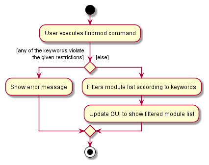
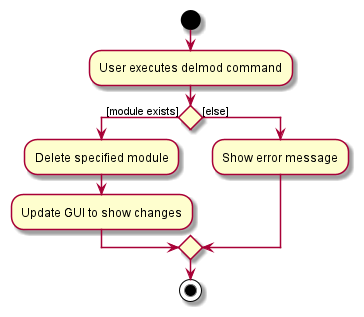
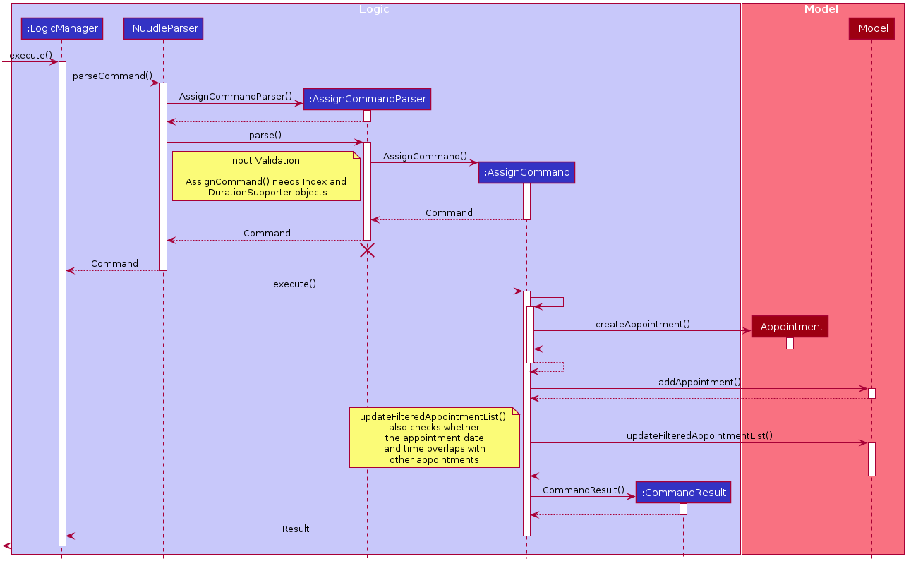
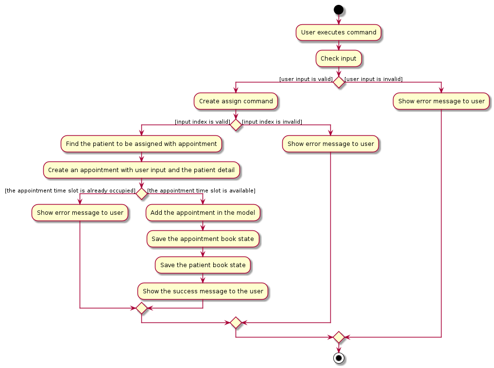
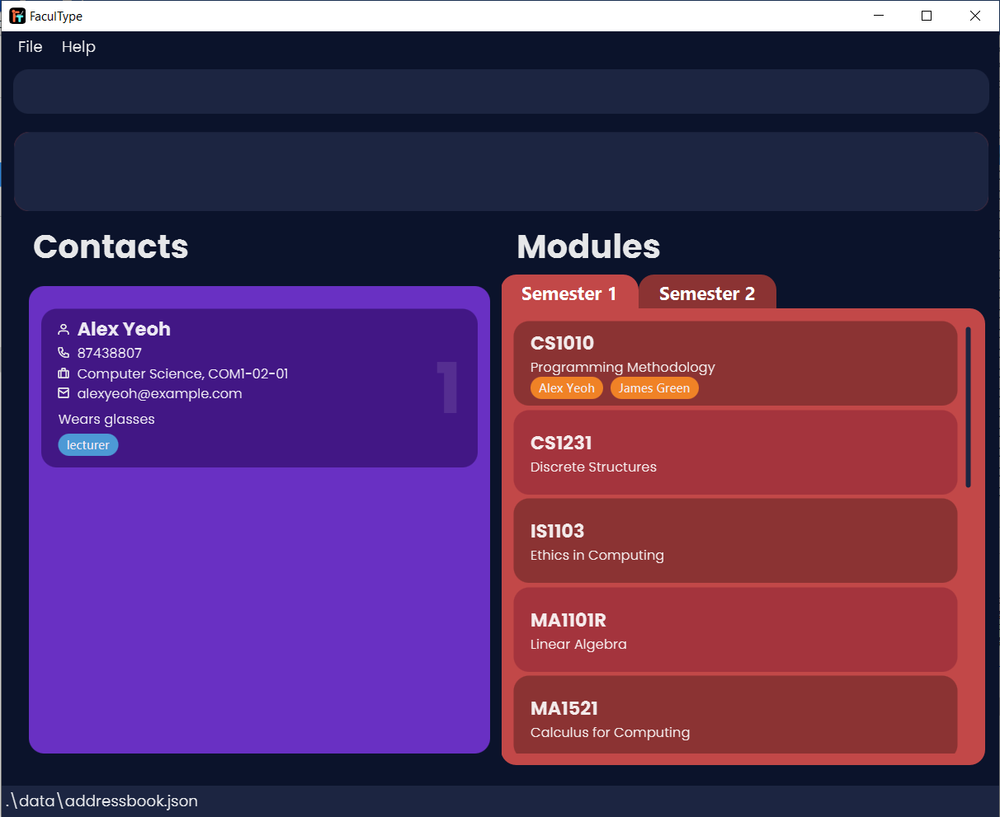

* Table of Contents
{:toc}

--------------------------------------------------------------------------------------------------------------------

## **Setting up, getting started**

Refer to the guide [_Setting up and getting started_](SettingUp.md).

--------------------------------------------------------------------------------------------------------------------

## **Design**

### Architecture

The ***Architecture Diagram*** given above explains the high-level design of the App. Given below is a quick overview of each component.

:bulb: **Tip:** The `.puml` files used to create diagrams in this document can be found in the [diagrams](https://github.com/AY2021S1-CS2103-T14-1/tp/tree/master/docs/diagrams/) folder. Refer to the [_PlantUML Tutorial_ at se-edu/guides](https://se-education.org/guides/tutorials/plantUml.html) to learn how to create and edit diagrams.

**`Main`** has two classes called [`Main`](https://github.com/AY2021S1-CS2103-T14-1/tp/tree/master/src/main/java/seedu/address/Main.java) and [`MainApp`](https://github.com/AY2021S1-CS2103-T14-1/tp/tree/master/src/main/java/seedu/address/MainApp.java). It is responsible for,
* At app launch: Initializes the components in the correct sequence, and connects them up with each other.
* At shut down: Shuts down the components and invokes cleanup methods where necessary.

[**`Commons`**](#common-classes) represents a collection of classes used by multiple other components.

The rest of the App consists of four components.

* [**`UI`**](#ui-component): The UI of the App.
* [**`Logic`**](#logic-component): The command executor.
* [**`Model`**](#model-component): Holds the data of the App in memory.
* [**`Storage`**](#storage-component): Reads data from, and writes data to, the hard disk.

Each of the four components,

* defines its *API* in an `interface` with the same name as the Component.
* exposes its functionality using a concrete `{Component Name}Manager` class (which implements the corresponding API `interface` mentioned in the previous point.

For example, the `Logic` component (see the class diagram given below) defines its API in the `Logic.java` interface and exposes its functionality using the `LogicManager.java` class which implements the `Logic` interface.

**How the architecture components interact with each other**

The *Sequence Diagram* below shows how the components interact with each other for the scenario where the user issues the command `delete 1`.

The sections below give more details of each component.

### UI component

**API** :
[`Ui.java`](https://github.com/AY2021S1-CS2103-T14-1/tp/tree/master/src/main/java/seedu/address/ui/Ui.java)

The UI consists of a `MainWindow` that is made up of parts e.g.`CommandBox`, `ResultDisplay`, `PersonListPanel`, `StatusBarFooter` etc. All these, including the `MainWindow`, inherit from the abstract `UiPart` class.

The `UI` component uses JavaFx UI framework. The layout of these UI parts are defined in matching `.fxml` files that are in the `src/main/resources/view` folder. For example, the layout of the [`MainWindow`](https://github.com/AY2021S1-CS2103-T14-1/tp/tree/master/src/main/java/seedu/address/ui/MainWindow.java) is specified in [`MainWindow.fxml`](https://github.com/AY2021S1-CS2103-T14-1/tp/tree/master/src/main/resources/view/MainWindow.fxml)

The `UI` component,

* Executes user commands using the `Logic` component.
* Listens for changes to `Model` data so that the UI can be updated with the modified data.

### Logic component

**API** :
[`Logic.java`](https://github.com/AY2021S1-CS2103-T14-1/tp/tree/master/src/main/java/seedu/address/logic/Logic.java)

1. `Logic` uses the `AddressBookParser` class to parse the user command.
1. This results in a `Command` object which is executed by the `LogicManager`.
1. The command execution can affect the `Model` (e.g. adding a contact).
1. The result of the command execution is encapsulated as a `CommandResult` object which is passed back to the `Ui`.
1. In addition, the `CommandResult` object can also instruct the `Ui` to perform certain actions, such as displaying help to the user.

Given below is the Sequence Diagram for interactions within the `Logic` component for the `execute("delete 1")` API call.

:information_source: **Note:** The lifeline for `DeleteCommandParser` should end at the destroy marker (X) but due to a limitation of PlantUML, the lifeline reaches the end of diagram.

### Model component

**API** : [`Model.java`](https://github.com/AY2021S1-CS2103-T14-1/tp/tree/master/src/main/java/seedu/address/model/Model.java)

The `Model`,

* stores a `UserPref` object that represents the user’s preferences.
* stores FaculType data.
* exposes an unmodifiable `ObservableList<Person>` and `ObservableList<Module>` that can be 'observed' e.g. the UI
 can be bound to this list so that the UI automatically updates when the data in the list change.
* does not depend on any of the other three components.

:information_source: **Note:** An alternative (arguably, a more OOP) model is given below. It has a `Tag` list in the `AddressBook`, which `Person` references. This allows `AddressBook` to only require one `Tag` object per unique `Tag`, instead of each `Person` needing their own `Tag` object. 

### Storage component

**API** : [`Storage.java`](https://github.com/AY2021S1-CS2103-T14-1/tp/tree/master/src/main/java/seedu/address/storage/Storage.java)

The `Storage` component,
* can save `UserPref` objects in json format and read it back.
* can save FaculType data in json format and read it back.

### Common classes

Classes used by multiple components are in the `seedu.addressbook.commons` package.

--------------------------------------------------------------------------------------------------------------------

## **Implementation**

This section describes some noteworthy details on how certain features are implemented.

### Find contacts by attributes feature

#### Implementation

The find mechanism is facilitated by `FindCommand` and `FindCommandParser`. It allows users to search for contacts by
 their respective attributes. It uses `ModelManager#updateFilteredPersonList(Predicate p)` which is
  exposed in the `Model` interface as `Model#updateFilteredList(Predicate p)`. The method updates the
  current person list and filters it according to the given predicate which will then be shown accordingly in the GUI.

The following sequence diagram shows how the find by attributes operation works:

:information_source: **Note:** The lifeline for `FindCommandParser` should
 end at the destroy marker (X) but due to a limitation of PlantUML, the lifeline reaches the end of diagram.

The following activity diagram summarizes what happens when a user executes a find command:

#### Design consideration:

##### Aspect: How find executes

* **Alternative 1 (current choice):** AND Searching from multiple attributes and keywords.
  * Pros: Provides the ability to narrow down search results by adding more keywords and attributes.
  * Cons: Unable to search for multiple persons with different attributes.

* **Alternative 2:** AND Searching across attributes, OR Searching between keywords.
  * Pros: Provides the ability to narrow down search results by adding more attributes as well as expanding the search
   scope by adding more keywords (i.e: more flexible).
  * Cons: A possible source of confusion as they use different searching methods.

Both options are equally feasible. However, Alternative 1 was chosen to avoid confusion for prospective users.

### Find module by module attributes feature

#### Implementation

The find module mechanism is facilitated by `FindModCommand` and `FindModCommandParser`. It allows users to search for modules based on their respective attributes which are the module code, module name and instructors teaching the module.
It uses `ModelManager#updateFilteredModuleList(Predicate p)` which is exposed in the Model interface as `Model#updateFilteredModuleList(Predicate p)`.
The method updates the current module list and filters it according to the given predicate which will then be reflected accordingly in the GUI.

The following sequence diagram shows how the find module by module attributes operation works:

The following activity diagram summarizes what happens when a user executes a findmod command:

#### Design consideration:

##### Aspect: How findmod executes

* **Alternative 1 (current choice):** AND searching from multiple attributes and AND searching between keywords for module name and instructor attributes. Module code attribute only allows single keywords.
  * Pros : Provides the ability to narrow down the search results by adding more attributes and keywords. Single keyword for module code attribute allows for more focused module code searches.
  * Cons : Unable to have a more general search and unable to search for multiple modules with different module codes.

* **Alternative 2:** And searching across attributes and OR searching between keywords for module name and instructor attributes.
  * Pros : Provides the ability for a very general and flexible search.
  * Cons : Unable to have a more focused search, might be more confusing for the user to narrow down his/her searches.

### Deleting Module feature

#### Implementation

The delete module mechanism is facilitated by the `DelmodCommand` and the `DelmodCommandParser`.
It uses an operation `AddressBook#removeModule()` which is exposed in the `Model` interface as `Model#deleteModule()`.
Then, the `removeModuleWithCode()` operation is called in `UniqueModuleList`. `UniqueModuleList#removeModuleWithCode()` will remove the module with the specified code
from the module list.

Given below is the example usage scenario and how the delete module mecahnism behaves at each step.

Step 1. The user launches the application. Facultype is initialized with the module `CS2103` in the addressbook.

Step 2. The user executes the command `delmod m/CS2103` to delete the module with the module code CS2103 in the addressbook.

Step 3. The `delmod` command then calls `Model#deleteModule()` after checking for the existence of the specified module.

Step 4. The Module with the specified module code, will be deleted from the `UniqueModuleList` in the addressbook.

The following sequence diagram shows how the deleting of the module works:

The following activity diagram summarizes what happens when a user executes a delmod command:

#### Design consideration:

##### Aspect: What the delmod command deletes by
* **Alternative 1 (current choice):** Deletes a module based on the module code.
  * Pros : More intuitive to the Dean to delete by the module code.
  * Cons : Would be more troublesome to look for the module should the Dean forget the module code.

* **Alternative 2:** Deletes a module based on the index of the module list.
  * Pros : Dean does not have to memorise all the module code, can simply delete based on what is shown in the module list.
  * Cons : Less intuitive.

### Assign feature

#### Implementation

The assign feature is facilitated by `AssignCommand` and `AssignCommandParser`.
It uses an operation `AddressBook#assignInstructor()` which is exposed in the `Model` interface as `Model#assignInstructor()`.
Then, the `assignInstructor()` operation is called in both `UniqueModuleList` and `Module`. `Module#assignInstructor()` will add the instructor to the module's set of instructors.

The following sequence diagram shows how the assign operation works:

The following activity diagram summarizes what happens when a user executes an assign command:

#### Design consideration:

##### Aspect: How to store assignments
* **Alternative 1 (current choice):** A module has a set of instructors assigned to it.
  * Pros: More efficient to list the instructors of a certain module.
  * Cons: Less efficient to list the modules of a certain instructor.

* **Alternative 2:** An instructor has a set of modules they are assigned to.
  * Pros: More efficient to list the modules of a certain instructor.
  * Cons: Less efficient to list the instructors of a certain module.

Both are equally viable options but Alternative 1 was chosen so `Person` would not have to be redesigned or have too many fields.

### Unassign feature

The assign feature is facilitated by `UnassignCommand` and `UnassignCommandParser`.
It uses an operation `AddressBook#unassignInstructor()` which is exposed in the `Model` interface as `Model#unassignInstructor()`.
Then, the `unassignInstructor()` operation is called in both `UniqueModuleList` and `Module`. `Module#unassignInstructor()` will remove the instructor from the module's set of instructors.

The following sequence diagram shows how the unassign operation works:

The following activity diagram summarizes what happens when a user executes a unassign command:

### Unassignall feature

The assign feature is facilitated by `UnassignallCommand` and `UnassignallCommandParser`.
It uses an operation `AddressBook#unassignAllInstructors()` which is exposed in the `Model` interface as `Model#unassignAllInstructors()`.
Then, the `unassignAllInstructors()` operation is called in both `UniqueModuleList` and `Module`. `Module#unassignAllInstructors()` will remove all instructors from all modules' set of instructors.

The following sequence diagram shows how the unassignall operation works:

The following activity diagram summarizes what happens when a user executes a unassignall command:

#### Design consideration:

##### Aspect: How unassignall executes

* **Alternative 1 (current choice):** Unassigns all instructors from all modules.
 * Pros : More efficient to unassign all instructors from all modules.
 * Cons : Less efficient to unassign a certain instructor from all modules he/she teaches.

* **Alternative 2:** Unassign a certain instructor from all modules he/she teaches.
 * Pros : More efficient to unassign a certain instructor from all modules he/she teaches.
 * Cons : Less efficient to unassign all instructors from all modules.

### Clear all contacts feature

#### Implementation

It implements the following operations:
* `AddressBook#clearContacts()` — Clear all contacts from the list.

These operations are exposed in the `Model` interface as `Model#clearContacts()` and `UniquePersonList` class as `UniquePersonList#clearAll()`

The following sequence diagram shows how the cclear operation works:

### Clear all modules feature

#### Implementation

It implements the following operations:
* `AddressBook#clearMod()` — Clear all modules from the list.

These operations are exposed in the `Model` interface as `Model#clearMod()` and `UniqueModuleList` class as `UniqueModuleList#clearAll()`
The following sequence diagram shows how the mclear operation works:

### Switch active semester feature

#### Implementation

The switch feature is facilitated by `AddressBook#switchModuleList()` which is exposed in the `Model` interface as `Model#switchModuleList()`.

AddressBook has two module lists, one for each semester, and one additional `UniqueModuleList` variable named `activeModules` that stores a reference to the active semester's module list. 
`AddressBook#switchModuleList()` toggles which module list is referenced by `activeModules`.
All `AddressBook` operations on `UniqueModuleList` are done on `activeModules`.

The following sequence diagram shows how the switch operation works:

The following activity diagram summarizes what happens when a user executes a switch command:

#### Design consideration:

##### Aspect: Setting the active semester
* **Alternative 1 (current choice):** There are two module lists and active semester references one of them.
  * Pros: Less code to change.
  * Cons: Can only manage the modules in the active semester.

* **Alternative 2:** There is only one module list and there is a filter to select modules of a particular semester.
  * Pros: More efficient to list the modules of a certain instructor.
  * Cons: Need to add semester field to modules and commands, will have two copies of the same module if held in both semesters, more code to change.

### \[Proposed\] Undo/redo feature

#### Proposed Implementation

The proposed undo/redo mechanism is facilitated by `VersionedAddressBook`. It extends `AddressBook` with an undo/redo history, stored internally as an `addressBookStateList` and `currentStatePointer`. Additionally, it implements the following operations:

* `VersionedAddressBook#commit()` — Saves the current FaculType state in its history.
* `VersionedAddressBook#undo()` — Restores the previous FaculType state from its history.
* `VersionedAddressBook#redo()` — Restores a previously undone FaculType state from its history.

These operations are exposed in the `Model` interface as `Model#commitAddressBook()`, `Model#undoAddressBook()` and `Model#redoAddressBook()` respectively.

Given below is an example usage scenario and how the undo/redo mechanism behaves at each step.

Step 1. The user launches the application for the first time. The `VersionedAddressBook` will be initialized with the initial FaculType state, and the `currentStatePointer` pointing to that single FaculType state.

Step 2. The user executes `delete 5` command to delete the 5th contact in FaculType. The `delete` command calls
 `Model#commitAddressBook()`, causing the modified state of FaculType after the `delete 5` command executes to be saved in the `addressBookStateList`, and the `currentStatePointer` is shifted to the newly inserted FaculType state.

Step 3. The user executes `add n/David …​` to add a new contact. The `add` command also calls `Model#commitAddressBook
()`, causing another modified FaculType state to be saved into the `addressBookStateList`.

:information_source: **Note:** If a command fails its execution, it will not call `Model#commitAddressBook()`, so the FaculType state will not be saved into the `addressBookStateList`.

Step 4. The user now decides that adding the contact was a mistake, and decides to undo that action by executing the
 `undo` command. The `undo` command will call `Model#undoAddressBook()`, which will shift the `currentStatePointer` once to the left, pointing it to the previous FaculType state, and restores FaculType to that state.

:information_source: **Note:** If the `currentStatePointer` is at index 0, pointing to the initial AddressBook state, then there are no previous AddressBook states to restore. The `undo` command uses `Model#canUndoAddressBook()` to check if this is the case. If so, it will return an error to the user rather
than attempting to perform the undo.

The following sequence diagram shows how the undo operation works:

:information_source: **Note:** The lifeline for `UndoCommand` should end at the destroy marker (X) but due to a limitation of PlantUML, the lifeline reaches the end of diagram.

The `redo` command does the opposite — it calls `Model#redoAddressBook()`, which shifts the `currentStatePointer` once to the right, pointing to the previously undone state, and restores FaculType to that state.

:information_source: **Note:** If the `currentStatePointer` is at index `addressBookStateList.size() - 1`, pointing to the latest FaculType state, then there are no undone AddressBook states to restore. The `redo` command uses `Model#canRedoAddressBook()` to check if this is the case. If so, it will return an error to the user rather than attempting to perform the redo.

Step 5. The user then decides to execute the command `list`. Commands that do not modify FaculType, such as `list`, will usually not call `Model#commitAddressBook()`, `Model#undoAddressBook()` or `Model#redoAddressBook()`. Thus, the `addressBookStateList` remains unchanged.

Step 6. The user executes `clear`, which calls `Model#commitAddressBook()`. Since the `currentStatePointer` is not pointing at the end of the `addressBookStateList`, all FaculType states after the `currentStatePointer` will be purged. Reason: It no longer makes sense to redo the `add n/David …​` command. This is the behavior that most modern desktop applications follow.

The following activity diagram summarizes what happens when a user executes a new command:

#### Design consideration:

##### Aspect: How undo & redo executes

* **Alternative 1 (current choice):** Saves the entire FaculType data.
  * Pros: Easy to implement.
  * Cons: May have performance issues in terms of memory usage.

* **Alternative 2:** Individual command knows how to undo/redo by
  itself.
  * Pros: Will use less memory (e.g. for `delete`, just save the contact being deleted).
  * Cons: We must ensure that the implementation of each individual command are correct.

--------------------------------------------------------------------------------------------------------------------

## **Current bugs and feature ideas**

This section describes bugs found in the current version of FaculType and
feature ideas that have been proposed but currently don't have implementation details yet.
Both of which are to be fixed/implemented in the next version of FaculType.

### Current bugs:

* Editing a contact's identifying attributes (name, phone, email) to be the same as another contact's causes problems due to the detection of duplicate contacts.
This bug is inherited from the parent project AddressBook Level 3.
* A tag in a contact card and an instructor tag in a module card may be cut off if the text inside is too long or if there are too many tags.
This bug is inherited from the parent project AddressBook Level 3.

Example of the tag bug:

* No validation of instructor existence for modules. Adding a non-existent instructor by editing the 
`addressbook.json` file will not throw any error.

Example of the instructor bug:

### Feature ideas:

* Order filter results of contacts and modules by how much they match the specified parameters.
* Differentiate instructor tags in module cards for instructors with the same name.

--------------------------------------------------------------------------------------------------------------------

## **Documentation, logging, testing, configuration, dev-ops**

* [Documentation guide](Documentation.md)
* [Testing guide](Testing.md)
* [Logging guide](Logging.md)
* [Configuration guide](Configuration.md)
* [DevOps guide](DevOps.md)

--------------------------------------------------------------------------------------------------------------------

## **Appendix: Requirements**

### Product scope

**Target user profile**:

* works as a faculty leader
* has a need to manage a significant number of faculty members
* has a need to manage a significant number of modules
* has a need to manage assignments of modules to faculty members
* prefer desktop apps over other types
* can type fast
* prefers typing to mouse interactions
* is reasonably comfortable using CLI apps

**Value proposition**: manage faculty members and modules faster than a typical mouse/GUI driven app

### User stories

Priorities: High (must have) - `* * *`, Medium (nice to have) - `* *`, Low (unlikely to have) - `*`

| Priority | As a …​                                 | I want to …​                   | So that I can…​                                                 |
| -------- | ------------------------| -----------------------------------|--------------------------------------------------------------------------------------|
| `* * *`  | new user                | see usage instructions             | refer to instructions when I forget how to use the App                               |
| `* * *`  | user                    | add a new contact                  |                                                                                      |
| `* * *`  | user                    | delete a contact                   | remove contacts that I no longer need                                                |
| `* * *`  | user                    | find a contact by attributes       | locate details of contacts without having to go through the entire list              |
| `* * *`  | forgetful user          | add remarks to contacts            | remember certain details about them                                                  |
| `* * *`  | faculty leader          | store a contact's office           | keep track of where to find them                                                     |
| `* * *`  | faculty leader          | store a contact's department       | keep track of their respective field                                                 |
| `* * *`  | faculty leader          | edit a contact's office            | keep the contact data up to date                                                     |
| `* * *`  | faculty leader          | edit a contact's department        | keep the contact data up to date                                                     |
| `* * *`  | faculty leader          | add a new module                   |                                                                                      |
| `* * *`  | faculty leader          | delete a module                    | remove modules no longer offered                                                     |
| `* * *`  | faculty leader          | find modules by attributes         | locate modules without having to go through the entire list                          |
| `* * *`  | faculty leader          | find modules by the instructor's name | locate modules instructed by the instructor                                       |
| `* * *`  | faculty leader          | assign a contact to various modules       | keep track of the modules they instruct                                       |
| `* * *`  | faculty leader          | unassign a contact from various modules   | update the assignment data if they no longer instruct those modules           |
| `* * *`  | faculty leader          | unassign all instructors from all modules | quickly reset the assignment data if I need to change most of the assignments |
| `* * *`  | user                    | clear all contacts                  |                                                                                     |
| `* * *`  | faculty leader          | clear all modules                   | discard all the semester's information                                              |
| `* * *`  | faculty leader          | be able to switch semesters easily   | manage the other semester without having to reassign instructors                   |

*{More to be added}*

### Use cases

(For all use cases below, the **System** is the `FaculType` and the **Actor** is the `user`, unless specified otherwise)

**Use case: Listing all contacts and modules**

**MSS**

1.  User requests to list all contacts and modules.
2.  FaculType shows all contacts and modules in the active semester.
   
    Use case ends.

**Use case: Listing all contacts**

**MSS**

1.  User requests to list all contacts.
2.  FaculType shows all contacts.
    
    Use case ends.

**Use case: Listing all modules**

**MSS**

1.  User requests to list all modules.
2.  FaculType shows all modules in the active semester.
    
    Use case ends.

**Use case: Switch active semester**

**MSS**

1. User requests to switch the active semester
2. FaculType updates the module list to show modules active in the other semester

   Use case ends.

**Use case: Clearing all contacts**

**MSS**

1.  User requests to clear all contacts
2.  FaculType deletes all contacts and the module instructor list is empty.
    
    Use case ends.

**Extensions**

*   2a. The contact list is empty.
    
    * 2a1. FaculType shows an error message.
      
      Use case ends.

**Use case: Resetting data**

**MSS**

1.  User requests to reset data.
2.  FaculType deletes all contacts and modules.

    Use case ends.

**Use case: Clearing all modules**

**MSS**

1.  User requests to clear all modules
2.  FaculType deletes all modules in the active semester.
    
    Use case ends.

**Extensions**

*   2a. The module list is empty.
    
    * 2a1. FaculType shows an error message.
      
      Use case ends.      

**Use case: Asking for help**

**MSS**

1.  User requests for help.
2.  FaculType shows a pop-up window.

    Use case ends.

**Use case: Exiting the program**

**MSS**

1.  User requests to exit the program.
2.  FaculType exits.

    Use case ends.

**Use case: Add a contact**

**MSS**

1.  User requests to add a specific contact in the list
2.  FaculType adds the contact

    Use case ends.

**Extensions**

* 1a. The attributes are in an invalid format.

    * 1a1. FaculType shows an error message.

      Use case resumes at step 1.

* 1b. The contact to be added already exists.

    * 1b1. FaculType shows an error message.

      Use case resumes at step 1.

**Use case: Delete a contact**

**MSS**

1.  User requests to list contacts
2.  FaculType shows a list of contacts
3.  User requests to delete a specific contact in the list
4.  FaculType deletes the contact

    Use case ends.

**Extensions**

* 2a. The list is empty.

  Use case ends.

* 3a. The given index is invalid.

    * 3a1. FaculType shows an error message.

      Use case resumes at step 2.

**Use case: Edit a contact**

**MSS**

1.  User requests to list contacts
2.  FaculType shows a list of contacts
3.  User requests to edit a specific contact in the list
4.  FaculType edits the contact

    Use case ends.

**Extensions**

*   2a. The list is empty.

    Use case ends.

*   3a. The given index is invalid.

    * 3a1. FaculType shows an error message.

      Use case resumes at step 2.

*   3b. The attributes to be edited are invalid.

    * 3b1. FaculType shows an error message.

      Use case resumes at step 2.

**Use case: Add or update a remark**

**MSS**

1.  User requests to list contacts
2.  FaculType shows a list of contacts
3.  User requests to add/edit a specific contact's remark in the list
4.  FaculType adds/edits the contact's remark

    Use case ends.

**Extensions**

*   2a. The list is empty.

    Use case ends.

*   3a. The given index is invalid.

    * 3a1. FaculType shows an error message.

      Use case resumes at step 2.

**Use case: Find contact(s)**

**MSS**

1.  User requests to list contacts
2.  FaculType shows the list of contacts
3. User requests to find contact(s) by their attributes
4.  FaculType shows a list of contacts that fulfills all constraints specified

    Use case ends.

**Extensions**

*   2a. The contact list is empty.

    Use case ends.

*   3a. The user's keywords are invalid.

    * 3a1. FaculType shows an error message.

      Use case resumes at step 2.

**Use case: Add a module**

**MSS**

1.  User requests to add a module to the module list
2.  FaculType adds the module

    Use case ends.

**Extensions**

* 1a. The attributes are in an invalid format.

    * 1a1. FaculType shows an error message.

      Use case resumes at step 1.

*   1b. The module code already exists.

    * 1b1. FaculType shows an error message.

      Use case resumes at step 1.

**Use case: Delete a module**

**MSS**

1.  FaculType shows a list of modules
2.  User requests to delete a module
3.  FaculType deletes the module

    Use case ends.

**Extensions**

*   1a. The module list is empty.

    Use case ends.

*   2a. The given module code does not exist.

    * 2a1. FaculType shows an error message.

    Use case resumes at step 1.

**Use case: Find module(s)**

**MSS**

1.  User requests to list modules
2.  FaculType shows the list of modules
3. User requests to find module(s) by their attributes
4.  FaculType shows a list of modules that fulfills all constraints specified

    Use case ends.

**Extensions**

*   2a. The module list is empty.

    Use case ends.

*   3a. The user's keywords are invalid.

    * 3a1. FaculType shows an error message.

      Use case resumes at step 2.

**Use case: Assign a contact to module(s)**

**MSS**

1.  User requests to list contacts
2.  FaculType shows the list of contacts
3.  User requests to list modules
4.  FaculType shows the list of modules
5.  User requests to assign a contact to a module
6.  FaculType assigns the contact to the module

    Use case ends.

**Extensions**

*   2a. The contact list is empty.

    Use case ends.

*   4a. The module list is empty.

    Use case ends.

*   5a. The given contact does not exist.

    * 5a1. FaculType shows an error message.

      Use case resumes at step 4.

*   5b. The given module does not exist.

    * 5b1. FaculType shows an error message.

      Use case resumes at step 4.

**Use case: Unassign a contact from module(s)**

**MSS**

1.  User requests to list contacts
2.  FaculType shows the list of contacts
3.  User requests to list modules
4.  FaculType shows the list of modules
5.  User requests to unassign a contact from some modules
6.  FaculType updates the instructor list of the specified modules

    Use case ends.

**Extensions**

*   2a. The contact list is empty.

    Use case ends.

*   4a. The module list is empty.

    Use case ends.

*   5a. The given contact does not exist.

    * 5a1. FaculType shows an error message.

      Use case resumes at step 4.

*   5b. Any of the modules specified does not exist.

    * 5b1. FaculType shows an error message.

      Use case resumes at step 4.

*   5c. The contact is not an instructor for any of the modules.

    * 5c1. FaculType shows an error message.

      Use case resumes at step 4.

**Use case: Unassign a contact from all modules**

**MSS**

1.  User requests to list contacts
2.  FaculType shows the list of contacts
3.  User requests to list modules
4.  FaculType shows the list of modules
5.  User requests to unassign a contact from all modules
6.  FaculType updates the instructor list of the modules

    Use case ends.

**Extensions**

*   2a. The contact list is empty.

    Use case ends.

*   4a. The module list is empty.

    Use case ends.

**Use case: Unassign all contacts from all modules**

**MSS**

1.  User requests to list contacts
2.  FaculType shows the list of contacts
3.  User requests to list modules
4.  FaculType shows the list of modules
5.  User requests to unassign all contacts from all modules
6.  FaculType updates the instructor list of all modules

    Use case ends.

**Extensions**

*   2a. The contact list is empty.

    Use case ends.

*   4a. The module list is empty.

    Use case ends.

### Non-Functional Requirements

1.  Should work on any _mainstream OS_ as long as it has Java `11` or above installed.
2.  Should be able to hold up to 1000 contacts without a noticeable sluggishness in performance for typical usage.
3.  A user with above average typing speed for regular English text (i.e. not code, not system admin commands) should be able to accomplish most of the tasks faster using commands than using the mouse.
4.  Should be usable by a novice who has never used a contact management system/command line application before.
5.  Should adhere to the schedule specified in the CS2103 website.
6.  Not required to support contacting the faculty members.
7.  Not required to handle printing of faculty member/module data.
8.  Not required to connect to any backend system/DBMS.
9.  Not required to support multiple users on a single device.
10. Not required to support any language other than English.
11. Should be able to work without users having Gradle/JavaFX installed beforehand.
12. Each time a user opens the application, the user should be able to view the latest version of the data (new/updated data should be there and deleted data should no longer exist).

### Glossary

* **Mainstream OS**: Windows, Linux, Unix, OS-X
* **Contact**: A member of a faculty
* **Contact attribute**: A piece of information associated to a contact, i.e. name, contact, number, email, department, office.
* **Remark**: A short description of a contact. A remark is optional.
* **Tag**: An optional one-word identifier of a contact. A contact can have multiple tags.
* **Module**: A course held in a college or university. A module can be assigned to a contact.
* **Module attribute**: A piece of information associated to a module, i.e. module code, module name.
* **Module code**: A shorter unique identifier of a module.
* **Module name**: An identifier for a module that is more descriptive than the module code.
* **Instructor** : A contact who instructs a particular module.
* **Assignment**: A module handled by a contact. Assignment links a contact with a module. Once linked, the contact can be considered an instructor.
--------------------------------------------------------------------------------------------------------------------

## **Appendix: Instructions for manual testing**

Given below are instructions to test the app manually.

:information_source: **Note:** These instructions only provide a starting point for testers to work on;
testers are expected to do more *exploratory* testing.

### Launch and shutdown

1. Initial launch

   1. Download the jar file and copy into an empty folder

   1. Double-click the jar file Expected: Shows the GUI with a set of sample contacts. The window size may not be optimum.

1. Saving window preferences

   1. Resize the window to an optimum size. Move the window to a different location. Close the window.

   1. Re-launch the app by double-clicking the jar file. 
       Expected: The most recent window size and location is retained.

### Listing all contacts and modules

1. Test case: `list`
   Expected: All contacts and modules are shown in the contact list.
    
1. Test case: `list x`
   Expected: Both lists remain in their original state. Error details shown in the status message.
       
### Listing all contacts 

1. Test case: `clist`
   Expected: All contacts are shown in the contact list.

1. Test case: `clist x`
   Expected: Contact list remain in their original state. Error details shown in the status message.

### Listing all modules

1. Test case: `mlist`
   Expected: All modules in the active semester are shown in the module list.

1. Test case: `mlist x`
   Expected: Module list remain in their original state. Error details shown in the status message.

### Switching the active semester

1. Prerequisites: Active semester is Semester 1.

1. Test case: `switch` 
   Expected: Active semester switched to Semester 2. Module list view updates to the active semester.

1. Test case: `switch m/` 
   Expected: Active semester unchanged. Error details shown in the status message.

1. Other incorrect assign commands to try: `switch switch`
   Expected: Similar to previous.
   
### Resetting data

1. Test case: `reset`
   Expected: All contacts and modules are deleted from the app.

1. Test case: `reset x`
   Expected: Nothing is changed or deleted. Error details shown in the status message.

### Clearing all contacts from the contact list

1. Prerequisites : List all contacts using the `list` or `clist` command.

1. Test case : `cclear`  
Expected : Success message saying "All contacts deleted"

1. Test case : `cclear` on an empty contact list  
Expected : Error message saying "Contact list is already empty".

### Clearing all modules from the module list

1. Prerequisites : List all modules using the `list` or `mlist` command.

1. Test case : `mclear`  
Expected : Success message saying "All modules deleted"

1. Test case : `mclear` on an empty module list  
Expected : Error message saying "Module list is already empty".

### Help

1. Test case: `help`
   Expected: A pop-up help window is shown.

1. Test case: Press the `F1` key
   Expected: A pop-up help window is shown.
    
1. Test case: `help x`
   Expected: No changes. Error details shown in the status message.

### Exiting the program

1. Test case: `exit`
   Expected: The program exits, all changes are saved.
    
1. Test case: `exit x`
   Expected: No changes. The application remains running. Error details shown in the status message.

### Saving data

1. Dealing with corrupted data files

   1. Open the `FaculType.jar` file and do any type of modification on the contact or module list.
   1. Inside the data folder edit the `addressbook.json` file and do any of the following:
        1. Invalid person test cases
            - Test case: invalid name  
              Insert any special character into the `name` attribute in `persons`. 
              Example: `Alex Yeoh**` 
              Expected: FaculType will restart with an empty contact and module list.
            - Test case: invalid phone number  
              Insert an alphabetical or special characters into the `phone` attribute in `persons`.  
              Example: `987654321abcd` 
              Expected: Similar to previous.
            - Test case: invalid email  
              Modify the email to be in an invalid format. 
              Example: `alexgmail` 
              Expected: Similar to previous.
            - Test case: invalid office  
              Insert any special character into the `department` attribute in `persons`. 
              Example: `Math??` 
              Expected: Similar to previous.
            - Test case: invalid tag  
              Modify the tag to have more than one word. 
              Example: `best friend` 
              Expected: Similar to previous.
        1. Invalid module test cases
            - Test case: invalid module code  
              Modify the `moduleCode` to have in `modules` to have more than one word or have a special character. 
              Example: `CS123**`  
              Expected: FaculType will restart with the placeholder contacts and modules, all previous information
              will be deleted.
            - Test case: invalid module name  
              Insert any special character into the module name. 
              Example: `Programming Meth***` 
              Expected: Similar to previous.
            - Test case: invalid instructor  
              Do any of the above invalid person test cases into the `instructors` in any of the module in `modules`. 
              Expected: Similar to previous.
        1. Duplicate contacts 
           Test case: copy and paste any contact in `persons`. 
           Expected: Similar to previous.
        1. Duplicate modules 
           Test case: copy and paste any module in `semOneModules` or `semTwoModules`. 
           Expected: Similar to previous.
        1. Duplicate instructors 
           Test case: copy and paste any instructor in `instructors` in `semOneModules` or `semTwoModules`. 
           Expected: FaculType will restart as usual, with no duplicate instructor displayed in the instructor list.   
        1. Non-existent instructor 
           Test case: copy and paste any contact in `persons` into `instructors` in `semOneModules` or `semTwoModules
           ` and edit any of its attributes. 
           Expected: FaculType will restart as usual, with the added non-existent instructor in the module's
            instructor list (This is a bug).
        1. Invalid JSON format 
           Test case: delete `semOneModules`, `semTwoModules`, `persons` or erase any commas (`,`) or brackets
            (`{ }`), or colons (`:`). 
           Expected: FaculType will restart with an empty contact and module list.

1. Dealing with missing files.
    
   1. Test case: delete `config.json` 
      Expected: FaculType will restart as usual.
   
   1. Test case: delete `preferences.json` 
      Expected: Previous user preferences such as window size will be deleted and FaculType will restart with the
       default GUI settings.
       
   1. Test case: delete `data/addressbook.json`  
      Expected: All contact and module information will be deleted and FaculType will restart with the placeholder
       contact and module information.

### Adding a contact

1. Adding a contact while all contacts are being shown

   1. Prerequisites: List all contacts using the `list` or `clist` command.

   1. Test case: `add n/Alice Liddel p/987654321 e/aliceliddel@example.com d/FASS o/AS5-04-03` 
      Expected: The contact is added as the last index in the contact list. Details of the added contact shown in the
       status message.

   1. Test case: `add n/Alice Liddel p/9876**** e/aliceliddel@example.com d/FASS o/AS5-04-03` 
         Expected: The contact is not added. Error details shown in the status message.

   1. Test case: `add n/Alice Liddel` 
      Expected: No contact is added. Error details shown in the status message.

   1. Other incorrect add commands to try: `add`, `add n/Alice * p/8765432 e/aliceliddel@example.com d/FASS o/As5
   -04-03`, `...`  
      Expected: Similar to previous.

1. Adding a contact while contacts are being filtered

   1. Prerequisites: Filter contacts by attributes using the `find` command.

   1. Test cases similar to previous.
   Expected: similar to each respective test cases but the contact list is reset to show all contacts.
 
1. Adding a contact with identical attributes

   1. Prerequisites: There exists a contact in the contact list.
   Example:  
   `name: Alex Yeoh` 
   `phone: 987654321`  
   `email: alexyeoh@example.com` 
   `department: Computing` 
   `office: COM2-03-04`

   1. Test case: `add n/Alex Yeoh p/87654321 e/alexyeoh@example.com d/Computing o/COM2-03-04`
   Expected: The contact is added as the last index in the list. Details of the added contact shown in the status
    message.

   1. Test case: `add n/Alex Yeoh p/987654321 e/alexyeoh@example.com d/FASS o/AS5-04-03`
   Expected: The contact is not added. Error details shown in the status message. 

### Deleting a contact

1. Deleting a contact while all contacts are being shown

   1. Prerequisites: List all contacts using the `list` or `clist` command. Multiple contacts in the list.

   1. Test case: `delete 1` 
      Expected: First contact is deleted from the list. Details of the deleted contact shown in the status message.

   1. Test case: `delete 0` 
      Expected: No contact is deleted. Error details shown in the status message.

   1. Other incorrect delete commands to try: `delete`, `delete x`, `...` (where x is larger than the list size) 
      Expected: Similar to previous.

1. Deleting a contact while contacts are being filtered

   1. Prerequisites: Filter contacts by attributes using the `find` command. Other prerequisites are similar to previous.

   1. Test cases similar to previous.

### Editing a contact

1. Editing a contact while all contacts are being shown

   1. Prerequisites: List all contacts using the `list` or `clist` command. Multiple contacts in the list.

   1. Test case: `edit 1 n/Tony Stark` 
      Expected: First contact's name is changed to `Tony Stark`. Details of the edited contact shown in the status
       message.

   1. Test case: `edit 1 t/` 
         Expected: First contact's tags are deleted. Details of the edited contact shown in the status message.
    
   1. Test case: `edit 1 n/**` 
            Expected: No contact is edited. Error details shown in the status message.

   1. Test case: `edit 0` 
      Expected: No contact is edited. Error details shown in the status message. 

   1. Other incorrect edit commands to try: `edit`, `edit x`, `edit p/98765abcd`, `...` (where x is larger than the
    list size) 
      Expected: Similar to previous.

1. Editing a contact while contacts are being filtered
    
   1. Prerequisites: Filter contacts by attributes using the `find` command. Other prerequisites are similar to previous.

   1. Test cases similar to previous.
   Expected: Similar to each respective test cases, but the contact list is reset to show all contacts.

### Adding or editing a remark

1. Adding or editing a remark while all contacts ae being shown
   
   1. Prerequisites: List all contacts using the `list` or `clist` command.
      
      1. Test case: `remark 1 r/Wears glasses` 
         Expected: The first contact in the list is edited to have a remark of "Wears glasses". Details of the added
          contact shown in the status message.
          
      1. Test case: `remark 1 r/` 
         Expected: The first contact's remark is removed. Details of the edited contact shown in the status message.
         
      1. Test case: `remark 0 r/` 
         Expected: No contact edited. Error details shown in the status message.
   
      1. Other incorrect remark commands to try: `remark`, `remark 1`, `remark x r/`, `...` (where x is larger than
       the list size) 
         Expected: Similar to previous.

1. Adding or editing a remark while contacts are filtered.

   1. Prerequisites: Filter contacts by attributes using the `find` command.
   
      1. Test cases similar to previous.
      Expected: Similar to each respective test cases.

### Finding contacts by attributes

1. Prerequisites: Multiple contacts in the list.

1. Test case: `find n/Alice d/Math` 
   Expected: All contacts that has "Alice" in their name, and "Math" in their department are shown.

1. Test case: `find n/` 
   Expected: No contacts filtered. Error details shown in the status message.

1. Other incorrect find commands to try: `find p/abcdef`, `find`, `find Alice`, `...`
   Expected: Similar to previous.

### Adding a module

1. Adding a module while all modules are being shown

   1. Prerequisites: List all modules using the `list` or `mlist` command.
   
   1. Test case: `addmod m/CS2103 n/Software Engineering` 
      Expected: The module is added as the last index in the module list of the active semester. Details of the added
       module shown in the status message.
       
   1. Test case: `addmod m/CS2103` 
         Expected: The module is added as the last index in the module list. Details of the added module shown in the
          status message.

   1. Other incorrect add module commands to try: `addmod`, `addmod m/CS** n/Programming`, `...`  
      Expected: Similar to previous.

1. Adding a module while modules are being filtered
    
   1. Prerequisites: Filter modules by attributes using the `findmod` command.

   1. Test cases similar to previous.
   Expected: Similar to each respective test cases, but the module list is reset to show all modules.

### Deleting a module

1. Deleting a module while all modules are being shown

    1. Prerequisites:  List all modules using the `list` or `mlist` command.
    Delete a module from the module list using the `delmod` command. There are only 3 modules with module codes `CS2103`, `CS2100`, `CS1010S` in FaculType.
    
    1. Test case: `delmod m/CS2103`
    Expected: Module with module code `CS2103` is deleted from the module list.
    
    1. Test case: `delmod m/CS1101S`
    Expected: No module is deleted from the module list since `CS1101S` is not a module that exists in the module list. Error details shown in the status message. 
    
    1. Test case: `delmod m/CS2103 m/CS2100`
    Expected: No module is deleted from the module list because `delmod` does not allow for multiple deletions. Error details shown in the status message. 

1. Deleting a module while modules are being filtered
    
   1. Prerequisites: Filter modules using the `findmod` command. Other prerequisites are similar to previous.

   1. Test cases similar to previous.

### Finding modules

1. Prerequisites: Multiple modules in the list.

1. Test case: `findmod m/CS1010 n/Programming` 
   Expected: All contacts that has "CS1010" in their module code, *and* "Programming" in their module name are shown.

1. Test case: `findmod m/` 
   Expected: No modules filtered. Error details shown in the status message.

1. Other incorrect find module commands to try: `findmod m/CS**`, `findmod`, `findmod Alice`, `...`
   Expected: Similar to previous.

### Assigning a contact to one or more modules

1. Assigning a contact while all contacts are being shown

   1. Prerequisites: List all contacts and modules in the active semester using the `list` command. There are only 3 modules in the active semester with module codes `CS2103`, `CS2100`, `CS1010S`.
   Contact on index `1` is not an instructor of any module, while contact on index `2` is an instructor of modules with module codes `CS2103` and `CS2100`.

   1. Test case : `assign 1 m/CS1010S` 
      Expected: First contact is assigned to the CS1010S module. Name of contact shown in module card.

   1. Test case : `assign 1 m/CS2103 m/CS2100` 
      Expected: First contact is assigned to both CS2103 and CS2100 modules. Name of contact shown in module cards.

   1. Test case: `assign 2 m/CS2103 m/CS1010S` 
      Expected: No contacts assigned to any modules. Error details shown in the status message.

   1. Test case: `assign 0 m/CS2103 m/CS2100` 
      Expected: No contacts assigned to any modules. Error details shown in the status message.

   1. Test case: `assign 1 m/CS3230` 
      Expected: No contacts assigned to any modules. Error details shown in the status message.

   1. Other incorrect assign commands to try: `assign m/cs2013`, `assign`, `assign x m/cs2103`, `...` (where x is larger than the list size) 
      Expected: Similar to previous.

1. Assigning a contact while contacts are being filtered

   1. Prerequisites: Filter contacts by attributes using the `find` command and list all modules using the `mlist` command. Other prerequisites are similar to previous.

   1. Test cases similar to previous.

### Unassigning a contact from one or more modules

1. Unassigning a contact while all contacts are being shown

    1. Prerequisites : List all contacts and modules using the `list` command. There are only 3 modules in the active semester with module codes `CS2103`, `CS2100`, `CS1010S`.
    Contact on index `1` is an instructor of module with module code `CS2103` and `CS2100`, while contact on index `2` is an instructor of module with module code `CS2100` and `CS1010S`.

    1. Test case : `unassign 1 m/CS2103 m/CS2100` 
    Expected : First contact is unassigned from both CS2103 and CS2100 modules. First contact is no longer an instructor of CS2103 nor CS2100 module. Name of contact removed from module cards.

    1. Test case : `unassign 2 m/CS2103 m/CS2100` 
    Expected : No contact is unassigned from any modules because instructor on index `2` is not an instructor of module `CS2103`.

    1. Test case : `unassign 0 m/CS1010S` 
    Expected : No contact is unassigned from any modules. Error details shown in the status message.

    1. Test case : `unassign 1 m/CS3230` 
    Expected : No contact is unassigned from any modules. Error details shown in the status message.

    1. Other incorrect unassign commands to try : `unassign`, `unassign x m/y` (where x is larger that the list size or is not an instructor of module y), `unassign a m/b` (where b does not exist in FaculType) 
    Expected : Similar to previous.

1. Unassigning a contact while contacts are being filtered

   1. Prerequisites: Filter contacts by attributes using the `find` command and list all modules using the `mlist` command. Other prerequisites are similar to previous.

   1. Test cases similar to previous.

### Unassigning all contacts

1. Prerequisites: There exists multiple modules and contacts in FaculType.

1. Test case: `unassignall`
   Expected: All contacts are unassigned from all modules.

1. Test case: `unassignall abcd`
   Expected: No contact is unassigned. Error details shown in the status message.
