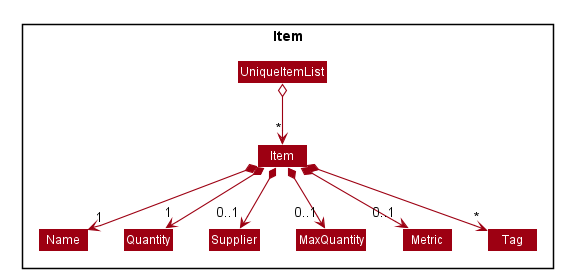
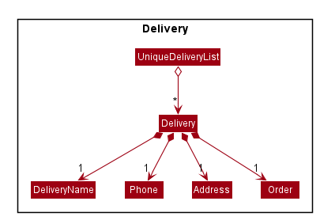
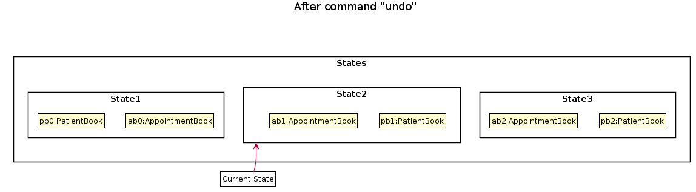

* Table of Contents
{:toc}

--------------------------------------------------------------------------------------------------------------------

## **Setting up, getting started**

Refer to the guide [_Setting up and getting started_](SettingUp.md).

--------------------------------------------------------------------------------------------------------------------

## **Design**

### Architecture

The ***Architecture Diagram*** given above explains the high-level design of the App. Given below is a quick overview of each component.

:bulb: **Tip:** The `.puml` files used to create diagrams in this document can be found in the [diagrams](https://github.com/se-edu/addressbook-level3/tree/master/docs/diagrams/) folder. Refer to the [_PlantUML Tutorial_ at se-edu/guides](https://se-education.org/guides/tutorials/plantUml.html) to learn how to create and edit diagrams.

**`Main`** has two classes called [`Main`](https://github.com/se-edu/addressbook-level3/tree/master/src/main/java/seedu/address/Main.java) and [`MainApp`](https://github.com/se-edu/addressbook-level3/tree/master/src/main/java/seedu/address/MainApp.java). It is responsible for,
* At app launch: Initializes the components in the correct sequence, and connects them up with each other.
* At shut down: Shuts down the components and invokes cleanup methods where necessary.

[**`Commons`**](#common-classes) represents a collection of classes used by multiple other components.

The rest of the App consists of four components.

* [**`UI`**](#ui-component): The UI of the App.
* [**`Logic`**](#logic-component): The command executor.
* [**`Model`**](#model-component): Holds the data of the App in memory.
* [**`Storage`**](#storage-component): Reads data from, and writes data to, the hard disk.
* [**`History`**](#command-history-traversal): Records user's command history and allows for traversal.

Each of the four components,

* defines its *API* in an `interface` with the same name as the Component.
* exposes its functionality using a concrete `{Component Name}Manager` class (which implements the corresponding API `interface` mentioned in the previous point.

For example, the `Logic` component (see the class diagram given below) defines its API in the `Logic.java` interface and exposes its functionality using the `LogicManager.java` class which implements the `Logic` interface.

**How the architecture components interact with each other**

The *Sequence Diagram* below shows how the components interact with each other for the scenario where the user issues the command `delete 1`.

The sections below give more details of each component.

### UI component

**API** :
[`Ui.java`](https://github.com/AY2021S1-CS2103T-T12-1/tp/blob/master/src/main/java/seedu/address/ui/Ui.java)

The UI consists of a `MainWindow` that is made up of parts e.g.`CommandBox`, `ResultDisplay`, `ItemListPanel`, `DeliveryListPanel`, `StatusBarFooter` etc. All these, including the `MainWindow`, inherit from the abstract `UiPart` class.

The `UI` component uses JavaFx UI framework. The layout of these UI parts are defined in matching `.fxml` files that are in the `src/main/resources/view` folder. For example, the layout of the [`MainWindow`](https://github.com/AY2021S1-CS2103T-T12-1/tp/blob/master/src/main/java/seedu/address/ui/MainWindow.java) is specified in [`MainWindow.fxml`](https://github.com/AY2021S1-CS2103T-T12-1/tp/blob/master/src/main/resources/view/MainWindow.fxml)

The `UI` component,

* Executes user commands using the `Logic` component.
* Listens for changes to `Model` data so that the UI can be updated with the modified data.

### Logic component

**API** :
[`Logic.java`](https://github.com/AY2021S1-CS2103T-T12-1/tp/blob/master/src/main/java/seedu/address/logic/Logic.java)

1. `Logic` uses the `Parser` API to parse the user command.
1. This results in a `Command` object which is executed by the `LogicManager`.
1. The command execution can affect the `Model` (e.g. adding an item).
1. The result of the command execution is encapsulated as a `CommandResult` object which is passed back to the `Ui`.
1. In addition, the `CommandResult` object can also instruct the `Ui` to perform certain actions, such as displaying help to the user.

Given below is the Sequence Diagram for interactions within the `Logic` component for the `execute("delete-i 1")` API call.

:information_source: **Note:** The lifeline for `ItemDeleteCommandParser` should end at the destroy marker (X) but due to a limitation of PlantUML, the lifeline reaches the end of diagram.

### Model component

  
Structure of the Model Component

**API** : [`Model.java`](https://github.com/AY2021S1-CS2103T-T12-1/tp/blob/master/src/main/java/seedu/address/model/Model.java)

`Models`,

* stores a map of Models(eg. InventoryModel and DeliveryModel)
* Each model stores the current state of the Book(eg. InventoryModel stores the current state of the InventoryBook)
* used for undo/redo feature

`Model`

* stores a `UserPref` object that represents the users preference

`InventoryModelManager`

* stores a comparator used to sort the filtered list
* stores the inventory book data
* stores a list of InventoryBook for redo/undo command
* exposes an unmodifiable `ObservableList<Item>` that can be 'observed' e.g. the UI can be bound to this list so that the UI automatically updates when the data in the list change.

`DeliveryModelManager`

* stores the delivery book data
* stores a list of DeliveryBook for redo/undo command
* exposes an unmodifiable `ObservableList<Delivery>` that can be 'observed' e.g. the UI can be bound to this list so that the UI automatically updates when the data in the list change.

We organised the different data classes into packages (eg.Items) which we will list out the collection of class of that data object

  
Structure of Items Object

  
Structure of Delivery Object

### Storage component

**API** : [`Storage.java`](https://github.com/AY2021S1-CS2103T-T12-1/tp/blob/master/src/main/java/seedu/address/storage/Storage.java)

The `Storage` component,
* can save `UserPref` objects in json format and read it back.
* can save the inventoryBook/deliveryBook data in json format and read it back.

### Common classes

Classes used by multiple components are in the `seedu.addressbook.commons` package.

--------------------------------------------------------------------------------------------------------------------

## **Implementation**

This section describes some noteworthy details on how certain features are implemented.

### Adding Items and Delivery
OneShelf is capable of adding items and deliveries.
Adding Items and Delivery both are done similarly which will be illustrated with an AddItemActivityDiagram below.

We've repurposed the `Add` command from AB3 to add on to existing item's quantity instead of throwing an error.
In this case 2 items are considered the same if they have the same `Name` and `Supplier`.
The other variables such as:

a) `Metric` `MaxQuantity`
- Are not allowed to be defined if there exist the same item inside InventoryBook.

b) `Tags`
- Will be combined together if there exist the same item inside InventoryBook.

Note: No 2 deliveries are considered the same. Reason being the same person can make multiple delivery orders.

### Command History Traversal
Much like Window's Command Prompt, OneShelf supports traversal of command history with the arrow up and down key.
There is a `History` interface that is implemented by `HistoryManager` class which stores `commandHistory` up to its `lengthLimit`

In order to replicate Window's Command Prompt's History traversal behaviour, a `hasReturnedCurrentCommandBefore` boolean is required to prevent the first `previousCommand()`
method call to return `commandHistory`'s 2nd last command instead of the last command.
`hasReturnedCurrentCommandBefore` will be set to true after the initial call of `previousCommand()` and will be reset to false if new commands are added or `nextCommand()` results in a `Optional.empty()`

With `addToHistory(String command)`, `previousCommand()`, `nextCommand()` and `currentCommand()` implemented, a simple `setOnKeyPressed` under `CommandBox` class which checks
for user's input of arrow up (which calls previousCommand()) and arrow down (which calls nextCommand()) would suffice for GUI implementation.

Below is the sequence diagram when user pressing the arrow up button with `CommandBox` selected on GUI.

### Finding Items and Delivery
OneShelf is capable of storing many items and pending deliveries. 
Therefore, it is of utmost importance to have the ability to find items
and deliveries based on different fields. There could also be many similar items and 
this will definitely aid the user in finding them quickly.  

We have modified the `find` command to be able to search for `NAME`, `SUPPLIER` 
and `TAGS` for items using `find-i`. Similarly, for deliveries, it is also possible 
to search using the `DELIVERYNAME`, `PHONE`, `ADDRESS` or `ORDER` using `find-d`.
Note that the implementation of `find-i` and `find-d` are relatively similar and in this example, we will only show
`find-i`.

By using `ArgumentMultimap`, we are able to record the searching criteria together with the prefixes. We will then pass
 this criteria along with the prefix to create an `ItemContainsKeywordsPredicate` object which implements 
 `Predicate<Item>`.
The predicate is then passed to the `InventoryModel#UpdateItemListFilter` which will then be used to set the 
predicate on the existing filteredList.

Below is a usage example

Step 1: User executes `find-i s/NTUC` command to search the list of items by Supplier  
Step 2: `ArguementMultiMap` maps each prefix to their values and `ItemFindCommandParser` checks which prefix has a 
value  
Step 3: The value and prefix is then used to create the predicate and passed to `ItemFindCommand`  
Step 4: `ItemFindCommand` executes the command and update the filteredList  

Below is a sequence diagram of the above

### Undo/Redo Command

Each `Model` internally stores its undo and redo history as a (for `DeliveryModel`) `deliveryBookStateList` and `deliveryBookStatePointer`. There are corresponding analogs for `InventoryModel`.
Additionally, the following commands are implemented by `ModelsManager`.

* `ModelsManager#commit()` — Saves the current book states of all the `Model`s it contains in their history.
* `ModelsManager#undo()` — Restores the previous book states from each `Model` from their history.
* `ModelsManager#redo()` — Restores all previously undone book states from every `Model`'s history.

These operations are exposed in the `Models` interface as `Models#commit()`, `Models#undo()` and `Models#redo()` respectively.

The `ModelsManager` class calls `Model#commit()`, `Model#undo()`, and `Model#redo` on each of the models it contains, which then handle the respective tasks.

Given below is an example usage scenario and how the undo/redo mechanism behaves at each step.

Step 1. The user launches the application for the first time. Each `Model` will be initialized with its initial state, and the pointer pointing to their respective book's state.

Step 2. The user executes `delete-i 5` command to delete the 5th item in the inventory book. The `delete-i` command calls `Models#commit()`, causing the modified state of the inventory and delivery books after the `delete-i 5` command executes to be saved in the `inventoryBookStateList`, `deliveryBookStateList`, 
and the `inventoryBookStatePointer`, `deliveryBookStatePointer` are shifted to the newly inserted books state.

Step 3. The user executes `add-d n/David p/12345678 …​` to add a new Delivery. The `add-d` command also calls `Models#commit()`, causing another set of modified book states to be saved into the `inventoryBookStateList` and `deliveryBookStateList`.

:information_source: **Note:** If a command fails its execution, it will not call `Models#commit()`, so the states will not be saved into the `inventoryBookStateList` and `deliveryBookStateList`.

Step 4. The user now decides that adding the delivery was a mistake, and decides to undo that action by executing the `undo` command. The `undo` command will call `Models#undo()`, which will shift the `deliveryBookStatePointer` and `inventoryBookStatePointer` once to the left, pointing it to the previous states, and restores the inventoryBook/deliveryBook to those states.

:information_source: **Note:** If the current state pointers are at index 0, pointing to the initial state, then there are no previous books states to restore. The `undo` command uses `InventoryModel#canUndo()` and `DeliveryModel#canUndo()` to check if this is the case. If so, it will return an error to the user rather
than attempting to perform the undo.

The following sequence diagram shows how the undo operation works:

:information_source: **Note:** The lifeline for `UndoCommand` should end at the destroy marker (X) but due to a limitation of PlantUML, the lifeline reaches the end of diagram.

The `redo` command does the opposite — it calls `Models#redo()`, which shifts the `inventoryBookStatePointer` and `deliveryBookStatePointer` once to the right, pointing to the previously undone state, and restores the inventoryBook and deliveryBook to that state.

:information_source: **Note:** If the current pointers are pointing to the latest state, then there are no undone InventoryBook/DeliveryBook states to restore. The `redo` command uses `InventoryModel#canRedo()` and `DeliveryModel#canRedo()` to check if this is the case. If so, it will return an error to the user rather than attempting to perform the redo.

Step 5. The user then decides to execute the command `list-i`. Commands that do not modify the inventoryBook and deliveryBook, such as `list-d` and `find-i`, will usually not call `Models#commit()`, `Models#undo()` or `Models#redo()`. Thus, the `inventoryBookStateList` and `deliveryBookStateList` remain unchanged.

Step 6. The user executes `clear-d`, which calls `Models#commit()`. Since the state pointers are not pointing at the end of the respective state lists, all states after the current state will be purged. Reason: It no longer makes sense to redo the `add-d n/David p/12345678 …​` command. This is the behavior that most modern desktop applications follow.

The following activity diagram summarizes what happens when a user executes a new command:

#### Design consideration:

##### Aspect: How undo & redo executes

* **Alternative 1 (current choice):** Saves the entire state.
  * Pros: Easy to implement.
  * Cons: May have performance issues in terms of memory usage.

* **Alternative 2:** Individual command knows how to undo/redo by
  itself.
  * Pros: Will use less memory (e.g. for `delete`, just save the item being deleted).
  * Cons: We must ensure that the implementation of each individual command are correct.

_{more aspects and alternatives to be added}_

### \[Proposed\] Data archiving

_{Explain here how the data archiving feature will be implemented}_

--------------------------------------------------------------------------------------------------------------------

## **Documentation, logging, testing, configuration, dev-ops**

* [Documentation guide](Documentation.md)
* [Testing guide](Testing.md)
* [Logging guide](Logging.md)
* [Configuration guide](Configuration.md)
* [DevOps guide](DevOps.md)

--------------------------------------------------------------------------------------------------------------------

## **Appendix: Requirements**

### Product scope

**Target user profile**: Restaurant owners
* needs to keep track of pending deliveries
* needs to manage purchasing appropriate amounts of raw materials based on usage
* wants to be updated on raw materials stock level on a daily basis
* prefer desktop apps over other types
* can type fast
* prefers typing to mouse interactions
* is reasonably comfortable using CLI commands

**Value proposition**: manage inventory and pending delivery faster than a typical mouse/GUI driven app

### User stories

Priorities: High (must have) - `* * *`, Medium (nice to have) - `* *`, Low (unlikely to have) - `*`

| Priority | As a …​                                 | I want to …​                                                                   | So that I can…​                                                     |
| -------- | ------------------------------------------ | --------------------------------------------------------------------------------- | ---------------------------------------------------------------------- |
| `* * *`  | Restaurant owner                           | be able to list all the items out                                                 | save in terms of man-hours                                             |
| `* * *`  | Restaurant owner                           | have an accurate stock level reflected in a system                                | know when to restock and know how much is left to sell                 |
| `* * *`  | Inventory Manager                          | remove stock                                                                      | update them in the event of usage/stock going bad                      |
| `* * *`  | Supplier                                   | be able to be up to date with the restaurant's stock level                        | have a heads up on how much to restock                                 |
| `* *`    | Restaurant owner                           | be able to order appropriate amount of raw materials for work cycle ahead         | minimize waste                                                         |
| `* *`    | Restaurant owner                           | store all the supplier's information                                              | contact them easily                                                    |
| `* *`    | Restaurant owner                           | be able to view schedules                                                         | plan deliveries from wholesalers                                       |
| `* *`    | Restaurant owner                           | be able to add notes                                                              | input more details                                                     |
| `* *`    | Restaurant owner                           | use the app in an easier way                                                      | teach new users quicker                                                |
| `* *`    | Inventory Manager                          | be able to categorise the items                                                   | better manage them                                                     |
| `* *`    | Inventory Manager                          | sort my items                                                                     | visualize the inventory better                                         |
| `* *`    | Inventory Manager                          | be able to print monthly report                                                   | keep track of the restaurant's status                                  |
| `* *`    | Inventory Manager                          | receive a notification if stock goes below a threshold                            | restock promptly                                                       |
| `* *`    | Inventory Manager                          | see the prices of my items                                                        | better manage budget                                                   |
| `* *`    | Inventory Manager                          | see statistics of stocks                                                          | optimize future restocking                                             |
| `* *`    | Inventory Manager                          | be able to upload images of stock                                                 | identify them easily                                                   |
| `* *`    | First time user                            | be able to pick up commands easily                                                | start using the application asap                                       |
| `* *`    | Fast typist                                | be able to undo my command                                                        | correct myself in case of a typo                                       |
| `*`      | Inventory Manager                          | be able to convert data into csv/excel                                            | view it in a more readable format                                      |

*{More to be added}*

### Use cases

(For all use cases below, the **System** is the `OneShelf` and the **Actor** is the `user`, unless specified otherwise)

**Use case: Delete an item**

**MSS**

1.  User requests to list items
2.  InventoryBook shows a list of items
3.  User requests to delete a specific item in the list
4.  InventoryBook deletes the item

    Use case ends.

**Extensions**

* 2a. The list is empty.

  Use case ends.

* 3a. The given index is invalid.

    * 3a1. OneShelf shows an error message.

      Use case resumes at step 2.

**Use case: Adding existing item's quantity or tags**

**MSS**

1. User request to update item.
2. OneShelf updates the item accordingly.

   Use case ends.

**Extensions**

* 1a. OneShelf detect invalid data input.

  * 1a1. OneShelf shows an error message.

  Use case ends.

* 1b. OneShelf unable to detect existing item name and supplier.

  * 1b1. OneShelf adds a new item into the inventory.

  Use case ends.
  
 * 1c. InventoryBook detects existing item name and supplier.
    * 1c1. InventoryBook adds on existing item name and supplier's with input quantity.

**Use case: Editing an item**

**MSS**

1. User request to list all item or specific item using the find-command
2. InventoryBook show the list of corresponding items.
3. User request to edit a specific item in the list.
4. InventoryBook edits the item.

   Use case ends.

**Extensions**

* 2a. The list is empty.

  Use case ends.

* 3a. The given index is invalid.

  * 3a1. OneShelf shows an error message.

        Use case resumes at step 2.

* 3b. The given data to edit is invalid.

  * 3b1. OneShelf shows an error message.

        Use case resumes at step 2.

* 3c. OneShelf detects a duplicate after editing.

  * 3c1. OneShelf shows an error message.

        Use case resumes at step 2.

### Non-Functional Requirements

1.  Should work on any _mainstream OS_ as long as it has Java `11` or above installed.
2.  Should be able to hold up to 1000 items without a noticeable sluggishness in performance for typical usage.
3.  A user with above average typing speed for regular English text (i.e. not code, not system admin commands) should be able to accomplish most of the tasks faster using commands than using the mouse.
4.  Should work on 32-bit and 64-bit environments.
5.  Should not take up more than 50 MB of disk space.
6.  Should not take up more than 250 MB of RAM.
7.  Add, Delete, List, Undo, Redo, Edit, and Remove Commands should receive a response within 1 second regardless of data size.
8.  All other commands should receive a response withing 5 seconds regardless of data size.
9.  The data should be secured using a password.
10. Users should be able to get fluent with the syntax by their 10th usage.
11. The system should still be able to function without connection to a network.
12. The system should only be used by one user.
13. Storing 100 states of the models for the Undo and Redo Commands should not take more than 100 KB.
14. Storing 100 states of history of commands the user has entered should not take more than 10 KB.

### Glossary

* **Mainstream OS**: Windows, Linux, Unix, OS-X

--------------------------------------------------------------------------------------------------------------------

## **Appendix: Instructions for manual testing**

Given below are instructions to test the app manually.

:information_source: **Note:** These instructions only provide a starting point for testers to work on;
testers are expected to do more *exploratory* testing.

### Launch and shutdown

1. Initial launch

   1. Download the jar file and copy into an empty folder

   1. Double-click the jar file Expected: Shows the GUI with a set of sample contacts. The window size may not be optimum.

1. Saving window preferences

   1. Resize the window to an optimum size. Move the window to a different location. Close the window.

   1. Re-launch the app by double-clicking the jar file. 
       Expected: The most recent window size and location is retained.

1. _{ more test cases …​ }_

### Deleting an item

1. Deleting an item while all items are being shown

   1. Prerequisites: List all items using the `list-i` command. Multiple items in the list.

   1. Test case: `delete-i 1` 
      Expected: First contact is deleted from the list. Details of the deleted contact shown in the status message. Timestamp in the status bar is updated.

   1. Test case: `delete-i 0` 
      Expected: No item is deleted. Error details shown in the status message. Status bar remains the same.

   1. Other incorrect delete commands to try: `delete-i`, `delete-i x`, `...` (where x is larger than the list size) 
      Expected: Similar to previous.

1. _{ more test cases …​ }_

### Saving data

1. Dealing with missing data files

   1. Test case: First time user running OneShelf  
   Expected: OneShelf will load a sample data file.

1. Dealing with corrupted data files

   1. Prerequisite: There is an existing json file (inventorybook.json or deliverybook.json)

   1. Test case: Delete some mandatory field in the json file and launch OneShelf  
      Expected: OneShelf will load a new empty json file respectively

1. _{ more test cases …​ }_
