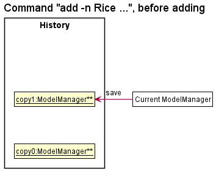
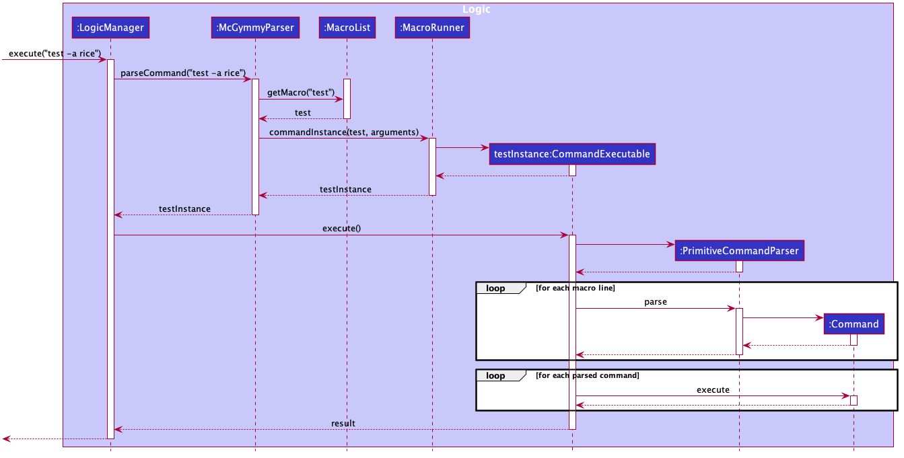

* Table of Contents
{:toc}

--------------------------------------------------------------------------------------------------------------------

## 1. **Purpose of this guide**
This guide is made to help developers understand how McGymmy (MG) works.
One of the major goals is to centralise all the jimmy.mcgymmy documentation within McGymmy itself.
Another major goal is to better help developers extend McGymmy to improve on its features.

##  2. Icon Legend

:bulb: **Tip:** This indicates that the following text consists of tips to better utilise MG

:information_source: **Note:** This indicates important notes for current feature we are looking at 

## 3. A little note from the developers

Thank you for using MG. We sincerely hope that MG plays apart to help you achieve a healthier lifestyle.
We understand that MG may be a little different from traditional GUI applications and it may be a little difficult to start using it initially.
Thus, we recommend you to start by first understanding how MG works at a high level at the Quick start section. Then, explore the Features section.

:bulb: **Tip:** Press Ctrl-F to open the find prompt in your browser. You can type in keywords such as `add` or `edit` to quickly navigate to those parts of the document.

## 4. **General Information**
McGymmy (MG) is a **desktop app for managing diet and exercise, optimized for use via a Command Line Interface** (CLI) while still having the benefits of a Graphical User Interface (GUI). If you can type fast, McGymmy can log your diet and exercise tasks, goals and progress done faster than traditional GUI apps.

## 5. **Setting up, getting started**

Refer to the guide [_Setting up and getting started_](SettingUp.md).

--------------------------------------------------------------------------------------------------------------------

## 6. **Design**

### 6.1 Architecture

The ***Architecture Diagram*** given above explains the high-level design of the App. Given below is a quick overview of each component.

**`Main`** has two classes called [`Main`](https://github.com/AY2021S1-CS2103T-W17-3/tp/tree/master/src/main/java/jimmy/mcgymmy/Main.java) and [`MainApp`](https://github.com/AY2021S1-CS2103T-W17-3/tp/tree/master/src/main/java/jimmy/mcgymmy/MainApp.java). It is responsible for,
* At app launch: Initializes the components in the correct sequence, and connects them up with each other.
* At shut down: Shuts down the components and invokes cleanup methods where necessary.

[**`Commons`**](#common-classes) represents a collection of classes used by multiple other components.

The rest of the App consists of four components.

* [**`UI`**](#ui-component): The UI of the App.
* [**`Logic`**](#logic-component): The command executor.
* [**`Model`**](#model-component): Holds the data of the App in memory.
* [**`Storage`**](#storage-component): Reads data from, and writes data to, the hard disk.

Each of the four components,

* defines its *API* in an `interface` with the same name as the Component.
* exposes its functionality using a concrete `{Component Name}Manager` class (which implements the corresponding API `interface` mentioned in the previous point.

For example, the `Logic` component (see the class diagram given below) defines its API in the `Logic.java` interface and exposes its functionality using the `LogicManager.java` class which implements the `Logic` interface.

**How the architecture components interact with each other**

The *Sequence Diagram* below shows how the components interact with each other for the scenario where the user issues the command `delete 1`.

The sections below give more details of each component.

### 6.2 UI component

**API** :
[`Ui.java`](https://github.com/AY2021S1-CS2103T-W17-3/tp/tree/master/src/main/java/jimmy/mcgymmy/ui/Ui.java)

The UI consists of a `MainWindow` that is made up of parts e.g.`CommandBox`, `ResultDisplay`, `FoodListPanel`, `StatusBarFooter` etc. All these, including the `MainWindow`, inherit from the abstract `UiPart` class.

The `UI` component uses JavaFx UI framework. The layout of these UI parts are defined in matching `.fxml` files that are in the `src/main/resources/view` folder. For example, the layout of the [`MainWindow`](https://github.com/AY2021S1-CS2103T-W17-3/tp/tree/master/src/main/java/jimmy/mcgymmy/ui/MainWindow.java) is specified in [`MainWindow.fxml`](https://github.com/AY2021S1-CS2103T-W17-3/tp/tree/master/src/main/resources/view/MainWindow.fxml).

The `UI` component,

* Executes user commands using the `Logic` component.
* Listens for changes to `Model` data so that the UI can be updated with the modified data.

### 6.3 Logic component

**API** :
[`Logic.java`](https://github.com/AY2021S1-CS2103T-W17-3/tp/tree/master/src/main/java/jimmy/mcgymmy/logic/Logic.java)

We omit details of the `Macro` component in this section and will only focus on the parsing and execution of non-macro `Command`s.
For more information on macros and the full parsing process please read the section below.

1. `Logic` uses the `McGymmyParser` class to parse the user command.
1. This results in a `CommandExecutable` object which is executed by the `LogicManager`.
1. The command execution can affect the `Model` (e.g. adding a food item).
1. The result of the command execution is encapsulated as a `CommandResult` object which is passed back to the `Ui`.
1. In addition, the `CommandResult` object can also instruct the `Ui` to perform certain actions, such as displaying help to the user.

Note that our implementation of this component is different from the one in the parent project, [AddressBook3](https://se-education.org/addressbook-level3/).
One notable difference is the use of several `Parameter` classes in the various `Commands`.
We list a few of the benefits of our redesigned solution below.

1. The main motivation for this change was to facilitate the addition of the `macro` feature.
2. The old design of the parser operated at too high an abstraction level, resulting in the developer having to create hideous objects like the `EditPersonDescriptor` to implement basic functionality.
3. The new design allows us to code in a more declarative style which is more readable and arguably "self-documenting".
4. Hiding details of each `Parameter` behind an additional layer of abstraction allows us to automate the creation of other features such as parsers for each individual `Command` and automatially generating `help` strings.

Given below is the Sequence Diagram for interactions within the `Logic` component for the `execute("delete 1")` API call.

For more details on the new architecture you can refer to this [pull request](https://github.com/AY2021S1-CS2103T-W17-3/tp/pull/39).
In particular, details on how to create new `Command`s are included in the pull request above.

### 6.4 Model component

**API** : [`Model.java`](https://github.com/AY2021S1-CS2103T-W17-3/tp/tree/master/src/main/java/jimmy/mcgymmy/model/Model.java)

The `Model`,

* stores a `UserPref` object that represents the user’s preferences.
* stores the McGymmy data.
* exposes an unmodifiable `ObservableList<Food>` that can be 'observed' e.g. the UI can be bound to this list so that the UI automatically updates when the data in the list change.
* does not depend on any of the other three components.

:information_source: **Note:** An alternative (arguably, a more OOP) model is given below. It has a `Tag` list in `McGymmy`, which `Food` references. This allows `McGymmy` to only require one `Tag` object per unique `Tag`, instead of each `Food` needing their own `Tag` object.

 

### 6.5 Storage component

**API** : [`Storage.java`](https://github.com/AY2021S1-CS2103T-W17-3/tp/tree/master/src/main/java/jimmy/mcgymmy/storage/Storage.java)

The `Storage` component,
* can save `UserPref` objects in JSON format and read it back.
* can save the McGymmy data in JSON format and read it back.

### 6.6 Common classes

Classes used by multiple components are in the `jimmy.mcgymmy.commons` package.

--------------------------------------------------------------------------------------------------------------------

## 7. **Implementation**

This section describes some noteworthy details on how certain features are implemented.

### 7.1 Clear feature

The clear feature extends model with the ability to delete all the items shown in the UI.

#### 7.1.1 Implementation

Given below is an example usage scenario and how the clear mechanism works

Step 1. The user has decided that he wants to delete all filtered items based on taggings or names.

Step 2. The user uses the find command to search for the items to delete.

Step 3. The User executes `clear`.
The clear command will update the model to delete every occurences of food shown on the UI.
Otherwise, a CommandException will be thrown.

Step 4. Storage is then updated to be the same as model.

The following sequence diagram shows how the clear operation works:

#### 7.1.2 Design Considerations

##### 7.1.2.1 Aspect: How clear executes

* **Alternative 1 (Current Choice):** A refilter using predicate into a list and reupdate food items.

    * Pros: No traversal issue and no issue when food definition changes
    * Cons: Hard to implement

* **Alternative 2:** An enhanced for loop can be used to remove all occurences straight from the list.

    * Pros: Cleaner code and smaller and time space complexity
    * Cons: Code may break if food properties ever changes due to traversal error.

### 7.2 Find feature

#### 7.2.1 Implementation

The find mechanism is facilitated by `ModelManager`. It keeps a filtered list (updated via a specified `Predicate`) of food items,
stored internally as a `FilteredList<Food>`. Additionally, it implements the following relevant operation:

* `ModelManager#updateFilteredFoodList(Predicate<Food>)` - Filters internal storage via a `Predicate<Food>` specification.

Given below is an example usage scenario and how the find mechanism behaves at each step.

Step 1. The user launches the application after having used it for a while.

Step 2. The user wants to find what he ate for dinner on a certain date (eg. 21-10-2020).

Step 3. The user executes `find -n apple -t fruit`. The `find` command will check if the inputs are valid, and then parsed (similar to `delete`)
before using these inputs to create conditional `Predicate<Food>` instances (eg. `NameContainsKeywordsPredicate`, `DatePredicate`). The predicates
are then combined and used to filter the `FilteredList<Food>`. The GUI will then display the food items in the filtered list.

The following sequence diagram shows how the find operation works:

:information_source: **Note:** The method Parser::parse is a simplification of the overall parsing sequence which was already covered in showcasing the execution of the delete method. As such, redundant parsing details are not covered here.

#### 7.2.2 Design consideration:

##### 7.2.2.1 Aspect: Arguments for FindCommand

* **Alternative 1 (current choice):** Completely optional parameters, and ability to `find item` without a `flag`.
  * Pros: More flexibility for user, not restricted by parameter requirements.
  * Cons: Harder to implement, breaks general patten of `flag`-less arguments being compulsory parameters.

* **Alternative 2:** Compulsory `flag`-less name parameter
  * Pros: Easier to implement.
  * Cons: Less user-friendly, user restricted in use of method

##### 7.2.2.2 Aspect: How find works

* **Alternative 1 (current choice):** Filters Food with matching instance of at least one (assuming multiple arguments) argument for a given parameter
  * Pros: Easier to implement and easier to locate more things quickly.
  * Cons: Harder to locate specific food items.

* **Alternative 2:** Filters Food with matching instance of all arguments for a given parameter
  * Pros: Can locate specific food items easily; more narrowed-down search.
  * Cons: More difficult to find something over broad terms.

* **Alternative 3 (proposed best choice):** Allow variation in type of filtering through another optional parameter.
  * Pros: Combined Pros of Alternative 1 and 2, gives user greater autonomy.
  * Cons: Harder to implement, harder to use effectively.

### 7.3 Import feature

The current Import feature is facilitated by `JsonMcGymmyStorage`.
It extends model with the ability to override the current data with an imported one.

#### 7.3.1 Implementation

Given below is an example usage scenario and how the import mechanism behaves at each step

Step 1. The User just installed his application on his new computer and wants to transfer his old data over

Step 2. The user transfers his previous save file to `C:/McGymmy/saveFile.json`

Step 3. The User executes `import c:/McGymmy/saveFile.json`.
The import command will check if the file is valid and exists before calling `JsonMcGymmyStorage`.
`JsonMcGymmyStorage` will call `#readMcGymmy` if the read is successful, the old data will be overwritten.
Otherwise, a CommandException will be thrown.

Step 4. His old data files from his old computer will be overridden by his old data

The following sequence diagram shows how the import operation works:

:information_source: **Note:** The method Parser::parse is a simplification of the overall parsing sequence which was already covered in showcasing the execution of the delete method. As such, redundant parsing details are not covered here.

#### 7.3.2 Design Considerations

##### 7.3.2.1 Aspect: How import executes

* **Alternative 1 (Current Choice):** User keys in the filepath of the save file

    * Pros: Easy to implement
    * Cons: Requires the user to key in path to file

* **Alternative 2:** User keys in path and McGymmy checks subdirectories for valid files

    * Pros: More convenient for the users
    * Cons: Increased implementation complexity (Prone to bugs), May have performance issues in terms of runtime.

### 7.4 Undo feature

#### 7.4.1 Implementation

The proposed undo mechanism is facilitated by `ModelManager` and `History`.
`History` pairs `ReadOnlyMcGymmy` and `Predicate<Food>` gotten from `ModelManager` into a pair, then store multiple pairs of different versions in a stack, with the most recent version on top.
Whenever there is a change to either `ModelManager`'s data or filter predicate, `ModelManager` will pass itself into `History` to be checked and saved in the stack.
If `History` recognizes there is no change between the current state and the previous state, it will not save the current state to its stack.
Additionally, `ModelManager` implements the following operations:

* `ModelManager#canUndo()` - Checks if there is any older state stored in history.
* `ModelManager#undo()` - Restores the previous McGymmy state from its history.
* `ModelManager#saveCurrentStateToHistory()` - Saves the current McGymmy state in its history.

The first 2 operations are exposed in the `Model` interface as `Model#canUndo()` and `Model#undo()` respectively.

Given below is an example usage scenario and how the undo mechanism behaves at each step.

Step 1. The user launches the application for the first time. The `ModelManager` will be initialized with the empty `mcGymmyStack`.

Step 2. The user executes `delete 5` command to delete the 5th food item in the McGymmy.
The `delete` command calls `ModelManager#deleteFood(Index)`, which calls `ModelManager#addCurrentStateToHistory()`,
causing the stack to store a copied version of the McGymmy before any data changes happen.
Then McGymmy changes accordingly to delete the food at index 5.

Step 3. The user executes `add -n Rice …​` to add a new food item. The `add` command calls `ModelManager#addFood(Food)`, which also calls `ModelManager#addCurrentStateToHistory()`,
storing a copied version of the McGymmy into the stack before changing the McGymmy.

:information_source: **Note:** If a command fails its execution, it will not call `ModelManager#addCurrentStateToHistory()`, so the McGymmy state will not be saved into the `mcGymmyStack`.

Step 4. The user now decides that adding the food item was a mistake, and decides to undo that action by executing the `undo` command. The `undo` command will call `ModelManager#undo()`,
which will pop the top most state from `mcGymmyStack`, and restores the McGymmy to that state.

:information_source: **Note:** If the `currentStatePointer` is at index 0, pointing to the initial McGymmy state, then there are no previous McGymmy states to restore. The `undo` command uses `Model#canUndoMcGymmy()` to check if this is the case. If so, it will return an error to the user rather
than attempting to perform the undo.

The following sequence diagram shows how the undo operation works:

:information_source: **Note:** The lifeline for `UndoCommand` should end at the destroy marker (X) but due to a limitation of PlantUML, the lifeline reaches the end of diagram.

:information_source: **Note:** The method Parser::parse is a simplification of the overall parsing sequence which was already covered in showcasing the execution of the delete method. As such, redundant parsing details are not covered here.

:information_source: **Note:** The method ModelManager::updateModelManager is a simplification of updating the McGymmy, updating the filterPredicate and updating the filteredFoodList separately.

The following activity diagram summarizes what happens when a user executes a new command:

#### 7.4.2 Design consideration:

##### 7.4.2.1 Aspect: How undo executes

* **Alternative 1 (current choice):** Saves the entire ModelManger database.
  * Pros: Easy to implement.
  * Cons: May have performance issues in terms of memory usage.

* **Alternative 2:** Individual command knows how to undo by
  itself.
  * Pros: Will use less memory (e.g. for `delete`, just save the food item being deleted).
  * Cons: We must ensure that the implementation of each individual command are correct.

_{more aspects and alternatives to be added}_

### 7.5 Macro Command

As with the other class diagram for the *Logic* component above, we omit some details in the above diagram for clarity.

There are two 'parts' to the macro component:

1. The creation of the macro object itself (e.g. running `macro test a; add -n \a breakfast -c 100`).
2. The execution of the macro object (e.g. running `test -a tau sar pau`).

The creation of the macro object is straightforward as we defer most of the heavy lifting to during the execution of the macro.

#### 7.5.1 A more complete picture of the parsing process

We only described parsing and execution of primitive commands in the section above.
A short description of the process including the parsing of macros is as follows:

1. If command word is `macro`, return a `NewMacroCommand` (which will create a new `macro` when executed).
2. Else if command word is an existing macro, call that macro object's `toCommandExecutable` method and return that.
3. Else hand over to primitive command parser.

#### 7.5.2 Execution of macros

Here we detail what exactly happens in each macro's `toCommandExecutable` object.
Throughout this section, we will use the following macro as an example: `macro test a;add -n \a breakfast 200`.

1. Parameters supplied by the user are substituted into the macro's lines. For the example if the user enters `test -a rice`, `rice` will be substituted into the `\a` part of `add -n \a breakfast 200` to obtain `add -n rice breakfast 200`;
2. Pass the list of strings to a new instance of `PrimitiveCommandParser` to get a list of `Command`s. If a `ParseException` occurs, we recast it as a `CommandException` and re-throw it.
3. Execute all these `Command`s in sequence, and return a new `CommandResult` created from concatenating the respective `CommandResults` returned by the `Command`s. If a `CommandException` occurs in this sequence, that exception is thrown with the added message listing the commands that have executed successfully, and commands that have yet to be executed.

#### 7.5.3 Additional considerations for this implementation
Alternatively could have done the parsing/compiling on creation of the macro so we don't need to use another parser during execution.
That is, each macro instance could contain its own `ParameterSet` which could then be used by its callee functions.
This implementation is considerably more involved hence we proceeded with the current implementation.

--------------------------------------------------------------------------------------------------------------------

## 8. **Documentation, logging, testing, configuration, dev-ops**

* [Documentation guide](Documentation.md)
* [Testing guide](Testing.md)
* [Logging guide](Logging.md)
* [Configuration guide](Configuration.md)
* [DevOps guide](DevOps.md)

--------------------------------------------------------------------------------------------------------------------

## 9. **Appendix: Requirements**

### 9.1 Product scope

**Target user profile**:

* has a need to manage food intake
* prefer desktop apps over other types
* can type fast
* prefers typing to mouse interactions
* is reasonably comfortable using CLI apps
* is sedentary people who sit in front of their computers

**Value proposition**:
* manage food intake faster than a typical mouse/GUI driven app
* reduce the risk of health issues for people with an unhealthy lifestyle
* help them develop a healthy lifestyle through diet
* help them track their calorie intake
* find trends in their eating habits
* profile setting for them to store different settings

### 9.2 User stories

Priorities: High (must have) - `* * *`, Medium (nice to have) - `* *`, Low (unlikely to have) - `*`

| Priority | As a/an …​                                  | I want to …​                            | So that I can…​                                                         |
| -------- | ------------------------------------------ | -------------------------------------- | ---------------------------------------------------------------------- |
| `* * *`  | new user                                   | see usage instructions                 | refer to instructions when I forget how to use the App                 |
| `* * *`  | user                                       | track what I am eating                 |                                                                        |
| `* * *`  | user                                       | delete a food item                     | remove food items that I no longer care of                             |
| `* * *`  | user                                       | easily add food items/details          | keep track of my diet                                                  |
| `* *`    | frequent user                              | perform tasks on a group of food items |                                                                        |
| `* *`    | expert user                                | create shortcuts for tasks             | frequently performed tasks                                             |
| `*`      | programmer                                 | make use of the CLI like design        | get used to CLI in the future                                          |

### 9.3 Use cases

(For all use cases below, the **System** is `McGymmy` and the **Actor** is the `user`, unless specified otherwise)

**Use case: UC01 List food**

**MSS**
1. User requests to list food (UC01)
2. McGymmy shows a list of food that user has added (UC02)
Use case ends

**Use case: UC02 Add food**

**MSS**
1. User requests to add food into the list
2. McGymmy adds the food item into the list

Use case ends.

**Extensions**
- 1a. The format of add method is invalid
    1a1. McGymmy shows an error message
    Use case ends.

**Use case: UC03 Delete food**

**MSS**
1. User requests to list food (UC01)
2. McGymmy shows a list of food
3. User request to delete a specific food on the list
4. McGymmy deletes the food

Use case ends

**Extensions**
- 2a. The list is empty 

    Use case ends.

- 3a. The given index is invalid. 
   - 3a1. McGymmy shows an error message.

    Use case resumes at step 2.

**Use case: UC04 Help**

**MSS**
1. User requests help
2. McGymmy shows all commands and examples of command usages

Use case ends

**Extensions**
No extensions

**Use case: UC05 Update food**

**MSS**
1. User requests to list food (UC01)
2. McGymmy shows a list of food
3. User request to update a specific food on the list
4. McGymmy updates the food

Use case ends

**Extensions**
- 2a. The list is empty 
    Use case ends.
- 3a. The given index is invalid. 
   - 3a1. McGymmy shows an error message
    Use case resumes at step 2.

**Use case: UC06 Add a macro command**

**MSS**

1. User creates a macro to execute two 'add' commands in sequence
2. McGymmy adds the macro to the list of available commands
3. User uses the newly added macro command
4. McGymmy executes the two commands consecutively

Use case ends

**Extensions**

 - 1a. The format of the macro is invalid.
    - 1a1. McGymmy shows an error message.

Use case ends.

 - 4a. One of the executed commands encounter an error.
    - 4a1. McGymmy shows the error message from that command, and displays the commands that successfully executed, and the commands that have yet to execute.

Use case ends.

*{More to be added}*

### 9.4 Non-Functional Requirements

1.  Should work on any _mainstream OS_ as long as it has Java `11` or above installed.
2.  Should be able to hold up to 1000 food items without a noticeable sluggishness in performance for typical usage.
3.  A user with above average typing speed for regular English text (i.e. not code, not system admin commands) should be able to accomplish most of the tasks faster using commands than using the mouse.
4. The product should be for a single user i.e. (not a multi-user product).
5. The data should be stored locally and should be in a human editable text file.
6. The software should not depend on a private remote server.
7. The size of the final compiled JAR file should be less than 100Mb.
8. There should be CLI alternatives to every GUI input. (E.g. instead of clicking on a button I can type an equivalent command to achieve the same result.)

*{More to be added}*

### 9.5 Glossary

* **Built-in commands**: Any other commands except Macro Command.
* **Command Line Interface (CLI)**: A command-line interface (CLI) processes commands to a computer program in the form of lines of text.
* **Flag**: A dash followed by a letter to denote the start of a parameter. For example, in `-n Chicken Rice`, `-n` is a flag for name and `Chicken Rice` is the input that will be processed by the application.
* **Graphical User Interface (GUI)**: A visual way of interacting with a computer using items such as windows, icons, and menus, used by most modern operating systems.
* **Macro command**: A command that allows you to execute multiple built-in commands sequentially with just one line of input
* **Mainstream OS**: Windows, Linux, Unix, OS-X.
* **McGymmy/MG**: The name of this application, can be used interchangeably in this guide.
* **Parameter**: Inputs given to the flag. For example, in `-n Chicken Rice`, `Chicken Rice` is the parameter passed to the flag `-n`.

--------------------------------------------------------------------------------------------------------------------

## 10. **Appendix: Instructions for manual testing**

Given below are instructions to test the app manually.

:information_source: **Note:** These instructions only provide a starting point for testers to work on;
testers are expected to do more *exploratory* testing.

### 10.1 Launch and shutdown

1. Initial launch

   1. Download the JAR file and copy into any folder

   1. Double-click the JAR file
       
      Expected: Shows the GUI with a set of sample food items. The window size may not be optimum.

1. Saving window preferences

   1. Resize the window to an optimum size. Move the window to a different location. Close the window.

   1. Re-launch the app by double-clicking the JAR file.
       
      Expected: The most recent window size and location is retained.

### 10.2 Deleting food items

1. Deleting a food item while all food items are shown.

   1. Prerequisites: List all food items using the `list` command. Multiple food items in the list.

   1. Test case: `delete 1` 
      Expected: First food item is deleted from the list. Details of the deleted food item shown in the status message. Timestamp in the status bar is updated.

   1. Test case: `delete 0` 
      Expected: No food item is deleted. Error details shown in the status message. Status bar remains the same.

   1. Other incorrect delete commands to try: `delete`, `delete x`, `...` (where x is larger than the list size) 
      Expected: Similar to previous.

### 10.3 Saving data

1. Dealing with missing/corrupted data files

   1. Delete the 'data' file if any. Relaunch the app by double-clicking the JAR file.
    
   Expected: A new data file is generated

   1. Open the data file inside the `data` folder using any text editor and edit the file.
    
   Expected: A new empty data file is generated which overwrites the old one.

