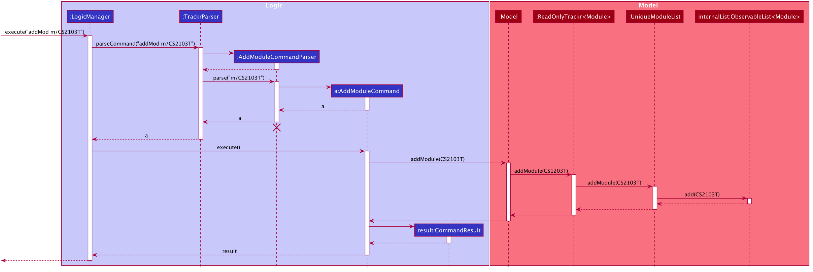

# **Trackr - Developer Guide**
by Team W12-2

---

## **Table of Contents**
* [Section 1 - Preface](#section-1---preface)
* [Section 2 - Setting up, getting started](#section-2---setting-up-getting-started)
* [Section 3 - Design](#section-3---design)
    * [3.1 - High-Level Architecture](#section-31---high-level-architecture)
    * [3.2 - UI Component](#section-32---ui-component)
    * [3.3 - Logic Component](#section-33---logic-component)
    * [3.4 - Model Component](#section-34---model-component)
    * [3.5 - Storage Component](#section-35---storage-component)
    * [3.6 - Common Classes](#section-36---common-classes)
* [Section 4 - Implementation](#section-4---implementation)
    * [4.1 - Add feature](#section-41---add-feature)
    * [4.2 - Undo/redo feature](#section-42---proposed-undoredo-feature)
    * [4.3 - Data saving and loading](#section-43---data-saving-and-loading)
* [Section 5 - Documentation, logging, testing, configuration, dev-ops](#section-5---documentation-logging-testing-configuration-dev-ops)
* [Section 6 - Appendix](#section-6---appendix)

---

## **Section 1 - Preface**
This is a Developer Guide to Trackr. A student and task management system for Teaching Assistants of all faculties who want to manage their students from various modules and tutorial groups, all in one place.

---

## **Section 2 - Setting up, getting started**

Refer to the guide [_Setting up and getting started_](SettingUp.md).

---

## **Section 3 - Design**

### Section 3.1 - High-Level Architecture

The **_Architecture Diagram_** given above explains the high-level design of the App. Given below is a quick overview of each component.

**`Main`** has two classes called [`Main`](https://github.com/se-edu/addressbook-level3/tree/master/src/main/java/seedu/address/Main.java) and [`MainApp`](https://github.com/se-edu/addressbook-level3/tree/master/src/main/java/seedu/address/MainApp.java). It is responsible for,

-   At app launch: Initializes the components in the correct sequence, and connects them up with each other.
-   At shut down: Shuts down the components and invokes cleanup methods where necessary.

[**`Commons`**](#common-classes) represents a collection of classes used by multiple other components.

The rest of the App consists of four components.

-   [**`UI`**](#ui-component): The UI of the App.
-   [**`Logic`**](#logic-component): The command executor.
-   [**`Model`**](#model-component): Holds the data of the App in memory.
-   [**`Storage`**](#storage-component): Reads data from, and writes data to, the hard disk.

Each of the four components,

-   defines its _API_ in an `interface` with the same name as the Component.
-   exposes its functionality using a concrete `{Component Name}Manager` class (which implements the corresponding API `interface` mentioned in the previous point.

For example, the `Logic` component (see the class diagram given below) defines its API in the `Logic.java` interface and exposes its functionality using the `LogicManager.java` class which implements the `Logic` interface.

**How the architecture components interact with each other**

The _Sequence Diagram_ below shows how the components interact with each other for the scenario where the user issues the command `delete 1`.

The sections below give more details of each component.

### Section 3.2 - UI component
The UI Component defines what the user will see and interact with while using Trackr. `MainWindow` that is made up of parts e.g.`CommandBox`, `ResultDisplay`, `ModuleListPanel`, `StatusBarFooter` etc. All these, including the `MainWindow`, inherit from the abstract `UiPart` class.

**API** :
[`Ui.java`](https://github.com/se-edu/addressbook-level3/tree/master/src/main/java/seedu/address/ui/Ui.java)

The `UI` component uses JavaFx UI framework. The layout of these UI parts are defined in matching `.fxml` files that are in the `src/main/resources/view` folder. For example, the layout of the [`MainWindow`](https://github.com/se-edu/addressbook-level3/tree/master/src/main/java/seedu/address/ui/MainWindow.java) is specified in [`MainWindow.fxml`](https://github.com/se-edu/addressbook-level3/tree/master/src/main/resources/view/MainWindow.fxml)

The `UI` component,

-   Executes user commands using the `Logic` component.
-   Listens for changes to `Model` data so that the UI can be updated with the modified data.

### Section 3.3 - Logic component

**API** :
[`Logic.java`](https://github.com/se-edu/addressbook-level3/tree/master/src/main/java/seedu/address/logic/Logic.java)

1. `Logic` uses the `AddressBookParser` class to parse the user command.
1. This results in a `Command` object which is executed by the `LogicManager`.
1. The command execution can affect the `Model` (e.g. adding a person).
1. The result of the command execution is encapsulated as a `CommandResult` object which is passed back to the `Ui`.
1. In addition, the `CommandResult` object can also instruct the `Ui` to perform certain actions, such as displaying help to the user.

Given below is the Sequence Diagram for interactions within the `Logic` component for the `execute("delete 1")` API call.

:information_source: **Note:** The lifeline for `DeleteCommandParser` should end at the destroy marker (X) but due to a limitation of PlantUML, the lifeline reaches the end of diagram.

### Section 3.4 - Model component

**API** : [`Model.java`](https://github.com/se-edu/addressbook-level3/tree/master/src/main/java/seedu/address/model/Model.java)

The `Model`,

-   stores a `UserPref` object that represents the user’s preferences.
-   stores the Trackr data.
-   exposes unmodifiable `ObservableList<Module>`, `ObservableList<TutorialGroup>` and `ObservableList<Student>` that can be 'observed' e.g. the UI can be bound to this list so that the UI automatically updates when the data in the list change.
-   does not depend on any of the other three components.

:information_source: **Note:** An alternative (arguably, a more OOP) model is given below. It has a `Tag` list in the `AddressBook`, which `Person` references. This allows `AddressBook` to only require one `Tag` object per unique `Tag`, instead of each `Person` needing their own `Tag` object. 

### Section 3.5 - Storage component

**API** : [`Storage.java`](https://github.com/se-edu/addressbook-level3/tree/master/src/main/java/seedu/address/storage/Storage.java)

The `Storage` component,

-   can save `UserPref` objects in json format and read it back.
-   can save the module data in json format and read it back.

### Section 3.6 - Common classes

Classes used by multiple components are in the `seedu.addressbook.commons` package.

---

## **Section 4 - Implementation**

This section describes some noteworthy details on how certain features are implemented. 

Trackr has three different data types: 
- `Module`: The current module the user is teaching
- `TutorialGroup`: The tutorial groups that the user is teaching
- `Student`: The students currently being taught by the user

As mentioned in [insert design diagram number], 
Trackr stores these data in the following manner: UniqueModuleList contains Modules. Each module has a UniqueTutorialGroupList 
that stores all the Tutorial Groups of that particular Module. Lastly, each Tutorial Group has a UniqueStudentList that stores all the
Students of that particular Tutorial Group.

Trackr's three data type also share the same commands, which are:
* Add
* Delete
* Edit
* Find
* List
* View
* Clear
* Exit

Since Trackr stores and manages its data recursively, the commands for Module, Tutorial Group and Student work similarly.

### Section 4.1 - Add Commands (addMod, addTG, addStudent)
#### Overview

The Add command in Trackr enables users to easily add data types to the app. Users will be able to keep track of data they are
in charge of.

#### Implementation
Each Add command for `Module`, `TutorialGroup`, and `Student` is split into `AddModuleCommand`, `AddTutorialGroupCommand`, and `AddStudentCommand`, respectively.
Each command class extends `Command`.

Given below is an example of the interaction between the Model and the `AddModuleCommand` of Trackr.

#### Design Considerations
**Aspect: List to contain the models**
- Option 1: Generic `UniqueList` that contains the models
    - Pros: Abstraction,
    - Cons: Harder to implement
- Option 2: Seperate `UniqueList` for each model such as `UniqueModuleList`
    - Pros: Easier to implement
    - Cons: More repetitive code
### Section 4.2 - Delete Commands (deleteMod, deleteTG, deleteStudent)
#### Overview

The Delete command in Trackr enables users to easily delete data types from the app.

#### Implementation
Each Delete command for `Module`, `TutorialGroup`, and `Student` is split into `DeleteModuleCommand`, `DeleteTutorialGroupCommand`, and `DeleteStudentCommand`, respectively.
Each command class extends `Command`.

Given below is an example of the interaction between the Model and the `DeleteModuleCommand` of Trackr.

#### Design Considerations
**Aspect: List to contain the models**
- Option 1: Generic `UniqueList` that contains the models
    - Pros: Abstraction,
    - Cons: Harder to implement
- Option 2: Seperate `UniqueList` for each model such as `UniqueModuleList`
    - Pros: Easier to implement
    - Cons: More repetitive code
    
### Section 4.3 - Edit Commands (editMod, editTG, editStudent)
#### Overview

The Edit command in Trackr enables users to easily edit data types. Users will be able to modify data.

#### Implementation
Each Edit command for `Module`, `TutorialGroup`, and `Student` is split into `EditModuleCommand`, `EditTutorialGroupCommand`, and `EditStudentCommand`, respectively.
Each command class extends `Command`.

Given below is an example of the interaction between the Model and the `EditModuleCommand` of Trackr.

#### Design Considerations
**Aspect: List to contain the models**
- Option 1: Generic `UniqueList` that contains the models
    - Pros: Abstraction,
    - Cons: Harder to implement
- Option 2: Seperate `UniqueList` for each model such as `UniqueModuleList`
    - Pros: Easier to implement
    - Cons: More repetitive code
    
### Section 4.4 - Find Commands (findMod, findTG, findStudent)
#### Overview

The Find command in Trackr enables users to easily find data based on keywords. This will save their time whenever they want to 
find a specific data.

#### Implementation
Each Find command for `Module`, `TutorialGroup`, and `Student` is split into `FindModuleCommand`, `FindTutorialGroupCommand`, and `FindStudentCommand`, respectively.
Each command class extends `Command`.

Given below is an example of the interaction between the Model and the `FindModuleCommand` of Trackr.

#### Design Considerations
**Aspect: List to contain the models**
- Option 1: Generic `UniqueList` that contains the models
    - Pros: Abstraction,
    - Cons: Harder to implement
- Option 2: Seperate `UniqueList` for each model such as `UniqueModuleList`
    - Pros: Easier to implement
    - Cons: More repetitive code
    
### Section 4.5 - List Commands (listMod, listTG, listStudent)
#### Overview

The List command in Trackr enables users to easily list all data. Users will be able to see all data after using the Find Commands.

#### Implementation
Each List command for `Module`, `TutorialGroup`, and `Student` is split into `ListModuleCommand`, `ListTutorialGroupCommand`, and `ListStudentCommand`, respectively.
Each command class extends `Command`.

Given below is an example of the interaction between the Model and the `ListModuleCommand` of Trackr.

#### Design Considerations
**Aspect: List to contain the models**
- Option 1: Generic `UniqueList` that contains the models
    - Pros: Abstraction,
    - Cons: Harder to implement
- Option 2: Seperate `UniqueList` for each model such as `UniqueModuleList`
    - Pros: Easier to implement
    - Cons: More repetitive code
    
### Section 4.6 - View Commands (addMod, addTG, addStudent)
#### Overview

The Vieww command in Trackr enables users to easily navigate between the different views: Module View, Tutorial Group View and Student View.

#### Implementation
Each View command for `TutorialGroup`, and `Student` is split into `ViewTutorialGroupCommand`, and `ViewStudentCommand`, respectively. Note that there
is no View command for `Module`. Each command class extends `Command`.

Given below is an example of the interaction between the Model and the `ViewTutorialGroupCommand` of Trackr.

#### Design Considerations
**Aspect: List to contain the models**
- Option 1: Generic `UniqueList` that contains the models
    - Pros: Abstraction,
    - Cons: Harder to implement
- Option 2: Seperate `UniqueList` for each model such as `UniqueModuleList`
    - Pros: Easier to implement
    - Cons: More repetitive code
    
### Section 4.7 - Clear Commands (clear)
#### Overview

The Clear command in Trackr enables users to easily clears all data. Users will be able to erase all data in one simple command.

#### Implementation
The Clear command is the same for `Module`, `TutorialGroup`, and `Student`, which falls under `ClearCommand`
The command class extends `Command`.

Given below is an example of the interaction between the Model and the `ClearCommand` of Trackr.

#### Design Considerations
**Aspect: List to contain the models**
- Option 1: Generic `UniqueList` that contains the models
    - Pros: Abstraction,
    - Cons: Harder to implement
- Option 2: Seperate `UniqueList` for each model such as `UniqueModuleList`
    - Pros: Easier to implement
    - Cons: More repetitive code
    
### Section 4.8 - Exit Commands (exit)
#### Overview

The Exit command in Trackr enables users to easily exit the app. Users will be able to close the application. Data will be
saved automatically.

#### Implementation
The Exit command is the same for `Module`, `TutorialGroup`, and `Student`, which falls under `ExitCommand`
The command class extends `Command`.

Given below is an example of the interaction between the Model and the `ExitCommand` of Trackr.

#### Design Considerations
**Aspect: List to contain the models**
- Option 1: Generic `UniqueList` that contains the models
    - Pros: Abstraction,
    - Cons: Harder to implement
- Option 2: Seperate `UniqueList` for each model such as `UniqueModuleList`
    - Pros: Easier to implement
    - Cons: More repetitive code
### Section 4.2 - \[Proposed\] Undo/redo feature

#### Proposed Implementation

The proposed undo/redo mechanism is facilitated by `VersionedAddressBook`. It extends `AddressBook` with an undo/redo history, stored internally as an `addressBookStateList` and `currentStatePointer`. Additionally, it implements the following operations:

-   `VersionedAddressBook#commit()` — Saves the current address book state in its history.
-   `VersionedAddressBook#undo()` — Restores the previous address book state from its history.
-   `VersionedAddressBook#redo()` — Restores a previously undone address book state from its history.

These operations are exposed in the `Model` interface as `Model#commitAddressBook()`, `Model#undoAddressBook()` and `Model#redoAddressBook()` respectively.

Given below is an example usage scenario and how the undo/redo mechanism behaves at each step.

Step 1. The user launches the application for the first time. The `VersionedAddressBook` will be initialized with the initial address book state, and the `currentStatePointer` pointing to that single address book state.

Step 2. The user executes `delete 5` command to delete the 5th person in the address book. The `delete` command calls `Model#commitAddressBook()`, causing the modified state of the address book after the `delete 5` command executes to be saved in the `addressBookStateList`, and the `currentStatePointer` is shifted to the newly inserted address book state.

Step 3. The user executes `add n/David …​` to add a new person. The `add` command also calls `Model#commitAddressBook()`, causing another modified address book state to be saved into the `addressBookStateList`.

:information_source: **Note:** If a command fails its execution, it will not call `Model#commitAddressBook()`, so the address book state will not be saved into the `addressBookStateList`.

Step 4. The user now decides that adding the person was a mistake, and decides to undo that action by executing the `undo` command. The `undo` command will call `Model#undoAddressBook()`, which will shift the `currentStatePointer` once to the left, pointing it to the previous address book state, and restores the address book to that state.

:information_source: **Note:** If the `currentStatePointer` is at index 0, pointing to the initial AddressBook state, then there are no previous AddressBook states to restore. The `undo` command uses `Model#canUndoAddressBook()` to check if this is the case. If so, it will return an error to the user rather
than attempting to perform the undo.

The following sequence diagram shows how the undo operation works:

:information_source: **Note:** The lifeline for `UndoCommand` should end at the destroy marker (X) but due to a limitation of PlantUML, the lifeline reaches the end of diagram.

The `redo` command does the opposite — it calls `Model#redoAddressBook()`, which shifts the `currentStatePointer` once to the right, pointing to the previously undone state, and restores the address book to that state.

:information_source: **Note:** If the `currentStatePointer` is at index `addressBookStateList.size() - 1`, pointing to the latest address book state, then there are no undone AddressBook states to restore. The `redo` command uses `Model#canRedoAddressBook()` to check if this is the case. If so, it will return an error to the user rather than attempting to perform the redo.

Step 5. The user then decides to execute the command `list`. Commands that do not modify the address book, such as `list`, will usually not call `Model#commitAddressBook()`, `Model#undoAddressBook()` or `Model#redoAddressBook()`. Thus, the `addressBookStateList` remains unchanged.

Step 6. The user executes `clear`, which calls `Model#commitAddressBook()`. Since the `currentStatePointer` is not pointing at the end of the `addressBookStateList`, all address book states after the `currentStatePointer` will be purged. Reason: It no longer makes sense to redo the `add n/David …` command. This is the behaviour that most modern desktop applications follow.

The following activity diagram summarizes what happens when a user executes a new command:

#### Design consideration:

##### Aspect: How undo & redo executes

-   **Alternative 1 (current choice):** Saves the entire address book.

    -   Pros: Easy to implement.
    -   Cons: May have performance issues in terms of memory usage.

-   **Alternative 2:** Individual command knows how to undo/redo by
    itself.
    -   Pros: Will use less memory (e.g. for `delete`, just save the person being deleted).
    -   Cons: We must ensure that the implementation of each individual command are correct.

_{more aspects and alternatives to be added}_

### Section 4.3 - Data saving and loading

#### Implementation

The data saving and loading mechanism is facilitated by `JsonModuleStorage`. It has the operations to save and read data written in Json format to represent modules and their attributes such as tutorial groups and students, stored internally in `StorageManager` as a `moduleStorage`. Additionally it implements the following operations:

- `JsonModuleStorage#getModuleFilePath()` — Obtains the file path of which the Json file representing the data is to be saved to.
- `JsonModuleStorage#readModuleList()` — Reads the Json file found in the stores file path representing the module list and returns a ReadOnlyTrackr&lt;Module&gt; representing the modules saved in the Json file along with their attributes such as tutorial groups and students.
- `JsonModuleStorage#saveModuleList(ReadOnlyTrackr<Module> moduleList)` — Writes the Json file representing the module list based on the `ReadOnlyTrackr<Module>` passed into the operation, saving the Json file representing the modules along with their attributes such as tutorial groups and students in the stored file path.

These operations are exposed in the `ModuleStorage` interface as `ModelStorage#getModuleFilePath()`, `ModelStorage#readModuleList()` and `ModuleStorage#saveModuleList(ReadOnlyTrackr<Module> moduleList)` respectively.

The data stored in `JsonModuleStorage` is designed in a nested manner, `JsonModuleStorage` contains `JsonSerializableModuleList` which is a class that is used by the `Jackson` class for conversion to and from the Json format. `JsonSerializableModuleList` stores a list of `JsonAdaptedModule` which stores a list of `JsonAdaptedTutorialGroup` which stores a list of `JsonAdaptedStudent` which also stores a list of `JsonAdaptedTag`. Due to the nature of this nesting all these attributes are stored in a single Json file which branches out to these attributes, stored in a file called `modulelist.json`.

Saving and loading is done by the external class `JsonUtil`, who's static methods allow for the conversion of data in Json files. The methods used are:

- `JsonUtil#readJsonFile(Path filePath, Class<T> classOfObjectToDeserialize)` — Reads the Json file found at the file path, and converts it into the object of class T by using an `ObjectMapper`.
- `JsonUtil#saveJsonFile(T jsonFile, Path filePath)` — Converts the object of class T into a Json file at the file path using the `FileUtil`.

Given below is an example usage scenario and how the load mechanism behaves in every step.

Step 1. The user launches the application. The MainApp will seek for a ModuleStorage and pass it to the StorageManager who will call `readModuleList(Path filePath)` to attempt to read module data from the Json file. If the file does not already exist, a new Json file is created.

Step 2. The `JsonSerializableModuleList` is broken down into individual `JsonAdaptedModule` objects that are also converted into `Module` objects. To fill these modules with their identity fields such as `moduleId`, the Json file is read and the values of the fields are used to construct the `Module`. For the data fields such as the list of `TutorialGroup` objects, the list of `JsonAdaptedTutorialGroup` is converted into their corresponding class `TutorialGroup`.

Step 3. The process is repeated in `JsonAdaptedTutorialGroup` to obtain the list of Student objects by converting `JsonAdaptedStudent` objects.

Step 4. Once all layers of the Json objects have been converted to their corresponding class, the module list is ready and is used by `StorageManager`, available to be used by `ModelManager` in future to display these objects in the UI.

The following activity diagram summarizes how data from the Json file is read and loaded when a user starts up the application:

#### Design consideration:

##### Aspect: How the Json file is structured.

-   **Alternative 1 (current choice):** Saves the entire module list in a single file, nesting all internal components.
    -   Pros: Easy to implement due to abstraction allowing conversion process to be done.
    -   Cons: Easier for file to get corrupted, and will lead to massive lost of data should data corruption occur.

-   **Alternative 2:** Saving lists of modules, tutorial groups, and students in separate Json files.
    -   Pros: Easier to test each list individually to check the Json structure of each object type, and data corruption will lead to only data in separate lists to be lost (e.g. A corrupted `TutorialGroup` list will lead to no loss in the `Module` list)
    -   Cons: Difficult to reconstruct the Json classes into the native classes and more data required to be stored for `StorageManager` to know which objects belong to which (e.g. Which `Module` a `TutorialGroup` belongs to).

---

## **Section 5 - Documentation, logging, testing, configuration, dev-ops**

-   [Documentation guide](Documentation.md)
-   [Testing guide](Testing.md)
-   [Logging guide](Logging.md)
-   [Configuration guide](Configuration.md)
-   [DevOps guide](DevOps.md)

---
# **Section 6 - Appendix**
## **Appendix: Requirements**

### Product scope

**Target user profile**:

-   has a need to manage a significant number of students
-   prefer desktop apps over other types
-   can type fast
-   prefers typing to mouse interactions
-   is reasonably comfortable using CLI apps

**Value proposition**: manage contacts faster than a typical mouse/GUI driven app

### User stories

Priorities: High (must have) - `* * *`, Medium (nice to have) - `* *`, Low (unlikely to have) - `*`

| Priority | As a …​                               | I want to …​                                                          | So that I can…​                                                 |
| -------- | ------------------------------------- | --------------------------------------------------------------------- | --------------------------------------------------------------- |
| `* * *`  | TA                                    | add/delete students to my list                                        | easily categorize them                                          |
| `* * *`  | TA                                    | add/delete modules                                                    |                                                                 |
| `* * *`  | TA                                    | rename a module                                                       | correct any errors                                              |
| `* * *`  | TA who needs to contact many students | search a person by name or module                                     | get their contact details                                       |
| `* * *`  | TA managing many modules              | have a checklist of the things I want to do in each tutorial          | remember what I need to cover in each tutorial                  |
| `* * *`  | TA                                    | save my data                                                          | continue where I left off                                       |
| `* * *`  | TA                                    | update a checklist of task such as deleting or marking a task as done | know what to do and keep track of the tasks that have been done |

_{More to be added}_

### Use cases

(For all use cases below, the **System** is the `Trackr` and the **Actor** is the `user`, unless specified otherwise)

**Use case: UC01 - Add a person**

**MSS**

1.  User requests to list persons
2.  Trackr shows a list of persons
3.  User requests to add a specific person to the list
4.  Trackr adds the person

Use case ends.

**Extensions**

-   2a. Incorrect input format
    -   2a1. Trackr shows an error message
    Use Case resumes at 2

**Use case: UC02 - Delete a person**

**MSS**

1.  User requests to list persons
2.  Trackr shows a list of persons
3.  User requests to delete a specific person in the list
4.  Trackr deletes the person

Use case ends.

**Extensions**

-   2a. The list is empty.

Use case ends.

-   3a. The given index is invalid.

    -   3a1. Trackr shows an error message.

        Use case resumes at step 2.

**Use case: UC03 - Loading a save file**

**MSS**

1. User launches the application
2. Trackr attempts to read the save file
3. Trackr successfully parses the save file and loads the lists of modules on it
4. User can start using the application

    Use case ends.

**Extensions**

-   3a. The save file is corrupted / in the wrong format

    -   3a1. Trackr shows an error message
    -   3a2. Trackr starts a new save file and overwrites the existing one

        Use case resumes at step 4.

-   3b. The save file does not exist

    -   3b1. Trackr creates a new save file

        Use case resumes at step 4.

**Use case: UC04 - Search for a person**

**MSS**

1.  User requests to list persons
2.  Trackr shows a list of persons
3.  User requests to search for a specific person in the list
4.  Trackr displays the person

Use case ends.

**Extensions**

-   2a. The list is empty.

Use case ends.

-   3a. The given information is invalid.

    -   3a1. Trackr shows an error message.

    Use case resumes at 1.

**Use case: UC05 - Add a checklist of task**

**MSS**

1.  User requests to list checklist of tasks
2.  Trackr shows a list of tasks
3.  User requests to add a specific task to the list
4.  Trackr adds the task to the list

Use case ends.

**Extensions**

-   2a. Incorrect input format
    -   2a1. Trackr shows an error message
    Use Case resumes at 2

**Use case: UC06 - Mark a task in the list as done**

**MSS**

1.  User requests to list checklist of tasks
2.  Trackr shows a list of tasks
3.  User requests to mark a specific task as done
4.  Trackr marks the task as done
    Use case ends.

**Extensions**

-   2a. Incorrect input format
    -   2a1. Trackr shows an error message
    Use Case resumes at 2

### Non-Functional Requirements

1.  Should work on any _mainstream OS_ as long as it has Java `11` or above installed.
2.  Should be able to hold up to 1000 student details without a noticeable sluggishness in performance for typical usage.
3.  A user with above average typing speed for regular English text (i.e. not code, not system admin commands) should be able to accomplish most of the tasks faster using commands than using the mouse.
4.  The data should be stored locally so the user would not require the Internet to access his data.

_{More to be added}_

### Glossary

-   **Mainstream OS**: Windows, Linux, Unix, OS-X
-   **Private contact detail**: A contact detail that is not meant to be shared with others
-   **TA**: Teaching Assistant
-   **Modules**: University courses that students are enrolled in

---

## **Appendix: Instructions for manual testing**

Given below are instructions to test the app manually.

:information_source: **Note:** These instructions only provide a starting point for testers to work on;
testers are expected to do more *exploratory* testing.

### Launch and shutdown

1. Initial launch

1. Download the jar file and copy into an empty folder

1. Double-click the jar file Expected: Shows the GUI with a set of sample contacts. The window size may not be optimum.

1. Saving window preferences

1. Resize the window to an optimum size. Move the window to a different location. Close the window.

1. Re-launch the app by double-clicking the jar file. 
   Expected: The most recent window size and location is retained.

1. _{ more test cases …​ }_

### Deleting a person

1. Deleting a person while all persons are being shown

1. Prerequisites: List all persons using the `list` command. Multiple persons in the list.

1. Test case: `delete 1` 
   Expected: First contact is deleted from the list. Details of the deleted contact shown in the status message. Timestamp in the status bar is updated.

1. Test case: `delete 0` 
   Expected: No person is deleted. Error details shown in the status message. Status bar remains the same.

1. Other incorrect delete commands to try: `delete`, `delete x`, `...` (where x is larger than the list size) 
   Expected: Similar to previous.

1. _{ more test cases …​ }_

### Saving data

1. Dealing with missing/corrupted data files

1. _{explain how to simulate a missing/corrupted file, and the expected behavior}_

1. _{ more test cases …​ }_
