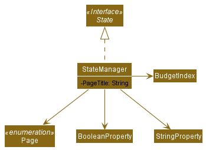
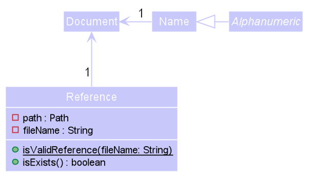
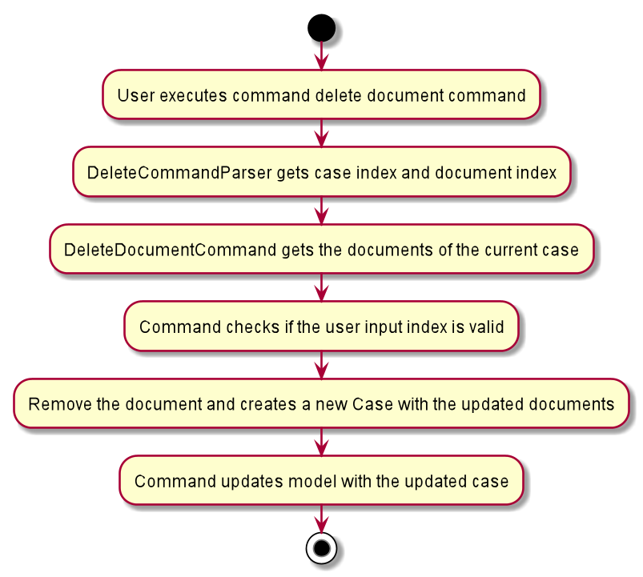

* Table of Contents
{:toc}

--------------------------------------------------------------------------------------------------------------------

## **Setting up, getting started**

Refer to the guide [_Setting up and getting started_](SettingUp.md).

--------------------------------------------------------------------------------------------------------------------

## **Design**

### Architecture

The ***Architecture Diagram*** given above explains the high-level design of the App. Given below is a quick overview of each component.

:bulb: **Tip:** The `.puml` files used to create diagrams in this document can be found in the [diagrams](https://github.com/se-edu/addressbook-level3/tree/master/docs/diagrams/) folder. Refer to the [_PlantUML Tutorial_ at se-edu/guides](https://se-education.org/guides/tutorials/plantUml.html) to learn how to create and edit diagrams.

**`Main`** has two classes called [`Main`](https://github.com/AY2021S1-CS2103-F09-2/tp/blob/master/src/main/java/seedu/pivot/Main.java) and [`MainApp`](https://github.com/AY2021S1-CS2103-F09-2/tp/blob/master/src/main/java/seedu/pivot/MainApp.java). It is responsible for,
* At app launch: Initializes the components in the correct sequence, and connects them up with each other.
* At shut down: Shuts down the components and invokes cleanup methods where necessary.

[**`Commons`**](#common-classes) represents a collection of classes used by multiple other components.

The rest of the App consists of five components.

* [**`UI`**](#ui-component): The UI of the App.
* [**`Logic`**](#logic-component): The command executor.
* [**`Model`**](#model-component): Holds the data of the App in memory.
* [**`Storage`**](#storage-component): Reads data from, and writes data to, the hard disk.
* [**`State`**](#state-component): Holds the states of the App while the app is active.

The first four components,

* defines its *API* in an `interface` with the same name as the Component.
* exposes its functionality using a concrete `{Component Name}Manager` class (which implements the corresponding API `interface` mentioned in the previous point.

For state component, it is managed by two classes:
* `StateManager` class which provides general access to the state of the App.
* `UIStateManager` class which provides the GUI access to the state of the app.

Example of architecture: The `Logic` component (see the class diagram given below) defines its API in the `Logic.java` interface and exposes its functionality using the `LogicManager.java` class which implements the `Logic` interface.

**How the architecture components interact with each other**

The *Sequence Diagram* below shows how the components interact with each other for the scenario where the user issues the command `delete 1`.

The sections below give more details of each component.

### UI component

**API** :
[`Ui.java`](https://github.com/AY2021S1-CS2103-F09-2/tp/blob/master/src/main/java/seedu/pivot/ui/Ui.java)

The UI consists of a `MainWindow` that is made up of parts e.g.`CommandBox`, `ResultDisplay`, `PersonListPanel`, `StatusBarFooter` etc. All these, including the `MainWindow`, inherit from the abstract `UiPart` class.

The `UI` component uses JavaFx UI framework. The layout of these UI parts are defined in matching `.fxml` files that are in the `src/main/resources/view` folder. For example, the layout of the [`MainWindow`](https://github.com/AY2021S1-CS2103-F09-2/tp/blob/master/src/main/java/seedu/pivot/ui/MainWindow.java) is specified in [`MainWindow.fxml`](https://github.com/AY2021S1-CS2103-F09-2/tp/blob/master/src/main/resources/view/MainWindow.fxml)

The `UI` component,

* Executes user commands using the `Logic` component.
* Listens for changes to `Model` data so that the UI can be updated with the modified data.
* Listens for changes to `State` data so that the UI can be updated with the modified data.

The example for observing states is illustrated with the Sequence Diagram below.
The `MainWindow` observes the `UiStateManager` for any changes to its internal state.
Upon invoking `open case 1`, the state changes and the `MainWindow` if notified by its `Observer`.
It then retrieves the information it requires and displays on its display panel.

### Logic component

**API** :
[`Logic.java`](https://github.com/se-edu/addressbook-level3/tree/master/src/main/java/seedu/address/logic/Logic.java)

1. `Logic` uses the `PivotParser` class to parse the user command.
1. This results in a `Command` object which is executed by the `LogicManager`.
1. The command execution can affect the `Model` (e.g. deleting a case).
1. The result of the command execution is encapsulated as a `CommandResult` object which is passed back to the `Ui`.
1. In addition, the `CommandResult` object can also instruct the `Ui` to perform certain actions, such as displaying help to the user.

Given below is the Sequence Diagram for interactions within the `Logic` component for the `execute("delete case 1")` API call.

:information_source: **Note:** The lifeline for `DeleteCommandParser` should end at the destroy marker (X) but due to a limitation of PlantUML, the lifeline reaches the end of diagram.

The case below follows the same execution above. However, the AddCommandParser further calls the AddCaseCommandParser which returns the respective AddCaseCommand, which has been extended from the AddCommand Class.

:information_source: **Note:** The lifeline for `AddCommandParser` and `AddCaseCommandParser` should end at the destroy marker (X) but due to a limitation of PlantUML, the lifeline reaches the end of diagram.

### Model component

**API** : [`Model.java`](hhttps://github.com/AY2021S1-CS2103-F09-2/tp/blob/master/src/main/java/seedu/pivot/model/Model.java)

The `Model`,

* stores a `UserPref` object that represents the user’s preferences.
* stores the address book data.
* exposes an unmodifiable `ObservableList<Case>` that can be 'observed' e.g. the UI can be bound to this list so that the UI automatically updates when the data in the list change.
* does not depend on any of the other three components.

### Storage component

**API** : [`Storage.java`](https://github.com/AY2021S1-CS2103-F09-2/tp/blob/master/src/main/java/seedu/pivot/storage/Storage.java)

The `Storage` component,
* can save `UserPref` objects in json format and read it back.
* can save Pivot's data in json format and read it back.

### State component

**API** : [`StateManager.java`](https://github.com/AY2021S1-CS2103-F09-2/tp/blob/master/src/main/java/seedu/pivot/logic/state/StateManager.java), [`UiStateManager.java`](https://github.com/AY2021S1-CS2103-F09-2/tp/blob/master/src/main/java/seedu/pivot/ui/UiStateManager.java)

The `StateManager` component,
* can set the state for an opened `Case` in the app, denoted by its `Index`.
* can reset the state.
* can return the state.
* can request the `UiStateManager` to refresh its state.

The `UiStateManager` component,
* can set the state for an opened `Case` in the app, denoted by its `Index`.
* can reset the state.
* can refresh its state.

When the `StateManager` modifies its State, it will also call upon `UiStateManager` to update its state as well.
This triggers any observation set on the respective `State` managers by the other components.
One such example can be found in the `UI` component.

### Common classes

Classes used by multiple components are in the `seedu.pivot.commons` package.

--------------------------------------------------------------------------------------------------------------------

## **Implementation**

This section describes some noteworthy details on how certain features are implemented.

### Open Case/Return feature
The `open case` command allows the user to open an investigation case listed on the `Main Page` in the GUI.
PIVOT then extracts and displays the key information about the `Case` in the `Case Page` Panel.

#### Implementation: Open Case
The `open case` mechanism is facilitated by `OpenCaseCommand`. It extends abstract class `OpenCommand` and contains a target `Index` of the `Case` to be opened.
It implements `OpenCaseCommand#execute()` as required in the abstract parent class. The Sequence Diagram below shows how the `OpenCaseCommand` works.

As the user invokes `open case [INDEX]`, the arguments are passed from the GUI to the `Logic` component, which is then passed to the `Parser`, implemented by `PivotParser`.

In `PivotParser`, the arguments are processed and passed onto the `OpenCommandParser` to further process the arguments and create a new `OpenCaseCommand`.

:information_source: **Note:** TWhen the user gives an invalid `type`, such as `open suspect 1`, `OpenCommandParser` will raise and error and display the proper command format for the user.

Upon invoking `OpenCaseCommand#execute()`, the class will extract the `Case` that is to be opened, and update the state in `StateManager`.
Upon observing a change in state, the GUI will then extract the `Case` and update its display panel with the case information.

:information_source: **Note:** When the user gives an invalid `Index`, such as `open case -1`, `OpenCaseCommand` will raise and error and display the proper command format for the user.

#### Implementation: Return
The `return` mechanism is facilitated by `ReturnCommand`.
It allows the user to close the `Case Page` panel and return to the `Main Page`.
Its implementation is similar to the `OpenCaseCommand` except it resets the state in `StateManager` instead of setting a state.

### Including Documents to PIVOT

#### Reference class
The `Reference` class represents a file location in the directory `./references` of the program. A `reference` only
exists if there is a file present at the file location in the user's local directory. The validity of a
`reference` depends on the user's operating system and the different acceptable file names. A `reference` object must
have a valid file name on creation.

#### Document class
The `Document` class represents a file on the user's local computer. It contains a `name` for easy viewing
and a `reference` to the file location. It is used for tracking files that are stored in PIVOT and for opening
of documents.
 

The documents are stored in a list for a particular case and you can only manipulate
documents(adding, deleting, opening) while inside a `case`. This is because the program stores a state of which
interface (main page or case) the user is at and will manipulate the documents according to the `document list` in that
current `case`.

#### Adding a Document
When a user executes `add doc n:name r:reference.txt`, to add a document with the specified name and file reference
to the current "opened" case in the state, `addDocumandCommandParser` will be invoked to parse the
name (prefixed with n:) and reference (prefixed with r:) inputs. The program must be at an "opened" case at this point.
   
`addDocumandCommandParser` will check for a valid name as well as a valid
reference that exists in the `./references` directory. This is to prevent a user from creating a document when the
program is active when they have yet to include the file in the program's directory. The appropriate error message
should be returned for a better user experience. It will then successfully create a `Document` and
return `addDocumandCommand`
  
`addDocumandCommand` will get the current `case` in the program `state` and adds the new `Document` to this `case`.
It will check for duplicated documents at this point as this is where the program accesses the list of documents in the
current state. The `model` will then be updated with the updated `case`.

The following sequence diagram shows adding a document to the current case:  

#### Deleting a Document
Deleting a document works about the same as adding a document. When a user executes `delete doc 2`, to delete the
second `document` in the list of documents of the current "opened" case in the state. The program must be at an
"opened" case at this point.`DeleteCommandParser` parses the given index as a `Index` object and gets the `case index`
in the current state. It returns `DeleteDocumentCommand` if the inputs are valid.
  
`DeleteDocumentCommand` gets the list of documents in the current case using the `case index` and checks if the
input `index` is within bounds. The check occurs in the `Command` rather than `DeleteDocumentParser` so that we
can distinguish between `ParseException` and `CommandException`. The command then removes the specified `document`
in the list and updates the `model`.

The following activity diagram shows a successful delete document operation at a case page:  

#### Design considerations
##### Aspect: For `Reference` object, separate validity (of the String) and existence (of the actual file path) checks.
* **Alternative 1 (current choice):** A reference object can be both valid but doesn't exists at the same time.
   - Pros: A document file deletion on the user's local machine will not affect loading the current cases in the Json
   file
   - Cons: More prone to bugs

* **Alternative 2:** A reference object must be both valid and exists to be created.
     - Pros: A document is only created when we know there is a valid and existing `Reference`. Easier for testing.
     - Cons: The program cannot load if there is a missing file (due to external user deletion) which was previously
     saved in the Json file
     
##### Aspect: Integrate `ReferenceStorage` with current Storage Design
* **Alternative 1 (current choice):** Separate `ReferenceStorage` to handle all `Reference` and storage interactions.
   - Pros: Easier to implement and increases cohesion.
   - Cons: More classes and code in the program

* **Alternative 2:** Make use of `Config.java` and `UserPrefsStorage` to integrate `ReferenceStorage` such as saving
default file paths.
     - Pros: Makes use of existing infrastructure, lesser code and possibly lesser code duplication.
     - Cons: Increased coupling, more prone to bugs and harder to test

### Undo feature (Not yet implemented)

#### Proposed Implementation

The proposed undo mechanism is facilitated by `VersionedPivot`. It extends `Pivot` with an undo history, stored internally as an `pivotStateStack`.
`pivotStateStack` stores the entire Pivot at any point. Additionally, it implements the following operations:

* `VersionedPivot#commit()` — Saves the current Pivot state in its history.
* `VersionePivot#undo()` — Restores the previous Pivot state from its history.
* `VersionedPivot#redo()` — Restores a previously undone Pivot state from its history.

These operations are exposed in the `Model` interface as `Model#commitPivot()` and `Model#undoPivot()` respectively.

Given below is an example usage scenario and how the undo mechanism behaves at each step.

Step 1. The user launches the application for the first time. The `VersionedPivot` will be initialized with the initial Pivot state.

Step 2. The user executes `delete 5` command to delete the 5th case in Pivot. The `delete` command calls `Model#commitPivot()`, causing the modified state of Pivot after the `delete 5` command executes to be saved in the `pivotStateStack`.

Step 3. The user executes `add case t:Lost Wallet …​` to add a new case. The `add case` command also calls `Model#commitPivot()`, causing another modified Pivot state to be saved into the `pivotStateStack`.

:information_source: **Note:** If a command fails its execution, it will not call `Model#commitPivot()`, so the Pivot state will not be saved into the `pivotStateStack`.

Step 4. The user now decides that adding the case was a mistake, and decides to undo that action by executing the `undo` command. The `undo` command will call `Model#undoPivot()`, which will pop the current state from the `pivotStateStack`, and return the previous Pivot state, restoring Pivot to that state.

:information_source: **Note:** If the size of the `pivotStateStack` is 1, it contains only the initial Pivot state, then there are no previous Pivot states to restore. The `undo` command uses `Model#canUndoPivot()` to check if this is the case. If so, it will return an error to the user rather
than attempting to perform the undo.

The following sequence diagram shows how the undo operation works:

:information_source: **Note:** The lifeline for `UndoCommand` should end at the destroy marker (X) but due to a limitation of PlantUML, the lifeline reaches the end of diagram.

Step 5. The user then decides to execute the command `list`. Commands that do not modify Pivot, such as `list`, will usually not call `Model#commitPivot()` or `Model#undoPivot()`. Thus, the `pivotStateStack` remains unchanged.

The following activity diagram summarizes what happens when a user executes a new command:

#### Design consideration:

##### Aspect: How undo executes

* **Alternative 1 (current choice):** Saves the entire Pivot.
  * Pros: Easy to implement.
  * Cons: May have performance issues in terms of memory usage.

* **Alternative 2:** Individual command knows how to undo by
  itself.
  * Pros: Will use less memory (e.g. for `delete`, just save the case being deleted).
  * Cons: We must ensure that the implementation of each individual command are correct.

_{more aspects and alternatives to be added}_

### \[Proposed\] Data archiving

_{Explain here how the data archiving feature will be implemented}_

--------------------------------------------------------------------------------------------------------------------

## **Documentation, logging, testing, configuration, dev-ops**

* [Documentation guide](Documentation.md)
* [Testing guide](Testing.md)
* [Logging guide](Logging.md)
* [Configuration guide](Configuration.md)
* [DevOps guide](DevOps.md)

--------------------------------------------------------------------------------------------------------------------

## **Appendix: Requirements**

### Product scope

**Target user profile**:

* police investigators who require an organisational tool
* has a need to manage a significant number of investigation cases
* prefer a structured app to organise information related to their cases
* prefer desktop apps over other types
* can type fast
* prefers typing to mouse interactions
* is reasonably comfortable using CLI apps
* has a basic understanding of file paths to manage his/her files

**Value proposition**:

A lot of detectives use physical folders, whiteboards to consolidate their investigation information.
This uses up a lot of physical resources such as printing papers.
There may also exist cluttered information across multiple cases.
This leads to disorganisation of evidence and documents during investigations,
which makes it difficult to link the investigation together.
Furthermore, physically looking through archive files can be time-consuming, and
they might miss out important information in the process.

PIVOT can help to better organise investigation cases and
group the relevant information on a digital platform.
This helps investigators to manage and easily locate the required information.
It also links up relations between people for better visualisation of the case so that detectives will not miss any information.

PIVOT can assist to manage investigation cases faster than a typical mouse/GUI driven app.

### User stories

Priorities: High (must have) - `* * *`, Medium (nice to have) - `* *`, Low (unlikely to have) - `*`

| Priority | As a …​                                    | I want to …​                     | So that I can…​                                             |
| -------- | ------------------------------------------ | ------------------------------ | ---------------------------------------------------------------------- |
| `* * *`  | investigator                               | create investigation cases with a relevant title                                  | store resources inside                                   |
| `* * *`  | investigator                               | view the list of investigation cases stored in PIVOT                              |                                                          |
| `* * *`  | investigator                               | indicate and see the state of different cases (e.g. closed/in-progress/cold case) | edit or see the statuses of my cases                     |
| `* * *`  | investigator                               | add a description to an investigation case                                        | capture key information about the investigation case     |
| `* * *`  | investigator                               | delete investigation cases                                                        | delete unwanted cases or cases that are wrongly created  |
| `* * *`  | investigator                               | open investigation cases easily and view the files that are stored inside         | retrieve the necessary information for those who need it |
| `* * *`  | investigator                               | add relevant documents to an investigation case                                   |                                                          |
| `* * *`  | investigator                               | view the list of documents relevant to an investigation case                      |                                                          |
| `* * *`  | investigator                               | delete irrelevant documents to an investigation case                              | remove outdated documents                                |
| `* * *`  | investigator                               | view the list of suspects tied to an investigation case                           | refer to all suspects in an investigation case           |
| `* * *`  | investigator                               | add a list of suspects tied to an investigation case                              |                                                          |
| `* * *`  | investigator                               | delete suspects tied to an investigation case                                     | delete irrelevant suspects                               |
| `* * *`  | investigator                               | view the list of witnesses tied to an investigation case                          | refer to all witnesses in an investigation case          |
| `* * *`  | investigator                               | add a list of witnesses tied to an investigation case                             |                                                          |
| `* * *`  | investigator                               | delete witnesses tied to an investigation case                                    | delete irrelevant witnesses                              |
| `* * *`  | investigator                               | view the list of victims tied to an investigation case                            | refer to all victims in an investigation case            |
| `* * *`  | investigator                               | add a list of victims tied to an investigation case                               |                                                          |
| `* * *`  | investigator                               | delete victims tied to an investigation case                                      | delete irrelevant victims                                |
| `* * *`  | investigator                               | close the application when I am done using it                                     | safely exit the application                              |

*{More to be added}*

### Use cases

(For all use cases below, the **System** is the `PIVOT` and the **Actor** is the `user`, unless specified otherwise)

**Use case: Add Investigation Case**

**MSS**
1.  User requests to create a new active investigation case and specifies a title
2.  PIVOT adds the new investigation case

    Use case ends.

**Extensions**
* 1a. The title is empty.
    * 1a1. PIVOT shows an error message.

	  Use case ends.

**Use case: List Investigation Case**

**MSS**
1.  User requests to list investigation cases
2.  PIVOT shows a list of investigation cases

    Use case ends.

**Use case: Delete Investigation Case**

**MSS**
1. User requests to list investigation cases
2. PIVOT shows a list of investigation cases
3. User requests to delete a specific investigation case in the list
4. PIVOT deletes the investigation case

   Use case ends.

**Extensions**
* 2a. The list is empty.

  Use case ends.

* 3a. The given index is invalid.
    * 3a1. PIVOT shows an error message.

      Use case resumes at step 1.

**Use case: Open Investigation Case**

**MSS**
1. User requests to list investigation cases
2. PIVOT shows a list of investigation cases
3. User requests to open a specific investigation case in the list
4. PIVOT navigates to the specified investigation case page

   Use case ends.

**Extensions**
* 2a. The list is empty.

  Use case ends.

* 3a. The given index is invalid.
    * 3a1. PIVOT shows an error message.

      Use case resumes at step 1.

**Use case: Tag Investigation Case**

**MSS**
1. User requests to list investigation cases
2. PIVOT shows a list of investigation cases
3. User specifies an investigation case
4. PIVOT navigates to the specified investigation case page
5. User requests to tag the investigation case with specific tag
6. PIVOT tags the investigation case with specified tag

   Use case ends.

**Extensions**
* 2a. The list is empty.

  Use case ends.

* 3a. The given index is invalid.
    * 3a1. PIVOT shows an error message.

      Use case resumes at step 1.

* 5a. The given tag is invalid.
    * 5a1. PIVOT shows an error message.

      Use case resumes at step 5.

**Use case: Add Description for an Investigation Case**

**MSS**
1. User requests to list investigation cases
2. PIVOT shows a list of investigation cases
3. User specifies an investigation case
4. PIVOT navigates to the specified investigation case page
5. User requests to add a description to the investigation case
6. PIVOT adds the description to the investigation case

   Use case ends.

**Extensions**
* 2a. The list is empty.

  Use case ends.

* 3a. The given index is invalid.
    * 3a1. PIVOT shows an error message.

      Use case resumes at step 1.

* 5a. The given description is empty.
    * 5a1. PIVOT shows an error message.

      Use case resumes at step 5.

**Use case: Add Document to Investigation Case**

**MSS**
1. User requests to add a document to investigation case, specifies a document title and reference
2. PIVOT adds a new document to the investigation case

   Use case ends.

**Extensions**
* 1a. The title is empty.
    * 1a1. PIVOT shows an error message.

      Use case resumes at step 1.

* 1b. The reference is empty.
    * 1b1. PIVOT shows an error message.

      Use case resumes at step 1.

* 1c. The reference is invalid.
    * 1c1. PIVOT shows an error message.

      Use case resumes at step 1.

**Use case: List Document related to Investigation Case**

**MSS**
1. User requests to list documents related to the case
2. PIVOT shows a list of documents related to the case

   Use case ends.

**Use case: Delete Document from Investigation Case**

**MSS**
1. User requests to list investigation cases
2. PIVOT shows a list of investigation cases
3. User requests to delete a specific investigation case in the list
4. PIVOT deletes the investigation case

   Use case ends.

**Extensions**
* 2a. The list is empty.

  Use case ends.

* 3a. The given index is invalid.
    * 3a1. PIVOT shows an error message.

      Use case resumes at step 1.

**Use case: Open Document**

**MSS**
1. User requests to list documents
2. PIVOT shows a list of documents
3. User requests to open a specific document in the list
4. PIVOT opens the specified document

   Use case ends.

**Extensions**
* 2a. The list is empty.

    Use case ends.

* 3a. The given index is invalid.
    * 3a1. PIVOT shows an error message.

        Use case resumes at step 1.

* 4a. The specified document does not exist in the saved reference.
    * 4a1. PIVOT shows an error message.

        Use case resumes at step 1.

**Use case: Add Person[Suspect/Witness/Victim] in Investigation Case**

**MSS**
1. User requests to list investigation cases
2. PIVOT shows a list of investigation cases
3. User requests to open a specific investigation case in the list
4. PIVOT opens the specified investigation case
5. User requests to add a person to a specified category (suspect/witness/victim).
6. PIVOT adds the person to a specified category (suspect/witness/victim).

   Use case ends.

**Extensions**
* 2a. The list is empty.

    Use case ends.

* 3a. The given index is invalid.
    * 3a1. PIVOT shows an error message.

        Use case resumes at step 1.

* 5a. The given category of person to add is invalid.
    * 5a1. PIVOT shows an error message.

        Use case resumes at step 1.

**Use case: List Person[Suspect/Witness/Victim] in Investigation Case**

**MSS**
1. User requests to list Persons related to the case.
2. PIVOT shows a list of Persons related to the case.

   Use case ends.

**Use case: Delete Person[Suspect/Witness/Victim] in Investigation Case**

**MSS**
1. User requests to list all Persons
2. PIVOT shows a list of all Persons
3. User requests to delete a specific Person from the list
4. PIVOT deletes the Person

   Use case ends.

**Extensions**
* 2a. The list is empty.

    Use case ends.

* 3a. The given index is invalid.
    * 3a1. PIVOT shows an error message.

        Use case resumes at step 1.

**Use case: Return to the Main Page**

**MSS**
1. User requests to list investigation cases
2. PIVOT shows a list of investigation cases
3. User requests to open a specific investigation case in the list
4. PIVOT navigates to the specified investigation case
5. User requests to navigate to the main page
6. PIVOT navigates to the main page

   Use case ends.

**Extensions**
* 1a. User requests to navigate to the main page.

    Use case ends.

**Use case: Exit Application**

**MSS**
1. User requests to exit the application
2. PIVOT terminates.

    Use case ends.

### Non-Functional Requirements

1.  Should work on any _mainstream OS_ as long as it has Java `11` or above installed.
2.  Should be able to hold up to 1000 persons without a noticeable sluggishness in performance for typical usage.
3.  A user with above average typing speed for regular English text (i.e. not code, not system admin commands) should be able to accomplish most of the tasks faster using commands than using the mouse.
4.  The system should not take above 2 seconds to execute any command.

*{More to be added}*

### Glossary

* **Mainstream OS**: Windows, Linux, Unix, OS-X
* **Investigation Case**: The investigation case encapsulating all relevant data the police wants to keep track of
* **Investigation Case Tag**: The status of the case (Active/In-Progress, Closed, Cold Case)
* **Document**: An actual document/file stored in the project directory
* **Person**: Data stored in the investigation case (For suspects, witnesses or victims related)
* **File Paths**: System Location of the specified file inside the project directory

--------------------------------------------------------------------------------------------------------------------

## **Appendix: Instructions for manual testing**

Given below are instructions to test the app manually.

:information_source: **Note:** These instructions only provide a starting point for testers to work on;
testers are expected to do more *exploratory* testing.

### Launch and shutdown

1. Initial launch

   1. Download the jar file and copy into an empty folder

   1. Double-click the jar file Expected: Shows the GUI with a set of sample contacts. The window size may not be optimum.

1. Saving window preferences

   1. Resize the window to an optimum size. Move the window to a different location. Close the window.

   1. Re-launch the app by double-clicking the jar file. 
       Expected: The most recent window size and location is retained.

1. _{ more test cases …​ }_

### Deleting a person

1. Deleting a person while all persons are being shown

   1. Prerequisites: List all persons using the `list` command. Multiple persons in the list.

   1. Test case: `delete 1` 
      Expected: First contact is deleted from the list. Details of the deleted contact shown in the status message. Timestamp in the status bar is updated.

   1. Test case: `delete 0` 
      Expected: No person is deleted. Error details shown in the status message. Status bar remains the same.

   1. Other incorrect delete commands to try: `delete`, `delete x`, `...` (where x is larger than the list size) 
      Expected: Similar to previous.

1. _{ more test cases …​ }_

### Saving data

1. Dealing with missing/corrupted data files

   1. _{explain how to simulate a missing/corrupted file, and the expected behavior}_

1. _{ more test cases …​ }_
