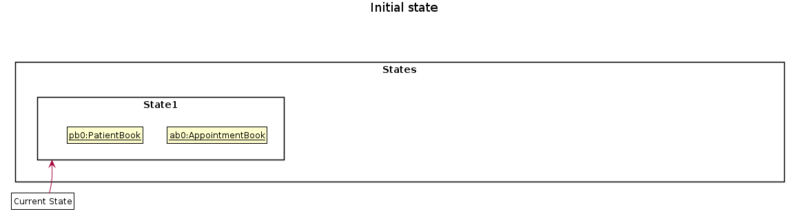
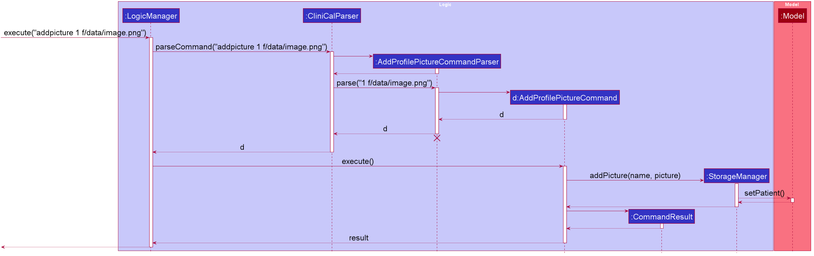

* Table of Contents
{:toc}

--------------------------------------------------------------------------------------------------------------------

## **1. Setting up, getting started**

Refer to the guide: [_**Setting up and getting started**_](SettingUp.md).

--------------------------------------------------------------------------------------------------------------------

## **2. Design**

### 2.1 Architecture

    
     
    <em style="color:#CC5500">Figure 1. Architecture Diagram</em>

The ***Architecture Diagram*** given above explains the high-level design of the App. Given below is a quick overview of each component.

:bulb: **Tip:** The `.puml` files used to create diagrams in this document can be found in the [diagrams](https://github.com/AY2021S1-CS2103T-W11-4/tp/tree/master/docs/diagrams/) folder. Refer to the [_PlantUML Tutorial_ at se-edu/guides](https://se-education.org/guides/tutorials/plantUml.html) to learn how to create and edit diagrams.

**`Main`** has two classes called [`Main`](https://github.com/AY2021S1-CS2103T-W11-4/tp/tree/master/src/main/java/seedu/address/Main.java) and [`MainApp`](https://github.com/AY2021S1-CS2103T-W11-4/tp/tree/master/src/main/java/seedu/address/MainApp.java). It is responsible for,
* At App launch: Initializes the components in the correct sequence, and connects them up with each other.
* At shut down: Shuts down the components and invokes cleanup methods where necessary.

[**`Commons`**](#26-common-classes) represents a collection of classes used by multiple other components.

The rest of the App consists of four components:

1. [**`UI`**](#22-ui-component): The UI of the App.
2. [**`Logic`**](#23-logic-component): The command executor.
3. [**`Model`**](#24-model-component): Holds the data of the App in memory.
4. [**`Storage`**](#25-storage-component): Reads data from, and writes data to, the hard disk.

Each of the four components,

* defines its *API* in an `interface` with the same name as the Component.
* exposes its functionality using a concrete `{Component Name}Manager` class (which implements the corresponding API `interface` mentioned in the previous point.

For example, the `Logic` component (see the class diagram given below) defines its API in the `Logic.java` interface and exposes its functionality using the `LogicManager.java` class which implements the `Logic` interface.

    
     
    <em style="color:#CC5500">Figure 2. Class Diagram of Logic Component</em>

**How the architecture components interact with each other**

The *Sequence Diagram* below shows how the components interact with each other for the scenario where the user issues the command `delete 1`.

    
     
    <em style="color:#CC5500">Figure 3. Execution diagram for "delete 1" command</em>

The sections below give more details of each component.

### 2.2 UI component

    
     
    <em style="color:#CC5500">Figure 4. Structure of the UI Component</em>

**API** :
[`Ui.java`](https://github.com/AY2021S1-CS2103T-W11-4/tp/tree/master/src/main/java/seedu/address/ui/Ui.java)

The UI consists of a `MainWindow` that is made up of parts e.g.`CommandBox`, `ResultDisplay`, `PatientListPanel`, `StatusBarFooter` etc. All these, including the `MainWindow`, inherit from the abstract `UiPart` class.

The `UI` component uses JavaFx UI framework. The layout of these UI parts are defined in matching `.fxml` files that are in the `src/main/resources/view` folder. For example, the layout of the [`MainWindow`](https://github.com/AY2021S1-CS2103T-W11-4/tp/tree/master/src/main/java/seedu/address/ui/MainWindow.java) is specified in [`MainWindow.fxml`](https://github.com/AY2021S1-CS2103T-W11-4/tp/tree/master/src/main/resources/view/MainWindow.fxml)

The `UI` component,

* Executes user commands using the `Logic` component.
* Listens for changes to `Model` data so that the UI can be updated with the modified data.

### 2.3 Logic component

    
     
    <em style="color:#CC5500">Figure 5. Structure of the Logic Component</em>

**API** :
[`Logic.java`](https://github.com/AY2021S1-CS2103T-W11-4/tp/tree/master/src/main/java/seedu/address/logic/Logic.java)

1. `Logic` uses the `CliniCalParser` class to parse the user command.
1. This results in a `Command` object which is executed by the `LogicManager`.
1. The command execution can affect the `Model` (e.g. adding a patient).
1. The result of the command execution is encapsulated as a `CommandResult` object which is passed back to the `Ui`.
1. In addition, the `CommandResult` object can also instruct the `Ui` to perform certain actions, such as displaying help to the user.

Given below is the Sequence Diagram for interactions within the `Logic` component for the `execute("delete 1")` API call.

    
     
    <em style="color:#CC5500">Figure 6. Logic Component Interactions for "delete 1" Command</em>

:information_source: **Note:** The lifeline for `DeleteCommandParser` should end at the destroy marker (X) but due to a limitation of PlantUML, the lifeline reaches the end of diagram.

### 2.4 Model component

    
    <em style="color:#CC5500">Figure 7. Structure of the Model Component</em>

**API** : [`Model.java`](https://github.com/AY2021S1-CS2103T-W11-4/tp/tree/master/src/main/java/seedu/address/model/Model.java)

The `Model`,

* stores a `UserPref` object that represents the user’s preferences.
* stores the CliniCal application data.
* exposes an unmodifiable `ObservableList<Patient>` that can be 'observed' e.g. the UI can be bound to this list so that the UI automatically updates when the data in the list change.
* does not depend on any of the other three components.

:information_source: **Note:** An alternative (arguably, a more OOP) model is given below. It has an `Allergy` list in the `CliniCal` application, which `Patient` references. This allows `CliniCal` to only require one `Allergy` object per unique `Allergy`, instead of each `Patient` needing their own `Allergy` object.
    
     
    <em style="color:#CC5500">Figure 8. Alternative structure for Model component</em>

### 2.5 Storage component

    
     
    <em style="color:#CC5500">Figure 9. Structure of the Storage Component </em>

**API** : [`Storage.java`](https://github.com/AY2021S1-CS2103T-W11-4/tp/tree/master/src/main/java/seedu/address/storage/Storage.java)

The `Storage` component,
* can save `UserPref` objects in json format and read it back.
* can save the patient data in json format and read it back.

### 2.6 Common classes

Classes used by multiple components are in the `seedu.addressbook.commons` package.

--------------------------------------------------------------------------------------------------------------------

## **3. Implementation**

This section describes some noteworthy details on how certain features are implemented.

### 3.1 Undo/redo feature

#### 3.1.1 Implementation

The undo/redo mechanism is facilitated by `VersionedCliniCal`. It extends `CliniCal` with an undo/redo history, stored internally as an `CliniCalStateList` and `currentStatePointer`. Additionally, it implements the following operations:

* `VersionedCliniCal#commit()` — Saves the current CliniCal application state in its history.
* `VersionedCliniCal#undo()` — Restores the previous CliniCal application state from its history.
* `VersionedCliniCal#redo()` — Restores a previously undone CliniCal application state from its history.

These operations are exposed in the `Model` interface as `Model#commitCliniCal()`, `Model#undoCliniCal()` and `Model#redoCliniCal()` respectively.

Given below is an example usage scenario and how the undo/redo mechanism behaves at each step.

Step 1. The user launches the application for the first time. The `VersionedCliniCal` will be initialized with the initial CliniCal application state, and the `currentStatePointer` pointing to that single CliniCal application state.

    
     
    <em style="color:#CC5500">Figure 10. Initial CliniCalStateList</em>

Step 2. The user executes `delete 5` command to delete the 5th patient in the patient data list. The `delete` command calls `Model#commitCliniCal()`, causing the modified state of the CliniCal application after the `delete 5` command executes to be saved in the `CliniCalStateList`, and the `currentStatePointer` is shifted to the newly inserted CliniCal application state.

    
     
    <em style="color:#CC5500">Figure 11. CliniCalStateList after "delete 5" command</em>

Step 3. The user executes `add n/David …​` to add a new patient. The `add` command also calls `Model#commitCliniCal()`, causing another modified CliniCal application state to be saved into the `CliniCalStateList`.

    
     
    <em style="color:#CC5500">Figure 12. CliniCalStateList after "add n/David" command</em>

:information_source: **Note:** If a command fails its execution, it will not call `Model#commitCliniCal()`, so the CliniCal application state will not be saved into the `CliniCalStateList`.

Step 4. The user now decides that adding the patient was a mistake, and decides to undo that action by executing the `undo` command. The `undo` command will call `Model#undoCliniCal()`, which will shift the `currentStatePointer` once to the left, pointing it to the previous CliniCal application state, and restores the CliniCal application to that state.

    
     
    <em style="color:#CC5500">Figure 13. CliniCalStateList after undo command</em>

:information_source: **Note:** If the `currentStatePointer` is at index 0, pointing to the initial CliniCal state, then there are no previous CliniCal states to restore. The `undo` command uses `Model#canUndoCliniCal()` to check if this is the case. If so, it will return an error to the user rather
than attempting to perform the undo.

The following sequence diagram shows how the undo operation works:

    
     
    <em style="color:#CC5500">Figure 14. Logic and Model Component Interactions for undo Command</em>

:information_source: **Note:** The lifeline for `UndoCommand` should end at the destroy marker (X) but due to a limitation of PlantUML, the lifeline reaches the end of diagram.

The `redo` command does the opposite — it calls `Model#redoCliniCal()`, which shifts the `currentStatePointer` once to the right, pointing to the previously undone state, and restores the CliniCal application to that state.

:information_source: **Note:** If the `currentStatePointer` is at index `CliniCalStateList.size() - 1`, pointing to the latest CliniCal application state, then there are no undone CliniCal states to restore. The `redo` command uses `Model#canRedoCliniCal()` to check if this is the case. If so, it will return an error to the user rather than attempting to perform the redo.

Step 5. The user then decides to execute the command `list`. Commands that do not modify the CliniCal application, such as `list`, will usually not call `Model#commitCliniCal()`, `Model#undoCliniCal()` or `Model#redoCliniCal()`. Thus, the `CliniCalStateList` remains unchanged.

    
     
    <em style="color:#CC5500">Figure 15. CliniCalStateList after list command</em>

Step 6. The user executes `clear`, which calls `Model#commitCliniCal()`. Since the `currentStatePointer` is not pointing at the end of the `CliniCalStateList`, all CliniCal application states after the `currentStatePointer` will be purged. Reason: It no longer makes sense to redo the `add n/David …​` command. This is the behavior that most modern desktop applications follow.

    
     
    <em style="color:#CC5500">Figure 16. CliniCalStateList after clear command</em>

The following activity diagram summarizes what happens when a user executes a new command:

    
     
    <em style="color:#CC5500">Figure 17. Activity Diagram for User Execution of Command</em>

#### 3.1.2 Design consideration

##### 3.1.2.1 Aspect: Execution of undo/redo

* **Current Implementation:** Saves the entire patient details in CliniCal application.

  * Pros: It is easier to implement as the entire list of patients would be saved. The list of patients can then be 
  easily loaded to be used or saved for future use by `Model`.
  
  * Cons: This may have performance issues in terms of memory usage.

* **Alternative Implementation:** Undo/redo function is handled by each individual command.

  * Pros: The application will use less memory (e.g. for `delete`, just save the patient being deleted).
  
  * Cons: The implementation of undo/redo for each specific command must be correct.
  
  ##### 3.1.2.2 Aspect: Choice of data structure to store CliniCal application states
  
 * **Current Implementation:** List with `currentStatePointer` pointing to the current CliniCal state.
  
    * Pros: It is easier to implement as only a single List is required and all states can be accessed.
    
    * Cons: This requires constant updating of the `CliniCalStateList` such as purging of redundant states.
  
 * **Alternative Implementation:** Two Stacks - CommandsExecutedStack and RedoStack
  
    * Pros: The more intuitive solution as a stack follows the First In Last Out principle. There would be no need for 
    any `currentStatePointer` since the current state would be at the top of the stacks.
    
    * Cons: Harder to implement as two separate stacks would have to be tracked and there would be more dependencies to 
    implement before and after the execution of every command.

### 3.2 Add Profile Picture feature

#### 3.2.1 Implementation

This feature allows users to add image files to serve as the patient's profile picture. The mechanism utilises the `StorageManager#addPictureToProfile`
method to update the patients' profile pictures.

This feature consists of the `AddProfilePictureCommand` class. Given below is an example usage scenario and how the mechanism behaves at each step.

    
     
    <em style="color:#CC5500">Figure 18. Logic Component Interactions for AddProfilePicture Command</em>

Step 1. User input is parsed to obtain the patient index and file path of the desired profile picture.

Step 2. After successful parsing of user input, the `AddProfilePictureCommand#execute(Model model)` method is called. 

Step 3. The `StorageManager#addPictureToProfile` method is then called which adds the desired profile picture to the specified patient.

Step 4. Next, the patient's profile picture is updated in the `Model` by calling the `Model#setPatient` method.

Step 5. As a result of the successful update of the patient's profile picture, a `CommandResult` object is instantiated and returned to `LogicManager`.

#### 3.2.2 Design consideration

##### 3.2.2.1 Aspect: Choice of component to save the profile pictures

* **Current Implementation:** Save image file through `StorageManager`.

    * Pros: Mechanism can be extended from the existing architecture that the project is built upon (AB3).

    * Cons: There is a need to implement additional exception handling mechanism to inform the user in cases where invalid file path is provided.

* **Alternative Implementation:** Save image files through a new standalone class eg. `ImageCommand`. This class handles all mechanism related to profile pictures.

    * Pros: Exception handling is simplified as informing the user of invalid file path will be similar to when an invalid command is given.

    * Cons: It is harder to store and update patient's profile pictures. New dependencies need to be created to associate with
    the newly created `ImageCommand` class. Thus, our team decided to implement the first alternative as it follows the existing
    architecture closely and minimizes the risk of breaking the existing architecture.

##### 3.2.2.2 Aspect: Image type

* **Current Implementation:** All types of files are accepted, including `.jpg` and `.png`.

    * Pros: User do not need to convert `.jpg` to `.png` file or vice versa before setting desired image file as profile picture. This enhances usability.
    
    * Cons: Non-image files are still stored in 'data' folder even though the patient's profile picture in CliniCal will not be updated visually.

* **Alternative Implementation:** Accept only some types of files i.e `.jpg` and `.png`.

    * Pros: Acts as a form of validation check and non-image files will not be stored in the 'data' folder. This helps to save disk space.

    * Cons: User is only limited to certain types of image files. As such, our team decided to implement the first alternative
    as this design maximizes application usability. User will not need to spend additional time converting their images into accepted file types. 
    Furthermore, our team assessed that users can easily delete non-image files from the 'data' folder if the need arises.

_{more aspects and alternatives to be added}_

### 3.3 \[Proposed\] Data archiving

_{Explain here how the data archiving feature will be implemented}_

--------------------------------------------------------------------------------------------------------------------

## **4. Documentation**
Refer to the guide: [_**Documentation Guide**_](Documentation.md)

## **5. Testing**
Refer to the guide: [_**Testing guide**_](Testing.md)

## **6. Logging**
Refer to the guide: [_**Logging guide**_](Logging.md)

## **7. Configuration**
Refer to the guide: [_**Configuration guide**_](Configuration.md)

## **8. Dev-ops**
Refer to the guide: [_**DevOps guide**_](DevOps.md)

--------------------------------------------------------------------------------------------------------------------

## **Appendix A: Product scope**

**Target user profile**:

* has a need to manage a significant number of patient records
* prefer to access patient records electronically
* can type fast
* is reasonably comfortable using CLI apps
* prefer to check schedule on desktop application instead of relying on physical calendar

**Value proposition**: provide a platform for doctors to manage their upcoming appointments and access patient's medical records more easily

## **Appendix B: User stories**

Priorities: High (must have) - `* * *`, Medium (nice to have) - `* *`, Low (unlikely to have) - `*`

| Priority | As a …​  | I want to …​                                                  | So that I can…​                                                                  |
| -------- | ------------| ---------------------------------------------------------------- | ----------------------------------------------------------------------------------- |
| `* * *`  | new user    | see usage instructions                                           | refer to instructions when I forget how to use the App                              |
| `* * *`  | user        | add a new patient                                                |                                                                                     |
| `* * *`  | user        | delete a patient                                                 | remove entries that I no longer need                                                |
| `* * *`  | user        | find a patient by name                                           | locate details of patients without having to go through the entire list             |
| `* *`    | user        | hide private contact details                                     | minimize chance of someone else seeing them by accident                             |
| `* * *`  | doctor      | retrieve the medical details/notes for each patient easily       | refer to it when the patient visits again                                           |
| `* * *`  | doctor      | type/store my patients' data on their individual profile pages   | update their condition after each appointment and not write everything down by hand |
| `* *`    | doctor      | have an undo command                                             | undo any mistakes I make in the software                                            |
| `* *`    | doctor      | have a redo command                                              | redo any work that I've undone                                                      |
| `*`      | doctor      | retrieve past commands that I input in the application           | refer to my past commands                                                           |
| `*`      | doctor      | add profile picture to each patient's profile                    | can recognize the patient using the profile picture                                 |
| `*`      | doctor      | color code patients                                              | know which patients are more at risk (e.g. high blood pressure)                     |

*{More to be added}*

## **Appendix C: Use Cases**

(For all use cases below, the **System** is the `CliniCal` and the **Actor** is the `user`, unless specified otherwise)

### Use case: UC01 - Delete a patient

**MSS**

1.  User requests to list patients
2.  CliniCal shows a list of patients
3.  User requests to delete a specific patient in the list
4.  CliniCal deletes the patient

    Use case ends.

**Extensions**

* 2a. The list is empty.

  Use case ends.

* 3a. The given index is invalid.

    * 3a1. CliniCal shows an error message.

      Use case resumes at step 2.

### Use case: UC02 - Add a patient

**MSS**

1.  User keys in command to add a patient
2.  CliniCal shows an updated list of patients

    Use case ends.

**Extensions**

* 1a. The given command is invalid.
    * 1a1. CliniCal shows an error message.

  Use case resumes at step 1.

### Use case: UC03 - Edit a patient

**MSS**

1.  User requests to list patients
2.  CliniCal shows a list of patients
3.  User requests to edit a specific patient in the list, providing the details to edit the patient with
4.  CliniCal edits the patient

    Use case ends.

**Extensions**

* 3a. The patient cannot be found.
    * 3a1. CliniCal shows an error message.

    Use case resumes at Step 3.

* 3b. The patient cannot be found.
    * 3b1. CliniCal shows an error message.

    Use case resumes at Step 3.

### Use case: UC04 - Add a patient's profile picture using command line interface

**MSS**

1.  User keys in command to add profile picture to patient
2.  CliniCal adds the profile picture to the specified patient
3.  CliniCal shows an updated list of patients

    Use case ends.

**Extensions**

* 1a. The given command is invalid.
    * 1a1. CliniCal shows an error message.

  Use case resumes at step 1.
  
**Use case: UC05 - Add a patient's profile picture using drag and drop**
  
  **MSS**
  
1. User selects the desired profile picture and drags it onto the specified patient profile in CliniCal.
2.  User releases mouse button.
3.  CliniCal adds the profile picture to the specified patient.
4.  CliniCal shows an updated list of patients.
  
      Use case ends.
  
  **Extensions**
  
  * 1a. The file being dragged into ClinCal application is not a valid image file.
      * 1a1. Patient profile picture is not updated.
  
    Use case resumes at step 1.
    
  * 1b. The profile picture is not dragged onto a valid space that represents patient profile in CliniCal.
     * 1b1. Patient profile picture is not updated.
     
         Use case resumes at step 1.

*{More to be added}*

## **Appendix D: Non-Functional Requirements**

1. Should work on any mainstream OS as long as it has Java `11` installed.
1. Should be able to hold up to 1000 patients without a noticeable sluggishness in performance for typical usage.
1. Should be able to schedule up to 100 patient appointments without a noticeable sluggishness in performance for typical usage.
1. A user with above average typing speed for regular English text (i.e. not code, not system admin commands) should be able to accomplish most of the tasks faster using commands than using the mouse.

*{More to be added}*

## **Appendix E: Glossary**

* **Mainstream OS**: Windows, Linux, Unix, OS-X
* **Patient records**: Extensive collection of patients’ private information (not meant to be shared) and medical histories.
* **Main window**: Application’s opening window which displays a command bar and the list of patients.

--------------------------------------------------------------------------------------------------------------------

## **Appendix F: Instructions for manual testing**

Given below are instructions to test the app manually.

:information_source: **Note:** These instructions only provide a starting point for testers to work on;
testers are expected to do more *exploratory* testing.

### F.1 Launch and shutdown

1. Initial launch

   1. Download the jar file and copy into an empty folder

   1. Double-click the jar file Expected: Shows the GUI with a set of sample patient contact details. The window size may not be optimum.

1. Saving window preferences

   1. Resize the window to an optimum size. Move the window to a different location. Close the window.

   1. Re-launch the app by double-clicking the jar file. 
       Expected: The most recent window size and location is retained.

1. _{ more test cases …​ }_

### F.2 Adding a patient

1. Adding a new patient to the list

   1. Test case: `add n/John Doe p/12345678 i/s1234567a` 
      Expected: A patient named John Doe should be added into the list with his phone number and IC number.

   1. Test case: `add` 
      Expected: No patient is added. Error details shown in the status message. Status bar remains the same.

1. _{ more test cases …​ }_

### F.3 Deleting a patient

1. Deleting a patient while all patients are being shown

   1. Prerequisites: List all patients using the `list` command. Multiple patients in the list.

   1. Test case: `delete 1` 
      Expected: First patient is deleted from the list. Details of the deleted patient shown in the status message. Timestamp in the status bar is updated.

   1. Test case: `delete 0` 
      Expected: No patient is deleted. Error details shown in the status message. Status bar remains the same.

   1. Other incorrect delete commands to try: `delete`, `delete x`, `...` (where x is larger than the list size) 
      Expected: Similar to previous.

1. _{ more test cases …​ }_

### F.4 Saving data

1. Dealing with missing/corrupted data files

   1. _{explain how to simulate a missing/corrupted file, and the expected behavior}_

1. _{ more test cases …​ }_
