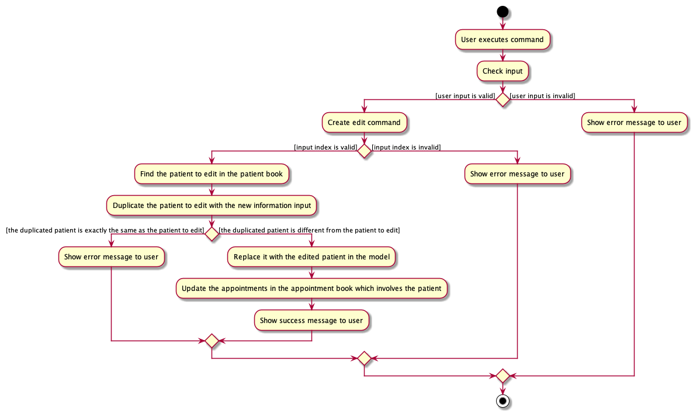

# **Trackr - Developer Guide**
by Team W12-2

---

## **Table of Contents**
* [Section 1 - Preface](#section-1---preface)
* [Section 2 - Setting up, getting started](#section-2---setting-up-getting-started)
* [Section 3 - Design](#section-3---design)
    * [3.1 - High-Level Architecture](#section-31---high-level-architecture)
    * [3.2 - UI Component](#section-32---ui-component)
    * [3.3 - Logic Component](#section-33---logic-component)
    * [3.4 - Model Component](#section-34---model-component)
    * [3.5 - Storage Component](#section-35---storage-component)
    * [3.6 - Common Classes](#section-36---common-classes)
* [Section 4 - Implementation](#section-4---implementation)
    * [4.1 - Add Commands - `addMod`, `addTG` and `addStudent`](#section-41---add-commands---addmod-addtg-and-addstudent)
    * [4.2 - Delete Commands - `deleteMod`, `deleteTG` and `deleteStudent`](#section-42---delete-commands---deletemod-deletetg-and-deletestudent)
    * [4.3 - Edit Commands - `editMod`, `editTG` and `editStudent`](#section-43---edit-commands---editmod-edittg-and-editstudent)
    * [4.4 - Find Commands - `findMod`, `findTG` and `findStudent`](#section-44---find-commands---findmod-findtg-and-findstudent)
    * [4.5 - List Commands - `listMod`, `listTG` and `listStudent`](#section-45---list-commands---listmod-listtg-and-liststudent)
    * [4.6 - View Commands - `viewTG` and `viewStudent`](#section-46---view-commands---viewtg-and-viewstudent)
    * [4.7 - Clear Command - `clear`](#section-47---clear-command---clear)
    * [4.8 - Exit Command - `exit`](#section-48---exit-command---exit)
    * [4.9 - Data saving and loading](#section-49---data-saving-and-loading)
* [Section 5 - Documentation, logging, testing, configuration, dev-ops](#section-5---documentation-logging-testing-configuration-dev-ops)
* [Appendix A - Product Scope](#appendix-a---product-scope)
* [Appendix B - User Stories](#appendix-b---user-stories)
* [Appendix C - Use Cases](#appendix-c---use-cases)
* [Appendix D - Non-Functional Requirements](#appendix-d---non-functional-requirements)
* [Appendix E - Glossary](#appendix-e---glossary)
* [Appendix F - Instructions for Manual Testing](#appendix-f---instructions-for-manual-testing)

---

## **Section 1 - Preface**
This is a Developer Guide to Trackr. A student and task management system for Teaching Assistants of all faculties who want to manage their students from various modules and tutorial groups, all in one place.

---

## **Section 2 - Setting up, getting started**

Refer to the guide [_Setting up and getting started_](SettingUp.md).

---

## **Section 3 - Design**

### Section 3.1 - High-Level Architecture

The **_Architecture Diagram_** given above explains the high-level design of the App. Given below is a quick overview of each component.

**`Main`** has two classes called [`Main`](https://github.com/se-edu/addressbook-level3/tree/master/src/main/java/seedu/address/Main.java) and [`MainApp`](https://github.com/se-edu/addressbook-level3/tree/master/src/main/java/seedu/address/MainApp.java). It is responsible for,

-   At app launch: Initializes the components in the correct sequence, and connects them up with each other.
-   At shut down: Shuts down the components and invokes cleanup methods where necessary.

[**`Commons`**](#common-classes) represents a collection of classes used by multiple other components.

The rest of the App consists of four components.

-   [**`UI`**](#ui-component): The UI of the App.
-   [**`Logic`**](#logic-component): The command executor.
-   [**`Model`**](#model-component): Holds the data of the App in memory.
-   [**`Storage`**](#storage-component): Reads data from, and writes data to, the hard disk.

Each of the four components,

-   defines its _API_ in an `interface` with the same name as the Component.
-   exposes its functionality using a concrete `{Component Name}Manager` class (which implements the corresponding API `interface` mentioned in the previous point.

For example, the `Logic` component (see the class diagram given below) defines its API in the `Logic.java` interface and exposes its functionality using the `LogicManager.java` class which implements the `Logic` interface.

**How the architecture components interact with each other**

The _Sequence Diagram_ below shows how the components interact with each other for the scenario where the user issues the command `delete 1`.

The sections below give more details of each component.

### Section 3.2 - UI component
The UI Component defines what the user will see and interact with while using Trackr. `MainWindow` that is made up of parts e.g.`CommandBox`, `ResultDisplay`, `ModuleListPanel`, `StatusBarFooter` etc. All these, including the `MainWindow`, inherit from the abstract `UiPart` class.

**API** :
[`Ui.java`](https://github.com/se-edu/addressbook-level3/tree/master/src/main/java/seedu/address/ui/Ui.java)

The `UI` component uses JavaFx UI framework. The layout of these UI parts are defined in matching `.fxml` files that are in the `src/main/resources/view` folder. For example, the layout of the [`MainWindow`](https://github.com/se-edu/addressbook-level3/tree/master/src/main/java/seedu/address/ui/MainWindow.java) is specified in [`MainWindow.fxml`](https://github.com/se-edu/addressbook-level3/tree/master/src/main/resources/view/MainWindow.fxml)

The `UI` component,

-   Executes user commands using the `Logic` component.
-   Listens for changes to `Model` data so that the UI can be updated with the modified data.

### Section 3.3 - Logic component

**API** :
[`Logic.java`](https://github.com/se-edu/addressbook-level3/tree/master/src/main/java/seedu/address/logic/Logic.java)

1. `Logic` uses the `AddressBookParser` class to parse the user command.
1. This results in a `Command` object which is executed by the `LogicManager`.
1. The command execution can affect the `Model` (e.g. adding a person).
1. The result of the command execution is encapsulated as a `CommandResult` object which is passed back to the `Ui`.
1. In addition, the `CommandResult` object can also instruct the `Ui` to perform certain actions, such as displaying help to the user.

Given below is the Sequence Diagram for interactions within the `Logic` component for the `execute("delete 1")` API call.

:information_source: **Note:** The lifeline for `DeleteCommandParser` should end at the destroy marker (X) but due to a limitation of PlantUML, the lifeline reaches the end of diagram.

### Section 3.4 - Model component

**API** : [`Model.java`](https://github.com/se-edu/addressbook-level3/tree/master/src/main/java/seedu/address/model/Model.java)

The `Model`,

-   stores a `UserPref` object that represents the user’s preferences.
-   stores the Trackr data.
-   exposes unmodifiable `ObservableList<Module>`, `ObservableList<TutorialGroup>` and `ObservableList<Student>` that can be 'observed' e.g. the UI can be bound to this list so that the UI automatically updates when the data in the list change.
-   does not depend on any of the other three components.

:information_source: **Note:** An alternative (arguably, a more OOP) model is given below. It has a `Tag` list in the `AddressBook`, which `Person` references. This allows `AddressBook` to only require one `Tag` object per unique `Tag`, instead of each `Person` needing their own `Tag` object. 

### Section 3.5 - Storage component

**API** : [`Storage.java`](https://github.com/se-edu/addressbook-level3/tree/master/src/main/java/seedu/address/storage/Storage.java)

The `Storage` component,

-   can save `UserPref` objects in json format and read it back.
-   can save the module data in json format and read it back.

### Section 3.6 - Common classes

Classes used by multiple components are in the `seedu.addressbook.commons` package.

---

## **Section 4 - Implementation**

This section describes some noteworthy details on how certain features are implemented.

Trackr has three different data types: 
- `Module`: The current module the user is teaching
- `TutorialGroup`: The tutorial groups that the user is teaching
- `Student`: The students currently being taught by the user

As mentioned in [insert design diagram number], 
Trackr stores these data in the following manner: UniqueModuleList contains Modules. Each module has a UniqueTutorialGroupList 
that stores all the Tutorial Groups of that particular Module. Lastly, each Tutorial Group has a UniqueStudentList that stores all the
Students of that particular Tutorial Group.

Trackr's three data type also share the same commands, which are:
* Add
* Delete
* Edit
* Find
* List
* View
* Clear
* Exit

Since Trackr stores and manages its data recursively, the commands for Module, Tutorial Group and Student work similarly.

#### Design Considerations:
**Aspect: List to contain the models**
- Alternative 1: Use a single generic `UniqueList` that contains the models.
    - Pros: Code that is easier to maintain due to abstraction. 
    - Cons: Harder to implement.
- Alternative 2 (Current choice): Use a separate `UniqueList` for each model such as `UniqueModuleList`.
    - Pros: Easier to implement.
    - Cons: More repetitive code.

### Section 4.1 - Add Commands - `addMod`, `addTG` and `addStudent`

#### Overview

The Add command in Trackr enables users to easily add data types to the app. Users will be able to keep track of data they are
in charge of.

#### Implementation
Each Add command for `Module`, `TutorialGroup`, and `Student` is split into `AddModuleCommand`, `AddTutorialGroupCommand`, and `AddStudentCommand`, respectively.
Each command class extends `Command`.

Given below is an example of the interaction between the Model and the `AddModuleCommand` of Trackr.

Step 1. The user executes `addMod m/CS2103T` to add a module called CS2103T to Trackr. The `addMod` command calls
`LogicManager#execute(String)`.

Step 2. The contents of the `String` is parsed in `AddModuleCommandParser#parse(String)`. This method creates a new
`Module` object with the parsed arguments. An `AddModuleCommand` object is then initialised with this `Module` object.

Step 3. `LogicManager#execute(String)` calls the `AddModuleCommand#execute(Model)` method of the `AddModuleCommand`
object.

Step 4. Within `Model`, the method `Model#addModule(Module)` is executed and this adds the `Module` to the
`internalList` of `UniqueModuleList`.

Step 5. Once the `Module` has been added to the `internaList`, `AddModuleCommand#execute(Model)` creates a
`CommandResult` object and the `CommandResult` is returned to `LogicManager`.

> Note: There are some differences for the add commands of `TutorialGroup` and `Student` during Step 4.
>
> For `TutorialGroup`:
> - Within each `Module`, there is an `UniqueTutorialGroupList`.
> - The `Model` will check if the user is currently in the Tutorial Group View using `Model#isInTutorialGroupView()`.
> This ensures that there is a target `Module` for the `TutorialGroup` to be added to.
> - `Model#addTutorialGroup(TutorialGroup)` method then retrieves the `UniqueTutorialGroupList` of the target `Module`
> and adds the `TutorialGroup` to the `internalList` of the `UniqueTutorialGroupList`.
>
> For `Student`:
> - Within each `TutorialGroup`, there is an `UniqueStudentList`.
> - The `Model` will check if the user is currently in the Student View using `Model#isInStudentView()`. This ensures
> that there is a target `Module` and `TutorialGroup` for the `Student` to be added to.
> - `Model#addStudent(Student)` method then retrieves the `UniqueStudentList` of the target `Module` and `TutorialGroup`
> and adds the `Student` to the `internalList` of the `UniqueStudentList`.

### Section 4.2 - Delete Commands - `deleteMod`, `deleteTG` and `deleteStudent`

#### Overview

The Delete command in Trackr enables users to easily delete data types from the app.

#### Implementation
Each Delete command for `Module`, `TutorialGroup`, and `Student` is split into `DeleteModuleCommand`, `DeleteTutorialGroupCommand`, and `DeleteStudentCommand`, respectively.
Each command class extends `Command`.

Given below is an example of the interaction between the Model and the `DeleteModuleCommand` of Trackr.

Step 1. The user executes `deleteMod 1` to delete the first module in the displayed list. The `deleteMod` command calls
`LogicManager#execute(String)`.

Step 2. The contents of the `String` is parsed in `DeleteModuleCommandParser#parse(String)`. This method creates a new
`Index` object with the parsed arguments. A `DeleteModuleCommand` object is then initialised with this `Index` object.

Step 3. `LogicManager#execute(String)` calls the `DeleteModuleCommand#execute(Model)` method of the
`DeleteModuleCommand` object.

Step 4. Within `Model`, the method `Model#deleteModule(Module)` is executed and this deletes the `Module` from the
`internalList` of `UniqueModuleList`.

Step 5. Once the `Module` has been deleted from the `internaList`, `DeleteModuleCommand#execute(Model)` creates an
`CommandResult` object and the `CommandResult` is returned to `LogicManager`.

> Note: There are some differences for the delete commands of `TutorialGroup` and `Student` during Step 4.
>
> For `TutorialGroup`:
> - Within each `Module`, there is an `UniqueTutorialGroupList`.
> - The `Model` will check if the user is currently in the Tutorial Group View using `Model#isInTutorialGroupView()`.
> This ensures that there is a target `Module` for the `TutorialGroup` to be deleted from.
> - `Model#deleteTutorialGroup(TutorialGroup)` method then retrieves the `UniqueTutorialGroupList` of the target
> `Module` and deletes the `TutorialGroup` from the `internalList` of the `UniqueTutorialGroupList`.
>
> For `Student`:
> - Within each `TutorialGroup`, there is a `UniqueStudentList`.
> - The `Model` will check if the user is currently in the Student View using `Model#isInStudentView()`. This ensures
> that there is a target `Module` and `TutorialGroup` for the `Student` to be deleted from.
> - `Model#deleteStudent(Student)` method then retrieves the `UniqueStudentList` of the target `Module` and
> `TutorialGroup` and deletes the `Student` from the `internalList` of the `UniqueStudentList`.
    
### Section 4.3 - Edit Commands - `editMod`, `editTG` and `editStudent`

#### Overview

The Edit command in Trackr enables users to easily edit data types. Users will be able to modify data.

#### Implementation
Each Edit command for `Module`, `TutorialGroup`, and `Student` is split into `EditModuleCommand`, `EditTutorialGroupCommand`, and `EditStudentCommand`, respectively.
Each command class extends `Command`.

Given below is an example of the interaction between the Model and the `EditModuleCommand` of Trackr.

Step 1. The user executes `editMod 1 m/CS2100` to edit the first module in the displayed list. The `editMod` command 
calls `LogicManager#execute(String)`.

Step 2. The contents of the `String` is parsed in `EditModuleCommandParser#parse(String)`. This method creates a new
`Index` and `EditModuleDescriptor` object with the parsed arguments. An `EditModuleCommand` object is then initialised
with the `Index` and `EditModuleDescriptor` object.

Step 3. `LogicManager#execute(String)` calls the `EditModuleCommand#execute(Model)` method of the `EditModuleCommand`
object. The method creates a new `Module` object with the edited fields.

Step 4. Within `Model`, the method `Model#setModule(Module, Module)` is executed and this replaces the current `Module`
from the `internalList` of `UniqueModuleList` with the edited one.

Step 5. Once the `Module` has been edited in the `internaList`, `EditModuleCommand#execute(Model)` creates an
`CommandResult` object and the `CommandResult` is returned to `LogicManager`.

> Note: There are some differences for the edit commands of `TutorialGroup` and `Student` during Step 4.
>
> For `TutorialGroup`:
> - Within each `Module`, there is an `UniqueTutorialGroupList`.
> - The `Model` will check if the user is currently in the Tutorial Group View using `Model#isInTutorialGroupView()`.
> This ensures that there is a target `Module` for the `TutorialGroup` to be edited from.
> - `Model#setTutorialGroup(TutorialGroup, TutorialGroup)` method then retrieves the `UniqueTutorialGroupList` of the
> target `Module` and edits the `TutorialGroup` in the `internalList` of the `UniqueTutorialGroupList`.
>
> For `Student`:
> - Within each `TutorialGroup`, there is a `UniqueStudentList`.
> - The `Model` will check if the user is currently in the Student View using `Model#isInStudentView()`. This ensures
> that there is a target `Module` and `TutorialGroup` for the `Student` to be edited from.
> - `Model#setStudent(Student, Student)` method then retrieves the `UniqueStudentList` of the target `Module` and
> `TutorialGroup` and edits the `Student` in the `internalList` of the `UniqueStudentList`.
    
### Section 4.4 - Find Commands - `findMod`, `findTG` and `findStudent`

#### Overview

The Find command in Trackr enables users to easily find data based on keywords. This will save their time whenever they want to 
find a specific data.

#### Implementation
Each Find command for `Module`, `TutorialGroup`, and `Student` is split into `FindModuleCommand`, `FindTutorialGroupCommand`, and `FindStudentCommand`, respectively.
Each command class extends `Command`.

Given below is an example of the interaction between the Model and the `FindModuleCommand` of Trackr.

Step 1. The user executes `findMod cs2100` to find module(s) that contain the keyword _cs2100_. The `findMod` command 
calls `LogicManager#execute(String)`.

Step 2. The contents of the `String` is parsed in `FindModuleCommandParser#parse(String)`. This method creates a new
`ModuleContainsKeywordsPredicate` object with the parsed arguments. A `FindModuleCommand` object is then initialised
with the `ModuleContainsKeywordsPredicate` object.

Step 3. `LogicManager#execute(String)` calls the `FindModuleCommand#execute(Model)` method of the `FindModuleCommand`
object.

Step 4. Within `Model`, the method `Model#updateFilteredModuleList(Predicate<Module>)` is executed and this updates
the displayed list of modules.

Step 5. `FindModuleCommand#execute(Model)` creates a `CommandResult` object and the `CommandResult` is returned to
`LogicManager`.

> Note: There are some differences for the find commands of `TutorialGroup` and `Student` during Step 4. `TutorialGroup`
> also has its own predicate class called `TutorialContainsKeywordsPredicate` while `Student`'s predicate class is
> called `NameContainsKeywordsPredicate`.
>
> For `TutorialGroup`:
> - Within each `Module`, there is an `UniqueTutorialGroupList`.
> - The `Model` will check if the user is currently in the Tutorial Group View using `Model#isInTutorialGroupView()`.
> This ensures that there is a target `Module` for the `TutorialGroup` to be searched from.
> - `Model#updateFilteredTutorialGroupList(Predicate<TutorialGroup>)` method then updates the displayed list of
> tutorial groups.
>
> For `Student`:
> - Within each `TutorialGroup`, there is a `UniqueStudentList`.
> - The `Model` will check if the user is currently in the Student View using `Model#isInStudentView()`. This ensures
> that there is a target `Module` and `TutorialGroup` for the `Student` to be searched from.
> - `Model#updateFilteredStudentList(Predicate<Student>)` method then updates the displayed list of students.
>
> The commands `attendanceBelow` and `participationBelow` also follow similar implementations. Their predicate classes
> are `AttendanceBelowSpecifiedScorePredicate` and `ParticipationBelowSpecifiedScorePredicate` respectively. Like the
> aforementioned find command for `Student`, `attendanceBelow` and `participationBelow` uses the 
> `Model#updateFilteredStudentList` method to update the displaye list of students.
    
### Section 4.5 - List Commands - `listMod`, `listTG` and `listStudent`

#### Overview

The List command in Trackr enables users to easily list all data. Users will be able to see all data after using the Find Commands.

#### Implementation
Each List command for `Module`, `TutorialGroup`, and `Student` is split into `ListModuleCommand`, `ListTutorialGroupCommand`, and `ListStudentCommand`, respectively.
Each command class extends `Command`.

Given below is an example of the interaction between the Model and the `ListModuleCommand` of Trackr.

Step 1. The user executes `listMod` to view all the modules in Trackr. The `listMod` command calls
`LogicManager#execute(String)`.

Step 2. The contents of the `String` is parsed in `TrackrParser#parseCommand(String)`. This method creates a new
`ListModuleCommand` object.

Step 3. `LogicManager#execute(String)` calls the `ListModuleCommand#execute(Model)` method of the `ListModuleCommand`
object.

Step 4. Within `Model`, the method `Model#updateFilteredModuleList(Predicate<Module>)` is executed and this displays
all the modules within Trackr.

Step 5. `ListModuleCommand#execute(Model)` creates a `CommandResult` object and the `CommandResult` is returned to
`LogicManager`.

> Note: There are some differences for the list commands of `TutorialGroup` and `Student` during Step 4.
>
> For `TutorialGroup`:
> - Within each `Module`, there is an `UniqueTutorialGroupList`.
> - The `Model` will check if the user is currently in the Tutorial Group View using `Model#isInTutorialGroupView()`.
> This ensures that there is a target `Module` for the `TutorialGroup` to be listed from.
> - `Model#updateFilteredTutorialGroupList(Predicate<TutorialGroup>)` method then displays all the tutorial groups
> within the target `Module`.
>
> For `Student`:
> - Within each `TutorialGroup`, there is an `UniqueStudentList`.
> - The `Model` will check if the user is currently in the Student View using `Model#isInStudentView()`. This ensures
> that there is a target `Module` and `TutorialGroup` for the `Student` to be listed from.
> - `Model#updateFilteredStudentList(Predicate<Student>)` method then displays all the students within the target 
> `Module` and `TutorialGroup`.
    
### Section 4.6 - View Commands - `viewTG` and `viewStudent`

#### Overview

The View command in Trackr enables users to easily navigate between the different views: Module View, Tutorial Group View and Student View.

#### Implementation
Each View command for `TutorialGroup`, and `Student` is split into `ViewTutorialGroupCommand`, and `ViewStudentCommand`, respectively. Note that there
is no View command for `Module`. Each command class extends `Command`.

Given below is an example of the interaction between the Model and the `ViewTutorialGroupCommand` of Trackr.

Step 1. The user executes `viewTG 1` to view the tutorial groups of the first module within the Module View. The
`viewTG` command calls `LogicManager#execute(String)`.

Step 2. The contents of the `String` is parsed in `ViewTutorialGroupCommandParser#parse(String)`. This method creates a
new `Index` object with the parsed arguments. A `ViewTutorialGroupCommand` object is then initialised with this `Index`
object.

Step 3. `LogicManager#execute(String)` calls the `ViewTutorialGroupCommand#execute(Model)` method of the
`ViewTutorialGroupCommand` object.

Step 4. Within `Model`, the method `Model#setViewToTutorialGroup(Module)` is executed and this displays all the tutorial
groups of the target `Module`.

Step 5. `ViewTutorialGroupCommand#execute(Model)` creates a `CommandResult` object and the `CommandResult` is returned
to `LogicManager`.

> Note: There are some differences for the view command of `Student` during Step 4.
>
> For `Student`:
> - Within each `TutorialGroup`, there is an `UniqueStudentList`.
> - The `Model` will check if the user is currently in the Student View using `Model#isInStudentView()`. This ensures
> that there is a target `Module` and `TutorialGroup` for the `Student` to be viewed from.
> - `Model#setViewToStudent(TutorialGroup)` method then displays all the students of the target `Module` and 
> `TutorialGroup`.

### Section 4.7 - Clear Command - `clear`

#### Overview

The Clear command in Trackr enables users to easily clears all data. Users will be able to erase all data in one simple command.

#### Implementation
The Clear command is the same for `Module`, `TutorialGroup`, and `Student`, which falls under `ClearCommand`
The command class extends `Command`.

Given below is an example of the interaction between the Model and the `ClearCommand` of Trackr.

### Section 4.8 - Exit Command - `exit`

#### Overview

The Exit command in Trackr enables users to easily exit the app. Users will be able to close the application. Data will be
saved automatically.

#### Implementation
The Exit command is the same for `Module`, `TutorialGroup`, and `Student`, which falls under `ExitCommand`
The command class extends `Command`.

Given below is an example of the interaction between the Model and the `ExitCommand` of Trackr.

### Section 4.9 - Data saving and loading

#### Implementation

The data saving and loading mechanism is facilitated by `JsonModuleStorage`. It has the operations to save and read data written in Json format to represent modules and their attributes such as tutorial groups and students, stored internally in `StorageManager` as a `moduleStorage`. Additionally it implements the following operations:

- `JsonModuleStorage#getModuleFilePath()` — Obtains the file path of which the Json file representing the data is to be saved to.
- `JsonModuleStorage#readModuleList()` — Reads the Json file found in the stores file path representing the module list and returns a ReadOnlyTrackr&lt;Module&gt; representing the modules saved in the Json file along with their attributes such as tutorial groups and students.
- `JsonModuleStorage#saveModuleList(ReadOnlyTrackr<Module> moduleList)` — Writes the Json file representing the module list based on the `ReadOnlyTrackr<Module>` passed into the operation, saving the Json file representing the modules along with their attributes such as tutorial groups and students in the stored file path.

These operations are exposed in the `ModuleStorage` interface as `ModelStorage#getModuleFilePath()`, `ModelStorage#readModuleList()` and `ModuleStorage#saveModuleList(ReadOnlyTrackr<Module> moduleList)` respectively.

The data stored in `JsonModuleStorage` is designed in a nested manner, `JsonModuleStorage` contains `JsonSerializableModuleList` which is a class that is used by the `Jackson` class for conversion to and from the Json format. `JsonSerializableModuleList` stores a list of `JsonAdaptedModule` which stores a list of `JsonAdaptedTutorialGroup` which stores a list of `JsonAdaptedStudent` which also stores a list of `JsonAdaptedTag`. Due to the nature of this nesting all these attributes are stored in a single Json file which branches out to these attributes, stored in a file called `modulelist.json`.

Saving and loading is done by the external class `JsonUtil`, who's static methods allow for the conversion of data in Json files. The methods used are:

- `JsonUtil#readJsonFile(Path filePath, Class<T> classOfObjectToDeserialize)` — Reads the Json file found at the file path, and converts it into the object of class T by using an `ObjectMapper`.
- `JsonUtil#saveJsonFile(T jsonFile, Path filePath)` — Converts the object of class T into a Json file at the file path using the `FileUtil`.

Given below is an example usage scenario and how the load mechanism behaves in every step.

Step 1. The user launches the application. The MainApp will seek for a ModuleStorage and pass it to the StorageManager who will call `readModuleList(Path filePath)` to attempt to read module data from the Json file. If the file does not already exist, a new Json file is created.

Step 2. The `JsonSerializableModuleList` is broken down into individual `JsonAdaptedModule` objects that are also converted into `Module` objects. To fill these modules with their identity fields such as `moduleId`, the Json file is read and the values of the fields are used to construct the `Module`. For the data fields such as the list of `TutorialGroup` objects, the list of `JsonAdaptedTutorialGroup` is converted into their corresponding class `TutorialGroup`.

Step 3. The process is repeated in `JsonAdaptedTutorialGroup` to obtain the list of Student objects by converting `JsonAdaptedStudent` objects.

Step 4. Once all layers of the Json objects have been converted to their corresponding class, the module list is ready and is used by `StorageManager`, available to be used by `ModelManager` in future to display these objects in the UI.

The following activity diagram summarizes how data from the Json file is read and loaded when a user starts up the application:

#### Design consideration:

##### Aspect: How the Json file is structured.

-   **Alternative 1 (current choice):** Saves the entire module list in a single file, nesting all internal components.
    -   Pros: Easy to implement due to abstraction allowing conversion process to be done.
    -   Cons: Easier for file to get corrupted, and will lead to massive lost of data should data corruption occur.

-   **Alternative 2:** Saving lists of modules, tutorial groups, and students in separate Json files.
    -   Pros: Easier to test each list individually to check the Json structure of each object type, and data corruption will lead to only data in separate lists to be lost (e.g. A corrupted `TutorialGroup` list will lead to no loss in the `Module` list)
    -   Cons: Difficult to reconstruct the Json classes into the native classes and more data required to be stored for `StorageManager` to know which objects belong to which (e.g. Which `Module` a `TutorialGroup` belongs to).

---

## **Section 5 - Documentation, logging, testing, configuration, dev-ops**

-   [Documentation guide](Documentation.md)
-   [Testing guide](Testing.md)
-   [Logging guide](Logging.md)
-   [Configuration guide](Configuration.md)
-   [DevOps guide](DevOps.md)

---

## **Appendix A - Product Scope**
**Target user profile**:

-   Teaches multiple modules
-   Needs to manage multiple classes
-   Needs to manage multiple students
-   Prefers desktop apps over other types
-   Prefers data to be consolidated in one place
-   Prefers data to be saved locally
-   Can type fast
-   Prefers typing to mouse interactions
-   Is reasonably comfortable using Command Line Interface (CLI) apps

**Value proposition**: 
-   Trackr allows teaching assistants to manage modules, tutorial groups, and students all in one place.
-   Trackr stores and retrives information faster and more efficiently than a typical mouse/GUI driven app.

## **Appendix B - User Stories**

Priorities: High (must have) - `* * *`, Medium (nice to have) - `* *`, Low (unlikely to have) - `*`

| Priority | As a …​                               | I want to …​                                                          | So that I can…​                                                 |
| -------- | ------------------------------------- | -----------------------------------| --------------------------------------------------------------- |
| `* * *`  | Teaching Assistant         | add/delete a module                             | properly manage the list of modules                           |
| `* * *`  | Teaching Assistant         | edit a module                                   | correct any errors                                            |
| `* * *`  | Teaching Assistant         | find a module                                   | search for a module I'm looking for                           |
| `* * *`  | Teaching Assistant         | list all the modules I teach                    | have an overall view of all the modules                       |
| `* * *`  | Teaching Assistant         | add/delete a tutorial group                     | properly manage the list of tutorial groups                   |
| `* * *`  | Teaching Assistant         | edit a tutorial group                           | correct any errors                                            |
| `* * *`  | Teaching Assistant         | find a tutorial group                           | search for a tutorial group I'm looking for                   |
| `* * *`  | Teaching Assistant         | list all the tutorial groups I teach            | have an overall view of all the tutorial groups               |
| `* * *`  | Teaching Assistant         | add/delete students to my list                  | properly manage the list of students                          |
| `* * *`  | Teaching Assistant         | edit a student                                  | correct any errors                                            |
| `* * *`  | Teaching Assistant         | find a student                                  | search for a student I'm looking for                          |
| `* * *`  | Teaching Assistant         | add/delete attendance to a student              | properly track the attendance of my students                  |
| `* * *`  | Teaching Assistant         | list all the students I teach                   | have an overall view of all the students                      |
| `* * *`  | Teaching Assistant         | edit attendance of a student                    | correct any errors                                            |
| `* * *`  | Teaching Assistant         | filter attendance of my students                | check the attendance rate of my students                      |
| `* * *`  | Teaching Assistant         | add participation scores of my students         | properly track my student's participation level               |
| `* * *`  | Teaching Assistant         | edit participation scores of my students        | correct any errors in their scores                            |
| `* * *`  | Teaching Assistant         | filter participation scores of my students      | check if any of my students are not participating             |
| `* * *`  | Teaching Assistant         | save my data                                    | continue where I left off                                     |
| `* * *`  | Teaching Assistant         | clear all my existing data                      | easily start on a clean slate for a new semester              |
| `* * *`  | Teaching Assistant         | access a help guide                             | look up my problems if when I encounter any                   |
| `* * *`  | Teaching Assistant         | exit the app                                    | exit the app immediately to close it                          |
| `* * `   | Teaching Assistant         | have a way to upload stored on an excel sheet   | input information I already have stored elsewhere             |
| `* * `   | Teaching Assistant         | have a way to export data onto an excel sheet   | easily extract information from the app to submit             |

_{More to be added}_

---

## **Appendix C - Use Cases**

(For all use cases below, the **System** is `Trackr` and the **Actor** is the `user`, unless specified otherwise)

**Use case: UC01 - View all tutorial groups within a module**

**Preconditions: User is in Module View**

**MSS**

1. User keys in command to view the tutorial groups of a specific module.
2. Trackr displays the list of tutorial groups and shows a confirmation message.

Use case ends.

**Extensions**

- 1a. Trackr detects an error in the command parameter.
    - 1a1. Trackr displays an error message and proper command format.
    - 1a2. User enters a new parameter.

    Steps 1a1-1a2 are repeated until the parameter entered are correct.

    Use case resumes from step 2.

**Use case: UC02 - View all students within a tutorial group of a module**

**Preconditions: User is in Tutorial Group View**

**MSS**

1. User requests to view all tutorial groups within a module (UC01).
2. User keys in command to view the students of a specific tutorial group.
3. Trackr displays the list of students and shows a confirmation message.

Use case ends.

**Extensions**

- 2a. Trackr detects an error in the command parameter.
    - 2a1. Trackr displays an error message and proper command format.
    - 2a2. User enters a new parameter.

    Steps 2a1-2a2 are repeated until the parameter entered are correct.

    Use case resumes from step 3.

**Use case: UC03 - Add a student**

**Preconditions: User is in Student View**

**MSS**

1. User requests to view all students within a tutorial group of a module (UC02).
2. User enters the student data.
3. Trackr adds the student to the displayed list.
4. Trackr shows a message with the added student's details.

Use case ends.

**Extensions**

- 2a. Trackr detects that the data entered is in the wrong format.
    - 2a1. Trackr displays an error message and proper command format.
    - 2a2. User enters new data.

    Steps 2a1-2a2 are repeated until the data entered are correct.

    Use case resumes from step 3.

**Use case: UC04 - Delete a student**

**Preconditions: User is in Student View**

**MSS**

1. User requests to view all students within a tutorial group of a module (UC02).
2. User enters command to delete a specific student in the displayed list.
3. Trackr deletes the student from the displayed list.
4. Trackr shows a message with the deleted student's details.

Use case ends.

**Extensions**

- 1a. The list is empty.
Use case ends.

- 2a. Trackr detects an error in the command parameter.
    - 2a1. Trackr displays an error message and proper command format.
    - 2a2. User enters a new parameter.

    Steps 2a1-2a2 are repeated until the parameter entered are correct.

    Use case resumes from step 3.

**Use case: UC05 - Loading a save file**

**MSS**

1. User launches the application.
2. Trackr attempts to read the save file.
3. Trackr successfully parses the save file and loads the lists of modules on it.
4. User can start using the application.

Use case ends.

**Extensions**

- 3a. The save file is corrupted or in the wrong format.
    - 3a1. Trackr shows an error message.
    - 3a2. Trackr starts a new save file and overwrites the existing one.

    Use case resumes from step 4.

- 3b. The save file does not exist.
    - 3b1. Trackr creates a new save file.

    Use case resumes from step 4.

**Use case: UC06 - Search for a student**

**Preconditions: User is in Student View**

**MSS**

1. User requests to view all students within a tutorial group of a module (UC02).
2. User enters the find command with keyword(s) to search for a specific student in the list.
3. Trackr displays a list of student(s) with name(s) that match the keyword(s).

Use case ends.

**Extensions**

- 1a. The list is empty.

Use case ends.

**Use case: UC07 - Edit a student's details**

**Preconditions: User is in Student View**

**MSS**

1. User requests to view all students within a tutorial group of a module (UC02).
2. User enters the edit command with new student details for a specific student in the list.
3. Trackr edits the student in the displayed list.
4. Trackr shows a message with the edited student's details.

Use case ends.

**Extensions**

- 1a. The list is empty.

Use case ends.

- 2a. Trackr detects an error in the command.
    - 2a1. Trackr displays an error message and proper command format.
    - 2a2. User enters new command.

    Steps 2a1-2a2 are repeated until the parameter entered are correct.

    Use case resumes from step 3.

---

## **Appendix D - Non-Functional Requirements**

1.  Should work on any _mainstream OS_ as long as it has Java `11` or above installed.
2.  Should be able to hold up to 1000 module, tutorial group and student details without a noticeable sluggishness in
performance for typical usage.
3.  A user with above average typing speed for regular English text (i.e. not code, not system admin commands) should
be able to accomplish most of the tasks faster using commands than using the mouse.
4.  The data should be stored locally, so the user would not require the Internet to access his data.

---

## **Appendix E - Glossary**

-   **Mainstream OS**: Windows, Linux, Unix, OS-X
-   **Private contact detail**: A contact detail that is not meant to be shared with others
-   **TA**: Teaching Assistant
-   **Modules**: University courses that Teaching Assistants teach
-   **Tutorial Groups**: Small groups of Students within each Module that Teaching Assistants are responsible for
-   **Students**: Students who are enrolled in a specific Module and a specific Tutorial Group under a specific Teaching Assistant

---

## **Appendix F - Instructions for manual testing**

Given below are instructions to test the app manually.

:information_source: **Note:** These instructions only provide a starting point for testers to work on;
testers are expected to do more *exploratory* testing.

### Launch and shutdown

1. Initial launch

1. Download the jar file and copy into an empty folder

1. Double-click the jar file or run `java -jar Trackr.jar` in Terminal.   
Expected: Shows the GUI with a sample Module CS2103T. The window size may not be optimum.

1. Resize the window to an optimum size. Move the window to a different location. Close the window.

1. Window preferences should be automatically saved.

1. Close the app by clicking the close button located at the top left corner or run `exit` in Trackr.

1. Re-launch the jar file. 
   Expected: The most recent window size and location is retained.

1. _{ more test cases …​ }_

### Adding a Module

1. Adding a module while all modules are being shown.

1. Prerequisites: Navigate to the Module view using `prevView` or `listMod`. List all modules using the `listMod` command.

1. Test case: `addMod m/CS3243` 
   Expected: New module with code CS3243 will be added to the bottom of the list. Details of the added Module is shown in the status message.

1. Test case: `addMod m/CS3243` (Attempting to add Module with the same code)  
   Expected: No new module is added. An error message indicating the existence of duplicates is shown in the status message.

1. Test case: `addMod` (No parameters)  
   Expected: Invalid command format error message is shown in the status message, along with an example command that works.
   
1. Test case: `addMod m/CS@` or `addMod m/` (Non-alphanumeric characters or blank module code)  
   Expected: An error message indicating that module code can only be alphanumeric characters and should not be blank is shown in the status message.
   
1. _{ more test cases …​ }_
   
### Deleting a Module

1. Deleting a module while all modules are being shown.

1. Prerequisites: Navigate to the Module view using `prevView` or `listMod`. List all modules using the `listMod` command.

1. Test case: `deleteMod 1`  
   Expected: First module is deleted from the list. Details of the deleted module shown in the status message.

1. Test case: `deleteMod 0` or `deleteMod`(Index 0 or no index specified)  
   Expected: No module is deleted. Error details shown in the status message.

1. Test case: `deleteMod [insert an index that does not exist]` (Index does not exist)  
   Expected: No module is deleted. An error message indicating that the index is invalid is shown in the status message.
   
1. Test case: `deleteMod a` or `deleteMod 1.5` (Non-integer index)
   Expected: No module is deleted. Error details shown in the status message.

1. _{ more test cases …​ }_

### Editing a Tutorial Group

1. Editing a tutorial group while all tutorial groups are being shown.

1. Prerequisites: Navigate to the Tutorial Group view using `prevView` or `viewTG MODULE_INDEX`. List all tutorial groups using the `listTG` command. 
Add a tutorial group using the command `addTG tg/T03 day/MON start/11:00 end/13:00`.

1. Test case: `editTG 1 tg/T18`  
   Expected: The tutorial group code of the first tutorial group is modified to be _T18_. Details of the edited tutorial group shown in the status message.

1. Test case: `editTG 1`(No specified field to be edited)  
   Expected: No tutorial group is modified. Error details shown in the status message.

1. _{ more test cases …​ }_

### Finding a Tutorial Group

1. Finding a tutorial group while all tutorial groups are being shown.

1. Prerequisites: Navigate to the Tutorial Group view using `prevView` or `viewTG MODULE_INDEX`. List all tutorial groups using the `listTG` command. 
Add two tutorial groups using the commands `addTG tg/T03 day/MON start/11:00 end/13:00` and `addTG tg/B03 day/MON start/11:00 end/13:00`.

1. Test case: `findTG b`  
   Expected: The list is filtered to only show the tutorial group whose code contains the letter _b_. The number of matching tutorial groups is shown in the status message.

1. Test case: `findTG`(No specified keyword)  
   Expected: The list is not filtered. Error details shown in the status message.

1. _{ more test cases …​ }_

### Listing all Tutorial Groups

1. Listing all tutorial groups while not all tutorial groups are being shown.

1. Prerequisites: Navigate to the Tutorial Group view using `prevView` or `viewTG MODULE_INDEX`. List all tutorial groups using the `listTG` command. 
Filter the list shown using the `findTG b` command. This should make the list to only show the tutorial groups whose code match the letter _b_.

1. Test case: `listTG`  
   Expected: The list is restored to show all tutorial groups. A message indicating that all tutorial groups are shown is shown in the status message.

1. _{ more test cases …​ }_

### Viewing the Students of a Tutorial Group

1. Viewing all students of a tutorial group.

1. Prerequisites: Navigate to the Tutorial Group view using `prevView` or `viewTG MODULE_INDEX`. List all tutorial groups using the `listTG` command. 
Add a tutorial group using the command `addTG tg/T03 day/MON start/11:00 end/13:00`.

1. Test case: `viewStudent 1`  
   Expected: The view is changed from Tutorial Group view to Student view. The list shown is restored to show all students of the first tutorial group. A message indicating that all students are shown is shown in the status message.

1. _{ more test cases …​ }_

### Clearing Trackr

1. Clearing all data in Trackr.

1. Prerequisites: List all modules using the `listMod` command. 

1. Test case: `clear`  
   Expected: The view is changed to Module view. The list shown is cleared. A message indicating that Trackr has been cleared is shown in the status message.

1. _{ more test cases …​ }_

### Exiting Trackr

1. Exiting Trackr and saving all data.

1. Prerequisites: List all modules using the `listMod` command. 

1. Test case: `exit`  
   Expected: Trackr will close by itself. The list shown is cleared. All data is saved automatically. When Trackr is re-launched, the same data will load.

1. _{ more test cases …​ }_

### Saving data

1. Dealing with missing/corrupted data files

1. Simulating a corrupted file.  
    - Go to tp -> data -> modulelist.json.
    - Change "moduleId" in line 3 to be "moduleeeeId"
    - Close Trackr
    - Re-launch Trackr
    Expected: Trackr will start fresh. All data will be deleted when a command is executed.

1. Suggestion: When data is missing unexpectedly, go over to modulelist.json and copy paste the file to another document. Check if each of the field is named correctly.

1. _{ more test cases …​ }_
