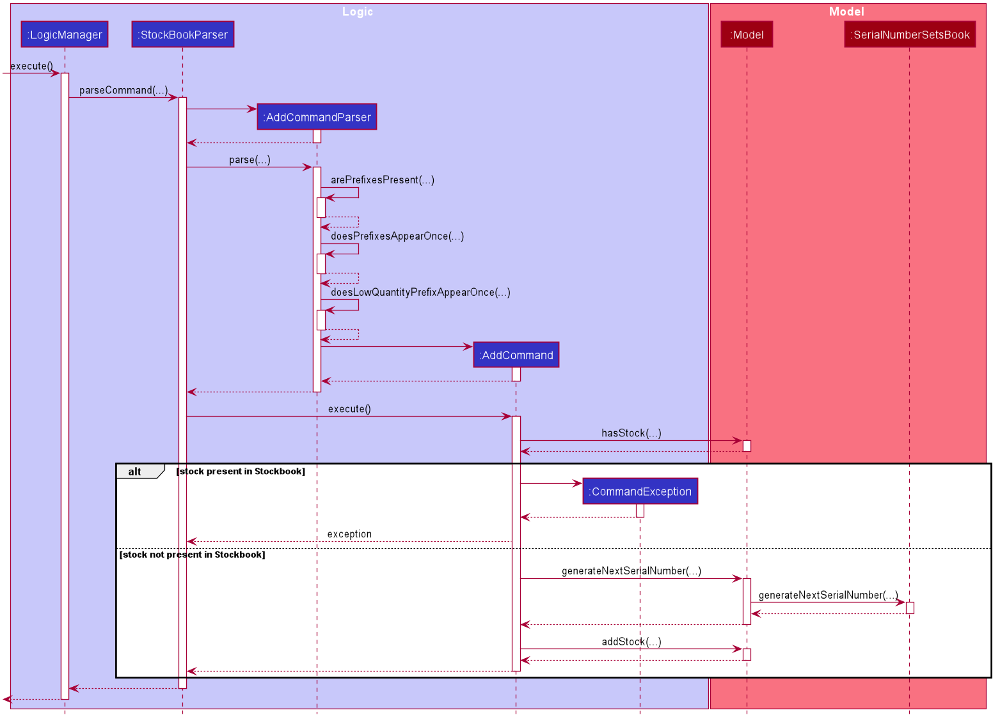
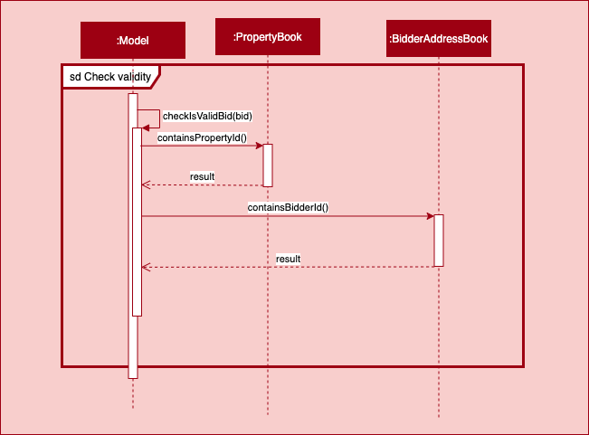
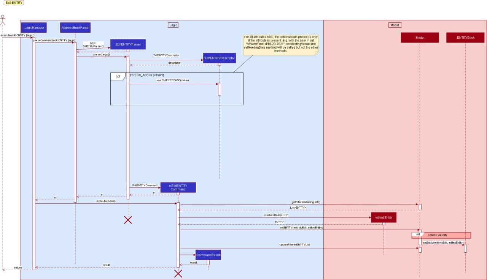
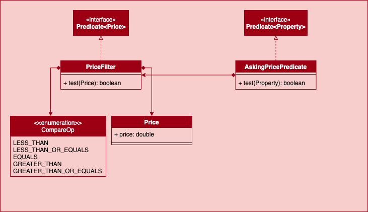

* Table of Contents
{:toc}

## **Setting up, getting started**

Refer to the guide [_Setting up and getting started_](SettingUp.md).

--------------------------------------------------------------------------------------------------------------------

## **Design**

Note that the diagrams shown inside the are created using `Diagrams.net`

### Architecture


The ***Architecture Diagram*** given above explains the high-level design of the App. Given below is a quick overview of each component.

**`Main`** has **two** classes called [`Main`](https://github.com/se-edu/addressbook-level3/tree/master/src/main/java/seedu/address/Main.java) and [`MainApp`](https://github.com/se-edu/addressbook-level3/tree/master/src/main/java/seedu/address/MainApp.java). It is responsible for,
* At app launch: Initializes the components in the correct sequence, and connects them up with each other.
* At shut down: Shuts down the components and invokes cleanup methods where necessary.

[**`Commons`**](#common-classes) represents a collection of classes used by multiple other components.

The rest of the App consists of four components.

* [**`UI`**](#ui-component): The UI of the App.
* [**`Logic`**](#logic-component): The command executor.
* [**`Model`**](#model-component): Holds the data of the App in memory.
* [**`Storage`**](#storage-component): Reads data from, and writes data to, the hard disk.

Each of the four components,

* defines its *API* in an `interface` with the same name as the Component.
* exposes its functionality using a concrete `{Component Name}Manager` class (which implements the corresponding API `interface` mentioned in the previous point.

For example, the `Logic` component (see the class diagram given below) defines its API in the `Logic.java` interface and exposes its functionality using the `LogicManager.java` class which implements the `Logic` interface.


**How the architecture components interact with each other**

The *Sequence Diagram* below shows how the components interact with each other for the scenario where the user issues the command `delete-p 1`.


The sections below give more details of each component.

### UI component
{ start of `ui` section written by: Kor Ming Soon }


**API** :
[`Ui.java`](https://github.com/AY2021S1-CS2103-W14-1/tp/blob/master/src/main/java/seedu/address/ui/Ui.java)

The UI consists of two components:
- `MainWindow` 
- `HelpWindow`

---
#### [`MainWindow.java`](https://github.com/AY2021S1-CS2103-W14-1/tp/blob/master/src/main/java/seedu/address/ui/MainWindow.java)

`MainWindow` is made up of the following parts:
- [`ResultDisplay`](https://github.com/AY2021S1-CS2103-W14-1/tp/blob/master/src/main/java/seedu/address/ui/ResultDisplay.java)
- [`CommandBox`](https://github.com/AY2021S1-CS2103-W14-1/tp/blob/master/src/main/java/seedu/address/ui/CommandBox.java)
- [`TabBar`](https://github.com/AY2021S1-CS2103-W14-1/tp/blob/master/src/main/java/seedu/address/ui/TabBar.java)
- [`StatusBarFooter`](https://github.com/AY2021S1-CS2103-W14-1/tp/blob/master/src/main/java/seedu/address/ui/TabBar.java) 
- [`CalendarView`]((https://github.com/AY2021S1-CS2103-W14-1/tp/blob/master/src/main/java/seedu/address/ui/CalendarView.java))
- [`MeetingListPanel`](https://github.com/AY2021S1-CS2103-W14-1/tp/blob/master/src/main/java/seedu/address/ui/meeting/MeetingListPanel.java)


*Note that the font colour in the picture is only different for visibility purposes.*

After deliberation, we chose to proceed with TabBar as TabBar allowed
us to represent the details of our entities neatly. 
Each entity in Property belongs to a designated `ListPanel` (as shown below).

The `TabBar` component itself consists of the following parts:
- [`PropertyListPanel`](https://github.com/AY2021S1-CS2103-W14-1/tp/blob/master/src/main/java/seedu/address/ui/property/PropertyListPanel.java)
- [`BidderListPanel`](https://github.com/AY2021S1-CS2103-W14-1/tp/blob/master/src/main/java/seedu/address/ui/bidder/BidderListPanel.java)
- [`SellerListPanel`](https://github.com/AY2021S1-CS2103-W14-1/tp/blob/master/src/main/java/seedu/address/ui/seller/SellerListPanel.java)
- [`BidListPanel`](https://github.com/AY2021S1-CS2103-W14-1/tp/blob/master/src/main/java/seedu/address/ui/bid/BidListPanel.java)

Each panel will display the list of the entities corresponding to the name of the panel.

1. Alternative 1 (current choice): Choosing `TabBar` to represent information of our entities.
    - Pros: 
        - Neater segmentation of entities visually
        - Able to leverage on existing AB3 Ui implementation for representing `Person`
            
    - Cons:
        - Requires user to click to switch tab, not CLI-centric (tackled below)  
        
 2. Alternative 2: Maintain a single list on GUI and list only relevant entities based on certain actions such
 as commands.
    - Pros: 
        - Fewer changes to existing AB3 Ui implementation
    - Cons: 
        - Increases code complexity as a combined list has to be created and filter accordingly

The thought process behind the `Ui` was ultimately a choice between usability of the application
and complexity of implementation.

---
#### [`HelpWindow.java`](https://github.com/AY2021S1-CS2103-W14-1/tp/blob/master/src/main/java/seedu/address/ui/HelpWindow.java)

The `HelpWindow` is a pop up window that is activated upon clicking of the Help button in PropertyFree, or when the `help` command
is executed.

The `Copy URL` button would automatically copy the link of PropertyFree's User Guide into the user's clipboard.


---

All the above-mentioned components in `MainWindow` and `HelpWindow`, inherit from the abstract `UiPart` class.

The `UI` component uses JavaFx UI framework. The layout of these UI parts are defined in matching `.fxml` 
files that are in the `src/main/resources/view` folder. 
For example, the layout of the [`MainWindow`](https://github.com/AY2021S1-CS2103-W14-1/tp/blob/master/src/main/java/seedu/address/ui/MainWindow.java)
is specified in [`MainWindow.fxml`](https://github.com/AY2021S1-CS2103-W14-1/tp/blob/master/src/main/resources/view/MainWindow.fxml)

The `UI` component,

* Executes user commands using the `Logic` component.
* Listens for changes to `Model` data so that the UI can be updated with the modified data.
* Returns what to be printed out on the UI

{ end of `ui` section written by: Kor Ming Soon }

### Logic component


**API** :
[`Logic.java`](https://github.com/se-edu/addressbook-level3/tree/master/src/main/java/seedu/address/logic/Logic.java)

1. `Logic` uses the `AddressBookParser` class to parse the user command.
1. This results in a `Command` object which is executed by the `LogicManager`.
1. The command execution can affect the `Model` (e.g. adding a person).
1. The result of the command execution is encapsulated as a `CommandResult` object which is passed back to the `Ui`.
1. In addition, the `CommandResult` object can also instruct the `Ui` to perform certain actions, such as displaying help to the user.

Given below is the Sequence Diagram for interactions within the `Logic` component for the `execute("delete-m 1")` API call.


### Model component
{ start of Model Component section written by: Kor Ming Soon }


**API** : [`Model.java`](https://github.com/AY2021S1-CS2103-W14-1/tp/blob/master/src/main/java/seedu/address//model/Model.java)

<div markdown="span" class="alert alert-info">:information_source: Note that the usage of the term `ENTITY` represents any of the following entities in PropertyFree:<br>`Property`, `Seller`, `Bidder`, `Bid` and `Meeting`
</div>  

The `Model`,

* stores a `UserPref` object that represents the user’s preferences.

* does not depend on any of the other three components.

* stores the following `ENTITY` book data which consists of the following:
    - `PropertyBook`
    - `SellerAddressBook` 
    - `BidderAddressBook`
    - `MeetingBook`
    - `BidBook`
    
* exposes an unmodifiable `ObservableList<ENTITY>` that can be 'observed' by the UI component.

  *e.g. The UI is bounded to the 5 different lists so that 
  the UI automatically updates when the data in any of the lists are changed.*

The following segment of the `Model` components further breaks down each `ENTITY` for a more elaborate 
explanation of each entities' design.  
- Bidder and Seller
- Property
- Bid
- Meeting  

---
### Bidder and Seller 
The following class diagram depicts how the `Bidder` and `Seller` are created. The `Bidder` and `Seller` both extend from the
abstract `ClientPerson` which in turn extends from abstract `Person`.  


Note that the `CLIENTId` (BidderId / SellerId) design is elaborated in `Id` in [the following segment](#ID).

#### Design Considerations

 1. Alternative 1 (current choice): Extending `Bidder` and `Seller` from `ClientPerson`, and `ClientPerson` from `Person`  
    - Pros: 
        - Neater segmentation of entities
        - Easier extensibility for additional entities who require an `Id`
        in the future if necessary (e.g Person representing an organization or company)
    - Cons: 
        - Increased code complexity

 2. Alternative 2: Extending `Bidder` and `Seller` directly from `Person`
    - Pros: 
        - Sufficient and possible coverage for current requirements of PropertyFree
        - Lesser code complexity
        - Lesser changes to AB3 code base
    - Cons: 
        - Lesser extensibility and increased possibility of coupling if more entities are introduced
        
 3. Alternative 3 (current choice): Changing `Tag` from `Set<Tag>` in original AB3 implementation
    - Pros: 
        - Lesser code complexity and fewer testing required for extension  
        - Better suited for PropertyFree's purpose as a client management system where the purpose of the client is already 
        well specified without need for `Set<Tag>`
        - Improved UI by having `Tag` acting as a form of visual identifier, instead of complete removal of `Tag`
    - Cons: 
        - Refactoring from original AB3 implementation required substantial time
        
> *`Tag` was kept in `Person` instead of `ClientPerson` to reduce refactoring required from AB3.*

{ End of Model Component section written by: Kor Ming Soon }
       
#### ID

{ Start of Id Model section written by: Dianne Loh and Kor Ming Soon }

The follow class diagram depicts the design behind `Id` and the subclasses: `SellerId`, `BidderId` and `PropertyId`.


{ End of Id Model section written by: Dianne Loh and Kor Ming Soon }

--- 

### Property 

{ Start of Property Model Component section written by: Dianne Loh }

The following class diagram depicts `Property` and its related classes.  


#### Design Considerations

The implementations of `PropertyType` and `Address` are similar as they both are wrapper classes of a String. This implementation is justified because of the following considerations:

1. Alternative 1 (current choice): Implementing `PropertyType` and `Address` as separate classes.
    - Pros:
        - Better adherence to the separations of concerns principle by separating code related to `PropertyType` and `Address`
        - Easier extensibility for the classes to contain more specific attributes. For example, `Address` can be extended to contain more specific attributes, such as road name, block and postal code, etc.  
    - Cons: 
        - More code duplication (for now)
2. Alternative 2: `PropertyType` and `Address` extends from a parent class.  
    - Pros:
        - Less code duplication (for now) 
    - Cons:
        - Less extensible 
        - Modifying the behaviour of one type will affect the other 
        
{ End of Property Model Component section written by: Dianne Loh }

### Bid 

{ start of Bid Model Component section written by: Marcus Duigan Xing Yu }

The following class diagram depicts how a `Bid` is created.


##### Design Considerations

 1. Alternative 1 (current choice): Do not give bids its own Bid Id.
    - Pros: 
        - A bid is already unique as it cannot have the same property id and bidder id for two separate
          bids. Thus having a unique bid Id over complicates the bid for no reason
    - Cons: 
        - The user must know the bidder Id and property Id to find the exact bid instead of using a bid Id

 2. Alternative 2: Give a specific Id to the bids.
    - Pros: 
        - Can track how many bids have been made
        - Easier for users to execute certain commands aka delete-bid
    - Cons: 
        - More complicated
        - Having a bid Id does not help other entities 
        
 3. Alternative 3: Create a bid specific to a property and have a list of bidders as a parameter.
    - Pros: 
        - Associates all bidder Id's to a specific property
        - Easier to track if there is a duplicate bidder for a certain bid
    - Cons: 
        - Difficult to edit specific bids in terms of parameters
        - Difficult to find all bids related to a specific bidder

{ end of Bid Model Component section written by: Marcus Duigan Xing Yu }

### Meeting 

{ start of Meeting Model Component section written by: Harsha Vardhan  }

The following class diagram depicts how the different types of meetings are being created. The `Admin`, `Paperwork` and `Viewing` meeting types extend from the
abstract `Meeting`.  


As seen from the diagram above there are three subtypes of Meetings: Admin, Paperwork and viewing. Each of the meeting
types then contain the attributes of `BidderId`, `PropertyId`, `Venue`, `MeetingDate`, `StartTime` and `EndTime`.

##### Design Considerations

 1. Alternative 1 (current choice): Extending `Admin`, `Paperwork` and `Viewing` from  an abstract `Meeting`
    - Pros: 
        - Neater segmentation of the different meeting types
        - Easier extensibility for additional other types of meeting in the future
    - Cons: 
        - Increased code complexity

 2. Alternative 2: Identifying the different meeting types through a flag that stores the type of the meeting as a string
    - Pros: 
        - Minimal code will be required as the same class can be used to instantiate the different meetings
        - Lesser code complexity
        - Less repetition of code
    - Cons: 
        - Less extensibility because it is difficult to include new methods for a specific type 
        
{ End of Meeting Model Component section written by: Harsha Vardhan  }

### Storage component
{ Start of Storage Component section written by: Harsha Vardhan  }

  

**API** : [`Storage.java`](https://github.com/AY2021S1-CS2103-W14-1/tp/blob/master/src/main/java/seedu/address/storage/Storage.java)  

The `Storage` component,
* implements all the the different storage types as shown in the diagram above.
* can save `UserPref` objects in json format and read it back.
* can save the various storage books we have in json format and read it back.


The above shows the further implementations of each individual storage component.
For the storage components,
* the implementations across the different types of storage is similar.
* the different JsonENTITYBookStorage is responsible for saving the datas in json format. For example, 
let's take a look at PropertyBookStorage. The JsonPropertyBookStorage will store all the data that is 
associated with property in the file in json format. In the JsonAdaptedProperty, there will be all the attributes
that are associated with property that will eventually be stored in json format. The other storage books do follow 
a similar implementation.

#### Design Consideration
   
   1. Alternative 1 (current choice): Have different storage for the different entities.
        - Pros: Easier to implement and do not require refactoring for the existing code base. The code can be reused 
        and extended easily for the various entities. It will be easier to debug and find mistakes as when something goes wrong with a 
        particular entity it will be easier to know which entity is affected.
        - Cons: There will be a lot of files with repetitive code. 
        
   2. Alternative 2: Use the current AddressBookStorage and modify it to contain the different entities.
        - Pros: Everything will be in one single folder and it will be easier to access the code. There will not be multiple repeats of the same code
        across the different files. 
        - Cons: The code file might become huge and might become difficult to debug when there is an error.

{ End of Storage Component section written by: Harsha Vardhan  }


### Common classes

Classes used by multiple components are in the `seedu.addressbook.commons` package.

--------------------------------------------------------------------------------------------------------------------

## **Implementation**

This section describes noteworthy details on how certain features are implemented. The details of the features are
categorized accordingly to the features: 
1. `Add`
2. `Edit`
3. `Find`
4. `Sort`
5. `Delete`
6. `List`

Additional features apart from the above-mentioned feature includes:
- Automated change of `TabBar` and `ENTITYListPanel` with corresponding ENTITY command
- `next` and `prev` command for Calendar UI Navigation
- Key-press for UI navigation

#### 1. Add
{ start of Add section written by: Marcus Duigan Xing Yu}

The `Add` command applies to **all entities** in PropertyFree. Apart from `AddBidCommand`, `AddMeetingCommand` and `AddPropertyCommand` with slight differences in implementation (elaborated below), all other entities follow the same
implementation.

1. When the `Add` command is executed by the user, the input it passed into
the `LogicManager` and thereafter parsed and identified in `AddressBookParser`. 

2. Upon identifying the relevant `COMMAND_WORD` and by extension the `ENTITY` (through the `-` input)
, the corresponding `AddENTITYCommandParser` object is formed. The user input then goes
through another level of parsing in `AddENTITYCommandParser`.

3. The `AddENTITYCommandParser` identifies the parameters corresponding to the user's input, and a new `AddENTITYCommand`
object is formed taking in the identified parameters. 
The `AddENTITYCommand` is then encapsulated under `Command` and passed back into the `LogicManager`.

4. The `AddENTITYCommand` calls `execute(model)`. The execution of the command then interacts
with the `Model` component, and retrieves the unmodifiable view of `ObservableList<ENTITY>`.

5. The `Model` accesses the relevant ENTITYBook and adds the object to the ENTITYBook. The `Ui` then "listens" to the 
changes in the ENTITYBook and updates the GUI.

6. Finally, `AddENTITYCommand` is then encapsulated as a `CommandResult` and passed into the `LogicManager`.



##### 1.1 Add Bid Command



7. For Add-bid Command and Add-Meeting Command they have an additional step of checking whether the user inputs for bidder Id and property Id are valid before 
adding to the Bidbook or MeetingBook as seen in the diagram above.  

8. For add-bid command, it also contains an auto-sort feature where it will call a sort-bid method which ensures the list is always sorted
by property Id followed by Bid Amount. For further clarification, refer to section 4. Sort for a more in depth description.

{ End of Add section written by: Marcus Duigan Xing Yu}


##### 1.2 Add Property Command  

{ start of Add Property section written by: Dianne Loh }

The implementation of the Add Property feature includes an additional validity check to ensure that the seller id exists. Below is the sequence diagram for the `check validity` frame:  


If the check returns false, an `InvalidSellerIdException` is thrown.  

<div markdown="span" class="alert alert-primary">:information_source: Upon adding a property into the `UniquePropertyList`, the `PropertyId` of each property is automatically incremented according to the activity diagram below:
</div>  


{ End of Add Property section written by: Dianne Loh }

#### 2. Edit
{ start of Edit section written by: Christopher Mervyn}

The `Edit` command applies to **all entities** in PropertyFree.

1. When the `Edit` command is executed by the user, the input is passed into
the `LogicManager` and thereafter parsed and identified in `AddressBookParser`. 

2. Upon identifying the relevant `COMMAND_WORD` and by extension the `ENTITY` (through the `-` input)
, the corresponding `EditENTITYCommandParser` object is formed. The user input then goes
through another level of parsing in `EditENTITYCommandParser`.

3. The `EditENTITYCommandParser` identifies the parameters corresponding to the user's input, and a new `EditENTITYDescriptor` object is formed with the corresponding `setENTITY` method to be called.
The `EditENTITYDescriptor` will set the parameter as accordance with the user input. 
and  `EditENTITYCommand`

4. After which, the `EditENTITYCommandParser` will create  a new `EditENTITYCommand` object from the result of the corresponding `setENTITY` method. The `EditENTITYCommand` is then encapsulated under `Command` and passed back into the `LogicManager`.

5. The `EditENTITYCommand` calls `execute(model)`. The execution of the command then interacts
with the `Model` component, and retrieves the unmodifiable view of `ObservableList<ENTITY>`.

6. The `Model` accesses the relevant `ENTITYBook` and adds the object to the `ENTITYBook`. The `Ui` then "listens" to the 
changes in the `ENTITYBook` and updates the GUI.

7. Finally, `EditENTITYCommand` is then encapsulated as a `CommandResult` and passed into the `LogicManager`.




##### 2.1 Edit Entity Validity Check

Below is an example of how a meeting object to be edited will ensure that a valid property Id and bidder Id are supplied by the user, this is similar to the add command validity check from above:


The property Id and bidder Id are checked in their respective unique books as seen before adding the new edited meeting to the meeting book.  

Edit Bid Command and Edit Property Command will also do the validity check as described in its [Add ENTITY section](#1-add).

{ End of Edit section written by: Christopher Mervyn}


#### 3. Find  

{ Start of Find section written by: Dianne Loh }  

The `Find` command applies to **all entities** in PropertyFree. There are two implementations of `Find`:  
1. One-Predicate Implementation (for `Bid`, `Bidder` and `Seller`)
2. Multi-Predicate Implementation (for `Property` and `Meeting`)  

##### 3.1 One-Predicate Implementation of `FindENTITYCommand` (for `Bid`, `Bidder` and `Seller` only)  
1. When the `Find` command is executed by the user, the input is passed into `LogicManager` and then parsed in `AddressBookParser`.  
2. Upon identifying the `COMMAND_WORD` `Find` and the entity from the input `find-ENTITY`, the relevant `FindENTITYCommandParser` is created.  
3. The `FindENTITYCommandParser` parses the arguments into an `ABCContainsKeywordsPredicate`, where `ABC` represents an attribute, creates a `FindENTITYCommand` with the predicate and returns the command to the `LogicManager`.    
4. The method `execute(model)` of `FindENTITYCommand` is called, which updates the `filteredENTITY` list in `ModelManager` by setting the predicate.  
5. The GUI "listens" to the changes in the filtered list and updates its display.  
7. Finally, a `CommandResult` is returned to `LogicManager` to display the feedback to the user.  


##### 3.2 Multi-Predicate Implementation of `FindENTITYCommand` (for `Property` and `Meeting` only)  
This implementation differs from the One-Predicate implementation only in steps 3 and 4:  

**Step 3**: The `FindENTITYCommandParser` creates a `FindENTITYDescriptor`.  For each prefix (eg `n/...`) in the input, the `FindENTITYCommandParser` parses the arguments into the relevant `ABCContainsKeywordsPredicate` and sets the `ABCContainsKeywordsPredicate` of the `FindENTITYDescriptor`. The `FindENTITYCommandParser` then creates a `FindENTITYCommand` with the `FindENTITYDescriptor`, which is returned to `LogicManager`.  
**Step 4**: `execute(model)` of `FindENTITYCommand` gets the composed predicate from `FindENTITYDescriptor` and passes the predicate to `ModelManager` to update the `FilteredENTITY` list.  

  

<div markdown="span" class="alert alert-primary">:bulb: `AskingPricePredicate` is a special type of `Predicate` that tests if a `Property`'s `askingPrice` passes the `PriceFilter`, whose class diagram is as follows:
</div>  

  

{ End of Find section written by: Dianne Loh }

#### 4. Sort 
{ Start of Sort section written by: Harsha Vardhan}  

The `Sort` command applies to **Meeting** and **Bids** in PropertyFree. Both `SortMeetingCommand` and the `SortBidCommand`
follow similar implementations with slight differences. The `SortBidCommand` is slightly different as it has an auto-sort
feature when bids are added or edited. Below we will look into the implementation of the `SortMeetingCommand`.

The sort meeting feature sorts the meetings based on the different dates of the meetings from the earliest meeting
to the last meeting in chronological order.
1. When the `sort-m` command is executed by the user, the input it passed into
   the `LogicManager` and gets parsed and identified in `AddressBookParser`. 
2. Upon identifying the relevant `COMMAND_WORD` and by extension the `ENTITY` (through the `-` input)
   , the corresponding `SortMeetingCommandParser` object is formed. The user input then goes
   through another level of parsing in `SortMeetingCommandParser`
3. The `SortMeetingCommandParser` identifies the order in which the meetings are to be sort and creates a 
 `SortMeetingComparator` comparator object accordingly.
4. The ```SortMeetingCommandParser``` creates a ```SortMeetingCommand``` with the above comparator. The command
is returned to the ```LogicManager```.
5. The ```LogicManager``` calls ```SortMeetingCommand#execute()```, which adds a new duplicate list of meetings that is
 sorted in chronological order in ```MeetingBook``` via the ```Model``` interface.
6. Finally, a ```CommandResult``` with the relevant feedback is returned to the ```LogicManager```.


##### Design Considerations
 For the `SortMeetingCommand`, we had several considerations that we made on whether to sort the list manually through
 the `sort-m` command or to automatically sort the list for every meeting that is added or edited.
  
 1. Alternative 1 (current choice): User has the option to sort the list manually in both ascending and descending format.
 The meeting list will not be automatically sorted when a meeting has been added or changed. 
 
    - Pros: 
        - If the user types in wrong information for a certain meeting, he is able to see the meeting at the bottom rather 
        than filtering through a sorted list which makes it easier to fix the error that he has made.
        - Code will be easier to implement as we so not need to implement the auto sort phase.
        
    - Cons: 
        - User has to manually sort the list, using the `sort-m` command, after keying in the new meetings to obtain an
        ordered meeting list.
        
 2. Alternative 2: The meeting list will be automatically sorted every time the user makes a new meeting or edits one.
   
      - Pros: 
          - Meetings will always be in chronological order and user does not have to key in any command to sort the list.
          
      - Cons: 
          - If the user adds in a meeting with wrong details to a huge list of meetings, it will be difficult to find the meeting.
          If the previous method was used the new meting added will be at the bottom of the list. 
          - The code will be much more complex compared to alternative 1.
          - User will not be have the ability to sort the list in different orders. 


{ end of Sort section written by: Harsha Vardhan}

##### 4.1 Auto-Sort Feature for add-bid and edit-bid
{ start of Add/Edit auto-sort feature section written by: Marcus Duigan Xing Yu}

During the execution of `add-bid` and `edit-bid` command in the model manager, it executes a sort function similar to the above diagram's execution stage. The method names that are 
called instead are `updateSortedBidList(bidComparator)` which is called after the `addBid/updateFilteredBidList` method is called.


{ end of Add/Edit auto-sort feature section written by: Marcus Duigan Xing Yu}
#### 5. Delete
{ start of Delete section written by: Kor Ming Soon }

The `Delete` command applies to **all entities** in PropertyFree. Apart from `DeletePropertyCommand`, `DeleteBidderCommand`
and `DeleteSellerCommand` with slight differences in implementation (elaborated below), all other entities follow the same
implementation.

1. When the `Delete` command is executed by the user, the input it passed into
the `LogicManager` and thereafter parsed and identified in `AddressBookParser`. 

2. Upon identifying the relevant `COMMAND_WORD` and by extension the `ENTITY` (through the `-` input)
, the corresponding `DeleteENTITYCommandParser` object is formed. The user input then goes
through another level of parsing in `DeleteENTITYCommandParser`.

3. The `DeleteENTITYCommandParser` identifies the `Index` corresponding to the user's input, and a new `DeleteENTITYCommand`
object is formed taking in the identified `Index`. 
The `DeleteENTITYCommand` is then encapsulated under `Command` and passed back into the `LogicManager`.

4. The `DeleteENTITYCommand` calls `execute(model)`. The execution of the command then interacts
with the `Model` component, and retrieves the unmodifiable view of `ObservableList<ENTITY>`.

5. The `DeleteEntityCommand` retrieves the corresponding `ENTITY` to the `Index` (as received in 3), and calls on the
`deleteENTITY(ENTITYToDelete)` method of the `Model`.

6. The `Model` accesses the relevant ENTITYBook and removes the `ENTITYToDelete`. The `Ui` then "listens" to the 
changes in the ENTITYBook and updates the GUI.

7. Finally, `DeleteENTITYCommand` is then encapsulated as a `CommandResult` and passed into the `LogicManager`.


##### 5.1 Delete Bidder Command

<div markdown="span" class="alert alert-primary">The `Logic` portion of the sequence diagram shown subsequently is truncated to give more focus on the `Model` as the `Logic` implementation is similar to the above-mentioned. </div>  

The `DeleteBidderCommand` deletes the `bidderToDelete` corresponding to to the index given in the user input.
The command varies as other entities tied to the `bidderToDelete` by the `Id` will be deleted as well, namely:
`Bid` and `Meeting`.

1. Upon retrieving the `bidderToDelete`, the `bidderToDelete`'s `bidderId` is then retrieved and passed into
`removeAllBidsWithBidderId(bidderId)`. 

2. `BidBook` in turn calls `removeAllWithBidder(bidderId)` to iterate and delete through the list of bids 
containing the attribute of`bidderId`.

3. Step 1 and Step 2 are repeated but with `removeAllMeetingsWithBidderId(bidderId)` and `MeetingBook`.


##### 5.2 Delete Seller Command

The `DeleteSellerCommand` deletes the `SellertoBeDeleted` corresponding to to the index given in the user input.
The command varies as other entities tied to the `sellerToDelete` by the `Id` will be deleted as well, namely:
`Property`. The deletion of the `Property` will in turn delete other entities (elaborated in 5.3).

1. Upon retrieving the `sellerToDelete`, the `sellerToDelete`'s `sellerId` is then retrieved and passed into
`removeAllBidsWithSellerId(sellerId)`. 

2. `PropertyBook` in turn calls `removeAllWithBidder(bidderId)` to iterate and delete through the list of properties 
containing the attribute of`sellerId`.


##### Design Considerations
 
  Due to time constraint we decided to forgo certain attributes and features which would have distinctly separated `Bidder`
  and `Seller` better (such as winning `bidder`). The implementation was designed with future extensions in mind. 
  This consideration applies to all `Commands` pertaining to `Bidder` and `Seller`, not just `Delete`.
  
 1. Alternative 1 (current choice): Having `DeleteBidderCommand` and `DeleteSellerCommand` extends from `Command` rather than
 a common command such as `DeleteClientCommand`. 
 
    - Pros: 
        - Less coupling if an extension is required in the future
        - Less refactoring was required from original implementation of AB3
        
    - Cons: 
        - Unable to exploit polymorphism even though both `Bidder` and `Seller` have a degree of similarity between both
        - Increases code complexity in `AddressBookParser`
        
{ End of Delete section written by: Kor Ming Soon }

##### 5.3 Delete Property Command  

{ Start of Delete Property section written by: Dianne Loh }  

The `DeletePropertyCommand` can delete a property by either the index or property id. The `DeletePropertyCommandParser` will parse the user input into either an `Index` or `PropertyId` and create the `DeletePropertyCommand`. If the user is deleting the property by index, then `targetId` will be `null` and vice versa. The sequence diagram is shown below, starting from the creation of `DeletePropertyCommand`.  


Upon deleting the property, all `Bid`s and `Meeting`s with the same `PropertyId` as the property being deleted will be deleted as well, as seen in the `Cascade delete` sequence diagram below:  


{ End of Delete Property section written by: Dianne Loh }  

#### 6. List

{ Start of List section written by: Marcus Duigan Xing Yu }

The `List` command applies to **all entities** in PropertyFree. All entities follow the same
implementation.

1. When the `List` command is executed by the user, the input it passed into
the `LogicManager` and thereafter parsed and identified in `AddressBookParser`. 

2. Upon identifying the relevant `COMMAND_WORD` and by extension the `ENTITY` (through the `-` input)
, the corresponding `ListENTITYCommand` object is formed.

4. The `ListENTITYCommand` calls `execute(model)`. The execution of the command then interacts
with the `Model` component, and retrieves the unmodifiable view of `ObservableList<ENTITY>`.

5. The `ListEntityCommand` then calls on the
`updateFilteredENTITYLIST` method of the `Model` and applies the filter predicate of PREDICATE_SHOW_ALL_ENTITY.

                                                
6. The `Model` accesses the relevant ENTITYBook and displays the entire list in the ENTITYBook. The `Ui` then "listens" to the 
changes in the display for the ENTITYBook and updates the GUI.

7. Finally, `ListENTITYCommand` is then encapsulated as a `CommandResult` and passed into the `LogicManager`.


{ End of List section written by: Marcus Duigan Xing Yu }

### UI Navigation Implementation
{ Start of Ui implementation section written by: Kor Ming Soon }

This section explains the `Ui` implementation in PropertyFree. 

The implementation of `Ui` was implemented keeping in mind the constraint that the 
target user is more inclined towards command line interface. 

#### 1. Automated `TabBar` Switching based on Command

Given that PropertyFree deals with a variety of different entities. The challenge was identifying the corresponding
action and representing the right entity on the GUI.

The implemented is done as such:

- Creation of an `EntityType` (Enumeration) containing the following:  `BIDDER`, `SELLER`, `BID`, `PROPERTY` and `MEETING`. 

- `CommandResult` is given another attribute of `EntityType`, and a `setEntity(EntityType)` method is created. The method is
then called during the creation of the `CommandResult` object at each command.

- The `CommandResult` then passes the `EntityType` in `MainWindow` to set the `TabBar` accordingly to the entity relevant to 
command executed by the user.

The following activity diagram depicts the user journey and how the GUI responds accordingly in different scenarios.


#### 2. Key-press UI Navigation

<div markdown="span" class="alert alert-primary">The term `focus` refers to the component of which the user is able to interact with at any given moment.</div>  

Upon launch, the PropertyFree will set the focus in the `CommandBox`'s text field. 
This section highlights three simple key-press `Ui` navigation feature.

- Navigating to next month in CalendarView: `CONTROL / CTRL` + `RIGHT ARROW KEY`
- Navigating to previous month in CalendarView: `CONTROL / CTRL` + `LEFT ARROW KEY`
- Navigating to `CommandBox`'s text field (when not in focus): `ENTER`

The key-press navigation is implemented in `MainWindow` where the method `handleFocusRequestWhenKeyPressed(CommandBox)` 
configures the `primaryStage` with an `addEventFilter()` to "listen" to the event when a key is pressed.

This in turns calls the method `handle(KeyEvent)` that runs and determine which key is pressed.
Thereafter executes one of the three possible navigation.


#### 3. Calendar Navigation Command

Calendar Navigation Command serves to provide an alternative for users to view the `CalendarView` if the user's keyboard
layout does not provide convenience for `CONTROL` + `ARROW KEY`.

Two commands are created to handle the user input:

- `NextCalendarNavigationCommand`
- `PrevCalendarNavigationCommand`

The implementation of the two above-mentioned commands are largely similar to the `ListENTITYCommand`. 

However, apart from passing the `MESSAGE_SUCCESS` to `ResultDisplay`, the `CommandResult` checks `isCalendarNavigation()`
and calls the `handleToNext()` or `handleToPrev()` method in `CalendarView` depending on the user command input.

 
{ End of Ui implementation section written by: Kor Ming Soon }

--------------------------------------------------------------------------------------------------------------------

## **Documentation, logging, testing, configuration, dev-ops**

* [Documentation guide](Documentation.md)
* [Testing guide](Testing.md)
* [Logging guide](Logging.md)
* [Configuration guide](Configuration.md)
* [DevOps guide](DevOps.md)

--------------------------------------------------------------------------------------------------------------------

## Appendix A: Product scope

**Target user profile**:

* Has a need to manage a significant number of property details, seller details, buyer details as well as the various bid amounts
* Prefer desktop apps over other types
* Can type fast
* Prefers typing to mouse interactions
* is reasonably comfortable using CLI apps

**Value proposition**: 
* Able to store all the property listings, bidders as well as seller details for easy access.
* Able to store the various bids which makes it easier for agents to access details of the bids.
* Generate a list of meetings which allows the agent to keep track of all the different meetings.
* Able to search through the different lists based on the different attributes for ease of access of information. 
* Will be much more automated compared to softwares such as excel and also has an accompanying GUI that would make it easier to filter through the different list.


## Appendix B: User stories

Priorities: High (must have) - `* * *`, Medium (nice to have) - `* *`, Low (unlikely to have) - `*`

| Priority | As a …​                     | I want to …​                                                                        | So that I can…​                                                        |
| -------- | --------------------------- | ----------------------------------------------------------------------------------- | ---------------------------------------------------------------------- |
| `* * *`  | Real estate agent           | add a new property listing                                                          | add a new property entry when a seller wants to sell a new property    |
| `* * *`  | Real estate agent           | add bidder or seller                                                                | keep track of bidders or sellers involved                              |
| `* * *`  | Real estate agent           | view the list of interested sellers                                                 | keep track of property owners                                          |
| `* * *`  | Real estate agent           | delete a property listing                                                           | remove listings that are closed or the sellers do not wish to sell     |
| `* * *`  | Real estate agent           | search the properties by id, name or area etc                                       | filter properties according to my criteria                             |
| `* * *`  | Real estate agent           | sort the listing according to my criteria                                           | obtain a filtered list to easily observe properties of the same type   |
| `* * *`  | Real estate agent           | add bids to my properties                                                           | keep track of my customers’ bids                                       |
| `* * *`  | Real estate agent           | delete bids                                                                         | remove bids that are withdrawn by the bidders                          |
| `* * *`  | Real estate agent           | view the current bids organised by property, sellers and buyers                     | keep track of the bids                                                 |
| `* * *`  | Real estate agent           | create meetings                                                                     | set-up meetings easily with bidders and sellers for property           |
| `* * *`  | Real estate agent           | view the list of meetings                                                           | keep track of all my meetings                                          |
| `* * *`  | Real estate agent           | delete meetings                                                                     | remove meetings that are no longer happening                           |
| `* *`    | Real estate agent           | view the listings I have by address                                                 | be better equipped to give more options to the buyers for certain areas|
| `* *`    | Real estate agent           | edit the property listing                                                           | ensure that the property information is accurate                       |
| `* *`    | Real estate agent           | label a property as a rental or not                                                 | to give options for buyers who may wish to rent only                   |
| `* *`    | Real estate agent           | label the type of property the property is                                          | filter out specific properties based on the type buyers wish to buy    |
| `* *`    | Real estate agent           | edit the details of the property rental                                             | update with new information from the client                            |
| `* *`    | Real estate agent           | edit bids                                                                           | edit bids to ensure the information is accurate                        |
| `* *`    | Real estate agent           | edit meeting details                                                                | ensure that meeting details are accurate in case of changes            |
| `*`      | Real estate agent           | mark a property as sold                                                             | keep track on which houses are already sold without having to delete it|
| `*`      | Real estate agent           | see the historical transactions                                                     | track my performance                                                   |
| `* * *`  | Busy real estate agent      | delete bids or meetings related to properties/bidders that i delete                 | ensure that any invalid bids/meetings are conveniently removed         |
| `* * *`  | Busy real estate agent      | delete properties related to a seller that I delete                                 | ensure that any invalid properties are conveniently removed            |
| `* * *`  | Busy real estate agent      | delete properties related to a seller that I delete                                 | ensure that any invalid properties are conveniently removed            |
| `* * *`  | Busy real estate agent      | sort meetings by date                                                               | can quickly reference upcoming meetings without having to search       |
| `* *`    | Busy real estate agent      | see what is the highest bid amount for a property                                   | quickly check if the highest bid amount is satisfactory for the seller |
| `* *`    | Busy real estate agent      | schedule meetings such that it can warn me if there is any clashes in meetings      | ensure my schedule will not be problematic due to unintended clashes   |


## Appendix C: Use cases

(For all use cases below, the **System** is the `PropertyFree` and the **Actor** is the `Real Estate Agent`, unless specified otherwise)
For our product, we have different entities such as `Meeting` `Bid` `Bidder` `Seller` `Property`. However across the different entities,
the implementations are rather similar. Therefore, below we will use `ENTITY` to generalise the the different entities and then provide use
cases for the general entity. If any of the features have a different implementation, we will provide the alternative use case below. 

**1. Use case: Delete an `ENTITY` from the list**

**MSS**

1. User requests to list of an `ENTITY`
2. PropertyFree shows a list of the `ENTITY`
3. User requests to delete a specific `ENTITY` in the `ENTITY` list
4. PropertyFree deletes the `ENTITY` 
    Use case ends.
    
**Extensions**

* 2a. The list is empty.
    Use case ends.
* 3a. The given index is invalid.
    * 3a1. PropertyFree shows an error message.  
     Use case ends.
        
**Special cases**
* In the case when the `ENTITY` is `Bidder`, a deletion of the `Bidder` will result in the deletion of the associated `bids` and
`meetings`
* In the case when the `ENTITY` is `Property`, a deletion of the `Property` will result in the deletion of the associated `bids` and
`meetings`
        
**2. Use case: Add an `ENTITY`**

**MSS**

1. User requests to add a `ENTITY`
2. PropertyFree adds the `ENTITY` to the list  
    Use case ends.
    
**Extensions**

* 2a. The input format is invalid.
    * 2a1. PropertyFree shows an error message.  
        Use case ends.
        
* 2b. The given `ENTITY` already exists in the list.
    * 2b1. PropertyFree shows an error message.  
        Use case ends.
        
* 2c. The given `ENTITY` is given invalid inputs.
    * 2c1. PropertyFree shows an error message.  
         Use case ends.
        
        
**3. Use case: View a list of `ENTITY`**

**MSS**

1. User requests for a list of `ENTITY`.
2. PropertyFree shows a list of `ENTITY`.  
Use case ends.

    
**Extensions**

* 2a. The list of meetings is empty.  
    Use case ends.
    

**4. Use case: Edit an Existing `ENTITY` from the respective list**

**MSS**

1. User requests to edit a `ENTITY`.
2. PropertyFree shows the new `ENTITY` details.  
   Use case ends

**Extensions**

* 1a. User enters an invalid input.
    * 1a1. PropertyFree shows an error message.  
         Use case ends.  

* 1b. User enters attributes that result in a duplicate attribute.
    * 1b1. PropertyFree shows an error message.  
         Use case ends.  

**5. Use case: Find an Existing `ENTITY` from the respective list**

**MSS**

1. User requests to find a `ENTITY`.
2. PropertyFree shows the `ENTITY` details that match the attributes that the user has keyed in.  
   Use case ends

**Extensions**

* 1a. User enters an invalid input.
    * 1a1. PropertyFree shows an error message.  
         Use case ends.  


**6. Use case: Sort an Existing `ENTITY` from the respective list**

**MSS**

1. User requests to sort an `ENTITY` list.
2. PropertyFree shows the sorted `ENTITY` list.  
   Use case ends

**Extensions**

* 1a. User enters an invalid order input.
    * 1a1. PropertyFree shows an error message.  
         Use case ends.  


### Non-Functional Requirements

1.  Should work on any _mainstream OS_ as long as it has Java `11` or above installed.
2.  Should be able to hold up to 500 Entities(Property, Bidder, Seller, Bid, Meeting) without a noticeable sluggishness in performance for typical usage.
3.  A user with above average typing speed for regular English text (i.e. not code, not system admin commands) should be able to accomplish most of the tasks faster using commands than using the mouse.
4.  The product should be able to work without an internet connection.
5.  The product should be able to save all changes to storage locally.
6.  The product should not take above 10 seconds to execute any commands.


### Glossary

* **Mainstream OS**: Windows, Linux, Unix, OS-X
* **Private Seller and Bidder details**: Contact details that are not meant to be publicly shared with others
* **Public Property Details**: Description of the property that is meant to be shared with others
* **Bid Details**: Description of the bid which is meant to be shared with others 

--------------------------------------------------------------------------------------------------------------------

## **Appendix: Instructions for manual testing**

Given below are instructions to test the app manually.

<div markdown="span" class="alert alert-info">
:information_source: **Note:** These instructions only provide a starting point for testers to work on;
testers are expected to do more *exploratory* testing.
</div>

### Launch and shutdown

1. Initial launch

   1. Download the jar file and copy into an empty folder

   2. Run `java -jar PropertyFree.jar`.  
   
      Expected: Shows the GUI with a set of sample data. The window size may not be optimum.

2. Saving window preferences

   1. Resize the window to an optimum size. Move the window to a different location. Close the window.

   2. Re-launch the app by double-clicking the jar file.<br>  
   
      Expected: The most recent window size and location is retained.  

3. Subsequent launch  

    1. Run `java -jar PropertyFree.jar`.  

       Expected: Shows the GUI with data loaded from the json files. 

### Testing Bidder and Seller Features

<div markdown="span" class="alert alert-info">
:information_source: **Note:** as the implementation of Bidder and Seller are similar, do note that the the manual testing section for `Bidder` and `Seller` can be tested similarly.

- For example: in the following segment, `Adding a bidder while all bidders are being shown.`, the command which is given for bidder
`add-b` can be changed to `add-s`. The output will be similar to that as mentioned but in the context of `Seller` instead.

</div>

#### Adding a bidder while all bidders are being shown.

1. Prerequisite: No other bidders have the exact **same name** or **same phone number**.

2. Restriction: Name cannot exceed 26 characters with spaces included and the phone number cannot exceed 10 digits (inclusive).

3. Test case: `add-b n/Kor Ming Soon p/8222222`

    Expected: A bidder with the name: `Kor Ming Soon`, phone: `82222222` will be created and assigned a unique `BidderId`.
    A visual `Tag` with the role `bidder` is also assigned.
    ```
     New bidder added:   
     Name: Kor Ming Soon
     Phone number: 82222716
     Id: B1
     Tag: bidder
    ```
#### Edit a bidder while all bidders are being shown.

1. Prerequisite: A bidder exists inside the bidder list with the index `3`, this will also imply that there are bidders indexed
at `1` and `2` as the indexes are sequentially ordered.

2. Restriction: No other bidders have the exact **same name** or **same phone number**.

3. Test case: `edit-b 3 n/Nigel Ng Yong Sheng` 

   Expected: The bidder which belongs at index 3, will have his or her name edited to the input which is `Nigel Ng Yong Sheng`.
   Other details of the bidder will remain the same (i.e phone number, tag, and Bidder Id).
    ```
    Edited Bidder:
    Name: Nigel Ng Yong Sheng
    Phone number: 82222716
    Id: B3
    Tag: bidder
    ```

4. Test case: `edit-b 2 p/1784695`
    
    Expected: The bidder which belongs at index 2, will have his or her phone number edited to the input which is `1784695`.
   Other details of the bidder will remain the same (i.e name, tag, and Bidder Id).
   ```
   Edited Bidder:
   Name: Kor Ming Soon
   Phone number: 1784695
   Id: B1
   Tag: bidder
   ```

#### Delete a bidder while all bidders are being shown.

Note that bidder and seller delete functions are slightly different, and both will be elaborated.

1. Prerequisite: A bidder with exists inside the bidder list with the index `3`, this will also imply that there are bidders indexed
at `1` and `2` as the indexes are sequentially ordered.

2. Test case: `delete-b 3` 

   Expected: The bidder which belongs at index `3`, will be deleted. The result display would output the information of the bidder
   who was deleted (i.e name, phone number, tag and id). In addition, all `Meeting` and `Bid` which contain the `Id` of the bidder who
   was deleted will be deleted as well. 
   ```
   Deleted Bidder:    
   Name: Nigel Ng Yong Sheng
   Phone number: 82222716
   Id: B3
   Tag: bidder
   All related bids and meetings have been deleted.
   ```

#### Delete a seller while all sellers are being shown.

Note that bidder and seller delete functions are slightly different, and both will be elaborated.

1. Prerequisite: A seller with exists inside the seller list with the index `3`, this will also imply that there are sellers indexed
at `1` and `2` as the indexes are sequentially ordered.

2. Test case: `delete-s 3` 

   Expected: The seller which belongs at index `3`, will be deleted. The result display would output the information of the seller
   who was deleted (i.e name, phone number, tag and id). In addition, all `Property` which contains the `Id` of the seller who
   was deleted will be deleted as well. Property in turn will delete all `Bid` and `Meeting` relating to the Property's `Id`. 
   ```
   Deleted Seller:    
   Name: Kor Ming Soon
   Phone number: 1784695
   Id: B2
   Tag: bidder
   All related bids and meetings have been deleted.
   ```
   
#### Find a bidder while all bidders are being shown.

1. Prerequisite: A bidder with a name containing `Kor` is inside the bidder list.

2. Test case: `find-b Kor`

    Expected: The list will be filtered accordingly to the user input, which in this case is `Kor`, so all bidders
    whose name contain `Kor` will be shown. 
    ```
   1 bidder(s) listed!
    ```
    Note that the names which are filtered contain the name `Kor` in full (i.e other names such as
    `Kore` or `exampleKor` will not be filtered.)
    
#### List a bidder while only some bidders are being shown.

1. Prerequisite: The bidder list is currently filtered (i.e a `find` command has been executed).

2. Test case: `list-b`

    Expected: The list will show in full all the bidders who are existing in the list.  
    ```
    Displaying full bidder list.
    ```

### Testing Property Features

#### Adding a property while all property are being shown.

1. Prerequisite: Seller id must exist inside the seller list.

2. Restrictions:
    -  Price must be greater than 0 and less or equals to 1 trillion.
    -  Price will be truncated to 2 decimal places.
    -  PropertyName, Address and PropertyType have a maximum of 100 characters

3. Test case: `add-p n/Sunrise s/S1 ap/100 t/Landed a/99 Sunrise Street r/No`

    Expected: A property with the name: `Sunrise`, seller id: `S1`, asking price: `$100.00`, property type: `Landed`,
    address: `99 Sunrise Street` (note that the is_Rental will only be reflected if the `r/` input is `yes`).
    ```
    New property added: Sunrise
    Property Id: P1
    Address: 99 Sunrise Street
    Property type: Landed
    Asking price: $100.00
    Seller Id: S1
    ```

#### Listing a property while some property are being shown.

1. Prerequisite: The property list is currently filtered (i.e a `find` command has been executed). 

2. Test case: `list-p`

    Expected: The list will show in full all the properties that are existing in the list.
    ```
    Displaying full property list.
    ```
   
#### Editing a property while all property are being shown.

1. Prerequisite: 
    - A property exists inside the property list with the index `3`, this will also imply that there are property indexed
   at `1` and `2` as the indexes are sequentially ordered.
   - No other properties in the list contain the address "23 Cove Street".

2. Restrictions: 
    - Address is unique and the user input (if editing address) must not match any other properties' address in the list.

3. Test case: `edit-p 1 n/Cove Residences a/23 Cove Street`

    Expected: A property indexed at 1 will be edited with the new information
     name: `Cove Residences`, address: `23 Cove Street`. The other fields will remain unedited.
    ```
    Edited Property: Cove Residences
    Property id: P4
    Address: 23 Cove Street
    Property type: HDB
    Asking price: $99.00
    Seller id: S20
    ```

#### Deleting a property while all property are being shown.

1. Prerequisite: property exists inside the property list with the index `3`, this will also imply that there are property indexed
   at `1` and `2` as the indexes are sequentially ordered.

2. Test case: `delete-p 3`

    Expected: A property indexed at 3 will be deleted. The result display would output the information of the property
    that was deleted (i.e name, seller id etc). In addition, all `Bid` and `Meeting` relating to the deleted property's `Id` would be
    deleted as well.
    ```
    Deleted Property: Sunrise Avenue
    Property id: P23
    Address: Block 123
    Property type: HDB
    Asking price: $100.00
    Seller id: S2
    All related bids and 
    meetings have been 
    deleted.
    ```
   
#### Finding a property while all property are being shown.

1. Prerequisite: 
    - A property exists inside the property list with the index `3`, this will also imply that there are property indexed
   at `1` and `2` as the indexes are sequentially ordered.

2. Restrictions: 
    - The search is case insensitive, all attributes e.g cove will match Cove
    - Only full words will be match e.g sun will not match sunrise
    - Properties matching at least one keyword will be considered a match e.g sunrise view will match sunrise avenue when
    `sun` is input

3. Test case: `find-p n/Cove Sunrise ap/<= 100 r/no`

    Expected: Displays all properties whose names contains either Cove or Sunrise, 
    asking price is less than or equals to 100, and is not a rental property.
   ```
   2 properties listed!
   ```
   

### Testing Bids Features  

For all test cases for bid features, the GUI will automatically switch to the bid tab.  

#### Adding a Bid  

1. Prerequisites: Bidder with bidder id `B1` and property with property id `P2` exists in the respective lists.  

2. Restrictions:  
    - Price must be more than 0 and less or equals to 1 trillion.  
    - Price will be truncated to 2 dp.  

3. Test case: `add-bid b/P1 c/B2 m/150000.20`.  

   Expected: The new bid is added to the bid list with the following message displayed:  
   ```
   New bid added: 
   Bid of $150000.20
   by B2
   to property: P1
   ```

#### View Full List of Bids  

1. Test case: `list-bid`.  

   Expected: All bids will be displayed on the GUI, with the following message displayed:  
   ```
   Displaying full bid list.
   ```  

#### Deletion of Existing Bid  

1. Prerequisites: The bid to be deleted must exist in the bid list.  

2. Test case: `delete-bid 1`.  

   Expected: The bid at index 1 is deleted, with the following message displayed:  
   ```
   Deleted Bid: 
   Bid of $150000.20
   by B2
   to property: P1
   ```  
   The exact information depends the bid being deleted.  

#### Editing a Bid  

1. Prerequisites: The bid to be edited must exist in the bid list.  

2. Restrictions:  
    - At least one optional field must be provided.  
    - All restrictions and prerequisites from [Adding a Bid](#adding-a-bid) hold.  

3. Test case: `edit-bid 1 b/P99 c/B12 m/1.20`  

   Expected: The bid at index 1 will be updated to the new values, with the following message displayed:  
   ```
   Edited Bid:
   
   FROM: 
   Bid of $999999.00
   by B2
   to property: P3 
   
   TO: 
   Bid of $1.20
   by B12
   to property: P99
   ```
   The exact information depends on the bid being edited.  
   
#### Find a specific bid based on key words  

1. Test case: `find-bid P1 B2 $65000.00`.  

   Expected: All bids whose attributes matches at least one keyword will be displayed, with the following message displayed:  
   ```
   1 bid(s) listed!
   ```
   The number of bids listed corresponds to the number of bids that match the keywords.  
   
### Testing Meeting Features  

For all test cases for meeting features, the GUI will automatically switch to the meeting tab.  

#### Add a Meeting  

1. Prerequisites: A bidder with bidder id `B1` and a property with property id `P1` must exist in their respective lists.  

2. Restrictions:  
    - Meeting type is either `v` for `viewing`, `a`, for `admin` or `p` for `paperwork`.  
    - Date is of the format `DD-MM-YYYY` and cannot be a past date.  
    - Time is of the format `HH-MM`. The timings can clash each other and the hours and minutes will overflow (eg `24:30` is same as `00:30`).  

3. Test case: add-m q/v b/B1 p/P1 v/2 ALBERT PARK d/11-12-2021 s/12:30 e/13:00  

   Expected: Adds the meeting to the meeting list, with the following message displayed:  
   
  ```
   New meeting added: 
   Meeting Type: Viewing
   Bidder Id: B1
   Property Id: P1
   Venue: 2 ALBERT PARK
   Date: 11-12-2021
   Start Time: 12:30
   End Time: 13:00
  ```
  
#### Deleting an Existing Meeting  

1. Prerequisite: The meeting to be deleted must exist in the meeting list.  

2. Test case: delete-m 3.  

   Expected: The meeting at index 3 will be deleted, with the following message displayed:  
   
   ```
   Deleted Meeting: 
   Meeting Type: Viewing
   Bidder Id: B1
   Property Id: P1
   Venue: 2 ALBERT PARK
   Date: 11-12-2021
   Start Time: 12:30
   End Time: 13:00
   ```
   The exact information depends on the meeting being deleted.

   
#### View the List of All Meetings  

1. Test case: `list-m`  

   Expected: Displays all the meetings in the meeting list, with the following message displayed:  
   ```
   Displaying full meeting list.
   ```  
   
#### Editing an Existing Meeting  

1. Prerequisite: The meeting to be edited must exist in the meeting list.  

2. Restrictions:  
    - At least one optional field is required.  
    - The prerequisites and restrictions of [Adding a Meeting](#add-a-meeting) hold.  

3. Test case: `edit-m 2 v/eunos`.  

   Expected: The meeting will be updated to the provided values, with the following message displayed:  
   ```Edited Meeting: Admin
      Bidder Id: B12
      Property Id: P12
      Venue: eunos
      Date: 12-05-2016
   ```  
   
#### Sorting the existing Meeting List  

1. Test case: `sort-m o/asc`.  

   Expected: Sorts the meeting list in ascending order according to meeting date, with the following message displayed:  
   ```
   Successfully sorted meeting
   ```  
   
#### Finding an Existing Meeting  

1. Restrictions:  
    - At least one optional field is required.  
    
2. Test case: `find-m b/B1 v/bedok`  

   Expected: Displays all the meetings whose attributes matches the specified keywords, with the following message displayed:  
   ```2 meeting(s) listed!```  
   The actual number depends on the number of meetings that fulfil the criteria. 
   
### Calendar Navigation Features  

#### Navigating to the Next Month in the Calendar  

1. Test case: `next`  

   Expected: Displays the next month in the calendar, with the following message:  
   ```
   Display next month of Calendar
   ```
   
#### Navigating to the Previous Month in the Calendar  

1. Test case: `prev`  

   Expected: Displays the previous month in the calendar, with the following message:  
   ```
   Display previous month of Calendar
   ```  
   
### Testing Keyboard Navigation  

#### Focus on `CommandBox`  

1. Prerequisite: When the `CommandBox` is not in focus (i.e. the cursor is not blinking).  

2. Test case: `PRESS ENTER`  

   Expected: The `CommandBox` will be brought into focus.  
   
#### Next Month in `Calendar`  

1. Test case:  
   ```PRESS CTRL + RIGHT ARROW KEY - Windows OS
       or
       PRESS CONTROL + RIGHT ARROW KEY - Mac OS
   ```  
   
   Expected: Displays the next month in `Calendar`.  
   
#### Previous Month in `Calendar`  

1. Test case:  
    ```PRESS CTRL + LEFT ARROW KEY - Windows OS
        or
        PRESS CONTROL + LEFT ARROW KEY - Mac OS
   ```  
   
   Expected: Displays the previous month in `Calendar`.  
   
