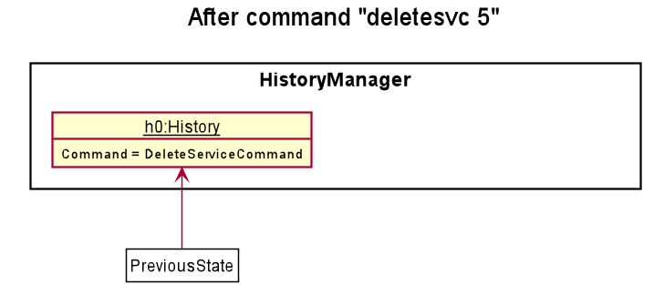
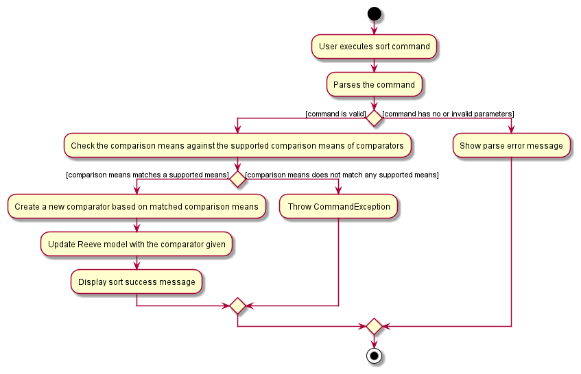

* Table of Contents
{:toc}

--------------------------------------------------------------------------------------------------------------------
## **How to navigate this Developer Guide**

The target audience of this guide is anyone who wishes to extend or modify the functionality of ZooKeepBook. The guide is split into 3 sections, covering the <a href = 'https://ay2021s1-cs2103t-w15-4.github.io/tp/DeveloperGuide.html#design'>design of ZooKeepBook</a>, the <a href = 'https://ay2021s1-cs2103t-w15-4.github.io/tp/DeveloperGuide.html#implementation'>implementation of certain features</a> as well as how to <a href='https://ay2021s1-cs2103t-w15-4.github.io/tp/DeveloperGuide.html#documentation-logging-testing-configuration-dev-ops'>manage the development of ZooKeepBook</a>.

The following symbols are used throughout this developer guide. They highlight important information that may be useful to you:
|Symbol|Description|
|------|:-------|
|:bulb:|This block contains additional **tips** that may aid you|
|:information_source:|This block contains additional **information** that may be used to elaborate on the content presented|
|`text markup `|Indicates Java class and method names|

--------------------------------------------------------------------------------------------------------------------

## **Setting up, getting started**

Refer to the guide [_Setting up and getting started_](SettingUp.md).

--------------------------------------------------------------------------------------------------------------------

## **Design**
This section describes the high-level components that make up ZooKeep.

### Architecture

The ***Architecture Diagram*** (*Figure 1*) given below explains the high-level design of the App. 

<i>Figure 1: The Architecture Diagram of ZooKeep</i>

Given below is a quick overview of each component.

:bulb: **Tip:** The `.puml` files used to create diagrams in this document can be found in the 
[diagrams](https://github.com/AY2021S1-CS2103T-W15-4/tp/tree/master/docs/diagrams/) folder. Refer 
to the [_PlantUML Tutorial_ at se-edu/guides](https://se-education.org/guides/tutorials/plantUml.html) 
to learn how to create and edit diagrams.

**`Main`** has two classes called [`Main`](https://github.com/AY2021S1-CS2103T-W15-4/tp/tree/master/src/main/java/seedu/address/Main.java) and [`MainApp`](https://github.com/AY2021S1-CS2103T-W15-4/tp/tree/master/src/main/java/seedu/address/MainApp.java). 
It is responsible for the following situations:

* At app launch: Initializes the components in the correct sequence, and connects them up with each other.
* At shut down: Shuts down the components and invokes cleanup methods where necessary.

[**`Commons`**](#common-classes) represents a collection of classes used by multiple other components.

The rest of the App consists of four components:

* [**`UI`**](#ui-component): The UI of the App.
* [**`Logic`**](#logic-component): The command executor.
* [**`Model`**](#model-component): Holds the data of the App in memory.
* [**`Storage`**](#storage-component): Reads data from and writes data to the hard disk.

Each of the four components

* defines its *API* in an `interface` with the same name as the Component.
* exposes its functionality using a concrete `{Component Name}Manager` class 
(which implements the corresponding API `interface` mentioned in the previous point.

For example, the `Logic` component (see *Figure 2* below) defines its API 
in the `Logic.java` interface and exposes its functionality using the `LogicManager.java` class 
which implements the `Logic` interface.

<i>Figure 2: Class Diagram of Logic component</i>

The *Sequence Diagram (Figure 3)* below shows how the components interact with each other for the 
scenario where the user issues the command `delete 123`.

<i>Figure 3: Sequence Diagram of delete command</i>

The sections below give more details of each component.

### UI component

The Class Diagram for the UI Component is shown below (*Figure 4*)

<i>Figure 4: Class Diagram of UI Component</i>

**API** :
[`Ui.java`](https://github.com/AY2021S1-CS2103T-W15-4/tp/tree/master/src/main/java/seedu/address/ui/Ui.java)

The UI consists of a `MainWindow` that is made up of parts e.g.`CommandBox`, `ResultDisplay`, `AnimalListPanel`, `StatusBarFooter` etc. All these, including the `MainWindow`, inherit from the abstract `UiPart` class.

The `UI` component uses JavaFx UI framework. The layout of these UI parts are defined in 
matching `.fxml` files that are in the `src/main/resources/view` folder. 
For example, the layout of the [`MainWindow`](https://github.com/AY2021S1-CS2103T-W15-4/tp/tree/master/src/main/java/seedu/address/ui/MainWindow.java) 
is specified in [`MainWindow.fxml`](https://github.com/AY2021S1-CS2103T-W15-4/tp/tree/master/src/main/resources/view/MainWindow.fxml)

The `UI` component

* Executes user commands using the `Logic` component.
* Listens for changes to `Model` data so that the UI can be updated with the modified data.

### Logic component

The Class Diagram for the Logic Component is shown below (*Figure 5*)

<i>Figure 5: Class Diagram of Logic Component</i>

**API** :
[`Logic.java`](https://github.com/AY2021S1-CS2103T-W15-4/tp/tree/master/src/main/java/seedu/address/logic/Logic.java)

1. `Logic` uses the `ZooKeepBookParser` class to parse the user command.
1. This results in a `Command` object which is executed by the `LogicManager`.
1. The command execution can affect the `Model` (e.g. adding an animal).
1. The result of the command execution is encapsulated as a `CommandResult` object which is passed back to the `Ui`.
1. In addition, the `CommandResult` object can also instruct the `Ui` to perform certain actions, such as displaying help to the user.

Given below is the Sequence Diagram (*Figure 6*) for interactions within the `Logic` component for the `execute("delete 1")` API call.

<i>Figure 6: Sequence Diagram for delete command</i>

:information_source: **Note:** The lifeline for `DeleteCommandParser` should end at the destroy marker (X) but due to a limitation of PlantUML, the lifeline reaches the end of diagram.

### Model component

The Class Diagram for the Model Component is shown below (*Figure 7*)

<i>Figure 7: Class Diagram of Model Component</i>

**API** : [`Model.java`](https://github.com/AY2021S1-CS2103T-W15-4/tp/tree/master/src/main/java/seedu/address/model/Model.java)

The `Model`,

* stores a `UserPref` object that represents the user’s preferences.
* stores the ZooKeep book data.
* exposes an unmodifiable `ObservableList<Animal>` that can be 'observed' e.g. the UI can be bound to this list so that the UI automatically updates when the data in the list change.
* does not depend on any of the other three components.

:information_source: **Note:** An alternative (arguably, a more OOP) model is given below. It has `MedicalCondition` and `FeedTime` lists in the `ZooKeepBook`, which `Animal` references. This allows `ZooKeepBook` to only require one `MedicalCondition` or `FeedTime` object per unique `MedicalCondition` or `FeedTime`, instead of each `Animal` needing their own `MedicalCondition` or `FeedTime` objects. 

### Storage component

The Class Diagram for the Storage Component is shown below (*Figure 8*)

<i>Figure 8: Class Diagram of Storage Component</i>

**API** : [`Storage.java`](https://github.com/AY2021S1-CS2103T-W15-4/tp/tree/master/src/main/java/seedu/address/storage/Storage.java)

The `Storage` component,
* can save `UserPref` objects in json format and read it back.
* can save the ZooKeep book data in json format and read it back.

### Common classes

Classes used by multiple components are in the `seedu.zookeepbook.commons` package.

--------------------------------------------------------------------------------------------------------------------

## **Implementation**

This section describes some noteworthy details on how certain features are implemented.

### Undo feature (by Zhi Yuan)

#### Implementation

The undo feature is facilitated by a stack data structure.

The `HistoryStack` class wraps a stack designed to hold `ReadOnlyZooKeepBook` objects.

The Singleton Pattern is employed here since only one history instance should exist in the running of the application.

`HistoryStack` supports the following key features:

* `HistoryStack#addToHistory(ReadOnlyZooKeepBook)` - Adds the given state of the book into history only if it differs from the most recent state.
* `HistoryStack#removeRecentHistory()` - Removes the most recent state of the book from the history.
* `HistoryStack#viewRecentHistory()` - Returns the most recent state of the book.
* `HistoryStack#clearHistory()` - Clears the history.

The undo feature also depends on the following existing methods:
* `Model#setZooKeepBook(ReadOnlyZooKeepBook)` - Replaces the current model's book data with the given.
* `Model#getZooKeepBook()` - Returns the model's current book.

The following classes reference the above methods:
* `UndoCommand`
* `LogicManager`

:information_source: **Note:** Classes pertaining to the Redo command also refer to these methods, but will be excluded here and explained in the section below instead.

Given below is an example usage scenario and how the undo mechanism behaves at each step.

Step 1. The user launches the application for the first time. The `HistoryStack` will be initialized with a single state (*Figure 9*), which is the current state.

<i>Figure 9: State of HistoryStack upon initialization</i>

Step 2. The user executes `delete 1` command to delete the animal with ID 1. `LogicManager` calls `Model#getZooKeepBook()` to retrieve the new state of the book, and adds it to the history (*Figure 10*) with `HistoryStack#addToHistory(ReadOnlyZooKeepBook)`.

<i>Figure 10: State of HistoryStack after addition of new state</i>

Step 3. The user executes `help` to view the help screen. `LogicManager` behaves as per Step 2. However, since no changes were made to the state, the current state is not added (*Figure 11*) to `HistoryStack`.

<i>Figure 11: State of HistoryStack unchanged</i>

:information_source: **Note:** If a command fails its execution, it will not call `HistoryStack#addToHistory()`, so the state will not be saved into the `HistoryStack`.

Step 4. The user now decides that deleting the person was a mistake, and decides to undo that action by executing the `undo` command. The `undo` command will call `HistoryStack#removeRecentHistory()` which deletes the current state, and exposes the previous state. `HistoryStack#viewRecentHistory()` is then called to retrieve the previous state, then loaded into the model (*Figure 12*) using `Model#setZooKeepBook(ReadOnlyZooKeepBook)`.

<i>Figure 12: State of HistoryStack after loading the previous state</i>

:information_source: **Note:** If the `HistoryStack` only contains a single state, then there is no previous state to restore. The `undo` command uses `HistoryStack#getHistorySize()` to check if this is the case. If so, it will return an error to the user rather
than attempting to perform the undo.

The following Sequence Diagram (*Figure 13*) shows how the undo operation works:

<i>Figure 13: Sequence Diagram when undo command is executed</i>

:information_source: **Note:** The lifeline for `UndoCommand` should end at the destroy marker (X) but due to a limitation of PlantUML, the lifeline reaches the end of diagram.

The following 2 Activity Diagrams (*Figures 14.1 & 14.2*) summarize what happens when a user executes a new command and when a user executes the undo command:

<i> Figure 14.1 (left): Activity Diagram when user executes a command </i>

<i> Figure 14.2 (right): Activity Diagram when user undoes a command </i>

#### Design consideration:

##### Aspect: How undo executes

* **Alternative 1 (current choice):** Saves the entire ZooKeep book as a state.
  * Pros: Easy to implement, works with all commands immediately.
  * Cons: May have performance issues in terms of memory usage as product scales.

* **Alternative 2:** Individual command knows how to undo by
  itself.
  * Pros: Will use less memory (e.g. for `delete`, just save the animal being deleted).
  * Cons: We must ensure that the implementation of each individual command are correct.

### Redo feature (by Jun Cheng)

#### Implementation

The Redo feature was added as a complement to the Undo feature which was done earlier. The addition of this
feature required the integration of the `RedoCommand` class, which extends from the `Command` class like all other commands.
The `HistoryStack` class also has new key features to support the `redo` command:

* `HistoryStack#addToRedo(ReadOnlyZooKeepBook)` - Adds a given state of the ZooKeep book into the redo stack.
* `HistoryStack#removeRecentRedo()` - Removes the most 'recent' update of the ZooKeep book from the redo stack.
* `HistoryStack#viewRecentRedo()` - Returns (but does not remove) the most 'recent' update of the ZooKeep book.
* `HistoryStack#clearRedo()` - Clears the future updates of the ZooKeep book stored in the redo stack.

The `RedoCommand` class references some of these methods to accomplish the feature required. Given below is an example
usage scenario and how the redo mechanism behaves at each step.

Step 1. The user launches the application for the first time. The ZooKeep book is initialised with the initial state
given in `data/zookeepbook.json`, and the `HistoryStack` consists of 2 stacks; the history stack and the redo stack,
each in their respective initial states (*Figure 15*).

<i>Figure 15: State of both stacks during initialization</i>

Step 2. The user executes `add n/Harambe...` to add a new animal into the ZooKeep book. The `LogicManager` calls
`Model#getZooKeepBook()` to retrieve the new state of the book and calls `HistoryStack#addToHistory(ReadOnlyZooKeepBook)`
as per normal undo protocol (*Figure 16*).

<i>Figure 16: State of both stacks after executing add command</i>

Step 3. The user then executes `delete 567` which deletes the animal in the book with an ID of 567. Similar to step 2, 
`LogicManager` will call `Model#getZooKeepBook()` to retrieve the new state of the book and then calls 
`HistoryStack#addToHistory(ReadOnlyZooKeepBook)` to store this state into the history stack (*Figure 17*).

<i>Figure 17: State of both stacks after executing delete command</i>

Step 4. Now the user thinks that deleting that animal was a mistake and restores the previous state by 
executing `undo` (explained in the previous section). However, before the current state is deleted and replaced with 
the previous one, `HistoryStack#addToRedo(ReadOnlyZooKeepBook)` is called to store the current state into the redo 
stack (*Figure 18*) for further use.

<i>Figure 18: State of both stacks after executing undo command</i>

:information_source: **Note:** If `UndoCommand` is never executed, the 
redo stack will remain empty and calling `RedoCommand` will do nothing, since there are no future states recorded in
the stack for retrieval. 

Step 5. However, now the user decides that deleting that animal was the correct decision after all, and now executes 
`redo` which calls `HistoryStack#viewRecentRedo()` to retrieve the future state of the ZooKeep book where the animal
was deleted. The future state is then loaded into the model using `Model#setZooKeepBook(ReadOnlyZooKeepBook)`.
Lastly, `HistoryStack#removeRecentRedo()` is called to delete that state from redo stack (*Figure 19*). 

<i>Figure 19: State of both stacks after executing redo command</i>

:information_source: **Note:** If commands which alter the state of the 
ZooKeep book (e.g. add or delete) are executed after an undo command, the redo stack will be emptied since the 
immediate future has been altered and the future states previously stored in the redo stack are now invalid. Hence 
executing redo now will do nothing.

The following Sequence Diagram (*Figure 20*) illustrates how the `Redo` operation is performed:

<i>Figure 20: Sequence Diagram when redo command is executed</i>

:information_source: **Note:** The lifeline for `RedoCommand` should end 
at the destroy marker (X) but due to a limitation of PlantUML, the lifeline reaches the end of diagram.

The following 2 Activity Diagrams (*Figures 21.1 & 21.2*) summarise what happens when a user executes the `undo` and `redo` commands:

<i>Figure 21.1 (left): Activity Diagram when user executes an undo command</i>

<i>Figure 21.2 (right): Activity Diagram when user executes a redo command</i>

#### Design consideration:

##### Aspect: How redo executes

* **Alternative 1 (current choice):** Saves the entire ZooKeep book as a state.
  * Pros: Easy to implement, works with all commands immediately.
  * Cons: May have performance issues in terms of memory usage as product scales.

* **Alternative 2:** Individual command knows how to redo by
  itself.
  * Pros: Will use less memory (e.g. for `delete`, just save the animal being deleted).
  * Cons: We must ensure that the implementation of each individual command are correct.

### Snapshot feature (by Aizat)

#### Implementation

The snapshot feature is implemented by the `SnapCommand` and `SnapCommandParser` classes. 
`SnapCommandParser` parses the user's input as a file name and then creates a `SnapCommand` 
object with a `Path` object representing the save destination and file name as parameters.

`SnapCommand` executes by copying the current state of the zookeep book and then utilising
`StorageManager`'s save method to save the copied zookeep book with the user specified file name.

The following Sequence Diagram (*Figure 22*) illustrates the creation and execution of a `SnapCommand`:

<i>Figure 22: Sequence Diagram when snap command is executed</i>

:information_source: **Note:** The lifelines for `SnapCommandParser`, `SnapCommand`, `StorageManager` 
should end at the destroy marker (X) but due to a limitation of PlantUML, the lifeline reaches the end of diagram.

#### Design considerations:
##### Aspect: Overwriting files
* We chose to prevent users from creating a snapshot if the specified file name already exists
as overwriting a file is irreversible and would be disastrous for zookeepers if done unintentionally

### Sort feature (by Malcolm)

#### Implementation

This section explains the implementation of the Sort command feature in the ZooKeepBook. This feature is used to sort the animals based on the different categories: **name, id or feedtime**.

* For the animal name, it will be in alphabetical order.
* For the animal id, it will be in increasing order.
* For the animal feed time, it will be from earliest to latest. 

The following Sequence Diagram (*Figure 23*) shows the Logic and Model Components when a sort command is being executed:

<i>Figure 23: Sequence Diagram when sort command is executed</i>

:information_source:  **Note:** The lifeline for `SortCommand` should end at the destroy marker (X) but due to a limitation of PlantUML, the lifeline reaches the end of diagram.

In the **Logic** Component,
After the user keys in "sort name" as input, these key methods are called:
* `LogicManager#execute("sort name")`: The `LogicManager` takes in a command text string ("sort name/id/feedtime").
* `ZooKeepBookParser#parseCommand("sort name")`: The `ZooKeepBookParser` parses the user input into a command word ("sort") and arguments ("name"). Using the command word, a `SortCommandParser` is created. 
* `SortCommandParser#parse("name")`: The `SortCommandParser` takes in the argument("name") and parses it. An `AnimalComparator` is created and contains the specific static comparator required to sort the animals according to the category provided. A `SortCommand` is created with the `AnimalComparator` as an attribute.
	* The `AnimalComparator` contains 3 different static comparators to be used for sorting: `ANIMAL_NAME_COMPARATOR`,  `ANIMAL_ID_COMPARATOR` and `ANIMAL_FEEDTIME_COMPARATOR`.
	* In this case, the `ANIMAL_NAME_COMPARATOR` is taken.
* `SortCommand#execute(model)`: The `SortCommand` uses the `AnimalComparator` to sort the animals and returns a `CommandResult` object which represents the result of a command execution. 

In the **Model** Component,
The in-memory model of the ZooKeepBook data sorts and updates the animal list. The following key methods are used: 
* `Model#sortAnimals(animalComparator)`: sorts the animals in the `ZooKeepBook` using the given `AnimalComparator` object.
* `ZooKeepBook#sortAnimals(animalComparator)` : Retrieves the static comparator in the `AnimalComparator` object and creates a `SortedList` object. The `UniqueAnimalList` in the `ZooKeepBook` is then replaced by this `SortedList` object.
* `ZooKeepBook#updateFilteredAnimalList(predicate)`: Updates the filter of the filtered animal list to filter by the given predicate, which will be true here so that the sorted list will be displayed once sorted.

Upon the completion of the user command, a success message (Sorted all animals by name) and the updated sorted list is displayed below the message.

The following Activity Diagram (*Figure 24*) summarises what happens when a user executes a sort command.

<i>Figure 24: Activity Diagram when user executes sort command</i>

#### Design Consideration  
##### Aspect: Sorting based on different categories  
We chose to allow the user to sort not only based on animal names but also by their id and feedtime to ease the convenience of the user when he needs data to be sorted in other ways.

### Feed times feature (by Jeremy)

#### Implementation

The feed times feature utilizes a TreeSet with a custom comparator.

Each Animal object has a `FeedTimes` TreeSet.

The custom comparator `FeedTimeComparator` compares the integer values of the feed times, returning them in ascending order.

The feed times feature allows for the following functionality:

* Add multiple feed times to each animal listing.
* Ensure feed times are always displayed in chronological order.

The following notable methods are used for the feed times feature:
* `ParserUtil#parseFeedTimes(Collection<String>)` - returns a Set of `FeedTime` objects from user input
* `FeedTime#isValidFeedTime(String)` - validates the feed time to ensure it is in the HHmm format

The parsing and displaying of feed times were adapted from the Medical Condition field.

Given below is a Sequence Diagram (*Figure 25*) shows how the operation of adding feed times works.

<i>Figure 25: Sequence Diagram when animal is added with feed times</i>

Step 1. The user inputs an add command, specifying feed times to be added for an Animal (eg. add n/Pikachu i/1307 s/Pokemon f/1234 f/0001 f/2200)

Step 2. The `ZooKeepBook` class receives the user input. `AddCommand.COMMAND_WORD` is used to identify the type of command.

Step 3. The `AddCommandParser` class receives the arguments in the user input. The `ArgumentTokenizer` class is called with the `PREFIX_FEED_TIME` variable.

Step 4. The `ArgumentTokenizer` class returns the feed times found in the users input. A set of `FeedTime` objects is created by the `parseFeedTimes` method in the `ParserUtil` class.

:information_source: **Note:** A ParseException is thrown by parseFeedTimes if the feed time input does not match the defined format.

:information_source: **Note:** The TreeSet created by parseFeedTimes utilizes the FeedTimeComparator, ensuring that the set is returned in chronological order.

Step 5. An `Animal` object is created with the Set of `FeedTime` objects.

The following Activity Diagram (*Figure 26*) summarizes what happens when feed times are added to an Animal:

<i>Figure 26: Activity Diagram when user adds an animal with feed times</i>

#### Design consideration:

##### Aspect: How chronological order is maintained

* **Alternative 1 (current choice):** Store the feed times in chronological order
  * Pros: Quick to display when retrieving information
  * Cons: Initial creation and storage of feed times takes longer

* **Alternative 2:** Sort the feed times when information is retrieved
  itself.
  * Pros: Quick during the initial creation of Animal objects
  * Cons: Additional processing time required when displaying each Animal object

--------------------------------------------------------------------------------------------------------------------

## **Documentation, logging, testing, configuration, dev-ops**
This section provides guides for developers wishing to take on this framework for extension or morphing.

* [Documentation guide](Documentation.md)
* [Testing guide](Testing.md)
* [Logging guide](Logging.md)
* [Configuration guide](Configuration.md)
* [DevOps guide](DevOps.md)

--------------------------------------------------------------------------------------------------------------------

## **Appendix: Requirements**
This section lists the target requirements for ZooKeep.

### Product scope

**Target user profile**:

* Has a need to manage a significant number of animals
* Prefers desktop apps over other types
* Can type fast
* Prefers typing to mouse interactions
* Is reasonably comfortable using CLI apps

**Value proposition**: 
* Zookeepers have to account for a large number of animals and their statuses (health, feed times etc).
* It is easy to lose track without a structured database.
* We have thus decided to morph the app into a tracker for an individual zookeeper.
* Easier to transfer a large amount of animal information when zookeepers change shifts.
* Manage animals faster than a typical mouse/GUI driven app.

### User stories

Priorities: High (must have) - `* * *`, Medium (nice to have) - `* *`, Low (unlikely to have) - `*`

| Priority | As a …​                                    | I want to …​                     | So that I can…​                                                        |
| -------- | ------------------------------------------ | ------------------------------ | ---------------------------------------------------------------------- |
| `* * *`  | new zookeeper                                   | see usage instructions         | refer to instructions when I forget how to use the App                 |
| `* * *`  | zookeeper                                       | add an animal entry               | keep track of a new animal under my care                                                                        |
| `* * *`  | zookeeper                                       | delete an animal entry                | remove animals from my care                                   |
| `* * *`  | zookeeper                                       | retrieve the information of all the animals          | have a look at which animals are under my duty |
| `* * *`  | zookeeper                                       | load a save file          | keep track of all the animals I have added |
| `* * *`  | zookeeper                                       | save all the information when I need to          |  |
| `* * *`  | zookeeper                                       | exit the program after I have finished using it        |  |
| `* *`    | zookeeper                                       | search for a specific animal   | filter through the large number of animals without viewing the entire list                |
| `* *`    | zookeeper                                       | quickly edit the data of certain animals   | avoid deleting and adding the animal to do so              |
| `*`      | zookeeper with many animals in the address book | sort animals by name and type           | locate a specific animal easily                                                 |
| `*`      | experienced user | use shortcut commands to carry out tasks           | save time without needing to type the full length commands                                                 |

*{More to be added}*

### Use cases

(For all use cases below, the **System** is the `ZooKeepBook` and the **Actor** is the `user`, unless specified otherwise)

**Use case: Add an animal**

**MSS**

1. User specifies the add command with name, ID and species of animal

2. ZooKeepBook adds the animal

3. ZooKeepBook shows the new animal added

4. ZooKeepBook refreshes to show the updated list

   Use case ends

**Extensions**

* 1a. The command is incorrectly formatted

  * 1a1. ZooKeepBook shows an error message

  * Use case resumes at step 1

* 2a. The given ID is already taken

  * 2a1. ZooKeepBook shows an error message

  * Use case resumes at step 1

**Use case: Delete an animal**

**MSS**

1. User specifies the delete command with ID of animal

2. ZooKeepBook deletes the animal

3. ZooKeepBook shows the deleted animal

4. ZooKeepBook refreshes to show the updated list

   Use case ends

**Extensions**

* 1a. The command is incorrectly formatted

  * 1a1. ZooKeepBook shows an error message

  * Use case resumes at step 1

* 2a. The given ID does not exist

  * 2a1. ZooKeepBook shows an error message

  * Use case resumes at step 1

**Use case: List all animals**

**MSS**

1. User specifies the list command

2. ZooKeepBook displays list of all existing animals

   Use case ends

**Use case: Exit program**

**MSS**

1. User specifies the exit command

2. ZooKeepBook quits

   Use case ends

**Use case: View available commands**

**MSS**

1. User specifies the help command

2. ZooKeepBook displays list of all available commands

   Use case ends
   

**Use case: Find animals based on keywords**

**MSS**

1. User specifies the keywords (case-insensitive) regarding an animal's name, id, species, medical condition or feed time

2. ZooKeepBook searches for all animals with any of the exact keywords

3. ZooKeepBook shows the list of animals with any of those keywords

   Use case ends

**Extensions**

* 1a. The command is incorrectly formatted

  * 1a1. ZooKeepBook shows an error message

  * Use case resumes at step 1
  

**Use case: Sort all animals**

**MSS**

1. User specifies the sort command and the specific category (name, id or feedtime)

2. ZooKeepBook sorts the animals according to the category

3. ZooKeepBook shows a success message

4. ZooKeepBook refreshes to show the sorted list

   Use case ends

**Extensions**

* 1a. The command is incorrectly formatted

  * 1a1. ZooKeepBook shows an error message

  * Use case resumes at step 1

**Use case: Undo last command**

**MSS**

1. User enters undo command.

2. ZooKeepBook reverts to the state before last command was made.

3. ZooKeepBook shows a success message

   Use case ends

**Extensions**

* 2a. There is no previous state to revert to.

  * 2a1. ZooKeepBook shows an error message

  * Use case ends

**Use case: Redo last undo**

**MSS**

1. User enters redo command.

2. ZooKeepBook reverts to the state before undo command was made.

3. ZooKeepBook shows a success message

   Use case ends

**Extensions**

* 2a. There is no previous state to revert to.

  * 2a1. ZooKeepBook shows an error message

  * Use case ends
  
### Non-Functional Requirements

1.  Should work on any _mainstream OS_ as long as it has Java `11` or above installed.
2.  Should be able to hold up to 1000 animals without a noticeable sluggishness in performance for typical usage.
3.  A user with above average typing speed for regular English text (i.e. not code, not system admin commands) should be able to accomplish most of the tasks faster using commands than using the mouse.
4.  The system should work on both 32-bit and 64-bit environments.
5.  The system is expected to show **data persistence**.
6.  The system should allow different users to access the same data to allow ease of transfer during shift changes.
7.  The system should have clear, complete and comprehensive documentation of all available commands and/or features by the end of the project.
8.  The system should be extensible such that new commands or features can be easily added to it if needed.
9.  The system should adopt a proper security system to prevent outsiders from accessing sensitive information.
10. The system should respond to user requests (e.g. load data, add new animals) within 2 seconds, unless an error occurs.
11. The system should be intuitive enough such that new staff are able to adapt quickly and use the app smoothly within a short time frame.
12. The system should be user-friendly and implement helpful features to assist forgetful or careless users, such as daily reminders and warnings.
13. The system should be backward compatible with data produced by its earlier versions.
14. The system should be flexible and allow its users some degree of freedom and customisation, such as personalisation of commands and animal display UI.
15. The project is expected to adhere to the schedule of the CS2103/CS2103T tP timeline which requires weekly deliverables and increments.
16. The project is not required to sort and arrange tasks among all staff or ensure efficient task allocation and completion.

### Glossary

* **Mainstream OS**: Windows, Linux, Unix, OS-X
* **Data persistence**: data provided by the user can be saved and updated to the hard drive, and can also be loaded once system is booted up again

*{More to be added, if necessary}*

--------------------------------------------------------------------------------------------------------------------

## **Appendix: Instructions for manual testing**
This section provides instructions for testing the application manually.

:information_source: **Note:** These instructions only provide a starting point for testers to work on;
testers are expected to do more *exploratory* testing.

### Launch and shutdown

1. Initial launch

   1. Download the jar file and copy into an empty folder

   1. Double-click the jar file Expected: Shows the GUI with a set of sample contacts. The window size may not be optimum.

1. Saving window preferences

   1. Resize the window to an optimum size. Move the window to a different location. Close the window.

   1. Re-launch the app by double-clicking the jar file. 
       Expected: The most recent window size and location is retained.

### Deleting an animal

1. Deleting an animal

   1. Test case: `delete 123` 
      Expected: The animal with an ID of 123 deleted from the list. Details of the deleted animal shown in the status message. Timestamp in the status bar is updated.

   1. Test case: `delete 0` 
      Expected: No animal is deleted. Error details shown in the status message. Status bar remains the same.

   1. Other incorrect delete commands to try: `delete`, `delete x`, `...` (where x is smaller than all 3 digit numbers) 
      Expected: Similar to previous.

### Saving data

1. Dealing with missing/corrupted data files

   1. To simulate a missing/corrupted data file, delete the `data/zookeepbook.json` file.
   
   1. Re-launch the app by double-clicking the jar file. 
      Expected: The sample ZooKeepBook will be loaded as the new `data/zookeepbook.json` file.

1. Auto-saving feature

   1. After launching the application, perform actions that edit the ZooKeepBook, such as `add` or `delete`. Close
      the window.
   
   1. Re-launch the application. The changes that you just made should be reflected in the ZooKeepBook UI.
