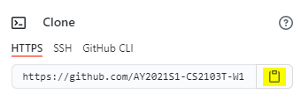

* Table of Contents
{:toc}

--------------------------------------------------------------------------------------------------------------------

## Setting up the project in your computer

:exclamation: **Caution:**

Follow the steps in the following guide precisely. Things will not work out if you deviate in some steps.

You will need to fork the repo if you wish to contribute code to the CliniCal project. If you wish to only download the code without writing code, you can skip to the section for cloning the project.

If you wish to fork the repo:
1. Navigate to the [CliniCal repository on Github](https://github.com/AY2021S1-CS2103T-W11-4/tp).
1. Click on the  button on the top-right hand corner of the page to fork the repository to your account.
1. You should be automatically redirected to the fork on your personal account.

If you with to clone the repo:
1. Install Git.
1. On your page of your fork (or the [CliniCal repository](https://github.com/AY2021S1-CS2103T-W11-4/tp) if you did not fork the repo), click on the  and copy the link to the git repo by clicking on .
1. Navigate to the folder on your computer that you wish to clone the repo to and run the command `git clone (the link you copied earlier)`

If you plan to use Intellij IDEA (highly recommended):
1. **Configure the JDK**: Follow the guide [_[se-edu/guides] IDEA: Configuring the JDK_](https://se-education.org/guides/tutorials/intellijJdk.html) to to ensure Intellij is configured to use **JDK 11**.
1. **Import the project as a Gradle project**: Follow the guide [_[se-edu/guides] IDEA: Importing a Gradle project_](https://se-education.org/guides/tutorials/intellijImportGradleProject.html) to import the project into IDEA. 
  :exclamation: Note: Importing a Gradle project is slightly different from importing a normal Java project.
1. **Verify the setup**:
   1. Run the `seedu.address.Main` and try a few commands.
   1. [Run the tests](Testing.md) to ensure they all pass.

--------------------------------------------------------------------------------------------------------------------

## Before writing code

1. **Configure the coding style**

   If using IDEA, follow the guide [_[se-edu/guides] IDEA: Configuring the code style_](https://se-education.org/guides/tutorials/checkstyle.html) to set up IDEA's coding style to match ours.

   
:bulb: **Tip:**

   Optionally, you can follow the guide [_[se-edu/guides] Using Checkstyle_](https://se-education.org/guides/tutorials/checkstyle.html) to find how to use the CheckStyle within IDEA e.g., to report problems _as_ you write code.
   

1. **Set up CI**

   This project comes with a GitHub Actions config files (in `.github/workflows` folder). When GitHub detects those files, it will run the CI for your project automatically at each push to the `master` branch or to any PR. No set up required.

1. **Learn the design**

   When you are ready to start coding, we recommend that you get some sense of the overall design by reading about [AddressBook’s architecture](DeveloperGuide.md#21-architecture).
