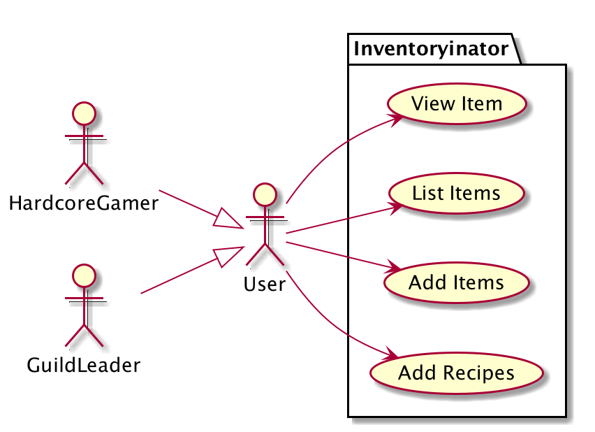

* Table of Contents
{:toc}

# Usecase Documentation
This document will store the **feature usecases** and **workflow usecases** in our designed product `Inventoryinator`.

For more information on how we come up with our Workflow Usecases, please check [Personas](EndUserPersona.md)

### Feature Usecases

#### Usecase 1: Create Item
- Software System: Inventoryinator (`inv`)
- Use Case UC1 - Create Item
- Precondition: Inventoryinator is running
- Actor: User

**MSS:**
1. User enters in input to create an item
2. `inv` validates a correct input
3. `inv` registers the parsed input as a new item
4. `inv` displays successful message of creation of an item

**Extension:**  
2a. `inv` detects a error in given input 
2a1. `inv` returns a `CommandUnsuccessful` message to user 
2a2. User inputs new data 
Steps 2a1-2a2 repeat until data is correct, or user enters a different command.

3b. `inv` detects item already exists 
3b1. `inv` adds quantity of item from command into registered item. 
3b2. `inv` displays that item quantity is updated. 
Usecase ends

#### Usecase 2: View Item

- Software System: Inventoryinator (`inv`)
- Use Case UC2 - View Item
- Precondition: Inventoryinator is running
- Actor: User

**MSS:**
1. User enters in input to view an item
2. `inv` validates that given input conforms to command format
3. `inv` displays the Successful command

**Extensions:**

2a. `inv` detects a error in given input 
2a1. `inv` returns a `CommandUnsuccessful` message to user 
2a2. User inputs new data 
Steps 2a1-2a2 repeat until data is correct, or user enters a different command 
Usecase ends.

#### Usecase 3: Create Recipe
- Software System: Inventoryinator (`inv`)
- Use Case UC3 - Create Recipe
- Precondition: Inventoryinator is running
- Actor: User

**MSS:**
1. User enters in input to create an recipe for an item
2. `inv` validates the user inputs and parses the fields given
3. `inv` creates and registers the recipe for an item
4. `inv` displays the successful message of creation of an recipe

**Extension:** 

2a. `inv` detects a error in given input 
2a1. `inv` returns a `CommandUnsuccessful` message to user 
2a2. User inputs new data 
Steps 2a1-2a2 repeat until data is correct, or user enters a different command.
Usecase resumes from step 3 normally

#### Usecase 4: List items
- Software System: Inventoryinator (`inv`)
- Use Case UC4 - List items
- Precondition: Inventoryinator is running
- Actor: User 

**MSS:**
1. User enters command to list all items
2. `inv` parses command
3. `inv` returns the contents registered

**Extension:**

3a. `inv` does not contain any items 
3a1. Returns a empty List of items 
Usecase end

#### Usecase 5: Crafts items
- Software System: Inventoryinator (`inv`)
- Use Case UC5 - Craft items
- Precondition: Inventoryinator is running, with item a, b and c added in system (UC1)
- With also added recipe r where items a + b -> c (UC3)
- Actor: User 

**MSS:**
1. User enters order to craft **n** of item c from recipe r, with items a, b
2. `inv` validates existance of items a, b, c, and retrieves recipe r
3. `inv` validates quantities of items a, b and evaluates whether **n** of item c can be crafted.
4. `inv` updates the quantities of items a, b and c and returns a message of success.

**Extension:**

2a. `inv` does not have one of items a, b or c 
2a1. `inv` returns a `CommandUnsuccessful` message to the user 
Usecase ends.

3a. `inv` does not have enough quantity of items a or b to craft n quantities of c.
3a1. `inv` returns a `CommandUnsuccessful` message to the user 
Usecase ends.

### Workflow Usecases

#### Workflow Usecase 1:
- Software System: Inventoryinator (`inv`)
- Use Case WU1 - Querying and validating uniqueness of items
- Precondition: Inventoryinator is running, a and b are registered in system already 
- Actor: Hardcore Gamer

**MSS:**
1. User adds 10 of item a and 20 of item b (UC1)
2. User lists items (UC4)
3. `inv` returns item a and item b with quantity increased 10 and 20 respectively

#### Workflow Usecase 2:
- Software System: Inventoryinator (`inv`)
- Use Case WU2 - Crafting Items
- Precondition: Inventoryinator is running, a, b and c are registered in system already,
 recipe producing c is registered in system.
- Actor: Hardcore Gamer

**MSS:**
1. User adds 10 of item a and 20 of item b (UC1)
2. User crafts 10 of item c (UC5)
3. `inv` returns that 10 of item c has been crafted 

