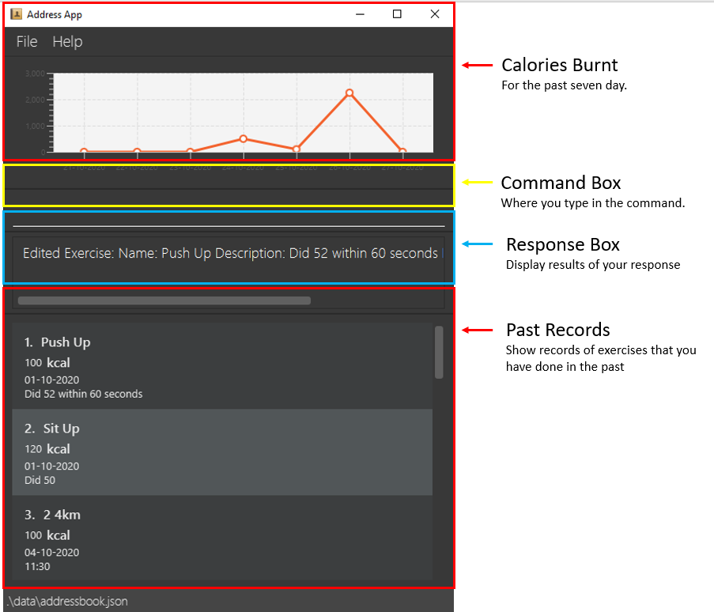
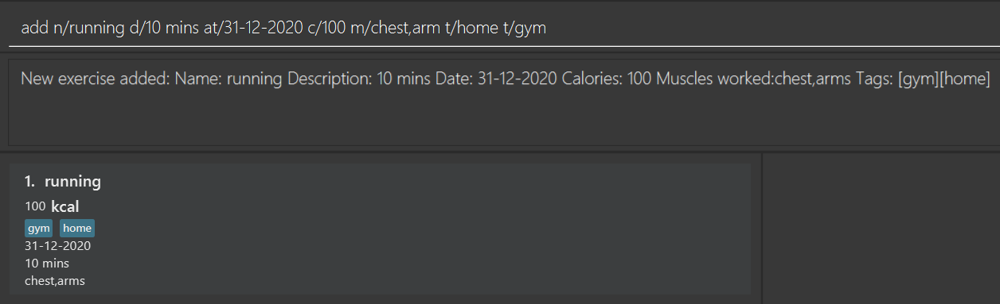
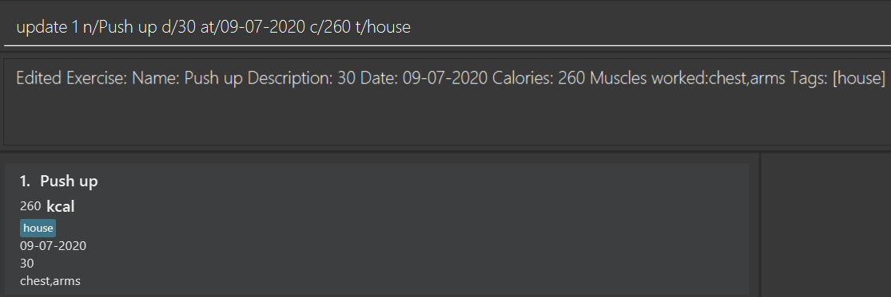
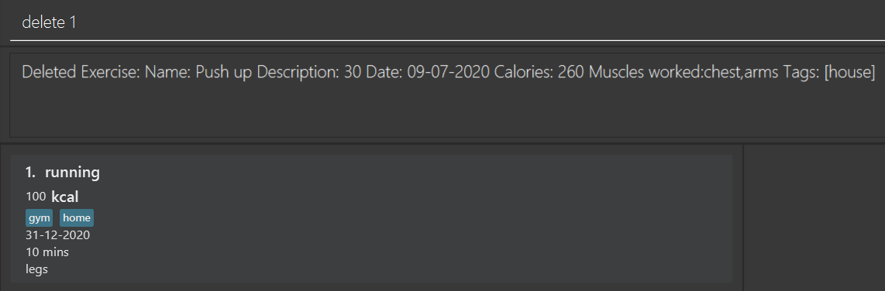
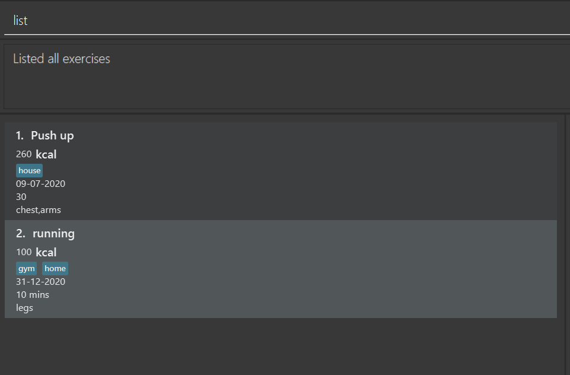
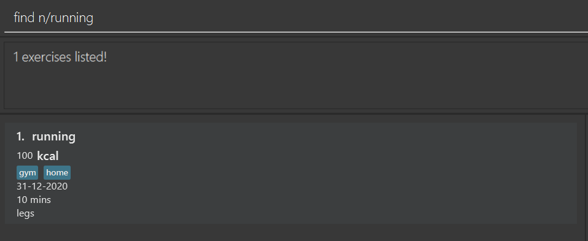
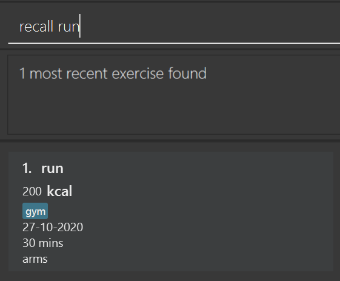

# 1. Welcome
Calo is a desktop app that is **designed for keeping track of calories burnt throughout the day**. It is optimized for use via a **Command Line Interface (CLI)** while still having Graphical User Interface (GUI). If you are a skilled typer, you can carry out various tasks such as adding new exercises and checking records for previous days much faster than the traditional GUI apps.

- [1. Welcome](#1-welcome)
- [2. Quick start](#2-quick-start)
- [3. Features](#3-features)
  - [3.1. Viewing help : `help`](#31-viewing-help--help)
  - [3.2. Add exercises : `add`](#32-add-exercises--add)
  - [3.3. Update exercises : `update`](#33-update-exercises--update)
  - [3.4. Delete : `delete`](#34-delete--delete)
  - [3.5. List: `list`](#35-list-list)
  - [3.6. Find exercises: `find`](#36-find-exercises-find)
  - [3.7. Clearing all entries : `clear`](#37-clearing-all-entries--clear)
  - [3.8. Exiting the program : `exit`](#38-exiting-the-program--exit)
  - [3.9. Save](#39-save)
  - [3.10. Archive : `archive`](#310-archive--archive)
  - [3.11. Recall : `recall`](#311-recall--recall)
  - [3.12. FAQ](#312-faq)
  - [3.13. Command summary](#313-command-summary)

# 2. Quick start

1. Ensure you have Java `11` or above installed in your Computer.

2. Download the latest `Calo.jar`.

3. Copy the file to the folder you want to use as the _home folder_ for your Calo.

4. Double-click the file to start the app. The GUI similar to the below should appear in a few seconds.
   Note how the app contains some sample data.
    
5. Type the command in the command box and press Enter to execute it. For the details of each command, refer to the Features below.

---

# 3. Features

    <b>:information_source: Notes about the command format:</b>

    - Words in `UPPER_CASE` are the parameters to be supplied by the user. 
    e.g. in `add e/EXERCISE c/CALORIES`, `NAME` is a parameter which can be used as `add e/Push Up c/1000`.

    - Items in square brackets are optional. 
    e.g `e/EXERCISE c/CALORIES [at/DATE]` can be used as `e/Push Up c/1000 at/29-09-2020` or as `e/Push Up c/1000`.

    - Items with `…`​ after them can be used multiple times including zero times. 
    e.g. `[t/TAG]…​` can be used as ` ` (i.e. 0 times), `t/gym`, `t/school t/house` etc.

    - Parameters can be in any order. 
    e.g. if the command specifies `e/EXERCISE c/CALORIES`, `c/CALORIES e/EXERCISE` is also acceptable.

## 3.1. Viewing help : `help`

Shows a message that explans how to access the help page.

Format: `help`

## 3.2. Add exercises : `add`

Add an exercise to the application, with calories burnt, muscles worked and tags as optional.

Format: `add n/EXERCISE d/DESCRIPTION at/DATE [c/CALORIES] [m/MUSCLES_WORKED] [t/TAG]..`

- The format for the DATE should be in the form of DD-MM-YYYY.

Examples:
- `add n/running d/10 mins at/31-12-2020 c/100 m/chest,arm t/home t/gym`

## 3.3. Update exercises : `update`

Update an existing exercise.

Format: `INDEX [n/EXERCISE] [d/DESCRIPTION] [at/DATE] [c/CALORIES] [m/MUSCLES_WORKED] [t/TAG]...`
- Edits the workout at the specified `INDEX`. The index refers to the index number shown in the displayed workout list. The index **must be a positive integer** 1, 2, 3, …​
- At least one of the optional fields must be provided.
- Existing values of the exercise will be updated to the input values.
- When editing tags, the existing tags of the exercise will be removed i.e adding of tags is not cumulative.
- You can remove all the exercise's tags by typing t/ without specifying any tags after it.

Examples:
- `update 1 n/Push up d/30 at/09-07-2020 c/260 m/chest,arm t/home t/gym` Updates the exercise, the description, the date, calories burnt, muscles worked, and tags of the 1st exercise to be `push up`, `30`,  `07-09-2020`, `260`, `chest,arm`, and `[home, gym]` respectively.

## 3.4. Delete : `delete`
Deletes an exercise that a user has previously added.

Format: `delete INDEX`

- Deletes an exercise at the specified `INDEX`.
- The index refers to the index number shown in the displayed workout list.
- The index must be a positive integer: 1, 2, 3, …​

Example:
- `delete 2` Deletes the second exercise in the displayed list.

## 3.5. List: `list`
Lists out all the exercises that the user has keyed in.

Format: `list`

## 3.6. Find exercises: `find`
Finds an exercise that matches all the input fields.

Format: `find [n/name] [d/DESCRIPTION] [at/DATE] [c/CALORIES] [k/KEYWORD...]`
- For name, description, date, and calories, only exercises that exactly match the inputs will be listed. These fields are case-sensitive. e.g. Run will not match run.
- For keywords, exercises whose names contain any of the keywords will be listed. Keyword is case-insensitive. e.g Squats will match squats.
- in v1.3, find command does not support muscles and tags.

Example:
- find n/running

## 3.7. Clearing all entries : `clear`

Clears all entries from the address book.

Format: `clear`

## 3.8. Exiting the program : `exit`

Exits the program.

Format: `exit`

## 3.9. Save
The application will save the data automatically to the default file path after any command that changes the data. There is no need to save the data manually.

## 3.10. Archive : `archive`
Archive the data into a different file location.

Format: `archive f/FILE_LOCATION/FILE_NAME.json` 
The file location takes reference from the home folder that the .jar file is located at, unless absolute filepath is specified.

Examples: 
`archive f/data\file_name.json` 

If the file is located at C:\Users\Desktop\App, the archived file will be saved to  C:\Users\Desktop\App\data\file_name.txt.

    <b> Absolute Path </b>: Path that contains root element, e.g. C:\Users\user_name\Desktop\FILE_NAME.json
    <b> Relative Path </b>: Path that are not absolute. E.g. FILE_LOCATION\FILE_NAME.json

#### Add templates : `create`
Adds an exercise template.

Format: `create n/NAME d/DESCRIPTION c/CALORIES`  

Examples: 
- `create n/pushup d/half an hour c/100` Creates the exercise template with the name push up, description half an hour and calories 100.

#### Add an exercise using template : `addt`
Adds an exercise using template.

Format: `addt n/NAME at/DATE [c/CALORIES]`  
- The format for the DATE should be in the form of DD-MM-YYYY.     

- The user can input calorie value to overwrite the default calorie value defined by the template. If the user inputs no calories, then the exercise will have the default calorie value in the template.

Examples: 
- `addt n/pushup at/09-07-2020 c/260` Creates the exercise using the template called pushup with the date 09-07-2020 and calories 260.

- `addt n/pushup at/09-06-2020` Creates the exercise using the template called pushup with the date 09-06-2020 and default calories 100.

## 3.11. Recall : `recall`
Recalls the most recent exercise with the specified name.

Format: `recall NAME`
- the name is case-sensitive. e.g. Push up will not match push up.

Example:
- `recall run` finds the most recent exercise with the name "run".

---
## 3.12. FAQ

*Q*: How do I transfer my data to another Computer? 
*A*: Transfer the file “data” that is contained in the same file as your .jar file from your old computer to your new computer.

*Q*: How to load my archived file? 
*A*: For now, you can delete the `entry.txt` file in the `data` folder and rename the archived file of your choices to `entry.txt`. In subsequent updates, we will introduce a command to load archived files via Command Line Interface.

---

## 3.13. Command summary

| Action     | Format, Examples                                                                                                                                                      |
| ---------- | --------------------------------------------------------------------------------------------------------------------------------------------------------------------- |
| *Add*    | `add n/EXERCISE d/DESCRIPTION at/DATE [c/CALORIES] [m/MUSCLES_WORKED] [t/TAG]..`   e.g., `add n/running d/10 mins at/31-12-2020 c/100 m/chest,arm t/home t/gym` |
*Clear* | `clear`
| *Delete* | `delete INDEX`  e.g., `delete 2`                                                                                                                                   |
| *Update*   | `update INDEX [n/EXERCISE] [d/DESCRIPTION] [at/DATE] [c/CALORIES]​ [m/MUSCLES_WORKED] [t/TAG]..`  e.g., `update 1 n/Push up d/30 at/09-07-2020 c/260 m/chest,arm t/home t/gym`                                           |
| *Find*  | `find [n/name] [d/DESCRIPTION] [at/DATE] [c/CALORIES] [k/KEYWORD...]`  e.g., `find n/running`                                                                                                            |
| *List*   | `list`                                                                                                                                                                |
| *Archive*   | `archive FILE_LOCATION`      e.g.,`archive data\file_name.txt`                                                                                                                                                                    |
*Help* | `help`
*Exit* | `exit`
| *Recall*   | `recall NAME`

