* Table of Contents
{:toc}

--------------------------------------------------------------------------------------------------------------------
## Introduction

Hello, fellow clinic administrative staff.

Welcome to **Hospify**, a desktop application for a digital medical record management solution. With **Hospify**, you will be able to add, edit, find, delete and sort (and more!) patients' medical record and even appointment details. In this user guide, you will learn more about how to get started with **Hospify** and how you can use the key features of the application.

**Hospify** is primarily optimized for use via a Command Line Interface (CLI), which means most features can be used by just typing a single line of command! If you can type fast, you will be able to manage medical records much more efficiently. However, if you are new to **Hospify**, fret not! Read on to find out what **Hospify** can offer.

Before we move on to how to install **Hospify**, let us understand how the user guide works!

To navigate around this user guide, you may use the hyperlinks provided at the top of the page to jump to a particular section that you are interested in. This user guide is divided into 4 major sections: Quick Start, Features (contains sub section, each representing a feature of **Hospify**), Frequently Asked Questions (FAQ) and Command Summary. The following explains the key notations used in this user guide:

1. `text in box` - represents a command, action, input, output or file

1. **:information_source: Notes:** - represents noteworthy important information

1. **:bulb: Tip:** - represents a useful tip

1. **:warning: Important:** - represents important information

## Quick start

Ensure you have Java `11` or above installed in your Computer. If not, you may download Java `11`from [here](https://www.oracle.com/java/technologies/javase-jdk11-downloads.html).

**:information_source: Note on installing Java `11`:** 
There are many versions of Java `11` listed. Select the correct version based on your computer's operating system.

1. Download the latest `hospify.jar` from [here](https://github.com/AY2021S1-CS2103T-W15-3/tp/releases/tag/v1.3.trial). Click on `hospify.jar` to start the download as shown in figure 1.1 below.  
    
    
    Figure 1.1 **Hospify** download page

1. Copy the file to the folder you want to use as the _home folder_ for the **Hospify** app.

1. Double-click the file to start the app. A Graphical User Interface (GUI) similar to the one as shown in figure 1.2 below should appear in a few seconds. Notice that **Hospify** came listed with some sample patients. 
   
   
   Figure 1.2 Start up UI showing list of sample patients

1. You can now try typing your very first command in the command box and press `Enter` to execute it! Not sure what to type? Try typing **`help`** and pressing `Enter`. A help window as shown in figure 1.3 below should appear. 
    
    
    Figure 1.3 Help window
    
   Now, you can try out some other commands:

   * **`list`** : Lists all patients.

   * **`add`**`n/John Doe ic/S1234567A p/98765432 e/johnd@example.com a/John street, block 123, #01-01 mr/www.samplerecord.com/01`: Adds a patient named `John Doe` to **Hospify**.

   * **`delete`**`3` : Deletes the 3rd patient shown in the current list.

   * **`clear`** : Deletes all patients.

   * **`exit`** : Exits the app.

1. You can refer to the [Features](#features) below for a list of all the commands available and the details of each command.

--------------------------------------------------------------------------------------------------------------------

## Features

**:information_source: Notes about the command format:** 

* Words in `UPPER_CASE` are the parameters that you have to provide when typing a command. 
  e.g. in `add n/NAME`, `NAME` is a parameter which can be used as `add n/John Doe`.

* Items in square brackets are optional parameters. 
  e.g `n/NAME [t/ALLERGIES]` can be used as `n/John Doe t/shellfish` or as `n/John Doe`.

* Items with `…`​ after them can be used multiple times (including zero times). 
  e.g. `[t/TAG]…​` can be used as ` ` (i.e. 0 times), `t/shellfish`, `t/shellfish t/grass` etc.

* Parameters can be in any order. 
  e.g. if the command specifies `n/NAME ic/ NRIC p/PHONE_NUMBER`, `p/PHONE_NUMBER n/NAME ic/S1234567A` is also acceptable.

### Displaying usage instructions: `help` (By Peh Jun Siang)

The `help` command shows a list of all the commands and their usages supported by **Hospify**.

Format: `help`

**:bulb: Tip:** You can click on the headers `COMMAND` and `USAGE` to sort the commands in a descending or ascending manner.

**:bulb: Tip:** You can copy the URL of the **Hospify User Guide** to your clipboard to view a more detailed description
for the commands.

### Adding a patient: `add` (by Cedric Lim Jun Wei)

This is a core and basic feature of **Hospify**. This command allows you to add a new patient to **Hospify**. Start by typing the command word `add`, followed by the following items:

1. `n/NAME` : Name of patient

2. `ic/NRIC` : Nric of patient

3. `p/PHONE_NUMBER` : Phone number of patient

4. `e/EMAIL` : Email of patient

5. `a/ADDRESS` : Home address of patient

6. `mr/MEDICAL_RECORD_URL` : Url to the patient's online medical record

7. `t/ALLERGIES` : Known allergies of the patient

**:information_source: Recall:** 

* Items 1 to 6 are compulsory fields that you have to provide. Missing any one of those fields will trigger an error.

* Item 7 is an optional item that you may choose to exclude. In addition, you may choose to include more than one of such item by using `t/ALLERGIES` again.

Let us summarise the information above to a single line of command in the following format.

Format: `add n/NAME ic/NRIC p/PHONE_NUMBER e/EMAIL a/ADDRESS mr/MEDICAL_RECORD_URL [t/ALLERGIES]…​`

:bulb: **Tip:**
A patient can have any number of allergies (including 0)

Let us use some examples (as shown below) to see how this command can actually be used.

Examples:
* `add n/John Doe ic/S1234567A p/98765432 e/johnd@example.com a/John street, block 123, #01-01 mr/www.samplerecord.com/11`
* `add n/Betsy Crowe ic/S9425431A t/shellfish e/betsycrowe@example.com a/Newgate Prison p/1234567 t/grass mr/www.samplerecord.com/02`

When a patient is successfully added to **Hospify**, a success message will appear in the message box, and the patient is shown at the bottom of the list as shown in figure 2.1 below.  

Figure 2.1 Adding a patient (success scenario)

### Listing all patients: `list` (by Cedric Lim Jun Wei)

This command allows you to display the complete list of patients recorded in **Hospify**. This may be useful after you have used the [`find`](#locating-patients-by-name-find) command (which displays a partial list of patients) and you wish to revert back to the complete list of patients again.

To use the command, simply type in `list` on the command line with no additional parameters.

Format: `list`

### Editing a patient: `edit`

Edits an existing patient in **Hospify**.

Format: `edit INDEX [n/NAME] [p/PHONE] [e/EMAIL] [a/ADDRESS] [t/TAG]…​`

* Edits the patient at the specified `INDEX`. The index refers to the index number shown in the displayed patient list. The index **must be a positive integer** 1, 2, 3, …​
* At least one of the optional fields must be provided.
* Existing values will be updated to the input values.
* When editing allergies, the existing allergies of the patient will be removed i.e adding of allergies is not cumulative.
* You can remove all the patient’s allergies by typing `t/` without
    specifying any allergies after it.

Examples:
*  `edit 1 p/91234567 e/johndoe@example.com` Edits the phone number and email address of the 1st patient to be `91234567` and `johndoe@example.com` respectively.
*  `edit 2 n/Betsy Crower t/` Edits the name of the 2nd patient to be `Betsy Crower` and clears all existing allergies.

### Locating patients by name or Nric: `find` (by Gabriel Teo Yu Xiang)

This command allows you to find patients whose names contain any of the given keywords or NRICs.

Format: `find KEYWORD [MORE_KEYWORDS] [NRIC] [MORE_NRICs]`

* The search is case-insensitive. e.g. `hans` will match `Hans`, and `s1234567a` will match `S1234567A`
* The order of the keywords or NRICs does not matter. e.g. `Hans Bo` will match `Bo Hans`
* Both the name and NRIC are searched.
* Patients matching at least one keyword or NRIC will be returned (i.e. `OR` search).
  e.g. `Hans Bo S7654321A` will return `Hans Gruber`, `Bo Yang`, `Tom Lee` (whose NRIC is S7654321A)

**:information_source: Note:** 

* Only full words will be matched e.g. `Han` will not match `Hans`

* Only full NRICs will be matched e.g. `S12345` will not match `S1234567A`

Examples:
* `find John` returns `john` and `John Doe`
* `find alex david` returns `Alex Yeoh`, `David Li` 
  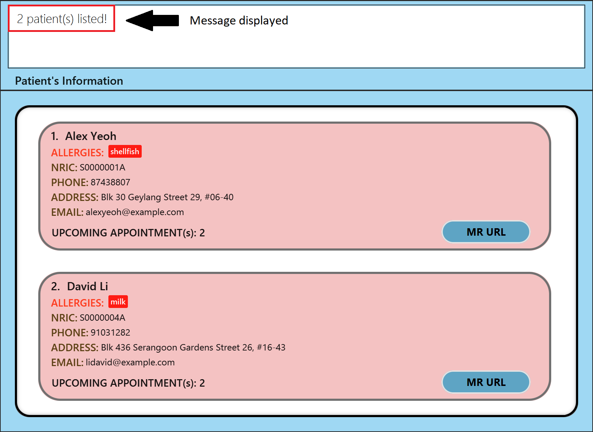

* `find bernice s0000003a` returns `Bernice Yu`, `Charlotte Oliveiro`
  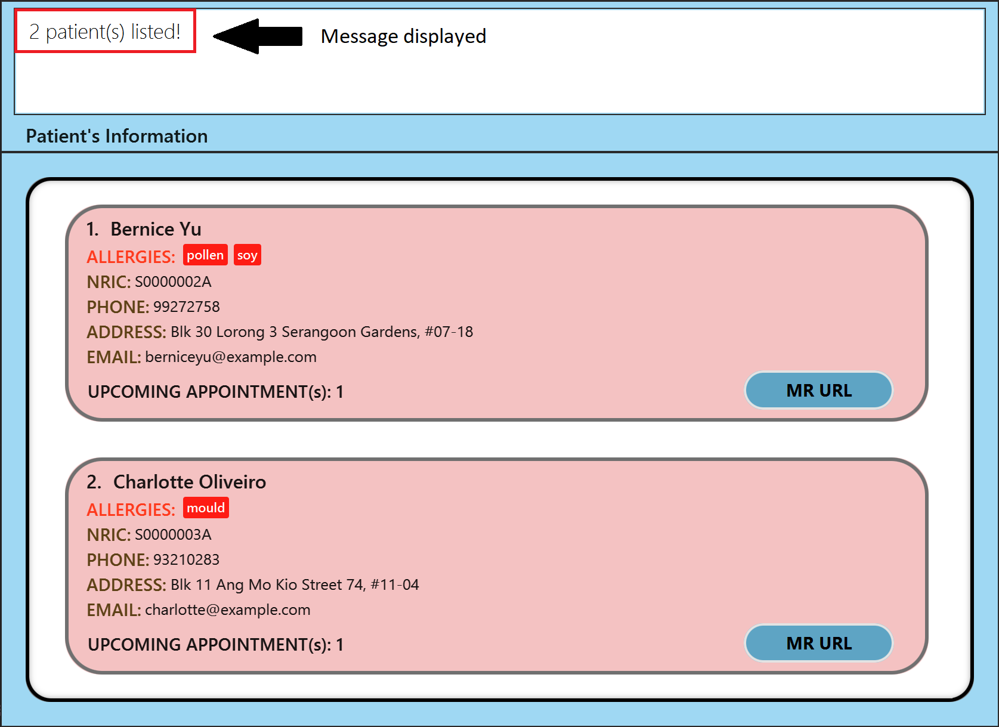

### Deleting a patient: `delete` (by Cao Qin)

Deletes the specified patient from **Hospify**.

Format: `delete INDEX` 
&nbsp; &nbsp; &nbsp; &nbsp; &nbsp; or `delete NRIC`

**:information_source: About the format of `delete` command:** 
* Deletes the patient at the specified `INDEX` or `NRIC`
* The `INDEX` refers to the index number shown in the displayed patient list.
* The `INDEX` **must be a positive integer** 1, 2, 3, …​
* The `NRIC` refers to the `NRIC` of the patient to be deleted.
* The `NRIC` entered is **case-sensitive**. e.g. `s1234567a` will **not** match `S1234567A`
* Only full `NRIC`s will be matched e.g. `S12345` will **not** match `S1234567A`

Examples:

scenario 1:

* `list`(shown in Figure 2.4 below) followed by `delete 2`(shown in Figure 2.5 below) deletes the 2nd patient in **Hospify**.

  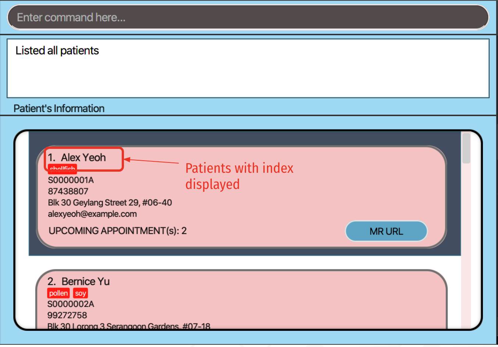
  Figure 2.4 result of `list` command
  
  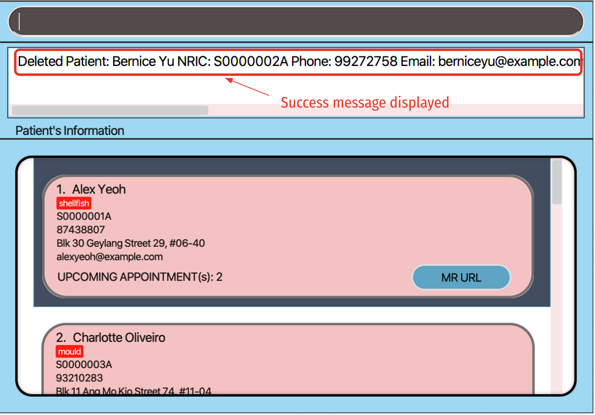
  Figure 2.5 result of `delete 2` command
  
scenario 2:
  
* `find Oliveiro`(shown in Figure 2.6 below) followed by `delete 1`(shown in Figure 2.7 below) deletes the 1st patient in the results of the `find` command.

  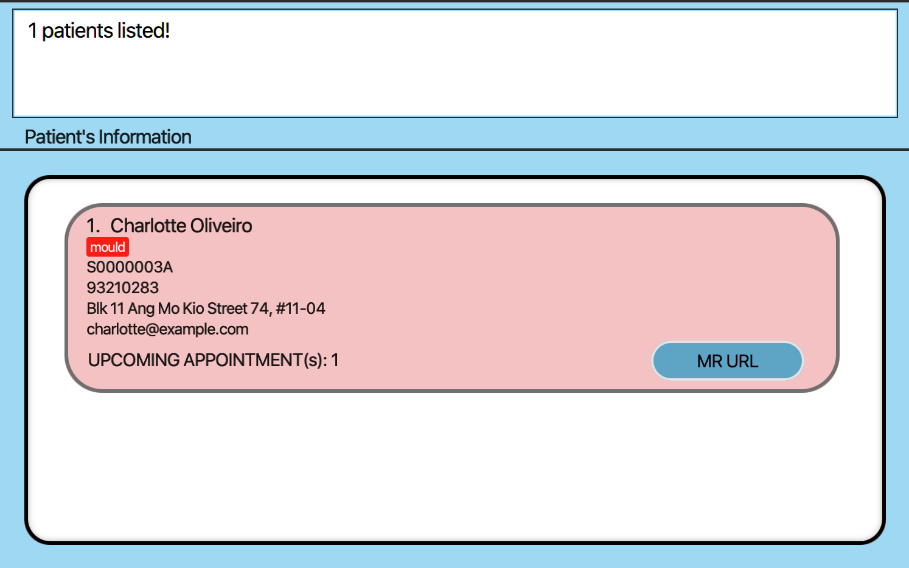
  Figure 2.6 result of `find Oliveiro` command
  
  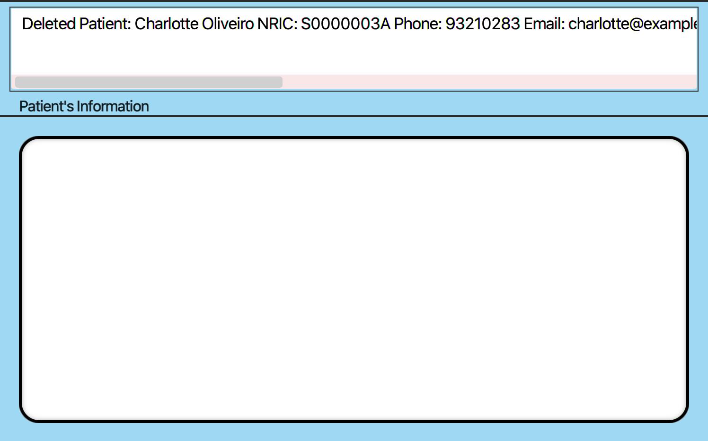
  Figure 2.7 result of `delete 1` command

scenario 3:

* `delete S0000004A`(shown in Figure 2.8 below) deletes `David Li` (whose NRIC is S0000004A).

  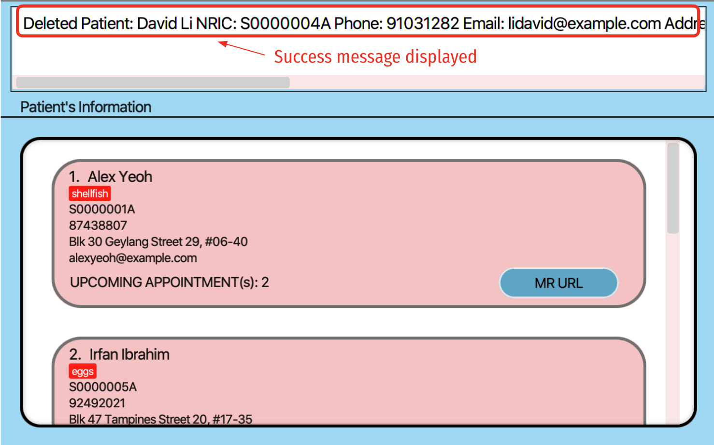
  Figure 2.8 result of `delete S0000004A` command

### Counting total number of patients: `count`

Shows total number of patients recorded in **Hospify**.

Format: `count`

### Sorting the patients: `sort`

Sorts the patients in **Hospify** based on either name or NRIC in ascending order.

Format: `sort name` 
&nbsp; &nbsp; &nbsp; &nbsp; &nbsp; or `sort NRIC`

Examples:
* `sort name` would result in the patients to be sorted by their name in ascending order.
* `sort NRIC` would result in the patients to be sorted by their NRIC in ascending order.

### Showing Appointments of a Patient: `showAppt` (by Peh Jun Siang)

The `showAppt` command shows you all the appointments of a patient in a table for ease of viewing.
Unlike other commands, you can click on the patient's information to show the appointments **without needing to enter any commands**.

1. Using the `GUI`\
You can simply **double click** on the patient to display all the appointments of that patient.
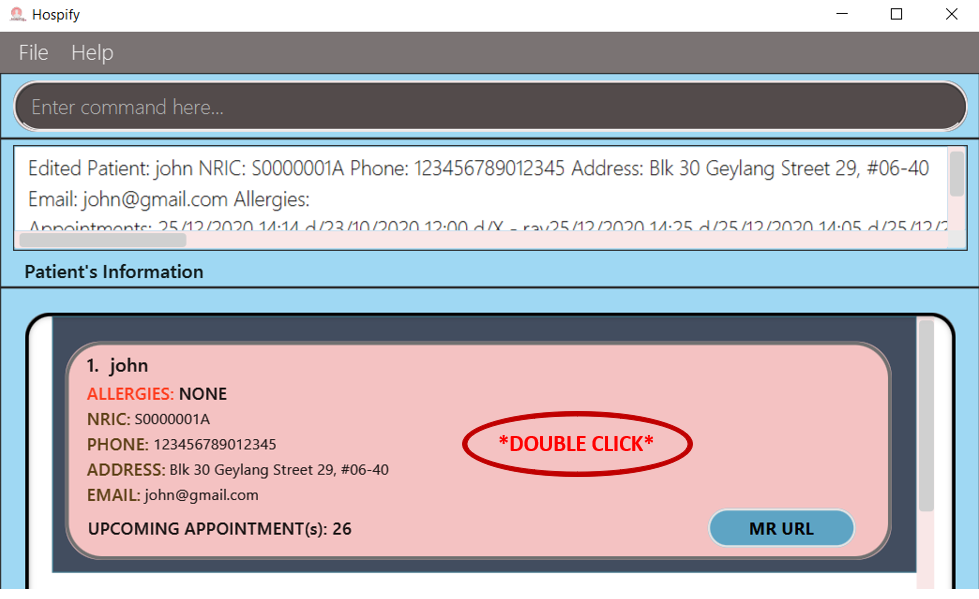

2. Using the `Command Line`\
If the number of patients is too large, it might be difficult to find the patient's information to click.
In that case, you can use the command line to show the patient's appointments.
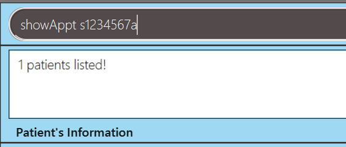

Format: `showAppt NRIC`

Example: `showAppt S1234567A`

### Adding an Appointment: `addAppt` (by Gabriel Teo Yu Xiang)

This command allows you to schedule an `Appointment` for a patient in **Hospify**.

Format: `addAppt NRIC appt/DATE TIME d/DESCRIPTION`

* `NRIC` represents the `NRIC` of the patient you are adding an `Appointment` to.
* `DATE` and `TIME` represent the date and time of the `Appointment` respectively.
* `DESCRIPTION` represents the name or brief description of the `Appointment`.
  e.g. `Eye Check-up` or `Physiotherapy Session`

**:warning: Important:** `DATE` and `TIME` parameters must be specified in the following formats:

- **Date format:**

Format | Example
------ | -------
dd/MM/yyyy | 28/09/2022

- **Time format:**

Format | Example
------ | -------
HH:mm | 20:00

Examples:
* `addAppt S1234567A appt/25/12/2020 15:00 d/Foot Therapy`
* `addAppt S0000001A appt/28/09/2022 20:00 d/Eye Check-up`

When an `Appointment` is successfully added to a patient, a success message will appear in the message box, and the number of upcoming appointments will be updated and reflected as shown in the figure below. 

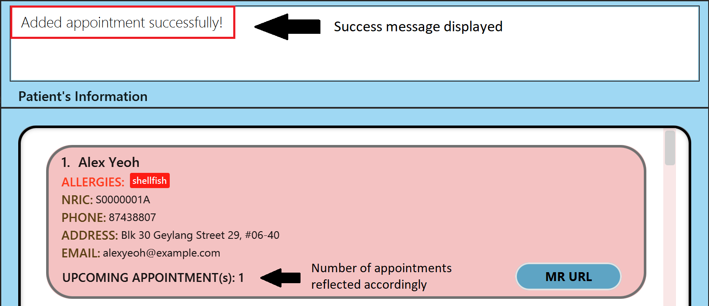

### Editing an Appointment: `editAppt` (by Gabriel Teo Yu Xiang)

This command allows you to edit an existing `Appointment` for a patient in **Hospify**.

Format: `editAppt NRIC oldappt/DATE TIME newappt/DATE TIME`

**:information_source: Note on different appointment parameters:** 

* There are two separate `Appointment` timings specified in the format

* The old `Appointment` timing is preceded by a `oldappt/` prefix

* The new `Appointment` timing is preceded by a `newappt/` prefix

* The `Appointment` to edit must be an existing appointment of the patient.
* Only the date and timing of the `Appointment` can be changed. The name/description cannot be changed.
* `NRIC` represents the `NRIC` of the patient whose `Appointment` you are editing.
* `DATE` and `TIME` formats follow the same format as specified in the [`addAppt`](#adding-an-appointment-addappt-by-gabriel-teo-yu-xiang) command section.

Examples:
* `editAppt S0000001A oldappt/28/09/2022 20:00 newappt/30/09/2022 15:00`

When an `Appointment` is successfully edited, a success message will appear in the message box as shown in the figure below. 

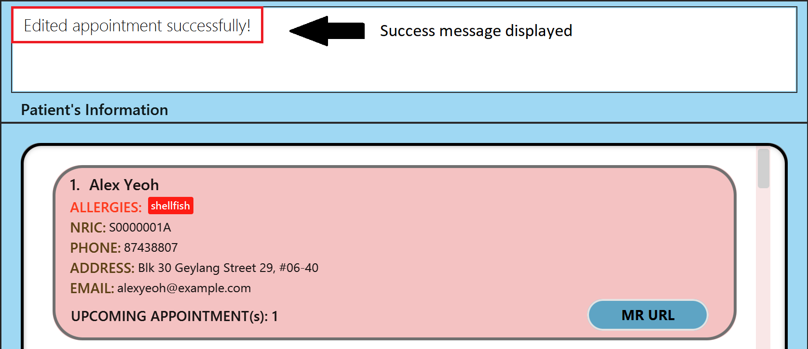

### Deleting an Appointment: `deleteAppt` (by Gabriel Teo Yu Xiang)

This command allows you to delete an existing `Appointment` for a patient in **Hospify**.

Format: `deleteAppt NRIC appt/DATE TIME`

* The `Appointment` to delete must be an existing appointment of the patient.
* The `Appointment` name/description does not need to be specified, since **Hospify** does not allow multiple appointments of the same timing for the same patient, and every appointment will have a unique timing.
* `NRIC` represents the `NRIC` of the patient whose `Appointment` you are deleting.
* `DATE` and `TIME` represent the date and time of the `Appointment` to be deleted.
* `DATE` and `TIME` formats follow the same format as specified in the [`addAppt`](#adding-an-appointment-addappt-by-gabriel-teo-yu-xiang) command section.

Examples:
* `deleteAppt S0000001A appt/28/09/2022 20:00`

When an `Appointment` is successfully deleted, a success message will appear in the message box, and the number of upcoming appointments will be updated and reflected as shown in the figure below. 

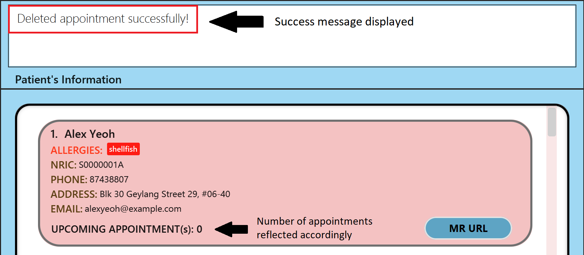

### Using the Medical Record feature: `mr/` (by Cedric Lim Jun Wei)

By now we have learnt that we can [`add`](#adding-a-patient-add-by-cedric-lim-jun-wei) and [`edit`](#editing-a-patient-edit) patients by including the `mr/MEDICAL_RECORD_URL` field. Now, let us explore how we can make use of this feature to edit patients' medical record.

**:information_source: Note on choice of medical record url:** 

* It is helpful to generate the medical record url before adding or editing a patient.

* We recommend using a secure online documenting software to store the patients' medical record for privacy purposes.

In the following example, we will be using [Google Docs](https://docs.google.com) to store the medical record of patient `John Doe`.

1. First, we add patient `John Doe` using [`add`](#adding-a-patient-add-by-cedric-lim-jun-wei) as shown in figure 2.2.1 below. 
    
    .png)
    Figure 2.2.1 Adding patient John Doe
    
1. Next, to copy the medical record url of patient `John Doe` that we have just added, locate the patient in the list and click on the `MR URL` button located on the bottom right corner as shown in figure 2.2.2 below. A `Link Copied!` success message should appear once clicked, indicating that the link has been copied to the system clipboard. 
    
    .png)
    Figure 2.2.2 Copying medical record url of John Doe
    
1. Then, open the web browser of your choice and paste the medical record url onto the search bar as shown in figure 2.2.3 below. 
    
    .png)
    Figure 2.2.3 Pasting medical record url of John Doe onto search bar
    
1. Finally, you can access the medical record of the patient and make edits if applicable. A sample medical record is shown in figure 2.2.4 below for your reference. 
    
    .png)
    Figure 2.2.4 Sample medical record of John Doe on Google Docs

### Clearing all entries: `clear`

Clears all entries from **Hospify**.

Format: `clear`

### Exiting the program: `exit`

Exits the program.

Format: `exit`

### Saving the data

**Hospify** data are saved in the hard disk automatically after any command that changes the data. There is no need to save manually.

### Archiving data files `[coming in v2.0]`

_{explain the feature here}_

--------------------------------------------------------------------------------------------------------------------

## FAQ

**Q**: How do I transfer my data to another Computer? 
**A**: Install the app in the other computer and overwrite the empty data file it creates with the file that contains the data of your previous **Hospify** home folder.

--------------------------------------------------------------------------------------------------------------------

## Command summary

Action | Format, Examples
--------|------------------
**Add** | `add n/NAME ic/NRIC p/PHONE_NUMBER e/EMAIL a/ADDRESS [t/TAG]…​`   e.g., `add n/James Ho ic/S1234567A p/22224444 e/jamesho@example.com a/123, Clementi Rd, 1234665 t/friend t/colleague`
**Clear** | `clear`
**Delete** | `delete INDEX`  e.g., `delete 3`  `delete NRIC`  e.g., `delete S1234567A`
**Edit** | `edit INDEX [n/NAME] [p/PHONE_NUMBER] [e/EMAIL] [a/ADDRESS] [ic/NRIC] [t/TAG]…​`  e.g.,`edit 2 n/James Lee e/jameslee@example.com ic/S1234567A`
**Find** | `find KEYWORD [MORE_KEYWORDS] [NRIC] [MORE_NRICs]`  e.g., `find James Jake`  e.g., `find Curry Davis Heskey S1234567A`
**List** | `list`
**Help** | `help`
**Count** | `count`
