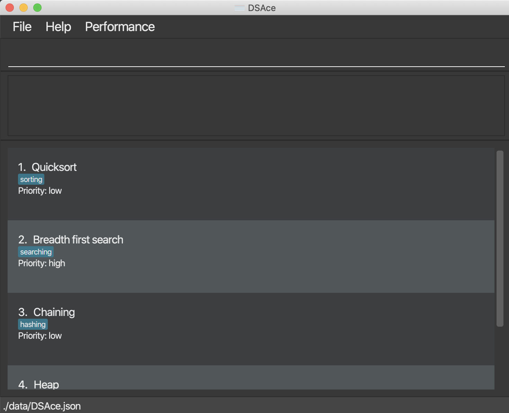
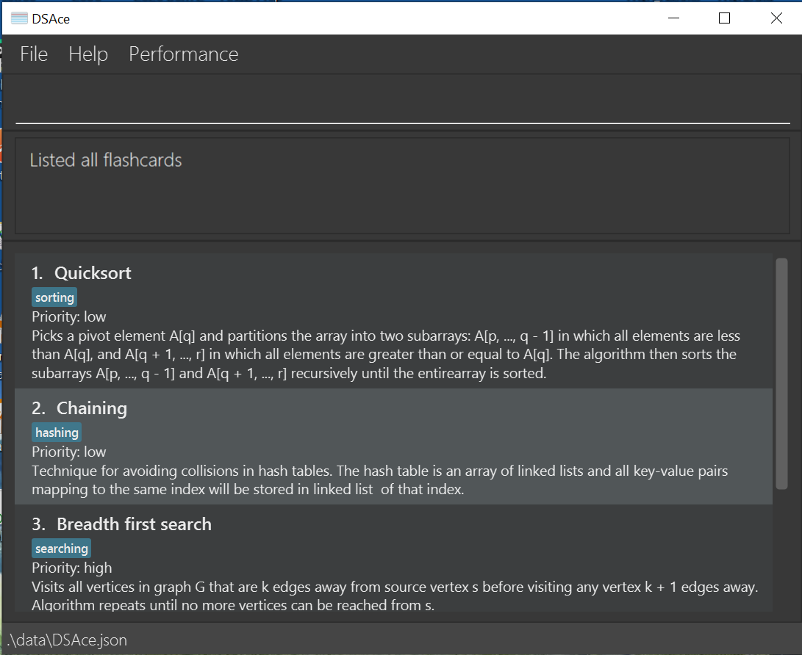
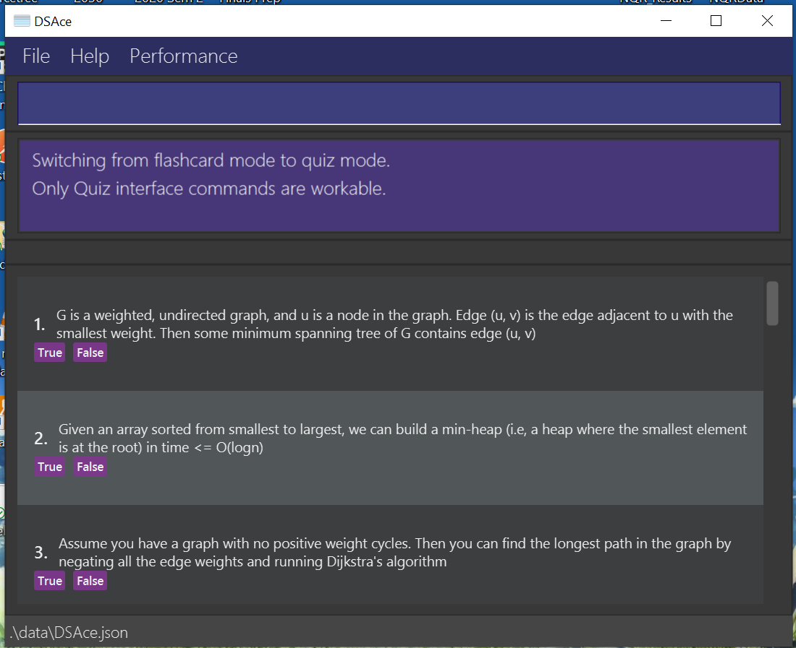
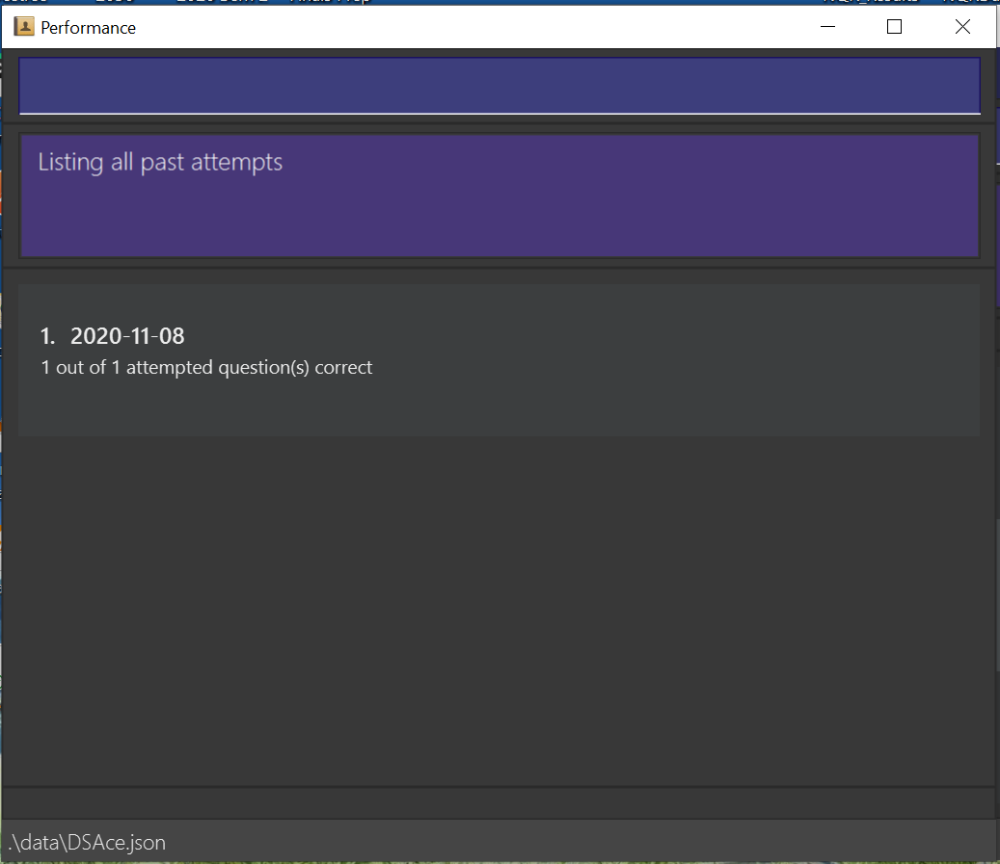
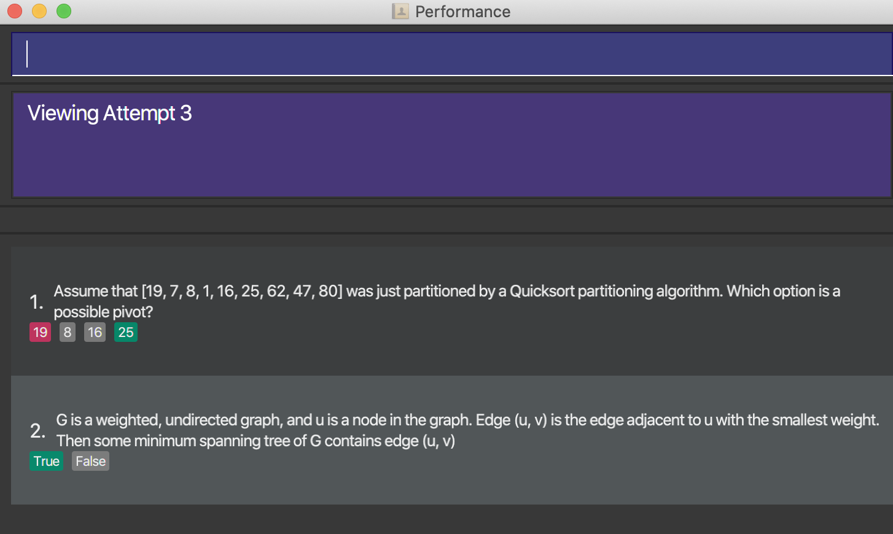

DSAce is a **desktop app for creating flashcards and practising quiz questions for CS2040s, optimized for use via a Command Line Interface** (CLI) while still having the benefits of a Graphical User Interface (GUI). If you can type fast, DSAce can get your revision done faster than traditional GUI apps.

## Table of Contents
* [Quick start](#quick-start)
* [Features](#features)
   * [**`help`** : Viewing help.](#viewing-help--help)
   * [**`add`** : Adding a flashcard.](#adding-a-flashcard--add)
   * [**`list`** : Listing all flashcards.](#listing-all-flashcards--list)
   * [**`sort`** : Sorting all flashcards.](#sorting-all-flashcards--sort)
   * [**`edit`** : Editing a flashcard.](#editing-a-flashcard--edit)
   * [**`find`** : Locating flashcards by name/tag/priority.](#locating-flashcards-by-nametagpriority-find)
   * [**`delete`** : Deleting a flashcard.](#deleting-a-flashcard--delete)
   * [**`flip`** : Flipping a flashcard.](#flipping-a-flashcard--flip)
   * [**`clear`** : Clearing all flashcards.](#clearing-all-entries--clear)
   * [**`enter quiz`** : Entering Quiz mode.](#entering-quiz-mode--enter-quiz)
   * [**`leave quiz`** : Leaving Quiz mode.](#leaving-quiz-mode--leave-quiz)
   * [**`exit`** : Exiting the program.](#exiting-the-program--exit)
   * [**`performance`** : Opening performance interface.](#checking-performance--performance)
   * [**`view`** : Viewing previous an attempt result.](#viewing-a-specific-historical-attempt--view)
   * [**`list`** : List historical attempts.](#listing-historical-attempts-results--list)
   * [Saving the data.](#saving-the-data)
* [FAQ](#faq)
* [Command Summary](#command-summary)

--------------------------------------------------------------------------------------------------------------------

## Quick start

1. Ensure you have Java `11` or above installed in your Computer.

2. Download the latest `dsace.jar` from [here](https://github.com/AY2021S1-CS2103-T14-2/tp/releases).

3. Copy the file to the folder you want to use as the _home folder_ for the DSAce app.

4. Double-click the file to start the app. The GUI similar to the one below should appear in a few seconds.  

   
   
   **NOTE:** DSAce is used for storing flashcards that have a name, definition, tags, and priority level. Whenever the app is started up, the user will not be able to view the definitions of all the flashcards. This is
   so that the flashcards can be used as practice for remembering CS2040S definitions. Hence, in order to view or hide the definitions, the user must use the flashcard flip feature. To learn more about this
   feature, go to this [section](#flipping-a-flashcard--flip).
   
5. Type the command in the command box and press Enter to execute it. e.g. typing **`help`** and pressing Enter will open the help window. 
   Some example commands you can try:

   * **`list`** : Lists all flashcards.

   * **`add`**`n/Insertion Sort d/Worse case: O(n^2)` : Adds a flashcard named `Insertion Sort` to the current list.

   * **`edit`**`1 n/BubbleSort d/Average case: O(n^2)` : Edits the name and definition of the first flashcard in the
   current list to be `BubbleSort` and `Average case: O(n^2)` respectively.

   * **`sort`**`desc` : Sorts all flashcards by descending order of priority.

   * **`find`**`n/Heap` : Finds flashcards with names containing the keyword `Heap`.

   * **`delete`**`3` : Deletes the third flashcard shown in the current list.

   * **`flip`**`2` : Flips the second flashcard shown in the current list.

   * **`clear`** : Deletes all flashcards.

   * **`enter quiz`** : Enters Quiz mode.

      * **`start attempt`** : Starts a new quiz attempt. (command is only valid in the quiz interface)

      * **`answer`** `1 a/true` : Answers the first quiz question. (command is only valid in the quiz interface)

      * **`end attempt`**: Ends the current quiz attempt. (command is only valid in the quiz interface)

   * **`leave quiz`** : Leaves Quiz mode.

   * **`performance`** : Enters the performance window.

     * **`view`** `1` : Views the results of the first quiz attempt. (command is only valid in the performance interface)

     * **`list`** : Lists the results of all past quiz attempts. (command is only valid in the performance interface)

   * **`exit`** : Exits the app.

6. Refer to the three features below for details of each command.

7. All flashcards and data on past quiz attempts will be stored in the home folder.

--------------------------------------------------------------------------------------------------------------------

The DSAce app consists of three distinct interfaces. The first interface is the flashcard interface, where the user can access flashcard-related functionality.
An example of how the flashcard interface appears is shown in the image below.

The second interface is the quiz interface, where the user can attempt quiz questions. An example of how the quiz interface appears is
shown in the image below. Note that the quiz question list cannot be modified by the user.

The third interface is the performance interface, where the user can view the results of past quiz attempts. An example of how the performance interface appears
is shown in the image below. Note that the performance interface can be accessed using two different methods: firstly, by entering the `performance` command in either
the flashcard or quiz interface, and secondly, by clicking on the `performance` option in the top menu bar of either the flashcard or quiz interface.

**:information_source: Notes about the command format:** 
* Listed below are three separate sets of commands for the flashcard, quiz, and performance interfaces. Unless explicitly stated, a command for a particular interface
  will not work in another interface.
   eg: add n/name d/definition cannot be used in the quiz and performance interfaces.  

* Words in `UPPER_CASE` are parameters that must be specified by the user.  
  e.g. in `add n/NAME`, `NAME` is a parameter.
  
* Parameters enclosed in square brackets are optional.  
  e.g. in `add n/NAME [t/HIGH]`, `HIGH` is an optional parameter.

* Parameters can be in any order.  
  e.g. if the command specifies `n/NAME d/DEFINITION`, `d/DEFINITION n/NAME` is also acceptable.
  
* Commands are case-sensitive unless stated otherwise.

## Flashcard interface

* Only commands listed in this section are valid in the flashcard interface.

### Viewing help : `help`

Opens up a help window containing a link to the user guide.

Format: `help`

### Adding a flashcard : `add`

Adds a flashcard to the home folder.

Format: `add n/NAME d/DEFINITION [t/TAG] [p/PRIORITY]`

Examples:
* `add n/Bellman Ford Search d/runtime: O(VE) p/high`
* `add n/Bubble Sort d/runtime: O(n^2) t/sorting t/midterm`

Note:
- Names should only contain alphanumeric spaces and characters, and they should not be blank e.g. `n/breadth-first search` is not allowed.
- Multiple flashcards with the same name are not allowed e.g. `n/Quicksort` is not allowed if there already exists a flashcard with the name `Quicksort`.
- If duplicate tags are specified, only one tag will be added e.g. if `t/sorting t/sorting` is specified, the flashcard will have only one tag with the label `sorting`.
- If multiple tags are added, `t/` must be specified for each and every tag e.g. `t/sorting t/midterm`
- If the priority is not specified, it will be low by default.
- If there are multiple instances of name and/or definition, the one that appears last is taken
- For `name`, `definition`, and `priority`, if there are multiple arguments specified, the last argument will be taken e.g. if `n/Quicksort n/Slowsort d/sort quickly d/sort slowly p/low p/high` is specified,
  the flashcard will have name `Slowsort`, definition `sort slowly`, and priority `high`.

### Listing all flashcards : `list`

Shows a list of all flashcards in the home folder.

Format: `list`

### Sorting all flashcards : `sort`

Sorts all flashcards in the home folder by priority.

Format: `sort [ORDER]`

Note:
* `asc` is specified to sort the flashcards in ascending order of priority i.e. flashcards with `low` priority are displayed
   at the top of the list, and flashcards with `high` priority are displayed at the bottom of the list.
* `desc` is specified to sort the flashcards in descending order of priority i.e. flashcards with `high` priority are displayed
   at the top of the list, and flashcards with `low` priority are displayed at the bottom of the list.
* The order is case-insensitive. e.g `ASC` and `AsC` will both sort in ascending order of priority.
* If no order is specified, the default order is ascending.

Examples:
* `sort ASC` sorts all flashcards in ascending order of priority.
* `sort desc` sorts all flashcards in descending order of priority.

### Editing a flashcard : `edit`

Edits an existing flashcard in the home folder.

Format: `edit INDEX [n/NAME] [d/DEFINITION] [t/TAG] [p/PRIORITY]`

* Edits the flashcard at the specified `INDEX`.
* The index refers to the index number associated with the edited flashcard, as shown in the displayed flashcard list.
* The index **must be a positive integer** 1, 2, 3, …​
* At least one of the optional fields must be provided.
* Existing values will be updated to the input values.
* When editing tags, the existing tags of the flashcard will be removed i.e adding of tags is not cumulative.
* You can remove all the flashcard’s tags by typing t/ without specifying any tags after it.

Examples:
* `list` followed by `edit 1 n/BubbleSort d/Average case: O(n^2)` edits the name and definition of the 1st flashcard to
   be `BubbleSort` and `Average case: O(n^2)` respectively.
* `list` followed by `edit 2 n/SelectionSort t/` edits the name of the 2nd flashcard to be `SelectionSort` and clears
 all existing tags.
* `list` followed by `edit 3 p/high` edits the priority of the 3rd flashcard to be `high`.

Note:
- To edit multiple tags, each of them requires its own label e.g `t/sorting t/midterm`
- If there are multiple instances of name and/or definition, the one that appears last is taken
  e.g second will be the name of `n/first n/second`

### Locating flashcards by name/tag/priority: `find`

Finds flashcards with names, tags or priorities containing any of the given keywords.

Format: find `[n/KEYWORD]​` `[t/KEYWORD]​` `[p/KEYWORD]​`

* All `find` operations are done on the original flashcards list which contains all flashcards.
* The search is case-insensitive. e.g `sort` will match `Sort`
* The order of the keywords does not matter. e.g. `runtime sort` will match `sort runtime`
* Names, tags or priorities will be searched according to input prefixes.
* Only full words will be matched e.g. `sort` will not match `sorting`
* Only flashcards matching all keywords will be returned (i.e. `AND` search).

Examples:

* `find n/Quicksort` returns `Quicksort`
* `find n/Chaining t/hashing` returns `Chaining`
* `find n/Heap p/medium` returns `Heaps`
* `find n/Heap p/low` or `find n/Chaining t/metal` returns no flashcards because not all conditions are satisfied

### Deleting a flashcard : `delete`

Deletes the specified flashcard from DSAce folder.

Format: `delete INDEX`

* Deletes the flashcard at the specified `INDEX`.
* The index refers to the index number associated with the deleted flashcard, as shown in the displayed flashcard list.
* The index **must be a positive integer** 1, 2, 3, …​

Examples:
* `list` followed by `delete 2` deletes the 2nd flashcard in the folder.

### Flipping a flashcard : `flip`

Flips the specified flashcard from DSAce folder.

Format: `flip INDEX`

* Flips the flashcard at the specified `INDEX`.
* The index refers to the index number associated with the flipped flashcard, as shown in the displayed flashcard list.
* The index **must be a positive integer** 1, 2, 3, …​
* The flashcard will not stay flipped upon user exiting and re-entering the app.

Examples:
* `list` followed by `flip 2` flips the 2nd flashcard in the folder.

### Clearing all entries : `clear`

Clears all entries from the flashcards folder.

Format: `clear`

### Entering Quiz mode : `enter quiz`

Enters quiz mode and disables all commands in flashcard mode.

Format: `enter quiz`

### Checking performance : `performance`

Opens a new window of performance where historical attempts are stored.

Format: `performance`

### Exiting the program : `exit`

Exits the program.

Format: `exit`

## Quiz interface

* Command line below are only workable under quiz interface.

### Starting an attempt : `start attempt`

Starts an attempt of the set of questions.

Format: `start attempt`

### Answering quiz questions : `answer`

Answers the specific indexed quiz question.

Format: `answer INDEX a/ANSWER`

* For True/False questions, answer in true/false. (case-insensitive)
* For MCQ questions, answer in positive integer as labelled in the quiz list.

Examples:
For True/False questions, type e.g `answer 1 a/true` or `answer 1 a/TrUe` or `answer 1 a/false`
For MCQ questions, type e.g `answer 2 a/1` for option 1 or `answer 2 a/2` for option 2. Invalid out of bounce index will not be recorded.

### Ending an attempt : `end attempt`

Ends the current quiz attempt and stores the results in Performance.

Format: `end attempt`

* For `end attempt` to be a valid command, there must already be an ongoing quiz attempt.
* If `end attempt` is entered without answering any quiz questions, the current quiz attempt will end but no results will be stored in Performance.

### Checking performance : `performance`

Opens a new window of performance where historical attempts are stored.

Format: `performance`

### Viewing help : `help`

Shows a message explaining the features of the app, and the format of the command associated with each feature.

Format: `help`

### Leaving Quiz mode : `leave quiz`

Leaves quiz mode and disables all commands in quiz mode.

Format: `leave quiz`

### Exiting application : `exit`

Exits the programme.

Format: `exit`

## Performance interface

* Command line below are only workable under perfomance interface.

### Listing historical attempts results: `list`

Shows a list of previous attempts and result statistic.

Format: `list`

### Viewing a specific historical attempt : `view`

Shows the quiz questions attempted. Red options indicate wrong answer input and green options indicate correct answer/input.

Format: `view INDEX`

Example: Index input must start from 1. Out of bounce index will not be recorded. e.g `view 1`

### Viewing help : `help`

Shows a message explaining the features of the app, and the format of the command associated with each feature.

Format: `help`

### Exiting application : `exit`

Exits the programme.

Format: `exit`

### Saving the data
DSAce data is saved in the DSAce folder automatically after any command that changes the data is entered. There is no need to save the data manually.

### FAQ
Q: How do I transfer my data to another Computer?  
A: Install the app in the other computer and overwrite the empty data file it creates with the file that contains the data of your previous DSAce home folder.

--------------------------------------------------------------------------------------------------------------------

## Command summary

Action | Format, Examples
--------|------------------
**Add** | `add n/NAME d/DEFINITION [t/TAG] [p/PRIORITY]`   e.g., `add n/Bellman-Ford Search d/runtime: O(VE)`
**Clear** | `clear`
**Sort** | `sort [ORDER]`   e.g., `sort ASC`
**Delete** | `delete INDEX`   e.g., `delete 3`
**Flip** | `flip INDEX`   e.g., `flip 2`
**Edit** | `edit INDEX [n/NAME] [d/DEFINITION] [t/TAGS] [p/PRIORITY]`   e.g., `edit 1 n/BubbleSort d/Average case: O(n^2) p/low`
**Find** | `find [n/KEYWORDS] [t/KEYWORD​S] [p/KEYWORD​S]​`   e.g., `find n/BellmanFord Search`
**List** | `list` (flashcard interface)
**Help** | `help`
**Exit** | `exit`
**Enter Quiz** | `enter quiz`
**Start attempt**  | `start attempt`
**Answer** | `answer INDEX a/ANSWER`   e.g., `ansewer 1 a/true` for True/False questions and `ansewer 2 a/1` for MCQ questions
**End attempt**  | `end attempt`
**Leave Quiz** | `leave quiz`
**Performance** | `performance`
**List** | `list` (performance interface)
**View** | `view INDEX`   e.g., `view 1`
