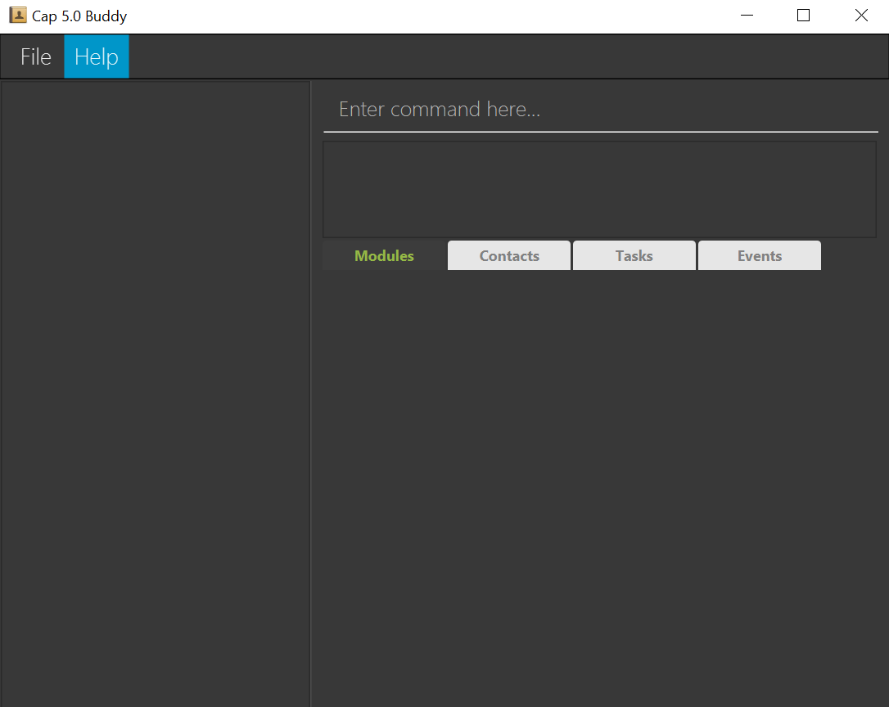

Cap 5.0 Buddy helps NUS SoC students to keep track of their module details efficiently. 
It helps you to centralize key module details, contacts and information while following your study progress through a Command Line Interface (CLI).

* Table of Contents
{:toc}

--------------------------------------------------------------------------------------------------------------------

## Quick start

1. Ensure you have Java `11` or above installed in your Computer.

1. Download the latest `cap5buddy.jar` from [here](https://github.com/AY2021S1-CS2103T-F12-3/tp/releases).

1. Copy the file to the folder you want to use as the _home folder_ Cap 5 Buddy application.

1. Double-click the file to start the app. The GUI similar to the one below should appear in a few seconds.  
   

--------------------------------------------------------------------------------------------------------------------

## Features

**:information_source: Notes about the command format:** 

* Words in `UPPER_CASE` are the parameters to be supplied by you. 
  e.g. in `addtask n/NAME`, `NAME` is a parameter which can be used as `addtask n/Week 11 quiz`.

* Items in square brackets are optional. Items without square brackets are compulsory fields.  
  e.g. `addtask n/NAME [p/PRIORITY]` can be used as `addtask n/Week 11 quiz p/highest` or as `addtask n/Week 11 quiz`
  
* Items with `...` after them can be used multiple times, including zero times.  
  e.g. `[t/TAG]...` can be used as ` ` (i.e. 0 times), `t/easy`, `t/friend t/important` etc.
  
* Argument parameters can be provided in any order.
  e.g. if the command specifies `addtask n/NAME [p/PRIORITY]`, `addtask [p/PRIORITY] n/NAME` is also acceptable.  
  
* If you enter duplicate parameters when the command format does not expect multiple occurrence of the same parameter, i.e. 
  parameters without `...` at the back in the command format (e.g. n/NAME), the application will only consider the argument of the last 
  occurring duplicate parameter. 
  e.g. in `addtask n/Week 11 quiz n/Lab assignment`, `n/Week 11 quiz` will be ignored and a task with the name `Lab assignment` will be added.

### Module Features

#### Adding a new module: `addmodule`

Creates and add a new module to be stored in the system.

  Format: `addmodule` `n/MODULE_NAME`
  
  * You can only key in the module code for the `MODULE_NAME`.
  
  * The module code you input must be **capitalised**, eg. `cs2103t` will be rejected while `CS2103T` is correct.
   
   Example:
   * `addmodule CS2103T` creates and add the module CS2103T with no zoom link.

#### Viewing a module: `viewmodule`

Views a module stored in the system.

 Format: `viewmodule` `INDEX`

  * The module viewed will be at the `INDEX` position of the current displayed list.
  
  * The index refers to the index number of the module shown on the displayed module list. 
  
  * The index **must be a positive integer** 1, 2, 3...

  Examples:
   * `viewmodule 1` views the first module in the displayed list.

#### Adding a zoom link for a specific lesson to a module: `addzoom`

Adds a zoom link for a specific lesson to an existing module.

  Format: `addzoom INDEX n/LESSON_NAME z/ZOOM_LINK`
  
   * Adds a zoom link to the module at the specified `INDEX`. 
   
   * The index refers to the index number of the module shown on the displayed module list. 
   
   * The index **must be a positive integer** 1, 2, 3...
   
   * The zoom link provided must be a link that uses the NUS domain. A typical zoom link that is under the NUS domain
     would start with: `https://nus-sg.zoom.us/`. Zoom links that do not belong to the NUS domain would not be accepted.

  Example:
  `addzoom 1 n/lecture z/https://nus-sg.zoom.us/j/auya7164hg` Adds a zoom link `https://nus-sg.zoom.us/j/auya7164hg` to the first module
   in the displayed module list for the lesson `lecture`.
  

#### Deleting a module: `deletemodule`

Deletes a module in the displayed module list.

 Format: `deletemodule` `INDEX`
 
   * The index **must be a positive integer** 1, 2, 3...
   
   * The index refers to the index number of the module shown on the displayed module list. 
   
  Examples:
  * `deletemodule 1` deletes the module at position `1`

#### Editing a module : `editmodule`

Edits an existing module in the displayed module list with new details.

 Format: `editmodule` `INDEX` `[n/MODULE_NAME]` `[mc/MODULAR_CREDITS]` `[gp/GRADE_POINT]` `[t/TAG]...`

  * Edits the details of the module at position `INDEX` with the optional fields listed.
  
  * The index **must be a positive integer** 1, 2, 3...
  
  * At least **one** of the optional fields `[MODULE_NAME]`, `[MODULAR_CREDITS]` or `[GRADE_POINT]` must be present.

  * You can add `[TAG]`s to a module through this command,eg. `Tutorial`.
  
 Examples:
  * `editmodule 1 n/CS2030` edits the `MODULE_NAME` for a module at index `1` to `CS2030`.
  
  * `editmodule 3 mc/8 gp/4.5` edits the `MODULAR_CREDITS` and `GRADE_POINT` for the module at index `3` to `8.0` 
  modular credits and the grade points to `4.5`.
  
 To be implemented:
  * We are working on adding the functionality to edit the zoom links for the module for each lesson. 

#### Adding assignment to a module: `addassignment`

  Adds an assignment to an existing module.

  Format: `addassignment` `n/MODULE_NAME` `a/ASSIGNMENT_NAME` `%/ASSIGNMENT_PERCENTAGE` `r/ASSIGNMENT_RESULT`

  * Adds an assignment `ASSIGNMENT_NAME` to a module `MODULE_NAME`
   
  * The assignment takes up a percentage of the final grade, `ASSIGNMENT_PERCENTAGE`.
  
  * Your `ASSIGNMENT_RESULT` must be converted to a decimal from `0.00 - 1.00`

  Example of usage:
  `addassignment n/CS2100 a/Quiz 1 %/5 r/0.80` adds an assignment called `Quiz 1` to the module `CS2100`. `Quiz 1` 
  carries `5`% of the final grade and the result for this assignment is `80/100`.
  
#### Editing an assignment in a module: `editassignment`

  Edits an assignment at the specified position in the specified module. 

  Format: `editassignment` `INDEX` `n/MODULE_NAME` `[a/ASSIGNMENT_NAME]` `[%/ASSIGNMENT_PERCENTAGE]` 
  `[r/ASSIGNMENT_RESULT]`
  
  * The fields that can be edited are the `ASSIGNMENT_NAME`, `ASSIGNMENT_PERCENTAGE` of the final grade 
  and `ASSIGNMENT_RESULT`.
  
  * At least **one** of the optional fields must be present.
  
  * The index **must be a positive integer** 1, 2, 3...
  
  * Your new `ASSIGNMENT_RESULT` must be converted to a decimal from `0.00 - 1.00`

  Example of usage:
   `editassignment 1 n/CS2100 a/Quiz 1` edits the assignment at position `1` of the module `CS2100` with a new 
   assignment name, `Quiz 1`. 
   `editassignment 1 n/CS2100 %/20 r/0.80` edits the assignment at position `1` of the module `CS2100` with a new 
   assignment percentage, `20`% of the final grade, and a new assignment result, `0.80`.   

### Todo List Features

Todo List can store all of your tasks that you need to complete. Before you start learning how to use the commands
for Todo List, you should first understand the details of a task.

#### What is a Task ? : `Task`

A task contains 5 type of information that can be useful when you are tying to track all the things that you need to do.
Below are the explanations for each information that you can add to a task.

* **`TASK_NAME`**

  * Represents the name of the task which can be a short description.
  
  * Can only consist of 30 characters.
  
  * _**Tips :**_ You can set the `TASK_NAME` to be short and clear, for instance, you can name the task as "Finish Lab09".
    this way, you can read through the list much faster.
    
* **`TAG`**

  * Represents a single-word (tag) that can help describe the type of the task.
  
* **`PRIORITY`**

  * Represents how important the task is.
  
  * You can choose 4 **pre-defined** priority level, which are,
    * `HIGHEST`
    * `HIGH`
    * `NORMAL`
    * `LOW`
    
* **`DATE`**

  * You can use `DATE` based on your need, for instance, you can set the `DATE as the deadline of a task or
    a target deadline that is earlier than the real deadline. It's all up to you.
    
* **`STATUS`**

  * Represents the progress status of a task.
  
  * Only have two value which are `Completed` or `Note Completed`.
  
  * When you create a new task, it will have a status of `Not Completed` by default.

#### Adding a task: `addtask`

Adds a task to the list.

Format: `addtask` `n/TASK_NAME` `[t/TAG]...` `[p/PRIORITY]` `[d/DATE]`

* All fields except `TASK_NAME` are **optional**.

* The order of the input does not matter.

* `TASK_NAME` should not be longer than **30 characters**.

* You can provide more than one `TAG` e.g. `t/LAB t/DAILY`.

* You can choose 4 level of `PRIORITY` i.e. `HIGHEST`, `HIGH`, `NORMAL`, `LOW`.

* Input for `PRIORITY` is not case-sensitive e.g. `highest`, `Highest` work fine.

* `Date` must be in the form of `YYYY-MM-DD` e.g. `2020-12-20`.

Examples: 

* `addtask n/read book t/DAILY t/HOBBY p/low d/2020-10-10` adds a task with the given input.

* `addtask n/finish assignemnt t/SCHOOL d/2020-12-10` adds a task with the given input.

#### Deleting a task: `deletetask`

Deletes a task from the list.

Format: `deletetask` `INDEX`

* You can get the `INDEX` from the current displayed list under the `Tasks` tab.

* Index must be a **positive integer**.

Examples:

* `deletetask 1` deletes the first task in the list.

* `deletetask 2` deletes the second task in the list.

#### Editing a task: `edittask`

Edits a task in the list.

Format: `edittask` `INDEX` `[n/TASK_NAME]` `[t/TAG]...` `[p/PRIORITY]` `[d/DATE]`

* You can get the `INDEX` from the current displayed list under the `Tasks` tab.

* `INDEX` must be a **positive integer**.

* The order of the input does not matter.

* At least one field must not be empty.

* `TASK_NAME` should not be longer than **30 characters**.

* Editing the `TAG` will overwrite all the current `TAG`s.

Examples:

* `edittask 1 n/read chapter 5 p/HIGH` edits the first task name to `read chapter 5` and
and the priority to `HIGH`.

* `edittask 2 n/read tutorial d/2020-11-04` edits the second task name to `read tutorial` and
and the `DATE` to `2020-11-04`.

#### Locating tasks: `findtask`

Finds all tasks that fulfil all the provided search criteria.

Format: `findtask [n/NAME_KEYWORDS] [d/DATE] [p/PRIORITY] [t/TAG_KEYWORDS]` 

 * The search is case-insensitive, e.g. `lab` will match `Lab`.
 
 * When you are providing name or tag keywords, separate distinct keywords with a whitespace, 
   e.g. `findtask n/lab quiz` will search for tasks using the 2 distinct keywords `lab` and `quiz`.
   
 * You should ensure that search arguments are not blank and at least one search parameter should be provided.
 
 * Search Parameters:
 
   * Task Name
 
     * You are allowed to provide multiple name keywords.
     
     * Tasks with their name matching at least one of the name keywords provided will be considered to have fulfilled the task name search criteria.
     
     * The order of the search keywords does not matter, e.g. `Lab Quiz` will match `Quiz Lab`.
     
     * Only full words will be matched, e.g. `lab` will match `lab assignment` but not `labs`.
     
   * Date
   
     * Your search date should be of the format: `YYYY-MM-DD`.
     
     * You should only provide one search date, i.e. `d/2020-01-01 2020-02-02` would not be accepted.
     
     * Tasks with their date matching the search date exactly are considered to have fulfilled the task date search criteria.
     
   * Priority
   
     * Your search priority should be one of the following: `highest`, `high`, `normal`, `low` (case-insensitive). 
       No other search priority will be allowed.
       
     * You should only provide one search priority, i.e. `p/highest low` is not allowed.
     
     * Tasks with their priority matching the search priority exactly are considered to have fulfilled the task priority search criteria.
     
   * Tag
 
     * You are allowed to provide multiple tag keywords.
     
     * Task tags will be considered a match only if the tag words are an exact match.
     
     * Tasks containing tags which match at least one of the tag keywords provided will be considered to have fulfilled the task tag search criteria.
       
 * Only tasks matching all search parameters provided will be returned.      
 
 Examples:
 
  * `findtask n/lab` returns all tasks with the word `lab` in their name
 
  * `findtask d/2020-10-10 p/HIGHEST` returns all tasks with the date `2020-10-10` **and** `highest` priority
  
  * `findtask t/difficult online` returns all tasks that have the `difficult` or `online` tag 
  
  * `findtask n/lab quiz t/difficult` returns all tasks with their name containing **either** 
     the word `lab` or  `quiz` **and** has `difficult` as one of its tags

#### Marking a task as completed: `completetask`

Labels a task as `Completed`.

Format: `completetask` `INDEX`

* You can get the `INDEX` from the current displayed list under the `Tasks` tab.

* `INDEX` must be a **positive integer**.

* _**Tips :**_ You can change back the status to `Not Completed` by using either the `undo` or `resettask` command.

Examples:

* `completetask 1` labels the first task in the list as `Completed`.

* `completetask 2` labels the second task in the list as `Completed`.

#### Resetting a task: `resettask`

Reset the status of a task back to `Not Completed`.

Format: `resettask` `INDEX`

* You can get the `INDEX` from the current displayed list under the `Tasks` tab.

* `INDEX` must be a **positive integer**.

Examples:

* `resettask 1` reset the first task in the list.

* `resettask 2` reset the second task in the list.

#### Sorting tasks: `sorttask`

Sorts the list based on a criterion.

Format: `sorttask` `[r]` `CRITERION`

* `r` indicates if the sorted list should have reversed order, for example, if `sorttask priority` sorts
  the list from the highest priority to the lowest priority then `sorttask r priority` will sort the list
  from the lowest to the highest priority instead.
  
* `r` is **optional**.

* `CRITERION` is **pre-defined**, you can choose `NAME`, `PRIORITY`, or `DATE`.

* `CRITERION` is not case-sensitive e.g `priority, PRIORITY` work fine.

Examples:

* `sorttask date` sorts the task from the task with the closest date to the current date to.

* `sorttask r date` sorts the task from the task with the farthest date from the current date.

#### Listing all tasks: `listtask`

List all the tasks on the list and resets ordering.

Format: `listtask`

* _**Tips :**_ You can use `listtask` to go back to the original list after 
  performing a `findtask` or `sorttask` command.

#### Archiving a task: `archivetask` **(To be implemented)**

Archives a task from the list.

Format: `archivetask` `INDEX`

* You can get the `INDEX` from the current displayed list under the `Tasks` tab.

* `INDEX` must be a **positive integer**.

Examples: 

* `archivetask 1` archive the first task.

* `archivetask 2` archive the second task.

#### Clearing the list: `cleartask`

Clears all tasks in the list.

Format: `cleartask`

* _**Tips :**_ If you accidentally cleared the whole list, you can always use the `undo` command
  to restore the list.

### Contact List Features

#### Adding a contact: `addcontact`

Adds a new contact into the contact list if it does not already exist.

Format: `addcontact n/NAME e/EMAIL [te/TELEGRAM] [t/TAG]...`
   
 * The `TELEGRAM` field provided must start with the `@` symbol and must be a valid telegram username,
   i.e. at least 5 characters long, not including the `@` symbol and contains only alphanumeric characters or underscore
 
 * A contact can have any number of tags (including 0)

Examples:

 * `addcontact n/john e/john@gmail.com`
 * `addcontact n/amy e/amy@gmail.com te/@anytele`
 * `addcontact n/bob e/bob@gmail.com t/friend`
 
 
 #### Locating contacts: `findcontact`
 
 Finds all contacts that fulfil all the provided search criteria.
 
 Format: `findcontact [n/NAME_KEYWORDS] [t/TAG_KEYWORDS]`
 
  * The search is case-insensitive, e.g. `bob` will match `Bob`.
  
  * You are allowed to provide multiple search keywords for both the name and tag parameter.
  
  * The order of the search keywords does not matter, e.g. `Bob Abramham` will match `Abraham Bob`.
  
  * When you are providing name or tag keywords, separate distinct keywords with a whitespace, 
    e.g. `findcontact n/bob abraham` will search for contacts using the 2 distinct keywords `bob` and `abraham`.
    
  * Only full words will be matched, e.g. `Bob` will match `Bob Abraham` but not `Bobs`.
    
  * You should ensure that keywords are not be blank and at least one search parameter should be provided.
  
  * Search Parameters:
  
    * Name
  
      * Contact with a name matching at least one of the name keywords provided will be considered to have fulfilled the contact name search criteria.
      
    * Tag
  
      * Contacts containing tags which match at least one of the tag keywords provided will be considered to have fulfilled the contact tag search criteria.
        
  * Only contacts matching all search parameters provided will be returned.      
  
  Examples:
  
   * `findcontact n/john` returns all contacts with the word `john` in their name, e.g. `john` and `john doe`
  
   * `findcontact n/Bob Abraham` returns all contacts with the word `Bob` or `Abraham` in their name, e.g. `Bob Lim`, `Tommy Abraham`
   
   * `findcontact t/friend` returns all contacts with the tag `friend`
   
   * `findcontact t/friend coworker` returns all contacts that have the `friend` or `coworker` tag 
   
   * `findcontact n/john t/friend` returns all contacts with the word `john` in its name **and** has `friend` as one of its tags
 
 
 #### Listing all contacts: `listcontact`
 
 Shows a list of all contacts in the contact list.
 
 Format: `listcontact`
 
 

 
 **:information_source: Tip:** 
 
 `listcontact` is a useful command that you can use to display the original contact list.
  e.g. after using the `findcontact` or `sortcontact` commands.
 
 

 
 
 #### Editing a contact: `editcontact`
 
 Edits an existing contact in the contact list.
 
 Format: `editcontact INDEX [n/NAME] [e/EMAIL] [te/TELEGRAM] [t/TAG]...`
 
 * Edits the contact at the specified `INDEX`. The index refers to the index number of the contact shown 
   in the displayed contact list. The index **must be a positive integer** 1, 2, 3...
 
 * At least one of the contact fields must be provided
 
 * At least one of the optional fields must be provided.
 
 * Existing values will be updated to the input values.
 
 * When editing tags, the existing tags of the contact will be removed i.e adding of tags is not cumulative.
 
 * You can remove all the contact’s tags by typing `t/` without specifying any tags after it.
 
 Examples:
 
  * `editcontact 1 n/john e/john@gmail.com` Edits the name and email address of the first contact to be 
    `john` and `john@gmail.com` respectively.
    
  * `editcontact 2 n/Bob Abraham t/` Edits the name of the second contact to be `Bob Abraham` and clears all existing tags of the contact.

#### Deleting a contact: `deletecontact`

Deletes the specified contact from the contact list.

Format: `deletecontact INDEX`

 * Deletes the contact at the specified `INDEX`. 
 
 * The index refers to the index number of the contact shown on the displayed contact list. 
   
 * The index **must be a positive integer** 1, 2, 3...

Examples:

 * `listcontact` followed by `deletecontact 1` deletes the first contact in the contact list
 
 * `findcontact n/bob` followed by `deletecontact 2` deletes the second contact in the results of the `findcontact` command

#### Sorting contacts: `sortcontact`

Sorts the list based on the name of the contact lexicographically.

Format: `sorttask` `[r]`

* `r` indicates if the sorted list should have reversed order.

* `r` is **optional**.

Examples:

* `sortcontact` might produce a list of `{michael, sasha}`.

* `sortcontact r` might produce a list of `{sasha, michael}`.

#### Marking contacts as important: `importantcontact`

Marks a task as `Important`.

Format: `importantcontact` `INDEX`

* You can get the `INDEX` from the current displayed list under the `Contacts` tab.

* `INDEX` must be a **positive integer**.

* _**Tips :**_ You remove important mark from contact by using either the `undo` or `resetcontact` command.

Examples:

* `importantcontact 1` marks the first contact in the list as `Important`.

* `importantcontact 2` mark the second contact in the list as `Important`.

#### Resetting contacts: `resetcontact`

Removes a contact's impotant mark and replaces it with `Not Important` (default).

Format: `resetcontact` `INDEX`

* You can get the `INDEX` from the current displayed list under the `Contacts` tab.

* `INDEX` must be a **positive integer**.

Examples:

* `resetcontact 1` marks the first contact in the list as `Not Important`.

* `resetcontact 2` mark the second contact in the list as `Not Important`.

### CAP Calculator features

#### Calculating Cumulative Average Point(CAP): `calculatecap`

Calculates the user's CAP based on completed modules

 Format: `calculatecap`

  Examples:
  * `calculatecap` calculate the user's cap
  
#### Calculating target CAP details: `targetcap`

Calculates helpful CAP details based on the target CAP you input

 Format: `targetcap [tc/TARGET_CAP]`

  * The target cap refers to the desired CAP input by you
  
  Examples:
  * `targetcap tc/4.5` Calculates CAP achievement required for planned modules in order to achieve target CAP

### Scheduler Features

#### Adding an Event to the Scheduler: `addevent`

Creates and add a new Event with the specified information from the user input

  Format: `addevent n/[event name] d/[date]`

   Examples:
    * `addevent n/CS2103T exams d/12-12-2020` adds an Event called CS2103T into the Scheduler with the date 12-12-2020.

#### Deleting an Event from the Scheduler: `deleteevent`

You can delete an existing event from the list by specifying the index.

  Format: `deleteevent index`

   Examples:
    * `deleteevent 1`
    * `deleteevent 2`

#### Editing an Event from the Scheduler: `editevent`

You can select an existing event from the list and modify the information such
as event name and the event date.

  Format: `editevent index [n/new name] [d/new date]` 
  **Note:** All fields are optional but at least 1 of them must be present.

   Examples:
    * `editevent 1 n/CS2103T assignment d/2-4-2020 1200`
    * `editevent 1 n/CS2100 d/2-4-2020 1100`

#### Viewing an Event from the Scheduler: `viewevent`

You can choose to view a particular event from the list by entering the index.

  Format: `viewevent index`

   Example:
    * `viewevent 1`

### General Features

#### Undo previous user command: `undo`

Undoes the previous user command
 
 Format: `undo`
 
 * The `undo` feature currently has not been extended to Scheduler commands
 
  Examples:
  * `undo`

#### Redo previous user command: `redo`

Redoes the previously undone user command
 * The `undo` feature currently has not been extended to Scheduler commands
 Format: `redo`

  Examples:
  * `redo`

--------------------------------------------------------------------------------------------------------------------

## FAQ

**Q**: How do you add a module into the program? 
**A**: Run the program and wait for the terminal to start up. Next, type in : “add module [CS2103T]” to add a module called CS2103T.

**Q**: How do you view the zoom links of a particular module? 
**A**: When the program has started running, enter the following in the terminal : “view [CS2103T]” to view the zoom link for the module called CS2103T.

**Q**: How do you edit a module's information?
**A**: When the program is running, you can enter the edit command and enter whichever field you want to modify but at least
1 field must be present.
--------------------------------------------------------------------------------------------------------------------

## Command summary

Action | Format, Examples
--------|------------------
**Add Module** | `addmodule n/MODULE_NAME l/ZOOM_LINK`  e.g. `addmodule n/CS2103T l/https://sample.zoom.us`
**View Module** | `viewmodule n/MODULE_NAME`  e.g. `viewmodule n/cs2101`
**Delete** | `deletemodule MODULE_POSITION `  e.g. `deletemodule 3`
**Edit** | `editmodule n/MODULE_NAME e/NEW_NAME l/NEW_LINK`  e.g. `editmodule n/CS2103T e/CS2100 l/https://sample.zoom.us`
**Add Zoom to module** | `addzoom INDEX n/LESSON_NAME z/ZOOM_LINK`   e.g. `addzoom 1 n/lecture z/https://nus-sg.zoom.us/j/uascya367yfy`
**Add Assignment** | `addassignment n/MODULE_NAME a/ASSIGNMENT_NAME %/ASSIGNMENT_PERCENTAGE r/ASSIGNMENT_RESULT`   e.g. `addassignment n/CS2100 a/Quiz 1 %/5 r/0.80`
**Calculate CAP** | `calculatecap`   e.g. `calculatecap`
**Calculate Target CAP details** | `targetcap tc/TARGET_CAP`   e.g. `calculatecap 4.5`
**Add Event** | `addevent n/EVENT_NAME d/DATE`   e.g. `addevent n/CS2103T d/12-12-2020`
**Add Contact** | `addcontact n/NAME e/EMAIL [te/TELEGRAM] [t/TAG]...`   e.g. `addcontact n/john e/john@gmail.com te/@johndoe t/friend`
**EditContact** | `editcontact INDEX [n/NAME] [e/EMAIL] [te/TELEGRAM] [t/TAG]...`   e.g. `editcontact 1 n/amy te/@amytele`
**FindContact** | `findcontact [n/NAME_KEYWORDS] [t/TAG_KEYWORDS]`   e.g. `findcontact n/john`
**DeleteContact** | `deletcontact INDEX`   e.g. `deletecontact`
**Undo** | `undo`   e.g. `undo`
**Redo** | `redo`   e.g. `redo`

## Command Summary for Scheduler

Action | Format, Examples
-------|-------------------------
**Add Event** | `addevent n/MODULE_NAME d/DATE`   e.g. `addevent n/CS2103T d/12-2-2020`
**Delete Event** | `deleteevent index`   e.g. `deleteevent 1`
**Edit Event** | `editevent index n/MODULE_NAME d/DATE`   e.g. `editevent 1 n/CS2100 d/2-1-2020`
**View Event** | `viewevent index`   e.g. `viewevent 1`
