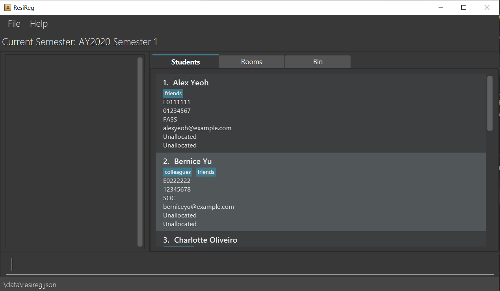
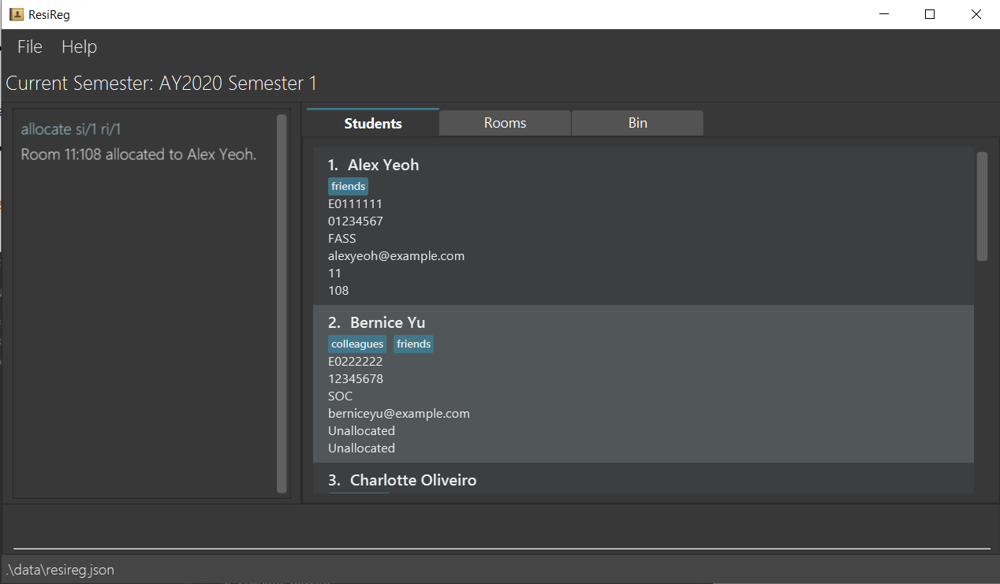
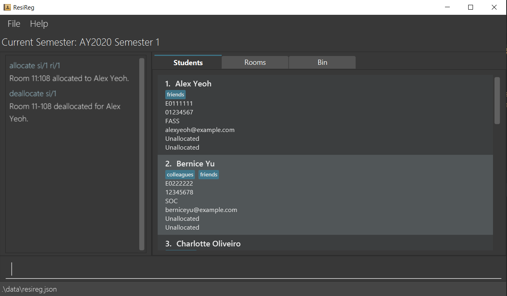
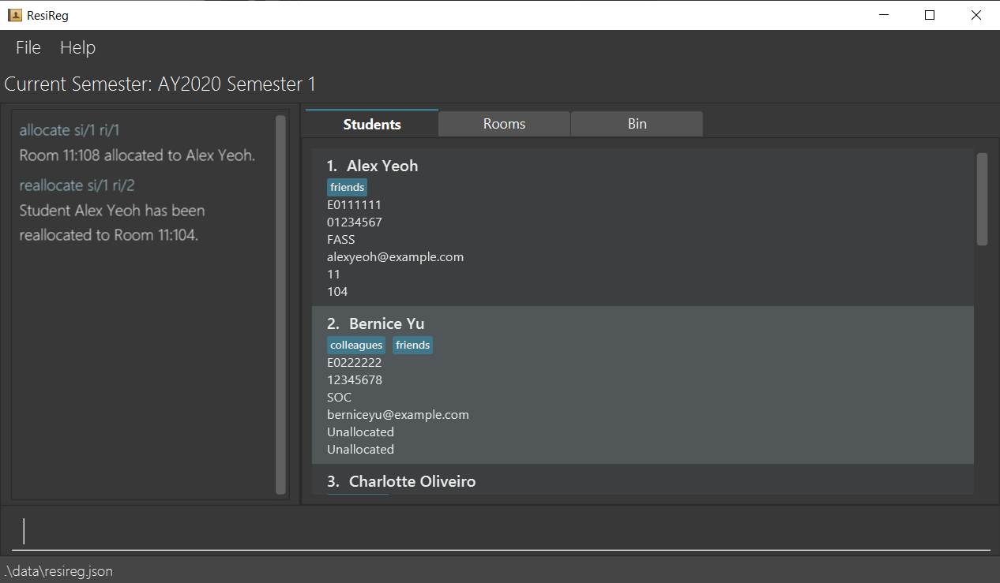
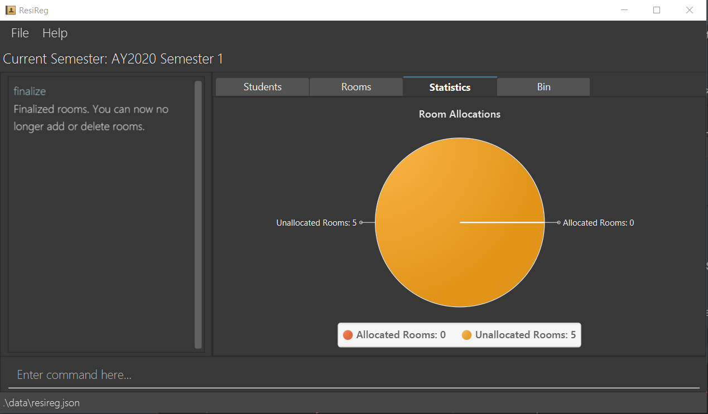
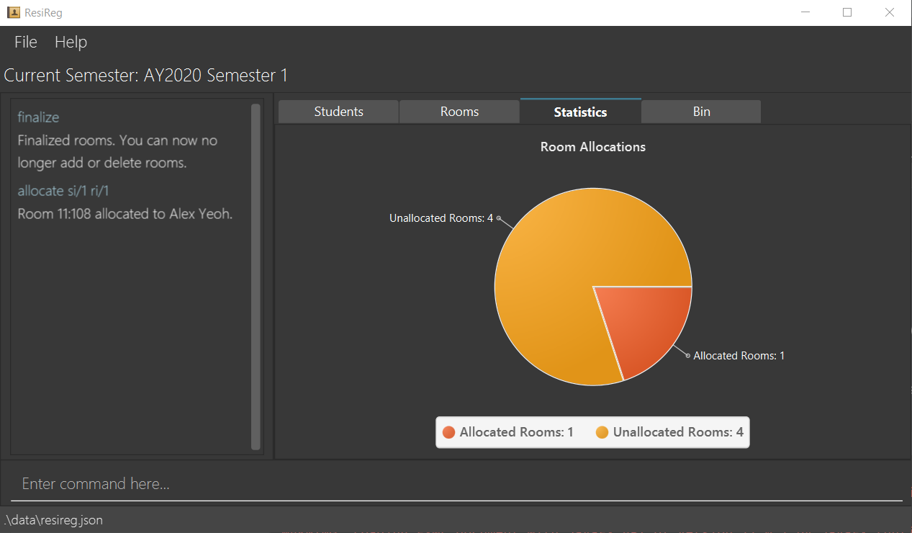

* Table of Contents
{:toc}

## Introduction

**ResiReg** (**Res**idential **Reg**ulation) is a productivity app designed to help admin staff at Residential Colleges (RCs)\* in NUS with their daily tasks. ResiReg allows admin to allocate rooms to students, manage students records, generate billing and OHS reports, and export CSVs for easy reference and sharing.

**ResiReg** has the following main features:

- Manage records of students.
- Manage records of rooms.
- Manage allocations of students to rooms in the College.

**ResiReg** is optimised for OHS admin who are fast typists who are used to MS Excel, and prefer typing over other means of input. It comes with:

- A Command Line Interface (CLI) which allows you to access all **ResiReg** features by typing.
- A Graphical User Interface (GUI) that displays the information you need in a grid format.

> **ResiReg** is currently a work in progress. Here is a mockup of its skeleton. Stay tuned for our progress!
> 

## About this Guide

### Basic Information

This User Guide explains how you (as an OHS admin) can use **ResiReg** to manage tasks at Residential Colleges.

You may refer to [Quick Start](#quick-start) for a short tutorial on how to run **ResiReg** on your system and use **ResiReg**'s main features. For a full walkthrough of **ResiReg**, please refer to [Features](#features).

## Quick Start

1. Ensure that Java 11 or above is installed in your computer
2. Download the latest `ResiReg.jar` here.
3. Copy the file to the folder you want to use as the home folder for your **ResiReg**.
4. Double-click the file to start the app. The following window should appear within a few seconds - this is the Session Screen, where you can create, open, or delete interview sessions:
5. Type the command in the command box and press <kbd>Enter</kbd> to execute it. e.g. typing `help` and pressing Enter will open this user guide.
6. Some example commands you can try:
   - `rooms --vacant`: lists all rooms that are vacant.
   - `allocate A0123456X 08-108`: allocate a student with the student ID A0123456X to room number 08-108.
   - `exit`: exits the app.
7. Refer to “Features” for details of all the commands.

## Command Format

<div markdown="block" class="alert alert-info">
This section explains the format of commands in this User Guide.

- Words in `<angular_brackets>` are the parameters to be supplied by the user e.g. in `deallocate <student_name>`, `<student_name>` is a parameter which can be used as `deallocate Jet New`.
- Items in square brackets are optional e.g `<full_name> [-aka <alias>]` can be used as `Jet New -aka JJ` or as `Jet New`.
- Items separated by <Code>|</Code> indicates a choice between items, but only one item is to be used at any time e.g. `--vacant | --allocated` means either the `--vacant` or the `--allocated` flag (but not both) can be used.
- Items with `…` after them can be used multiple times including zero times, unless otherwise stated e.g. `[/m <mod> /ig <interest_group>]…` can be used as `/m mod /ig ig`, `/m mod1 /ig ig1 /m mod2 /ig ig2` etc.
</div>

### I. Housing Management

> **ResiReg** allows you to manage rooms in the Residential College.

#### 1. Listing of all rooms : `rooms`

Shows a list of all rooms in ResiReg.

Format: `rooms`

<div markdown="span" class="alert alert-primary">:bulb: **Tip:**
Rooms can be filtered based on their allocation status. See the following two commands for further details.
</div>

Examples:

- `rooms` switches to the Rooms tab if it is not already selected, and shows the list of rooms on the right pane.

#### 2. Listing all vacant rooms : `rooms --vacant`

Shows a list of all vacant rooms i.e those which have not been allocated to any student yet.

Format: `rooms --vacant`

Examples:

- `rooms --vacant` switches to the Rooms tab if it is not already selected, and shows the list of vacant rooms on the right pane.

#### 3. Listing all allocated rooms : `rooms --allocated`

Shows a list of all allocated rooms i.e. those which have been allocated to a student.

Format: `rooms --allocated`

Examples:

- `rooms --allocated` switches to the Rooms tab if it is not already selected, and shows the list of allocated rooms on the right pane.

#### 4. Allocating a room to a student : `allocate`

Allocates a room to a student i.e denotes that the student currently occupies the room.

Format: `allocate ri/<room_index> si/<student_index>`

- Allocates a room to the student person at the specified `room_index` and `student_index`. The `room_index` refers to the index number shown in the displayed rooms list,
  and the `student_index` refers to the index number shown in the displayed students list. Both indices **must be positive integers** 1, 2, 3, …​
- Both the student and the room must be unallocated when this command is run. Otherwise, an error message is displayed accordingly.

Examples:

- `allocate ri/1 si/1` allocates the room at `room_index` 1 to the student at `student_index` 1.

##### Before allocation



##### After allocation



#### 5. Deallocating a room for a student : `deallocate`

Deallocates a room for a student i.e denotes that the student no longer occupies the room.

Format: `deallocate si/<student_index>`
* Deallocates a room to the student at the specified `student_index`. The `student_index` refers to the index number shown in the displayed students list. The `student_index` **must be positive a integer** 1, 2, 3, …​
* The student at `student_index` must have been allocated a room. Otherwise, an error message is displayed.

Examples:
* `deallocate si/1` deallocates the room for the student at `student_index` 1.

##### Before deallocation
Refer to "After allocation" above.

##### After deallocation



#### 6. Reallocating a room for a student : `reallocate`

Reallocates a room for a student, by editing the allocation relating a student to its current room.

Format: `reallocate si/<student_index> ri/<room_index>`

* Reallocates the room at `room_index` to the student at the specified `student_index`. The `room_index` refers to the
 index number shown in the displayed rooms list, and the `student_index` refers to the index number shown in the 
 displayed students list. Both indices **must be positive integers** 1, 2, 3, …​
* The student at `student_index` must currently have a room allocation (which is not the specified room). Otherwise, an error message is displayed accordingly. 
* The room at `room_index` must currently be vacant. Otherwise, an error message is displayed accordingly. 

Examples:
* `reallocate si/1 ri/2` edits the allocation of the student with index 1's current room to the room with index 2.

##### Before reallocation
Refer to "After allocation" above.

##### After reallocation



#### 7. Visualising a Piechart of Allocated Rooms

Visualises a piechart of allocated and unallocated rooms by switching to the `Statistics` tab, and updates upon a change in room allocation.

Example:
* `allocate si/1 ri/1` allocates a room to a student, updating the piechart.

##### Before a room allocation



##### After a room allocation


#### 8. Archiving a Semester

Archives the previous semester's data into an archival folder, and adjusts the application to operate on the succeeding semester.

Format: `archive`

- Moves the previous semester's allocation data to `AY[YEAR]S[SEMESTER]/archive.json`. For example, if the previous semester was 2019 Semester 2, the allocation data will be moved to `AY2019S2/archive.json`.
- The rooms and students are still preserved in the system.

### II. Student Management

> **ResiReg** allows you to manage students in the Residential College.

#### 1. Listing all students : `students`

Shows a list of all students in ResiReg.

Format: `students`

Examples:

- `students` switches to the Students tab if it is not already selected, and shows the list of students on the right pane.

#### 2. Adding a student : `add`

Adds a student to ResiReg. The following student details are stored: name, student ID, phone, email, faculty, and optionally, tags.

Format: `add n/<student_name> i/<student_id> p/<8_digit_phone_no> e/<email> f/<faculty> [t/<tag_name>]...`

- The student ID must be a 8-digit alphanumeric string, starting with `EO` and ending with 6 digits. It must be unique (no two students in ResiReg can share the same student ID). Otherwise, an error message is displayed accordingly.
- The pairs of type-prefixes and data (eg. `n/<student_name>`) may given be in any order.
- The student will not be added if some pieces of information is missing. An error message will be displayed instead.

Examples:

- `add n/Jet New i/E0407889 p/82462157 e/jn@u.nus.edu f/SOC` successfully creates a new student named Jet New whose student ID is E0407889, phone number is 82462157,
  email is jn@u.nus.edu, and faculty is Computing (SOC).
- `add student n/Jet New i/E0407889 e/jn@u.nus.edu` prompts the user with the following error message (because the faculty field is missing):
  `Invalid command format! add: Adds a student to ResiReg. Parameters: n/NAME i/STUDENT_ID p/PHONE e/EMAIL f/FACULTY [t/TAG]... Example: add n/John Doe s/E0123456 p/98765432 e/johndoe@u.nus.edu f/FASS`

#### 3. Editing a student : `edit`

Edits an existing student in ResiReg.

Format: `edit <index> [n/<student_name>] [i/<student_id>] [p/<8_digit_phone_no>] [e/<email>] [f/<faculty>] [t/<tag_name>]…​`

- Edits the person at the specified `index`. The index refers to the index number shown in the displayed student list. The index **must be a positive integer** 1, 2, 3, …​
- At least one of the optional fields must be provided.
- Existing values will be updated to the input values.
- When editing tags, the existing tags of the student will be removed i.e adding of tags is not cumulative.
- You can remove all of the student’s tags by typing `t/` without specifying any tags after it.

Examples:

- `edit 1 p/82462157 e/johnd@comp.nus.edu.sg` Edits the phone number and email address of the first student to be `82462157` and `johnd@comp.nus.edu.sg` respectively.
- `edit 2 n/Alpha Queue/` Edits the name of the 2nd student to be `Alpha Queue` and clears all existing tags.

#### 4. Finding a student by name : `find`

Finds students whose names contain any of the given keywords.

Format: `find <keyword> [<more_keywords>]...`

- The search is case-insensitive. e.g `hans` will match `Hans`
- The order of the keywords does not matter. e.g. `Hans Bo` will match `Bo Hans`
- Only the name is searched.
- Only full words will be matched e.g. `Han` will not match `Hans`
- Students matching at least one keyword will be returned (i.e. `OR` search).
  e.g. `Hans Bo` will return `Hans Gruber`, `Bo Yang`

Examples:

- `find John` returns `john` and `John Doe`
- `find alex david` returns `Alex Yeoh`, `David Li`

#### 4. Deleting a student : `delete`

Deletes the specified student from ResiReg.

Format: `delete <index>`

- Deletes the student at the specified `index`, and moves the student to the bin.
- The index refers to the index number shown in the displayed student list.
- The index **must be a positive integer** 1, 2, 3, …​

Examples:

- `list` followed by `delete 2` deletes the 2nd student in ResiReg.
- `find Betsy` followed by `delete 1` deletes the 1st student in the results of the `find` command.

<div markdown="span" class="alert alert-primary">:bulb: **Tip:**
If you delete a student erroneously, you should undo the command immediately. However, if you deleted the student a while ago, and wish to restore it, then you should use the restore command (see below).
</div>

### III. General

> **ResiReg** has many general features such as Command Line Interface (CLI) sugar and a recyling bin for more efficient usage by experienced users.

#### 1. Listing all bin items : `bin`

Shows a list of all bin items in ResiReg.

Format: `bin`

- `bin` switches to the Bin tab if it is not already selected.

Examples: `bin`

#### 2. Restoring a bin item : `restore`

Restores an existing bin item in ResiReg.

Format: `restore <index>​`

- Restores the bin item at the specified `index` to the list it was originally deleted from (e.g. student list). The index refers to the index number shown in the displayed bin item list. The index **must be a positive integer** 1, 2, 3, …​

Examples:

- `restore 1` restores the first bin item in the list, to its original list.

#### 3. Set bin expiry time : `set-bin-expiry`

Sets the amount of time (in days) that bin items stay in the bin before they are permanently removed.

<div markdown="span" class="alert alert-primary">:bulb: **Tip:**
The default time for which a bin item stays in the bin is **30 days**. Use this command if this does not suit your needs.
</div>

Format: `set-bin-expiry <number_of_days>​`

- `<number_of_days>` **must be a positive integer** 1, 2, 3, …​

Examples:

- `set-bin-expiry 20` sets all bin items to be permanentely removed 20 days after their deletion.

#### 4. Listing all aliases : `aliases`

Shows the list of aliases (an alias is a user-defined term that can be used interchangeably with a command word) and their corresponding command words currently in ResiReg.

Format: `aliases​`

Example: `aliases`

#### 5. Adding an alias : `alias`

Adds an alias for a command word to ResiReg.

Format: `alias c/<command_word> a/<alias_term>​`

- `<command_word>` must exactly match one of the command words listed by the `help` command.
- `<alias_term>` cannot be an existing command word, or an existing alias.

Examples:

- `alias c/set-bin-expiry a/sb` adds an alias `sb` for the `set-bin-expiry` command. Henceforth, `sb` and `set-bin-expiry` command will have the same effect
- `alias c/rooms a/r` adds an alias `r` for the `rooms` command. Henceforth, `r` and `rooms` command will have the same effect. Note that filtering flags such as `--allocated` and `--vacant` remain unchanged.

#### 6. Deleting an alias : `dealias`

Deletes an alias for a command word to ResiReg.

Format: `dealias c/<command_word> a/<alias_term>​`

- Both `<command_word>` and `<alias_term>` must exactly match one of the command word-alias pairs listed by the `aliases` command.

Examples:

- `dealias c/set-bin-expiry a/sb` removes the an alias `sb` for the `set-bin-expiry` command. Henceforth, typing `sb` will lead to an error message.

#### 7. Asking for help as a first time user : `help`

Shows a list of all available commands and their purpose to understand the usage of the commands.

Format: `help`

- Lists all user commands and their purpose.
- Also includes a link to this User Guide, so that the user can access further details.

Examples:

```
Commands available:
add: Adds a student to ResiReg.
allocate: Allocates a student to a room.
clear: Clears list of students.
...other commands...

You can also refer to our user guide at: https://ay2021s1-cs2103-t16-3.github.io/tp/UserGuide.html
```

#### 8. Checking the syntax for a command

Shows the purpose, syntax, and parameters of a command if you need to use the command but are unsure of its syntax.

Format: `help <command_word> | <alias>`

- `<command_word>` if supplied, should exactly match one of the command words listed by the `help` command
- `<alias>` if supplied, should exactly match one of the aliases listed by the `aliases` command

Examples:

- `help rooms` results in the following output:

```
rooms: Lists all rooms within the system. If the --vacant flag is specified, lists only vacant rooms i.e rooms which have no students allocated to them.
Otherwise, if the --allocated flag is specified, lists only allocated rooms i.e. rooms which have students allocated to them.
Parameters: [--vacant | --allocated]
Example: rooms
```

#### 9. Clearing all entries : `clear`

Clears all entries (students, rooms, allocations and bin items) from ResiReg.

Format: `clear`

#### 10. Undo previous command : `undo`
Restores the address book to the state before 
the previous state modifying command was executed.

<div markdown="span" class="alert alert-info">:information_source: Pressing the <kbd>ctrl-z</kbd> keyboard combination
in the command box will execute the command as well.
</div>

#### 11. Redo previous undo command : `redo`
Reverses the most recent undo command.

<div markdown="span" class="alert alert-info">:information_source: Pressing the <kbd>ctrl-y</kbd> keyboard combination
in the command box will execute the command as well.
</div>

<div markdown="span" class="alert alert-primary">:bulb: **Tip:**
`undo` and `redo` support the undoing and redoing respectively of commands
that change the state of ResiReg, which comprises of: students, rooms, allocations, semesters and bin items.
</div>

#### 12. List previously entered commands : `history`
Lists all the commands previously entered in reverse chronological order.

<div markdown="span" class="alert alert-info">:information_source: Pressing the <kbd>up</kbd> and <kbd>down</kbd> arrows will 
display the previous and next command respectively in the command box.

</div>

#### 13. Exiting ResiReg : `exit`
Exits the program.

Format: `exit`

## FAQ

### Where do I get help?

Just type in the `help` command!

### How do I transfer my data to another Computer?

1. Download the JAR file (`resireg.jar`) on your new computer.
2. Navigate to where the JAR file is.
3. Double click on `resireg.jar`
4. Delete the `resireg.json` file in the folder
5. Copy over the `resireg.json` file <em>residing in your previous **ResiReg** home folder</em> that contains data of your previous **ResiReg** session.

## Command Summary

| Action                | Format, Examples                                                                                                                                          |
| --------------------- | --------------------------------------------------------------------------------------------------------------------------------------------------------- |
| _list rooms_          | `rooms [--allocated                                                                                                                                       | --vacant]`e.g.`rooms`or`rooms --allocated`or`rooms --vacant` |
| _allocate room_       | `allocate si/<student_index> ri/<room_index>` e.g. `allocate si/1 ri/1`                                                                                   |
| _deallocate room_     | `deallocate si/<student_index>` e.g. `deallocate si/1`                                                                                                    |
| _edit allocation_     | `reallocate si/<student_index> ri/<room_index>` e.g. `reallocate si/1 ri/2`                                                                               |
| _list students_       | `students`                                                                                                                                                |
| _add student_         | `add n/<name> i/<student_id> p/<8_digit_phone_no> e/<email> f/<faculty> [t/<tag_name>]...` e.g.`add n/Jet New i/E0407889 p/82462157 e/jn@u.nus.edu f/SOC` |
| _edit student_        | `edit <index> [n/<name>] [i/<student_id>] [p/<8_digit_phone_no>] [e/<email>] [f/<faculty>] [t/<tag_name>]…` e.g.`edit 1 n/Jet New`                        |
| _find student_        | `find <keyword> [<another_keyword>]...` e.g.`find John`                                                                                                   |
| _delete student_      | `delete <index>` e.g.`delete 2`                                                                                                                           |
| _list bin items_      | `bin`                                                                                                                                                     |
| _restore bin item_    | `restore <index>` e.g. `restore 2`                                                                                                                        |
| _set bin expiry time_ | `set-bin-expiry <number_of_days>` e.g. `set-bin-expiry 30`                                                                                                |
| _list aliases_        | `aliases`                                                                                                                                                 |
| _add alias_           | `alias c/<command_word> a/<alias>` e.g. `alias c/rooms a/r`                                                                                               |
| _delete alias_        | `dealias c/<command_word> a/<alias>` e.g. `alias c/rooms a/r`                                                                                             |
| _help_                | `help [<command_word>                                                                                                                                     | <alias>]`e.g.`help`or`help rooms`or`help r` |
| _archive semester_    | `archive`                                                                                                                                                 |
| _clear_               | `clear`                                                                                                                                                   |
| _exit_                | `exit`                                                                                                                                                    |
