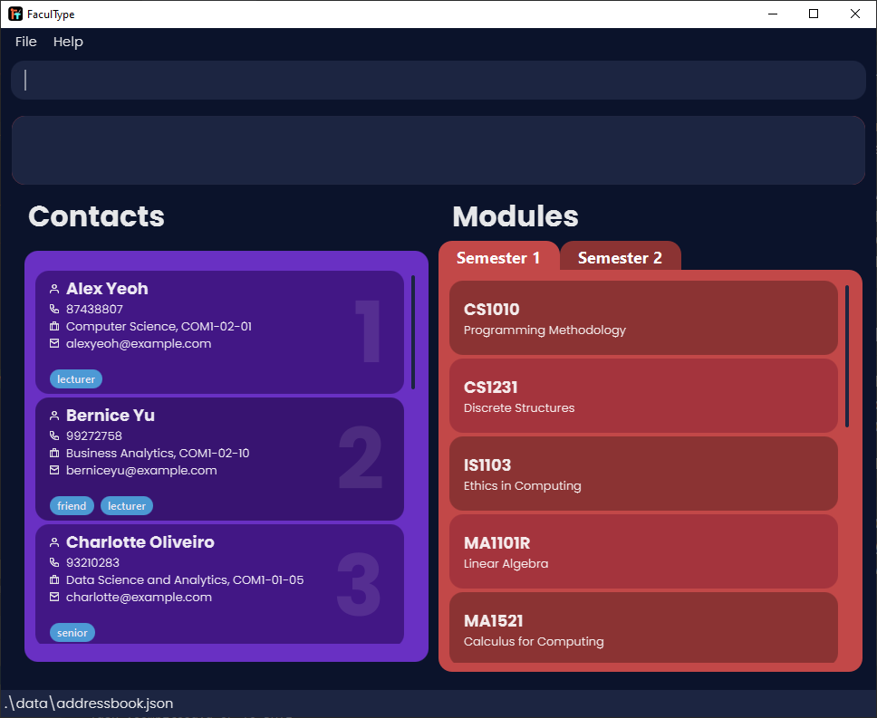

FaculType is a **desktop app** for managing **faculty members and their modules**, optimized for use via a Command Line Interface (CLI) while still having the benefits of a Graphical User Interface (GUI).

--------------------------------------------------------------------------------------------------------------------

## Quick start

1. Ensure you have Java `11` or above installed in your Computer.

1. Download the latest `FaculType.jar` from [here](https://github.com/AY2021S1-CS2103-T14-1/tp/releases).

1. Copy the file to the folder you want to use as the _home folder_ for FaculType.

1. Double-click the file to start the app. The GUI similar to the below should appear in a few seconds. Note how the app contains some sample data. 
   

1. Type the command in the command box and press Enter to execute it. e.g. typing **`help`** and pressing Enter will open the help window. 

1. Refer to the [Features](#features) below for details of each command.

--------------------------------------------------------------------------------------------------------------------

## Features

**:information_source: Notes about the command format:** 

* Words in `UPPER_CASE` are the parameters to be supplied by the user. 
  e.g. in `add n/NAME`, `NAME` is a parameter which can be used as `add n/John Doe`.

* Items in square brackets are optional. 
  e.g `n/NAME [t/TAG]` can be used as `n/John Doe t/friend` or as `n/John Doe`.

* Items with `…`​ after them can be used multiple times including zero times. 
  e.g. `[t/TAG]…​` can be used as ` ` (i.e. 0 times), `t/friend`, `t/friend t/family` etc.

* Parameters can be in any order. 
  e.g. if the command specifies `n/NAME p/PHONE_NUMBER`, `p/PHONE_NUMBER n/NAME` is also acceptable.

### Adding a contact: `add`

Adds a contact to FaculType.

Format: `add n/NAME p/PHONE_NUMBER e/EMAIL d/DEPARTMENT o/OFFICE [t/TAG]…​
​`

:bulb: **Tip:**
A contact can have any number of tags (including 0)

Examples:
* `add n/Janson Garrick p/98765432 e/jansongarrick@example.com d/Computer Science o/B01-A3`
* `add n/Amanda Holt p/98765431 e/amanda123@example.com d/Data Science o/COM1-02-03 t/lecturer t/friend`

### Deleting a contact : `delete`

Deletes the specified contact from FaculType.

Format: `delete INDEX`

* Deletes the contact at the specified `INDEX`.
* The index refers to the index number shown in the displayed contact list.
* The index **must be a positive integer** 1, 2, 3, …​

Examples:
* `clist` followed by `delete 2` deletes the 2nd contact in FaculType.
* `find n/Betsy` followed by `delete 1` deletes the 1st contact in the results of the `find` command.

### Editing a contact : `edit`

Edits an existing contact in FaculType.

Format: `edit INDEX [n/NAME] [p/PHONE] [e/EMAIL] [d/DEPARTMENT] [o/OFFICE] [t/TAG]…​`

* Edits the contact at the specified `INDEX`. The index refers to the index number shown in the displayed contact list. The index **must be a positive integer** 1, 2, 3, …​
* At least one of the optional fields must be provided.
* Existing values will be updated to the input values.
* When editing tags, the existing tags of the contact will be removed i.e adding of tags is not cumulative.
* You can remove all the contact’s tags by typing `t/` without
    specifying any tags after it.

Examples:
*  `edit 1 d/Computing o/COM2-01-02` edits the department and office of the 1st contact to be `Computing` and `COM2-01-02` respectively.
*  `edit 2 n/Brenda Chan t/` edits the name of the 2nd contact to be `Brenda Chan` and clears all existing tags.

### Adding or updating a remark : `remark`

Adds or updates the remark of an existing contact in FaculType.

Format: `remark INDEX r/[REMARK]`

* Adds a remark to the contact at the specified `INDEX`. The index refers to the index number shown in the displayed contact list. The index **must be a positive integer** 1, 2, 3, …​
* You can remove the contact’s remark by typing `r/` without specifying any remark after it.
    
Examples:
*  `remark 1 r/Wears red glasses` adds the remark “Wears red glasses” to the 1st contact in the list.
*  `remark 2 r/` erases the remark of the 2nd contact in the list.

### Locating contacts by attributes: `find`

Finds all contacts that match the given fields.

Format: `find [n/NAME] [p/PHONE] [e/EMAIL] [d/DEPARTMENT] [o/OFFICE] [r/REMARK] [t/TAG]`

* The search is case-insensitive. e.g `chris` will match `Chris`.
* The order of the keywords do not matter. e.g. `Chris Evans` will match `Evans Chris`.
* Partial words will be matched e.g. `Chri Evan` will match `Chris Evans`.
* Results must contain every keyword e.g. `Chris Evans` will not match `Chris Pratt`.
* At least one of the optional fields must be provided.

Examples:
* `find n/John` returns all contacts with names containing `John`.
* `find n/alex yeoh` returns all contacts with names containing `alex` and `yeoh`.
* `find n/victor tan d/computing` returns all contacts with names containing `victor` and `tan` and with departments
containing `computing`.
 
### Adding a module: `addmod`

Adds a new module to the active semester.

Format : `addmod m/MODULE_CODE n/MODULE_NAME`

* Adds the `MODULE_CODE` specified to the active semester. The `MODULE_CODE` must not exist in the active semester in the first place.

Examples:
* `addmod m/CS2040S n/Data Structures and Algorithms` adds a module named `Data Structures and Algorithms` with code `CS2040S` to the active semester.
* `addmod m/CS2102 n/Database Systems` adds a module named `Database Systems` with code `CS2102` to the active semester.

### Deleting a module: `delmod`

Deletes a module from the active semester.

Format: `delmod m/MODULE_CODE`

* Deletes the `MODULE_CODE` specified from the active semester. The `MODULE_CODE` **must exist** in the active semester in the first place.

Examples:
* `delmod m/CS2040S` deletes the existing module with code `CS2040S` from the active semester.
* `delmod m/CS2102` deletes the existing module with code `CS2102` from the active semester.

### Finding modules : `findmod`

Finds all modules in the active semester that match the given fields.

Format : `findmod [m/MODULE_CODE] [n/MODULE_NAME] [i/INSTRUCTOR_NAME]`

* The search is insensitive. e.g. `cs2103` will match `CS2103`.
* Partial words will be matched. e.g. `database` will match `Database Systems`.
* The order of the keywords do not matter. e.g. `Statistics and Probability` will match `Probability and Statistics`.
* At least one of the optional fields must be provided.

Examples :

* `findmod m/cs210` returns all modules with codes containing `cs210`.
* `findmod n/programming` returns all modules with names containing `programming`.
* `findmod m/CS2 n/security i/Alex` returns all modules with codes containing `CS2`, names containing `programming`,
and instructors with names containing `Alex`.

### Listing all contacts and modules: `list`

Shows a list of all contacts in FaculType and all modules in the active semester.

Format: `list`

### Listing all contacts : `clist`

Shows a list of all contacts in FaculType.

Format: `clist`

### Listing all modules : `mlist`

Shows a list of all modules in the active semester.

Format: `mlist`

### Assigning an instructor to modules : `assign`

Assigns a contact to one or more modules in the active semester. The contact will be an instructor in those modules.

Format: `assign INDEX m/MODULE_CODE [m/MODULE_CODE]…​`

* Assigns the contact at the specified `INDEX` to every `MODULE_CODE` specified. All `MODULE_CODE` **must be unique** and **must exist** in the active semester in the first place.

Examples :
* `assign 1 m/CS3233` Assigns the contact at index 1 to the existing module with code `CS3233`.
* `assign 2 m/CS2030S` Assigns the contact at index 2 to the existing module with code `CS2030S`.
* `assign 3 m/CS2100 m/CS2106` Assigns the contact at index 3 to the existing modules with codes `CS2100` and `CS2106`.

### Unassigning an instructor from modules : `unassign`

Unassigns a contact from one or more modules in the active semester. The contact will no longer be an instructor in those modules.

Format: `unassign INDEX m/[MODULE_CODE] [m/MODULE_CODE]…​`

* Unassigns the contact at the specified `INDEX` from every `MODULE_CODE` specified. The contact **must be assigned** to all `MODULE_CODE` in the active semester in the first place.
* You can unassign the contact from all modules in the active semester by typing `m/`
        without specifying any module codes after it.
    
Examples :
* `unassign 1 m/CS3233` Unassigns the contact at index 1 from the existing module with code `CS3233`.
* `unassign 3 m/CS2100 m/CS2106` Unassigns the contact at from 3 to the existing modules with codes `CS2100` and `CS2106`.
* `unassign 2 m/` Unassigns the contact at index 2 from all modules in the active semester.

### Clearing all assignments : `unassignall`

Unassigns all contacts from all modules in the active semester.

Format: `unassignall`

### Switching the active semester : `switch`

Switches the active semester from Semester 1 to Semester 2 and vice versa.

Format: `switch`

### Reseting FaculType : `reset`

Resets FaculType to its initial state by clearing all entries of persons and modules.

Format: `reset`

### Clearing all contacts : `cclear`

Clears all entries of contacts in FaculType.

Format : `cclear`

### Clearing all modules : `mclear`

Clears all entries of modules in the active semester.

Format : `mclear`

### Viewing help : `help`

Shows a message explaining how to access the help page.

Format: `help`

### Exiting the program : `exit`

Exits the program.

Format: `exit`

### Saving the data

FaculType data is saved in the hard disk automatically after any command that changes the data. There is no need to save manually.

--------------------------------------------------------------------------------------------------------------------

## FAQ

**Q**: How do I transfer my data to another Computer? 
**A**: Install the app in the other computer and overwrite the empty data file it creates with the file that contains the data of your previous FaculType home folder.

--------------------------------------------------------------------------------------------------------------------

## Command summary

Action | Format, Examples
--------|------------------
**Add** | `add n/NAME p/PHONE_NUMBER e/EMAIL d/DEPARTMENT o/OFFICE [t/TAG]…​`   e.g. `add n/Betsy Crowe p/98765431 e/betsycrowe@example.com d/Data Science o/COM1-02-03 t/lecturer t/friend`
**Delete** | `delete INDEX`  e.g. `delete 3`
**Edit** | `edit INDEX [n/NAME] [p/PHONE] [e/EMAIL] [d/DEPARTMENT] [o/OFFICE] [t/TAG]…​`   e.g. `edit 1 d/Information Systems o/COM2-01-02`
**Remark** | `remark INDEX r/[REMARK]`  e.g. `remark 1 r/Wears red glasses`
**Find** | `find [n/NAME] [p/PHONE] [e/EMAIL] [d/DEPARTMENT] [o/OFFICE] [r/REMARK] [t/TAG]`   e.g. `find n/Victor Tan d/Math`
**Add modules** | `addmod m/MODULE_CODE n/MODULE_NAME`  e.g. `addmod m/CS2103 n/Software Engineering`
**Delete modules** | `delmod m/MODULE_CODE`  e.g. `delmod m/CS2103`
**Find modules** | `findmod [m/MODULE_CODE] [n/MODULE_NAME] [i/INSTRUCTOR_NAME]`   e.g. `findmod m/CS2`
**List all contacts and modules** | `list`
**List all contacts** | `clist`
**List all modules** | `mlist`
**Assign a contact** | `assign INDEX m/MODULE_CODE [m/MODULE_CODE]…​`   e.g. `assign 3 m/CS2100 m/CS2106`
**Unassign a contact** | `unassign INDEX m/[MODULE_CODE] [m/MODULE_CODE]…​`   e.g. `unassign 3 m/CS2100 m/CS2106`
**Unassign all contacts** | `unassignall`
**Switch active semester** | `switch`
**Clear all data** | `reset`
**Clear all contacts** | `cclear`
**Clear all modules** | `mclear`
**Help** | `help`
**Exit** | `exit`
