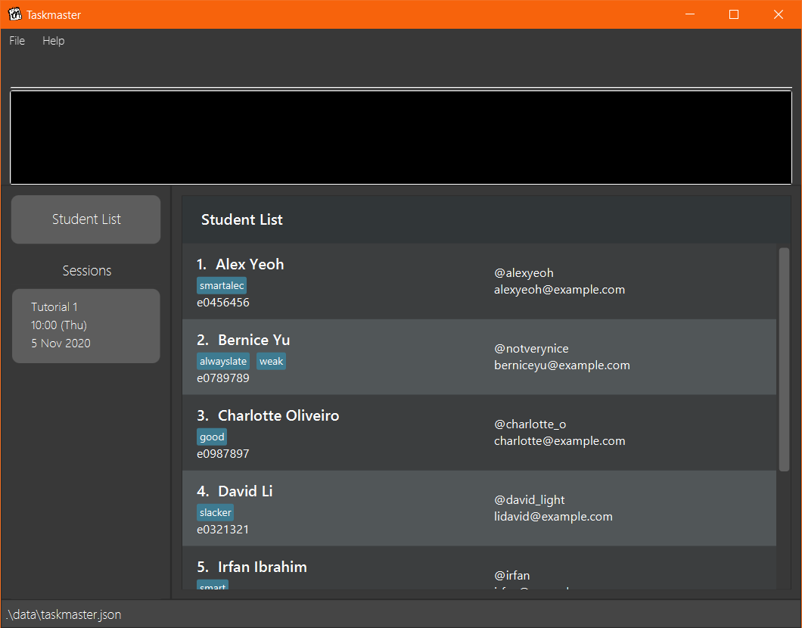
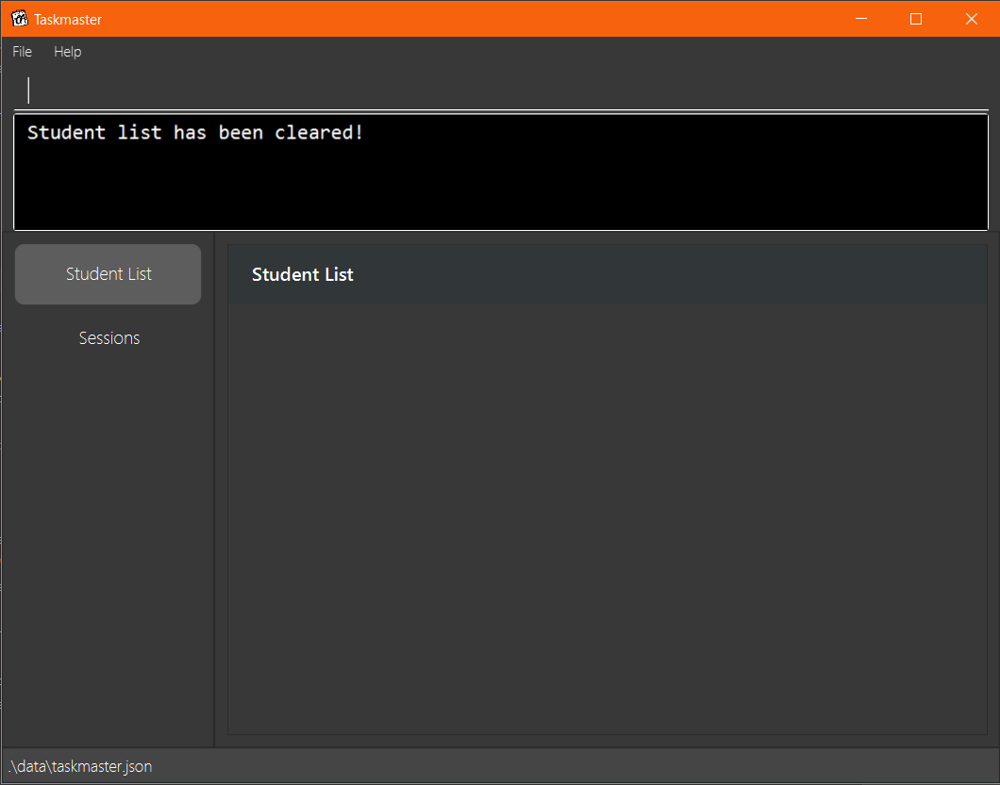
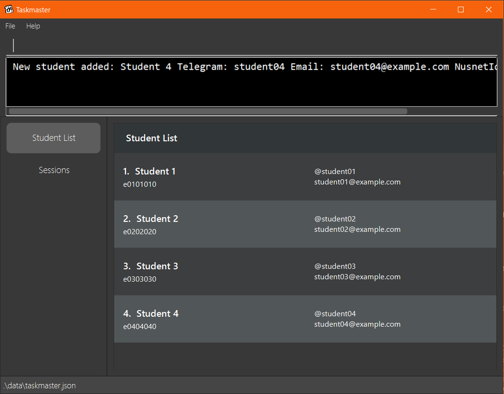
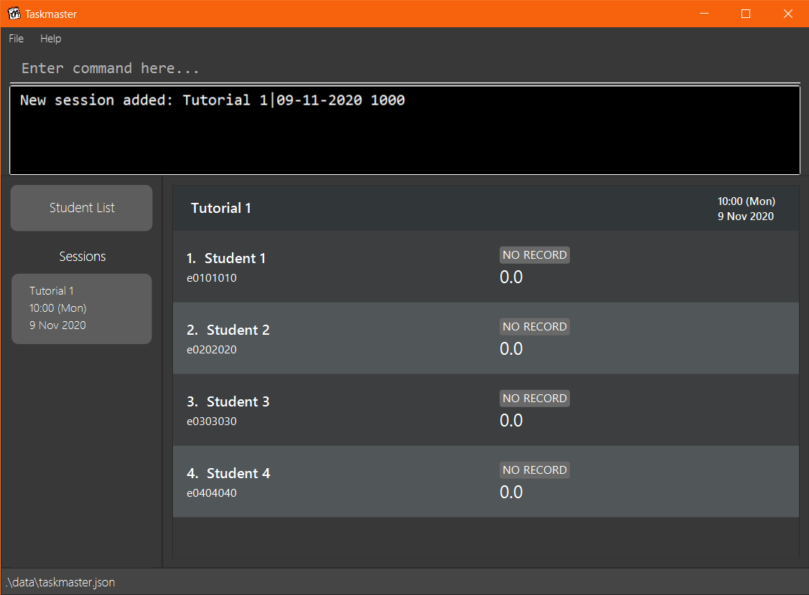
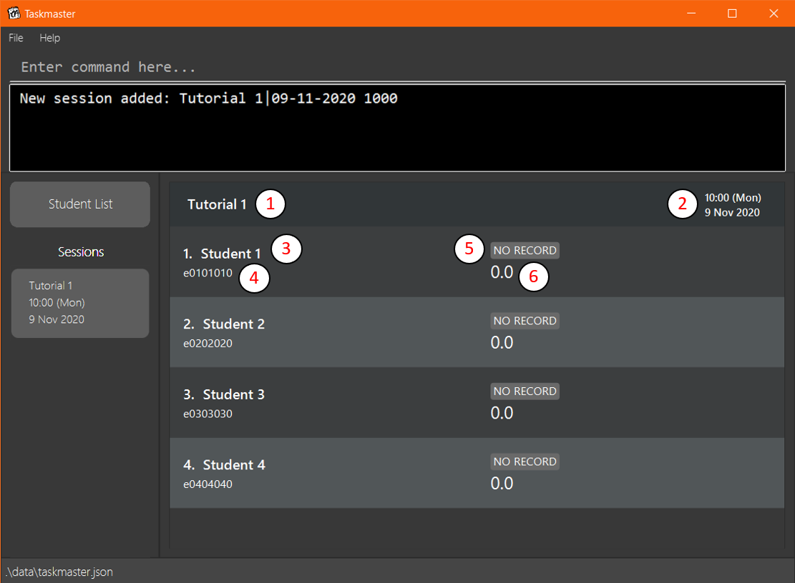
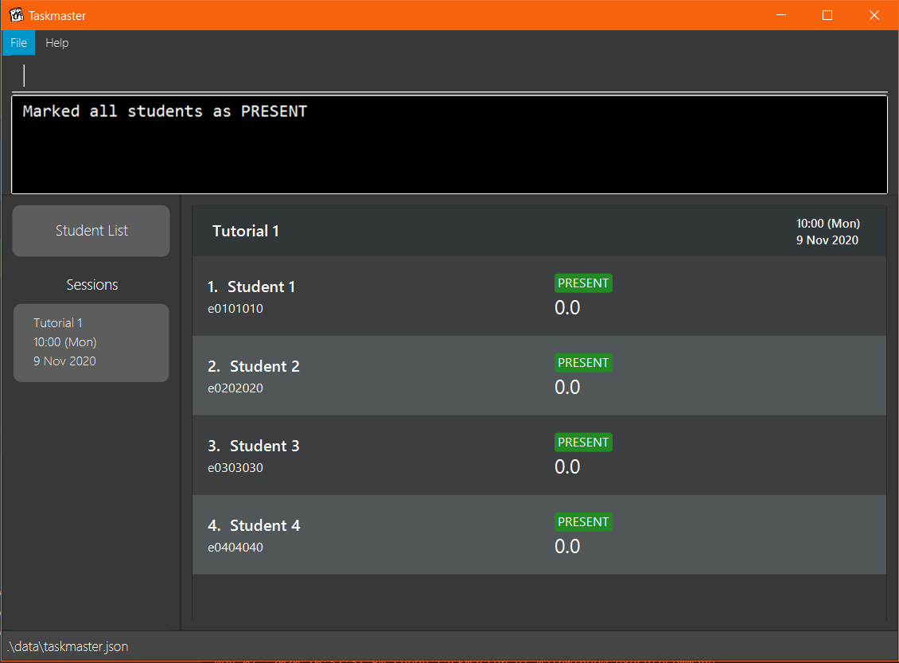
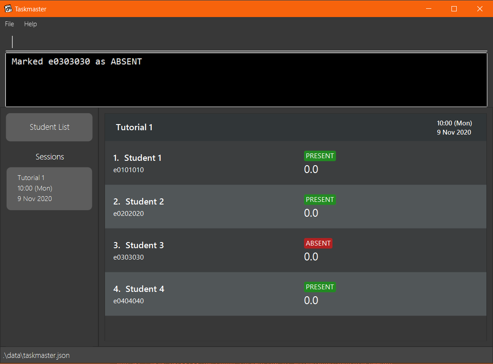
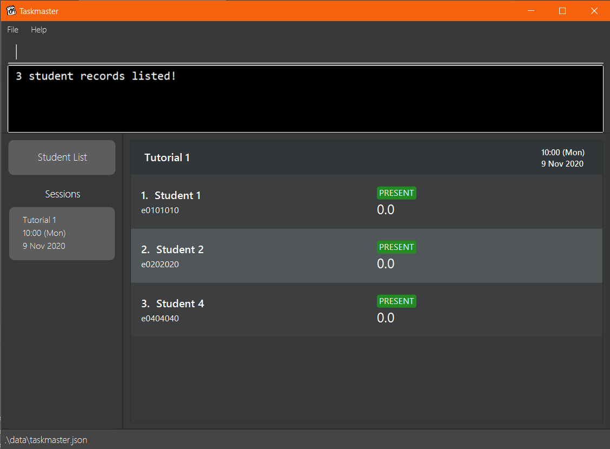
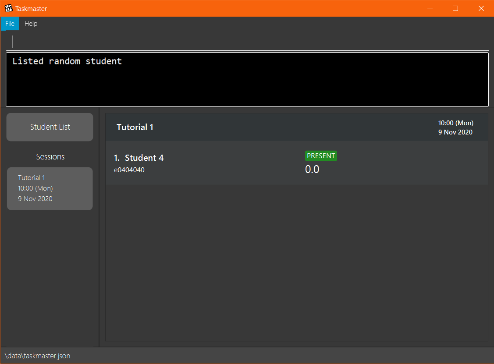
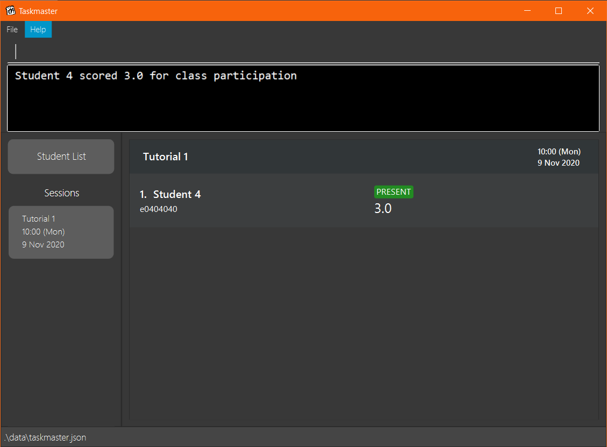

TAskmaster is a **desktop app for managing students, optimized for use via a Command Line Interface** (CLI) while still having the benefits of a Graphical User Interface (GUI). If you are a CS Teaching Assistant who can type fast, TAskmaster can help you track your students' attendance and class participation faster than traditional GUI apps.

## Contents:
- [Quick Start](#quick-start "Go to Quick Start")
    - [Installation](#installation "Go to Installation")
    - [Usage](#usage "Go to Usage")
- [Walkthrough](#walkthrough "Go to Walkthrough")
- [Command Overview](#command-overview "Go to Command Overview")
- [Student Commands](#student-commands "Go to Student Commands")
    - [Adding a student: `add-student`](#adding-a-student-add-student "Go to Adding a student")
    - [Listing all students: `list-students`](#listing-all-students-list-students "Go to Listing all students")
    - [Finding students by name: `find-students`](#finding-students-by-name-find-students "Go to Finding students by name")
    - [Editing a student: `edit-student`](#editing-a-student-edit-student "Go to Editing a student")
    - [Deleting a student: `delete-student`](#deleting-a-student-delete-student "Go to Deleting a student")
- [Session Commands](#session-commands "Go to Session Commands")
    - [Adding a session: `add-session`](#adding-a-session-add-session "Go to Adding a session")
    - [Deleting a session: `delete-session`](#deleting-a-session-delete-session "Go to Deleting a session")
    - [Changing the current session: `goto`](#changing-the-current-session-goto "Go to Changing the current session")
    - [Marking a student's attendance: `mark`](#marking-a-students-attendance-mark "Go to Marking a student's attendance")
    - [Scoring students' participation: `score`](#scoring-students-participation-score "Go to Scoring students' participation mark")
    - [View lowest-scoring students: `lowest-score`](#view-lowest-scoring-students-lowest-score "Go to View lowest scoring students")
    - [Get a random student: `random-student`](#get-a-random-student-random-student "Go to Get a Random Student")
    - [Clear all students: `clear`](#clearing-all-entries-clear "Go to Clearing all entries")
    - [Exit the program: `exit`](#exiting-the-program-exit "Go to Exiting the program")
- [Command Summary](#command-summary "Go to Command Summary")
- [Storage](#storage "Go to Storage")

<div style="page-break-after: always;"></div>
## Quick Start

### Installation
1. Ensure you have Java 11 or later installed.
2. Download the jar file from the project website.
3. Copy the file to the folder you want to use as the home folder for the application.
4. Start the app, by doing one of the following:  
    1. Double-click on the file.
    2. Open the terminal or command prompt, navigate to the folder in which the jar file is at, and run the command `java -jar taskmaster.jar` (assuming that the file is called `taskmaster.jar`). 
5. A GUI should appear, with the field bar to input commands. The list of commands is available below.

### Usage
1. Add the students that you are currently teaching into TAskmaster using the `add-student` command.
    * You can use the `list-students`, `edit-student`, `find-students` and `delete-student` commands to read, filter and modify your student list.
2. Create a new session that represents a tutorial, lab or recitation session using the `add-session` command.
    * Use `goto` and `delete-session` to switch between and delete sessions.
3. Mark your students' attendance and award them class participation marks with the `mark` and `score` commands respectively.
    * Note that you will not be allowed to use these commands outside of a session.
4. Find present students to call on with the `lowest-score` or `random-student` commands.
    * Note that you will not be allowed to use these commands outside of a session.
5. Clear all data with the `clear` command.
    * This deletes both session and student data.

<div style="page-break-after: always;"></div>
## Walkthrough

### Step 1: Set-up
On the first use of TAskmaster, the program will be loaded with a sample student list.


Enter the `clear` command to delete all existing data in TAskmaster.


<div style="page-break-after: always;"></div>
### Step 2: Add Students
Then, add the students that you are currently teaching into the student list using the `add-student` command.


* Note that a student must have a non-empty name, a valid telegram handle, email address and NUSNET id.
* No two students in the student list can share the same NUSNET id.
* You can use the `find-students`, `edit-student` and `delete-student` commands to filter and modify your student list.

<div style="page-break-after: always;"></div>
### Step 3: Add a Session
After adding all your students, you can create a new session that represents a tutorial, lab or recitation session using
the `add-session` command. TAskmaster will automatically switch to the new session view.


* TAskmaster will read the current student list and create a list of corresponding student records that belongs to the new session created.
* Each student in the student list is by a student record
* This list of records, once created, will be **independent of the student list**. Any modifications to the student list after a session is created **will not** affect the student records in that session.
* You can use the `delete-session` command to delete a session from the session list. This will delete all data (including student records) stored in that session.

<div style="page-break-after: always;"></div>
### Step 4: Session View
Within the session view, you can see a list of records representing the students that are enrolled in that session.


Legend:
1. Session name
2. Session date and time
3. Name of student
4. NUSNET ID of student
5. Attendance
6. Class participation score  

<div style="page-break-after: always;"></div>
### Step 5: Mark Attendance
Mark your students' attendance with the `mark` commands.



<div style="page-break-after: always;"></div>
### Step 6: Get Present Students
TAskmaster provides you with two ways to get students to call on to answer questions.
* The `lowest-score` command shows a student that is present and currently has the lowest score. If there are multiple
present students with the lowest score, the command will show all of them.

* The `random-student` command chooses a student that is present randomly.


<div style="page-break-after: always;"></div>
### Step 7: Award Class Participation
You can award class participation score to students using the `score` command.


### Step 8: Switch Views
Note that you will not be allowed to use any session view commands outside of a session.
* To switch to a session view, use the `goto` command or click the corresponding button on the left, under 'Sessions'. 
* To go back to the student list view, use the `list-students` command or click the Student List button on the left.

<div style="page-break-after: always;"></div>
### Step 9: Exit TAskmaster
When you are done with TAskmaster, use the `exit` command to close the application.
 * Data will be saved automatically.

## Command Overview
> Command format:
> - Words in `UPPER_CASE` are parameters supplied by the user.
> - Items in square brackets are optional.
> - Items with ellipses (`...`) after them can be used multiple times including zero times.
> - Parameters can be in any order.

## Student Commands

### Adding a student: `add-student`
Adds a student into the student list.
```
add-student n/NAME u/TELEGRAM e/EMAIL i/NUSNETID [t/TAG]...
```
- The `NAME` must be non-empty.
- The `TELEGRAM` handle must be valid (comprising only alphanumeric 
 characters and underscore with a length between 5 and 32 characters inclusive).
- The `EMAIL` and `NUSNETID` must be in a valid format.

Example usage:
```
add-student n/John Tan u/johntan98 e/johntan98@gmail.com i/e0012345 t/tardy
```

### Listing all students: `list-students`
Shows a list of all students on the student list.
```
list-students
```

### Finding students by name: `find-students`
Finds students in the student list whose name contains any of the given keywords.
```
find-students KEYWORD [MORE_KEYWORDS]
```
- The search is case-insensitive (e.g. `hans` will match `Hans`).
- The order of the keywords does not matter (e.g. `Hans Bo` will match `Bo Hans`).
- Only the name is searched.
- Only full names will be matched (e.g. `han` will NOT match `Hans`).
- Students matching at least one keyword will be returned (e.g. `Hans Bo` will return `Hans Gruber`, `Bo Yang`).

Example usages:
```
// Returns 'john' and 'John Doe'
find-students John

// Returns 'Alex Yeoh', 'David Li'
find-students alex david
```

<div style="page-break-after: always;"></div>
### Editing a student: `edit-student`
Edits an existing student in the student list.
```
edit-student INDEX [n/NAME] [u/TELEGRAM] [e/EMAIL] [i/NUSNETID] [t/TAG]...
```
- Edits the student at the specified `INDEX` number shown in the displayed student list. 
- The `INDEX` **must be a positive integer** that exists in said list.
- At least one of the optional fields must be provided.
- Existing values will be updated to the input values.
- When editing tags, the existing tags of the person will be removed i.e adding of tags is not cumulative.
- You can remove all the person’s tags by typing `t/` without specifying any tags after it.

Example usages:
```
// Edit the telegram and email of the first person
edit-student 1 u/johntan98 e/johntan98@gmail.com

// Edit the name of the second person and clear all existing tags
edit-student 2 n/Rachel Lee t/
```

### Deleting a student: `delete-student`
Deletes the specified student from the student list.
```
delete-student INDEX
```
- Deletes the student at the specified `INDEX` number shown in the displayed student list.
- The `INDEX` **must be a positive integer** that exists in said list.

Example usage:
```
delete-student 3
```

<br>

## Session Commands
> Note that Session commands can *only* be executed within a session view.

### Adding a session: `add-session`
Adds a session into the session list.
```
add-session s/SESSION_NAME dt/SESSION_DATE_TIME
```
- The `SESSION_DATE_TIME` must be a valid date of the format `dd-MM-yyyy HHmm`.
- Duplicate session names are not allowed.

Example usage:
```
add-session s/CS2103 Tutorial 9 dt/23-10-2020 0900
```

### Deleting a session: `delete-session`
Deletes the specified session from the session list.
```
delete-session s/SESSION_NAME
```
- Deletes the session with the specified `SESSION_NAME` from the displayed session list.
- A session with `SESSION_NAME` must exist in said list.

Example usage:
```
delete-session s/CS2103 Tutorial 9
```

<div style="page-break-after: always;"></div>
### Changing the current session: `goto`
Changes the current session to the session with the specified name.
```
goto s/SESSION_NAME
```
- The `SESSION_NAME` must belong to one of the existing sessions in the session list.

Example usage:
```
goto s/CS2103 Tutorial 9
```

### Marking a student's attendance: `mark`
Marks the attendance of the specified student (or all students) in the session.
```
mark INDEX a/ATTENDANCE_TYPE
```
- This command can only be used when a session is selected.
- Marks the attendance at the specified `INDEX` number shown in the displayed student record list.
- The `INDEX` **must be a positive integer** that exists in said list.
- Alternatively, the `INDEX` can be replaced with `all` to mark all students in the student record list.
- The `ATTENDANCE_TYPE` must either be `present`, `absent` or `no_record`.

Example Usage:
```
mark all a/present
mark 1 a/absent
mark 2 a/no_record
```

<div style="page-break-after: always;"></div>
### Scoring students' participation: `score`
Scores the participation of the specified student in the session.
```
score INDEX cp/SCORE
```
- This command can only be used when a session is selected.
- Scores the participation of the student associated with the specified `INDEX` number shown in the displayed student record list.
- The `INDEX` **must be a positive integer** that exists in said list.
- The `SCORE` **must be a non-negative number** between 0 and 10, inclusive. 
TAskmaster supports a detailed score of up to 2 decimal places.
For scores with more than 2 decimal places, the score will be rounded to the nearest 2 decimal places.  
TAskmaster supports scoring students' participation score even though the student is absent, to allow for
module-specific instructions (e.g. a module coordinator instructs the TA to give
a participation mark of 6 if a valid MC is given).

To score all students **who are present**, you can replace the `INDEX` with the keyword `all`.

Example Usage:
```
score 1 cp/5
score 3 cp/6.9
score 4 cp/4.21
score all cp/10
score all cp/2.94
```

### View lowest-scoring students: `lowest-score`
Displays all students with the lowest score in the current session.
```
lowest-score
```
- This command can only be used when a session is selected.
- Lists the records of all present students in the current session with the lowest score.
- Will show no students if the student record list has no present students.

<div style="page-break-after: always;"></div>
### Get a random student: `random-student`
Displays a random present student from the current session
```
random-student
```
- This command can only be used when a session is selected.
- Lists a random student that is present from the current session.
- Does not work if the session has no present students.

### Clearing all entries: `clear`
Clears all saved data in TAskmaster (both students and sessions).
```
clear
```
- This will delete all students and all sessions (including student record data).

### Exiting the program: `exit`
Exits the program.
```
exit
```
- Data is automatically saved.

<div style="page-break-after: always;"></div>
## Command Summary

Commands labelled with an asterisk (*) can only be used when a session is selected.

| Action            | Format, Examples                                                                                              |
|-------------------|---------------------------------------------------------------------------------------------------------------|
| Add student       | ```add-student n/NAME u/TELEGRAM e/EMAIL i/NUSNETID [t/TAG]``` <br> e.g., ```add-student n/John Tan u/johntan98```<br>```e/johntan98@gmail.com i/e0012345 t/tardy```  |
| List students     | ```list-students```                                                                                               |
| Find students     | ```find-students KEYWORD [MORE_KEYWORDS]``` <br> e.g., ```find-students alex david```                                      |
| Edit student      | ```edit-student INDEX [n/NAME] [u/TELEGRAM] [e/EMAIL] [i/NUSNETID] [t/TAG]...```<br> e.g., ```edit-student 1 u/johntan98 e/johntan98@gmail.com```                                                           |
| Delete student    | ```delete-student INDEX``` <br> e.g., ```delete-student 3```                                                             |
| Add session       | ```add-session s/SESSION_NAME dt/SESSION_DATE_TIME``` <br> e.g., ```add-session s/CS2103 Tutorial 9 dt/23-10-2020 0900```|
| Change session    | ```goto s/SESSION_NAME``` <br> e.g., ```goto s/CS2103 Tutorial 9```
| Delete session    | ```delete-session s/SESSION_NAME``` <br> e.g., ```delete-session s/CS2103 Tutorial 9```
| Mark*              | ```mark INDEX a/ATTENDANCE_TYPE``` <br> e.g., `mark 1 a/absent`                                             |
| Mark all*          | ```mark all a/ATTENDANCE_TYPE``` <br> e.g., `mark all a/present`
| Score*             | ```score INDEX cp/SCORE``` <br> e.g., `score 1 cp/5`                                             |
| Score all*         | ```score all cp/SCORE``` <br> e.g., `score all cp/10`
| Lowest score*      | ```lowest-score```      |
| Random student*    | ```random-student```     |
| Clear             | ```clear```                                                                                              |
| Exit              | ```exit```                                                                                              |

## Storage
The TAskmaster stores the running list of students and sessions automatically to JSON files when they are updated.
This means that your data is saved even if the app is not shutdown with the `exit` command.

**Student data** is stored in `data/taskmaster.json`
**Session data** is stored in `data/session_list.json`

Avoid modifying the files as this may cause the program to read the input as invalid on startup and load with an
empty student list without any sessions.
