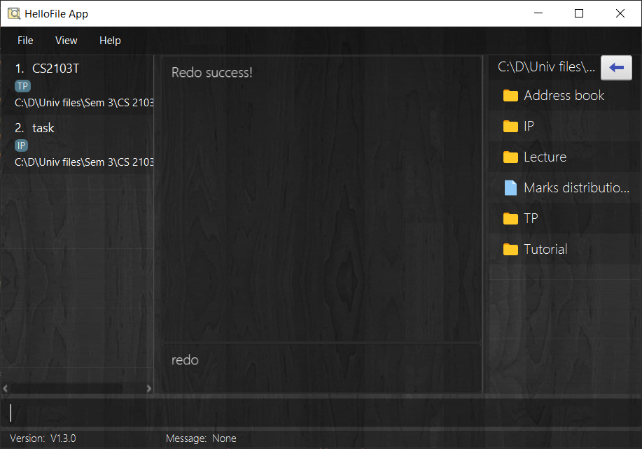

## 1. Introduction

As the information age encroaches out lives, our digital footprint has become larger and larger.
When we accumulate many files from work, school and daily lives,
we tend to spend a lot of time locating the files that we need.
In an Internation Data Corporation (IDC) [white paper](https://denalilabs.com/static/ProductivityWhitepaper.pdf)
published in 2012, a survey of 1200 information workers and IT professionals around the world
shows that they spend an average of 4.5 hours a week looking for documents. That is a lot of productivity time wasted!
This is where our solution, HelloFile, comes in.

*HelloFile* is a desktop application for professionals who have to manage a lot of files, specifically **tech savvy CS2103T CS students**.
It is optimised for use under Command Line Interface (CLI).
By using our application, you can tag frequently used files/folders with a short nickname, and open them
with a single command. We hope by using our application, you can manage your files easily. You can
make your life easier one file at a time, and free up your precious time to spend on things you truly enjoy.

## 2. Table of Contents
* Table of Contents
{:toc}

--------------------------------------------------------------------------------------------------------------------

## 3. Getting Started
As a first time user, you might be overwhelmed by the many features that *HelloFile* offers.
The following subsections will explain to you how to install and start using HelloFile quickly.

### 3.1 Installation
1. Ensure you have [Java 11](https://www.java.com/en/download/) or above installed in your computer.
2. Download the latest HelloFile.jar [here](https://github.com/AY2021S1-CS2103T-F12-1/tp/releases/).

### 3.2 Quick start
1. Move HelloFile.jar to the folder you intend to use as the home folder for HelloFile.
2. Double-click the HelloFile.jar icon to start the application. Alternatively, run the command `java -jar HelloFile.jar` in the command line.
3. Type `help` into the command box, followed by pressing the `Enter` key to view the supported features. Alternatively, click the help button in the menu bar to access our webpage.

### 3.3 User Interface

This diagram shows our interface.
1. The left panel is the *Tag Panel*. It contains the list of tags that you have created.
2. The middle panel is the *Result Panel*, where you can see the result of your command.
3. The right panel is the *File Explorer Panel*. It shows your current directory in HelloFile. You can either use command or click on a folder to navigate.
4. Below the *Result Panel* is the *Command History*. It shows your last command entered.
5. The *Command Box* at the bottom of the app window. You can type your commands here and hit enter to execute your command.

### 3.4 Basic Workflow
To use HelloFile effectively, we recommend the following workflow.

1. Tag important files with the `tag` command for ease of access. 
   
2. When trying to access tagged files, instead of navigating to the file location, simply use the `open` command to access the required files. 
   
3. To find the location of tagged files, use the `show` command to get the file path of the file. 
   
4. If you have made a mistake, you can recover by using `undo` and `redo`. 
  
   
5. To exit the application, either close the application window, or use the `exit` command.

--------------------------------------------------------------------------------------------------------------------

## 4. Features

There are many file management features in *HelloFile*.
We will explain them in detail in this section.

**:information_source: Notes about the command format:** 

* Words in `UPPER_CASE` are the parameters to be supplied by you. 
  e.g. in `tag t>TAG`, `TAG` is a parameter, such as in the case `add t>Myfile`.

* Expressions in square brackets are optional. 
  e.g `t>TAG [f>FILE_PATH]` can be used as `t>Myfile f>C:\Users` or as `t>Myfile`.

* Parameters can be in any order. 
  e.g. if the command specify `t>TAG f>FILE_PATH`, `f>FILE_PATH t>TAG` is also an acceptable command.

* Expressions with `...` at the end can be provided any number of times. 
  e.g. `t>TAG [l>LABEL]...` can be used as `t>TAG`, `t>TAG l>label`, or `t>TAG l>label1 l>label2 l>label3`.
  
* Every tag name must be unique, but multiple tags can point to the same filepath.

* Every tag name is case-sensitive. e.g tag name `notes` is different from tag name `Notes`.

* Only the `cd` and `tag` command accepts relative file path, all other commands require absolute file path.

* For MacOS and Linux users, your file path may be slightly different from the examples given.

**:warning: Warning for multiple expressions**

Expressions without `...` at the end takes the last parameter as the argument when provided with multiple same expressions. 
  e.g. `tag t>TAG1 t>TAG2` will take `TAG2` as the parameter, ignoring the parameter `TAG1`.

### 4.1 Adding a tag: `tag`

Tags a file with a unique tag name and optionally, some labels.

With this command, you can add a nickname, or "tag", to a file.
You can get a reference to that file using the same tag in every subsequent access.
For example, you can use the [`open`](#43-accessing-a-tagged-file--open) command to open the file that you have tagged.

Additionally, you can add short descriptors, or "labels" as well.
Labels serve to categorise tags. If you have multiple tags with the same label, you can open them all at once using the
`open` command.

**Please take note of the following:**
* You can add any number of labels to the tag (including 0).
* The `FILE_PATH` field can accept both absolute and relative file path from your current directory.
The internal File Explorer of HelloFile indicates the current folder for the relative path.
* Please make sure you have read permission for the file that you want to tag.
You can tag a file without access permission. However, you will not be able to open them.

**Format:** `tag t>TAG_NAME f>FILE_PATH [l>LABEL]...`

**Adding a new tag named `duke`:**

**Examples:**
* `tag t>Tag1 f>C:\Users` (Adds a tag `Tag1` using absolute path. The tag has no label and points to `C:\Users`)
* `tag t>Tag2 f>C:\Users l>Important` (Adds a tag `Tag2` using absolute path. The tag has a label `important` and points to`C:\Users`)
* `tag t>Tag3 f>Users` (Adds a tag `Tag3` using relative path. The tag has no label and points to a folder `Users` in the current directory)
* `tag t>Tag4 f>Users l>folder l>readonly` (Adds a tag `Tag4` using relative path. The tag has labels `folder` and `readonly`. It points to a folder `Users` in the current directory)

### 4.2 Displaying information of a tagged file : `show`

Displays the information of the specified tag.

You can see some basic information of a tagged file by using this command.
The command result panel will show you the tag's file path and label information, in case the UI can't show them in detail.

Alternatively, you can click on a specific tag in the tag panel to show its details.

**Format:** `show t>TAG_NAME`

**Showing information of the tag `duke`:**

**Examples:**
* `show t>my_research` (Shows the details of the tag with nickname `my_research`)
* `show t>file2020` (Show the details of the tag with nickname `file2020`)

### 4.3 Accessing a tagged file: `open`

Opens the file specified by the unique tag's nickname or label.

You can open a file using its tag, with the default application in your operating system.
Alternatively, you can open all files tagged with the same label by specifying a label instead.

**Please take note of the following:**
* This command only accepts one tag or one label but not both.
* Please ensure that you have read permission for the files that you want to open.

**:information_source: You can tag many files that you want to open at the same time with the same label, so you can open them at once.**

**Format:** `open t>TAG_NAME` or `open l>LABEL`

**Opening the tag `duke`:**

**Examples:**
* `open t>my_research` (Opens the file with tag name `my_research`)
* `open l>notes` (Opens all the files tagged with label `notes`)

### 4.4 Removing a tag: `untag`

Removes the specified tag from the list of tags.

By using that command, you can delete an unwanted tag in order to clean up the tag list. 
Information about the tag will be completely deleted.

**Format:** `untag t>TAG_NAME`

**Removing the tag `duke`:**

**Examples:**
* `untag t>notes` (Deletes tag with tag name `notes`)
* `untag t>secret_file` (Deletes tag with tag name `secret_file`)

### 4.5 Renaming a tag: `retag`

Renames a tag.

Use this command if you want to make changes to a tag name.
Note that this command can only change nickname. It does not change any other information such as label and file path.
Existing data will be carried over.

**Format:** `retag o>OLD_TAG_NAME t>NEW_TAG_NAME`

**Changing tag name from `duke` to `my ip`:**

**Examples:**
* `retag o>notes t>secret` (Renames an old tag name `notes` to new tag name `secret`)
* `retag o>examfiles t>oldexamfiles` (Renames an old tag name `examfiles` to new tag name `oldexamfiles`)

### 4.6 Adding a label to a tag: `label`

Adds one or more labels to an existing tag.

You can use label to categorise a tag, in order to make that tag to be more descriptive.
Additionally, all tags with the same label can be opened simultaneously.

**:warning: Duplicated labels will only be added once.**

**Format:** `label t>TAG_NAME l>LABEL1 [l>LABEL2]...`

**Adding the label `cs2103`:**

**Examples:**
* `label t>file1 l>important` (Adds a label `important` to an existing tag named `file1`)
* `label t>file2 l>important l>exam` (Adds labels of `important` and `exam` to an existing tag named `file2`)

### 4.7 Deleting multiple labels from a tag: `unlabel`

Deletes one or more labels from a tag.

This command lets you to remove label from a certain tag.
If you specified some valid and some invalid labels, the valid labels will be deleted from the tag, 
while the invalid ones will be shown to you for further action.

**Format:** `unlabel t>TAG_NAME l>LABEL1 [l>LABEL2]...`

**Removing the labels `ip` and `cs2103`:**

**Examples:**
* `unlabel t>notes l>secret` (Deletes a label of label name `secret` from tag named `notes`)
* `unlabel t>file1 l>important l>exams` (Deletes labels `important` and `exams` from tag named `file1`)

### 4.8 Finding a tag: `find`

Finds a tag using one or more keywords.

This command lets you find a specific tag easily by providing one or more keywords.
If any of the keyword matches the tag name and/or label partially, it will be listed in the *Tag Panel*.

**Format:** `find KEYWORD...`

**Before executing command:**

**After executing command:**

        
**Examples:**
* `find he` (Finds tags which contains `he` in their label/tag name, e.g. `hello`, `hero`, etc.)
* `find tagname label` (Finds tags which contains `tagname` or `label` in their label/tag name, e.g. `tagname123`, `label345`, etc.)

### 4.9 Changing current directory: `cd`

Changes the current directory of the HelloFile internal File Explorer.

This command allows you to navigate through your folders, so that you can tag your files with relative file path.
Moreover, by using this command, you will be able to see what files are available for tagging in a certain folder.

You can change the current directory in 3 ways:
* Using `f>` to go to a folder using an absolute path
* Using `./` to go to a folder using a relative path
* Using `../` to go to the current folder's parent

Alternatively, you can click on the folder in the *File Explorer Panel* to navigate.

**Format 1:** `cd f>ABSOLUTE_FILE_PATH`

**Format 2:** `cd ./RELATIVE_FILE_PATH`

**Format 3:** `cd ../`

**Setting current path using the relative file path:**

**Examples:**
* `cd f>C:\Users` (Changes the current directory to `C:\Users`)
* `cd ./tp` (Changes the current directory to the child directory `tp`)
* `cd ../` (Changes the current directory to the parent directory)

### 4.10 Listing all tags: `ls`

Lists all added tags.

Shows all the tags saved in HelloFile in the *Tag Panel*. This command is useful after you used
`find` command to restore the entire list of tags. 

**Format:** `ls`

**Before executing command:**

**After executing command:**

### 4.11 Undoing command: `undo`

Undo a recently executed command.

If you made a mistake, you can use the `undo` command to recover the previous state of *HelloFile*.
You can undo these commands: `tag`, `retag`, `untag`, `label`, `unlabel`, `clear`, and `redo`.

**:warning: Command history will be deleted once you close the *HelloFile* app!**

**Format:** `undo`

**Before executing command:**

**After executing command:**

### 4.12 Redoing command: `redo`

Redo a recently executed command.

Redo is only available when undo has been executed.

**:warning: Command history will be deleted once you close the *HelloFile* app!**

**Format:** `redo`

**Before executing command:**

**After executing command:**

### 4.13 Clearing all tags: `clear`

Clears the list of all tags.

**:warning: All tags will be deleted!**

**Format:** `clear`

**Clears all tags:**

### 4.14 Exiting the application: `exit`

Exits the application.

**Format:** `exit`

### 4.15 Viewing help: `help`

Displays help message for all or a certain command.

**Format 1:** `help`

**Format 2:** `help COMMAND`

**Showing all commands:**

**Showing a specific command:**

**Examples:**
* `help` (Shows all command and its format)
* `help cd` (Shows `cd` command description, format and examples usage)

--------------------------------------------------------------------------------------------------------------------

## 5. Customisation
*HelloFile* supports user customisation such as themes.
You can choose a theme from our theme library, so that you can personalise *HelloFile* to your liking.

### 5.1 Changing themes
*HelloFile* comes with many themes. To change the theme, go to the *Toolbar* of the application
and select `view`, followed by `theme`. A new pop up window will be shown with available themes along with a quick preview
as illustrated below.

### 5.2 Changing view sizes
*HelloFile* allows you to resize the view of each sub-components according to your need. You can simply
drag each view to the size desired.

### 5.3 Persistent customisation
Your customisation options (window size and theme) are saved and persist even when you close the application. HelloFile remembers your settings,
so you can spend your time on more productive pursuits.

--------------------------------------------------------------------------------------------------------------------

## 6. FAQ
**Q**: What if the name or the directory of the file I tagged is changed? Can I still access the file using HelloFile? 
**A**: No. HelloFile is currently unable to track a file if you make changes to the file's name or directory.
You will need to delete the old tag or retag the file.

**Q**: What is the structure of the application? 
**A**: You can find it in the Developer Guide [here](https://github.com/AY2021S1-CS2103T-F12-1/tp/blob/master/docs/DeveloperGuide.md)

**Q**: How do I report a bug? 
**A**: Please create a new issue on [this](https://github.com/AY2021S1-CS2103T-F12-1/tp/issues) webpage.

**Q**: Can I contribute to the project? 
**A**: Sorry, as this is a school project, we are not accepting any contributors at this period.

**Q**: Why does list command use `ls` as the keyword instead of `list`?  
**A**: In most terminals, `ls` is the default keyword for listing files and folders. We would like the transition 
from terminal to HelloFile to be as smooth as possible for our target users.

--------------------------------------------------------------------------------------------------------------------

## 7. Glossary

Terminology | Definition
--------------|------------------
**CLI** | Command Line Interface is a command line program that accepts text input to execute operating system functions
**GUI** | Graphical User Interface is a form of user interface that allows users to interact with electronic devices through graphical icons, instead of text-based user interfaces.
**Absolute path** | The complete address of a file location. Usually, the address consists of the root element and the complete directory list required to locate the file Example: `C:\Users\a.txt` (Windows), `/home/usr/b.txt` (Linux)).
**Relative path** | The partial address of a file location. Usually, the address does not consist root element. Example: `./Users/Files/a.txt`,
**Tag** | A piece of information that links a nickname to a file address.
**Label** | An additional information linked to a tag. A label is used to categorise tags and enable additional features.

--------------------------------------------------------------------------------------------------------------------

## 8. Command Summary

Action | Format | Examples
--------|--------|----------
**Tag** | `tag t>TAG_NAME f>FILE_PATH [l>LABEL]` | `tag t>cs2103 f>c:/nus/cs2103 l>cs`
**Show** | `show t>TAG_NAME` | `show t>cs2103`
**Untag** | `untag t>TAG_NAME` | `untag t>cs2103`
**Retag** | `retag o>OLD_TAG_NAME t>NEW_TAG_NAME` | `retag o>cs2103 t>cs2103t`
**Find** | `find KEYWORD` | `find 2103`
**Open** | `open t>TAG_NAME` or `open l>LABEL` | `open t>cs2103` or `open l>cs`
**Label** | `label t>TAG_NAME l>LABEL1 [l>LABEL2...]` | `label t>cs2103 l>core` or `label t>cs2103 l>important l>core`
**Unlabel** | `unlabel t>TAG_NAME l>LABEL1 [l>LABEL2...]` | `unlabel t>cs2103 l>cs` or `unlabel t>cs2103 l>important l>cs`
**List** | `ls` | `ls`
**Change directory to an absolute file path**| `cd f>ABSOLUTE_FILE_PATH` | `cd f>C:\Users`
**Change directory to a relative file path**| `cd ./RELATIVE_FILE_PATH` | `cd ./project01`
**Change directory to the parent file path**| `cd ../` | `cd ../`
**Undo** | `undo` | `undo`
**Redo** | `redo` | `redo`
**Clear** | `clear` | `clear`
**Help** | `help` or `help COMMAND` | `help cd`
**Exit** | `exit` | `exit`
