Choose a topic from the table of contents to get started on your **Wishful Shrinking journey**. 

## Table of Contents 

1. [Overview](#1-overview)
    - [1.1. Introduction](#11-introduction)
    - [1.2. Purpose](#12-purpose)
2. [About the user guide](#2-about-the-user-guide)
    - [2.1. Symbols](#21-symbols)
    - [2.2. Parameters](#22-parameters)
    - [2.3. Format](#23-format)
3. [GUI Layout](#3-gui-layout)
4. [Quick Start](#4-quick-start)
5. [Commands](#5-commands)
    - [5.1 Recipe-related Commands](#51-recipe-related-commands)
        * [5.1.1 Adding a recipe: `addR`](#add-recipe)
        * [5.1.2 Listing all recipes : `recipes`](#list-recipe)
        * [5.1.3 Deleting a recipe : `deleteR`](#delete-recipe)
        * [5.1.4 Editing a recipe: `editR`](#edit-recipe)
        * [5.1.5 Getting a recipe to edit: `editR`](#get-edit-recipe)
        * [5.1.6 Selecting a single recipe : `selectR`](#select-recipe)
        * [5.1.7 Closing the recipe drawer : `close`](#close-recipe)
        * [5.1.8 Searching for a recipe: `searchR`](#search-recipe)
        * [5.1.9 Recommending recipes : `recommend`](#recommend-recipe)
        * [5.1.10 Clearing all recipes : `clearR`](#clear-recipe) 
          
    - [5.2 Fridge-related Commands](#52-fridge-related-commands)
        * [5.2.1 Adding an ingredient: `addF`](#add-ingredient)
        * [5.2.2 Listing all ingredients : `fridge`](#list-ingredient)
        
        

        
        * [5.2.3 Deleting an ingredient : `deleteF`](#delete-ingredient)
        * [5.2.4 Editing an ingredient: `editF`](#edit-ingredient)
        * [5.2.5 Getting an ingredient to edit: `editF`](#get-edit-ingredient)
        * [5.2.6 Searching for an Ingredient: `searchF`](#search-ingredient)
        * [5.2.7 Clearing all ingredients : `clearF`](#clear-ingredient)
          
    - [5.3 Consumption-related Commands](#53-consumption-related-commands)
        * [5.3.1 Eating a recipe : `eatR`](#eat-consumption)
        * [5.3.2 Listing all recipes eaten : `calories`](#list-consumption)
        * [5.3.3 Deleting a recipe eaten: `deleteC`](#delete-consumption)
        * [5.3.4 Clearing all consumed recipes : `clearC`](#clear-consumption) 
          
    - [5.4 Miscellaneous Commands](#54-miscellaneous-commands)
        * [5.4.1 Viewing help : `help`](#help)
        * [5.4.2 Exiting the program : `exit`](#exit)
        * [5.4.3 Saving the data](#save)
6. [FAQ](#6-faq)
7. [Glossary](#7-glossary)
8. [Command Summary](#8-command-summary)
    - [8.1 Recipe-related Commands](#81-recipe-related-commands)
    - [8.2 Ingredient-related Commands](#82-ingredient-related-commands)
    - [8.3 Consumption-related Commands](#83-consumption-related-commands)
    - [8.4 Miscellaneous Commands](#84-miscellaneous-commands)
        
        

# 1. Overview 
Welcome to the Wishful Shrinking User Guide! In this section, you will be given an overview of what Wishful
 Shrinking is about and what you can get out of reading this document.   

## 1.1 Introduction 
Wishful Shrinking is your desktop diet manager. It is an app that helps you **manage your on-hand ingredients
, organise personal recipes and track your diet**. Wishful Shrinking facilitates a **healthier diet** in three main
 ways: 
1. Provide a **source of healthy, customizable recipes** 
2. **Recommend recipes** to improve ease of home cooking 
3. **Track daily food and calorie** intake  

Wishful Shrinking targets **office workers** who tend to neglect healthy eating. Office workers are also more
 familiar with desktop applications and typing and correspondingly, Wishful Shrinking is optimized for fast and efficient typers as it uses a Command Line Interface (CLI) with the added beauty of a Graphical User Interface (GUI).
 Wishful Shrinking is available for the Linux, Unix, Windows and Mac OS operating systems.   

## 1.2 Purpose 
This user guide provides in-depth documentation on the **installation process**, **step-by-step instructions** for
 each feature and **troubleshooting recommendations**.   

# 2. About the User Guide 
This section will explain the symbols in the user guide, parameters and the format of commands.   

## 2.1 Symbols 

Symbol | Meaning
-------|------------------
:memo: | This symbol indicates information to take note of.
:bulb: | This symbol indicates a helpful tip when using the command.

## 2.2 Parameters 

Prefix | Parameter | Meaning
--------|----------|--------
n/ | NAME | Name of recipe or name of ingredient
i/ | INGREDIENT | Ingredient name and optional quantity
instr/ | INSTRUCTION | Instructions of a recipe
c/ | CALORIE | Calories of a recipe
img/ | IMAGE | Image address of a recipe
t/ | TAG | Recipe tag
| INDEX | Index of item in the recent displayed item list

## 2.3 Format 

**:information_source: Notes about the command format:** 

* All prefixes must be preceded by a space. 
   e.g <code> t/</code>, <code> i/</code>

* All commands are **case-sensitive**. 
  e.g. in `addR`, `add` is in small letters while `R` is in capital letters.

* Words in `UPPER_CASE` are the parameters to be **supplied by you**. 
  e.g. in `addR n/NAME`, `NAME` is a parameter which can be used as `addR n/salad`.

* Items in **square brackets are optional**. 
  e.g `n/NAME [t/TAG]` can be used as `n/Salad` or as `n/Salad t/healthy`.

* Items with `…` after means that there can be **more than 1** item. It is necessary to specify the prefix
 before every item. 
  e.g. `[t/TAG]…` can be used as `t/healthy` or `t/healthy t/low calories`.

* Items in the more format `[<character> MORE ITEM]` means there can be **more than 1** item, separated by the
 specified character. It is not necessary to specify the prefix before each item.   
 e.g `instr/INSTRUCTION[. MORE INSTRUCTION]` can be used as `instr/Open baked beans and serve` or `instr/Open
  baked beans. Fry beans. Serve.`.
 e.g `n/[ MORE NAMES]` can be used as `n/salad` or `n/salad pie apple`.

* `INDEX` **must be a positive integer** e.g. 1, 2, 3... 
  e.g. the `INDEX` in `deleteR INDEX` and `editF INDEX` must be a positive integer that is present in the
   corresponding lists e.g. `deleteR 1` `editF 2`.

* Parameters can be in **any order**. The only exception is if one of the parameter is an INDEX, in this case
, **INDEX must be the first parameter**.  
  e.g. if the command specifies `n/NAME i/INGREDIENTS`, then `i/INGREDIENTS n/NAME` is also acceptable.
  e.g. if the command specifies `INDEX n/NAME i/INGREDIENTS`, then `n/NAME INDEX i/INGREDIENTS` is not acceptable.

  

# 3. GUI Layout 
Contributed by: Hieu

  This section will explain the components of Wishful Shrinking's main window.   

The image below is a labeled diagram of each of Wishful Shrinking's components.  
   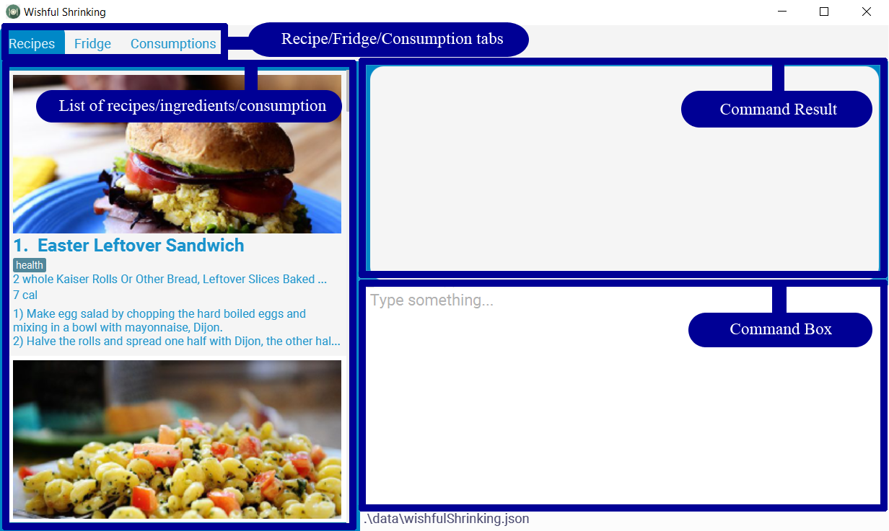
      
   

   Below is a brief explanation on each of the components:

Component | Explanation
--------|------------------
**Recipe/Fridge/Consumption tabs** | These are the tabs for recipe-related commands, fridge-related commands and consumption-related commands. The coloured tab shows which tab you are currently in.    By default, you will be in the **Recipes** tab whenever you start up Wishful Shrinking. When you execute a command, you will automatically be switched to the related tab.    In the image above, the user is currently in the Recipes tab. 
**List of recipes/ingredients/consumption** | The left window will display either a list of recipes, a list of ingredients or the consumption list depending on your input.    In the image above, it is displaying the Recipe List.
 **Command Result** | The Command Result box will show the result of your input into the Command Box.
 **Command Box** | Here is where you will type all your commands.

# 4. Quick start 

1. Ensure your computer has Java `11` or above installed.

2. Download the latest `wishfulShrinking.jar` from [here](https://github.com/AY2021S1-CS2103T-W10-2/tp/releases).

3. Copy the file to an empty folder you want to use as the _home folder_.

4. **Double-click** the jar file to start the app OR start the app using **CLI** and type `java -jar wishfulShrinking.jar`. 
   The app should look similar to the one shown below:  
   
      

5. Type the command in the command box and press `Enter` to execute it. 
   Some example commands you can try:

   * **`recipes`** : Lists all recipes.

   * **`addR`**` n/salad i/lettuce, carrots, olive oil c/40 instr/Prepare the ingredients. Toss the ingredients together. Serve. img/https://www.onceuponachef.com/images/2019/07/Big-Italian-Salad.jpg t/yummy t/healthy` : Adds a `salad` recipe to Wishful Shrinking.

   * **`deleteR`**`3` : Deletes the 3rd recipe shown in the current recipe list.

   * **`exit`** : Exits the app.
   
   * **`help`** : Opens the help window.

6. Refer to the [next section](#5-commands) for details of each command.
  

## 5. Commands 

:memo: **Note:**
If multiple prefixes and values are specified when the format only specifies one, then the only last value is
 accepted. e.g. `addF i/apple i/banana` only banana is accepted

 

## 5.1 Recipe-related Commands 

The Recipe-related commands include [`addR`](#add-recipe), [`recipes`](#list-recipe), [`deleteR`](#delete-recipe
), [`editR`](#edit-recipe), [get `editR`](#get-edit-recipe), [`selectR`](#select-recipe), [`close`](#close-recipe
), [`searchR`](#search-recipe), [`recommend`](#recommend-recipe) and [`clearR`](#clear-recipe). These are the commands in Wishful Shrinking that
are relevant only to Recipes.
   

### 5.1.1 Adding a recipe: `addR` 
Contributed by: Hieu, Jia Qi, Tian Yong, Caitlin, Olivia

  Adds a recipe to Recipe List.

   The image below is what Wishful Shrinking looks like after you have added a recipe.   
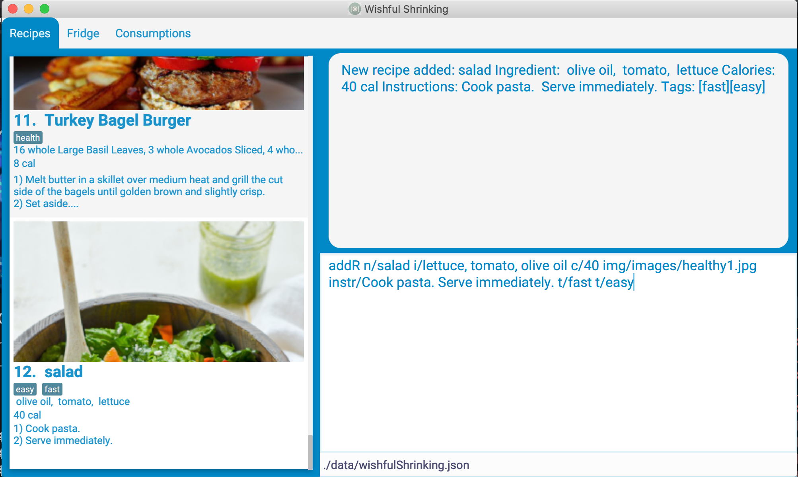
   

Format: `addR n/NAME i/INGREDIENT [ -QUANTITY][, MORE INGREDIENTS [ -QUANTITY]] c/CALORIES [img/IMAGE] instr
/INSTRUCTION[. MORE INSTRUCTIONS] [t/TAG]...`

* `INGREDIENT` can take in an optional `Quantity` e.g. `i/Tomato -2 whole` or `i/salt -a pinch`.

:memo: **Note:**
`QUANTITY` is separated with a mandatory space before `-`. After the dash, it accepts quantity in the format of
 -(NUMBER)(STRING) e.g. `-54.0 kilograms` or STRING e.g. `-a pinch`. NUMBER only accept up to 10 digits, including a
  single forward slash to represent fractions or a single full stop to represent decimal numbers and trailing whitespaces and should be
   greater than 0. STRING accepts alphabets.

:memo: **Note:**
Multiple ingredients are separated by `,`.

 

:memo: **Note:**
    You cannot add duplicate recipes into Wishful Shrinking. Duplicate recipes means recipes with both the same
     recipe name and ingredient names. You may add two recipes with the same name, but different ingredient names, or vice
      versa. If two recipes have the same image, instructions and tags, but different recipe names or ingredient
       names or both, they are not considered duplicate recipes.

* `CALORIES` **must be a positive integer** e.g. 150, 200...
* `IMAGE` can be in two formats:
    * Local path e.g. images/healthy1.jpg 
    * URL (online image) e.g. https://vaya.in/recipes/wp-content/uploads/2018/06/Club-sandwich.jpg

:bulb: **Tip:**
       If you copy and paste an image url, make sure there is no new line automatically added that can trigger a
        format error.
    

:memo: **Note:**
Everyone should have permission to access the image path or online image URL you provide.

 

* Here are the respective actions required by users depending on different usage of `IMAGE`:

  Usage | Action | Example | Outcome
  ---------|-----------------------|---------|---------
  Image from local storage | 1. Specify **absolute path** of the image   2. Add **file://** in front of the file path   3. Replace **IMAGE** in img/IMAGE with the file path of your image | file:///D:/images/wishful /data/myimage.png | Local image will be displayed
  Image from online resources | 1. Make sure the computer is connected to Internet   2. Copy the online **image address** | Valid image address which starts with https:// and ends with .jpg or jpeg or png | The image will be downloaded into data folder and displayed
 
 

  
  Usage | Action | Example | Outcome
  ---------|-----------------------|---------|---------
  Sample images | Replace IMAGE in img/IMAGE with the **file path**  (refer to table [below](#table) ) | img/images/healthy1.jpg | Sample image is displayed
  Invalid image | NA | 1. Invalid local file path  2. Invalid URL  3. No internet connection when adding an online image    4. Wishful Shrinking doesn't have permission to access the folder or website | Default image will be displayed
  No image input | NA | NA | Default image will be displayed since `IMAGE` is **OPTIONAL FIELD**
 

* Here is the table  containing built-in **sample images** provided by Wishful Shrinking:

     Image | File Path | Image | File Path
     --------|--------------|--------|-------------
      | images/healthy1.jpg | 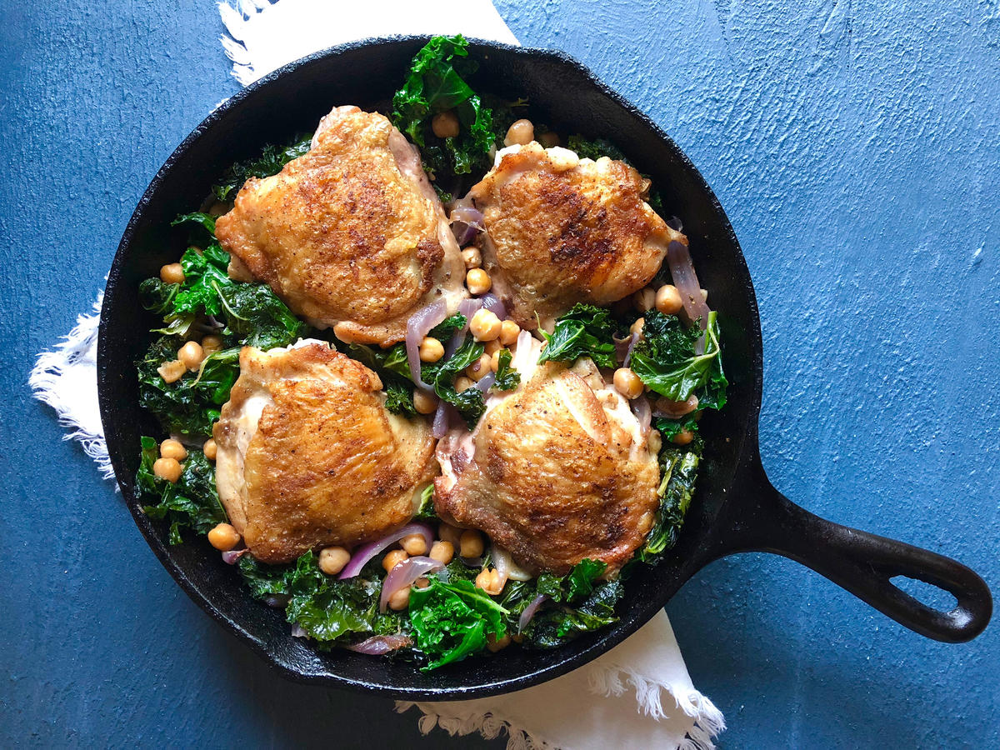 | images/healthy4.jpg
     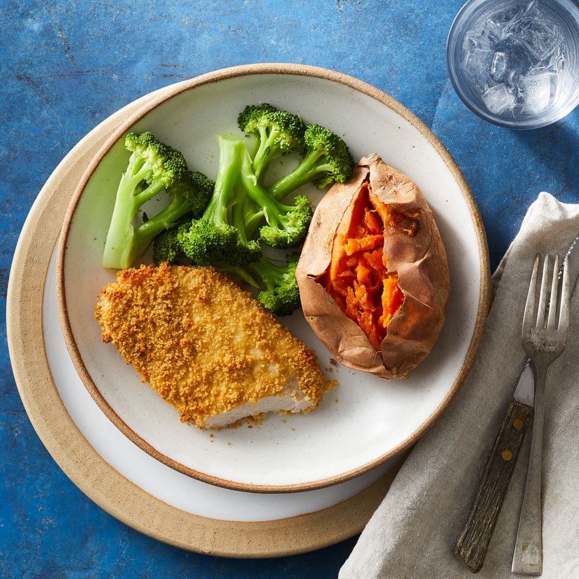 | images/healthy2.jpg | 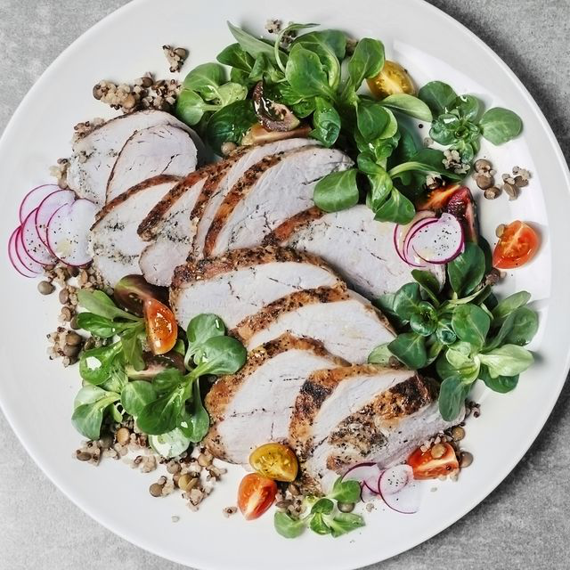 | images/healthy5.jpg

Image | File Path | Image | File Path
     --------|--------------|--------|-------------
     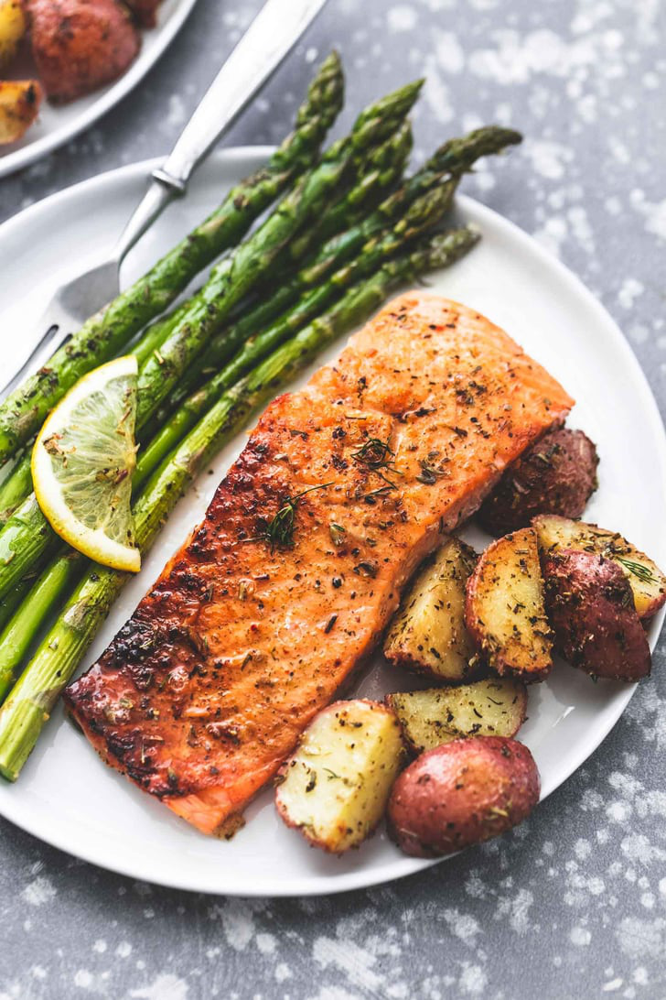 | images/healthy3.jpg | 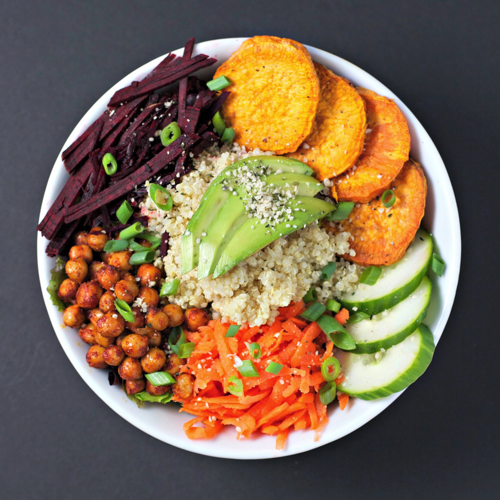 | images/healthy6.jpg

* `INSTRUCTION` will take in a series of instruction text and Wishful Shrinking will automatically separate each
 step of the instruction based on the end of a sentence, indicated by a `.`.

:bulb: **Tip:**
   Wishful Shrinking numbers each instruction step after separating the input instruction by the position(s) of
    `.` so there is no need to number the instructions.

 

Examples:
* `addR n/salad i/lettuce, tomato, olive oil c/40 img/images/healthy1.jpg instr/Cook pasta. Serve immediately. t/fast t/easy`
* `addR n/sandwiches i/breads, cheese -2 slices c/80 img/https://vaya.in/recipes/wp-content/uploads/2018/06/Club-sandwich.jpg instr/Cook. Eat.`
   

### 5.1.2 Listing all recipes : `recipes` 
Contributed by: Jia Qi

  Shows a list of all recipes in the Recipe List.

   The image below is what Wishful Shrinking looks like after you have listed all recipes.   
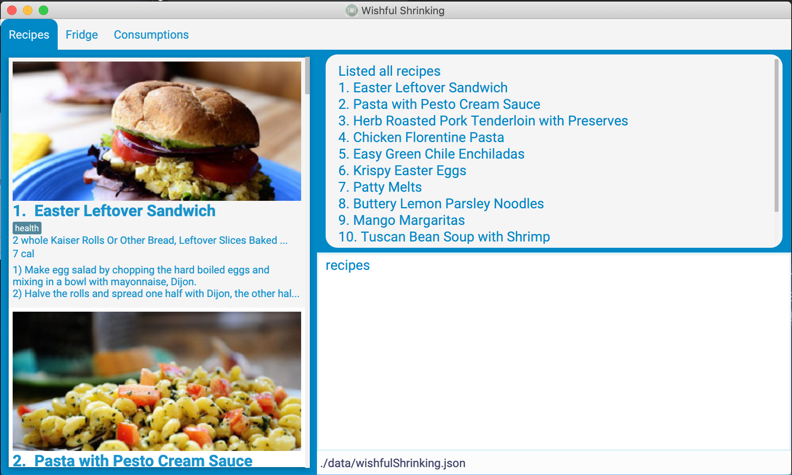
   

Format: `recipes`
   

### 5.1.3 Deleting a recipe : `deleteR` 
Contributed by: Jia Qi

  Deletes the specified recipe from the Recipe List.

   The image below is what Wishful Shrinking looks like after you have deleted a recipe.   
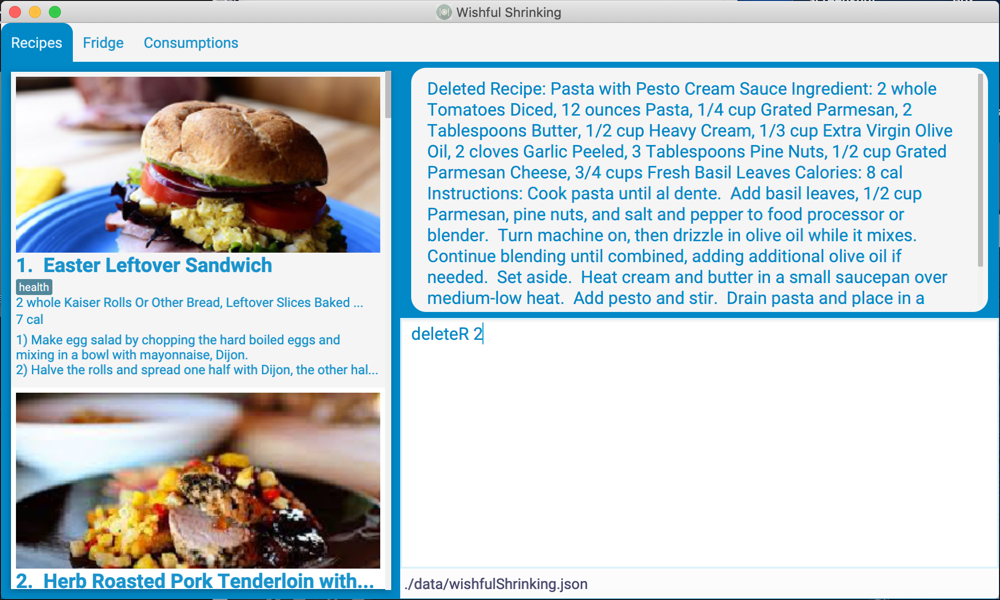
   

Format: `deleteR INDEX`

* Deletes the recipe at the specified `INDEX`.
* The index refers to the index number shown in the recent displayed Recipe List.

:memo: **Note:**
    Deleting a recipe **will not** affect the recipes that have been eaten in the consumption list.

Examples:
* `recipes` followed by `deleteR 2` deletes the 2nd recipe in Recipe List.
* `searchR n/salad` followed by `deleteR 1` deletes the 1st recipe in the result of the `searchR` command.
   

### 5.1.4 Editing a recipe: `editR` 
Contributed by: Olivia, Jia Qi, Tian Yong, Caitlin

  Edits the specified recipe from the Recipe List.

   The image below is what Wishful Shrinking looks like after you have edited a recipe.   
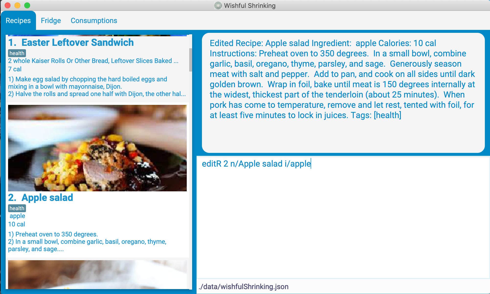
   

Format: `editR INDEX [n/NAME] [i/INGREDIENT [ -QUANTITY][, MORE INGREDIENTS [ -QUANTITY]]] [c/CALORIES] [img/IMAGE] 
[instr/INSTRUCTION[. MORE INSTRUCTIONS]] [t/TAG]...`

* Edits the recipe at the specified `INDEX`.
* The index refers to the index number shown in the recent displayed Recipe List.
* `INGREDIENT` can take in an optional `Quantity` e.g. `i/Tomato -2 whole` or `i/salt -a pinch`.

:memo: **Note:**
`QUANTITY` is separated with a mandatory space before `-`. After the dash, it accepts quantity in the format of
 -(NUMBER)(STRING) e.g. `-54.0 kilograms` or STRING e.g. `-a pinch`. NUMBER only accept up to 10 digits, including a
  single forward slash to represent fractions or a single full stop to represent decimal numbers and trailing whitespaces and should be
   greater than 0. STRING accepts alphabets.

:memo: **Note:**
Multiple ingredients are separated by `,`.

 

* `CALORIES` **must be a positive integer** e.g. 150, 200...
* `IMAGE` can be in two formats:
    * Local path e.g. images/healthy1.jpg 
    * URL (online image) e.g. https://vaya.in/recipes/wp-content/uploads/2018/06/Club-sandwich.jpg
    
    
:bulb: **Tip:**
       If you copy and paste an image url, make sure there is no new line automatically added that can trigger a
        format error.
    
 

* Here are the respective actions required by users depending on different usage of `IMAGE`:

  Usage | Action | Example | Outcome
  ---------|-----------------------|---------|---------
  Image from local storage | 1. Specify **absolute path** of the image   2. Add **file://** in front of the file path   3. Replace **IMAGE** in img/IMAGE with the file path of your image | file:///D:/images/wishful /data/myimage.png | Local image will be displayed
  Image from online resources | 1. Make sure the computer is connected to Internet   2. Copy the online **image address** | Valid image address which starts with https:// and ends with .jpg or jpeg or png | The image will be downloaded into data folder and displayed
  Sample images | Replace IMAGE in img/IMAGE with the **file path**  (refer to this [table](#table) ) | img/images/healthy1.jpg | Sample image is displayed
  Invalid image | NA | 1. Invalid local file path  2. Invalid URL  3. No internet connection | Default image will be displayed
  No image input | NA | NA | Default image will be displayed since `IMAGE` is **OPTIONAL FIELD**
  
 
* All fields are optional, but **at least** the recipe index and one of the fields must be present to edit
     a recipe.    

:bulb: **Tip:**
    Specifying an empty tag prefix: `t/` will clear all tags if any of the specified recipe.

 
     
* You are not allowed to edit a recipe into an already existing recipe in the Recipe List.

:memo: **Note:**
    Duplicate recipes means recipes with both the same
     recipe name and ingredient names. You may add two recipes with the same name, but different ingredient names, or vice
      versa. If two recipes have the same image, instructions and tags, but different recipe names or ingredient
       names or both, they are not considered duplicate recipes.

:memo: **Note:**
    Modifying a recipe **will not** affect the recipes that have been eaten in the consumption list.

:bulb: **Tip:**
    Specified fields will override existing values with the new values- the edit is not cumulative
    . Typing `editR INDEX` and then hitting `Enter` will insert the information of the recipe at the specified
     `INDEX` into the command box, letting you directly modify the existing recipe. 

 

Examples:
* `editR 2 n/Apple salad i/apple` will update the name of the 2nd recipe in the displayed Recipe List to Apple
 salad and the ingredients to contain only an apple ingredient.
   

### 5.1.5 Getting a recipe to edit: `editR` 
Contributed by: Olivia

  Inserts the editR command concatenated with the information of the specified recipe into the command box
 for editing purposes.

   The image below is what Wishful Shrinking looks like after you have gotten a recipe to edit.   
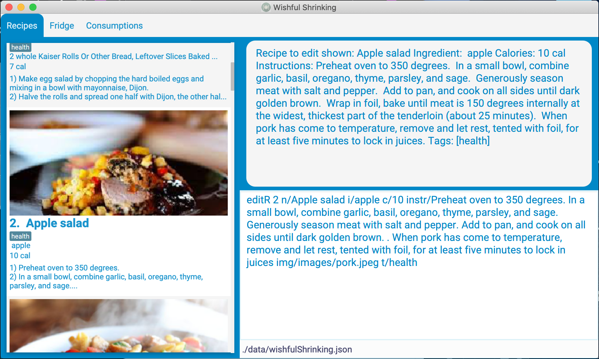
   

Format: `editR INDEX`

* Gets the information of the recipe at the specified `INDEX` and adds it behind the edit recipe command in the command box.
* The index refers to the index number shown in the recent displayed Recipe List.

Examples:
* `editR 2` followed by `Enter` will insert the information of the 2nd recipe in the displayed Recipe List into
 the
 command box.
   

### 5.1.6 Selecting a single recipe : `selectR` 
Contributed by: Hieu

  Displays the information of a single recipe in full view.

   The image below is what Wishful Shrinking looks like after you have selected a specific recipe.   
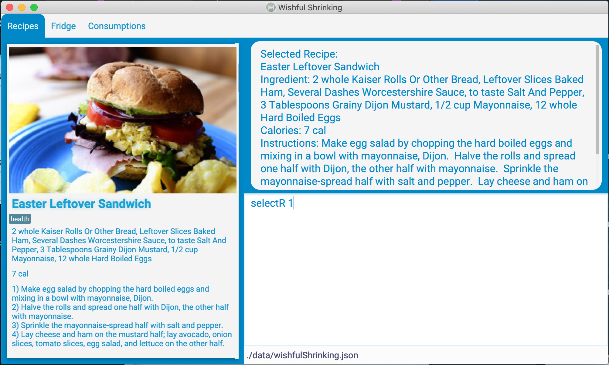
   

Format: `selectR INDEX`

* Selects the recipe at the specified `INDEX` to show its full information.
* The index refers to the index number shown in the recent displayed Recipe List.

Examples:
* `selectR 1` shows the 1st recipe in full view in the left drawer.
   

### 5.1.7 Closing the recipe drawer : `close` 
Contributed by: Hieu

  Closes the left drawer if it has been opened by the select command.

   The image below is what Wishful Shrinking looks like after you have closed the left drawer. It should look similar to before you selected a recipe.   
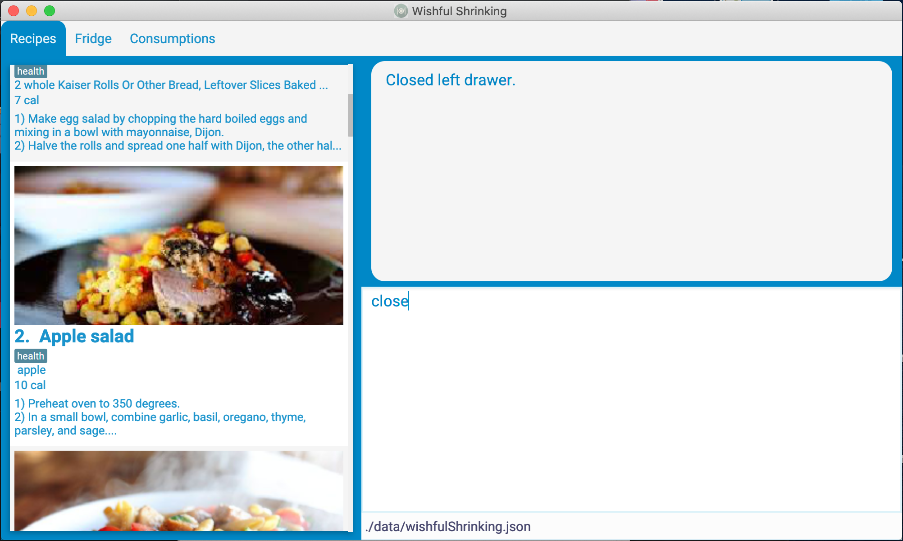
   

Format: `close`

* This command closes the left drawer that is opened after you select a recipe.
* Nothing will happen if you use this command when the left drawer is not open.
   

### 5.1.8 Searching for a recipe: `searchR` 
Contributed by: Caitlin

  Finds recipes in the Recipe List that contains all the specified ingredient(s), or whose name or tag(s) contain any of the specified keywords.

   The image below is what Wishful Shrinking looks like after you have searched for a recipe. In this case, the recipe is being searched by ingredients.   
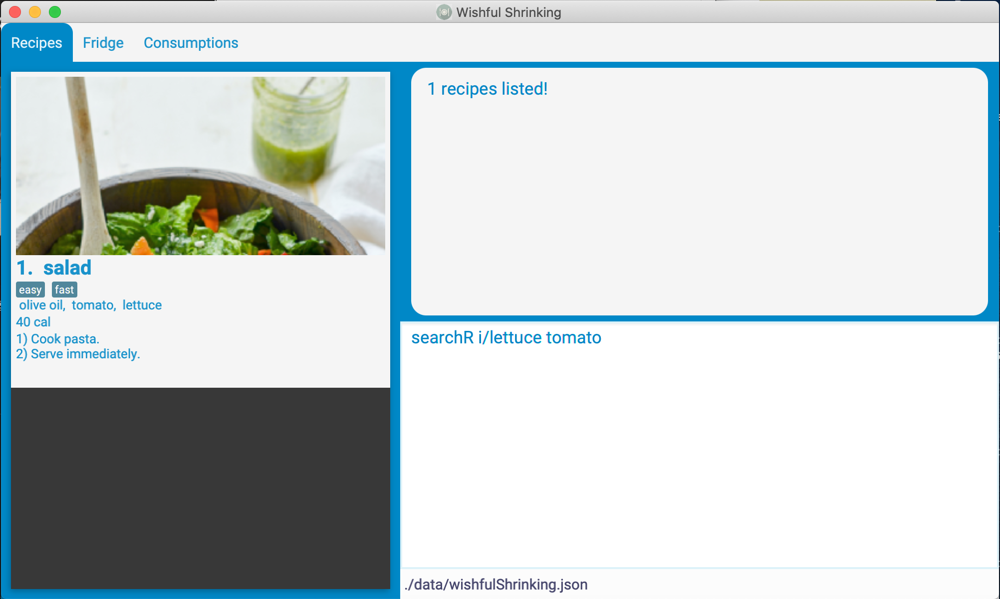
   

Format: `searchR [i/INGREDIENT [ MORE INGREDIENTS]] [n/NAME] [t/TAG [ MORE TAGS]]`

* The search is case-insensitive. e.g. `salad` will match `Salad`.
* The search will match partial keywords. e.g. `sandw` will match `sandwich`.
* The order of the keywords does not matter. e.g. Ham Salad will match Salad with Ham.
* If multiple keywords are specified for **name** and **tags**, all recipes containing **any** of the keywords will match the search.
* If multiple **ingredients** are searched, only recipes that contain **all** of the ingredients specified will match the search.
* All fields are optional, but **only one** of the fields must be present to search by recipe ingredient(s), recipe name or recipe tag(s).
* If more than one field is specified, Wishful Shrinking will only search by the **first** field stated.

:memo: **Note:**
    Multiple ingredients and tags are separated by a **space** and not a comma.

Examples:
* `searchR i/lettuce tomato` returns `salad` that has both ingredients `lettuce` and `tomato`.
* `searchR n/salad` returns `salad` and `ham salad`.
* `searchR t/healthy` returns `salad` with tag `healthy`.
   

### 5.1.9 Recommending recipes : `recommend` 
Contributed by: Caitlin

  Shows a list of all recipes in the Recipe List that can be made with the ingredients in your Fridge.

   The image below is what Wishful Shrinking looks like after you have gotten the recommended recipes. In
 this case, `recommend` returns the recipe `salad` with ingredients `lettuce`, `olive oil` and `tomato` since
  the example user has all the ingredients: `lettuce`, `olive oil` and `tomato` in their Fridge.  

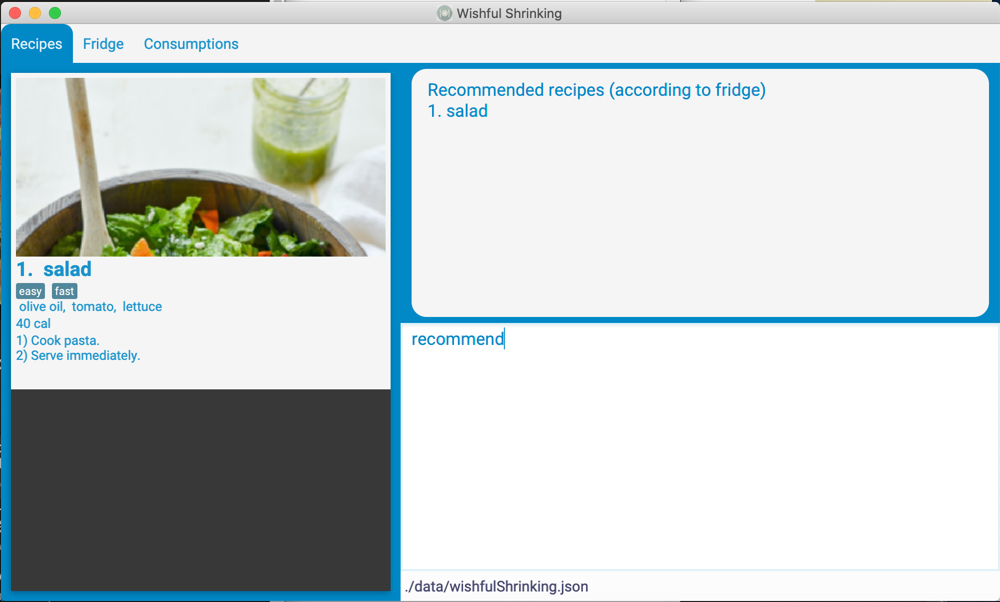
   

Format: `recommend`

* Recipes are only recommended if your Fridge contains all of a recipe's ingredients.

:memo: **Note:**
    Ingredient quantity is not taken into account when determining whether an ingredient is present in your Fridge.

Examples:
* `recommend` returns the recipe `salad` with ingredients `lettuce`, `onion` and `tomato` **only if** you have
 all `lettuce`, `onion` and `tomato` in your Fridge.
   

### 5.1.10 Clearing all recipes : `clearR` 
Contributed by: Tian Yong

  Clears all the recipes in the Recipe List.

   The image below is what Wishful Shrinking looks like after you have cleared all recipes.   
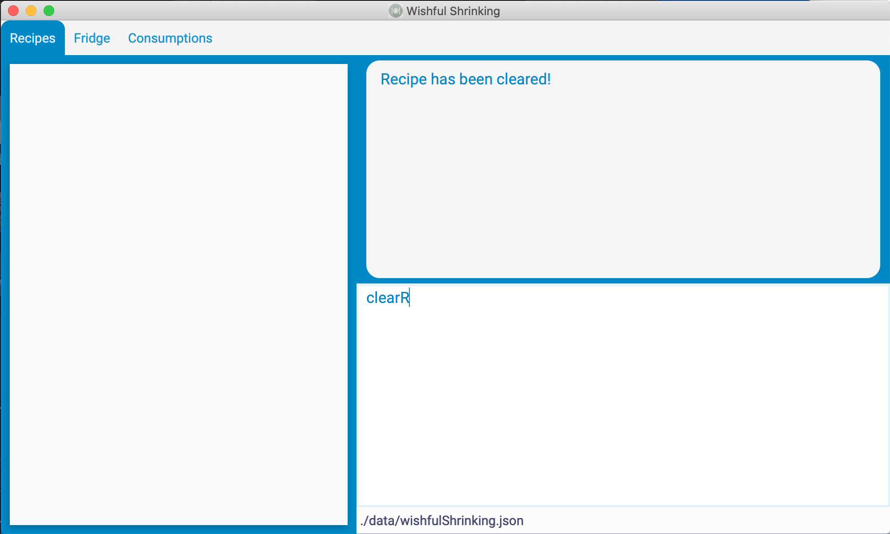
   

Format: `clearR`
   

## 5.2 Fridge-related Commands 

The Fridge-related commands include [`addF`](#add-ingredient), [`fridge`](#list-ingredient), [`deleteF`](#delete-ingredient), 
[`editF`](#edit-ingredient), [get `editF`](#get-edit-ingredient), [`searchF`](#search-ingredient) and [`clearF
`](#clear-ingredient). These are the
 commands in Wishful Shrinking that are relevant only to the Fridge.
   

### 5.2.1 Adding an ingredient: `addF` 
Contributed by: Caitlin, Olivia

  Adds an ingredient to the Fridge.

   The image below is what Wishful Shrinking looks like after you have added an ingredient to the Fridge.   
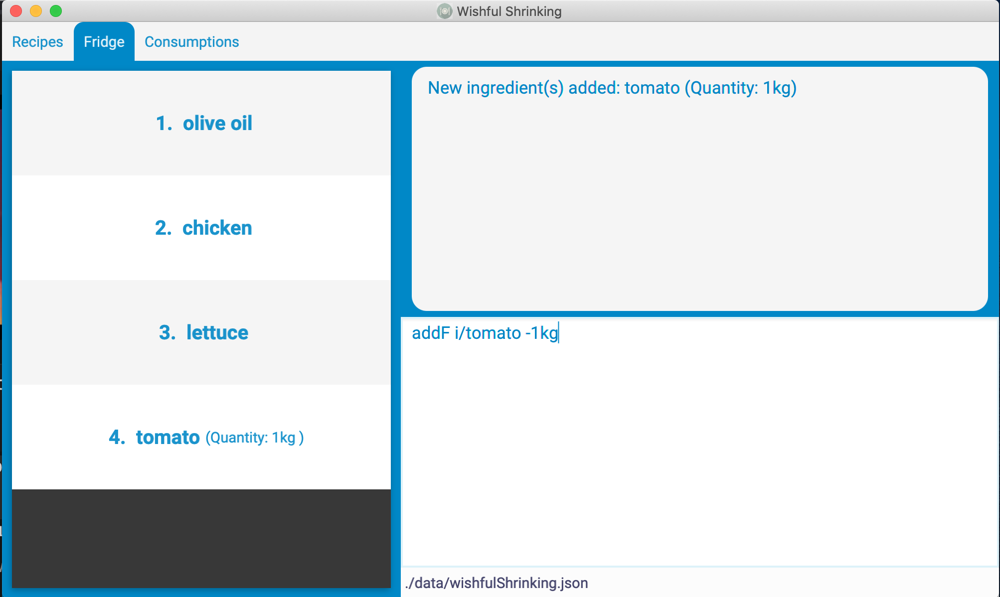
   

Format: `addF i/INGREDIENT [ -QUANTITY][, MORE INGREDIENTS [ -QUANTITY]]`

* `INGREDIENT` can take in an optional `Quantity` e.g. `i/Tomato -2 whole` or `i/salt -a pinch`.

:memo: **Note:**
`QUANTITY` is separated with a mandatory space before `-`. After the dash, it accepts quantity in the format of
 -(NUMBER)(STRING) e.g. `-54.0 kilograms` or STRING e.g. `-a pinch`. NUMBER only accept up to 10 digits, including a
  single forward slash to represent fractions or a single full stop to represent decimal numbers and trailing whitespaces and should be
   greater than 0. STRING accepts alphabets.

:memo: **Note:**
Multiple ingredients are separated by a `,`.

 

:memo: **Note:**
    You are not allowed to add duplicate ingredients. Duplicate ingredients are ingredients with the same
     name regardless of quantity. 

Examples:
* `addF i/peanut`
* `addF i/tomato -1 kg`
* `addF i/banana -3/4 cups, green peas -200g, salmon fish`
   

### 5.2.2 Listing all ingredients : `fridge` 
Contributed by: Olivia

  Shows a list of all ingredients in the Fridge.

   The image below is what Wishful Shrinking looks like after you have listed all ingredients in the Fridge.   
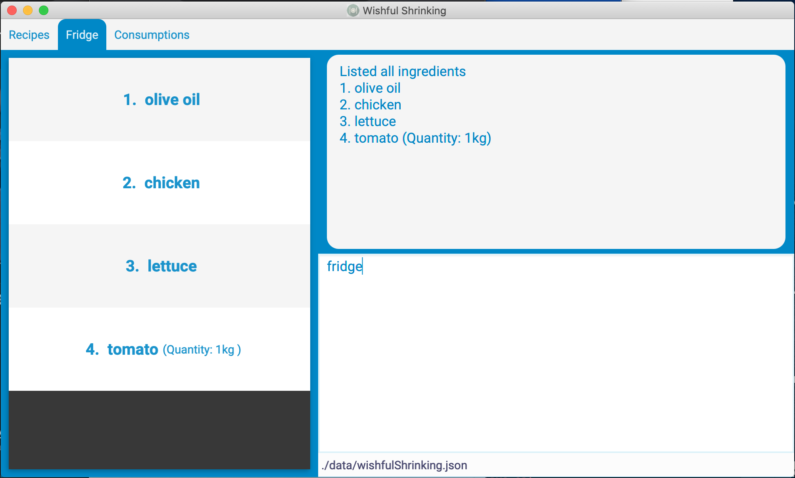
   

Format: `fridge`
   

### 5.2.3 Deleting an ingredient : `deleteF` 
Contributed by: Olivia

  Deletes the specified ingredient from the Fridge.

   The image below is what Wishful Shrinking looks like after you have deleted an ingredient from the Fridge.   
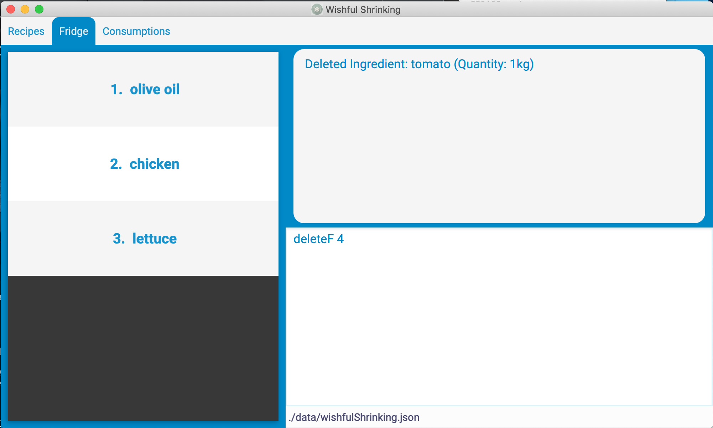
   

Format: `deleteF INDEX`

* Deletes the ingredient at the specified `INDEX`.
* The index refers to the index number shown in the recent displayed Ingredient List.

Examples:
* `fridge` followed by `deleteF 4` deletes the 4th ingredient in the Fridge.
* `searchF peanut` followed by `deleteF 1` deletes the 1st ingredient in the results of the `searchF` command.
   

### 5.2.4 Editing an ingredient: `editF` 
Contributed by: Olivia

  Edits the specified ingredient from Fridge.

   The image below is what Wishful Shrinking looks like after you have edited an ingredient in the Fridge.   
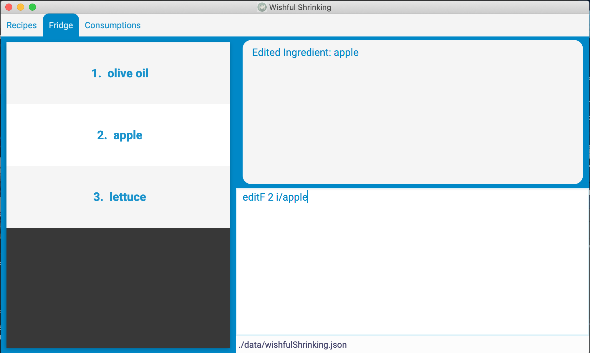
   

Format: `editF INDEX i/INGREDIENT [ -QUANTITY]`

* Edits the ingredient at the specified `INDEX`.
* The index refers to the index number shown in the recent displayed Ingredient List.
* `INGREDIENT` can take in an optional `Quantity` e.g. `i/Tomato -2 whole`.

:memo: **Note:**
`QUANTITY` is separated with a mandatory space before `-`. After the dash, it accepts quantity in the format of
 -(NUMBER)(STRING) e.g. `-54.0 kilograms` or STRING e.g. `-a pinch`. NUMBER only accept up to 10 digits, including a
  single forward slash to represent fractions or a single full stop to represent decimal numbers and trailing whitespaces and should be
   greater than 0. STRING accepts alphabets.

* **At least** the ingredient index and ingredient name must be present to edit an ingredient.
* You are not allowed to edit an ingredient into an already existing ingredient in the Fridge.

:bulb: **Tip:**
    Specified fields will override existing values with the new values- the edit is not cumulative. Typing `editF INDEX` and then hitting `Enter` will insert the information of the ingredient at the specified `INDEX` into the command box, letting you directly modify the existing ingredient.

 

Examples:
* `editF 2 i/apple` will update the name of the second ingredient in the displayed Ingredient List to
 apple.
   

### 5.2.5 Getting an ingredient to edit: `editF` 
Contributed by: Olivia

  Inserts the editF command concatenated with the information of the specified ingredient into the command
 box for editing purposes.    

The image below is what Wishful Shrinking looks like after you have gotten an ingredient in the Fridge to edit.   

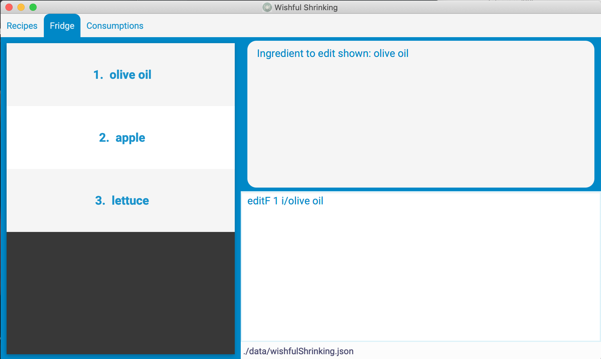
   

Format: `editF INDEX`

* Gets the information of the ingredient at the specified `INDEX` and adds it behind the edit ingredient command in the command box.
* The index refers to the index number shown in the recent displayed Ingredient List.

Examples:
* `editF 1` followed by `Enter` will insert the information of the 1st ingredient in the displayed Ingredient List into the command box.
   

### 5.2.6 Searching for an Ingredient: `searchF` 
Contributed by: Caitlin

  Finds ingredients in the Fridge that contain any of the given keywords.

   The image below is what Wishful Shrinking looks like after you have searched for ingredients in the Fridge   

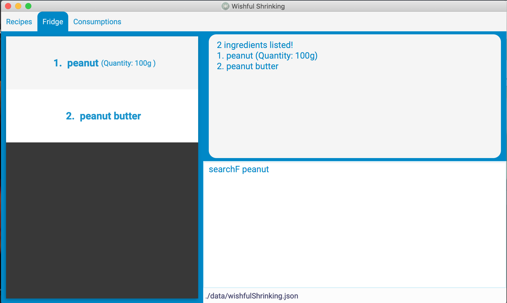
   

Format: `searchF KEYWORD [ MORE KEYWORDS]`

* Input keywords are only compared against the ingredient name.
* The search is case-insensitive. e.g `peanut` will match `Peanut`.
* The search will match partial keywords. e.g. `tomat` will match `tomato`.
* The order of the keywords does not matter. e.g. Peanut Butter will match Butter with Peanut.

:memo: **Note:**
    Ingredient quantity is not taken into account when determining whether two ingredients matches.

:memo: **Note:**
Multiple kewyords are separated by a space.

 

Examples:
* `searchF peanut` returns `peanut` and `peanut butter`.
   

### 5.2.7 Clearing all ingredients : `clearF` 
Contributed by: Tian Yong

  Clears all the ingredients in the Fridge.

   The image below is what Wishful Shrinking looks like after you have cleared all ingredients in the Fridge   

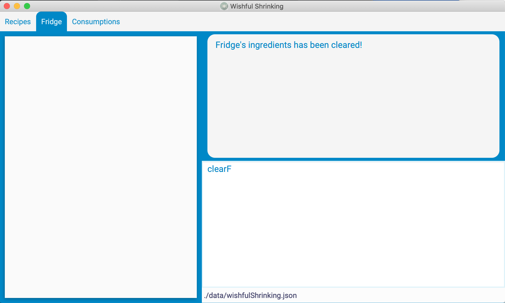
   

Format: `clearF`
   

## 5.3 Consumption-related Commands 

The Consumption-related commands include [`eatR`](#eat-consumption), [`calories`](#list-consumption), [`deleteC`](#delete-consumption), 
and [`clearC`](#clear-consumption). These are the commands in Wishful Shrinking that are relevant only to the
 Consumption list.
   

### 5.3.1 Eating a recipe : `eatR` 
Contributed by: Tian Yong

  Adds the specified recipe in the Recipe List into the Consumption list.

   The image below is what Wishful Shrinking looks like after you have eaten a recipe.   
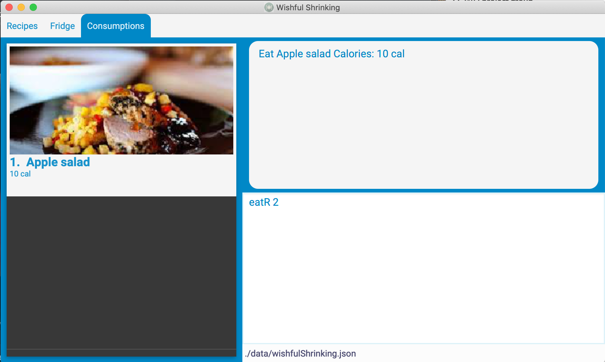
   

Format: `eatR INDEX`

* Adds the recipe at the specified `INDEX` into the Consumption list.
* The index refers to the index number shown in the recent displayed Recipe List.

Examples:
* `recipes` followed by `eatR 2` adds the 2nd recipe in the displayed Recipe List into the Consumption list.
* `searchR n/salad` followed by `eatR 1` adds the 1st recipe in the results of the `searchR` command into the Consumption list.
   

### 5.3.2 Listing all recipes eaten : `calories` 
Contributed by: Tian Yong

  Shows the list of recipes that you have eaten, including the recipe's name and calorie. The total calories
 consumed so far is displayed in the command result.
   The image below is what Wishful Shrinking looks like after you have listed all recipes that you have eaten.   
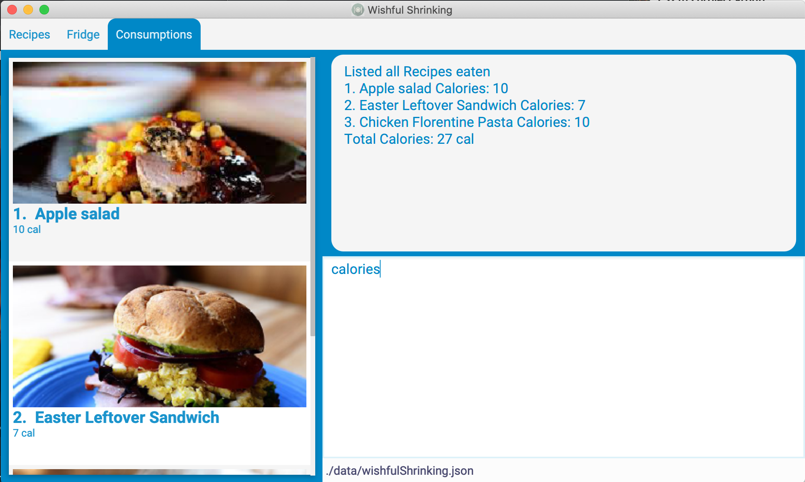
   

Format: `calories`

:memo: **Note:**
    Deleting a recipe will not affect the recipes that have been eaten in the consumption list.

   

### 5.3.3 Deleting a recipe eaten: `deleteC` 
Contributed by: Caitlin

  Deletes the specified recipe from consumption list.

   The image below is what Wishful Shrinking looks like after you have deleted a recipe from the consumption list.   
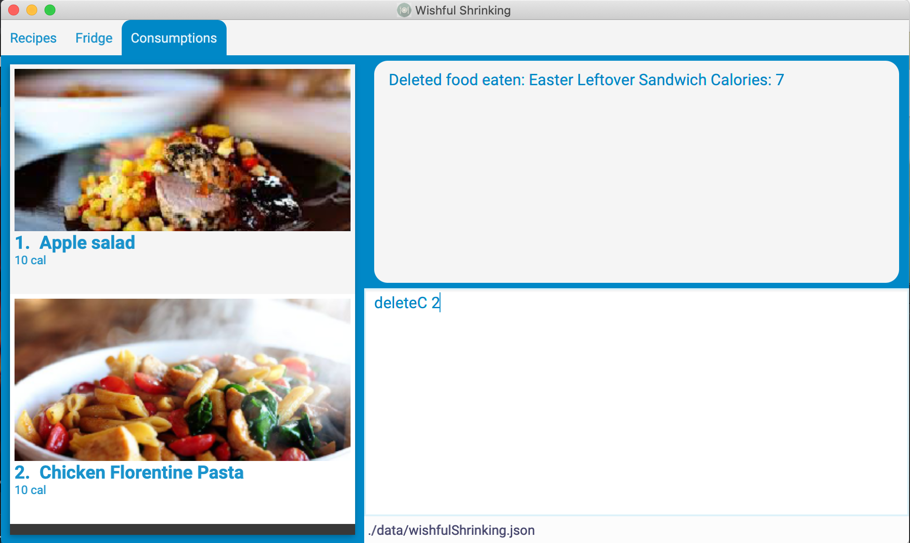
   

Format: `deleteC INDEX`

* Deletes the recipe at the specified `INDEX`.
* The index refers to the index number shown in the recent displayed consumption list.

Examples:
* `calories` followed by `deleteC 2` deletes the 2nd recipe in the Consumption List.
   

### 5.3.4 Clearing all consumed recipes : `clearC` 
Contributed by: Tian Yong

  Clears all the recipes that have been eaten in the consumption list.

   The image below is what Wishful Shrinking looks like after you have cleared all recipes eaten from the consumption list.   
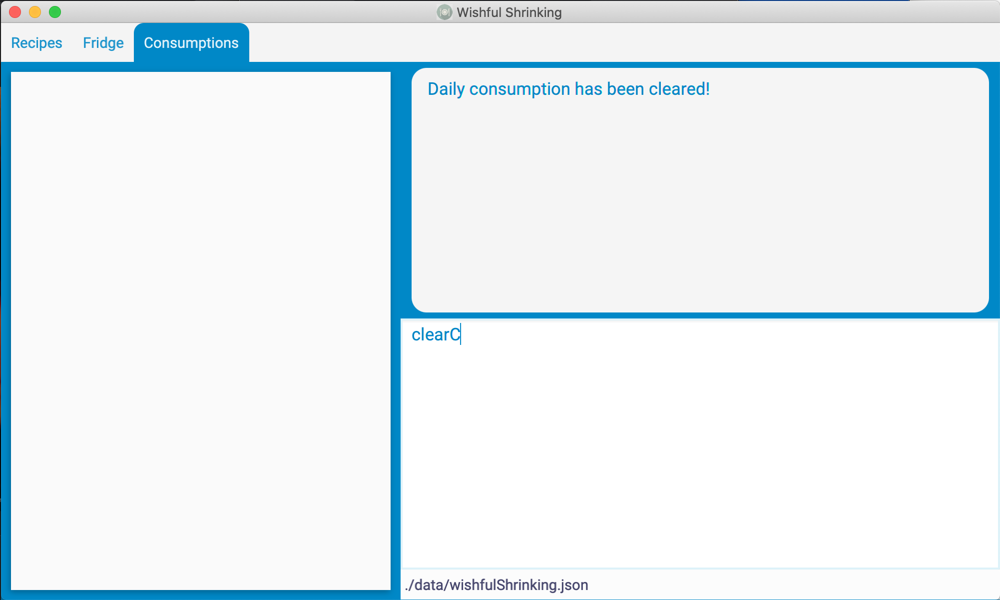
   

Format: `clearC`
   

## 5.4 Miscellaneous Commands 

The miscellaneous commands include `help` and `exit`. They are the commands that you can use in Wishful Shrinking
 that are of a separate implementation from the Recipes, Fridge and Consumption-related commands.
   

### 5.4.1 Viewing help : `help` 

Shows a message explaining how to access the help page.

 The image below is Wishful Shrinking's help window.   

   

Format: `help`

:bulb: **Tip:**
   To go back to the app, simply click on the Wishful Shrinking tab at the top of the window.

   

### 5.4.2 Exiting the program : `exit` 

Exits Wishful Shrinking.

Format: `exit`
   

## 5.4.3 Saving the data 

Wishful Shrinking's data is saved in the hard disk automatically after any command that changes the data. There is no need to save manually.
  

[Back to table of contents](#toc)

# 6. FAQ 

**Q**: Why is my data not saved? 
**A**: Remember to copy the jar file to an EMPTY folder before starting the app.
 
 
**Q**: Why did my data get wiped out? 
**A**: The Wishful Shrinking data file has been corrupted. 
 
 
**Q**: How can I reset the data file into the original sample data file? 
**A**: Delete the WishfulShrinking.json file and rerun the jar file.
 
 
**Q**: Why is the app not running? 
**A**: Ensure JDK `11` or above is installed. 
 
 
**Q**: Why can't I add/edit images? 
**A**: Refer to the section on image path restrictions under [add recipe.](#add-recipe)
 
 
**Q**: I forgot how to use the app. Where can I find help? 
**A**: Type help into the command box and hit enter. A link to the user guide will be provided.

# 7. Glossary 

Term | Explanation
--------|------------------
**Wishful Shrinking** | Can refer to name of the application as a whole or to the app’s storage file. 
**Fridge** | A personalised storage that contains all the ingredients that you have. 
**Recipe** | A set of cooking instructions that describes how to prepare a meal and the ingredients required. 
**Ingredient** | Food that can be used to prepare a particular dish according to a recipe. 
**Consumption** | A tracker which calculates and displays your calorie intake based on the recipes you have consumed as well as a list of recipes consumed. 
**Drawer** | Page that layers above left section of the window when the `selectR` command runs and closes when the `close` command runs.
**CLI** | A Command Line Interface (CLI) is a text-based user interface that allows users to type text commands instructing the program to do specific tasks.
**GUI** | A Graphical User Interface (GUI) is a form of user interface that allows users to interact with the program through graphical icons instead of text-based user interfaces.
**Absolute Path** | The complete details needed to locate a file or folder, starting from the root element.

# 8. Command summary 

## Recipe-Related Commands 

Features | Format, Examples
--------|------------------
**Add recipe** | `addR n/NAME i/INGREDIENT [ -QUANTITY][, MORE INGREDIENTS [ -QUANTITY]] c/CALORIES [img/IMAGE] instr/INSTRUCTION[. MORE INSTRUCTIONS] [t/TAG]...`   e.g. `addR` n/salad i/lettuce, tomato, olive oil c/40 img/images/healthy1.jpg instr/Cook. Eat. t/fast t/easy
**List recipes** | `recipes`
**Delete recipe** | `deleteR INDEX`  e.g. `deleteR 3`
**Edit recipe** | `editR INDEX [n/NAME] [i/INGREDIENT [ -QUANTITY][, MORE INGREDIENTS [ -QUANTITY]]] [c/CALORIES] [img/IMAGE] [instr/INSTRUCTION[. MORE INSTRUCTIONS]] [t/TAG]...`   e.g. `editR` 2 n/Apple salad i/apple
**Get edit recipe info** | `editR INDEX`  e.g. `editR 2`
**Select recipe** | `selectR INDEX`  e.g. `selectR 3`

Features | Format, Examples
--------|------------------
**Close recipe drawer**| `close`
**Search for recipe** | `searchR [i/INGREDIENT [ MORE INGREDIENTS]] [n/NAME [ MORE NAMES]] [t/TAG [ MORE TAGS]]`  e.g. `searchR` i/lettuce tomato, `searchR` n/salad, `searchR` t/healthy
**Recommend recipe** | `recommend`
**Clear all recipes** | `clearR`

## Fridge-Related Commands 

Features | Format, Examples
--------|------------------
**Add ingredient to the Fridge** | `addF i/INGREDIENT [ -QUANTITY][, MORE INGREDIENTS [ -QUANTITY]]`  e.g. `addF` i/banana -3/4 cups, green peas -200g, salmon fish
**List ingredients in the Fridge** | `fridge`
**Delete ingredient from the Fridge** | `deleteF INDEX`  e.g. `deleteF` 3
**Edit ingredient in the Fridge** | `editF INDEX i/INGREDIENTS [ -QUANTITY]`  e.g. `editF` 3 i/apple sauce -20.0g
**Get edit ingredient info** | `editF INDEX`  e.g. `editF 2`

Features | Format, Examples
--------|------------------
**Search for ingredient in the Fridge** | `searchF KEYWORD [ MORE KEYWORDS]`  e.g. `searchF` avocado
**Clear all ingredients from the Fridge** | `clearF`

## Consumption-Related Commands 

Features | Format, Examples
--------|------------------
**Eat recipe** | `eatR INDEX`  e.g. `eatR` 3
**List recipes eaten** | `calories`
**Delete recipe eaten** | `deleteC INDEX`  e.g. `deleteC` 3
**Clear all consumed recipes** | `clearC`

## Miscellaneous Commands 

Features | Format, Examples
--------|------------------
**Help** | `help`
**Exit** | `exit`
