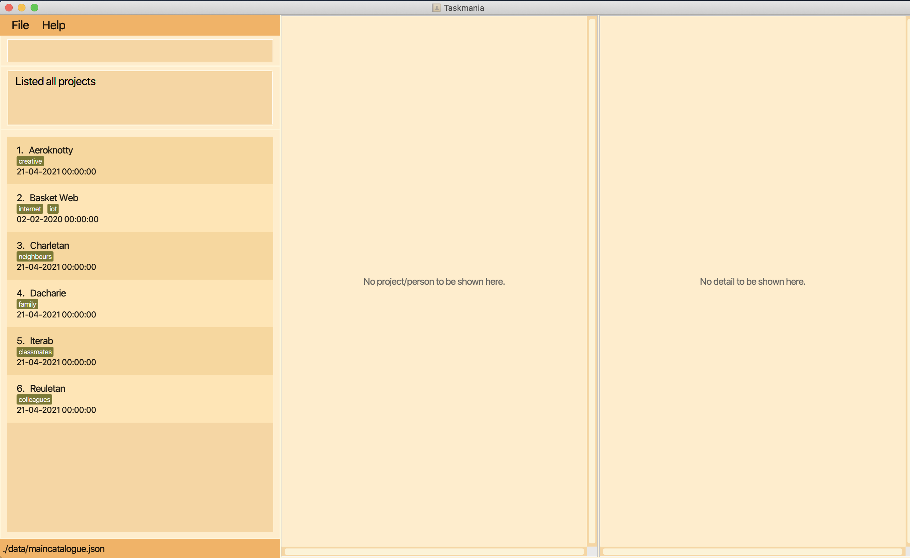
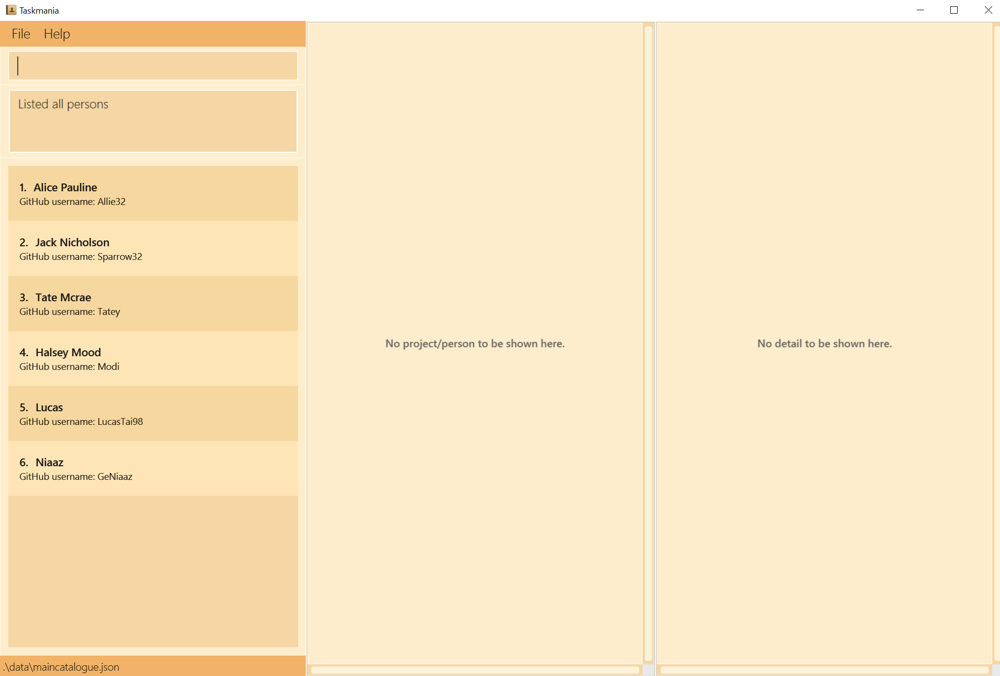
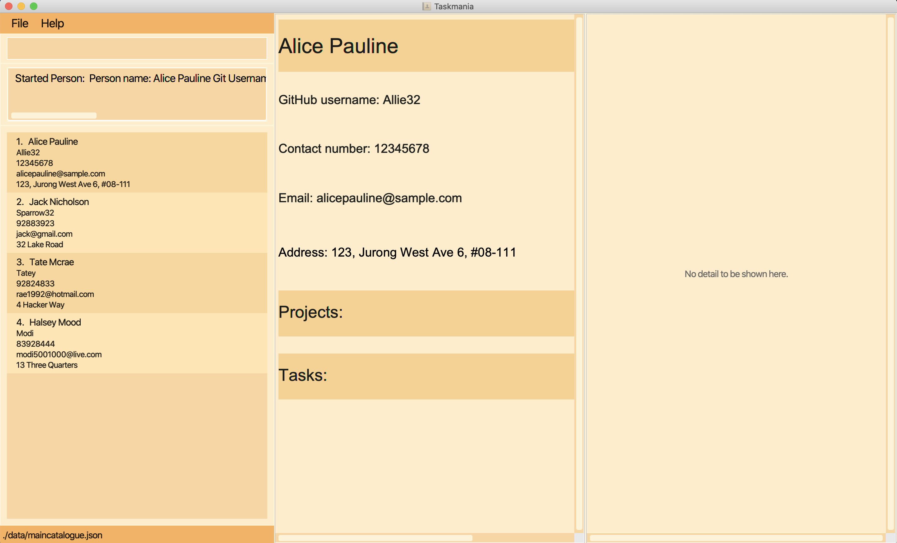
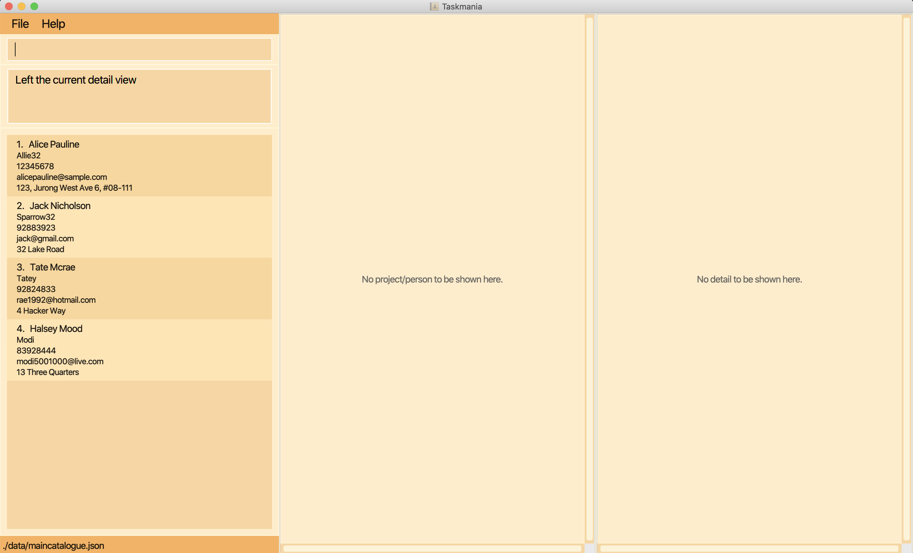

------------------------------------------------------------------------------------------------

# User Guide for Taskmania

Taskmania (based off AB3) is a **desktop app for a project leader to manage team members and tasks** to be finished in a
 software project, optimized for use via a Command Line Interface (CLI) while still having the benefits of a 
 Graphical User Interface (GUI). If you can type fast, Taskmania can allow you to manage your team faster than 
 a traditional point and click interface.
 
 ## Table of contents
 
 * Table of Contents
 {:toc}

--------------------------------------------------------------------------------------------------------------------

## Quick start

1. Ensure that you have Java `11` or above installed in your Computer.

2. Download the latest `Taskmania.jar` from [here](https://github.com/AY2021S1-CS2103T-W10-3/tp).

3. Copy the file to the folder you want to use as the _home folder_ for your TaskMania.

4. Double-click the file to start the app. The window that appears will be similar to the below should appear in a few seconds. Note how
 the app contains some sample information. 
   
   *Figure 1: A view of Taskmania at startup*

5. Type the command in the command box and press Enter to execute it. e.g. typing **`help`** and pressing Enter will
 open the help window. 
   Some commands you can try:

   * **`startproject 1`** : Opens the first project

   * **`exit`** : Exits the app

6. Refer to the Features below for details of each command.

--------------------------------------------------------------------------------------------------------------------

**:information_source: Notes about the command format:** 

* Words in `UPPER_CASE` are the parameters to be supplied by the user. 
  e.g. in `add n/NAME`, `NAME` is a parameter which can be used as `add n/John Doe`.

* One and only one Item in parenthesis should be supplied by the user
  e.g. `(ta/ASSIGNEE NAME) || (td/DEADLINE) || (tn/TASK NAME)` can be used as "ta/Alice", "td/31-12-2020 10:00:00" or as "tn/group meeting", but not as "ta/Alice td/31-12-2020 10:00:00" or "".

* Items in square brackets are optional. 
  e.g `n/NAME [tg/TAG]` can be used as `n/John Doe t/friend` or as `n/John Doe`.

* Items with `…`​ after them can be used multiple times including zero times. 
  e.g. `[tg/TAG]…​` can be used as ` ` (i.e. 0 times), `tg/friend`, `tg/friend tg/family` etc.

* Parameters can be in any order. 
  e.g. if the command specifies `n/NAME p/PHONE_NUMBER`, `p/PHONE_NUMBER n/NAME` is also acceptable.
  

**:information_source: Notes about scoping:** 

The hierarchy of command scoping is as follows:
* global
    * `PROJECT_LIST`
      * `PROJECT`
        * `TASK`
        * `TEAMMATE`
    * `PERSON_LIST`
      * `PERSON`

 A lower-level scope always belongs to any parent scopes. For example, if the app is currently in `PROJECT`
scope, it is also in the `PROJECT_LIST` scope. However, it is not necessarily in `TASK` scope because `TASK` is
a child level of `PROJECT` and it is definitely not in `PERSON` scope because `PERSON` is parallel to `PROJECT`.

--------------------------------------------------------------------------------------------------------------------

# **Features** in global scope

### Viewing help : `help`

Shows a message explaning how to access the help page.

   *Figure 2: Help message popup*

Format: `help`

### Exit application : `exit`

Closes the application for the user.

Format: `exit`

### List all projects in the catalogue `listprojects`

List all projects currently in the project catalogue.

   *Figure 3: List of projects shows up*

Format: `listprojects`
- Lists all projects if there are projects in the catalogue

Example: `listprojects` lists all projects in the catalogue to the user.

### List all persons in the catalogue `listpersons`

List all persons currently in the catalogue.

   *Figure 4: List of persons shows up*

Format: `listpersons`
- Lists all persons if there are persons in the catalogue

Example: `listpersons` lists all persons in the catalogue to the user.

### Leave a current page `leave`

Leave the current page and go back to the parent scope (one level up).

   *Figure 5: Before `leave`, a person named Alice Pauline shows on the person dashboard*
   

   *Figure 6: After `leave`, person dashboard is cleared*

Format: `leave`
- Leaves the current page (clear the right-most non-empty dashboard) and shifts the scoping status to the parent scope
- If the app is already in the global, `PERSON_LIST`, or `PROJECT_LIST`, then the command takes no effect

# **Features** in project_list scope

### Start work on an existing project `startproject `

Initialises the project specified.

Format: `startproject (INDEX)`
- Initialises the project at the specified INDEX
- The index refers to the index number shown in the displayed project list
- The index must be a positive integer 1, 2, 3, …​

Examples: `startproject 2` Initialises the second project in the project list.

### Add a new project to the catalogue `add `

Adds a project to the project list.

Format: `add (n/PROJECT NAME) (dl/DEADLINE) (ru/REPO URL) (d/PROJECT DESCRIPTION) [tg/TAGS...] `
  - The fields can be entered in any order, as long as the prefixes are matched correctly
  - Project Name can be any alphanumeric value (containing only alphabets and / or numbers)
  - Repo URL must be a valid link
  - Description can be anything, as long as it is not blank
  - Any number of tags can be added, where each new tag would require the prefix tg/ before the tag
  
Note: Please enter a valid repository URL. Taskmania is an offline application and can only check the validity of the
 URL, and not whether the repository exists.

Example: `add n/Blair project dl/29-02-2020 00:00:00 ru/http://github.com/a/b.git d/Coding in Greenwich tg/hell tg/abs` 

Adds a new project with the 
- projectName Blair project 
- deadline of 29 February 2020 midnight 
- URL for the team repository 
- Coding in Greenwich as the description 
- 2 tags "hell" and "abs"

### Delete a project from the catalogue `delete `

Deletes a project and all associated information from the project catalogue.

Format: `delete (INDEX) `
- Deletes the project at the specified INDEX
- The index refers to the index number shown in the displayed project list
- The index must be a positive integer 1, 2, 3, …​

Examples: `delete 2` deletes the second project from the catalogue.

#### Locate projects by keyword `find `

Finds projects whose names contain the given keywords.

Format: `find [KEYWORD...]`
- The search is case-insensitive. e.g run will match Run
- Only the name of the projects are searched
- Can be multiple words
- Keywords provided must be complete words and will only match **complete words** from the name of the project 

Example: `find scare` returns the **Scare House** and **Easily scare Night** projects.

Outcome: The projects with matching names will be shown to the user.

### Edits details of a project `edit `

Updates the details of a project.

Format: `edit (INDEX) [n/PROJECT NAME] [dl/DEADLINE] [ru/REPO URL] [d/PROJECT DESCRIPTION] [tg/TAGS...] `
  - Edits the project at the specified index
  - The index refers to the index number shown in the displayed task list
  - Any combination of the fields above can be entered
  - The information entered will replace all the data in each respective field
  - Project Name can be any alphanumeric value (containing only alphabets and / or numbers)
  - Repo URL must be a valid link
  - Description can be anything, as long as it is not blank
  - Any number of tags can be added, separated by space " "
  
Note: Please enter a valid repository URL. Taskmania is an offline application and can only check the validity of the
 URL, and not whether the repository exists.

Example: `edit 1 n/Resident Evil project /d new horror` changes the name of the first project in the list to **Evil project**, and the description to **new horror**.

# **Features** in project scope

## **Task-related features**

### Add task to a project `addtask `

Creates a new task and adds it to the current project.

Format: `addtask (tn/TASK NAME) (tp/TASK PROGRESS) (td/TASK DEADLINE) `
  - All fields above are required
  - Task Name can be any alphanumeric value (containing only alphabets and / or numbers)
  - Task progress is a percentage value indicating how much of the task is done
  - Task deadline is indicated by a date and time with format *DD-MM-YYYY hh:mm:ss* 

Example: `addtask tn/Do User Guide tp/30 td/29-02-2020 00:00:00` creates a task named Do User Guide, 30% completed, and has a deadline of 29th Feb 2020, midnight.

### Assign a task to a teammate `assign `

Assigns a task to a teammate within a project.

Format: `assign TASKINDEX TEAMMATE_GIT_USERNAME  `

  - TEAMMATE_GIT_USERNAME is the unique name of each teammate
  - Assigns the teammate with the given git username to the task at the specified index
  - The index refers to the index number shown in the displayed task list

Example: `assign 3 Lucas98` assigns task number 3 in the list to user *Lucas98*.

### Edit task to a project `edittask `

Edits the indicated task in a project.

Format: `edittask (INDEX) [n/TASK_NAME] [tp/TASK_PROGRESS] [td/TASK_DEADLINE] `
  - Edits the task at the specified index
  - The index refers to the index number shown in the displayed task list
  - Any combination and any number of the subsequent fields above can be entered
  - The information entered will replace all the data in each respective field
  - Task Name can be any alphanumeric value (containing only alphabets and / or numbers)
  - Task progress is a percentage value indicating how much of the task is done
  - Task deadline is indicated by a date and time with the format *DD-MM-YYYY hh:mm:ss* 

Example: `edittask 3 tn/Finish project` changes the name of task 3 in the list to Finish project.

### Delete a task from the project `deletetask `

Deletes a task and all associated information from the project.

Format: `deletetask (INDEX) `

- Deletes the project at the specified INDEX
- The index refers to the index number shown in the displayed task list
- The index must be a positive integer 1, 2, 3, …​

Examples: `deletetask 2` deletes the second task shown in the displayed task list.

### Filter tasks `filter `

Filters tasks in the task list by various predicates:
  - by assignee's name
  - by deadline (either a specific deadline or a time range for the deadline)
  - by progress
  - by task's name

Format: `filter (ta/TASK_ASSIGNEE_NAME)||(td/DEADLINE)||(start/START_DATE end/END_DATE)||(tp/TASK PROGRESS)||(tn/TASK_NAME)` 
  - User may choose one predicate to filter tasks by
  - Assignee name is the name of the Teammate who is assigned to the task
  - Task Name can be any alphanumeric value (containing only alphabets and / or numbers)
  - Both task and assignee names must be complete words and will only match complete words from the names of the task or assignee 
  - Deadline of the task follows the format *DD-MM-YYYY hh:mm:ss*
  - Start date and end date in the time range follows the format *DD-MM-YYYY*
  - Task progress is a percentage value indicating how much of the task is done

Example: `filter ta/Lucas` filters all the tasks who have Lucas assigned to them, and displays those tasks.

### List all tasks `alltasks `

List all tasks in the task list of a project and enters the Task scope.

Format: `alltasks `

Example: `alltasks` displays all tasks in the task list.

### Sort tasks `sort `

Sorts tasks in the task list in ascending/descending order:

  - by deadline (either a specific deadline or a time range for the deadline)
  - by progress
  - by task's name

Format: `sort (sa/)||(sd/) (td/)||((tp/)||(tn/)` 

  - User may choose the sorting order (`sa/` for ascending order and `sd/` for descending order)
  - User may choose one attribute of task to sort the task list
  - Deadline of the task follows the format *DD-MM-YYYY hh:mm:ss*
  - Task progress is a percentage value indicating how much of the task is done
  - Task Name can be any alphanumeric value (containing only alphabets and / or numbers)

Example: `sort sa/ td/` sorts the task list by task deadline in ascending order. Then the tasks on the top of the list are those with imminent deadlines.

### View details of a task `viewtask `

View all the details of a task, beyond the little information given in the project view.

Format: `viewtask INDEX `
  - View all the information of the task specified by the INDEX
  - Index has to be a valid number that is in the range of tasks displayed on screen

Example: `viewtask 4` displays all information from task number 4 in the list.

## **Teammate-related features**

### Create a new teammate in a project `addteammate`

Creates a new teammate in a project with all the relevant fields contained in it.

Format: `addteammate (mn/TEAMMATE_NAME) (mg/GIT_USER_NAME) (mp/PHONE_NUMBER) (me/EMAIL) (ma/ADDRESS)`
  - All fields are necessary to fill in
  - Teammate name has to be 1 or more words consisting only of letters
  - The Git User name has to be a unique Github registered User Name
  - The phone number has to be a minimum of 3 and maximum of 16 numbers
  - The email has to have a proper prefix and proper domain name consisting of at least 2 letters
  - Address can be any amount of letters, symbols and numbers, the only constraint is that it cannot be blank

Example: `addteammate mn/Lucas mg/LucasTai98 mp/93824823 me/lucas@gmail.com ma/18 Evelyn Road` creates a new teamamte in the respective project with:
  - name Lucas
  - Git Username of Lucas98
  - phone number of 93824823
  - email of lucas@gmail.com
  - address of 18 Evelyn road
  
### Add a teammate to a project `addpart`

Add an existing teammate to the current project.

Format: `addpart GIT_USER_NAME`

Example: `addpart Lucas98` adds Lucas98 to the current project that the user is in.

### Remove a teammate from a project `deletepart`

Removes an existing teammate from the current project.

Format: `deletepart GIT_USER_NAME`

Example: `deletepart Lucas98` removes Lucas98 from the current project.

### Edit a teammate’s details `editteammate`

Update the information of a teammate.

Format: `editteammate (GIT_USER_NAME) [mn/TEAMMATE_NAME] [mp/PHONE_NUMBER] [me/EMAIL] [ma/ADDRESS]`
  - Any combination or number of fields can be filled in
  - Teammate name has to be 1 or more words consisting only of letters
  - The Git User name cannot be changes, but is required to identify the teammate to edit
  - The phone number has to be a minimum of 3 and maximum of 16 numbers
  - The email has to have a proper prefix and proper domain name consisting of at least 2 letters
  - Address can be any amount of letters, symbols and numbers, the only constraint is that it cannot be blank

Example: `editteammate Lucas98 tn/GeNiaaz ta/5 Hacker Way` changes the name of the teammate to GeNiaaz and the address of said teammate to 5 Hacker Way.

### View a teammate’s details `viewteammate`

View all of a specific teammate's details.

Format: `viewteammate GIT_USER_NAME`

Example: `viewteammate Lucas98` displays all the information about the teammate with the Git User Name Lucas98 to the user.

### Delete a teammate `deleteteammate`

Delete all of a specific teammate's details, as well as remove teammate from all projects teammate was a part of.

Format: `deleteteammate GIT_USER_NAME`

Example: `deleteteammate Lucas97` deletes the teammate with git username Lucas97, and removes him from any project he
 was in.

# **Features** in person scope

### Start work on an existing person `startperson `
Initialises the person specified.

Format: `startperson (INDEX)`
- Initialises the person at the specified INDEX
- The index refers to the index number shown in the displayed person list
- The index must be a positive integer 1, 2, 3, …​

Examples: `startperson 2` Initialises the second person in the person list.

## FAQ

**Q**: How do I transfer my data to another Computer? 
**A**: Install the app in the other computer and overwrite the empty data file it creates with the file that 
contains the data of your previous Taskmania home folder.

## Summary

Action | Format, Examples | Scope
--------|------------------|-------
**Get Help** | `help` | global scope
**Exit application** | `exit` | global scope
**Show all projects** | `listprojects` | global scope 
**Show all persons** | `listpersons` | global scope 
**Leave a view** | `leave` | global scope
**Start a project** | `startproject INDEX`  e.g., `startproject 3` | project_list scope
**Start a person** | `startperson INDEX`  e.g., `startperson 3` | person_list scope
**Add** | `add (n/PROJECT NAME) (dl/DEADLINE) (ru/REPO URL) (d/PROJECT DESCRIPTION) [tg/TAGS...] `   eg, `add n/Blair project dl/29-02-2020 00:00:00 ru/http://github.com/a/b.git d/Coding in Greenwich tg/hell tg/abs` | global scope
**Delete project** | `delete INDEX`   e.g. `delete 2` | global scope
**Find KEYWORD** | `find KEYWORD`   e.g. `find read` | global scope
**edit** | `edit [n/PROJECT NAME] [dl/DEADLINE] [ru/REPO URL] [d/PROJECT DESCRIPTION] [tg/TAGS...] ` eg, `edit n/Resident Evil project /d new horror`| global scope
**Add Task** | `addtask (n/TASK NAME) (tp/TASK PROGRESS (td/TASK DEADLINE) ` eg, `addtask n/Do User Guide tp/30 td/29-02-2020 00:00:00` | project scope
**Assign A Task To A Teammate** | `assign INDEX NAME`   e.g. `assign 1 Niaaz` | project scope
**Edit task details** | `edittask INDEX [n/TASK_NAME[ [tp/TASK_PROGRESS] [td/TASK_DEADLINE] ` eg, `edittask 3 tn/Finish project status/true` | project scope
**Delete Task** | `deletetask INDEX`  e.g. `deletetask 1` | project scope 
**Filter Tasks** | ``filter (ta/ASSIGNEE_NAME)||(td/DEADLINE)||(start/START_DATE end/END_DATE)||(tn/TASK_NAME)||(tp/PROGRESS))`` e.g. `filter ta/Alice` | project scope
**Show all the tasks** | `alltasks` | project scope 
**Sort tasks** | `sort (sa/)||(sd/) (td/)||(tp/)||(tn/)` e.g. `sort sa/ td/` | project scope 
**View Details of A Task** | `viewtask INDEX`   e.g. `viewtask 1` | project scope
**Create new teammate** | `newteammate (mn/TEAMMATE_NAME) (mg/GIT_USER_NAME) (mp/PHONE_NUMBER) (me/EMAIL) (ma/ADDRESS)` eg, `newteammate mn/Lucas mg/LucasTai98 mp/93824823 me/lucas@gmail.com ma/18 Evelyn Road`| project scope
**Add a teammate to a project** | `addpart` | `addpart GIT_USER_NAME` eg, `addpart LucasTai98` | project scope
**Remove a teammate from a project** | `deletepart` | `deletepart GIT_USER_NAME` eg, `deletepart LucasTai98` | project scope
**Edit teammate details** | `editteammate (GIT_USER_NAME) [mn/TEAMMATE_NAME] [mp/PHONE_NUMBER] [me/EMAIL] [ma/ADDRESS]` eg, `editteammate Lucas98 tn/GeNiaaz ta/5 Hacker Way`|
**View a teammate’s details** | `viewteammate GIT_USER_NAME` | project scope
**Delete a teammate** | `deleteteammate GIT_USER_NAME` | project scope

### Glossary

* **Mainstream OS**: Windows, Linux, Unix, OS-X.
* **Teammate**: A person belonging to a project of the team leader's team.
* **Participation**: The class of an object that handles the relations between a Project object and Person Object.
* **Scope**: The confines of when certain commands will work.
