## Introduction

As the information age encroaches out lives, our digital footprint has become larger and larger.
When we accumulate many files from work, school and daily lives,
we tend to spend a lot of time locating the files that we need.
In an Internation Data Corporation (IDC) [white paper](https://denalilabs.com/static/ProductivityWhitepaper.pdf)
published in 2012, a survey of 1200 information workers and IT professionals around the world 
shows that they spend an average of 4.5 hours a week looking for documents. That is a lot of productivity time wasted!
This is where our solution, HelloFile, comes in.

*HelloFile* is a desktop application for professionals who have to manage a lot of files, specifically **tech savvy CS2103T CS students**.
It is optimised for use under Command Line Interface (CLI).
By using our application, you can tag frequently used files/folders with a short nickname, and open your them
with a single command. We hope by using our application, you can manage your files with ease. You can
make your life easier one file at a time, and free up your precious time to spend on things you truly enjoy.

* Table of Contents
{:toc}

--------------------------------------------------------------------------------------------------------------------

## Getting Started

### Installation
1. Ensure you have [Java 11](https://www.java.com/en/download/) or above installed in your computer. 
2. Download the latest HelloFile.jar [here](https://github.com/AY2021S1-CS2103T-F12-1/tp/releases/tag/v1.2).

### Quick start
1. Move HelloFile.jar to the folder you intend to use as the home folder for HelloFile.
2. Double-click the HelloFile.jar icon to start the application. Alternatively, run the command `java -jar HelloFile.jar` in the command line.
3. Type `help` into the command box, followed by pressing the `Enter` key to view the supported features. Alternatively, click the help button in the menu bar to access our webpage.

### User Interface
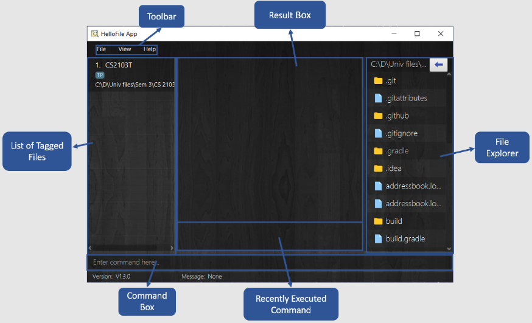

This diagram shows our interface.
1. The left panel is the *Tag Panel*. It contains the list of tags that you have created.
2. The middle panel is the *Result Panel*, where you can see the result of your command.
3. The right panel is the *File Explorer Panel*. It shows your current directory in HelloFile. You can either use command or click on a folder to navigate.
4. Below the *Result Panel* is the *Command History*. It shows your last command entered.
5. The *Command Box* at the bottom of the app window is at the bottom. You can type your commands here.

### Basic workflow
1. Tag important files with the `tag` command for ease of access. 
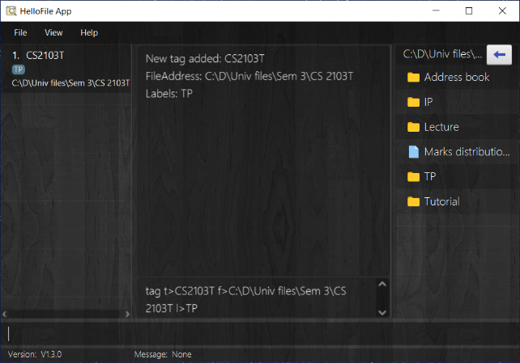
2. When trying to access tagged files, instead of navigating to the file location, simply use the `open` command to access the required files. 
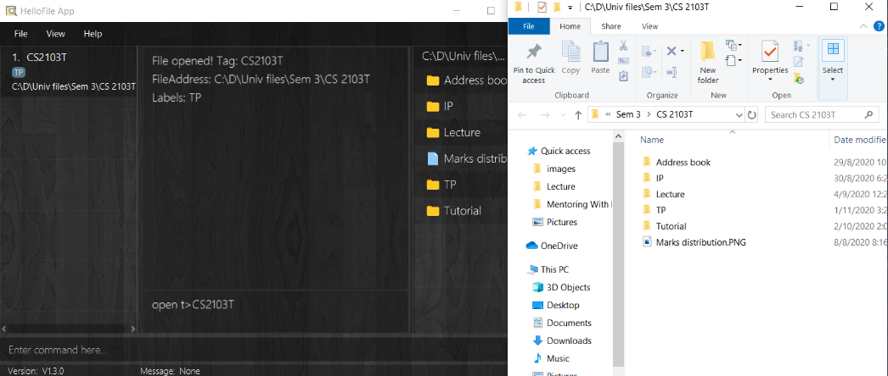
3. To find the location of tagged files, use the `show` command to get the file path of the file. 
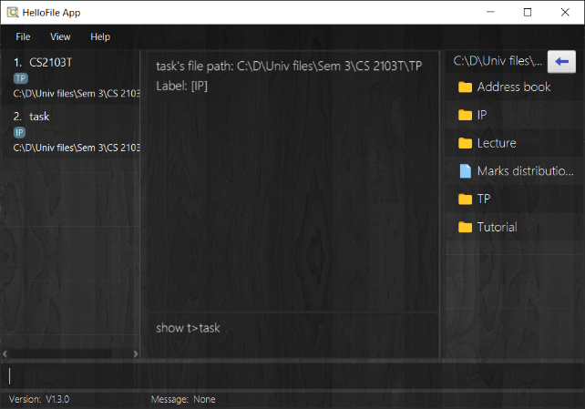
4. If you have made a happy little accident, you can recover by using `undo` and `redo`. 
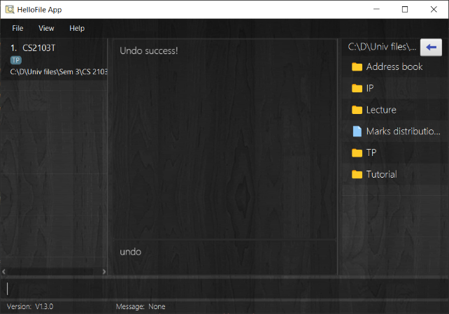  
  
5. To exit the application, either close the application window, or use the `exit` command.

--------------------------------------------------------------------------------------------------------------------

## Features

**:information_source: Notes about the command format:** 

* Words in `UPPER_CASE` are the parameters to be supplied by you. 
  e.g. in `tag t>TAG`, `TAG` is a parameter, such as in the case `add t>Myfile`.

* Expressions in square brackets are optional. 
  e.g `t>TAG [f>FILE_PATH]` can be used as `t>Myfile f>C:\Users` or as `t>Myfile`.

* Parameters can be in any order. 
  e.g. if the command specify `t>TAG f>FILE_PATH`, `f>FILE_PATH t>TAG` is also an acceptable command.

* Expressions with `...` at the end can be provided any number of times. 
  e.g. `t>TAG [l>LABEL]...` can be used as `t>TAG`, `t>TAG l>label`, or `t>TAG l>label1 l>label2 l>label3`.
  
* Every tag name must be unique, but multiple tags can point to the same filepath.

* Every tag name is case-sensitive. e.g tag name `notes` is different from tag name `Notes`.

* Only the `cd` and `tag` command accepts relative file path, all other commands require absolute file path.

**:warning: Warning for multiple expressions**

Expressions without `...` at the end takes the last parameter as the argument when provided with multiple same expressions. 
  e.g. `tag t>TAG1 t>TAG2` will take `TAG2` as the parameter, ignoring the parameter `TAG1`.

### Adding a tag with filepath : `tag`

Tags a file with a unique tag name. 
You can add a nickname to a file. Optionally, you can add some labels to the tag for categorisation.
The `FILE_PATH` field can accept both absolute and relative file path from your current directory in HelloFile.

Format: `tag t>TAG_NAME f>FILE_PATH [l>LABEL]...`

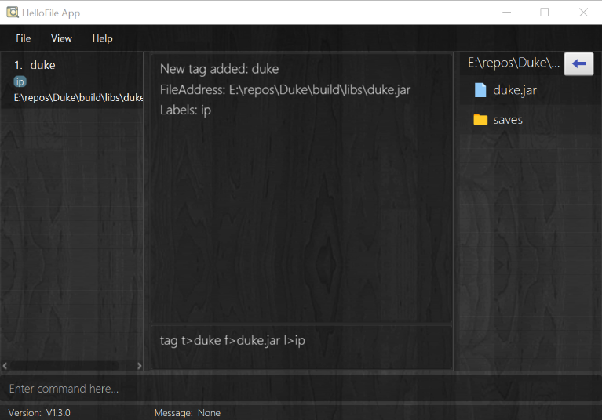

Examples:
* `tag t>Users f>C:\Users` (Adds a tag with tag name `Users`,absolute file path `C:\Users`, and no label)
* `tag t>Users f>C:\Users l>Important` (Adds a tag with tag name `Users`, absolute file path `C:\Users`, and label name `Important`)
* `tag t>Users f>.\Users` (Adds a tag with tag name `Users`, relative file path `Users`, and no label)
* `tag t>Users f>.\Users l>folder l>readonly` (Adds a tag with tag name `Users`, relative file path `Users`, and multiple lables
with label name `folder` and `readonly`)

### Displaying information of a tagged file : `show`

Displays the information of the tagged file. 
You can see some basic information of a tagged file by using this command.
It will show you the tag's file path and label information.

Format: `show t>TAG_NAME`

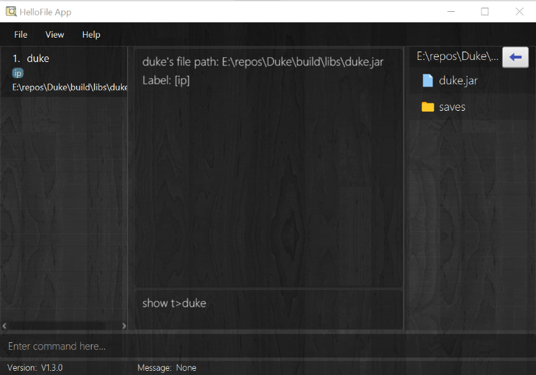

Examples:
* `show t>my_research` (show you the details of a tag name `my_research`)
* `show t>file2020` (show you the details of a tag name `file2020`)

### Accessing a tagged file : `open`

Opens the file specified by the unique tag name. 
You can open a file using its tag, with the default application in your operating system.
Additionally, you can open all files with a specific label. This could potentially open many files.

Please take note of the following:
* This command only accepts one tag or one label but not both.
* Please ensure that you have read permission to the files that you want to open.

**:information_source: You can tag many files that you want to open at the same time with the same label, so you can open them at once.**

Format: `open t>TAG_NAME` or `open l>LABEL`

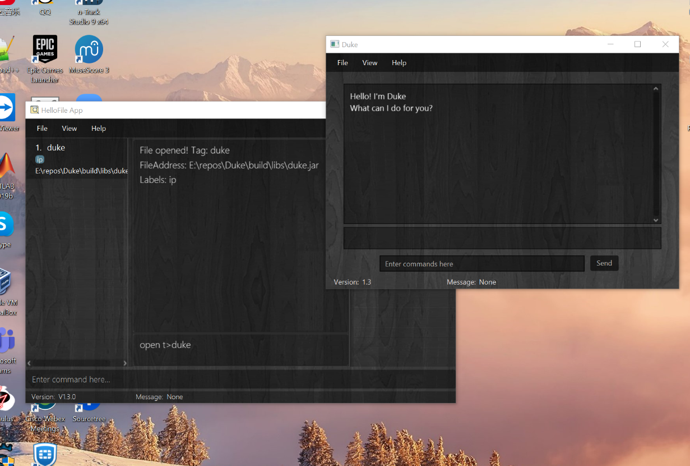

Examples:
* `open t>my_research` (open the file with tag name `my_research`)
* `open l>notes` (open all the files with label `notes`)

### Removing a tag : `untag`

Removes the tag from the list of tags. 
You can delete a tag by using this command.

Format: `untag t>TAG_NAME`

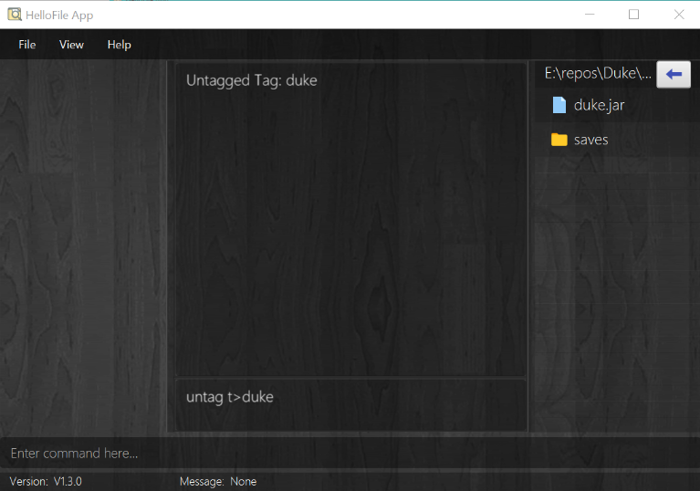

Examples:
* `untag t>notes` (delete tag with tag name `notes`)
* `untag t>secret_file` (delete tag with tag name `secret_file`)

### Renaming a tag : `retag`

Renames a tag.  
Changes the specified tag's nickname into the new one. 
Note that this command can only change nickname.
It can't change any other information.

Format: `retag o>OLD_TAG_NAME t>NEW_TAG_NAME`

Examples:
* `retag o>notes t>secret` (Rename an old tag name `notes` to new tag name `secret`)
* `retag o>examfiles t>oldexamfiles` (Rename an old tag name `examfiles` to new tag name `oldexamfiles`)

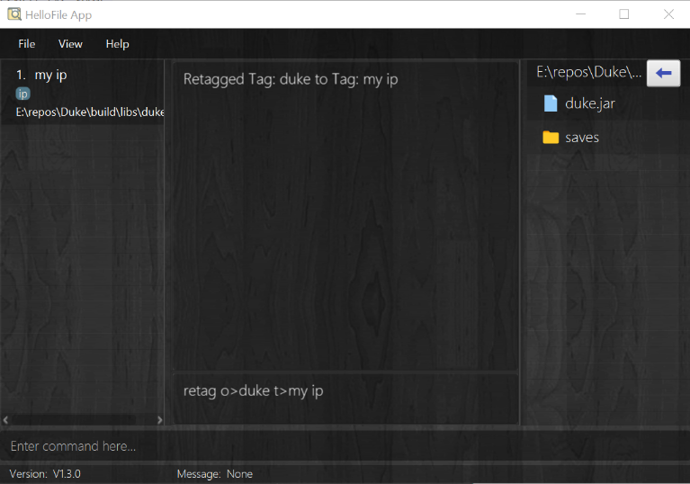

### Adding a label to a tag : `label`

Adds one or more label to an existing tag. 
You can use label to categorise tags.

**:warning: Duplicated labels will only be added once.**

Format: `label t>TAG_NAME l>LABEL1 [l>LABEL2]...`

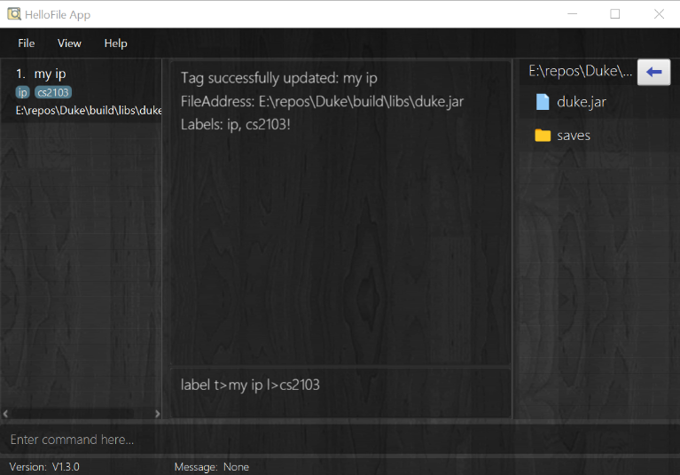

Examples:
* `label t>file1 l>important` (Add a label of tag name `file1` with label name `important`) 
* `label t>file2 l>important l>exam` (Add a label of tag name `file2` with multiple labels of label name `important` and `exam`)

### Deleting multiple labels from a tag : `unlabel`

Delete one or more label from a tag.  
If some labels are invalid, all the other valid labels will be deleted from the tag, 
and the invalid ones will be shown to the user.

Format: ` unlabel t>TAG_NAME l>LABEL1 [l>LABEL2]...`

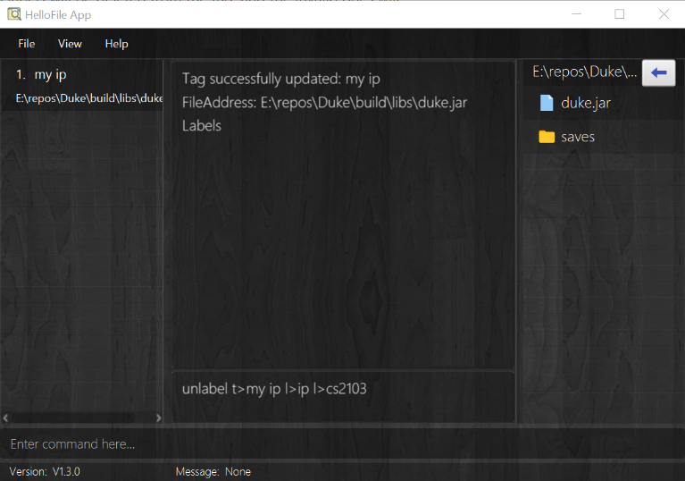

Examples:
* `unlabel t>notes l>secret` (Deletes a label of label name `secret` that has tag name `notes`)
* `unlabel t>file1 l>important l>exams` (Deletes labels of label name `important` and `exams` from tag name `file1`)

### Finding a tag : `find`

Finds a tag by a keyword. 

You can find tags using a keyword.
If the keyword matches its name and/or label partially, it will also be found and listed in the *Tag Panel*.

Format: `find KEYWORD`

Before executing command:
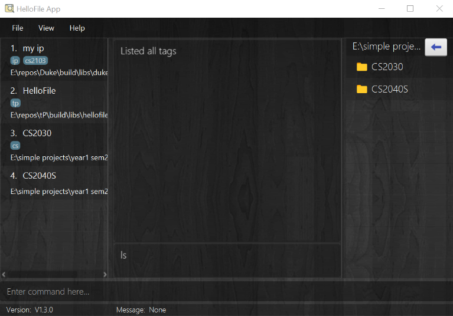

After executing command:
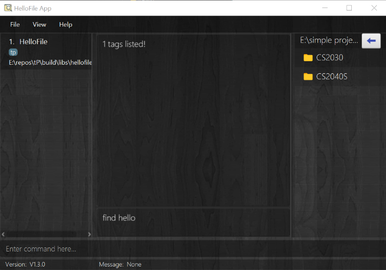
        
Examples:
* `find he` (finds tags which contains `he` in label / tag name, e.g. `hello`, `hero`, etc.)
* `find tagname label` (finds tags which contains `tagname` or `label` in label / tag name, e.g. `tagname123`, `label345`, etc.)

### Changing current directory : `cd`

Changes the current directory of the HelloFile internal File Explorer.  
You can change the current directory in 3 ways:
By using `f>` to go to a folder using an absolute path,
by using `./` to go to a folder using a relative path,
or using `../` to go to the parent folder.
Alternative, you can click on the folder in the *File Explorer Panel* to navigate.

Format 1: `cd f>ABSOLUTE_FILE_PATH`

Format 2: `cd ./RELATIVE_FILE_PATH`

Format 3: `cd ../`

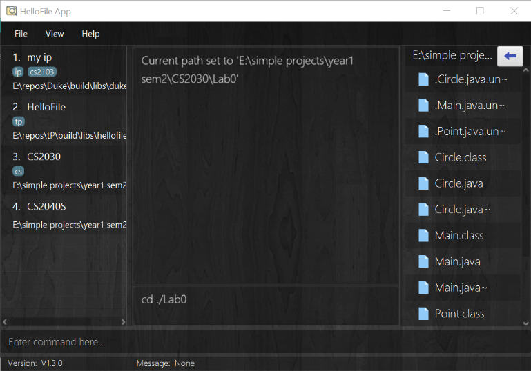

Examples:
* `cd f>C:\Users` (Changes the current directory to `C:\Users`)
* `cd ./tp` (Changes the current directory to the child directory `tp`)
* `cd ../` (Changes the current directory to the parent directory)

### Listing all tags : `ls`

Lists all added tags.

Format: `ls`

Before executing command:

After executing command:
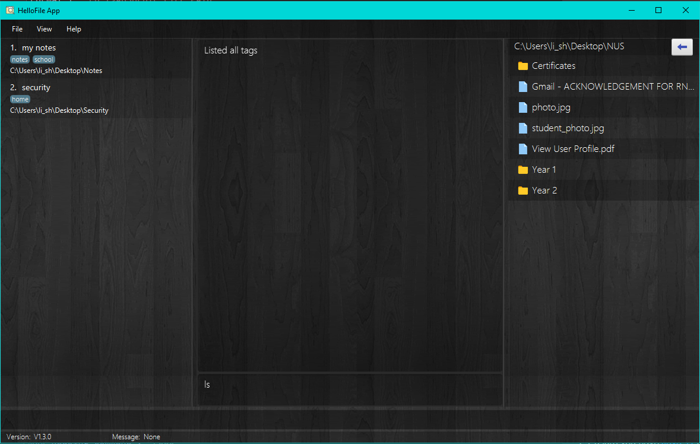

### Undoing command : `undo`

Undo a recently executed command. 
You can undo these commands: `tag`, `retag`, `untag`, `label`, `unlabel`, `clear`, and `redo`.

**:warning: Command history will be deleted once the app is closed!**

Format: `undo`

Before executing command:
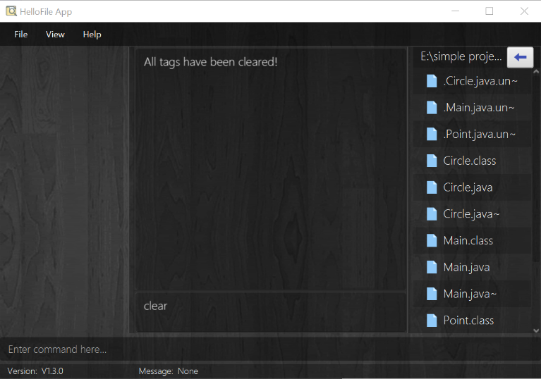

After executing command:
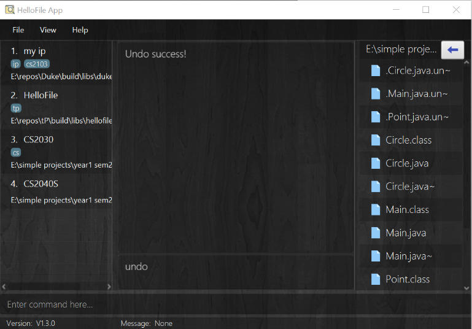

### Redoing command : `redo`

Redo a recently executed command. 
Redo only exists when undo has been executed.

**:warning: Command history will be deleted once the app is closed!**

Format: `redo`

Before executing command:

After executing command:
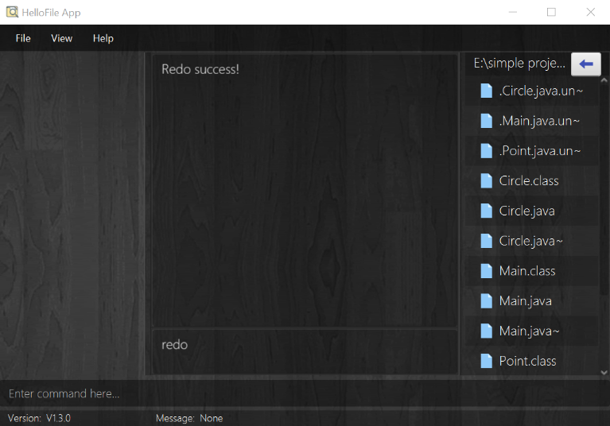

### Clearing all tags : `clear`

Clears the list of all tags. 

**:warning: All tags will be deleted!**

Format: `clear`

### Exiting the application : `exit`

Exits the application.

Format: `exit`

### Viewing help : `help`

Displays help for all/certain commands.

Format: (All command) `help` or (Certain command) `help COMMAND`

Showing all commands:
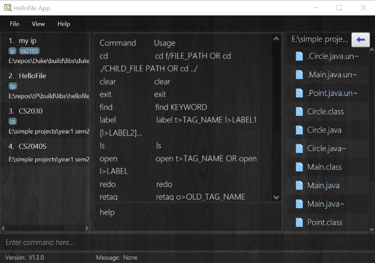

Showing one specific command:
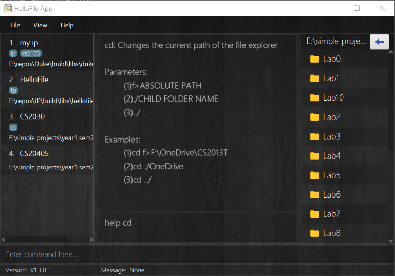

Examples : 
* `help` (Shows all command and its format)
* `help cd` (shows cd command description, format and examples usage)

--------------------------------------------------------------------------------------------------------------------

## Customisation

### Changing themes
HelloFile comes in light and dark themes. To change the theme, navigate to the top left-hand corner of the application,
and select `view`, followed by `theme`. A new pop up window will be shown with available themes along with a quick preview
 as illustrated below.
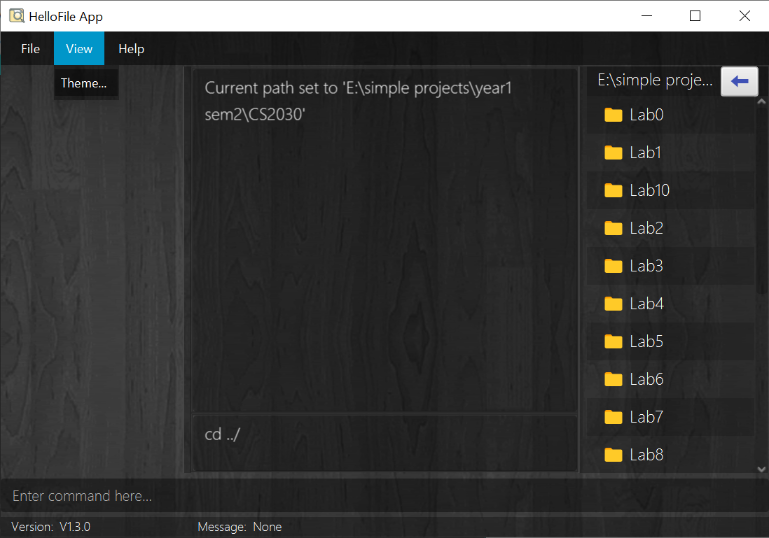

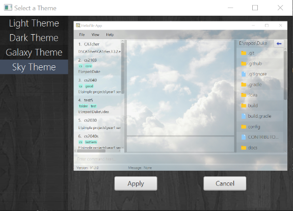

### Changing view sizes
HelloFile allows you to resize the view of each sub components for a clearer view of tags and folders. You can simply
 drag each view to the size desired.
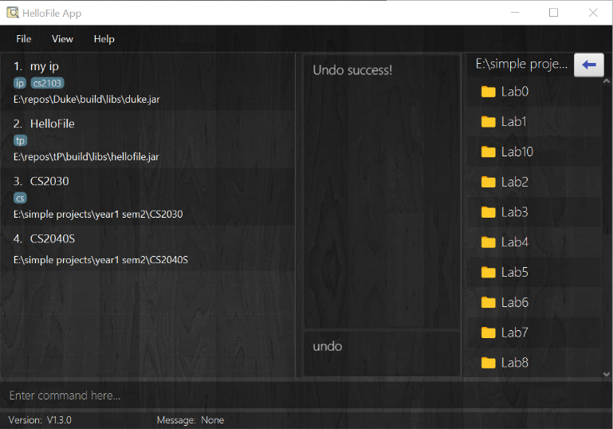

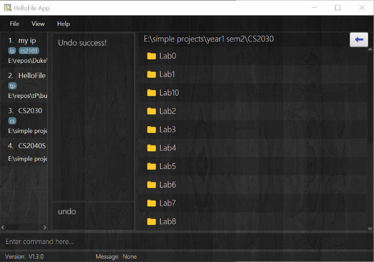

### Persistent customisation
All of your customisation options are saved and persists even when you close the application. HelloFile remembers your choices
 so you can spend your time on more productive pursuits.

--------------------------------------------------------------------------------------------------------------------

## FAQ
**Q**: What if the name or the directory of the file I tagged is changed? Can I still access the file using HelloFile? 
**A**: No. HelloFile is currently unable to track a file if its name or directory is changed. You will need to delete the old tag and retag the file.

**Q**: What is the structure of the application? 
**A**: You can find it in the Developer Guide [here](https://github.com/AY2021S1-CS2103T-F12-1/tp/blob/master/docs/DeveloperGuide.md)

**Q**: How do I report a bug? 
**A**: Please create a new issue on [this](https://github.com/AY2021S1-CS2103T-F12-1/tp/issues) webpage.

**Q**: Can I contribute to the project? 
**A**: Sorry, as this is a school project, we are not accepting any contributors at this period.

**Q**: Why does list command use `ls` as the keyword instead of `list`?  
**A**: In most command lines, `ls` is the default keyword for listing files and folders. We would like the transition 
from command line to HelloFile to be as smooth as possible for our target users.

--------------------------------------------------------------------------------------------------------------------
## Glossary

Terminology | Definition
--------------|------------------
**CLI** | Command Line Interface is a command line program that accepts text input to execute operating system functions
**GUI** | Graphical User Interface is a form of user interface that allows users to interact with electronic devices through graphical icons, instead of text-based user interfaces.
**Absolute path** | The complete address of a file location. Usually, the address consists of the root element and the complete directory list required to locate the file Example: `C:\Users\a.txt` (Windows), `/home/usr/b.txt` (Linux)).
**Relative path** | The partial address of a file location. Usually, the address does not consist root element. Example: `./Users/Files/a.txt`,

--------------------------------------------------------------------------------------------------------------------

## Command summary

Action | Format | Examples
--------|--------|----------
**Tag** | `tag t>TAG_NAME f>FILE_PATH [l>LABEL]` | `tag t>cs2103 f>c:/nus/cs2103 l>cs`
**Show** | `show t>TAG_NAME` | `show t>cs2103`
**Untag** | `untag t>TAG_NAME` | `untag t>cs2103`
**Retag** | `retag o>OLD_TAG_NAME t>NEW_TAG_NAME` | `retag o>cs2103 t>cs2103t`
**Find** | `find KEYWORD` | `find 2103`
**Open** | `open t>TAG_NAME` or `open l>LABEL` | `open t>cs2103` or `open l>cs`
**Label** | `label t>TAG_NAME l>LABEL1 [l>LABEL2...]` | `label t>cs2103 l>core` or `label t>cs2103 l>important l>core`
**Unlabel** | `unlabel t>TAG_NAME l>LABEL1 [l>LABEL2...]` | `unlabel t>cs2103 l>cs` or `unlabel t>cs2103 l>important l>cs`
**List** | `ls` | `ls`
**Cd to an absolute file Path**| `cd f>ABSOLUTE_FILE_PATH` | `cd f>C:\Users`
**Cd to a relative file Path**| `cd ./RELATIVE_FILE_PATH` | `cd ./project01`
**Cd to the parent file Path**| `cd ../` | `cd ../`
**Undo** | `undo` | `undo`
**Redo** | `redo` | `redo`
**Clear** | `clear` | `clear`
**Help** | `help` or `help COMMAND` | `help cd`
**Exit** | `exit` | `exit`
