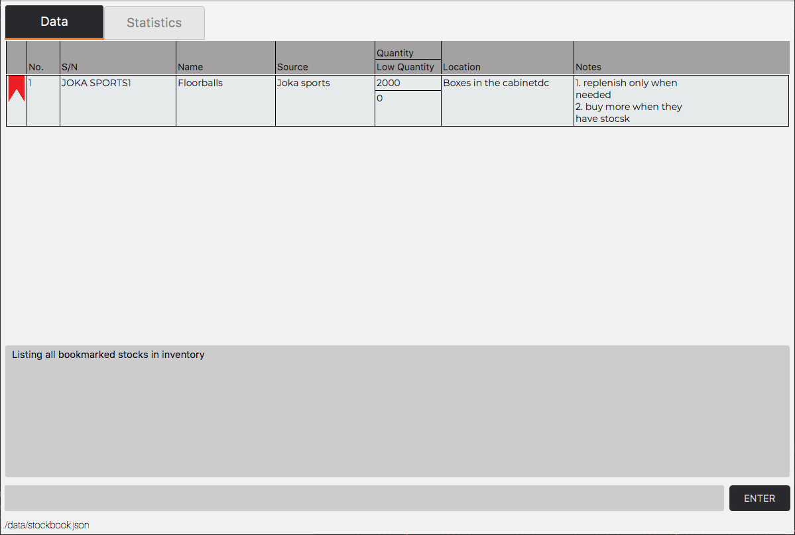
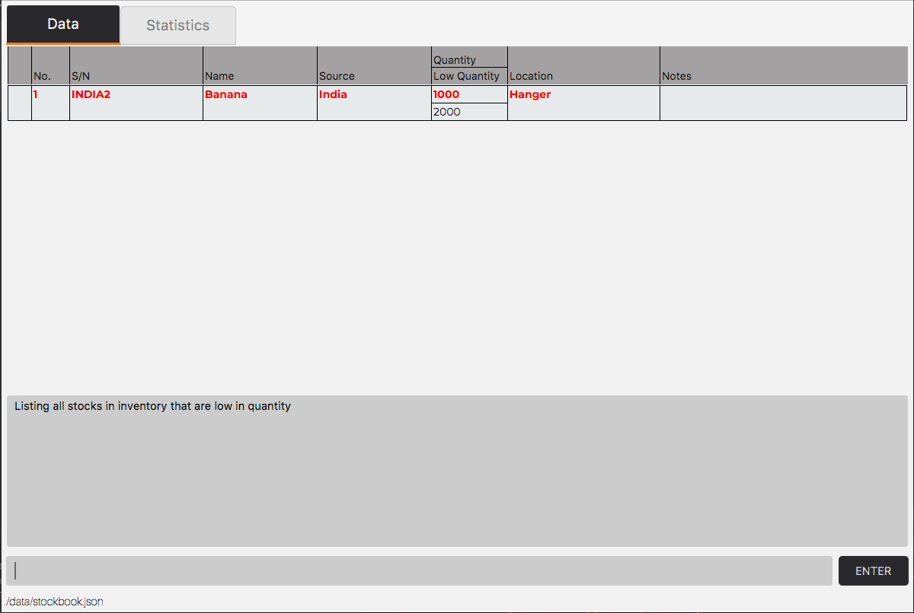
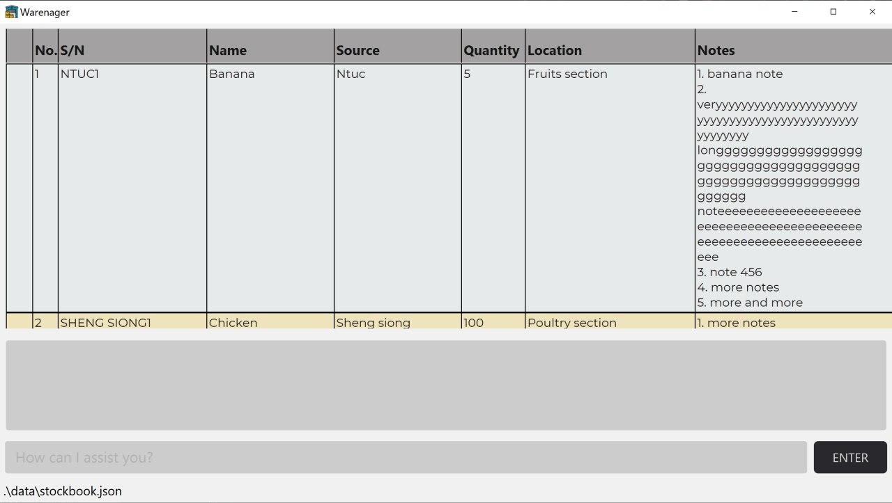
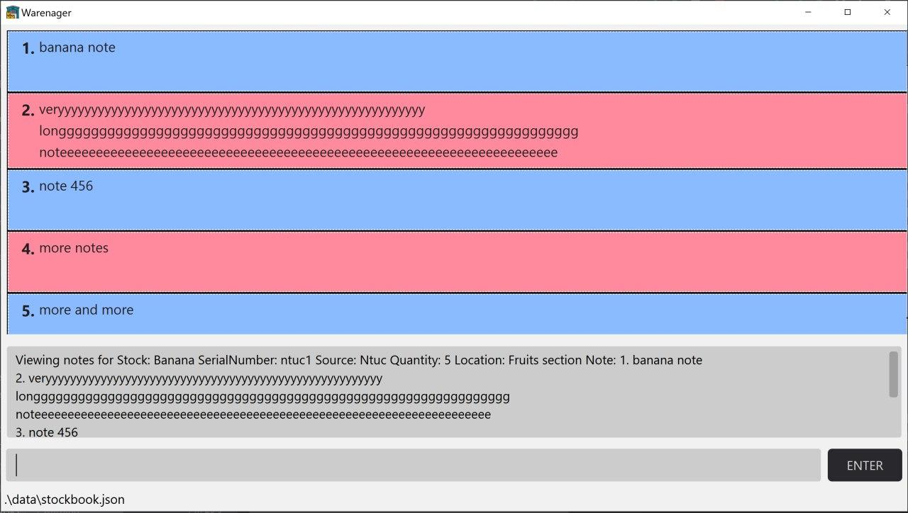
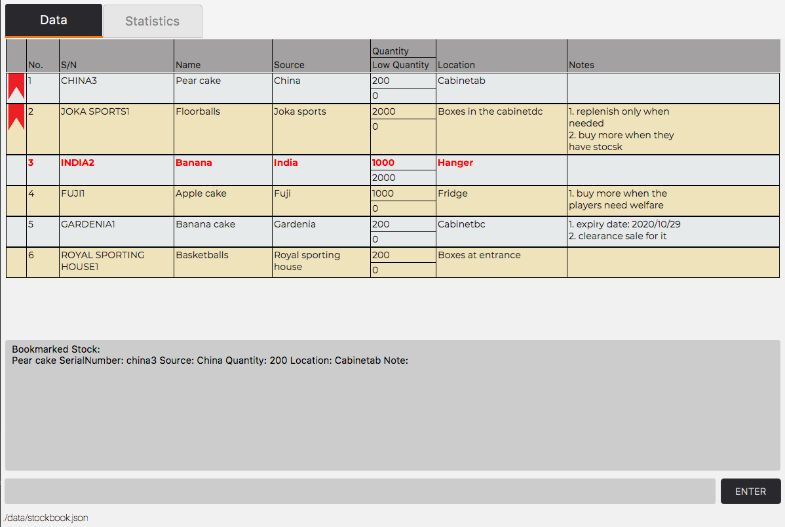
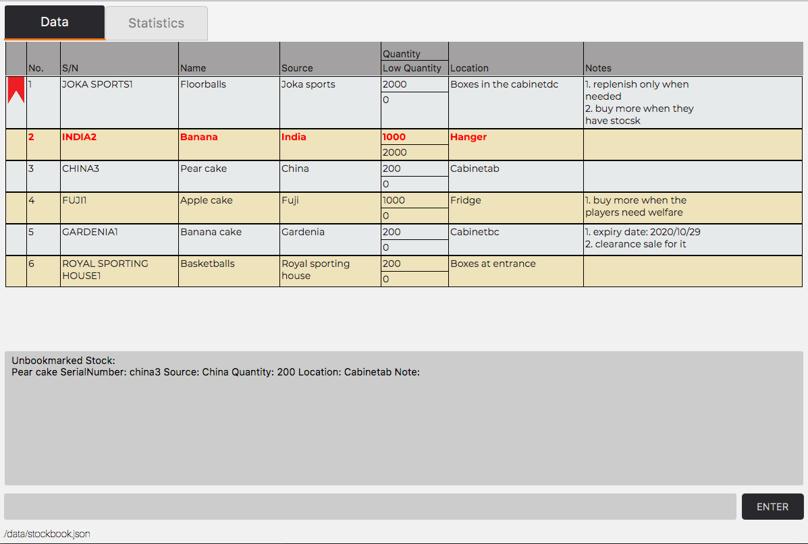

---
<h3>Table of Contents</h3>
* Table of Contents
{:toc}

--------------------------------------------------------------------------------------------------------------------
## Introduction

### Warenager’s User Guide

This user guide introduces our inventory management application, Warenager,
and provides support for the usage of its functionalities.
For quick reference, we have provided a [summarised table of commands](#command-summary)
and their usage formats.

### About Warenager

Warenager is an **inventory management application** to help warehouse managers
of small scale companies keep track of stocks in their warehouse.
It **optimizes inventory management tasks** for warehouse managers including but not
exhaustive of **updating, searching and sorting stocks** via Command Line Interface (CLI),
while still having the benefits of a Graphical User Interface (GUI).

--------------------------------------------------------------------------------------------------------------------
## Quick start
To get started using Warenager,

1. Ensure you have Java `11` or above installed in your Computer.

<div markdown="block" class="alert alert-info">

**:information_source:** If you have not done Java programming before or have not used CLI-based applications
programmed with Java like Warenager, then you probably do not have Java `11` installed in your computer. <br>
You can install Java `11` [here](https://www.oracle.com/java/technologies/javase-jdk11-downloads.html).

</div>

1. Download the latest `warenager.jar` from [here](https://github.com/AY2021S1-CS2103T-T15-3/tp/releases).

1. Copy the jar file you have just downloaded to the folder you want to use as the _home folder_ for your Warenager.

1. Double-click the jar file to start the application.<br>

The commands available in the current version of
Warenager are: add, delete, update, find, findexact, note, notedelete,
stockview, stats, sort, print, bookmark, unbookmark, list and help.
Refer to the [Commands](#commands) section to for details of each command.

--------------------------------------------------------------------------------------------------------------------
## Definitions

Terms used in Warenager are defined here.
If you term is not stated here, google the term to understand more.

Term | Definition
--------|------------------
**Command Line Interface (CLI)** | A command-line interface processes commands to a computer program in the form of lines of text. 
**Graphical User Interface (GUI)** | The graphical user interface is a form of user interface that allows users to interact with electronic devices through graphical icons.
**Parameters** | Parameters are additional fields to key in during user input. e.g. `q/<source of stock>`, `n/<name>`
**CSV File** | Comma-Separated Values File. It contains data separated by commas.
**JSON File** | JavaScript Object Notation File. Data interchange format file that uses human-readable text to store and transmit data objects consisting of attribute–value pairs.

--------------------------------------------------------------------------------------------------------------------
## Labels

Label | Meaning
--------|------------------
**:warning:** | Cautionary advice/Precautions
**:information_source:** | Useful notes/summaries for sections.

--------------------------------------------------------------------------------------------------------------------

## Features

<div markdown="block" class="alert alert-info">

**:information_source: Brief summary of features:**<br>

Note: Stocks possess these fields: Name, Serial Number, Source, Quantity, Location etc. <br>
(These stock details are presented in a drop down window.)

* **Adding** stocks: Unique serial number is generated based on the stock item and source company.
* **Deleting** stocks
* **Updating** stock fields
* **Searching** for stocks by
    * name of stock
    * serial number
    * source of stock
    * location stored in warehouse
* Adding / Deleting **optional notes** to stocks
* **Viewing** all details of a stock
* **Bookmarking** stocks: e.g. often used stocks, search bookmark<item>.
* **Print** to generate file for printing of stock list.
* **Clear** to clear **all** existing data in Warenager.
* **Tab** to toggle between tabs in Warenager.
* **Listing** all stocks in Warenager.
* **Storage** into CSV and JSON files.

* Upon start up of the Warenager application, stocks are by default displayed
in order of decreasing priority: low quantity stocks, bookmarked stocks, other stocks.
</div>

--------------------------------------------------------------------------------------------------------------------
## Commands

This section provides support for the commands required to perform desired actions on Warenager.
<div markdown="block" class="alert alert-info">

**:information_source: Note for command input format:**<br>

* Words enclosed in `<>` are the input parameters to be supplied by the user. <br>
  For example, in `n/<name>`, `name` is a parameter which can be used as `n/Pork Belly`.

* Prefixes not enclosed with anything is compulsory, must be provided by the user, and duplicate is not allowed. <br>
  For example, in `list lt/<list type>`, the `lt/<list type>` must be provided and no duplicate is allowed. <br>
  `list` and `list lt/all lt/bookmark` are invalid command formats, but `list lt/all` is valid.

* Prefixes enclosed with `[]` is optional, can be omitted by the user, and duplicate is not allowed. <br>
  For example, in `update sn/<serial number> [n/<name>]`, the `n/<name>` can be omitted. <br>
  `update sn/Fairprice1 n/Apple` and `update sn/Fairprice1` are both valid command formats, <br>
  but `update sn/Fairprice1 n/Apple n/Banana` is not a valid command format.

* Compulsory prefixes with `...` trailing after them can be used more than one time in one command. <br>
  For example, in `delete sn/<serial number>...`, the `sn/<serial number>` must be provided and duplicates are allowed. <br>
  `delete sn/Fairprice1` and `delete sn/Fairprice1 sn/Ntuc1` are both valid command formats.
  
* Multiple prefixes combined with `|` means only one of them can be provided at a single command. <br>
  For example, in `update sn/<serial number> [iq/<increment value> | nq/<new quantity>]`, at most one of `iq/<increment value>`
  or `nq/<new quantity>` may be provided. <br>
  `update sn/Fairprice1 iq/+10 nq/100` is an invalid command format, but `update sn/Fairprice1 iq/+10`, 
  `update sn/Fairprice1 nq/100`, `update sn/Fairprice1` are all valid command formats.

* Multiple prefixes enclosed with `{ }` means that at least one of the prefixes within the `{ }` must be present
  in the command.<br>
  For example, in `find { [n/<name>] [s/<source>] [l/<location>] [q/<quantity>] }`, at least one of `n/<name>`,
  `s/<source>`, `l/<location>` and `q/<quantity>` must be provided in the command. <br>
  `find sn/fairprice n/banana` is a valid command, but `find` and `find sn/fairprice sn/ntuc` are invalid commands.
  
* Prefixes given can be in any order. <br>
  For example, `update sn/Fairprice1 n/Apple` and `update n/Apple sn/Fairprice1` are both valid and behave exactly the same.

* All 15 valid prefixes that are used in Warenager are <br>
  `n/<name>, s/<source>, q/<quantity>, lq/<low quantity>, l/<location>, lt/<list type>, sn/<serial number>, nq/<new quantity>,
  iq/<increment value>, nt/<note>, ni/<note index>, st/<statistics type>, by/<field>, o/<order>, fn/<file name>`.

</div>

<div markdown="block" class="alert alert-warning">

**:warning: Warning for invalid prefixes**

Unexpected behaviors might occur if any prefix besides the 15 valid prefixes recognized by Warenager is supplied by the user. <br>
In general, Warenager will not be able to parse any prefix besides the 15 valid prefixes above and will recognize the
invalid prefix as a parameter instead. <br>
For example, in `delete sn/Fairprice1 x/Random`, `Fairprice1 x/Random` will be recognized as the `<serial number>`. 

</div>

<div markdown="block" class="alert alert-warning">

**:warning: Warning for invalid command input**

If an invalid command is entered with incorrect prefixes that results in Warenager
not able to perform the desired action, Warenager will return to the Data tab which
shows the entire stock book list.
You can then correct the command input and enter to perform the desired action.

</div>

### Command summary
Summary of the commands required to perform certain actions is listed in this table:

Action | Format, Examples
--------|------------------
**Add** | `add n/<name> s/<source> q/<quantity> l/<location> [lq/<low quantity>]` <br> e.g. `add n/Banana cake s/Fairprice q/100 l/Food section`
**List** | `list lt/<list type>` <br> e.g. `list lt/bookmark`
**Delete** | `delete sn/<serial number>...` <br> e.g. `delete sn/Fairprice1`
**Find** | `find [n/<name>] [sn/<serial number>] [s/<source>] [l/<location>]` <br> e.g. `find n/banana sn/SHENGSIONG`
**FindExact** | `findexact [n/<name>] [sn/<serial number>] [s/<source>] [l/<location>]` <br> e.g. `findexact n/banana sn/SHENGSIONG`
**Note** | `note sn/<serial number> nt/<note>` <br> e.g. `note sn/shengsiong1 nt/chicken will expire soon`
**NoteDelete** | `notedelete sn/<serial number> ni<note index>` <br> e.g. `notedelete sn/ntuc1 ni/1`
**StockView** | `stockview sn/<serial number>` <br> e.g. `stockview sn/ntuc1`
**Update** | `update sn/<serial number>... [iq/<increment value> `&#124;` nq/<new quantity>] [n/<name>] [s/<source>] [l/<location>] [lq/<low quantity>]` <br> e.g. `update sn/Ntuc1 iq/+50 n/heineken` 
**Statistics** | `stats st/<statistics type>` <br> e.g. `stats st/source-qd-ntuc`
**Print** | `print fn/<file name>` <br> e.g. `print fn/stocks`
**Sort** | `sort o/<order> by/<field>` <br> e.g. `sort o/descending by/quantity`
**Bookmark** | `bookmark sn/<serial number>...` <br> e.g. `bookmark sn/China3`
**Unbookmark** | `unbookmark sn/<serial number>...` <br> e.g. `unbookmark sn/China3`
**Help** | `help`
**Clear**| `clear`
**Tab** | `tab`
**Exit** | `exit`

--------------------------------------------------------------------------------------------------------------------

### Components of Warenager


### Viewing help : `help`

Displays the list of command instructions for features in Warenager and how to use the command.

<h4>Format</h4>

```
help
```

<h4>Expected Help Window</h4>


### Adding new stock: `add`
Adds a new stock into the inventory. A unique serial number for the new stock will be generated by the program.
The optional field low quantity will be set to 0 if not present in the input.

<h4>Format</h4>

```
add n/<name> s/<source> q/<quantity> l/<location> [lq/<low quantity>]
```

<h4>Examples</h4>

```
add n/Banana cake s/Fairprice q/100 l/Food section
add n/Sprite s/Ntuc q/1000 l/Drinks section lq/5000
```

### Listing of stock: `list`
Lists all the stock(s) in the inventory.

<h4>Format</h4>

```
list lt/<list type>
```

<div markdown="block" class="alert alert-info">

**:information_source: The valid list types that can be provided and the respective list that it shows are**

**list type** | **What the list shows**
------| --------
**all** | All the stocks in the inventory.
**bookmark** | All the stocks in the inventory that is bookmarked.
**low** | All the stocks in the inventory that is low in quantity.

</div>

<h4>Examples</h4>

```
list lt/all
```


```
list lt/bookmark
```



```
list lt/low
```



### Deleting of stock: `delete`
Deletes the stock(s) using the stock's serial number from the inventory. Multiple stocks can be deleted simultaneously.

<h4>Format</h4>

```
delete sn/<serial number> [sn/<serial number>]...
```

<h4>Examples</h4>

```
delete sn/courts1 sn/courts2
```

<h4>Below is a guided example for deleting stocks:</h4>
Before you start any deletion, make sure to use the command `list lt/all` to list all
the stocks you have in Warenager. 


Let's delete the stock with serial number `COURTS2`. The fields are **not** case-sensitive.<br>
A valid delete input would be `delete sn/courts2`.

**Before input**:


**After input**:


Multiple stocks can also be deleted at the same time. Let's delete 2 stocks with serial numbers `COURTS3`
and `COURTS4`. It can be done by chaining the serial numbers when deleting.<br>
A valid delete input would be `delete sn/courts3 sn/courts4`.<br>

**Before input**:


**After input**:


<div markdown="block" class="alert alert-warning" markdown="1">

**:warning:**
Stocks that do not exist in Warenager cannot be deleted. Using the same input in the previous step,
`delete sn/courts3 sn/courts`, you should expect the following:


</div>


### Find stocks from inventory: `find`

Displays a list of stocks found in the inventory that contains all keywords
specified in ANY one of fields searched.

<h4>Format</h4> 

```
find { [n/<name>] [sn/<serial number>] [s/<source>] [l/<location>] }
```

<h4>Search criteria</h4>

* Only stocks that contain all the search keywords for a field will be displayed. <br>
    e.g. `find n/ChickenNuggets` will not match stock with Name: Chick. <br>
    e.g. `find n/ChickenNuggets abcdef` will not match stock with Name: ChickenNuggets. <br>


* Search is case-insensitive.
    e.g. `find n/ashLey` will match stock with Name: Ashley.

* Any stock with any field that contains all the search keywords in any of the fields searched will be displayed.<br>

<h4>Examples</h4>

Stock | Details
------| --------
**Stock 1** | Name: Banana<br> Serial Number: NTUC1111<br> Source: Ntuc<br> Quantity: 5<br> Location in warehouse: Fruits section
**Stock 2** | Name: Chicken<br> Serial Number: SHENGSIONG1111<br> Source: Shengsiong<br> Quantity: 100<br> Location in warehouse: Poultry section

```
find n/banana sn/SHENGSIONG
```
will match both Stock 1 and Stock 2 <br>

```
find l/section
```
will match both Stock 1 and Stock 2. <br>

```
find n/chicken l/poultry
```
will match only Stock 2. <br>

```
find s/ntuc l/singapore
```
will match only Stock 1.

<h4>Below is a guided example for finding stocks using the `find` command:</h4>
<div markdown="block" class="alert alert-info">

**:information_source:** 
The links provided are for reference if you do not know how to use the respective commands.

</div>

Step 1. Start by [adding](#adding-new-stock-add) 3 stocks to your stock list.<br>
`add n/apple juice s/ntuc l/fruits section a q/100`<br>
`add n/banana bun s/ntuc l/fruits section b q/200`<br>
`add n/pineapple tart s/cold storage l/fruits section c q/300`

The 3 stocks added should appear in your `Data` tab as shown in the image below.


Let's find the stock with **name that contains `apple` or source that contains `cold`**.

Step 2. Type the command `find n/apple s/cold` into the command box and enter. The result display should show
the keywords you searched for and how many stocks were found.<br>
In this case, the two stocks with names `apple juice` and `pineapple tart` would be found.

**After input:**


You have successfully used the `find` command.

Let's add an additional field into the search.

Step 3. Type the command `find n/apple s/cold l/unknown` in the command box and enter.
The same two stocks as in Step 2 should be found as they still match `n/apple`. 

**After input:**


You are now done with the guided tutorial for `find`.

<div markdown="block" class="alert alert-warning">

**:warning:** Below are some cases where `find` command does not work:
You will see an error message describing what went wrong
and the correct command format for the `find` command.

Continuing from the steps from the guided example above, 
let's try finding by **entering nothing** as a keyword. 

Step 4. Type `find n/` into the command box and enter. You will see that no stocks will be found.

**After input:**


Let's try finding with an invalid prefix for the `find` command.

Step 5. Type `find nt/apple` into the command box and enter. 

**After input**:


Let's try finding with a duplicate valid prefix for the `find` command.

Step 6. Type `find n/apple n/pineapple` into the command box and enter.

**After input**:

</div>

### Find exact stocks from inventory: `findexact`
Displays a list of stocks found in the inventory that contains all keywords specified in ALL fields searched.

<div markdown="block" class="alert alert-info">

**:information_source:** The difference between the `find` and `findexact` command is that with the `find` command, stocks that
                       match any of the fields searched will be displayed while for `findexact`, stocks must match all the of the fields
                       searched to be displayed.<br>
                       <br>
                       For example, for `find n/apple s/cold`, stock details just need to match `n/apple` or `s/cold` to be displayed.
                       For `findexact n/apple s/cold`, stock details have to match both `n/apple` and `s/cold` to be displayed.

</div>

<h4>Format</h4>

```
findexact { [n/<name>] [sn/<serial number>] [s/<source>] [l/<location>] }
```

<h4>Search criteria</h4>
* Only stocks that contain all the search keywords for all fields will be displayed. <br>
    e.g. `findexact n/ChickenNuggets s/ntuc` 
    will not match stock with Name: Chick, Source: ntuc. <br>
    e.g. `findexact n/Chicken sn/1111`
    will match stock with Name: ChickenNuggets, SerialNumber: 1111. <br>
    e.g. `findexact n/ChickenNuggets abcdef l/section b`
    will not match stock with Name: ChickenNuggets, Location: section b.<br>

* Search is case-insensitive.
    e.g. `findexact n/ashLey s/nTuC` will match stock with Name: Ashley, Source: ntuc.

* Any stock with fields containing all the search keywords in all the fields searched will be displayed.<br>

<h4>Examples</h4>

Stock | Details
------| --------
**Stock 1** | Name: Banana<br> Serial Number: NTUC1111<br> Source: Ntuc<br> Quantity: 5<br> Location in warehouse: Fruits section
**Stock 2** | Name: Chicken<br> Serial Number: SHENGSIONG1111<br> Source: Shengsiong<br> Quantity: 100<br> Location in warehouse: Poultry section

```
findexact n/banana sn/SHENGSIONG
```
will not match Stock 1 and Stock 2.<br>

```
findexact l/section
```
will match both Stock 1 and Stock 2. <br>

```
findexact n/chicken l/section
```
will match only Stock 2. <br>

```
findexact n/banana s/ntuc l/singapore
```
will not match Stock 1 and Stock 2.

<h4>Below is a guided example for finding stocks using the `findexact` command:</h4>
<div markdown="block" class="alert alert-info">

**:information_source:** The links provided are for reference if you do not know how to use the respective commands.
If you are continuing from the above `find` command tutorial, you may skip step 1.

</div>

Step 1. Start by [adding](#adding-new-stock-add) 3 stocks to your stock list. <br>
`add n/apple juice s/ntuc l/fruits section a q/100`<br>
`add n/banana bun s/ntuc l/fruits section b q/200`<br>
`add n/pineapple tart s/cold storage l/fruits section c q/300`

The 3 stocks added should appear in your `Data` tab as shown in the image below.


Let's find the stock with **name that contains `apple` and source that contains `cold`**.

Step 2. Type the command `findexact n/apple s/cold` into the command box and enter. The result display should show
the keywords you searched for and how many stocks were found.<br>
In this case, only one stock, with the name `pineapple tart`, would be found.

**After input:**


You have successfully used the `findexact` command.

Let's add an additional field into the search.

Step 3. Type the command `findexact n/apple s/cold l/unknown` and enter.
No stock should be found as there is no stock with the location unknown.

**After input:**


You are now done with the guided tutorial for `findexact`.

<div markdown="block" class="alert alert-warning">

**:warning:** For cases where the `findexact` command does not work,
refer to the section where the `find` command does not work, at the `find` command guided tutorial Steps 5 to 7,
with the replacement of the `find` command with the `findexact` command.

</div>

### Update inventory: `update`
Updates the details of the desired stock(s), requires the serial number of stock(s).

<h4>Format</h4>

```
update sn/<serial number>... [iq/<increment value> | nq/<new quantity>] [n/<name>] [s/<source>] [l/<location>] [lq/<low quantity>]
```

<div markdown="block" class="alert alert-warning">

**:warning: In case one of serial numbers is invalid**
If more than one serial number is passed and at least one of them is wrong (not found in the inventory list), then the command
will not update anything and shows an error message.

</div>

Values to be updated are case-insensitive.

<h4>Examples</h4>

Stock | Details
------| --------
**Stock 1** | Name: Banana<br> Serial Number: NTUC1<br> Source: Ntuc<br> Quantity: 5<br> Location in warehouse: Fruits section
**Stock 2** | Name: Chicken<br> Serial Number: SHENGSIONG1<br> Source: Shengsiong<br> Quantity: 100<br> Location in warehouse: Poultry section
**Stock 3** | Name: Guinness<br> Serial Number: COLDSTORAGE1<br> Source: Coldstorage<br> Quantity: 10<br> Location in warehouse: Drinks section

```
update sn/Ntuc1 n/Apple
```
will change **Stock 1** name to `Apple`.

```
update sn/Shengsiong1 s/Coldstorage l/Meat section
```
will change **Stock 2** source to `Coldstorage` and location to `Meat section`.

```
update sn/Ntuc1 iq/+50 n/heineken
```
will change **Stock 3** name to `heineken` and increment the quantity by `50`. **Stock 3** quantity changes to `60`.

```
update sn/Shengsiong1 s/Coldstorage nq/50 lq/60
```
will change **Stock 2** source to `Coldstorage`, quantity to `50`, and low quantity threshold to `60` and therefore flagging the stock because `50 < 60`.

```
update sn/Ntuc1 sn/Coldstorage1 n/Apple juice
```
will change **Stock 1** and **Stock 3** name to `Apple juice`.

### Adding notes to stock: `note`
Adds a note to the stock specified, displayed in the notes column for that stock.
Multiple notes can be added to the stock and each note will be indexed. <br>

<h4>Format</h4>
```
note sn/<serial number> nt/<note>
```

<h4>Example</h4>
```
note sn/SHENG SIONG1 nt/chicken will expire soon
```

<h4>Below is a guided example for adding notes to stocks:</h4>

Step 1. Start with [adding](#adding-new-stock-add) these 3 stocks in your
stock book in your `Data` tab as shown in the image below.


<div markdown="block" class="alert alert-info">

**:information_source:** You may also skip Step 1 and use the stocks already in your stockbook.
Just make sure that the serial number of the stock you are adding the note to is correctly entered.

</div>

Let's add a note to stock with name Apple juice.

Step 2. Type `note sn/ntuc1 nt/buy on wednesday` into the command box and enter. You will see the note
added to the stock with name Apple juice at note index 1 in the Notes column.

**After input:**


Let's add different note to the same stock as in Step 2.

Step 3. Type `note sn/ntuc1 nt/another note for the SAME stock!` into the command box and enter.
You will see the note added to the stock with name Apple juice at note index 2 in the Notes column.

**After input:**


Let's add a note to a different stock from that in Steps 1 and 2.

Step 4. Type `note sn/COLD STORAGE1 nt/3 pineapple tarts JUST arrived` into the command box and enter.
You will see the note added to the stock with name Pineapple tart at note index 1 in the Notes column.

**After input:**


You are now done with the guided tutorial for `note`.

<div markdown="block" class="alert alert-warning">

**:warning:** Below are some cases where `note` command does not work:
You should see an error message describing what went wrong and the correct format for the `note` command.

Continuing from the steps from the guided example above, 
Let's try **entering nothing** as a note. 
Type `note sn/ntuc1 nt/` into the command box and enter.

**After input:**


Let's try adding a note to an **unknown** serial number.

Type `note sn/unknown1 nt/note` in the command box and enter.

**After input:**


Let's try adding a note but with an invalid prefix: `n/` for the `note` command.

Type `note sn/ntuc1 nt/valid note n/invalid` into the command box.

**After input:**


Let's try adding a note but with a duplicate valid prefix for the `note` command.

Type `note sn/ntuc1 nt/first note nt/second note` into the command box and enter.

**After input:**


</div>                        

### Deleting note(s) from stock: `notedelete`
Deletes a note, specified by the note's index, from the stock specified by its serial number.

<div markdown="block" class="alert alert-warning">

**:warning:**
Note index must be an integer.
To delete ALL notes from a stock, note index to specify is 0.

</div>

<h4>Format</h4>

```
notedelete sn/<serial number> ni/<note index>
```

<h4>Example</h4>

```
notedelete sn/ntuc1 ni/1
```

<h4>Below is a guided example for deleting notes from stocks:</h4>

Step 1. Start with these stocks in your stock book in your `Data` tab as shown in the image below.


<div markdown="block" class="alert alert-info">

**:information_source:** You may also skip Step 1 and use the stocks that have notes already in your stockbook.
Make sure that the serial number of the stock and the note index of the note you are deleting
from the stock is correctly entered.

</div>

Let's delete a note from the stock with name Pineapple tart.

Step 2. Type `notedelete sn/cold storage1 ni/2` into the command box and enter. 
You will see that the note at note index 2, `pineapple tarts for CNY`
of the stock with serial number `coldstorage1` has been deleted.

**After input:**


You have successfully used the `notedelete` command.

Let's try deleting all the notes from the stock with serial number `ntuc1` with one command.

Step 3. Type `notedelete sn/ntuc1 ni/0` into the command box and enter.
You will see that all the notes of the stock with serial number `ntuc1` has been deleted.

**After input:**


You are now done with the guided tutorial for `note`.

<div markdown="block" class="alert alert-warning">

**:warning:** Below are some cases where `notedelete` command does not work:
You should see an error message describing what went wrong and the correct format for the `notedelete` command.

Continuing from the steps from the guided example above, 
Let's try deleting a note from an **unknown** serial number.

Type `note sn/unknown1 nt/note` in the command box and enter.

**After input:**


Let's try adding a note but with an invalid prefix: `n/` for the `note` command.

Type `note sn/ntuc1 nt/valid note n/invalid` into the command box.

**After input:**


Let's try adding a note but with a duplicate valid prefix for the `note` command.

Type `note sn/ntuc1 nt/first note nt/second note` into the command box and enter.

**After input:**


</div>   

### Viewing all notes of a stock: `noteview`
Views all notes of the stock specified by its serial number.

<h4>Format</h4>

```
noteview sn/<serial number>
```

<h4>Examples</h4>

* Before: <br>



* After command
```
noteview sn/ntuc1
```



### Generating statistics: `stats`
Generates a statistical view in a pie chart depicting the target fields.

<h4>Format</h4>

```
stats st/<statistics type>
```

<div markdown="block" class="alert alert-info">

**:information_source: The valid statistics types that can be provided and what the respective statistics describes are**

**Statistics type** | **What the statistics describes**
------| --------
**source** | Distribution of source companies.
**source-qd-<source company>** | Distribution of stocks for the target source company.

</div>

<h4>Examples</h4>

```
stats st/source, stats st/source-qd-abc ("abc" is an existing source company)
```

<h4>Below is a guided example for displaying statistics:</h4>

Start Warenager. Suppose you want to display source statistics. After the input, you should notice that
the title in the statistics window as highlighted corresponds to the type of statistics shown.<br>
The valid statistics input would be `stats st/source`.

**Before input**:


**After input**:


Now suppose you want to display source statistics for the source company `courts`. After the input, you
should notice that the title in the statistics window as highlighted now corresponds to the source company `courts`.<br>
The valid statistics input would be `stats st/source-qd-courts`.

**Before input**:


**After input**:


<div markdown="block" class="alert alert-warning" markdown="1">

**:warning:**
If Warenager is first started up, you should expect the following in the **Statistics** tab,
and this is **intended**:


</div>

### Bookmarking stocks in the list: `bookmark`
Bookmarks the desired stock(s). 
Bookmarking a stock pushes the stock to the top of the stock list.

<h4>Format</h4>

```
bookmark sn/<serial number>...
```

<h4>Examples</h4>

```
bookmark sn/China3
```




### Unbookmarking stocks in the list: `unbookmark`
Removes bookmark from the desired stock(s).

<h4>Format</h4>

```
unbookmark sn/<serial number>...
```

<h4>Examples</h4>

```
unbookmark sn/China3
```



### Sorting inventory: `sort`
Sort the inventory by a specific field and order.

<h4>Format</h4>

```
sort o/<order> by/<field>
```

<div markdown="block" class="alert alert-info">

**:information_source: Regarding order and field to be sorted** 

* The order can only be one of the following:
    1. `ascending` - sorts the inventory in ascending order
    2. `descending` - sorts the inventory in descending order
    
* The field can only be one of the following:
    1. `name` - sorts the inventory by name
    2. `source` - sorts the inventory by source
    3. `quantity` - sorts the inventory by quantity
    4. `location` - sorts the inventory by location
    5. `serialnumber` - sorts the inventory by serial number

</div>

<h4>Examples</h4>

Stock | Details
------| --------
**Stock 1** | Name: Chicken breast<br> Serial Number: FAIRPRICE1<br> Quantity: 10<br> Source: Fairprice<br> Location in warehouse: Poultry section
**Stock 2** | Name: Pork belly<br> Serial Number: FAIRPRICE2<br> Quantity: 25<br> Source: Fairprice<br> Location in warehouse: Poultry section
**Stock 3** | Name: Coca cola<br> Serial Number: NTUC1<br> Quantity: 100<br> Source: Ntuc<br> Location in warehouse: Drinks section
**Stock 4** | Name: Sprite<br> Serial Number: NTUC2<br> Quantity: 100<br> Source: Ntuc<br> Location in warehouse: Drinks section

```
sort o/descending by/quantity
```
will sort based on quantity and in descending order. <br>


```
sort o/ascending by/name
```
will sort based on name and in ascending order. <br>


### Command Suggestion
Sometimes user will type in wrong commands. Warenager will help such user by suggesting the correct format
of the command if the command word is valid. If the command word is invalid, then Warenager will try to predict
and suggest the closest command to whatever the user has typed.

<div markdown="block" class="alert alert-warning">

**:warning:**
The suggestion will only be made if the command format is invalid or unknown. If the command is valid, but there
are errors such as serial number not found, then Warenager will not suggest anything to the user and instead displays
an error message.

</div>

<h4>Examples</h4>

```
del
```
Warenager will suggest:
```
delete sn/<serial number>
```

```
delt sn/NUS1
```
Warenager will suggest:
```
delete sn/NUS1
```

```
ad n/Thai Tea s/Fairprice q/100
```
Warenager will suggest: 
```
add n/Thai Tea s/Fairprice q/100 l/<location>
```

```
list n/Duck q/100
```
Warenager will suggest: 
```
list lt/all
```

### Generates a CSV file that contains all stocks: `print`
Generates a CSV file that contains all stocks. Csv file will be named according to the user input, and the file name
can only contain alphanumeric characters. Users may want to sort the stocks using `sort` command
to sort the stock in their preferred order before converting it into the CSV file. The CSV file is saved
to `[root directory]/data/userInput.csv` after successfully executing the command.

<h4>Format</h4>

```
print fn/<file name>
```

<h4>Examples</h4>


```
print fn/stocks
```
After executing the command, proceed to the folder which contains Warenager. Click on the `data`
folder circled in red.


 
Open `stocks.csv` folder circled in red with excel.


The stocks in your inventory will be listed according the to format shown below. The file also includes
the latest update time for the `stocks.csv`.


### Clearing all data in Warenager: `clear`
Clears all the existing data in Warenager.

<h4>Format</h4>

```
clear
```
<div markdown="block" class="alert alert-warning" markdown="1">

**:warning: Warning for clearing data**<br>
`clear` is an irreversible process. Do backup the data it if might be needed again.

</div>

<h4>Below is the expected outcome for clearing Warenager:</h4>

**Before input**:


**After input**:


### Toggling tabs: `tab`
Toggles between the tabs in Warenager.

<h4>Format</h4>

```
tab
```

### Saving data
Data (all stocks in inventory in JSON) is automatically saved to
`[root directory]/data/stockbook.json` when any of these commands are executed:
* add
* delete
* note
* update
* clear

The set of used serial number sources is automatically saved to
`[root directory]/data/serialnumbers.json` when any of these commands is executed:
* add

### Exiting Warenager: `exit`
Terminates the program.

<h4>Format</h4>

```
exit
```

--------------------------------------------------------------------------------------------------------------------
## FAQ

**Q**: Can I use Warenager on any OS?<br>
**A**: Yes. Warenager is supported by Windows, Mac and Linux.

**Q**: Can I use Warenager on another device?<br>
**A**: Yes. Simply transfer the JSON data files under `/data` and copy over to the same directory `/data` in the Warenager of your
other device.

--------------------------------------------------------------------------------------------------------------------
