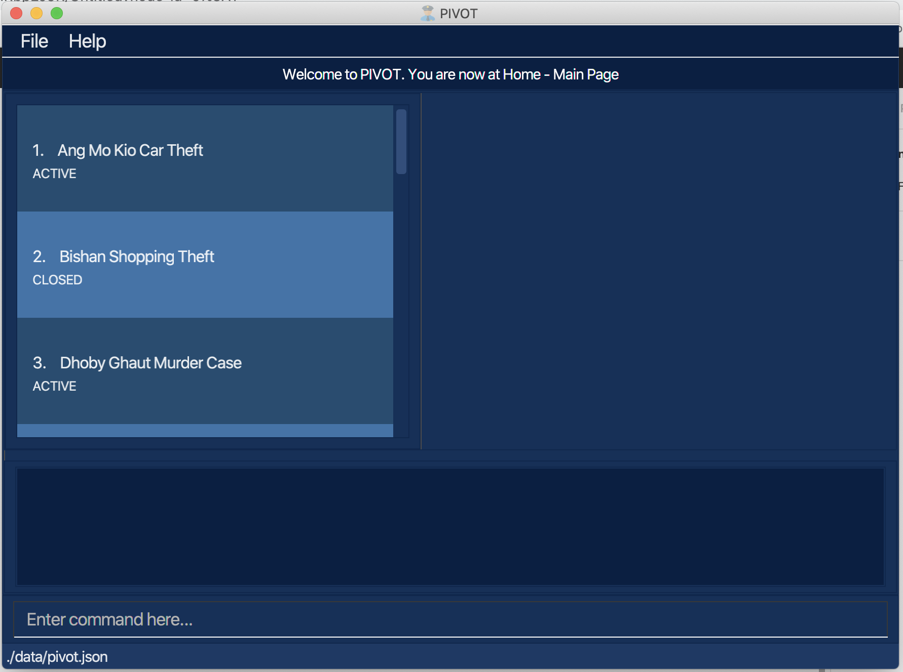
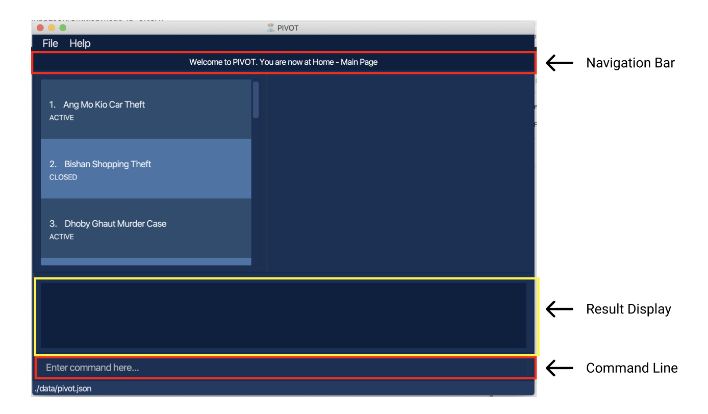
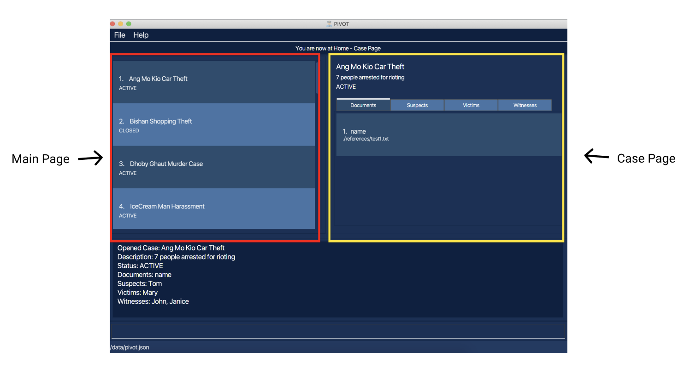
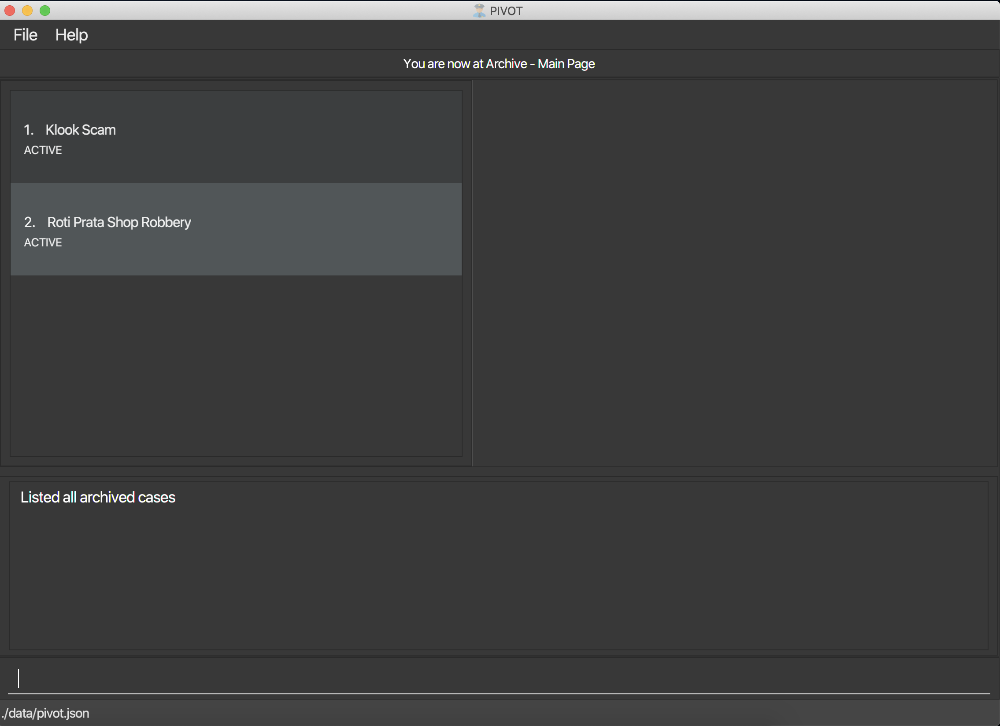
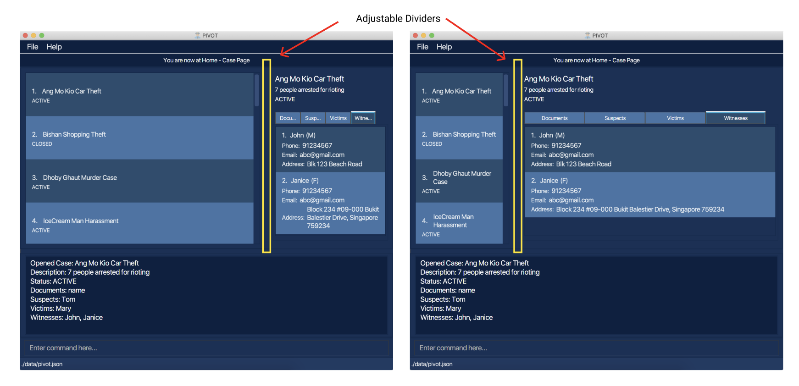
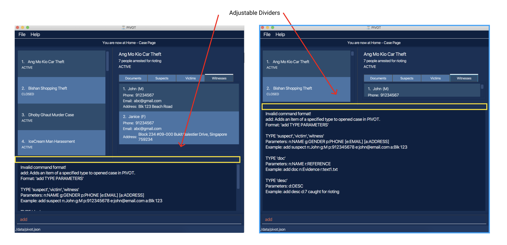

Police Investigation Virtual Organisational Tool (PIVOT) is a **desktop app to assist the police investigators in keeping track of their investigations and relevant information. It is optimized for use via a Command Line Interface** (CLI) while still having the benefits of a Graphical User Interface (GUI).
If you can type fast, PIVOT can manage your investigation cases faster than traditional GUI apps.

* Table of Contents
{:toc}

--------------------------------------------------------------------------------------------------------------------

## Set Up

1. Ensure you have Java `11` or above installed in your Computer.

1. Download the latest release from [here](https://github.com/AY2021S1-CS2103-F09-2/tp/releases).

1. Copy the file to the folder you want to use as the _home folder_ for PIVOT.

1. Run the command `java -jar pivot.jar` using the Command Line at the _home folder_ to start the app. The GUI similar to the below should appear in a few seconds. Note how the app contains some sample data. 
   
    
   
## Navigating PIVOT

1. When you first start the app, you will be at the `Home` section's `Main Page` (You can navigate between the `Home` or `Archive` sections). In the image below, the `navigation bar` is highlighted. It shows where you are in the app at any point in time. The `Command Line` allows you to enter the commands, and the feedback is displayed in the `Result Display`.

    

1. The left panel highlighted in the image below is the `Main Page` of the app. It lists all of the `Cases` stored in PIVOT according to the `Section` you are in. By using a `Main Page Command`,  you can interact with the `Cases` in this page. (Refer to [Main page](#main-page) below for the commands)

1. By typing `open case 1` in the Command Line, the right panel is updated. This is `Case Page` of the app (highlighted below). It displays the `Case` information. By using a `Case Page Command`,  you can interact with the `Case` details in this page. (Refer to [Investigation Case page](#investigation-case-page) below for the commands)

    
    
1. By typing `return`, the right panel is closed and the app returns to the `Main Page`. Notice the changes in the `navigation bar`.

1. By typing `list archive`, the page changes colour. You are now at the `Archive` section. The layout is the same as the `Home` section, as well as the commands that can be used.

    

1. If either of the `Pages` are too small, the `adjustable divider` can be shifted to provide more space to either page!

    
 
1. Likewise, if the `Result Display` is insufficient to display the feedback, its `divider` can also be shifted up! Take note the `Result Display` is scrollable too!

   
    
## Quick Start

1. Type the command in the command box and press Enter to execute it. e.g. typing **`help`** and pressing Enter will open the help window. 
   Some example commands you can try:

   * **`list case`** : Lists all unarchived `Cases`.

   * **`add case t:Kovan double murders`** : Adds a `Case` named `Kovan double murders` to PIVOT.
   
   * **`open case 1`** : Opens the first `Case` listed in the `Main Page`. Its details are shown in the `Case Page`.
   
   * **`add victim n:Joseph sex:M p:91234567`** : Adds a victim into the currently opened case.
   
   * **`return`** : Returns to the `Main Page` and closes the `Case Page`.

   * **`delete case 3`** : Deletes the 3rd case shown in the current list.

   * **`exit`** : Exits the app.

1. Refer to the [Features](#features) below for details of each command.

--------------------------------------------------------------------------------------------------------------------

## Features

**:information_source: Notes about the command format:** 

* Words in `UPPER_CASE` are parameters supplied by the user. Words in `[SQUARE_BRACKETS]`(with square brackets) optional parameters to be supplied by the user. 
  e.g. in `add case t:TITLE`, `TITLE` is a parameter which can be used as `add case t:Kovan double murders`.

**:information_source: Notes about duplicates:** 

* PIVOT does not allow the addition of `Case`, `Document`, `Suspect`, `Witness` or `Victim` that already exists.
* When editing details in PIVOT, if it results in duplicates, PIVOT will not allow it as well.
* `Cases` are identified by their `Title`. Users cannot add a `Case` if there is an existing `Case` (in either `Home`/`Archive` section) with the same `Title`. `Title` is a case-sensitive field.
* `Documents` are identified by both their `Name` and `Reference`. 
Users cannot add a `Document` to a `Case` if there is an existing `Document` with the same `Name` and `Reference` in that `Case`. `Name` is not a case-sensitive field.
* `Suspects`, `Witnesses`, `Victims` are identified by their `Name`, `Sex` and `Phone`. 
Users cannot add a `Suspect`/`Witness`/`Victim` to a `Case` if there is an existing `Suspect`/`Witness`/`Victim` with the same `Name`, `Sex` and `Phone` in that `Case`. `Name` is not a case-sensitive field.
* However, note that there can be duplicates between `Suspect`, `Witness` and `Victim` in a `Case`, and between different `Cases`. 
There can be a `Suspect` with the same `Name`, `Sex` and `Phone` as an existing `Victim`/`Witness` in that `Case` and vice versa.
The same `Suspect`/`Witness`/`Victim` can also appear in different cases.

### Main page
The commands listed below can only be used in the `Main Page` of the app.

#### List all unarchived cases in Home section: `list case`
Shows the `Home` section and lists all unarchived cases in PIVOT.

Format: `list case`

#### List all archived cases in Archive section: `list archive`
Shows the `Archive` section and lists all archived cases in PIVOT.

Format: `list archive`

#### Add case: `add case t:TITLE [s:STATUS]`
Adds a new case with the specified `TITLE`. The `STATUS` is active by default, if not specified. The user can provide 3 status types:

1. `ACTIVE`

2. `CLOSED`

3. `COLD`

The case will be added to the `Home`/`Archive` section, depending on which section they are currently in. 

Format: `add case t:TITLE [s:STATUS]`
* The title must be alphanumeric and cannot be blank.

Example: 
* `add case t:Kovan double murders` creates a new case with the title “Kovan double murders”, the status initialized as an active case.
* `add case t:Kovan double murders s:Closed` creates a new case with the title “Kovan double murders”, the status initialized as a closed case.

#### Delete case: `delete case CASE_NO`
Deletes the case specified with `CASE_NO` from the currently shown list.

Format: `delete case CASE_NO`
* `CASE_NO` must be a valid index (starting from 1) of the currently shown case list.

Example: 
* `list case` followed by `delete case 2` deletes the 2nd case in the currently shown list.

#### Open case: `open case CASE_NO`
Enters the case specified with `CASE_NO` (opened to the right panel), where users can view and edit information for that particular case
[(see Investigation Case Page)](#investigation-case-page).

Format:  `open case CASE_NO`
* `CASE_NO` must be a valid index (starting from 1) of the currently shown case list.

Example: 
* `list case` followed by `open case 1` opens the 1st case in the currently shown list.

#### Archive case in the Home section: `archive case CASE_NO`
Archives the case specified with `CASE_NO` from the currently shown list of cases in the `Home` section of PIVOT.

Note that this command can only be used in the `Home` section of PIVOT.

Format:  `archive case CASE_NO`
* `CASE_NO` must be a valid index (starting from 1) of the currently shown case list.

Example: 
* `list case` followed by `archive case 1` archives the 1st case in the currently shown list.

#### Unarchive case in the Archive section: `unarchive case CASE_NO`
Unarchives the case specified with `CASE_NO` from the currently shown list in the `Archive` section of PIVOT.

Note that this command can only be used in the `Archive` section of PIVOT.

Format:  `unarchive case CASE_NO`
* `CASE_NO` must be a valid index (starting from 1) of the currently shown case list.

Example: 
* `list archive` followed by `unarchive case 1` unarchives the 1st case in the currently shown list.

#### Find case: `find KEYWORD [MORE_KEYWORDS]`

Find cases whose details contain any of the given keywords from the current section the user is in (`Home`/`Archive`).

* The search is case-insensitive. e.g keyword `hans` will match case containing `Hans` in its details
* The order of the keywords does not matter. e.g. keywords `Hans Bo` will match case containing `Bo Hans` in its details
* All details of all cases in the current section (`Home`/`Archive`) are searched, specifically: `Title`, `Status`, `Description`, 
Documents (name and reference that the users input on creation), `Suspects`/`Witnesses`/`Victims` (`Name`, `Sex`, `Phone`, `Email`, `Address`)
* Checks if the particular sequence of characters in the keyword matches e.g. keyword `Han` will match cases containing `Hans` in their details
* Cases matching at least one keyword will be returned (i.e. `OR` search). e.g. keywords `Hans Bo` will return case 
containing `Hans Gruber`, `Bo Yang` in their details.

Note that after doing a `find` command, if an `add case`, `delete case`, `archive case` (used in the `Home` section) 
or `unarchive case` (used in the `Archive` section) command is used, 
the list of cases will be updated to show the full list of cases in `Home` \ `Archive` section, depending on which section they are in.

Format:  `find KEYWORD [MORE_KEYWORDS]`

Example:
* `find Ang` could return cases titled `ang` and `Ang Mo Kio Car Theft`, and cases with a suspect named `Ang`
* `find dhoby bishan` could return cases `Dhoby Ghaut Murder Case` and `Bishan Shopping Theft`, and cases containing `dhoby` or `bishan` in their description
* `find 91234567 bishan` could return a case with the Victim having Phone number `91234567`, and cases containing `bishan` in their details

### Investigation Case page
The commands listed below can only be used in the `Case Page` of the app.

#### List all documents in the current case: `list doc`
Switches to the `Document` tab and lists all suspects for the current case.

Format: `list doc`

#### List all suspects in the current case: `list suspect`
Switches to the `Suspect` tab and lists all suspects for the current case.

Format: `list suspect`

#### List all victims in the current case: `list victim`
Switches to the `Victim` tab and lists all victims for the current case.

Format: `list victim`

#### List all witnesses in the current case: `list witness`
Switches to the `Witness` tab and lists all victims for the current case.

Format: `list witness`

#### Add description to the current case: `add desc d:DESC`
Adds the description of the current case if it does not already have a description. You cannot edit a description of a case that already has a description using this command. Try [Edit Description](#edit-description-of-the-current-case-edit-desc-ddesc) instead.

Format: `add desc d:DESC`
- `DESC` cannot be blank.

Example: 
- `add desc d:Kovan double murders of twins xxx and yyy` adds the description “Kovan double murders of twins xxx and yyy” to the current case.

#### Add document to the current case: `add doc n:NAME r:REFERENCE`
Adds a new document to the current case with the specified `NAME` and `REFERENCE`.
- `NAME` is what you would like to call the Document in PIVOT.
- `REFERENCE` of a Document is the actual filename and its extension. For example, `Evidence.pdf` 

Format: `add doc n:NAME r:REFERENCE`
- `NAME` should only contain alphanumeric characters and spaces, and it should not be blank (no value, spaces only).
- This document with reference `REFERENCE` must be manually added to the `references` folder provided before it can be added to the PIVOT system.

Example: 
- `add doc n:Case Details r:case_details.pdf` adds a new document with title “Case Details” with the file name case_details.pdf to the investigation case.

**:information_source: Notes about the restrictions for the fields of a person (suspect/victim/witness):** 

* `NAME` should only contain alphanumeric characters and spaces, and it should not be blank (no value, spaces only). The first letter of each word will be auto-capitalised.
* `SEX` should only be either M or F, and is case-insensitive.
* `PHONE` should only contain numbers, and it should be at least 3 digits long.
* `EMAIL` should be of the format local-part@domain.top-level-domain and adhere to the following constraints:
    1. The local-part should only contain alphanumeric characters and these special characters,
    excluding the parentheses, (_!#$%&'*+/=?`{|}~^.-). The local part should not start with a '.'.
    2. This is followed by a '@' and then a domain name and then followed by a top-level domain (e.g. '.com').
    The domain name must:
        - start and end with alphanumeric characters.
        - consist of alphanumeric characters, a period or a hyphen for the characters in between, if any.
        - not contain consecutive periods, but consecutive hyphens are allowed.
* There are no restrictions on `ADDRESS`.

#### Add suspect to the current case: `add suspect n:NAME sex:SEX p:PHONE [e:EMAIL] [a:ADDRESS]`

Adds a new suspect to the current case with the specified `NAME`, `SEX` and `PHONE`. The other fields are optional.

Format: `add suspect n:NAME sex:SEX p:PHONE [e:EMAIL] [a:ADDRESS]`

Example:
- `add suspect n:John Doe sex:M p:91234567` adds a `male` suspect named `John Doe` with the phone number `91234567`.
The other fields will be left blank as it was not specified.

#### Add victim to the current case: `add victim n:NAME sex:SEX p:PHONE [e:EMAIL] [a:ADDRESS]`

Adds a new victim to the current case with the specified `NAME`, `SEX` and `PHONE`. The other fields are optional.

Format: `add victim n:NAME sex:SEX p:PHONE [e:EMAIL] [a:ADDRESS]`

Example:
- `add victim n:James Lee sex:M p:91234567` adds a `male` victim named `James Lee` with the phone number `91234567`.
The other fields will be left blank as it was not specified.

#### Add witness to the current case: `add witness n:NAME sex:SEX p:PHONE [e:EMAIL] [a:ADDRESS]`

Adds a new witness to the current case with the specified `NAME`, `SEX` and `PHONE`. The other fields are optional.

Format: `add witness n:NAME sex:SEX p:PHONE [e:EMAIL] [a:ADDRESS]`

Example:
- `add witness n:Joseph Tan sex:M p:91234567` adds a `male` witness named `Joseph Tan` with the phone number `91234567`.
The other fields will be left blank as it was not specified.

#### Edit title in the current case: `edit title t:TITLE`
Edits the title of the case with the specified `TITLE`. Cannot be edited to another existing case title in the PIVOT program (Both Home and Archive).

Format: `edit title t:TITLE`
- `TITLE` should only contain alphanumeric characters and spaces, and it should not be blank (no value, spaces only).

Example: 
- `edit title t:Murder case 29` updates the title of this case to “Murder case 29”.

#### Edit description of the current case: `edit desc d:DESC`
Edits the description of the current case if it has a description.
You must add a description first.[(See Add Description)](#add-description-to-the-current-case-add-desc-ddesc)

Format: `edit desc d:DESC`
- `DESC` cannot be blank.

Example: 
- `edit desc d:Kovan double murders` edits the description of the current case to “Kovan double murders”.

#### Edit status in the current case: `edit status s:STATUS`

Edits the status (ACTIVE, COLD, CLOSED) of the case with the specified `STATUS`. It will overwrite the existing status as long as the input status is valid.

Format: `edit status s:STATUS`
- `STATUS` can only be active, cold, or closed
- `STATUS` is not case-sensitive.

Example: 
- `edit status s:CLOSED` updates the status of this case to “CLOSED”.

#### Edit an existing document in the current case: `edit doc DOC_NO [n:NAME] [r:REFERENCE]`

Edits the document of the current case at the specified `DOC_NO` of the list. There must be at least one field indicated.
A document cannot be edited to contain duplicates in the document list.
- `NAME` is what you would like to call the Document in PIVOT.
- `REFERENCE` of a Document is the actual filename and its extension. For example, `Evidence.pdf` 

Format: `edit doc DOC_NO [n:NAME] [r:REFERENCE]`
- `DOC_NO` must be a valid index (starting from 1) of the document list.
- `NAME` should only contain alphanumeric characters and spaces, and it should not be blank (no value, spaces only).
- This document with reference `REFERENCE` must be manually added to the `references` folder provided before it can be updated in the PIVOT system.

Example: 
- `edit doc 2 n:Fire outbreak details r:newFireDoc.pdf` updates the second document of the current opened case with 
name `Fire outbreak details` and reference `newFireDoc.pdf`.
 
This document `newFireDoc.pdf` must be manually added to the `references` folder provided and must be present before the document can be successfully updated.

**:information_source: Notes about the restrictions for the fields of a person (suspect/victim/witness):** 

* `NAME` should only contain alphanumeric characters and spaces, and it should not be blank (no value, spaces only).  The first letter of each word will be auto-capitalised.
* `SEX` should only be either M or F, and is case-insensitive.
* `PHONE` should only contain numbers, and it should be at least 3 digits long.
* `EMAIL` should be of the format local-part@domain.top-level-domain and adhere to the following constraints:
    1. The local-part should only contain alphanumeric characters and these special characters,
    excluding the parentheses, (_!#$%&'*+/=?`{|}~^.-). The local part should not start with a '.'.
    2. This is followed by a '@' and then a domain name and then followed by a top-level domain (e.g. '.com').
    The domain name must:
        - start and end with alphanumeric characters.
        - consist of alphanumeric characters, a period or a hyphen for the characters in between, if any.
        - not contain consecutive periods, but consecutive hyphens are allowed.
* There are no restrictions on `ADDRESS`.

#### Edit an existing suspect in the current case: `edit suspect SUSPECT_NO [n:NAME] [sex:SEX] [p:PHONE] [e:EMAIL] [a:ADDRESS]`

Edits the fields of the suspect specified with the index in the case that is currently open.
At least one of the fields is to be specified to make edits.
A blank field for the email and address is considered a valid edit, unless the edit does not change any field of the suspect.

Format: `edit suspect SUSPECT_NO [n:NAME] [sex:SEX] [p:PHONE] [e:EMAIL] [a:ADDRESS]`
- `SUSPECT_NO` must be a valid index (starting from 1) of the suspect list.

Example:
- `edit suspect 1 e:newEmail@mail.com a:New Road Crescent` edits the first suspect in the list with the email 
`newEmail@mail.com` and the address `New Road Crescent`.

#### Edit an existing victim in the current case: `edit victim VICTIM_NO [n:NAME] [sex:SEX] [p:PHONE] [e:EMAIL] [a:ADDRESS]`

Edits the fields of the victim specified with the index in the case that is currently open.
At least one of the fields is to be specified to make edits.
A blank field for the email and address is considered a valid edit, unless the edit does not change any field of the victim.

Format: `edit victim VICTIM_NO [n:NAME] [sex:SEX] [p:PHONE] [e:EMAIL] [a:ADDRESS]`
- `VICTIM_NO` must be a valid index (starting from 1) of the victim list.

Example:
- `edit victim 1 e:newEmail@mail.com a:New Road Crescent` edits the first victim in the list with the email 
`newEmail@mail.com` and the address `New Road Crescent`.

#### Edit an existing witness in the current case: `edit witness WITNESS_NO [n:NAME] [sex:SEX] [p:PHONE] [e:EMAIL] [a:ADDRESS]`

Edits the fields of the witness specified with the index in the case that is currently open. 
At least one of the fields is to be specified to make edits.
A blank field for the email and address is considered a valid edit, unless the edit does not change any field of the witness.

Format: `edit witness WITNESS_NO [n:NAME] [sex:SEX] [p:PHONE] [e:EMAIL] [a:ADDRESS]`
- `WITNESS_NO` must be a valid index (starting from 1) of the witness list.

Example:
- `edit witness 1 e:newEmail@mail.com a:New Road Crescent` edits the first witness in the list with the email 
`newEmail@mail.com` and the address `New Road Crescent`.

#### Delete description: `delete desc`
Deletes the description of the current case.
You must add a description first.[(See Add Description.)](#add-description-to-the-current-case-add-desc-ddesc)

Format: `delete desc`

#### Delete document: `delete doc DOC_NO `
Deletes the document specified with `DOC_NO` from the list of documents.

Format: `delete doc DOC_NO`
- `DOC_NO` must be a valid index (starting from 1) of the document list.

Example: 
- `delete doc 1`

#### Delete suspect: `delete suspect SUSPECT_NO`

Deletes the suspect specified with `SUSPECT_NO` from the list of suspects.

Format: `delete suspect SUSPECT_NO`
- `SUSPECT_NO` must be a valid index (starting from 1) of the suspect list.

Example: `delete suspect 1`

#### Delete victim: `delete victim VICTIM_NO`

Deletes the victim specified with `VICTIM_NO` from the list of victims.

Format: `delete victim VICTIM_NO`
- `VICTIM_NO` must be a valid index (starting from 1) of the victim list.

Example: `delete victim 1`

#### Delete witness: `delete witness WITNESS_NO`

Deletes the witness specified with `WITNESS_NO` from the list of witnesses.

Format: `delete witness WITNESS_NO`
- `WITNESS_NO` must be a valid index (starting from 1) of the witness list.

Example: `delete witness 1`

#### Open document in the current case: `open doc DOC_NO`

Opens the specified document at index `DOC_NO` in the list. 

Format: `open doc DOC_NO`
- `DOC_NO` must be a valid index (starting from 1) of the document list.

Example: 
- `open doc 1` opens the document in the list with index 1.

#### Return to main page: `return`

Returns to the application main page.

### Both pages
The commands listed below can be used in the both pages of the app.

#### Undo: `undo`

Undoes the previous command. Open, list, find and return commands are unable to be undone.

Format: `undo`
- Undoing a `Case Command` will not show in the `Result Display` which unique `Case` the command was executed in.

#### Redo: `redo`

Redoes the command that was just undone. Open, list, find and return commands are unable to be redone. If another command that changes the data of PIVOT is used after an undo 
command, redo will not be able to be called.
- Redoing a `Case Command` will not show in the `Result Display` which unique `Case` the command was executed in.

Format: `redo`

**:information_source: Notes about undo/redo:** 

If the command that is being undone/redone is a `main page command`, and if the application is currently on the case page,
using undo/redo will make the application return to the main page. 
e.g. `add case t:Lost Wallet` will add a new case to PIVOT. `open case 1` will open the first case in the list of cases,
and the application will now be at the case page. Using `undo` will undo the `add case t:Lost Wallet command`, which is
a `main page command`. This will bring the application back to the main page.

`Undo` has to be called before any `Redo` can be called. An `Undo` command itself cannot be undone. In order to restore the previous command that was undone, `redo` will have to be called. Likewise, a `redo` command itself cannot be undone as well. Calling `undo` after a `redo` will just restore PIVOT to the state where `undo` was initially called.

#### Help: `help`

Opens the Help Window. 

#### Exit application: `exit`

Exits the application.

### Data Management

#### Loading of User Data

User data automatically loads when user opens the app.

#### Saving of User Data

User data automatically saves when there is a change in data.

--------------------------------------------------------------------------------------------------------------------

## FAQ

**Q**: How do I transfer my data to another Computer? 
**A**: Install the app in the other computer and overwrite the empty data file it creates with the file that contains the data of your previous PIVOT home folder.

--------------------------------------------------------------------------------------------------------------------

## Command summary

#### Main Page Commands

|Command            | Format                                |
| ----------------- | ------------------------------------- |
|**list case**      | `list case`                           |
|**list archive**   | `list archive`                        |
|**add case**       | `add case t:TITLE [s:STATUS]`         |
|**delete case**    | `delete case CASE_NO`                 |
|**open case**      | `open case CASE_NO`                   |
|**archive**        | `archive case CASE_NO`                |
|**unarchive**      | `unarchive case CASE_NO`              |
|**find**           | `find KEYWORD [MORE KEYWORDS]`        |

#### Investigation Page Commands

| Command               | Format                                                                            |
| --------------------- | ----------------------------------------------------------------------------------|
|**list document**      | `list doc`                                                                        |
|**list suspect**       | `list suspect`                                                                    |
|**list victim**        | `list victim`                                                                     |
|**list witness**       | `list witness`                                                                    |
|**add description**    | `add desc d:DESC`                                                                 |
|**add document**       | `add doc n:TITLE r:FILE_NAME`                                                     |
|**add suspect**        | `add suspect n:NAME sex:SEX p:PHONE [e:EMAIL] [a:ADDRESS]`                        |
|**add victim**         | `add victim n:NAME sex:SEX p:PHONE [e:EMAIL] [a:ADDRESS]`                         |
|**add witness**        | `add witness n:NAME sex:SEX p:PHONE [e:EMAIL] [a:ADDRESS]`                        |
|**open doc**           | `open doc DOC_NO`                                                                 |
|**edit title**         | `edit title t:TITLE`                                                              |
|**edit description**   | `edit desc d:DESC`                                                                |
|**edit status**        | `edit status s:STATUS`                                                            |
|**edit document**      | `edit doc DOC_NO [n:NAME] [r:REFERENCE]`                                         |
|**edit suspect**       | `edit suspect SUSPECT_NO [n:NAME] [sex:SEX] [p:PHONE] [e:EMAIL] [a:ADDRESS]`      |
|**edit victim**        | `edit victim VICTIM_NO [n:NAME] [sex:SEX] [p:PHONE] [e:EMAIL] [a:ADDRESS]`        |
|**edit witness**       | `edit witness WITNESS_NO [n:NAME] [sex:SEX] [p:PHONE] [e:EMAIL] [a:ADDRESS]`      |
|**delete description** | `delete desc`                                                                     |
|**delete doc**         | `delete doc DOC_NO`                                                               |
|**delete suspect**     | `delete suspect SUSPECT_NO`                                                       |
|**delete victim**      | `delete victim VICTIM_NO`                                                         |
|**delete witness**     | `delete witness WITNESS_NO`                                                       |
|**return**             | `return`                                                                          |

#### Both Pages

|Command       | Format                        |
| -------------| ------------------------------|
|**undo**      | `undo`                        |
|**redo**      | `redo`                        |
|**help**      | `help`                        |
|**exit**      | `exit`                        |
