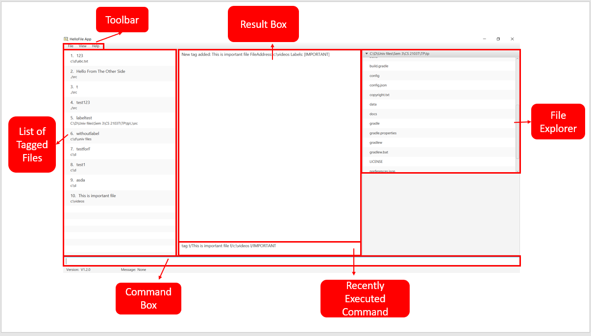

* Table of Contents
{:toc}

## Introduction

HelloFile is a desktop app for managing files, optimised for use via a Command Line Interface (CLI) while still having
the benefits of a Graphical User Interface (GUI). By tagging frequently used files/folders with a short nickname, you
will be able to manage and access your files with ease.

--------------------------------------------------------------------------------------------------------------------

## Getting Started

### Installation
1. Ensure you have [Java 11](https://www.java.com/en/download/) or above installed in your computer. 
2. Download the latest HelloFile.jar [here](https://github.com/AY2021S1-CS2103T-F12-1/tp/releases/tag/v1.2).

### Quick start
1. Move HelloFile.jar to the folder you intend to use as the home folder for HelloFile.
2. Double-click the HelloFile.jar icon to start the application. Alternatively, run the command `java -jar HelloFile.jar` in the command line.
3. Type `help` into the command box, followed by pressing the `Enter` key to view the supported features. Alternatively, click the help button in the menu bar to access our webpage.

### User Interface

### Basic workflow
1. Tag important files with the `tag` command for ease of access.
2. When trying to access tagged files, instead of navigating to the file location, simply use the `open` command to access the required files.
3. To find the location of tagged files, use the `show` command to get the file path of the file.
4. To exit the application, either close the application window, or use the `exit` command.

--------------------------------------------------------------------------------------------------------------------

## Features

**:information_source: Notes about the command format:** 

* Words in `UPPER_CASE` are the parameters to be supplied by you. 
  e.g. in `add t/TAG`, `TAG` is a parameter, such as in the case `add t/Myfile`.

* Items in square brackets are optional. 
  e.g `t/TAG [f/FILE_PATH]` can be used as `t/Myfile f/C:\Users` or as `t/Myfile`.

* Parameters can be in any order. 
  e.g. if the command specify `t/TAG f/FILE_PATH`, `f/FILE_PATH t/TAG` is also an acceptable command.

* Every tag name must be unique, but a file can have multiple tags.

* Every tag name is case-sensitive. e.g tag name `notes` is different from tag name `Notes`.

* Only the `cd` and `tag` command accepts relative file path, all other commands require absolute file path.

### Viewing help : `help`

Displays help for all/certain commands.

Format: (All command) `help` or (Certain command) `help COMMAND`

Examples : 
* `help` (Shows all command and its format)
* `help tag` (shows tag command description, format and examples usage)

### Adding a tag with filepath : `tag`

Tags a file with a unique tag name.

Format: `tag t/TAG_NAME f/FILE_PATH [l/LABEL]...`

Examples:
* `tag t/Users f/C:\Users` (Adds a tag with tag name `Users`,absolute file path `C:\Users`, and no label)
* `tag t/Users f/C:\Users l/Important` (Adds a tag with tag name `Users`, absolute file path `C:\Users`, and label name `Important`)
* `tag t/Users f/.\Users` (Adds a tag with tag name `Users`, relative file path `Users`, and no label)
* `tag t/Users f/.\Users l/folder l/readonly` (Adds a tag with tag name `Users`, relative file path `Users`, and multiple lables
with label name `folder` and `readonly`)

### Displaying information of a tagged file : `show`

Displays the information of the tagged file.

Format: `show t/TAG_NAME`

Examples:
* `show t/my_research` (show you the details of a tag name `my_research`)
* `show t/file2020` (show you the details of a tag name `file2020`)

### Accessing a tagged file : `open`

Opens the file specified by the unique tag name.

Format: `open t/TAG_NAME` or `open l/LABEL`

Examples:
* `open t/my_research` (open the file with tag name `my_research`)
* `open l/notes` (open all the files with label `notes`)

### Removing a tag : `untag`

Removes the tag from the list of tags.

Format: `untag t/TAG_NAME`

Examples:
* `untag t/notes` (delete tag with tag name `notes`)
* `untag t/secret_file` (delete tag with tag name `secret_file`)

### Renaming a tag : `retag`

Renames a tag.

Format: `retag o/OLD_TAG_NAME t/NEW_TAG_NAME`

Examples:
* `retag o/notes t/secret` (Rename an old tag name `notes` to new tag name `secret`)
* `retag o/examfiles t/oldexamfiles` (Rename an old tag name `examfiles` to new tag name `oldexamfiles`)

### Adding a label to a tag : `label`

Adds one or more label to an existing tag. Duplicated labels will only be added once. 

Format: `label t/TAG_NAME l/LABEL1 [l/LABEL2]...`

Examples:
* `label t/file1 l/important` (Add a label of tag name `file1` with label name `important`) 
* `label t/file2 l/important l/exam` (Add a label of tag name `file2` with multiple labels of label name `important` and `exam`)

### Deleting multiple labels from a tag : `unlabel`

Delete one or more label from a tag.

Format: ` unlabel t/TAG_NAME l/LABEL1 [l/LABEL2]...`

Examples:
* `unlabel t/notes l/secret` (Deletes a label of label name `secret` that has tag name `notes`)
* `unlabel t/file1 l/important l/exams` (Deletes labels of label name `important` and `exams` from tag name `file1`)

### Finding a tag : `find`

Finds a tag by its keyword (can be tag name and/or label).

Format: `find KEYWORD`
        
Examples:
* `find file1` (finds a tag with tag name `file1`)
* `find label2020` (finds a tag with label name `label2020`)    
* `find tagname1 label1` (finds a tag name `tagname1` and label name `label1`)
* `find he` (finds a tag with tag name contains `he` or label name contains `he`)
 

### Changing current directory : `cd`

Changes the current directory of the HelloFile internal File Explorer.

Format 1: `cd f/ABSOLUTE_FILE_PATH`

Format 2: `cd ./RELATIVE_FILE_PATH`

Format 3: `cd ../`

Examples:
* `cd f/C:\Users` (Changes the current directory to `C:\Users`)
* `cd ./tp` (Changes the current directory to the child directory `tp`)
* `cd ../` (Changes the current directory to the parent directory)

### Listing all tags : `ls`

Lists all managed tags.

Format: `ls`

### Undoing command : `undo`

Undo a recently executed command. Note that, there are some command that can't be undo. 
Those commands include: `ls`,`show`,`exit`,`undo`,`redo`, `help`, `find`, `open` and `cd`

Format: `undo`

### Redoing command : `redo`

Redo a recently executed command. Redo only exists when undo has been executed.  Note that, there are some command that can't be redo.
Those commands include: `ls`,`show`,`exit`,`undo`,`redo`, `help`, `find`, `open` and `cd`

Format: `redo`

### Clearing all tags : `clear`

Clears the list of all tags.
**Warning: All tags will be deleted!**

Format: `clear`

### Exiting the application : `exit`

Exits the application.

Format: `exit`

--------------------------------------------------------------------------------------------------------------------

## FAQ
**Q**: What if the name or the directory of the file I tagged is changed? Can I still access the file using HelloFile? 
**A**: No. HelloFile is currently unable to track a file if its name or directory is changed. You will need to delete the old tag and retag the file.

**Q**: What is the structure of the application? 
**A**: You can find it in the Developer Guide [here](https://github.com/AY2021S1-CS2103T-F12-1/tp/blob/master/docs/DeveloperGuide.md)

**Q**: How do I report a bug? 
**A**: Please create a new issue on [this](https://github.com/AY2021S1-CS2103T-F12-1/tp/issues) webpage.

**Q**: Can I contribute to the project? 
**A**: Sorry, as this is a school project, we are not accepting any contributors at this period.

--------------------------------------------------------------------------------------------------------------------

## Command summary

Action | Format, Examples
--------|------------------
**Tag** | `tag t/TAG_NAME f/FILE_PATH , [l/LABEL]`   e.g., `tag t/newTag f/c:/myfolder/file.jpg l/MyFile` or `tag t/newTag f/c:/myfolder/file.jpg` 
**Show** | `show t/TAG_NAME`
**Untag** | `untag t/TAG_NAME`
**Retag** | `retag o/OLD_TAG_NAME t/NEW_TAG_NAME`   e.g., `retag o/mytag t/newtag`
**Find** | `find KEYWORD`   e.g., `find newtag` or  `find newlabel`
**Open** | `open t/TAG_NAME` or `open l/LABEL`   e.g., `open t/newTag` or `open l/newlabel`
**Label** | `label t/TAG_NAME l/LABEL1 [l/LABEL2...]`   e.g., `label t/newtag l/new` or `label t/myFile l/important l/exclusive`
**Unlabel** | `unlabel t/TAG_NAME l/LABEL1 [l/LABEL2...]`   e.g., `unlabel t/newtag l/new` or `unlabel t/myFile l/important l/exclusive`
**List** | `ls`
**Cd to an absolute file Path**| `cd f/ABSOLUTE_FILE_PATH`   e.g., `cd f/C:\Users`
**Cd to a relative file Path**| `cd ./RELATIVE_FILE_PATH`   e.g., `cd ./project01`
**Cd to the parent file Path**| `cd ../`
**Undo** | `undo`
**Redo** | `redo`
**Clear** | `clear`
**Help** | `help` or `help COMMAND`   e.g., `help tag`
**Exit** | `exit`
