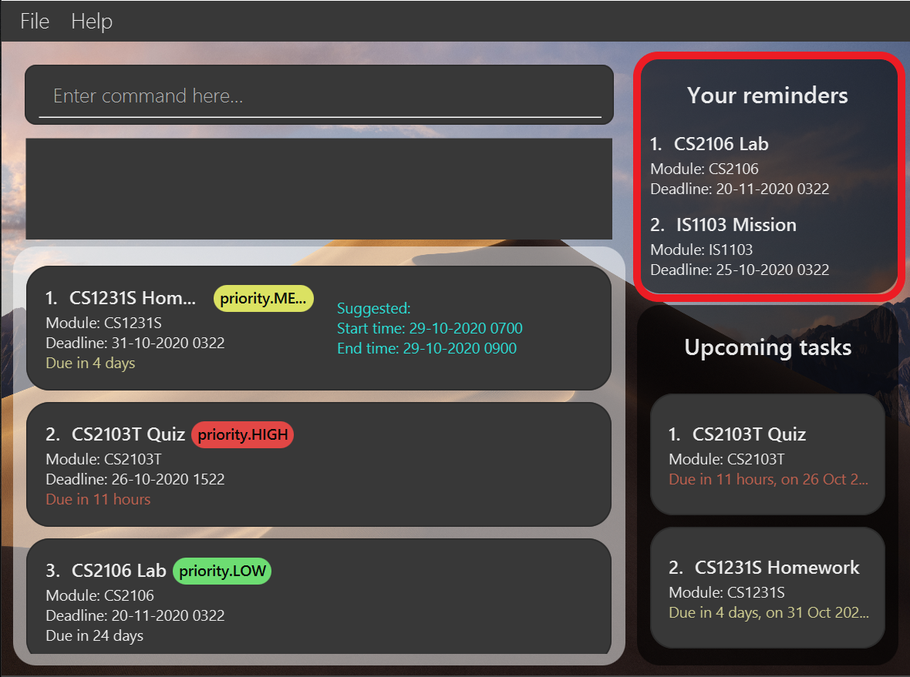

## Introduction
Welcome to ProductiveNUS User Guide! :blue_book:

**ProductiveNUS is a desktop application** made for you, **a School of Computing (SoC) student in National University of Singapore (NUS)**, to **manage and schedule your academic tasks more effectively**. It makes use of a **Graphical User Interface (GUI)**, which provides you with an intuitive interface and immediate visual feedback. ProductiveNUS uses a **Command Line Interface (CLI)**; this means that you operate the application by typing commands into a [Command line](#gui-terminologies). If you are fast at typing, you can manage your academic tasks more efficiently.

As a **student from the SoC in NUS**, you tend to have a **heavy workload**. ProductiveNUS helps **improve your productivity** by **enhancing your organisational skills**. Apart from simply **keeping track of your tasks**, ProductiveNUS is capable of **scheduling** them for you so you will never **miss any deadlines**. ProductiveNUS is also compatible with NUSMods, meaning all your **timetable information can be imported easily** into the application so all your academic tasks can be found in just one application.

--------------------------------------------------------------------------------------------------------------------

## Table of Contents

* Table of Contents
{:toc}

--------------------------------------------------------------------------------------------------------------------

## About
This user guide provides you with the necessary information on how to become an expert user of ProductiveNUS. 
Before moving on to the next section, [Getting started](#getting-started), you can familiarize yourself with the terminologies, syntax and icons used in this user guide by reading the following sub-sections.  

### GUI terminologies
The figure below shows the GUI of ProductiveNUS, with its components labelled. 

### Icon usages
Wondering what each icon is used for? You can refer to the table below to find out.

| Icon        | Icon usage                                               | Box color |
|-------------|----------------------------------------------------------|-----------|
| :clipboard: | - Notes about the command format   - Pointers to note | Green     |
| :bulb:      | - Tip                                                    | Blue      |

### Command syntax and terminologies

All commands and their examples are demarcated with `markups`. `Markups` appear as a grey box as shown.

You can find out more about the command terminologies here:

* Prefix: An indicator to identify your input.

--------------------------------------------------------------------------------------------------------------------

## Getting started

1. Ensure you have Java `11` or above installed in your Computer.

1. Download the latest `productivenus.jar` from [here](https://github.com/AY2021S1-CS2103T-F11-3/tp/releases).

1. Copy the file to the folder you want to use as the _home folder_ for ProductiveNUS.

1. Double-click the file to start the app. The GUI similar to the below should appear in a few seconds. Note how the app contains some sample data. 

   

1. Refer to the [Features](#features) below for details of each command.

--------------------------------------------------------------------------------------------------------------------

## Features

**:clipboard: Notes about the command format:** 

* Words in `UPPER_CASE` are the parameters to be supplied by you. 
  e.g. in `add n/NAME_OF_ASSIGNMENT`, `NAME_OF_ASSIGNMENT` is a parameter which can be used as `add n/Assignment 2`.

* Items in square brackets are optional. 
  e.g `n/NAME_OF_ASSIGNMENT [mod/MODULE_CODE]` can be used as `n/Assignment 2 mod/CS2100` or as `n/Assignment 2`.

* Parameters can be in any order. 
  e.g. if the command specifies `n/NAME_OF_ASSIGNMENT d/DEADLINE`, `d/DEADLINE n/NAME_OF_ASSIGNMENT` is also acceptable.
  
* All instances of `INDEX` **must be a positive integer**. 
  e.g. 1, 2, 3, …​

### Adding an assignment: `add`

Format: `add n/NAME_OF_ASSIGNMENT d/DEADLINE_OF_ASSIGNMENT TIME_ASSIGNMENT_IS_DUE mod/MODULE​[priority/PRIORITY] 
[remind]`

You can add your assignments into your schedule so that you can manage all your assignments and
 academic tasks conveniently. 

**:bulb: Tip:**
You can include `remind` when adding an assignment instead of using the `remind` command to set reminders after adding an assignment.

For example, to add a lab report assignment that is **due** on 23th April 2020 12.30pm and **associated** with the module CS2100, you can 
simply enter `add n/Lab report d/23-04-2020 1230 mod/CS2100`.

**:bulb: Tip:**
If the lab report assignment is of **high priority**, you can enter `add n/Lab report d/23-04-2020 1230 mod/CS2100 p/HIGH`

 

Examples:
* `add n/Lab report d/23-04-2020 1230 mod/CS2100 remind`
* `add n/Lab report d/30-04-2020 1230 mod/CS2100 remind p/LOW`

### Deleting assignments : `delete`

Format: `delete INDEX [MORE_INDEXES]`

You can delete assignments from your assignment list by specifying the assignment `INDEX` as shown in your list.

You can delete **one or more** assignments at a time. Here is an example with steps to follow:

1) To delete assignments with the name "Statistics tutorial" and "Biology lab report" as shown in the figure below, you can simply enter `delete 1 3` into the command line as per their indexes that are circled and labelled in the figure.

DIAGRAM

2) The two assignments are no longer displayed and are successfully deleted from your assignment list. 
3) A "Deleted assignments" message that includes the information of your deleted assignments will be displayed in the Command Box.

DIAGRAM

More examples:
* `delete 1`
* `delete 2 3 1`

 **:clipboard: Pointers to note:** 
* At least one index must be **present**. For example, `delete` without any index will not work.
* The indexes **must be a positive integer** 1, 2, 3, …​
* The indexes **must be found in your assignment list**.
* The indexes **must not be duplicated**. For example, `delete 3 3` will not work.

### Importing your timetable : `import`

Imports your NUSMods timetable data into your schedule.

Format: `import url/YOUR_NUSMODS_URL`

* Lesson data based on your NUSMods timetable will be added into your schedule.
* `YOUR_NUSMODS_URL` is obtained by clicking on the "Share/Sync" timetable icon at the NUSMods website.

Examples:
* `import url/https://nusmods.com/timetable/sem-1/share?CS2100=TUT:01,LAB:11,LEC:1&CS2101=&CS2103T=LEC:G16&CS2105=TUT:14,LEC:1&EC1301=TUT:S28,LEC:1&IS1103=` will 

### Listing assignments : `list`

Format: `list [NUMBER_OF_DAYS]`

You can list all your assignments with `list`. Alternatively, you can type `list` followed by an index `NUMBER_OF_DAYS` to list your assignments with deadlines that fall within the current date (and time) and `NUMBER_OF_DAYS` later (in number of hours).

The `NUMBER_OF_DAYS` in hours is multiplied by 24.

For example, `list 3` lists all your assignments that are due within 3 days (72 hours) from the current date (and current time). If the current date and time is 24/10/2020 12:00 pm, all assignments due from this date and time to 27/10/2020 12:00PM will be displayed.

DIAGRAM

**:bulb: Tip:**
You can use this `NUMBER_OF_DAYS` index to quickly view assignments that you need to complete soon!

More examples: 
- `list`
- `list 7`
 

 **:clipboard: Pointers to note:** 
* `NUMBER_OF_DAYS` **must be a positive integer** 1, 2, 3, …​
* **Only one** number can be keyed in. For example, `list 1 2` will not work. 

### Finding assignments : `find`

Format: `find PREFIX/ KEYWORD [MORE_KEYWORDS]`

You can find your assignments based on keywords you enter. The types of keywords are the name, module code, deadline and priority of assignments. 

Here is the table of prefixes used:
| Prefix | Syntax                                                          | Examples                             | Remarks                                                                                                                                                                                                                                        |
|--------|-----------------------------------------------------------------|--------------------------------------|------------------------------------------------------------------------------------------------------------------------------------------------------------------------------------------------------------------------------------------------|
| n/     | n/NAME_OF_ASSIGNMENT  [MORE NAME_OF_ASSIGNMENT]                 | n/Tutorial n/tutorial essay          | Case insensitive                                                                                                                                                                                                                               |
| mod/   | mod/MODULE_CODE  [MORE MODULE_CODE]                             | mod/ST2334 mod/CS2100 cs2103t        | Case insensitive                                                                                                                                                                                                                               |
| d/     | d/DATE_OR_TIME_OF_ASSIGNMENT  [MORE DATE_OR_TIME_OF_ASSIGNMENT] | d/24-10-2020 d/1200d/1300 25-11-2020 | Date keywords are irrespective of time  and time keywords are irrespective of date. For example, `find d/1300 25-11-2020` will list assignments with due date of 25-11-2020 (regardless of time) or with due time of 1300 (regardless of date).  |
| p/     | p/PRIORITY_OF_ASSIGNMENT  [MORE PRIORITY_OF_ASSIGNMENT]         | p/high p/LOW                         | Case insensitive                                                                                                                                                                                                                               |

Here is an example with steps to follow:
1) To find assignments from the modules CS2100 and ST2334, you can simply key in `find mod/CS2100 ST2334`. 

DIAGRAM

2) Assignments from the modules CS2100 and ST2334 will appear in the assignment list.
3) A "listed your assignments" message will be displayed in the command box.

DIAGRAM

 **:clipboard: Pointers to note:** 
* `DATE_OR_TIME_OF_ASSIGNMENT` must have dates in the format **dd-MM-yyyy** or times in the format **HHmm** (24 hour).
* You can only **find assignments with keywords of the same prefix**. For example, `find n/Assignment d/23-10-2020` will not work.

### Setting reminders for assignments : `remind`

Format: `remind INDEX [MORE_INDEXES]`

You can set reminders for specific assignments which will be displayed in `Your Reminders` (Highlighted in red in the figure below) for your easy referral.

   
   *Figure 1: `Your Reminders` highlighted in red*

You can use the `INDEX` of the assignment as shown in your assignment list to set reminders for that assignment. 

For example, `remind 1` will set reminders for the first assignment in your assignment list ("CS1231S Homework" as shown in the figure below) and adds it to `Your Reminders`.

      ---------------------------Figure of GUI with CS1231S Homework (Highlighted red) added into Your Reminders----------------------------

You can set reminders for **more than one** assignments at a time as well. 

For example, `remind 2 4` will set reminders for the second and fourth assignment in your assignment list and adds both assignments to `Your Reminders`.

      ---------------------------Figure of GUI with second and fourth assignment (Highlighted red) added into Your Reminders----------------------------

  
**:clipboard: Pointers to note:** 
* At least one `INDEX` must be present. For example, `remind` will not work.
* `INDEX` **must be a positive integer** 1, 2, 3, …​
* The `INDEX` must be found in your assignment list.

### Removing reminders for assignments : `unremind`

Format: `unremind INDEX`

You can remove your reminded assignments from `Your Reminders` by specifying the `INDEX` of the assignment as shown in your **reminded assignments list**. 

For example, `unremind 1` will remove the first assignment in `Your Reminders` ("CS2106 Lab" as shown in the figure below).

      ---------------------------------Figure of GUI before CS2106 Lab is removed from Your Reminders---------------------------------

      ---------------------------------Figure of GUI after CS2106 Lab is removed from Your Reminders----------------------------------

  
**:clipboard: Pointers to note:** 
* At least one `INDEX` must be present. For example, `unremind` will not work.
* `INDEX` **must be a positive integer** 1, 2, 3, …​
* The `INDEX` must be found in `Your Reminders`.

### Setting priority for assignments : `prioritize`

Sets a priority for the specified assignment.

Format: `prioritize INDEX priority/PRIORITY`

* Sets the priority to the assignment at the specified `INDEX`.
* Priority levels include LOW, MEDIUM and HIGH.
* The index refers to the index number shown in the displayed assignment list.
* The index **must be a positive integer** 1, 2, 3, …​
* If the assignment already has a priority tag, this command will replace the previous priority tag with the new one.

### Removing priority for assignments : `unprioritize`

Removes a priority for the specified assignment.

Format: `unprioritze INDEX`

* Removes the priority of the assignment at the specified `INDEX`.
* The index refers to the index number shown in the displayed assignment list.
* The index **must be a positive integer** 1, 2, 3, …​

### Marking assignments as done : `done`

Format: `done INDEX [MORE_INDEXES]`

You can keep track of your uncompleted assignments by marking assignments that you've completed as done.

You can mark **one or more** assignments as done by specifiying the assignment(s) `INDEX` as shown in your list. Here is
an example with steps to follow:

1) To mark assignments with the name "" and "" shown in the figure below as done, you can simply enter `done 2 3` into
the command line based on the indexes circled and labelled in the figure.

DIAGRAM

2) The two assignments will be marked as done and each assignment will have a green tick displayed as circled in the figure. 

DIAGRAM

3) A message that includes the information of the assignments marked as done will be displayed in the Command Box.

DIAGRAM

 **:clipboard: Pointers to note:** 
* At least one index must be present. For example, `done` without any index will not work.
* The indexes **must be a positive integer** 1, 2, 3, …​
* The indexes **must be found in your assignment list**
* The indexes **must not be duplicated**. For example, `done 4 4` will not work.

### Marking assignments as not done : `undone`

Format: `undone INDEX`

You can unmark assignments that you have previously marked as done by specifying the assignment `INDEX` as shown in your
 list.

You can unmark `one` done assignment at a time. Here is an example with steps to follow:

1) If you have accidentally marked the assignment with the name " " as done,
you can simply enter `undone X` into the command line based on the index circled in the figure.

DIAGRAM

2) The green tick associated to the assignment is no longer displayed as shown in the diagram below.

DIAGRAM

3) A message that includes the information of your assignment marked as undone will be displayed in the Command Box.

DIAGRAM 

 **:clipboard: Pointers to note:** 
* Assignments are marked as not done**by default**
* The index must be present. For example, `undone` without any index will not work.
* The index **must be a positive integer** 1, 2, 3, …​
* The index **must be found in your assignment list**

### Clearing all assignments: `clear`

Format: `clear`

You can clear all your existing assignments and lessons at the start of every semester.

**:bulb: Tip:**
If you cleared all your assignments and lessons by accident, use `undo` to retrieve your deleted data.

### Exiting the program : `exit`

Exits the program.

Format: `exit`

### Saving the data

ProductiveNUS data are saved in the hard disk automatically after any command that changes the data. There is no need to save manually.

--------------------------------------------------------------------------------------------------------------------

## Command summary

| Action | Format | Examples |
|-|-|-|
| **add** | `add n/NAME_OF_ASSIGNMENT d/DEADLINE_OF_ASSIGNMENT TIME_ASSIGNMENT_IS_DUE mod/MODULE [remind]` | `add n/Math tutorial d/21-03-2020 1100 mod/ST2334` |
| **delete** | `delete INDEX [MORE_INDEXES]` | `delete 3` `delete 2 3 4` |
| **import** | `import url/NUSMODS_URL` | `import url/https://nusmods.com/timetable/sem-2/share?CS2108=LEC:1` |
| **list** | `list [NUMBER_OF_DAYS]` | `list 2` `list` |
| **find** | `find PREFIX/ KEYWORD [MORE_KEYWORD]` | `find mod/CS2103T CS2100` `find p/HIGH` |
| **remind** | `remind INDEX [MORE_INDEXES]` | `remind 5` `remind 2 4 5` |
| **unremind** | `unremind INDEX` | `unremind 2` |
| **prioritize** | `prioritize INDEX p/PRIORITY` | `prioritize 3 p/HIGH` `prioritize 1 p/LOW` |
| **unprioritize** | `unprioritize INDEX` | `unprioritize 1` |
| **done** | `done INDEX` | `done 4` |
| **undone** | `undone INDEX` | `undone 2` |
| **help** | `help` | `help` |
| **exit** | `exit` | `exit` |

--------------------------------------------------------------------------------------------------------------------

## FAQ

**Q**: How do I transfer my data to another Computer? 
**A**: 
1. Install the app in your other computer and start the app.
2. Notice that a data file named `addressbook.json` is created under the `/data` folder.
3. Close the app in your other computer.
4. Overwrite the newly created data file with the data file from your previous computer.
5. All your existing data has been successfully transferred!

**Q**: I am not free during the time that my assignment has been scheduled. How do I reschedule? 
**A**:
You can reschedule by using the schedule command on that assignment again.

1. Find out the index of the assignment that you want to reschedule.

DIAGRAM

2. Type the schedule command with the correct index into the command box .

DIAGRAM

**:bulb: Tip:**
You can copy the entire command if you intend to reschedule the assignment more than once. 
You can paste the command into the command box after step 3 and repeat step 2-3 until you have obtain your
 ideal schedule.

3. Press ENTER to reschedule your assignment.

DIAGRAM

**Q**: I double-clicked the productivenus.jar file but the app is not starting. What should I do?
**A**: 
*For Windows Users:*
1. Go to the folder where you have downloaded and saved the productivenus.jar file.
2. Copy the file directory of the folder. The file directory is labelled in the diagram below.
DIAGRAM
3. Open your command interpreter. To do so, press the Windows key on your keyboard, type in `cmd` and press ENTER.
4. Your command interpreter will start, and the command interpreter should look something similar to the diagram below.
 
DIAGRAM
4. In the command interpreter, type `cd ` and paste the file directory that you have copied in step 2.
 For example, `cd C:\Desktop\ProductiveNUS`.
5. Press ENTER and the file directory will be shown in the command interpreter.
 
DIAGRAM
6. Finally, type `java -jar productivenus.jar` and press ENTER to start the app.
